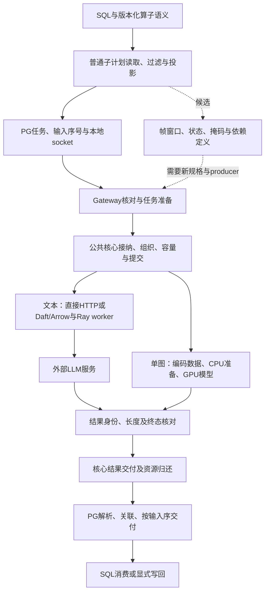

# 优化方法依据

本文集中维护策略选择的文献依据、反证条件和最小实验的设计流程；实施顺序在[现行计划](../../experiments/plans/README.md)，实际接口在[代码说明](../../code/README.md)，实验事实在[结果台账](../../experiments/results/EXPERIMENT_EVIDENCE_REGISTRY.md)。

原材料按其日期与来源解释；候选机制不等于实现或有效结论，本文也不授予模型运行权限。

- [数据执行与模型服务协同候选](#serving-cooperation-candidates)
- [多粒度组织与链路准入的补充评估](#granularity-admission-assessment)
- [策略选择与反证](#basis)
- [从文献到最小实验](#workflow)

<a id="serving-cooperation-candidates"></a>
## 数据执行与模型服务协同候选（2026-10-02）

研究对象为 **PostgreSQL 内置 AI 语义算子的外部分布式物理执行与调度优化**。
原分析依据 main `b790bfe9`；2026-10-03 的补充评估再核对 main `88173f85` 的源码和一手资料。
本节整理研究假设与反证条件，
候选均待验证，工程完成度仍由[代码状态](../../code/INFRA_STATUS.md)维护。
实施安排沿[查询调优](../../experiments/plans/查询调优.md)与[数据组织](../../experiments/plans/数据组织.md#design-hypotheses)，
本节不替代运行清单、资源校准或模型请求授权。

### 就绪准备窗口的有时限聚合（2026-10-03）

来源为main `7cbc888c`源码、已有负结果与本地受控复现。准备窗口一经截取便创建独立Daft图；
逐行完成与重新供给可能把后续输入切成很小的窗口。减少持久事务不保证减少准备次数，两项成本必须一起看。
候选在同Job还有等待交付的已发出调用时，对已接纳但不足一批的行给予短暂等待；首批、满批、不同Job、字节条件或等待期限均及时推进。
这减少的是可能的重复准备，不改变每行完整请求，也不能从客户端在途计数推断GPU正在计算。

论文[*The Streaming Batch Model for Efficient and Fault-Tolerant Heterogeneous Execution*](https://arxiv.org/html/2501.12407v5)
以动态分区和流式推进兼顾控制成本、流水与内存；[Ray官方调优说明](https://docs.ray.io/en/latest/data/performance-tips.html#handling-too-small-blocks)
说明过小块会增加调度成本，并列出行数/字节聚合等已有做法。它们支持需要比较粒度取舍，不证明本项目等待策略的新颖性或效果。
[Daft DataFrame接口说明](https://docs.daft.ai/en/stable/api/dataframe/)说明`into_batches`尽力分批与`to_arrow_iter`结果缓冲的吞吐/留存取舍；
文档查看时的版本不作为部署0.7.21的接口承诺，实际接口仍由已测源码和目标环境核对。

该机制标为工程尝试。固定同样的请求/字节/对象容量，比较原即时窗口、已有Arrow方式及显式有时限聚合，
观察完整完成时间、首行、准备次数与资源归还。若只减少窗口而完整时间更差，或稀疏尾批代价超过节省，就保留即时默认。
当前本地复现使用模拟数据批与外部调用，Daft/PG/GPU净收益待匹配验证；实施与停止条件见[查询调优](../../experiments/plans/查询调优.md#就绪窗口聚合的本地尝试2026-10-03)。

已有[本地原型与反例](../../experiments/results/diagnostics/ready_window_coalescing_20261003/README.md)：减少准备次数仍可能更慢，候选仅以源码补丁保存，未并入运行代码。
从成本上，需要比较少建窗口省下的关键路径时间，与等待、额外唤醒及供给缺口新增的时间；各阶段存在重叠，不能直接累加总时长。
实际库的小窗口成本及无等待的单／双Job对照见[服务器诊断](../../experiments/results/diagnostics/map_preparation_shape_20261004/README.md)。
该结果补充重复准备与供给形态证据；等待收益仍由同容量完整结果决定，不从文献或窗口计数推导推荐毫秒值。
[选取前队列补充](../../experiments/results/diagnostics/map_preparation_shape_20261004/README.md#ready-queue-snapshots)显示该有限CPU签名中同Job零等待合并机会少。
当前不开发这一重排；准备时机和独立ready字节管理另按现有阶段机制核对，不把逻辑在途名额当模型正在运行。

### 1. 数据执行能够改变什么

在相同算子语义、模型和生成要求下，执行组织可能从四处获得收益：减少相容前缀或确定性准备的重复计算，
减少准备/传输/提交造成的供给空隙，改变同时到达服务的资源需求组合，以及提前查询的最后结果交付。
完整查询取决于有依赖执行的关键路径；各阶段累计时间存在重叠，不能直接相加。
若服务已经充分供给、没有可复用工作且收尾次序不受影响，新组织成本可能抵消收益。

数据库决定合法输入、instruction（算子指令）、模型/生成及解析与查询生命周期；SemLoom 选择数据组织、
提交、路由与共享容量中的任务；模型服务负责内部批处理和 GPU（模型计算设备）执行。
每行保持完整独立请求，工作量组织不授权拼接或拆分提示词。
服务所需的数据表示、token 输入或缓存接口必须实际存在，不能从外部 actor 或容量记账推导出来。

### 2. 已有依据及其适用范围

[四路径比较](../../experiments/results/postgresql/text_map_four_path_comparison_20260930/README.md)与
[gateway 复用对照](../../experiments/results/postgresql/text_map_gateway_lifecycle_20261001/README.md)
来自不同运行，不能拼成新的原生 Daft/Ray 排名；输出差异和全部重复值继续按原报告解释。
最近 gateway 对照是 Movie 二值标签任务，前缀缓存关闭；它主要提供短请求生命周期与主机链路的观察，
尚不足以判定长上下文、长输出和跨算子复用是否有效。
库加载、首批处理与提交等待可由已有阶段事件部分定位；服务内阶段仍需对应观测。
队列接近零或 GPU 利用率单项变化不能独立确定原因，聚合服务时间也不能冒充逐行时间。

| 源码事实及入口 | 对候选设计的含义 |
|---|---|
| [Map 组织](../../code/src/execution_provider/adapters/map_organization.py)已有按行数、work（估计处理量）和长度的模式；本接线以输入 token 加最大输出 token 计量，仍限单 Job（一次数据库任务） | 这些模式是现有对照；输入处理与输出生成的差异化评分、消费进度和多 Job 接线须分别验证 |
| [公共容量记账](../../code/src/scheduling/core/session_capacity.py)已有输入字节、每任务最大结果字节预留及在途请求/work 派生计数 | 结果预留不等于实际内存占用；选择策略须尊重各域额度，并区分计算终态和结果消费 |
| [实例路由](../../code/src/scheduling/endpoint_routing/policies.py)已有最少 work、服务速率估计和按前缀 key 的哈希亲和 | 基础亲和不证明真实 token 前缀匹配或 KV cache（模型注意力键值缓存）驻留；候选需超越这些已有策略 |
| [图像阶段说明](heterogeneous_ai_dataflow_execution_model_20260811.md)已有主机处理器（CPU）准备、typed CLIP 后端和对象引用等静态能力 | 准备表示选择、复用、动态控制与真实 GPU 性能分别核验；不能把已有分阶段能力再次列为新增方法 |

### 3. 候选动作与可以否定它们的结果

下表为推断与待验证假设。任务选择仅作用于合法、尚未提交的工作；总请求/work 容量及结果要求保持可比，
评分预测与保守资源记账分开，预测较短不改变真实生成上限。

| 候选 | 预期改变的实际工作或等待 | 强对照及反证条件 |
|---|---|---|
| 输入处理与输出生成分开估计 | 用未复用输入、输出长度分布、准备成本与缓存风险支持请求选择，减少资源组合失衡或查询收尾 | 先到先服务、简单长度、现有 work 及不依赖预测的策略；估计不改善选择或成本抵消收益时，保留简单策略 |
| 消费进度参与组织与准备深度选择 | 兼顾最早未交付结果、慢任务、未提交工作及结果缓冲，减少首部阻塞或末尾空转 | 同信息 selector（任务选择策略）对照，以及付费获取全局元数据的完整方案；全局/混合净收益更好就采用，不预选有限窗口 |
| 软前缀亲和联合预计等待 | 预计省下的输入处理超过额外排队/组织成本时，偏向相容缓存实例 | 现有哈希亲和、前缀优先、最少 work 与适用原生路由；命中率提高而查询更慢，或真实前缀不足时不采用 |
| 分阶段准备与表示复用 | 重叠 CPU、传输和 GPU 工作，复用同版本确定性准备，选择压缩输入或准备后的表示 | 最强静态流水、原生数据引擎与同 bytes/资源对照；准备数据膨胀增加传输或留存时不能只报告 GPU 等待下降 |
| 依赖与后继消费参与推进 | 合法下游任务可执行时及时推进，减少断供与准备重复，并在后继不再需要时释放表示 | 深度/广度优先、及时下游、前缀优先及适用 Kalypso 复现；当前受限组合不足以证明任意多算子计划收益，真实多阶段需求成立后再立项 |
| 同租户多 Job 的查询进展与路由 | 在固定共享容量内结合可见剩余工作、等待年龄和下游供给分配机会 | 调优静态、work 公平与已有优先级控制；逐查询完成/干扰及最长无服务时间一起评价，不能只以总吞吐判定 |

有限 payload 物化不等于只能使用有限元数据。全局行标识/work 预扫、统计、tokenization（文本转 token）、
排序、额外读取和存储均计入成本；复用另报建造、刷新与摊销条件。
[已有全局信息对照](../../experiments/results/postgresql/capacity_organization_image_validation_20260920/README.md)
属于 PostgreSQL 源实验装配，尚无稳定优势，SemMap 全局预扫仍未接入；该结果不排除更合适负载上的全局方案。
全扫描、按序交付与 LIMIT 的合法求值要求分别保持，不能用全扫描重排权限扩展严格按需执行。

### 4. 最近邻如何收窄候选

[Sema: A High-performance System for LLM-based Semantic Query Processing](https://arxiv.org/html/2603.11622v1)
已有数据库流水和并发模型调用；
[IMLane: Composable Framework for Efficient AI Function Execution in Database Engine](https://www.vldb.org/pvldb/vol19/p4223-xu.pdf)
已有资源驱动的异步批提交；
[Kalypso: Relational LLM Serving](https://arxiv.org/html/2607.23815v2)
已有跨算子推进、父子内存记账和阶段预算，默认 virtual pinning（尽力保留缓存）不要求显式 pin 接口。
普通异步组批、及时下游或不修改服务引擎均不足以区分新增方法。

[BlendServe: Optimizing Offline Inference with Resource-Aware Batching](https://arxiv.org/html/2411.16102v2)
已联合研究资源需求与前缀复用，使用专门的调度/执行后端；外部 HTTP（网络请求协议）次序不能直接照搬其 GPU 重叠收益。
[Optimizing LLM Queries in Relational Data Analytics Workloads](https://proceedings.mlsys.org/paper_files/paper/2025/hash/b5dc49f44db2fadc5c4d717c57f4a424-Abstract-Conference.html)
已研究全局关系信息与行/字段重排；字段或提示词变换须独立定义语义和质量要求。
[Scheduling LLM Inference with Uncertainty-Aware Output Length Predictions](https://proceedings.mlr.press/v306/zheng26ae.html)
已处理输出长度分布与长尾风险，因此长度估计应以决策增量评价。
题录、阅读状态和更详细条件沿[文献清单](ai_operator_literature_inventory.md)及
[迁移条件卡](研究定位.md#execution-transfer-cards)维护，不把未运行的论文复现命名为原生 baseline。

[vLLM 自动前缀缓存](https://docs.vllm.ai/en/stable/features/automatic_prefix_caching/)主要省输入处理，
不省必须生成的新 token；[Ray 前缀感知路由](https://docs.ray.io/en/latest/serve/llm/user-guides/prefix-aware-routing.html)
已有亲和与负载回退。普通容量记账不保证缓存驻留，同一文档经不同指令也不必具有相同前缀。
外部提交是否改变真实执行组合、实际避免多少输入处理，均需部署观测支持。

### 5. 适合区分机制的负载与采用条件

短标签保留为组织开销对照；长输入短输出检验输入处理与复用机会，长输出或合法混合分布检验资源组合和收尾，
真实 Filter→Map 再检验依赖与断供。选择率和分布按任务来源确定，不根据优化臂的有利结果筛选。
原生 Daft/Ray 拥有自己的执行调度；同消息、模型/生成、质量要求、服务配置及可比实际容量下独立校准。
平台与信息对照按现行计划执行，不因本节新增一套矩阵或自动恢复既往额度。

主要判断完整 SQL 完成时间，同时记录首行、准备/传输/提交空隙、计算完成至消费、结果留存和质量。
缓存命中、局部时间或请求吞吐改善而完整查询变慢时，候选不采用；强静态已足够时保留强静态。
fixture（确定性替身）与模拟只解释声明的行为和模型，不证明真实 GPU 收益。

### 6. 训练供给作为后续适用问题

推理侧机制得到支持后，可另行研究 SQL 投影/筛选后样本读取、确定性准备复用、预取和训练步等待。
样本采样、随机变换、epoch（完整遍历一轮样本）、分片及训练进程接口尚未实现；梯度、优化器与内部通信仍属训练系统。
[tf.data: A Machine Learning Data Processing Framework](https://research.google/pubs/tfdata-a-machine-learning-data-processing-framework/)
与 [The Streaming Batch Model for Efficient and Fault-Tolerant Heterogeneous Execution](https://arxiv.org/html/2501.12407v5)
已覆盖相近训练流水与异构准备。此处是适用条件讨论，不增加第三项研究内容或首版训练实验。

<a id="granularity-admission-assessment"></a>
### 7. 多粒度组织与链路准入的补充评估（2026-10-03）

**评估结论：条件性采用。** “多粒度组织＋准备、提交和消费的联合准入”可以作为两项研究内容的具体联合问题，
但当前代码已有部分机制，已有结果也未证明联合控制优于强静态。研究增量应是选择这些动作带来的净收益，
不是再建立分批、背压或服务反馈模块。具体对照归[数据组织方案](../../experiments/plans/数据组织.md#granularity-admission-controls)。

#### 7.1 已经解耦的粒度与仍需比较的代价

[RayMapTransport](../../code/src/execution_provider/adapters/ray_map_transport.py)将数据块放入 Ray 后，
对各行分别创建异步操作，通过块引用和行索引访问完整请求；每行有独立完成结果。
块的底层缓冲等全部相关行结果已确认后才释放，未确认远端执行继续保留计费。
因此“粗数据块、细行请求”已有实现，不能把整组结果屏障当作当前 Map 的事实或故意加入弱对照。
逐行远端完成、数据块释放和数据库按序消费仍是不同事件。

第一性原理上的取舍是：大块可能减少对象数和搬运调度，却被慢行延长驻留；细请求可能更早补位，
却增加远程调用成本，并让按序返回前的结果积压更快增长。
应在已有逐行完成机制下比较块大小、准备深度和工作分组，记录真实底层缓冲与各域驻留面积。
Arrow 切片或引用不保证整条网络路径零复制；一个小视图仍可能保留大块全部缓冲，不能按视图行数虚减记账。
单行 HTTP 请求数、对象传输次数及真正避免的模型输入处理分别计算。

#### 7.2 联合准入复用现有责任，反馈只改变合法动作

[SessionLimits](../../code/src/scheduling/core/session_contract.py)与
[SessionCapacity](../../code/src/scheduling/core/session_capacity.py)已有任务、输入/结果字节、
在途请求与 work 上限；传输还有独立对象字节计费。新增问题是准备深度和任务选择怎样使用这些责任与消费反馈，
不复制一套可独立结算的总账。结果上界预留、实际结果、转换暂存和模型缓存分别说明，不能合称一个内存值。
当前 Map 返回 SQL 结果；持久写回变慢的情景须在显式 sink（结果存储端）中另验，不能当作当前默认路径已发生的损失。

在固定总容量及离线确定的动作集合内，可比较继续准备、延迟新的物化、提交哪个就绪任务等动作。
已有全量 payload（任务内容）再排队不代表省掉准备；要证明节省，动作必须发生在相应读取/编码/构造之前。
当前[Map 任务准备](../../code/src/execution_provider/adapters/incremental_execution.py)在 offer（提交候选）前已形成完整 JSON 请求，
组织器看见的是已准备任务；向前选择需要对应 producer（任务提供方）或方法阶段的合法信息，尚未接入该 Map 路径。
数据库快照、权限、严格按需求值及取消规则保持，不能为了获取元数据提前执行所有行。

KV 占用高不单独表示拥塞。反馈须记录来源、作用范围、采样时刻和部署签名；结合可用容量、就绪工作、等待和重算证据解释，
缺失或过时就保留已校准简单策略。控制更新频率及少量参数在运行前确定，不同时高频调整服务内部调度与上游控制。
取消未发送工作与确认远端终止分别处理，未知结果不因本地停止而释放计算责任。

#### 7.3 数据与缓存局部性向准备阶段推进的条件

[固定 Map 组装](../../code/src/execution_provider/adapters/incremental_execution.py)默认单端点，当前 Ray Map 传输只接受 `model` 端点。
公共核心的路由能力不等于这条路径已经支持多实例数据/缓存联合选择；该候选需要实际实例、数据位置、合法候选信息及缓存证据。
Ray actor 的逻辑资源放置不控制外部模型服务使用哪张 GPU，部署、实例路由与内部调度分别归属。

准备、搬运、排队和模型服务可以重叠，不能将四项均值相加当作精确完成预测；候选应估计实际依赖与资源等待，
比较减少的输入处理是否覆盖额外扫描、传输、等待和组织成本。
全局轻量信息、局部准备和混合策略均保留付费对照，不假定未物化数据只能逐步揭示。
单实例、短前缀或缺少数据移动时，先检验简单路径；不先扩展多实例再寻找收益。

#### 7.4 一对多的紧凑表示仅作有需求的专项

固定配对集合可保留共享原始数据或相容准备表示，以配对索引延后展开，减少中间重复。
提交前仍形成并核对每条完整请求；标准 HTTP 接口不会因 Ray 引用而少传远端请求正文。
共享表示可能减少主机准备与对象字节，只有实际缓存或后端输入接口支持时才可能减少 GPU 工作。
准备复用绑定输入版本、处理器和模型配置，独立生成调用的最终结果不因输入相同就合并。

当前 PostgreSQL 路径尚无通用语义连接及配对提供接口的接入证据。可先用身份明确的外部配对任务研究表示机制，
实际数据库接入仍需算子语义和关联/生命周期检查；不把外部配对任务重标为已支持的 SQL 算子。
下游不再需要的任务须由数据库或已定义算子方法判定，不能推断所有 LIMIT、排序、聚合和分支都可提前跳过。

#### 7.5 对照、接口与无收益情景

向上复用版本化语义任务的身份、完整消息、结果关联、顺序和求值许可；补充派生身份或准备提示时，放在对应方法和 producer，
不先造通用上层接口。向下区分基础请求/终态、带范围和时刻的观测、以及确有实现的协作动作。
仅能请求/响应时做外部保守选择；聚合缓存指标不证明单前缀驻留；强缓存保留、依赖或取消动作须另验后端能力。

[Ray 2.56.1 vLLM processor 源码](https://github.com/ray-project/ray/blob/ray-2.56.1/python/ray/llm/_internal/batch/processor/vllm_engine_proc.py)
已有阶段配置、并发批次、待处理请求及模型指标接口，应该作为强参照；它在 worker 中运行引擎，
不能直接与[外部 HTTP processor](https://github.com/ray-project/ray/blob/ray-2.56.1/python/ray/llm/_internal/batch/processor/http_request_proc.py)
混为“相同模型服务”。两类路径的模型/模板、错误、硬件和实际容量分别核验，源码可读不代表已安装或可运行。
旧原生 Ray/Daft 结果保留原身份；“已有 work 组织＋请求补位＋基础亲和”的组合只作项目内部对照。

必须加入已准备、近同质、无可用复用、消费不阻塞且模型充分供给的情景，检验新增控制的纯开销。
若整条 SQL 更慢，或少量强静态动作已达到相同取舍，则保持简单路径。训练仅延伸数据供给，
不把推理的请求重排和 KV 复用直接视为训练调度。

补充最近邻：Preble 已联合缓存和负载选择，BatchLLM 已联合前缀组与 token 批调度，CONCUR 已用缓存反馈控制 agent 下一生成步骤。
共享前缀到整组结束才释放不等于客户端必须等整组结果；agent 暂停也不等于中断在途 HTTP 请求。
正式题录与核验范围见[文献补充](ai_operator_literature_inventory.md#serving-literature-20261003)，这些覆盖情况不证明准备阶段的差异必然产生研究收益。

<a id="query-specific-execution-opportunities"></a>
### 8. 从完整执行流程选择贴近数据库的优化（2026-10-03）

本节按用户提出的应用、工程和理论三层分析，源码基准为main `7cbc888c`；
论文与官方代码分别注明版本，建议均为待验证判断。没有启动服务器、模型、训练或新性能实验。
研究对象继续是**PostgreSQL 内置 AI 语义算子的外部分布式物理执行与调度优化**，
多模态与具身场景用于判断哪些信息和动作有实际价值，不直接增加机器人控制或训练系统实现任务。

优先问题是：**合法输入确定以后，能否利用输入之间的共享关系和结果消费需求，
减少重复准备、过早物化与无用留存，并覆盖额外识别、协调和传输的成本？**
SQL筛选、缓存、异构流水和前缀亲和都已有强参照；新增判断必须落到具体决策及其净增量。

#### 8.1 先把完整链路和各段责任拆开

下面实线表示当前源码中的主要路径；单图与文本的模型接口不同。虚线表示需要新增语义和接入的候选。



| 执行段 | 当前事实及细粒度成本 | 贴近本场景的动作与尚缺信息 |
|---|---|---|
| 语义与计划 | PG拥有模型、prompt/parser、NULL/错误/顺序政策；[Map path](../../code/postgres/semloom_pg/src/planner/sem_map_path.c)当前只加每行CPU算子代价 | 先比较已有物理路径的启动、准备和传输，再考虑成本选择；当前没有准确AI成本下的自动物理选路 |
| 普通子计划 | 权限、snapshot、常规过滤与投影属于PG；源码支持的Map查询形态仍受限 | 同一合法关系输入才可比较；普通SQL的能力不等于当前语义节点已支持任意JOIN、视频窗口或多Map |
| 读取与版本 | 当前任务传递已读取的文本或编码图像；PG快照覆盖数据库中的相应值 | 延迟读取外部媒体时，额外绑定不可变对象版本或内容摘要；数据库里保存一个URL不能保证URL内容不变 |
| 任务形成 | [prepare_map_task](../../code/src/execution_provider/adapters/incremental_execution.py)在offer前形成完整JSON；可选token组织也先处理完整消息 | 当前Core队列里的选行发生在部分准备之后；要省decode或token化，动作必须提前到实际执行该项工作的位置 |
| 接纳与组织 | [SessionEngine](../../code/src/scheduling/core/session.py)保留任务身份、输入/结果预留、请求/work容量；已有长度与局部性分组 | 分清合法候选、已读取、已准备、已提交和已完成未消费；这些集合的大小不能用一个batch参数代替 |
| 表示转换 | 文本已有直接Arrow；图像已有编码数据与FP32（32位浮点）准备tensor（张量），[StageBlockDescriptor](../../code/src/planning/blocks.py)记录表示/签名/字节 | 对共享资产区分逻辑行身份和物理准备身份；不能把同一缓冲的多个视图按小视图分别虚减字节 |
| CPU准备 | [RayImageBackend](../../code/src/modalities/image/incremental_backend.py)已有CPU准备、ready tensor与GPU模型分段；当前为单图规格 | 图像decode成本还受原分辨率、格式等影响；仅用目标224×224的pixels不足以描述所有主机成本；视频还需考虑编码帧组和定位代价 |
| 缓冲与移动 | [BoundedStageBroker](../../code/src/scheduling/runtime/stage_broker.py)已有编码、准备后字节和阶段额度 | 准备前计入旧表示、新表示、必要暂存的峰值；GPU忙而消费慢时，更多预备tensor可能只增加留存 |
| 远程提交 | 文本当前每行一次Ray调用，模型HTTP仍是每行完整请求；直接HTTP已复用连接并直发字节 | 简单文本可先比较已有轻路径；若保留Ray，可尝试已获发送许可的行成组下发、逐行流式完成，不等整组返回 |
| 模型计算 | HTTP只提供外部响应/usage；带类型的图像后端自己执行模型阶段 | 没有服务接口就不假设精确KV驻留、内部prefill/decode或剩余GPU时间；缓存命中和GPU利用率不单独判定收益 |
| 关联与消费 | 模型结果、Core交付、PG按序返回、客户端收到是不同事件 | 最早未交付行、后继任务和输入结束可影响选择；现有Core release不自动代表训练使用完成或真实PG消费位置 |
| 结束与异常 | 取消停止新增工作；未知远端结果保留责任，图像后端另用actor返回确认 | 共享数据要等全部实际使用者结束才能归还；网络错误、结果生成器结束或客户端取消不能自动证明模型没执行 |

文本短标签主要检验链路成本；当前Ray worker承担HTTP代理，未在该文本路径执行GPU模型。
已有HTTP和Arrow无需重复开发。成组Ray提交是工程候选：
[Ray2.56.1生成器说明](https://raw.githubusercontent.com/ray-project/ray/ray-2.56.1/doc/source/ray-core/ray-generator.rst)
支持actor流式结果，但[同版本内部说明](https://raw.githubusercontent.com/ray-project/ray/ray-2.56.1/doc/source/ray-core/internals/streaming-generator.md)
说明异步生成器不支持其私有结果反压选项，且每个yield仍有结果报告。
因此减少远程方法调用不等于消除逐行结果成本，也不能省去逐行发送许可、并发/结果字节记账及部分失败检查。

#### 8.2 应用层：先确定语义单元和真正终点

| 场景 | 必须保留的逻辑单元 | 数据库可提供的有用信息 | 优化目标及适用限制 |
|---|---|---|---|
| 文本分类、文档问答 | 完整行请求、版本化指令/生成设置；有真实多阶段时才带依赖 | 合法行、重复文档/指令关系、输入顺序、查询进度 | SQL完成、首行与质量；短请求无共享时主要消除主机路径成本，长输入才可能有可观的输入处理复用 |
| 图文、视频、音视频分析 | 单图，或由算子定义的帧段/文档页/音视频对齐窗口 | 被选择的资产、时间区间、模态、帧窗口重叠和模型/处理器版本 | 减少必要准备的重复工作及供给空隙；物理读块可共享，不能据此删帧、改crop或改变窗口 |
| 机器人离线检索、标注和回放 | episode（一次轨迹）/step，或相机、状态、历史与目标动作组成的窗口 | 机器人/场景/任务筛选、时间关联、校准版本、窗口之间共享哪些数据 | 是较贴近本课题的具身落点；先保证对齐和mask（缺失位置标记），当前PG没有这些完整算子接入 |
| 机器人或多模态训练供给 | trainer给定的实际采样、窗口、随机状态、batch与跨rank分配 | 数据版本、样本/资产对应、所需模态与确定性准备依赖 | 保持原有采样与更新语义，比较训练步/完整任务；repeat与按权重混合不必具有每epoch恰好一次覆盖 |
| 在线具身任务 | 带使用时效的观测和完整动作或动作序列 | 高层知识/记忆检索、回放、可明确表达的查询需求 | 先定位高层查询；当前链路没有低层动作时限保证，不能默认把SQL/网关/Ray放进每个控制周期 |

[DROID v2](https://arxiv.org/pdf/2403.12945v2)§III-A与Appendix B描述同步相机、校准和机器人信号；
这说明必须按合法多传感器输入分析，不表示本项目已支持自动对齐。
[Octo v2](https://arxiv.org/html/2405.12213v2)§III-A与Appendix E及
[作者窗口代码](https://raw.githubusercontent.com/octo-models/octo/main/octo/data/traj_transforms.py)
涉及history（历史输入）、future action（未来动作）与mask，不能统一当独立图像Map。
其[数据代码](https://raw.githubusercontent.com/octo-models/octo/main/octo/data/dataset.py)先做轨迹转换、按权重采样/混洗，再decode/resize/augment；
源码本次按作者main核对，实际运行须固定commit。
[LeRobotDataset v3.0](https://huggingface.co/docs/lerobot/en/lerobot-dataset-v3)已有状态/action/timestamp的Parquet与视频MP4分片、episode偏移和时间窗口接口，
不把按episode偏移读视频当数据库独有能力。

两个需要主动排除的设计：Octo的小混洗缓冲反例不支持为了连续读episode而改变训练采样；
[OpenVLA v3](https://arxiv.org/html/2406.09246v3)§3.4在训练中更新视觉编码器，缓存这些正在变化的特征会改变训练。
可优先研究确定性解码，随机增强需保持原随机状态；只在模型确实保持不更新且接口允许时再研究特征复用。
动作生成或随机语言生成的最终结果不因输入资产相同就共享。

#### 8.3 工程层：先实现准备复用与消费信息的小切片

**候选一：相同合法窗口中的确定性准备只做一次。**
保留逻辑`TaskKey(session_id, sequence)`及每个任务的结果，另在模态adapter中记录候选数据身份：
内容版本/摘要、解码和变换签名、形状、布局、dtype（元素类型）；随机变换还包括相关随机状态。
模型特征身份另带模型修订；训练中权重变化时不能沿用旧特征身份。
这不是新公共API的完成声明，当前`StageBlockDescriptor`已有大部分签名，但没有通用窗口共享表。
[当前编码摘要](../../code/src/modalities/image/staged.py)还包含`row_ids`，`block_id`再包含Job和序号；
它们不能直接作为跨逻辑任务的准备去重键。共享数据身份须另从内容和变换取得，
每次模型输入/结果的行绑定仍独立；直接复用旧descriptor的行身份会造成关联错误。

先限制到一个Job内、输入和处理器版本已确定的共享准备；共享对象维护各逻辑消费者的引用，
物理缓冲计费一次，逻辑任务和模型在途仍逐项计费。缓存持有也计入既有内存域，不能另外建立不计费的池。
无使用者的数据按明确字节上限淘汰；已提交或未知结果所需的引用保持。继续复用现有lease与actor终态检查，
不改模型/kernel或自行重放请求。扩到跨查询时，另核对各自快照、权限和版本，不从内容相同推出共享权限。

**候选二：保持逻辑采样/结果顺序，改变物理准备和保留。**
episode窗口和媒体块可用不同粒度；物理读取、decode和准备可提前或成组，
SQL按序结果或trainer的实际样本流仍按原身份交付。
窗口必须完整可容纳：例如16帧、3通道、224×224的FP32输入本身为9.1875MiB，尚未包含编码数据、暂存及结果。
准备/模型额度须允许至少一个合法窗口及转换峰值；不能因只够单图而缩短history、少读相机或丢掉mask来通过。
最小规则先比较FIFO（原先后顺序）与“优先准备最早必要窗口缺的数据”，再比较多个当前窗口可共享的数据；
不一开始拟合精确GPU剩余量或用复杂在线学习选择所有参数。
读取整视频编码帧组是否比稀疏读取合算，要计入多读、多decode及留存；JPEG独立帧和MP4片段分别校准。

需要新增并验证的信息是窗口所需资产/时序、已准备项、剩余真实消费者及消费位置。
现有`SessionPolicies`和`BoundedStageBroker`继续承担组织与阶段额度，轻量信息由语义producer/模态adapter生成。
当前PG图像规格为单编码图像输入；音视频、历史窗口、机器人状态/action和trainer消费接口尚未实现。
多行映射到窗口或多任务共享资产的PG接入要另有版本化语义与行/结果关联检查。

**候选三：按这类任务的成本选已有执行路径。**
文本无需昂贵主机准备时，先用同公共核心的HTTP、直接Arrow/Ray与Daft/Ray比较；
CPU准备重、存在多阶段或真实共享表示时，再证明较重执行路径能抵消转换与提交成本。
[IMLane](https://www.vldb.org/pvldb/vol19/p4223-xu.pdf)§6.4.2报告Ray executor的额外传输/调用开销，
§6.4.4说明其已饱和LLM情景额外调度收益很小；这些是采用条件的反例，不是本项目的性能预测。

工程优先级为：先核对实际重复准备和消费停顿，再做一个Job内的确定性共享准备；
有净收益后接消费选择，最后才扩大到新PG窗口语义或trainer接口。
当前短文本仍承担路径开销对照；这份分析不恢复旧图像实验，也不让新场景自动取得运行资格。
具体切片与强对照从[数据组织](../../experiments/plans/数据组织.md#scene-preparation-pilot)维护。

#### 8.4 理论层：证明哪些量确实少了，再检验完整完成

对于已确定的合法窗口集合，令每个窗口w所需的准备项集合为F_w。
一个准备项包含内容版本和变换签名；同一帧的不同随机crop不能自动算同一项。
若准备是确定的，逐项成本c(u)非负，且理想复用没有淘汰和查找/传输成本，则

$$
W_{\mathrm{prepare,naive}}=\sum_w\sum_{u\in F_w}c(u),\qquad
W_{\mathrm{prepare,shared}}=\sum_{u\in\cup_w F_w}c(u)
\le W_{\mathrm{prepare,naive}}.
$$

这是集合去重的工作量推导，不是系统加速定理。例如连续N个16帧窗口、步长8、每帧准备相同，
逐窗准备为16N帧次，理想共享为8N+8个唯一帧；逻辑窗口和模型请求仍为N。
它不适用于擅自改采样、不同变换或把视频依赖decode成本当独立帧成本，也不含实际缓存容量和管理费用。
实践须比较减少的准备、复制与暴露等待，是否覆盖索引、识别、额外读取、共享管理与驻留成本。
各阶段可重叠；某段工作量下降而完整SQL/训练完成不变或更慢，都不能据此采用。

资源安全、有限样本积压面积、按序消费反例和有限动作预测误差已有
[最小模型与证明任务](../../experiments/plans/数据组织.md#3-可以证明什么以及目前不能证明什么)，不再重复构建一套理论。
[Little's Law as Viewed on Its 50th Anniversary](https://pubsonline.informs.org/doi/10.1287/opre.1110.0940)
§2.1.2说明，完整、两端为空的有限观察段也能得到平均在途数=到达率×平均驻留时间的恒等式。
该关系可检查一致口径下的记账，不能选择最优容量、证明SQL完成改善或动作尾时延；
未完成/未知结果和观察段两端的残留必须单列，不能仅对成功样本计算后当全部系统平均。
本次没有核验MaxWeight的原始定理，不援引其稳定性保证。

数据库提供信息也有成本：row count可能是统计估计，真实长度、媒体内容摘要、全局重复率或依赖可能需要额外读取。
判断增量时必须同时比较同信息量的动作，不把全局信息免费给SemLoom而禁止原生执行使用。
阶段成本、缓存命中与局部性是决策输入；它们的误差、获取成本与消费目标共同决定动作是否值得执行。

#### 8.5 别人的做法及怎样检验数据库信息的增量

| 已有机制 | 在本课题必须面对的对照 | 可否定新增方法的观察 |
|---|---|---|
| [Ray Streaming Batch](https://arxiv.org/html/2501.12407v5)的动态分区/流水；IMLane的资源驱动异步批 | 相同PG源条件/投影、原生lazy准备、合理批次与相同CPU/GPU/字节上限 | 原生已有同样推进，新增gateway和协调只有成本 |
| [tf.data](https://arxiv.org/pdf/2101.12127v1)的map/interleave/prefetch、消费者速率与CPU/RAM调参；Octo先混洗再decode | 原loader的采样、时序窗口、增强、缓存、读取和并行参数 | 通过改采样得到改善，或原流水已经使模型充分供给 |
| LeRobot的episode偏移与时间窗口、合理媒体缓存 | 相同选中窗口、同格式媒体的原生loader与版本一致的确定性缓存 | 重叠率低、读取更碎或准备表示的留存/复制抵消节省 |
| [Scanner](https://arxiv.org/html/1805.07339)的需求反推、视频解码依赖及读取/计算多粒度 | 相同目标帧和处理状态，保留原生增量依赖分析与decoder复用 | 新增动作仅重复已知窗口合并；唯一目标帧变少而实际读取/解码不变 |
| [VStore](https://arxiv.org/html/1810.01794v3)的消费保真度/存储格式选择；[cedar](https://arxiv.org/html/2401.08895v4)的缓存、融合与卸载组合 | 固定本任务允许的输入表示与处理语义，原生也可不缓存；准确率取舍另列 | 准备张量膨胀或缓存读写抵消计算节省；借改输入或随机流取得改善 |
| [Plumber](https://proceedings.mlsys.org/paper_files/paper/2022/file/d0e90e9a9310570dfa643aa3b2da6e89-Paper.pdf)的访问比例、资源画像与供给优化 | 同资源与同信息取得成本的原生调参；实测校验预测 | 增量只是补齐原生资源配置，或预测上限被误当实际可达吞吐 |
| [Optimizing LLM Queries in Relational Data Analytics Workloads](https://proceedings.mlsys.org/paper_files/paper/2025/file/b5dc49f44db2fadc5c4d717c57f4a424-Paper-Conference.pdf)的函数依赖/列统计与重排 | 同合法消息、同信息取得成本的关系信息策略 | 增量只是已有列统计排序，或改prompt后没有独立质量检查 |
| [Preble](https://proceedings.iclr.cc/paper_files/paper/2025/file/5bc342f48de8264779952fac378f96dc-Paper-Conference.pdf)的prefix与负载选择 | 原亲和、最少work与真正可用的服务观测；单实例保持没有实例路由的身份 | 客户端亲和被误当精确KV驻留，或排队比重计算更贵 |

采用证据应来自完整链路：先复现实际重复准备、表示峰值或消费停顿；比较最强静态和原生方法；
再移除共享关系、查询进度等信息，检查它们是否真有决策价值。
必须保留无重复、稀疏窗口、准备数据膨胀、模型已充分供给、消费很慢及预测错误的反例。
若相同信息的原生方法已达到同样取舍，就将工作定位为接入工程，保留简单路径。

<a id="heterogeneous-demand-supplement"></a>
#### 8.6 异构资源：连接需求、物理访问、表示与留存

2026-10-03补充判断：异构包括SSD、内存、CPU、GPU与网络，不只指不同GPU。
继续研究语义任务的数据组织与外部执行选择，不增加通用算子安置、存储引擎或模型内部卸载系统。
数据库的潜在优势是提供合法关系输入、后继算子需求、结果消费与结束信息；
这些信息只有改变真实工作或留存，且收益覆盖取得信息的成本，才有方法价值。

**四类资源量分别表达。** CPU/GPU是执行能力，SSD/网络主要提供字节移动；
各介质容量、位置与使用期限不能用统一的“资源槽数”代替。

| 资源量 | 需要记录什么 | 当前能力及新增缺项 |
|---|---|---|
| 计算服务量 | CPU核秒、经固定配置校准的阶段work；GPU计算另按可用设备观测 | StageWork记录阶段与单位，不是所有设备的实测服务量；HTTP响应耗时不能当GPU计算时间 |
| 移动服务量 | 源读取、缓存读写、spill/restore、网络与H2D（主机到GPU）字节/次数及所在链路 | 已读取的encoded bytes不等于实际SSD读量；page cache命中、协议放大和副本另记 |
| 驻留与期限 | 内存/显存中的编码、像素、张量、暂存及结果，SSD的cache/spill空间；记录物理字节、持有者与释放确认 | 现有broker覆盖编码/ready字节与阶段lease，尚不证明限制全部decoder暂存、进程内存、锁页内存、显存峰值及磁盘占用 |
| 实际位置 | 原始对象版本、缓存所在节点/介质、可执行后端及消费者 | descriptor有表示/签名，但没有通用物理位置表和资产读取接口；形状相同不是数据已在同节点 |

SSD至少分四种用途：原始资产、版本化派生缓存、临时对象spill、持久结果。
同一设备上的四类I/O会竞争；生命周期、命中含义和清理责任分别记录。
[Ray2.56.1 object spilling](https://raw.githubusercontent.com/ray-project/ray/ray-2.56.1/doc/source/ray-core/objects/object-spilling.rst)
是对象压力下的spill/restore，不能作为跨查询语义缓存或GPU显存自动卸载。
[FlexGen](https://proceedings.mlr.press/v202/sheng23a/sheng23a.pdf)§4处理模型weights/KV/activations在GPU、CPU、disk之间的移动，
属于模型服务内部；当前外部HTTP路径没有这些操作权。
同一物理缓冲被多处引用只记一次，普通内存、对象存储和锁页内存的包含关系也需说明，不能重复相加或漏掉暂存。

**从逻辑窗口到真正读取/解码的集合。** 设窗口需要目标帧集合S，正确解码还需D(S)中的参考帧或状态预热。
第8.4节的唯一帧推导只适用于同签名、确定性且可独立共享的准备；
视频要另比较实际读区间、解码帧次和decoder重置，不能用目标帧数直接估计decode节省。
在解码起点、状态、顺序均兼容时，合并D(S)可能减少重复；状态不兼容时，集合相同也不保证结果相同。
Scanner§4.1–4.3已分别组织读取工作包、解码队列与kernel batch，并反推关键帧依赖；
§3.2不支持的是数据相关sequence长度变化，仍允许每帧含可变长列表。
其有状态路径允许warmup后质量判断，不能用来证明本项目逐元素输入相同。
跟踪或历史处理必须纳入完整状态身份，或保持不共享。

**表示与处理位置按合法整条路径比较。** 小候选集合可以是“本地编码数据→本地解码→移动紧凑像素”
与“移动编码数据→目标侧解码”，以及确定性准备的缓存读取或重算；只能选择实际支持的后端。
计入源读取、索引/定位、处理、对象传输、CPU/GPU争用、转换峰值与最终释放，不只比较decode耗时。
压缩表示小而展开表示贵，FP32缓存可能增加I/O；
cedar§3.2/§6.2明确展示表示膨胀，并在ASR案例选择不缓存。
VStore§4.1–4.2还会改变采样率、分辨率等保真度，不能把其质量目标直接等同于固定模型输入。
本项目先固定帧、crop、插值、dtype与随机状态，明确逐元素相同或已授权的误差标准，再比较路径。

当前[图像准备](../../code/src/modalities/image/operator.py)接受单帧JPEG/PNG，用CPU准备FP32张量；
[DALI image decoder](https://docs.nvidia.com/deeplearning/dali/main-user-guide/docs/operations/nvidia.dali.fn.decoders.image.html)
的GPU加速针对JPEG/JPEG2000，其他格式用CPU，不能从mixed选项推出PNG已GPU解码或新decoder输出相同。
[PyTorch锁页/异步复制教程](https://docs.pytorch.org/tutorials/intermediate/pinmem_nonblock.html)说明立即pin后复制也可能更慢，
复制与计算重叠还需要对应内存、stream和设备条件；记录真正完成与缓冲寿命，不能把异步提交时间当复制完成。
[GPUDirect Storage](https://docs.nvidia.com/gpudirect-storage/overview-guide/)提供条件适合时的文件字节到GPU移动，
兼容模式仍经CPU缓冲；它不负责定义帧需求、解码和模型处理语义。这些接口尚未在本项目验证接入或收益。
当前gateway仍传实际payload；“核心只传元数据、资产留在原位置”需要新读取接口与版本/权限检查，不是descriptor存在就已做到。

#### 8.7 筛选结果未知时：何时准备、错误何时可见

最贴近数据库的一项待验证决策是：前段语义筛选尚未完成，是否准备后继可能需要的重媒体？
例如先筛选轨迹说明，再处理通过者的多相机历史窗口：数据库定义合法轨迹与窗口，
外部执行层只选择已获许可的准备时机。这个例子尚需新算子语义与接入，不是当前PG已有查询能力。
固定全部延迟准备、固定提前准备与按实际选择率/空闲资源选择，必须面对相同合法输入和资源。
VStore§4.1明确未联合建模query cascade的消费者依赖，可作迁移切片依据；
动态dataflow已有大量推进方法，不能由这一篇的范围推出全领域空白。

先限定到已获提前求值许可的确定性、无状态、无可观察副作用准备。
前段筛掉的损坏图片，在同步reference中未被解码；若投机解码立即使SQL报错，就改变了查询行为。
只有后继消费者真正需要该输入时才按原错误政策交付准备错误；不需要时如何丢弃错误必须写入语义规格。
不能提前访问尚未获权限的数据、把取消当已经停止、共享随机结果，或默认提前发起后继模型请求。
当前PG/wire与核心没有通用的“未选中准备及延迟错误”接口，仍为尚未实现的机制。

一个简化推导说明为什么只看后继启动会误判。单行筛选耗时F，独立资源上的准备耗时P，通过概率p；
均为固定非负耗时，忽略管理费用与后继模型，已开始的准备不可撤回，结束必须等待其完成。
延迟准备的期望完成为F+pP；同时启动的完成为max(F,P)。因此期望完成改善为

$$
\Delta T
=p\min(F,P)-(1-p)\max(P-F,0).
$$

只评价被需要的后继启动，会看到p min(F,P)的收益；完整结束还包含未选中工作的尾部。
浪费的准备服务量另为(1-p)P，两者不是同一个指标。
例如F=1、P=10、p=0.1时，延迟期望完成2，提前完成10；时间单位任取但一致。
这是声明条件下的代数反例，不是实际SQL预测，更不证明在线最优策略。
资源共享、排队、下游模型和可确认取消改变模型，须另量化；投机预算、停止新增准备及确认释放都需要明确。

#### 8.8 把资源画像换成同一逻辑单位，再看完整链路

借鉴Plumber§4.4的visit ratio（每个根产出对应各阶段访问次数），选择合法源行或根消费单位作为共同单位。
令阶段s每单位平均访问次数为v_s，每访问对资源r的服务需求为d_{s,r}，每秒服务能力为C_r，则

$$
D_r=\sum_s v_s d_{s,r},\qquad X D_r\le C_r.
$$

固定路径、服务量可加且校准一致时，这是持续输入率X的必要条件，D_r>0时给出C_r/D_r上限。
CPU可用核秒，链路可用字节/操作次数；SSD读写、cache与spill同设备服务量应合并。
读写服务率不同则分项或使用实测混合服务模型，不能把总字节直接除以单向峰值带宽。
内存字节是驻留容量，另检查峰值与字节驻留面积，不放进这个服务率式冒充吞吐能力。
筛选/展开改变访问次数，表示与合法共享改变单位需求；batch、压缩、缓存及争用变化时重新校准。
Plumber§5.1的RCNN峰值预测曾高估达4倍，这个模型不保证可达吞吐，也不是有限SQL完成时间公式。

测量应对应实际决策：合法需求产生→读取完成→准备完成→模型实际开始/结束→结果交付→最后使用者确认释放。
库导入、worker/processor首次加载、首块构建与第一次提交分别记事件，注明服务预热是否在SQL计时范围内。
共享常驻服务的启动成本单列；冷查询与已启动服务上的查询分别比较，SQL内发生的加载不能从完整查询时间中扣掉。
记录逻辑帧/任务、实际读取与解码、各段传输、峰值驻留、未使用准备及退出等待；
跨进程/机器时钟先确认口径，异步返回不等于设备完成。
区分冷/热源缓存、原生对象spill和显式派生cache，缓存建造/更新、定位索引及元数据获取成本均计入。
先验证有重复准备、移动放大或筛选后重准备的真实问题，再比较同信息量原生方法与强静态动作；
模型已充分供给、重复少、原生缓存已覆盖或管理成本更高时，保留简单路径。
实施切片从[现行数据组织方案](../../experiments/plans/数据组织.md#heterogeneous-preparation-controls)维护，
题录及阅读范围见[异构输入文献补充](ai_operator_literature_inventory.md#heterogeneous-data-sources-20261003)。

<a id="engine-ownership-assessment"></a>
#### 8.9 执行层分工、机制落点与对照身份

2026-10-03补充评估：用户建议中的需求合并、准备时机及依赖/消费选择，分别归入现有数据组织与
提交/路由/多Job调度，不增加三项研究内容。当前主任务仍是固定模型的文本推理，图像用于跨模态验证。
给轨迹打标签或生成描述属于推理；训练数据供给与反向/参数更新另有采样、随机流及模型版本要求，
仍是后续适用问题。批量Job可以有限或逐步提供输入，不能假设PG在开始时已免费提供全量任务。

**先区分运行时与数据引擎。**
[Ray官方Overview](https://docs.ray.io/en/latest/ray-overview/index.html)分别定义Core、Data、Serve与Train：
Core提供任务、actor与对象设施，Data拥有数据流执行，Serve负责服务组织，Train负责分布式训练。
[Daft Architecture](https://docs.daft.ai/en/stable/architecture/)包含自己的计划、优化与Native/Ray runner。
因此使用Ray Core的项目执行器可以与原生Ray Data比较；运行时名字不能替代实际执行负责人。

| 本项目的具体路径 | 谁决定主要物理工作与提交 | 应如何解释 |
|---|---|---|
| 文本SemLoom＋Daft分批＋Ray HTTP worker | Core先选择有限任务，Daft把完整payload分批，项目transport逐行提交Ray Core actor | Daft在该路径承担有限物化，整体查询没有交给Daft优化；worker代理HTTP，不执行GPU模型 |
| 文本SemLoom＋直接Arrow＋Ray，或本地HTTP | 同一Core与项目adapter | 比较物化/传输成本的内部消融；相同Core不等于原生Ray Data |
| 原生Daft SQL＋异步单行batch UDF | Daft拥有SQL读取和UDF数据流执行，匹配HTTP kernel不另加项目feeder | 是原生Daft执行，仍不是内置prompt路径或数据库内语义节点 |
| 原生Ray Data SQL＋HTTP Processor | Ray Data拥有分片、actor池、数据流与背压 | 是原生数据流；外部HTTP与在worker中加载vLLM是不同部署，分别匹配 |
| typed单图CPU准备＋CLIP模型阶段 | Core/broker及图像adapter，底层使用Ray Core actor | 真实暴露prepare/model阶段；不能据此声称视频、训练或通用全资源控制已实现 |

源码依据：[有限payload物化](../../code/src/data/materializers/payloads.py)、
[项目Ray transport](../../code/src/execution_provider/adapters/ray_map_transport.py)、
[原生Daft adapter](../../code/src/baselines/text/frameworks/daft_pg_http.py)与
[原生Ray Data adapter](../../code/src/baselines/text/frameworks/ray_data_pg_http.py)。
各系统的源与生命周期资格仍按实际路径解释，外部SQL reader不自动取得PG内语义节点的快照/取消证据。

**把已有延迟准备与媒体组织作为强对照。**
Daft滚动Architecture的Optimization节已说明昂贵projection单独组织，并在正确性允许时延后执行。
[Daft LeRobot官方接口](https://docs.daft.ai/en/stable/datasets/lerobot/)提供read_episodes、筛选及load_episode_frames；
固定0.7.21的媒体decoder还按批内视频shard组织timestamp读取。
这些不是本项目新增能力。“先筛轨迹再展开帧”也不证明已经避免全部底层读取：
load_episode_frames仍建立data/**读取，再按episode_index关联，只能由实际I/O/解码记录判断省了什么。
滚动文档不能证明旧测量版本具备全部当前优化规则；运行前分别固定实际版本、计划与输入。
同目标帧下，至少面对原生延迟准备、批内媒体分组、合理缓存及已有同信息选择。
固定版的v3.0格式要求、真实API和资料范围见[引擎接口核查](ai_operator_literature_inventory.md#backend-ownership-sources-20261003)。

**机制可以有不同落点，选择依据是表达能力与净成本。**
候选一是SemLoom生成数据库允许的外部物理需求，由Daft/Ray Data执行该段；
候选二是在现有Core＋Ray Core路径中管理必要的准备及共享缓冲。
两种接入都继续复用公共身份、查询容量和终态证据，不把SQL关系计划或方法控制状态复制到外部引擎。
它们尚未成为两个完整provider，也不要求同时实现。
先查配置/原生算子接口能否表达目标动作，再决定是否增加模态adapter或有限引擎接口；
只有复现具体接口缺项才评估扩展，根规则中“不以修改Ray scheduler为主线”继续适用。
所有实际阶段都要写清输入许可、内部推进、额度持有和终态确认的负责人，
不能在同一工作上叠加没有对应信息价值的项目队列与引擎队列。
具体接入检查由[系统架构](../../experiments/plans/系统架构.md#engine-extension-placement)维护。

<a id="submission-granularity-condition"></a>
**提交与完成采用不同粒度的条件。**

工程候选可以沿既有transport，把Core已经选好的同Job任务组成一次外部调用，
每行仍发送完整模型请求并独立产生终态；准备组、RPC组、模型请求和结果释放不必使用相同粒度。
[Ray官方说明](https://docs.ray.io/en/latest/ray-core/patterns/too-fine-grained-tasks.html)指出细粒度远程调用可能使管理成本抵消并行收益，
但这只支持检查调用成本，不能由批次数下降直接推出SQL更快。
同步工作会阻塞同一事件循环中的其他任务，依据为[Python asyncio说明](https://docs.python.org/3/library/asyncio-dev.html#running-blocking-code)；
现有测试中的持久记账是额外观察行为，取消或迁移这项行为不能当作SemLoom方法收益。
对应工程候选可以先持久预付有限单元，再由同机进程在共享状态逐条领取；
共享计数本身不授予更多模型名额，也不选择任务。须保留独占启动、完整请求身份、关闭与不确定登记的责任，
并核对所有被测路径相同的观察口径及准备／退出成本；不能仅对SemLoom减少记账后声称优于原生引擎。
共享映射、文件锁及进程通知的适用条件按Python官方接口核对，具体来源、实现和取舍归
[查询调优清单](../../experiments/plans/查询调优.md#同机共享预付计数的本地原型)，不作为新的研究方法。

应分别识别逻辑接纳、准备就绪、实际派发与可确认结束；持有名额不等于已经占用模型服务。
采用成组调用须证明各行仍能独立交付和释放，部分接受、取消与未知执行继续逐行关联，
物理缓冲在最后一个真实使用者结束后才释放。整组只返回一次会让快行等待慢行，可能抵消节省的调用成本。
先比较自然已有组，避免人为等待引入新的首行和稀疏输入成本；固定模型、请求集合、字节和工作名额。
这是执行工程候选，其净增量与运行依据归[查询调优](../../experiments/plans/查询调优.md#next-submission-work)，
不独立作为新的研究内容，也不代替数据库需求／消费信息的作用检验。

**实验把执行收益与语义方法收益分开。**
固定任务实验保持指令/模型/生成/解析、逻辑调用集合与结果身份；
减少重复确定性准备可以计入，改prompt、少做必要判断或换模型另进入应用语义比较。
完整语义系统可以使用自身合法优化，分别评价质量、实际调用/work、资源和查询完成，
不能把这类调用结构差异全归为执行层加速。
SemBench提供任务与评价资料；Sema/LOTUS提供语义系统参照；Ray Data/Daft是执行层对照；
vLLM/SGLang及typed模型是共同计算后端，需要时另做服务容量诊断。
采用条件与缺臂由[对照规范](../../experiments/plans/reference/对照规范.md#execution-comparison-levels)维护。

<a id="basis"></a>
<a id="basis-section-1"></a>
## 策略选择与反证
> **文档身份（2026-08-27）**：持续使用的文献与反证边界参考。正文含早期术语和设计演进，
> 不代表当前实现状态；当前研究定义与优先级以根 `AGENTS.md`、`PROJECT_OUTLINE.md` 和
> `../../experiments/plans/archive/进度汇总_20261001.md` 为准。

整理日期：2026-07-15

> **2026-07-29 口径更新**：本文中的"计划层/运行层/服务端层""三层策略""RC3/研究内容三"等旧术语已统一为当前口径。最新定义为两项策略 + 多模态泛化验证 + 贯穿两项策略的算子代价估计；优先级和边界以 `AGENTS.md` §1、`PROJECT_OUTLINE.md` 和 `docs/research/研究定位.md` 为准。写回是实验设置。本文保留原始设计推演过程作为历史参考，术语不匹配处以上述主文档为准。

用途：在绘制策略设计图、撰写开题报告方法部分和设计正式实验前，先明确“哪些优化思想可以借鉴、哪些只适合作为边界或 baseline、本文自己的策略到底是什么”。

> **与 `../archive/engineering/designs/策略工程映射.md` 的分工（2026-07-24）**：本文是**边界论证**——为什么这样设计、不能过度声称什么、fatal flaws、可借鉴 vs baseline vs 本文策略；`implementation_reference` 是**工程映射**——信号→变量→指标→§8 目标代码架构→实现优先级。两者用途不同（答辩/写论文 vs 写代码），不合并不替换，见 `README.md` §二。

本文件不替代具体实验计划。具体变量、运行矩阵和结果记录仍以
`../../experiments/plans/数据组织.md`、`../../experiments/plans/archive/提交与调度方案.md`、
`../archive/engineering/designs/写回协调方案.md` 和 `../../experiments/plans/reference/对照规范.md` 为准。

---

<a id="basis-1-一句话定位"></a>
### 1. 一句话定位

本课题的策略不是重新发明数据库优化器、推理引擎或存储引擎，而是在“数据库触发 AI 算子 -> 外部批处理/调度 -> GPU 模型服务 -> 写回”的链路中，针对已定位瓶颈选择上游优化动作：

```text
阶段画像定位瓶颈
  -> 按 workload 特征选择数据组织动作
  -> 按模型服务状态选择提交、路由和反压动作
  -> 将写回作为端到端约束和 baseline
  -> 用端到端指标验证收益是否成立
```

更准确的策略名称可以写成：

> 面向数据库 AI 算子外部执行链路的 workload-aware 数据组织与模型服务状态感知调度策略。

---

<a id="basis-2-可直接借鉴的优化思想"></a>
### 2. 可直接借鉴的优化思想

<a id="basis-21-ai-算子语义感知从-cortex-aisql--smart-借鉴"></a>
#### 2.1 AI 算子语义感知：从 Cortex AISQL / Smart 借鉴

可借鉴思想：

- AI 算子的成本和选择率不能按普通 SQL UDF 处理。
- `AI_FILTER` / `AI_CLASSIFY` 的 selectivity 会影响后续模型调用数、batch 构造和 partition 粒度。
- 对语义过滤、分类、补全等算子，应把 selectivity、token length、prefix sharing、output size 等特征显式纳入策略输入。

对本课题的落点：

- `AI_FILTER`：优先研究 selectivity-aware partition / cascade / reordering。
- `AI_COMPLETE`：优先研究 token-aware batching、prefix-aware grouping 和 routing。
- `AI_EMBED`：重点看 batch size、partition count、输出向量写回量和 fan-in。

边界：

- Cortex AISQL 和 Smart 主要在数据库内部做 AI-aware query optimization 或 ML predicate rewrite。
- 本课题不能声称沿用了它们的内部优化器，也不能说“现有研究没做 AI SQL 优化”。
- 合理表述是：它们证明 AI 算子语义会改变执行策略；本课题把这一思想迁移到外部执行链路的 batch / partition / routing / backpressure 决策中。

<a id="basis-22-模型服务调度从-vllm--orca--sarathi-serve-借鉴"></a>
#### 2.2 模型服务调度：从 vLLM / Orca / Sarathi-Serve 借鉴

可借鉴思想：

- 推理服务的核心指标不是单点 latency，而是吞吐-延迟曲线、queue wait、P99 latency 和 GPU utilization。
- batch 不是越大越好，需要在吞吐、排队和尾延迟之间找工作点。
- 对 `AI_COMPLETE`，token length、prefill/decode、prefix sharing 会显著影响服务调度。

对本课题的落点：

- 把 `K_max`、actor pool、endpoint routing、bounded in-flight、queue/backlog 作为外部调度控制变量。
- 对 `AI_COMPLETE` 保留 token-aware / prefix-aware dispatch 的设计空间。
- 实验展示优先采用吞吐-延迟曲线、P50/P99、queue wait 占比，而不是只报“快了多少倍”。

边界：

- vLLM/Orca 优化的是 GPU 推理引擎内部的 batching、memory 和 iteration-level scheduling。
- 本课题的调度位置在数据库外部执行链路和模型服务入口之前。
- 如果后续接入 vLLM 后外部 `K_max` 控制收益消失，不能强行说研究内容二独立贡献成立；应收窄为“外部调度与数据库数据组织/写回约束的协同”。

<a id="basis-23-分布式数据组织从-ray-data--daft--spark-借鉴"></a>
#### 2.3 分布式数据组织：从 Ray Data / Daft / Spark 借鉴

可借鉴思想：

- batch size、partition count、object count、shuffle/fan-in 形态会影响批处理链路。
- `map_batches()`、actor concurrency、object coalescing、pre-shuffle merge 都是可操作的系统旋钮。
- 分布式数据系统的调参必须结合下游算子成本，而不能只看数据搬运本身。

对本课题的落点：

- 数据组织动作包括：调整 batch size / partition count，合并 operator invocation，控制 object 数和 fan-in 形态。
- 对不同 workload 使用不同的 batch/partition 策略，而不是全局固定一个 batch size。
- 在端到端链路中观察数据组织变化是否减少模型服务请求数、queue wait、fan-in 或 writeback pressure。

边界：

- Ray/Daft 文档只能证明这些控制接口和潜在风险存在，不能单独证明当前链路一定有瓶颈。
- 任何“object / fan-in 是核心瓶颈”的说法都必须回到 GPU-backed E2E profile 或正式实验数据。

<a id="basis-24-写回路径从-copy--pgai--delta-lake--turbovecdb-借鉴"></a>
#### 2.4 写回路径：从 COPY / pgai / Delta Lake / TurboVecDB 借鉴

可借鉴思想：

- 写回不是简单的最后一步；它可能吞掉上游批处理和模型服务调度带来的收益。
- 工程上应优先比较 COPY、unlogged staging、deferred index、worker-direct、queue-worker 等形态。
- 多 worker 盲追加、队列解耦和延迟物化是可参考的持久化设计模式。

对本课题的落点：

- 写回在当前策略图中作为约束处理和端到端验证，而不是第一核心贡献。
- 优先建立写回 baseline：COPY + deferred index、driver fan-in、worker-direct、queue-worker。
- 如果 writeback ratio 很高，再考虑切换 sink mode、write batch rows 或 worker-direct。

边界：

- TurboVecDB、Delta Lake、pgai 等更适合作为写回 baseline、工程形态或边界条件。
- 不能把“改造写回引擎”写成当前主线，除非后续实验显示写回是绝对主瓶颈且上游优化收益被完全吞噬。

---

<a id="basis-section-2"></a>
### 3. 只适合作为 baseline 或边界的内容

| 来源 | 适合作为什么 | 不应写成什么 |
|---|---|---|
| vLLM / Orca | S 级 GPU 推理 baseline；吞吐-延迟评估范式；内部 batching 的强对照 | 本文重新提出 continuous batching 或 iteration-level scheduling |
| Ray Serve | routing / backpressure / actor pool 的工程接口参考 | 本文实现了新的通用 Ray Serve 调度器 |
| Daft / Spark tuning | fixed batch/partition、pre-shuffle merge、object coalescing baseline | 本文贡献是普通 Spark/Daft 调参 |
| Cortex AISQL | AI SQL 产业需求、AI-aware optimization 思想、selectivity/cascade 参考 | 本文复现或超越 Snowflake 内部优化器 |
| Smart / GaussML | DB4AI 对照路线，证明数据库内 ML 优化已被充分研究 | 本文继续做数据库内核 ML predicate rewrite |
| COPY + deferred index | 写回工程最优 baseline | 本文发明新的 PostgreSQL 写入机制 |
| pgai vectorizer | 外部 worker + 队列 + 写回架构参考 | 本文依赖 pgai 作为长期核心系统 |
| Delta Lake / TurboVecDB | worker-direct、blind append、写回/索引构建边界 | 本文主要贡献是存储引擎或向量索引优化 |
| FlexPushdownDB / AIDB | 跨层决策思想和增强对照 | 把“独立最优拼装 vs 联合最优”写成当前开题主线必须证明的核心 claim |

<a id="basis-section-3"></a>
#### 3.1 借鉴论文的适用边界（fatal flaws，2026-07-24 补充）

以下 fatal flaw 已在精读笔记确认，借鉴对应论文机制时需显式避开：

| 论文 | 不适用之处 | 出处 |
|---|---|---|
| Clipper (NSDI 2017) | delayed batching 假设 Poisson 到达；数据库批量 AI 算子是 burst 到达，等待收益曲线需重测 | `docs/research/reading_notes/clipper_nsdi2017.md` §4.3.2 |
| CONCUR（早期笔记） | 单轮 SQL 没有同 agent 多步消费上下文的前提；暂停下一生成步骤不同于中断在途计算 | [现行正式题录](ai_operator_literature_inventory.md#serving-literature-20261003)；历史笔记 `concur_2025.md` |
| BucketServe (2025) | 并发上限只在 prefill 侧（静态输入）成立；decode 侧输出不可预测，用 continuous batching 规避 | `bucketserve_2025.md:122,132` |
| vLLM continuous batching | 可能已消化外部 K_max 大部分收益（H2.4 反证） | `service_scheduling_backpressure.md` §9 |

---

<a id="basis-4-本课题自己的策略定义"></a>
### 4. 本课题自己的策略定义

<a id="basis-41-策略输入"></a>
#### 4.1 策略输入

策略输入不是抽象的“workload 画像”，而是阶段画像之后已经可观测或可估计的信号：

| 类别 | 信号 |
|---|---|
| Workload 特征 | 算子类型、行数、平均文本长度、token length、prefix sharing、selectivity、输出大小、sink 类型 |
| 数据组织信号 | batch size、partition count、object count、operator invocation 数、fan-in 形态 |
| 模型服务信号 | queue wait、backlog、endpoint 负载、model wall time、GPU utilization、P99 latency |
| 写回信号 | writeback time、writeback ratio、write batch rows、索引维护成本、driver/worker 写回路径 |

<a id="basis-42-策略动作"></a>
#### 4.2 策略动作

策略动作分为三组，其中第二组是当前主重点。

| 动作组 | 具体动作 | 主要解决的问题 |
|---|---|---|
| 数据组织优化 | 调整 batch size / partition count；合并 operator invocation；控制 object 和 fan-in；按 selectivity / prefix / output size 重排 | 减少无效调用、过细任务、过多 object 和 fan-in 成本 |
| 模型服务状态感知调度 | 调整 actor pool 与 bounded in-flight；按 queue wait / backlog 做路由；token-aware / prefix-aware dispatch；避免把等待堆到模型服务队列 | 控制 GPU 服务入口压力，减少 queue wait 和尾延迟，提高吞吐稳定性 |
| 写回约束处理 | COPY + deferred index baseline；sink mode / write batch rows 对比；writeback ratio 高时切换 worker-direct；判断上游收益是否被写回吞噬 | 防止只优化上游局部指标而端到端无收益 |

<a id="basis-43-策略输出"></a>
#### 4.3 策略输出

策略输出不是“最终最优算法”，而是一组可执行配置：

```text
(batch_size, partition_count, object_merge)
(actor_pool_size, K_max, routing_policy, dispatch_policy)
(sink_mode, write_batch_rows, fan-in/writeback_path)
```

当前阶段推荐用 rule table + parameter sweep 建立第一版策略。只有当数据量足够、规则表在边界处表现不稳定时，再升级到 learned cost model 或 bandit control。

<a id="basis-44-策略验证"></a>
#### 4.4 策略验证

策略是否成立，必须由端到端指标决定：

- latency / rows per second；
- tokens per second；
- queue wait / P99 latency；
- model wall time；
- writeback ratio；
- GPU utilization；
- 不同 workload 下的泛化表现。

如果只在 operator wall time 上变好，但 writeback ratio 上升导致端到端不变，则不能算策略成功。

---

<a id="basis-5-reviewer-style-风险审查"></a>
### 5. Reviewer-style 风险审查

<a id="basis-51-idea-evaluator-视角"></a>
#### 5.1 Idea-evaluator 视角

Paper type：更像 New Setting + System Method，而不是全新算法。

一句话故事：

> 现有 DB4AI、推理服务和写回系统分别优化各自阶段，但数据库 AI 算子外部执行链路需要把 workload 语义、上游数据组织、模型服务状态和写回约束放在同一条可观测链路中调优。

主要 fatal flaw：

| 风险 | 严重性 | 防御方式 |
|---|---|---|
| novelty 被质疑：看起来只是把 Ray/Daft/vLLM/COPY 拼起来 | MAJOR | 明确每篇文献只贡献一个局部思想；本文贡献是数据库 AI 算子外部链路中的策略选择和端到端验证，不声称发明各局部机制 |
| baseline 不够强：只和手动 HTTP endpoint 或未优化 UPSERT 比 | MAJOR | P0 必须建立 vLLM/Ray Serve 和 COPY + deferred index baseline；否则正式结论降级为预研 |

五维贡献判断：

| 维度 | 当前判断 | 说明 |
|---|---|---|
| Higher | 中 | 不主要提升模型质量，除非 FILTER cascade 需要质量-成本曲线 |
| Faster | 高 | 主贡献在吞吐、延迟、queue wait、端到端时间 |
| Stronger | 中高 | 如果能跨 EMBED/FILTER/COMPLETE 展示策略边界，则鲁棒性较强 |
| Cheaper | 中高 | 减少无效模型调用、GPU 等待和写回浪费，可转化为成本降低 |
| Broader | 中 | 外部执行链路是新 setting，但需要多 workload 支撑，不能只靠 EMBED |

结论：Accept with Revisions。方向值得继续，但必须先补强 baseline 和反证实验，避免把工程拼装误写成方法创新。

<a id="basis-52-nature-style-reviewer-视角"></a>
#### 5.2 Nature-style reviewer 视角

Reviewer 1 likely concern：范围是否过大。数据组织、模型服务、写回都讲，容易像系统工程清单。

应对：图和文字中把主策略收敛到“上游数据组织 + 模型服务状态感知调度”，写回只作为端到端约束和 baseline。

Reviewer 2 likely concern：已有系统已经做了 batching/backpressure/writeback，本文差异在哪里。

应对：逐项说明差异：vLLM 在 GPU 内部，Cortex/Smart 在数据库内部，TurboVecDB/Delta 在存储侧；本文位于数据库外部执行链路的策略选择层。

Reviewer 3 likely concern：证据是否足以证明策略，而不是调参。

应对：实验必须包含强 baseline、消融、曲线、边界验证和跨 workload 泛化；只报单点加速不够。

Devil's Advocate 最强反驳：

> 如果 vLLM 已经把模型服务侧 batch 和 queue 做得足够好，COPY + deferred index 又把写回成本压低，那么本文剩下的可能只是 batch size / partition count 的常规调参。要使论文站住，必须证明数据库 AI 算子的 workload 特征会改变上游提交和路由策略，并且这种改变在端到端指标上超过强 baseline。

---

<a id="basis-6-反证条件"></a>
### 6. 反证条件

以下结果如果出现，需要调整策略主线：

| 反证条件 | 含义 | 调整 |
|---|---|---|
| vLLM/Ray Serve 接入后，外部 `K_max` / routing 对端到端差异 < 5% | 模型服务内部已消化大部分调度收益 | 研究内容二从独立调度贡献收窄为数据库侧数据组织与服务入口约束 |
| COPY + deferred index 后 writeback ratio < 5% | 写回不是主要边界 | 写回保留为 baseline，不再强调 worker-direct |
| Workload-aware batch/partition 与固定最优配置差异 < 5% | workload 特征未带来足够策略价值 | 收窄到单 workload 或转向更强特征，如 token/prefix/selectivity |
| AI_FILTER/AI_COMPLETE 无法按时跑通 | 多 workload 泛化证据不足 | 论文主线以 AI_EMBED 为核心，FILTER/COMPLETE 降级为模拟或讨论 |
| 阶段级最优组合已经等于端到端最优 | “联合最优”不成立 | 不再把跨层联合优化作为核心 claim，保留为端到端效果评估 |

---

<a id="basis-7-当前推荐策略版本"></a>
### 7. 当前推荐策略版本

实现与实验矩阵参考见 `../archive/engineering/designs/策略工程映射.md`。本文件负责回答“为什么这些策略有文献依据、哪些不能过度声称”；实现参考文件负责回答“每层有哪些信号、变量、baseline 和指标”。

<a id="basis-71-重新评判结论从-static-plan-time-到-dynamic-upstream-batching2026-07-16-更新"></a>
#### 7.1 重新评判结论：从 static plan-time 到 dynamic upstream batching（2026-07-16 更新）

**方向更新**：2026-07-16 经讨论，主场景从 AI_EMBED 转向 AI_COMPLETE（生成式 LLM 推理），上游数据组织从静态固定 batch_size 转向动态 batching policy，Ray 从 task executor 升级为架构设计空间。

核心变化：

- **计划层不再是”选 batch_size”**，而是设计动态 batching policy：
  - Token-budget batching：`max_tokens_per_submission`（借鉴 vLLM `max_num_batched_tokens`），按 token 预算累积行，不按固定行数
  - Length-aligned grouping：相似 token 长度的行合并发送，减少 generation straggler
  - Prefix-aware grouping：共享 system prompt 的行合并为一个请求，利用 vLLM APC（Automatic Prefix Caching）
- **Ray actor 异构化**：不同 token 长度的行路由到不同配置的 actor（ShortTokenActor / LongTokenActor / PrefixAffinityActor），利用 actor 的 stateful + async loop 实现去中心化自适应提交
- **每个 actor 自主决策 flush**：观测模型服务队列深度，queue 空时立刻提交（防止 GPU 饥饿）、queue 满时暂停积攒（防止堆积），不需要中央 scheduler
- **K_max 变为动态**：不再固定上限，而是 queue-adaptive——vLLM `num_running_seqs` 低时增大提交速率，高时减小

仍保留的三层结构：

```text
Three-layer upstream execution strategy（2026-07-16 更新）

Plan-time dynamic batching policy:
  workload/token distribution/prefix share
    -> batching policy type（token-budget / length-align / prefix-aware）
    + actor pool config（actor types × counts × token budget per type）
    + partition_count, object_merge

Run-time adaptive submission:
  queue/GPU/E2E signals -> per-actor flush decision, routing, backpressure
  每个 actor 独立运行 async loop，自主决定提交时机
  K_max 由各 actor 的 queue-adaptive 行为自然形成，不设全局上限

Service-side continuous batching（vLLM 已提供）:
  vLLM scheduler + PagedAttention + APC -> dynamic micro-batch
  本文不修改 vLLM，但上游策略的目标是最大化 vLLM 的调度效率

Guardrail:
  P99/TTFT/TPOT, throughput, writeback ratio, GPU utilization
```

与旧版的关键区别：

| 维度 | 旧版（2026-07-15） | 新版（2026-07-16） |
|---|---|---|
| 主场景 | AI_EMBED | AI_COMPLETE（AI_EMBED 为预研验证） |
| 计划层 | 静态选择 batch_size/partition_count | 动态 batching policy（token-budget/length-align/prefix-aware） |
| Ray 角色 | task executor | 架构设计空间（异构 actor pool + 去中心化 + 自适应） |
| K_max | 固定上限参数 | queue-adaptive 动态行为 |
| 借鉴来源 | 一般性 Ray/Daft 调优 | vLLM continuous batching 原则 + Ray actor 模型 |
| 交互变量 | batch_size × K_max | batching policy × queue-adaptive submission |
| 模型服务 | 手动 HTTP endpoint | vLLM（部署平台 + baseline） |
| RC3 | 研究内容三 | 端到端验证实验 |

保守原则不变：

- 不采用”运行时重切数据库侧已物化 RecordBatch”的方案
- 动态 batching 发生在上游 Ray actor 的攒批阶段，不改变数据库侧已经构造的数据
- vLLM 内部的 continuous batching 不修改，上游策略的目标是给它提供最优的请求流

计划层的具体实现不是在运行中改 batch，而是：

1. SQL 进入外部执行链路前，读取可低成本获得的 workload 特征：行数估计、文本长度分布采样、AI 算子类型、目标 embedding 维度或 token 长度边界。
2. 查询已有 profile / 参数 sweep 结果表，选择一组执行配置：`batch_size`、`partition_count`、`object_merge`、初始 `K_max`。
3. 按该配置构造 RecordBatch / Ray task / actor 输入队列，一次执行中不对已经构造的 batch 做合并重切。
4. 执行过程中用运行层规则调整尚未提交请求的 admission/routing/backpressure 参数。
5. 模型服务侧维护一个短等待队列，在 `max_batch_size`、`max_tokens`、`batch_wait_timeout`、兼容性 key 等约束下形成推理 micro-batch。

因此，计划层更接近数据库系统中的 cost/profile-guided plan selection；运行层更接近推理服务中的 admission control 和 queue-aware routing；服务端 micro-batching 更接近 vLLM continuous batching、Ray Serve dynamic request batching 和 Triton dynamic batcher。三者分开写，避免把低成本调度说成高成本重分区。

在开题和第一阶段实验中，建议采用以下策略口径：

```text
Ray actor-based dynamic upstream batching + vLLM continuous batching

1. 前置：用阶段画像定位瓶颈；建立 vLLM + 小 LLM baseline（Qwen2.5-1.5B 级）
2. 计划层动态 batching policy：根据 token 长度分布、prefix share ratio 选择
   batching policy 类型和 actor pool 配置（异构 actor × token budget × count）
3. 运行层自适应提交：每个 Ray actor 独立观测模型服务队列深度，自主决定 flush
   时机——queue 空时立刻提交，queue 满时积攒
4. 服务端 continuous batching：vLLM 已提供，不修改；上游策略目标是最大化其效率
5. 写回：使用 COPY + deferred index 工程最优 baseline
6. 耦合验证：独立最优 batching policy + 独立最优 submission policy 
   vs 联合 grid search (policy type, actor config, queue threshold)
```

这一定义比旧版”静态参数选择”更贴近 LLM 推理服务的实际需求：它强调上游 batching 策略可以探索按 token 量而非固定行数的动态组织方式，并利用 Ray actor 架构实现去中心化自适应提交。

---

<a id="basis-8-对策略设计图的要求"></a>
### 8. 对策略设计图的要求

策略设计图应表达：

```text
前置诊断结论
  -> 针对瓶颈的优化设计
  -> 配置与端到端验证
```

图中不应表达：

- 阶段画像本身就是策略；
- 本文已经有 finalized learned optimizer；
- 写回是当前主优化贡献；
- 必须证明“独立最优拼装 vs 联合最优”；
- 使用 `RC/BL`、`联合决策面`、`边界确认`、未解释 `vs` 等内部或模糊标签。

后续如果实验数据支持，再单独画“策略选择规则表 / 控制逻辑图”，而不是在当前方法总图里提前画成复杂算法。

<a id="workflow"></a>
<a id="workflow-文献驱动的-ai-算子执行链优化指南"></a>
## 从文献到最小实验
> **文档身份（2026-08-27）**：持续使用的方法指南，不是当前实验队列。候选机制只有在
> `../../experiments/plans/archive/进度汇总_20261001.md` 登记并满足当前系统资格项后，才能进入实现或 formal。

Date: 2026-07-26

Updated: 2026-08-21（文献笔记分层路径）

<a id="workflow-section-4"></a>
### 1. 用途与边界

本文档是“如何继续从文献中提取可落地优化机制”的单一入口，同时登记当前
Daft → Ray → vLLM → PostgreSQL 执行链中尚未闭环的机制缺口。它不替代：

- `docs/research/reading_notes/`：泛读、筛选与快速回顾；
- `docs/research/精读文献笔记/`：论文事实核验与逐篇全文精读；
- [策略选择与反证](#basis)：论文写作口径与不能过度声称的边界；
- `../archive/engineering/designs/策略工程映射.md`：已有模块与工程接口；
- `experiment_status_and_gaps.md`：实验完成度和证据强弱；
- 具体结果目录：真实 CSV、运行命令和结果解释。

本文使用四种来源标签：

| 标签 | 含义 |
|---|---|
| **论文直接机制** | 论文明确实现并评估过，可准确描述原机制 |
| **迁移设计** | 从论文机制迁移到本项目，但控制对象或执行层不同 |
| **工程候选** | 根据现有接口提出，尚无直接论文算法对应 |
| **待确认** | 机制或观测接口尚未核实，不能进入正式 claim |

任何“代码已接通”都不等于“方法有效”；任何“论文有收益”都不等于迁移到
本项目后仍有收益。

<a id="workflow-2-三层-batch-必须分开"></a>
### 2. 三层 batch 必须分开

```text
Daft data batch
  数据读取、Arrow 传输和算子调用粒度

Ray submission / micro-batch
  上游反压、HTTP 调用和完成通知粒度

vLLM iteration batch
  GPU 内部每轮调度的动态执行集合
```

vLLM/Orca 的 continuous batching 属于第三层。本项目不修改 vLLM scheduler，
但必须避免第二层形成过粗的完成屏障，从而妨碍第三层持续获得请求。

<a id="workflow-21-orcavllm-已经做了什么"></a>
#### 2.1 Orca/vLLM 已经做了什么

**论文直接机制**：iteration-level scheduling 不等待一组生成请求全部结束。
某个请求完成后，服务端可以在后续调度迭代中从 waiting queue 接纳新请求。
vLLM 在部署平台内部提供 continuous batching 和 KV-cache 管理。

<a id="workflow-22-当前上游还没有做什么"></a>
#### 2.2 当前上游还没有做什么

早期 Ray 路径以 submission 为主要回收粒度，部分请求较早结束后仍等待整组返回。
当前 Map 已逐行完成，见[补充核对](#granularity-admission-assessment)；下列是早期屏障路径的风险，
用于区分完成、数据块寿命与结果消费，不能直接作为当前 Map 的损失：

- submission 内 head-of-line blocking；
- 短请求完成后不能立即从上游 pending queue 补位；
- `K_max` 统计的是在途 submission，而不一定是真正在途 request/token work；
- 大 Daft batch、Ray submission 和模型执行 batch 容易被错误地视为同一层。

这不是 vLLM 缺少 continuous batching，而是上游尚未充分利用它。

<a id="workflow-3-当前两个主要实现缺口"></a>
### 3. 当前两个主要实现缺口

<a id="workflow-31-request-level-continuous-replenishment"></a>
#### 3.1 Request-level continuous replenishment

目标不是重写 Orca/vLLM，而是让上游按独立完成事件持续供给：

```text
Daft batch
  → immutable request rows
  → Ray actor/gateway pending queue
  → bounded independent request or small micro-submission
  → 任一请求完成即释放 request credit
  → 立即从 pending queue 补位
  → vLLM 自己完成 iteration-level batching
```

最小设计要求：

1. **身份保持**：`request_id`、`submission_id` 和结果行 exactly-once；
2. **完成粒度明确**：至少能够按单请求完成释放 credit，不依赖整批返回；
3. **有界供给**：同时限制 request 数和估计 active service work，不能把队列
   搬进 vLLM；这里的 active-work credit 不等于组织阶段的 token budget；
4. **Daft/Ray 解耦**：Daft batch 继续作为数据粒度，不充当模型完成屏障；
5. **故障语义**：失败请求只释放自身 credit，重试策略仍显式关闭或受控；
6. **可观测**：记录 pending、active request、active token work、refill 次数、
   credit idle time 和 submission 内完成跨度。

第一轮公平对照：

| 对照 | 完成与补位粒度 |
|---|---|
| Whole-submission barrier | 整个 submission 返回后补位 |
| Fixed request replenishment | 单请求完成后立即补位，固定 request cap |
| Token-credit replenishment | 单请求完成后补位，同时限制估计 token work |
| Replenishment + adaptive flush | 补位运行时叠加动态聚合等待 |

关键指标：

- observed tokens/s、SLO goodput、request P50/P95/P99；
- submission 内 `last_finish - first_finish`；
- credit idle ratio、refill interval、pending/active 时间序列；
- vLLM running/waiting/KV cache、GPU utilization、MFU；
- HTTP/Ray 调用数和调度开销。

Fatal flaws：

- 如果当前模型后端只能返回整批结果且无法拆成独立 future，先实现完成粒度，
  不伪造逐请求时间；
- 如果逐请求 RPC 开销吞噬收益，保留小 micro-submission，但必须能按其真实
  完成边界释放 credit；
- 如果 vLLM 已持续饱和且 replenishment 相对合理静态基线差异不可辨认，则把
  结果写成边界，不继续增加控制复杂度。

<a id="workflow-32-slo-aware-adaptive-flush"></a>
#### 3.2 SLO-aware Adaptive Flush

当前 `QueueAdaptiveFlush` 是两档基线：根据瞬时 running/waiting/KV 指标在
25ms 与 50ms 之间切换。它已接入真实链路，但不能代表完整文献驱动控制器。

下一版控制器应只增加能够被实验隔离的状态：

```text
observations:
  pending_rows / pending_cost_units
  batch_fill_ratio
  oldest_request_age
  arrival_rate_ewma
  service_rate_ewma
  vLLM running / waiting / KV usage
  recent TTFT/P99 or SLO slack

state:
  EWMA + deadband/hysteresis
  last_window / last_transition

actions:
  flush now
  wait bounded Δt
  hard-deadline flush
```

控制目标应写成“在 request SLO guardrail 下最大化 observed tokens/s 或
goodput”，而不是笼统地“GPU 压力高就等待更久”。

第一版推荐 **SLO-aware EWMA rule controller**，而不是直接上 PID/UCB：

1. budget 满或 oldest request 到 hard deadline：立即 flush；
2. metrics stale/missing：回退到已验证的 fixed 50ms；
3. 低 fill 且服务端繁忙：在剩余 SLO slack 内继续聚合；
4. 服务端即将空闲或 pending token work 足够：尽快 flush；
5. 使用 EWMA 和滞回，避免瞬时采样造成频繁切换；
6. 每个真实 endpoint 独立维护状态。

之后才比较：

- fixed timeout sweep；
- 当前 two-level baseline；
- SLO-aware EWMA；
- SLO-aware EWMA + request-level replenishment；
- 正确 epoch 归因建立后再比较有限动作 UCB。

<a id="workflow-4-文献机制到本项目的准确映射"></a>
### 4. 文献机制到本项目的准确映射

| 来源 | 原机制 | 本项目可迁移部分 | 不能直接声称 |
|---|---|---|---|
| Orca / vLLM | iteration-level/continuous batching | 上游持续供给、缩小 completion barrier | 本项目发明或修改 continuous batching |
| Clipper | SLO 下 AIMD batch size；delayed batching | SLO guardrail、延迟聚合、per-replica controller | Clipper AIMD 已被当前 two-level flush 复现 |
| Clockwork | deadline、可预测执行与集中控制 | deadline/slack、可解释决策、失败保护 | 自回归 LLM 服务时间完全可预测 |
| CONCUR | KV/cache 信号驱动的 agent admission | deadband、AIMD、主动并发保护 | agent pause/resume 等同于上游 request gate |
| CoLoRA | queue delay、SLA urgency、adapter residency 联合调度 | 多信号优先级与联合决策思想 | 论文使用 running/waiting/KV 三信号 |
| BucketServe / Sarathi | 长度分桶、token/chunk 预算 | token-work backlog、长短请求隔离 | 上游重做 vLLM chunked prefill |
| Ray | actor 状态、异步执行、背压和资源约束 | endpoint-local queue/controller、bounded futures | 修改 Ray 全局 scheduler |

<a id="workflow-5-后续从文献发现优化点的固定流程"></a>
### 5. 后续从文献发现优化点的固定流程

<a id="workflow-section-5"></a>
#### Step 1：冻结问题和层级

先写清楚瓶颈发生在：

- 数据组织；
- Ray submission；
- vLLM 服务入口；
- vLLM 内部；
- fan-in/writeback。

如果机制只优化 vLLM 内部，而项目边界禁止修改 vLLM，则只能提取接口侧思想，
不能照搬算法或把它写成项目贡献。

<a id="workflow-step-2提取论文机制卡"></a>
#### Step 2：提取论文机制卡

每篇候选论文至少记录：

```text
problem:
controlled_resource:
observation_signals:
decision_unit:
action:
objective:
hard_constraints:
assumptions:
baseline:
reported_metrics:
failure_boundary:
source_location:
```

没有 `assumptions` 和 `failure_boundary` 的摘要不能直接进入设计。

<a id="workflow-step-3做假设迁移审计"></a>
#### Step 3：做假设迁移审计

逐项判断：

- feed-forward batch 原子完成假设在 autoregressive LLM 中是否失效；
- 单模型/单租户假设是否适用于共享 vLLM；
- request count 是否能代表 token/frame cost；
- 原论文能否观测的指标，vLLM Prometheus 是否真实暴露；
- 原论文控制的是 batch size、admission、routing 还是 GPU 内部 scheduling；
- 原论文硬件、模型规模和 endpoint 数量是否可比。

<a id="workflow-section-6"></a>
#### Step 4：构造“信号—动作—目标”闭环

任何候选必须能回答：

```text
观测到什么？
改变哪个上游变量？
多久改变一次？
优化哪个主指标？
用什么 guardrail 防止尾延迟或公平性恶化？
指标失效时回退到什么静态策略？
```

只列技术名、不明确 actuator 的候选不进入代码。

<a id="workflow-step-5检查是否被下游机制吸收"></a>
#### Step 5：检查是否被下游机制吸收

先做 fatal-flaws audit：

- vLLM continuous batching 是否已经吸收收益；
- prefix cache 关闭时 prefix-aware 是否失去物理基础；
- 单 endpoint 下 routing 是否没有动作空间；
- 单 GPU 稳态负载下 adaptive 是否只会吸附到一个静态值；
- Daft batch 是否只是数据传输粒度，无法改变模型请求节奏。

<a id="workflow-step-6设计最小隔离实验"></a>
#### Step 6：设计最小隔离实验

先比较强静态基线，再比较动态机制：

1. 静态 sweep 找到 workload-specific 最优点；
2. 只改变一个 actuator；
3. 记录完整时间序列和 per-request trace；
4. 使用变负载或干扰场景给 adaptive 足够动作空间；
5. 至少一次 held-out workload/scale；
6. 报告均值、方差/置信区间和负结果。

<a id="workflow-section-7"></a>
#### Step 7：设置晋级与放弃条件

候选只有在以下条件同时满足时才进入默认路径：

- 相对最佳静态基线而非 strawman 有可辨认收益；
- exactly-once、失败率和 SLO guardrail 不退化；
- 收益跨重复或 held-out 条件保持；
- 增加的状态和参数能够解释、能够回退。

否则保留为实验候选或负结果，不继续堆叠控制器。

<a id="workflow-step-8确认-reward-归因后再用学习控制"></a>
#### Step 8：确认 reward 归因后再用学习控制

UCB/学习型控制器必须先解决：

- epoch 内发出的请求可能在后续 epoch 才完成；
- reward 应归因到产生该请求的 arm；
- warm-up、切换成本和延迟反馈必须单独记录；
- safety fallback 固定为已验证静态配置。

没有正确归因时，UCB 代码通过单测也不构成可用策略。

<a id="workflow-step-9更新证据登记"></a>
#### Step 9：更新证据登记

每次机制实验完成后同步：

- `experiments/results/<run>/README.md` 和原始 CSV；
- `experiment_status_and_gaps.md`；
- `code/INFRA_STATUS.md`；
- `PROJECT_OUTLINE.md` 与 `PROJECT_LOG.md`；
- 新的文献候选同步 `docs/research/研究定位.md`。

<a id="workflow-6-当前候选优化池"></a>
### 6. 当前候选优化池

<a id="workflow-61-近期单-gpu-可验证"></a>
#### 6.1 近期、单 GPU 可验证

| 候选 | 来源类型 | 最小验证 |
|---|---|---|
| Request-level continuous replenishment | Orca/vLLM 机制的上游迁移 | whole-submission vs request-credit |
| Token-credit admission | vLLM token budget 的上游迁移 | request cap vs token-work cap |
| SLO-aware EWMA flush | Clipper/Clockwork/Ray 思想组合迁移 | fixed-best vs two-level vs EWMA |
| Long/short request isolation | Sarathi/BucketServe 迁移 | single queue vs two logical pools |
| Completion-span-aware micro-batch | 工程候选 | 不同 micro-submission 大小与 HOL |
| Service-rate/backlog drain estimator | 排队与控制思想迁移 | 瞬时阈值 vs EWMA drain time |
| Shared-vLLM fairness guardrail | 多租户调度迁移 | 多 foreground size/offset/job 数 |

<a id="workflow-62-需要-prefix-cache-或多-endpoint"></a>
#### 6.2 需要 prefix cache 或多 endpoint

| 候选 | 前置条件 |
|---|---|
| Prefix/KV affinity routing | vLLM prefix cache 开启且可记录命中证据 |
| Endpoint-local controller | 至少两个真实、独立地址的 model endpoint |
| Least-work/token-aware routing | 可获得每 endpoint backlog 与完成速率 |
| Heterogeneous actor pools | 多模型、异构 GPU 或可重复的服务能力差异 |
| Failure-aware migration | 多 endpoint 且有受控故障注入 |

<a id="workflow-621-多-job-共享服务必须使用服务级协调"></a>
#### 6.2.1 多 job 共享服务必须使用服务级协调

多个数据库 AI 算子进程各自维护 `K_max` 时，每个局部控制器都可能认为自己未
超载，但它们的窗口之和会共同淹没同一 vLLM endpoint。仅靠
`least_queued` 也无法保证 job 公平性，因为它只选择 endpoint，不决定不同 job
谁先获得下一份容量。

正式候选采用两级、work-conserving 的协调方式：

```text
job-local organizer
  预测每个 request/micro-submission 的 service work
        ↓
shared endpoint-local admission coordinator
  per-endpoint request cap + active-work cap
  per-job deficit/weighted fair queue
  空闲份额可借用，出现竞争时恢复权重
        ↓
independent vLLM endpoints
```

第一版不把“公平”定义成各 job 原始 tokens/s 相等；不同 prompt/output 长度的
token 计算代价不同。主指标应包含 solo-normalized slowdown、每 job JCT/P99、
总 observed tokens/s、SLO goodput、饥饿时间，以及基于预测 service work 的
Jain fairness。静态 GPU/job 分区是隔离 baseline，但不能作为默认策略，因为
单 job 空闲时会浪费容量。

<a id="workflow-63-暂不优先"></a>
#### 6.3 暂不优先

- 同时在线搜索 batching、flush、admission、routing 的大联合控制器；
- 没有正确 epoch reward 的 UCB；
- 单 endpoint 上复杂 routing；
- 只因论文报告收益就引入的 PID/MPC/学习模型；
- 修改 vLLM 或 Ray 内部 scheduler。

<a id="workflow-7-推荐实施顺序"></a>
### 7. 推荐实施顺序

```text
补齐 request-level completion / replenishment trace
  → whole-submission 与 continuous replenishment 对照
  → token-credit guardrail
  → SLO-aware EWMA flush
  → flush × replenishment 小矩阵
  → shared-vLLM 多 job/fairness
  → prefix-cache 与真实多 endpoint
  → reward 归因正确后再考虑 UCB
```

每一步都允许得出“最佳静态策略已经足够”的负结果；不以使用更多技术为目标。

<a id="cost-candidates"></a>
## 代价信息的候选采用条件

本节从原知识总汇的代价与提交模式整理候选用途。题录和来源见[文献清单](ai_operator_literature_inventory.md)，
研究判断见[研究定位](研究定位.md#open-questions)，实际实现和评价从代码及结果核对。
旧材料中的固定数据量、模型误差、实现行数和“待补”表不作为当前采用条件。

| 候选用途与已有来源 | 需要的信息与可操作性 | 对照与否定条件 |
|---|---|---|
| 简单解析模型与残差校准；*How Good Are Learned Cost Models, Really?* | 将可解释的工作量项与观测误差分开，校准身份绑定实际运行条件 | 与简单统计和静态选择比较；模型复杂度与校准成本不能抵消收益 |
| 配置排序、计划选择与多代价；GRACEFUL、COSTREAM、Abacus、LOTUS、Palimpzest | 分开调用量、模型角色、阶段耗时与输出质量，保留候选及评价输入身份 | 排序、选择损失和净查询成本同时评价；预测秒数更准不能代替决策收益 |
| 分布与区间；TIE、Past-Future、JITServe | 区分输出上限、实际输出工作与预测分布；声明可取得的生成或完成信息 | 报区间覆盖、低估、尾部与回退；没有生成进度时不假设能更新引擎内剩余工作 |
| 可迁移特征与多粒度代价；COSTREAM、CONCERTO、GRACEFUL | 描述真实工作、数据、资源和依赖，区分算子、任务与完整查询 | 保留独立时间、工作负载和配置分组评价；不同预测层次不能混合为统一误差 |
| 慢配置、质量差异与数据多样性；代价模型评价研究 | 保留失败和慢运行身份，限定可执行且已授权的采样范围 | 检验选择是否因只看到成功或合理配置而偏乐观；不以删除难例改善指标 |
| 轻量探测与粗粒度工作分档；CONCERTO、SPOS、SFS | 先声明探测能取得什么、成本与停止位置，验证部分信息与后续工作是否有关 | 与无探测、简单分档和完整校准比较；探测开销或外推错误过大时保留简单方案 |
| 不依赖输出预测的参照；Beyond Prediction、FastServe | 保留可核验的请求数、输入工作与静态控制，不假设外部端点支持抢占 | 候选在输入变化、突发与服务压力下须超过合理静态参照，否则采用回退 |

估计能力用于数据组织、提交和路由时，还要扣除特征获取与在线控制成本。没有足够证据时先保留简单模型，
不从旧数据量或模型名称直接决定升级路线；新的采集与真实运行清单由所属实验方案维护。

<a id="submission-candidates"></a>
## 提交与共享服务的候选采用条件

| 候选用途与已有来源 | 需要的信息与可操作性 | 对照与否定条件 |
|---|---|---|
| 请求完成后的补位；Orca、vLLM | 上游能观察权威完成并结清自己的名额；每行保持完整独立请求 | 与合理静态并发比较，计入输入供给与控制成本；不将上游补位称为新增模型内调度 |
| 等待聚合与请求容量分开；Clipper、Clockwork、Nexus | 分开批次形成、等待期限和在途容量；服务时间不可完全预测时保留静态回退 | 只改一个可解释动作，核对完整查询及尾部代价；减少等待不能以欠供给实现 |
| 模拟、等待与吞吐曲线；SFS、LPS、SABER | 先核对模型要求的快照、到达及服务信息是否可取得，再评估拟合和维护成本 | 公式是条件模型；少量样本拟合不能直接选出最优容量、尾延迟或当前服务能力 |
| 双信号、工作分组及收益路由；CONCUR、BucketServe、ProServe | 信号需对应不同的真实状态，动作作用与更新时机明确 | 检查控制是否振荡、退化为静态或增加协调成本；声明作用点，保留原生系统身份 |
| 服务目标与共享工作记账；SCORPIO、VTC、DLPM | 明确查询身份、共享容量、服务量和可见积压；已提交不可撤回工作继续计入责任 | 简单FIFO、静态或公平控制作对照；共同积压服务与查询完成体验分别评价 |
| actor、数据局部性及资源池；Ray | 复用任务、对象、异步与资源机制，核对实际执行和传输的拥有者 | 使用原生合理策略作参照；调用既有API本身不构成方法增量 |
| 图像阶段协调与准备表示 | 分开准备、就绪数据和模型执行；CPU/GPU阶段与表示成本分别测量 | [异构执行分析](heterogeneous_ai_dataflow_execution_model_20260811.md)维护详细模型；协调与减少准备工作分别归因 |

旧知识总汇的CoLoRA信号摘要已经被[全文笔记](reading_notes/colora_2026.md)校正；采用时按该笔记与原文核对，
不沿用早期摘要的信号定义。多查询、前缀、准备表示与依赖推进的进一步候选统一见[协同候选](#serving-cooperation-candidates)。
