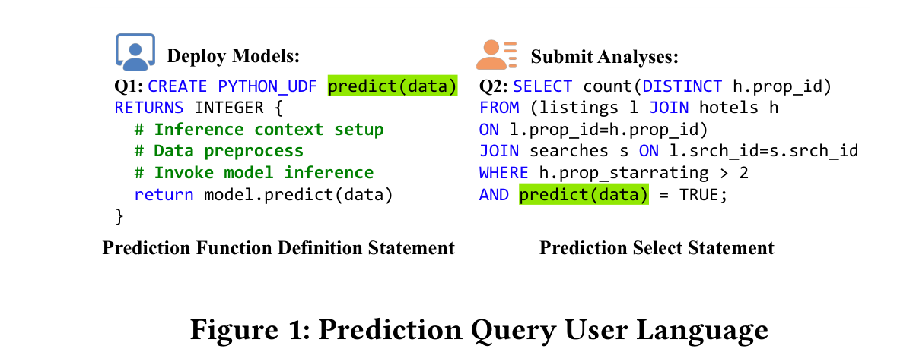
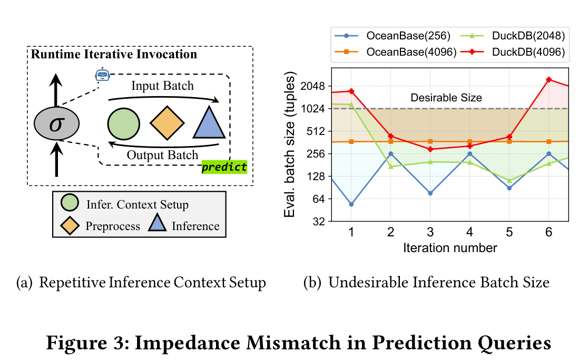
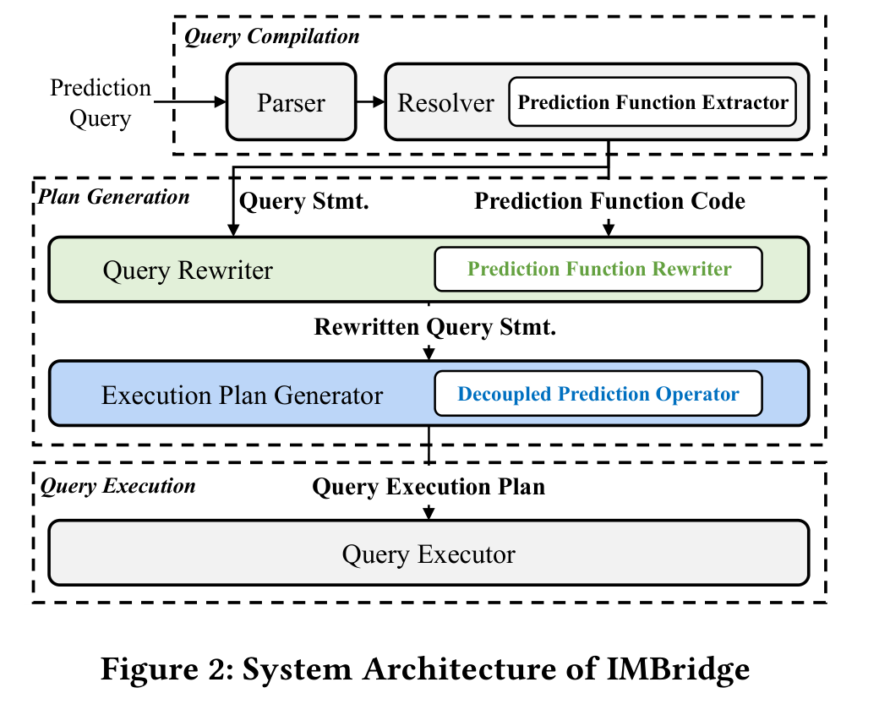
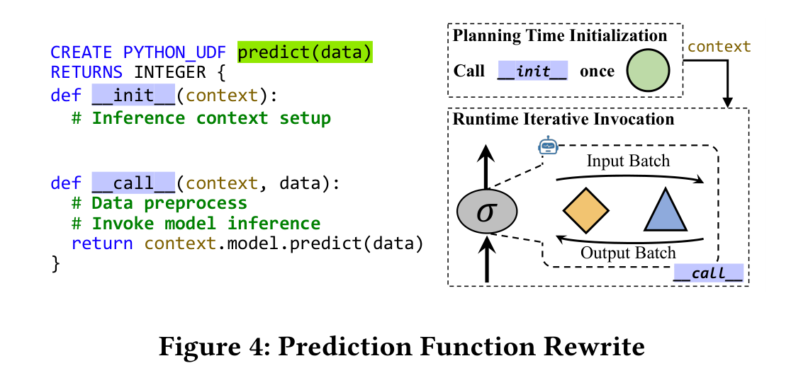
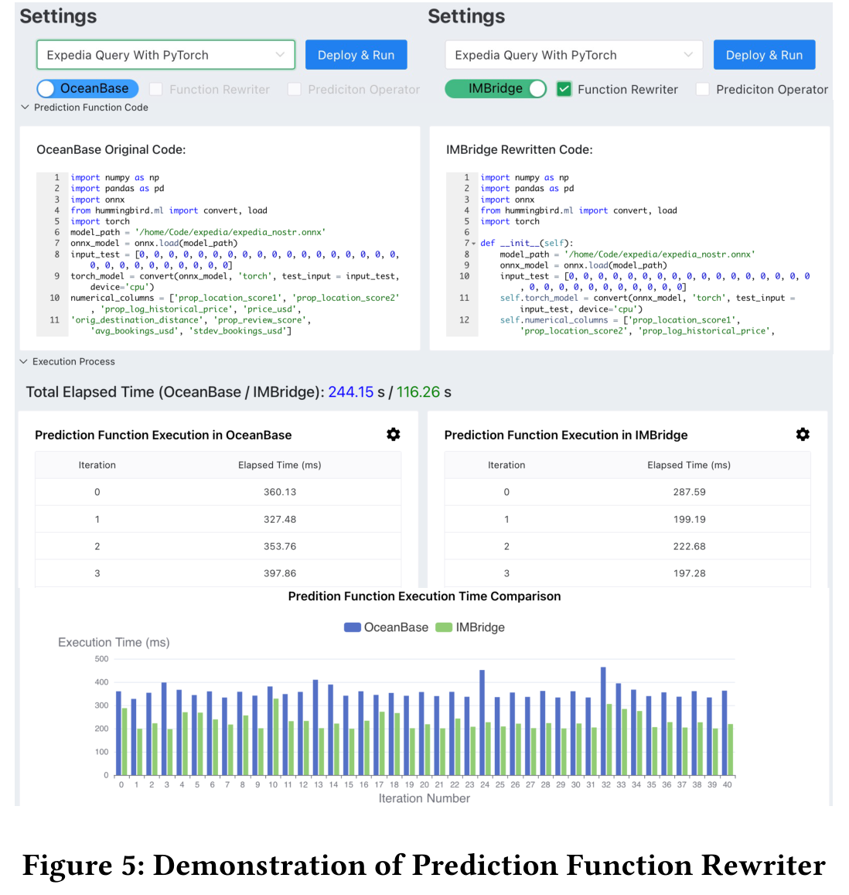
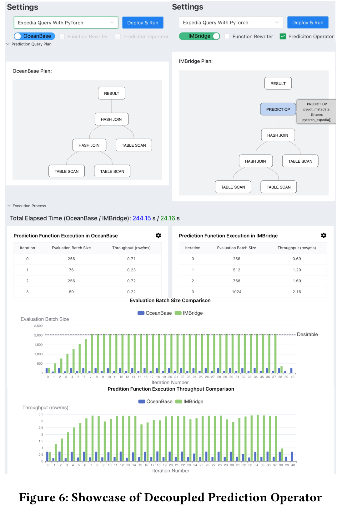

# IMBridge：数据库引擎与预测查询执行之间的阻抗失配缓解

## 论文精读笔记（最终版）

> **论文全名**：*IMBridge: Impedance Mismatch Mitigation between Database Engine and Prediction Query Execution*
> **论文类型**：SIGMOD Companion 2024 Demonstration Paper，正文仅 4 页
> **阅读原则**：正文主体只写论文明确支持的内容；所有超出论文的判断均显式标为“笔记分析”。

---

## 0. 阅读边界与结论先行

### 0.1 先说明这篇论文的证据边界

上传文件名为 `IMBridge_2026.pdf`，但论文首页 ACM Reference Format 明确写明：论文发表于 **SIGMOD-Companion ’24，2024 年**。因此，本笔记以正式出版信息为准。

这是一篇 **4 页的系统演示论文**，原文结构只有：

- Section 1：Introduction；
- Section 2：Design and Implementation，其中只有 Section 2.1 与 Section 2.2；
- Section 3：Demonstration。

原文**不存在 Section 4、Section 5.1–5.5 或 Section 7**，也没有正式编号的 Table 或 Algorithm。因而，本笔记不会虚构这些章节；“实验分析”只能严格依据原文 Section 3 的演示设置、Figure 5、Figure 6，以及 Introduction 中的整体性能声明。

### 0.2 一句话读懂 IMBridge

数据库把机器学习预测函数当作普通、黑盒的 Python UDF，导致两类跨层失配：

1. 数据库不知道函数内部哪些代码只需初始化一次，于是每次迭代都重复构造 inference context；
2. prediction function 的评估批大小被宿主数据库算子控制，实际 UDF evaluation batch size 经常偏离模型所需的 desirable inference batch size。

IMBridge 用两项机制分别修复：

- **Prediction Function Rewriter**：把不随迭代变化的 inference context setup 提升到 planning time；
- **Decoupled Prediction Operator**：把 prediction function 从其他算子中拆成独立一元算子，独立控制推理批大小。

### 0.3 两个问题与两个机制的严格对应

| 数据库—推理失配 | 根因 | IMBridge 机制 | 直接目标 |
|---|---|---|---|
| inference context 被反复构造 | 数据库对 prediction function 内部 inference semantics 不可见 | Prediction Function Rewriter | 将初始化从每次运行时调用提升为一次 planning-time 初始化 |
| UDF evaluation batch size 不合适 | prediction function 与 scan / selection 等宿主算子耦合，且受全局 inter-operator transfer batch size 影响 | Decoupled Prediction Operator | 为每个 prediction function 独立整形 batch，使调用批大小接近 desirable inference batch size |

---

# 1. 论文基本信息

| 项目 | 内容 |
|---|---|
| 题目 | **IMBridge: Impedance Mismatch Mitigation between Database Engine and Prediction Query Execution** |
| 作者 | Chenyang Zhang，Junxiong Peng，Chen Xu，Quanqing Xu，Chuanhui Yang |
| 单位 | Chenyang Zhang、Junxiong Peng、Chen Xu：East China Normal University；Quanqing Xu、Chuanhui Yang：OceanBase, AntGroup |
| 补充单位信息 | 前三位作者同时标注 Shanghai Engineering Research Center of Big Data Management |
| 通讯作者 | Chen Xu |
| 会议 | Companion of the 2024 International Conference on Management of Data，简称 SIGMOD-Companion ’24 |
| 时间地点 | 2024 年 6 月 9–15 日，Santiago, AA, Chile |
| 论文类型 | Demonstration Paper |
| 篇幅 | 4 pages |
| DOI | 10.1145/3626246.3654754 |
| 系统实现基础 | 扩展 OceanBase query engine |
| 关键词 | Query Optimization；Machine Learning Prediction Query |

### 1.1 论文定位

IMBridge 不是一个通用机器学习训练系统，也不是一个独立模型服务系统。它关注的是：**当数据库查询计划内部通过 Python UDF 调用机器学习模型时，数据库执行机制与推理执行机制之间的接口设计问题。**

论文归入 Query Optimization，但其主要动作不是传统的 join reorder、predicate pushdown 或 cardinality estimation，而是：

- 改写 prediction function 的生命周期；
- 在物理执行计划中引入独立 prediction operator；
- 控制 prediction function 的实际评估批大小。

---

# 2. 研究背景与问题（对应原文 Section 1）

## 2.1 什么是 prediction query

**原文定位：Section 1，Figure 1。**

论文将 prediction query 描述为：在数据库中存储的数据上应用机器学习模型进行分析的查询。当前数据库通常借助 Python UDF 接入 Python 机器学习生态。

Figure 1 给出在线旅行平台示例：

- Q1 是 prediction function definition statement，用于部署预测函数 `predict(data)`；
- 函数内部包含三类工作：inference context setup、data preprocess、invoke model inference；
- Q2 是带 prediction function call 的 SQL 查询；它先对 listings、hotels、searches 做 join 与普通过滤，再调用 `predict(data)` 判断酒店是否会被推荐，最后做聚合计数。

因此，prediction query 的完整数据路径不是“只有模型推理”，而是：

> 关系数据读取与 join / filter → prediction function → 结果聚合。



> 配图来源：SIGMOD-Companion ’24 论文 Figure 1，PDF 第 1 页。图中 Q1/Q2 是作者用于说明用户接口的示例，不代表论文覆盖了任意 Python UDF 或任意关系查询形态。

## 2.2 数据库当前如何执行 prediction function

**原文定位：Section 1。**

论文描述的传统路径是：

1. prediction query 被转换为 operator tree；
2. prediction function 作为 UDF expression 嵌入某个数据库算子；
3. Query Executor 迭代驱动算子执行；
4. 每次迭代中，算子先从 downstream operators 取一批数据；
5. 随后准备 evaluation context，并立即调用 prediction function。

关键点是：**数据库以普通 UDF 的方式管理 prediction function，而不是以具有模型加载、资源分配和批推理语义的专用算子管理它。**

## 2.3 Mismatch 1：数据库看不见 inference context 的生命周期语义

**原文定位：Section 1；Section 2.1；Figure 3(a)。**

prediction function 中存在一次查询执行期间可复用的 inference context setup，例如：

- model loading；
- computation resource allocation。

但数据库不知道这些语句与普通 per-batch computation 的区别。因此，prediction function 每被迭代调用一次，其 inference context 都具有 transient lifetime，相同上下文被反复重建。

Figure 3(a) 的图意是：每轮 runtime iterative invocation 都再次执行：

> inference context setup → preprocess → inference。

真正冗余的是第一部分。只要模型和资源上下文在整个查询执行期间不变，它就不应位于每轮数据批处理的热路径中。

## 2.4 Mismatch 2：数据库批大小与模型推理批大小不是同一个概念

**原文定位：Section 1；Section 2.2；Figure 3(b)。**

论文区分了三个容易混淆的量：

| 术语 | 含义 | 由谁决定 |
|---|---|---|
| inter-operator transfer batch size | 数据库算子之间一次传递多少 tuple | 数据库系统级执行参数 |
| UDF evaluation batch size | 某次 UDF 实际收到多少 tuple | 宿主算子本轮产出的数据量 |
| desirable inference batch size | 特定模型与 ML framework 达到较高推理吞吐所希望使用的 batch size | 模型、框架与硬件执行特性 |

论文指出，UDF evaluation batch size 往往无法等于 desirable inference batch size，原因有两层。

### 第一层：受数据库全局传输粒度约束

- tuple-at-a-time 执行范式从系统设计上不具备批处理能力，无法直接调大该参数；
- batching execution engine 通常对系统中的查询采用统一 transfer batch size；
- 调整该参数会影响所有查询，而不是只影响某个 prediction function；
- OceanBase 与 DuckDB 的相关参数还可能写在 kernel code 中，修改后需要重新编译。

### 第二层：受宿主算子的数据处理逻辑影响

即使全局 transfer batch size 预先设置为某个理想值，prediction function 实际收到的数据量仍可能变化：

- 如果 UDF 附着在 scan operator 上，batch 受表扫描取数策略限制；
- 如果 UDF 附着在 selection operator 上，batch 受 filter condition 与选择率影响。

Figure 3(b) 采样 Q2 的多轮 evaluation batch size。即使改变 OceanBase 或 DuckDB 的 inter-operator transfer batch size，实际 UDF batch 仍随迭代明显波动，不能稳定匹配图中的 Desirable Size。



> 配图来源：SIGMOD-Companion ’24 论文 Figure 3，PDF 第 2 页。左图是执行语义示意，右图是 Q2 的采样结果；右图不能外推为所有模型、查询或数据库配置下的 batch 分布。

## 2.5 研究问题的本质

论文题目使用 “Impedance Mismatch”，不是泛指数据库与机器学习之间所有差异，而是聚焦两个具体接口不匹配：

1. **生命周期接口不匹配**：数据库调用边界没有区分 query-lifetime state 与 per-batch work；
2. **执行粒度接口不匹配**：数据库 tuple batch 不是模型推理的天然 batch。

---

# 3. 核心思想与贡献

## 3.1 核心思想

IMBridge 的核心思想是：**不再把 prediction function 视为不可拆分的普通 UDF，而是显式暴露其生命周期与批执行需求。**

这带来两种“解耦”：

- 把 inference context setup 与运行时 evaluation 解耦；
- 把 prediction function evaluation 与原宿主 relational operator 解耦。

## 3.2 论文明确给出的贡献

### 贡献 1：Prediction Function Rewriter

通过 rewrite interface 与 automatic hoisting，将 inference context-building process 提升到 planning time，只执行一次，避免重复构造。

### 贡献 2：Decoupled Prediction Operator

为查询中的每个 prediction function 生成独立一元算子，并提供独立 desirable inference batch size 参数，通过 buffer 和 slice 控制每次调用的批大小。

### 贡献 3：在 OceanBase 上实现 IMBridge 并提供可交互演示

论文在 OceanBase query engine 上实现系统，并设计 Web UI 展示：

- 原函数与 rewritten function 的差异；
- OceanBase 与 IMBridge 的 plan tree 差异；
- per-iteration function time；
- evaluation batch size；
- prediction throughput；
- total elapsed time。

## 3.3 论文没有声称解决的问题

以下内容不是本文贡献，论文也没有研究或证明：

- prediction model 的准确率提升；
- 训练过程优化；
- join order 或完整关系查询重写；
- 多 GPU / 多节点模型部署；
- 多查询公平性与资源隔离；
- 模型服务 endpoint routing；
- KV cache 管理；
- 远程 LLM API 的网络与 token-level scheduling。

---

# 4. 系统与方法设计（严格对应原文 Section 2）

## 4.1 整体架构（原文 Figure 2）

**输入**：含 prediction function call 的 prediction query，以及已定义的 prediction function code。
**输出**：包含 rewritten function context 与 Decoupled Prediction Operator 的 query execution plan。



> 配图来源：SIGMOD-Companion ’24 论文 Figure 2，PDF 第 2 页。绿色路径承担函数改写，蓝色路径承担独立 prediction operator 的计划生成；该图没有表达分布式模型服务或多节点调度。

Figure 2 将 IMBridge 放入传统 query engine 的三个阶段。

### 4.1.1 Query Compilation

1. Parser 将 prediction query 解析为 AST；
2. Resolver 结合 schema 进行解析；
3. Prediction Function Extractor 提取 prediction function code。

此时系统同时获得：

- Query Statement；
- Prediction Function Code。

### 4.1.2 Plan Generation

1. Query Rewriter 调用 Prediction Function Rewriter；
2. Rewriter 提升 inference context setup，并把构造出的 context 与 query statement / plan 绑定；
3. Execution Plan Generator 基于 rewritten query statement 生成计划；
4. 计划中为 prediction function 生成 Decoupled Prediction Operator。

### 4.1.3 Query Execution

Query Executor 执行计划。Decoupled Prediction Operator 获取 desirable inference batch size 参数，并据此控制 prediction function evaluation。

### 4.1.4 Figure 2 真正表达的设计边界

Prediction Function Rewriter 位于**计划生成前的代码与查询改写路径**；Decoupled Prediction Operator 位于**物理执行计划与运行时批处理路径**。前者改变“函数何时初始化”，后者改变“函数每次拿多少数据执行”。

---

## 4.2 Section 2.1：Prediction Function Rewriter

### 4.2.1 方法输入、输出与目标

| 项目 | 论文定义 |
|---|---|
| 输入 | 原始 prediction function code |
| 输出 | 被改写为 initialization method `__init__` 与 evaluation method `__call__` 的代码 |
| 目标 | 识别在整个 query execution loop 中不变化的 inference context setup，并将其移出 runtime iterative invocation |
| 生命周期 | `__init__` 在 planning time 调用一次；`__call__` 在 runtime 每轮调用 |

### 4.2.2 Manual Hoisting Rewrite Interface

**原文定位：Section 2.1，Figure 4。**

论文先实现一个手工接口，思想与 YeSQL 的 manual hoisting interface 类似：

- 用户把 inference context setup 放入 `__init__`；
- 把 data preprocessing 与 ML framework invocation 放入 `__call__`；
- planning time 调用 `__init__`，构造 context 并绑定到 query plan；
- runtime 每轮仅调用 `__call__`。



> 配图来源：SIGMOD-Companion ’24 论文 Figure 4，PDF 第 2 页。图示的是 manual hoisting interface 的生命周期拆分；automatic hoisting 的安全条件与失败回退没有在图中给出。

下面是对 Figure 4 的笔记化伪代码，不是原文完整代码：

```python
# planning time，执行一次
def __init__(context):
    context.model = load_model(...)
    context.resource = allocate_resource(...)

# runtime，每个输入 batch 执行
def __call__(context, data):
    x = preprocess(data)
    return context.model.predict(x)
```

**为什么有效**：只要 setup 产生的 context 在查询执行的多轮调用中相同，就没有必要把它放在每轮 `__call__` 的热路径中。

**手工接口的不足**：用户必须识别 setup code，修改每个已部署函数，并保证修改不影响已有查询。因此论文进一步提出 automatic hoisting。

### 4.2.3 Automatic Hoisting Rewrite Algorithm：为什么可以建模为 LICM

论文观察到：

- Query Executor 对算子的 iterative invocation 可以映射为 loop program structure；
- 嵌入算子的 UDF 是 loop body 局部作用域中的 function call expression；
- inference context setup 在整个 query execution loop 中每轮产生相同值。

因此，automatic hoisting rewrite 可以被建模为 **Loop Invariant Code Motion（LICM）** 问题：找到 loop-invariant code，并将其移到 loop 外。

### 4.2.4 为什么不采用 global LICM on unified IR

常规全局 LICM 方案需要：

1. 把 query plan 与 Python UDF code 编译到统一 intermediate representation；
2. 在统一 IR 上全局搜索 loop-invariant code；
3. 变换统一 IR。

论文认为这会引入 non-trivial polyglot compilation，并带来 non-negligible compilation overhead。

它进一步利用 prediction function 的局部作用域：函数内部变量只在本函数 local scope 有效，不影响 query operator 或其他 UDF 中的变量。因此，检测范围可以缩小到每个 prediction function 自身。

### 4.2.5 Local LICM on AST 的两个阶段

论文选择 **local LICM algorithm on AST**，而不是 global LICM on unified IR。

#### 输入

原始 prediction function code。

#### AST 获取

使用 Python `ast` library 得到每个 prediction function 的 AST。

#### Phase 1：Marking

遍历 AST，把满足下列条件的 statement 与 expression 选入 code set：其 operands 是：

1. constant；
2. defined outside the loop；
3. 已经被标记为 loop invariant。

#### Phase 2：Hoisting

1. 把上述 loop-invariant code 移到 loop 外；
2. 在 IMBridge 的接口中，loop 外对应 `__init__`；
3. 将剩余代码变换后放入 `__call__`。

#### 输出

符合 manual hoisting rewrite interface 的 rewritten code。

### 4.2.6 为什么选择本地 AST 方法

论文自己给出的理由是：

- 不需要把数据库计划与 Python 代码统一编译成 IR；
- compilation overhead 更低；
- loop-invariant detection 被限制在单个 prediction function 的 local scope，检测时间更少。

### 4.2.7 Figure 5 对该机制的展示

Figure 5 的 UI 同时展示：

- OceanBase original code；
- IMBridge rewritten code；
- total elapsed time；
- 多轮 prediction function execution time。



> 配图来源：SIGMOD-Companion ’24 论文 Figure 5，PDF 第 4 页。该图是 Expedia Query With PyTorch 的单次演示截图，不是包含重复次数、方差与完整硬件设置的正式统计实验。

截图中的总时间为：

- OceanBase：244.15 s；
- 仅启用 Function Rewriter 的 IMBridge：116.26 s。

据截图数值计算，该示例约为 **2.10× speedup**，总时间约下降 **52.4%**。论文对该图的解释是：Prediction Function Rewriter 消除了 redundant inference context setup，因此降低了每轮 function invocation 的 elapsed time。

> **证据边界**：这是演示 UI 中的一个截图示例，不是完整统计实验；论文未给出该示例的硬件、模型配置、数据规模、重复次数或方差。

### 4.2.8 论文未说明的实现细节

原文没有给出正式 Algorithm 编号或伪代码，也没有具体说明：

- Python 动态语义下 side effect、global state、randomness、I/O call 如何判定；
- mutable object、alias、exception、closure 与 control flow 的安全性分析；
- context 在 plan cache、并发查询与 plan reuse 下的生命周期；
- rewrite 失败时是否回退到原始 UDF；
- automatic rewrite 的 compilation overhead 数值。

这些不能由读者替作者补全。

---

## 4.3 Section 2.2：Decoupled Prediction Operator

### 4.3.1 设计动机

Most ML frameworks 针对 batch processing 优化，推理效率对 batch size 敏感；不同 framework 与 model 的 desirable inference batch size 可以差异很大。因此，prediction function 需要按函数独立配置，而不是共享数据库全局 transfer batch size。

### 4.3.2 原 coupled design 为什么无法保证合适 batch

prediction function 作为 UDF expression 附着在 scan、selection 等算子上时，实际 batch 同时由两类因素决定：

1. 数据库的 system-level inter-operator transfer batch size；
2. 宿主算子本身的取数、过滤与输出逻辑。

因此，即使预先知道模型的 desirable value，也不能只靠调整数据库全局 batch 参数来保证每轮 prediction function invocation 都得到该大小。

### 4.3.3 Operator 定义

IMBridge 为查询中的**每个 prediction function**生成 standalone prediction operator。

该 operator：

- 是 unary operator；
- 消费 downstream operator 传来的数据；
- 产生 prediction results；
- 拥有独立 desirable inference batch size parameter；
- 不再把 prediction function 附着在其他 relational operator 上。

### 4.3.4 Batch shaping 执行逻辑

令当前收到的数据量为 `n`，desirable inference batch size 为 `D`。以下是对原文流程的笔记化表达：

| 条件 | Decoupled Prediction Operator 的动作 | 目的 |
|---|---|---|
| `n = D` | 直接把 batch 送入 prediction function | 不做额外重组 |
| `n < D` | 将数据存入 buffer；只有累计到 desirable size 才调用 prediction function | 合并小批，避免低吞吐调用 |
| `n > D` | 将 batch slice 为合适 segment，按顺序送入 prediction function | 避免单次 batch 过大 |

这相当于在数据库 relational pipeline 与 ML inference invocation 之间增加一个**显式 batch adapter**。

### 4.3.5 Profile-based tuner

论文额外引入 profile-based tuner：

1. 收集 inference efficiency statistics；
2. 使用 AIMD scheme 搜索 desirable value；
3. 将该值交给每个 Decoupled Prediction Operator。

原文只给出这一高层说明，没有给出：

- AIMD 的初始值、增量、乘法下降因子；
- efficiency metric 的精确定义；
- 搜索终止条件；
- 在线波动时的稳定性；
- 是否区分 latency-optimal 与 throughput-optimal batch size。

### 4.3.6 Figure 6 对执行计划的展示



> 配图来源：SIGMOD-Companion ’24 论文 Figure 6，PDF 第 4 页。该图把计划变化、batch 行为和吞吐放在同一演示界面中，但只支持该截图条件下的机制观察，不能单独证明跨模型或跨 workload 的普遍收益。

Figure 6 左侧 OceanBase plan 中，计划主要由 RESULT、HASH JOIN 与 TABLE SCAN 构成；右侧 IMBridge plan 在 join subtree 之上显式插入 **PREDICT OP**，并把 prediction function 附着在该独立 operator 上。

图中要表达的不是 join 被重新优化，而是 prediction function 的执行边界从“某个普通算子的内部表达式”变为“一个可独立控制的物理算子”。

### 4.3.7 Figure 6 对 batch 与 throughput 的展示

Figure 6 截图给出的前四轮样例为：

| 系统 | Iteration | Evaluation Batch Size | Throughput（row/ms） |
|---|---:|---:|---:|
| OceanBase | 0 | 256 | 0.71 |
| OceanBase | 1 | 76 | 0.23 |
| OceanBase | 2 | 256 | 0.72 |
| OceanBase | 3 | 89 | 0.22 |
| IMBridge | 0 | 256 | 0.69 |
| IMBridge | 1 | 512 | 1.29 |
| IMBridge | 2 | 768 | 1.69 |
| IMBridge | 3 | 1024 | 2.16 |

后续柱状图显示：

- OceanBase 的 evaluation batch size 在较小值附近波动；
- IMBridge 的 batch size 经过动态搜索逐步增长，并稳定在图中虚线标出的 desirable size 附近；
- IMBridge 的 prediction function throughput 相应明显高于 OceanBase。

该截图的总时间为：

- OceanBase：244.15 s；
- 仅启用 Prediction Operator 的 IMBridge：24.16 s。

据截图数值计算，该示例约为 **10.11× speedup**，总时间约下降 **90.1%**。作者对该演示的解释是：Decoupled Prediction Operator 通过提高 prediction function execution throughput，降低 entire query latency。

> **证据边界**：Figure 6 是演示截图。它能直观看出机制行为，但不能替代跨数据集、跨模型、多次重复的正式统计实验。

### 4.3.8 论文未说明的 operator 细节

原文没有说明：

- 查询结束时，buffer 中不足 `D` 的 tail batch 如何 flush；
- buffer 的内存上限与 backpressure；
- 等待凑批对单查询 latency 的影响；
- 多个 prediction functions 同时存在时的 plan placement 与调度；
- prediction function 有 side effect 时，slice / reorder 是否保持语义；
- error handling、cancellation 与资源释放；
- 多查询并发下是否共享 tuner profile 或 context。

---

# 5. 演示与实验分析（对应原文 Section 3；原文没有 Section 5）

## 5.1 Demonstration 设置

论文实现 Web-based UI，观众可以：

- 在 code editor 中定义 Python prediction functions；
- 对数据库中数据提交 prediction queries；
- 选择预设 query 与 function；
- 在 OceanBase 与 IMBridge 之间切换；
- 在 IMBridge 中分别勾选 Function Rewriter 与 Prediction Operator；
- 在 analysis report panel 查看代码、计划、时间、batch 与 throughput。

### 数据来源

- Kaggle：Expedia、Flights、Hospital；
- TPCx-AI benchmark。

### 机器学习框架

- scikit-learn；
- ONNX Runtime；
- PyTorch。

### Baseline

- OceanBase。

DuckDB 只出现在 Figure 3(b) 的动机示例中，用于说明改变 transfer batch size 仍不能稳定获得 desirable evaluation batch；Section 3 的交互演示主要比较 OceanBase 与 IMBridge。

### 论文没有提供的实验设置

- CPU / GPU 型号；
- 内存与存储配置；
- OceanBase 版本与关键参数；
- model name、model size 与精度；
- dataset size 与 selectivity；
- query 数量与并发；
- warm-up、重复次数、均值 / 方差；
- tuner 的参数；
- compile / rewrite overhead。

## 5.2 Scenario 1：Prediction Function Rewriter

**操作流程：**

1. 选择带 prediction function 的 query；
2. 先在 OceanBase 上运行；
3. 再在 IMBridge 上启用 Function Rewriter；
4. 对比 original UDF 与 rewritten code；
5. 对比 total elapsed time 与每轮 function invocation time。

**作者声称该场景说明：**

- IMBridge 自动把原 UDF 变换为 hoisting rewrite interface；
- `__init__` 在 planning time 构造 context；
- redundant inference context setup 被消除；
- 每轮函数调用时间与总查询时间下降。

**Figure 5 数值：**244.15 s → 116.26 s，截图约 2.10×。

## 5.3 Scenario 2：Decoupled Prediction Operator

**操作流程：**

1. 先查看 OceanBase 与 IMBridge 的 plan tree；
2. 确认 IMBridge 抽取 prediction function 并生成 standalone prediction operator；
3. 对比 total elapsed time；
4. 查看 Evaluation Batch Size Comparison；
5. 查看 tuner 获得 desirable batch size 的动态过程；
6. 对比 prediction function throughput。

**作者声称该场景说明：**

- IMBridge 能保证每次 prediction function invocation 使用 desirable inference batch size；
- OceanBase 的 evaluation batch size 与 desirable value 差距较大；
- prediction operator 提高了 prediction function throughput；
- 因而降低了 entire query latency。

**Figure 6 数值：**244.15 s → 24.16 s，截图约 10.11×。

## 5.4 整体性能声明

Introduction 写道：IMBridge 的 experiments 显示，相比 OceanBase 可达到 **18.2× speedup**。

但这篇 4 页 demo paper 没有给出该 18.2× 对应的：

- query；
- dataset；
- model / framework；
- hardware；
- 单项优化或组合优化配置；
- 统计方法。

因此，严格的阅读结论应是：

> **论文提出并报告了 18.2× 的最高加速，但当前正文不足以独立复现或判断该峰值结果的普适性。**

## 5.5 实验真正证明了什么

### 论文中的演示能够支持

1. Prediction Function Rewriter 可以把 setup code 与 per-batch evaluation 分开；
2. rewritten code 在 UI 中表现出更低 per-iteration function time；
3. Decoupled Prediction Operator 可以显式出现在物理计划中；
4. operator 可以通过 buffer / slice 与 tuner 控制 evaluation batch size；
5. 在 Figure 5、Figure 6 的示例中，两项机制都降低了 total elapsed time；
6. Figure 6 中 batch size 接近 desirable value 时，prediction throughput 提升。

### 论文没有证明 / 未研究

1. 对所有模型、框架、数据集都能获得相同幅度加速；
2. 对低负载、低选择率、小数据查询仍然收益为正；
3. buffer 凑批不会损害 tail latency；
4. automatic LICM 对任意 Python UDF 都安全；
5. AIMD tuner 在动态负载中一定收敛且稳定；
6. 多查询并发、资源竞争与公平性；
7. 分布式模型服务、网络调用和多 endpoint；
8. 结果正确性与异常语义的系统性验证；
9. rewrite / plan generation overhead 可以忽略。

---

# 6. Figure、Table 与 Algorithm 逐项索引

## 6.1 Figure 1：Prediction Query User Language

- Q1：定义 prediction function；
- Q2：在 SQL 中调用 `predict(data)`；
- 关键作用：说明模型部署与关系查询的用户接口，以及 prediction function 内部同时包含 setup、preprocess、inference。

## 6.2 Figure 2：System Architecture of IMBridge

- Query Compilation：Parser、Resolver、Prediction Function Extractor；
- Plan Generation：Query Rewriter、Prediction Function Rewriter、Execution Plan Generator、Decoupled Prediction Operator；
- Query Execution：Query Executor；
- 关键作用：说明两项机制分别进入代码改写与物理执行计划路径。

## 6.3 Figure 3：Impedance Mismatch in Prediction Queries

- Figure 3(a)：每轮重复 inference context setup；
- Figure 3(b)：OceanBase / DuckDB 的实际 evaluation batch size 随迭代变化，即使调整 transfer batch size，仍不能稳定匹配 Desirable Size。

## 6.4 Figure 4：Prediction Function Rewrite

- `__init__`：planning-time initialization，执行一次；
- `__call__`：runtime iterative invocation；
- context 跨多轮 evaluation 复用。

## 6.5 Figure 5：Demonstration of Prediction Function Rewriter

- 展示 original code 与 rewritten code；
- 展示 OceanBase 与 IMBridge total elapsed time；
- 展示 per-iteration prediction function execution time；
- 截图示例：244.15 s 与 116.26 s。

## 6.6 Figure 6：Showcase of Decoupled Prediction Operator

- 展示 OceanBase 与 IMBridge plan tree 差异；
- IMBridge 中出现 PREDICT OP；
- 展示 evaluation batch size 的动态调整过程；
- 展示 prediction function throughput；
- 截图示例：244.15 s 与 24.16 s。

## 6.7 Table 与 Algorithm

原论文没有编号 Table，也没有编号 Algorithm。Automatic Hoisting Rewrite Algorithm 与 Decoupled Prediction Operator 的执行逻辑只在正文中描述。本笔记中的流程表和伪代码是为理解而整理，不是原论文新增的正式算法编号。

---

# 7. 优点与局限

## 7.1 基于论文内容可以确认的优点

### 优点 1：问题拆分准确且机制一一对应

论文没有把“数据库调用 ML 慢”笼统归因于 Python，而是区分：

- setup lifetime；
- evaluation batch granularity。

两项机制分别处理不同根因，设计边界清楚。

### 优点 2：改造位置贴近数据库执行路径

Prediction Function Rewriter 进入 query rewrite / plan generation；Decoupled Prediction Operator 进入 physical plan。这样，优化不再完全依赖用户手工调整数据库全局参数。

### 优点 3：每个 prediction function 独立控制 batch

模型与 framework 的 desirable inference batch size 不同。per-function parameter 比 system-wide transfer batch size 更符合推理执行差异。

### 优点 4：local AST rewrite 避免统一多语言 IR

论文利用 prediction function 的 local scope，把 LICM 检测限制在 Python AST 中，避免完整 polyglot compilation 的复杂度。

### 优点 5：演示界面能直接验证机制行为

Figure 5、Figure 6 不只给总时间，还同时展示代码、计划、batch size 与 throughput，便于观察“为什么变快”。

## 7.2 论文作者明确写出的 limitations

原文没有独立 Limitations section，也没有系统列出 limitations。因此不能把下述笔记分析写成作者结论。

## 7.3 笔记分析：可能的局限与未解决问题

> 以下为基于论文内容的个人分析，不属于论文原文贡献或作者明确结论。

### 局限 1：Automatic Hoisting 的语义安全性说明不足

Python UDF 可能包含动态调用、文件 I/O、随机数、全局状态、异常与 mutable state。仅依据 operands 是否 invariant，未必足以证明移动语句前后语义等价。论文没有给出 effect analysis 或保守回退规则。

### 局限 2：context 的生命周期与并发模型未定义

context 是 per-query、per-plan、per-session 还是可跨查询共享，原文没有说明。若一个 plan 被并发执行，共享 mutable context 是否安全也未研究。

### 局限 3：凑批提高 throughput，但可能增加等待延迟

对于 `n < D`，operator 必须等待更多数据。该策略可能提高吞吐，却增加首批或 tail batch latency。论文只展示总时间，没有系统研究 latency–throughput trade-off。

### 局限 4：tail batch、buffer 与 backpressure 未描述

查询结束时不足 D 的剩余数据如何处理、buffer 是否有上限、上游是否被阻塞，都是实现正确性与内存稳定性所需信息，但原文未说明。

### 局限 5：Profile-based tuner 过于简略

论文只写 AIMD scheme，没有完整目标函数和参数，也没有 tuner 收敛、抖动、warm-up cost 与 workload shift 实验。

### 局限 6：正式实验不足

作为 demo paper，论文没有系统覆盖硬件、并发、数据规模、模型差异、tail latency、资源利用率与统计显著性。18.2× 只能作为作者报告的峰值，不能从当前正文推断为普遍收益。

### 局限 7：工作范围主要是数据库内本地 prediction UDF

论文没有研究远程 model serving、网络队列、endpoint 选择、多模型共享 GPU 或多租户调度。对现代 LLM serving pipeline，需要额外机制。

---

# 8. 我的理解与启发

> 以下为基于论文内容的个人分析，不属于论文原文贡献。

## 8.1 真正值得学习的不是“调大 batch”，而是重新定义跨层接口

IMBridge 的设计价值在于：它发现数据库给 ML runtime 的接口太粗，只暴露“调用一个 UDF”，却没有暴露：

- 哪些状态应该活多久；
- 每次调用应该处理多少数据。

一旦这两类信息被显式化，数据库就能控制原来藏在黑盒函数里的行为。

## 8.2 两个通用系统设计原则

### 原则 1：把 query-lifetime state 与 per-batch computation 分开

这类似把 expensive initialization 从循环体移到循环外。适用于模型加载、tokenizer 初始化、远程 client/session 建立、GPU stream 或执行 context 准备。

### 原则 2：不要把上游数据批次直接等同于下游计算批次

数据库算子输出多少 tuple，是关系执行的自然粒度；模型一次处理多少样本，是推理引擎的自然粒度。二者之间需要 adapter，而不是假定同一个 batch size 参数可以同时满足双方。

## 8.3 独立 operator 的意义

当 prediction function 只是某个 selection expression 时，优化器与 runtime 很难观察和控制它。把它提升为 standalone operator 后，系统才有位置挂载：

- context；
- buffer；
- desirable batch size；
- profile；
- tuner；
- throughput statistics。

这体现了系统论文中常见的设计方式：**先把隐式行为变成显式执行实体，再对实体做调度与优化。**

---

# 9. 与我的数据库 AI 算子执行与调度课题的关系

> 以下为基于论文内容和课题背景的个人分析，不属于论文原文贡献。

## 9.1 直接相关之处

你的研究关注数据库驱动 AI workload 的上游组织、Ray 执行与 vLLM endpoint。IMBridge 给出了一个非常直接的前置论据：

> 数据库产生的 batch 不是 AI 推理真正需要的 batch；如果 prediction function 与普通算子耦合，实际调用粒度会随扫描、过滤与全局系统参数波动。

这与“固定行数 / 固定 batch / 固定并发不足以描述 AI 执行”的研究动机一致。

## 9.2 可以直接借鉴的设计思想

### 借鉴 1：把 AI 执行变为独立 operator / stage

IMBridge 的 Decoupled Prediction Operator 可对应你系统中的 Request Organizer 或独立 AI operator boundary。只有形成显式边界，才能维护队列、工作量估计、admission、buffer、endpoint state 与 completion feedback。

### 借鉴 2：初始化状态提升与长期复用

Prediction Function Rewriter 的思想可映射为：

- tokenizer / model client 初始化不放在每条记录或每个小 batch 路径；
- Ray Actor、HTTP connection、endpoint client、prompt template 与序列化 context 尽量复用；
- 将 per-job / per-endpoint persistent state 与 per-request work 分开。

### 借鉴 3：per-function batch parameter，而不是全局 batch

IMBridge 反对依赖 system-wide transfer batch size。你的系统可进一步扩展为：

- per-job；
- per-operator；
- per-endpoint；
- per-model；
- per-workload phase

分别维护 admission 与 batching 参数。

### 借鉴 4：buffer / slice 是最基础的 request organization 原语

IMBridge 的三分支可以作为最基本 baseline：

- exact-size direct send；
- small batch accumulate；
- oversized batch split。

你的工作可以在此基础上加入 token-aware、deadline-aware、endpoint-aware 与 fairness-aware 决策。

### 借鉴 5：profile-based closed loop

论文用 profile statistics 与 AIMD 搜索 desirable value。你的系统可借鉴“在线反馈调参”的思路，但反馈量不应只看 rows/ms，还可考虑：

- predicted input / output tokens；
- queueing latency；
- GPU utilization；
- TTFT / TPOT；
- endpoint KV cache pressure；
- request credit 与 predicted work credit；
- job-level fairness 与 tail latency。

## 9.3 与你的课题的关键区别

| 维度 | IMBridge | 你的课题 |
|---|---|---|
| 执行位置 | OceanBase query engine 内部 | 数据库 / Daft 上游 + Ray + vLLM endpoint pool |
| prediction 调用 | 主要是本地 Python UDF / ML framework | 异步、远程或独立模型服务调用 |
| 批大小描述 | tuple 数量 | tuple、request、input/output token、predicted work 等多维量 |
| 资源状态 | 论文未建模多 endpoint 状态 | 需要考虑 endpoint 路由、credit、KV cache、动态负载 |
| 调度范围 | 单 prediction operator 的批重组 | 多 job、多 endpoint、并发 admission、fairness 与 backpressure |
| 优化目标 | inference throughput 与 query latency | 端到端 latency / throughput / goodput / fairness / utilization 的联合目标 |
| 动态反馈 | AIMD tuner，高层描述 | 可形成数据库上游—Ray—vLLM 运行状态闭环 |

## 9.4 对课题定位的具体启示

IMBridge 可以作为你的 related work 与 motivation 中“数据库侧批粒度失配”的代表。但你的创新不能只停留在 buffer / slice 或寻找单一 desirable batch size。更有区分度的方向是：

> 将 IMBridge 的“独立 AI operator + per-function batch control”扩展为“面向分布式模型服务状态的、token/work-aware、multi-job、multi-endpoint 闭环执行与调度”。

IMBridge 没有研究的 endpoint routing、双 credit、跨 job 公平、异步完成释放、动态 vLLM 状态，正是你的系统可以继续推进的部分。

---

# 10. 最终复习卡片

## 10.1 Problem

普通 Python UDF 接口隐藏 inference semantics，导致：

- repetitive inference context setup；
- undesirable inference batch size。

## 10.2 Insight

prediction function 必须显式暴露：

- initialization lifecycle；
- desirable evaluation granularity。

## 10.3 Method

1. Prediction Function Rewriter：manual interface + automatic local LICM on Python AST；
2. Decoupled Prediction Operator：standalone unary operator + per-function desirable batch + buffer / slice；
3. Profile-based tuner：statistics + AIMD scheme。

## 10.4 Evidence

- Figure 5 演示：244.15 s → 116.26 s，约 2.10×；
- Figure 6 演示：244.15 s → 24.16 s，约 10.11×；
- Introduction 报告最高 18.2×；
- 但原文没有正式、完整的实验设置与统计评估。

## 10.5 最重要的局限

- automatic rewrite 的语义安全性细节不足；
- batch buffer 的 tail、latency 与 backpressure 未说明；
- AIMD tuner 细节不足；
- 缺乏完整实验；
- 未覆盖分布式模型服务与多租户调度。

## 10.6 对课题最重要的启发

> 数据库 batch 与模型 batch 是两个不同控制域；应通过独立 AI operator / Request Organizer 建立显式的生命周期、批重组、状态反馈与调度接口。

---

# 参考文献

Chenyang Zhang, Junxiong Peng, Chen Xu, Quanqing Xu, and Chuanhui Yang. 2024. *IMBridge: Impedance Mismatch Mitigation between Database Engine and Prediction Query Execution*. SIGMOD-Companion ’24. DOI: 10.1145/3626246.3654754.
