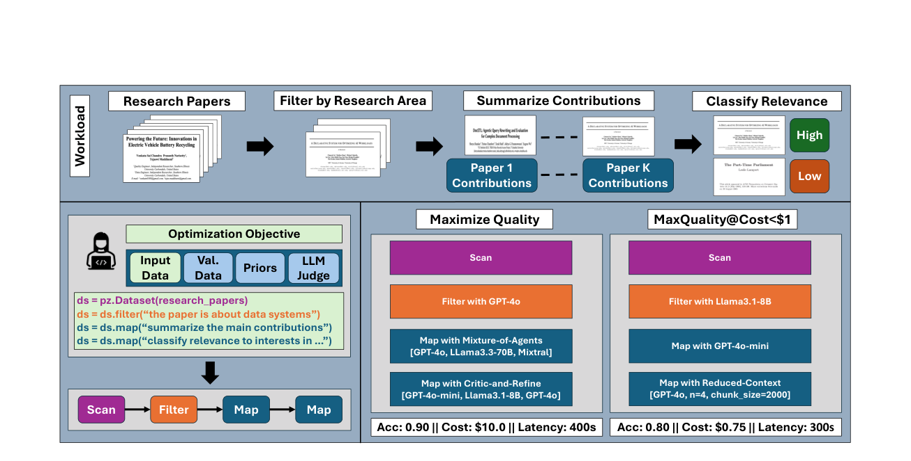
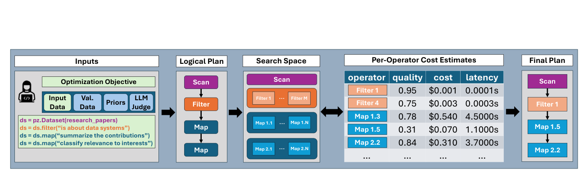
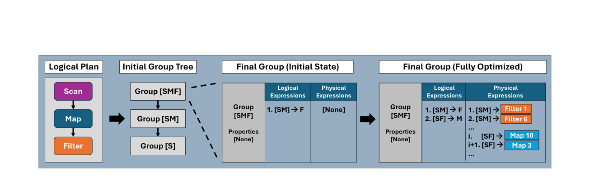
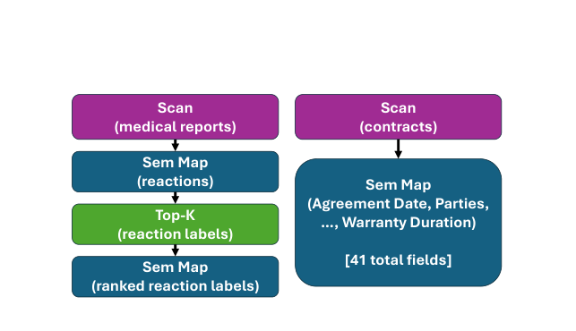
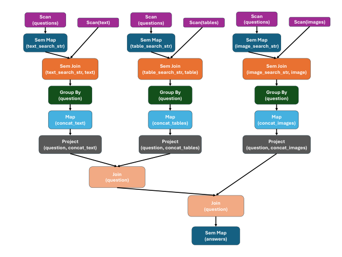
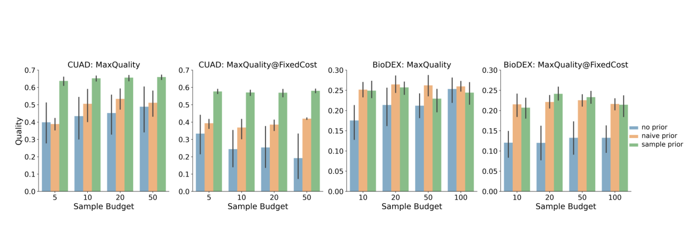
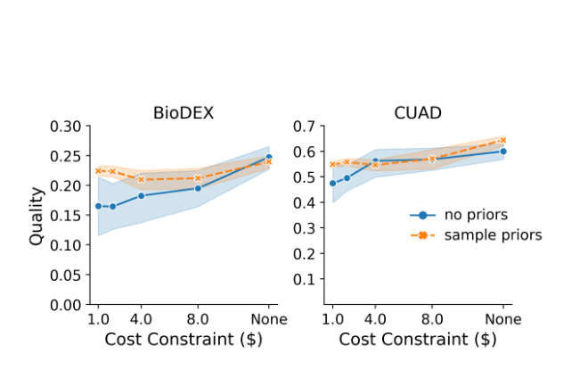
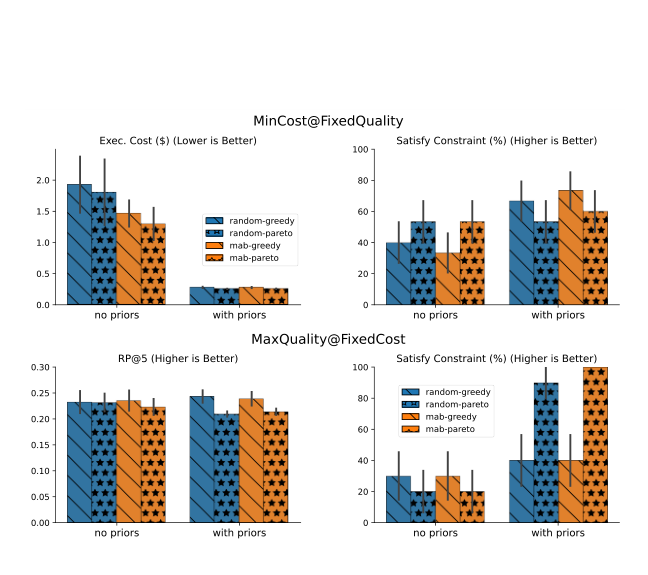

# 阅读说明

本文以论文正式版为唯一事实依据，按照论文的实际结构展开：**Section 1 Introduction → Section 2 System Overview → Section 3 Algorithms → Section 4 Evaluation → Section 5 Limitations and Future Work**。本论文的实验位于 **Section 4.1–4.6**，而不是 Section 5，因此下文不会强行套用其他论文的章节编号。

文中采用三类标记：

- **论文内容**：论文明确陈述、算法给出或实验直接支持的内容。
- **论文没有证明 / 未研究**：原文没有给出证据，不能替作者扩展结论。
- **笔记分析**：为帮助理解或联系课题而给出的个人分析，不属于论文原文贡献。

> **先给结论**：Abacus 的核心不是提出某一个更强的 LLM 算子，而是把“一个语义算子可以有很多物理实现”这件事系统化，然后用少量样本估计这些实现的质量、费用和延迟，再用面向 Pareto frontier 的搜索算法选出满足用户目标与约束的完整物理计划。

# 0. 一页读懂 Abacus

## 0.1 一句话概括

**Abacus 是一个面向 semantic operator systems 的可扩展 cost-based optimizer：它使用规则枚举物理实现，用样本建立 per-operator cost model，用 Pareto-oriented multi-armed bandit 搜索值得保留的物理算子，再用 Pareto-Cascades 在质量、美元成本和延迟之间进行带约束的全局计划选择。**（Section 1；Section 2；Section 3）

## 0.2 核心链路

```text
AI Program + Optimization Objective + Input Data
                    |
        optional: Validation Data / Priors / LLM Judge
                    v
              Logical Plan
                    v
       Rules enumerate physical operators
                    v
       MAB samples operator frontiers
                    v
 Per-operator estimates: quality / cost / latency
                    v
             Pareto-Cascades
                    v
               Final Plan
```

可将其压缩为：

```text
Abacus = Rules
       + Sample-based operator cost model
       + Pareto-oriented MAB
       + Pareto-Cascades
```

## 0.3 它解决的三个直接困难

| 困难 | 论文中的规模或原因 | Abacus 的对应机制 |
|---|---|---|
| 单个 logical operator 的 physical implementations 太多 | 一个 semantic map 在实现中约有 2,800 个候选；全系统约 3,000 个 physical operators（Section 2.3；Section 4.1） | 用 MAB 在固定 sample budget 内不断淘汰明显不可能进入 Pareto frontier 的候选 |
| 完整 plan space 组合爆炸 | 有 M 个语义算子、每个 N 个物理实现时，计划数在不考虑重排前已是 O(N^M)（Section 2.3） | 不直接采样完整计划，而是估计每个 physical operator，再通过可组合 cost model 估计计划 |
| 用户会提出约束目标 | 例如 MaxQuality@Cost<$1；传统 Cascades 只保留每个 subplan 的一个“best”实现，无法保留多维 trade-off（Section 1；Section 3.2） | 每个 group 保存 Pareto-optimal physical expressions，最终在满足约束的 Pareto plans 中选择 |

## 0.4 最重要的实验结论

依据 **Table 2** 的均值：

- BioDEX：Abacus 质量 0.261，优于 LOTUS 的 0.216，提升约 **20.8%**。
- CUAD：Abacus 质量 0.662，优于 DocETL 的 0.475，提升约 **39.4%**。
- MMQA：Abacus 质量 0.304，优于 LOTUS 的 0.284；按表中四舍五入数值计算约 **7.0%**，论文摘要写作 **6.7%**。
- 以每个 benchmark 上“质量次优系统”为比较对象，按 Table 2 的总费用和总时间计算，Abacus 平均约 **10.8× cheaper、3.4× faster**，与摘要和 Section 1 的表述一致。

但论文也明确展示了边界：**Table 3 中 Abacus 在 MMQA 上未能稳定降低成本；其 MinCost 计划平均执行成本反而高于 MaxQuality 计划。**作者将其归因于 EmbeddingJoin 的高方差以及可用优化空间有限。（Section 4.3）

# 1. 论文基本信息

| 项目 | 内容 |
|---|---|
| 题目 | **Abacus: A Cost-Based Optimizer for Semantic Operator Systems** |
| 作者 | Matthew Russo, Chunwei Liu, Sivaprasad Sudhir, Gerardo Vitagliano, Michael Cafarella, Tim Kraska, Samuel Madden |
| 单位 | MIT |
| 发表 | Proceedings of the VLDB Endowment（PVLDB） |
| 卷期与页码 | Vol. 19, No. 5, pp. 1060–1073 |
| 年份 | 2026 |
| DOI | 10.14778/3796195.3796215 |
| Artifact | 论文声明代码与数据等 artifact 位于 Palimpzest 开源仓库 |
| 核心关键词 | semantic operators、cost-based optimization、constrained optimization、Pareto frontier、Cascades、multi-armed bandit |

# 2. 研究背景与问题

## 2.1 什么是 semantic operator system

论文把 **semantic operators** 定义为由 AI 驱动、使用自然语言规格描述的数据变换。它们模仿并扩展关系算子，包括 semantic map、filter、join、aggregation、top-k 等，可用于信息抽取、摘要、排序、分类和多模态问答。（Section 1；Section 2.1）

开发者在 Palimpzest、LOTUS、DocETL、Aryn 等框架中编写 declarative AI program。程序首先表示为 logical plan，optimizer 再决定每个 logical operator 应由哪个 physical operator 实现。

这里的关键区别是：

- **Logical operator** 描述“要做什么”，例如“判断论文是否属于 data systems”。
- **Physical operator** 描述“具体怎么做”，例如用 GPT-4o 单次调用、Mixture-of-Agents、Reduced-Context Generation 或 Critique-and-Refine。

同一个逻辑语义可以对应大量物理实现，而且不同实现会在 **quality、dollar cost、latency** 上产生明显 trade-off。

## 2.2 Figure 1：为什么同一个程序会产生完全不同的物理计划



*图源：正式 PVLDB 论文 Figure 1（PDF p.2），按原图裁切。读图顺序是先看上方文献检索 workload，再看左下角程序与逻辑计划，最后比较右侧两个 objective 产生的物理计划。图中的 accuracy、cost 和 latency 用于说明优化目标会改变计划选择，是系统动机示例，不是 Section 4 的 benchmark 实测结果。*

**Figure 1** 用文献检索任务说明 Abacus 的目标：

1. 输入 research papers。
2. Filter：是否属于 data systems。
3. Map：总结主要贡献。
4. Map：按研究兴趣分类相关性。

在 **Maximize Quality** 目标下，Abacus 可以选择 GPT-4o、Mixture-of-Agents 和 Critique-and-Refine，得到更高质量但更高费用和延迟的计划。

在 **MaxQuality@Cost<$1** 目标下，它改用较轻量的 Llama3.1-8B、GPT-4o-mini 和 Reduced-Context，牺牲一部分质量来满足费用约束。

Figure 1 真正要表达的不是某一组具体模型一定最好，而是：**物理计划必须根据用户目标整体选择，不能对每个算子独立地只选“最强模型”。**

## 2.3 现有方法为什么不够

论文对 prior systems 的主要判断是：

1. **优化维度有限。**许多系统主要优化 output quality，不能在 cost 或 latency 上显式施加约束。（Section 1；Section 6）
2. **优化手段较窄。**LOTUS 主要利用 gold algorithm 与 cheaper proxy 的替代，DocETL 主要让 LLM 生成并验证 query rewrites；它们没有提供 Abacus 这种统一的、可扩展的 cost-based plan search。（Section 1；Section 6）
3. **缺少成熟统计模型。**关系数据库有 cardinality estimator、histogram 等统计工具，而 semantic operator 的质量受输入和模型行为影响，无法直接套用传统估计方法。（Section 1）
4. **传统 Cascades 不支持本文的约束形式。**当优化维度不止一个时，每个 subplan 只保留一个局部最优实现会丢掉全局可行解。（Section 2.3；Section 3.2）

## 2.4 论文要解决的正式目标

给定：

- 一个 semantic operator program；
- 一个关于 quality、dollar cost、latency 的 unconstrained 或 constrained objective；
- 一个待处理的 input dataset；
- 可选的少量 validation data、operator priors 和 LLM judge；

Abacus 要输出一个 physical plan，使其在估计模型和已搜索候选范围内，对用户目标达到最优或近似最优，并尽量满足约束。（Section 1；Section 2.2）

需要注意：论文使用“optimal plan”描述 Pareto-Cascades 在**估计值和已枚举/已采样搜索空间内**的选择；由于真实算子性能未知且只能采样，整个系统面对真实世界性能时仍是 near-optimal search，而不是对真实最优计划的无条件证明。

# 3. 核心思想与贡献

## 3.1 可扩展的 rule-based optimizer

Abacus 使用与 Cascades 类似的规则接口：

- **Transformation rule**：生成函数等价的新 logical subplan，例如交换 filter 和 map，实现 filter pushdown 或 join reordering。
- **Implementation rule**：将 logical operator 或 logical subplan 转换为具体 physical operator，例如用 Mixture-of-Agents 实现 map。

规则包含 pattern matching function 和 substitution function。新增 semantic operator 或优化技术时，可以增加规则，而不必修改宿主 programming framework 的核心逻辑。（Section 2.2）

## 3.2 用 per-operator sampling 代替完整 plan sampling

直接运行所有完整计划不可行。Abacus 假设 operators 独立，以每个 physical operator 的测量值估计完整计划：

```text
quality(plan) = product of operator qualities
cost(plan)    = sum of operator costs
latency(plan) = maximum path-sum of operator latencies
```

这样，系统只需采样一个较小的 operator set，就可以估计组合数量巨大的计划空间。（Equation 1；Section 2.3）

## 3.3 面向 Pareto frontier 的 MAB sampling

普通 MAB 试图找到单一 best arm；Abacus 的 constrained optimization 需要发现一组在 quality、cost、latency 上互不支配的 physical operators。因此它根据均值计算当前 Pareto operators，并结合 UCB/LCB 判断其他候选是否仍可能进入 Pareto frontier；明显不可能进入 frontier 的候选被移除，并从 reservoir 中补入新的候选。（Section 3.3；Algorithm 5）

## 3.4 Pareto-Cascades

传统 Cascades 每个 group 只记录一个 best physical expression。Abacus 将其改为维护该 group 的 **Pareto frontier of physical expressions**。这让 optimizer 在构造上层计划时保留多种质量/成本/延迟 trade-off，而不是过早剪掉可能满足全局约束的 subplan。（Section 3.2；Algorithm 4）

## 3.5 论文列出的主要贡献

论文在 Section 1 总结四点：

1. 一个支持新 semantic operators 和 optimization rules 的 extensible cost-based optimizer。
2. 用于大规模 operator search 和 constrained plan optimization 的算法。
3. 在 BioDEX、CUAD、MMQA 上相对 prior systems 的质量、费用和运行时间改进。
4. 对 priors、Pareto-Cascades 和 MAB sampling 的单独分析。

# 4. Section 2：System Overview

## 4.1 Abacus 支持的 semantic operators（Table 1）

| Operator | Symbol | 论文中的定义 | 直观含义 |
|---|---:|---|---|
| Scan | φ | φ(i) → d | 根据索引读取一个数据对象 |
| Map | μ | μ(d) → d′ 或 [d′, d″, …] | 将一个对象转换为一个或多个对象 |
| Filter | σ | σ(d, P) → d 或 ∅ | 根据自然语言 predicate 保留或丢弃对象 |
| Join | ⋈ | ⋈(d, d′) → d″ 或 ∅ | 语义判断两个对象是否应连接 |
| Top-K | ρ | ρ(d, V) → d′ | 从 vector database 等候选中返回 top-k 结果 |
| Project | π | π(d) → d′ ⊆ d | 选择字段 |
| Aggregate | α | α([d′, d″, …]) → R 或 d | 聚合，包括 group-by 操作 |
| Limit | λ | λ([d′, d″, …], L) → 前 L 个对象 | 限制输出数量 |

论文实现中，d 是有效 JSON dictionary；理论上也可以是任意可序列化对象。（Table 1）

## 4.2 优化器输入

Abacus 的三个必需输入是：

1. **AI program**：由支持的 semantic operators 组成的 pipeline 或 DAG。
2. **Optimization objective**：关于 system quality、dollar cost、latency 的 constrained 或 unconstrained objective。
3. **Input dataset**：文档、图片、音频等实际要处理的数据。

三个可选输入是：

- **Validation dataset**：通常只有 5–10 个输入，可包含完整或部分 labels。
- **Prior beliefs**：一个 operator → (quality, cost, latency) 的字典，三个值位于 [0,1]。
- **LLM judge**：当 label 不存在时评估 physical operator 的 output quality；默认 judge 是 o4-mini，用户可以替换。（Section 2.2）

这里有一个重要区分：validation labels 可以用于最终输出，也可以是 intermediate labels；如果某个中间算子没有 label，Abacus 会转而使用 LLM judge。

## 4.3 Figure 2：端到端优化流程



*图源：正式 PVLDB 论文 Figure 2（PDF p.4），按原图裁切。五列依次是输入、逻辑计划、物理搜索空间、per-operator quality/cost/latency 估计和最终计划；相邻列之间对应编译、规则枚举、采样建模和计划选择四次转换。该图说明优化期数据流，但没有展开 MAB 的置信区间更新，也不表示执行期会根据模型服务状态在线重调度。*

Figure 2 将流程分成五个阶段：

1. **Inputs**：程序、目标、数据及可选辅助信息。
2. **Logical Plan**：编译出 Scan、Filter、Map 等逻辑节点。
3. **Search Space**：规则为每个 logical operator 枚举一组 physical operators。
4. **Per-Operator Cost Estimates**：通过采样得到 quality、cost、latency 的估计。
5. **Final Plan**：Pareto-Cascades 根据目标选出完整物理计划。

### 一个容易忽略的实现细节

在最初创建 sampling search space 时，Abacus 当前只应用 **implementation rules**。论文说明 transformation rules 会在 Final Plan Selection 阶段由 Pareto-Cascades 使用，以支持 filter pushdown、join reordering 等逻辑重写。（Section 2.2）

这意味着采样阶段主要学习“某个 physical operator 本身的表现”，最终计划阶段再利用独立性假设把这些估计复用到不同逻辑排列中。

## 4.4 Operator Sampling

对每个 logical operator，Abacus 维护一个包含 k 个 physical operators 的 sampling frontier。

初始选择：

- 有 priors：优先选择被认为接近目标 Pareto frontier 的算子。
- 无 priors：随机选择。

每一轮：

1. 从 validation dataset 采样 j 个 inputs；没有 validation data 时使用 input dataset。
2. 用 frontier 内算子处理样本。
3. 测量 cost 与 latency。
4. 用 label 或 LLM judge 评估 quality。
5. 更新每个算子的均值与置信区间。
6. 移除明显远离 Pareto frontier 的算子，从未采样 reservoir 中加入替代者。
7. 直到 sample budget 用完。

sample budget 可以按 operator invocations 计，也可以按美元费用计。论文声称 sampling 的费用上界由 budget 决定，而 latency overhead 只随 logical plan depth 增长。（Section 2.2）

## 4.5 Final Plan Selection

采样结束后：

1. 计算每个 physical operator 在样本上的平均 quality、cost、latency。
2. 将 cost model、logical plan、rules 与 objective 交给 Pareto-Cascades。
3. Pareto-Cascades 同时使用 transformation 和 implementation rules 搜索 logical/physical plans。
4. 在最终 Pareto plans 中选取满足 objective 的计划。

如果没有任何 plan 满足 constraint，Algorithm 4 的实现会返回“对 objective 最优”的计划，而不是报错或保证强制满足约束。（Section 3.2）

因此，Abacus 支持 constrained optimization，但**论文没有声称它对任何输入都提供 hard feasibility guarantee**。

## 4.6 Algorithm 1：Abacus 主算法

**输入**：program P、objective O、validation data D。
**参数**：budget B、frontier size k、batch size j。

| Algorithm 1 行号 | 操作 | 为什么这样设计 |
|---|---|---|
| Line 1 | `logical_plan = compile(P)` | 把 declarative program 转为 optimizer 可处理的逻辑结构 |
| Line 2 | `search_space = applyRules(logical_plan)` | 用规则生成每个 logical operator 的 physical candidates |
| Line 3 | `M = initCostModel()` | 保存各算子的观察值和平均 quality/cost/latency |
| Line 4 | `F = sampleOpFrontiers(search_space, k)` | 只保留一个有限的 active frontier，避免同时执行所有候选 |
| Lines 6–9 | 循环采样、更新 cost model、更新 frontier | 在 exploitation 与 exploration 之间分配有限 budget |
| Line 10 | `ParetoCascades(...)` | 用算子估计与目标构造最终全局计划 |

主算法把两个问题明确分离：

- **Algorithm 5 决定哪些 physical operators 值得采样。**
- **Algorithm 4 决定如何把已估计的 operators 组合成完整计划。**

## 4.7 Cost Model（Equation 1）

设计划包含 M 个 operators，operator i 的估计为：质量 o_qi、成本 o_ci、延迟 o_li。Abacus 使用：

```text
p_hat_quality = Π(i=1..M) o_hat_quality_i
p_hat_cost    = Σ(i=1..M) o_hat_cost_i
p_hat_latency = max over plan paths [ Σ(i in path) o_hat_latency_i ]
```

### 公式含义（辅助理解）

以下只是对 Equation 1 组合形式的结构解释；论文没有进一步证明这些形式是唯一或最优的 plan cost model。

- **Quality 用乘积**：其效果是把多级 operators 的估计质量按乘法组合。
- **Cost 用求和**：把各 physical operator 的调用费用相加。
- **Latency 用 critical-path sum**：DAG 中可并行分支不简单全部相加，而是取各执行路径耗时总和中的最大值。

### 论文明确承认的限制

该模型假设 operators 独立，无法表示 upstream operator output quality 对 downstream operator 的影响。例如：filter 使用上游 map 生成的 summary 时，filter 准确率会与 summary quality 相关，但 Equation 1 不会捕获这种相关性。（Section 2.3；Section 5）

### 论文没有展开的部分

论文没有在 Equation 1 附近详细给出以下因素的建模方法：

- filter selectivity 如何改变下游调用次数；
- map fan-out 或 join cardinality 如何放大 cost；
- output token length 和输入长度变化如何传播；
- 多请求并发与排队如何改变 latency。

不能据此认定 Abacus 已经解决这些问题。

# 5. Section 3：Algorithms

## 5.1 Section 3.1：Traditional Cascades Optimization

### 输入与目标

传统 Cascades 接收：logical plan P、cost model M、rules R，并搜索使单一 objective 最优的 physical plan，例如 minimum execution cost。（Algorithm 2）

### Figure 3：group、logical expression 与 physical expression



*图源：正式 PVLDB 论文 Figure 3（PDF p.6），按原图裁切。由左向右可看到 Scan–Map–Filter 逻辑计划、初始 group tree、final group 的初始状态与 fully optimized 状态；虚线表示 final group 引用下层 groups，表格中的 logical/physical expressions 是等价候选。它是传统 Cascades 搜索过程的结构示例，不是 Abacus 多目标收益的实验图。*

在 Figure 3 的 Scan–Map–Filter 示例中：

- **Group [S]** 表示执行 Scan。
- **Group [SM]** 表示执行 Scan 和 Map。
- **Group [SMF]** 表示执行全部 Scan、Map、Filter，是 final group。

每个 group 保存：

- **Logical expressions**：实现同一 operator set 的等价逻辑子计划，例如 `[SM] → F` 与 `[SF] → M`。
- **Physical expressions**：逻辑表达式的具体实现，例如 Filter 1、Filter 6、Map 10、Map 3。

### Cascades 的四类任务

论文概述四个主要 tasks：

1. Optimize Group
2. Optimize Logical Expression
3. Apply Rule
4. Optimize Physical Expression

Algorithm 3 用 task stack 反复执行这些 tasks。Transformation rules 产生新 logical expressions，implementation rules 产生 physical expressions，cost model 评估 physical expressions。

### Algorithm 2 的返回过程

plan search 结束后，`getMinCostPlan()` 从 final group 开始：

1. 读取当前 group 的 `best_expr`；
2. 递归取得其 input group 的 best subplan；
3. 将 subplan 与当前 physical operator 拼接；
4. 返回完整 minimum-cost plan。

传统 Cascades 能这样做，依赖 **Principle of Optimality**：一个最优计划的每个 subplan 本身也必须是最优的。

## 5.2 为什么传统 Cascades 无法直接处理约束

考虑目标：**minimize cost subject to quality ≥ Q**。

如果每个 group 只保留 minimum-cost subplan，最便宜的 subplan 可能质量太低，导致完整计划无法满足 quality constraint。反过来，如果局部只保留 highest-quality subplan，它又可能过早消耗成本预算。

因此 constrained optimization 不能在每个 group 只留下一个局部 winner，而必须保留多种互不支配的 trade-off。

## 5.3 Section 3.2：Pareto-Cascades

### Pareto dominance

对两个计划 A 和 B，若 A 在所有关注维度上不差于 B，并且至少一维严格更好，则 A dominates B。没有被任何其他计划支配的计划构成 Pareto frontier。

例如在 quality 越高越好、cost 越低越好的设置中：

| Plan | Quality | Cost | 是否可能位于 Pareto frontier |
|---|---:|---:|---|
| A | 0.90 | 10 | 是：质量最高 |
| B | 0.82 | 3 | 是：成本低很多 |
| C | 0.70 | 8 | 否：B 质量更高且成本更低，B dominates C |

以上只是辅助理解示例，不是论文实验数据。

### Theorem 3.1

论文提出：

> 在 Section 2.3 cost model 的 operator independence assumptions 下，Pareto-optimal physical plan 的每个 subplan 都是 Pareto-optimal。

证明采用反证法：若完整 Pareto-optimal plan P 中存在非 Pareto-optimal subplan S，则一定存在 S′ dominates S。依据 Equation 1 的独立组合方式，用 S′ 替换 S 会严格改进完整计划的至少一个维度且不使其他维度变差，于是得到 P′ dominates P，与 P 的 Pareto optimality 矛盾。（Section 3.2）

**定理的适用条件非常关键：它建立在 Equation 1 的独立性假设上。**若 operator interactions 很强，替换一个 subplan 可能改变下游质量或成本，证明不再自动成立。

### 对 Cascades 的修改

Pareto-Cascades 的核心修改是：

1. 每个 group 不再保存一个 `best_expr`，而是保存 Pareto frontier of physical expressions。
2. 优化一个 physical expression 时，把它与 input group 的所有 Pareto-optimal expressions 组合。
3. 对组合结果继续做 Pareto pruning。
4. plan search 结束后递归构建所有 Pareto-optimal plans。
5. 根据 objective 从最终 frontier 选一个 plan。

论文指出，Pareto frontier 会给 plan search 带来 branching factor，但其上界由某个 semantic operator 已采样的 physical operators 数量限制。（Section 3.2）

### Algorithm 4：输入、步骤与返回行为

**输入**：logical plan P、cost model M、rules R、objective O。

| Algorithm 4 行号 | 操作 |
|---|---|
| Line 2 | 创建 initial groups |
| Line 3 | 用修改后的 `searchPlanSpace` 搜索逻辑与物理表达式 |
| Line 4 | 找到 final group |
| Line 5 | 构造该 group 的所有 Pareto-optimal plans |
| Line 6 | 根据 O 选择 final plan |

若没有计划满足约束，`selectOptimalPlan` 返回对 objective 最优的计划。无约束时，Pareto-Cascades 自然退化为传统 Cascades。（Section 3.2）

## 5.4 Section 3.3：Multi-Armed Bandit Operator Sampling

### 为什么是 infinite-armed / many-armed setting

Abacus 把每个 physical operator 看作一个 arm。候选数可能大于可用 sample budget，因此无法给每个 arm 都分配足够样本。论文借鉴 infinite-armed bandit，将目标从“精确找到唯一最佳 arm”放宽为“在有限预算内找到足够好的 operators，特别是可能落在 Pareto frontier 上的 operators”。（Section 2.3；Section 3.3）

### 输入

Algorithm 5 接收：

- 初始 operator frontiers F；
- cost model M；
- optimization objective O。

每个 logical operator 有独立 frontier。

### UCB 与 LCB

对 physical operator i 的某个 metric m：

```text
UCB(m,i) = mean(m,i) + alpha * sqrt(log(N) / n_i)
LCB(m,i) = mean(m,i) - alpha * sqrt(log(N) / n_i)
```

其中：

- `mean(m,i)` 是当前样本均值；
- N 是全部已抽样次数；
- n_i 是 operator i 的抽样次数；
- alpha 是 exploration coefficient，动态设置为所有 operators 该 metric 最大与最小观测值之差的 0.5 倍。（Section 3.3）

论文给出统一的 UCB/LCB 表达与区间 overlap 判定，但没有在正文中详细展开“越大越好”和“越小越好”metric 在代码中的方向归一化方式，因此笔记不自行补充具体实现。

### Algorithm 5 的逐步过程

1. 对 frontier 中每个 operator、每个 objective metric 计算 UCB、LCB 和 mean。
2. 根据 mean 计算当前 sampled operators 的 Pareto frontier。
3. 对 frontier 中每个 operator，比较其 confidence region 与当前 Pareto operators 的 confidence regions。
4. 如果一个 operator 的区间与所有 Pareto candidates 都不存在足以保留可能性的 overlap，则移除它。
5. 统计移除数量，从 reservoir 中抽取同样数量的新 operators。
6. 将新 operators 加入 frontier，下一轮继续采样。

论文的直观解释是：**只要估计不确定性仍使某个 operator 有可能位于 Pareto frontier，就继续保留；只有当证据足够明确地表明它不可能进入 frontier 时才淘汰。**

### 与普通 UCB 的差别

普通 UCB 关注一个最高 expected reward arm；Abacus 需要维护整个 multi-dimensional Pareto frontier。由于“某一维仍有重叠”就可能使一个 operator 保留，淘汰通常需要更多样本。为降低调度开销，Abacus 采用 batch sampling，而非每得到一个样本就更新一次。（Section 3.3）

### Prior beliefs 如何进入 MAB

Priors 可以影响：

- 初始 frontier 选择；
- operator 被淘汰后，从 reservoir 选择哪个替代者。

因此 priors 并不直接替代采样，而是改变 exploration 的起点和顺序。（Section 3.3；Section 4.4）

## 5.5 三个算法模块如何配合

| 模块 | 解决的问题 | 输入 | 输出 |
|---|---|---|---|
| Cost Model | 不运行每个完整 plan，仍能估计组合计划 | sampled operator observations | 每个 operator 和组合 plan 的 quality/cost/latency 估计 |
| MAB Sampling | 候选 operators 太多，有限预算应采样谁 | frontiers、cost model、objective、priors | 一组被充分探索、可能有用的 operator estimates |
| Pareto-Cascades | 如何在多维目标与约束下组合完整计划 | logical plan、rules、operator estimates、objective | 最终 physical plan |

这三者缺一不可：

- 没有 cost model，无法从 operator samples 推广到组合计划。
- 没有 MAB，sample budget 会浪费在明显差的 operators 上。
- 没有 Pareto-Cascades，即使找到很多 good operators，也会在 constrained plan search 中过早丢掉 trade-off。

# 6. Section 4：Implementation 与 Evaluation

## 6.1 Section 4.1：Physical implementation rules

Abacus 实现在开源 Palimpzest 框架中。除了所有 semantic operators 的标准 implementation rules 外，作者重点实现了以下优化规则。

### Map 与 Filter

| Rule | 执行方式 | 参数 |
|---|---|---|
| Model Selection | 单次 LLM call | Palimpzest 支持的 model |
| Mixture-of-Agents | 1–3 个 proposer models 产生候选，再由 aggregator model 汇总 | proposer 数量；每个 proposer model；aggregator model；proposer temperature ∈ {0.0, 0.4, 0.8} |
| Reduced-Context Generation | 将输入分块，计算 embedding，按 map/filter instruction 的相似度选 top-k chunks，再送入 LLM | chunk size ∈ {1000, 2000, 4000 characters}；k ∈ {1, 2, 4} |
| Critique-and-Refine | 第一个模型生成，第二个模型 critique，第三个模型输出 refined result | 三个阶段各自使用的 model |

### Top-K 与 Join

| Rule | 执行方式 | 论文给出的 trade-off |
|---|---|---|
| Top-K rule | 参数 k 决定返回对象数量 | 论文未给出更多替代实现 |
| Nested Loops Join | 每个 join tuple 都由 LLM 判断 | 通常 expensive、accurate |
| Embedding Join | 低相似度直接丢弃，高相似度直接 join，中间区间才调用 LLM | cheaper，但 less accurate |

全部规则配合支持的 LLM 时约产生 **3,000 个 physical operators**。除非另有说明，Abacus 可访问：GPT-4o、GPT-4o-mini、Llama-3.1-8B、Llama-3.3-70B、Mixtral-8x7B、DeepSeek-R1-Distill-Qwen-1.5B。（Section 4.1）

## 6.2 Section 4.2：Benchmarks、指标与查询计划

### BioDEX

- 输入：描述患者服药后 adverse reactions 的 medical document。
- 任务：生成 adverse reaction labels 的 ranked list。
- 指标：RP@K（rank-precision at threshold K）。
- Abacus plan：Scan medical reports → Semantic Map 提取 reactions → Top-K reaction labels → Semantic Map rerank。（Figure 4 左）
- LOTUS 与 DocETL：对 medical document 与 reaction label list 做 semantic join，再用 semantic map rerank。

### CUAD

- 输入：legal contract。
- 任务：对 41 个 contract clauses 预测对应 text spans。
- 数据特点：单个 clause 的 ground-truth span 平均约占 document 的 0.25%。
- 指标：F1 score。
- 三个 framework 均用一个 semantic map 或 semantic extract 生成 41 个字段。（Figure 4 右）



*图源：正式 PVLDB 论文 Figure 4（PDF p.8），按原图裁切。左侧 BioDEX 包含 Scan、提取反应的 semantic map、reaction-label Top-K 和 rerank map；右侧 CUAD 用一个 semantic map 同时生成 41 个合同字段。图中描述的是两个 benchmark 的逻辑查询形状，并未标出 optimizer 最终选择的具体模型、sample budget 或实测性能。*

### MMQA

- 输入：需要对 image、text、table 进行推理的问题。
- 指标：answer F1，ground truth 是一个 output list。
- 简单 baseline：GPT-4o-mini 不接收相关 image/text/table，直接回答问题，作为 expected lower bound。
- DocETL 不支持 image input，因此不参与 MMQA 对比。
- LOTUS 与 Abacus 使用 Figure 5 的复杂计划。



*图源：正式 PVLDB 论文 Figure 5（PDF p.8），按原图裁切。三条分支先从同一 question 生成各模态 search string，再分别执行 semantic join、按 question 聚合和投影，最后通过两次关系 join 合并并生成 answers。它说明复杂 DAG 中算子估计如何被组合；由于实验只保留 ground truth 相关 data items，这张计划图不能单独证明面向完整大规模多模态语料的检索扩展性。*

Figure 5 的执行流程：

1. 对同一个 question 分别用 semantic map 生成 `text_search_str`、`table_search_str`、`image_search_str`。
2. 每个 search string 与对应 modality 数据做 semantic join。
3. 对各分支做 group by、map、project，将匹配结果按 question 聚合。
4. 使用 relational joins 把 text/table/image 结果合并为每个 question 一行。
5. 最后用 semantic map 生成 answers。

为保持计算可行，作者只保留“在 ground truth 中与至少一个 question 有关”的 data items。论文没有评估在完整大规模 modality corpus 上的检索成本与扩展性。（Section 4.2）

## 6.3 Section 4.3：与 DocETL、LOTUS 的总体对比

### 实验设置

为与 prior evaluations 保持一致，三个系统在该实验中都限制为使用：

- GPT-4o-mini
- text-embedding-3-small
- clip-ViT-B-32

每个系统在每个 benchmark 上执行 10 次，每次使用不同 test split：

- BioDEX：每个 split 250 samples。
- CUAD：每个 split 100 samples。
- MMQA：每个 split 100 samples。

报告 mean ± standard deviation，并测量：

- output quality；
- optimization cost/time；
- optimized plan execution cost/time；
- total cost/time。

Abacus 使用默认 `k = 6`、`j = 4`，sample budget 设置为 `50 × semantic operator 数量`。作者的解释是，每个 operator 初始 6×4=24 次采样，约剩 26 次用于 MAB exploration，因而大约一半 budget 用于探索。（Section 4.3）

### Table 2：BioDEX

| System | Quality | Opt. Cost | Exec. Cost | Total Cost | Opt. Time | Exec. Time | Total Time |
|---|---:|---:|---:|---:|---:|---:|---:|
| DocETL | 0.193 ± 0.032 | $3.50 ± 3.04 | $3.04 ± 2.51 | $6.54 ± 5.53 | 427 ± 130 s | 1,008 ± 249 s | 1,435 ± 238 s |
| LOTUS | 0.216 ± 0.042 | – | – | $18.9 ± 12.8 | – | – | 2,348 ± 1,489 s |
| **Abacus** | **0.261 ± 0.026** | **$0.18 ± 0.02** | **$0.70 ± 0.12** | **$0.89 ± 0.11** | **303 ± 48 s** | **147 ± 22 s** | **450 ± 47 s** |

**作者解释**：Reduced-Context Generation 很适合两个 map：它丢弃与 adverse reactions 无关的文本，既减少 token cost，也帮助 LLM 聚焦相关内容。

LOTUS 的 semantic join cascade 依赖 sampled join tuples；在最坏 trial 中会产生超过 100,000 次 LLM calls，导致高费用与高延迟。DocETL 常构造“提取 reaction → join labels → rerank”的 pipeline，其 heuristic 与 embedding threshold 的不精确会降低质量。（Section 4.3）

### Table 2：CUAD

| System | Quality | Opt. Cost | Exec. Cost | Total Cost | Opt. Time | Exec. Time | Total Time |
|---|---:|---:|---:|---:|---:|---:|---:|
| DocETL | 0.475 ± 0.106 | $6.04 ± 2.52 | $1.01 ± 0.330 | $7.05 ± 2.63 | 1,540 ± 511 s | 280 ± 128 s | 1,820 ± 594 s |
| LOTUS | 0.234 ± 0.005 | – | – | $0.20 ± 0.02 | – | – | 125 ± 19 s |
| **Abacus** | **0.662 ± 0.010** | **$0.19 ± 0.05** | **$0.51 ± 0.01** | **$0.69 ± 0.05** | **318 ± 61 s** | **132 ± 13 s** | **450 ± 67 s** |

Abacus 在 10 个 trials 中都选择 Mixture-of-Agents 来实现 semantic map。作者报告该 operator 对 legal clauses 的平均 precision 为 **87.2%**，recall 为 **53.0%**，并推测 proposer-aggregator 结构使 aggregator 只保留高概率正确的 proposed spans。

DocETL 的 LLM optimizer 花费 20–40 分钟，将一个 map 重写为 2–7 个 operations。3-step pipeline 最好可达 63.7% F1，而 7-step pipeline 最低到 35.3%，说明更深 rewrite 并不一定更好。LOTUS 不优化 map，因此费用和时间低，但质量也低。（Section 4.3）

### Table 2：MMQA

| System | Quality | Opt. Cost | Exec. Cost | Total Cost | Opt. Time | Exec. Time | Total Time |
|---|---:|---:|---:|---:|---:|---:|---:|
| GPT-4o-mini lower-bound | 0.160 ± 0.33 | – | – | < $3×10^-3 | – | – | 78.0 ± 4.9 s |
| LOTUS | 0.284 ± 0.046 | – | – | $14.3 ± 5.8 | – | – | 1,208 ± 347 s |
| **Abacus** | **0.304 ± 0.079** | **$0.17 ± 0.01** | **$12.9 ± 10.6** | **$13.1 ± 10.6** | **598 ± 152 s** | **550 ± 299 s** | **1,149 ± 300 s** |

MMQA 的关键是三个 semantic joins，尤其 image join 决定主要 cost 与 latency。Abacus 在 75% trials 中用 EmbeddingJoin 实现 image join。作者称其 threshold 较保守，平均调用更多 LLM，因此质量略高，但费用和延迟也更大。（Section 4.3）

### Table 2 真正证明了什么

在论文指定的：

- 三个 benchmarks；
- 固定模型集合；
- 10 个随机 splits；
- Abacus 默认 sample budget；
- 作者实现或 prior-work code；

条件下，Abacus 找到的计划在平均质量上优于对比系统，并且在 BioDEX、CUAD 上总费用与总延迟优势明显；MMQA 上优势较小。

Table 2 **没有证明**：

- Abacus 对所有 semantic operator workloads 都更优；
- Abacus 找到了真实 global optimum；
- 结果会在不同模型价格、不同 judge、不同数据分布上保持；
- 对比系统使用不同 logical plans 时不存在实现差异影响。

## 6.4 Table 3：MinCost 与 MinTime

### MinCost

| Benchmark | Quality | Exec. Cost | 相对 MaxQuality 计划的 reduction |
|---|---:|---:|---:|
| BioDEX | 0.21 ± 0.02 | $0.28 ± 0.10 | 2.50× cheaper |
| CUAD | 0.05 ± 0.02 | $0.12 ± 0.01 | 4.25× cheaper |
| MMQA | 0.31 ± 0.05 | $16.0 ± 9.7 | 0.81×，即没有降低成本 |

### MinTime

| Benchmark | Quality | Exec. Time | 相对 MaxQuality 计划的 reduction |
|---|---:|---:|---:|
| BioDEX | 0.21 ± 0.03 | 128 ± 50 s | 1.15× faster |
| CUAD | 0.10 ± 0.05 | 55 ± 18 s | 2.4× faster |
| MMQA | 0.28 ± 0.07 | 540 ± 382 s | 1.02× faster |

作者的解释：

- BioDEX、CUAD 的 cost/time saving 主要来自 Reduced-Context Generation，只处理文档的一部分。
- CUAD 的 41 个 clauses 分散在合同全文，裁剪 context 会造成显著 quality loss，因此 MinCost/MinTime 的质量很低。
- MMQA 的 MaxQuality plans 已有 75% 使用 EmbeddingJoin，剩余优化空间不大；且 EmbeddingJoin 的 quality、cost、latency 方差高，10-trial 平均后甚至可能出现 MinCost 比 MaxQuality 更贵。

因此 Table 3 支持“Abacus 能选择不同 trade-off”，但也直接表明：**目标设为 MinCost 或 MinTime，不代表有限样本下的实际结果一定严格降低对应指标。**

## 6.5 Section 4.4：Priors 是否能减少所需样本

### 实验设计

- Benchmarks：CUAD、BioDEX。
- 未使用 MMQA：semantic join 的 physical operator 数量足够小，可以近似 exhaustive sampling。
- Objectives：MaxQuality；MaxQuality@FixedCost。
- FixedCost：设置为 unconstrained plan execution costs 的第 25 百分位，作者认为是 non-trivial constraint。
- 变化 sample budget，比较 no prior、naive prior、sample-based prior。

两类 priors：

1. **Naive prior**：operator quality 取其 model(s) 的 MMLU-Pro 平均表现；cost 取 per-token input/output price 的平均。可 offline 构造、便宜，但 task fidelity 低。
2. **Sample-based prior**：每个 operator 在相应 dataset train split 的 5 个 samples 上运行，估计 performance。更贵、需 online 计算，但 fidelity 更高。



*图源：正式 PVLDB 论文 Figure 6（PDF p.10），按原图裁切。四个面板从左到右分别是 CUAD 无约束、CUAD 固定成本、BioDEX 无约束和 BioDEX 固定成本；横轴是 sample budget，纵轴是最终系统输出质量，三种颜色比较 no prior、naive prior 与 sample prior。应在同一面板、同一 budget 内比较柱高；该图衡量 prior 对最终计划质量的帮助，不是 per-operator cost model 的预测误差曲线，论文也未明确说明 sample prior 的完整构造成本如何计入。*

### Figure 6 的结果

在固定 sample budget 下：

- Unconstrained：有 priors 的 plans 在 CUAD、BioDEX 上最高分别比 no-prior plans 好 **1.60×、1.43×**。
- Constrained：最高分别好 **3.02×、2.01×**。

作者解释，constrained setting 需要识别整个 Pareto frontier，比找一个单一 best operator 更难，因此高质量 prior 对 constrained optimization 的帮助更大。（Section 4.4）

作者还报告：

- 受该实验中更高 operator costs 和较小 budgets 影响，平均 plan costs/latencies 高于 Table 2。
- constrained BioDEX 与 CUAD plans 中，分别有 **91.6%** 与 **93.3%** 满足 constraints。

这也意味着仍有一部分计划未满足约束；论文没有把约束满足描述为 100% hard guarantee。

### 论文没有说明的成本核算问题

Section 4.4 没有明确说明“为每个 operator 在 5 个 train samples 上计算 sample-based prior”的全部预计算费用，是否计入后续 optimization cost 或 sample budget。笔记不能假设它是免费的。

## 6.6 Section 4.5：约束放宽时，计划是否改善

实验在 BioDEX、CUAD 上优化 **MaxQuality@CostConstraint**，将 cost constraint 从 unconstrained 收紧到 $1。

- $1 分别是 BioDEX、CUAD unconstrained plan median cost 的 11.8% 与 16.2%。
- 每个 constraint 使用 10 个不同 test splits。
- sample budget 固定。
- 分别在有/无 priors 下运行。



*图源：正式 PVLDB 论文 Figure 7（PDF p.11），按原图裁切。横轴由 `$1`、`$4`、`$8` 到 `None` 表示执行成本约束逐步放宽，纵轴是计划质量；蓝线为 no priors，橙色虚线为 sample priors，阴影表示重复实验中的波动。总体趋势是约束放宽后质量改善，但局部点并不严格单调，因此只能解释为有限采样下“通常找到更好的计划”，不能当作单调性或硬约束保证。*

Figure 7 支持以下结论：

- 无 priors 时，constraint 越宽松，plan quality **总体上**越高。
- 即使在 $1 tight constraint 下，Abacus 仍找到 non-trivial plans。
- 有 sample priors 时，收紧约束造成的质量下降更小。

作者给出的具体例子：BioDEX 无 priors 时，从 unconstrained 到 $1 quality 下降 45.6%；有 priors 时最低点出现在 $4，下降 12.5%。

注意 Figure 7 的曲线不是严格单调，因此论文用的是“generally able to identify better plans”，不能写成数学意义上的单调保证。

## 6.7 Section 4.6：Ablation Study

### 设置

- Benchmark：BioDEX。
- `k`、`j` 使用默认值。
- sample budget：150 samples。
- 两个 constrained policies：
  - MinCost@FixedQuality；
  - MaxQuality@FixedCost。
- quality constraint 与 cost constraint 分别设置为 Table 2 中 Abacus mean quality 的 80% 和 mean cost 的 50%。

消融版本：

- **No Pareto-Cascades**：改用 modified traditional Cascades，在每个 group 贪心选择当前不违反约束的最优 subplan。
- **No MAB**：随机选 k 个 physical operators，每个 operator 使用 `j = B/k` 个 inputs，不再用一部分 budget 搜索新 operators。

四种组合是：random-greedy、random-pareto、mab-greedy、mab-pareto；每种再分有/无 priors。



*图源：正式 PVLDB 论文 Figure 8（PDF p.11），按原图裁切。上下两行分别对应 MinCost@FixedQuality 与 MaxQuality@FixedCost；每行左图报告目标指标，右图报告经验 constraint satisfaction。每组柱同时比较 random/MAB sampling 与 greedy/Pareto-Cascades，并区分有无 priors。读图重点是三个组件的作用并不对称：prior 收益最稳定，MAB 对 cost minimization 更清晰，Pareto-Cascades 主要改善满足约束的频率；不能概括成每个组件在每个目标上都同等有效。*

### Figure 8 的结论

1. Priors 平均使 objective 优化结果好 **3.5×**，constraint satisfaction frequency 高 **1.8×**。
2. 在 cost minimization 中，MAB 相对 random sampling：
   - 对 Pareto-Cascades plans，成本低 1.4×；
   - 对 greedy plans，成本低 1.3×。
3. 在 quality maximization 中，MAB 的优势没有同样清晰；作者认为 quality estimation 更难，可能需要更多 samples。
4. Pareto-Cascades 平均使 plans 满足约束的频率提高 **1.2×**。

因此消融实验没有证明每个组件在每个目标上都同等有效；它最清晰地支持的是：priors 帮助最大、MAB 对 cost minimization 有明显收益、Pareto-Cascades 主要提高 constraint satisfaction。

# 7. 实验结论边界：论文证明了什么，未证明什么

| 论文主张 | 对应证据 | 证据支持的精确范围 | 论文没有证明 |
|---|---|---|---|
| Abacus 比 prior systems 质量更好 | Table 2，BioDEX/CUAD/MMQA | 指定模型、指定 splits、指定实现与 sample budget 下的均值 | 所有 workload、所有模型、所有数据规模上都更好 |
| Abacus 可降低 cost/time | Table 2；Table 3 | BioDEX、CUAD 上明显；MMQA 上幅度小或失败 | MinCost/MinTime 一定严格优于 MaxQuality |
| Priors 减少样本需求 | Figure 6 | CUAD、BioDEX；两种 prior；给定 budgets | 任意 cross-task prior 都有效；prior 构造总成本可忽略 |
| Abacus 能处理 constraints | Figure 7；Figure 8；91.6%/93.3% satisfaction | 被测试 cost constraints 和 policies 下，多数计划满足 | 100% hard constraint guarantee；严格单调响应 |
| Pareto-Cascades 正确保留必要 subplans | Theorem 3.1 | Equation 1 的 operator independence assumptions 下 | 有强 operator dependencies 时仍保持定理 |
| MAB 能找到 Pareto operators | Algorithm 5；ablation | 实验中优于 random 的若干设置 | 对真实 Pareto frontier 的有限样本识别保证或 regret bound |

# 8. 论文内部数值一致性核对

以下不是对作者结论的扩展，而是对不同章节数字的文本核对。

## 8.1 Table 2 与摘要/Introduction

Table 2 的均值计算得到：

- BioDEX：约 20.8% quality improvement。
- CUAD：约 39.4%。
- MMQA：按已四舍五入均值约 7.0%，摘要写 6.7%，可能来自未四舍五入原始值。
- 平均 cost/time ratio 约 10.8× cheaper、3.4× faster。

这些与 Abstract 和 Section 1 的 headline 基本一致。

## 8.2 Section 4.3 正文存在不一致

Section 4.3 的 Results 段写成 BioDEX、CUAD、MMQA 分别提高 **20.3%、18.7%、39.2%**，并写作 **12.6× cheaper、2.7× faster**。这与 Table 2、Abstract 和 Section 1 不一致，而且 benchmark 顺序与数值关系也不吻合。

本笔记在总结 headline 时以 **Table 2 + Abstract/Section 1** 为主，同时保留并明确标注 Section 4.3 的文本冲突，不自行替作者“修正”为某一个版本。

## 8.3 Priors 最大收益的轻微差异

Section 1 写 prior beliefs 可带来最高 **3.04×** quality improvement；Section 4.4 写 **3.02×**。本笔记在实验章节采用 Section 4.4 的 3.02×，并视为论文版本或四舍五入差异。

# 9. 优点与局限

## 9.1 论文体现出的优点

### 1. 把 quality 纳入 cost-based optimization 的正式维度

传统数据库优化通常假设 operator semantics 正确，主要比较 execution cost。Abacus 把 output quality 与 dollar cost、latency 并列，使 semantic operator systems 的不确定性成为 optimizer 的一等公民。

### 2. 支持 constrained objective，而非只优化单一分数

MaxQuality@FixedCost、MinCost@FixedQuality 更贴近实际应用预算。Pareto-Cascades 不是把多个维度粗暴加权成一个 scalar，而是显式保留 Pareto frontier。

### 3. 将昂贵的完整计划评估分解为 operator sampling

“采样 operator、组合估计 plan”显著缩小了验证成本，是整篇论文最关键的工程折中。

### 4. Extensible rule interface

Model Selection、Mixture-of-Agents、Reduced-Context、Critique-and-Refine、EmbeddingJoin 都通过 rules 进入同一搜索框架。论文的目标不是绑定某一套 LLM 技术，而是让新的 physical implementation 可以持续加入。

### 5. 实验把 optimization overhead 单独列出

Table 2 不只报告 final plan execution，还区分 optimization cost/time 和 execution cost/time，使“优化器自己是否太贵”可被检查。

## 9.2 作者在 Section 5 明确写出的 limitations

### Limitation 1：Modeling Operator Dependencies

Cost model 假设 operator performance 独立。这样可以估计未直接采样的 logical plans，但也会产生错误。作者计划探索 Bayesian optimization 等技术。（Section 5）

### Limitation 2：Sequential MAB Sampling

实现中，各 operator frontiers 按顺序更新。当前 frontier 中最高质量 operator 的输出会成为下一 frontier 的输入，因此虽然同一 frontier 内可以并行，frontiers 之间仍形成串行路径，增加 optimization latency。作者计划 pipeline operator frontiers。（Section 5）

## 9.3 额外局限：笔记分析，不属于论文原文结论

### 1. Constraint 不是 hard guarantee

Algorithm 4 在没有 feasible plan 时会返回 objective 最优 plan；Section 4.4 的 satisfaction 也只有 91.6%/93.3%。因此系统更准确的表述是“支持约束感知选择”，而非“始终严格满足约束”。

### 2. LLM judge 的可靠性没有被单独验证

Abacus 可用 o4-mini judge 评估没有 labels 的 intermediate outputs，但实验没有专门分析 judge bias、judge/model coupling 或不同 judge 对 final plan 的影响。

### 3. Cost model 对 cardinality、fan-out 与 output length 的描述不足

Equation 1 只给出 operator cost 求和，没有详细说明 filter selectivity、join output cardinality、map fan-out 和 token-length propagation。对真实 dataflow，这些因素会决定下游调用量。

### 4. Sample-based prior 可能很贵

对“每个 operator × 5 train samples”的 prior 构造在 3,000-operator search space 中可能具有很高成本；论文没有明确把这部分成本纳入总体核算。

### 5. Benchmark 与 baseline 范围有限

只有三个 benchmarks；BioDEX 中各系统采用的 logical realization 并不完全相同；MMQA 还裁剪了 corpus，并且 DocETL 因不支持 image input 被排除。结论不能无条件推广到更大、多租户、在线 workloads。

### 6. 没有研究并发执行与运行时资源竞争

论文优化的是单个 semantic operator system 的计划选择，未研究多 job 并发、GPU queue、KV cache contention、endpoint routing、backpressure、fairness 或 throughput scheduling。

### 7. 定理依赖估计模型，而估计误差没有形式化边界

Theorem 3.1 在 Equation 1 下成立，但实际 operator means、UCB/LCB 都来自有限样本。论文没有给出最终 plan 相对真实最优 plan 的 approximation bound 或 constraint violation bound。

# 10. Related Work 中的准确定位

| 系统/方向 | 论文描述的主要方法 | 与 Abacus 的区别 |
|---|---|---|
| Earlier Palimpzest | sampling + heuristics 估计和优化 semantic operator systems | Abacus 提供更系统的 cost-based、constrained optimizer |
| LOTUS | 把 expensive gold algorithm 的工作转移给 cheaper proxy，并对相对 gold quality 给统计保证 | 优化技术更 operator-specific；论文称其不支持显式 cost/latency constraints |
| DocETL | 用 LLM 生成并验证 query rewrites | 依赖 agentic rewriting；不是统一的多维 cost-based plan search |
| Aryn | LLM rewrites + human-in-the-loop validation | 更强调人参与计划验证 |
| Galois | SQL over LLM operators 的 logical/physical optimizations | 聚焦特定 SQL/LLM rewrite；Abacus 强调 general-purpose semantic operator optimizer |
| DSPy / AFlow / Archon / ADAS | 优化更一般的 language-model programs 或自动构造 computation graphs | Abacus 聚焦 declarative semantic operator systems |
| Relational Cascades | 规则驱动、动态规划式 physical plan search | 不建模 semantic quality；传统版本不保留 constrained Pareto subplans |

# 11. 我的理解与启发

> **以下为基于论文内容的个人分析，不属于论文原文贡献。**

## 11.1 最值得学习的设计思想一：不要直接搜索完整 plan

完整计划空间是组合爆炸，但 physical operator 的属性可以复用。Abacus 的重要抽象是：

```text
先学习“零件” → 再组合“机器”
```

它牺牲了 operator dependency 的表达能力，换取能在 O(N^M) 计划空间上工作。这是典型系统设计：先明确可接受的简化假设，再用实验检查该假设是否足以产生有价值的优化结果。

## 11.2 最值得学习的设计思想二：约束问题应保留 frontier，而非提前标量化

若直接把 quality、cost、latency 加权成一个 score，权重很难解释，而且可能错过满足硬预算的计划。Pareto frontier 更符合用户真正的决策方式：先淘汰全面更差的方案，再根据 constraint 选择。

## 11.3 最值得学习的设计思想三：Prior 是昂贵探索的“导航”，不是答案

Abacus 不把 MMLU-Pro 或少量 train samples 当作最终真实性，而是用它们决定先探索哪些 operators。这个设计比完全相信 prior 更稳健，也比纯随机搜索更高效。

## 11.4 最值得警惕的点：定理成立不等于系统一定正确

Theorem 3.1 在 cost model 下是干净的，但 cost model 正是系统最大简化。阅读这类论文时必须分开三层：

1. 算法在模型假设下是否正确；
2. 模型能否准确描述真实执行；
3. 有限样本能否准确估计模型参数。

Abacus 对第 1 层给出 theorem，对第 2 层承认 limitation，对第 3 层主要通过实验而非理论保证回答。

## 11.5 这篇论文最核心的“数据库味道”

它把 LLM application optimization 重新组织成传统数据库熟悉的结构：

- logical operators；
- physical implementations；
- transformation / implementation rules；
- cost model；
- plan search；
- dynamic programming；
- Pareto pruning。

真正的新问题不是“是否还能用数据库优化器”，而是如何把 **quality uncertainty、expensive sampling、constraints** 接入这一套框架。

# 12. 与我的数据库 AI 算子执行与调度课题的关系

> **以下为基于论文内容与当前课题方向的个人分析，不属于论文原文贡献。**

## 12.1 研究层次对比

| 维度 | Abacus | 我的课题：数据库驱动 AI 算子执行与调度 |
|---|---|---|
| 主要层次 | compile/optimization stage 的 semantic plan selection | runtime stage 的 request organization、admission、routing、Ray execution、vLLM endpoint scheduling |
| 优化对象 | 一个 logical operator 有哪些 physical implementations；如何组合成 plan | 已产生的 AI requests 如何分批、限流、路由、并发执行并回收 credits |
| 核心状态 | validation samples、operator priors、LLM judge、estimated quality/cost/latency | 实时 queue length、predicted tokens/work、endpoint credits、KV/cache/resource state、job fairness |
| 主要时间尺度 | 每个 program/job 的 optimization phase | 每个 batch/request 的 online decisions |
| 主要目标 | quality、dollar cost、latency 的 constrained plan optimization | E2E latency、throughput、fairness、SLO、GPU utilization、backpressure 与运行费用 |
| 主要假设 | operator independence；sampled estimates 可组合 | runtime contention、排队、fan-out、token variance 和 endpoint heterogeneity 不能忽略 |

最准确的关系可以概括为：

> **Abacus 主要决定“执行什么物理计划”；我的课题主要决定“这个计划在动态、多端点运行环境中如何执行”。**

两者不是替代关系，而是可以形成 compile-time optimizer + runtime scheduler 的两层系统。

## 12.2 可以直接借鉴的抽象

### 1. Logical operator → physical implementation rules

在我的系统中，一个数据库 AI operator 可以有多种 physical execution choices：

- model / endpoint choice；
- full-context vs reduced-context；
- row batch size 与 token budget；
- concurrency cap；
- sequential batching vs adaptive batching；
- Ray task shape；
- 单 endpoint 或多 endpoint 路由；
- 是否使用 cheaper proxy / cascade。

可以采用 Abacus 的 rule interface，把这些选择作为可组合 physical implementations，而不是把策略硬编码进执行器。

### 2. Multi-dimensional constrained objective

比“单纯最大 throughput”更合理的目标可能是：

```text
minimize end-to-end latency
subject to quality >= Q_min
           dollar cost <= C_max
           per-job fairness >= F_min
           endpoint memory/credit constraints
```

Abacus 说明 Pareto frontier 是组织这些 trade-off 的有效方式。

### 3. Historical telemetry 作为 priors

我的系统可以把历史运行数据作为 priors：

- 每种 model/endpoint 的 tokens/s；
- prompt/output length distribution；
- 每种 batch policy 的 service time；
- queueing delay；
- OOM/timeout rate；
- 质量 proxy；
- 不同 workload class 的 cost。

然后使用有限、安全的 online exploration 更新估计。这对应 Abacus 的 “priors guide sampling, samples correct priors”。

### 4. Compile-time Pareto plans + runtime selection

Abacus 可先输出一组 Pareto candidate plans，而不是只输出一个 plan。运行时 scheduler 再依据 endpoint credits、当前负载和 SLO 从候选中选择或切换。

这样可以避免运行时重新搜索全部规则空间，同时比固定单计划更适应动态状态。

## 12.3 不能直接照搬的地方

### 1. Operator independence 在运行时更不成立

在我的课题中：

- 上游 batch organization 决定下游 request count；
- output tokens 决定 vLLM service time；
- endpoint queue 决定实际 latency；
- 并发请求竞争 KV cache 和计算资源；
- admission policy 会改变后续 queueing；
- 一个 job 的借用策略会影响其他 jobs。

因此不能只用 quality product、cost sum、critical-path static latency。需要 dependency-aware、state-aware cost model，至少包含 cardinality/fan-out、token work 和 queueing。

### 2. Abacus 没有 multi-query scheduling

Abacus 的 MAB 与 Pareto-Cascades 不处理：

- per-job equal share；
- idle borrowing；
- request/work dual credits；
- cross-endpoint routing；
- completion/error 时 credit release；
- vLLM 内部 batching 与 KV cache 状态。

这些正是我的课题可以与 Abacus 区分并形成贡献的位置。

### 3. 在线探索必须更安全

Abacus 在 optimization phase 消耗一个显式 sample budget。在线服务中随机尝试差策略可能直接违反 latency SLO 或造成昂贵请求，因此需要：

- safety constraints；
- shadow execution 或小流量 canary；
- confidence-aware fallback；
- workload drift detection；
- 按 job/tenant 限制 exploration cost。

## 12.4 可以形成的研究框架

```text
Database / AI Query
        |
Logical Semantic Operators
        |
Compile-time Plan Optimizer
  - implementation rules
  - quality/cost priors
  - Pareto candidate plans
        |
Runtime Request Organizer
  - row cap / token budget
  - fan-out and dependency tracking
        |
Admission + Endpoint Router
  - request credits
  - predicted-work credits
  - per-job fairness / idle borrowing
        |
Ray-side Coordinators
        |
vLLM Endpoint Pool
        |
Telemetry Feedback
  - service time, tokens, queueing, failures, quality proxy
        └────────────── back to optimizer/scheduler
```

相较 Abacus，这一框架的新增研究点是：**把静态 physical plan trade-off 与动态 serving state 连接成闭环。**

## 12.5 可进一步凝练的论文问题

1. **Dependency-aware cost model**：如何同时建模 semantic quality、input/output tokens、fan-out、queueing 与 endpoint state？
2. **Two-stage optimization**：compile-time Pareto plan generation 与 runtime state-aware plan selection 如何分工？
3. **Constrained multi-job scheduling**：如何在 quality/cost/latency 约束下实现 per-job fairness 与高 GPU utilization？
4. **Safe online adaptation**：如何使用 historical priors 和在线 telemetry，在不破坏 SLO 的情况下探索新的 batching/routing policies？
5. **Plan-to-execution feedback**：实际执行偏离预测时，如何更新 operator estimates、重新路由或降级 physical implementation？

# 13. 复习速查

## 13.1 五个必须记住的名词

| 名词 | 含义 |
|---|---|
| Semantic operator | 用自然语言规格描述、通常由 foundation models 实现的数据变换 |
| Implementation rule | 将 logical operator 转为具体 physical operator |
| Transformation rule | 把 logical subplan 改写为函数等价的另一种逻辑结构 |
| Operator frontier | MAB 当前主动采样的一组 physical operators |
| Pareto frontier | 在关注维度上没有被其他候选全面支配的一组 operators 或 plans |

## 13.2 三个核心算法问答

**Q1：为什么不直接运行所有 plans？**
A：计划数量为 O(N^M)，成本不可接受；Abacus 只测 operators，再用 Equation 1 组合估计。

**Q2：为什么普通 Cascades 不够？**
A：它每个 group 只留一个 best subplan；constrained objective 需要保留多个 quality/cost/latency trade-off。

**Q3：为什么 MAB 不是找一个 best operator？**
A：最终计划可能需要不同预算点上的 operators，所以要寻找整个 operator Pareto frontier。

## 13.3 三条最重要的结论

1. **Abacus 的主要贡献是 optimizer architecture，而不是某个单独的 LLM optimization trick。**
2. **Pareto-Cascades 的正确性依赖 operator independence；这是理论成立与现实误差之间的关键边界。**
3. **实验显示 Abacus 能找到高质量、低成本计划，但 MMQA MinCost 失败和未满 100% 的 constraint satisfaction 说明有限样本优化仍有不确定性。**

## 13.4 最简复述模板

> Abacus 面向由 semantic map/filter/join 等组成的 declarative AI programs。它先通过 implementation rules 枚举大量 physical operators，再用少量 validation examples、priors 和可选 LLM judge 估计每个 operator 的 quality、cost、latency。由于候选很多，Abacus 用面向 Pareto frontier 的 MAB 淘汰明显差的 operators；由于完整计划需要带约束组合，它把传统 Cascades 改造成每个 group 保存 Pareto frontier 的 Pareto-Cascades。实验在 BioDEX、CUAD、MMQA 上显示其计划质量更高，且 BioDEX/CUAD 的费用和延迟更低。主要限制是 cost model 假设 operators 独立，且 MAB frontiers 顺序采样。

# 14. 原文标号索引

| 类型 | 标号 | 本笔记中的作用 |
|---|---|---|
| Figure | Figure 1 | 不同 objective 导致不同 physical plan |
| Figure | Figure 2 | Abacus 端到端优化流程 |
| Figure | Figure 3 | Cascades group tree 与 expressions |
| Figure | Figure 4 | BioDEX、CUAD 查询计划 |
| Figure | Figure 5 | MMQA 多模态查询计划 |
| Figure | Figure 6 | Priors 与 sample budget |
| Figure | Figure 7 | Cost constraint 放宽时的 quality |
| Figure | Figure 8 | Priors、MAB、Pareto-Cascades 消融 |
| Table | Table 1 | 支持的 semantic operators |
| Table | Table 2 | MaxQuality 总体对比 |
| Table | Table 3 | MinCost / MinTime trade-off |
| Algorithm | Algorithm 1 | Abacus 主流程 |
| Algorithm | Algorithm 2 | Traditional Cascades |
| Algorithm | Algorithm 3 | Cascades plan search task loop |
| Algorithm | Algorithm 4 | Pareto-Cascades |
| Algorithm | Algorithm 5 | MAB operator sampling |
| Theorem | Theorem 3.1 | Pareto-optimal plan 的 subplan 也 Pareto-optimal，条件是 operator independence |
