# 论文精读笔记：Towards End-to-End Optimization of LLM-based Applications with Ayo

> **阅读原则与证据边界**  
> 1. 本笔记主体严格以论文正式版为依据，术语沿用论文原词，如 **task primitive、p-graph、e-graph、Graph Optimizer、Graph Scheduler、Engine Scheduler、topology-aware batching**。  
> 2. 对 Figure、Table、Algorithm 均标明编号与对应 Section。  
> 3. 论文没有证明或没有研究的内容，明确标为“论文未证明 / 未研究”。  
> 4. “批判性评估”和“与课题关系”属于基于论文内容的笔记分析，不属于论文原文贡献。  
> 5. Ayo 的论文结构与部分数据库论文不同：方法主体是 **§2 → §3 → §4 → §5 → §6**，实验在 **§7.1–§7.4**，局限在 **§8**。因此本笔记按论文真实章节组织，不人为改成不存在的实验 §5.1–§5.5。
> 6. 当前 11 张配图均来自用户提供的 ASPLOS ’25 正式版 PDF `ayo_asplos25.pdf`（SHA256 `98C93EC0804FCA7D549A1EF7430AC77BF71849884CD41BF764CF62FEA181AF7B`）。每张图片只裁取正式论文图形区域，正文保留 Figure 编号和 PDF 页码；不再混用 Teola 预印本配图。

---

## ▎第一层 · 基本信息与快速索引

| 字段 | 内容 |
|---|---|
| **题目** | *Towards End-to-End Optimization of LLM-based Applications with Ayo* |
| **作者** | Xin Tan, Yimin Jiang, Yitao Yang, Hong Xu |
| **单位** | The Chinese University of Hong Kong；Yimin Jiang 标注为 Unaffiliated（Beijing, China） |
| **会议** | ASPLOS ’25, Volume 2 |
| **时间** | March 30–April 3, 2025 |
| **会议地点** | Rotterdam, Netherlands |
| **页数** | 15 pages |
| **DOI** | 10.1145/3676641.3716278 |
| **核心系统** | Ayo |
| **主要实现** | Python ~5,300 LOC；Ray、LlamaIndex、PostgreSQL、pgvector、Google Custom Search、vLLM、FastAPI |
| **关键词** | LLM application、fine-grained orchestration、task primitive、dataflow graph、graph optimization、application-aware scheduling、topology-aware batching |
| **核心指标** | End-to-end average latency |
| **最高主实验结果** | 最多 2.09× end-to-end latency speedup |

### 一句话核心结论

Ayo 的核心观点是：**LLM 应用的端到端性能不能只靠单个 LLM serving engine 优化；需要把 coarse-grained module workflow 细化为 primitive-level dataflow graph，先做跨模块的 parallelization / pipelining，再把 primitive 的 correlation、dependency 和 topological depth 暴露给 backend scheduler 做 application-aware batching。**

### 论文贡献的最短版本

1. 指出现有 LLM application framework 的两个结构性问题：**module-level orchestration 太粗**，以及 **backend request-level optimization 与用户感知的 application-level performance 不一致**。
2. 提出 **task primitive + primitive-level dataflow graph** 的 fine-grained orchestration，并设计四个 static rule-based graph optimization passes。
3. 设计 **two-tier runtime scheduling**，其中 Engine Scheduler 通过 **topology-aware batching** 利用 primitive graph 信息形成 batch。
4. 在 Search-enhanced generation、Naive RAG、Advanced RAG、Contextual Retrieval 等 workload 上验证端到端收益，最高 2.09×。

---

# ▎第二层 · 论文结构精读

## 1. Section 1 — Introduction：论文到底在解决什么？

### 1.1 研究背景：真实 LLM application 不是“一个模型调用”

论文首先强调，LLM 本身往往不能独立满足真实应用需求。知识时效性、长上下文理解、外部世界交互等问题使得实际系统常常组合：

- Retrieval-Augmented Generation（RAG）；
- external function / tool calls；
- multiple LLM interactions；
- embedding、reranking、database、search engine 等 non-LLM components。

因此，一个用户 query 的端到端 latency 并不只由 LLM inference 决定。

**Figure 1** 给出了四类应用在 LlamaIndex 下的 latency breakdown：Search Engine generation、LLM agent、Naive RAG Document QA、Advanced RAG Document QA。作者的关键观察是：**non-LLM module 占有显著 latency；在 RAG Document QA 中，non-LLM 部分甚至可能超过总 latency 的 50%。**

> **论文真正的动机不是“vLLM 还不够快”，而是“LLM application 的 workflow-level execution 没有被系统性优化”。**

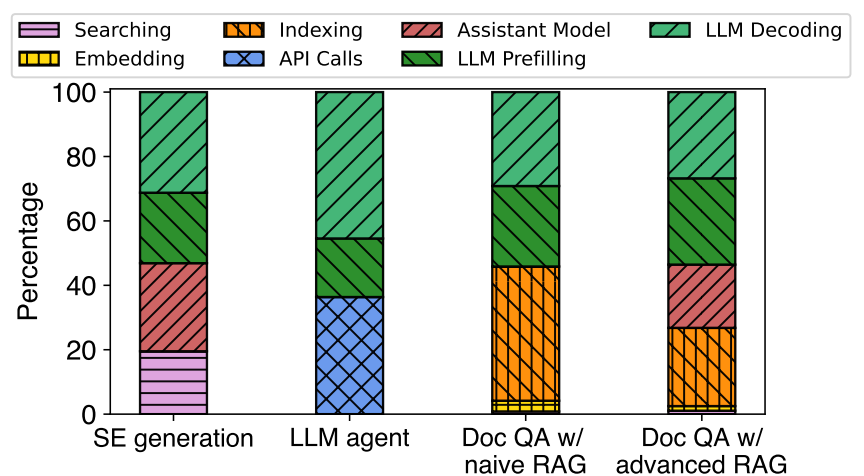

> 配图来源：ASPLOS 正式版 Figure 1，PDF 第 2 页。仅裁取原图图形区域，未改写数据或图例。

### 1.2 现有框架的第一类问题：模块是黑盒

LlamaIndex、LangChain、PAI-RAG、Azure-RAG 等框架通常把应用表示为一串 task modules。一个模块内部可能包含多个细粒度操作，但 orchestrator 只看到模块边界，无法利用模块内部的数据依赖关系。

例如：

```text
Indexing
  = Embedding + Data Ingestion

Query Expansion
  = LLM Prefilling + LLM Decoding

LLM Synthesizing
  = Prefilling + Decoding
```

如果只以 module 为调度单位，Embedding 与 Query Expansion 是否真正依赖就不会被显式表达；跨 module 的并行机会自然被隐藏。

### 1.3 现有框架的第二类问题：backend 优化目标错位

当前 execution engine（如 Triton、vLLM）通常只看到一个个 request，并围绕 request latency / throughput 做 batching 或 scheduling。

但用户感知的是：

> **整个 application query 什么时候完成。**

因此，单个 request / batch 的最优选择，不一定是整个 workflow 的最优选择。

### 1.4 Ayo 的总体解决路线

Ayo 做了两步抽象变化：

```text
Module-level Workflow
        ↓
Primitive-level Dataflow Graph (p-graph)
        ↓  Graph Optimization
Optimized Execution Graph (e-graph)
        ↓
Graph Scheduler + Engine Scheduler
        ↓
Backend Engines
```

Graph Optimizer 负责暴露和优化 workflow parallelism；Runtime Scheduler 负责在多 query、多 primitive 竞争 backend 时利用 graph semantics 做更合理的 batching。

---

## 2. Section 2.1 — LLM-based Applications：作者选了哪些真实 workflow？

### 2.1 Figure 2：五类 workflow

**Figure 2(a) Search engine-empowered generation**：

```text
Question
  ↓
Proxy Model
  ↓
Judge Model ──→ Search Engine
  ↓
LLM Synthesizing
  ↓
Output
```

Proxy / Judge 用于判断是否需要搜索，再把搜索结果交给 core LLM。

**Figure 2(b) LLM agent with function calls**：

```text
Question → LLM Planner → Email API / Other APIs → LLM Synthesizing → Output
```

**Figure 2(c) Document QA with naive RAG**：

```text
Docs → Indexing ───────────────┐
                               ↓
Question → Query Embedding → Vector Searching → LLM Synthesizing → Output
```

**Figure 2(d) Document QA with advanced RAG**：在 naive RAG 基础上增加 Query Expansion 和 Reranking：

```text
Question → Query Expansion → Query Embedding → Vector Searching → Reranking → LLM Synthesizing
Docs     → Indexing ────────────────────────────────────────────────┘
```

**Figure 2(e) Contextual Retrieval from Anthropic**：每个 chunk 在 indexing 前先用 LLM 生成 contextual summary，并与原 chunk 拼接，再做 embedding/search/reranking/generation。

> 未附图：五类 workflow 已在本节逐项转写为 ASCII 流程，原图不再提供额外定量关系。

### 2.2 Table 1：这些 workflow 是否常见？

作者搜索 GitHub “LLM applications”，选择 30 个 best-matched 且 stars > 1,000 的项目，并人工检查是否存在上述 pattern。

**Table 1**：

| Workflow | Count | Proportion |
|---|---:|---:|
| SE generation | 16 | 53.33% |
| LLM agent | 13 | 43.33% |
| Doc QA w/ naive RAG | 26 | 86.67% |
| Doc QA w/ advanced RAG | 23 | 76.67% |

作者据此说明这些 workflow 在开源 LLM applications 中具有较高普遍性，尤其是 RAG-based QA。

**证据边界**：这只是 30 个项目的 manual case study；论文没有声称它等价于完整产业 workload survey。

---

## 3. Section 2.2 — Fine-grained Orchestration：为什么需要 task primitive？

### 3.1 核心抽象：task primitive

Ayo 不再把 module 作为最细 orchestration unit，而定义 **task primitive（简称 primitive）**。

primitive 是 workflow-level symbolic node，负责一个具体 primitive operation，并带 metadata profile。论文将其类比于 TensorFlow graph 中的 operation node。

primitive 可以是：

- execution engine 中已有的标准操作：Embedding、Searching、Reranking、Ingestion；
- 从大操作继续分解出的操作：Prefilling、Decoding、Partial Prefilling、Full Prefilling、Partial Decoding；
- control-flow 操作：Condition、Aggregate。

每个 primitive profile 包括：input、output、parents、children，以及 batch size、prompt、target execution engine 等属性。

### 3.2 Figure 3：Ayo 全文最关键的 representation 变化

**Figure 3(a)** 是现有 module-level workflow。作者特别强调：这里的箭头主要表示 execution order，**不是精确 data dependency**。

**Figure 3(b)** 把 module 展开成 primitive-based dataflow graph。此时箭头才表示 **primitive 之间真实的数据依赖**。

**Figure 3(c)** 在 p-graph 上进行 optimization 后得到 execution graph；示例中端到端 execution time 从 **4.1 s 降到 2.4 s**。

其中两个直观机会是：

1. **跨 module parallelization**：Indexing 内的 Embedding / Data Ingestion 与 Query Expansion 的 Prefilling / Decoding 由于输入独立，可以并行。
2. **细粒度 pipelining**：Query Expansion 逐步生成新 query 时，不必等所有 query 生成完再开始 embedding；每个完整 query 一生成就可以流向 downstream。

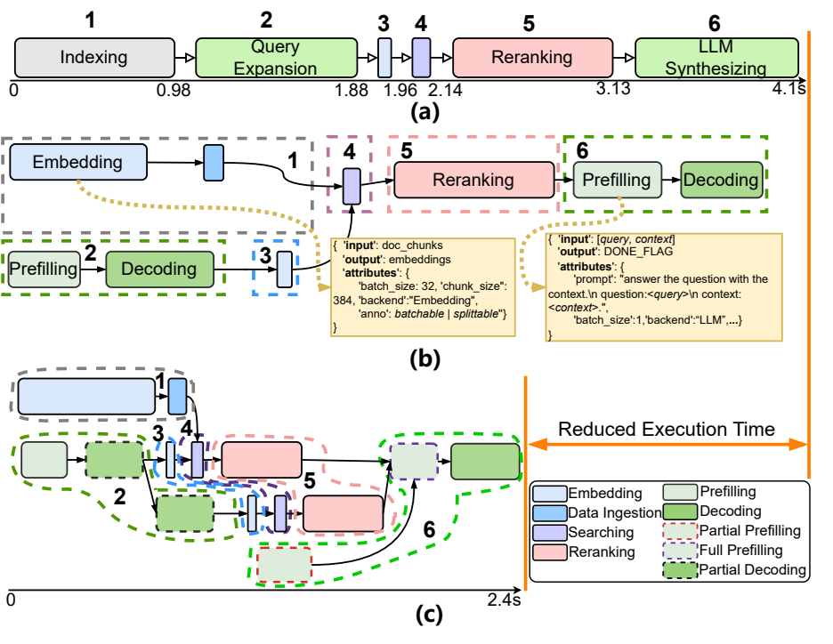

> 配图来源：ASPLOS 正式版 Figure 3，PDF 第 4 页。仅裁取原图图形区域，未改写节点、连线或时间标注。

### 3.3 论文在这里真正改变了什么？

不是“给原 pipeline 加几个并行线程”，而是：

> **先把 module execution order 重新还原为 primitive data dependency。**

只有这样，optimizer 才能判断哪些边是真的 dependency，哪些只是高层 framework 的顺序约束。

---

## 4. Section 2.3 — Application-Aware Scheduling：为什么 request-level batching 不够？

### 4.1 Figure 4(a)：request correlation

假设同一个 Query A 的 indexing 产生 **48 个 embedding requests**。

传统 request-level engine 在缺少 application information 时采用 batch size = 4，总完成时间是 **1.8 s**。

如果知道这 48 个 request 属于同一 primitive，目标应该是尽快完成整个 primitive，而不是最小化单个 batch latency。作者示例把 batch size 调到 16，总 completion time 变成 **1.35 s**，约 **1.3× speedup**。

这里暴露的是：

> **同一 primitive 内 request 的 correlation。**

### 4.2 Figure 4(b)：request dependency

Tree-based LLM synthesis 会产生具有依赖树关系的一系列 LLM requests。传统 scheduling 用 batch size = 2，示例总时长 **1.6 s**。

如果知道 request 位于 dependency tree 的什么位置，就可以按同一 depth 的 requests 形成不同大小 batch，使整个 tree 更快推进；示例为 **1.15 s**，约 **1.4× speedup**。

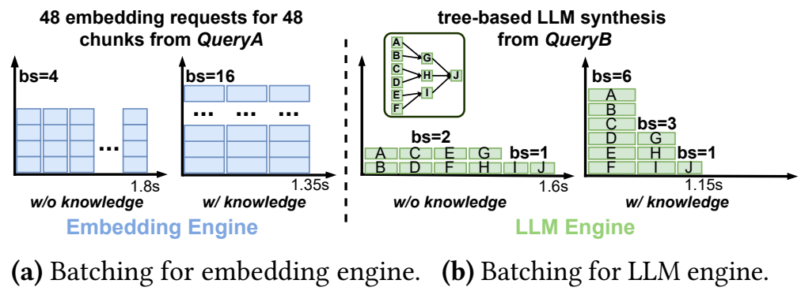

> 配图来源：ASPLOS 正式版 Figure 4，PDF 第 4 页。仅裁取原图图形区域，保留原始 batch size 与时延标注。

### 4.3 Section 2 的完整逻辑

Ayo 的 fine-grained orchestration 同时解决两个问题：

```text
Primitive Graph
   ├─ 暴露跨 module 的 parallelization / pipelining
   └─ 暴露 request correlation / dependency 给 scheduler
```

因此 graph representation 不是单纯 compiler IR，而是 optimizer 与 runtime scheduler 的共同信息基础。

---

## 5. Section 3 — Design Overview

### 5.1 Section 3.1 / Figure 5：系统架构

Ayo 分为 offline stage 与 online stage。

#### Offline stage（Figure 5 中 ①）

开发者提前提供：

- **Execution Engine Registry & Profile**：注册 embedding、LLM、database 等 execution engines，并提供不同 input size 下的 latency profile，例如 batch size、sequence length；
- **Workflow Template**：定义 application 的高层 components 及执行序列；
- **Optimization Strategies**：可注册针对某些 primitive / pattern 的 optimization pass。

#### Online stage（Figure 5 中 ②–④）

用户 query 到达后：

1. Frontend 接收 query data + workflow configuration；
2. Graph Optimizer 构建 per-query primitive-level **p-graph**；
3. Graph Optimizer 应用 optimization passes，生成 **e-graph**；
4. Runtime 执行 e-graph，由 Graph Scheduler 和 Engine Scheduler 两层完成调度，最后把结果返回 frontend。

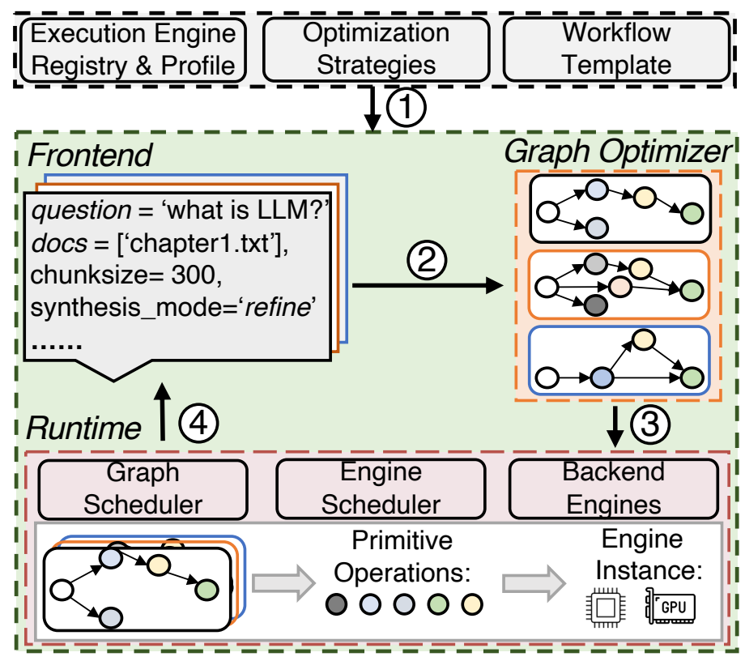

> 配图来源：ASPLOS 正式版 Figure 5，PDF 第 5 页。仅裁取原图图形区域，未改写组件或数据流。

### 5.2 Section 3.2：Ayo API

**Code Listing 1** 展示简化 API。

#### Execution engines

开发者通过 `Engine(...)` 注册 backend，backend 可以是：

- model-free：database 等 CPU-based operations；
- model-based：embedding model、reranker、LLM 等。

同一个 engine 可以服务多个 workflow components。例如 Advanced RAG 中 Query Expansion 与 LLM Synthesizing 可以共享同一 LLM engine。

#### Workflow definition

开发者仍定义 high-level workflow，而不是手工写完整 primitive graph。

关键 annotation：

- **batchable**：输入之间独立，允许 batching / stage decomposition；
- **splittable**：输出可以语义拆分，允许 partial output 被 downstream 提前消费。

`>>` operator 用于声明 component execution sequence。

#### Declarative query

除了问题和 context，query 还可以携带 workflow 参数，例如 document chunk size、LLM prompt template、synthesis mode。

**设计意图**：开发者仍获得类似现有 LLM framework 的高层接口；细粒度 graph construction 和 scheduling 由 Ayo 隐藏。

---

## 6. Section 4 — Graph Optimizer

Graph Optimizer 的核心流程：

```text
Workflow Template T + Query-specific Configuration C
                    ↓
             GraphTransform
                    ↓
                p-Graph Gp
                    ↓
                GraphOpt
                    ↓
                e-Graph Ge
```

### 6.1 Section 4.1 / Table 2：Primitive 类型

**Table 2** 给出 Figure 2(d) 中的 primitive examples：

| Type | 论文定义 |
|---|---|
| Reranking | 计算并排序 query-context relevance score |
| Ingestion | 把 embedding vectors 写入 vector database |
| Searching | 在 database 中执行 vector search |
| Embedding | 为 docs / questions 创建 embedding vectors |
| Prefilling | LLM inference 的 prefilling 部分 |
| Decoding | LLM inference 的 decoding 部分 |
| Partial Prefilling | 对 prompt 的部分 prefix 做 prefilling |
| Full Prefilling | Partial Prefilling 后对剩余 prompt 做 prefilling |
| Partial Decoding | 完整 decoding 的一部分输出 |
| Condition | 条件分支 |
| Aggregate | 聚合多个 primitive 的结果 |

> 未附表截图：primitive 类型和字段已完整转写为上方 Markdown 表格。

### 6.2 Algorithm 1：Graph transformation

#### 输入

原始 workflow template：

\[
T=(T_N,T_E)
\]

其中：

- \(T_N\)：template components；
- \(T_E\)：component dependency / execution structure。

再结合 query-specific configuration \(C\)。

#### 输出

primitive-level p-graph：

\[
G_p=(V_N,V_E)
\]

#### 步骤

**Step 1 — DecomposeComponent**：遍历每个 template component，根据 query configuration 把它展开为 primitive subgraph。

例如 LLM synthesizing 采用 refine mode 且有 3 个 context chunks 时，可显式展开为多组 chained Prefilling / Decoding primitives。

**Step 2 — Configure**：根据 query configuration 给 primitive 设置 metadata。

**Step 3 — 收集 subgraph primitives / edges**：加入 \(V_N,V_E\)。

**Step 4 — 保留原 component-level dependency**：对 template 中每条 \((t_i,t_j)\) 边，把 \(t_i\) 的 tail primitive 与 \(t_j\) 的 head primitive 连接起来。

#### 为什么这样设计？

Ayo 先“保守地”继承原 workflow correctness，再在后续 pass 中分析哪些依赖是冗余的。这样不会一开始就为了追求 parallelism 破坏数据语义。

### 6.3 Algorithm 1：Graph optimization

GraphOpt 依次应用：

1. **Pass 1 — Dependency pruning**
2. **Pass 2 — Stage decomposition**
3. **Pass 3 — LLM prefilling split**
4. **Pass 4 — LLM decoding pipeling**

论文明确称这些为 **static, rule-based optimizations**。

> **重要边界：论文没有证明最终 e-graph 是全局最优 execution plan；也没有 cost-based exhaustive search。**

> 未附算法截图：输入、输出和转换步骤已在下文逐项展开，保留可检索文字比截图更适合复习。

---

## 7. Section 4.2 — 四个 Optimization Pass 逐个精读

### 7.1 Pass 1 — Dependency pruning

#### 输入

当前 p-graph，以及每个 primitive 的 input / upstream information。

#### 步骤

1. 检查 primitive 实际需要哪些 input；
2. 对比当前 inherited upstream edges；
3. 删除不对应真实 data dependency 的冗余边；
4. 让 independent primitives / branches 可以并行执行。

#### 为什么需要？

原 workflow template 的边主要表达高层 component execution sequence。细化成 primitive 后，这些 sequence edges 可能过度约束。

论文示例中 Query Expansion 和 Embedding 相关 primitive 被从原顺序中解耦，形成独立 branch（Figure 3(c) / Figure 6）。

#### 论文没有证明

论文没有提出一般意义上的 formal dependency inference algorithm；这里依赖 primitive input / output metadata 和静态规则。

---

### 7.2 Pass 2 — Stage decomposition

#### 输入

- 一个 **batchable primitive**；
- 该 primitive 的 input size；
- execution engine profile 中的 **maximum efficient batch size**。

#### 步骤

当 input size 大到达到 engine 的 maximum efficient batch size 时：

1. 将 primitive 拆成多个 stages；
2. 每个 stage 处理一个 sub-micro-batch；
3. 允许当前 stage 的 downstream primitive 提前启动，与后续 stage pipeline；
4. 必要时在 pipeline 尾部插入 **Aggregate primitive** 同步 / 聚合结果。

#### 为什么不搜索最优 micro-batch size？

作者明确给出理由：

- 更激进的拆分可能增加 pipeline degree；
- 但相邻 batchable primitives 会形成指数级 search space；
- latency-sensitive scenario 下寻找最优 split size 成本太高。

因此 Ayo 采用 heuristic：**当 input size 达到 maximum efficient batch size 时才显式 segmentation**。

#### 设计取舍

这不是追求最优分块，而是用 profiling + 简单规则换取低 optimizer overhead。

---

### 7.3 Pass 3 — LLM prefilling split

#### 输入

一个 LLM Prefilling primitive，其 prompt 由多个部分组成，例如：

```text
instruction + question + retrieved context
```

#### 核心观察

RAG 中 instruction / question 往往很早就已知，而 retrieved context 需要等待 search / reranking。

传统执行：

```text
等待所有 prompt 部分 ready → 一次完整 Prefilling
```

Ayo：

```text
已知 prefix → Partial Prefilling
          与 retrieval 并行
retrieved context ready → Full Prefilling
```

#### 为什么成立？

作者利用 LLM attention 的 **causal prefilling** 属性：已经 ready 的 prefix 可以先计算，后续剩余 prompt 再继续。

#### 工程要求

这不是单纯 graph rewrite。§6 明确说明作者修改 vLLM，使其支持 Table 2 中的 **Partial Prefilling / Full Prefilling**。

因此这一 pass 与 backend 有实际 coupling。

---

### 7.4 Pass 4 — LLM decoding pipeling

#### 输入

一个被标记为 **splittable** 的 LLM decoding call。

#### 核心观察

LLM decoding 是 incremental 的。如果 Query Expansion 需要输出 3 个新 query，没有必要等待完整 decoding 结束才做 embedding/search。

#### 步骤

1. parser 持续观察 progressive structured output（论文举例 JSON）；
2. 一旦出现一个语义完整 piece，例如 `new query #0`；
3. 立即把该 piece 交给 downstream batchable primitive；
4. LLM 继续生成后续 pieces，与 downstream execution pipeline。

#### 为什么必须 `splittable`？

如果输出不能被语义安全地切成独立部分，partial token stream 不能直接作为 downstream input。

#### 论文中 Figure 6 的体现

`PD0 → New query #0 → Embedding → Searching → Reranking` 与 `PD1 / PD2` 形成 pipeline。

---

## 8. Figure 6 — Advanced RAG 的完整 optimized e-graph

**Figure 6** 是理解四个 pass 如何组合的核心图。场景是：

- Advanced RAG；
- Query Expansion 生成 3 个 new queries；
- 最终使用 top 3 chunks；
- LLM Synthesizing 采用 refine mode：先用 top chunk 生成 initial answer，再用其余两块 refine 两次。

图中可对应：

- **Pass 1**：Docs / Question 两条 branch 的不必要 dependency 被裁掉；
- **Pass 2**：document embedding 大任务被拆为 batch #0 / #1，与 Ingestion pipeline；
- **Pass 3**：多个 LLM call 的可提前 prompt prefix 执行 Partial Prefilling；
- **Pass 4**：Query Expansion 的 partial decoding 一旦产生完整 query，就进入 Embedding → Search → Reranking。

一个简化版本：

```text
Docs ──→ Embed(batch0) → Ingest ──┐
   └──→ Embed(batch1) → Ingest ──┤→ Aggregate
                                 │
Question → LLM Prefill → PD0 → Embed → Search → Rerank ─┐
                     ├→ PD1 → Embed → Search → Rerank ─┼→ Aggregate
                     └→ PD2 → Embed → Search → Rerank ─┘

Question / instruction → Partial Prefilling ─────────────┐
Retrieved context --------------------------------------┴→ Full Prefilling → Decoding
```

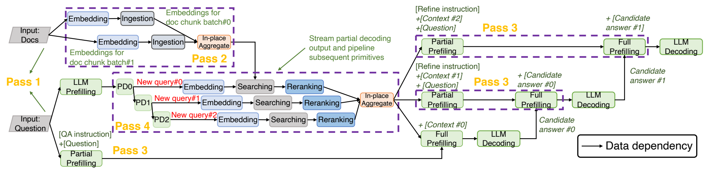

> 配图来源：ASPLOS 正式版 Figure 6，PDF 第 7 页。仅裁取原图图形区域，保留 pass、primitive 与数据依赖标注。

### 8.1 Optimization procedure

论文描述 optimizer 会反复 traverse p-graph，匹配各 pass 的 pattern；找到匹配后修改 primitive，直到没有进一步优化机会。为了降低 overhead，可以 cache optimized subgraph 的结果。

**论文未给出**各 pass 发生冲突时的复杂 cost model，也未给出对 pass order 全局最优性的证明。

---

## 9. Section 5 — Runtime Scheduling

Ayo 使用 **two-tier scheduling**：

```text
Upper Tier: Graph Scheduler
               ↓
Lower Tier: Engine Scheduler(s)
               ↓
Engine Instances
```

把 graph progress 与 engine-level request fusion 分开，作者认为这样更利于 scalability / extensibility。

### 9.1 Section 5.1 — Graph Scheduler

#### 输入

每个 query 的 optimized **e-graph**。

#### 执行逻辑

1. 维护每个 primitive 的 in-degree；
2. 当 in-degree 变为 0，primitive ready；
3. 将 **primitive node 本身** dispatch 到对应 Engine Scheduler；
4. primitive 执行完成后通过 RPC 通知 scheduling thread；
5. output 被传输，downstream nodes 的 in-degree 递减；
6. 新 ready primitives 继续被 dispatch。

#### 为什么 dispatch node，而不是只 dispatch requests？

因为 lower-level scheduler 必须知道 request 的来源：

- 属于哪个 primitive；
- 属于哪个 query；
- 与 sibling requests 的 correlation；
- 与其他 primitive 的 dependency / topology。

如果只把 request 扁平化，Ayo 的 application-aware scheduling 信息就丢失了。

#### Per-query object store

Ayo 为每个 query 设置 object store 管理 intermediate outputs：

- 作为 pending primitive 的 input repository；
- 提供“一定程度”的 operation failure tolerance。

**论文没有展开完整 fault-tolerance protocol，因此不能把这一点扩写成完整容错机制。**

---

## 10. Section 5.2 — Engine Scheduler 与 Topology-aware Batching

### 10.1 Engine Scheduler 的职责

每种 execution engine 有独立 scheduler，负责：

- 管理同类 engine instances；
- 管理 pending primitive nodes；
- 把来自不同 query / primitive、但请求同一 engine 的工作进行 fusion / batching。

### 10.2 Strawman：blind batching

naive scheduler 把所有 requests 一视同仁：

```text
FIFO queue → 达到 max batch size 或 timeout → execute
```

问题是：**不同 ready primitive 对整个 graph progress 的贡献并不相同。**

### 10.3 Figure 7：为什么“ready”不等于“现在值得执行”

Figure 7 中 Query 1 的 A、B 和 Query 2 的 G、H 都请求 LLM engine。

Blind batching 可能先 batch A+B；但是 B 的 child E 还依赖另一个尚未完成的 D，因此此时执行 B 并不能让 E ready。

相反，把 A 与 G 一起执行可以同时推进两个 query。

Figure 7 illustrative numbers：

- Blind batching：下一节点 trigger time 为 0.8 s / 1.3 s；
- Topology-aware batching：0.8 s / 0.8 s。

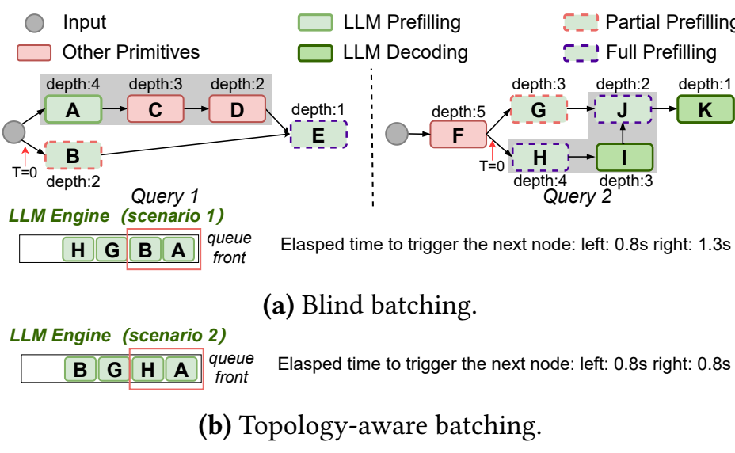

> 配图来源：ASPLOS 正式版 Figure 7，PDF 第 8 页。仅裁取原图图形区域，未改写 depth、队列顺序或时延标注。

---

## 11. Algorithm 2 — Topology-aware batching

Algorithm 2 分为两个 event。

### 11.1 Event 1：在 e-graph 上计算 depth

#### 输入

query 的 optimized e-graph \(G\)。

#### 步骤

1. 对 \(G\) 做 reverse topological sort；
2. 初始化 node depth；
3. 从 output 方向反向传播：

\[
p.depth=\max(p.depth, v.depth+1)
\]

输出 node depth 最小，越“靠上游”的 node 通常 depth 越大。

#### 为什么用 depth？

作者的逻辑是：depth 提供一个 cheap heuristic，反映 primitive 还有多少 dependency structure 需要推进。

**论文明确承认：depth 不能准确等价于 critical path，因为真实 execution latency 不可预测。**

### 11.2 Event 2：Engine Scheduler 形成 batch

#### 输入

- Engine Scheduler pending queue；
- 预先配置的 maximum batch size / maximum token size。

#### 步骤

1. 将同一个 query 的 pending primitive nodes 放进同一 bucket；
2. bucket 按其中 earliest-arriving node 的时间排序；
3. 在当前 bucket 内优先选择 **highest-depth primitive**；
4. 从该 primitive 关联 requests 中取 candidate，直到 batch slots 填满；
5. 某 node 的所有 requests 都被 schedule 后，从 bucket 移除该 node；
6. 继续处理后续 bucket。

> 未附算法截图：depth 计算与 batch formation 已在下文按两个事件逐步展开。

### 11.3 这个算法到底利用了什么 information？

Ayo 不是单纯“按 depth 排请求”，而同时利用：

- **query identity**：同 query 先 grouped into bucket；
- **primitive correlation**：同一 node 关联的 requests 作为整体被理解；
- **graph dependency / depth**：决定 primitive priority；
- **engine efficient batch size**：控制 batch capacity；
- **arrival time**：bucket 层面保留 FIFO-like 顺序。

### 11.4 论文没有证明什么？

- 没有证明 topology-aware batching 是最优 scheduler；
- 没有证明 depth 等价于 critical path urgency；
- 没有给出完整 SLO / fairness optimization；
- 没有建立动态 service-time prediction 参与优先级。

---

## 12. Section 5.3 — Co-located Applications

Ayo 可以在同一 infrastructure 上同时处理多个 applications，但不同 application 的 e-graphs 仍然 **independently orchestrated**。

论文明确指出尚未利用的机会：

- 如果多个 applications 共享同一 LLM / model，可以进一步做 cross-application KV cache sharing；
- 这类 cross-app joint optimization 是 future work。

因此不能把 Ayo 描述成“已经做了跨应用联合 graph optimization”。

---

## 13. Section 6 — Implementation

### 13.1 Prototype

Ayo 约 **5,300 lines of Python**。

主要依赖：

- **Ray**：distributed scheduling and execution；
- **LlamaIndex**：text chunking、HTML / PDF parsing 等 preprocessing；
- **PostgreSQL**：default database；
- **pgvector**：vector search engine；
- **Google Custom Search**：search engine，支持 single / batched requests；
- **vLLM**：LLM serving；作者修改它以支持 Partial Prefilling / Full Prefilling；
- **FastAPI**：query/config frontend。

### 13.2 Runtime implementation

Graph Scheduler 使用 thread pool，每个新 query 分配 dedicated thread，用于 graph construction、optimization、dispatch。

Engine Scheduler 除了 §5 的 batching，还负责 instance load balancing：

- general engines：主要使用 number of executed requests；
- LLM：主要使用 occupied KV cache slots。

### 13.3 Mitigating communication overhead：dependent pre-scheduling

中央 scheduler 会产生 primitive 间通信 overhead。对于相邻 primitives A → B，如果：

- 数据交互很大；或
- 二者使用相同 execution engine；

Ayo 可以同时 issue A 和 B，让 B 先等待 A output。

A 完成后：

```text
A output → scheduler
        └→ B's execution engine directly
```

避免 A output 先经 scheduler relay、再重新 issue B 的额外通信路径。

---

# ▎第三层 · 实验与批判性评估

## 14. Section 7 — Evaluation Setup

### 14.1 Testbed setup

论文明确给出的硬件：

- 每个 embedding / non-LLM model engine instance：**1× NVIDIA RTX 3090 24GB**；
- gemma-2-2B instance：**1× RTX 3090**；
- llama-2-7B instance：**1× RTX 3090**；
- llama-2-13B instance：**2× RTX 3090**；
- llama-30B instance：**2× NVIDIA A800 80GB**；
- server 间网络：**100 Gbps**。

§7.1 主实验资源分配：

- each non-LLM engine：1 instance；
- each LLM：2 instances。

**论文未给出的环境**：完整 CPU 型号、主机内存容量、服务器数量等没有在正文完整列出，不能自行补全。

### 14.2 Baselines

#### LlamaDist

作者基于 Ray 实现的 distributed LlamaIndex：module-level chain，使用与 Ayo 相同 backend engines，主要差异是 orchestration granularity。

#### LlamaDistPC

PC = **parallel & cache-reuse**。在 LlamaDist 基础上：

- 手工并行 predefined pipeline 中的 independent modules；
- 使用 LLM prefix caching，避免重复计算 prompt 中 partial instructions。

它是比普通 LlamaDist 更强的 baseline。

#### AutoGen

把 application 拆成 agents，每个 agent 管理若干 modules，再按 predefined graph 通信；仍然属于较 coarse-grained orchestration。

### 14.3 两类 baseline engine scheduling

#### Per-Invocation oriented（PO）

作者对 baseline 做了增强：同一次 invocation 内 requests 被作为 bundle，使 baseline 也获得一定 correlation information。优化偏向 invocation latency。

#### Throughput oriented（TO）

预先 profile engine 的 maximum batch / token size：batch size 或 token size 按 2 的幂增加，直到 throughput 不再提升，然后使用 dynamic batching。

TO 追求 overall throughput，但忽略 request relationships。

### 14.4 Applications / datasets / workload

论文正文此处写 “experiments cover three applications”，但随后实际列出 **四类 application**，Figure 8 也明确有四行。本笔记按实际列出的四类记录，不擅自替作者改正文。

#### A. Search engine-empowered generation

- dataset：WebQuestions、HotpotQA；
- proxy/judge：llama-2-7B；
- search result：top 4 entities；
- workload arrival：Poisson distribution-based synthesis。

#### B. Document QA with naive RAG

- dataset：FinQAbench、TruthfulQA；
- chunk size：256；
- overlap：30；
- embedding：bge-large-en-v1.5；
- vector DB：PostgreSQL + pgvector；
- retrieval：top 3；
- generation：tree-based mode；
- workload arrival：Poisson distribution-based synthesis。

#### C. Document QA with advanced RAG

在 naive RAG 上增加：

- Query Expansion：默认 3 new queries；
- 每个 query 搜索 16 chunks；
- reranker：bge-reranker-large；
- 最终 overall top 3 chunks；
- generation：refine mode。

#### D. Contextual Retrieval

- contextualization：gemma-2-2B；
- 每个 chunk 与 4 个 neighboring chunks 一起 contextualize；
- fetch 32 chunks；
- rerank 后 top 3；
- core LLM one-shot generation。

所有模型默认 half precision；core LLM 测了不同 7B / 13B / 30B 配置。

---

## 15. Section 7.1 — End-to-end Performance（Figure 8）

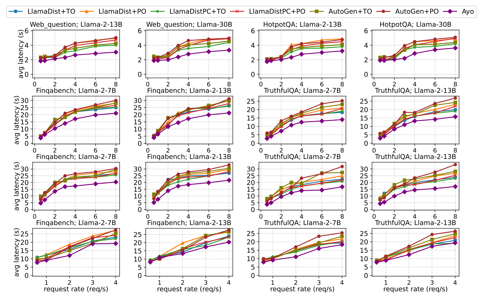

> 配图来源：ASPLOS 正式版 Figure 8，PDF 第 10 页。保留完整 4×4 子图、方法图例、坐标轴与单位。

### 15.1 Search engine-empowered generation

**结果**：Ayo 相比其余六种 scheme 最多 **1.79× speedup**。

作者解释：

- judge / core LLM 的 instruction/question 可进行 parallelizable Partial Prefilling；
- application-aware batching 更好协调不同 engines；
- LlamaDist module sequential execution 丢失并行机会；
- PO 在 high request rate 下 queue time 变长，TO 通常更好；
- LlamaDistPC 的 prefix caching 对约 60-token instruction prefix 收益有限。

**作者声称实验说明**：Ayo 在较简单 workflow 中仍能通过 fine-grained prefilling parallelization 与 batching coordination 降低 E2E latency。

### 15.2 Document QA with naive RAG

**结果**：

- low request rate：最多 **1.62×**；
- high request rate：最多 **1.67×**。

作者解释：

- Indexing 与 Query Embedding 共享 embedding model，存在复杂 request correlation；
- tree-based LLM synthesis 存在 request dependency；
- Ayo 对 large embedding 做 pipelining；
- 探索更多 Partial Prefilling parallelization；
- topology-aware batching 根据 e-graph 的 dependencies / correlations 形成 batch。

**实验真正支持的结论**：仅追求 throughput（TO）或单 invocation latency（PO）都可能遗漏 graph structure；Ayo 在该 workload 中能利用这些结构降低平均 E2E latency。

### 15.3 Document QA with advanced RAG

这是论文最复杂、Ayo 收益最高的 workload。

**结果**：

- low request rate：最多 **2.09×**；
- high request rate：最多 **2.03×**。

作者对应 Figure 6 解释收益来自：

- independent dataflow branches 的 parallelization；
- 不同 LLM calls 的 Partial Prefilling；
- large embedding 的 stage decomposition；
- Query Expansion decoding 的 3 个 Partial Decoding pipelines；
- topology-aware batching。

**作者声称实验说明**：复杂 workflow 暴露更多 primitive-level parallelization / pipelining opportunity，因此 fine-grained orchestration 收益最明显。

### 15.4 Contextual Retrieval

**结果**：Ayo 相比 baselines 为 **1.06×–1.59× speedup**。

作者明确解释：contextualization 需要处理大量 chunks，占据大量时间，但这部分可应用的 graph-level optimization 较少，因此 Ayo 收益不如 Advanced RAG。

**这组实验很重要，因为它给出了方法边界**：当 critical path 本身缺少可拆、可并行、可流水的结构时，Ayo 不会自动获得接近 2× 的收益。

---

## 16. Section 7.2 — Co-located Applications（Figure 9）

设置：

- 同时运行 naive RAG + advanced RAG；
- core LLM：llama-2-13B；
- dataset：TruthfulQA；
- request rate：**3 req/s per application**；
- baseline：更强的 LlamaDistPC + TO / PO。

**结果**：Ayo 相比 LlamaDistPC 保持 **1.2×–1.55× latency speedup**。

作者解释为 Ayo 的 app-agnostic graph optimization 与 app-aware scheduling 仍能在 co-location 下工作。

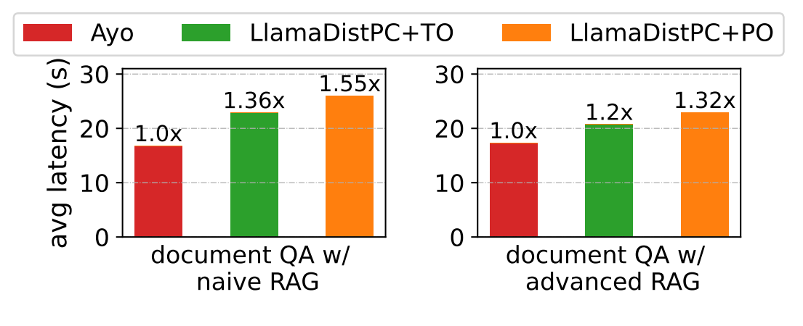

> 配图来源：ASPLOS 正式版 Figure 9，PDF 第 11 页。仅裁取原图图形区域，保留正式版 Ayo 图例与相对延迟标注。

### 16.1 不能扩大解释的地方

论文没有做：

- cross-application graph fusion；
- shared LLM 的 cross-app KV cache reuse；
- app priority-aware joint resource scheduling。

论文只证明“co-location 下仍有收益”，不能写成“已解决跨应用联合优化”。

---

## 17. Section 7.3 — Ablation Study

### 17.1 Figure 10：Graph Optimization Ablation

设置：Advanced RAG + TruthfulQA + llama-30B。

单 query 结果（相对 Full）：

| Configuration | Relative latency shown in Figure 10 |
|---|---:|
| w/o parallelization & pipelining | 1.73× |
| w/ pipelining only | 1.55× |
| w/ parallelization only | 1.40× |
| Full optimization | 1.00× |

注意：Figure 中 1.73× / 1.55× / 1.40× 表示相对 Full **更慢**，不是这些配置获得了对应 speedup。

右侧 varying request rates 曲线同样显示 parallelization 和 pipelining 都有贡献，Full 最好。

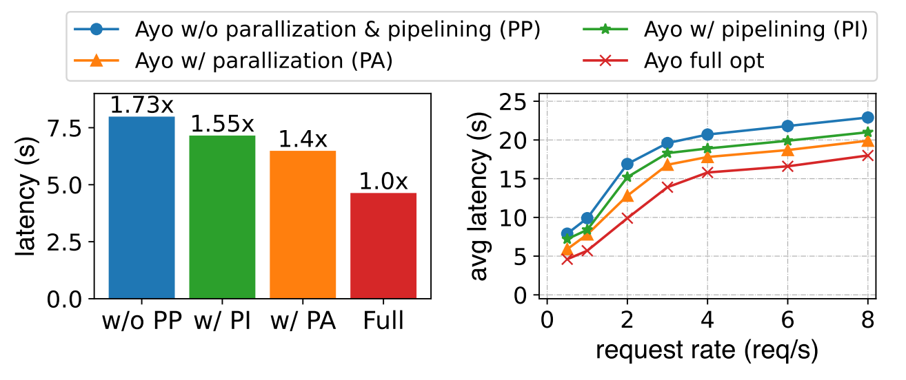

> 配图来源：ASPLOS 正式版 Figure 10，PDF 第 12 页。保留单 query 柱状图和不同请求速率下的曲线。

**实验真正支持**：Pass 1+3（parallelization）与 Pass 2+4（pipelining）都对端到端 latency 有独立贡献。

### 17.2 Figure 11：Topology-aware Batching Ablation

同一 setting。

- single query：topology-aware batching 平均带来 **1.15× speedup**；
- multi-query：平均 latency 最多降低 **19.2%**。

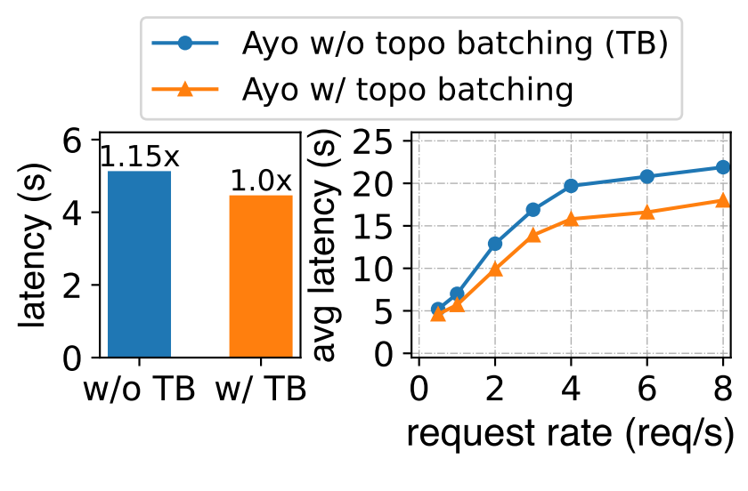

> 配图来源：ASPLOS 正式版 Figure 11，PDF 第 12 页。保留单 query 对照与不同请求速率下的平均延迟曲线。

**实验真正支持**：Ayo 的收益不只来自 Graph Optimizer；runtime 使用 primitive graph information 进行 batching 也有独立收益。

---

## 18. Section 7.4 — Overhead Analysis

### 18.1 Graph optimization overhead

利用 caching 后，e-graph optimization 占总 latency：**1.3%–3%**。

### 18.2 Communication overhead

由于 primitive 更细，跨 primitive communication 增多。Figure 12 case study 中：**3.1%–6.2%**。

### 18.3 Table 3：拆分 Prefilling 会损失局部 execution efficiency

**Table 3** 用 llama-2-7B 对比 decomposed Prefilling 与 single complete Prefilling：

| Partial Prefilling | Full Prefilling | Decomposed Total | Single Prefilling |
|---:|---:|---:|---:|
| 76.03 ms (200) | 215.89 ms (800) | 291.92 ms (1000) | 260.36 ms (1000) |
| 217.67 ms (850) | 222.66 ms (850) | 440.33 ms (1700) | 414.09 ms (1700) |
| 582.95 ms (2500) | 159.65 ms (500) | 742.60 ms (3000) | 720.15 ms (3000) |

作者总结 decomposition 的局部 slowdown 为 **3.11%–12.12%**。

原因包括：

- 可能重复移动 KV cache 到 SRAM；
- 分段后 GPU utilization 可能不如完整 Prefilling。

但作者报告，通过换取 workflow parallelism，critical-path prefilling latency 最终可降低 **17.1%–77.9%**。

> 未附表截图：prefilling decomposition 的原始数值和相对损失已完整转写为上方 Markdown 表格。

### 18.4 Figure 12：高负载下 queuing 主导

Advanced RAG + TruthfulQA case study 中，随着 request rate 增加，queuing latency 占比升高；GraphOpt 与 communication overhead 仍较小。

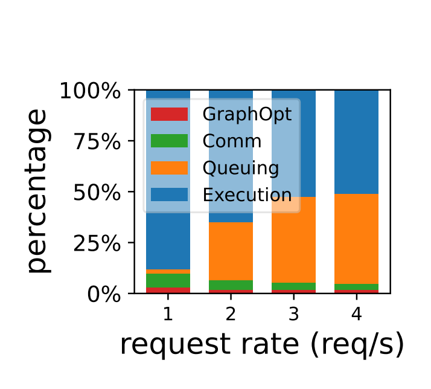

> 配图来源：ASPLOS 正式版 Figure 12，PDF 第 12 页。保留 GraphOpt、通信、排队与执行四个阶段的百分比堆叠。

### 18.5 这个 overhead 实验最值得记的点

Ayo 的系统思想不是“每个 primitive 都更快”，而是：

> **允许局部 operation efficiency 变差，只要换来的 global parallelism 能缩短 application critical path。**

这是典型的 end-to-end systems trade-off。

---

## 19. 实验到底证明了什么，以及没有证明什么

### 19.1 论文较有力地证明了

在作者测试的 structured LLM workflows、硬件与 workload 下：

- primitive-level graph 能暴露实际可利用的 parallelization / pipelining；
- topology-aware batching 能利用 application graph information 改善平均 E2E latency；
- graph optimization 与 runtime scheduling 都有独立 ablation 支撑；
- 新增 graph / communication overhead 在给定 case study 中相对有限。

### 19.2 论文没有证明 / 未研究

- **未证明** e-graph 是理论全局最优计划；
- **未证明** topology depth 等价于 critical path；
- **未证明**任意 dynamic agent workflow 都可以 ahead-of-time 优化；
- **未证明**任意 application 都能获得接近 2× speedup；
- **未研究**回答准确率 / RAG quality 是否受到这些执行重排影响（主指标是 performance）；
- **未系统报告** P95 / P99 / SLO 等 tail-latency 指标；
- **未研究**跨 application KV cache sharing / graph fusion；
- **未完成** critical-path-aware resource allocation；
- **未提供**大规模生产集群下的广泛可扩展性结论。

---

## 20. Section 8 — Limitations and Future Work（优先采用作者原文）

### 20.1 Dynamic workflows

Ayo 主要面向预先由人设计、结构稳定的 workflow。Autonomous agents 可能运行时动态 plan / execute / self-reflect，执行前无法获得完整 primitive graph。

因此 Ayo 的 ahead-of-time graph optimization 会在 dynamic workflow，特别是 self-reflection 场景中遇到困难。

### 20.2 Coupling with the backends

为了 fine-grained orchestration，Ayo 需要 backend 支持 decomposed primitive operations 和某些 batching mechanisms；本文实际修改了 vLLM 支持 Partial / Full Prefilling。

作者明确把这描述为：

> performance 与 modularity 的 trade-off。

与完全 decoupled、pluggable backend 的 framework 相比，Ayo 工程侵入性更高。

### 20.3 Exploitation of critical path

当前 topology-aware batching 使用 depth，但 e-graph 的 critical-path information 还可以进一步利用：

- critical / non-critical path 的 resource allocation；
- 对 critical nodes 提升 scheduling priority。

难点是：准确 online critical-path prediction 和复杂 coordination。

---

## 21. Section 9 — Related Work：Ayo 在文献坐标系中的位置

### 21.1 LLM inference optimization

论文将 kernel optimization、request scheduling、model parallelism、KV cache、speculative decoding、prefill/decode disaggregation 等视作 **LLM engine 内部 point solutions**。

Ayo 认为这些工作与自身是 complementary：它关注的是整个 application workflow，而非单个 inference engine 内部。

### 21.2 LLM application frameworks / compilers

Parrot、SGLang 等已经开始利用多个 LLM requests 之间的 relationship、KV reuse 等 information，但 Ayo 强调自己的范围同时包含：

> **LLM + non-LLM components 的 end-to-end application orchestration。**

### 21.3 Data analytics systems

Ayo 借鉴了 Dryad、Spark、Legion 等数据分析系统中的 graph-based dependency analysis 思想，但针对 LLM workflow 引入了：

- LLM Prefilling / Decoding primitive；
- causal partial prefilling；
- streaming semantic decoding；
- application-aware engine batching。

---

# ▎第三层 · 批判性评估（笔记分析，不属于论文原文贡献）

## 22. 优点

### 22.1 Representation、Optimization、Runtime 是闭环设计

Ayo 最完整的地方是三层没有脱节：

```text
Representation: Module → Primitive Graph
Optimization:   p-Graph → e-Graph
Runtime:        Graph semantics → Engine batching
```

很多系统只提出一个 scheduler，但 scheduler 能看到的 state / semantics 没有变化；Ayo 先解决“什么信息进入 scheduler”的问题，再设计调度策略。

### 22.2 论文用 ablation 把收益拆开了

Figure 10 证明 graph optimization 不是空壳；Figure 11 又证明 topology-aware scheduling 不只是 graph optimizer 的附属实现。这个实验结构比较扎实。

### 22.3 Table 3 很诚实地呈现局部损失

它没有把 primitive decomposition 描述成“每个算子都更快”。相反明确展示拆 Prefilling 会慢 3.11%–12.12%，但端到端关键路径更短。这使论文的 systems trade-off 更可信。

### 22.4 与经典 dataflow / database optimizer 思想有良好连接

从高层 execution order 恢复真实 data dependency、做 DAG rewrite、再把 graph state 交给 runtime，本质上很像 dataflow system / query optimizer 与 runtime 的结合，研究逻辑容易扩展。

---

## 23. 局限与额外边界分析

> 本节前 3 点来自作者 §8；其余标记为“笔记分析”。

### 23.1 作者局限：Dynamic workflow 不适配

如果 graph 运行时才长出来，AOT optimizer 的作用就显著下降。

### 23.2 作者局限：backend coupling 强

Partial / Full Prefilling 需要改 vLLM。Ayo 性能建立在“orchestrator 能深入控制 backend execution semantics”的假设上。

### 23.3 作者局限：没有真正 critical-path scheduling

depth 只是 static topology heuristic。

### 23.4 【笔记分析】缺少 tail latency / SLO 视角

Figure 8–12 主要围绕 average latency。对于 online serving，多 query scheduling 可能显著影响 P95/P99、starvation、fairness。Ayo 没有系统评估这些指标，因此不能直接推导它适合强 SLO workload。

### 23.5 【笔记分析】profile 稳定性假设较强

Stage decomposition 依赖 maximum efficient batch size，offline registry 也包含 latency profile。在动态 workload、heterogeneous endpoint、KV occupancy 快速变化时，静态 profile 是否可靠没有充分验证。

### 23.6 【笔记分析】graph progress 与实际 service cost 没有联合建模

Algorithm 2 主要用 depth + max batch/token size。一个 depth 高但输入 token 极大、service time 很长的 node，是否应该优先并不一定。论文自己也承认 depth ≠ critical path。

### 23.7 【笔记分析】只讨论 scheduling，较少讨论 admission / routing / backpressure

Engine Scheduler 会做 instance load balancing，但论文没有建立完整的 admission control、cross-endpoint routing、upstream backpressure 联合模型。这对高负载生产环境很关键。

---

## 24. 可信度评估

| 维度 | 评价 | 依据 |
|---|---|---|
| **问题动机** | 🟢 较强 | Figure 1 + 多类 workflow；问题本身真实 |
| **Baseline 公平性** | 🟢/🟡 | 使用相同 backend；还给 baseline PO/TO 两种 scheduling；但 LlamaDistPC 是作者实现的增强版本，不是独立现成 SOTA system |
| **主结果显著性** | 🟢 | Advanced RAG 可到 2.09×，多个 workload / request rates 一致受益 |
| **边界展示** | 🟢 | Contextual Retrieval 收益明显较小；Table 3 展示拆分局部损失 |
| **统计报告** | 🟡 | Figure 10 单 query 写明 10 runs；多数主图主要给均值，没有广泛置信区间 / tail distribution |
| **可复现性** | 🟢/🟡 | 代码开源，依赖组件大多公开；但需多 GPU / A800，且修改 vLLM，复现成本不低 |
| **局限讨论** | 🟢 | §8 对 dynamic workflow、backend coupling、critical path 都明确承认 |

---

# ▎第四层 · 与当前数据库 AI 负载执行与调度课题的连接

> **以下为基于论文 + 当前项目仓库方向的个人分析，不属于 Ayo 原文贡献。**  
> 当前项目仓库将研究对象定义为：数据库通过 planner-visible AI semantic operator 触发外部物理执行链，数据库持有 SQL / snapshot / child plan / query lifecycle，再通过受管理的 row-batch stream 进入数据组织、准入/路由、Ray runtime 与 vLLM/CLIP 等模型 backend。以下按这个边界比较。

## 25. Ayo 对课题最直接的价值：证明“请求不能被完全扁平化”

Ayo 的 Section 2.3 / Figure 4 已经明确说明：backend 如果只看到匿名 requests，就无法利用：

- request 属于哪个 application query；
- 属于哪个 primitive；
- 同 primitive requests 的 correlation；
- primitive 之间的 dependency；
- graph topology。

这对数据库触发 AI workload 非常直接。

数据库侧的 row / batch 在进入外部模型服务后，如果只变成：

```text
request 1, request 2, request 3, ...
```

则 SQL/job/operator 的语义就丢失了。

Ayo 可以作为一个强相关文献证据支持：

> **application / job semantics 应沿执行链传到 runtime scheduler，而不是在 HTTP/model-serving 边界被抹平。**

---

## 26. 可借鉴的系统分层：Graph Scheduler vs Engine Scheduler

Ayo：

```text
Graph Scheduler
      ↓
Engine Scheduler
      ↓
Engine Instance
```

当前课题可对应为：

```text
DB Job / AI Operator Scheduler
        ↓
Request Organizer / Admission / Routing
        ↓
Ray-side execution coordinator
        ↓
vLLM / CLIP endpoints
```

两者共同点是把两个问题分开：

1. **上层：哪些 work 现在具有执行资格 / 价值？**
2. **下层：这些 eligible work 如何 batch、route、admit 到具体执行资源？**

这比完全依赖 vLLM 自己的 continuous batching 更接近数据库驱动的 end-to-end objective。

---

## 27. Topology-aware batching 对课题的启发

Ayo Figure 7 的关键结论是：

> **ready 不等于应该立即执行。**

一个 request 已经 ready，但如果它完成以后仍不能解锁 downstream，那么当前占用 scarce serving capacity 的价值可能较低。

在数据库 AI job 中，这可以扩展为更丰富的 job urgency：

```text
urgency / priority
= job dependency
+ downstream blocking
+ upstream materialization progress
+ remaining work
+ endpoint queue / KV state
+ SLO / fairness semantics
```

Ayo 只使用 topological depth，因此为更动态的 scheduler 留出了明显空间。

---

## 28. Ayo 与课题的核心差异

### 28.1 Ayo 的主入口是 application workflow；课题主入口是 database-owned AI operator lifecycle

Ayo 的 workflow template 来自 application developer / LLM framework。

当前课题更强调：

- SQL / snapshot / child plan 仍由 database 持有；
- AI semantic operator 是 planner-visible；
- 外部 Ray/vLLM 是物理执行层，而不是把数据库完全绕过。

因此二者的 control-plane owner 不同。

### 28.2 Ayo 更偏 graph semantics；课题还关注 live serving state

Ayo topology-aware batching 主要利用 static graph depth；implementation 中 load balancing 会看 occupied KV cache slots，但 graph priority 与实时 endpoint state 没有形成完整联合决策。

当前课题可以进一步研究：

```text
DB Job Semantics
      +
Upstream Data / Materialization State
      +
Endpoint Runtime State
      ↓
Admission / Routing / Release / Scheduling
```

这比 Ayo 的 depth heuristic 更偏 runtime state-aware execution control。

### 28.3 Ayo 会修改 vLLM；当前课题若坚持 backend black-box，不能直接复用所有 Pass

容易借鉴：

- primitive / stage metadata；
- dependency pruning 思想；
- stage decomposition / upstream pipelining；
- two-tier scheduler；
- topology / job-aware batching priority。

不能直接照搬：

- **Pass 3 Partial / Full Prefilling**：Ayo 修改了 vLLM；
- **Pass 4 semantic Partial Decoding pipeline**：需要 backend 暴露 incremental structured output，并且 workflow output 必须 splittable。

如果当前系统把 vLLM endpoint 当 black box，则应明确把这两项视为“文献可行性参考”，而不是直接 system component。

---

## 29. Ayo 能用于论文中的哪些位置？

| 用途类型 | 具体方式 | 建议优先级 |
|---|---|---:|
| **动机证据** | 支持“单独优化 inference engine 不足以优化 LLM application E2E latency” | ⭐⭐⭐ |
| **设计参考** | task primitive、primitive metadata、two-tier scheduler | ⭐⭐⭐ |
| **调度依据** | Figure 4 / Figure 7 支持“request-level scheduling 与 application-level objective 不一致” | ⭐⭐⭐ |
| **对照区分** | Ayo 主要用 application graph topology；本课题进一步引入 database job semantics + live serving state | ⭐⭐⭐ |
| **空白论证** | Ayo 自己承认 critical path 尚未充分利用，dynamic workflows / cross-app joint optimization 未解决 | ⭐⭐ |
| **Baseline** | 不一定适合作为直接 executable baseline；更适合 conceptual / mechanism baseline，除非复现 Ayo 完整应用栈 | ⭐⭐ |

---

## 30. 可引用的论文观点（配位置）

### 30.1 动机：non-LLM component 不能忽视

**§1 / Figure 1**：多个 LLM application 中 non-LLM modules 对 E2E latency 有显著贡献，RAG 场景可超过 50%。

可用于支持：不能只把研究边界限定在 vLLM 内核或单次 LLM inference。

### 30.2 coarse-grained module orchestration 会隐藏跨模块优化空间

**§2.2 / Figure 3**：module-level chain 不显式表达 primitive-level data dependency，因此不能系统挖掘跨 module parallelization / pipelining。

可用于支持：需要让 operator / stage semantics 在执行链中显式化。

### 30.3 request-level objective 与 application-level objective 不一致

**§2.3 / Figure 4**：单 request / batch latency 的优化不一定最小化整个 workflow completion time。

这是与数据库 AI workload scheduler 最直接的动机引用。

### 30.4 graph relationship 可以指导 batch formation

**§5.2 / Figure 7 / Algorithm 2**：不同 ready primitives 对 graph progress 的贡献不同；topological depth 可以作为 heuristic 指导 batch formation。

可用于支持：调度器需要 job-level / graph-level context，而不是只看 request arrival。

### 30.5 depth 不是完整 critical path

**§8 Exploitation of critical path**：作者明确认为 critical-path information 仍有进一步利用空间。

可用于区分：后续工作可以把 predicted cost / live state 与 graph criticality 联合起来。

---

## 31. ⚠️ 不能过度引用的地方

- ❌ 不声称 Ayo 证明“所有 LLM application 的 non-LLM latency 都超过 50%”；Figure 1 只是在若干 workload 上说明这一现象显著。
- ❌ 不声称 Ayo 的 topology-aware batching 是最优 scheduler；它是 heuristic。
- ❌ 不声称 Ayo 已解决 dynamic agent scheduling；作者明确说这是 limitation。
- ❌ 不声称 Ayo 已做 cross-application KV cache / global co-location optimization；§5.3 明确没有。
- ❌ 不声称 Ayo 的 2.09× 可以直接迁移到数据库 AI semantic operator；workload、execution chain、backend interface 不同。
- ❌ 不声称 Ayo 完全 backend-agnostic；Partial / Full Prefilling 明确需要修改 vLLM。
- ❌ 不声称 Figure 8 证明 tail latency / fairness / SLO；主要指标是 average E2E latency。

---

## 32. 论文不足 → 当前课题可能的研究机会

| Ayo 未解决 / 边界 | 当前课题可能的切入 |
|---|---|
| depth ≠ accurate critical path | 引入 per-stage / per-request predicted work、remaining work、live queue state |
| 主要看 average latency | 加入 P95/P99、JCT、SLO、fairness、multi-job interference |
| graph semantics 与 runtime state 联合较弱 | 联合 DB job semantics + upstream progress + endpoint KV / queue state |
| cross-app joint optimization 未做 | 多 DB jobs 共享 endpoint pool 时研究 per-job arbitration / borrowing / isolation |
| admission / routing 不是论文重点 | 把 admission、routing、credit/backpressure 作为显式控制机制 |
| backend coupling 强 | 研究 black-box serving backend 下，单靠 upstream control 能做到多少 |
| workflow 由 application framework 定义 | 从 planner-visible DB AI operator / SQL lifecycle 建立 execution metadata |

---

## 33. 可论文化的区分措辞（笔记草案）

> Ayo demonstrates that request-level optimization at individual inference engines can be misaligned with application-level completion time, and therefore propagates primitive-level workflow dependencies to its runtime scheduler. However, Ayo primarily reasons over a pre-defined application graph and uses topological depth as a scheduling heuristic. In contrast, a database-driven AI workload exposes additional execution semantics, including query/operator lifecycle, upstream materialization progress, and dynamically changing endpoint states, motivating joint execution control across the database-to-serving path.

中文理解：

> Ayo 证明了 application semantics 对 backend scheduling 有价值，但它的 semantics 主要来自预定义 application graph；数据库 AI workload 还有 SQL/operator 生命周期、上游数据阶段和实时模型服务状态，因此可以形成更强的端到端执行控制问题。

---

# ▎最终复习版

## 34. 10 分钟复习时只记这几个 Figure / Algorithm

| 编号 | 必须记住的内容 |
|---|---|
| **Figure 1** | non-LLM latency 是真实问题，RAG 中可能超过 50% |
| **Figure 2** | 五类真实 LLM workflow |
| **Figure 3** | module → p-graph → optimized e-graph；示例 4.1s → 2.4s |
| **Figure 4** | request-level scheduling ≠ application-level scheduling |
| **Figure 5** | Offline registry/profile/template + Online Graph Optimizer + Runtime |
| **Table 2** | primitive 类型与正式术语 |
| **Algorithm 1** | GraphTransform + 4 optimization passes |
| **Figure 6** | Advanced RAG 中四个 pass 如何叠加 |
| **Figure 7** | blind batching 的问题 |
| **Algorithm 2** | topology-aware batching 的 depth/bucket/batch 形成过程 |
| **Figure 8** | 主实验，最高 2.09× |
| **Figure 9** | co-location 下仍有 1.2×–1.55× |
| **Figure 10** | graph optimization ablation |
| **Figure 11** | topology-aware batching ablation；最多降 19.2% avg latency |
| **Table 3** | decomposition 本身慢 3.11%–12.12%，但换来 global parallelism |
| **Figure 12** | 高 request rate 下 queuing latency 主导 |

## 35. 最终一句话理解

Ayo 最值得记住的不是某一个具体 Pass，而是这一条完整系统思想：

> **不要等 request 被送到 execution engine 之后才思考调度；先保留它在整个 application/job 中的 primitive 语义、依赖和关联，让 optimizer 与 runtime 共同知道“这项工作为什么现在值得执行”，从而以 end-to-end completion 而不是孤立 request 指标为优化目标。**

---

## 元反思

- **精读收益**：🟢 高
- **是否值得纳入核心文献库**：是，尤其适合作为“端到端 AI workflow execution / application-aware scheduling”类别的核心文献
- **最值得复习部分**：Figure 3、Figure 4、Algorithm 1、Figure 6、Figure 7、Algorithm 2、Figure 10–12、Section 8
- **最值得和当前课题对照的问题**：Ayo 已把 graph semantics 传给 runtime，但尚未把 database job semantics、动态 endpoint state、admission/routing/backpressure 与 criticality 做完整联合优化。
