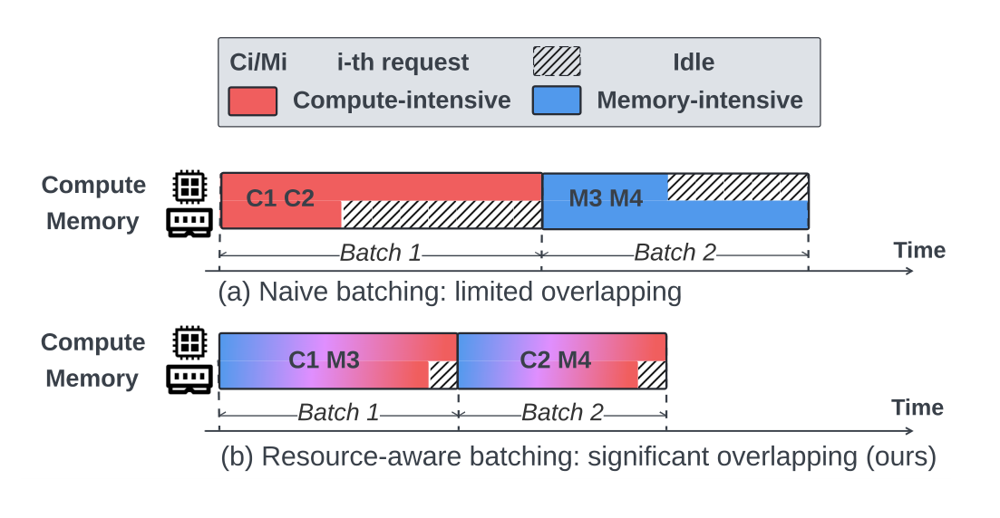
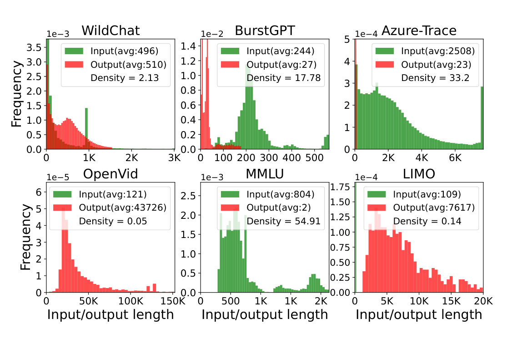
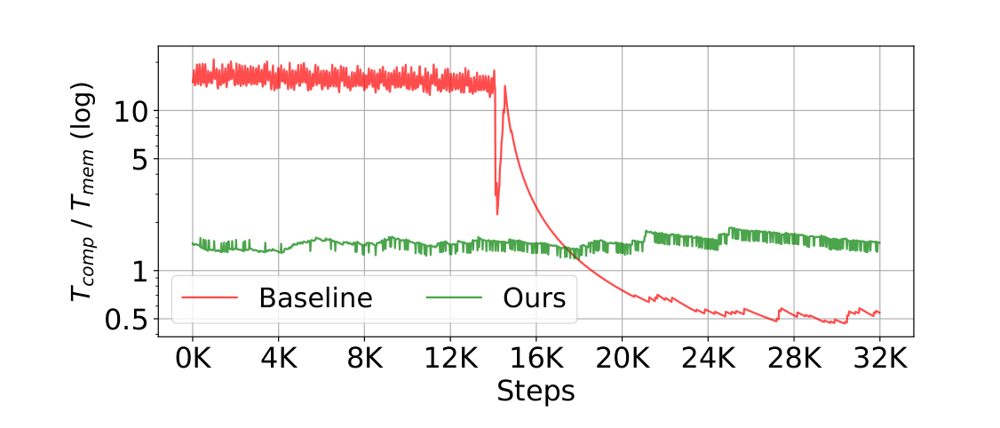
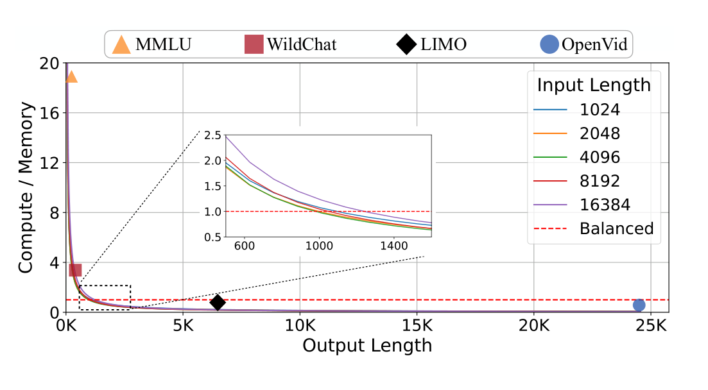
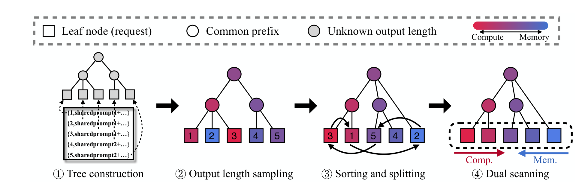
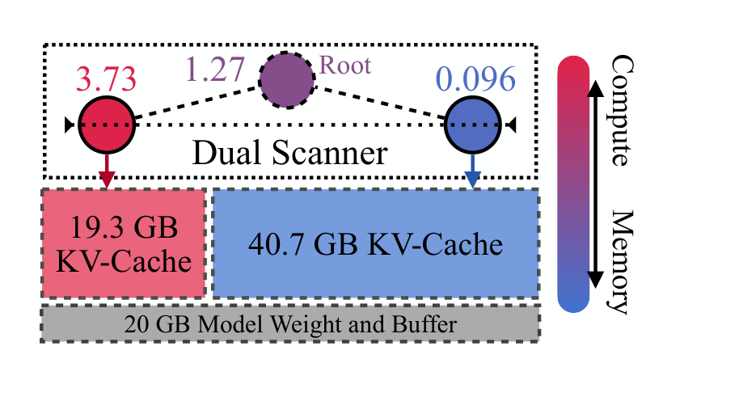
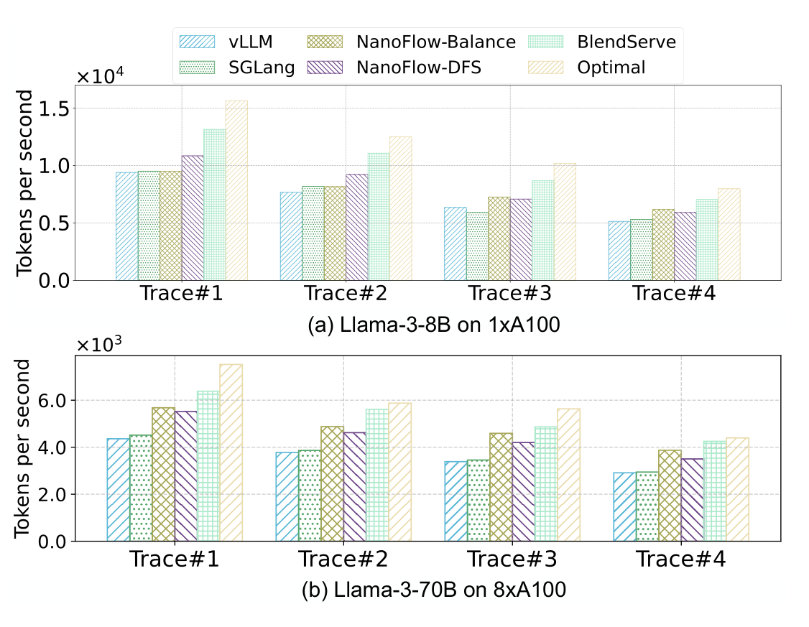
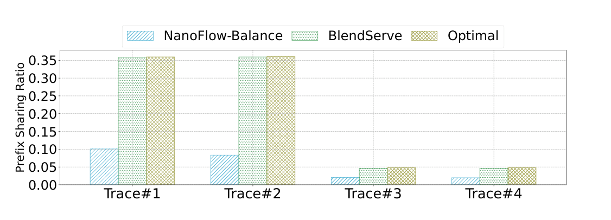
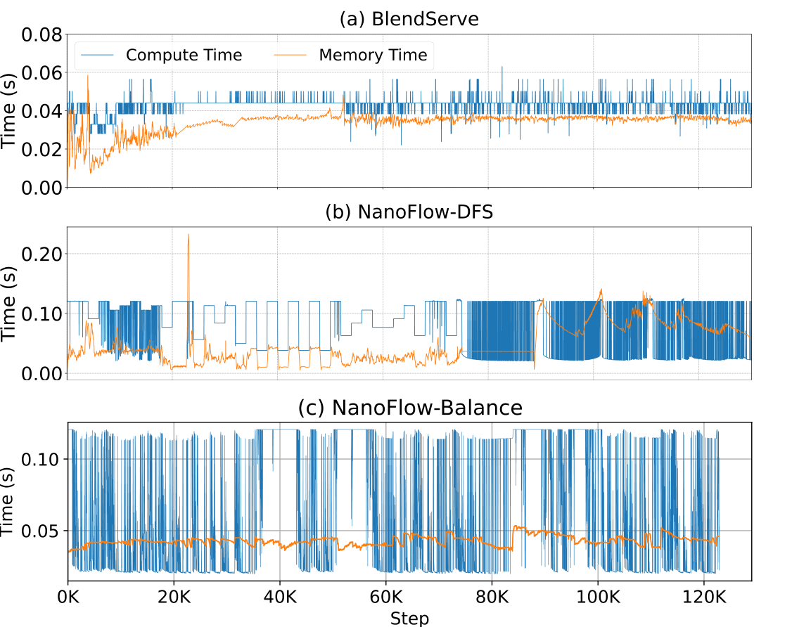
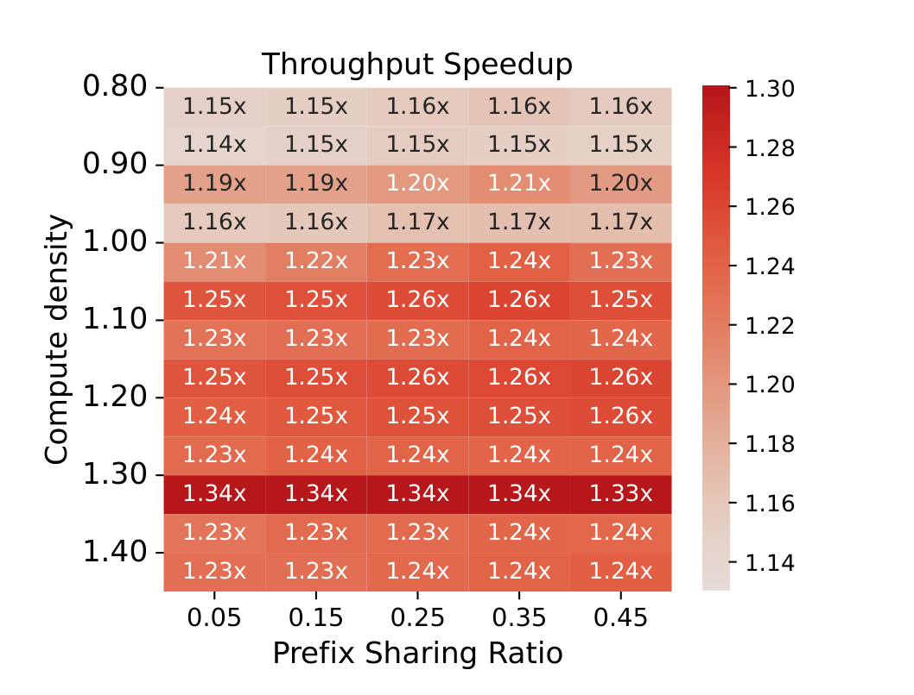

# BlendServe: Optimizing Offline Inference with Resource-Aware Batching

## 论文精读笔记

> 阅读原则：本文主体严格以 ASPLOS 2026 正式论文为依据，术语尽量沿用论文原词，如 **compute density、resource-aware prefix tree、layer-wise sorting、conditional node splitting、dual scanning、prefix sharing ratio、practical optimal throughput**。作者未证明或未研究的内容会明确标注。最后两节“理解与启发”“与课题关系”属于基于论文内容的个人分析，不属于论文原文贡献。
>
> 论文实际结构为 **Section 2 Background → Section 3 Motivation → Section 4 Performance Analysis → Section 5 BlendServe Design → Section 6 Implementation and Evaluation → Section 7 Discussion**。以下按论文原章节顺序展开，不人为改写章节逻辑。

---

# 1. 论文基本信息

- **题目**：BlendServe: Optimizing Offline Inference with Resource-Aware Batching
- **会议**：ASPLOS ’26，31st ACM International Conference on Architectural Support for Programming Languages and Operating Systems，Volume 2
- **时间 / 地点**：March 22–26, 2026，Pittsburgh, PA, USA
- **年份**：2026
- **页数**：19 pages
- **DOI**：10.1145/3779212.3790133
- **关键词**：Large Language Models；Offline Inference

### 作者与单位

- Yilong Zhao — University of California, Berkeley
- Shuo Yang — University of California, Berkeley
- Kan Zhu — University of Washington
- Lianmin Zheng — University of California, Berkeley
- Baris Kasikci — University of Washington
- Yifan Qiao — University of California, Berkeley
- Yang Zhou — University of California, Davis
- Jiarong Xing — Rice University
- Ion Stoica — University of California, Berkeley

Yilong Zhao 与 Shuo Yang 为共同一作。

---

# 2. 一句话概括

**BlendServe 利用 offline batch inference 对单请求延迟要求宽松、允许重排请求这一条件，把 compute-intensive 与 memory-intensive 请求按资源需求混合进 batch，同时尽量保持 prefix sharing，从而提高 GPU compute 与 memory bandwidth 的并发利用率。**

论文的核心不是再做一个新的 GEMM/attention kernel，也不是新的 chunked prefill，而是：

> **把“request ordering / batch formulation”本身提升为吞吐优化对象。**

*来源：论文 Figure 1，PDF 第 2 页；原图裁剪。斜线区域表示未被利用的资源，图示表达的是资源互补直觉，不是实际时间线测量。*

---

# 3. 研究背景与问题

## 3.1 为什么研究 offline batch inference

论文在 Introduction 中将 offline batch inference 定义为一种适用于 latency-insensitive 任务的推理方式。请求不要求即时返回，而是在较长时间窗口内完成，例如 batch API 的小时级返回窗口。

典型场景包括：

- model evaluation；
- data curation；
- document summarization；
- predictive analytics。

由于 latency objective 高度放松，offline inference 的主要目标从在线场景中的 TTFT / TPOT 转向：

> **maximize generation throughput，亦即 tokens per second。**

要提高 throughput，系统希望 GPU 的：

- compute resources；
- memory bandwidth

都尽量处于高利用率状态。

---

# 4. Section 2 — Background

## 4.1 Section 2.1 — Transformer-based large model inference

### Prefill

Prefill 处理完整输入 prompt，并生成第一个输出 token。

论文将其视为 **compute-intensive**，原因是输入 token 可以并行处理，大量计算由 GEMM 与 prefill self-attention 构成。

### Decode

Decode 以 autoregressive 方式逐 token 生成输出。

为了避免重复计算历史 token 的 K/V，系统维护 KV-cache。每一步 decode 都需要从 GPU memory 中读取已有 KV，因此随着上下文增长，decode 对 memory bandwidth 的需求显著增加。

论文因此把 decode 视为 **memory-intensive**。

这构成了后文所有 resource overlapping 的基础：

> Prefill 和 decode 使用同一套模型，但其资源瓶颈不同，因此存在把 compute-bound 与 memory-bound 工作重叠执行的空间。

---

## 4.2 Section 2.2 — Inference latency and throughput optimizations

论文按粒度回顾了几类与 BlendServe 直接相关的工作。

### 4.2.1 P/D disaggregation

代表：DistServe。

方法：

- Prefill 在独立 cluster 上执行；
- Decode 在另一独立 cluster 上执行；
- 两边可以分别扩容和控制 TTFT / TPOT。

论文认为这种方式更适合 latency-oriented online inference，而非 throughput-oriented offline inference。

原因是：

- prefill cluster 可能 compute 饱和但 memory bandwidth 空闲；
- decode cluster 可能 memory bandwidth 饱和但 compute 空闲。

也就是说，P/D disaggregation 将两类互补资源需求拆开，可能降低整体硬件利用率。

### 4.2.2 Phase-level colocation

代表：Sarathi-Serve 的 chunked prefill。

方法：

- 将一个大 prefill 切成多个小 chunk；
- 每轮只放入一个 prefill chunk；
- 与正在 decode 的请求共同组成 on-the-fly batch。

作用：让 compute-heavy prefill 和 memory-heavy decode 在同一迭代中共存，提高 arithmetic intensity 与硬件利用率。

论文指出的限制是：

> Sarathi-Serve 原本面向 online inference，在线延迟约束限制了系统自由重排请求。

如果当前请求池本身几乎都是 memory-intensive，请求在完成少量 prefill 后会进入漫长 decode，后期仍可能缺少足够 compute-heavy 工作，compute 资源继续空闲。

### 4.2.3 Operator-level overlapping

代表：NanoFlow、Orion。

NanoFlow 将一个 batch 再切为 micro/nano batches，使：

- compute-intensive GEMM；
- memory-intensive attention

能够跨 micro-batch overlap。

这是比 chunked prefill 更细的 operator-level overlap。

但论文指出：

> 即使 batch 内部 overlap 做得很好，**batch 中有没有合适比例的 compute-heavy 与 memory-heavy 请求，仍然取决于 request order。**

如果 workload 先出现大量 compute-intensive requests，再出现大量 memory-intensive requests，NanoFlow 仍会按顺序处理这两段请求，无法主动把两类请求混到同一阶段。

### 4.2.4 Prefix sharing

Prefix sharing 缓存已计算 prompt 的 KV，并让后续共享同一 prefix 的请求复用，从而避免重复计算。

主流方法通常用 Trie Tree / prefix tree 管理 prefix：

- internal node：共享 prefix segment；
- root-to-leaf path：一个完整 request prefix。

论文强调 access order 会影响 cache hit，因为 prefix cache 与普通 KV-cache 一起占 GPU memory，空间不足时会被 evict。

因此本文把由访问顺序产生的 cache reuse 程度称为 **prefix sharing ratio**。

---

# 5. Section 3 — Motivation

## 5.1 Section 3.1 — Evolving workload diversity

论文首先强调：现代 LLM workload 的输入 / 输出长度差异越来越大，尤其受到：

- multi-modality；
- reasoning models；
- chat / benchmark / coding / image-video generation

等应用扩张影响。

### Figure 2：六类 trace 的 input/output length 与 compute density

Figure 2 给出的代表性统计为：

| Trace | Avg Input | Avg Output | Compute Density | 论文中的资源特征 |
|---|---:|---:|---:|---|
| WildChat | 496 | 510 | 2.13 | compute-intensive |
| BurstGPT | 244 | 27 | 17.78 | highly compute-intensive |
| Azure-Trace | 2508 | 23 | 33.2 | highly compute-intensive |
| OpenVid | 121 | 43726 | 0.05 | highly memory-intensive |
| MMLU | 804 | 2 | 54.91 | highly compute-intensive |
| LIMO | 109 | 7617 | 0.14 | highly memory-intensive |

论文定义：

- compute density > 1：compute-intensive；
- compute density < 1：memory-intensive。

Figure 2 真正说明的是：

> **不同应用的 input/output length distribution 可导致数量级差异的资源需求。**

论文并未说某个“应用类型”永远固定属于 compute 或 memory intensive；这里是基于给定 trace 和模型/硬件配置的 characterization。

*来源：论文 Figure 2，PDF 第 3 页；原图裁剪。各子图纵轴频率采用不同科学计数法刻度，不能直接比较柱高。*

---

## 5.2 Section 3.2 — Workload diversity limits existing overlapping

### 关键问题

已有系统主要做 **intra-batch optimization**：给定 batch 后，尽可能让其中的 compute 和 memory 操作 overlap。

BlendServe 的观察是：

> 如果 batch formation 本身就是失衡的，batch 内再精细的 overlap 也无法创造不存在的互补工作。

### Figure 3：NanoFlow 类顺序处理 vs resource-aware reordering

实验使用：

- Llama-3-8B；
- 1 × A100；
- 将 compute-intensive BurstGPT 放在前；
- memory-intensive OpenVid 放在后。

横轴是 execution steps，纵轴是 `T_comp / T_mem`（log scale）。

Baseline：

- 前半段 `T_comp / T_mem` 很高，compute 成为主导，memory bandwidth 未充分利用；
- 后半段降到 < 1，memory 成为主导，compute 未充分利用。

BlendServe：

- 通过重排两类 request，整个执行过程的 compute / memory 使用更稳定、更接近平衡。

**作者声称 Figure 3 说明**：跨 batch 考虑 request resource demand 能补足单纯 intra-batch overlap 的不足。

*来源：论文 Figure 3，PDF 第 4 页；原图裁剪。纵轴 `T_comp/T_mem` 为对数刻度；该图使用 BurstGPT 后接 OpenVid 的合成顺序 workload。*

---

## 5.3 Section 3.3 — Resource-aware batching via request reordering

### 核心想法

Offline inference 对单请求 latency 不敏感，因此可以比 online serving 更自由地 **reorder requests**。

BlendServe 希望让每个 on-the-fly batch 都包含互补资源需求，使 compute-bound 和 memory-bound 工作更充分 overlap。

### 但出现一个新的冲突：resource overlap vs prefix sharing

为最大化 prefix sharing，前人已证明对 prefix tree 做 DFS 是很好的访问顺序：相同 prefix 的请求连续执行，使 prefix reuse distance 最短。

但 DFS 可能把同类任务聚到一起：

- 一整段都是 compute-intensive；
- 或一整段都是 memory-intensive。

这样虽然 prefix sharing 高，却破坏资源平衡。

反过来，完全随机混合请求可以平衡资源，但可能破坏 prefix locality。

论文给出一个具体结果：

> Llama-3-8B + 1 × A100 时，DFS ordering 只能达到作者定义的 optimal throughput 的 **71.7%**。

### 论文的目标函数

论文把总执行时间写成：

\[
T = f((1-s)\cdot T_{comp},\ T_{mem})
\]

其中：

- `T_comp`：所有 compute-bound operations 的总执行时间；
- `T_mem`：所有 memory-bound operations 的总执行时间；
- `s ∈ [0,1]`：prefix sharing ratio；
- prefix sharing 可省去 `s·T_comp` 的计算，因此 compute 时间变为 `(1-s)·T_comp`；
- 论文明确指出，prefix cache hit **不会消除 decode 读取 KV-cache 所需的 memory bandwidth**。

如果 compute 与 memory 串行执行，则 `f` 近似 sum；如果能够完美 overlap，则关键路径只剩 bottleneck resource：

\[
T_o = \max((1-s_o)\cdot T_{comp},\ T_{mem})
\]

其中 `s_o` 是由 workload prompt 决定的最大 prefix sharing ratio。

这一定义给出了 BlendServe 的优化方向：

1. 尽量接近 `s_o`；
2. 同时让 compute 与 memory 尽量 overlap。

---

# 6. Section 4 — Performance Analysis

这一节建立后续 scheduler 使用的 **compute density**。

## 6.1 Section 4.1 — Request-level compute density

论文定义 request `r` 的 compute density：

\[
\rho(r)=\frac{Comp(r)}{Mem(r)}
\]

其中 `Comp(r)` 和 `Mem(r)` 都以“时间”表示，而不是原始 FLOPs / bytes。

因此该指标天然包含：

- 模型结构；
- GPU compute capability；
- GPU memory bandwidth。

### 输入

一个 request：

- input / prompt length：`p`；
- output length：`d`。

一个模型：

- `P_model`：model parameter count；
- `H`：hidden dimension；
- `H_kv`：KV heads 的 feature dimension；
- `L`：decoder layers。

一个硬件配置：

- `compute`：peak FP16 GFlops；
- `bandwidth`：memory bandwidth GB/s。

论文假定 FP16、GPU Tensor Core；更换数据类型和硬件时可以调整公式中的常数。

### Compute time model

论文将 compute-bound 部分近似为 GEMM + prefill self-attention：

\[
Comp(r) \approx
\frac{2(p+d)P_{model}+4p^2HL}{compute}
\]

解释：

- `(p+d)`：request 生命周期内参与主要 GEMM 的总 token 数；
- 每 token 的 GEMM 计算量约 `2P_model`；
- prefill self-attention 的 QK 与 PV 两个 GEMM 共约 `4p²HL`。

论文进一步认为在常见 `p` 为数百 token 的 workload 中，`pHL` 相对 `P_model` 较小，因此后续推导中忽略 `4p²HL` 项。

### Memory time model

decode step `i` 需要读取此前 `p+i` 个 token 的 KV：

\[
Mem(r) \approx
\frac{\sum_{i=1}^{d}(p+i)H_{kv}L\cdot2\cdot2}{bandwidth}
\]

化简为：

\[
Mem(r) \approx
\frac{(pd+\frac12 d^2)H_{kv}L\cdot4}{bandwidth}
\]

其中系数 4 来自：

- K + V 两份 tensor；
- FP16 每元素 2 bytes。

### 关键含义

随着 `d` 增大，memory term 中出现 `d²/2`，因此 output 很长时 compute density 会快速下降。

这解释了 Figure 4 中：

- OpenVid / LIMO 更 memory-intensive；
- MMLU 等短输出任务更 compute-intensive。

---

## 6.2 Section 4.2 — Translating request-level metrics to batch-level

论文承认一个问题：

> 一个 request 的“生命周期平均资源强度”不等于它在某个当前 step 的瞬时资源强度。

例如一个最终非常 memory-intensive 的请求，刚加入系统时仍要先进行 compute-heavy prefill。

因此理论上应该考虑 batch-level compute density。

### 论文的关键近似

在 continuous batching 中，一个大 batch 通常同时存在很多处于不同 generation steps 的请求。

如果请求在不同 steps 上分布较均匀，那么：

> **request-level compute density 在时间平均意义上可以近似 batch-level compute density。**

论文令 KV-cache 可用容量为 `KV-Mem`。

平均每个 decode request 的 KV 长度约：

\[
p+\frac d2
\]

每 token KV 占：

\[
H_{kv}L\cdot4\text{ bytes}
\]

于是同时 decode 的 request 数约为：

\[
B_{decode}=
\frac{KV\text{-}Mem}
{(p+d/2)H_{kv}L\cdot4}
\]

由于 chunked prefill scheduling 在 steady state 中需要“平均新进入请求数 ≈ 平均完成请求数”，论文认为 prefill token / decode token 比例约为：

\[
\frac pd
\]

最终得到：

\[
\rho(B) \approx \rho(r)
\]

因此 BlendServe 实际 scheduler 仍然可以使用 request-level compute density 作为主要决策指标。

### 这一推导依赖的条件

论文自己使用了以下近似：

- continuous batching；
- batch 足够大；
- 请求分布在不同 generation steps；
- GEMM 主导 compute time；
- KV-cache loading 主导 memory time；
- steady-state 下 admission 与 completion 大致平衡。

论文并未证明任意小 batch、极端长度分布或所有 serving engine 上都严格满足 `ρ(B)=ρ(r)`；它给出的是用于调度的近似模型。

---

## 6.3 Section 4.3 — Case study / model validation

### Figure 4

Figure 4 用 Llama-3-8B + A100 80GB 展示不同 `(p,d)` 下的 compute density。

结论：

- output length 增长后 density 快速下降；
- OpenVid 落在明显 memory-intensive 区域；
- MMLU / WildChat 在图中更偏 compute-intensive。

*来源：论文 Figure 4，PDF 第 7 页；原图裁剪。曲线对应不同 input length，红色虚线是 compute/memory balanced boundary。*

### Table 1：模型估计误差

sequence size = 1024，比较 estimated / real execution time：

| Operator | Batch=512 | Batch=768 | Batch=1024 |
|---|---|---|---|
| GEMM | 1.038 / 1.087 ms | 1.494 / 1.537 ms | 1.916 / 2.005 ms |
| Attention | 1.239 / 1.317 ms | 1.859 / 1.913 ms | 2.478 / 2.515 ms |

论文称最大 relative error 为 **6%**。

### 一个需要注意的论文内部细节

Section 4.3 的标题写的是 **“Case study: offline inference with Llama-3-70B”**，但正文与 Figure 4 明确写的是 **Llama-3-8B on an A100 80GB GPU**。

因此笔记不擅自修正作者文本：这里很可能是标题笔误，但论文正文实际展示的是 Llama-3-8B 数据。

---

# 7. Section 5 — BlendServe Design

## 7.1 Figure 5 — 总体工作流

Figure 5 是整篇论文最重要的系统图。

BlendServe 的流程分成四步：

1. **Tree construction**：根据所有已知 prompts 构建 prefix tree；
2. **Output length sampling**：抽样少量 requests 完整执行，估计其他请求的 output length，并计算 compute density；
3. **Sorting and splitting**：按 compute density 重排 prefix tree，必要时做 conditional node splitting；
4. **Dual scanning**：从 tree 左右两端同时扫描，形成 runtime batch。

其中 ①–③ 是 GPU 正式批量运行前的一次性 warm-up。

Figure 5 的 caption 明确说：

> warm-up 在 end-to-end inference generation 的前 **1% 时间内**完成。

注意：这不等于 warm-up“完全没有时间成本”；论文的意思是其相对完整 offline inference 很小。

*来源：论文 Figure 5，PDF 第 8 页；原图裁剪。颜色从红到蓝表示 subtree 从 compute-intensive 到 memory-intensive；①–③ 为一次性 warm-up，④ 为 runtime batching。*

---

## 7.2 Section 5.1 — Key data structure: resource-aware prefix tree

### 7.2.1 Prefix tree 的原始语义

- leaf node：实际 request；
- internal node：其后代 requests 共享的 prompt segment；
- root-to-leaf path：该 request 的最长 prefix。

普通 prefix tree 使用 DFS 可获得很短的 reuse distance，从而提高 prefix sharing。

### 7.2.2 Resource-aware 扩展

BlendServe 给每个 node 加入其 subtree 的资源属性。

对于节点 `R`（代表一个 subtree 中的 request set），论文定义：

\[
\rho(R)=\frac{(1-s)T_{comp}}{T_{mem}}
\]

这里已经把该 subtree 可获得的 prefix sharing `s` 计入 compute time。

也就是说，resource-aware prefix tree 同时编码：

- **locality / prefix structure**；
- **resource demand / compute density**。

这是论文把“prefix sharing 与 resource balance”放进同一数据结构的关键。

---

### 7.2.3 Output length sampling

问题：`d` 在真正 decode 前未知，但 compute density 计算需要 `d`。

论文利用的观察：

> output length distribution 与 prompt semantics / task type 有较强相关性；具有相似 prefix 的 requests 往往来自相似任务。

#### 输入

- 已构造好的 prefix tree；
- sampling probability `p`。

#### 步骤

1. 对一部分 requests 做完整 inference；
2. 得到这些 sampled requests 的真实 output length；
3. 一个 subtree 内未采样 requests 使用该 subtree sampled requests 的平均 output length；
4. 若 subtree `t1` 完全没有样本，则使用 sibling subtree `t2` 的 sampled average，因为 sibling 与它共享最长 common prefix，作者认为二者 output distribution 更相近。

#### 为什么作者认为额外开销小

采样的 request 已经完成真正 inference，因此结果可以直接返回，不需要之后再跑一次。

所以 sampling 消耗的是原本就必须完成的请求，只是把它们提前到 warm-up。

---

## 7.3 Section 5.2 — Resource-aware prefix tree sorting

### 7.3.1 Layer-wise sorting

BlendServe 首先按照 compute density 做 **layer-wise sorting**：

- 只重排拥有同一 ancestor、同一 depth 的 nodes；
- 不随意打散整棵 prefix tree。

排序后形成全局趋势：

- 左侧更 compute-intensive；
- 右侧更 memory-intensive。

这样既为 dual scanner 创造“左右互补”的结构，又尽量保留原 prefix hierarchy。

### Algorithm 1 — Layer-wise Sorting

**输入**：当前 tree node `ptr`。

**步骤**：

1. 若 `ptr` 不是 leaf；
2. 将 `ptr.childList` 按 compute density 排序；
3. 对每个 child 递归执行 `layer_sort`。

**设计理由**：

只在局部兄弟节点间排序，避免直接把整棵 prefix tree flatten 后全局排序，从而保留 prefix locality。

---

### 7.3.2 Conditional node splitting

Layer-wise sorting 后仍可能存在 local outlier。

Figure 5 中 request #2 的 density 很低，但由于 prefix 结构，它仍夹在左侧 compute-intensive requests 中。

BlendServe 允许将这种 outlier 拆出并重新放到更合适的位置。

代价是：

> 被移走的 request 可能无法继续共享原 prefix，需要 recomputation。

因此系统使用阈值 `t` 控制 trade-off：只有当 relocation 的 recomputation overhead 在作者允许范围内时才移动。

论文实际配置使排序尽量保持 **99% prefix sharing ratio**。

### Algorithm 2 — Node Splitting

**输入**：node `ptr` 与 threshold `t`。

算法伪代码的主要步骤：

1. 计算到 `ptr` 的 prefix length；
2. 根据 `len_prefix × len(childList)` 与 threshold 的关系决定当前 node 是否作为一个可调度 leaf-like unit 保留，还是继续向 children 递归拆分；
3. 被形成的新 unit 更新 subtree density；
4. 在 root 处最终将形成的 `leaf_list` 按 compute density 排序。

**设计目的**：在 prefix recomputation cost 可控的条件下，提高 leaf sequence 的 density 单调性，从而让 dual scanner 更容易从两端取得互补请求。

> 注意：正文用“conditional node splitting / relocation”解释算法目的；Appendix Algorithm 2 给出具体递归条件。本文笔记不将该 heuristic 重新解释成论文没有给出的全局最优算法。

---

## 7.4 Section 5.3 — Request order search: heuristic dual scanning

### 7.4.1 为什么不用最优搜索

论文指出 request ordering 的最优解很难找。

对单个 scheduling step，可以把问题类比为 knapsack：

- request 的 KV-cache size 类似 cost；
- compute density 类似 value；
- 目标是在 GPU memory 限制下达到目标 density。

但 autoregressive inference 还有多 step dependency，因此不同 step 的 schedule 相互影响。

论文将该问题描述为 **NP-hard**，认为对大规模 request pool 求精确最优解不可行。

---

### 7.4.2 Dual scanner

排序后的 tree：

- left：高 compute density；
- right：低 compute density。

Dual scanner 同时从左右两端向中间扫描，并控制从两端 admission 的比例。

目标不是简单“左右各一半”，而是让 blended batch 的 density 接近整棵树 root 的 target density `ρ(rt)`。

### GPU memory partition

设当前可用于 batch / KV-cache 的 memory 为 `M`，左右分配：

\[
M_L + M_R = M
\]

同时要求 compute density 加权后等于 root density：

\[
M_L\rho(R_L)+M_R\rho(R_R)=M\rho(r_t)
\]

联立可得 Algorithm 3 中：

\[
M_L=M\cdot
\frac{\rho(r_t)-\rho(R)}{\rho(L)-\rho(R)}
\]

\[
M_R=M\cdot
\frac{\rho(L)-\rho(r_t)}{\rho(L)-\rho(R)}
\]

其中：

- `ρ(L)`：当前左端 compute-intensive node density；
- `ρ(R)`：当前右端 memory-intensive node density；
- `ρ(rt)`：root density。

### Figure 6 示例

80GB GPU：

- 20GB：model weights + temporary buffer；
- 剩余 60GB：KV-cache；
- root density = 1.27；
- left density = 3.73；
- right density = 0.096。

最终：

- `M_L = 19.3GB`；
- `M_R = 40.7GB`。

满足：

\[
3.73\times19.3+0.096\times40.7
=1.27\times60
\]

因此 memory-intensive 侧需要占更多 KV memory，才能将整体 density 拉回 root target。

*来源：论文 Figure 6，PDF 第 8 页；原图裁剪。80GB 中先预留 20GB model weight/buffer，余下 60GB 才参与左右 KV-cache 分区。*

---

### Algorithm 3 — Dual Scan

**输入**：

- root density `ρ(rt)`；
- left child density `ρ(L)`；
- right child density `ρ(R)`；
- available GPU memory `M`。

**输出**：

- left chunked prefill budget `C_L`；
- right chunked prefill budget `C_R`；
- 单位为 tokens。

#### Step 1：partition memory

使用上面的两式计算 `M_L`、`M_R`。

#### Step 2：把 memory 转换为 left side decode request 数

\[
N_L=
\frac{M_L}
{(p_L+d_L/2)H_{kv}L\cdot4}
\]

#### Step 3：换算为 left side chunked-prefill token budget

\[
C_L=N_L\cdot\frac{p_L}{d_L}
\]

Right side 同理：

\[
N_R=
\frac{M_R}
{(p_R+d_R/2)H_{kv}L\cdot4}
\]

\[
C_R=N_R\cdot\frac{p_R}{d_R}
\]

`(C_L,C_R)` 最终决定两端分别可以 admission 多少请求 / prefill token。

### 为什么还能保持 prefix sharing

Dual scanner 并不是随机在整棵树跳跃，而是分别从 prefix tree 两端做近似 DFS traversal。

因此：

- 左侧内部仍有 prefix locality；
- 右侧内部仍有 prefix locality；
- 同时左右两类 request 被混合进入 batch。

这就是 BlendServe 试图同时实现 **resource balance + prefix locality** 的关键。

---

## 7.5 Section 5.4 — Robustness analysis

### 7.5.1 Output length estimation 不准确怎么办

论文认为 BlendServe 不要求精确预测每个 request 的 output length。

理由：

- 一个 batch 有数百 requests；
- 只要能大致区分 benchmark、chat、video generation 等 resource class，小误差会被 batch aggregate 掉。

作者实验称：

> 只 sampling **1% requests** 时，end-to-end performance 与 sampling 100% 可 comparable。

同时 runtime 可以自适应：

- request 比预测更早完成 → insert additional requests；
- output 被严重低估 → 可将 request 从 `M_L` relocate 到 `M_R`。

### 7.5.2 Sorting / splitting 的 stopping condition

算法循环：

> layer-wise sort → conditional node split → re-sort

直到：

- **C1**：leaf sequence 按 compute density 已 non-increasing；或
- **C2**：所有 leaf 的 split cost 都超过 threshold `t`。

论文给出 termination argument：

- 每个 original leaf 最多 split 一次；
- split 后被放到 root；
- 最坏情况下所有 leaves 都到 root，再做一次 root sorting 即形成全局 monotone order。

因此：

- splits ≤ `N_leaf`；
- re-sorts ≤ `N_leaf + 1`。

实测只有约 **0.1%–1% leaves** 需要 splitting。

### 7.5.3 论文自己给出的 robustness 边界

论文称真实 workload 通常同一 dataset 内 compute density variance 较低，因此 tree sorting 可接近最优。

但 Appendix A.4 同时明确显示：

> ShareGPT / WildChat 的 output length variance 较大时，sampling strategy 更不准确，性能会变差；更好的 large-variance output length strategy 被留作 future work。

这一点是论文自己明确承认的限制之一。

---

## 7.6 Section 5.5 — Distributed deployment

### Data Parallelism (DP)

BlendServe 首先用 **整个 request pool** 构造 centralized resource-aware prefix tree，再将它分成多个 parallelized subtrees 分给不同 DP ranks。

划分时继续复用 dual-scanner 思路，使不同 DP partition：

- workload size 平衡；
- resource demand 平衡。

代价：

- root 到 leaf 的某些 prefix 跨 DP replica 后不能共享；
- 论文称该额外 prefix sharing overhead 很小。

### Tensor Parallelism (TP)

TP 将模型参数切到多 GPU。

BlendServe 本身不重新设计 TP communication overlap，而是依赖已有工作中可以 overlap communication / computation 的 pipeline strategy。

论文声称 BlendServe 与这些 TP designs compatible。

---

# 8. Section 6 — Implementation and Evaluation

## 8.1 Section 6.1 — Implementation

BlendServe prototype 不是从零写整个 serving stack，而是组合已有系统：

- **resource-aware prefix tree**：基于 SGLang；
- **scheduler**：基于 NanoFlow；
- NanoFlow 已包含 chunked prefill + continuous batching；
- **backend engine**：C++，遵循 NanoFlow operator-level overlapping；
- 同时执行 compute-intensive GEMM 和 memory-intensive self-attention。

因此 BlendServe 的新增核心主要在：

1. offline prefix tree；
2. compute density；
3. tree sort / split；
4. dual scanner / request ordering。

### Appendix A.2 额外实现细节

- offline tree 预处理后会在不损害 prefix sharing 的情况下 merge subtrees，以减少 dual scanner 时的 fragmentation；
- runtime prefix tree 基于 SGLang dynamic Trie Tree；
- 支持 intra-batch prefix sharing，使一个 batch 内 shared prefix exactly-once compute；
- batch size 强制为 128 的倍数，以保持更高 hardware utilization。

---

## 8.2 Section 6.2 — Experiment setup

### 8.2.1 Workload

论文明确说：

> 作者不知道有公开的 offline batch inference trace。

因此实验使用 **synthetic workloads**，由多个已有 trace 混合：

- WildChat；
- ShareGPT；
- Azure-Trace；
- BurstGPT；
- OpenVid；
- MMLU。

特征：

- BurstGPT / Azure-Trace：highly compute-intensive；
- OpenVid：memory-intensive；
- WildChat / ShareGPT：较温和 compute density；
- MMLU：high prefix sharing。

### Table 2：四个主要 representative workloads

| Workload | Compute Density | Prefix Sharing Ratio | 类型 |
|---|---:|---:|---|
| Trace#1 | 1.4 | 35% | compute-intensive + high prefix sharing |
| Trace#2 | 0.9 | 35% | memory-intensive + high prefix sharing |
| Trace#3 | 1.4 | 5% | compute-intensive + low prefix sharing |
| Trace#4 | 0.9 | 5% | memory-intensive + low prefix sharing |

论文称 35% 已是 high prefix sharing，因为 Table 4 中大部分原始 workloads 都低于 20%。

主实验每个 synthesized workload 至少包含 **400,000 requests**，单 workload 需要约 **5 A100 GPU hours** 才达到稳定性能。

### Appendix Table 4：原始 trace characterization

| Trace | Prefix sharing | Compute density |
|---|---:|---:|
| ShareGPT | 0.02 | 3.12 |
| WildChat | 0.19 | 2.13 |
| Azure-Trace | 0.01 | 33.2 |
| OpenVid | 0.00 | 0.05 |
| BurstGPT | 0.02 | 17.78 |
| MMLU | 0.86 | 54.91 |

Table 4 caption 进一步写明 MMLU prefix sharing ratio 为约 **86.46%**。

### Appendix A.3 中 workload synthesis 的额外处理

- 对没有完整 system prompt 的 trace，作者人为加入 unique system prompt；
- 对没有 prompt content、只有长度的 trace，按 prompt length 随机 token id；
- OpenVid output token = frame count × 256；
- OpenVid 原 average output ≈45K，被 normalize 到 16K，原因是单 A100 上评测 Llama-3.1-8B 时 45K 太大；
- WildChat average output 被 normalize 到 256，使其更加 compute-intensive，同时保留长度 variance。

这些修改说明实验 workload 并非未经处理的原始 production trace。

---

### 8.2.2 Models / Hardware

主要真实 GPU 实验：

- Llama-3.1-8B：1 × A100 80GB SXM；
- Llama-3.1-70B：8 × A100 80GB SXM，TP=8。

其他模型：

- Qwen-2.5-7B：1 × A100；
- Llama-2-7B：1 × A100；
- Qwen-2.5-72B：8 × A100；
- DeepSeek-67B：8 × A100。

由于 GPU resource limit，Section 6.5/6.6 的一部分其他模型结果使用 **profile-guided / cycle-accurate simulation**，并非全部真实 GPU execution。

---

### 8.2.3 Baselines

1. **vLLM**
2. **SGLang**
3. **NanoFlow**
4. **DistServe**（只用于 P/D disaggregation 对照）

公平性设置：

- vLLM、SGLang：enable prefix caching + 将 trace reorder 为 DFS；
- NanoFlow：作者额外加入 prefix caching；
- NanoFlow-DFS：高 prefix locality；
- NanoFlow-Balance：random ordering，资源更平衡但 prefix sharing 较差。

这两个 NanoFlow variant 用来拆解 BlendServe 的两个收益来源：

- 对 NanoFlow-DFS 的提升 → resource balance 的收益；
- 对 NanoFlow-Balance 的提升 → prefix sharing 的收益。

所有 baseline 都使用 continuous batching。

论文特别说明：

> 主 throughput 对比不计 CPU time，包括 tokenization、sampling、scheduling；CPU scheduling overhead 在 Appendix A.5 单独分析。

---

### 8.2.4 Metric

主要指标：

> **end-to-end throughput = 所有 processed tokens（input + output）/ total processing time**

单位：tokens/s。

另测：

- prefix sharing ratio；
- compute / memory operator time；
- DP scalability；
- scheduling overhead。

---

### 8.2.5 Practical optimal throughput

理论 `T_o=max(T_comp,T_mem)` 假设 perfect overlap，但真实 GPU spatial sharing 存在 interference，因此作者认为直接用该理论值不现实。

实验中的 “optimal” 是 **practical upperbound**：

- profile GEMM 与 attention overlap 时的实际 runtime；
- 再用 profiling 结果计算 practical `T_o`。

所以后文“达到 optimal 的 86.55% / 90%”应该理解为：

> **达到作者 profiling-based practical upperbound 的相应比例**，不是数学上已证明可达到的绝对全球最优 throughput。

---

## 8.3 Section 6.3 — End-to-end throughput

### Figure 7(a)：Llama-3-8B，1×A100

BlendServe 相比最佳 baseline NanoFlow-DFS：

- 各 Trace 提升 **19.34%–22.65%**；
- 平均提升 **20.84%**。

相比 vLLM-DFS：

- 最大 **1.44× throughput speedup**。

与 practical optimal 比：

- 平均达到 **86.55%**。

论文的解释：

- low prefix sharing（Trace#3/#4）时 NanoFlow-Balance 可能优于 NanoFlow-DFS，因为 resource balance 更重要；
- high prefix sharing（Trace#1/#2）时 NanoFlow-DFS 更有优势；
- BlendServe 试图同时保留两者，因此四种 trace 都胜过 NanoFlow-DFS。

### Figure 7(b)：Llama-3-70B，8×A100

相比 NanoFlow-DFS：

- average throughput improvement：**18.6%**；
- 达到 practical optimal 的 **90.8%**。

论文还指出 70B 中 NanoFlow 相比 vLLM 的提升更明显，因为 operator-level overlapping 还能 overlap 较昂贵的 communication operator 与 computation。

### 对 practical optimal 的总体陈述

论文认为 dual scanner 是 heuristic，不可能保证每一步 perfect resource overlap。

其结论是：

- Llama-3-8B：86.55%；
- Llama-3-70B：90.8%；
- gap 最低约 13%。

这证明的是“heuristic 能靠近作者构造的 practical upperbound”，不是证明 heuristic 为最优。

*来源：论文 Figure 7，PDF 第 10 页；原图裁剪。图中的 `Optimal` 是 profiling-based practical upperbound；上下两面板量级不同，分别为 `×10^4` 与 `×10^3` tokens/s。*

---

### Figure 8：与 P/D disaggregation / DistServe 比较

设置：

- Llama-3-8B；
- A100；
- 按每 GPU throughput 比较；
- DistServe 配置：1P1D、1P2D、2P1D、1P3D。

结果：

- 各配置下 DistServe 都未超过 colocated vLLM；
- BlendServe 最好。

作者解释：

- prefill cluster 的 memory bandwidth 闲置；
- decode cluster 的 compute 闲置；
- 当前选定 workloads 具有更多 decode tokens，因此增加 prefill GPU（如 2P1D）反而更低效。

**论文真正支持的范围**：这是 throughput-oriented offline setting 下、作者所选 trace 与 A100 配置的结果；论文没有据此否定 P/D disaggregation 在 latency SLO 场景中的价值，反而明确承认 DistServe 对 TTFT/TPOT 有优势。

---

## 8.4 Section 6.4 — Performance analysis

### Figure 9：Prefix sharing ratio

BlendServe 达到最大 prefix sharing ratio 的 **>97%**。

NanoFlow-Balance 由于 random ordering：

- prefix sharing ratio 低于 30% 的最大值。

在 Trace#1/#2 上，BlendServe 相比 NanoFlow-Balance 平均有 **1.36× throughput improvement**。

作者据此说明：

> BlendServe 的 resource-aware reordering 并没有为了 balance 完全破坏 prefix locality。

*来源：论文 Figure 9，PDF 第 12 页；原图裁剪。`Optimal` 由 prefix tree 的 DFS order 测得；该图证明 locality 保留，不单独证明吞吐收益。*

### Figure 10：Compute / memory usage over time

Trace#2 为 memory-intensive + high prefix sharing。

BlendServe：

- compute time 与 memory time 随 step 较稳定；
- 两类资源持续处于较高利用率。

NanoFlow-DFS：

- 前 90K steps memory under-utilized；
- 后续出现 excessive memory access；
- 资源需求波动明显。

NanoFlow-Balance：

- memory usage 较稳定；
- 但 random ordering 导致 prefix recomputation，且 request length distribution 陡峭，compute time 仍有较大 fluctuation。

**Figure 9 + Figure 10 共同构成论文最直接的机制验证**：

- Figure 9：locality 没丢太多；
- Figure 10：balance 确实改善。

*来源：论文 Figure 10，PDF 第 12 页；原图裁剪。三个面板纵轴范围不同，应用于观察各方法内部的波动与平衡，不能按曲线绝对高度直接横向比较。*

---

## 8.5 Section 6.5 — Sensitivity study

作者生成 **65 个 synthetic workloads**：

- compute density：0.80 → 1.40，step 0.05；
- prefix sharing ratio：0.05 → 0.45，step 0.10。

由于 GPU 资源限制：

- frontend 使用真正 BlendServe scheduler 产生 batch schedule；
- backend 使用 simulated GPU runtime；
- GPU time 用 polynomial fitting 估计。

校准结果：

> 在四个 representative workloads 上，simulation 与 real GPU speedup 的平均差异仅 **0.91%**。

### Figure 11

BlendServe 相比 NanoFlow-DFS：

- 所有 65 workload 都更快；
- improvement：**14%–34%**；
- average speedup：**22.53%**；
- 最大约 **1.34×**，出现在 compute density ≈1.30。

作者观察：

- prefix sharing ratio 改变时 throughput improvement 较稳定，因为 BlendServe 与 NanoFlow-DFS 都已接近 optimal prefix sharing；
- compute density 越低、越 memory-intensive 时，overlap gain 有下降趋势；作者推测可能来自 memory-intensive workload 更严重的 GPU interference。

注意“可能 due to”是作者解释，不是实验独立证明的因果机制。

*来源：论文 Figure 11，PDF 第 12 页；原图裁剪。该图来自经四个代表 workload 校准的 simulated GPU backend，不应表述为 65 个 workload 的完整真实 GPU 实测。*

---

## 8.6 Section 6.6 — Distributed deployment and other LLMs

### Table 3：Data parallelism scalability

Llama-3-8B：

| DP | Trace#1 | Trace#2 | Trace#3 | Trace#4 |
|---|---:|---:|---:|---:|
| DP=1 | 11080 | 8408 | 8403 | 6325 |
| DP=2 | 20561 (1.85×) | 16261 (1.93×) | 15623 (1.85×) | 12246 (1.93×) |
| DP=4 | 41928 (3.78×) | 32537 (3.86×) | 32026 (3.81×) | 24541 (3.88×) |

作者结论：DP scaling 接近 linear。

### Figure 12：其他模型

- Qwen-2.5-7B；
- Llama-2-7B；
- Qwen-2.5-72B；
- DeepSeek-67B。

这些结果采用 Section 6.5 的 profile-guided simulation。

相比 NanoFlow-DFS：

- average throughput improvement：**15.2%**；
- practical optimal throughput：平均 **89.9%**；
- Figure 12 caption：最高 improvement **24.4%**。

论文据此声称方法对不同模型具有 generality。

但要注意：这部分 generality 主要由模拟结果支持，不是全部由真实多模型 GPU 实测支持。

---

# 9. Appendix 中值得保留的结果

## 9.1 Algorithms 1–3

- **Algorithm 1**：Layer-wise Sorting；
- **Algorithm 2**：Node Splitting；
- **Algorithm 3**：Dual Scan。

Algorithm 3 是最关键的 runtime scheduling 公式化实现：它把 density target 转换为 left/right memory budget，再转换为 chunked-prefill token budget。

---

## 9.2 Appendix A.4 — 更多 synthetic traces

除 BurstGPT + MMLU + OpenVid 外，还测：

- Azure-Trace；
- ShareGPT；
- WildChat。

总体：BlendServe 相比 baseline 为 **1.08×–1.31×**。

Figure 13：Azure-Trace workload，最高约 **31% gain**。

Figure 14：ShareGPT workload，最高约 **17% gain**。

Figure 15：WildChat workload，整体约 1.07×–1.16× 范围。

作者明确解释：

- BurstGPT / Azure-Trace output length variance 较小，因此 sampling 更有效；
- ShareGPT / WildChat output length variance 较大，sampling 更容易失准，性能变差；
- 更好的 large-variance output-length strategy 留作 future work。

这是理解 BlendServe 适用边界非常重要的一段。

---

## 9.3 Appendix A.5 — Scheduling overhead

BlendServe 有两类额外 scheduling overhead。

### Preprocessing

- 处理所有 prompt token ids；
- 构造 prefix tree；
- tree transformation。

复杂度：

\[
O(N\times D)
\]

其中 `N` 为 requests 数，`D` 为 tree max depth。

作者称实际需要数分钟，而 offline GPU inference 需要数小时，因此相对可忽略。

### Runtime scheduling

runtime prefix tree 操作：

- average：**0.08 ms**；
- P99：**0.23 ms**；
- 通常小于 GPU time 的 10%。

作者进一步认为该 CPU scheduling 可与 GPU execution 异步 overlap，因此 end-to-end 可以做到 effectively zero overhead。

这里“zero overhead”是作者基于 asynchronous overlap 的系统层陈述，不应理解为 scheduler 本身耗时为零。

---

# 10. 关键 Figure / Table / Algorithm 速查

## Figures

- **Figure 1**：naive batching 与 resource-aware batching；说明跨请求混合 compute/memory workload 的直觉。
- **Figure 2**：6 traces 的 input/output distribution 与 compute density；证明 workload resource demand 多样。
- **Figure 3**：顺序请求导致 `T_comp/T_mem` 极端波动；reordering 后更稳定。
- **Figure 4**：density 随 output length 增长显著下降；展示不同 workload 所在资源区间。
- **Figure 5**：BlendServe 全流程：tree construction → output sampling → sorting/splitting → dual scanning。
- **Figure 6**：80GB A100 的 density-guided memory partition 示例。
- **Figure 7**：主要 end-to-end throughput；8B / 70B 均超过 baselines。
- **Figure 8**：与 DistServe / P-D disaggregation 比较。
- **Figure 9**：BlendServe 保留 >97% maximal prefix sharing。
- **Figure 10**：BlendServe 的 compute/memory usage 更稳定。
- **Figure 11**：65 synthetic workloads sensitivity study；14%–34% gain。
- **Figure 12**：其他模型模拟结果。
- **Figure 13–15**：Azure-Trace / ShareGPT / WildChat 的扩展模拟实验。

## Tables

- **Table 1**：performance model estimated / real operator runtime，max error 6%。
- **Table 2**：四个主 synthetic workloads 的 density / prefix sharing ratio。
- **Table 3**：DP=1/2/4 near-linear scalability。
- **Table 4**：原始 traces 的 prefix sharing ratio 与 compute density。

## Algorithms

- **Algorithm 1**：Layer-wise Sorting。
- **Algorithm 2**：Node Splitting。
- **Algorithm 3**：Dual Scan，计算左右 memory 与 prefill budget。

---

# 11. 论文的核心贡献

论文在 Introduction 中列出四项贡献，可以归纳为：

### Contribution 1：offline workload resource model

建立 request-level compute density，将 input/output length、模型结构和 GPU compute/memory capability 映射为 compute / memory resource demand。

### Contribution 2：resource-aware prefix tree

在 prefix tree 内同时保存：

- prefix-sharing structure；
- subtree compute density。

它是把 locality 与 resource demand 放在同一 scheduling abstraction 中的关键。

### Contribution 3：resource-aware request batching

通过：

- layer-wise sorting；
- conditional node splitting；
- dual scanning

在高 prefix sharing 与 compute-memory overlap 之间做 trade-off。

### Contribution 4：系统实现与接近 practical optimum 的实验结果

论文报告：

- up to **1.44×** over vLLM/SGLang；
- average **20.84%** over NanoFlow on Llama-3-8B；
- average **86.55%** practical optimal throughput，up to ≈90%；
- DP near-linear scaling。

---

# 12. 优点与局限

## 12.1 论文明确支持的优点

### 优点 1：抓住 offline inference 独有的 request reordering 空间

Online serving 不能随意延迟某个请求；offline batch inference 可以利用宽松 latency window 进行全局重排。

BlendServe 的优化空间因此不是 kernel 内部，而是 **request pool → request ordering → batch composition**。

### 优点 2：不是只做 resource balance，而是显式处理 locality 冲突

单纯 random mixing 可以平衡资源，但会破坏 prefix cache。

BlendServe 用 prefix tree 作为基础结构，因此不是把 prefix sharing 当作事后约束，而是一开始就纳入 scheduler representation。

### 优点 3：性能模型简单、可计算

compute density 将复杂硬件利用率压缩成一个 scalar，便于排序、分区和 admission。

Table 1 表明作者选择的 kernel model 在其测试设置下误差不大。

### 优点 4：机制实验比较完整

Figure 9 验证 prefix sharing，Figure 10 验证 resource balance，而不只是报告最终 throughput。

---

## 12.2 作者自己明确暴露的局限 / 边界

论文没有单独名为 “Limitations” 的 Section；Section 7 是 Discussion。以下限制来自正文、Appendix 或实验设置中作者明确写出的内容。

### 局限 1：output length estimation 在高 variance workload 中更弱

Appendix A.4 明确说 ShareGPT / WildChat 的 output length variance 较大时，sampling 不如 BurstGPT / Azure-Trace 有效，导致 sub-optimal performance。

更好的 estimation strategy 被留作 future work。

### 局限 2：缺少真实 open-source offline trace

Section 6.2 明确说作者没有找到公开 offline batch inference trace，因此主要 workload 是 synthetic combinations。

这意味着论文验证的是“由真实单模态 traces 合成的 offline workload”，而不是公开 production offline batch trace 的直接 replay。

### 局限 3：大量 sensitivity / other-model 结果依赖 simulator

Section 6.5 / 6.6 因 GPU resource limit 使用 profile-guided simulation。

作者做了 0.91% 的 speedup calibration，但模拟结果仍不同于对每个 model/workload 都进行完整真实 GPU 实测。

### 局限 4：optimal 是 practical profiled upperbound

论文没有求出 NP-hard request scheduling 的全局最优 schedule。

“86.55% / 90% of optimal”指作者根据 profiling 构造的 practical upperbound，而不是某个已证明全局可达到的 exact optimum。

---

## 12.3 笔记分析：论文未直接证明的潜在问题

> 以下为个人分析，不属于论文原文结论。

### 笔记分析 1：compute density 是二维资源问题的一维压缩

论文主要考虑 compute 与 memory bandwidth。现实系统可能还有：

- CPU scheduling；
- host-device transfer；
- network / TP communication；
- multiple heterogeneous endpoints；
- upstream data preparation。

这些因素不能直接由单一 `ρ` 完整描述。

### 笔记分析 2：方法明显依赖“有足够大的可重排 request pool”

BlendServe 最强的优化空间来自 offline scenario 的 upfront request pool。

如果 workload 是持续到达、严格 deadline、强 fairness 或强 job ordering 约束，能否维持同样的 global reordering freedom，论文没有研究。

### 笔记分析 3：subtree semantic similarity 与 output length similarity 不是强保证

论文把 shared prefix 当成 task/output distribution similarity 的 proxy。Appendix A.4 已显示高 variance 时效果下降，因此这不是普适保证。

---

# 13. Section 7 — Discussion：论文声称的扩展性

## Distributed parallelisms

论文声称除 DP/TP 外，也可兼容：

- PP；
- SP；
- CP。

PP 中不同 stages 处理相同 batch，scheduler 可直接使用；SP/CP 中需按 sharding 后的 compute capability 与 memory bandwidth 调整 compute density。

注意：这些主要是 design discussion，论文没有像 DP Table 3 那样对所有 PP/SP/CP 做系统实验。

## Attention variants

论文称可以通过调整 `Mem(r)` cost model 支持：

- MHA；
- MQA；
- GQA；
- MLA；
- GLA。

真实/模拟评测至少包含：

- Llama-2-7B MHA；
- Qwen-2.5-7B GQA；
- Llama-3-8B GQA。

MLA / GLA 的兼容性主要是论文方法层面的论述，并非完整实验覆盖。

## End-to-end latency

作者认为，在同一固定 request set 上，更高 throughput 也会降低 worst turnaround latency。

如果 offline API 仍有 deadline，可以按时间窗口处理：

- 处理 previous X-hour request pool；
- 同时 queue next X-hour pool；
- 当前窗口结束后进入下一窗口。

论文没有进一步研究复杂 deadline-aware scheduling。

---

# 14. 真正需要记住的设计思想

如果只记住五件事：

1. **Offline inference 的自由度不只是 batch size，而是 request ordering。**
2. **已有 intra-batch overlap 的上限会被 batch composition 限制。**
3. **resource balance 与 prefix locality 可能冲突，不能单独优化任意一个。**
4. **resource-aware prefix tree 用一个结构同时保存 locality + resource demand。**
5. **dual scanner 是一个可计算的 heuristic：从 density 两端取请求，并用 memory partition 控制混合比例。**

用一句更加系统化的话：

> BlendServe 将“请求顺序”从一个被动输入，变成一个由资源模型和 locality 结构共同决定的 physical execution plan。

---

# 15. 我的理解与启发

> 以下为基于论文内容的个人分析，不属于论文原文贡献。

## 15.1 最值得学习的是“先构造 scheduling abstraction，再设计 heuristic”

BlendServe 没有直接在几百万 requests 上做复杂搜索。

它先做两件事：

- 用 **compute density** 将 request 的执行代价抽象为 resource descriptor；
- 用 **prefix tree** 保存 locality / reuse structure。

随后才在这个结构上进行 sorting、splitting、dual scanning。

这比“看到 GPU 不平衡 → 直接写一个动态 batch heuristic”更系统，因为 scheduler 有明确的状态表示和目标函数。

## 15.2 它的本质是 balance–locality trade-off

资源平衡希望：

> 不同类型请求混在一起。

Prefix locality 希望：

> 相似请求连续执行。

二者天然冲突。

BlendServe 的做法不是选择其中一个，而是：

- 主体结构保 locality；
- density 排序创造 balance；
- node splitting 允许以少量 locality loss 换更好的 balance；
- threshold 把 trade-off 显式化。

这是非常典型的系统调度设计模式。

## 15.3 “预测不必精确，只要足以改变调度决策”很重要

BlendServe 不追求精确预测每个 request 的 exact output length，而是只需要足够区分 resource class。

如果 batch 足够大，scheduler 更关心 aggregate resource mix，而不是单请求误差。

这说明 cost model 的价值不一定是给出非常精确的 latency，而可能只是稳定地提供正确的 relative ordering / bucket assignment。

---

# 16. 与数据库 AI 算子执行与调度课题的关系

> 以下为个人分析，不属于论文原文贡献。

## 16.1 最直接可借鉴：AI request/work-unit 不应只用“行数”描述

数据库传统算子通常可以用：

- rows；
- selectivity；
- CPU / I/O cost

描述执行代价。

BlendServe 说明，对 LLM inference request，仅仅看 request count 或 token count 仍可能不够，因为：

- long input / short output → 更 compute-heavy；
- short input / long output → 更 memory-heavy；
- shared prefix → 又会改变实际 compute cost。

因此数据库 AI 算子在形成 physical work unit 时，也可以考虑把“模型执行资源画像”作为 work-unit metadata，而不是固定 batch rows。

## 16.2 Balance–Locality 冲突与数据库 AI 调度高度相关

如果上游为了负载均衡随意混合 records / prompts：

- 可能破坏 prefix locality / cache reuse；
- 如果只按 locality 聚类，又可能让某些 batch 全部 compute-heavy 或 memory-heavy。

BlendServe 给出的重要启发是：

> **work balance 和 model-side locality 不能作为两个独立阶段分别优化，而应在同一 planner/scheduler 中共同考虑。**

## 16.3 可以借鉴 compute density，但不应原样照搬

对数据库驱动的 AI workload，可以考虑定义更一般的 resource descriptor，例如：

- predicted prefill work；
- predicted decode work；
- KV footprint；
- prefix locality；
- upstream data cost；
- endpoint capacity / queue state。

BlendServe 的 `ρ` 是其中一个很好的起点，但它主要刻画单 GPU 上 compute vs memory bandwidth，不包含完整 database pipeline 的资源状态。

## 16.4 与数据库 AI 执行研究的关键区别

BlendServe 解决的是：

> **offline LLM serving backend 内部，如何 reorder requests 并构造 batch。**

它没有研究：

- 数据库 query/job 的 operator dependency；
- AI operator 之前的数据读取、过滤、变换；
- 上游 backpressure；
- 跨 operator 的 end-to-end job completion time；
- 多租户 job fairness；
- 数据库语义下的跨 endpoint routing / scheduling。

因此如果研究目标是数据库 AI 算子的端到端执行与调度，BlendServe 更适合作为 **model-serving-side physical batching / resource-locality optimization 的最近邻工作**，而不是覆盖整个课题。

## 16.5 最值得借鉴的研究表达方式

BlendServe 的论文逻辑非常适合借鉴：

1. 先用 workload measurement 证明固定 batch / 顺序处理存在资源失衡；
2. 定义一个可计算 resource metric；
3. 找出与已有 locality optimization 的冲突；
4. 提出统一数据结构；
5. 设计低开销 heuristic；
6. 用两类机制实验分别证明“balance 改善”和“locality 保留”；
7. 最后再报告 end-to-end throughput。

对数据库 AI 算子研究而言，这比单纯给出一个调度算法更容易形成完整的系统论文论证链条。

---

# 17. 最终总结

BlendServe 的真正创新点可以压缩为：

> **针对 offline LLM inference，利用可重排请求这一自由度，把不同 resource demand 的 requests 混合执行；同时用 resource-aware prefix tree 约束 reordering，使 resource overlapping 与 prefix sharing 不再互相牺牲。**

论文的完整链条是：

**workload diversity**
→ 现有 intra-batch optimization 不足
→ request ordering 影响 batch resource composition
→ 但 resource-aware reorder 与 prefix sharing 冲突
→ compute density 建模
→ resource-aware prefix tree
→ sort/split
→ dual scanner
→ balanced batch + high prefix reuse
→ higher throughput。

实验最关键的三组证据分别是：

- **Figure 7**：最终 throughput 提升；
- **Figure 9**：prefix sharing 仍接近最大值；
- **Figure 10**：compute/memory resource usage 的确更平衡。

同时需要牢记它的边界：

- workload 主要是 synthetic offline traces；
- output length sampling 在高 variance workload 中会下降；
- 多项 generality 结果依赖 simulator；
- “optimal”是 profiling-based practical upperbound；
- 它优化的是 LLM serving backend 的 request ordering，并没有覆盖完整数据库/数据处理 pipeline。
