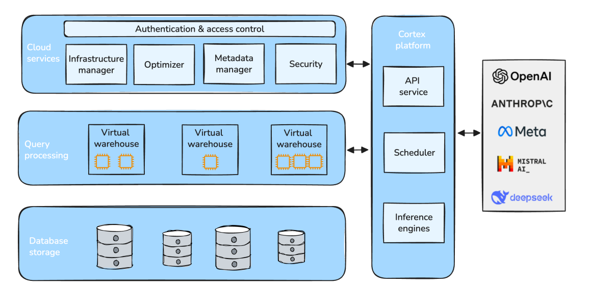
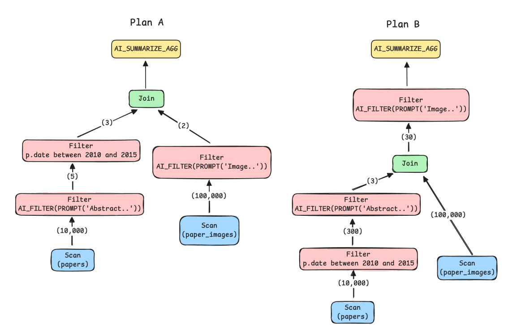
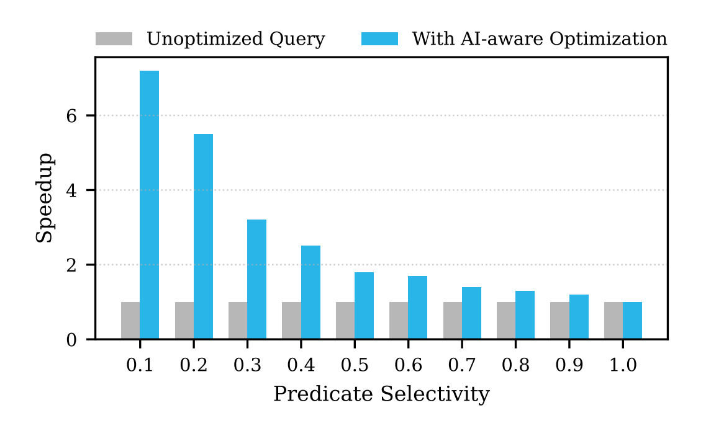
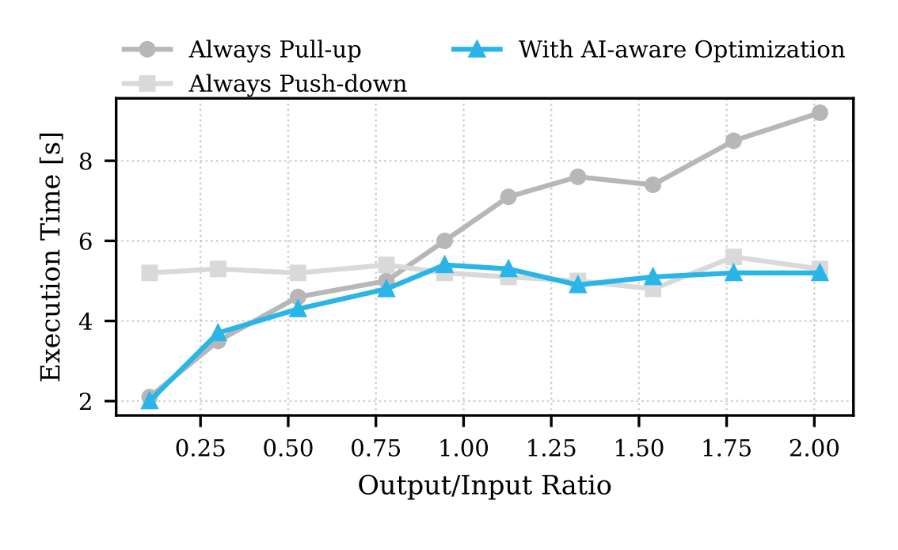
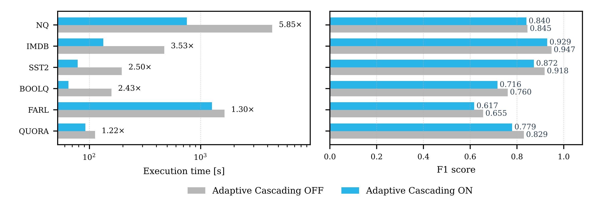
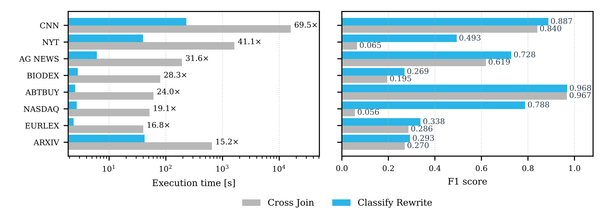

# Cortex AISQL: A Production SQL Engine for Unstructured Data —— 论文精读笔记

> **阅读版本**：Paweł Liskowski et al., *Cortex AISQL: A Production SQL Engine for Unstructured Data*, SIGMOD Companion ’26, 13 pages.  
> **说明**：本文主体严格依据论文内容整理。论文没有给出的实现细节、实验条件或结论，均明确标注为“论文未给出 / 未研究”。最后两章“理解与启发”“与课题关系”为基于论文内容的个人分析，不属于论文原文贡献。  
> **原论文**：

---

# 0. 一页读懂 Cortex AISQL

Cortex AISQL 要解决的核心问题不是“怎么把一个 LLM API 塞进 SQL”，而是：

> **当 AI inference 成为数据库查询中的正式算子后，传统数据库围绕 cardinality、join cost、predicate selectivity 建立起来的优化逻辑已经不够用了。**

原因有三个：

1. **AI operator 单次执行非常昂贵**，LLM inference 的成本远高于普通 SQL operator；
2. **AI operator 的 selectivity 和真实成本在编译期通常未知**；
3. **semantic join 等操作可能直接产生 \(O(|L||R|)\) 次模型调用**，导致查询不可执行。

Cortex AISQL 因此从三个层次减少 AI inference 成本：

```text
SQL Query
   │
   ├── ① Query Plan 层
   │      AI-aware Query Optimization
   │      → 调整 AI_FILTER 顺序和相对 Join 的位置
   │      → 尽量减少昂贵 LLM 调用
   │
   ├── ② 单个 AI operator 层
   │      Adaptive Model Cascades
   │      → Proxy model 处理容易样本
   │      → Oracle model 只处理不确定样本
   │
   └── ③ Query Rewrite 层
          Semantic Join → Multi-label Classification
          → O(|L||R|) → O(|L|)
```

论文实验得到的主要结果：

- **AI-aware predicate reordering**：Figure 9 中最高约 **7× speedup**；
- **Adaptive Model Cascades**：平均 **2.9× speedup**，平均 F1 从 **0.812 → 0.777**，下降 4.3%；
- **Semantic Join Rewrite**：平均 **30.7× speedup**，范围 **15.24×–69.52×**，平均 F1 **0.412 → 0.596**；
- CNN semantic join：**250,000 次 binary classification → 1,000 次 multi-label classification**，执行时间从 **4.4 小时降到 3.8 分钟**；
- AI_SUMMARIZE_AGG small-data short-circuit：论文报告 **86.1% latency reduction**。

---

# 1. 论文基本信息

## 1.1 题目

**Cortex AISQL: A Production SQL Engine for Unstructured Data**

## 1.2 作者

共 14 位作者：

- Paweł Liskowski
- Benjamin Han
- Paritosh Aggarwal
- Bowei Chen
- Boxin Jiang
- Nitish Jindal
- Zihan Li
- Aaron Lin
- Kyle Schmaus
- Jay Tayade
- Weicheng Zhao
- Anupam Datta
- Nathan Wiegand
- Dimitris Tsirogiannis

## 1.3 单位

全部来自：

**Snowflake Inc.**

## 1.4 会议与年份

- **SIGMOD Companion ’26**
- Companion of the International Conference on Management of Data
- 时间：May 31–June 5, 2026
- 地点：Bengaluru, India
- DOI：10.1145/3788853.3803093

需要注意：这是 **SIGMOD Companion ’26**，不是 SIGMOD 主会 research track。

---

# 2. 研究背景与问题 —— Section 1

## 2.1 为什么数据库需要原生 AI operator？

传统 data warehouse 擅长处理 structured data：

```text
Table
→ Filter
→ Join
→ Aggregate
→ Result
```

但企业越来越多的数据是：

- document
- image
- audio
- video
- conversational text

用户希望直接执行：

> “找出那些表达不满的客户对话。”

或者：

> “把销售对话和其中提到的产品做 semantic join。”

传统 SQL 无法直接表达这些 semantic reasoning。

此前通常需要：

```text
Database
   ↓ export
Python / Pipeline
   ↓
LLM API
   ↓
Application
   ↓
Database
```

Section 1 明确指出这种方式的问题：

- 需要跨系统移动数据；
- 增加 latency 和 cost；
- orchestration 容易出错；
- 最重要的是：**database 无法对整个 workload 做 end-to-end optimization**。

AISQL 的目标因此是：

> 把 semantic reasoning 作为 SQL 的一等能力，让 relational operation 与 AI operation 在同一 declarative query 中组合。

---

# 3. Cortex AISQL 的核心思想与贡献

AISQL 提供六类 semantic operators：

- `AI_COMPLETE`
- `AI_FILTER`
- `AI_JOIN`
- `AI_CLASSIFY`
- `AI_AGG`
- `AI_SUMMARIZE_AGG`

例如一条查询可以连续完成：

```text
AI_FILTER
找出表达不满的客户

       ↓

AI_JOIN
找出客户讨论的产品

       ↓

AI_CLASSIFY
判断问题严重程度

       ↓

AI_SUMMARIZE_AGG
生成每个产品类别的摘要
```

真正的系统难点不在 operator API 本身，而在于：

> **如何让这些极其昂贵的 operator 在 production-scale database 中可执行。**

论文围绕这一问题提出三项核心技术。

---

## 3.1 AI-aware Query Optimization

传统 optimizer 更关注：

- cardinality
- join cost
- predicate selectivity

AISQL 则进一步把：

> **LLM inference cost**

作为 first-class optimization objective。

它会考虑：

- AI predicate 每行调用的成本；
- model 类型；
- input token 数；
- multimodal model 与 text model 的成本差异；
- predicate 的位置；
- predicate evaluation order；
- AI_FILTER 应位于 Join 上方还是下方。

---

## 3.2 Adaptive Model Cascades

不是所有 row 都值得调用大型模型。

AISQL 使用：

```text
Proxy Model
   │
   ├── confident negative → Reject
   │
   ├── uncertain → Oracle Model
   │
   └── confident positive → Accept
```

用便宜的小模型处理容易样本，把大模型预算留给 difficult cases。

---

## 3.3 Query Rewriting for Semantic Joins

最重要的 query-level transformation 是：

```text
Semantic Join
AI_FILTER(x, label)

O(|L| × |R|)
```

重写成：

```text
AI_CLASSIFY(x, [label1, label2, ...])

O(|L|)
```

这不是单纯“把模型变快”，而是直接改变 inference workload 的结构和复杂度。

---

## 3.4 关于“创新性”的论文原文表述

这里需要特别区分。

Section 5 明确说明：

- predicate reordering；
- cost-based predicate placement；

是将已有的 **expensive predicate / UDF optimization** 技术适配到 AISQL。

论文随后明确称：

- **Adaptive Model Cascades**
- **Join-to-Classification Rewrite**

为剩余两项 novel contributions。

因此不宜简单理解为论文从零发明了 cost-based predicate reordering。

---

# 4. 系统与方法设计

Cortex 的核心方法实际跨越 **Section 2 → Section 3 → Section 4 → Section 5**。以下严格按照正式论文顺序整理，不人为调整章节。

---

# 4.1 Section 2：Architecture

## 4.1.1 Snowflake 原有架构

Snowflake 使用 compute-storage separation：

```text
Cloud Services
      │
      │ authentication
      │ query compilation
      │ SQL coordination
      ↓
Query Processing
      │
      │ Virtual Warehouses
      ↓
Database Storage
```

用户可以独立扩展：

- storage；
- query-processing resources / Virtual Warehouses。

---

## 4.1.2 Cortex Platform

为了支持 AI workload，Snowflake 增加 Cortex Platform。

**Figure 1** 是理解整篇论文最重要的系统架构图之一。

Cortex Platform 包含三个核心组件：

1. **Inference Engines**
2. **Scheduler**
3. **API Service**

简化如下：

```text
                Snowflake

 ┌────────────────────────────┐
 │ Cloud Services             │
 │ authentication / optimizer │
 └─────────────┬──────────────┘
               │
 ┌─────────────▼──────────────┐
 │ Query Processing           │
 │ Virtual Warehouses         │
 └─────────────┬──────────────┘
               │
               │ inference request
               ▼
        ┌───────────────┐
        │ API Service   │
        └───────┬───────┘
                ▼
        ┌───────────────┐
        │ Scheduler     │
        └───────┬───────┘
                │
        ┌───────┴───────────┐
        ▼                   ▼
 Inference Engines     Partner Endpoint
 Snowflake GPU         OpenAI / etc.
 e.g. vLLM
```

Figure 1 中 Cortex Platform 位于传统 Snowflake Query Processing 与 AI inference infrastructure 之间。



*来源：论文 Figure 1，PDF 第 3 页；原图裁剪。*

---

## 4.1.3 Inference Engines

Inference Engine 是 specialized service。

负责：

- hosting open-weight models；
- 管理 Snowflake-managed GPU；
- 管理 inference stack，例如论文明确举例 **vLLM**；
- 根据 inference demand 自动 scale up / scale down。

论文举例：

- Llama
- Mistral

等 open-weight model。

---

## 4.1.4 Scheduler

Scheduler 负责：

> orchestrating requests and assigning them to the most appropriate Inference Engine。

论文给出的例子：

如果请求：

```text
Llama 3.1 70B
```

Scheduler 会寻找：

```text
已经加载 Llama 3.1 70B
并且 ready to serve
```

的 Inference Engine。

注意：

**论文只描述了这里的 request orchestration / engine assignment 功能，没有进一步公开 Scheduler 的 batching、queueing、admission control、fairness 或 endpoint load-balancing 算法。**

---

## 4.1.5 API Service

API Service 是 Cortex Platform 的 front-end。

接收来自：

- Cloud Services；
- Query Processing；

的 inference request。

执行：

```text
Request
  ↓
API-specific business logic
  ↓
Scheduler
```

---

## 4.1.6 Snowflake-hosted model 与 Partner Endpoint

Cortex Platform 对每个请求决定：

```text
Snowflake Inference Engine
           OR
Partner Endpoint
```

例如论文明确写到：

> GPT model 的请求会被 route 到 OpenAI endpoint。

因此 Cortex Platform 实际是一个统一 inference access layer。

---

# 4.2 Section 3：AISQL Operators

**Table 1** 总结了 AISQL 的六种核心 operator。

| Operator | 作用 | 输入输出 |
|---|---|---|
| `AI_COMPLETEϱ` | Map / text generation | 每 row → text |
| `AI_FILTERφ` | Semantic predicate | 每 row → boolean |
| `AI_JOINφ` | Semantic join | 两组数据 → 满足语义条件的 pair |
| `AI_CLASSIFYϱ` | Classification | 每 row → candidate category |
| `AI_AGGϱ` | Task-specific semantic aggregation | 多 rows → text |
| `AI_SUMMARIZE_AGG` | Text summarization aggregate | 多 rows → summary |

---

# 4.2.1 Section 3.1 Map：AI_COMPLETE

`AI_COMPLETEϱ` 是最底层、最直接的 map operation。

形式上：

```text
x_i → ϱ(x_i)
```

即每一行独立调用 LLM。

论文例子：

```sql
SELECT AI_COMPLETE(
    PROMPT(
        'Evaluate the customer satisfaction from the product review: {0}',
        review
    )
)
FROM product_reviews;
```

例如输出：

```text
This review indicates moderate dissatisfaction.
This review expresses positive sentiment.
```

### 关键特征

- row-wise；
- data parallel；
- unrestricted text generation；
- 可以通过 `PROMPT` object 使用 image 等 multimodal input。

---

# 4.2.2 Section 3.2 Filter：AI_FILTER

`AI_FILTERφ` 返回 boolean。

逻辑上：

\[
\phi(x)\rightarrow\{0,1\}
\]

因此可以直接出现在：

```sql
WHERE AI_FILTER(...)
```

中。

例如：

```sql
WHERE AI_FILTER(
    PROMPT(
        'In this sales transcript,
         does the customer become irritated? {0}',
        transcript
    )
)
```

本质是：

> 每一行运行一次 semantic predicate。

这也是后续优化最重要的 operator，因为百万行数据意味着潜在百万次 inference。

---

# 4.2.3 Section 3.3 Join：Semantic Join

论文展示的具体 SQL 写法是：

```sql
JOIN products AS p
ON AI_FILTER(
    PROMPT(
        'In this sales transcript,
         does the customer complain about {0}? {1}',
        p.name,
        t.transcript
    )
)
```

假设两个 relation 的大小分别是：

\[
M,\quad N
\]

naive implementation 需要：

\[
O(MN)
\]

次 `AI_FILTER`。

---

### 一个容易混淆的细节

**Table 1** 中把 semantic join 抽象为：

```text
AI_JOINφ
```

但 **Section 3.3、Listing 2 以及 Section 5.3 的具体 SQL** 都是通过：

```sql
JOIN ... ON AI_FILTER(...)
```

来展示 semantic join。

因此阅读论文时可以理解为：

- `AI_JOIN` 是 operator-level abstraction；
- 本文重点优化的具体 semantic join pattern 是 **join predicate 中包含 AI_FILTER 的情况**。

不要把两者误认为论文分别实现了两套完全独立的机制。

---

# 4.2.4 Section 3.4 Classify：AI_CLASSIFY

`AI_CLASSIFYϱ` 将每一行映射到给定 candidate category。

例如：

```sql
AI_CLASSIFY(
    review,
    ['positive', 'neutral', 'negative'],
    'Classify the sentiment of this product review.'
)
```

与 `AI_COMPLETE` 的区别：

```text
AI_COMPLETE
    ↓
自由生成任意文本

AI_CLASSIFY
    ↓
输出被约束在有限 candidate set
```

论文称它：

> effectively performing a supervised classification in natural language。

因为每行 classification 相互独立，所以同样支持 distributed execution。

输出之后仍然是普通 relational attribute，可以继续：

```text
GROUP BY
FILTER
AGG
```

这点很重要：

> semantic operator 并不是 SQL pipeline 的终点，而是产生新的 relational value，继续参与 SQL query。

---

# 4.2.5 Section 3.5 Reduce：AI_AGG / AI_SUMMARIZE_AGG

Aggregation 与 row-level operator 有本质区别。

问题在于：

> 一个 column 的全部 text 很可能超过 LLM context window。

因此不能简单：

```text
把整列 text
       ↓
一次 LLM
```

AISQL 使用 hierarchical aggregation。

---

## Algorithm 1：AI_SUMMARIZE_AGG

### 输入

```text
Column of text values: texts
```

### 输出

```text
Aggregated text string
```

### 两个 buffer

论文定义：

```text
R = row buffer
S = intermediate-state buffer
```

---

## 阶段 1：Extract

不断将 text row 放入 `R`。

当：

```text
(R ∪ {t}).size() > BATCH_SIZE
```

执行：

```text
LLM.Extract(R)
```

生成 intermediate state。

然后：

```text
S ← S ∪ LLM.Extract(R)
R ← ∅
```

目的：

> 从原始 text batch 中只提取对最终 summarization 有价值的信息。

---

## 阶段 2：Combine

如果 `S` 过大：

```text
S.size() > BATCH_SIZE
```

执行：

```text
S ← LLM.Combine(S)
```

将多个 intermediate states 进一步合并。

这个过程可能递归多次。

目的：

- discard extraneous information；
- synthesize similar information；
- 控制内容始终不超过 context window。

---

## 阶段 3：Summarize

所有 row 处理完成后：

```text
while len(S) > 1:
    S ← LLM.Combine(S)
```

最终：

```text
LLM.Summarize(S[0])
```

产生 user-facing summary。

---

## Algorithm 1 的整体结构

```text
Raw Text Rows
     │
     │ batch
     ▼
LLM.Extract
     │
     ▼
Intermediate States
     │
     │ recursive
     ▼
LLM.Combine
     │
     ▼
One Combined State
     │
     ▼
LLM.Summarize
     │
     ▼
Final Result
```

### 为什么这样设计？

论文给出的直接理由：

> 原始 column 可能包含超过单个 model context window 的数据。

因此 hierarchical aggregation 把一次 impossible 的大 aggregation 转化为多阶段 reduction。

---

## AI_AGGϱ

`AI_AGGϱ` 与 `AI_SUMMARIZE_AGG` 算法几乎相同。

区别是：

`LLM.Extract`、`LLM.Combine`、`LLM.Summarize`

每次调用额外接收用户指定的 task instruction `ϱ`。

例如：

> Identify the three most common complaints and provide recommendations...

因此：

```text
AI_SUMMARIZE_AGG
→ 通用 summarization

AI_AGG
→ task-specific aggregation
```

---

# 4.2.6 Section 3.6 Multimodal Input

AISQL 新增：

**FILE data type**

FILE 保存：

- URI；
- size；
- mime type；
- creation date；
- 等 metadata。

文件本身位于 user-managed cloud storage。

例如：

```sql
WHERE FL_IS_IMAGE(marketing_content.file_ref)
```

再将 `FILE` 输入 `AI_COMPLETE`：

```sql
AI_COMPLETE(
    'claude-3-5-sonnet',
    'Identify the kitchen appliance brands from the image',
    marketing_content.file_ref
)
```

因此 AISQL 的 semantic processing 并不局限于 text table。

---

# 4.3 Section 4：Customer Workloads

这一部分非常重要，因为作者后续的优化不是凭空设计，而是由 production workload 驱动。

论文分析：

> **2025 年 7 月—9 月**

三个月的 AISQL workload。

来源覆盖：

- multiple Snowflake deployments；
- multiple cloud providers。

---

## 4.3.1 Figure 2：SQL statement 类型

Figure 2：

| Statement | 比例 |
|---|---:|
| SELECT | **85.0%** |
| INSERT | 7.7% |
| UPDATE | 4.2% |
| MERGE | 1.8% |
| OTHER | 1.2% |

最主要 workload 是 SELECT。

---

# 4.3.2 Figure 4：AI inference 是主要 cost

Figure 4 将 credit 拆成：

```text
Warehouse Credits
AI Credits
```

涵盖：

- INSERT
- COPY
- UPDATE
- SELECT
- CTAS
- DELETE
- DYNAMIC TABLE REFRESH
- MERGE

作者由此得到 Observation 1：

> **AI operators dominate AISQL query cost.**

图中没有为所有 statement 给出精确数值表，因此这里不自行从柱状图估算百分比。

这一 production observation 直接推动：

- Section 5.1 AI-aware Query Optimization；
- Section 5.2 Adaptive Model Cascades。

---

# 4.3.3 Figure 5：Semantic Join 很常见

Figure 5 是**query 数量**按涉及 table 数量的分布：

| Table 数量 | Query 比例 |
|---|---:|
| 1 | **61%** |
| 2–10 | **38%** |
| 11–20 | **1%** |
| 更大 | <1% |

也就是说：

> 接近 40% 的 AISQL query 是 multi-table query。

---

# 4.3.4 Figure 3：Multi-table query 消耗更多执行时间

Figure 3 给出的 execution-time composition：

| Table 数量 | Execution Time 占比 |
|---|---:|
| 1 | 40.6% |
| 2–10 | 56.1% |
| 11–20 | 2.6% |
| >21 | 0.7% |

按 Figure 3 中数字相加，多表 workload 占 execution time 约 59.4%。

正文将这一现象概括为：

> multi-table queries account for over 58% of total execution time。

这推动了 Section 5.3：

> Query Rewriting for Semantic Joins。

---

# 4.4 Section 5：AISQL Query Execution Engine

这是论文真正的优化核心。

---

# 4.4.1 Section 5.1：Optimizing AI Operators

## 问题 1：AI operator 是 optimizer 的 black box

传统 predicate：

```sql
date BETWEEN 2010 AND 2015
```

可以通过：

- statistics；
- histograms；
- column distribution；

估计 selectivity。

但：

```sql
AI_FILTER(
    'Does this abstract discuss energy efficiency?'
)
```

的 selectivity 在 compile time 通常不知道。

---

## 问题 2：每 row 成本极高

论文指出：

> AI operator 的 monetary cost 和 runtime cost 比 conventional SQL operator 高几个数量级。

对于 text `AI_FILTER`：

论文说执行成本可以依据：

> column value 的 average number of tokens

进行估计。

对于 image `AI_FILTER`：

需要 multimodal model，而 multimodal model 通常更大、更贵。

需要强调：

> **论文没有给出一个完整、显式的 AI operator cost model 公式。**

它描述了成本估计因素及 total LLM cost optimization，但没有给出类似传统 cost model 的完整数学表达式。

---

## Figure 6 + Listing 1：示例 workload

作者构造 research-paper application：

```text
papers
- id
- title
- abstract
- date
- ...

paper_images
- id
- image_file
```

用户希望找到：

1. 2010–2015 年论文；
2. abstract 讨论 database energy efficiency；
3. image 中展示 TPC-H energy consumption；
4. 最终 summarize abstracts。

因此 Query 中包含：

```text
普通 date filter
+
text AI_FILTER
+
multimodal AI_FILTER
+
AI_SUMMARIZE_AGG
```

三个 predicate 的成本差别巨大。

---

# 4.4.1.1 Figure 7：Plan A vs Plan B

这是理解 AISQL optimizer 最关键的例子。

---

## Plan A：传统思路

如果 optimizer 不考虑 AI predicate cost：

> Join 很贵，因此应该尽量把 filter push 到 Join 下面。

于是：

```text
Filter
 ↓
Filter
 ↓
Scan

      +     

AI_FILTER(image)
 ↓
Scan
      ↓
     Join
```

结果：

> **110,000 LLM calls**

---

## Plan B：AI-aware

AISQL 重新考虑：

> 与 Join cost 相比，LLM invocation cost 可能更重要。

因此：

- 调整 papers 一侧 predicate evaluation order；
- 将昂贵的 image `AI_FILTER` **pull above join**。

最终：

> **330 LLM calls**

论文称：

> 约 **300× improvement** in both cost and execution time。



*来源：论文 Figure 7，PDF 第 7 页；原图裁剪。*

---

# 4.4.1.2 Predicate Reordering

Predicate reordering 同时包含：

### Compile-time component

根据 relative cost：

```text
cheap predicate
      ↓
expensive predicate
```

原则是：

> most expensive predicates are evaluated last。

---

### Runtime component

执行时收集：

- predicate cost；
- predicate selectivity。

如果发现原来的顺序不是最优，可以动态调整。

例如两个 text `AI_FILTER`：

```text
AI_FILTER_A
AI_FILTER_B
```

如果运行时发现 B 更 selective：

```text
B → A
```

可以减少 A 的执行次数。

---

# 4.4.1.3 AI-aware Placement

AISQL 还会决定：

```text
AI_FILTER
```

相对：

```text
Join
Aggregation
```

的位置。

论文的一个重要经验是：

> 即使 compile-time 不知道 AI_FILTER selectivity，仅仅优化 **total number of AI inference calls**，在很多场景已经能够得到不错结果。

但作者紧接着指出：

随着 query 更复杂：

- compiler estimation 更不可靠；
- 这种 optimization 会逐渐失效。

作者考虑的 future directions 包括：

- dynamic optimization；
- caching runtime statistics；
- generalizing AI function placement in complex execution plans。

---

# 4.4.2 Section 5.2：Adaptive Model Cascades

目标：

> 不要让 expensive oracle LLM 处理每一行。

---

## 输入

一个 `AI_FILTER` workload：

\[
x_1,x_2,\dots,x_n
\]

以及：

- lightweight proxy model；
- powerful oracle model。

论文示例：

```text
Proxy:  Llama3.1-8B
Oracle: Llama3.3-70B
```

---

# 4.4.2.1 Confidence Score

Proxy 对每一行 \(x_i\) 产生：

\[
s_i\in[0,1]
\]

表示 predicate 为 true 的概率。

对于 `AI_FILTER`：

模型生成：

```text
yes / no
```

\(s_i\) 是 positive-class token 的 softmax probability。

---

# 4.4.2.2 Two-Threshold Routing

学习两个 threshold：

\[
\tau_{low},\tau_{high}
\]

形成三个区域：

### Reject

\[
s_i < \tau_{low}
\]

直接：

```text
negative
```

不调用 oracle。

---

### Accept

\[
s_i \ge \tau_{high}
\]

直接：

```text
positive
```

不调用 oracle。

---

### Uncertainty

\[
\tau_{low}\le s_i<\tau_{high}
\]

发送给：

```text
Oracle Model
```

---

## 整体流程

```text
                       Proxy Model
                           │
                    confidence s_i
                           │
          ┌────────────────┼────────────────┐
          │                │                │
   s < τ_low      τ_low ≤ s < τ_high     s ≥ τ_high
          │                │                │
       Reject          Uncertainty        Accept
          │                │                │
        Proxy             Oracle           Proxy
```

---

# 4.4.2.3 Adaptive Threshold Learning

AISQL 使用：

**SUPG-IT**

论文说明它扩展了 SUPG statistical framework，使其适用于：

- streaming execution；
- joint precision-recall guarantees。

---

## 分布式设计

Data 被 partition 到多个 parallel workers。

每个 worker：

> 独立处理自己的 batch，**不进行 inter-worker communication**。

这是论文明确强调的设计。

---

## 每 batch 的 sampling

从一个 batch 中抽取 budget fraction：

\[
\rho
\]

送给 oracle 标注。

sampling 使用 importance sampling：

\[
weight \propto \sqrt{s_i}
\]

同时混入 uniform sampling，以保证 coverage。

---

## Threshold 更新

累积 oracle labels 后：

### \(\tau_{low}\)

通过：

> weighted ROC curve

并结合：

> sampling-corrected recall target

确定。

### \(\tau_{high}\)

选择满足：

> statistical lower bound on precision ≥ precision target

的 minimum threshold。

---

随着 oracle sample 增加：

```text
confidence bound tighter
        ↓
uncertainty region narrower
        ↓
fewer oracle evaluations
```

---

## Budget 不足怎么办？

如果 row 落入 uncertainty region：

```text
if oracle budget available:
    Oracle
else:
    fallback to Proxy prediction
```

---

## 用户可配置参数

用户仍然执行正常：

```sql
AI_FILTER(...)
```

cascade 对用户透明。

但可以额外指定：

- oracle budget fraction；
- precision target；
- recall target。

query 完成后系统报告：

> observed delegation rate

供用户调整 cost-quality tradeoff。

---

## 关于理论保证

论文说明 SUPG-IT 具有 formal precision-recall guarantees。

但：

> **本文没有展开证明或 convergence analysis。**

作者明确将详细算法、formal guarantees 和 complementary calibration-based cascade 放在引用 **[21] Streaming Model Cascades for Semantic SQL** 中。

因此不能把那些证明当成本篇 Cortex AISQL 自己完整给出的内容。

---

# 4.4.3 Section 5.3：Query Rewriting for Semantic Joins

考虑：

```text
Reviews
Categories
```

用户想把每条 review 与若干 category 匹配。

---

## Listing 2：原始 Semantic Join

```sql
SELECT *
FROM Reviews
JOIN Categories
ON AI_FILTER(
    PROMPT(
        'Review {0} is mapped to category {1}',
        Reviews.review,
        Categories.label
    )
);
```

由于 predicate 不是 equality：

- Hash Join 不适用；
- Sort-Merge Join 不适用。

因此只能逻辑上做：

```text
Cross Join
    ↓
AI_FILTER each pair
```

复杂度：

\[
O(|L|\times|R|)
\]

---

# 4.4.3.1 核心发现：很多 Semantic Join 实际是 Multi-label Classification

例如：

```text
Review:
"Battery life is terrible"

Labels:
- electronics
- clothing
- furniture
- ...
```

原来是：

```text
(review, electronics) → AI_FILTER
(review, clothing)    → AI_FILTER
(review, furniture)   → AI_FILTER
...
```

可以重写成：

```text
AI_CLASSIFY(
    review,
    [electronics, clothing, furniture, ...]
)
```

---

## Figure 8 示例

4 条 review × 6 个 label。

原方案：

\[
4\times6=24
\]

次 `AI_FILTER`。

重写：

\[
4
\]

次 `AI_CLASSIFY`。

示例中减少 **6× inference calls**。

---

# 4.4.3.2 如何自动判断能不能 Rewrite？

这部分很关键。

在 query compilation 阶段，AISQL 引入一个：

> **AI-based oracle**

检查 semantic join。

Oracle 分析：

1. user natural-language prompt；
2. schema metadata：
   - table name
   - column name
3. statistics：
   - number of distinct values 等；
4. sample values from each input source。

Oracle 决定：

```text
① 这个 semantic join 是否能变成 classification？

② 哪一侧 input dataset 提供 classification labels？
```

随后 compiler 进行 regular rewrite。

---

# 4.4.3.3 Context Window 问题

并不是所有 labels 都能一次放进 `AI_CLASSIFY`。

因此 rewritten query 还加入操作：

- 减少单次 `AI_CLASSIFY` 的 input labels；
- 确保输入可以 fit user-specified LLM context window。

这解释了后面 **Table 4** 中一个容易忽略的现象：

> Rewrite 虽然是 \(O(|L|)\)，但并不保证严格“每个 left row 只调用一次”。

例如：

CNN：

```text
L = 500
```

但 rewrite 仍有：

```text
1,000 calls
```

ARXIV / NYT：

```text
L = 500
```

但 rewrite 有：

```text
1,500 calls
```

因为 label set 需要被分批送入模型。

所以准确表述应是：

> inference complexity 从 \(O(|L||R|)\) 降到与 \(|L|\) 线性相关，而不是所有场景下严格等于 \(|L|\) 次调用。

---

# 4.4.3.4 为什么 Multi-label Classification 可能反而更准？

作者提出：

binary `AI_FILTER` 是独立判断：

```text
Is X category A?
Is X category B?
Is X category C?
```

而 `AI_CLASSIFY` 同时看到多个 candidate：

```text
Which of [A,B,C,...] match X?
```

这样模型可以进行：

> comparative reasoning。

Section 6.3 的实验显示部分 dataset 上 precision 和 F1 因而大幅提升。

但并不是所有情况都更好，后文会看到明显 recall trade-off。

---

# 4.4.4 Section 5.4：AI Aggregation Optimization

Section 3 的 hierarchical aggregation 使用：

```text
LLM.Extract
LLM.Combine
LLM.Summarize
```

但对于很小的数据：

```text
所有 input 本身就 fit context window
```

仍然进行三阶段处理会带来不必要的 API overhead。

AISQL 因此增加：

> **short-circuit**

如果数据足够小：

```text
skip unnecessary incremental fold steps
```

论文报告：

> 在 small dataset 的 `AI_SUMMARIZE_AGG` query 中，latency reduction 为 **86.1%**。

论文没有进一步给出这一结果对应的完整 dataset、model、hardware 和独立实验表格。

---

# 5. Experimental Evaluation —— Section 6

论文实验实际只有：

- **Section 6.1**
- **Section 6.2**
- **Section 6.3**

不存在额外的 Section 6.4/6.5 实验，因此这里不补造。

所有实验：

> 运行在 **production-release version of Snowflake** 上。

主要衡量：

- execution time；
- prediction quality。

需要特别指出：

> **论文没有披露实验所使用的 GPU 型号、GPU 数量、Virtual Warehouse 配置、具体集群规模或 inference engine resource allocation。**

因此实验数值可以比较论文中的方法，但无法从本文完全复现实验硬件环境。

---

# 5.1 Section 6.1：AI-aware Query Optimization

这一节包含两个实验。

---

## 5.1.1 Experiment 1：Predicate Reordering

### Dataset

**1,000 New York Times articles**

### Query

包含：

```sql
id_group IN (...)
```

和：

```sql
AI_FILTER(
    'The article title is about finance',
    model='llama3.1-70b'
)
```

### Variable

改变普通 `IN` predicate 的 selectivity：

\[
0.1 \rightarrow 1.0
\]

其中：

```text
1.0 = 所有 input rows 都满足 IN predicate
```

---

## Baseline

**Unoptimized Query**

与：

**With AI-aware Optimization**

比较。

优化版本：

> 让昂贵的 `AI_FILTER` 最后执行。

---

## Figure 9 结果

当普通 predicate selectivity 很低时：

```text
cheap selective predicate
       ↓
大量过滤 rows
       ↓
AI_FILTER
```

能大幅减少 inference calls。

Figure 9：

> 最高约 **7× speedup**。

随着普通 predicate selectivity 接近 1：

```text
普通 predicate 基本不过滤数据
```

收益逐渐下降到接近 1×。



*来源：论文 Figure 9，PDF 第 9 页；原图裁剪。*

---

## 这个实验真正证明了什么？

证明：

> 当 SQL query 同时包含 cheap relational predicate 和 expensive AI predicate 时，evaluation order 会显著影响执行时间。

尤其 cheap predicate 很 selective 时：

> 将 AI predicate 延后执行非常有效。

---

## 论文没有证明什么？

Figure 9 只研究：

- 一个普通 predicate；
- 一个 AI_FILTER；
- 1,000 篇 NYT article；
- Llama3.1-70B。

它没有证明：

- 任意多 predicate query 都能达到相同收益；
- 所有复杂 query 都能仅通过 cost ordering 得到最优 plan。

---

# 5.1.2 Experiment 2：AI_FILTER 相对 Join 的 Placement

Query：

```sql
NYT_ARTICLES_V1 l
JOIN
NYT_ARTICLES_V2 r
```

包含：

```text
l.id = r.id
+
AI_FILTER(l.title)
```

---

## Variable

论文改变 Join：

> output rows 与 left input rows 的 ratio。

Figure 10 横轴标为：

**Output/Input Ratio**

范围：

\[
0.1\rightarrow2
\]

其中：

```text
ratio < 1
→ selective join

ratio > 1
→ explosive join
```

---

## Baselines

### Always Pull-up

永远：

```text
Join
 ↓
AI_FILTER
```

即 AI predicate 在 Join 上方。

### Always Push-down

Snowflake 原 optimizer 默认行为：

```text
AI_FILTER
 ↓
Join
```

### With AI-aware Optimization

根据：

> total LLM cost

决定 placement。

---

## Figure 10 结果

### Ratio < 1

Join 会显著减少 row：

> **Always Pull-up 更好。**

先 Join，再调用 AI_FILTER 可以减少 LLM calls。

---

### Ratio > 1

Join 会放大 row：

> **Always Push-down 更好。**

先 AI_FILTER 可以避免 Join 后对更多 rows 调用模型。

---

### AI-aware Optimization

Figure 10 显示：

> 在整个 0.1–2 的 measured range 内都取得最好或接近最好的 execution time。



*来源：论文 Figure 10，PDF 第 9 页；原图裁剪。*

---

## 这个实验真正证明了什么？

不存在：

```text
AI_FILTER 永远 push-down
```

或者：

```text
AI_FILTER 永远 pull-up
```

这样的 universally optimal rule。

应该根据：

> Join cardinality + LLM cost

做决策。

---

## 作者明确指出的限制

该优化有效性依赖：

> compiler 能否准确估计 Join selectivity。

而复杂 multi-join query 中 cardinality estimation 本身就困难。

作者因此提出未来考虑：

> adaptive optimization，通过 sample data 收集 AI operator 的 runtime cost/selectivity。

---

# 5.2 Section 6.2：Adaptive Model Cascades

## Dataset

六个 HuggingFace public NLP benchmarks：

| Dataset | Task |
|---|---|
| NQ | Question Answering |
| BOOLQ | Question Answering |
| IMDB | Sentiment Analysis |
| SST2 | Sentiment Analysis |
| QUORA | Duplicate Question Detection |
| FARL | News Veracity Classification |

规模：

> 约 **3,500–400,000 rows**。

---

## Models

### Baseline Oracle

```text
Llama3.3-70B
```

所有 row 都使用 oracle。

### Proxy-only

```text
Llama3.1-8B
```

所有 row 都使用 proxy。

### Cascade

```text
Llama3.1-8B
        +
Llama3.3-70B
```

使用 adaptive threshold learning。

---

## 实验次数

每个 query：

> **执行 5 次，报告 mean。**

---

## Metrics

论文评估：

- execution time；
- accuracy；
- precision；
- recall；
- F1。

Table 2 主要报告：

- time；
- speedup；
- F1；
- ΔF1；
- precision / recall。

---

# 5.2.1 Table 2：平均结果

| Method | Time | Speedup | F1 | ΔF1 | Precision / Recall |
|---|---:|---:|---:|---:|---:|
| Llama3.3-70B | **975.9 s** | — | **0.812** | — | 0.813 / 0.829 |
| Llama3.1-8B | 296.2 s | **3.3×** | 0.659 | **-18.8%** | 0.704 / 0.686 |
| Cascade | **336.4 s** | **2.9×** | **0.777** | **-4.3%** | 0.784 / 0.794 |

Cascade：

```text
975.9 s
   ↓
336.4 s
```

mean execution time：

> **减少 65.5%**

对应：

> **2.9× speedup**

同时 F1：

```text
0.812
 ↓
0.777
```

下降：

> **4.3%**

即保留约：

> **95.7% baseline F1 performance**

---

# 5.2.2 为什么不能只用小模型？

Proxy-only：

```text
296.2 s
```

确实比 cascade：

```text
336.4 s
```

稍快。

但：

```text
F1
0.812 → 0.659
```

下降：

> **18.8%**

因此 Table 2 真正展示的是：

> Cascade 的价值不是成为绝对最快方案，而是在速度和 prediction quality 之间取得中间点。

---

# 5.2.3 Figure 11：不同 Dataset 差异很大

| Dataset | Speedup |
|---|---:|
| NQ | **5.85×** |
| IMDB | 3.53× |
| SST2 | 2.50× |
| BOOLQ | 2.43× |
| FARL | 1.30× |
| QUORA | 1.22× |

作者解释：

> 如果 proxy confidence 能很好地区分 easy case 与 difficult case，就能把更多 row 留在 proxy，speedup 更高。

因此 cascade 性能高度依赖：

> dataset characteristics + confidence quality。

---

## Figure 11：F1

| Dataset | Oracle-only | Cascade |
|---|---:|---:|
| NQ | 0.845 | **0.840** |
| IMDB | 0.947 | 0.929 |
| SST2 | 0.918 | 0.872 |
| BOOLQ | 0.760 | **0.716** |
| FARL | 0.655 | 0.617 |
| QUORA | 0.829 | 0.779 |

NQ 几乎不掉：

```text
0.845 → 0.840
```

BOOLQ 的下降最大：

```text
0.760 → 0.716
```



*来源：论文 Figure 11，PDF 第 10 页；原图裁剪。*

---

# 5.2.4 这个实验真正证明了什么？

在论文选取的：

- 六个 binary classification workloads；
- Llama3.1-8B proxy；
- Llama3.3-70B oracle；

条件下，Adaptive Model Cascades 可以：

> 在平均 F1 仅下降 4.3% 的情况下，获得平均 2.9× speedup。

同时说明：

> proxy uncertainty 与实际 task difficulty 的相关程度直接决定 cascade 效果。

---

## 论文没有证明什么？

本文实验没有覆盖：

- multi-class `AI_CLASSIFY` cascade；
- generative `AI_COMPLETE` cascade；
- `AI_AGG`；
- arbitrary proxy/oracle combinations。

Section 8 也明确指出：

> 将 model cascades 扩展到 multi-class operator，需要处理每个 class 不同的 confidence distribution。

---

# 5.3 Section 6.3：Query Rewriting for Semantic Joins

这一节是整篇论文中性能提升最明显的实验。

---

## Dataset

八个 semantic join benchmark：

### Entity Matching

- ABTBUY
- NASDAQ

### Document Categorization

- ARXIV
- EURLEX
- NYT
- CNN

### News Classification

- AG NEWS

### Biomedical Concept Linking

- BIODEX

每个 benchmark 有两个 table：

\[
L,R
\]

大小：

> **50–500 rows**

最大 Cartesian product：

\[
500\times500=250,000
\]

candidate pairs。

---

## Baseline

**Cross Join + AI_FILTER**

复杂度：

\[
O(|L||R|)
\]

---

## Proposed

**AI_CLASSIFY Rewrite**

复杂度：

\[
O(|L|)
\]

实际 call 数可能因为 label/context-window 分块成为 \(k|L|\)，但仍是 linear，而不是 Cartesian-product scale。

---

# 5.3.1 Table 3：平均结果

| Method | Time | Speedup | F1 | ΔF1 | Precision / Recall |
|---|---:|---:|---:|---:|---:|
| Cross Join | **2330.56 s** | — | 0.412 | — | 0.388 / **0.761** |
| Classify Rewrite | **40.96 s** | **30.7×** | **0.596** | **+44.7%** | **0.745** / 0.540 |

平均：

```text
2330.56 s
    ↓
40.96 s
```

约：

> **30.7× speedup**

同时 F1：

```text
0.412 → 0.596
```

提升：

> **44.7%**

主要来自 precision：

```text
0.388 → 0.745
```

但 recall：

```text
0.761 → 0.540
```

反而降低。

这一点非常关键。

---

# 5.3.2 Table 4：完整 Dataset 结果

| Dataset | L | R | Cross Join Calls | Cross Time(s) | Cross P/R/F1 | Rewrite Calls | Rewrite Time(s) | Rewrite P/R/F1 | Speedup |
|---|---:|---:|---:|---:|---|---:|---:|---|---:|
| NASDAQ | 100 | 100 | 10,000 | 51.46 | .029 / .960 / .056 | 100 | 2.69 | .851 / .731 / .788 | **19.13×** |
| EURLEX | 50 | 194 | 9,700 | 39.93 | .172 / .833 / .286 | 50 | 2.37 | .860 / .210 / .338 | **16.84×** |
| BIODEX | 50 | 197 | 9,850 | 79.60 | .118 / .585 / .195 | 50 | 2.81 | .409 / .200 / .269 | **28.32×** |
| ABTBUY | 100 | 100 | 10,000 | 60.27 | .967 / .967 / .967 | 100 | 2.51 | .968 / .968 / .968 | **24.01×** |
| AG NEWS | 100 | 100 | 10,000 | 63.21 | .565 / .870 / .685 | 100 | 2.57 | .910 / .610 / .731 | **24.59×** |
| AG NEWS | 200 | 200 | 40,000 | 192.27 | .505 / .800 / .619 | 200 | 6.08 | .905 / .610 / .728 | **31.62×** |
| ARXIV | 500 | 500 | 250,000 | 646.67 | .550 / .180 / .270 | 1,500 | 42.31 | .549 / .200 / .293 | **15.24×** |
| NYT | 500 | 500 | 250,000 | 1618.58 | .034 / .775 / .065 | 1,500 | 39.39 | .609 / .414 / .493 | **41.09×** |
| CNN | 500 | 500 | 250,000 | 15955.67 | .729 / .990 / .840 | 1,000 | 229.48 | .807 / .984 / .887 | **69.52×** |

注意：

> Table 4 中 AG NEWS 用 100×100 和 200×200 两种规模做了测试，因此表中有 9 行结果，但论文仍将它们归为八个 benchmark。

---

# 5.3.3 Figure 12：速度结果

八个 benchmark 的主要 speedup：

```text
ARXIV     15.2×
EURLEX    16.8×
NASDAQ    19.1×
ABTBUY    24.0×
BIODEX    28.3×
AG NEWS   31.6×
NYT       41.1×
CNN       69.5×
```

范围：

> **15.24×–69.52×**



*来源：论文 Figure 12，PDF 第 11 页；原图裁剪。*

---

# 5.3.4 CNN：最典型案例

CNN：

```text
L = 500
R = 500
```

Cross Join：

\[
500\times500=250,000
\]

次 binary classification。

Rewrite：

> **1,000 multi-label classifications**

执行时间：

```text
4.4 hours
   ↓
3.8 minutes
```

Speedup：

> **69.52×**

这个实验非常直观地证明：

> 对 AI workload 而言，改变 query formulation / inference-call complexity，收益可能远高于单纯加速一次 model inference。

---

# 5.3.5 Prediction Quality 为什么提高？

最明显的是 NASDAQ。

Baseline：

```text
Precision = 0.029
Recall    = 0.960
F1        = 0.056
```

Rewrite：

```text
Precision = 0.851
Recall    = 0.731
F1        = 0.788
```

作者认为原因是：

> `AI_CLASSIFY` 同时展示 candidate labels，使 model 可以进行 better comparative reasoning。

而 binary AI_FILTER：

> 每次只能孤立判断一个 pair。

---

# 5.3.6 但 Recall 并不总是好

典型：

### EURLEX

```text
Recall
0.833 → 0.210
```

### BIODEX

```text
Recall
0.585 → 0.200
```

作者解释：

> model 在看到完整 label set 后可能变得更加 conservative，倾向只选择非常确定的 label，从而提高 precision、牺牲 coverage。

因此不能简单写成：

> “Classify Rewrite 在 quality 上全面优于 Cross Join。”

论文真正说明的是：

```text
Precision 大幅提高
       ↓
平均 F1 提高

但部分 dataset
       ↓
Recall 明显下降
```

---

# 5.3.7 作者提出的改进

对于 recall-critical applications：

作者提出可以研究：

> **hybrid strategies**

组合：

```text
classification-based rewriting
+
filtering
```

或者：

> 调整 classification prompt。

---

# 5.3.8 论文没有评估的一个重要问题

Section 5.3 使用 **AI-based oracle** 自动判断一个 semantic join 能不能 rewrite。

但是 Section 6.3：

> **没有单独报告这个 rewrite-detection oracle 的准确率、误判率、推理成本或编译 latency。**

实验主要评估的是：

> 在执行 rewrite 后，Cross Join 与 Classify Rewrite 的 performance / quality。

因此不能据本文实验声称：

> “编译器能够对任意 semantic join 完全准确地自动选择 rewrite。”

论文没有证明这一点。

---

# 6. Related Work 中 Cortex AISQL 的定位

Section 7 将 AISQL 放在几条研究线之间。

---

## 6.1 Expensive Predicate Optimization

早期数据库已经研究：

- cost-based predicate reordering；
- expensive UDF caching；
- user-defined predicate optimization。

因此 AISQL 的 AI-aware optimization 本质上延续了：

> expensive predicates

这一数据库经典问题。

变化在于：

> LLM operator 的 per-row cost 高几个数量级，而且 selectivity 在 compile time 更难估计。

---

## 6.2 LOTUS

论文对 LOTUS 的描述是：

> LOTUS introduces semantic operators for Pandas-like dataframe processing。

AISQL 与之区别：

> AISQL operates within a **production distributed SQL engine** and co-optimizes query planning with **LLM inference cost**。

这是论文作者自己给出的定位。

---

## 6.3 ThalamusDB

ThalamusDB：

- multimodal data；
- natural-language predicates；
- approximate query processing；
- zero-shot models。

AISQL 更强调：

- production SQL integration；
- LLM inference cost optimization。

---

## 6.4 Palimpzest

Palimpzest：

- declarative LLM-powered processing；
- specialized map-like operations；
- basic cost-based optimization。

AISQL 则进一步强调：

> cross-row optimizations。

论文举出的就是：

- cascades；
- join rewriting。

---

## 6.5 UQE

论文描述 UQE：

- embedding-based approximations for LLM filter；
- stratified sampling for aggregation；
- best-effort performance。

作者强调 AISQL 的部分技术具有：

> accuracy guarantees

特别是 model cascade 的统计框架。

---

# 7. 优点与局限

---

# 7.1 论文方法的主要优点

## 优点 1：问题来自真实 Production Workload

Section 4 使用 Snowflake 三个月 production data：

- AI credits dominate cost；
- 近 40% query 为 multi-table；
- multi-table workload 占过半 execution time。

因此三个 optimization 与实际 workload 特征直接对应。

---

## 优点 2：不是只优化单次 LLM inference

论文从三个层面减少成本：

```text
Query Planning
     ↓
Model Selection / Routing
     ↓
Query Rewrite
```

特别是 semantic join rewrite 直接减少 invocation complexity。

---

## 优点 3：保持 Declarative SQL

用户仍然写：

```sql
AI_FILTER
AI_CLASSIFY
AI_AGG
...
```

大量 optimization 对用户透明。

这保留了数据库：

> declarative query processing

的核心优势。

---

## 优点 4：同时报告 Performance 和 Quality

尤其 Cascade / Join Rewrite 没有只报告 latency。

作者同时测：

- F1
- precision
- recall

因此可以看到真实 trade-off。

例如 Semantic Join Rewrite：

```text
F1 ↑
Precision ↑
Recall ↓
```

不会把 optimization 简化成“更快且完全无代价”。

---

# 7.2 作者明确指出的局限 / Future Work

论文没有独立的 “Limitations” Section，但 Section 5、6、8 明确给出了若干限制。

---

## 7.2.1 AI-aware Optimizer 仍依赖不可靠的估计

作者明确指出：

> complex query 中 compiler estimation 会变得不可靠。

尤其：

> Join selectivity estimation 很困难。

未来方向：

- dynamic optimization；
- runtime sampling；
- caching runtime statistics across queries。

---

## 7.2.2 Runtime statistics 没有跨 query 充分复用

Section 8：

> caching runtime statistics across queries could improve plan quality for recurring AISQL workloads。

说明当前系统在这一点仍有提升空间。

---

## 7.2.3 Model Cascade 当前主要针对 Binary AI_FILTER

当前 threshold：

```text
τ_low
τ_high
```

是 binary framework。

Section 8 明确指出：

> multi-class operator 需要处理不同 class 的不同 confidence distribution。

因此不能直接把本文 cascade 机制视为已经解决 `AI_CLASSIFY` 等所有 operator。

---

## 7.2.4 Semantic Join Rewrite 有 Recall 问题

Table 4 已经实证：

```text
EURLEX: 0.833 → 0.210
BIODEX: 0.585 → 0.200
```

作者未来希望研究：

> hybrid classification + filtering。

---

# 7.3 笔记分析：论文没有覆盖的问题

以下不是作者宣称的论文贡献，而是阅读后需要记住的实验边界。

---

## 7.3.1 实验基础设施披露较少

论文只说：

> production-release Snowflake。

但没有给出：

- GPU 型号；
- GPU 数量；
- warehouse size；
- inference engine concurrency；
- batch size；
- endpoint 数量；
- network setup。

因此执行时间数值本身的外部可复现性有限。

---

## 7.3.2 没有给出完整 AI Cost Model

论文说明了：

- token count；
- model cost；
- modality；
- total inference calls；

都会影响 cost。

但没有形成一个公开、完整的：

\[
Cost(op,data,model,\ldots)
\]

公式。

因此本文更像：

> 将 AI cost 纳入 optimizer decision 的系统设计，

而不是提供一个通用 learned / analytical cost model。

---

## 7.3.3 Cortex Scheduler 的 Runtime Scheduling 细节没有展开

Figure 1 有：

```text
Scheduler
```

但本文对它主要描述为：

> 将请求分配给已经 hosting 对应 model 且 ready 的 Inference Engine。

没有讨论：

- dynamic batching；
- request admission；
- queue discipline；
- token-based work estimation；
- cross-endpoint load balancing；
- fairness；
- backpressure；
- request-level SLA。

因此这篇论文的主要关注点仍然是：

> **SQL engine / query optimization / semantic operator optimization**

而不是完整的 LLM serving scheduler 设计。

---

## 7.3.4 Rewrite Oracle 没有单独评测

自动 semantic join detection 是非常重要的一步。

但论文没有报告：

```text
rewrite detection accuracy
compile-time LLM cost
compile latency
false-positive rewrite rate
false-negative rewrite rate
```

因此 Section 6.3 主要证明：

> rewrite 本身有价值，

而不是完整证明：

> automatic rewrite detector 已经在所有 workload 上可靠。

---

# 8. 我的理解与启发

> **以下为基于论文内容的个人分析，不属于论文原文贡献。**

---

## 8.1 最重要的设计思想：先减少 AI Work，再优化 AI Execution

Cortex 最值得学习的地方并不是某一个 scheduling trick，而是一种 optimization order：

```text
原始 Query
   ↓
能不能少做一些 AI work？
   ↓
能不能换便宜模型？
   ↓
能不能改变 Query 让 inference 数量从 N² 变 N？
   ↓
剩余 inference 再交给 serving system
```

CNN 的实验最能说明这一点：

```text
250,000 calls
      ↓
1,000 calls
```

这是约两个数量级的 workload reduction。

相比之下，即使把单次 LLM inference 优化 20% 或 30%，也很难达到这种量级。

因此对于 AI operator：

> **work elimination / semantic rewriting 往往比单纯 execution acceleration 更优先。**

---

## 8.2 “AI 算子成本”不能只用 Rows 描述

传统数据库通常关心：

```text
rows
cardinality
CPU
I/O
```

Cortex 已经体现出 AI operator 至少还具有：

```text
row count
×
input tokens
×
model
×
modality
×
number of inference calls
```

例如：

- text AI_FILTER；
- multimodal AI_FILTER；

即便 input rows 一样，实际成本可能完全不同。

这意味着未来的 AI query / execution optimizer 必须把：

> **AI work**

当成一种独立资源维度。

---

## 8.3 Selectivity 从“静态统计量”变成 Runtime Signal

传统 predicate：

```text
column < 10
```

可以通过 histogram 估计。

semantic predicate：

> “这条评论是否表达强烈不满？”

几乎无法直接从传统 column statistics 推导 selectivity。

Cortex 的做法是：

```text
compile-time rough decision
        +
runtime statistics
```

这种思路很重要：

> AI operator optimizer 很可能天然需要 adaptive / feedback-driven optimization。

---

## 8.4 Semantic Rewrite 会改变 Serving Workload 的形态

Semantic Join Rewrite 前：

```text
大量彼此独立的 binary inference requests
```

Rewrite 后：

```text
较少的 multi-label requests
但每个 request prompt 更大
```

因此 query optimizer 的 transformation 会直接改变下游 serving 层：

- request count；
- prompt length；
- batching opportunity；
- memory requirement；
- execution duration。

这说明：

> Query Optimization 与 Model Serving 并不是两个完全独立的层。

---

## 8.5 Cascade 同样是在改变 Request Distribution

Model Cascade 将一个：

```text
所有 rows → 70B model
```

的 workload 变成：

```text
绝大多数 → 8B model
少量 uncertain rows → 70B model
```

因此系统实际面对的是：

> heterogeneous model-serving workload。

这进一步说明，数据库层的 semantic information 与 serving 层调度可以形成更紧密的 cross-layer optimization。

---

# 9. 与我的数据库 AI 算子执行与调度课题的关系

> **以下为基于论文内容的个人研究分析，不属于 Cortex AISQL 原文贡献。**

这篇 Cortex AISQL 与数据库 AI 算子执行研究关系非常直接，但研究层次与重点并不完全相同。

---

## 9.1 Cortex 主要解决“应该生成多少 AI Work”

可以把 Cortex 的核心问题概括为：

```text
SQL Job
  ↓
AI operator 在哪里执行？
  ↓
执行多少次？
  ↓
使用哪个模型？
  ↓
是否可以 Rewrite？
```

例如：

### Predicate Reordering

决定：

```text
哪些 rows 最终需要进入 AI_FILTER
```

### Model Cascade

决定：

```text
哪些 rows 进入 8B
哪些 rows 进入 70B
```

### Join Rewrite

决定：

```text
生成 250,000 个 request
还是生成 1,000 个 request
```

因此 Cortex 主要优化：

> **inference workload generation。**

---

## 9.2 AI 算子执行调度可以继续解决“这些 Work 怎么执行”

当 Cortex 已经产生实际 inference workload 后，还存在另一组问题：

```text
Requests
   ↓
如何组织 batch？
   ↓
何时 submit？
   ↓
发给哪个 endpoint？
   ↓
允许多少 concurrent work？
   ↓
不同 query 如何共享 capacity？
   ↓
如何根据 runtime load 调节？
```

Cortex 本文并没有深入回答这些问题。

特别是 **Figure 1** 虽然明确包含：

```text
Scheduler
Inference Engines
vLLM
```

但没有公开具体的：

- request organization；
- admission control；
- batching；
- endpoint credit；
- backpressure；
- fairness；
- runtime queue scheduling。

因此 Cortex 更接近：

```text
Database Query Optimizer
        │
        │ optimized AI workload
        ▼
AI Execution / Serving Runtime
```

而数据库 AI 算子执行与调度研究可以位于第二层。

---

## 9.3 Cortex 可以提供非常有价值的上游 Job Semantics

例如一条 inference request 不应该只携带：

```text
prompt
model
```

还可以携带：

```text
来源 Query / Operator
AI_FILTER / AI_JOIN / AI_COMPLETE
input rows
estimated token count
model
modality
estimated selectivity
query dependency
priority
```

Cortex 已经证明：

> 这些 semantic / relational information 会显著影响 optimization decision。

因此一个自然的系统方向是：

```text
Database Query Semantics
        ↓
Request Organization
        ↓
Runtime Scheduling
        ↓
Model Serving
```

而不是让 serving 层只看到彼此孤立的 HTTP requests。

---

# 9.4 对执行调度研究最有价值的三个 Cortex Insight

## Insight 1：Work 应该用“预测计算量”而非 Request Count 描述

Cortex Section 5.1 已经指出：

- token count 会影响成本；
- multimodal 与 text model 成本不同；
- model 不同成本不同。

因此：

```text
10 requests
```

不一定等于另外：

```text
10 requests
```

这支持在调度层进一步使用：

```text
predicted work
token budget
model-dependent cost
```

而非只控制 request concurrency。

---

## Insight 2：Optimizer 与 Runtime 应该形成 Feedback Loop

Cortex 已经有：

```text
Runtime
   ↓
predicate cost
predicate selectivity
   ↓
evaluation order
```

可以进一步扩展成：

```text
Query Optimizer
      ↓
AI Workload
      ↓
Runtime Scheduler
      ↓
vLLM / Inference Engine
      ↓
actual latency
actual token usage
queue delay
throughput
      ↓
Optimizer / Scheduler
```

也就是说：

> Cortex 已经迈出了 runtime feedback 的第一步，但还没有形成完整 database-job → serving-runtime 的闭环。

---

## Insight 3：Logical Optimization 与 Runtime Scheduling 是互补关系

不能只做：

```text
better batching
```

因为如果原来：

```text
250,000 inference calls
```

就没有被 rewrite，runtime scheduler 再聪明也必须处理大量请求。

反过来：

即使 query optimizer 把：

```text
250,000 → 1,000
```

如果这 1,000 个请求：

- endpoint selection 不合理；
- batch organization 不合理；
- admission 失控；
- 多 job 相互干扰；

仍然可能出现执行问题。

更完整的系统可以理解为：

```text
Logical / Semantic Optimization
       Cortex AISQL
             │
             ▼
Workload Shaping
             │
             ▼
Physical AI Execution Scheduling
             │
             ▼
vLLM / GPU Endpoints
```

两者不是替代关系，而是上下游关系。

---

# 9.5 与课题的主要区别

| Cortex AISQL | AI 算子执行与调度研究 |
|---|---|
| SQL engine | Runtime / execution layer |
| Operator placement | Request placement |
| Predicate reordering | Request scheduling |
| Join rewrite | Runtime batching |
| Model cascade | Endpoint / model execution |
| 减少 inference calls | 高效执行剩余 calls |
| 依赖 query semantics | 依赖 runtime state |
| Query-level cost | Queue / GPU / serving cost |

因此 Cortex 最值得作为：

> **上游 query semantic / workload optimization 的代表系统**

而执行调度研究可以进一步回答：

> **优化后的 AI operator workload 如何在 Ray / inference runtime / vLLM endpoint 上高效执行。**

---

# 10. 最终总结

如果只记住这篇论文的五件事，可以记下面这五条。

### ① AISQL 把 Semantic Operator 真正放进 Production SQL Engine

六个 operator：

```text
AI_COMPLETE
AI_FILTER
AI_JOIN
AI_CLASSIFY
AI_AGG
AI_SUMMARIZE_AGG
```

让 structured relational processing 与 unstructured semantic reasoning 组合。

---

### ② AI Operator 迫使数据库重新定义 Cost

传统：

```text
CPU
I/O
cardinality
```

AISQL：

```text
LLM inference calls
model
token count
modality
```

因此 inference cost 成为 first-class optimization objective。

---

### ③ Query Plan 可以决定 LLM 调用数量

Figure 7：

```text
Plan A: 110,000 LLM calls
Plan B:     330 LLM calls
```

所以 AI operator placement 不是普通的小优化，而可能导致数量级差异。

---

### ④ Semantic Join Rewrite 是整篇最值得关注的 Optimization

```text
AI_FILTER Cross Join
O(|L||R|)

        ↓

AI_CLASSIFY
O(|L|)
```

实验：

```text
15.24×–69.52× speedup
Mean: 30.7×
```

CNN：

```text
4.4 hours → 3.8 minutes
```

同时平均 F1：

```text
0.412 → 0.596
```

但 recall 可能下降，因此不是无条件替换。

---

### ⑤ Cortex 主要优化“产生什么 AI Work”，并没有完整解决“AI Work 怎么调度”

论文已经有：

```text
Cortex Scheduler
Inference Engines
vLLM
```

但本文没有深入讨论：

```text
batching
admission
queueing
fairness
backpressure
cross-endpoint scheduling
```

因此它非常适合作为数据库 AI 算子执行研究的上游参考：

```text
SQL Semantic Optimization
        ↓
AI Workload Generation
        ↓
AI Execution / Scheduling
        ↓
Model Serving
```

这也是这篇论文对后续 AI operator systems 研究最重要的启发之一。
