# DLPM 论文精读笔记

## Locality-aware Fair Scheduling in LLM Serving

**Deficit Longest Prefix Match (DLPM) / Double Deficit LPM (D²LPM)**

> 论文来源：arXiv:2501.14312v1 \[cs.DC\]，2025-01-24。本文档由此前的 Word 精读笔记转换为 Markdown，正文内容保持一致。

| **论文版本** | arXiv:2501.14312v1 \[cs.DC\]，2025-01-24                                         |
|--------------|----------------------------------------------------------------------------------|
| **作者单位** | UC Berkeley；LMSYS                                                               |
| **精读范围** | 正文 Section 1-10 + Appendix A                                                   |
| **术语原则** | 沿用论文正式术语：LPM、VTC、DLPM、D²LPM、extend tokens、quantum、deficit counter |
| **内容边界** | 论文事实与个人分析分开；未被论文证明的结论明确标注“论文未研究/未证明”            |

> **一句话结论**
>
> DLPM 不是放弃 LPM 的 locality 优先级，而是用 per-client deficit quantum 把 LPM 限制在一个有界的公平“资格窗口”内；D²LPM 再在全局路由层增加 per-client-per-worker deficit，以在 prefix locality 与 load balancing 之间做同样的有界折中。

> **版本说明**
>
> 上传 PDF 是 arXiv v1。PDF 未给出会议或期刊录用信息，因此本笔记只写“arXiv preprint, 2025”，不推断后续发表状态。

## 阅读目录

- 0. 阅读边界与一页速览

- 1. 论文基本信息

- 2. Section 1-2：研究背景、问题与设计目标

- 3. Section 3：Preliminaries——公平性定义与服务计量

- 4. Section 4：Deficit Longest Prefix Match (DLPM)

- 5. Section 5：Applying DLPM to Distributed Scheduling / D²LPM

- 6. Section 6：Evaluation

- 7. Section 7：Ablation Studies

- 8. Section 8：Related Work 定位

- 9. 优点与局限

- 10. 我的理解与启发（个人分析）

- 11. 与我的数据库 AI 算子执行与调度课题的关系（个人分析）

- 12. 术语速查与最终复习提纲

> **章节结构说明**
>
> 用户要求“方法按 Section 2 → 3 → 4、实验按 Section 5.1-5.5”组织，但这篇论文的实际方法延伸到 Section 5，实验位于 Section 6.1-6.3，消融位于 Section 7.1-7.4。为避免篡改论文结构，本笔记严格按论文真实章节编号展开。

## 0. 阅读边界与一页速览

> **最核心的问题**
>
> 在多租户 LLM serving 中，VTC 能提供近似 max-min fairness，却会打散同一 client 的共享 prefix；LPM/Preble 能提高 prefix cache hit rate，却可能让具有长共享 prefix 或大量请求的 client 长时间垄断 GPU。论文要同时保住 fairness、prefix locality，并在多 GPU 时再兼顾 load balancing。

| **维度**    | **论文答案**                                                                                                                                                                | **关键位置**                         |
|-------------|-----------------------------------------------------------------------------------------------------------------------------------------------------------------------------|--------------------------------------|
| 单 GPU 方法 | DLPM：按 LPM 顺序排序，但只有 deficit counter 为正的 client 才可被加入 batch；所有 active clients 均无正 deficit 时统一补充 Qᵘ。                                            | Section 4；Algorithm 1               |
| 多 GPU 方法 | D²LPM：全局层维护每个 client 在每个 worker 上的 deficit Qʷ/qᵢ,ʷ，优先选有最长 prefix 且仍有 deficit 的 worker，否则在可用 worker 中按最短队列选；worker 内部继续运行 DLPM。 | Section 5.2；Figure 5；Algorithm 2   |
| 理论性质    | 近似 max-min fairness 的两类 service bound、work-conserving，以及附录中的 latency bound。                                                                                   | Theorem 4.1/4.2、5.1/5.2；Appendix A |
| 主要结果    | 作者报告：相对 VTC 吞吐最高 2.87×；相对 Preble，well-behaved client latency 最高降低 7.18×。                                                                                | Abstract；Section 6.2                |
| 重要反例    | S2@Long-Context QA、D=8 时，Preble 吞吐高于 D²LPM；超长 prefix、极短 output 是 D²LPM 为公平牺牲 locality 的 worst-case。                                                    | Section 6.2；Table 2；Figure 7       |

> **作者贡献边界**
>
> “first locality-aware fair scheduling algorithm”是论文作者的定位，本笔记未独立检索并验证其优先权。

## 1. 论文基本信息

| **项目** | **信息**                                                                                                                                                              |
|----------|-----------------------------------------------------------------------------------------------------------------------------------------------------------------------|
| 题目     | Locality-aware Fair Scheduling in LLM Serving                                                                                                                         |
| 作者     | Shiyi Cao\*、Yichuan Wang\*、Ziming Mao、Pin-Lun Hsu、Liangsheng Yin、Tian Xia、Dacheng Li、Shu Liu、Yineng Zhang、Yang Zhou、Ying Sheng、Joseph Gonzalez、Ion Stoica |
| 共同一作 | Shiyi Cao、Yichuan Wang（论文以 \* 标注 equal contribution）                                                                                                          |
| 单位     | 1 UC Berkeley；2 LMSYS。部分作者同时标注 1、2。                                                                                                                       |
| 发表信息 | arXiv preprint；arXiv:2501.14312v1 \[cs.DC\]；2025-01-24。PDF 未标明会议/期刊。                                                                                       |
| 研究对象 | 支持 prefix caching/continuous batching 的多 client LLM serving，包含单 worker 与 data-parallel multi-worker 场景。                                                   |
| 实现基础 | Python 实现于 SGLang 之上。                                                                                                                                           |

*原文定位：论文首页，p.1；Section 6.1，p.7。*

## 2. Section 1-2：研究背景、问题与设计目标

### 2.1 为什么 prefix locality 会直接影响 LLM serving 效率

Transformer-based LLM inference 包含 prefill 与 decode 两个阶段。prefill 处理 prompt 并生成首 token，同时形成 KV cache；decode 自回归生成后续 token，每一步都读取已有 KV cache。continuous batching 能提高 GPU 利用率，PagedAttention 缓解 KV 内存碎片，而 SGLang 的 RadixAttention 进一步复用共享 prefix 的 KV cache。

共享 prefix 的收益有两类：第一，多个请求只需保留一份 prefix KV，减少 GPU memory 占用，从而允许更大 batch；第二，已缓存 prefix 不必再次执行 attention 计算，减少 prefill 重算。Tree-of-Thoughts、MCTS、Self-Refine 等多调用程序具有天然的树状共享 prefix，因此 locality 不是次要优化，而可能决定整体吞吐。

*原文定位：Section 2.1，pp.2-3。*

### 2.2 为什么仅做公平或仅做 locality 都不够

公平侧：多个 client 共享 GPU。若没有 isolation，高请求率或恶意 client 可以垄断资源；只用 rate limit 又会在部分 client 空闲时浪费可再分配资源。因此论文沿用 VTC 的目标：实现近似 max-min fairness，并保持 work-conserving。

locality 侧：LPM 按已匹配 prefix 长度排序，优先把共享 prefix 的请求放入 batch，能提高 cache hit 和吞吐。但如果某 client 持续发送大量、长且相同 prefix 的请求，LPM 可能一直选择它，其他 client 被 starvation。

两者冲突的根源是“排序自由度”：公平算法需要根据历史服务量约束 client 间顺序；locality 算法需要为了 prefix 聚类而重排请求。多 GPU 时还多出一个决策：请求不仅要决定何时发，还要决定发给哪个 worker；过度散开会丢 prefix，过度粘在单卡又会失衡。

*原文定位：Introduction；Section 2.2；Figure 2-3，pp.1-3。*

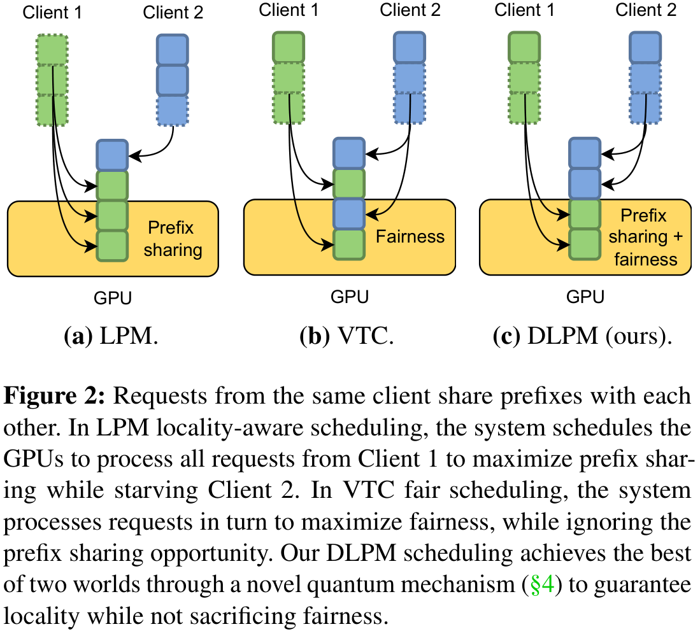

> 配图来源：arXiv:2501.14312v1 Figure 2，PDF 第 3 页。该图是机制示意：LPM 一侧展示可能发生的 starvation，VTC 一侧展示严格轮转对 prefix sharing 的破坏，DLPM 一侧展示 quantum 约束下的折中。

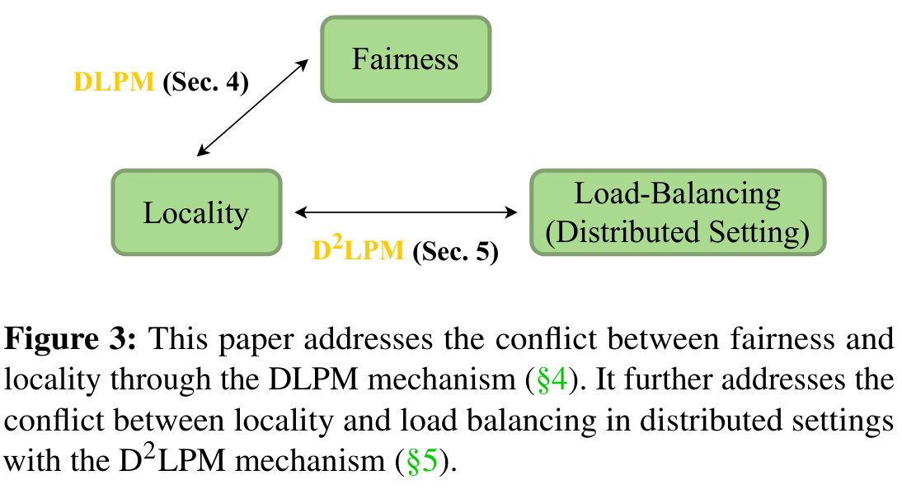

> 配图来源：arXiv:2501.14312v1 Figure 3，PDF 第 3 页。它只给出两层问题空间，不等价于完整系统执行路径或端到端性能证据。

### 2.3 现有方法与本文方法的定位

| **方法** | **主要目标**                       | **prefix locality** | **公平保证** | **分布式**                          | **论文指出的主要问题**                                 |
|----------|------------------------------------|---------------------|--------------|-------------------------------------|--------------------------------------------------------|
| LPM      | 最大化 prefix match/cache hit      | 强                  | 无           | 本身为 local scheduler              | 长共享 prefix client 可垄断 GPU。                      |
| VTC      | 按 token service 做公平调度        | 弱/未显式考虑       | 有           | 本文 baseline 用 per-client RR 扩展 | 严格服务顺序打散共享 prefix，吞吐下降。                |
| RR + LPM | 全局 round-robin + 本地 LPM        | 全局弱、本地强      | 无           | 有                                  | 复杂共享结构下跨 GPU locality 下降，且无 isolation。   |
| Preble   | 在 locality 与 load balance 间路由 | 强                  | 无           | 有                                  | 可避免 starvation，但不能提供严格 isolation/fairness。 |
| DLPM     | locality + bounded fairness        | 强                  | 有           | 单 worker                           | Qᵘ 需要选择；公平比 VTC 更松。                         |
| D²LPM    | fairness + locality + load balance | 强                  | 有           | 有                                  | 有限 Qʷ 下成立；仍存在长 context worst-case。          |

### 2.4 论文明确给出的贡献

1. 提出 DLPM，并给出分布式扩展 D²LPM；作者报告相对 VTC 最高 2.87× 吞吐，相对 locality-aware distributed baseline 最高 7.18× 更低 per-client latency。

2. 为 DLPM 与 D²LPM 推导 service bound，并在附录给出 latency bound。

3. 在多种 execution graph、prefix/output 分布和 misbehaving client 模式上评估吞吐、公平与 victim latency。

*原文定位：Introduction contributions，p.2。*

## 3. Section 3：Preliminaries——公平性定义与服务计量

### 3.1 Backlog 的定义

Definition 3.1：client u 是 backlogged，当继续 dispatch 更多请求不能再提高吞吐，只会增加 queueing delay。分布式情况下，backlogged client 的请求可能位于部分或全部 worker 的队列中，取决于 policy。

> **理解重点**
>
> 公平性界只对特定时间区间内“持续 backlogged”的 client 成立。它不是说任意到达模式下每个瞬间都相等，而是说长期服务差异被与区间长度无关的常数所界定。

### 3.2 三个公平性性质

1. 两个持续 backlogged 的 clients f、g，在任意 \[t1,t2) 内收到的 service 差异应被常数 δ 界定，且 δ 不随区间长度 t2-t1 增长。

2. 持续 backlogged 的 client f 不应比同一区间内并非持续 backlogged 的 client g 少得到无限多 service；Wg-Wf 也应有常数界。

3. work-conserving：只要队列中仍有可执行请求，worker 不应为了公平而空闲。

Property 2 防止“储蓄服务额度”：client 不能先低速、积累未使用份额，再突然以高负载长期垄断。

*原文定位：Section 3，Definition 3.1 与 Fairness Properties，pp.3-4。*

### 3.3 Prefix-aware service measurement

VTC 用 input token 与 output token 的加权和表示服务消耗。本文为了反映 prefix sharing，只在 prefix 首次计算并进入 GPU cache 时计费；之后命中的 prefix token 不应重复计入。因此使用 extend tokens，即“输入 token 中扣除已缓存 prefix 后剩余的 token”。

> **`W(t1,t2) = w_e * n_e(t1,t2) + w_q * n_q(t1,t2)`**
>
> n_e：processed extend tokens；n_q：processed output tokens。论文取 w_e=1、w_q=2。

论文说明 w_e=1、w_q=2 的选择受到 OpenAI GPT-4 pricing 启发。论文没有给出该权重对硬件成本的微基准验证，也没有做权重敏感性实验。后一句是“论文未研究”的边界，不应把 1:2 视为普适物理成本模型。

### 3.4 两种“service”口径必须分开

| **口径**                          | **计算方式**                               | **用途**                                                                      | **论文位置**                |
|-----------------------------------|--------------------------------------------|-------------------------------------------------------------------------------|-----------------------------|
| 系统实际 service / actual service | extend tokens + output tokens 的加权和     | 反映真正消耗的未缓存 prefill 与 decode work；用于公平算法和 Figure 9 第二行。 | Section 3；Figure 9 caption |
| client 视角 service rate          | 完整 input tokens + output tokens 的加权和 | 衡量 client 获得的逻辑服务量；Figure 7 的 Service 与 Jain index 使用该口径。  | Section 6.1 Metrics 及脚注  |

> **为什么 Figure 9 中 Client 0 的“service rate”可以更高但仍公平**
>
> Client 0 有更长的 prefix reuse，因此同样 actual GPU work 能完成更多 client-visible tokens。DLPM/D²LPM 追求的是实际资源成本上的公平，不是强行让每个 client 的完整 token 数完全相等。

## 4. Section 4：Deficit Longest Prefix Match (DLPM)

### 4.1 核心思想：不替换 LPM，而是给 LPM 加“资格门”

LPM 的价值来自局部顺序：每个 continuous batching step 都按 matched prefix length 排序，并尽可能将高匹配请求加入 running batch B。若为了公平完全改成严格 client round-robin，这个局部顺序会被破坏。DLPM 的设计选择是保留 LPM 排序，仅在 client deficit 不足时跳过其请求。

quantum 机制借鉴 Deficit Round Robin。每个 client i 有 deficit counter q_i；Qᵘ 是每轮补充的 service quantum。q_i > 0 表示 client 当前有资格继续消耗资源；q_i ≤ 0 时暂时不能被选择，直到所有 active clients 都无正 deficit，统一进入下一轮补充。

*原文定位：Section 4.1，p.4。*

### 4.2 Algorithm 1：输入、状态与执行步骤

| **对象**         | **含义**                                                               |
|------------------|------------------------------------------------------------------------|
| Queue            | 等待请求队列；每次 continuous batching 前按 prefix match 重新排序。    |
| B                | 当前 running batch；CANADD(r) 判断请求是否还能装入显存/批次。          |
| l                | client list。新 client 到达时加入并令 q_i = 0。                          |
| q_i              | client i 的 deficit counter；允许在一次 request/batch 处理中超扣为负。 |
| Qᵘ               | 每次 refill 为 active client 补充的 service quantum。                  |
| `extend_length(r)` | 请求 r 中未被 prefix cache 覆盖、需要实际计算的输入 token 数。         |

1. 请求到达：monitoring stream 接收 client i 的新请求；若 i 首次出现，q_i = 0；请求进入 Queue。

2. 排序：execution stream 在每次 batching step 执行 `SORTBYPREFIX(Queue)`，保留 LPM 的 locality 顺序。

3. 资格检查：遍历排序后的请求；若对应 q_i ≤ 0，调用 CHECKREFILL。CHECKREFILL 先检查 Queue 中是否仍有任一 active client 的 q > 0；若有则不 refill，让这些 client 继续；只有所有 active clients 都无正 deficit 时，才为 q_i ≤ 0 的 clients 加 Qᵘ。

4. 加入 batch：仅当 q_i > 0 且 CANADD(r) 时，将 r 加入 B，并扣除 w_e × `extend_length(r)`。因此一次长 prompt 可以把 q_i 扣到负数，但该“超扣”有 U 上界。

5. decode 计费：B 执行一次 FORWARDSTEP。每产生一个 output token，就按 client 在 B 中的活跃请求数扣除 w_q；完成请求从 B 中移除。

### 4.3 为什么这种设计能同时保 locality 与 fairness

| **机制**           | **对 locality 的作用**                                                     | **对 fairness 的作用**                                             |
|--------------------|----------------------------------------------------------------------------|--------------------------------------------------------------------|
| SORTBYPREFIX       | 在仍有资格的请求中继续优先最长 prefix，保留 LPM 的局部聚类。               | 本身不提供公平。                                                   |
| q_i > 0 eligibility | 只在 client quantum 耗尽时打断其连续 prefix streak，减少无必要的频繁切换。 | 限制单个 client 连续占用，迫使 scheduler 偶尔服务少服务的 client。 |
| 统一 refill        | 每轮内部允许 locality 重排。                                               | 所有 active clients 获得相同 Qᵘ，且不能积累无限正 credit。         |
| extend-token 计费  | cache hit 不重复扣费，认可 prefix reuse 的真实资源节省。                   | 按实际资源消耗而非完整 prompt 长度比较 service。                   |

### 4.4 Theorem 4.1、4.2 与附录证明直觉

> **`|W_f(t1,t2) - W_g(t1,t2)| <= 2 * (U + Q^u)`**
>
> Theorem 4.1：f、g 均持续 backlogged；U = w_e * L_input + w_q * M。

> **`W_f(t1,t2) >= W_g(t1,t2) - 2U - 2Q^u`**
>
> Theorem 4.2：f 持续 backlogged，g 并非持续 backlogged。

证明的关键不是请求长度相等，而是 deficit 的“有界超扣”。Appendix A.1 先证明：q_i 只在 q_i ≤ 0 时 refill，因此 q_i≤Qᵘ；一次加入请求和后续 decode 最多让 q_i 超扣到 -U 以上。于是某 client 的实际 service 与“refill 次数 × Qᵘ”的偏差有常数界，再比较两个 client 的 refill 次数即可得到 Theorem 4.1/4.2。

work-conserving：DLPM 只改变 dispatch order，不因为公平拒绝一个能装入 B 的请求；当所有 active clients 均无正 deficit 时 CHECKREFILL 会产生新资格。

> **`D(r_f) - A(r_f) <= 2 * (n-1) * (Q^u + U) / a`**
>
> Appendix Theorem A.2：新到达 client f 的 dispatch latency bound；a 是 server capacity 的下界。

> **如何读这个 bound**
>
> bound 与时间区间长度无关，因此满足“近似 max-min”所需的常数差；但它会随 Qᵘ、最大输入长度 L_input、batch token capacity M 和 client 数 n 增大。论文证明的是上界，不代表实际差异总会接近该值。

### 4.5 Qᵘ 是显式的 fairness-locality 旋钮

Qᵘ 越大，某 client 在一轮内可连续消耗的 service 越多，LPM 有更大空间把相似 prefix 聚在一起，吞吐提高；但服务差异界也随 Qᵘ 增大，Jain fairness 下降。Qᵘ 越小则更接近 VTC 的严格交替，但 prefix 复用机会减少。

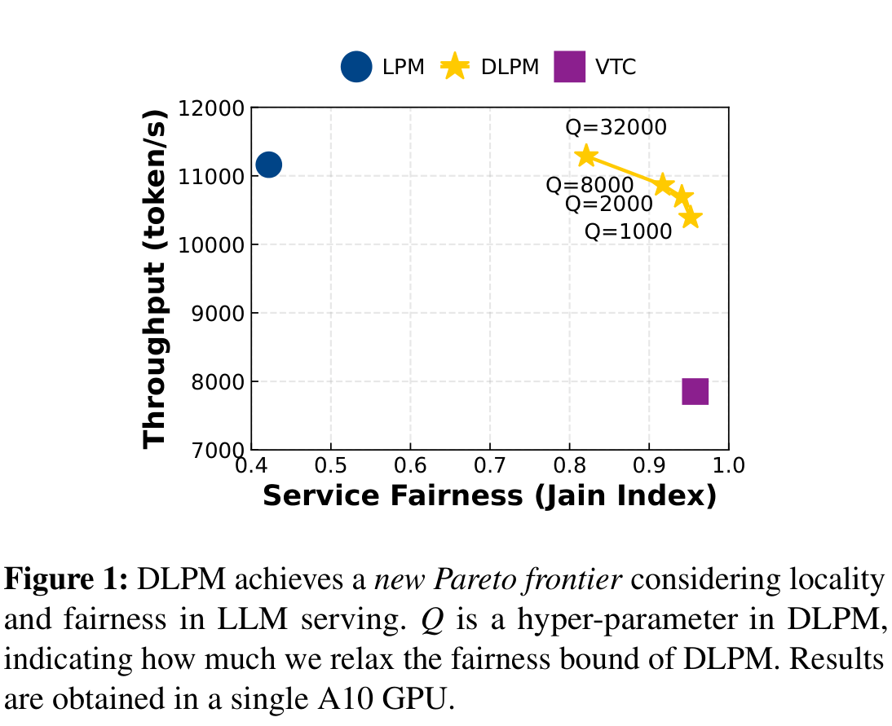

> 配图来源：arXiv:2501.14312v1 Figure 1，PDF 第 1 页。图中只有单 A10、一个 workload 条件下的 Qᵘ 取值点，支持“可调权衡”而不证明这些点构成所有负载下的普遍最优前沿。

论文通过 Figure 1 展示手工选择 Qᵘ 可形成新的 Pareto frontier，但没有提出基于 SLO、负载或 cache 状态的自动调参算法。

## 5. Section 5：Applying DLPM to Distributed Scheduling / D²LPM

### 5.1 Strawman：Centralized DLPM 为什么不实用

最直接的分布式方案是让 global scheduler 复制“单 worker DLPM”的决策：每个 worker 同步上传 RadixTree 的新增/淘汰节点和可用 KV memory，global scheduler 合并成准确全局状态，然后在全局等待队列上做 prefix match 与 DLPM dispatch。

> **`DeltaTree_s(t_{i-1}, t_i) = (N_inserted, N_evicted, M_KV)_s`**
>
> 每个 worker s 的同步增量：新增节点、淘汰节点、当前可用 KV cache memory。

问题是该方案要求 worker 在上传更新后阻塞等待新请求，并在多个 worker 对同一 global queue 访问时处理同步；global scheduler 还要把全局队列中所有请求与每个 worker 的 radix tree 匹配并排序。其 overhead 随 data parallelism D 与 global queue size 增长。

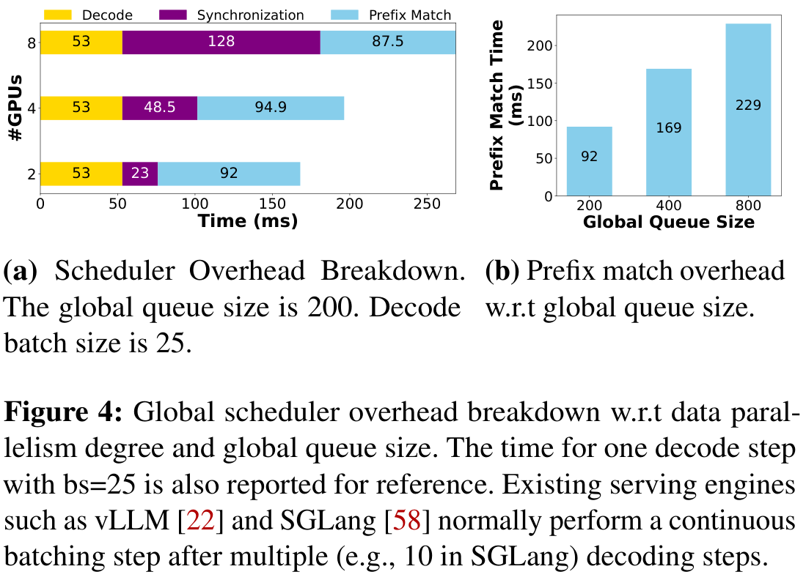

> 配图来源：arXiv:2501.14312v1 Figure 4，PDF 第 6 页。左图固定 global queue size=200、decode batch size=25；右图只改变 global queue size，因此数值不能外推为任意实现或任意 batching 周期下的开销比例。

论文说明 SGLang 通常每约 10 个 decode steps 做一次 continuous batching；在示例 D=8 中，约 215.5 ms 的 synchronization+prefix match 相对 10×53 ms decode 约为 40% overhead。该数字是 Figure 4 的具体配置，不应外推为所有系统。

*原文定位：Section 5.1；Figure 4，pp.5-6。*

### 5.2 D²LPM 的总体设计：双层 deficit

D²LPM 改用 decentralized scheduling：global scheduler 直接把请求发到 worker 本地队列，worker 不再同步阻塞等待。local worker 运行 DLPM 负责单卡公平；global scheduler 只需要平衡同一 client 在各 workers 上获得的 service，并在 locality 与 load balance 之间选择 worker。

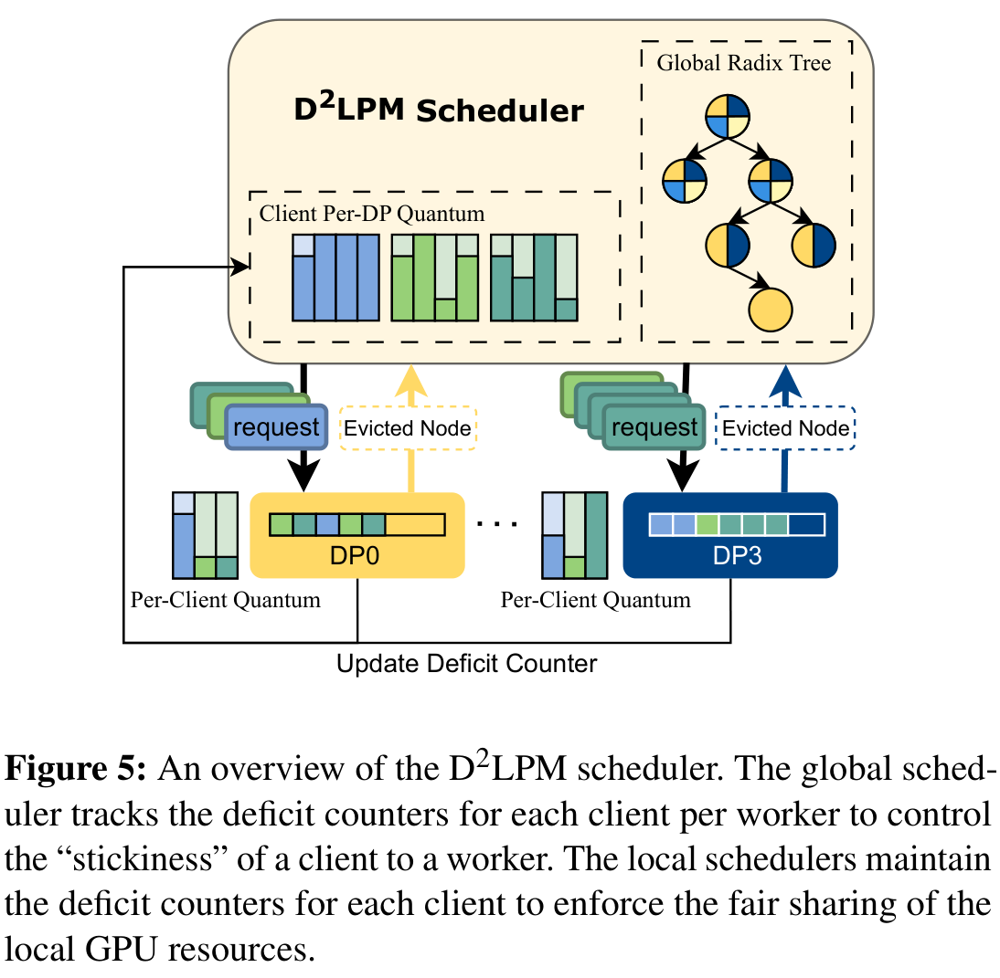

> 配图来源：arXiv:2501.14312v1 Figure 5，PDF 第 6 页。图中的 global deficit 控制 client 对 worker 的 stickiness，local deficit 控制单 GPU 内的 client fairness；全局保证依赖本地 worker 也运行公平调度器。

| **层次**     | **状态/参数**                                         | **解决的冲突**                     | **作用**                                                                           |
|--------------|-------------------------------------------------------|------------------------------------|------------------------------------------------------------------------------------|
| Global route | q_i,w 与 Qʷ；Global Radix Tree；worker queue size s_w | prefix locality vs load balancing  | 控制 client 对某 worker 的“stickiness”，在有限 locality budget 内优先命中 prefix。 |
| Local worker | q_i 与 Qᵘ；本地 waiting queue/running batch           | prefix locality vs client fairness | 用 Algorithm 1 在单 GPU 上保证有界 service difference。                            |

### 5.3 Algorithm 2：worker 选择流程

| **输入/状态** | **含义**                                                 |
|---------------|----------------------------------------------------------|
| W             | worker 集合；data parallel replicas。                    |
| R             | Global Radix Tree；记录 prefix 与 worker 的关联。        |
| G             | 对请求 r 而言，拥有最长 matched prefix 的 worker 集合。  |
| G_avail       | 对 client i 而言 q_i,w > 0 的 worker 集合。               |
| G_cand        | G ∩ G_avail；既有最佳 prefix、又仍有 deficit 的 worker。 |
| s_w           | worker w 的当前 queue size；用于在候选中选最小队列。     |

1. 收到 client i 的新请求 r，`R.LONGESTMATCHWORKERS(r)` 返回 G。

2. 计算 G_avail={w \| q_i,w > 0}。若为空，则对 client i 的所有 workers 加 Qʷ，直到至少一个 worker 可用。

3. 若 G_cand=G∩G_avail 非空，在其中选择 queue size 最小的 worker；这是“locality first, then load balance”。

4. 若最佳 prefix workers 都没有 deficit，则在全部 G_avail 中选最短队列；此时公平/负载约束覆盖 locality。

5. dispatch 后，q_i,w 扣除 w_e × `r.input_tokens`，s_w+1，并把 input tokens 与 worker 关系插入 Global Radix Tree。请求完成后再扣 w_q × output_tokens，s_w-1。

6. worker 的 prefix eviction 信息异步上传并执行 `R.EVICT(P,w)`，不再阻塞本地执行。

> **精确术语注意**
>
> Algorithm 2 Line 16 写的是 `r.input_tokens`，而 Section 3 的 prefix-aware actual service 使用 extend tokens。论文没有详细解释 global deficit 为何用完整 input tokens、local DLPM 为何用 extend tokens；本笔记不自行补全。

### 5.4 D²LPM 的公平性保证

> **`max_i W_i(t1,t2) - min_i W_i(t1,t2) <= 2 * |W| * (U + Q^u)`**
>
> Theorem 5.1：所有持续 backlogged clients 的最大/最小 service 差。

> **`W_g(t1,t2) - W_f(t1,t2) <= 2 * (U + Q^u) * |W|`**
>
> Theorem 5.2：f 持续 backlogged，g 并非持续 backlogged。

主定理的全局 bound 是把各 worker 上的 local DLPM service bound 相加，因此随 worker 数 \|W\| 线性增长，并由 Qᵘ 而非 Qʷ 表示。附录证明依赖一个关键性质：有限 Qʷ 会让 backlogged client 在所有 workers 上耗尽 credit 后再统一 refill，因此其请求会分布到所有 workers。

Appendix Theorem A.4 进一步给出 distributed dispatch latency bound：(n-1)\|W\|(2U+2Qᵘ)/a。Appendix Theorem A.5 给出反例：若 Qʷ=∞，长 prefix client 会永久粘在单 worker，而无 prefix client 可被负载均衡到所有 workers，后者获得的 service 可以无界高于前者，因此不公平。

> **Qʷ 的微妙之处**
>
> Section 7.2 说有限 Qʷ 不出现在 D²LPM 主 fairness bound 中，但会略微影响实测 Jain index；Qʷ 越大，单 client 内的 dispatch 越不均衡。Qʷ=∞ 则违反附录 A.5 的公平性。

论文还说明，global D²LPM 原则上可以搭配其他 local fair scheduler（如 VTC）；但本文中 “D²LPM” 专指 local workers 运行 DLPM 的实现。

## 6. Section 6：Evaluation

### 6.1 Setup：实现、模型、硬件、数据集

| **项目**     | **设置**                                                                                                                          |
|--------------|-----------------------------------------------------------------------------------------------------------------------------------|
| 实现         | Python；基于 SGLang 实现 DLPM 与 D²LPM。                                                                                          |
| 模型         | Llama-3.1-8B（synthetic traces）；Llama-3.2-3B（real multi-turn traces）。作者称 Qwen、DeepSeek、Mistral 兼容，但未在实验中验证。 |
| GPU          | NVIDIA A100 80GB 与 A10G；主 synthetic evaluation 最多 8×A100。                                                                   |
| 分布式度数 D | data parallelism degree，即 model replica 数。                                                                                    |
| 到达过程     | 前三类 synthetic workload 使用 Gamma process；GPU 增加时 request rate 同步增加。                                                  |
| 真实 trace   | Chatbot Arena 多轮对话时间戳被 rescale，并聚合多个 clients 以模拟高需求。                                                         |

| **Workload**     | **Dataset**        | **Avg Prefix Len.** | **Avg Output Len.** | **执行结构**                                      |
|------------------|--------------------|---------------------|---------------------|---------------------------------------------------|
| Long-Context QA  | LooGLE             | 21,449              | 15                  | 同一长文档上的多次 QA；超长 prefix、极短 output。 |
| Tree-of-Thoughts | GSM8K              | 546                 | 256                 | 高度 4 的树状分支。                               |
| LLM-as-a-Judge   | Synthetic articles | 2,701               | 256                 | branch-solve-merge，多 judge dimensions。         |
| Real Multi-Turn  | Chatbot Arena      | 56                  | 142                 | Client/Bot 交替多轮。                             |

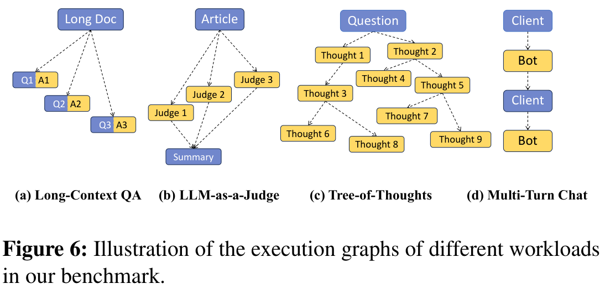

> 配图来源：arXiv:2501.14312v1 Figure 6，PDF 第 7 页。前三类图结构用于 synthetic workload，Multi-Turn Chat 使用经过缩放和 client 聚合的 Chatbot Arena trace；该图不表示生产流量原样部署。

#### 6.1.1 两类 misbehaving patterns（Table 3）

| **类型**          | **Long-Context QA**                    | **Tree-of-Thoughts**                                                                   | **LLM-as-a-Judge**                                                |
|-------------------|----------------------------------------|----------------------------------------------------------------------------------------|-------------------------------------------------------------------|
| S1: More Requests | misbehaving client：更高 request rate  | misbehaving：4 branches，340 requests/tree；well-behaved：2 branches，30 requests/tree | misbehaving：16 evaluation dimensions；well-behaved：2 dimensions |
| S2: Longer Prefix | misbehaving：2× longer input documents | misbehaving：10× longer input questions                                                | misbehaving：每篇 article 前额外 600 tokens                       |

S1 测试“请求数/程序复杂度”异常；S2 保持结构复杂度和 request rate，但人为增加 prefix 长度，测试 locality-aware scheduler 是否会因长 prefix 偏爱 misbehaving client。

#### 6.1.2 Baselines

| **Baseline** | **Local scheduler**                  | **Global scheduler (D\>1)**                                          | **公平性质**                                  |
|--------------|--------------------------------------|----------------------------------------------------------------------|-----------------------------------------------|
| D²LPM        | DLPM                                 | D²LPM                                                                | 有理论保证。                                  |
| RR + LPM     | LPM                                  | Round Robin                                                          | 无；SGLang 默认 distributed scheduling 方案。 |
| Preble       | 其 locality-aware waiting/scheduling | 基于 prefix matching ratio 在 exploit locality 与 explore GPU 间选择 | 无严格 fairness guarantee。D=1 数据点省略。   |
| VTC          | VTC                                  | per-client round-robin                                               | 有；附录 A.3 给出扩展 fairness 论证。         |

#### 6.1.3 Metrics

- Service Rate：client 视角的 input/output token 加权和，w_input=1、w_output=2。

- Jain’s Fairness Index：在所有 clients 同时 active 的区间计算，范围 1/n 到 1。

- P50/P99 Latency：well-behaved clients 的程序端到端完成时间；Long-Context QA 使用 TTFT。

- Figure 7 中 latency 是 well-behaved clients 的平均 latency。

### 6.2 Synthetic traces：Figure 7 的主结果

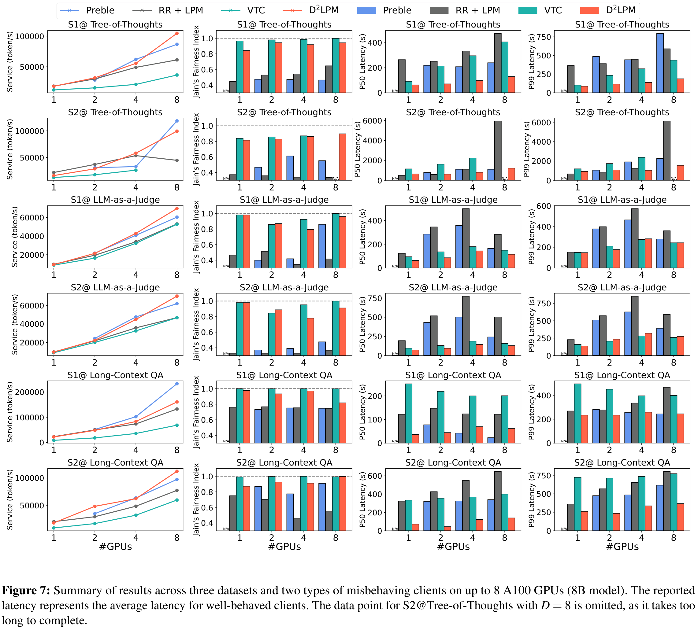

> 配图来源：arXiv:2501.14312v1 Figure 7，PDF 第 9 页。S2@Tree-of-Thoughts、D=8 的 latency 因运行时间过长而缺失；S2@Long-Context QA、D=8 中 Preble 吞吐更高的反例也完整保留。

#### 6.2.1 Throughput

- D²LPM 相对唯一另一种有公平保证的 VTC，吞吐最高提升 2.87×。

- D²LPM 相对 RR + LPM，吞吐最高提升 2.22×。

- S2@Tree-of-Thoughts、D=8 时，RR + LPM 的 cache hit rate 从 D=4 时约 95% 降到约 50%，导致扩展性倒退；作者据此说明 round-robin 不能保持复杂 LLM program 的跨 GPU locality。

- 与 Preble 相比，D²LPM 在大多数 workload/GPU 配置中持平或更高。

- 例外：S2@Long-Context QA、D=8 时 Preble 吞吐更高。Table 2 显示该 workload prefix/output 比极端（21,449/15），D²LPM 为公平迁移请求会重算超长文档，prefill 主导总时间。作者明确把它称为 worst-case。

#### 6.2.2 Jain fairness

Figure 7 第二列中，D²LPM 始终明显高于 Preble 与 RR + LPM，因为后两者无严格 isolation。D²LPM 略低于 VTC，作者解释为 DLPM/D²LPM 主动放松 fairness bound 以换取 locality 与吞吐。Preble 的 multi-level priority queue 能避免 starvation，因此略好于 RR + LPM，但与 D²LPM 仍有明显差距。

#### 6.2.3 Well-behaved client latency

| **比较对象** | **相对 D²LPM 的最坏 latency** | **平均比较**          |
|--------------|-------------------------------|-----------------------|
| Preble       | 最高 7.18× 更高               | D²LPM 平均 2.90× 更低 |
| RR + LPM     | 最高 9.55× 更高               | D²LPM 平均 4.06× 更低 |
| VTC          | 最高 7.96× 更高               | VTC 平均 2.98× 更高   |

这组结果证明两种单目标方法都可能提高 victim latency：locality-only scheduler 会偏爱 misbehaving client；fairness-only VTC 则因整体系统效率下降而让所有请求排队更久。D²LPM 的优势来自两者的折中，而不是单独“更公平”或单独“cache hit 更高”。

#### 6.2.4 Figure 7 真正证明与没有证明的内容

| **论文数据支持**                                                                                                                        | **论文没有证明/未研究**                                                            |
|-----------------------------------------------------------------------------------------------------------------------------------------|------------------------------------------------------------------------------------|
| 在所测 3 类 synthetic workload、两类 misbehavior、1-8×A100 上，D²LPM 能在接近 VTC 公平性的同时显著提高吞吐并降低 well-behaved latency。 | 不能推出所有 prefix/output 分布都优于 Preble；Long-Context worst-case 已出现反例。 |
| 分层 locality-aware fairness 在复杂 tree/branch workload 中比 RR + LPM 更可扩展。                                                       | 未测试超过 8 replicas、异构 GPU、跨地域/低带宽网络。                               |
| 显式 quantum 能形成 throughput-fairness trade-off。                                                                                     | 未给出 Qᵘ/Qʷ 自动选择、SLO 映射或在线控制器。                                      |

### 6.3 Real-world multi-turn traces：Figure 8

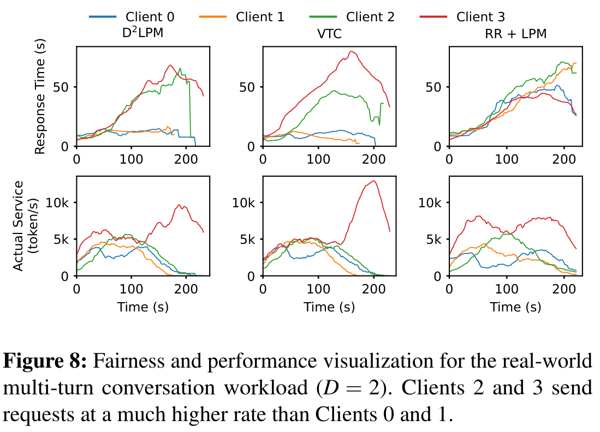

> 配图来源：arXiv:2501.14312v1 Figure 8，PDF 第 10 页。数据来自真实对话 trace 的时间戳重放/缩放和 client 聚合，不是完整生产集群线上实验。

RR + LPM 因 LPM 偏好更长 prefix，让 Clients 2、3 获得不成比例资源，Clients 0、1 response time 上升且 throughput 降低。VTC 能保护 Clients 0、1，但严格平均分配使 Clients 2、3 response delay 最高约 80 s。

D²LPM 在该 trace 中同时保护 well-behaved clients，并让中途恢复正常的 Client 2 获得持续较低 response time 与较高 throughput。作者据此声称 D²LPM 对“先异常、后恢复”的 client 不会长期惩罚。

> **实验边界**
>
> 这是真实对话 trace 的时间戳重放/缩放与 client 聚合，不是完整生产集群的原始线上部署实验；论文未报告网络故障、worker churn 或真实多租户计费策略。

## 7. Section 7：Ablation Studies

### 7.1 Figure 9：公平性质与性能的时间序列可视化

设置：4×A10G、Llama-3.2-3B、Tree-of-Thoughts；3 clients 以相同 rate、相同 branch count=3 发程序，但 Client 0 的 prefix 比 well-behaved clients 长 10×。x 轴最大值是各 scheduler 完成全部程序的 end-to-end time。

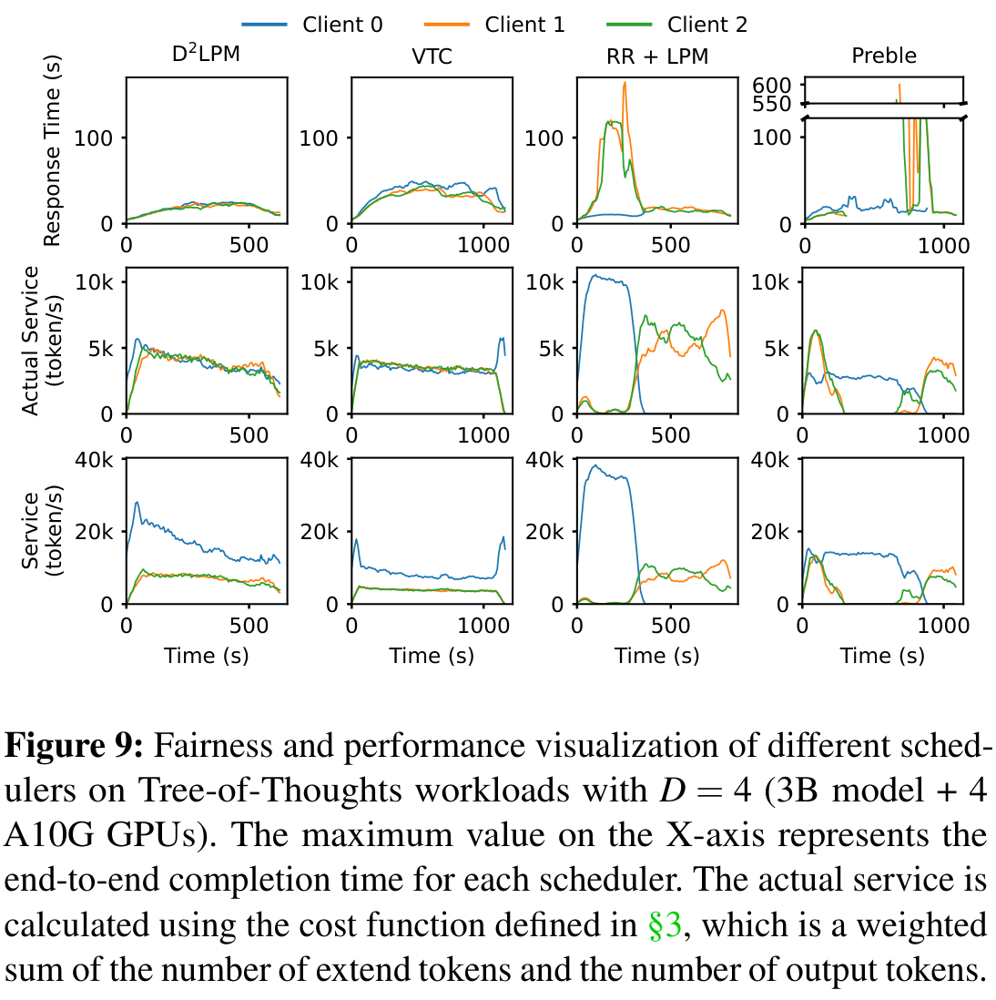

> 配图来源：arXiv:2501.14312v1 Figure 9，PDF 第 10 页。各列横轴终点是该 scheduler 自己完成全部程序的时间，因此不能按同一 x 坐标直接比较四列瞬时状态；actual service 与 client-visible service 也必须分开解读。

- D²LPM 总完成时间最短，相对 VTC 与 Preble 最高约 2× speedup。

- VTC 与 D²LPM 的 actual service 在 4 GPUs 上分配接近理想公平；但 VTC cache hit 低，端到端更慢。

- Client 0 因 prefix reuse 更长、单位逻辑 token 成本更低，所以 client-visible service 可高于 Clients 1、2；这不违反 actual-service 公平。

- Preble 在约 100-700 s 间几乎不给 Clients 1、2 service，queueing latency 最高约 600 s。

- Preble 将 Client 0 长期粘在单 GPU；其他 clients 的部分请求也排在该 GPU，树内依赖阻塞更深 thoughts 的生成，最终集群只发挥约 1/4 计算能力。

### 7.2 Qᵘ 与 Qʷ 的影响

Figure 1 已在 §4.5 展示 Qᵘ 的吞吐—公平权衡；这里不重复嵌图，只补充 Qʷ 的分布式路由敏感性。

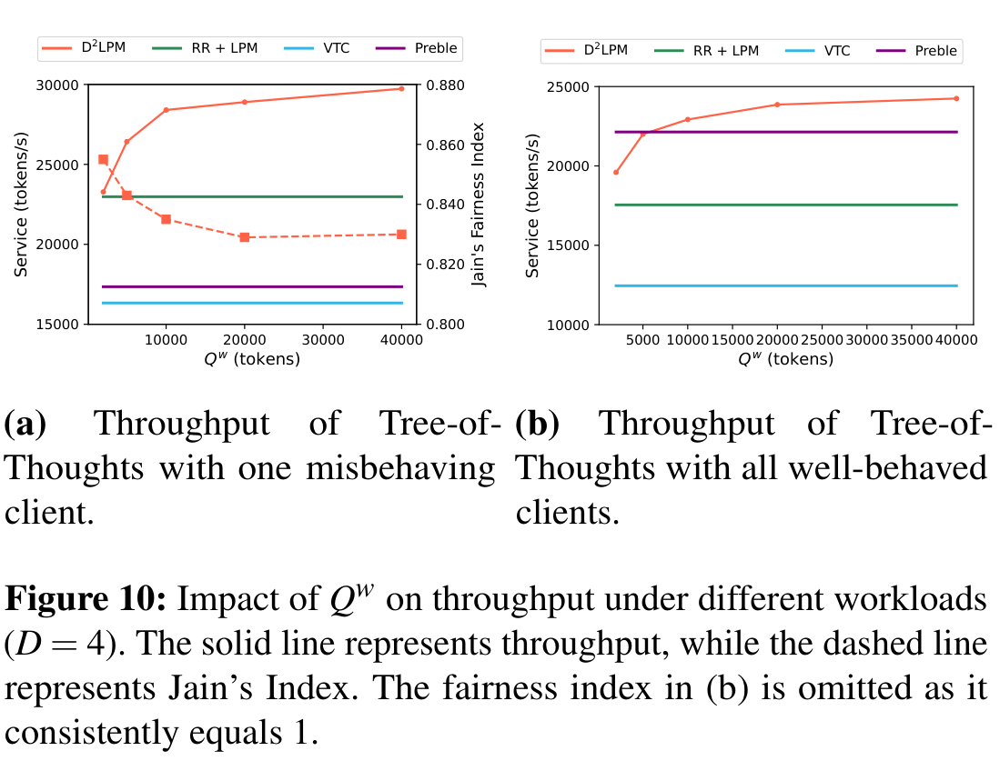

> 配图来源：arXiv:2501.14312v1 Figure 10，PDF 第 11 页。实线表示 throughput，虚线表示 Jain index；右 panel 的 clients 全部 well-behaved，fairness 恒为 1，论文因此省略该曲线。

Figure 10a 中，Qʷ 从 2,000 增至 40,000，Jain index 从约 0.855 降至约 0.83；作者解释为同一 client 的请求在 workers 间更不均衡。Figure 10b 中所有 clients well-behaved，fairness index 始终为 1，因此省略。

Qʷ 不出现在有限情形的主 theorem bound 中，但不能无限增大：Appendix A.5 证明 Qʷ=∞ 不公平，并指出此时算法趋近于只追求 prefix stickiness 的 Preble 风格。

### 7.3 Scaling the Number of Clients

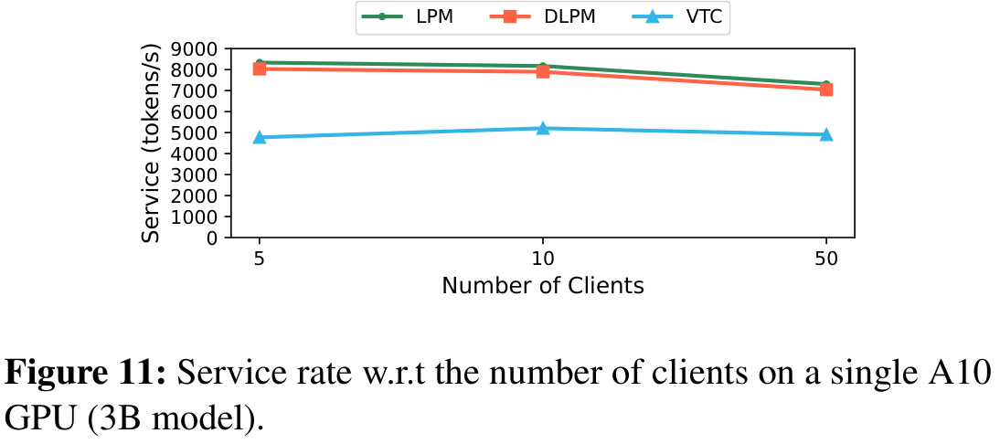

> 配图来源：arXiv:2501.14312v1 Figure 11，PDF 第 11 页。该图只覆盖单 A10、3B model 和 5–50 clients，不支持外推到数百或数千 client。

随着 client 增多，同样请求量中 distinct prefixes 增多，DLPM/LPM cache hit 略降，因此 service rate 小幅下降；VTC 的 cache hit 本来就低，变化较小。Figure 11 支持的是“DLPM 的 locality advantage 在 5-50 clients 内仍保持”，并未评估数百或数千租户。

### 7.4 Mix of Workloads

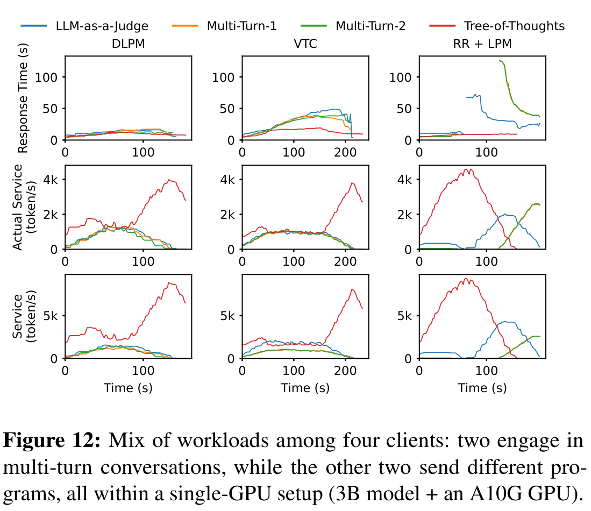

> 配图来源：arXiv:2501.14312v1 Figure 12，PDF 第 12 页。该实验是单 A10G、3B model 的四-client 混合 workload，只支持所测组合下的效率—公平取舍。

DLPM 在混合 workload 下保持更低 response time 与更短总完成时间。LPM/RR+LPM 中 Tree-of-Thoughts client 充当 misbehaving client，显著抬高其他 clients 延迟；VTC 的 actual service 更均匀，公平性优于 DLPM，但总效率更低。作者用该实验再次说明 DLPM 是“牺牲一部分严格公平换吞吐”，而不是在所有公平指标上优于 VTC。

## 8. Section 8：Related Work 定位

| **方向**                           | **代表工作/思想**                                                          | **DLPM 的区别**                                                             |
|------------------------------------|----------------------------------------------------------------------------|-----------------------------------------------------------------------------|
| ML cluster fairness                | Themis、Pollux 等关注训练任务的 finish-time fairness、placement、goodput。 | 本文关注在线 LLM inference，并把 prefix cache locality 纳入公平调度。       |
| Networking/OS fairness             | Deficit Round Robin、fair queueing、CFS、DRF。                             | DLPM 的 quantum/deficit 受 DRR 启发，但服务单位是 prefix-aware token work。 |
| Data analytics locality + fairness | Delay Scheduling。                                                         | 共同思想是允许有限等待/重排来保 locality；本文专门处理 LLM prefix sharing。 |
| LLM locality                       | SGLang LPM/RadixAttention、Preble、BlendServe。                            | 这些工作主要优化吞吐/负载；DLPM/D²LPM 增加理论公平保证。                    |
| LLM fairness                       | VTC。                                                                      | VTC 不考虑 prefix locality；DLPM 保留 LPM 局部顺序并放松公平 bound。        |

*原文定位：Section 8，p.12。*

## 9. 优点与局限

### 9.1 论文方法的优点

- 机制简洁且可组合：DLPM 不是重写 locality scheduler，而是在 LPM 外增加 deficit eligibility；D²LPM 复用同一思想形成两级调度。

- 理论与系统实现相结合：给出 service/latency bound、work-conserving 论证，而不仅报告 Jain index。

- 成本口径考虑 cache reuse：以 extend tokens 而非完整 input tokens 衡量 local actual service。

- 正面处理 centralized scheduler overhead：Figure 4 先证明全局同步/匹配不可扩展，再选择 decentralized 方案。

- 实验 workload 覆盖长文档、树搜索、judge、真实多轮对话，并设计“更多请求”和“更长 prefix”两类异常模式。

- 没有隐藏 worst-case：明确报告 S2@Long-Context QA、D=8 时 Preble 吞吐更高。

### 9.2 Section 9 作者明确写出的 limitations

| **作者 limitation**                        | **论文原意**                                                                                                                                                     |
|--------------------------------------------|------------------------------------------------------------------------------------------------------------------------------------------------------------------|
| Prefix Sharing Among Clients               | 本文只研究同一 client 内请求的 prefix sharing，忽略不同 clients 之间共享 prefix。若多个 clients 共用同一 prefix，quantum 应由谁扣除仍未解决。                    |
| Fairness with In-Program Data Dependencies | 未利用同一 LLM program 内请求依赖。某 upstream request 可能解锁大量 downstream parallelism；优先它可能提高性能，即使暂时破坏 prefix sharing 或 strict fairness。 |

*原文定位：Section 9，p.12。*

### 9.3 笔记分析：论文之外仍需注意的问题

> **以下均为笔记分析，不属于论文原文贡献或结论**
>
> 这些问题由算法、定理或实验边界推导，用于评估可迁移性；论文没有证明或系统研究它们。

- Qᵘ/Qʷ 与 w_e:w_q 都需人工设定。论文展示 trade-off，但没有在线 autotuning、SLO-aware control 或鲁棒性分析。

- 理论 bound 随 L_input、M、Qᵘ、worker 数 \|W\| 增大；在超长 context、大 batch 或大规模 replicas 下可能较松。论文未测 bound tightness。

- Global SELECTWORKER 用 queue request count s_w 衡量 load，而不是剩余 token work、KV occupancy 或预估完成时间；长度异质性下是否最优未研究。

- Global Radix Tree 与 eviction 信息异步更新。论文称 overhead negligible，但没有单独量化 metadata staleness 对错误路由/重算的影响。

- 实验限于 Llama 3B/8B、A10G/A100、最多 8 replicas，未覆盖大模型、多节点低带宽、异构 GPU、故障与弹性伸缩。

- Algorithm 2 global deficit 扣 full input_tokens，而 local DLPM 扣 extend tokens；两层成本口径差异的影响没有解释。

- 公平单位是 client，未研究 weighted tenants、不同付费等级、deadline/SLO classes 或多模型资源共享。

## 10. 我的理解与启发

> **说明**
>
> 本章是基于论文内容的个人理解，不属于论文原文贡献。

### 10.1 最值得学习的设计模式：给局部最优算法加“有界自由度”

LPM 已经是一个有效 locality heuristic。DLPM 没有把它替换成另一套全局优化器，而是用 deficit counter 限制“谁有资格参与 LPM”。这相当于把复杂目标拆成两层：公平层规定可行集合，locality 层在可行集合内继续做原有最优。该模式比把 fairness 与 locality 合成一个难调的单一分数更容易解释和证明。

### 10.2 公平不一定要求严格轮转

VTC 的强顺序约束容易破坏 locality。DLPM 表明，只要每个 client 的 overshoot 有界、refill 对称，允许一段连续的 locality-friendly 执行仍可获得常数 service bound。换言之，系统可以用“bounded unfairness in the short term”换取更高效率，同时维持长期近似 max-min fairness。

### 10.3 D²LPM 是典型的 hierarchical scheduling

global q_i,w/Qʷ 解决 placement 与 stickiness，local q_i/Qᵘ 解决 GPU 内资源共享；两层各自只处理一个冲突。其理论保证依赖 local scheduler 的公平性，这提醒我们：全局 router 做公平并不能自动保证 endpoint 内公平，反之亦然。

### 10.4 成本模型必须反映复用后的真实 work

如果按完整 input length 收费，命中长 prefix 的请求会被当作高成本，调度器反而惩罚 locality；按 extend tokens 计费让 cache reuse 直接进入 service accounting。这个思想可以推广到任何有缓存、共享中间结果或数据复用的 AI operator。

### 10.5 系统设计不能忽略 scheduler 自身开销

centralized DLPM 在“信息最准确”的意义上最直接，但同步与全局 prefix matching 很快成为瓶颈。D²LPM 接受异步、近似的全局状态，换取 worker 不阻塞。论文的价值不仅是算法，还在于先用 Figure 4 证明某个看似更精确的架构不可扩展。

### 10.6 论文留下的最有潜力扩展：DAG-aware fairness

作者 limitation 指出 upstream request 可能解锁大量 downstream calls。若把 client service 视为独立 token 流，可能错过程序级关键路径。一个自然方向是：在 deficit fairness 约束内，为能释放下游并行度的 upstream node 增加临时优先级，并证明其额外 unfairness 仍有界。

## 11. 与我的数据库 AI 算子执行与调度课题的关系

> **说明**
>
> 本章为基于论文与当前课题架构的个人分析，不属于 DLPM 论文原文。

### 11.1 概念映射

| **DLPM/D²LPM 概念** | **在当前课题中的对应对象**                                               | **可借鉴点**                                                              |
|---------------------|--------------------------------------------------------------------------|---------------------------------------------------------------------------|
| client              | 数据库驱动的 AI job / tenant / query                                     | 公平单位应优先是 job，而不只是单个 HTTP request。                         |
| prefix locality     | 共享 system prompt、schema/context、重复文档片段形成的 KV cache affinity | 路由代价应显式包含 endpoint cache hit，而非只看 queue length。            |
| Qᵘ / q_i            | per-job service deficit / predicted-work budget                          | 限制一个 job 连续占用模型服务，同时允许其在 budget 内批量复用 prefix。    |
| Qʷ / q_i,w          | per-job × endpoint affinity budget                                       | 控制 job 对某 endpoint 的 stickiness，避免所有同 prefix 请求永久粘单卡。  |
| Global Radix Tree   | endpoint cache directory / prefix metadata                               | router 需要轻量、异步的 cache state，而不是同步拉取完整 vLLM 内部状态。   |
| actual service      | uncached prompt tokens + decode tokens + 可能的上游数据 work             | work credit 应按真实执行成本结算，而不是只按 row count 或 request count。 |
| local DLPM          | endpoint 内部 scheduler                                                  | 只有 endpoint 内也提供 per-job fairness，全局 guarantee 才可能组合成立。  |

### 11.2 与当前“route → acquire → submit → release”机制的互补

当前设计中的 Request Credit / Work Credit 是 admission 与并发安全机制：请求提交前先选择 endpoint，再从该 endpoint 获取 credit，完成或异常后释放。DLPM 的 deficit counter 则是长期 service accounting：它不在完成时简单恢复原值，而是记录某 job 已经实际获得多少资源，并在轮次中补充 quantum。两者不是替代关系。

| **控制层**                | **建议职责**                                                                     | **来自 DLPM 的启发**                                               |
|---------------------------|----------------------------------------------------------------------------------|--------------------------------------------------------------------|
| Admission credits         | 限制在途请求数、预测 work、KV/显存压力；完成后 release。                         | 继续作为 safety/backpressure，不承担长期公平。                     |
| Job deficit account       | 按实际 uncached input 与 output tokens 记账；决定 job 是否有资格继续 dispatch。  | 对应 q_i/Qᵘ。                                                      |
| Endpoint affinity deficit | 在有 prefix 的 endpoint 上允许连续路由，但每个 job-endpoint 组合有有限粘性预算。 | 对应 q_i,w/Qʷ。                                                    |
| Local endpoint policy     | 在 endpoint 队列/continuous batch 内保持 per-job fairness。                      | 对应 local DLPM；若 vLLM 完全黑盒，则理论 guarantee 不能直接继承。 |

### 11.3 可直接借鉴的具体设计

1. 把 predicted work 从“total prompt tokens”改为“predicted uncached prompt tokens + predicted output tokens”；完成时用真实 cache hit 与 output length reconciliation。

2. 在 Endpoint Router 中维护 per-job-per-endpoint deficit：先求 prefix candidate endpoints，再与 positive-deficit endpoints 求交，最后按 queue/work credit 选最轻者。

3. 保留 route-before-acquire：先由 locality+deficit 选 endpoint，再获取该 endpoint 的 Request/Work Credit，避免全局 credit 池破坏 endpoint 归属。

4. Global prefix metadata 采用异步更新，避免每次 batch 同步 vLLM KV 状态；同时需要实验量化 stale metadata 的代价。

5. 将 job-level fair arbiter 与 endpoint-local scheduler 分开；明确哪些 guarantee 只在 upstream gate 层成立，哪些需要修改 vLLM/SGLang 内部 scheduler。

### 11.4 不能直接照搬的地方

- DLPM 假设主要资源是同一模型副本上的 token service；当前课题还包含 PostgreSQL/Daft/Ray 上游数据阶段、网络传输与非模型 AI operator。

- 当前 vLLM endpoint 可能作为 black box；没有 local DLPM 时，global deficit 只能限制进入 endpoint 的顺序，无法控制 continuous batching 内的真实 token share。

- 数据库 AI job 有 DAG/critical path 与 fan-out；DLPM 作者自己承认未考虑 in-program dependencies，这恰好是当前课题更重要的区别。

- 不同 endpoint 可能模型、GPU、KV 容量与服务速率不同；论文按同构 data-parallel replicas 讨论，未给 weighted/heterogeneous fairness。

- 数据库语义还要求 backpressure、失败重试、幂等与跨阶段 credit release，DLPM 只讨论 LLM request dispatch。

### 11.5 一个可形成研究问题的扩展方案

> **个人研究设想：Job-aware Double-Deficit Routing（非论文方案）**
>
> 第一层用 per-job deficit 保证 database AI jobs 的长期 service share；第二层用 per-job-per-endpoint deficit 控制 KV locality 与 endpoint load balance；Request/Work Credits 负责 admission；DAG critical-path score 只在正 deficit 的可行集合内调整优先级。需要重新定义 end-to-end service cost，并证明加入 DAG priority 后的额外 service difference 仍有界。

| **建议实验问题**                                             | **对应 DLPM 证据/空白**                                               |
|--------------------------------------------------------------|-----------------------------------------------------------------------|
| prefix-aware work credit 是否优于 total-token credit？       | Section 3 的 extend-token accounting；论文未测试 upstream data cost。 |
| Q_job 与 Q_endpoint 如何在线调节？                           | Figure 1/10 只有离线 sweep，无 controller。                           |
| stale endpoint cache metadata 的误路由成本？                 | D²LPM 异步 eviction；论文未单独量化。                                 |
| DAG critical-path priority 会破坏多少公平？                  | Section 9 作者 limitation，未解决。                                   |
| 黑盒 vLLM 下 upstream fairness 与真实 local service 的偏差？ | D²LPM theorem 依赖 local fair scheduler。                             |
| 长 context、短 output worst-case 如何保护吞吐？              | S2@Long-Context QA、D=8 是明确反例。                                  |

## 12. 术语速查与最终复习提纲

### 12.1 术语速查

| **术语**                     | **精确定义/本文含义**                                                             |
|------------------------------|-----------------------------------------------------------------------------------|
| Backlogged client            | 继续 dispatch 请求不能提高吞吐、只会增加 queueing delay 的 client。               |
| Prefix locality              | 请求与 GPU 已缓存 prefix 的匹配程度；通常以 matched prefix length 表示。          |
| Extend tokens                | input tokens excluding cached prefix tokens；需要实际 prefill 计算的部分。        |
| LPM                          | Longest Prefix Match；按 matched prefix length 重排等待请求。                     |
| Quantum                      | 每轮向 deficit counter 补充的 service budget；Qᵘ 对 client，Qʷ 对 client-worker。 |
| Deficit counter              | 剩余 service budget；可因单请求/批次处理短暂变负。                                |
| Work-conserving              | 队列中有可执行请求时不让 worker 空闲。                                            |
| Approximate max-min fairness | 持续 backlogged clients 的 service difference 被与时间区间长度无关的常数界定。    |
| Client stickiness            | 同一 client 因 prefix locality 持续被路由到同一 worker 的倾向。                   |
| Global Radix Tree            | D²LPM 用于查找某 prefix 在哪些 workers 上存在的全局元数据结构。                   |

### 12.2 复习这篇论文时应记住的 10 句话

1. LPM 高效但不公平，VTC 公平但不 locality-aware。

2. DLPM 保留 LPM 排序，只给 q_i > 0 的 client dispatch 资格。

3. 所有 active clients 无正 deficit 时统一 refill Qᵘ。

4. local service 按 extend tokens + output tokens 计费。

5. 公平证明来自 deficit 的上界 Qᵘ 与下界 -U，即 bounded overshoot。

6. D²LPM 的第二个 deficit q_i,w/Qʷ 控制 client 对 worker 的 stickiness。

7. worker 选择顺序是：最长 prefix 候选 ∩ 正 deficit → 最短队列；交集为空则在正 deficit workers 中最短队列。

8. 全局 fairness bound 依赖每个 worker 内的 local fair scheduler，并随 \|W\| 线性增长。

9. Q 越大 locality/吞吐越好、短期公平越松；Qʷ=∞ 不公平。

10. 长 context、短 output 是 D²LPM 为公平牺牲 locality 的明确 worst-case；DAG dependency 与跨 client prefix sharing 尚未解决。

### 12.3 最终评价

这篇论文最重要的贡献不是简单提出“公平与 locality 都要”，而是给出一种可证明、可实现的组合方式：用 deficit quantum 限定 locality optimizer 的自由度，并把同一机制扩展到 global placement。它对当前数据库驱动 AI operator 调度最直接的启发，是把长期公平记账、endpoint locality 路由与 admission credit 分成独立层次；但若要形成端到端数据库 AI job guarantee，还必须补上 DAG semantics、上游数据成本与黑盒 endpoint 内部调度。

## 附：Appendix A 定理索引

| **定理**                    | **内容**                                                                         |
|-----------------------------|----------------------------------------------------------------------------------|
| Theorem A.1                 | DLPM 中 backlogged client 的实际 service 与 K_i Qᵘ 的偏差 \<= max(Qᵘ,U)。        |
| Theorem A.2                 | DLPM 新到达 client 的 dispatch latency bound。                                   |
| Theorem A.3                 | D²LPM 中跨 workers 的 local service deviation bound \<= max(Qᵘ,U)\|W\|。         |
| Theorem 5.1/5.2（附录证明） | D²LPM 的 backlogged-backlogged 与 backlogged/non-backlogged service bounds。     |
| Theorem A.4                 | D²LPM dispatch latency bound。                                                   |
| Theorem A.5                 | Qʷ=∞ 时 D²LPM 不公平的反例。                                                     |
| Appendix A.3                | per-client round-robin 作为 VTC 的 distributed extension 可获得 fairness bound。 |
