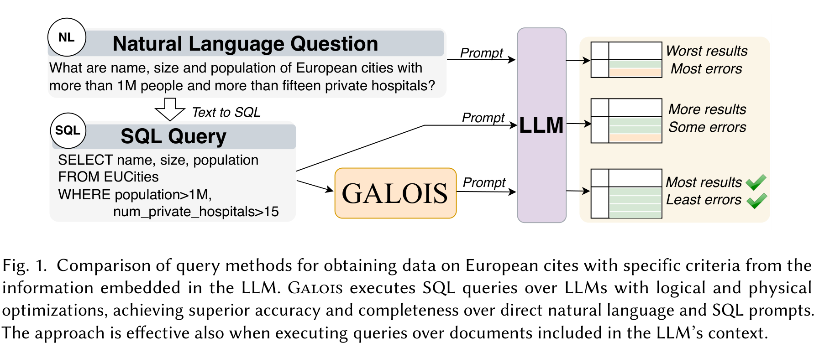
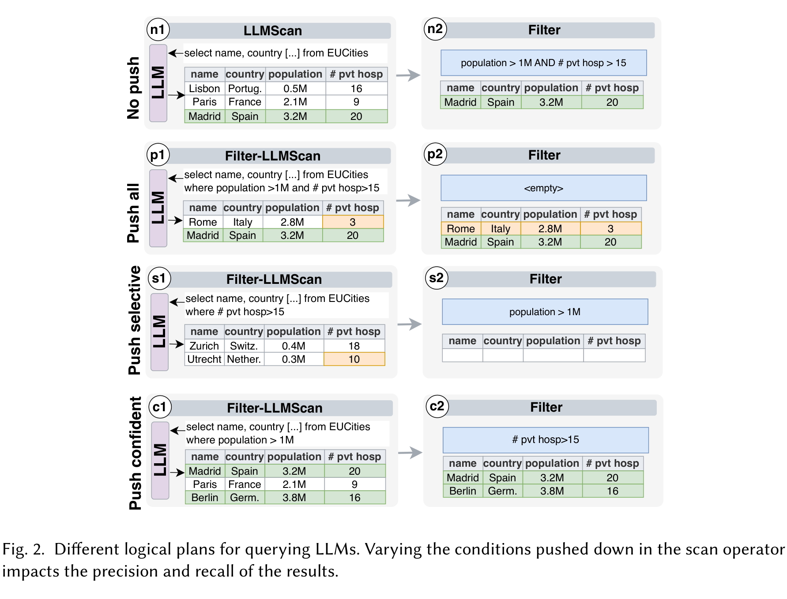
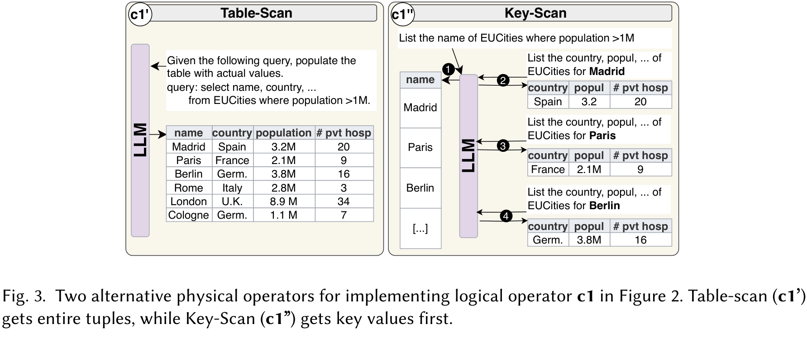
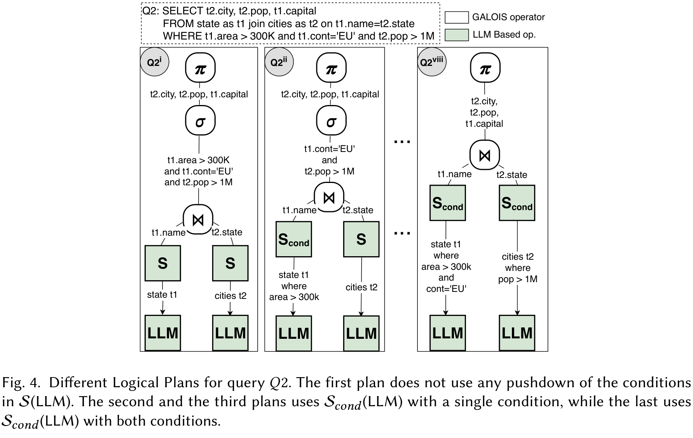
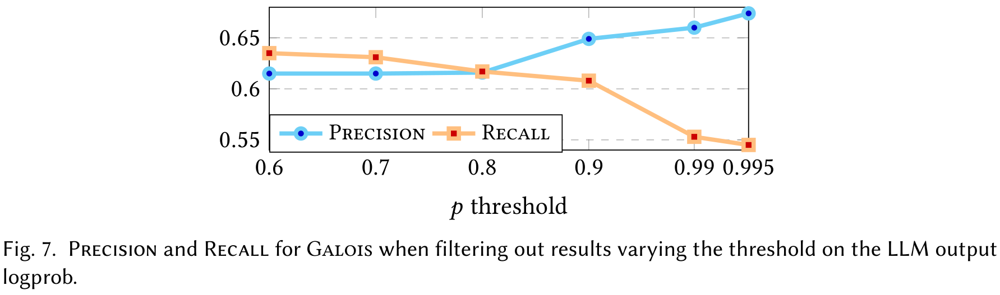
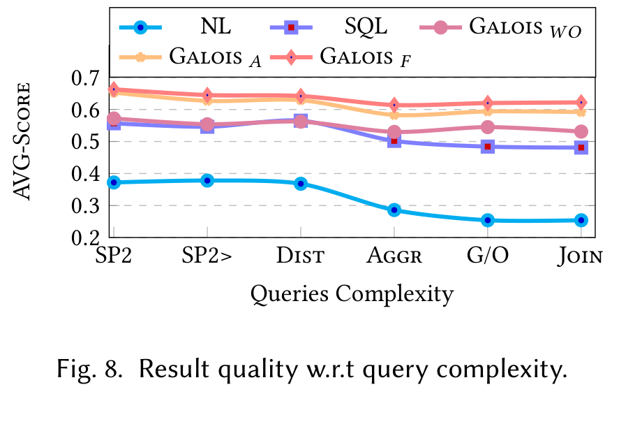
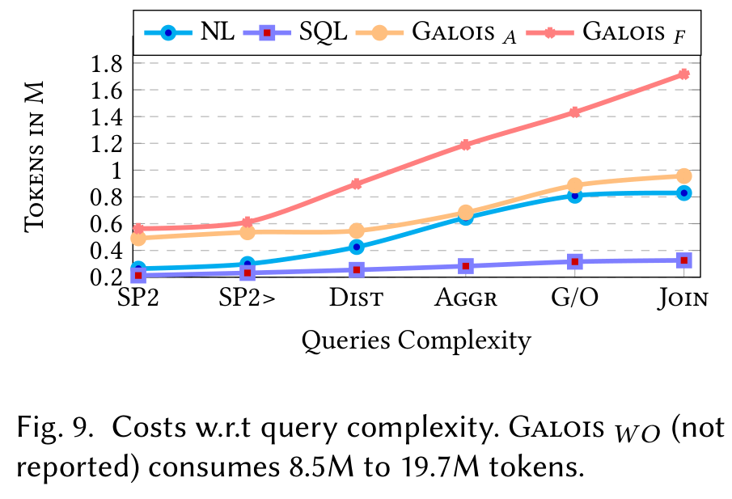
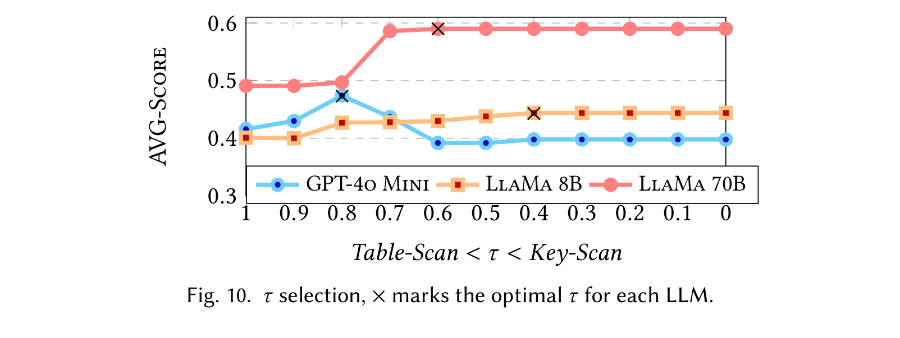
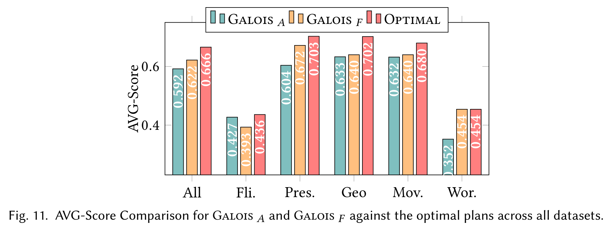

# Galois 论文精读笔记

**论文：Logical and Physical Optimizations for SQL Query Execution over Large Language Models**

> 下面严格以论文正式版内容为依据整理。正文部分尽量只写论文明确提出、实现或实验验证的内容；最后两章“理解与启发”“与课题关系”单独标为个人分析，不混入论文贡献。
> 另外，这篇论文的 Section 5 实际只有 **5.1–5.3**，没有 Section 5.4 和 5.5，因此实验部分按论文真实章节组织。

---

## 0. 先建立正确的论文心智模型

这篇论文最容易看错的一点是：

**Galois 不是 Text-to-SQL 系统，也不是让 LLM 帮数据库查询已有数据。**

论文假设：

* 用户已经有一条 **SQL query `q`**；
* 已知关系的 **schema `s`**；
* 但真正的数据并不在手头数据库里；
* 数据来自：

  * LLM 预训练参数中的 **Internal parametric Knowledge, IK**；
  * 或运行时放进 LLM context 的文档，即 **Model Context, MC / RAG 场景**。

Galois 的核心思想是：

> **把 LLM 当成一种特殊的、概率性的“storage layer”，让 DBMS 负责 query execution。**

因此整个系统可以先这样理解：

```text
                 SQL query q + schema s
                           │
                           ▼
                 生成多个 Logical Plan
                条件到底要不要 pushdown？
                           │
                    LLM confidence
                           │
                           ▼
               选择 Logical Pushdown
                           │
                           ▼
              选择 Physical Scan 方法
               ┌──────────┴──────────┐
               │                     │
          Table-Scan             Key-Scan
               │                     │
               └──────────┬──────────┘
                          ▼
              LLMScan / Filter-LLMScan
                          │
                   从 LLM 得到 tuples
                          │
                          ▼
         Selection / Join / Grouping / ...
                 在内存中由 DB 执行
                          │
                          ▼
                       Result
```

这里最关键的一句话是：

> **只有 LLMScan 和 Filter-LLMScan 与 LLM 交互；数据一旦从 LLM 中取出来，其余 relational operators 都由 Galois 在内存中执行。**

这就是整篇论文的主轴。

---

# 1. 论文基本信息

**题目**

*Logical and Physical Optimizations for SQL Query Execution over Large Language Models*

**作者**

* Dario Satriani
* Enzo Veltri
* Donatello Santoro
* Sara Rosato
* Simone Varriale
* Paolo Papotti

**单位**

* University of Basilicata, Italy
* EURECOM, France

**会议 / 期刊**

* *Proceedings of the ACM on Management of Data*
* Volume 3, Issue 3
* SIGMOD 2025
* Article 181

**时间**

June 2025

**DOI**

10.1145/3725411

论文共 28 页。

---

# 2. 研究背景与问题

## 2.1 为什么需要“SQL over LLM”？

论文区分了两个使用场景。

### 场景一：查询 LLM 的参数化知识 IK

例如：

```sql
SELECT name, size, population
FROM EU_Cities
WHERE population > 1M
  AND num_private_hospitals > 15
```

用户手里并没有一张完整的 `EU_Cities` 表，而是希望从 LLM 的知识中“提取”出这张关系所对应的数据。

论文列出的用途包括：

* 审计 LLM 的 cultural bias；
* 测量 LLM factuality；
* 从 LLM 中提取结构化数据；
* 填充 questionnaire 等。

---

### 场景二：查询运行时文档 MC

例如把：

* 财报；
* 医疗记录；
* 新发布文档；

放到 LLM context 中，再通过 SQL 查询其中的信息。

这一场景与 RAG 很接近。

因此，论文希望解决的并不是：

> “SQL 怎么查数据库？”

而是：

> **“SQL 怎么查一个本身不能像数据库一样被可靠扫描的 LLM？”**

---

# 3. 为什么直接问 LLM 不够？

## 3.1 Figure 1：NL → SQL → Galois

Figure 1 是理解整篇论文的第一张关键图。



*来源：论文 Figure 1，PDF 第 3 页；原图裁剪。该图是论文的总体定性动机：Galois 把 SQL 逻辑交给数据库执行，主要让 LLM 承担底层数据获取。图中的“most results / least errors”不是独立实验数据，定量比较要继续看 Table 3。*

对于：

> 找出人口超过 100 万且私人医院超过 15 家的欧洲城市，并返回 name、size、population。

论文比较三种方式：

```text
Natural Language Question
        │
        ▼
       LLM
        │
   Worst results
   Most errors


SQL Query
        │
        ▼
       LLM
        │
    More results
    Some errors


SQL Query
        │
        ▼
      Galois
        │
        ▼
       LLM
        │
    Most results
    Least errors
```

论文观察：

1. NL 直接问效果最差；
2. SQL prompt 比 NL 更明确；
3. 但把复杂 SQL 一整个塞给 LLM，仍然会出现：

   * 错误数据；
   * missing tuples；
   * hallucination；
4. 将 SQL 拆成数据库 operator，再由数据库执行复杂逻辑，可以提高结果质量。

因此论文提出：

> **complex query 应该由 DBMS 负责 execution，LLM 主要负责提供底层数据。**

这是 Galois 的 **DB-first architecture**。

---

# 4. 核心思想与贡献

论文的核心创新可以浓缩成三个层次。

### 4.1 Logical optimization 不再只看 cost

传统 DBMS：

> selection 越早 pushdown，通常越好。

因为可以减少中间数据量。

但在 LLM 上：

> pushdown 越多，prompt 越复杂，LLM 反而可能越容易回答错。

因此：

**Predicate pushdown 不再天然正确。**

Galois 使用 **LLM confidence** 来决定哪些 predicate 应当 pushdown。

---

### 4.2 Physical Scan 也有不同实现

论文设计两个 LLM-specific physical Scan：

* **Table-Scan**
* **Key-Scan**

它们不是简单的快慢差异，而是：

> **cost 与 result quality 的不同权衡。**

Galois再使用 confidence 选择使用哪种 Scan。

---

### 4.3 Optimizer 需要新的 metadata

传统优化器有：

* statistics；
* histogram；
* cardinality；
* selectivity；
* indexes。

LLM 没有这些传统 catalog 信息。

因此 Galois提出：

> **让 LLM 自己生成 optimization metadata，特别是 confidence。**

所以它实际上在探索一个很重要的新问题：

> 当底层 operator 是 LLM 时，数据库 optimizer 的 metadata 应该是什么？

---

# 5. Section 2：Problem Formulation and Challenges

这一部分论文先正式定义问题，而不是直接给方法。

---

## 5.1 问题定义

输入：

* SQL query `q`
* schema `s`
* LLM

目标：

从：

* LLM internal knowledge；
* 或输入 context 中的文档；

得到正确的 structured query result。

目标同时包括两个维度：

### Quality

结果要：

* complete；
* accurate；
* factual；
* 尽量避免 hallucination。

### Cost

论文主要用：

> **LLM 输入 + 输出的总 token 数**

衡量 I/O cost。

因此这已经不是传统 DB 的：

```text
minimize I/O / CPU / latency
```

而是：

```text
maximize result quality
          +
minimize LLM token cost
```

---

# 6. Section 2：Logical Level Challenge

## 6.1 Figure 2：为什么 predicate pushdown 在 LLM 上会失效？

Figure 2 是论文最重要的 motivation 图之一。

原查询大致是：

```sql
SELECT name, country, population, #pvt_hosp
FROM EUCities
WHERE population > 1M
  AND #pvt_hosp > 15
```

论文比较四种 logical plans。



*来源：论文 Figure 2，PDF 第 5 页；原图裁剪。绿色 tuple 表示正确数据，橙色 tuple 表示错误数据。这是用来解释机制的单个 motivation example：它说明 pushdown 会改变 LLM 任务难度和召回结果，但不单独证明 confidence-based pushdown 在所有查询上都更好。*

---

### Plan 1：No push

```text
LLMScan
   │
   │ retrieve EU cities
   ▼
Filter
population > 1M
AND hospitals > 15
```

LLM 负责：

> 把城市数据取出来。

DB 负责：

> 判断两个条件。

优点：

* LLM 的任务简单。

问题：

* 需要从 LLM 取较多数据；
* token cost 高；
* LLM 仍可能漏掉 tuple。

Figure 2 示例最后得到 Madrid。

---

### Plan 2：Push all

直接要求 LLM：

> 返回人口 >1M 且私人医院 >15 的欧洲城市。

```text
Filter-LLMScan
 population >1M AND hospitals>15
```

传统 DB optimizer 很喜欢这种 plan：

> 数据尽量在 Scan 时过滤。

但论文示例中 LLM 返回：

```text
<empty>
```

原因不是关系代数错误。

而是：

> **LLM 需要同时理解多个条件，reasoning 复杂度增加，反而把正确 tuple 漏掉了。**

---

### Plan 3：Push selective

传统 optimizer 另一个自然策略：

> push 最 selective 的 predicate。

例如：

```text
#private_hospitals > 15
```

问题是：

LLM 对这个事实可能很不确定。

Figure 2 中出现 Zurich、Utrecht 等错误数据，后续 filter 后甚至无法得到正确答案。

所以：

> **传统 selectivity ≠ LLM 最适合回答的 condition。**

---

### Plan 4：Push confident

Galois 的思路：

> push LLM 最有 confidence 的 condition。

例如：

```text
population > 1M
```

LLM 可能很熟悉：

* Madrid population；
* Paris population；
* Berlin population。

之后：

```text
DB Filter:
private hospitals > 15
```

最终得到：

* Madrid
* Berlin

Figure 2 用这个例子说明：

> 在 LLM query optimization 中，predicate 的 **model confidence** 有可能比传统 selectivity 更重要。

注意，这张图是 motivation example，不是单独的统计证明；后面的实验才验证这种策略。

---

# 7. Section 2：Physical Level Challenge

Logical plan 决定：

> **要向 LLM 查询什么。**

Physical plan 决定：

> **具体怎么向 LLM 把这些数据取出来。**

Figure 3 给出两个实现。



*来源：论文 Figure 3，PDF 第 5 页；原图裁剪。左侧展示 Table-Scan 的少请求、多字段返回；右侧编号 1–4 展示 Key-Scan 的 key discovery 与按 key fan-out。它定义的是质量—调用开销权衡，不是传统存储索引的随机 I/O 对比。*

---

## 7.1 Figure 3：Table-Scan

一次询问：

> 给定这个 SQL query，请把满足要求的所有 tuple 填到 table 中。

例如：

```text
Given the following query,
populate the table with actual values...
```

LLM 一次可能返回：

```text
Madrid ...
Paris ...
Berlin ...
Rome ...
London ...
Cologne ...
```

优点：

* LLM interaction 少；
* token / request 开销相对较小。

问题：

* 一个 prompt 同时要求输出很多 attributes、很多 tuples；
* 数据越复杂，准确率可能下降。

---

# 8. Figure 3：Key-Scan

Key-Scan 把任务拆成两步。

### Step 1：先获得 key

例如：

```text
List the name of EUCities
where population > 1M
```

得到：

```text
Madrid
Paris
Berlin
...
```

### Step 2：逐 key 获取其它属性

```text
Madrid → country, population, hospitals
Paris  → country, population, hospitals
Berlin → country, population, hospitals
```

于是：

```text
        Key discovery
             │
      ┌──────┼──────┐
      ▼      ▼      ▼
   Madrid   Paris  Berlin
      │      │      │
      ▼      ▼      ▼
   tuple   tuple   tuple
```

优点：

> 每次 prompt 都更简单、更具体。

论文将这种思想与 Chain-of-Thought 联系起来。

代价：

> 需要更多 LLM calls。

因此：

```text
Table-Scan
少调用 / 更多上下文 / 可能质量低

Key-Scan
多调用 / 每次问题简单 / 可能质量高
```

这形成了 Physical Optimization 的基础。

---

# 9. Section 3：Methodology

论文 Section 3 正式描述如何产生 logical/physical plan。

---

## 9.1 支持的 SQL 范围

论文考虑：

```sql
SELECT attr | agg(attr)
FROM table(s)
[WHERE predicates]
[GROUP BY attrs]
[HAVING ...]
[ORDER BY attrs]
[LIMIT X]
```

aggregation 包括：

* min
* max
* avg
* sum
* count

predicate 支持：

* `=`
* `>`
* `>=`
* `<`
* `<=`

以及 conjunction / disjunction。

论文明确说明：

> 当前 operator subset 并不是完整 SQL，只是作者认为足以展示方法潜力。

---

# 10. Section 3.1：Logical Plan

## 10.1 Table 1：Galois 支持的 Logical Operators

| Operator       | 作用                        |
| -------------- | ------------------------- |
| LLMScan        | 从 LLM 获取数据                |
| Filter-LLMScan | 根据 condition 从 LLM 获取数据   |
| Selection      | 按 condition filter tuples |
| Projection     | 提取 attributes             |
| Join           | join 两个 relation          |
| Distinct       | 去重                        |
| Grouping       | grouping + aggregate      |

其中：

> **只有 LLMScan / Filter-LLMScan 与 LLM 交互。**

其它 operator：

> 都在 memory 中执行。

这是整个 Galois 执行模型最重要的边界。

---

# 11. Logical Plan Enumeration

Galois 针对每张 table 考虑三类 pushdown strategy：

### ① No-pushdown

所有条件放在 LLM 之后，由 DB 执行。

### ② All conditions pushdown

所有 predicates 都进入 Filter-LLMScan。

### ③ Single-condition pushdown

只把其中一个 condition 推入 Filter-LLMScan。

---

# 12. Figure 4：多表 query 如何产生多个 Plan

论文使用：

```sql
SELECT t2.city, t2.pop, t1.capital
FROM state AS t1
JOIN cities AS t2
ON t1.name=t2.state
WHERE t1.area > 300K
  AND t1.cont='EU'
  AND t2.pop > 1M
```

对于 `state`：

有两个 predicates：

```text
area > 300K
cont = 'EU'
```

因此有：

1. no push；
2. push area；
3. push cont；
4. push both。

共 4 种。

对于 `cities`：

只有：

```text
pop > 1M
```

因此：

1. no push；
2. push pop。

共 2 种。

于是：

```text
4 × 2 = 8 logical plans
```



*来源：论文 Figure 4，PDF 第 7 页；原图裁剪。图中绿色节点是与 LLM 交互的 Scan，白色节点由 Galois 在内存中执行。原图只显示 8 个可行计划中的三个代表，中间省略号不表示额外 operator。*

Figure 4 展示其中：

* `Q2_i`
* `Q2_ii`
* ...
* `Q2_viii`

---

## 12.1 Logical Plan 数量公式

论文定义：

[
push(t)=
\begin{cases}
1 & cond(t)=0 \
2 & cond(t)=1 \
cond(t)+2 & otherwise
\end{cases}
]

原因很直观。

如果一张表有 `k ≥ 2` 个 predicates：

```text
1 个 no-push
+
k 个 single-push
+
1 个 all-push
=
k + 2
```

整个 query：

[
plans(q)=\prod_{t\in q}push(t)
]

因此：

> 多表 + 多 predicate 时，logical plan 数量会迅速增长。

这也解释了 Section 4 为什么不可能把所有 plan 都真正执行一次再比较。

---

# 13. Section 3.2：Physical Plan

这一部分是论文的两个核心算法。

---

# 14. Algorithm 1：Table-Scan

## 输入

Algorithm 1 的输入为：

* SQL query `q`
* table `t_name`
* database schema `s`
* maximum iterations `maxIter`
* language model `LLM`

输出：

* tuple set `t`

---

## 14.1 第一次请求

初始化：

```text
i = 0
context = []
t = {}
```

第一次调用：

```text
genFirstPrompt(tname, s, q)
```

Figure 5 给出的 prompt 模板为：

```text
Given the following query,
populate the table with actual values.

query: select attributes
       from table
       (where condition).

Respond with JSON only.
Don't add any comment.
Use the following JSON schema: jsonSchema.
```

也就是说：

> 不是让 LLM 随便生成自然语言，而是强制使用 schema 对应的 JSON。

---

## 14.2 解析结果

```text
jsonResponse = LLM.request(...)
parsedTuples = parse(...)
```

如果 JSON 不完整：

* 论文采用 best-effort repair；
* 或利用 feedback prompt 修正；
* 后续仍无效的 JSON 会被跳过。

---

## 14.3 为什么需要多轮？

因为论文指出 LLM 有两个特点：

### ① 更容易生成训练数据中的 frequent values

rare facts 不一定第一次就出现。

### ② output size 有限制

不可能假设：

> “一次 prompt 就把整个 relation 全取回来。”

因此下一轮不是重新问原问题，而是：

```text
List more values if there are more,
otherwise return an empty JSON.
```

并把过去：

* prompt；
* response；

都放入 `context`。

---

## 14.4 Stop condition

如果：

```text
parsedTuples
```

没有产生任何新的 tuple：

```text
noNewTuples(...)
```

则停止。

否则：

```text
t.addAll(parsedTuples)
```

继续下一轮。

直到：

```text
没有新 tuple
OR
达到 maxIter
```

---

## 14.5 Table-Scan 为什么这样设计？

论文的理由非常明确：

> 通过 iterative prompting，应对 rare values 与 LLM output-length limitation。

但缺点也明确：

> 一个 prompt 同时提取完整 tuples，任务比较复杂，因此不一定获得最高 quality。

---

# 15. Algorithm 2：Key-Scan

Key-Scan 是论文另一项核心设计。

输入和 Table-Scan 基本相同：

* `q`
* `t_name`
* `s`
* `maxIter`
* `LLM`

输出：

* tuple set `t`

但执行过程分成 **两个阶段**。

---

# 16. Key-Scan Stage 1：获取所有 Key

首先：

```text
attrKeys = tname.keys
keys = {}
```

第一次调用：

```text
genFirstPromptKey(...)
```

Figure 6：

```text
List the key of table
(where the following condition holds: condition).

Respond with JSON only.
Use the following JSON schema: jsonSchema.
```

之后迭代：

```text
List more unique values if there are more,
otherwise return an empty response.
Don't repeat the previous values.
```

直到：

```text
no new key
OR
maxIter
```

---

# 17. Key-Scan Stage 2：逐 Key 补齐 Tuple

获取：

```text
keys = {k1, k2, ..., kn}
```

之后：

```text
for each keyValue:
    genTuplePrompt(...)
    LLM.request(...)
    parse tuple
```

Figure 6 对应：

```text
List the attributes of the table for keyValue.
Respond with JSON only.
```

例如：

```text
Madrid
   ↓
country?
population?
private hospitals?
```

---

## 17.1 一个非常重要的实现细节

Stage 2 中：

> **每个 key 对应的 LLM request 不需要共享 context。**

因此：

```text
key1 → request ┐
key2 → request ├── parallel
key3 → request ┘
```

Algorithm 2 的 lines 18–22 可以并行执行。

这也是后面实验中：

> Key-Scan 虽然 request 更多，但 latency 未必更高

的重要原因。

---

# 18. Key-Scan 与传统 Index Scan 的区别

论文明确说：

Key-Scan 可以看成一种：

> approximation of an index scan

但它与真正数据库 index 有三个明显区别。

### 第一

传统 index：

```text
pre-built deterministic data structure
```

Key-Scan：

```text
runtime 向 LLM 动态询问 key
```

---

### 第二

传统 index scan 有确定性。

Key-Scan：

> 仍然依赖 LLM，因此没有 deterministic guarantee。

---

### 第三

传统 index：

> 主要为了 performance。

Key-Scan：

> **主要目的是提高 result quality。**

这一点不能混淆。

---

# 19. Table-Scan vs Key-Scan 总结

|           | Table-Scan    | Key-Scan              |
| --------- | ------------- | --------------------- |
| 第一步       | 直接获取完整 tuples | 先获取 keys              |
| 第二步       | 继续找更多 tuples  | 对每个 key 获取 attributes |
| Prompt    | 信息较多          | 更小、更具体                |
| LLM calls | 较少            | 较多                    |
| 并行机会      | 较少            | 第二阶段可并行               |
| 主要优势      | cost          | quality               |
| 保证        | 无确定性保证        | 同样无确定性保证              |

这里的核心不是：

> Key-Scan 一定好。

而是：

> **不同 query 应当选择不同 physical operator。**

这就进入 Section 4。

---

# 20. Section 4：Logical and Physical Plan Optimizations

Galois optimizer 的目标是同时考虑：

```text
Result Quality
+
Token Cost
```

具体有三部分：

1. Logical Optimization
2. Physical Optimization
3. Cost Optimization

---

# 21. Logical Optimization：哪些 Predicate 应该 Pushdown？

传统 optimizer 可能依靠：

* selectivity；
* histogram；
* cardinality。

Galois 没有这些信息。

而且论文已经在 Figure 2 中说明：

> 最 selective predicate 不一定是 LLM 最可靠的 predicate。

因此 Galois 使用：

> **LLM confidence**

---

## 21.1 Confidence 获取方法

给 LLM：

* schema `s`
* query `q`
* WHERE 中的 atoms

让 LLM 对每个 predicate 做 classification：

```text
high
or
low
```

---

## 21.2 Galois 的实际决策规则

如果：

### 只有一个 predicate 是 high

则：

```text
push that single condition
```

### 多个 predicates 是 high

则：

```text
push all conditions
```

### 没有 high predicate

则：

```text
no pushdown
```

---

## 21.3 为什么不枚举任意 predicate subset？

因为：

> predicate 数量增加后，组合数可能指数增长。

因此实现并没有搜索：

```text
{p1,p2}
{p1,p3}
{p2,p3}
...
```

这样的任意子集。

论文实现只考虑前面介绍的：

* no push；
* single push；
* all push。

---

## 21.4 为什么不把所有 Plan 都执行完再选？

论文提到一种理论上的 alternative：

对 open LLM：

> 执行所有 plans，然后根据模型 output final-layer confidence 做 post-execution selection。

问题：

> 为了选 plan 先把所有 plan 都执行一次，cost 太高。

因此 Galois选择：

> **pre-execution confidence estimation。**

---

# 22. Physical Optimization：Table-Scan 还是 Key-Scan？

论文并没有认为：

> Key-Scan 永远比 Table-Scan 好。

因为有时：

> Table-Scan 中其它 attributes 提供的额外 context，反而有助于 LLM 生成正确数据。

所以需要第二次 plan selection。

---

## 22.1 Key confidence

Galois 首先询问 LLM：

> 获取所有 key values 的 confidence。

论文记作：

[
LLM_{conf}(keys|conds)
]

输入包括：

* query；
* schema；
* pushdown conditions。

---

## 22.2 Query confidence

论文定义：

[
conf(q)=\frac{LLM_{conf}(keys|conds)}{n}
]

其中：

[
n = SELECT\ clause\ 中 attribute 的数量
]

论文的解释是：

> 该指标用于反映 key retrieval 的错误如何传播到最终 query attributes。

这是论文自己定义的 heuristic，并不是传统统计学意义上的概率模型。

---

# 23. Threshold τ

给定 threshold：

[
\tau
]

如果：

[
conf(q)>\tau
]

则：

```text
Key-Scan
```

否则：

```text
Table-Scan
```

作者的 reasoning 是：

### confidence 高

key retrieval 比较可靠：

```text
Key-Scan
→ simpler prompts
→ potentially better quality
```

### confidence 低

如果 key 一开始就漏了：

> 后面再精确补属性也没有意义。

因此使用：

```text
Table-Scan
```

让其它 attributes 提供更多 context。

---

# 24. Cost Optimization：Selective Attribute Retrieval

最后一个优化比较简单。

假设 table 很宽：

```text
A B C D E F G H
```

query 只需要：

```text
A C F
```

Galois：

* prompt 中仍保留完整 schema `s`；
* 让 LLM 理解完整表结构；
* 但明确要求只返回需要的 attributes。

因此减少：

> output tokens。

论文认为 wide tables 下尤其有效。

---

# 25. Galois Optimizer 一张图总结

根据 Section 3–4 可以整理为：

```text
SQL q + Schema s
        │
        ▼
  WHERE predicates
        │
        ▼
LLM confidence classification
        │
 ┌──────┼────────┐
 │      │        │
none   one      many
high   high      high
 │      │        │
 ▼      ▼        ▼
No    Single    All
Push   Push     Push
        │
        ▼
    Logical Plan
        │
        ▼
LLMconf(keys | conditions)
        │
        ▼
 conf(q)=LLMconf/n
        │
       τ
     ┌──┴──┐
 conf≤τ   conf>τ
    │       │
    ▼       ▼
Table     Key
Scan      Scan
     \     /
       ▼
   Retrieve tuples
       │
       ▼
DB relational operators
       │
       ▼
     Result
```

这就是 Galois 的完整核心执行路径。

---

# 26. Section 5：实验设置

论文提出五个 evaluation questions：

1. Galois 是否比直接 NL / SQL prompting 的 result quality 更高？
2. logical / physical optimizations 是否有效？
3. 哪些因素影响 quality？
4. Galois 的 token cost 和 latency 如何？
5. 能否与 RAG / in-context learning 结合？

---

# 27. Models

使用：

* GPT-4o mini
* Llama-3.1-8B
* Llama-3.1-70B

Llama 通过 Together AI 运行。

统一：

```text
temperature = 0
```

以获得 deterministic results。

---

# 28. Table 2：Dataset

| Dataset    | Source | Queries | Avg expected cells | Type |
| ---------- | -----: | ------: | -----------------: | ---- |
| Flight     | Spider |       6 |              267.5 | IK   |
| Geo        | Spider |      32 |               22.8 | IK   |
| World      | Spider |       4 |               33.2 | IK   |
| Movies     |   IMDB |       9 |               54.7 | IK   |
| Presidents |   Wiki |      26 |               42.2 | IK   |
| Premier    |    BBC |       5 |               57.8 | MC   |
| Fortune    | Kaggle |      10 |                7.9 | MC   |
| Geo-Test   | Spider |      10 |               24.1 | IK   |

严格来说：

* 前七个用于主要 evaluation；
* **Geo-Test 专门用于 calibration `τ`**。

---

## 28.1 IK

Internal parametric Knowledge：

* Flight
* Geo
* World
* Movies
* Presidents

---

## 28.2 MC

Model Context：

* Premier
* Fortune

这两个 dataset 专门选择了 2024 年的信息，而实验使用的 LLM training cutoff 在 2023 年 12 月，因此作者希望确保：

> 信息不是来自 LLM pretraining，而是必须从 context documents 获取。

---

# 29. Evaluation Metrics

## 29.1 F1-Cell

将：

```text
actual result cells
```

和：

```text
expected result cells
```

看成集合，计算 F1。

只关心：

> cell value 是否出现。

不要求 tuple structure 完全一样。

---

## 29.2 Cardinality

定义：

[
\frac{\min(|t_{exp}|,|t_{act}|)}
{\max(|t_{exp}|,|t_{act}|)}
]

衡量：

> 返回 tuple 数量是否正确。

范围：

```text
0 ~ 1
```

---

## 29.3 Tuple Constraint

进行 tuple-level comparison。

要求比 F1-Cell 严格。

值为 1 时需要：

* schema 一样；
* cardinality 一样；
* cell values 一样。

---

## 29.4 AVG-Score

论文定义：

[
AVG =
\frac{
F1Cell+Cardinality+TupleConstraint
}{3}
]

用于作为综合 quality proxy。

---

## 29.5 数据匹配

为了避免：

```text
1K
```

与：

```text
1000
```

这种表示差异：

论文会 normalize values。

字符串：

* Edit Distance；
* threshold = expected value 长度的 10%。

数值：

* 允许 ±10% difference。

---

## 29.6 Cost Metrics

两个：

### #TOKENS

LLM：

```text
input tokens + generated tokens
```

### TIME

从：

```text
query sent to Galois
```

到：

```text
result returned
```

的总时间。

---

# 30. Baselines

### NL

直接 Natural Language question → LLM。

### SQL

直接 SQL query → LLM。

### GaloisWO

Without Optimizations。

采用 multi-step reasoning：

* 先获取 keys；
* 然后逐 cell 获取数据；
* 不进行本文提出的优化。

### Palimpzest / PZ

只在 Section 5.3 RAG experiment 中比较。

---

# 31. Galois Variants

### Galois S

模拟传统：

> most Selective condition pushdown。

selectivity 同样让 LLM估计。

使用：

```text
Table-Scan
```

---

### Galois A

论文后续实验实际表示：

> **all-condition pushdown + Table-Scan**

需要注意一个原文细节：

baseline 定义处有一句写成了 “pushes down All attributes”，但后文 Exp-2 以及整个方法描述都是“push down all conditions”。因此这里保留论文实际实验语义，即 **all-condition pushdown**，而不悄悄把原文措辞混为一谈。

---

### Galois F

**Full system**

包括：

* confidence-based Logical Optimization；
* confidence-based Physical Optimization；
* Section 4 中完整优化。

---

# 32. Section 5.1 — Exp-1：Overall Evaluation

使用：

```text
Llama 3.1 70B
τ = 0.6
```

IK datasets。

## Table 3

| Metric           |   NL |     SQL | GaloisWO | Galois S | Galois A | Galois F |
| ---------------- | ---: | ------: | -------: | -------: | -------: | -------: |
| F1-Cell          | .237 |    .431 |     .518 |     .480 |     .543 | **.563** |
| Cardinality      | .462 |    .659 |     .691 |     .655 |     .799 | **.835** |
| Tuple Constraint | .065 |    .351 |     .389 |     .365 |     .448 | **.464** |
| AVG-Score        | .254 |    .481 |     .531 |     .500 |     .592 | **.622** |
| Tokens (M)       |  .83 | **.33** |    19.71 |      .96 |      .95 |     1.72 |
| Avg Time (s)     |  120 |    61.4 |     1460 |      130 |    120.5 | **47.4** |

---

## 32.1 Quality

Galois F：

```text
AVG = 0.622
```

对比：

```text
NL       = 0.254
SQL      = 0.481
GaloisWO = 0.531
```

论文报告 improvement：

* 相对 NL：最高 **144%**
* 相对 SQL：**29%**
* 相对 GaloisWO：**17%**

---

## 32.2 为什么 NL 差？

作者认为：

* NL 有 ambiguity；
* hallucination 更多；
* data repetitions 更多；
* structured output 能力较弱。

尤其 Tuple Constraint：

```text
NL = 0.065
```

---

## 32.3 为什么 SQL 仍然不够？

SQL 消除了部分语言歧义。

但对于：

* aggregate；
* complex reasoning；

直接让 LLM执行整条 SQL 仍然困难。

因此：

```text
SQL AVG = .481
```

低于：

```text
Galois F = .622
```

---

## 32.4 为什么 Galois S 不好？

Galois S：

> push 最 selective predicate。

结果：

```text
AVG .500
```

甚至低于 GaloisWO：

```text
.531
```

作者解释：

> selective information 可能恰恰是 LLM 不可靠的信息，导致真正的 tuple 在 Scan 阶段被错误过滤。

这就是论文用实验支持：

> **traditional DB optimization principle 不能直接套在 LLM 上**

的重要证据。

---

## 32.5 Token Cost

最便宜：

```text
SQL = .33M
```

Galois F：

```text
1.72M
```

明显更贵。

而：

```text
GaloisWO = 19.71M
```

极其昂贵。

原因：

> GaloisWO 几乎逐 cell 调 LLM。

---

## 32.6 一个很有意思的 latency 结果

Galois F：

```text
47.4s
```

甚至低于：

```text
SQL = 61.4s
```

论文解释不是因为 request 少，而是因为：

> Key-Scan 第一阶段 key response 较小，第二阶段 per-key requests 可以并行。

所以：

> **更多 LLM calls ≠ 必然更高 wall-clock latency。**

这是这篇论文中值得特别记住的一点。

### 作者对 Question 1 的 Takeaway

> Galois 相对 NL / SQL，提高 query result 的 accuracy 和 completeness，分别达到 144% 和 29% AVG-Score improvement。

这个结论限定在论文测试的 workloads/models 中，不应扩大为“任意 SQL、任意 LLM 都提升 29%”。

---

# 33. Section 5.1 — Exp-2：Effectiveness of Optimizations

使用：

* GEO
* Llama 3.1 70B

---

## 33.1 Physical Optimization

对每个 query：

同时实际执行：

* Table-Scan
* Key-Scan

然后查看：

> Galois F 根据 confidence 选择的 operator 是否恰好是 AVG-Score 更高的那个。

结果：

> **75% queries 选择正确。**

所以论文并没有声称 physical optimizer 完美。

实际 accuracy 是：

```text
75%
```

这个数字后面 Exp-8 也成为主要误差来源。

---

# 34. Logical Optimization

为了控制变量：

> physical operator 固定为 Table-Scan。

只比较：

* NO-PUSH
* Galois A
* Galois F

## Table 4

|            | NO-PUSH | Galois A | Galois F |
| ---------- | ------: | -------: | -------: |
| AVG-Score  |    .637 |     .598 | **.708** |
| Tokens (M) |    .175 |     .097 | **.092** |

结果：

### NO-PUSH

quality：

```text
.637
```

不错。

但 token：

```text
.175M
```

最高。

---

### Galois A

token：

```text
.097M
```

降低很多。

但 quality：

```text
.598
```

下降。

作者认为：

> complex conditions 被直接交给 LLM 后，一些正确 tuple 在 Scan 时已经被错误过滤。

---

### Galois F

同时：

```text
AVG = .708
Tokens = .092M
```

在该实验中：

* quality 最高；
* token 最低。

### 作者对 Question 2 的 Takeaway

* physical optimizer 在 75% cases 选中 best plan；
* logical optimization 在该受控实验中取得 best quality 和最低 token cost。

注意：

> Logical Experiment 只固定使用 Table-Scan，并只针对 GEO 的多条件 queries，不等于证明所有 query workload 都如此。

---

# 35. Section 5.2 — Exp-3：Impact of LLM Parameters

## Table 5

| Model         |   NL |  SQL | GaloisWO | Galois A | Galois F |
| ------------- | ---: | ---: | -------: | -------: | -------: |
| GPT-4o mini   | .258 | .240 |     .456 |     .457 | **.468** |
| Llama 3.1 8B  | .230 | .372 |     .375 |     .520 | **.528** |
| Llama 3.1 70B | .254 | .481 |     .531 |     .592 | **.622** |

70B 效果最好。

作者给出两个原因：

1. 参数更多的 model 存储更多 factual data；
2. 大模型更能处理复杂 pushdown prompt。

论文后续实验因此主要使用：

```text
Llama 3.1 70B
```

---

# 36. Figure 7：利用 logprob 过滤 Result

对于 open LLM：

可以获得 generated token 的：

```text
log probabilities
```

论文把属于一个 cell 的 token probability 求均值，并进一步得到 tuple confidence。

然后设置 threshold `p`。



*来源：论文 Figure 7，PDF 第 18 页；原图裁剪。横轴 `p` 是 LLM 输出 logprob 的过滤阈值；阈值从 0.6 提高到 0.995 时，precision 上升而 recall 下降。该图展示质量控制权衡，不是 Galois 主 logical/physical plan selector 的消融。*

Figure 7 的趋势：

```text
p ↑
│
├─ Precision ↑
└─ Recall    ↓
```

即：

> 更严格地过滤低 confidence tuple 可以减少错误，但同时会丢掉更多正确 tuple。

论文没有把这一方法作为 Galois 主 optimizer，而是展示：

> open LLM output confidence 可用于进一步 quality control。

---

# 37. Exp-4：Impact of Retrieved Values

论文指出：

传统 DB：

> 同样 query structure 换 value，并不会改变数据库本身的正确性。

LLM 不一样。

原因：

> 不同事实在 training data 中出现频率不同。

---

## 37.1 Table 6：USA vs Venezuela Presidents

相同 query template，只改变 country。

|           |   NL |  SQL | GaloisWO | Galois A | Galois F |
| --------- | ---: | ---: | -------: | -------: | -------: |
| USA       | .263 | .546 |     .733 |     .782 | **.862** |
| Venezuela | .203 | .285 |     .411 |     .425 | **.482** |

差距非常明显：

```text
.862
vs
.482
```

论文认为：

> USA president 信息在 training corpus 中更加 popular。

因此：

> query value 本身成为 query performance 的一个因素。

---

# 38. Table 7：Temporal Effect

|          |   NL |  SQL | GaloisWO | Galois A | Galois F |
| -------- | ---: | ---: | -------: | -------: | -------: |
| Recent   | .209 | .398 |     .531 |     .584 | **.623** |
| Past     | .171 | .305 |     .469 |     .518 | **.548** |
| All-Time | .325 | .562 |     .703 |     .722 | **.857** |

作者认为：

> 训练语料中 recent information 相比遥远历史数据通常更多，因此影响 retrieval quality。

注意：

论文实验展示的是这些 President queries 上的现象，并没有证明所有 domain 都必然满足完全相同的 temporal trend。

---

# 39. Exp-5：Impact of Query Complexity

论文把 query 分为：

* SP2：Selection + Projection，≤2 conditions
* SP2>：>2 conditions
* Dist：DISTINCT
* Aggr：aggregate
* G/O：GROUP BY / ORDER BY
* Join

---

## 39.1 Figure 8



*来源：论文 Figure 8，PDF 第 19 页；原图裁剪。横轴是 SP2、SP2>、DISTINCT、aggregate、GROUP/ORDER 和 join 六类查询，不是等间隔的连续“复杂度”数值。连线用于展示跨类别趋势，不应读作严格单调函数。*

总体趋势：

> SQL complexity 增加，result quality 下降。

尤其：

* aggregate；
* group/order；
* join；

更加困难。

原因是：

> 这些 operator 正确执行的前提是 LLMScan 已经把相关输入 tuples 基本取全。

例如 AVG：

只要缺一个重要 value，就可能导致最终 aggregate 与 ground truth 不匹配。

---

## 39.2 作者为什么仍然说 Galois “robust”？

这里要准确理解作者措辞。

Figure 8 并不是说：

> complexity 对 Galois 完全没影响。

实际上 quality 仍下降。

作者的意思是：

> **相对于直接 NL / SQL，Galois 对 SQL-level complexity 的敏感性更低，因为很多 SQL reasoning 已经交给 relational operators，而不是 LLM。**

真正影响 Galois 的主要因素变成：

> LLMScan 是否成功获取正确底层 data。

---

# 40. Table 8：Predicate 类型

| Condition                |   NL |      SQL | GaloisWO | Galois A | Galois F |
| ------------------------ | ---: | -------: | -------: | -------: | -------: |
| 1 textual                | .319 |     .600 |     .566 |     .674 | **.699** |
| >1 textual               | .283 |     .565 |     .577 |     .647 | **.695** |
| >1 textual, 1 numerical  | .264 |     .527 |     .528 |     .619 | **.633** |
| >1 textual, >1 numerical | .222 |     .384 |     .479 |     .530 | **.539** |
| 1 numerical              | .260 | **.545** |     .486 |     .500 |     .517 |
| >1 numerical             | .223 |     .455 | **.532** |     .459 |     .512 |

结论非常值得注意：

> **textual predicates 比 numerical predicates 更容易。**

而且 Galois F 不是每种情况都第一。

纯 numerical：

* 1 numerical：SQL 最好；
* > 1 numerical：GaloisWO 最好；
* Galois F 均为第二。

因此不能把论文结论扩大成：

> “Galois 在所有 query 类型都绝对最好。”

---

# 41. Figure 9：Query Complexity 与 Token Cost



*来源：论文 Figure 9，PDF 第 19 页；原图裁剪。纵轴单位是百万 tokens。GaloisWO 因消耗约 8.5M–19.7M tokens 而未画入坐标系，因此不能把“图中没有 GaloisWO”误读为其成本更低。*

随着 query complexity 增加：

> Galois 通常需要比直接 NL / SQL 获取更多数据，因此 token cost 更高。

Figure 9 没有画 GaloisWO。

正文说明：

> GaloisWO 消耗约 8.5M–19.7M tokens，显著高于其它方法。

作者据此认为：

* Galois F：最高 quality，但 token 较高；
* Galois A：更好的 cost-quality compromise。

---

# 42. Exp-6：Evolution of Prompt Size

这是一个容易被忽略但非常重要的实验。

iterative Scan 每轮都把历史结果放进 context：

```text
iteration 1
   ↓
iteration 2 = previous interaction + new request
   ↓
iteration 3 = even longer context
```

因此 prompt 可能越来越大。

论文比较：

* Galois ∅：Table-Scan + no pushdown
* Galois A
* Galois F

## Table 9

|                                      | Galois ∅ | Galois A |  Galois F |
| ------------------------------------ | -------: | -------: | --------: |
| Avg input tokens over all iterations |   63,405 |    5,137 | **2,930** |
| Avg iterations/query                 |     6.82 |     4.22 |  **3.92** |
| Queries with ≥10 iterations          |       37 |        1 |         4 |

非常明显：

```text
63405
→
2930
```

说明 pushdown 不只是减少最终 output：

> **还显著减少 iterative context growth。**

---

## 42.1 maxIter

之前实验：

```text
maxIter = 10
```

只有 5 个 optimized Galois queries 达到这个上限。

作者把：

```text
maxIter = 10
```

提高到：

```text
20
```

后：

```text
AVG-Score only +0.06%
Tokens +24%
```

因此作者认为出现明显：

> diminishing returns。

---

# 43. Exp-7：Threshold Setup

Figure 10 专门确定：

[
\tau
]



*来源：论文 Figure 10，PDF 第 20 页；原图裁剪。黑色 × 是每个 LLM 在 Geo-Test golden dataset 上选得的最优 `τ`；横轴从 1 向 0 递减，阈值越低越倾向使用 Key-Scan。该校准只支持论文测试的三个模型与数据集，不证明 `τ` 能跨任意未来模型复用。*

使用：

> Geo-Test golden dataset

而不是测试集。

方法：

1. 从较高 `τ` 开始，此时基本总是 Table-Scan；
2. 逐步降低；
3. Key-Scan 使用得越来越多；
4. 当 AVG-Score 不再增加时停止。

最终：

| Model         |       τ |
| ------------- | ------: |
| Llama 3.1 8B  |     0.4 |
| Llama 3.1 70B | **0.6** |
| GPT-4o mini   |     0.8 |

作者声称：

> threshold 主要依赖 LLM，并在其测试的不同 tables、datasets、queries 中保持一致。

实验没有证明这一规律对任意未来模型或任意 domain 都成立。

---

# 44. Exp-8：距离真正 Optimal Plan 还有多远？

这一实验特别重要。

作者真正：

> 对每个 query 枚举并执行所有可行 logical + physical plans。

然后找到：

```text
Optimal =
highest AVG-Score plan
```

再与：

* Galois A
* Galois F

比较。

## Figure 11



*来源：论文 Figure 11，PDF 第 21 页；原图裁剪。`Optimal` 是作者对每个 query 执行所有可行 logical + physical plans 后挑出的最高 AVG-Score，是 oracle 参考上界，不是可部署的低成本 baseline。图中总体 .622 对 .666 的差距直接说明 Galois F 仍会选错计划。*

| Dataset    | Galois A | Galois F | Optimal |
| ---------- | -------: | -------: | ------: |
| All        |     .592 | **.622** |    .666 |
| Flight     | **.427** |     .393 |    .436 |
| Presidents |     .604 | **.672** |    .703 |
| Geo        |     .633 | **.640** |    .702 |
| Movies     |     .632 | **.640** |    .680 |
| World      |     .352 | **.454** |    .454 |

两个很重要的结果：

### ① Galois F 并没有达到真正最优

总体：

```text
Galois F = .622
Optimal  = .666
```

---

### ② 主要错误来自 Physical Plan Selection

论文将这个 gap 主要归因于：

> physical operator prediction accuracy 只有 75%。

Flight 上甚至：

```text
Galois A = .427
Galois F = .393
```

也就是说：

> Full optimizer 选错 physical plan 时，确实可能比 simpler optimizer 更差。

World 上：

```text
Galois F = Optimal = .454
```

作者称：

> World 中所有 queries 都选到了 optimal plan。

---

# 45. Section 5.3：In-Context Querying / RAG

前面的实验主要查询：

> LLM parametric knowledge。

这里测试：

> context 中的新文档。

---

# 46. RAG Setup

两个 dataset：

### Premier

* 60 textual documents
* chunk size：128 tokens

### Fortune

* 500 textual documents
* chunk size：400 tokens

embedding：

```text
WhereIsAI/UAE-Large-V1
```

所有 segments：

> 存入 vector DB。

每次 query：

```text
retrieve top-50 relevant segments
```

再传给：

```text
Llama 3.1 70B
```

所有方案使用相同 retrieved chunks。

---

# 47. Palimpzest Baseline

论文专门比较 Palimpzest，因为它同样属于：

> declarative AI data processing。

作者指出二者设计不同：

### Galois

```text
SQL declarative interface
```

### Palimpzest

```text
ETL-like procedural Python API
```

实验中将 SQL workload 改写成：

* filter
* convert
* execute

并使用：

```text
MaxQualityAtFixedCost
```

optimization policy。

---

# 48. Table 10：RAG Results

| Metric     |    NL |   SQL | Galois A | Galois F |         PZ |
| ---------- | ----: | ----: | -------: | -------: | ---------: |
| AVG-Score  |  .389 |  .520 |     .628 |     .711 |   **.720** |
| Tokens (M) | 1.448 | 1.625 |    1.478 |    1.598 | **13.818** |

quality：

```text
PZ       = .720
Galois F = .711
```

非常接近。

但 token：

```text
PZ       = 13.818M
Galois F = 1.598M
```

Table 10 的直接比值约为：

```text
8.6×
```

而正文将 Palimpzest 描述为成本“大约 11×”更高。这里论文表格数值与正文近似表述并不完全一致，因此精读笔记应保留这个区别，而不把两者强行统一。

---

## 48.1 为什么 Galois Token 少？

Palimpzest：

> 每个 document 会经过多个 LLM processing steps。

Galois：

> **只有 Scan operator 处理 text，且只有 Scan 与 LLM interaction。**

之后：

```text
filter
join
aggregate
...
```

全部由 DB 做。

### 作者 Question 5 Takeaway

Galois：

> 可以与 RAG / in-context learning 有效结合，quality 接近最佳 baseline，同时显著降低 token cost。

注意这里真正最高质量的是：

```text
PZ = .720
```

而不是 Galois F。

---

# 49. 实验到底证明了什么？

把 Section 5 的结论压缩下来，论文实际支持的是：

**第一，**在作者测试的 datasets 与 models 上，把复杂 SQL reasoning 从 LLM 中拆出来交给数据库执行，可以明显改善 structured result quality。

**第二，**传统 predicate pushdown / selectivity heuristic 并不总适用于 LLM；confidence-based pushdown 在论文实验中效果更好。

**第三，**Table-Scan / Key-Scan 的选择确实影响 result quality，而 Galois 的 physical selector 正确率为 **75%**，并非完美。

**第四，**LLM query result quality 不只取决于 SQL structure，还明显受：

* model size；
* fact popularity；
* temporal distribution；
* predicate type；
  影响。

**第五，**Galois 的高 quality 需要额外 token，但相较非常细粒度的 multi-step baseline，cost 又明显更低。

**第六，**同一设计也可以用于 RAG / in-context documents。

论文**没有证明**：

* 对任意 SQL 都能获得更高质量；
* 对任意 LLM confidence 都可靠；
* Galois 能保证 relation completeness；
* Key-Scan 能像真正 index 一样获得完整 key set；
* Galois 能提供确定性的数据库语义。

---

# 50. 关键 Figure / Table / Algorithm 索引

复习时建议重点看以下内容：

| 内容              | 作用                                                    |
| --------------- | ----------------------------------------------------- |
| **Figure 1**    | NL → SQL → Galois 的总体 motivation                      |
| **Figure 2**    | no push / all push / selective push / confidence push |
| **Figure 3**    | Table-Scan vs Key-Scan                                |
| **Table 1**     | Galois logical operators                              |
| **Figure 4**    | 多 table / predicate 如何生成多个 logical plans              |
| **Algorithm 1** | Table-Scan                                            |
| **Figure 5**    | Table-Scan prompt templates                           |
| **Algorithm 2** | Key-Scan                                              |
| **Figure 6**    | Key-Scan prompt templates                             |
| **Table 3**     | Overall result，Galois F AVG=.622                      |
| **Table 4**     | Logical optimization ablation                         |
| **Table 5**     | LLM size effect                                       |
| **Figure 7**    | logprob threshold：precision ↑ / recall ↓              |
| **Table 6**     | USA vs Venezuela，fact popularity                      |
| **Table 7**     | temporal effect                                       |
| **Figure 8**    | query complexity vs quality                           |
| **Table 8**     | textual / numerical predicates                        |
| **Figure 9**    | query complexity vs tokens                            |
| **Table 9**     | iterative prompt growth                               |
| **Figure 10**   | τ calibration                                         |
| **Figure 11**   | Galois F vs actual Optimal                            |
| **Table 10**    | RAG / Palimpzest comparison                           |

---

# 51. 优点与局限

## 51.1 论文明确支持的优点

### ① 将 DB optimization 真正引入 LLM query execution

不是简单：

```text
SQL → prompt → LLM
```

而是形成：

```text
Logical Plan
→ Physical Plan
→ operators
→ optimizer
```

这是它最核心的 database systems 贡献。

---

### ② 明确指出 Quality 是 optimizer 的一等目标

传统：

```text
cost / latency
```

Galois：

```text
quality + cost
```

这也是论文实验体系一直围绕的主线。

---

### ③ 新的 LLM-specific physical operators

特别是：

* Table-Scan
* Key-Scan

把：

> “prompt 怎么问”

正式变成：

> **physical operator implementation choice。**

---

### ④ 不依赖特定 LLM

论文设计上：

* GPT
* Llama

均可以使用。

实验也覆盖多个模型。

---

### ⑤ 同时覆盖 IK 与 RAG / MC

不是只查询 LLM memory，也不是只查询文档。

---

# 52. Section 7 作者自己指出的开放问题 / 局限

这篇论文没有单独标题为 “Limitations” 的章节。

Section 7 Conclusion 中明确提出以下 open problems。

---

## 52.1 Index-like efficiency 仍未解决

Galois 是：

> DB-first architecture。

作者提出未来可以利用：

> prior interactions + caching

模拟类似 index 的 efficiency。

当前论文没有实现完整的 index-like mechanism。

---

## 52.2 LLM-first architecture 尚不可行

另一方向：

> 直接把 structured data 全部训练 / 塞入 LLM，让 LLM 替代 DBMS。

论文指出当前仍受到：

* context-size limitation；
* long-input processing problems；

限制。

---

## 52.3 当前没有 multimodal query

作者提出未来支持：

* text
* image
* structured data

联合查询。

本文没有实现。

---

## 52.4 Rare values / bias

LLM 可能优先返回 training corpus 中更 frequent 的值。

例如问：

```text
private hospitals
```

可能优先产生 US hospitals。

如果真正想要：

```text
EU hospitals
```

当前方法依赖：

> user 把意图写清楚。

作者认为这仍然是 open challenge。

---

## 52.5 Confidence estimation 仍需改进

整套 optimizer 很依赖：

```text
LLM confidence
```

但作者也承认：

> LLM confidence estimation 本身仍然是一个需要进一步研究的问题。

这与实验中：

```text
physical selection accuracy = 75%
```

也是一致的。

---

## 52.6 Test-time compute

作者最后提出：

> 动态为困难 query 分配更多 test-time compute

可能进一步提高效果，但本文没有研究。


---

# 53. 笔记分析：额外值得注意的限制

**以下内容是基于论文设计的个人分析，不属于作者原文贡献。**

### ① Schema 是已知的

Galois解决的是：

```text
known schema
+
unknown values
```

而不是：

```text
连 schema 都不知道
```

因此 schema discovery 并不是本文问题。

---

### ② “让 LLM 评价自己会不会”存在天然风险

optimizer：

```text
LLM → confidence
```

executor：

```text
还是同一个 LLM → data
```

confidence 本身不一定 calibrated。

论文通过：

* `τ` calibration；
* physical selection accuracy；
* logprob experiment；

部分研究了这个问题，但没有解决 confidence reliability。

---

### ③ Logical search space 被刻意限制

对于：

```text
p1, p2, p3, p4
```

理论上可以：

```text
p1+p2
p1+p3
p2+p4
...
```

Galois 不枚举任意 subset。

它只考虑：

```text
none
single
all
```

这是为了控制 optimization cost。

---

### ④ Scan 完成后所有 operator 都在内存执行

这在论文规模下可行。

但：

> 大 relation、复杂 join、大量 intermediate tuples 的 scalability

论文没有系统研究。

---

### ⑤ 它不是 Serving / Runtime Scheduler

Galois主要优化：

```text
query plan
```

实验看：

* tokens；
* end-to-end time。

但没有研究：

* concurrent queries；
* GPU utilization；
* request admission；
* endpoint load；
* batching policy；
* fairness；
* queue scheduling。

这是它与推理系统 / execution scheduling 工作之间非常明确的边界。

---

# 54. 我的理解与启发

**以下为基于论文的个人理解，不属于论文原文贡献。**

我认为这篇论文最值得学习的不是 Key-Scan 本身，而是它改变了一个传统数据库默认假设：

> **Operator 的结果不再是 deterministic 的。**

传统 Scan：

```text
table page 在那里
→ 扫描
→ 数据一定还是那些数据
```

因此 optimizer 可以放心只研究：

```text
哪个 plan 更快？
```

LLMScan：

```text
prompt A → 得到 result A
prompt B → 可能得到不同 result B
```

于是：

> **执行策略本身会改变 query semantics 的实际质量。**

因此 optimizer 必须考虑：

```text
Plan
 ├─ cost
 └─ quality
```

而不是只有：

```text
Plan
 └─ cost
```

这是整篇论文最重要的思想。

---

## 54.1 Predicate Pushdown 的含义发生了变化

传统：

```text
pushdown
→ intermediate rows ↓
→ cost ↓
```

Galois：

```text
pushdown
→ intermediate rows ↓
→ token ↓

BUT

prompt complexity ↑
→ model error ↑
→ recall ↓
```

于是形成新的 trade-off：

[
Less\ Work \not\Rightarrow Better\ Plan
]

这一点对所有 AI operators 都很有启发意义。

---

## 54.2 Physical Operator 不只是实现细节

Table-Scan：

```text
一次“大问题”
```

Key-Scan：

```text
很多“小问题”
```

逻辑结果理论上应该相同。

但因为 LLM 是 probabilistic：

> 两种 physical implementations 实际会得到不同 quality。

因此 AI database 中：

> logical equivalence 不再意味着 empirical result quality 完全相等。

这是一个很深的变化。

---

## 54.3 Metadata 也应该 AI-aware

传统 catalog：

```text
cardinality
selectivity
histogram
indexes
```

Galois增加：

```text
confidence
```

更一般地看，未来 AI operator optimizer 的 metadata 很可能需要包括：

```text
accuracy / confidence
token estimate
output length
model capability
latency
batchability
cacheability
...
```

这是比某一个具体 algorithm 更值得借鉴的设计思想。

---

# 55. 与你的数据库 AI 算子执行与调度课题的关系

**以下是结合论文内容与你当前课题方向的个人分析，不属于 Galois 原文贡献。**

这篇论文与你的方向关系其实很强，但**强在“上层 optimizer / operator semantics”这一层，而不是 runtime scheduler 本身。**

---

## 55.1 最直接可以借鉴：AI operator 的 cost model 不能只有 rows

传统数据库可能描述：

```text
rows
selectivity
CPU
I/O
```

Galois证明至少在 LLM operator 中，还会出现：

```text
prompt complexity
confidence
output quality
tokens
```

因此你研究 AI operator execution 时，非常值得延续这一思想：

```text
AI operator cost
≠
traditional operator cost
```

而应同时描述：

```text
Data volume
+
Model workload
+
Runtime state
+
Quality requirement
```

---

# 56. Galois 与你的执行调度研究最大的连接：Key-Scan 会制造 Fan-out

Algorithm 2 最后变成：

```text
Key1 ─→ LLM request
Key2 ─→ LLM request
Key3 ─→ LLM request
Key4 ─→ LLM request
...
```

论文只说：

> 这些 requests 可以 parallelize。

但它没有继续研究：

> **到底怎么 parallelize？**

比如：

```text
一次提交多少？
如何 batch？
向哪个 endpoint？
并发度多少？
是否会把 vLLM queue 打爆？
不同 query 的 Key-Scan requests 如何公平？
request/token budget 怎么控制？
```

这些问题已经非常接近你关注的：

```text
Database
   ↓
AI operator
   ↓
request organization
   ↓
distributed execution
   ↓
model serving
```

Galois 在这里基本停在：

> “可以并行。”

而后面的 **admission / batching / scheduling / endpoint routing / backpressure** 并不是它研究的内容。

这正好形成一个明显的研究边界。

---

# 57. Galois 可以给你的另一个重要启发：Logical Optimization 会改变 Runtime Workload

例如：

### No push

可能是：

```text
1 次大 Scan
大量 tuples
长 output
```

### All push

可能变成：

```text
少量 tuples
短 output
```

### Key-Scan

可能变成：

```text
1 次 key discovery
+
N 次 independent requests
```

所以一个 query optimizer 的 plan decision 会直接改变下游：

```text
request count
request size
token count
parallelism
burstiness
```

也就是说：

> **数据库 logical/physical plan 与 model-serving workload 并不是两层互不相关的系统。**

这和你研究“数据库 Job 语义 → 上游数据阶段 → 模型服务运行状态之间的闭环”是非常直接的连接点。

---

# 58. Galois 没有解决、但对你的课题非常关键的部分

Galois optimizer 基本使用：

```text
query
schema
LLM confidence
```

进行决策。

它没有把 runtime serving state 放进去，例如：

```text
Endpoint A queue = ?
Endpoint B queue = ?
KV cache occupancy = ?
current token workload = ?
available request credits = ?
GPU saturation = ?
```

因此它解决的是：

```text
“理论上应该执行哪个 AI-aware query plan？”
```

而你的执行调度问题更进一步：

```text
“在当前系统状态下，
这个 plan 产生的 AI requests 应该怎样真正执行？”
```

这两层是可以衔接的：

```text
          Galois 类思想
     Logical / Physical Plan
               │
               ▼
      AI request workload
               │
               ▼
     Runtime execution layer
  batching / admission / routing
   scheduling / backpressure
               │
               ▼
            vLLM
```

所以它对你的价值不是直接拿 Algorithm 1/2 来用，而是：

> **它从数据库一侧给出了“为什么 AI operator 需要新的 optimizer state 和新的 physical plan”的非常明确的论据。**

---

# 59. 最后复习时只记这六句话

1. **Galois 把 LLM 当 storage layer，把复杂 SQL execution 交回 DBMS。**

2. **只有 LLMScan / Filter-LLMScan 访问 LLM，其余 relational operators 在 memory 中执行。**

3. **传统 predicate pushdown 在 LLM 上不一定正确，因为降低 token cost 的同时可能增加 prompt complexity、降低 result quality。**

4. **Table-Scan 一次取完整 tuple；Key-Scan 先取 keys，再按 key 获取 tuple，后者第二阶段可以并行。**

5. **Galois 用 LLM confidence 选择 pushdown 和 Table-Scan / Key-Scan，因此 optimizer 的 metadata 从 selectivity/cardinality 扩展到了 model confidence。**

6. **Table 3 是总结果：Galois F AVG-Score = 0.622，相比 NL 0.254、SQL 0.481 更高；但真正 optimal plan 是 0.666，physical plan selector 只有 75% accuracy，因此论文并没有解决 plan selection。**

如果把这六句完全理解，再回头看 **Figure 2 → Figure 3 → Algorithm 1 → Algorithm 2 → Section 4 → Table 3 → Figure 11**，这篇 Galois 的主线基本就彻底串起来了。
