# IMLane：Composable Framework for Efficient AI Function Execution in Database Engine

> **论文精读笔记**
> 本笔记严格以论文正式内容为主体；凡属于个人理解、延伸判断或与本人课题的联系，均放在最后两个独立章节，并明确标注为“个人分析”。论文未证明或未实验验证的内容，不作作者结论。

---

## 0. 论文基本信息

| 项目 | 内容 |
|---|---|
| 题目 | **IMLane: Composable Framework for Efficient AI Function Execution in Database Engine** |
| 作者 | Chenyang Zhang, Linjun Lu, Qingfeng Pan, Chen Xu, Xianzhong Cao, Quanqing Xu, Chuanhui Yang |
| 单位 | East China Normal University；OceanBase, AntGroup |
| 通讯作者 | Chen Xu |
| 发表 venue | **Proceedings of the VLDB Endowment（PVLDB）** |
| 卷期与页码 | Vol. 19, No. 12, pp. 4223–4236 |
| 年份 | 2026 |
| DOI | 10.14778/3827998.3828028 |
| Artifact | 论文声明代码、数据及相关 artifact 已公开，仓库地址见论文首页 |

### 一句话概括

IMLane 是一个可插入现有数据库引擎的 C++ 框架：它把 Python UDF 形式的 AI Function 从数据库进程内的**线程级执行**改为独立 Backend Executor 进程中的**进程级执行**，再把 AI Function 的调度从数据库 pipeline task 调度中解耦，使用 **resource-aware per-function scheduler + batch-wise asynchronous scheduling strategy**，从而同时解决 CPython GIL 导致的并行无法扩展和数据库调度器无法匹配 GPU、远程 worker 等异构资源的问题。

### 论文整体结论

论文报告，在 OceanBase 和 DuckDB 中集成完整 IMLane 后，端到端平均加速分别达到 **7.48×** 和 **5.04×**。但对使用 vLLM 的 LLM workload Q7，进一步启用 decoupled scheduling 的收益明显有限；论文在 Section 6.4.4 中明确报告，DuckDB 上只有约 **1.05×** 的额外提升。

---

# 1. 研究背景与问题（Section 1–2）

## 1.1 Figure 1：AI-driven data analysis workflow

Figure 1（论文第 4223 页）给出一个银行欺诈检测示例：

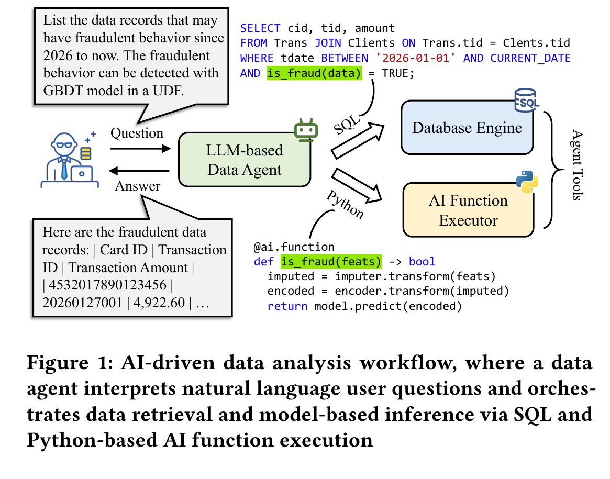

*图源：正式 PVLDB 2026 论文 Figure 1（PDF p.1，论文印刷页 4223），按原图裁切。读图时从左侧自然语言问题开始，沿两条生成路径分别看 SQL 查询与 Python `is_fraud` 函数，再回到数据库结果。该图说明 Agent 如何编排数据检索与模型推理，不是端到端性能或代码生成正确率的实验结果。*

1. 用户以自然语言向 LLM-based Data Agent 提问；
2. Data Agent 生成 SQL 查询，从数据库中完成精确的数据检索、Join 和过滤；
3. Data Agent 同时生成 Python UDF `is_fraud(feats)`；
4. SQL 在选择条件中调用该 AI Function；
5. UDF 内部依次执行数据补全、特征编码和 GBDT/XGBoost 推理；
6. 数据库返回被模型判定为可能欺诈的记录。

论文强调，将 AI Function 放进数据库执行路径的理由包括：

- 避免先将大量数据拉出数据库再推理；
- 私有数据仍保留在数据库保护环境中；
- Python 拥有更成熟的 AI 库生态，也便于 LLM 自动生成代码。

作者进一步给出工程观察：即使已经采用 IMBridge 的 model caching 和 desirable batching，**AI Function execution 仍占整个 AI-driven workflow 响应时间的 80% 以上**。因此本文不再主要优化 SQL 生成、Join 或模型选择，而聚焦 Python UDF-based AI Function 的执行。

## 1.2 数据库中支持 AI Function 的两种方式（Section 2.1.2）

### 方式一：AI functions as built-in functions

由数据库开发者使用 OceanBase 的开发语言 C++ 直接把模型推理实现为数据库内置函数。

优点：

- 使用 native code，执行性能较高。

缺点：

- C++ AI 生态不如 Python 易用；
- 引入、维护带 C++ binding 的外部 AI 库较复杂；
- 也可能需要手工实现模型推理；
- 新增函数会修改 kernel code，需要重新编译数据库；
- 开发周期长。

### 方式二：AI functions as Python UDFs

在数据库引擎中引入 Python runtime，使用户和数据库开发者能够用 Python 编写 AI Function。

优点：

- Python AI 库丰富；
- 语法和代码资源更适合 LLM code generation；
- 开发效率高；
- PostgreSQL、DuckDB、ClickHouse 已提供相关参考实现。

问题：

- 直接沿用现有 Python UDF 执行方式时，实际性能不能满足 OceanBase 的需求。

本文选择优化第二种方式，而不是把 Python UDF 全部改写为 C++ built-in function。

## 1.3 Figure 2：AI Function 如何进入数据库物理计划

Figure 2（第 4225 页）说明，AI Function 不是独立于 SQL 的另一个离线任务，而是作为 function-call expression 附着在关系算子上。

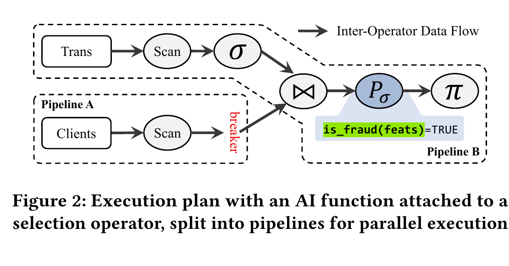

*图源：正式 PVLDB 2026 论文 Figure 2（PDF p.3，论文印刷页 4225），按原图裁切。先看 Join 处的 pipeline breaker：构建侧形成 Pipeline A，探测侧与带 `is_fraud` 的选择算子位于 Pipeline B。图中只展示计划切分和数据流，没有展示 IMLane 的异步调度机制。*

示例中：

- `is_fraud(feats)` 附着在 selection operator 上；
- Join 由于包含 hash-table build 等物化阶段，成为 pipeline breaker；
- Pipeline A 先扫描 `Clients` 并完成 Join 的构建侧工作；
- Pipeline B 扫描 `Trans`、与 Pipeline A 输出 Join，再执行包含 AI Function 的 selection；
- 数据库通过对不同 partition 运行多个 pipeline task 实现并行。

因此，原始系统中的 AI Function 并行度和执行时机，天然继承数据库 pipeline 的 partition-wise task scheduling。

---

## 1.4 Observation 1：Ineffective Parallel Execution（Section 2.2.1）

### 原始执行方式

数据库把一个 pipeline 切成多个 subtask，再把这些 task 分配给同一数据库进程中的多个线程。由于 Python interpreter 嵌入数据库进程，AI Function 也随这些线程并行调用。

### Figure 3 展示的根因

Figure 3（第 4225 页）把 `is_fraud` 拆成两类代码：

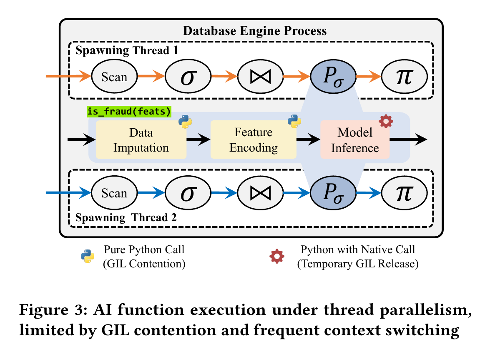

*图源：正式 PVLDB 2026 论文 Figure 3（PDF p.3，论文印刷页 4225），按原图裁切。两条数据库线程都会经过黄色的纯 Python 调用和红色的 native call；前者竞争同一个 Global Interpreter Lock（GIL），后者仅可能临时释放它。该图是瓶颈路径示意，不是线程切换次数或各阶段耗时的实测时间线。*

- **Pure Python Call**：例如 `imputer.transform`、`encoder.transform` 的 Python 调用及用户控制流；
- **Python with Native Call**：例如由 Python wrapper 调用 XGBoost 的 `model.predict`。

在标准 CPython 中：

1. pure Python 部分受 Global Interpreter Lock（GIL）约束，同一时刻只有一个线程执行；
2. native kernel 可能临时释放 GIL；
3. 当执行流返回 Python glue code 时，线程必须重新竞争 GIL；
4. 多个数据库 worker thread 因此频繁 acquire、contend、release GIL，产生上下文切换开销；
5. 增加数据库并行度并不能获得有效的线性加速。

### 作者对已有方案的判断（Section 3.1）

- Python 3.12 per-interpreter GIL、PEP 703 free-threading 仍较实验性，且很多 ML framework 不兼容；
- Jython、GraalPython 虽可绕过 GIL，但难以兼容依赖 CPython-specific native-call 特性的 ML framework；
- batching 可以减少调用次数并利用 ML framework 内部并行，但不能从根本上消除 GIL，CPU core 增加后仍受限。

由此提出第一个设计目标：**effective parallel AI function execution**。

---

## 1.5 Observation 2：Resource-mismatched Scheduling（Section 2.2.2）

### Figure 4：什么叫 coupled scheduling

Figure 4（第 4226 页）中，数据库 task scheduler 依据表 partition 生成 pipeline task，并把 task 分配到 CPU core。AI Function 附着在某个算子内部，因此它不能单独决定：

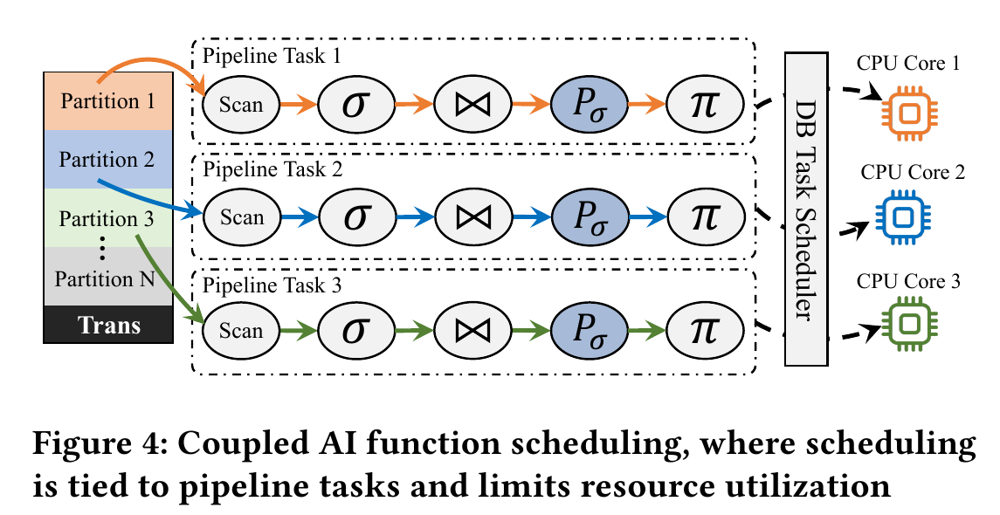

*图源：正式 PVLDB 2026 论文 Figure 4（PDF p.4，论文印刷页 4226），按原图裁切。沿左侧 partition 到中间 pipeline task，再到右侧 CPU core 读取，可以看到 AI Function 的执行份数和时机都继承数据库任务调度。该图解释耦合关系，不代表所有数据库都采用完全相同的分区大小或线程模型。*

- 使用多少并行资源；
- 何时提交；
- 是否与其他关系算子异步重叠；
- 是否使用 GPU 或远程 worker 的独立并行能力。

换言之，**AI Function scheduling 与 database pipeline task scheduling 被耦合在一起**。

### 为什么传统数据库调度器不适合所有 AI Function

数据库调度器主要面向 CPU-only、bulk analytical query。AI Function 却可能具有不同资源形态：

- 中等规模的增量数据；
- GPU accelerator；
- 远程 Ray Serve worker；
- serverless ML endpoint；
- remote GPU + vLLM。

原始调度器仍只依据 host CPU 和数据 partition 确定 task，并让整个 pipeline task 同步执行，因而会出现资源空闲。

由此提出第二个设计目标：**resource-matched AI function scheduling**。

---

## 1.6 Observation 3：Common Bottlenecks in Database Engines（Section 2.2.3）

作者在 OceanBase 和 DuckDB 上运行 Figure 1 的查询，随着计算资源增加，相比理想线性加速仍至少存在 **46.5% 的性能差距**。因此作者认为：

- GIL 与 coupled scheduling 不是 OceanBase 独有问题；
- 为每个数据库分别写一套定制优化会造成重复代码和维护成本；
- 应把 AI Function execution 做成 composable、database-agnostic component。

这构成 IMLane 第三个目标：**低成本地接入多个数据库引擎**。

---

# 2. 核心思想与贡献

论文的核心不是提出新的模型推理算法，而是重新划分数据库与 AI Function 之间的执行和调度边界。

| 论文识别的问题 | 根因 | IMLane 机制 | 目标 |
|---|---|---|---|
| 多线程 Python UDF 并行无效 | 多线程共享 CPython interpreter/GIL | process-level parallel AI function execution | 让整个 AI Function，而不只是 native kernel，能够有效并行 |
| 进程间传输可能抵消收益 | pickle、socket、RPC 等开销较高 | shared memory + semaphore + ArrowLane | 以较低 IPC 成本连接数据库进程和 executor process |
| AI Function 并行度绑定数据库 partition | database task scheduler 只理解 pipeline task/host CPU | resource-aware per-function scheduler | 按每个 AI Function 的资源需求独立扩展 |
| CPU 与 GPU/remote resource 串行空闲 | partition-wise synchronous scheduling | batch-wise asynchronous scheduling strategy | 让关系算子与异构推理重叠执行 |
| 不同数据库数据格式和执行接口不同 | 内核耦合与重复开发 | DBEnd interface、DataConverter、SchedPrimitive | 以较少代码接入多个数据库 |

论文贡献按原文概括为：

1. 将已有的 process-level parallel execution 适配到数据库 AI Function execution；
2. 引入 decoupled AI function scheduling，实现 lightweight、resource-matched scheduling；
3. 设计 composable architecture，并在 OceanBase、DuckDB 中集成；
4. 用 CPU、GPU、remote CPU、remote GPU 和 LLM workload 实验验证。

需要注意：论文自己称 process-level execution 是 **well-established** 技术；创新重点在于如何把它低开销、可组合地接入数据库，并进一步与独立 AI Function scheduler 结合。

---

# 3. Section 3：Effective Parallel Execution

## 3.1 Figure 5：从 thread-level 改为 process-level

Figure 5（第 4227 页）中：

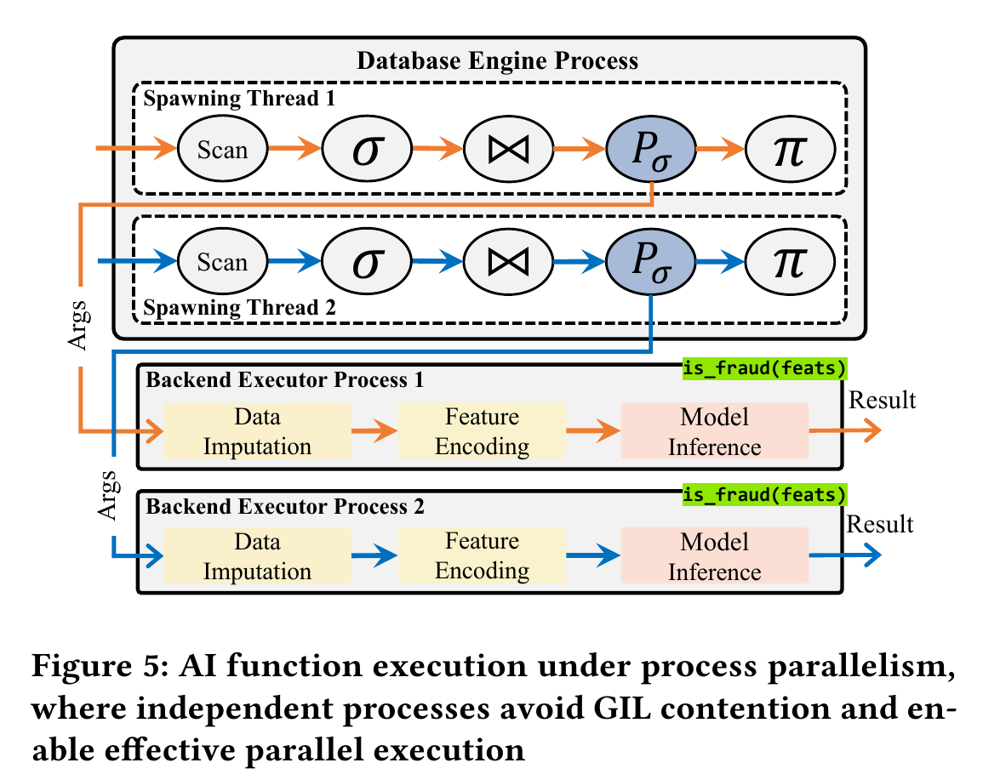

*图源：正式 PVLDB 2026 论文 Figure 5（PDF p.5，论文印刷页 4227），按原图裁切。上半部分仍是数据库线程执行关系算子，下半部分把数据补全、特征编码和模型推理整体放入不同 backend executor process；两种颜色表示两条独立调用路径。该图说明每个执行进程拥有独立 Python interpreter，并不构成故障隔离效果的定量证据。*

- 数据库进程仍由多个 spawning thread 执行 Scan、Join、selection 等关系算子；
- 每个 AI Function backend executor 是独立进程；
- 每个 executor process 有独立 Python interpreter 和独立 GIL；
- 数据库线程把参数传给某个 executor process；
- executor 完成数据预处理、特征编码和模型推理，再返回结果。

作者给出三项直接收益：

1. pure Python code 可以在多个进程中真正并行，不再竞争同一个 GIL；
2. Python-to-native call path 不再频繁竞争共享 GIL，降低 acquire/context-switch 开销；
3. fault isolation 更好，某个 AI Function 失败对数据库主进程的影响较小。

论文只从设计上论述第三项，**没有提供专门的故障注入实验**。

---

## 3.2 Shared-Memory-based Data Transfer（Section 3.2.1）

进程隔离会引入函数参数和结果的 IPC 开销。论文比较了几类替代方式：

- Dask、Python multiprocessing 常使用 pickle/cloudpickle；
- PySpark 通过 Py4J/socket 通信；
- Triton 等 serving system 还会增加 network RPC。

IMLane 选择：

- **shared memory**：数据库进程和 backend executor process 直接访问同一内存区域；
- **low-overhead semaphore**：协调 buffer 的读写和通知；
- **Apache Arrow**：作为统一的 in-memory intermediate format；
- **zero-copy capability**：与 shared memory 配合，减少跨进程复制。

### Lane 的精确定义

Section 3.2.1 中，一个 Lane 至少包含：

- 一个 input-argument buffer；
- 一个 output-result buffer；
- 两个与 buffer 对应的 semaphore；
- 封装后的 read/write/synchronization routine。

Lane 把共享内存和同步对象组织成一个统一的生命周期单元。调用方和被调用方取得 Lane 后，通过 Lane 完成参数与结果传输。

### Lane 的双重角色

论文在 Section 4 又把每个 executor 与一个 Lane 逻辑绑定。因此 Lane 同时承担：

1. **数据通道**：input/output buffer + synchronization；
2. **可调度资源单元**：一个 Lane 对应一个可用 backend executor 及其 CPU/GPU/remote resource unit。

这是理解 IMLane 名称和架构的关键。

---

## 3.3 Listing 1：Template-based Data Converter Interface

Listing 1（第 4227 页）定义 `DataConverter<ARGS, RET>`：

```cpp
template<typename ARGS, typename RET>
class DataConverter {
public:
    ArrowLane ToLaneFormat(ARGS *args);
    void FromLaneFormat(ArrowLane lane, RET &ret);
};
```

其中：

- `ArrowLane` 是 IMLane 的统一中间类型，本质上包装 Arrow Table；
- `ToLaneFormat`：把数据库内部输入转为 ArrowLane；
- `FromLaneFormat`：把 ArrowLane 结果转回数据库内部返回类型。

不同数据库通过 C++ template specialization 实现具体转换：

- OceanBase：`ObVector ↔ ArrowLane`；
- DuckDB：`DataChunk/Vector ↔ ArrowLane`。

作者认为，这把接入工作压缩为两个转换函数，并由编译器生成相应实例化代码，从而减少 boilerplate。

---

## 3.4 Extensible Backend Executor（Section 3.2.3）

论文实现两种 backend executor：

### Default Python Executor

- 直接在独立 CPython process 中运行 AI Function；
- 外部依赖少；
- 是论文默认、性能更高的实现。

### Ray Executor

- 每个 parallel executor 被封装为 stateful Ray Actor；
- ArrowLane 数据通过 Ray global object store 传递；
- 适用于企业已经部署 Ray 的环境。

作者将 ONNX Runtime executor 作为未来工作，论文没有实现或评测。

---

## 3.5 Algorithm 1：Process-level parallel AI function execution

### 输入

- AI Function `AIFunc`；
- 一个可用于数据传输的 `Lane`。

### 数据库端步骤（Algorithm 1 Lines 2–8）

1. 实例化 `DataConverter`；
2. 用 `ToLaneFormat` 把 `call_args` 转成 Arrow-based `args`；
3. `Lane.WriteAndPost(args, INPUT)`：写入 input buffer，并通过 semaphore 通知 backend；
4. `Lane.WaitAndRead(OUTPUT)`：等待 backend 写回结果；
5. 用 `FromLaneFormat` 转回数据库内部 `ret`；
6. 返回 `ret`，继续后续查询执行。

### Backend Executor 步骤（Algorithm 1 Lines 10–13）

1. `Lane.WaitAndRead(INPUT)`；
2. 调用 `AIFunc(args)` 得到 `res`；
3. `Lane.WriteAndPost(res, OUTPUT)`，写入 output buffer 并通知数据库端。

### 为什么这样设计

- 独立进程解决 GIL 竞争；
- shared memory 避免 socket/network 软件栈；
- Arrow 降低不同数据库数据格式之间的转换成本；
- semaphore 既保证同步，也避免数据库端无序读取未完成结果。

### 简化执行图

```text
Database pipeline thread
        |
        | 1. DB format -> ArrowLane
        | 2. write input + post semaphore
        v
+-------------------------------+
| Lane                          |
| input buffer / output buffer  |
| input sem / output sem        |
+-------------------------------+
        |
        | 3. read input
        v
Backend Executor Process
  CPython interpreter
  AIFunc preprocessing + inference
        |
        | 4. write result + post semaphore
        v
Lane -> DB reads -> ArrowLane -> DB result
```

---

# 4. Section 4：Resource-Matched Scheduling

## 4.1 Section 4.1 的三个 user scenarios

| Scenario | 数据与资源形态 | Coupled scheduling 是否合适 | 论文指出的问题 |
|---|---|---|---|
| Scenario 1: Bulk Data Inference | 全量历史数据、host CPU-only | 通常基本合适 | 数据分区多，CPU 通常已充分利用，进一步调度空间有限 |
| Scenario 2: Incremental Inference | 中等规模的新到数据，例如最近七天 | 不合适 | 粗粒度 partition 数量可能少于 CPU core，导致 AI Function 获得的并行 task 不足 |
| Scenario 3: Heterogeneous Inference | GPU、remote Ray Serve、serverless endpoint 等 | 不合适 | DB scheduler 只按 host CPU 决定并行度，并强制 pipeline task 同步执行，CPU 与异构资源不能重叠 |

### Scenario 2 的具体粒度

论文列出：

- OceanBase 以多个 macro data block 的大小作为 partition，约 **2 MB–128 MB**；
- DuckDB 一个 row group 为 **122,880 rows**。

Figure 6（第 4229 页）中，增量 `Trans` 只有两个 partition，数据库只产生两个 pipeline task，即使有三个 CPU core，也会留下一个 core 空闲。

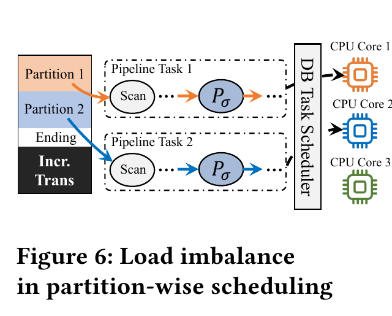

*图源：正式 PVLDB 2026 论文 Figure 6（PDF p.7，论文印刷页 4229），按原图裁切。两个增量 partition 只能产生两条 pipeline task，因此第三个 CPU core 没有工作。这里用两个分区和三个核心说明粒度问题，是示意例，不是一次真实运行的资源追踪。*

### Scenario 3 的同步空闲

Figure 7（第 4229 页）显示：

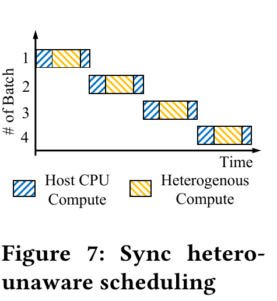

*图源：正式 PVLDB 2026 论文 Figure 7（PDF p.7，论文印刷页 4229），按原图裁切。每个 batch 先后经过蓝色 host CPU 计算、黄色异构计算，再回到 host CPU；相邻 batch 也没有形成重叠。该时间线只解释同步执行为何产生空闲，不能据此读取实际利用率或加速比。*

- 异构资源执行 AI Function 时，host CPU 等待；
- host CPU 执行关系算子时，异构资源空闲；
- 两类资源在时间线上交替，而不是重叠。

---

## 4.2 Resource-aware Per-function Scheduler（Section 4.2.1）

IMLane 为**每一个 AI Function**维护独立 scheduler，而不是让它完全服从数据库 task scheduler。

### 资源抽象

- 每个 AI Function executor 与一个 Lane 逻辑绑定；
- 一个 Lane 聚合一组 resource units，例如 CPU core、GPU unit 或 remote resource unit；
- 可用 Lane 数量表示该 AI Function 当前可以使用的并行度。

### Lane 数量的确定

论文给出两种方式：

1. 用户根据 workload knowledge 手工指定；
2. 系统自动估计：从保守 Lane count 开始逐步增加，直到性能不再提升，或新 executor 因 CPU core、GPU memory、remote worker 不足而创建失败。

论文没有进一步给出自动估计的伪代码、采样周期、性能稳定判定或多查询干扰处理方法。

### Figure 8 的四步调度流程

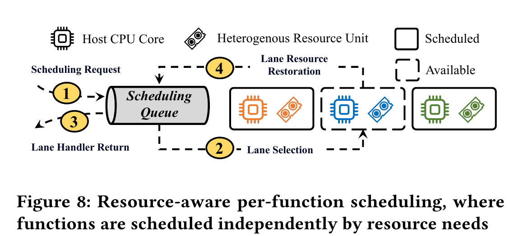

*图源：正式 PVLDB 2026 论文 Figure 8（PDF p.7，论文印刷页 4229），按原图裁切。按黄色编号依次读取：请求进入队列、选择可用 Lane、返回 Lane handler、执行结束后恢复 Lane 资源。实线框表示已分配，虚线框表示可用；图中没有描述多查询公平性、优先级或服务等级目标。*

1. pipeline task 调用 AI Function 时，向对应 Function Scheduler 发出 scheduling request；
2. scheduling queue 选择一个 available Lane；
3. scheduler 把 Lane handler 返回给 pipeline task；
4. AI Function 完成后，Lane 返回 queue，表示相关资源恢复可用。

### 论文明确写出的 limitation

Section 4.2.1 是全文最明确的限制说明：

> IMLane 用统一抽象同时调度 local 与 heterogeneous AI Function，虽然实现轻量且通用，但可能忽略 latency、data movement 和 resource ownership 的差异，从而限制调度效果；更 specialized 的 scheduling 留作未来工作。

---

## 4.3 Listing 2：Asynchronous Scheduling Primitive

Listing 2（第 4229 页）定义：

```cpp
std::optional<std::future<RET>>
AsyncSchedFunc(string &func, ARGS &args);
```

两个返回层次分别表达：

- `std::optional`：当前是否获得可用 Lane/资源；
- `std::future<RET>`：AI Function 已提交，但结果将在未来完成。

与同步调用不同，数据库 scheduling thread 不必阻塞等待推理结果，可以继续执行其他关系操作或请求下一个 vectorized batch。

---

## 4.4 为什么使用 batch-wise，而不是 partition-wise

现代数据库通常采用 vectorized execution：

- 一个大 partition 会进一步被切成多个较小 data chunk batch；
- pipeline task 对每个 batch 逐个执行算子链；
- AI Function 本来就会在 batch 上被调用。

IMLane 直接利用这个已有的细粒度单元，把 AI Function 调度单位从大 partition 下沉为 vectorized batch。

需要区分：这里的 **batch-wise scheduling** 重点是“以 batch 为调度和异步提交单位”，不等同于 IMBridge 的 desirable batching，也不意味着一定把多个 batch 再合并成更大的模型 batch。

---

## 4.5 Algorithm 2：Batch-wise asynchronous scheduling strategy

### 输入

- AI Function `AIFunc`；
- `SchedPrimitive` 实例 `sched`。

### 每个 AI Function 的局部状态

- `pending`：保存已经异步提交、尚未全部收回结果的 future queue；
- `state`：取值为 `SCHEDULE` 或 `OUTPUT`。

### SCHEDULE 状态（Algorithm 2 Lines 7–12）

1. 调用 `sched.AsyncSchedFunc(AIFunc, batch_n)`；
2. 若 optional 中有 future，说明获得了 Lane：
   - 把 future 放入 `pending`；
   - 立即请求下一个 `batch_{n+1}`；
3. 若 optional 为空，说明当前没有可用 Lane，切换到 `OUTPUT`。

### OUTPUT 状态（Lines 13–16）

1. poll `pending` 中的 futures；
2. 找出已经完成的 `ready_futrs`；
3. 一旦至少有结果完成，收集结果并重新切回 `SCHEDULE`；
4. 对应 Lane 被归还后，新 batch 可以继续提交。

### 查询结束时（Lines 18–22）

对 `pending` 中剩余 future 逐个 blocking wait，确保所有 AI Function 结果被收集。

### 按 Algorithm 2 展开的执行例

```text
batch0 -> 获得 Lane0 -> future0 入 pending
batch1 -> 获得 Lane1 -> future1 入 pending
batch2 -> 无可用 Lane -> state = OUTPUT
         poll future0/future1
future0 完成 -> 收集结果、Lane0 归还 -> state = SCHEDULE
batch2 -> 获得 Lane0 -> future2 入 pending
...
查询输入耗尽 -> sched_final() 等待并收回剩余 future
```

### Figures 9–10 说明的作用

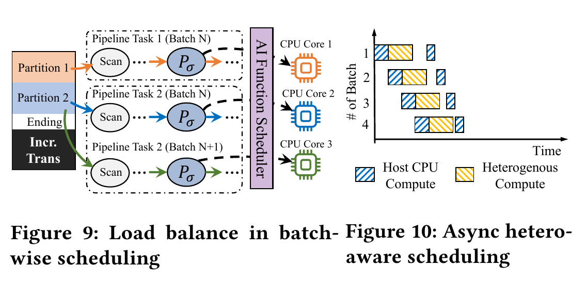

*图源：正式 PVLDB 2026 论文 Figures 9–10（PDF p.8，论文印刷页 4230），按同页原图联合裁切。左图把同一 partition 的后续 batch 继续分给空闲 CPU/Lane，右图让不同 batch 的 host CPU 阶段与异构阶段在时间上交错。两图用于解释调度动作，不能单独证明端到端加速或调度开销可忽略。*

- **Figure 9**：不同 batch 可以越过原 partition 数量限制，持续填充更多 CPU/Lane，改善 incremental inference 的负载均衡；
- **Figure 10**：host CPU 可以继续关系操作，同时 heterogeneous resource 执行 AI Function，实现计算重叠。

论文对 Scenario 1 的表述较谨慎：batch-wise 可能增加调度和数据传输频率，但 Section 6.3 中未观察到可测量的额外开销。

---

# 5. Section 5：Composable Framework Design

## 5.1 Figure 11：系统架构

Figure 11（第 4231 页）把 IMLane 分成三个主要组件。

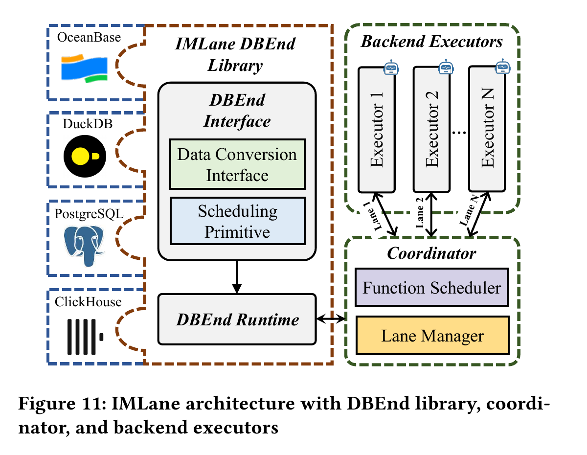

*图源：正式 PVLDB 2026 论文 Figure 11（PDF p.9，论文印刷页 4231），按原图裁切。由左向右读取：数据库通过 DBEnd 的数据转换接口和调度 primitive 接入；Coordinator 管理函数调度与 Lane；独立 backend executor 负责实际执行。图中 PostgreSQL、ClickHouse 表示可接入对象，论文只报告 OceanBase 与 DuckDB 的实现和实验。*

### 1. DBEnd Library

作为数据库开发者的接入入口，可编译并链接到数据库引擎，包括：

- **DBEnd Interface**
  - Data Conversion Interface；
  - Scheduling Primitive；
- **DBEnd Runtime**
  - 使用数据库实现的数据转换接口；
  - 调用 scheduling primitive；
  - 与 Coordinator 交互并驱动 AI Function scheduling。

### 2. Coordinator

IMLane 的核心控制组件，包括：

- **Function Scheduler**：处理 DBEnd Runtime 发来的 scheduling request；
- **Lane Manager**：管理 Lane 的生命周期，包括跨进程共享资源和绑定的 compute resource units。

### 3. Backend Executors

- 每个 executor 在独立进程中嵌入执行 runtime，例如 CPython；
- 执行指定 AI Function；
- 通过 Lane 接收参数和返回结果。

### 简化架构图

```text
Database Engine
  AI Operator / pipeline task
            |
            v
+-------------------------------+
| IMLane DBEnd Library          |
| - Data Conversion Interface   |
| - Scheduling Primitive        |
| - DBEnd Runtime               |
+-------------------------------+
            |
            v
+-------------------------------+
| Coordinator                   |
| - Function Scheduler          |
| - Lane Manager                |
+-------------------------------+
       | Lane1 | Lane2 | ... | LaneN
       v       v            v
 Executor1 Executor2 ... ExecutorN
 (Python/Ray backend processes)
```

Figure 11 画出了 PostgreSQL 和 ClickHouse 作为潜在接入对象，但论文实际只报告了 OceanBase 和 DuckDB 的集成，不能把图中出现的系统当作已完成实现。

---

## 5.2 Integration with OceanBase（Section 5.2.1）

- 集成代码约 **800 lines**；
- 新增一个物理算子 **AI operator**；
- 对 OceanBase 的 `ObVector` 实现具体 table/data conversion；
- 用 OceanBase pull-based vectorized volcano interface，例如 `next()`，实现 Algorithm 2 的 batch-wise asynchronous scheduling。

## 5.3 Integration with DuckDB（Section 5.2.2）

- 集成代码约 **500 lines**；
- 同样新增 AI operator；
- 复用 DuckDB 现有 `ArrowConverter`，把输入 `DataChunk` 和输出 `Vector` 与 Arrow 格式互转；
- DuckDB 使用 push-based vectorized execution，因此 AI operator 通过返回 `NEED_MORE_INPUT`，让 query engine 推送下一个 batch。

## 5.4 “Composable”在本文中的具体含义

论文所谓 composable 不是完全零改动地外接服务，而是：

- IMLane 的执行、调度和 Lane 管理逻辑保持在独立框架中；
- 数据库只需实现 DBEnd interface，并在执行引擎中接入 AI operator；
- 不同数据库可复用相同 Coordinator、Lane 和 Backend Executor 设计。

OceanBase 的 800 LOC 与 DuckDB 的 500 LOC 是论文对较低 integration effort 的主要工程证据。

---

# 6. Section 6：实验分析

## 6.1 Experimental Setting（Section 6.1）

### 本地服务器

- Intel Xeon Gold 6240R @ 2.40 GHz；
- 48 physical cores；
- 128 GB DDR4；
- 论文表述为 24 TB RAID controller/configuration；
- NVIDIA Tesla V100 GPU。

### 远程环境

共四台服务器，每台：

- Intel Xeon Gold 6248R @ 3.00 GHz；
- 48 physical cores；
- 256 GB DDR4；
- NVIDIA RTX A6000，48 GB GDDR6。

### 软件

- Ubuntu 20.04；
- Docker 26.1.4；
- Python 3.11；
- OceanBase Paetica 4.3；
- DuckDB 0.10.1；
- PySpark 3.5.7；
- Ray 2.49.2；
- vLLM 0.19.1。

### Datasets

- Flights；
- Expedia；
- TPCx-AI；
- NbBench；
- SemBench。

### Table 1：Q1–Q7

| ID | Application | Dataset | Model | User Scenario |
|---|---|---|---|---|
| Q1 | Codeshare Prediction | Flights | RF | Bulk Data Inference |
| Q2 | Rank Prediction | Expedia | GBDT | Bulk Data Inference |
| Q3 | Hardware Failure | TPCx-AI | SVM | Incremental Inference |
| Q4 | Spam Detection | TPCx-AI | NB | Incremental Inference |
| Q5 | Antigen-Nanobody Binding Prediction | NbBench | DNN | Heterogeneous Inference |
| Q6 | Price Prediction | TPCx-AI | RNN | Heterogeneous Inference |
| Q7 | Sentiment Classification | SemBench | LLM | Heterogeneous Inference |

查询与 AI Function 由 Codex-backed data agent 生成。

### 数据规模与部署

- Q1–Q2：Join 后扩展到 **10 GB、20M–40M rows**；
- Q3–Q4：增量表 **1M rows**，代表十天数据；
- Q5：本地 GPU-accelerated DNN；
- Q6：RNN 通过 Ray Serve 部署在 remote CPU workers；
- Q7：SemBench Movie reviews 的 query 3，Qwen3 1.7B 部署在 remote GPU servers，使用 vLLM；
- Q5–Q7 默认均使用 **1M-row data table**。

---

## 6.2 Baseline、实验变体与指标

### 数据库内方案

| 标记 | 含义 |
|---|---|
| `OB` / `DuckDB` | 原始数据库 Python UDF，thread-level parallel execution |
| `(IMBridge)` | 使用 IMBridge 的 desirable batching 等优化，仍受 thread/GIL 约束 |
| `(IMLane, exec)` | 只启用 process-level execution，AI Function scheduling 仍与 DB coupled |
| `(IMLane, sched)` | process-level execution + decoupled scheduling，完整核心方案 |
| `(IMLane, ray, exec/sched)` | 把默认 Python backend 换成 Ray Actor backend |

### 数据库外方案

- pandas；
- SparkSQL；
- Ray.data。

这些方案先从 OceanBase 拉取数据，再在数据库外执行 AI Function。

### 主要指标

- end-to-end execution time；
- IPC/data-transfer overhead；
- host CPU、GPU、remote CPU、remote GPU utilization；
- 随资源数量增加时的 speedup/scalability。

论文未把模型准确率作为实验指标，主要验证执行系统性能。

---

## 6.3 Section 6.2：Effective Parallel Execution

实验使用 16 个 host CPU。

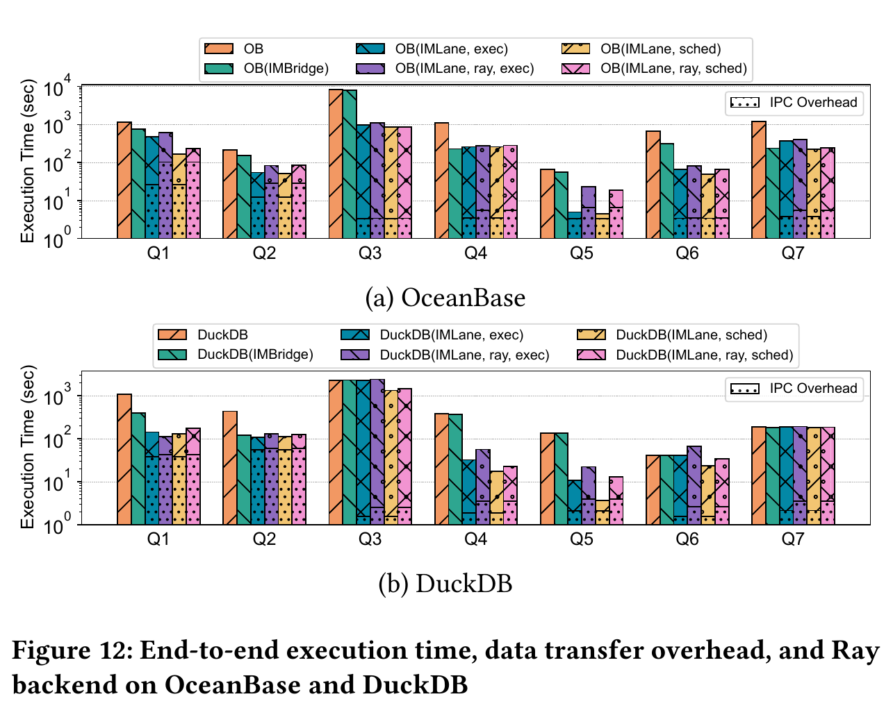

*图源：正式 PVLDB 2026 论文 Figure 12（PDF p.10，论文印刷页 4232），按原图裁切。上、下两组分别是 OceanBase 与 DuckDB，纵轴为对数刻度的执行时间，柱越低越好；同一查询内依次比较原始系统、IMBridge、仅并行执行、再加入调度以及 Ray backend，柱底点状区域表示 IPC 开销。绝对时间跨查询相差很大，应在同一查询和数据库内比较，不能把某个查询的优势外推到任意 AI Function。*

### Figure 12(a)：OceanBase

| 方案 | 相对原始 OB 的平均加速 |
|---|---:|
| OB(IMBridge) | 2.03× |
| OB(IMLane, exec) | **5.47×** |

作者解释：

- IMBridge 可减少 Python invocation/runtime switch，并利用部分 ML framework 内部并行；
- 但 pure-Python preprocessing 较多的 Q3 仍受 GIL 约束；
- IMLane 通过多个独立进程并行整个 AI Function，因此所有阶段都能绕过共享 GIL。

### Figure 12(b)：DuckDB

| 方案 | 相对原始 DuckDB 的平均加速 |
|---|---:|
| DuckDB(IMBridge) | 1.40× |
| DuckDB(IMLane, exec) | **3.33×** |

DuckDB 的默认 batch size 为 2048，OceanBase 为 256，因此 DuckDB 留给 desirable batching 的优化空间更小。

论文指出三个例外/弱收益点：

- Q3：仍受 coupled scheduling 的 load imbalance 约束；
- Q6、Q7：DuckDB 的 Python UDF 在 remote inference 期间能释放 GIL，而 OceanBase 在整个 AI Function 执行中保持 GIL，因此 process-level execution 在 DuckDB 上的相对收益较小。

### IPC overhead

- OB(IMLane, exec)：IPC 平均占 execution time 的 **14.8%**；
- DuckDB(IMLane, exec)：平均占 **15.5%**。

作者据此声称 shared-memory-based transfer 的开销相对于 process-level speedup 是可接受的。

### 这一组实验真正证明了什么

论文支持：

- 对这些 Python UDF workload，GIL 是 thread-level scaling 的重要瓶颈；
- process-level execution 能显著改善两种数据库的端到端时间；
- shared-memory/Arrow IPC 没有抵消并行收益。

论文没有单独证明：

- 所有 Python UDF 都一定适合多进程；
- process replication 的内存成本总是可忽略；
- fault isolation 在真实故障场景中的定量收益。

---

## 6.4 Section 6.3：Resource-Matched Scheduling

### OceanBase

- OB(IMLane, sched) 相对 OB(IMLane, exec) 平均再提升 **1.37×**；
- 即使是 Bulk Q1，也有 **1.09×**，作者归因于 disk scan I/O 与 AI Function execution 的重叠；
- 对 Q3–Q7，论文写道 coupled `exec` 平均比 `sched` 慢 **17.6%**。

### DuckDB

- DuckDB(IMLane, sched) 相对 DuckDB(IMLane, exec) 平均提升 **1.51×**；
- Q3–Q6 平均提升 **1.71×**；
- Q1–Q2 收益较小，因为 DuckDB 是 memory-based database，CPU 在大部分执行时间已经饱和；
- DuckDB 的 partition 更粗，因此 Q3/Q4 的 incremental load imbalance 更严重，batch-wise scheduling 收益更明显。

### Figure 13：Resource utilization

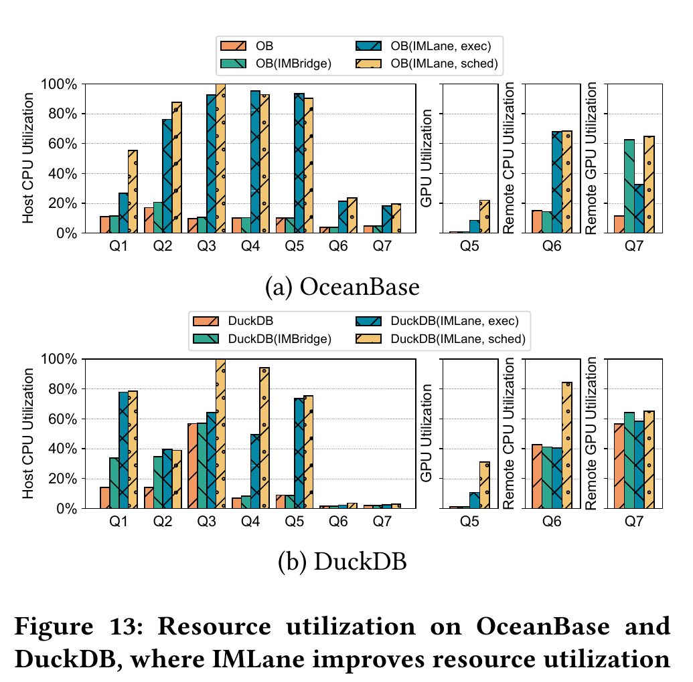

*图源：正式 PVLDB 2026 论文 Figure 13（PDF p.10，论文印刷页 4232），按原图裁切。上、下两组分别对应 OceanBase 与 DuckDB；左侧比较 Q1–Q7 的 host CPU，右侧再展开 Q5 的本地 GPU、Q6 的远程 CPU 和 Q7 的远程 GPU。该指标是 AI Function 执行期间的平均利用率，不是完整查询生命周期的连续资源曲线。*

论文报告：

- 原始 OceanBase、DuckDB 及其 IMBridge variant 的利用率通常低于 60%；
- 仅启用 process-level execution 后：
  - OceanBase 平均 utilization 相对原始系统提高 **500.7%**；
  - DuckDB 提高 **302.6%**；
- 再启用 decoupled scheduling 后：
  - OceanBase 在 `exec` 基础上再提高 **39.1%**；
  - DuckDB 再提高 **52.8%**。

对 Q5–Q7，Figure 13 同时展示 host CPU 与 heterogeneous resource utilization，作者认为这验证了 asynchronous scheduling 的 computation overlap。

### 这一组实验真正证明了什么

论文支持：

- 仅解决 GIL 不足以获得全部可扩展性；
- incremental workload 的粗 partition 会限制可用 AI Function parallelism；
- heterogeneous workload 中，异步调度可提高 host 和 remote/accelerator 的重叠利用。

论文没有研究：

- 多租户公平性；
- priority/SLO；
- 不同 AI Function 之间的资源竞争；
- Lane 自动扩缩的稳定性和控制开销。

---

## 6.5 Section 6.4.1：Resource Scalability Study

Figure 14（第 4233 页）逐步增加每个 query 的主要资源：

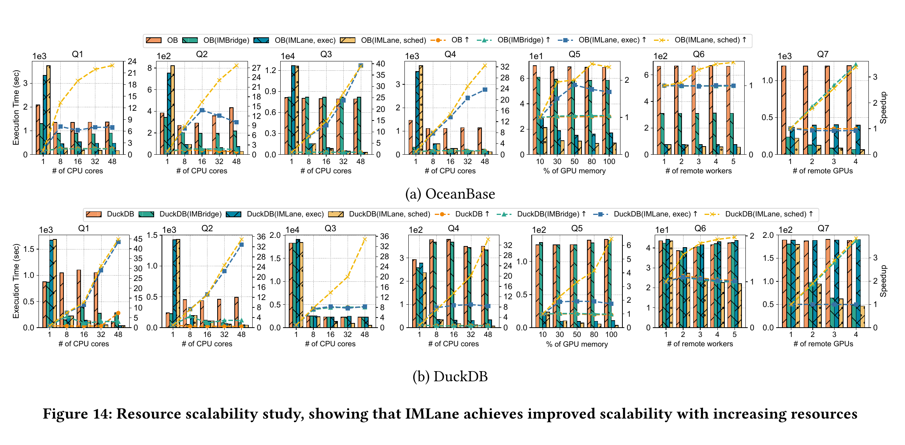

*图源：正式 PVLDB 2026 论文 Figure 14（PDF p.11，论文印刷页 4233），按原图裁切。每个小图用柱表示执行时间、虚线表示相对最小资源配置的 speedup；上排是 OceanBase，下排是 DuckDB。Q1–Q4、Q5、Q6、Q7 的横轴资源类型与纵轴量级不同，只能观察各自随资源增加的趋势，不宜横向比较不同查询的绝对柱高。*

- Q1–Q4：CPU cores 1、8、16、32、48；
- Q5：GPU memory percentage 10%、30%、50%、80%、100%；
- Q6：remote workers 1–5；
- Q7：remote GPUs 1–4。

Speedup 定义为：

```text
最小资源配置下的执行时间 / 增加资源后的执行时间
```

作者总结：

1. 原始数据库和 IMBridge 多数 query 受 GIL 限制；
2. `(IMLane, exec)` 初期能够随资源扩展，但 Q3–Q7 最终因 coupled scheduling 而停止增长；
3. `(IMLane, sched)` 可独立扩展 AI Function，随着资源增加仍保持更好的 speedup 增长。

Figure 14 主要提供曲线和柱状图，论文正文没有列出所有资源点的精确数值表，因此本笔记不从图中自行估算未报告的具体值。

---

## 6.6 Section 6.4.2：Ray Backend Executor

| 系统 | Ray exec 相对原始数据库 | Ray sched 相对 Ray exec |
|---|---:|---:|
| OceanBase | 3.74× | 再提升 1.35× |
| DuckDB | 2.58× | 再提升 1.37× |

结论：Ray backend 仍能复现 process-level execution 与 decoupled scheduling 的方向性收益，但平均 execution time 比 default executor **慢 61.6%**。

作者把差距归因于调用 Ray runtime 时更高的 data transfer 与 invocation overhead。

这说明 IMLane 的 Backend Executor 接口具有可扩展性，但也说明 composability 并不意味着不同 backend 的性能相同。

---

## 6.7 Section 6.4.3：与 pandas、SparkSQL、Ray.data 比较

Figure 15（第 4234 页）报告：

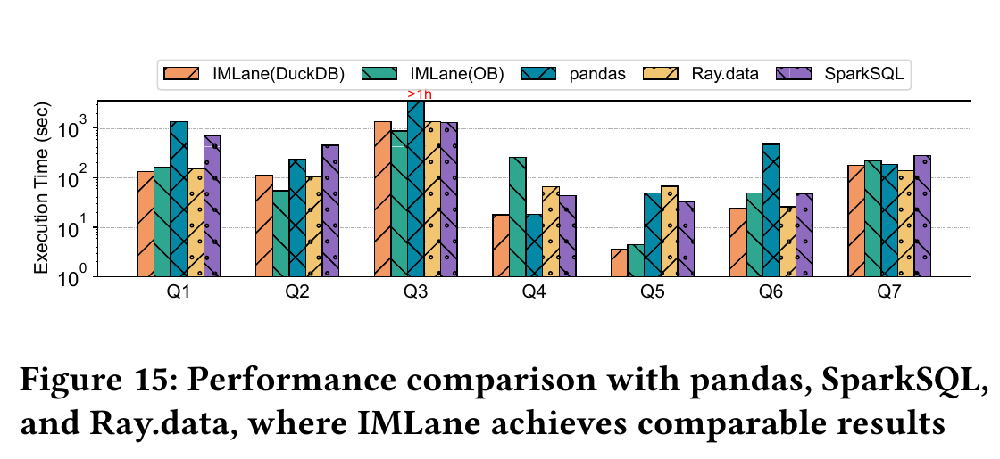

*图源：正式 PVLDB 2026 论文 Figure 15（PDF p.12，论文印刷页 4234），按原图裁切。纵轴是对数刻度的端到端执行时间，柱越低越好；Q3 中 pandas 超过 1 小时，以红色标记表示超出绘图区。比较包含外部系统从 OceanBase 拉取数据的开销，因此它反映论文设定下的完整执行路径，不等于对这些框架在任意数据源和工作负载上的通用排名。*

| 对比对象 | IMLane(OB) | IMLane(DuckDB) |
|---|---:|---:|
| pandas | 2.65× faster | 4.02× faster |
| SparkSQL | 1.87× faster | 2.82× faster |
| Ray.data | 1.19× faster | 1.80× faster |

作者给出两点原因：

1. SparkSQL 和 Ray.data 虽然也使用 process parallelism，但必须先把数据从数据库中加载出来，并承担 socket-based IPC，Q1/Q2 的 bulk data inference 尤其受影响；
2. 它们的 AI Function scheduling 同样不能完全匹配不同资源需求，Q5/Q6 的 heterogeneous inference 尤其明显。

论文据此声称 IMLane 在避免数据移出数据库的同时，达到或优于这些外部执行方案。

---

## 6.8 Section 6.4.4：LLM-based AI Function 的结果

Q7 使用 Qwen3 1.7B、remote GPU 和 vLLM。

论文明确报告：

- `(IMLane, sched)` 的表现接近 IMBridge；
- 在 DuckDB 上，相比 `(IMLane, exec)` 只有约 **1.05×** 提升；
- 原因是 LLM inference 计算量高，并通常已有 continuous batching；
- 在当前硬件下，默认 batch size 或 IMBridge-controlled batching 已经饱和 GPU，留给额外 scheduling/computation overlap 的空间很小。

作者只提出一种可能性：若计算资源足够充裕，IMLane scheduling 仍“可能”发挥作用。论文没有用实验验证这一条件。

这一结果很重要，因为它限定了全文结论：IMLane 在 ML/DL、incremental 和 heterogeneous workload 上收益明显，但**不能据此声称对已经被 vLLM continuous batching 饱和的 LLM serving workload 仍有同等调度收益**。

---

## 6.9 实验结果总表

| 机制/对比 | OceanBase | DuckDB | 论文支持的结论 |
|---|---:|---:|---|
| 完整 IMLane vs 原始 DB | 7.48× | 5.04× | 两种数据库均有显著平均端到端加速 |
| Process-level `exec` vs 原始 DB | 5.47× | 3.33× | 绕过共享 GIL 是主要收益来源之一 |
| IMBridge vs 原始 DB | 2.03× | 1.40× | batching 有效但仍受 GIL 限制 |
| `sched` vs `exec` | 1.37× | 1.51× | 独立调度和异步重叠带来额外收益 |
| IPC 占比 | 14.8% | 15.5% | shared-memory data transfer 开销可被并行收益摊销 |
| Ray backend vs default backend | 论文未单列 | 论文未单列 | 跨两种数据库平均慢 61.6%，说明 backend 可替换但 Ray 有额外调用和传输开销 |
| Q7 `sched` vs `exec` | 未单独给出 | 约 1.05× | vLLM 已饱和时，额外调度收益有限 |

> 注：上表“Ray backend vs default backend”的结论是跨 OceanBase 和 DuckDB 的论文平均值，不是某一单独数据库的数值。

---

# 7. 关键 Figure、Table、Listing、Algorithm 索引

| 编号 | 内容 | 关键意义 |
|---|---|---|
| Figure 1 | Data Agent + SQL + Python AI Function 的欺诈检测 workflow | 给出应用背景与 in-database AI Function 位置 |
| Figure 2 | 带 AI Function 的 physical plan 与 pipeline split | 说明 AI Function 附着在关系算子并继承 pipeline scheduling |
| Figure 3 | thread parallelism 下的 GIL contention | 说明 pure Python 串行和 Python/native 反复切换 |
| Figure 4 | coupled AI function scheduling | 说明 AI Function 并行度与 DB partition task 绑定 |
| Figure 5 | process-level parallel execution | 每个 backend process 拥有独立 interpreter/GIL |
| Listing 1 | Data conversion interface | 用 ArrowLane 屏蔽不同数据库内部格式 |
| Algorithm 1 | process-level execution procedure | 描述 DB↔Lane↔Backend 的双向传输与同步 |
| Figure 6 | incremental partition-wise load imbalance | 两个 partition 只能使用两个 core |
| Figure 7 | synchronous hetero-unaware scheduling | host CPU 与 heterogeneous resource 交替空闲 |
| Figure 8 | resource-aware per-function scheduler | request、Lane selection、handler return、resource restoration |
| Listing 2 | asynchronous scheduling primitive | optional 表示是否有资源，future 表示异步结果 |
| Algorithm 2 | batch-wise asynchronous scheduling | SCHEDULE/OUTPUT 状态机和 pending futures |
| Figure 9 | batch-wise load balance | 细粒度 batch 跨更多 Lane 执行 |
| Figure 10 | async hetero-aware scheduling | host 与 heterogeneous computation 重叠 |
| Figure 11 | IMLane architecture | DBEnd Library、Coordinator、Backend Executors |
| Table 1 | Q1–Q7 workloads | 覆盖 bulk、incremental、heterogeneous 三类场景 |
| Figure 12 | end-to-end time、IPC、Ray backend | 分离验证 `exec` 和 `sched` 的性能作用 |
| Figure 13 | resource utilization | 展示 host/heterogeneous utilization 改善 |
| Figure 14 | resource scalability | 说明 process-only 最终受 coupled scheduling 限制 |
| Figure 15 | pandas、SparkSQL、Ray.data 对比 | 展示数据库内执行与资源匹配的综合优势 |

---

# 8. 与相关工作的关系（Section 7）

## 8.1 Alternative AI Function Execution Systems

- BigQuery、Snowflake、Apache Doris、Databricks：提供 built-in AI Function，但 runtime 与系统耦合，较难复用于其他数据库；
- pandas：单线程、需把表拉出数据库；
- SparkSQL：用 Python UDF 和数据并行；
- Ray.data：基于 Ray task parallelism 扩展数据处理。

IMLane 的区别是：

- 接入数据库执行引擎；
- 不把整套数据分析移到数据库外；
- 针对 GIL 与 resource-mismatched scheduling 两个共同瓶颈；
- 以 composable framework 的方式复用于不同数据库。

## 8.2 与 IMBridge 的关系

根据本文自己的描述：

- IMBridge 重点通过 model caching、desirable batching 等方式缓解 prediction query execution 与 database engine 的 mismatch；
- batching 减少 Python invocation 并利用 ML framework 内部并行；
- 但执行仍基于 thread-level Python runtime，不能消除 GIL；
- IMLane 在此基础上进一步改变执行隔离单元和调度边界。

因此在 Figure 12 中，IMBridge 是一个重要 baseline，而不是 IMLane 的完整替代方案。

## 8.3 其他 in-database AI optimization

论文将 Raven、Smart、LingoDB、SDQL、EvaDB、Aero、MASQ、Craftsman、SmartLite、LEADS、PEPS 等归入：

- model pruning；
- predicate generation；
- compilation；
- result caching；
- SQL translation；
- graph optimization；
- state/memory reuse。

作者认为 IMLane 聚焦 parallelization 和 scheduling，与这些优化大体正交、可互补。

## 8.4 Composable Database System

论文把 IMLane 放在 composable database 趋势中，与以下工作类比：

- parser/analyzer：ZetaSQL、CoreSQL、libpgquery；
- optimizer/planner：Calcite、Orca、Substrait；
- execution engine：Velox、DataFusion、BOSS；
- data transfer：Vineyard、XDBC。

IMLane 试图成为“AI Function execution”这一层的可组合组件。

---

# 9. 优点与局限

## 9.1 论文内容支持的优点

### 优点 1：问题定位来自数据库内部执行机制

论文没有只说“Python 慢”，而是把问题分解为：

- execution parallelism 受 GIL 限制；
- scheduling parallelism 受 database partition/pipeline 绑定；
- heterogeneous resource 无法与 host relational work 重叠。

### 优点 2：执行与调度两个机制可以分离验证

实验把 `(IMLane, exec)` 和 `(IMLane, sched)` 分开，能够判断：

- process-level execution 带来多少收益；
- decoupled scheduling 在其上再带来多少收益。

### 优点 3：Lane 同时统一数据传输和资源管理

Lane 把共享内存、信号量、backend executor 和 compute resource unit 连接起来，使 data plane 与 scheduling plane 使用同一生命周期对象。

### 优点 4：跨两种数据库验证可组合性

OceanBase 和 DuckDB 的执行模型不同：

- OceanBase：pull-based；
- DuckDB：push-based。

论文分别用 `next()` 和 `NEED_MORE_INPUT` 接入 Algorithm 2，并报告 800/500 LOC。

### 优点 5：覆盖多种资源场景

Q1–Q7 覆盖：

- CPU-only bulk；
- incremental；
- local GPU；
- remote CPU；
- remote GPU + vLLM。

### 优点 6：对 LLM workload 的结论较克制

Section 6.4.4 明确承认，在 GPU 已被 continuous batching 饱和时，额外 scheduling 收益只有约 1.05×，没有把 ML workload 的高收益直接推广到 LLM serving。

---

## 9.2 论文作者明确写出的局限

论文没有独立的 Limitations section；Section 7 是 Related Work。最明确的 limitation 位于 Section 4.2.1：

- 统一 Lane/scheduler 抽象可能忽略 local 与 heterogeneous resource 在 latency、data movement、resource ownership 上的差异；
- specialized scheduling 留作未来工作。

此外，论文明确列出的未来方向/边界包括：

- 尚未实现 ONNX Runtime 等更多 Backend Executor；
- Q7 中 GPU 已饱和，decoupled scheduling 收益有限；
- “资源充裕时可能仍有效”只是作者推测，未实验证明。

---

## 9.3 笔记分析：论文未覆盖的问题

> 以下为基于论文内容的分析，不属于作者原文结论。

1. **Lane 自动扩缩机制描述不足**：没有给出性能停止提升的判定方法、观测窗口、抖动控制和扩缩容成本。
2. **没有多租户公平性与 SLO**：per-function scheduler 解决资源匹配，但没有讨论多个 job/query/function 竞争同一 GPU 或 remote worker 时的公平、优先级和 admission control。
3. **进程与模型复制成本未量化**：独立 process 可能复制 Python runtime、模型状态和内存；对大模型尤其关键，论文没有报告这部分内存占用。
4. **故障隔离未实验验证**：论文论述 process-level fault isolation 更好，但没有 crash、timeout、retry 或 executor restart 实验。
5. **数据库可移植性只在两种系统上验证**：PostgreSQL、ClickHouse 只出现在 Figure 11 的架构示意中。
6. **复杂查询范围有限**：每个实验 query 主要围绕一个 AI Function；多个 AI operator 之间的依赖、共享模型和联合调度没有研究。
7. **远程网络条件较单一**：未系统改变网络带宽、延迟和抖动，也未比较不同数据 locality 的调度策略。
8. **LLM 侧状态利用不足**：没有研究 token length、KV cache、prefix reuse、continuous batching queue、TTFT/TPOT 等 vLLM-specific state。

---

# 10. 我的理解与启发

> **以下为个人分析，不属于论文原文贡献。**

## 10.1 这篇论文真正改变的是“谁拥有调度权”

传统方式中，数据库 pipeline scheduler 同时决定关系算子和 AI Function 的并行度。IMLane 认为这两个阶段的资源扩展规律不同，因此必须分层：

```text
Database Scheduler
  负责：partition、pipeline task、relational operators

Per-function Scheduler
  负责：AI Function 可用 Lane、CPU/GPU/remote parallelism

Backend Executor
  负责：在具体 runtime 中执行函数
```

这比简单增加线程数或 batch size 更根本。

## 10.2 四个最值得记住的抽象

1. **Process**：Python execution isolation unit；
2. **Lane**：data-transfer channel + resource lease；
3. **Batch**：比 partition 更细的 scheduling unit；
4. **Future**：把数据库 pipeline 与 AI completion 解耦的 completion handle。

## 10.3 “In-database”不必等于“同一进程”

IMLane 的函数实际在独立 backend process 中执行，但仍由数据库 query engine 的 AI operator 驱动，数据不需要先导出到 pandas/Spark/Ray Data 的完整外部工作流。这提供了一个重要设计折中：

- 保持数据库语义和数据 locality；
- 同时用进程隔离绕过 Python runtime 限制。

## 10.4 Batch-wise asynchronous scheduling 的本质

它不是单纯“做更大的 batch”，而是：

- 利用数据库已有 vectorized batch；
- 当 Lane 可用时尽可能连续提交；
- 当 Lane 耗尽时先回收 future；
- 把 partition 数量对 AI parallelism 的限制打破；
- 让 CPU relational work 与 remote/GPU inference overlap。

## 10.5 论文最值得借鉴的实验结构

```text
原始 DB
  -> + IMBridge：验证 batching 仍不足
  -> + IMLane exec：单独验证执行隔离
  -> + IMLane sched：单独验证调度解耦
  -> replace default executor with Ray：验证可扩展性与额外开销
  -> external systems：验证 data locality 和系统集成价值
```

这种逐层 ablation 很适合执行与调度类系统论文。

---

# 11. 与我的数据库 AI 算子执行与调度课题的关系

> **以下为个人分析，不属于论文原文贡献。**

## 11.1 与课题最直接的共同点

两者都认为：传统数据执行阶段的 scheduler 不能直接代表 AI 模型执行资源，因此需要把 AI operator 的 capacity、admission 和 completion 单独建模。

| 维度 | IMLane | 我的课题 |
|---|---|---|
| 主要对象 | 数据库内 Python UDF-based AI Function | 数据引擎/数据库上游产生的外部 AI/LLM operator request |
| 执行后端 | Default Python process 或 Ray Actor；Q7 使用 remote vLLM | Ray scheduling plane + 多个 vLLM endpoint |
| 调度资源抽象 | Lane 数量 | per-endpoint request credit + predicted work credit |
| 调度粒度 | vectorized batch | BatchRequest、row/token/frame budget |
| 数据格式/路径 | ObVector/DataChunk → ArrowLane → shared memory/Object Store | Arrow RecordBatch → Request Organizer → HTTP/model endpoint |
| 主要目标 | 绕过 GIL、匹配 CPU/GPU/remote resource、提高 utilization | 多 job 公平、端点路由、admission/backpressure、批组织，以及跨系统状态采集、决策、执行与反馈 |
| 论文未覆盖而课题重点可能覆盖 | fairness、SLO、token cost、multi-endpoint routing | 正是课题可形成差异化的位置 |

## 11.2 可以直接借鉴的设计

### 1. 把 Lane 解释为一种 resource lease

IMLane 的 Lane 和课题中的 endpoint credits 在思想上相近：

- Lane 可用，表示一个 executor/resource unit 可接收工作；
- credit 可用，表示 endpoint 还有 request/work capacity；
- 完成后归还 Lane/credit，才能再次 admission。

课题可以借鉴 IMLane 对“资源恢复”生命周期的明确建模，但使用更细的 request credit 与 predicted work credit，而不是只按 Lane count 表示 capacity。

### 2. 保持 route/acquire/submit/complete/release 的清晰边界

IMLane Figure 8 中的 scheduling request → Lane selection → Lane handler return → resource restoration，对应课题中的：

```text
select endpoint
-> acquire selected endpoint's credits
-> submit request
-> completion/error
-> release credits
```

这可以作为论文机制图的理论参照。

### 3. 在数据库/数据引擎侧使用异步 future

Algorithm 2 表明，上游 operator 不必同步等待模型返回。课题中的 Daft/Ray operator 同样可以：

- 提交 BatchRequest；
- 保存 completion future；
- 在 credit 耗尽时 poll completed futures；
- 释放对应 endpoint credits；
- 继续处理下一批数据。

### 4. 使用 composable adapter 隔离不同系统

IMLane 用 DataConverter 和 SchedPrimitive 隔离 OceanBase/DuckDB。课题可以用同样原则隔离：

- PostgreSQL/Daft 输入数据格式；
- Request Organizer；
- Ray-side coordinator；
- vLLM endpoint adapter；
- completion/writeback。

### 5. 实验中分离 execution optimization 与 scheduling optimization

课题实验可沿用类似层次：

```text
Baseline：直接逐批 HTTP 调用
+ Request Organization only
+ Static bounded admission only
+ Multi-endpoint routing
+ Work credit / cost-aware control
+ Fair scheduling across jobs
```

这样可以避免最终 speedup 无法归因。

## 11.3 与课题的关键区别

### 区别 1：IMLane 更接近数据库 kernel execution，课题更接近跨系统 orchestration

IMLane 的 default executor 与数据库可通过 shared memory 传输；课题调用 vLLM endpoint，存在 HTTP、network queue、vLLM internal scheduler 和 KV cache 等额外状态。

因此课题不能只复制 Lane count；需要显式建模：

- endpoint-specific queue；
- request count；
- predicted token/work；
- 网络和序列化；
- vLLM 的 continuous batching 与 KV cache capacity。

### 区别 2：IMLane 的资源表示较粗

Lane 基本对应一个 executor/resource unit。课题中的不同 LLM request 代价差别可能非常大，因此需要 work credit，而不仅是“还有几个 slot”。

### 区别 3：IMLane 不处理多 job 公平

课题中的 per-job fair queue、idle borrowing、equal-share/work-conserving，是 IMLane 未研究的内容，可构成明确创新差异。

### 区别 4：IMLane 不做多 endpoint 路由

IMLane per-function scheduler 从 Lane queue 选可用 Lane，但没有研究：

- 端点 A/B 的负载差异；
- route-before-acquire；
- failover；
- endpoint-specific credits；
- cross-endpoint fairness。

这些是课题更具体的调度问题。

## 11.4 对课题最重要的警示：Figure 12/Section 6.4.4 的 Q7

IMLane 对传统 ML/DL workload 的收益很强，但在 vLLM 已通过 continuous batching 饱和 GPU 时，`sched` 相对 `exec` 只有约 1.05×。

这意味着课题不能只提出“上游多发几个异步请求”作为核心创新，因为：

- vLLM 自身已经做 continuous batching；
- 盲目增加并发可能只增加 queueing，而不提高 GPU utilization；
- 真正有价值的上游信息应是 vLLM 不掌握或无法单独利用的状态，例如：
  - database job identity；
  - row/batch provenance；
  - per-job fairness；
  - endpoint routing；
  - predicted work/token cost；
  - upstream data readiness；
  - bounded admission 和 backpressure。

因此，课题与 IMLane 的最佳差异化不是再次证明“异步更好”，而是证明：**利用数据库 job 语义、上游数据阶段和模型服务 capacity 的联合控制，能够在多 job、多 endpoint、异构 request cost 下改善公平性、尾延迟或稳定 goodput。**

## 11.5 可以形成的论文定位

可以把两者关系概括为：

```text
IMLane：
把 AI Function 从 DB thread scheduler 中解耦，
解决 GIL 和粗粒度/异构资源不匹配。

我的课题：
进一步把外部 LLM endpoint 看成有内部队列和动态容量的服务，
在数据库/数据引擎上游实现 job-aware、cost-aware、endpoint-aware 的 admission、routing 与公平调度。
```

这既继承 IMLane 的“decouple AI scheduling from database scheduling”思想，又把研究对象推进到跨系统、多 job、model-serving-aware 的场景。

---

# 12. 最终复习摘要

## 三个问题

1. **为什么线程并行没用？**
   多个数据库线程共享一个 CPython interpreter/GIL，pure Python 串行，Python/native 边界反复竞争。

2. **为什么数据库 scheduler 不够？**
   AI Function parallelism 被 partition/pipeline task 绑定，且 scheduler 不理解 GPU、remote worker 等独立资源。

3. **IMLane 怎么解决？**
   独立 process + shared-memory Arrow Lane；per-function scheduler + batch-wise asynchronous future；DBEnd interface + Coordinator + Backend Executors。

## 四个核心名词

- **Backend Executor Process**：独立 Python/Ray 执行环境；
- **Lane**：共享内存通道与资源单元；
- **SchedPrimitive**：异步提交接口；
- **DBEnd Library**：数据库接入层。

## 两个最重要的实验结论

- 完整 IMLane：OceanBase **7.48×**，DuckDB **5.04×**；
- LLM Q7：GPU 已被 continuous batching 饱和时，额外 scheduling 仅约 **1.05×**。

## 一句最值得记住的设计思想

> 当一个 AI operator 的并行度、资源类型和完成时间不再与数据库 pipeline task 一致时，应把它的执行隔离、容量抽象和调度生命周期从数据库原有 scheduler 中解耦，但仍通过可组合接口保持在数据库管理的查询执行生命周期内。
