# Kalypso: Relational LLM Serving —— 论文精读笔记

> **阅读版本**：arXiv:2607.23815v2，2026-08-14，共 14 页。
> **内容边界**：正文主体只整理该版本论文明确给出的设计、算法、实验与作者结论；未由论文证明的内容会明确标记为“论文没有证明 / 未研究”。最后两章“理解与启发”“与我的课题关系”为基于论文内容的个人分析，不属于论文原文贡献。
> **标号约定**：Figure、Table、Algorithm、Section 与页码均沿用论文正式版本。

---

## 0. 一页结论

### 0.1 论文到底在解决什么问题

现有 Semantic Query Processing Systems（SQPSs），例如 Lotus 和 Palimpzest，知道一个查询由哪些 semantic operators 组成，却通常把每个 operator 产生的 LLM 请求逐个交给 **request-centric LLM serving system**。底层 vLLM 只看到彼此独立的请求，不知道这些请求属于同一条 query plan，也不知道下游 operator 马上还会处理同一个 tuple。

结果是：

1. SQPS 常采用 **operator-at-a-time** 执行并物化中间结果；
2. 上游 operator 为 tuple 计算出的 KV-cache prefix 在下游 operator 启动前可能已经被淘汰；
3. 下游 operator 必须重新 prefill 同一份 tuple 内容；
4. 若简单地改为流水执行，又会在“上游并行度、下游供给、KV-cache 压力、GPU 利用率”之间产生新的在线调度问题。

### 0.2 Kalypso 的核心答案

Kalypso 提出 **relational LLM serving**：在 SQPS 与 request-centric LLM engine 之间增加一个理解 query plan 的 serving layer。SQPS 不再只提交孤立请求，而是提交 semantic query plan、operator UDF 及其执行属性；Kalypso 决定：

- 哪个 tuple 何时进入哪个 operator；
- 哪些 operators 可以流水执行；
- 一条 pipeline 如何拆成 stages 和 tasks；
- 各 stage 获得多少 KV-cache memory budget；
- 什么时候启动任务，才能在 prefix 被淘汰前让下游复用；
- token 预算估计错误、显式 pinning 死锁时如何恢复。

其核心机制不是减少 LLM calls，也不是改变 query plan，而是通过 **query-aware pipelining + adaptive memory-aware admission control**，提高跨 operator 的 prefix reuse。

### 0.3 最重要的设计思想

> **将 query dependency 直接转化为 KV-cache 生命周期管理。**

一个上游 task 完成后，其 prefix 不立即释放；Kalypso记录 parent-child dependency，直到所有依赖该 prefix 的下游 children tasks 完成，才允许释放。与此同时，它动态调节各 stage 的 memory budget，避免：

- 上游任务太少，后续 stage **starving**；
- 上游任务太多，缓存与待处理任务挤满内存，后续 stage **saturated**；
- 为输出 token 预留过多，降低并行度；
- 显式 pinning 形成循环等待。

### 0.4 论文报告的主要结果

在 FEVER、MEDEC、BioDEX、ContractNLI 四个 workloads 上，Kalypso 相对采用 request-centric serving、operator-at-a-time 执行的 Lotus / Palimpzest，端到端 query completion time 最多提升 **4.57×**（Section 7.3，Figure 7）。论文还通过 Figure 9–12 分别研究了 pipelining、adaptive budgeting、virtual/explicit pinning 和 token-bound estimation。

### 0.5 这篇论文没有解决什么

论文没有研究：

- 多 query / 多租户公平性、尾延迟与在线到达负载；
- 多 endpoint 路由、跨 GPU 实例的 prefix locality；
- 动态 query plan、bushy plan 或双侧流式 join；
- query optimizer、operator reorder、减少 LLM calls 或 accuracy-cost tradeoff；
- 不同模型、不同 serving backend、跨机器部署的普适性；
- scheduler 的最优性或近似比；
- 结果准确率是否在实际运行中完全一致的实验验证。

---

## 1. 论文基本信息

| 项目 | 内容 |
|---|---|
| 题目 | **Kalypso: Relational LLM Serving** |
| 作者 | Hojae Son, Md Ashraful Islam, Huy Gia Cao, Hui Guan, Marco Serafini |
| 单位 | UMass Amherst, USA |
| 论文类型 | arXiv preprint |
| 版本 | arXiv:2607.23815v2 |
| 日期 | 2026-08-14 |
| 领域 | cs.DB |
| 会议 / 期刊 | 所给 PDF 未标注会议或期刊，不能据此推断已被某会议/期刊录用 |
| 开源情况 | 论文正文未给出 Kalypso 代码仓库或开源声明 |
| 底层推理引擎 | vLLM；默认使用 Automatic Prefix Caching（APC） |
| 核心模型 | Llama-3.3-70B-Instruct；proxy 场景使用 Llama-3.1-8B |

### 1.1 论文自述的贡献

论文在 Section 1 将贡献概括为四项：

1. 提出 relational LLM serving 架构（Section 3）；
2. 提供支持既有 semantic operator implementations 的通用 API（Section 4）；
3. 提出支持 pipelining、高并行度并控制 cache eviction 的 adaptive scheduler（Section 5）；
4. 讨论 token memory estimation、pinning、deadlock detection and recovery（Section 6），并与现有 SQPS 比较（Section 7）。

其中“first relational LLM serving system”是论文自己的定位，应理解为作者声明，而不是由本文实验可以独立证明的事实。

---

## 2. 研究背景与问题

## 2.1 Semantic query 与 semantic operator

论文研究的对象不是普通聊天请求，而是对表格中非结构化字段执行的 semantic query。一个 tuple 可以包含产品评论、临床记录、合同条款或论文正文；semantic operator 将 tuple 序列化到 prompt 中，再调用 LLM 完成过滤、抽取、分类、连接、聚合或排序。

典型 operator 包括：

- `sem_filter(l)`：判断 tuple 是否满足自然语言 predicate；
- `sem_map(l)`：按自然语言 instruction 转换 tuple；
- `sem_join(l)`：根据自然语言 predicate 判断两个 tuple 是否匹配；
- `sem_classify(l)`：生成类别标签；
- `sem_agg(l)`：对多个 tuple 做语言聚合；
- `sem_topk(l,k)`：按语言相关性选择 top-k。

多个 operators 组成 semantic query plan。论文关注的主要代价是这些 operators 触发的 LLM inference，而不是传统 CPU/I/O operator 的成本。

## 2.2 现有系统的两层错位

论文区分两类系统：

### 上层 SQPS

SQPS 知道 query plan 和 operator semantics，但既有优化主要集中在：

- proxy / oracle cascading；
- similarity-based pruning；
- vector index；
- pipeline decomposition；
- request reordering；
- query optimization。

这些方法主要减少昂贵 oracle calls，或者改变 operator implementation。它们可能引入 accuracy-runtime tradeoff。

### 下层 LLM serving system

vLLM、SGLang 等系统擅长：

- request scheduling；
- PagedAttention；
- continuous batching；
- automatic prefix caching。

但它们只看到一组独立请求，不知道 query plan、operator dependency、filter selectivity 或 join fanout。

### 论文要补的缺口

Kalypso 不替代上述两层，而是在中间增加 **query-aware serving layer**：上层把 query plan 委托给它，下层继续负责真正的 GPU scheduling。Kalypso自身更接近“operator-level admission controller”，而不是重新实现 vLLM 的 iteration-level scheduler。

## 2.3 为什么跨 operator 有 prefix reuse

### Figure 1：filter → map 的 prompt 结构（p.3）

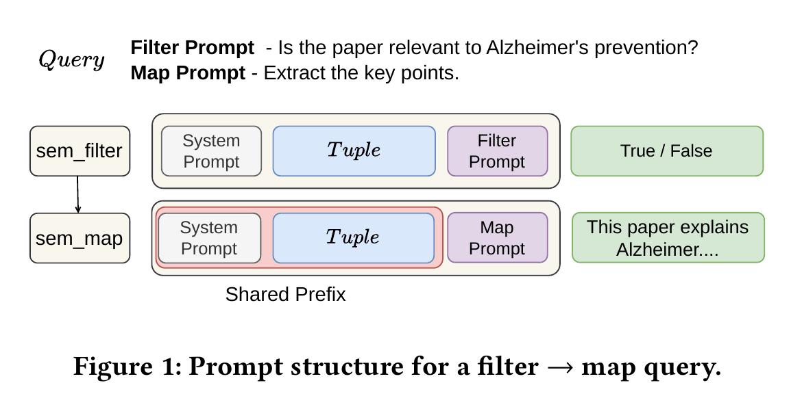

*图源：Kalypso arXiv v2 Figure 1（PDF p.3），按原图裁切。读图时横向比较两条 prompt：System Prompt 与 Tuple 的 token 顺序相同，只有末尾的 Filter/Map instruction 不同，因此下游 map 有机会复用红框所示 prefix。该图只展示可复用的 prompt 结构；实际命中还要求 operator UDF 产生完全相同的 token prefix，并在缓存被淘汰前启动下游请求。*

论文给出的 prompt 是：

- Filter：`[System Prompt | C(t) | I_filter]`
- Map：`[System Prompt | C(t) | I_map]`

二者共享：

```text
[System Prompt | C(t)]
```

其中 `C(t)` 是 tuple 内容。若 map 在 filter 后及时执行，map 只需 prefill 自己的 task instruction suffix，而不必重新计算 system prompt 与 tuple 的 KV state。

关键细节：

1. filter 的 boolean output 只决定 tuple 是否继续向下游流动；
2. 该 boolean 不被加入 map prompt；
3. Kalypso 只负责调度，**prompt 如何组织以形成相同 token prefix，是 SQPS operator UDF 的责任**；
4. 如果两个 operators 的 prompt 格式、token 顺序或模板不同，Kalypso不能自动创造 prefix sharing。

## 2.4 Figure 2 的动机实验

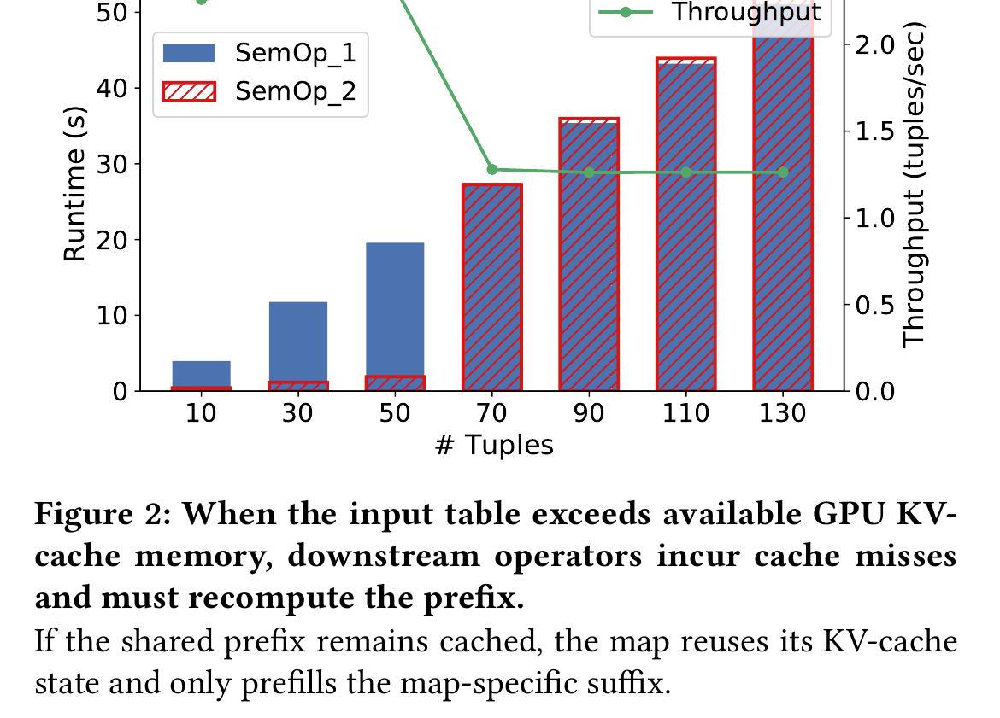

*图源：Kalypso arXiv v2 Figure 2（PDF p.3），按原图裁切。横轴增加 tuple 数量，蓝柱是第一个 semantic operator，红色斜线柱是第二个 operator，绿线是整体吞吐；约 70 tuples 后第二个 operator 的运行时间突然接近第一遍 prefill，说明早期 prefix 已被淘汰。该现象来自单张 A16、Llama-3.2-3B 和统一填充到 750 tokens 的受控实验，不等同于完整 Kalypso 的性能结果。*

### 实验设置（Section 2.2，p.3）

- 系统：Lotus；
- 模型：Llama-3.2-3B；
- GPU：NVIDIA A16，16 GB；
- 每个 tuple padding 到 750 tokens；
- 论文估计每 tuple KV cache：`112 KB/token × 750 ≈ 84 MB`；
- 模型权重和 runtime overhead 后约有 6 GB KV-cache；
- 约能同时保留 70 个 tuples；
- query：两个串联的 semantic filters；
- 执行方式：第一个 operator 跑完整张表并物化，再运行第二个 operator。

### Figure 2 说明什么

当输入少于约 70 tuples 时，第二个 operator 仍能命中第一个 operator 留下的 prefix，因此其 runtime 很小；超过容量后，第一轮尚未结束，较早 tuple 的 prefix 已被 LRU 淘汰，第二个 operator 必须重新 prefill，runtime 明显上升，throughput 下降。

作者由此得出：

- operator-at-a-time 在 bounded KV-cache 下不能稳定获得跨 operator reuse；
- 单纯改 eviction policy，例如 LRU 改 MRU，只能带来常数级改善，且数据规模增大后端到端影响减弱；
- 需要让下游 operator 在 tuple 刚产生后尽快执行，同时控制并发带来的 memory pressure。

### 这项实验没有证明什么

Figure 2 只验证了一个两 filter、单 GPU、固定 750-token tuple 的受控场景。它没有单独证明 Kalypso 的完整 scheduler 最优，也没有覆盖 join fanout、variable-length output 或多 query 并发。

## 2.5 论文真正提出的新调度问题

该问题可以概括为：

> 在 bounded KV-cache 下，对具有 dependency 的 semantic-operator tasks 做在线调度；既要让 dependent downstream task 在 parent prefix 被淘汰前运行，又要保持足够并行度以利用 GPU，同时不能让 upstream work 占满缓存、阻断 downstream progress。

在线性来自：

- filter 是否保留 tuple 运行时才知道；
- join fanout 运行时才知道；
- 每个 map 产生多少 output tokens 运行前不完全知道；
- cache occupancy 与 eviction 取决于同时运行的请求。

---

## 3. 核心思想与贡献

## 3.1 Relational LLM serving

传统 serving API 的单位是 request；Kalypso 将 API 提升到 query plan 和 semantic operator。它获得了传统 LLM engine 看不到的关系信息：

- operator 顺序；
- tuple lineage；
- parent-child dependency；
- operator 是否 blocking；
- operator 是否 predicate；
- 是否发生 Cartesian Product；
- 哪些 downstream tasks 将复用哪个 parent prefix。

因此，“relational”不是指 Kalypso实现完整关系数据库，而是指 serving 层理解 relational-style semantic query plan，并按 tuple/operator dependency 组织执行。

## 3.2 将 query plan 编译成 pipeline、stage、task

Kalypso 的执行抽象是：

```text
Query Plan
  └─ Pipeline：由 blocking operator 分隔
       └─ Stage：由 Cartesian Product 分隔
            └─ Task：一个 stage 处理一个输入 tuple
```

- **Pipeline**：可持续流动而不物化的 operator 区段；遇到 `sem_agg`、`sem_topk` 等 blocking operator 后形成新 pipeline。
- **Stage**：一串在同一 tuple 上顺序执行的 operators；CP/join fanout 会把一个 parent tuple 展开成多个 child tasks，因此形成 stage 边界。
- **Task**：scheduler 的原子单位，表示“一个 stage 对一个输入 tuple 的执行”。

该抽象把 query semantics 转成可调度且可核算内存的单元。

## 3.3 依赖感知的 prefix 生命周期

当 parent task 产生 children tasks 时，Kalypso调用 `memoryManager.trackDependency(parent, children)`。parent 的 prefix 不能在任意一个 child 尚未完成时释放；只有：

- parent 被 predicate 过滤；或
- parent 属于最后 stage；或
- parent 的全部 children / siblings 完成，

相关 memory 才可以释放。

这使 KV cache 不再只是 LLM engine 中“最近是否碰巧存在”的状态，而成为由 query dependency 管理的执行资源。

## 3.4 Adaptive stage memory budgeting

每个 stage 都有动态 memory budget。Kalypso依据 waiting queue 的压力判断：

- **starving**：下游 waiting tasks 太少，说明 upstream 供给不足；
- **saturated**：waiting tasks 太多，说明 pipeline 后部消化不够快或缓存压力过大。

scheduler 在线转移 budget，使并行度随 selectivity、fanout 和 tuple size 改变，而不是使用固定 stage ratio。

## 3.5 Virtual pinning

论文的一个实用点是：不要求 serving engine 一定支持显式 KV pinning。Kalypso可以仅依靠：

- LRU 假设；
- task admission；
- token/memory bound；
- launch timing，

尽量让仍需复用的 prefix 保持“较新”，这被称为 **virtual pinning**。Figure 11 显示其性能与显式 pinning 接近。

---

## 4. 系统与方法设计：按论文 Section 2 → 6 展开

## 4.1 Section 2：Background and Motivation

### 4.1.1 LLM inference 与 KV cache

Autoregressive inference 分为：

1. **Prefill**：并行处理全部 prompt tokens，产生每层 K/V tensors；
2. **Decode**：逐 token 生成，依赖此前 KV tensors。

KV cache 随 sequence length 线性增长，是 serving 的主要 memory bottleneck 之一。

### 4.1.2 Prefix caching 的边界

若两个请求具有完全相同的 prompt prefix，其 KV tensors 相同，可以复用。但在 vLLM 的 automatic prefix caching 中，请求完成后 blocks 变为可回收；在 memory pressure 下可能随时被 eviction。现有机制不能保证某个 prefix 一直保留到未来 dependent request 到达。

### 4.1.3 vLLM memory model

论文将 vLLM KV cache 描述为固定大小 blocks 的全局池，类似虚拟内存 page：

- request admission 时分配；
- request 完成后归还 / 可回收；
- block 不足时新请求延后；
- APC 根据相同 token prefix 复用 block。

Kalypso不替代这个 block allocator，而是在上层控制请求何时进入。

---

## 4.2 Section 3：Overview of Kalypso

### 4.2.1 Figure 3 架构（p.3）

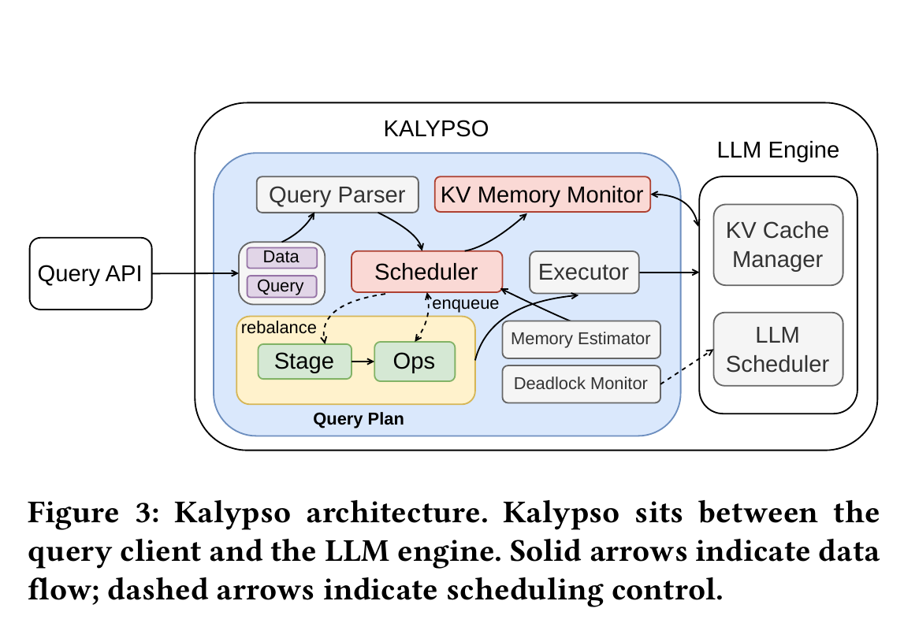

*图源：Kalypso arXiv v2 Figure 3（PDF p.3），按原图裁切。实线表示 data flow，虚线表示调度控制：Query Parser 把查询拆成 stages/operators，Scheduler 根据 KV Memory Monitor 和 Memory Estimator 决定何时交给 Executor，而底层 LLM Scheduler 与 KV Cache Manager 仍由 serving engine 管理。该架构图不包含多 endpoint 路由或多 query 公平调度。*

Figure 3 中 Kalypso 位于 Query API 与 LLM Engine 之间。

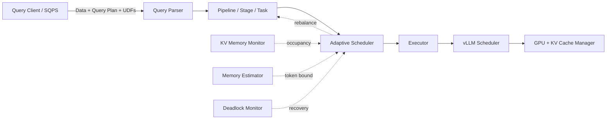

### 4.2.2 各组件职责

| 组件 | 论文中的职责 |
|---|---|
| Query Parser | 解析 static left-deep query plan，按 blocking operator 和 CP 划分 pipeline/stage |
| Scheduler | 决定 task admission、并行度与 stage memory budget；是 operator admission control |
| Executor | 包装 operator UDF 发出的 LLM requests，追踪 completion 与上下文 |
| KV Memory Monitor | 从底层 LLM engine 获取 GPU/KV occupancy 信息 |
| Memory Estimator | 预测 task 所需 token/memory bound |
| Deadlock Monitor | 显式 pinning 发生等待但无运行请求时触发恢复 |
| vLLM Scheduler | 仍负责真正的 GPU request scheduling；Kalypso不取代它 |
| KV Cache Manager | 分配、复用、evict KV-cache blocks；可选支持 explicit pinning |

### 4.2.3 完整控制流程

1. SQPS 注册 operator UDF 与 execution contract；
2. client 提交 data 与 query plan；
3. parser 生成 pipelines、stages、tasks；
4. scheduler 为 stages 分配 budget；
5. waiting task 通过 memory admission 后交给 Executor；
6. Executor 调用 vLLM；
7. completion 触发 child task 生成、output materialization 或 memory release；
8. scheduler依据 queue pressure 持续 rebalance；
9. token bound 超出时 retry；显式 pinning deadlock 时 unpin 并切换 virtual pinning。

---

## 4.3 Section 4：Kalypso API

## 4.3.1 Operator UDF

SQPS 使用 UDF 实现 semantic operator。Kalypso不理解 UDF 内部逻辑，只要求其中的 LLM requests 经由 Kalypso wrapper 发出，以便系统知道：

- request 属于哪个 task / stage；
- 何时完成；
- 是否过滤 tuple；
- 是否生成 children；
- 何时可以释放 prefix。

因此 Kalypso的 API 是“控制面可见、算子逻辑不透明”。

## 4.3.2 Execution contract 的三个属性

每个 operator 必须声明：

1. **Pipelining**：是否可按 tuple 流水执行，还是 blocking；
2. **Predicate**：是否可能过滤输入，从而终止该 tuple 的 downstream processing；
3. **Cartesian Product（CP）**：是否将 left tuple 与 right table tuples 组合。

### Table 1：常见 operators 的属性（p.4）

| Operator | Pipelining | Predicate | CP | 解释 |
|---|---:|---:|---:|---|
| `sem_filter(l)` | Y | Y | N | 单 tuple 判断；false 时不再向下游发送 |
| `sem_map(l)` | Y | N | N | 单 tuple 转换，始终向下游发送 |
| `sem_join(l)` | Y | Y | Y | 系统先形成 tuple pair，再用语言 predicate 过滤 pair |
| `sem_classify(l)` | Y | N | N | 为每个 tuple 生成标签 |
| `sem_agg(l)` | N | N | N | 需要多个 tuples，属于 blocking |
| `sem_topk(l,k)` | N | N | N | 需看到整体候选，属于 blocking |

### 对 `sem_join` 的准确理解

Table 1 把 `sem_join` 标为 Pipelining=Y、Predicate=Y、CP=Y。这里不应理解为“一个 join task 自己在 UDF 内完成整张表的笛卡尔积”。Kalypso将 CP expansion 作为受控系统过程：

1. 左侧 tuple 流入；
2. Kalypso扫描静态右表或通过 UDF 选取子集；
3. 创建多个 pair children tasks；
4. join predicate 在每个 pair 上执行；
5. 因 CP 产生 one-to-many dependency，parser 在此处划分 stage。

## 4.3.3 Prompt 与 prefix sharing

API 不强制 prompt layout。operator implementation 必须主动保证共享部分位于相同 prefix，例如：

```text
System instruction → Tuple content → Operator-specific instruction
```

如果 operator-specific instruction 被放在 tuple 前，或每个 operator 使用不同 system template，共享 prefix 会缩短或消失。论文没有提出 prompt rewrite optimizer 来自动解决该问题。

## 4.3.4 Cascading、外部工具与 ICP

UDF 可以调用：

- cheap proxy LLM；
- oracle LLM；
- embedding model；
- vector index / vector database；
- 其他 external tools。

对于 join，CP operator 可附带 UDF，为每个 left tuple 从 right table 选一个较小子集。论文称为 **Indexed Cartesian Product（ICP）**：

```text
left tuple
   └─ query vector index over right table
         └─ candidate right tuples
               └─ Kalypso creates final tuple pairs
```

ICP 减少 pair 数量，但该优化属于 operator implementation；Kalypso的主要贡献是如何调度留下的 tasks。

## 4.3.5 Query plan 限制

论文当前接收：

- **static** query plan；
- **left-deep** plan；
- CP 的 right-side table 为静态输入；
- left side 可以是静态表或上游 operator output；
- blocking operator 前必须物化完整输入。

论文没有支持动态改写 plan、bushy join tree 或双侧流式输入。

---

## 4.4 Section 5：Scheduling

## 4.4.1 Section 5.1：Executing Query Plans

### Figure 4：从 query plan 到 task execution（p.5）

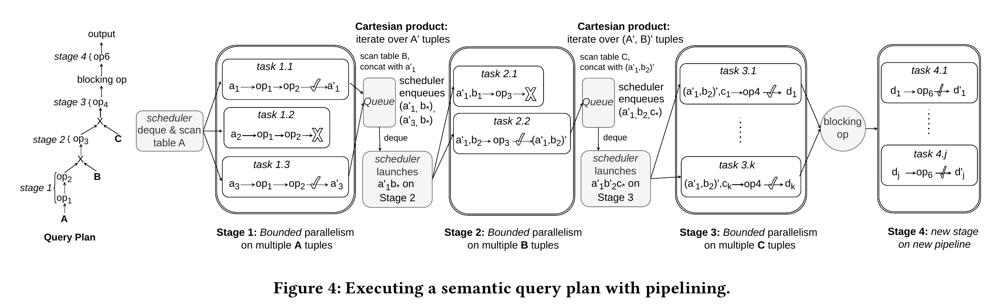

*图源：Kalypso arXiv v2 Figure 4（PDF p.5），按原图裁切。应从左向右读取：左深 query plan 先按 Cartesian Product 拆出 Stage 1–3，stage 内以 tuple 为单位形成 task，blocking operator 再切断当前 pipeline 并启动 Stage 4。图中的 queue 文字与 Algorithm 1 的 `stage.waiting` 表述并不完全一致，具体执行语义以随后算法中的 waiting tasks 为准。*

Figure 4 的左深 plan 被拆为四个 stages：

- Stage 1：`op1 → op2`，扫描表 A；
- Stage 2：与表 B 做 CP 后执行 `op3`；
- Stage 3：与表 C 做 CP 后执行 `op4`；
- blocking operator；
- Stage 4：新 pipeline 上执行 `op6`。

具体执行：

1. scheduler 从表 A 启动多个 Stage 1 tasks；
2. task 1.1 处理 `a1` 并输出 `a1'`；
3. task 1.2 将 `a2` 过滤；
4. `a1'` 与 B 中 tuples 组合，形成 tasks 2.1、2.2……；
5. Stage 2 输出再与 C 组合，形成 Stage 3 children；
6. Stage 3 是当前 pipeline 末端，因此其结果 materialize；
7. blocking operator 完成后，Stage 4 开启新 pipeline。

### 关键内存语义

- 一个 task 的 output 若要进入下一 stage，其 parent prefix 需继续保留；
- CP 生成多个 children 时，parent prefix 要保留到所有 children 完成；
- predicate 过滤时，没有 downstream reuse，prefix 可以立即释放；
- pipeline 最后一 stage 完成后，output 物化且该 task memory 可释放。

### 论文自己指出的队列表述不一致

Section 5.1 明确写道：

- Figure 4 的文字把 queue 描述为“保存 task outputs”；
- Figure 5、Figure 6 与后续 Algorithm 1 把 queue 描述为“保存新生成的 tasks”。

因此，精读时应以 Algorithm 1 的 `stage.waiting` 为主要执行语义，但要注意该不一致会影响后续对 saturated queue 的直观解释。

## 4.4.2 Section 5.2：Memory-Aware Scheduling

仅仅优先 dependent tasks 不够。若同时 launch 太多 tasks：

- 新请求需要分配 KV blocks；
- LRU 可能淘汰刚完成 parent 的 prefix；
- dependent task 排队期间失去 reuse；
- 即使逻辑上是流水执行，实际仍会重新 prefill。

Kalypso因此同时跟踪：

1. 仍被 children 需要的 prefix 大小；
2. 每个 task 可使用的最大 token/memory；
3. 每个 stage 当前已分配 memory；
4. 底层 LLM engine 的 memory occupancy。

它控制的是 **launch timing 和 admission**，而不是只改变 ready queue 的优先级。

## 4.4.3 Section 5.3：三个对照策略

### A. Sequential depth-first

顺序完成 parent 及其全部 descendants 后再处理下一个 tuple。

- 优点：prefix reuse 最直接，memory pressure 最小；
- 问题：任意时刻最多一个 LLM request，GPU underutilization；
- Figure 4 中会按 task 1.1 → 2.1/2.2 → 3.x 的嵌套顺序运行。

### B. Parallel depth-first

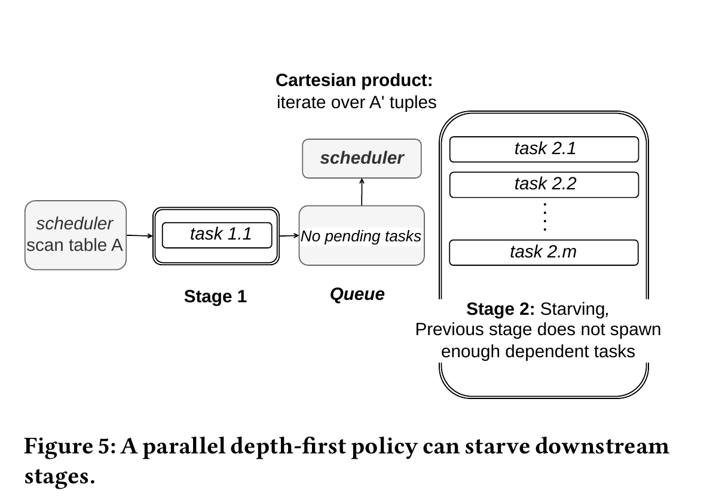

*图源：Kalypso arXiv v2 Figure 5（PDF p.6），按原图裁切。Stage 1 只保留一个上游 task，已生成的 Stage 2 tasks 被迅速消费后 queue 为空；当这批 tasks 完成时，下游没有新工作，出现论文所称的 starving。它是固定预算策略的状态示意图，不是按时间采样的 GPU 或队列测量。*

将大部分 memory 固定给最后 stage，children 一产生便大量并行执行。

- 优点：迅速消费 parent prefix，尽早释放；
- 问题：upstream stage 并行度不足，children 一批耗尽后，下游无新工作；
- Figure 5：Stage 2 queue 清空后 starving，而 Stage 1 只能孤立地产生下一个 tuple。

### C. Parallel breadth-first

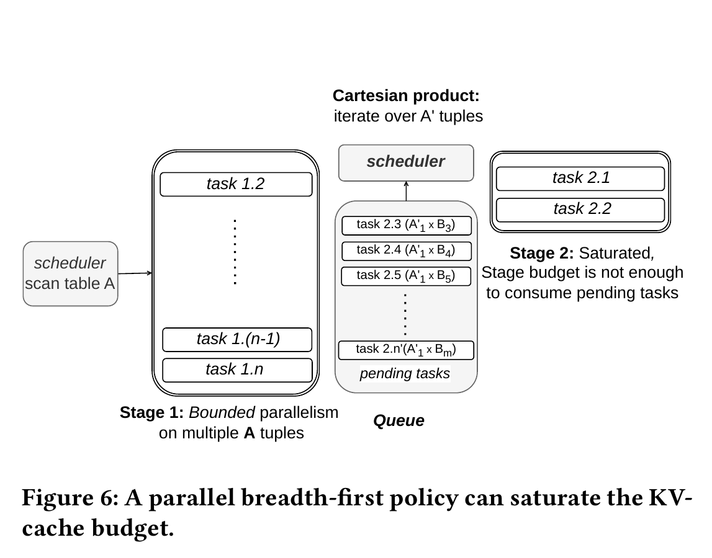

*图源：Kalypso arXiv v2 Figure 6（PDF p.7），按原图裁切。较大的 Stage 1 budget 同时接纳许多上游 tasks，它们生成的 children 在中间 queue 堆积，而 Stage 2 budget 不足以及时消费；论文把这种状态称为 saturated。该图说明预算分配失衡的方向，不给出实际 KV 占用量或持续时间。*

给第一 stage 较大固定 budget，先并行产生大量 upstream outputs。

- 优点：下游不易缺任务；
- 问题：大量 parent prefixes 和 pending children 占用 KV budget，later stage 难以推进；
- Figure 6：Stage 2 pending tasks 累积，论文称该状态为 saturation。

### 为什么必须 adaptive

固定 budget ratio 无法覆盖：

- filter survival 变化；
- join fanout 变化；
- tuple length 变化；
- 每个 stage 的 prompt/output token 变化。

Kalypso的目标是在线判断当前瓶颈在 upstream supply 还是 downstream drain，并转移 budget。

## 4.4.4 Algorithm 1：Kalypso Scheduling Algorithm（p.7）

### 输入

- 单条 pipeline 的有序 `stages`；
- 每个 stage 的 input table / right-side table；
- task memory estimator；
- memory manager；
- operator UDFs 与 execution contracts。

### 核心状态

| 状态 | 含义 |
|---|---|
| `stage.waiting` | 该 stage 等待 admission 的 tasks |
| `running` | 已保留 budget 且正在执行的 tasks |
| `out` | pipeline 最后一 stage 的 materialized outputs |
| `budget_s` | stage s 当前可用 memory budget |
| `minBudget_s` | 至少运行一个 task 并保留其 prefix 所需的 memory |
| dependency graph | parent task 与其 children 的关系，用于延迟释放 |

### 初始化：`Schedule(stages)`，lines 1–6

1. `running ← ∅`，`out ← []`；
2. 取第一 stage；
3. 将第一 stage input table 转成 tasks；
4. 全部加入 `firstStage.waiting`；
5. 直到所有 waiting queues 与 running set 都为空才结束。

第一 stage 的输入在一开始全部成为 waiting work，这也是作者后文说“first stage is always saturated by design”的背景。

### Step 1：`Launch`，lines 13–22

对每个 stage：

1. 查看 waiting queue 首 task；
2. `memoryManager.admit(stage, task)` 判断 stage 剩余 budget 是否足够；
3. 若足够，dequeue、allocate memory、加入 running，并 `launchWorker(task)`；
4. 若不足，停止从该 stage 继续 admission。

**设计理由**：不让 LLM engine 先收进大量请求再被动排队，而是在上层以估计 memory 作为 admission boundary。

### Step 2：`Complete`，lines 23–37

#### 情况 A：token bound 不足

若 `result.retry()`：

1. 根据实际情况提高 task budget；
2. 重新加入同一 stage waiting queue；
3. 稍后重跑。

论文没有把一次被中断的生成继续接在原 decode state 上，而是描述为 rerun task。

#### 情况 B：predicate 未过滤

若 `result.filtered() = false`：

- 非最后 stage：
  1. 执行 CP / ICP；
  2. 生成 children tasks；
  3. enqueue 到 next stage；
  4. 记录 parent-child dependency。
- 最后 stage：将 result 放入 `out`。

#### 情况 C：释放 memory

若：

- task 被 predicate 过滤；或
- task 已在最后 stage，

则调用 `releaseMemory(task)`。memory manager 还会在全部 sibling children 完成后递归释放其 parent memory。

### Step 3：`Rebalance`，lines 38–46

#### 初始分配

- 除最后 stage 外：`budget_s = minBudget_s`；
- 最后 stage：获得全部剩余 memory。

原因是最后 stage 完成后不需要继续保留 prefix 给后续 operator，给它更多 budget 有利于尽快完成 descendants 并释放整条 dependency chain。

#### Queue thresholds

对每个 stage s：

\[
\mathrm{high}_s = \alpha \cdot \frac{\mathrm{budget}_s}{\mathrm{minBudget}_s}
\]

\[
\mathrm{low}_s = \beta \cdot \frac{\mathrm{budget}_s}{\mathrm{minBudget}_s}
\]

论文定义 `α > β`，并根据 waiting queue size 分类：

- `|waiting_s| < low_s`：starving；
- `|waiting_s| > high_s`：saturated。

直观上，`budget_s / minBudget_s` 近似该 stage 能同时容纳的 task 数量，阈值因此随 budget 一起变化。

#### Starvation transfer

若 stage s starving：

- 将 budget 从 s 向前一个 upstream stage 转移；
- 让 upstream 并行产生更多 children；
- 若 upstream 也 starving，继续向更前方转移，直到找到 non-starving stage。

#### Saturation transfer

论文文字描述：若某个非第一 stage saturated，则将以 `Δ` 为单位的空闲 budget 向最后 stage 转移；若该 stage 没有足够空闲 budget，则从其他存在空闲 `Δ` 的 stage 找 donor。目的是加速 pipeline 尾部，完成 descendants，释放 cached parents。

### Algorithm 1 的设计实质

它不是传统“给每个 request 一个优先级”的 scheduler，而是两层控制：

1. **依赖优先**：children 尽快进入 waiting/admission，利用 parent prefix；
2. **budget shaping**：通过 stage memory share 控制 upstream 生产速率与 downstream 消费速率。

### Algorithm 1 中需要谨慎阅读的地方

1. `transferMemSaturation(lastStage)` 的伪代码没有传入当前 saturated stage，具体 donor 选择仅在正文中部分描述；
2. Figure 4 与 Algorithm 1 对 queue 存“output”还是“task”的语义不一致；
3. 若严格按 `stage.waiting` 解释，queue 很大似乎意味着该 stage 自身缺 budget，但正文又把它解释为 downstream drain 不足并优先给 last stage，复现时需要额外澄清；
4. `Δ` 的数值与选择规则没有在 Section 7.1 报告；
5. 算法是 heuristic，论文没有给出最优性或稳定性证明。

---

## 4.5 Section 6：Memory Management

## 4.5.1 Token bound estimation

### 为什么 relational workload 相对可预测

作者认为 semantic operators 常有以下特点：

- prefill-heavy；
- filter 只输出 binary value；
- classifier 输出短标签；
- 同一个 instruction 重复作用于大量 tuples；
- output length distribution 可从已完成请求在线学习。

### 估计方式

Kalypso为每个 stage 维护整个 task execution 的 peak token usage bound。用户可以：

- 为 filter 等 operator 指定 static bound；
- 对 map-like variable-length operator 使用在线估计。

在线估计记录：

\[
\text{output-to-input token ratio}
= \frac{\text{generated output tokens}}{\text{prompt tokens}}
\]

scheduler 使用经校准的 **99th percentile** ratio 作为后续同类 operator 的 token bound。

### 估计偏差的代价

- 高估：为最坏情况预留过多 memory，降低并行度；
- 低估：请求达到 bound 后被中断，task 提高 budget 并重跑；可能产生额外 prefill 与 eviction。

Table 2 中 Kalypso括号内数字就是因估计错误导致的 retry calls：FEVER 0、MEDEC 21、BioDEX 0、ContractNLI 167。

## 4.5.2 Explicit pinning 与 virtual pinning

| 机制 | 做法 | 优点 | 问题 |
|---|---|---|---|
| Explicit pinning | 修改 LLM engine，明确禁止仍需复用的 blocks 被 eviction | 保留语义直接、可控 | 需 backend 支持；可能死锁 |
| Virtual pinning | 不真正 pin；依靠 admission、memory bound、launch order 与 LRU 保持 prefix | 无需修改 backend；避免 pinning deadlock | best-effort；依赖 LRU 行为 |

论文默认实验使用 virtual pinning。显式 pinning 需要约 200 LoC 的 vLLM 修改，涉及 KV-cache management、block allocation 与 request state（Section 7.4）。

## 4.5.3 Deadlock detection and recovery

### 死锁来源

显式 pinning 下可能出现：

1. upstream parent 持有 pinned memory；
2. parent 只有等 downstream children 完成才能释放；
3. downstream child 又需要更多 memory 才能 admission；
4. 当前 free memory 不足；
5. 形成 circular wait。

token-bound retry 也可能占用更多 memory，加剧该问题。

### 检测

Kalypso周期性查询底层 LLM engine scheduler。如果：

- 存在 waiting LLM requests；且
- 没有 running requests，

则判定没有执行进展。

### 恢复

1. unpin 所有 memory；
2. 临时切换到 virtual pinning；
3. 允许 LLM engine 按需 eviction；
4. 恢复进展。

作者称实验中只在 stress tests 观察到 deadlock。论文没有给出死锁发生率、检测周期、恢复开销或正式 deadlock-freedom 证明。

---

## 5. 端到端例子：ContractNLI 如何在 Kalypso 中执行

本节按论文 Section 7.2 的 ContractNLI plan 与 Section 5 的执行模型串起来，帮助理解 stage、CP、prefix dependency 和 memory release。

### 5.1 Query plan

```python
contracts.sem_filter(
    "Is this document a valid contract or agreement text ...?"
).sem_join(
    right_table=hypotheses,
    "Given the contract and hypothesis, does the contract entail the hypothesis?"
).sem_map(
    "Explain briefly why the contract entails the hypothesis ..."
)
```

数据：

- 607 个 contracts，平均 2,145.3 tokens；
- 17 个 hypotheses，平均 36.8 tokens；
- full CP 对每个 surviving contract 形成最多 17 个 pairs。

### 5.2 Stage 划分

可以按论文的 CP stage boundary 理解为：

```text
Stage 1: sem_filter(contract)
   │ surviving contract
   ▼
Cartesian Product with 17 hypotheses
   │ 17 child pairs
   ▼
Stage 2: sem_join predicate(pair) → sem_map explanation(pair)
```

`sem_join` 的 CP expansion 形成 stage 边界，而 join predicate 与后续 map 都处理同一个 `(contract, hypothesis)` pair，可在同一 Stage 2 task 中顺序执行。

### 5.3 一个 contract tuple 的生命周期

假设 contract `c1` 通过 Stage 1 filter：

1. Stage 1 prompt 计算 `[system | c1 | filter instruction]`；
2. APC 中保留 `[system | c1]` prefix；
3. CP 生成 `(c1,h1)…(c1,h17)` children tasks；
4. memory manager 记录 `parent(c1) → 17 children`；
5. Stage 2 每个 child 在相同 endpoint/engine cache 中尝试复用 `[system | c1]`，再计算 hypothesis 与 join instruction；
6. 若 join predicate 为 false，该 pair 被过滤，child memory 可释放；
7. 若为 true，同一 task 继续执行 sem_map explanation，并复用 `(contract,hypothesis)` 的共享部分；
8. 只有 17 个 children 全部完成，`c1` 的 parent prefix 才可释放。

若 Stage 1 同时放入过多 contracts，每个 contract 都要保留长 prefix，Stage 2 可能没有足够 memory 处理 17-way fanout；若 Stage 1 过少，Stage 2 又可能没有足够 pairs。Kalypso用 adaptive budget 在两者之间调节。

### 5.4 为什么 ContractNLI 收益最大

Section 7.3 的作者解释是：

- contract 很长，平均 2,145 tokens，重复 prefill 代价高；
- 每个 contract 有 17 个 hypotheses，fanout 大；
- long contract prefix 可被 join predicate 与 final sem_map 复用；
- Kalypso跨 stage 保留这份大型 reusable state。

因此 Figure 7 中 Kalypso 相对 Lotus 达到 4.57× speedup，相对 Palimpzest 为 2.23×。

---

## 6. 实验分析：严格按 Section 7.1–7.4

## 6.1 Section 7.1：Experimental Setup

### 6.1.1 Baselines

| 系统 | 版本 | 与 Kalypso 的主要差异 |
|---|---:|---|
| Lotus | 1.1.4 | user-defined query plan；proxy/oracle cascading；operator-at-a-time；request-centric serving |
| Palimpzest | 1.5.3 | query optimizer 可 reorder operators、选择 implementation；operator-at-a-time；request-centric serving |
| Kalypso | 本文系统 | query-aware serving；pipelined stages；adaptive memory-aware scheduling |

论文强调这些 SQPS 的 operator implementation / query optimization 与 Kalypso serving-layer optimization 是互补关系。

### 6.1.2 公平性配置

- 所有系统底层都使用 vLLM；
- 相同 workload 尽量使用相同 operator semantics、manually optimized plan 与 oracle model；
- oracle：Llama-3.3-70B-Instruct；
- Lotus / Palimpzest 最大 batch size：64；
- predicate calls 的 static maximum output-token bound：8；
- Palimpzest 关闭 `reasoning_effort`，避免其 few-shot reasoning prompt 更长；
- proxy 场景用单独 vLLM instance 运行 Llama-3.1-8B；
- Kalypso不优化小模型 serving；
- Kalypso默认 `α=1`、`β=0.5`、virtual pinning。

需要注意：MEDEC 与 ContractNLI 中，因为 small proxy LLM 行为高度不稳定，Lotus使用 cascade，而 Kalypso改为 oracle-only；因此这些 workload 并非每个系统都执行完全相同的 model path。论文对此有明确说明，不能把 speedup简单解释为“严格同调用序列下的纯调度差异”。

### 6.1.3 Hardware / software

- 4× NVIDIA RTX Pro 6000 GPUs，论文标注 96 GB HBM；
- AMD EPYC 9575F CPU，8 cores；
- 300 GB RAM；
- vLLM v0.13.0rc4；
- Automatic Prefix Caching enabled；
- Llama-3.3-70B-Instruct 跨全部 GPUs tensor parallel；
- Triton attention backend；
- 默认 vLLM GPU memory utilization：0.9；
- `VLLM_ENABLE_V1_MULTIPROCESSING=0`；
- greedy decoding：temperature 0、top-p 1.0、frequency penalty 0.5、repetition penalty 1.3；
- 每项实验运行 3 次，报告平均值。

论文承认上述设置仍不能完全消除 LLM nondeterminism。

## 6.2 Section 7.2：Workloads and Implementations

### Table 2：数据规模、平均 token 与 oracle LLM calls（p.9）

| Workload | Data | #Tuples | Avg. tok. | Lotus calls | Palimpzest calls | Kalypso calls（retry） |
|---|---|---:|---:|---:|---:|---:|
| FEVER | Claims | 1,000 | 11.8 | 1,183 | – | 1,243（0） |
| FEVER | Wikipedia | 5,416,568 | 126.0 | 同上 | – | 同上 |
| MEDEC | Patients | 1,000 | 397.1 | 2,098 | 2,338 | 2,143（21） |
| BioDEX | Articles | 500 | 2,680.1 | 6,881 | – | 7,016（0） |
| BioDEX | Reactions | 11,271 | 6.3 | 同上 | – | 同上 |
| ContractNLI | Contracts | 607 | 2,145.3 | 17,445 | 16,370 | 17,342（167） |
| ContractNLI | Hypotheses | 17 | 36.8 | 同上 | 同上 | 同上 |

括号中是 memory estimate 不足引起的 retried LLM requests，不包含 proxy LLM calls。

### 6.2.1 FEVER fact verification

Plan：

```text
sem_map：生成两条 Wikipedia search queries
→ index_search：ColBERT index，top_k=5
→ sem_filter：根据 evidence 判断 claim 是否成立，cascade=True
```

- 1,000 claims；Wikipedia corpus 约 5M documents；
- retrieval result 与 claim 合并成 tuple；
- Lotus 平均 183.3 次 oracle fallback；Kalypso 243.6 次；
- Palimpzest 无法把 index-search results 合并进单 tuple，因此不参与；
- 单 stage、三个 operators。

### 6.2.2 MEDEC medical error detection and correction

Plan：

```text
sem_filter：是否存在 medical inconsistency
→ sem_map：定位错误句编号
→ sem_map：生成修正句
```

- 1,000 patient notes；
- 单 stage、三个 operators；
- Lotus 第一 filter 使用 proxy cascade；
- Kalypso因 proxy nondeterminism 使用 oracle-only；
- Palimpzest未实现 threshold-based fallback，也使用 oracle-only。

### 6.2.3 BioDEX biomedical reaction matching

Plan：

```text
sem_map：从 article 提取 adverse drug reaction labels
→ sem_join：ICP，以 intfloat/e5-base-v2 vector index 找候选 reactions
→ sem_filter：按 vector distance 先接收/拒绝，不确定区间回退 oracle
```

- 500 articles，平均 2,680.1 tokens；
- 11,271 reactions，平均 6.3 tokens；
- 三 operators、两个 stages；
- Lotus 与 Kalypso使用相同 ICP / threshold cascade；
- Palimpzest不支持 distance-based index search，不参与。

### 6.2.4 ContractNLI contract entailment

Plan：

```text
sem_filter：是否为有效且内容充分的 contract
→ sem_join：与 17 hypotheses 做 full CP，并判断 entailment
→ sem_map：生成引用相关 clause 的简短解释
```

- 607 contracts；
- 三 operators、两个 stages；
- Lotus 第一 filter 使用小模型 cascade；
- Kalypso与 Palimpzest 使用 oracle-only。

## 6.3 Section 7.3：End-to-End Query Completion Time

### Figure 7 主要结果（p.10）

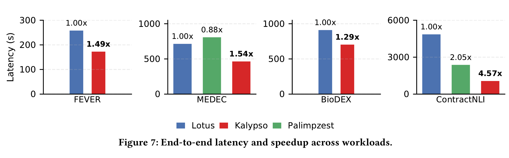

*图源：Kalypso arXiv v2 Figure 7（PDF p.10），按原图裁切。四个 panel 的纵轴范围不同，应在每个 workload 内比较 Lotus、Kalypso 与可运行的 Palimpzest；柱顶倍率以相应 baseline 为参照，缺失的绿色柱表示 Palimpzest 不支持该 workload。图中为三次运行的平均值但没有误差条，而且 MEDEC/ContractNLI 的 model path 在系统间不完全相同。*

| Workload | Baseline latency | Kalypso latency | Speedup | 作者解释 |
|---|---:|---:|---:|---|
| FEVER | Lotus 258.1 s | 172.6 s | 1.49× | map、retrieval、filter 流水；保留 claim/evidence 的 reusable prefix |
| MEDEC | Lotus 714.6 s；Palimpzest 808.2 s | 464.3 s | 1.54× / 1.74× | 单 tuple 连续经过三个 LLM operators，下游 reuse 次数更多 |
| BioDEX | Lotus 910.3 s | 703.4 s | 1.29× | article prefix 很长，但 final filter 的 proxy 会跳过部分 oracle calls，且 reaction tuple 很短 |
| ContractNLI | Palimpzest 2,373.4 s；Lotus 图中约 4.85 ks | 1,062.4 s | 2.23× / 4.57× | 2,145-token contract prefix + 17-way fanout，跨 stage reuse 价值最大 |

### Figure 7 真正证明了什么

论文能够支持：

1. 在所选 workload、硬件、模型与实现上，query-aware pipelined serving 的 query completion time 更低；
2. Table 2 的 oracle-call counts 整体同数量级，说明主要收益不是大幅减少 LLM calls；
3. 共享 prefix 越长、可连续复用的 downstream operators 越多，收益一般越大；
4. proxy 已经跳过大量 oracle calls 时，serving-layer optimization 的增益会受限。

### Figure 7 不能单独证明什么

- 不能证明所有 semantic queries 都有同等收益；
- 不能证明 scheduler 在任意 fanout / memory 下最优；
- 不能证明 multi-query throughput、P99 latency 或公平性；
- 不能完全隔离“pipelined overlap”和“KV reuse”，两者同时发生；
- MEDEC / ContractNLI 的 model path 在系统间不完全一致。

## 6.4 Section 7.4：Execution Policy Ablations

## 6.4.1 Figure 9：Blocking vs. pipelined execution（p.11）

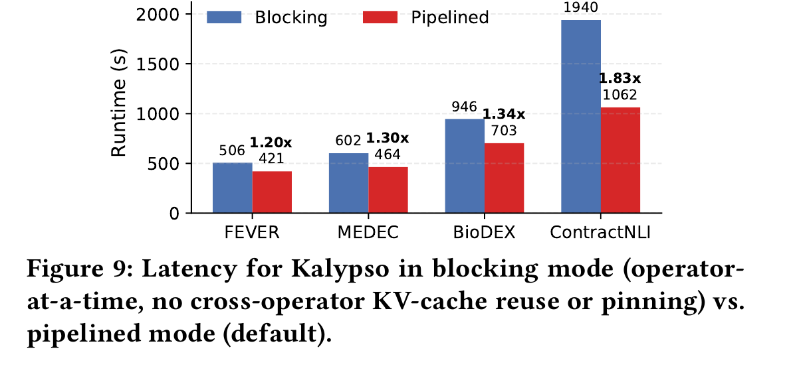

*图源：Kalypso arXiv v2 Figure 9（PDF p.11），按原图裁切。每组蓝柱是 operator-at-a-time blocking variant，红柱是默认 pipelined Kalypso，柱顶同时给出秒数和 speedup。这个对照一起移除了 operator overlap、跨 operator KV reuse 与 pinning，因此只能说明完整流水执行组合更快，不能把差异拆成三个独立机制的贡献。*

| Workload | Blocking | Pipelined | Speedup |
|---|---:|---:|---:|
| FEVER | 506 s | 421 s | 1.20× |
| MEDEC | 602 s | 464 s | 1.30× |
| BioDEX | 946 s | 703 s | 1.34× |
| ContractNLI | 1,940 s | 1,062 s | 1.83× |

Blocking variant 让每个 operator 跑完整个输入后才启动下一个，且不做 cross-operator pinning/reuse。作者据此声称 pipelining 在四个 workloads 上均有收益，且 long tuple、更多 operators 的 workload 收益更大。

**证据边界**：该 ablation 同时移除了 operator overlap 与 cross-operator prefix reuse，因此不能从 Figure 9 单独量化两者各自贡献。

## 6.4.2 Figure 10：Static ratio vs. adaptive budgeting（p.11）

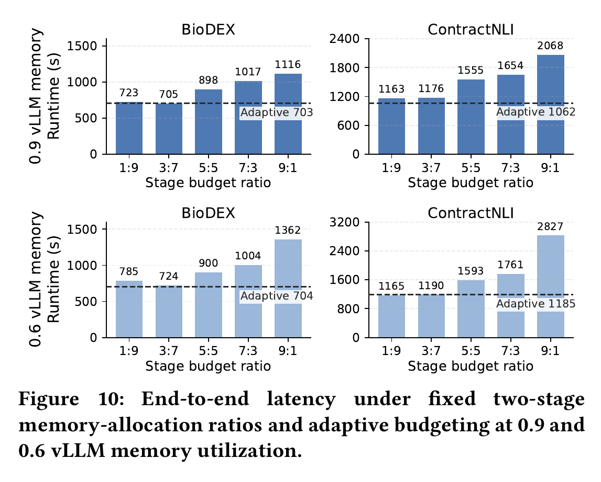

*图源：Kalypso arXiv v2 Figure 10（PDF p.11），按原图裁切。上、下两行分别把 vLLM memory utilization 设为 0.9 和 0.6，左右比较 BioDEX 与 ContractNLI；柱子扫描固定 Stage 1:2 ratio，虚线是 adaptive 结果。图值还暴露一处正文不一致：0.6 memory 的 ContractNLI 中，静态 1:9 为 1,165 s，略快于 adaptive 的 1,185 s，不能据正文概括为 adaptive 在每个设置都最佳。*

### vLLM memory utilization = 0.9

| Stage 1:2 ratio | BioDEX | ContractNLI |
|---:|---:|---:|
| 1:9 | 723 s | 1,163 s |
| 3:7 | 705 s | 1,176 s |
| 5:5 | 898 s | 1,555 s |
| 7:3 | 1,017 s | 1,654 s |
| 9:1 | 1,116 s | 2,068 s |
| Adaptive | **703 s** | **1,062 s** |

### vLLM memory utilization = 0.6

| Stage 1:2 ratio | BioDEX | ContractNLI |
|---:|---:|---:|
| 1:9 | 785 s | **1,165 s** |
| 3:7 | 724 s | 1,190 s |
| 5:5 | 900 s | 1,593 s |
| 7:3 | 1,004 s | 1,761 s |
| 9:1 | 1,362 s | 2,827 s |
| Adaptive | **704 s** | 1,185 s |

作者的总体解释：

- BioDEX 最合适的静态分配约为 3:7；
- ContractNLI 更偏向 1:9；
- 没有一个固定比例跨 workload 始终最佳；
- adaptive strategy 不需要事先知道 tuple size、selectivity、fanout 与 downstream work。

但必须注意一个图文不一致：Figure 10 的 0.6 ContractNLI 中，静态 1:9 为 1,165 s，优于 adaptive 的 1,185 s；正文却写 adaptive strategy 仍然最好。按图中数值，后一句并不成立。

## 6.4.3 Figure 11：Virtual vs. explicit pinning（p.12）

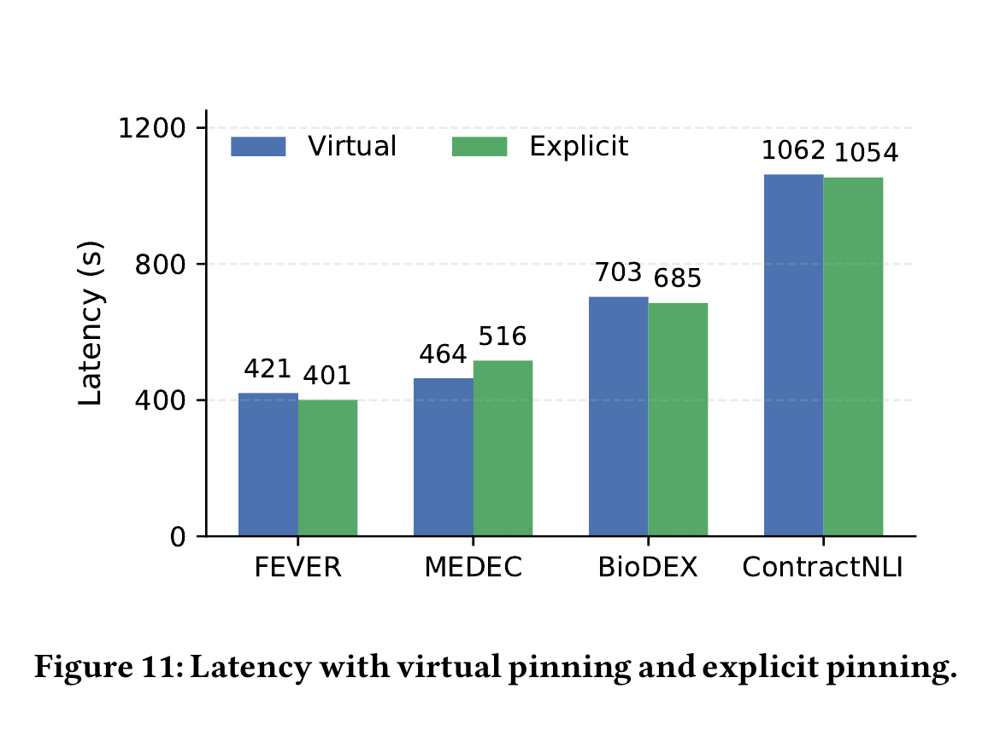

*图源：Kalypso arXiv v2 Figure 11（PDF p.12），按原图裁切。每个 workload 内比较默认 virtual pinning 与修改 vLLM 后的 explicit pinning：三项是 explicit 略快，MEDEC 则是 virtual 更快，差异相对总时长较小。由于论文没有误差条、显著性检验或 deadlock frequency，这张图支持“virtual 可接近 explicit”，不支持两者统计等价。*

| Workload | Virtual | Explicit | 更快者 |
|---|---:|---:|---|
| FEVER | 421 s | 401 s | Explicit |
| MEDEC | 464 s | 516 s | Virtual |
| BioDEX | 703 s | 685 s | Explicit |
| ContractNLI | 1,062 s | 1,054 s | Explicit，差距很小 |

作者据此认为：virtual pinning 已经捕获主要 scheduling benefit，不要求底层 engine 支持 pinning；explicit pinning 可作为可选 backend feature。

该实验没有解释 MEDEC 中 explicit pinning 反而更慢的具体原因，也没有报告 deadlock frequency。

## 6.4.4 Figure 12：Token-bound sensitivity（p.12）

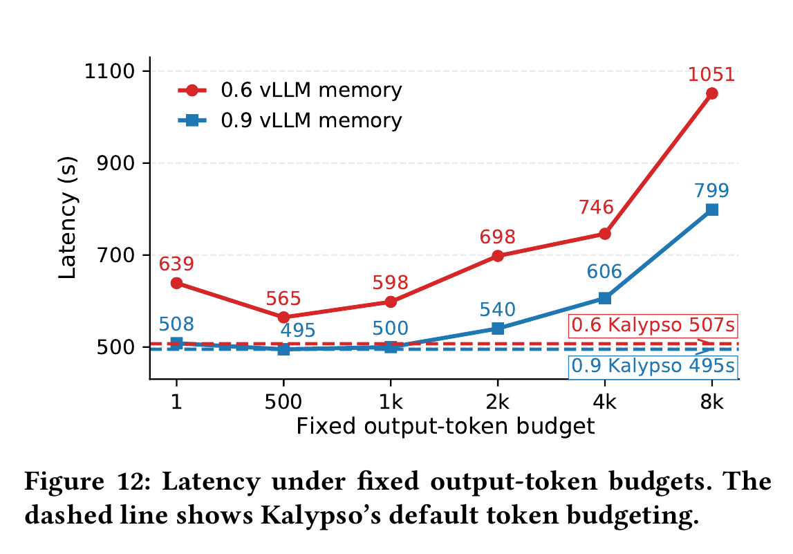

*图源：Kalypso arXiv v2 Figure 12（PDF p.12），按原图裁切。横轴扫描固定 output-token budget，红/蓝折线分别对应 0.6/0.9 vLLM memory，虚线是 Kalypso 的在线 token bound；预算过大降低可并发请求数，1-token 预算又会触发大量 retry。该实验只使用 MEDEC，不能据此确定其他 output-length 分布的最佳估计策略。*

测试 workload：MEDEC。

| Fixed output-token budget | 0.9 memory | 0.6 memory |
|---:|---:|---:|
| 1 | 508 s | 639 s |
| 500 | 495 s | 565 s |
| 1k | 500 s | 598 s |
| 2k | 540 s | 698 s |
| 4k | 606 s | 746 s |
| 8k | 799 s | 1,051 s |
| Kalypso default estimator | 495 s | **507 s** |

解释：

- 预算过大：admission 数下降，latency 上升；
- 预算只有 1 token：第一次执行很快但多数请求要 retry；retry 时部分 prefix 可能已 eviction；
- 99th-percentile online estimation 在不要求用户预知分布的情况下取得最好或并列最好结果。

## 6.4.5 Figure 8：Resource sensitivity（p.11）

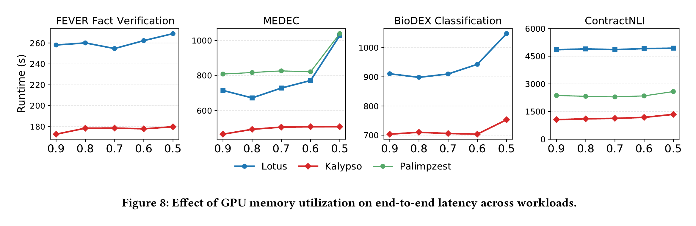

*图源：Kalypso arXiv v2 Figure 8（PDF p.11），按原图裁切。横轴从 0.9 降到 0.5 表示留给 vLLM/KV cache 的显存比例逐步减少；四个 panel 的纵轴刻度不同，只能在同一 workload 内比较三套系统随 memory reduction 的变化。它说明当前单节点、Llama-3.3-70B 设置下 Kalypso 的 slowdown 较小，不证明跨模型或跨 serving backend 的同样趋势。*

作者把 vLLM memory utilization 从 0.9 降到 0.5，对应约：

- 190.6 GB；
- 152.6 GB；
- 114.6 GB；
- 76.6 GB；
- 38.6 GB KV-cache capacity。

主要结论：

- 五种 memory setting 下 Kalypso 都快于 baselines；
- FEVER、BioDEX 的相对优势较稳定；
- MEDEC：Kalypso从 464.3 s 增至 507.3 s，只增加 9%；Lotus 增加 44%，Palimpzest 增加 29%；
- ContractNLI：Kalypso 全部低于 1,348.3 s，Palimpzest 高于 2,296.5 s，Lotus 高于 4,854.0 s。

这支持作者关于“memory pressure 越强，memory-aware scheduling 越能避免大幅 slowdown”的结论。

## 6.5 实验整体回答了哪些问题

| 问题 | 对应证据 | 论文可以支持的结论 |
|---|---|---|
| Query-aware serving 是否比 operator-at-a-time 快？ | Figure 7 | 在四个 workload 上是 |
| Pipelining 是否有效？ | Figure 9 | 默认 pipeline 比 blocking variant 快 1.20–1.83× |
| 固定 stage ratio 是否稳健？ | Figure 10 | 不同 workload 最佳比例不同；adaptive 大多接近或优于最佳静态值 |
| 必须修改 vLLM 做 pinning 吗？ | Figure 11 | 不必须；virtual pinning 性能接近 explicit |
| Online token bound 是否必要？ | Figure 12 | 能避免大预算降低并行度与小预算大量 retry |
| memory 变少时是否仍有效？ | Figure 8 | Kalypso的 degradation 小于 baselines |

## 6.6 实验没有回答的问题

论文没有实验性证明：

1. query result accuracy 与 baseline 完全一致；
2. retry 在 LLM nondeterminism 下不会改变输出；
3. multi-query arrival 下的 throughput、P95/P99、fairness；
4. 多 vLLM replicas / 多 endpoint 下如何保持 prefix locality；
5. scheduler overhead、CPU overhead、memory-monitor overhead；
6. α、β、Δ 的系统性 sensitivity；
7. 不同模型规模、不同 serving engines、不同 attention backend 的普适性；
8. energy、GPU utilization trace 或实际 KV hit-rate 的直接测量；
9. 对 dynamic plan、bushy plan、双侧 streaming join 的适用性；
10. 与其他 query-aware LLM scheduling 方法的全面比较。

## 6.7 论文中值得记录的内部不一致与报告缺口

以下不是对作者结论的扩展，而是文内可直接观察到的问题：

1. **Queue 语义不一致**：Section 5.1 自己指出 Figure 4 说 queue 保存 output，而 Figure 5/6、Algorithm 1 说 queue 保存 tasks。
2. **α 的定义与实验值不一致**：Section 5.3 写 `α,β ∈ (0,1)` 且 `α>β`；Section 7.1 使用 `α=1, β=0.5`，其中 α 不在开区间 `(0,1)`。
3. **Figure 10 与正文不一致**：0.6 memory 的 ContractNLI，1:9 static=1,165 s，adaptive=1,185 s；图值显示 static 更快，正文却称 adaptive 仍然最佳。
4. **FEVER 绝对 latency 未解释变化**：Figure 7 中 Kalypso 为 172.6 s；Figure 9 与 Figure 11 的 virtual-pinning FEVER 为 421 s。论文没有明确解释这些 ablation 是否改变了 proxy/operator configuration，因此不能直接横向比较绝对值。
5. **缺少误差条 / 方差**：虽然每项运行三次并取平均，但 Figures 7–12 均未报告标准差、置信区间或 error bars。
6. **Budget transfer 复现细节不足**：`Δ`、donor selection 的完整实现、rebalance 周期没有完整参数化说明。

---

## 7. 优点与局限

论文没有独立的 Limitations section。下面先列论文正文明确限定的设计边界，再单独给出“笔记分析”。

## 7.1 论文明确支持的优点

### 7.1.1 优化层次清楚

Kalypso没有与 Lotus 的 proxy/cascade 或 Palimpzest 的 query optimizer 竞争，而是明确优化 serving layer。这使它可以与减少 LLM calls 的方法叠加。

### 7.1.2 不需要牺牲 query semantics 的设计目标

scheduler 不 reorder 用户 plan、不替换 model、不近似 operator result，只改变 task launch 和 memory allocation。其目标是保持 query semantics 与 output accuracy，同时减少重复 prefill。

需要区分：这是设计原则；论文没有单独报告准确率实验。

### 7.1.3 抽象与资源机制对应紧密

Pipelining / Predicate / CP 三个 contract 属性，分别对应：

- 是否能流式推进；
- 何时可提前释放；
- 何时产生 one-to-many dependency 与 stage boundary。

该 API 不是泛化的 operator metadata 堆积，而是直接服务于 scheduler 决策。

### 7.1.4 Virtual pinning 具有工程可部署性

在不修改 vLLM 的情况下，仅利用 APC、LRU 和 admission control，即可得到接近 explicit pinning 的效果；这降低了与 serving backend 的耦合。

### 7.1.5 实验覆盖不同 pipeline 结构

四个 workloads 包含：

- 单 stage 与两 stages；
- map/filter 串联；
- external index search；
- ICP join；
- full CP join；
- long tuple 与 short tuple；
- proxy cascade 与 oracle-only。

因此实验不只覆盖一个简单 filter→map microbenchmark。

## 7.2 论文明确暴露的设计边界

- 只接收 static left-deep plans；
- blocking operators 必须 materialize；
- CP right side 是 static table；
- prompt layout 由 SQPS保证；
- explicit pinning 可能 deadlock；
- token bound 可能错误并触发 retry；
- virtual pinning 是 best-effort 且假设 LRU；
- 系统目前建立在 vLLM/APC 上。

## 7.3 笔记分析：额外局限

> 以下为阅读分析，不是论文原文结论。

### 7.3.1 Scheduler 仍是 heuristic

starving / saturated 仅由 queue length 相对 budget 识别，没有直接使用：

- 预计 child fanout；
- prefix age；
- 实际 APC hit probability；
- request TTFT / decode duration；
- GPU compute utilization；
- critical path。

因此 adaptive budgeting 更像反馈控制器，而非显式 cost model 或全局优化器。

### 7.3.2 “保留 prefix”与“运行 task”共享同一内存池

parent prefix retention 会与 active request KV 分配竞争。论文通过 per-stage budget 和 minimum budget 处理，但没有给出细粒度区分：

- pinned reusable state；
- active prefill/decode state；
- future output growth reserve。

这可能限制对复杂 workload 的精确控制。

### 7.3.3 没有多 query 公平性

Algorithm 1 明确针对 single pipeline。论文没有说明多个 query 同时提交时：

- stage budgets 如何跨 query 分配；
- 一个高-fanout query 是否会占满 cache；
- 是否存在 starvation/fairness；
- 如何设 per-tenant limits。

### 7.3.4 Endpoint locality 未讨论

Prefix reuse 要求 dependent requests 到达拥有该 prefix 的同一 vLLM cache domain。单实例 tensor-parallel 场景中这一点自然成立；多 replicas / 多 endpoints 时需要 sticky routing 或 cache-aware routing，论文未研究。

### 7.3.5 Accuracy-preserving 声明需要更强验证

在理论上，重新 prefill 与复用相同 KV prefix 应保持语义；但实际系统存在 floating-point nondeterminism、retry 与不同 proxy fallback 数量。论文没有比较 result equivalence、task-level outputs 或 downstream query accuracy。

### 7.3.6 只报告 latency，缺少机制层指标

若同时报告以下指标，会更直接验证核心机制：

- cross-operator KV hit rate；
- prefill tokens saved；
- prefix eviction count；
- stage queue occupancy over time；
- stage budget trajectory；
- GPU utilization；
- retry overhead breakdown。

目前主要由 end-to-end latency 间接推断机制有效。

---

## 8. 我的理解与启发

> 以下为基于论文内容的个人分析，不属于论文原文贡献。

## 8.1 最值得学习的不是“流水”，而是“状态生命周期由依赖决定”

普通 pipeline 常把“上游 output ready”视为唯一依赖。Kalypso进一步认识到：下游需要的不仅是 tuple value，还需要上游产生的 **GPU-resident KV state**。因此 dependency completion 不等于资源可释放，真正的 release condition 是“所有可能复用该状态的 descendants 完成”。

这与数据库中的 buffer pin、reference count、operator state lifetime 类似，但状态对象变成了 LLM KV prefix。

## 8.2 Serving scheduler 需要理解上层语义，但不必吞并上层系统

Kalypso没有把 Lotus 的 operator optimizer、vector index、proxy cascade 全部重做，而是通过 execution contract 接收最少但关键的语义。这个边界设计值得借鉴：

- 上层负责“做什么、准确率策略是什么”；
- serving layer 负责“何时做、在哪个 memory budget 下做”；
- 底层 vLLM 负责“GPU 上如何执行”。

## 8.3 Selectivity 和 fanout 不只是 query optimizer 的统计量

传统数据库中 selectivity/fanout 用来估计 cardinality 和 plan cost；在 Kalypso 中，它们还决定：

- downstream ready-work 产生速度；
- parent prefix 要保留多久；
- 同时存在多少 children；
- stage memory share 应如何变化。

因此语义查询中的 cardinality estimation 可以直接进入 runtime admission control，而不只是 plan selection。

## 8.4 Virtual pinning 展示了“不修改 backend 也能影响缓存行为”

系统未必需要立刻修改 vLLM 内核。只要上游可以限制并发、控制 arrival order、估计 token budget，就能间接塑造 LRU cache residency。对原型研究而言，这比一开始实现显式 pinning 更可行。

## 8.5 该论文把“请求数”之外的成本暴露出来

Table 2 中 LLM-call counts 相近，但 Figure 7 latency 差异很大，说明 semantic query cost 不能只用“调用多少次 LLM”表达。至少还要考虑：

- 每次 prompt 的 novel prefill tokens；
- 可复用 prefix length；
- prefix 是否仍 resident；
- parent fanout；
- output token reserve；
- stage parallelism。

这比只按 request count 或 batch size 估算成本更接近实际执行。

---

## 9. 与我的数据库 AI 算子执行与调度课题的关系

> 以下为个人分析，不属于论文原文贡献。

## 9.1 与当前课题的直接交集

我的研究关注数据库 / 数据引擎产生 AI operator workload 后，如何经过 request organization、Ray-side scheduling 与 vLLM endpoints 高效执行。Kalypso与该方向的交集非常直接：二者都认为底层 request-centric serving 看不到上游 job/operator 语义，因此上游需要显式提供：

- job / query dependency；
- tuple 或 record lineage；
- estimated work；
- bounded admission；
- completion-based resource release。

Kalypso提供了一个更具体的实例：利用 query plan dependency 管理 endpoint-local KV cache。

## 9.2 架构映射

| Kalypso | 我的系统中的近似位置 | 可借鉴内容 |
|---|---|---|
| Query Client / SQPS | PostgreSQL / Daft workload source | 提交 operator plan，而不只提交独立 HTTP requests |
| Query Parser | Request Organizer / plan adapter | 将 plan 转成 stage、task、dependency metadata |
| Stage waiting queue | Per-job fair queue 内的 stage queue | 区分 upstream producer 与 downstream consumer |
| Memory Estimator | Cost Adapter / predicted work | 不只估 token，还估 prefix-residency demand |
| Scheduler admission | Ray Scheduling Plane 的 Request Credit + Work Credit | 增加 stage-aware、dependency-aware admission |
| Parent-child dependency | Completion Accounting Gate | 所有 children 完成后才释放 parent prefix lease |
| Virtual pinning | 不修改 vLLM 的 bounded admission | 通过 launch order 与 endpoint stickiness 间接保留 cache |
| vLLM Engine | Endpoint A/B | 真正的 GPU execution 仍由 vLLM 内部 scheduler 完成 |

## 9.3 最值得直接借鉴的机制

### 9.3.1 在 BatchRequest 中加入 dependency metadata

当前 BatchRequest 若只记录 rows、token estimate 与 endpoint，仍看不到：

- parent task id；
- stage id；
- downstream fanout；
- shared-prefix key；
- prefix length；
- 剩余 children count。

可以借鉴 Kalypso，为每个 task 增加：

```text
job_id
query_id
stage_id
parent_task_id
prefix_key
estimated_prefix_tokens
estimated_output_tokens
remaining_children
is_predicate
is_final_stage
```

这些字段可直接决定 credit acquire 与 release。

### 9.3.2 Request Credit + Work Credit 之外增加“prefix lease”语义

当前双 credit 控制：

- Request Credit：限制并发请求数；
- Work Credit：限制 predicted token/frame work。

Kalypso提示还需要区分：

- 正在运行的 request work；
- 已完成但仍需被 descendants 复用的 resident prefix。

一种可行做法不是再建立全新全局池，而是在所选 endpoint 的 work accounting 中保留一段 **prefix lease**：parent completion 后 request credit 可以释放，但其对应 predicted prefix work 不能立即全部归还；直到最后一个 child completion 才释放。

### 9.3.3 Route before acquire 后，还要保持 descendant stickiness

我的架构已明确“先选 endpoint，再 acquire endpoint-local credits”。Kalypso进一步说明：若 child 被路由到另一个 endpoint，原 endpoint 的 KV prefix 无法复用。因此：

1. parent 首次选择 endpoint；
2. parent 的 children 默认继承该 endpoint；
3. 只有在 prefix 已 eviction、deadline/failure 或收益不足时才考虑迁移；
4. accounting 只在所选 endpoint 内发生，不建立 global cross-endpoint cache pool。

这与当前“per-endpoint capacity domain”口径一致，但需要在 router 中加入 prefix locality。

### 9.3.4 用在线 selectivity / fanout 调整上下游 admission

Kalypso的 stage rebalance 可以映射成：

- downstream queue 过空：提高 upstream stage 的 admission share；
- downstream backlog / prefix retention 过大：降低 upstream admission，给 downstream 更多 endpoint work budget；
- filter 过滤率、join fanout、平均 output tokens 在线更新。

这比固定 `K=8 + 50 ms flush` 或固定 token budget 更适合多-stage AI job。

### 9.3.5 先实现 virtual pinning，再评估是否改 vLLM

对我的课题，第一阶段可完全不修改 vLLM：

- 保持同一 endpoint；
- bounded admission；
- 控制 batch launch order；
- 及时提交 descendants；
- 记录 APC hit / prefill tokens saved。

若实验显示 virtual pinning 对高压 workload 不稳定，再考虑修改 vLLM 做 explicit pinning。Kalypso Figure 11 支持这种工程顺序。

## 9.4 与我的课题的关键区别

| 维度 | Kalypso | 我的研究重点 |
|---|---|---|
| 工作负载 | 单条 static relational semantic query | 多 job、多 batch、可能来自 PostgreSQL/Daft/Ray |
| 调度目标 | query completion time、cross-operator KV reuse | 多 job 公平、bounded admission、endpoint routing、吞吐与延迟 |
| 资源域 | 一个 tensor-parallel vLLM cache domain | 一个或多个独立 vLLM endpoints，每个有独立 credit ledger |
| 上游系统 | SQPS 直接提交 query plan | 数据引擎还包含 scan、RecordBatch、request organization、fan-in/writeback |
| 网络路径 | 论文未突出 HTTP/Ray transport | Ray actor / HTTP endpoint interaction 是实现组成部分 |
| Batch organization | 主要按 task/stage admission | 还研究 row cap、token budget、length alignment、prefix-aware batching |
| 公平性 | 未研究 multi-query fairness | per-job equal-share / work-conserving 是核心目标之一 |
| Cache locality | 单 engine 内自然成立 | 必须显式处理 parent-child endpoint stickiness |

## 9.5 可以形成的研究增量

相对 Kalypso，我的课题可以聚焦其未研究的交叉点：

> **面向多 job、多 endpoint 的数据库 AI operator execution：联合 stage dependency、prefix locality、per-job fairness 与 endpoint-local bounded admission。**

一个更明确的问题表述可以是：

- 上游 Daft/PostgreSQL 产生多个 AI operator jobs；
- 每个 job 内部有 stages 与 parent-child dependency；
- 多个 vLLM endpoints 各自有独立 KV cache 和 capacity ledger；
- scheduler先在公平性约束下选择 job，再依据 prefix locality 选择 endpoint，然后同时 acquire request/work credits；
- parent completion 后保留 prefix lease，children 完成后释放；
- 根据在线 selectivity、fanout、token error 调整 stage shares；
- 评价 throughput、JCT、P95/P99、公平性、KV hit rate、prefill tokens saved 和 GPU utilization。

该方向与 Kalypso 的区别不是简单“再做一个 pipelining”，而是把其单 query、单 cache-domain 的 relational serving 扩展到 **distributed dataflow + multi-job + multi-endpoint capacity control**。

## 9.6 需要避免的重复

若课题只做以下内容，容易与 Kalypso高度重合：

- 单 vLLM endpoint；
- static left-deep semantic plan；
- 只按 stage queue 动态分配 KV budget；
- 只验证 query completion time；
- 不涉及数据引擎、job fairness、endpoint routing 或 batch organization。

因此研究创新点应放在 Kalypso没有覆盖的系统边界，而不是重新实现 Algorithm 1。

---

## 10. 最终评价

Kalypso 的价值在于把 semantic query execution 与 LLM serving 之间长期割裂的两层连接起来。它抓住一个具体且真实的性能损失：同一 tuple 在连续 semantic operators 中反复 prefill，而现有 APC 只能机会式复用。论文以 pipeline/stage/task 抽象承接 query plan，再用 adaptive memory budget、dependency tracking、token estimation 与 virtual pinning，把“是否能命中 prefix”从偶然事件转化为上层可控制的执行目标。

最扎实的贡献是：

1. 明确定义 relational LLM serving 的系统边界；
2. 用 Pipelining / Predicate / CP 三属性连接 operator semantics 与 scheduler；
3. 把 parent-child dependency 变成 KV-memory release condition；
4. 证明不修改 vLLM 的 virtual pinning 也能接近 explicit pinning；
5. 在 long-prefix、high-fanout workload 上展示显著收益。

最需要谨慎的部分是：

- scheduler 仍为 heuristic；
- Algorithm 1 的 queue / saturation 表述存在不一致；
- 部分实验图文或绝对值缺少解释；
- 没有多 query、公平性、多 endpoint 与直接 KV-hit 指标；
- accuracy-preserving 主要是设计推理，而非实验结果。

对于数据库 AI 算子执行与调度研究，这篇论文非常相关。它不只是 related work 中的“推理服务优化”，而是直接给出了一个重要设计原则：**数据库 job 的 operator dependency 应进入 serving control plane，并参与 endpoint-local KV-cache 与 admission 的联合管理。**
