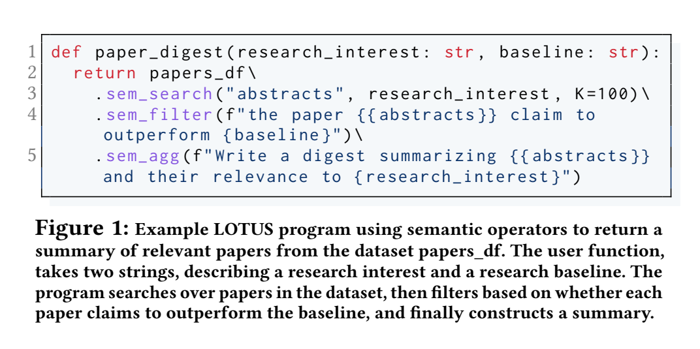
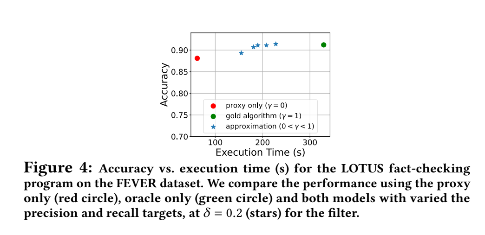
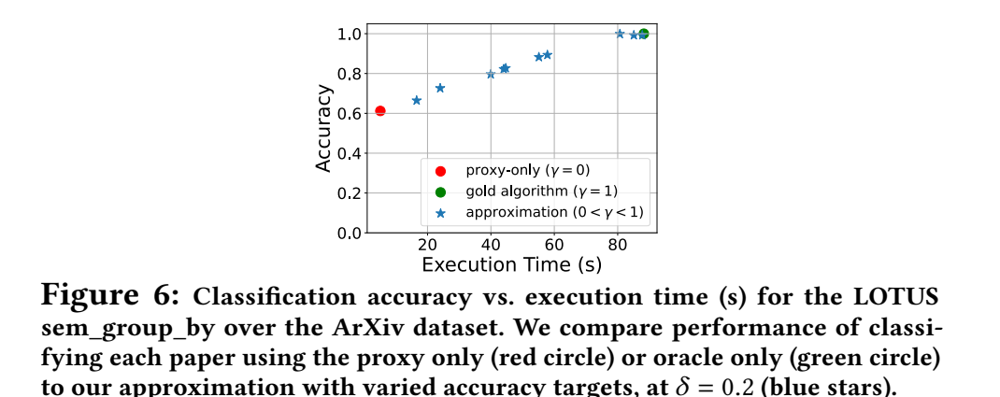
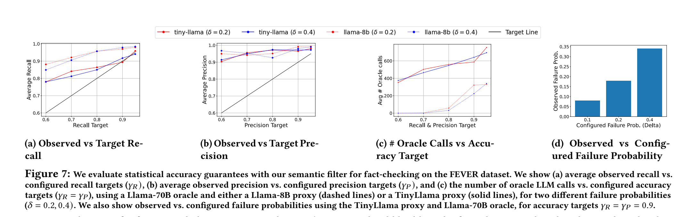

# LOTUS 论文精读笔记

## Semantic Operators and Their Optimization: Enabling LLM-Based Data Processing with Accuracy Guarantees in LOTUS

> **说明**：第 1–9 节严格依据论文正式 PVLDB 版本整理；第 10–11 节明确标记为“个人理解/课题关联”，不属于论文作者原文结论。

---

# 1. 论文基本信息

**题目**

*Semantic Operators and Their Optimization: Enabling LLM-Based Data Processing with Accuracy Guarantees in LOTUS*

**作者**

Liana Patel, Siddharth Jha, Melissa Pan, Harshit Gupta, Parth Asawa, Carlos Guestrin, Matei Zaharia

**单位**

* Stanford University
* UC Berkeley

**发表**

Proceedings of the VLDB Endowment（PVLDB）

**卷期**

Vol. 18, No. 11

**年份**

2025

**页码**

4171–4184

**DOI**

10.14778/3749646.3749685

**系统名称**

LOTUS：**LLMs Over Tables of Unstructured and Structured data**

论文同时给出了公开的系统代码与 artifact。

---

# 2. 研究背景与问题

## 2.1 论文要处理的场景：Bulk Semantic Processing

论文关注的不是单条 LLM 请求，而是在大量结构化、非结构化数据上进行复杂语义处理。

Introduction 给出的典型需求包括：

* 从大量 ArXiv 论文中查找相关论文并进行总结；
* 从病历中抽取生物医学特征和候选诊断；
* 从大量会议记录、聊天记录中分析组织内部信息。

作者将这种任务称为：

**bulk semantic processing**

它的特点是需要在整个数据集上以较复杂的模式组织模型调用，而不只是把每条数据独立送给一次 LLM。

---

## 2.2 现有方法的第一个不足：只提供简单的 Batched-Inference Primitive

论文将很多已有 AI UDF 和相关系统概括为提供：

**simple batched inference primitives**

也就是系统可以批量执行类似：

```text
record → model invocation → result
```

的操作。

作者认为，这不足以直接表达更复杂的语义操作，例如：

* ranking；
* grouping；
* joining；
* aggregation。

因为这些操作需要一个由**多个模型调用组成的 AI algorithm**，而不是一个简单的 batched model invocation。

这也是 LOTUS 为什么不把“LLM 调用”本身作为最高层抽象，而要进一步提出 **Semantic Operator**。

---

## 2.3 第二个不足：复杂 LLM Analytics 已经出现，但缺少 Accuracy Guarantee

DocETL、UQE 等工作已经开始研究更复杂的 LLM 数据处理和优化。

但论文认为，这些系统主要采用 best-effort 或 empirical optimization：

> 优化后程序结果是否仍然符合原操作的预期行为，没有一个统一、形式化的定义。

而自然语言参数和 LLM 输出本身又存在模糊性，因此 semantic processing 中：

```text
什么叫 operator 的正确行为？
```

本身就是一个问题。

LOTUS 的核心出发点，就是先回答这个问题，再讨论如何优化。

---

# 3. 核心思想与主要贡献

论文的核心思路可以概括为：

```text
Natural-language specification
            ↓
      Semantic Operator
            ↓
     Reference Algorithm
            ↓
Alternative AI execution plan
            ↓
       Lower execution cost
            ↓
subject to statistical accuracy guarantee
relative to the Reference Algorithm
```

作者在 Introduction 中总结了三项主要贡献。

### 贡献 1：Semantic Operator Formalism

提出 Semantic Operators，用自然语言参数表达一般性的 AI 数据操作。

同时，每个 operator 的预期行为通过一个：

**high-quality Reference Algorithm**

进行规定。

论文将其称为首个针对 general-purpose、natural-language-parameterized AI operations 提供 statistical accuracy guarantees 的 formalism。

---

### 贡献 2：Accuracy-Guaranteed Operator Optimization

为：

* semantic filter；
* semantic join；
* semantic top-k；
* semantic group-by

提出优化方法。

这些方法利用：

* 小型 LLM；
* semantic embeddings；
* sampling；
* proxy model；

来减少昂贵模型调用，同时保证 optimized operator 相对于 Reference Algorithm 达到指定 accuracy target。

论文报告这些优化相对于 Reference Algorithm 最多可带来 **1000×** 的加速。

---

### 贡献 3：LOTUS 系统和系统化实验

作者实现了 LOTUS，并在：

* fact-checking；
* biomedical multi-label classification；
* search/ranking；
* topic analysis

上进行实验。

论文的总体实验结论是：

* 相比 AI-based analytics systems，LOTUS 达到相似或最多高 170% 的 accuracy，并最多快 3.6×；
* 相比部分手工设计的 AI pipeline，可以达到或超过 state-of-the-art quality；
* operator optimizations 相对 Reference Algorithm 最多达到 1000× 的 cost reduction / speedup。

---

# 4. Semantic Operator Model

这一部分对应论文 **Section 2**，也是整篇文章最核心的概念部分。

---

## 4.1 Model-Data Independence

论文借鉴 relational system 中的 data independence，提出：

**model-data independence**

论文给出的含义是：

> application logic 与底层具体 AI algorithm 分离。

即应用程序表达的是：

```text
我要进行什么 semantic transformation
```

而具体：

```text
如何组织模型调用
哪些数据送入每次调用
使用什么算法
```

由底层实现决定。

这一点是 Semantic Operator 与直接使用 AI UDF 的一个核心区别。

---

# 5. Reference Algorithm：理解论文最关键的概念

Section 2.2 给出的定义是：

> 每个 Semantic Operator 可以由很多不同的 AI algorithm 实现，其 correct behavior 相对于一个给定的 Reference Algorithm 定义。

Reference Algorithm 必须是：

* computable；
* tractable；
* 能产生被认为具有 high quality 的结果。

它同时规定一个：

**model access pattern**

也就是：

> 对哪些数据、以什么组合方式调用模型。

---

## 5.1 Reference Algorithm 不是 Ground Truth

论文并没有声称 Reference Algorithm 等于现实世界真实答案。

它是：

> 高质量、可执行的参考算法。

所以 LOTUS 后面的 accuracy guarantee 实际表示：

```text
Optimized Operator
        ≈
Reference Algorithm
```

而不是：

```text
Optimized Operator
        =
真实世界 Ground Truth
```

这一点非常重要。

论文 Section 2.4 还明确指出：

> 当前提出的 Reference Algorithms 可以支持高质量结果，但寻找 optimal Reference Algorithm 本身仍然是开放问题。

---

# 6. 六个核心 Semantic Operators

正式版 **Table 1** 汇总了六种核心 operator。

| Operator       | 作用                     | Reference Algorithm                    |
| -------------- | ---------------------- | -------------------------------------- |
| `sem_filter`   | 根据自然语言 predicate 过滤记录  | 每条记录进行模型 predicate evaluation          |
| `sem_join`     | 根据自然语言 predicate 连接两个表 | 对所有 tuple pair 执行 predicate evaluation |
| `sem_agg`      | 根据自然语言 reducer 聚合多个记录  | hierarchical reduce                    |
| `sem_topk`     | 根据自然语言标准返回前 K 个记录      | pairwise LLM comparison + quick-select |
| `sem_group_by` | 根据自然语言标准发现并分配 groups   | clustering + pointwise assignment      |
| `sem_map`      | 自然语言 projection        | 每条记录进行模型调用                             |

Table 1 是理解全文最重要的表之一。

---

# 6.1 Semantic Filter

定义：

根据自然语言 predicate，返回所有满足条件的 tuples。

例如：

```text
“这篇论文是否声称超过某个 baseline？”
```

### Reference Algorithm

论文对每个 tuple 单独执行一次模型调用：

```text
tuple + langex
      ↓
     LLM
      ↓
True / False
```

对于 N 个 tuples，需要线性数量的 predicate evaluation。

论文选择独立处理 tuples，而不是把许多 tuples 放进一个 prompt，一个理由是避免已有研究指出的 long-context 问题。

---

# 6.2 Semantic Join

`sem_join` 对两个 relations 进行连接，但 join condition 是自然语言 predicate。

论文 Figure 2 的例子是：

```text
The paper {abstract:left}
uses the {dataset_name:right}.
```

### Reference Algorithm

使用类似 nested-loop join 的方式：

```text
for each tuple in T1:
    for each tuple in T2:
        evaluate predicate with LLM
```

因此 LLM-call complexity 为：

[
O(|T_1|\cdot|T_2|)
]

这也是为什么 Semantic Join 的 Reference Algorithm 非常昂贵。

---

# 6.3 Semantic Top-k

`sem_topk` 根据自然语言 ranking criterion 返回最好的 K 个 tuples。

例如 Figure 2：

```text
"The paper has the funniest {title}"
```

论文认为这里存在两个算法设计问题。

### 第一：如何比较记录？

作者比较了：

* point-wise；
* list-wise；
* pairwise

等方式。

Reference Algorithm 采用：

**pairwise LLM comparison**

即每次让模型比较两个 tuples，并输出哪一个更符合 ranking criterion。

论文选择它的原因包括：

* prior work 显示 pairwise 方法具有较高质量；
* 相比 point-wise / list-wise 方法更加 robust。

---

### 第二：如何根据 pairwise comparisons 得到 Top-k？

论文考虑：

* quadratic sorting；
* heap-based top-k；
* quick-select top-k。

最终 Reference Algorithm 采用：

**Quick-select Top-k**

原因是：

* 相比 quadratic algorithm，需要少得多的 LLM calls；
* 相比 heap-based implementation，更适合 batched inference。

Quick-select 每一轮选择一个 pivot，然后：

```text
tuple 1 ─┐
tuple 2 ─┤
tuple 3 ─┼→ 与 pivot 比较
tuple 4 ─┤
...      ─┘
```

同一轮里的 comparisons 可以并行 batch 执行，然后再进入下一轮。

---

# 6.4 Semantic Aggregation

`sem_agg` 是 many-to-one transformation。

例如：

> 对大量论文摘要生成综合总结。

论文要求 langex 表示一个 commutative、associative aggregation function。

### Reference Algorithm

采用：

**hierarchical reduce**

而不是简单 sequential fold。

流程可整理为：

```text
Input tuples
   ↓
多组局部 aggregation
   ↓
partial results
   ↓
下一层 aggregation
   ↓
...
   ↓
final result
```

论文选择 hierarchical reduce 的理由包括：

* prior work 中对 summarization 展现较高质量；
* 可以提供更好的 query-processing parallelism。

---

# 6.5 Semantic Group-by

`sem_group_by` 的输入包括：

* 一个从 tuple 到未知 group label 的 natural-language projection；
* 目标 group 数 C。

Operator 需要同时完成：

1. 发现 representative group labels；
2. 将每个 tuple 分到一个 group。

论文指出，这本质上涉及 clustering，而 general clustering 问题是 NP-hard，因此 Reference Algorithm 使用可计算的 heuristic。

### Reference Algorithm

第一阶段：

```text
tuple
 ↓
LLM 产生 candidate label
 ↓
candidate-label embeddings
 ↓
k-means
 ↓
C clusters
 ↓
为每个 cluster 采样代表 tuples
 ↓
semantic aggregation
 ↓
得到正式 group labels
```

第二阶段：

```text
tuple
+
C 个 discovered labels
 ↓
LLM pointwise classification
 ↓
group assignment
```

作者选择 pointwise assignment，原因之一同样是避免 long-context scaling 问题。

---

# 6.6 Semantic Map

`sem_map` 是对 tuple 执行自然语言 projection：

```text
tuple
 ↓
LLM
 ↓
projected value
```

Reference Algorithm 对每个 tuple 分别进行模型调用。

论文 Section 3 明确说明：

> 本文没有进一步研究 `sem_map` 的专项 optimization，因为它基本对应已经被广泛研究的 batched LLM inference 问题。

同样，论文也没有详细研究 `sem_agg` 的优化，作者将 aggregation optimization 留给后续工作。

---

# 7. 什么叫“正确的 Semantic Operator Optimization”？

Section 2.3 给出的定义是：

一个 optimization：

1. 要比 Reference Algorithm 成本更低；
2. 同时对 Reference Algorithm 提供 statistical accuracy guarantee。

如果 accuracy target 为 (\gamma)，failure probability 为 (\delta)，则目标是：

[
P(\text{Accuracy} \ge \gamma) \ge 1-\delta
]

这里允许：

* lossless optimization；
* approximate optimization。

这与传统 relational query optimization 最大的区别是：

传统数据库通常要求不同 physical plans 结果等价；

而 LOTUS 允许 optimized result 与 Reference Algorithm 存在误差，但这个误差受到统计约束。

---

# 8. Section 3：四个 Operator 的具体优化

---

## 8.1 Semantic Filter Optimization

这是论文讲得最完整的算法之一，对应 **Algorithm 1**。

目标是满足：

* recall target (\gamma_R)；
* precision target (\gamma_P)；
* failure probability (\delta)。

核心思想是：

```text
cheap proxy
+
expensive oracle
```

Proxy 为较便宜但不一定准确的模型；Oracle 用于执行 Reference Algorithm 中的 predicate evaluation。

---

### Proxy Score

论文实验使用小型 LLM 作为 proxy。

根据模型输出：

```text
True / False
```

对应 token 的 log-probability 构造 score。

随后把 confidence score 重新映射到 quantiles。

论文实验使用：

```text
q = 50 quantiles
```

作者认为这在 granularity 和 efficiency 之间足够。

---

### Sampling

Algorithm 首先抽取 sample (S)，然后同时得到：

```text
Proxy(S)
Oracle(S)
```

由此估计 proxy 在当前 query 和 dataset 上的表现。

论文使用：

* importance sampling；
* defensive uniform sampling。

也就是说，它并不预先假定 proxy 一定可靠，而是在 query time 进行检测。

---

### Threshold Learning

算法学习两个 threshold：

```text
0 ───── τ− ───────── τ+ ───── 1
```

最终执行时：

```text
score ≥ τ+
→ 直接判定 predicate 通过

score ≤ τ−
→ 直接判定 predicate 不通过

τ− < score < τ+
→ 调用 Oracle
```

其中：

* (\tau^+) 与 precision target 有关；
* (\tau^-) 与 recall target 有关。

论文分别为两种 failure mode 分配 (\delta/2)，并采用 confidence interval / statistical correction 处理 multiple-hypothesis testing 问题。

因此 Filter Optimization 的重点不是简单“大小模型级联”，而是：

> **通过 sampling 学习在什么区域可以依赖 proxy，并在不确定区域回退到 Reference Algorithm。**

---

## 8.2 Semantic Join Optimization

因为 Reference Algorithm 是 quadratic nested-loop execution，论文使用更便宜的：

**embedding similarity**

作为 proxy。

作者设计两个 candidate plans。

---

### Plan 1：sim-filter

直接计算两个 join-key values 的 embedding similarity：

```text
left value
    ↓ embedding
 similarity
    ↑ embedding
right value
```

如果：

> predicate match 与 semantic similarity 有较强 correlation，

这种 proxy 会比较有效。

但论文明确指出：

> 这种 correlation 并不总是存在。

---

### Plan 2：project-sim-filter

因此作者提出第二种 plan。

首先对左表进行 semantic projection：

```text
left tuple
   ↓
  LLM
   ↓
projected value
```

然后比较：

```text
projected value
      ↕ embedding similarity
right join-key value
```

论文的例子是：

```text
paper abstract
→ LLM 预测其使用的数据集
→ 与 dataset table 中的 dataset names 做 similarity
```

该 projection 是：

**ungrounded**

即模型生成 projected value 时并不知道右表 attribute domain。

因此 projection 可以独立、并行地对左表 tuples 执行。

---

### 如何选择两个 Plan？

LOTUS：

1. 进行 importance sampling；
2. 获得 sample 上的 Oracle labels；
3. 分别估计两个 proxy 的 threshold；
4. 根据 threshold 确定两个 plan 分别需要多少 Oracle evaluations；
5. 选择 cost 更低的 candidate plan。

因此 Join 优化不是固定使用某一个 embedding heuristic，而是：

> 动态比较两个 candidate proxy plans。

---

## 8.3 Semantic Group-by Optimization

Group-by 的 Reference Algorithm 有两部分：

1. group label discovery；
2. tuple classification。

LOTUS 保留第一阶段 Reference Algorithm，主要优化第二阶段。

它利用第一阶段已有的：

```text
candidate-label embeddings
+
discovered-center embeddings
```

计算 semantic similarity 作为 proxy。

如果一个 tuple 对 group center 的 proxy score 足够高：

```text
直接使用 proxy assignment
```

否则：

```text
使用 LLM Reference classification
```

这里使用的是：

**uniform sampling**

而不是 Filter / Join 的 importance sampling。

论文解释：

Group-by sample 需要覆盖整个数据集中具有代表性的 classes，而 Filter / Join 更关注可能比较 rare 的目标 class。

---

## 8.4 Semantic Top-k Optimization

Top-k 优化与前三者不同，因为作者设计的是：

**lossless optimization**

Reference Algorithm 的 quick-select 原本随机选择 pivot。

LOTUS 首先根据：

```text
embedding similarity
```

对 tuples 做一个近似 ranking。

如果这个 ranking 与自然语言 ranking criterion 有 correlation，则选择：

[
(k+\epsilon)\text{-th}
]

附近的 item 作为初始 pivot。

这样可能让 pivot 更接近 Top-k boundary，从而减少后续 LLM comparisons。

但最终 pairwise comparison 仍然由 Reference Algorithm 执行。

因此 embedding 影响：

```text
pivot selection
```

而不是最终 semantic comparison。

论文指出，即便 pivot 很差，也可能增加额外 pivot round，但不会降低结果质量。

---

# 9. LOTUS 系统实现

对应 **Section 4**。

需要注意：**PVLDB 正式版并没有给出一张完整的 LOTUS 系统架构图。**

因此不应把旧 arXiv 版本的 Logical Plan → Gold Plan → Optimized Plan 图当作正式版 Figure。

正式版本系统部分主要通过文字描述系统实现。

---

## 9.1 API

LOTUS 实现为：

**Pandas extension**

作者选择 Pandas-like API，是为了方便与 Python AI ecosystem 集成。

论文也明确表示 Semantic Operators 并不局限于 Pandas，也可以加入：

```text
SQL
```

等其他 query language / data-processing API。

---

## 9.2 Data Types

LOTUS table 支持：

* structured fields；
* unstructured fields；

论文明确举例：

* text；
* images。

这些字段都可以作为 langex 参数。

---

## 9.3 Semantic Index

LOTUS 可以在 unstructured field 上创建 semantic index：

```text
sem_index
```

semantic index 使用：

```text
semantic embedding
+
embedding-distance metric
```

进行 similarity processing。

默认使用：

**FAISS**

进行 vector search，并将 index 保存在本地磁盘。

---

## 9.4 LLM Backend

LOTUS 使用：

**vLLM**

进行高效 batched inference。

根据正式版 Sections 2–4，可以把系统关系简化理解为：

```text
LOTUS DataFrame API
        ↓
Semantic Operators
        ↓
Reference / Optimized AI Algorithms
        ↓
    ┌──────────┬──────────┐
    │   vLLM   │  FAISS   │
    │ LLM      │ vector   │
    │ inference│ search   │
    └──────────┴──────────┘
```

**这张图是对论文文字的整理，不是论文原始 Figure。**

---

# 10. Figure 1–3 应该怎样阅读？

## Figure 1：Semantic Operator Program



*来源：LOTUS 正式 PVLDB 版 Figure 1，PDF 第 2 页（PVLDB 页码 4172）。*

正式版 Figure 1 是：

```text
papers
  ↓
sem_search
  ↓
sem_filter
  ↓
sem_agg
  ↓
paper digest
```

输入两个参数：

* research interest；
* baseline。

功能是：

1. 搜索相关论文；
2. 过滤出声称超过 baseline 的论文；
3. 生成 summary。

它主要用于说明：

> Semantic Operators 可以组合成简洁的数据处理程序。

---

## Figure 2

给出：

```text
sem_join
sem_topk
sem_group_by
```

三个 API 使用示例。

它主要说明不同 Semantic Operators 的 natural-language parameter 形式。

---

## Figure 3

给出：

```text
sem_sim_join
sem_search
```

使用示例。

这两个都是更 specialized、基于 similarity 的 operator variant。

---

# 11. 实验分析

## 11.1 总体实验设置

除特别说明外，作者使用：

```text
4 × NVIDIA A100 80GB
Llama-3-70B
E5 embeddings
vLLM
batch size = 64
temperature = 0
```

OpenAI experiments 还使用：

* GPT-4o-mini-2024-07-18；
* GPT-4o-2024-08-06；
* text-embedding-3-small。

OpenAI experiments 限制：

```text
64-way thread parallelism
```

默认 LOTUS 参数：

```text
accuracy target γ = 0.9
failure probability δ = 0.2
```

Section 5.0.1 报告实验 sampling size 为：

```text
0.01% of the data
minimum sample size = 100
```

### 一个需要原样记录的论文内部不一致

Section 3.1 在算法描述中又写：

```text
default sample size =
max(1% of dataset size, 100)
```

而 Section 5.0.1 实验配置写的是：

```text
0.01% of data
minimum 100
```

两处表述不一致。

论文没有进一步解释或调和这两个值，因此笔记也不自行判断哪一个是“正确默认值”；涉及实验结果时，应按 Section 5 报告的具体实验配置理解。

---

# 12. 实验一：Fact-Checking

对应 **Section 5.1、Table 2、Figure 4**。

## Dataset

FEVER。

知识库包含：

**5.5 million Wikipedia articles**

论文从 development set 中采样：

**1,000 claims**

原标签：

* Supported；
* Refuted；
* NotEnoughInfo。

按照 prior work，把后两类合并成：

```text
Not Supported
```

---

## Baselines

* FacTool；
* AI UDF；
* AI UDF + UQE filter；
* LOTUS unoptimized；
* LOTUS optimized。

Retriever：

**ColBERT**

LLM：

**Llama-70B + vLLM**

LOTUS filter proxy：

**Llama-8B**

---

## Table 2 主要结果

| Method            | Accuracy | Batched ET | Unbatched ET |
| ----------------- | -------: | ---------: | -----------: |
| FacTool           |     80.9 |        N/A |    5396.11 s |
| AI UDF            |     89.9 |    688.9 s |     4454.2 s |
| AI UDF + UQE      |     66.0 |    184.4 s |      738.3 s |
| LOTUS unoptimized |     91.2 |    329.1 s |      989.0 s |
| LOTUS optimized   |     91.0 |    190.0 s |     776.37 s |

FacTool：

```text
> 750 LoC
```

LOTUS：

```text
< 50 LoC
```

---

## 作者从实验中得出的结论

第一，unoptimized LOTUS 达到了较高 accuracy，作者将这视为 Reference Algorithm quality 的证据。

第二，LOTUS 和 AI UDF program 的主要差别位于最后一个 operator：

```text
AI UDF: map
LOTUS: sem_filter
```

Semantic Filter 可以利用：

* short generation；
* cascade-based optimization；

因此 LOTUS 比 generic AI UDF 更容易优化。

第三，LOTUS 在相同 latency budget 下比 UQE 高 38% accuracy。作者认为原因之一是：

> LOTUS 可以学习 proxy 是否适合当前 task，而 UQE 使用固定 embedding proxy 的 best-effort strategy。

第四，optimized LOTUS 相对 unoptimized program 达到 **99.8% accuracy**，同时 batched execution time 从：

```text
329.1 s
→
190.0 s
```

即约 **1.7× speedup**。

---

## Figure 4



*来源：LOTUS 正式 PVLDB 版 Figure 4，PDF 第 9 页（PVLDB 页码 4179）。*

Figure 4 将三类 operating points 放在同一张 accuracy / execution-time 图中：

* proxy only；
* oracle only；
* proxy + oracle approximation。

随着 recall / precision target 改变，可以观察不同 accuracy-cost tradeoff。

---

# 13. 实验二：Biomedical Multi-Label Classification

对应 **Section 5.2、Tables 3–5**。

## Dataset

BioDEX。

完整数据集中有：

```text
65,000 biomedical articles
24,000 possible drug-reaction labels
```

实验采样：

```text
250 articles
```

任务是从 biomedical article 中识别 drug reactions。

作者将这个任务表达为：

> Semantic Join。

---

## Baselines

* Search；
* AI UDF；
* UQE；
* DocETL；
* LOTUS Join；
* LOTUS Join + Rank。

主要指标：

* RP@5；
* RP@10；
* execution time；
* LM calls。

---

## Table 3

LOTUS Join + Rank：

```text
RP@5  = 0.265
RP@10 = 0.280
ET    = 2503 s
Calls = 5869
```

DocETL Join + Rank：

```text
RP@5  = 0.262
RP@10 = 0.282
ET    = 2342 s
Calls = 13433
```

作者认为 LOTUS 能够达到与强 baseline 相当或更好的 result quality，同时拥有统计 accuracy guarantee。

需要注意：

DocETL 的结果是对三个 successful runs 求平均；论文报告其 optimizer 存在 frequent failures。

---

# 14. Table 5：Semantic Join Optimization 最关键的实验

| Method                     |   RP@5 | RP@10 |          ET |  LM Calls |
| -------------------------- | -----: | ----: | ----------: | --------: |
| Plan 1: sim-filter         | 0.1541 | 0.170 |    12,563 s |    27,687 |
| Plan 2: project-sim-filter |  0.212 | 0.213 |     2,116 s |     5,290 |
| Reference Algorithm        |    N/A |   N/A | 2,144,560 s | 6,092,500 |

LOTUS 最终选择：

**Plan 2**

原因是其 proxy signal 更强，需要的 Oracle calls 更少，因此 estimated cost 更低。

论文报告：

* Plan 2 相比 Plan 1，RP@5 高 37%；
* RP@10 高 25%；
* 相比 Reference Algorithm，LLM calls 少约 1000×。

### 这个实验直接支持的论文结论

它说明：

> 不同 semantic join proxy algorithms 在不同 task 上效果不同，而 LOTUS 可以通过 sample 和 threshold estimation 选择 cost 更低的 candidate plan。

---

# 15. 实验三：Search & Ranking

对应 **Section 5.3、Tables 6–7**。

Dataset：

### SciFact

任务：

> 根据 scientific claim 对文章 relevance 排序。

采样：

```text
300 claims
```

### HellaSwag-bench

作者构造了：

```text
200 synthetic paper abstracts
```

每个 abstract 声称一个 HellaSwag accuracy，任务是按照其中报告的 accuracy 进行 ranking。

作者将它作为 reasoning-oriented ranking benchmark。

---

## Baselines

* Search；
* MixedBread cross-encoder reranker；
* AI UDF pointwise ranking；
* DocETL；
* LOTUS。

指标：

```text
nDCG@10
execution time
LM calls
```

---

# 16. Table 6 结果

### SciFact

| Method   | nDCG@10 |
| -------- | ------: |
| Search   |   0.712 |
| Reranker |   0.741 |
| AI UDF   |   0.457 |
| LOTUS    |   0.765 |

### HellaSwag-bench

| Method   | nDCG@10 |
| -------- | ------: |
| Search   |   0.119 |
| Reranker |   0.461 |
| AI UDF   |   0.091 |
| LOTUS    |   0.919 |

作者据此认为：

* 在 SciFact relevance task 上，专门训练的 reranker 已具有较好效果；
* 在 HellaSwag-bench 这种更复杂 ranking criterion 上，LOTUS 的 LLM-based pairwise ranking 明显优于这些 baseline。

需要注意：

LOTUS 并不是 latency 最低的方法。

例如 SciFact：

```text
Reranker: 2.64 s
LOTUS:   36.3 s
```

因此 Table 6 主要支持的是：

> LLM-based semantic ranking 在复杂自然语言 ranking criterion 上的 quality / generality，

而不是“LOTUS ranking 在所有场景下最快”。

---

# 17. Table 7：为什么选择 Quick-select？

SciFact：

| Algorithm         | nDCG@10 |      ET | LM Calls |
| ----------------- | ------: | ------: | -------: |
| Quadratic Top-k   |   0.768 | 801.2 s |     4950 |
| Heap Top-k        |   0.765 |  60.0 s |    192.6 |
| Quickselect Top-k |   0.771 |  40.5 s |    237.0 |
| LOTUS optimized   |   0.765 |  36.3 s |    213.2 |

论文指出：

* 三种 high-quality candidate algorithm 的 accuracy 接近；
* quadratic algorithm 需要 20–82× 更多 LLM calls；
* Quickselect 相比 Heap execution time 低 16–32%；
* 即使 Quickselect 某些情况下 LLM-call 数更多，它仍可能更快。

作者给出的直接原因是：

> Quickselect 每一轮可以高效进行 batched processing，而 heap updates 中存在 sequential LLM calls。

Embedding-based pivot optimization 进一步使 latency 最多降低约 10%，同时保持 lossless。

---

# 18. 实验四：Topic Analysis

对应 **Section 5.4、Figures 5–6**。

Dataset：

```text
647 recent ArXiv articles
```

来自：

* cs.DB；
* cs.IR；
* cs.CR；
* cs.RO。

目标：

```text
C = 5 groups
```

---

## Figure 5：发现的 Group Labels

LOTUS 发现的五个主题大致涉及：

* recommender systems / multimodal data；
* generative information retrieval；
* large language model applications；
* AI security / malware detection；
* robotics。

作者认为这些 labels 与采样 ArXiv domains 中近期研究主题直观吻合。

Label discovery：

```text
44.03 s
```

这部分主要是 qualitative evaluation。

---

## Figure 6：Group-by Classification Optimization



*来源：LOTUS 正式 PVLDB 版 Figure 6，PDF 第 11 页（PVLDB 页码 4181）。*

比较：

* Llama-70B Oracle；
* embedding Proxy；
* Proxy + Oracle approximation。

论文报告：

```text
Proxy-only:
17.4× faster
but about 39% less accurate
```

通过改变 accuracy target，可以在 proxy-only 和 oracle-only 两端之间获得不同的 cost-quality operating point。

Sampling-based optimization procedure：

```text
< 5 seconds
```

---

# 19. 实验五：Accuracy Guarantee Evaluation

对应 **Section 5.5、Figure 7**。

这是专门验证统计保证的实验。

Oracle：

```text
Llama-70B
```

Proxy：

```text
Llama-8B
TinyLlama-1B
```

设置：

```text
δ = 0.2
δ = 0.4
```



*来源：LOTUS 正式 PVLDB 版 Figure 7，PDF 第 12 页（PVLDB 页码 4182）。*

---

## Figure 7(a)(b)

分别比较：

```text
Observed Recall vs Target Recall
Observed Precision vs Target Precision
```

随着 target 提高，observed recall / precision 也整体增加。

---

## Figure 7(c)

比较：

```text
# Oracle Calls
vs
Accuracy Target
```

实验发现：

* target 越严格，通常需要更多 Oracle calls；
* 同一个 target 下，TinyLlama 这样的弱 proxy 需要更多 Oracle calls。

作者同时指出：

> cost 与 accuracy target 不一定是线性关系。

---

## Figure 7(d)

将：

```text
configured failure probability
```

与：

```text
observed failure probability
```

进行比较。

使用：

```text
γR = γP = 0.9
```

论文报告 observed failure probabilities 低于 configured values，并将此归因于实现较 conservative。

---

# 20. 实验整体究竟证明了什么？

严格按照 Section 5，论文主要验证了三个问题。

### 1. Expressiveness

Semantic Operators 可以用少量 operator calls 表达：

* fact-checking；
* extreme multi-label classification；
* ranking；
* topic analysis。

### 2. Reference Algorithm Quality

论文通过与：

* AI UDF；
* DocETL；
* UQE；
* hand-designed AI pipelines

比较，说明提出的 Reference Algorithms 可以达到较高 task quality。

作者没有证明这些 Reference Algorithms 是最优的。

### 3. Optimization Effectiveness

Filter、Join、Group-by、Top-k 的 optimization 可以：

```text
降低 execution cost
```

同时满足相对于 Reference Algorithm 的 accuracy requirement。

其中最极端的约 1000× improvement 来自昂贵 Reference Algorithm 与 optimized plan 之间的比较，而**不是所有 end-to-end application 都会获得 1000× speedup**。

---

# 21. 论文的优点

以下仍然只总结论文设计与实验能够直接支持的特点。

## 21.1 给 Semantic Operation 定义了 Reference Behavior

在存在多种 AI algorithms、自然语言又具有模糊性的条件下，论文通过 Reference Algorithm 提供一个可计算的参考对象，从而可以进一步定义：

```text
什么叫正确 optimization
```

这是整个 optimization framework 的基础。

---

## 21.2 Operator Abstraction 比单纯 Model Invocation 更丰富

Table 1 中：

```text
join
top-k
group-by
aggregation
```

都需要多个模型调用组成 algorithm。

因此 Semantic Operator 能表达单纯 batched inference primitive 难以直接表达的操作。

---

## 21.3 将 Approximation 与 Accuracy Constraint 联系起来

论文不是只报告：

```text
某个 proxy 在 benchmark 上比较准
```

而是允许用户指定：

```text
accuracy target
failure probability
```

再根据 proxy 实际表现决定需要多少 Oracle execution。

---

## 21.4 实验覆盖多类 Semantic Processing Task

四种应用对应了不同 operator：

```text
Fact Checking → filter
BioDEX → join
Search/Ranking → top-k
Topic Analysis → group-by
```

因此实验不是只围绕单一 operator 展开。

---

# 22. 作者明确承认的局限与 Future Work

这一部分严格依据 **Section 7**，不加入额外推测。

## 22.1 Accuracy Guarantee 仅限 Individual Operators

论文明确写道：

> 当前 accuracy guarantees limited to individual semantic operators。

尚未提供：

```text
完整 multi-operator semantic query
```

的 end-to-end accuracy guarantee。

作者设想未来：

```text
User gives end-to-end accuracy target
              ↓
Optimizer
              ↓
给每个 operator 分配 error budget
```

---

## 22.2 Execution-Plan Search 仍较简单

作者称本文研究的是：

**simple cost-based optimizations**

更完整的系统未来可能需要在很多 execution plans 中进行搜索，包括：

* cheaper AI models；
* vector indexes；
* traditional indexes；
* traditional operators；
* code generation。

如何 tractably 搜索这些计划仍然是开放问题。

---

## 22.3 缺少 Semantic-Plan Equivalence Rules

作者提出：

> 为 Semantic Operator execution plans 建立 equivalence rules

会是未来进行 principled optimization 的重要方向。

---

## 22.4 Reference Algorithm 仍可继续改进

本文给出的算法只是：

**high-quality Reference Algorithms**

作者明确把：

> developing better Reference Algorithms

列为 future work。

所以不能把当前 pairwise Quickselect、hierarchical reduce 等理解成已经证明的最优算法。

---

# 23. Related Work 中作者如何定位自己？

Section 6 将已有工作大体分成几个方向。

### Batched-Inference Systems

AI UDF 等提供：

```text
model invocation primitives
```

LOTUS 强调自己进一步支持需要复杂 AI algorithm 的：

```text
join
ranking
aggregation
```

等操作。

### Best-Effort LLM Analytics

DocETL、UQE 等能够进行复杂优化，但论文认为缺少：

```text
statistical accuracy guarantee
```

### General ML-Based Query Processing

LOTUS 借鉴了：

* model cascades；
* predicate optimization；
* approximate query processing

等思想，但处理对象变成了 LLM-based semantic operation。

### Table QA / Text2SQL

论文认为 Semantic Operator program 也可以成为 agent / TableQA system 的底层 data-processing API。

论文还提到：

> Google BigQuery DataFrames 已基于该工作的早期版本实现实验性的 Semantic Operators。

---

# 24. 阅读这篇论文最值得记住的核心关系

严格按照全文，可以将论文逻辑压缩成：

```text
          用户自然语言需求
                 ↓
         Semantic Operator
                 ↓
        Reference Algorithm
   “定义 operator 的参考行为”
                 ↓
      Candidate AI Algorithms
                 ↓
      Sampling / Proxy Model
                 ↓
         Lower-cost Plan
                 ↓
Accuracy relative to Reference Algorithm
          ≥ target γ
      with probability ≥ 1-δ
```

这基本就是全文从 Section 2 到 Section 5 的主线。

---

# 25. 【以下为个人理解，不属于论文原文结论】

前面到这里为止都是论文内容。下面两节才加入阅读后的归纳。

## 我的理解与启发

我认为这篇论文最值得学习的不是某一个具体 embedding trick，而是：

**先定义抽象和参考行为，再讨论优化。**

如果系统只有：

```text
LLM(prompt)
```

这种低层 primitive，optimizer 并不知道这个调用承担的是：

* filter；
* ranking；
* join；
* aggregation。

而 Semantic Operator 暴露了更具体的操作语义，所以系统才有机会为不同 operator 设计不同 AI algorithms。

第二个值得注意的地方是：

> **优化不能只比较“调用次数”。**

这个理解主要来自 Table 7。Quickselect 在 SciFact 上的 LM calls 比 Heap 更多：

```text
237 > 192.6
```

但 execution time：

```text
40.5 s < 60.0 s
```

论文给出的原因是 Quickselect 更适合 batched execution。

因此，在 LLM processing 中：

```text
# model calls
```

本身并不能完全决定实际执行时间。

这两点属于我从论文设计与实验中得到的理解，不是作者额外提出的新 formalism。

---

# 26. 【以下为课题关联分析，不属于 LOTUS 论文贡献】

对数据库 AI 算子执行研究而言，LOTUS 最直接的价值是提供了一套比较清晰的：

```text
logical semantic operators
+
reference execution algorithms
```

尤其 Table 1 能看到，同一个“AI 算子”对应的执行结构并不相同：

```text
sem_filter
→ independent predicate evaluations

sem_join
→ tuple-pair evaluations

sem_topk
→ multi-round pairwise comparisons

sem_agg
→ hierarchical reduce

sem_group_by
→ LLM + embedding + clustering + classification
```

论文自己并没有进一步研究专门的：

* multi-job admission；
* endpoint routing；
* fairness scheduling；

Section 3 主要研究 operator algorithm optimization，Section 4 则说明 vLLM 和 FAISS 是底层执行组件。因此，如果后续研究关注 Ray/vLLM 之上的执行调度，那么 LOTUS 更适合作为**上游 semantic-operator / workload semantics 的参考系统**，而不是直接作为 runtime scheduling 方法。

这一段是基于论文范围作出的课题定位分析，不应写成 LOTUS 作者自己的结论。

---

# 27. 最终复习版：五句话记住 LOTUS

1. **LOTUS 提出 Semantic Operators，用自然语言参数表达 filter、join、top-k、aggregation、group-by、map 等 AI data operations。**

2. **每个 Semantic Operator 的正确行为相对于一个 high-quality Reference Algorithm 定义；Reference Algorithm 不是现实世界 Ground Truth。**

3. **LOTUS 的 optimization 目标是在降低 cost 的同时，使 individual optimized operator 以至少 (1-\delta) 的概率达到相对于 Reference Algorithm 的 accuracy target (\gamma)。**

4. **本文重点优化 sem_filter、sem_join、sem_group_by 和 sem_topk；sem_map 和 sem_agg 的专项优化不属于正式版本文的主要研究内容。**

5. **当前 statistical accuracy guarantees 是 individual-operator level；end-to-end semantic-query guarantee、完整 plan search、equivalence rules 和更好的 Reference Algorithms 都被作者明确列为 future work。**

---

# 28. 推荐复习时重点重新看的位置

如果以后只花 20 分钟复习这篇论文，重点重新看：

**Figure 1**
理解 Semantic Operator program 的写法和组合方式。

**Table 1**
掌握六个 operators 及各自 Reference Algorithm。

**Section 2.2–2.3**
理解 Reference Algorithm 和“correct optimization”的正式定义。

**Algorithm 1**
理解 Filter 的 sampling → threshold → proxy/oracle cascade。

**Section 3.2**
理解 Semantic Join 的 sim-filter 与 project-sim-filter。

**Table 5**
理解为什么 Join plan selection 可以产生巨大 cost reduction。

**Table 7**
理解 Quickselect 为什么比其他 ranking algorithm 更适合 batched execution。

**Figure 7**
理解 statistical accuracy guarantee 是怎样被实验验证的。

**Section 7**
牢记论文自己承认的四个主要未解决问题。
