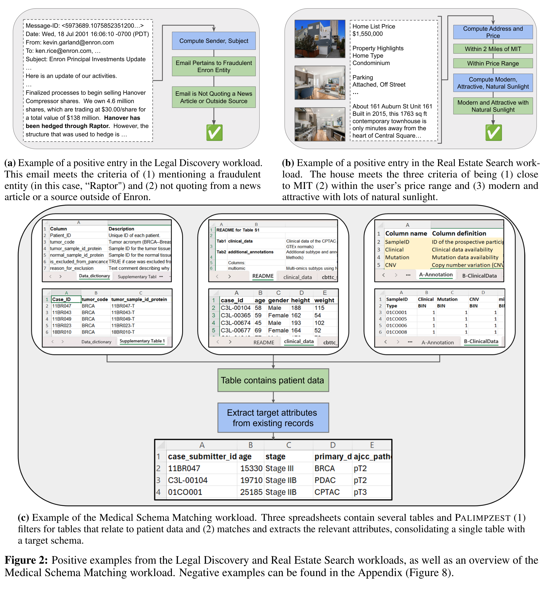
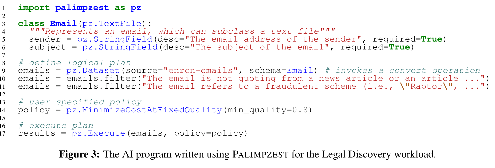
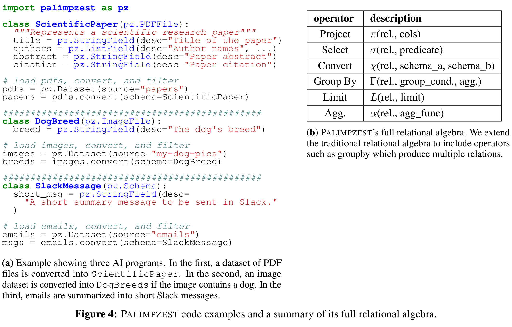
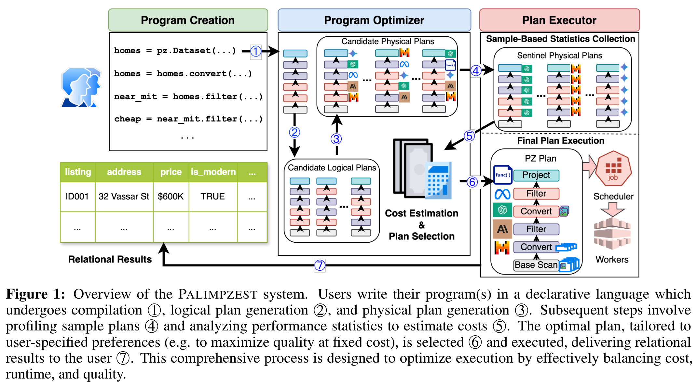
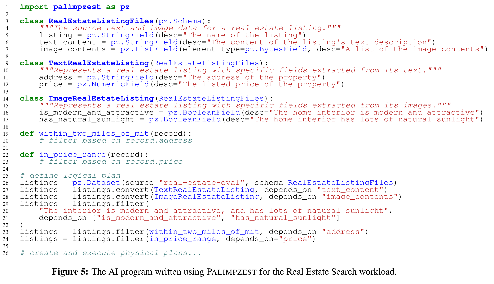
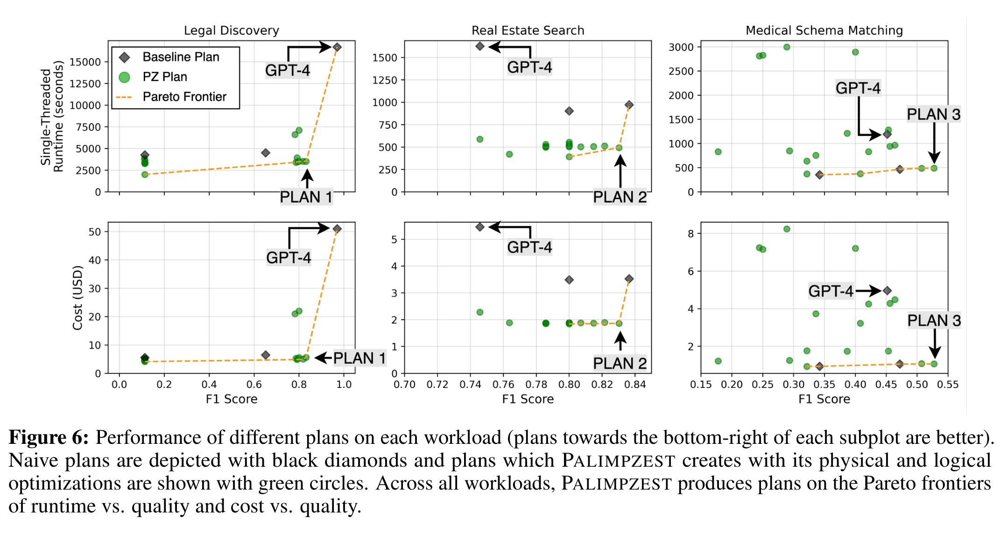
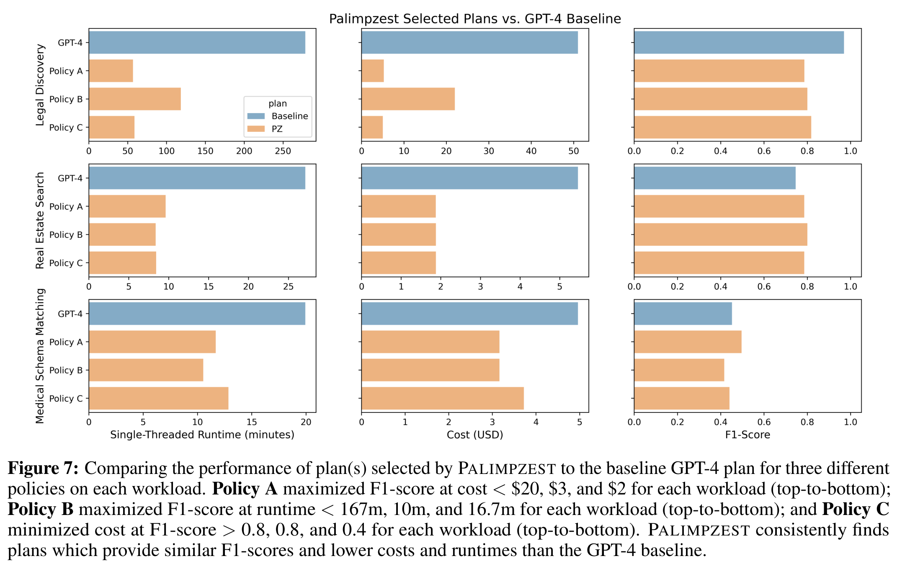

# PALIMPZEST 论文精读笔记

**阅读论文：** *A Declarative System for Optimizing AI Workloads*
**系统名称：** PALIMPZEST（不是 Palimpsest；名称借用了“palimpsest/不断覆写与修订”的含义）
**笔记依据：** 用户上传的 29 页 arXiv v2 版本，版本日期为 2024-05-29。正文中的 Section、Figure、Table、Algorithm 和页码均以该附件为准。

> **版本说明。** 附件是 2024 年 arXiv 预印本，题目为 *A Declarative System for Optimizing AI Workloads*。该工作后以 *Palimpzest: Optimizing AI-Powered Analytics with Declarative Query Processing* 发表在 CIDR 2025，正式会议版本的题目和作者列表有所调整。本笔记不把两个版本混在一起：方法与实验均严格依据附件版本，会议归属只在“论文基本信息”中说明。

---

# 0. 一页结论

## 0.1 这篇论文到底要解决什么问题

PALIMPZEST 面向一类作者称为 **Semantic Analytics Applications（SAPPs）** 的工作负载：它们同时包含传统数据处理和 AI 语义处理，处理对象通常是大规模文档、图像、表格或多模态记录，并且输出质量不是一个固定的二值属性，而是会随模型、提示、实现方法和预算而变化。

现有做法要求工程师手工决定：每个子任务使用什么模型、是否用代码替代模型、怎样组织 prompt、先执行哪个过滤、是否缩减 token、如何在运行时间、美元成本和结果质量之间取舍。作者认为，这些决定与传统数据库中的查询优化问题类似，应该由优化器而不是应用程序员持续手工完成。

## 0.2 PALIMPZEST 的核心答案

PALIMPZEST 让用户只描述：

- 输入和输出的 **Schema**；
- 数据集之间需要执行的关系操作；
- 字段和过滤条件的自然语言描述；
- 用户的优化 **Policy**，例如“在质量至少 0.8 时最小化成本”。

系统随后自动：

1. 把程序编译为逻辑关系计划；
2. 枚举逻辑等价计划，例如 Filter Reordering 和 Convert Reordering；
3. 为每个逻辑计划生成多种物理实现，例如不同模型、代码生成、不同 prompt 组织方式和不同 token budget；
4. 用少量样本执行三个 sentinel plans，估计各算子的选择率、运行时间、成本和质量；
5. 删除被支配计划，形成 runtime–cost–quality 的 Pareto frontier；
6. 根据用户 Policy 选出计划并执行。

其关键语言抽象是 **Convert operator**：它把 Schema A 的记录转换为 Schema B，并自动计算 B 中尚不存在的字段。Convert 的物理实现可以是 LLM、视觉模型、内置转换函数、合成代码或其他未来方法，因此用户声明的逻辑语义与具体 AI 实现被解耦。

## 0.3 论文最重要的实验结论

在 Legal Discovery、Real Estate Search 和 Medical Schema Matching 三个工作负载上：

- PALIMPZEST 生成的计划覆盖了多种运行时间、成本和质量折中，并在 Figure 6 中形成比单一模型 baseline 更有吸引力的 Pareto frontier。
- Real Estate Search 的 Plan 2 相比全 GPT-4 baseline，运行时间降低约 3.3 倍、成本降低约 2.9 倍，F1 最高还提高约 1.1 倍。
- Policy 驱动的优化器在 9 个约束实验中满足了 7 个；因此论文证明了优化器通常能选到有价值的计划，但没有证明其能严格满足所有约束。
- 使用 32 个 worker 并行执行 Convert 和 Filter 后，Legal Discovery 相对单线程 GPT-4 baseline 达到 90.3 倍加速和 9.1 倍成本降低，F1 为 baseline 的 83.5%。

> **结论边界。** 这些结果证明的是：在论文原型生成的候选计划空间、三个实验工作负载和指定模型/API 条件下，自动计划生成与选择能够产生显著收益。论文没有证明全局最优性，也没有证明 champion model 等同于真实标签，更没有证明对所有 SAPP、所有模型或生产规模集群都成立。

---

# 1. 论文基本信息

| 项目 | 内容 |
|---|---|
| 附件题目 | *A Declarative System for Optimizing AI Workloads* |
| 系统 | PALIMPZEST |
| 附件作者 | Chunwei Liu、Matthew Russo、Michael Cafarella、Lei Cao、Peter Baille Chen、Zui Chen、Michael Franklin、Tim Kraska、Samuel Madden、Gerardo Vitagliano |
| 共同一作 | Chunwei Liu、Matthew Russo |
| 单位 | MIT；University of Arizona（Lei Cao）；University of Chicago（Michael Franklin） |
| 附件版本 | arXiv:2405.14696v2，2024-05-29，29 页 |
| 正式发表 | CIDR 2025；正式题目为 *Palimpzest: Optimizing AI-Powered Analytics with Declarative Query Processing* |
| 研究主题 | Declarative AI programming、relational optimization、semantic analytics、LLM cost optimization |
| 原型规模 | 约 9,200 行 Python（Section 5.1） |

## 1.1 论文的研究对象不是普通聊天应用

论文不是在优化一次聊天请求，也不是只优化单个 LLM kernel。它针对的是对**大量数据对象**执行复合 AI 分析的程序，例如：

- 在 1,000 封邮件中找出真正与 Enron 欺诈活动有关、且不是转发新闻的邮件；
- 在 100 个多模态房产 listing 中筛选满足位置、价格、装修风格和采光条件的房屋；
- 从 11 个医学研究的 49 张异构表格中识别病人数据，并映射到统一的 15 属性 Schema。

这些程序更像数据库查询计划：输入是记录集合，中间经过多个算子，输出仍是记录集合。因此作者选择关系模型和查询优化器作为系统设计基础。

---

# 2. 研究背景与问题（Section 1）

## 2.1 背景：AI 组件已经进入数据处理流水线

Section 1 指出，现代 AI 应用往往是 compound AI systems，而不是单次模型调用。它们可能混合：

- RAG；
- 多模型 ensemble；
- 多步推理；
- 云端模型和数据服务；
- 传统解析、筛选、距离计算、表格转换等非 AI 操作。

当同一逻辑要在数百到数百万条记录上运行时，低吞吐、高费用的 AI 调用成为整个数据栈中最昂贵的部分。论文用当时的模型吞吐和 GPT-4o 价格说明这种数量级差距，但这些价格数字是 2024 年背景数据，并不是论文方法成立所依赖的固定常数。

## 2.2 工程师目前必须手工做的决定

论文列出的决策空间包括：

- prompt wording、zero-shot/few-shot、chain-of-thought 或 ReAct；
- 每个子任务使用哪个模型；
- 使用 foundation model、合成代码还是本地 student model；
- 是否合并子任务以改善 KV cache 利用或减少重复输入 token；
- 扩大数据规模后如何并行化；
- 外部数据系统参数，例如 RAG 返回多少 chunk；
- 用户当前更重视 runtime、financial cost 还是 quality。

困难不只在于选项多，还在于模型、价格和实现技术快速变化。一个今天合理的手工计划，明天可能因为新模型或新 API 价格而失效。

## 2.3 作者的核心判断

作者将这一情形类比于 1970 年代关系数据库优化器出现前的状态：

- 用户应写高层、声明式程序；
- 系统应枚举和评估多种低层实现；
- 优化目标应根据用户 Policy 决定；
- 新优化技术应能作为物理实现继续加入，而不要求用户重写程序。

这不是“让 LLM 自动写一个计划”，而是把 AI 数据处理程序放进一个数据库式的**逻辑计划—物理计划—成本估计—计划选择**框架中。

## 2.4 论文贡献

论文明确列出五类贡献：

1. 定义 SAPP 工作负载类别（Section 2）；
2. 给出 PALIMPZEST 架构与关系抽象（Section 3）；
3. 描述逻辑和物理优化空间（Section 4）；
4. 展示基本优化已能产生优于 naive plans 的折中方案（Section 5）；
5. 展示并行物理算子可相对单线程 GPT-4 baseline 获得最高 90.3 倍加速（Section 5.5）。

---

# 3. Section 2：Workloads

## 3.1 SAPP 的四个判定条件

作者把满足以下四点的程序称为 Semantic Analytics Applications：

1. **混合传统处理与 AI 语义推理。** 例如数值距离过滤与“房屋是否现代、漂亮”同时存在。
2. **数据密集。** 输入可以从数百扩展到数百万条记录。
3. **可分解为集合上的操作树。** 每个操作消费一组数据对象并产生另一组对象。
4. **答案质量可变。** 不同模型或近似方法会给出不同质量。

这四点非常关键：PALIMPZEST 不是面向任意 agent，而是面向可以被结构化为数据流/关系计划的 AI 分析任务。

## 3.2 三个运行示例



*图源：附件 arXiv 版本 Figure 2（PDF p.5），按原图裁切。上半部分分别给出 Legal Discovery 和 Real Estate Search 的正例，下半部分展示 Medical Schema Matching 从电子表格到统一病例 Schema 的处理流程。读这张图时应先区分传统数据处理与需要语义判断的步骤：它说明三个任务为什么能写成混合操作流水线，但不是三者性能或难度的横向比较。*

### 3.2.1 Legal Discovery（Figure 2a）

目标是找出同时满足以下条件的邮件：

- 与某个欺诈实体或投资工具有关；
- 不是新闻报道或 Enron 外部来源的引用。

第一个条件可能部分由正则、UDF 或较便宜模型完成，第二个条件需要理解邮件是在报告第一手活动还是转发新闻。优化机会来自：不同过滤的选择率和模型难度不同，应尽量先执行便宜且高选择率的步骤。

### 3.2.2 Real Estate Search（Figure 2b）

目标同时包含：

- 距 MIT 两英里以内；
- 价格在范围内；
- 房屋现代、漂亮且采光充足。

位置和价格可由文本抽取后用传统 UDF 计算；风格和采光通常需要图像或多模态模型。最明显的优化是：先用文本与 UDF 去掉不合格 listing，再对剩余记录调用昂贵的视觉模型。

### 3.2.3 Medical Schema Matching（Figure 2c）

任务分三步：

1. 从研究资料中取得 spreadsheet；
2. 从 49 张表里找出包含 patient case data 的表；
3. 将异构列映射到统一目标 Schema，并合并输出。

这一任务既有分类，又有 schema matching 和一对多记录生成。它说明 Convert 不只是“每行补一个字段”，还需要支持从一个 XLS 文件产生多张 Table、从一张 Table 产生多条 CaseData。

## 3.3 Workload optimization challenges

Section 2 强调，优化一个 SAPP 需要估计每个传统和语义步骤的：

- runtime；
- financial cost；
- quality；
- cardinality/selectivity；
- 输入和输出 token 数量。

尤其困难的是 quality：没有标签时，系统只能使用启发式方法或昂贵 champion model 近似。每加入一个物理优化，例如降低图片分辨率、换模型或缩减 token，优化器还要预测它对上述指标的影响。

## 3.4 System design challenges

作者认为系统还必须降低长期维护成本。模型和 prompting 方法不断变化，应用开发者不应反复重写流水线。PALIMPZEST 的目标是让程序员维护**业务语义**，而让优化器维护**实现选择**。

> **论文没有研究：** Section 2 没有给出完整的 SAPP benchmark，也没有证明四个判定条件覆盖所有 AI 数据应用。它只是提出一个工作负载类别并用三个任务实例化。

---

# 4. Section 3：Overview

## 4.1 Section 3.1：Semantic Analytics and the Relational Model

PALIMPZEST 把程序视为计算关系视图：

- 输入集合叫 **Dataset**；
- 每个 Dataset 具有 **Schema**；
- 用户描述一系列关系操作，将输入 Dataset 变成目标 Dataset；
- 程序采用 lazy execution，只有调用 `Execute()` 时才真正生成和执行计划。

Figure 3 的 Legal Discovery 程序包含四个关键动作：



*图源：附件 arXiv 版本 Figure 3（PDF p.6），按原图裁切。代码把 Schema 字段说明、两个自然语言 Filter、质量约束 Policy 和最后的 `Execute()` 放在同一声明式程序中。关键不是逐行执行顺序，而是用户先声明“要什么”，系统在 lazy execution 阶段再决定“怎样执行”；因此这是一张接口与语义示例图，不是实际运行轨迹。*

1. 定义 `Email` Schema，并声明 `sender`、`subject` 字段及其描述；
2. 把预注册的 `enron-emails` 数据集转换为 `Email`；
3. 添加两个语义 Filter；
4. 指定 `MinimizeCostAtFixedQuality(min_quality=0.8)`，再调用 `Execute()`。

字段和 Filter 的自然语言描述具有双重作用：

- 定义用户期望的语义；
- 作为内部 prompt 构造的输入。

作者明确表示，希望用户写“目标描述”，而不是反复做 prompt engineering；论文实验中的描述只设置一次，没有针对结果反复调参。

### 4.1.1 完整关系代数（Figure 4b）



*图源：附件 arXiv 版本 Figure 4（PDF p.9），按原图裁切。左侧展示 PDF、图片和邮件的 Convert 写法，右侧列出 Project、Select、Convert、Group By、Limit 与 Aggregation。右表描述的是系统提出的算子空间；论文实验主要验证 Convert 与 Filter，不能仅凭这张表推断 AI Group By 或 AI Aggregation 已得到同等实现与评估。*

| 算子 | 论文符号 | 作用 |
|---|---|---|
| Project | π(rel., cols) | 选择输出列 |
| Select | σ(rel., predicate) | 根据传统或语义条件过滤记录 |
| Convert | χ(rel., schema_a, schema_b) | 从 Schema A 转换到 Schema B，生成缺失字段 |
| Group By | Γ(rel., group_cond., agg.) | 分组，可产生多个关系 |
| Limit | L(rel., limit) | 限制结果数 |
| Aggregation | α(rel., agg_func) | 聚合 |

论文原型实现了 Figure 4b 中的这些算子，但评估主要围绕 Convert 和 Filter。作者只提出未来可让 Group By 和 Aggregation 也采用 AI 语义，例如按情感分组；本文没有实现或评估这种 AI Group By/Aggregation。

## 4.2 Section 3.2：Convert

### 4.2.1 定义

**输入：** 一个 Schema A 的 typed object，以及目标 Schema B。
**输出：** Schema B 中尚未存在于 Schema A 的字段；输出记录数可以是 0、1 或多个。

如果物理实现使用 LLM，系统把 Schema A 的字段作为 key-value pairs，加上用户写的字段描述，构造 prompt，让模型产生 Schema B 所需字段。

### 4.2.2 为什么 Convert 是全文最关键的抽象

传统关系代数擅长在已有结构化字段上筛选、投影和聚合，但 SAPP 的核心难题通常是：

- 从 PDF 中抽取 title、authors、abstract；
- 从图片中识别 dog breed；
- 把邮件摘要成 Slack message；
- 从多模态房源中抽取价格、地址、装修风格；
- 从异构医学表格映射到统一 CaseData。

Convert 把这些不同任务统一为“从一种 Schema 生成另一种 Schema”。这样优化器不需要为摘要、分类、抽取、图像识别分别设计完全不同的逻辑接口，而可以在同一个算子下枚举多种物理实现。

### 4.2.3 执行步骤

1. 比较 Schema A 和 Schema B；
2. 找出 B 中尚未存在的字段；
3. 根据可用物理实现选择方法，例如内置函数、UDF、LLM、视觉模型或合成代码；
4. 对每条输入记录生成目标字段；
5. 如果转换失败，当前原型丢弃该记录并继续；
6. 根据 cardinality 语义产生 0、1 或多个输出记录。

### 4.2.4 设计理由

- **增量 Schema。** 子类可继承父 Schema，只声明新增字段。
- **逻辑与物理解耦。** 用户不承诺 Convert 一定由 LLM 实现。
- **可优化。** 同一 Convert 可有不同模型、prompt、代码或 token budget。
- **统一多种 AI 任务。** 信息抽取、摘要、分类、视觉理解都能被表示为 Schema 转换。

### 4.2.5 明确边界

- 当前原型在 Convert 失败时直接丢记录；论文计划未来支持 warning 或 abort。
- 用户仍可提供 lambda/UDF 以保证某些确定性转换，但不是必需。
- 跨多个低层数据域自动寻找信息，例如“价格可能在文本也可能嵌在图片中”，被作者列为未来工作。
- 论文没有给出 Convert 正确性的形式化语义，也没有证明任意自然语言 Schema 描述都可被正确实现。

## 4.3 Section 3.3：Correctness and Quality

这一节区分两个问题。

### 4.3.1 Correctness goals：用户到底想要什么

Schema 名、字段名和描述通常应足以表达目标，但可能存在歧义。例如 `institution` 是第一作者单位、最常见单位，还是出版机构？

当前原型给用户两个修正手段：

1. 写得更精确的字段/Filter 描述；
2. 把一个模糊逻辑步骤改写为多个更具体步骤。

作者正在开发“在程序中提供 validation examples”的支持，但附件版本尚未实现。

### 4.3.2 Output quality：系统怎样估计计划质量

当前方法是 **champion model**：

- 选择强模型（实验中为每个操作都用 GPT-4 的 plan）；
- 把其输出当作近似 ground truth；
- 在 operator granularity 上比较其他模型或实现的输出；
- 用这些比较结果估计完整计划质量。

这不是人工标签，也不是真正 ground truth。论文实际评测时使用人工标签计算最终 F1，但优化器在选计划时看不到这些标签。

> **关键区分：** “优化器估计质量”依赖 GPT-4 champion；“论文报告的最终质量”依赖人工标注。两者不能混为一谈。

## 4.4 Section 3.4：Cost Optimization Framework



*图源：附件 arXiv 版本 Figure 1（PDF p.3），按原图裁切。编号 1–3 展开逻辑与物理候选，4–5 用 sentinel 小样本收集统计并估计 runtime、cost、quality，6 按 Policy 选计划，7 执行并返回关系结果。这张图解释了组件间的数据流；它本身并不证明估计无误，也不意味着 Policy 的约束一定严格满足。*

Figure 1 的七个编号步骤可整理为：

```text
用户声明式程序
  ↓ ① 编译
初始逻辑计划
  ↓ ② 逻辑等价变换
候选逻辑计划
  ↓ ③ 物理实现枚举
候选物理计划 + sentinel plans
  ↓ ④ 小样本执行
算子级统计数据
  ↓ ⑤ 估计 runtime / cost / quality
Pareto frontier
  ↓ ⑥ 按用户 Policy 选择
最终物理计划
  ↓ ⑦ 执行
关系结果
```

### 4.4.1 逻辑计划层

这一层决定操作的结构和顺序，例如 Filter 先后、Convert 是否能移到某个 Filter 后面。它保留用户程序语义，但不决定具体模型。

### 4.4.2 物理计划层

这一层决定：

- 每个 Convert/Filter 使用哪个模型；
- 是否用代码合成；
- 一次 prompt 计算一个字段还是多个字段；
- 是否缩减输入 token；
- 其他可扩展的模型执行策略。

### 4.4.3 计划评估与选择

系统先执行少量 sentinel plans，收集 selectivity、token、runtime、cost 和 operator quality 统计，再估计大量候选物理计划，删除非 Pareto 计划，并按 Policy 选出最终方案。

## 4.5 Section 3.5：Dataset Registration and Result Caching

### 4.5.1 Dataset registration

基础 Dataset 必须预注册并有唯一名字，例如 `enron-emails`。当前原型只支持本地命名，未来才计划支持全局命名服务。标准库支持单文件和目录，关系数据库、S3 等被列为未来数据源。

### 4.5.2 Result caching

系统尽量避免重复 LLM 调用：

- 当前按 Dataset 粒度缓存中间结果；
- 利用基础 Dataset 的唯一名字发现不同程序间的共享计算；
- 未来可能改为 record-level caching。

问题在于不同物理计划可能产生不同质量的结果。同一逻辑程序两次运行也可能返回不同数据。作者计划为缓存结果记录质量统计，并在用户质量偏好变化时失效旧缓存；附件原型尚未实现质量感知缓存。

---

# 5. Section 4：Program Optimization

## 5.1 Section 4.1：Logical Optimizations

### 5.1.1 Filter Reordering

**输入：** 含多个可交换 Select/Filter 的逻辑计划。
**步骤：** 枚举所有合法排列；例如 A、B、C 三个 Filter 可生成另外五个排列。
**设计理由：** 若 Filter 选择率不同，把高选择率或低成本 Filter 放前面可减少后续记录数。
**统计来源：** 初始时未知，由 sample execution 估计。

论文没有使用传统数据库中复杂的动态规划搜索；原型直接枚举排列。随着 Filter 数增加，排列数会阶乘增长，论文没有评估这一扩展性问题。

### 5.1.2 Convert Reordering

**输入：** 混合 Convert 和 Filter 的逻辑计划，以及算子依赖。
**步骤：** 在不破坏依赖的前提下移动 Convert；若某 Filter 不依赖 Convert 新生成的字段，就可把昂贵 Convert 放到该 Filter 之后。
**设计理由：** 先过滤再执行昂贵 AI 转换，可减少模型调用。

Real Estate Search 是典型例子：先执行地址和价格相关的文本/UDF 步骤，再运行 GPT-4 Vision。

当前系统依赖程序员显式提供 `depends_on`。自动推导依赖被列为未来工作。

### 5.1.3 逻辑等价与 AI 输出差异

Section 4.1 明确指出：两个重排后的逻辑计划在语义上等价，但如果物理 prompt 设计不谨慎，LLM 可能给出实质不同结果。因此系统还需要保证物理实现忠实于逻辑计划。论文提出了这一问题，但没有给出形式化等价证明或完整验证机制。

## 5.2 Section 4.2：Physical Optimizations

下表严格区分附件原型已经实现和仅作为未来方向描述的优化。

| 优化 | 原型状态 | 核心作用 |
|---|---|---|
| Model Selection | 已实现 | 为不同算子选择不同模型 |
| Code Synthesis | 已实现 | 用 LLM 生成传统函数，替代后续 LLM 调用 |
| Multi-data Prompt Marshaling | 已实现 | 决定按行/按列、单字段/多字段组织 prompt |
| Input Token Reduction | 已实现 | 删除部分输入，降低 token 成本与延迟 |
| Output Token Reduction | 未作为原型评估项 | 用索引/人工 token 等方式缩短生成输出 |
| Model Cascades | 未实现 | 低成本模型高置信时直接返回，否则升级模型 |
| Knowledge Distillation | 未实现 | 为算子训练较小 student model |
| Workload-Aware Execution Management | 未实现 | 利用整批请求信息做 batching、KV reuse、co-scheduling |

### 5.2.1 Model Selection

**输入：** 一个由多个 Convert/Filter 组成的物理计划候选，以及各模型在各算子上的估计统计。
**步骤：** 对每个操作分别选择模型，而不是整个程序固定使用 GPT-4、GPT-3.5 或 Mixtral。
**设计理由：** 不同操作难度不同；便宜模型可能在某一 Filter 上很差，却在另一个 Convert 上足够好。

Legal Discovery 的 Plan 1 正是按算子混合模型，而非全程单一模型。

### 5.2.2 Code Synthesis

**输入：** 某个 Convert 的样本输入与目标转换描述。
**步骤：** 让 LLM 生成执行转换的函数；后续记录调用该函数而不是继续调用 LLM。
**设计理由：** 结构化抽取等任务有时不需要深语义推理，传统代码更快且无逐条 API 成本。

论文没有给出代码合成 prompt、生成代码的验证流程、失败回退策略或安全隔离机制；因此本文只能确认其存在和实验中的速度收益，不能推断它具备通用可靠性。

### 5.2.3 Multi-data Prompt Marshaling

该优化决定如何把多个数据项和多个目标字段组织成模型调用。

- **行式/合并式：** 一次输入一个记录，同时计算多个字段，可避免重复发送相同输入 token。
- **列式/拆分式：** 先计算能支持高选择率 Filter 的字段，过滤后再计算大字段，可能更省。
- **上下文窗口约束：** 不同模型能在一次调用中容纳的记录数不同。

论文用 `ScientificPaper` 举例：title、authors、abstract、citation 可以一起算，也可以拆开；如果 title 后接高选择率 Filter，而 citation 输出很大，拆开可能更优。

### 5.2.4 Input Token Reduction

**输入：** 原始对象、目标字段、候选 token budget。
**步骤：** 通过样本“实验”判断哪些输入区域对目标字段必要，并只保留部分输入。
**设计理由：** 许多字段只依赖文档的一小部分，例如论文 title/authors 通常位于开头；缩短输入直接降低费用和延迟。

论文把它类比为短生命周期的“micro-RAG”。但附件没有给出正式算法、文本区域选择规则或质量置信区间。实验中的 token budget 以比例体现，例如 Real Estate Plan 2 为 0.5，Medical Plan 3 为 0.9。

### 5.2.5 Output Token Reduction（未完整实现/未评估）

作者提出：给输入块插入人工 token，让模型只返回命中块的 token 编号，再由系统取回原文。早期案例可把数千 token 输出降到两个 token。但论文没有在 Section 5 中评估这一优化，不能把它视为已验证贡献。

### 5.2.6 Model Cascades（未实现）

先用便宜、低质量模型；高置信时直接接受，否则升级到昂贵模型。作者说该方法在其他视觉系统中成功，但 PALIMPZEST 原型尚未实现。

### 5.2.7 Knowledge Distillation（未实现）

对某个算子，用昂贵模型作为 teacher，训练小而快的 student。论文只提出可行方向，没有实现与实验。

### 5.2.8 Workload-Aware Execution Management（未实现）

作者提出 PALIMPZEST 已知整个模型请求工作负载，因此未来可以：

- 给模型服务提供 batch hints；
- 对相似 prompt 共同调度，提高 KV cache reuse；
- 根据相似输出长度组 batch，减少短请求等待；
- 利用 prefill prepacking 等 serving 技术。

这一段与运行时调度研究最直接相关，但在附件原型中是未来工作，而不是已实现机制。

## 5.3 Section 4.3：Choosing an Optimization

> **原论文 Algorithm 1（p.12）**：Optimized Plan Selection Algorithm。
> 本节已把算法输入、候选生成、sentinel sampling、Pareto 剪枝与 Policy 选择逐步转写为可搜索文字，因此不再重复插入代码截图。

### 5.3.1 输入与输出

**输入：** `userCode`、`userPolicy`。
**输出：** 满足用户目标的最终物理计划。

### 5.3.2 Algorithm 1 逐步解释

#### Step 1：生成逻辑候选

`generateLogicalCandidates(userCode)` 对用户程序应用 Filter Reordering、Convert Reordering 等，得到所有合法逻辑计划。

#### Step 2：生成 sentinel physical plans

`getPhysicalPlans(..., sentinel=True)` 生成少量固定基准计划。原型使用三个：

- 所有 Convert/Filter 都用 GPT-3.5；
- 所有 Convert/Filter 都用 Mixtral-8x7B；
- 所有 Convert/Filter 都用 GPT-4。

它们不是最终候选的全集，而是探针，用于理解不同算子的选择率、token、运行时间和相对质量。

#### Step 3：小样本执行与统计

对 `NUM_SAMPLES` 个输入：

1. `getSampledInput()` 取样；
2. `runAndComputeStatistics()` 执行 sentinel plans；
3. 累积 `performanceStatistics`。

质量统计以 GPT-4 champion plan 为参照，并在 operator granularity 上比较。

#### Step 4：生成完整物理候选

`getPhysicalPlans(logicalPlans, stats=...)` 根据统计为每个逻辑计划枚举不同模型、代码合成、prompt 组织和 token budget。原型生成的候选数为：

- Legal Discovery：234；
- Real Estate Search：10,140；
- Medical Schema Matching：1,950。

#### Step 5：剪枝与 Pareto frontier

- `naiveElimination()` 用简单规则删除明显无用计划；
- `scoreAndEliminatePlans()` 估计 runtime、cost、quality，并删除不在 Pareto frontier 上的计划。

一个计划若在三个维度上都不优于另一计划，就没有必要保留。最终 frontier 保留不同偏好下可能最优的折中点。

#### Step 6：按 Policy 选择

`chooseBestPlan(frontierCandidates, userPolicy)` 根据用户目标选出最终计划，例如：

- 在 F1 大于阈值时最小化成本；
- 在成本小于阈值时最大化质量；
- 在运行时间小于阈值时最大化质量。

### 5.3.3 论文自己承认的算法不足

作者直接称 Algorithm 1 “admittedly naive”：

- sampling 阶段没有严格终止条件；
- 三个 sentinel plans 是任意选择的；
- 没有给出估计误差边界；
- 不能保证选到生成空间中的真实最优计划。

作者的实验目标不是证明优化理论完备，而是证明一个简单原型已经可以找到接近有用 frontier 的计划。

---

# 6. Section 5：Evaluation

## 6.1 Section 5.1：Our Prototype

### 6.1.1 实现

- 约 9,200 行 Python；
- 实现 Figure 4b 的关系算子；
- 实现四种优化：Model Selection、Code Synthesis、Multi-data Prompt Marshaling、Input Token Reduction；
- 执行模型采用 iterator model：记录逐条流经算子，每个算子阻塞等待所需输入。

### 6.1.2 模型和服务

| 类别 | 具体实现 |
|---|---|
| OpenAI text | `gpt-3.5-turbo-0125`、`gpt-4-0125-preview` |
| OpenAI vision | `gpt-4-vision-preview` |
| 开源模型服务 | `Mixtral-8x7B-Instruct-v0.1`，通过 Together.ai API |
| 非 AI 批处理 | Modal，用于并行 PDF 处理、公式图像抽取/转换等 |
| 本地模型 | 通过 Ollama 测试过，但作者称当时很少是有吸引力的选项 |

大多数实验报告单线程执行，以便展示优化减少了多少工作；Section 5.5 才加入算子并行。

## 6.2 Section 5.2：Evaluation Workloads

### 6.2.1 Legal Discovery

| 项目 | 设置 |
|---|---|
| 数据集 | Enron email collection 中的 1,000 封邮件 |
| 人工构造 | 50 封真正讨论欺诈投资工具；30 封包含欺诈相关文本但本质不属欺诈；其余随机 |
| 程序 | Figure 3：TextFile→Email Convert；两个语义 Filter |
| 指标 | 最终输出相对人工标签的 F1-score |
| 优化器可见标签 | 不可见；只能用 unsupervised/champion 方法估计质量 |

论文目标是只找出真正表明欺诈活动的邮件，而不是看到 “Raptor”等词就全部判正。

### 6.2.2 Real Estate Search

| 项目 | 设置 |
|---|---|
| 数据集 | 手工抓取 Boston/Cambridge 的 100 个 listing |
| 多模态数据 | 每个 listing 的文本描述和前三张去重图片 |
| 人工标签 | 位置、价格、modern/attractive、natural sunlight |
| 正例数 | 23/100 满足全部条件 |
| 程序 | Figure 5；文本 Convert、图像 Convert、两个 UDF Filter、一个语义 Filter |
| 依赖声明 | 使用 `depends_on`，允许文本过滤先执行并跳过图像处理 |
| 指标 | 最终结果相对人工标签的 F1-score |



*图源：附件 arXiv 版本 Figure 5（PDF p.14），按原图裁切。文本 Schema、图片 Schema、传统 UDF Filter 和语义 Filter 被组织在一个程序中；`depends_on` 显式写出字段依赖，使优化器有机会先按地址和价格过滤，再决定是否调用图像 Convert。这里展示的是合法依赖与可重排空间，不是“视觉调用必然成为瓶颈”或“重排必然提升质量”的实验证据。*

Figure 5 中两个传统 Filter 分别依据 `address` 和 `price`，图像 Convert 产生 `is_modern_and_attractive` 与 `has_natural_sunlight`。

### 6.2.3 Medical Schema Matching

| 项目 | 设置 |
|---|---|
| 输入 | 11 个 spreadsheet 文件，共 49 张表 |
| 第一步 | 识别包含 patient case data 的表 |
| 第二步 | 映射到 15 个目标属性 |
| 输出 | 统一 CaseData 表 |
| 关键语言特性 | `cardinality="oneToMany"`：一个 XLS→多张 Table；一张 Table→多条 CaseData |
| ground truth | 人工标注源列与目标 harmonized table 列的匹配关系 |
| 指标 | 跨目标属性和论文研究的 micro-average F1 |

作者强调原研究的数据整理非常耗时，而 PALIMPZEST 程序约 30 行。但论文没有把“30 行代码”与人工整理时间做严格端到端生产力实验。

## 6.3 Section 5.3：Optimizations Produce Plans with Diverse Performance Trade-offs

### 6.3.1 实验问题

这一节只验证：PALIMPZEST 能否**生成**一组有价值计划。它暂时不验证最终 Policy 选择是否正确。

### 6.3.2 计划与 baseline

每个工作负载最终执行 20 个计划，包括：

- optimizer frontier plans；
- 三个 naive baselines：全 GPT-4、全 GPT-3.5、全 Mixtral；
- 距估计 Pareto frontier 最近的若干其他候选。

编译时间：

- Legal Discovery：2.6 s；
- Real Estate Search：13.1 s；
- Medical Schema Matching：2.7 s。

sentinel sampling 使用总输入的 5%；Medical Schema Matching 因只有 11 个文件，使用 1/11 输入。



*图源：附件 arXiv 版本 Figure 6（PDF p.15），按原图裁切。横轴是 F1，纵轴分别是单线程 runtime 和 cost，因此越靠右下越好；黑色菱形是单模型 baseline，绿色圆点是 PALIMPZEST 计划，橙色虚线连接实测 Pareto frontier。每个工作负载的坐标尺度不同，应在各自面板内比较，不能用点间视觉距离跨任务判断收益大小。该图证明候选空间中存在有吸引力的折中点，但不证明优化器总能选中正确的点。*

Figure 6 的横轴是 F1，纵轴分别是单线程 runtime 和 cost；越靠右下越好。图中点是实际执行值，不是优化器估计值。

### 6.3.3 Legal Discovery：Plan 1

主要结果：

- 相对全 GPT-3.5 baseline，F1 高 7.3 倍，同时 runtime、cost 更低；
- 相对全 Mixtral baseline，F1 高 1.3 倍，同时 runtime、cost 更低；
- 相对全 GPT-4 baseline，Plan 1 附近计划约快 4.7 倍、便宜 9.1 倍，F1 最高达到 GPT-4 的 85.7%。

Appendix 给出的 Plan 1：

1. 内置函数：File→TextFile；
2. Mixtral：TextFile→Email；
3. Mixtral：判断是否涉及欺诈投资工具；
4. GPT-3.5：判断是否引用新闻/Enron 外部来源。

这个结果说明“一种模型跑到底”很容易被按算子选模型的计划支配。GPT-3.5 和 Mixtral 各自在某个 Filter 上表现差，但不代表它们在所有操作上都差。

### 6.3.4 Real Estate Search：Plan 2

主要结果：

- runtime 约为 GPT-4 baseline 的 1/3.3；
- cost 约为 GPT-4 baseline 的 1/2.9；
- F1 最高约为 baseline 的 1.1 倍。

Plan 2 的关键机制：

1. GPT-3.5 读取 50% listing 文本，抽取地址和价格；
2. 先执行距离和价格 UDF Filter；
3. 只对剩余 listing 调用 GPT-4 Vision；
4. 再由 GPT-3.5 对图像属性做语义过滤。

真正节省成本的核心不是“更快的视觉模型”，而是通过 Convert/Filter 重排**避免大量视觉调用**，并用 50% token budget 缩短文本输入。

### 6.3.5 Medical Schema Matching：Plan 3

主要结果：

- runtime 约降低 2.4 倍；
- cost 约降低 4.6 倍；
- F1 最高约为 GPT-4 baseline 的 1.2 倍。

Plan 3 使用：

1. Mixtral 过滤含 patient age 的表；
2. Mixtral 将 Table 转换为 CaseData；
3. token budget 为 0.9，即裁剪约 10% 输入。

这一结果说明 GPT-4 不一定在每个特定 schema matching 任务上质量最高。论文报告的是该数据集上的实测结果，不能推广为 Mixtral 普遍优于 GPT-4。

### 6.3.6 本节真正证明了什么

本节证明 PALIMPZEST 的候选空间包含多个优于 naive single-model plans 的点，而且不同用户偏好可以选择不同 frontier 点。

本节没有证明优化器一定会选中这些点；这个问题在 Section 5.4 单独验证。

## 6.4 Section 5.4：Cost Optimizer Selects Plans with Significant Performance Improvements

### 6.4.1 三类 Policy

| Policy | Legal Discovery | Real Estate Search | Medical Schema Matching |
|---|---:|---:|---:|
| A：在成本约束下最大化 F1 | Cost < $20 | Cost < $3 | Cost < $2 |
| B：在 runtime 约束下最大化 F1 | Runtime < 10,000s | Runtime < 600s | Runtime < 1,000s |
| C：在质量约束下最小化成本 | F1 > 0.80 | F1 > 0.80 | F1 > 0.40 |

这些阈值是作者根据 Section 5.3 的可达到结果设置的“有挑战但现实”的值，不是外部 SLA。



*图源：附件 arXiv 版本 Figure 7（PDF p.17），按原图裁切。三行依次对应 Legal Discovery、Real Estate Search 和 Medical Schema Matching，三列依次报告单线程 runtime、cost 与 F1；蓝色为全 GPT-4 baseline，橙色为 Policy A/B/C 所选计划。读图时应把“更低的时间/成本”和“相近或更高的 F1”结合起来，并同时核对下一节 Table 1：9 个约束只满足了 7 个，所以该图支持近似代价优化有效，不支持严格约束保证。*

### 6.4.2 约束满足情况（Table 1）

PALIMPZEST 满足 9 个约束中的 7 个。两次失败是：

- Medical Schema Matching，Policy A：实际成本 $3.16，没有满足 < $2；
- Real Estate Search，Policy C：实际 F1 = 0.79，没有满足 > 0.80。

这说明成本模型和质量模型是近似的。论文没有把优化器描述成严格约束求解器。

### 6.4.3 各工作负载结果

**Legal Discovery：** Policy A 所选计划相对 GPT-4 baseline，runtime 低 80.0%，cost 低 89.7%，F1 为 baseline 的 81.1%；Policy C 的 F1 为 baseline 的 84.3%。

**Real Estate Search：** 三个 Policy 所选计划平均 runtime 低 67.5%、cost 低 65.7%，F1 高 6%。

**Medical Schema Matching：** 所选计划可达到 runtime 低 47.2%、cost 低 36.3%，F1 与 GPT-4 baseline 可比。

作者还声称节省量超过 sample collection 的开销，但没有给出对所有 workload 的完整 sampling 成本分解表。

### 6.4.4 本节真正证明了什么

- 采样统计通常足以帮助优化器选出显著优于全 GPT-4 的计划；
- 用户 Policy 可以把同一候选空间映射到不同折中点；
- 估计并不完美，不能保证约束始终满足。

## 6.5 Section 5.5：Minimizing Runtime with Parallel Operators

### 6.5.1 设置

- Convert 和 Filter 每个使用 32 个 worker；
- 算子内部并行；
- **没有 operator pipelining**：必须等一个算子处理完全部记录，下一算子才开始；
- 每个 workload 使用 Policy A 选计划；
- 对比对象是单线程、全 GPT-4 baseline。

### 6.5.2 Table 2 数值

| Workload | GPT-4 baseline | PALIMPZEST | 论文报告的结论 |
|---|---|---|---|
| Legal Discovery | 16,712s；$51.0；F1 0.97 | 185s；$5.60；F1 0.81 | 90.3× 加速；9.1× 低成本；F1 为 83.5% |
| Real Estate Search | 1,626s；$5.46；F1 0.75 | 80.9s；$1.86；F1 0.80 | 20.0× 加速；2.9× 低成本；F1 为 107% |
| Medical Schema Matching | 1,195s；$4.96；F1 0.45 | 215s；$3.36；F1 0.46 | 5.6× 加速；1.5× 低成本；F1 为 102% |

### 6.5.3 实验解释

作者强调并行 prompt 本身并非新算法，PALIMPZEST 的价值是让用户无需手工改写程序即可得到并行实现。

> **笔记分析，不是论文原文结论：** Table 2 把“优化计划变化”和“32 worker 并行”同时加入，再与“单线程全 GPT-4”比较。因此 90.3 倍不能被解释为纯调度加速，也不能被解释为纯计划优化收益。论文没有提供“同一物理计划单线程 vs 32 worker”的完整对照来分离两者。

---

# 7. Figure、Table、Algorithm 索引

| 编号 | 位置 | 应读出的核心信息 |
|---|---|---|
| Figure 1 | p.3 | 完整闭环：声明程序→逻辑/物理枚举→sentinel sampling→成本估计→Policy 选择→执行 |
| Figure 2 | p.5 | 三个 SAPP workload 如何混合传统和语义操作 |
| Figure 3 | p.6 | Legal Discovery 的声明式程序、Policy 和 lazy Execute |
| Figure 4 | p.9 | Convert 示例与完整关系代数 |
| Figure 5 | p.14 | Real Estate 中的多模态 Schema、`depends_on` 和 UDF Filter |
| Figure 6 | p.15 | PALIMPZEST 计划覆盖 Pareto frontier，Plan 1/2/3 的位置 |
| Figure 7 | p.17 | 三类 Policy 下所选计划与 GPT-4 baseline 的 runtime/cost/F1 |
| Figure 8 | p.29 | Legal/Real Estate 负例，说明仅关键词命中或位置价格合格仍不足 |
| Figure 9 | p.29 | Medical 的 one-to-many Convert 和 15 字段 CaseData |
| Table 1 | p.17 | 9 个约束只满足 7 个，暴露估计误差 |
| Table 2 | p.18 | 32 worker 并行计划的端到端结果 |
| Algorithm 1 | p.12 | sentinel sampling、候选生成、Pareto 剪枝、Policy 选择 |

---

# 8. 优点与局限

## 8.1 优点

### 8.1.1 把 quality 变成优化器的一等指标

传统数据库优化多以时间和资源为主；PALIMPZEST 明确把 runtime、financial cost、quality 同时放进计划空间，并允许“固定其中一个约束，优化另一个”的 Policy。这比只追求最低延迟更符合 AI 算子的真实使用方式。

### 8.1.2 Convert 提供了高价值的语义中间表示

Convert 既比直接 prompt 高层，又比“任意 agent”更有结构。Schema 字段是优化器可观察、可拆分、可合并和可依赖分析的语义单位，使 Filter Reordering、prompt marshaling 和 model selection 成为可能。

### 8.1.3 全局计划比单点模型优化更重要

Real Estate Plan 2 的主要收益来自跳过图像模型，而不是把视觉模型本身加速。这说明全局的 operator ordering/cardinality reduction 可以比单个模型 kernel 优化更有价值。

### 8.1.4 采样适应快速变化的模型环境

模型质量和价格会变化，完全依赖离线固定 cost model 很脆弱。sentinel sampling 使优化器可以在当前 workload 上重新测量算子行为，方向上适合快速演化的 AI 服务。

### 8.1.5 论文对“已实现”和“未来方向”区分较清楚

Section 4.2 明确指出哪些优化在原型中实现，哪些尚未实现；Section 5 也只评估已实现部分。

## 8.2 作者在正文中明确暴露的局限或未来工作

附件没有独立的 “Limitations” Section；Section 7 是 Conclusion。以下内容来自 Sections 3–5 中作者明确写出的限制和未来工作：

1. Convert 失败时当前原型直接丢记录，未来才支持 warning/abort。
2. 多模态字段位置自动发现仍是未来工作。
3. validation examples 尚未支持。
4. 质量估计依赖 champion model，未来才允许用户标签。
5. base Dataset 只有本地命名，全球命名服务未实现。
6. 数据源范围有限，关系数据库和 S3 支持是未来工作。
7. 缓存按 Dataset 粒度，record-level 和 quality-aware invalidation 未实现。
8. Convert/Filter 依赖需要程序员用 `depends_on` 显式提供，自动推导未实现。
9. Algorithm 1 无严格采样终止条件，sentinel plans 任意选择。
10. 视觉处理优化尚未探索，Real Estate 中视觉调用仍占主要成本。
11. 并行实验没有 operator pipelining。
12. Model Cascades、Knowledge Distillation、Workload-Aware Execution Management 未实现。

## 8.3 笔记分析：论文没有证明或未研究的事项

以下是基于论文内容的分析，不属于作者原文结论：

1. **没有全局最优保证。** 计划生成空间本身有限，剪枝和统计都有近似。
2. **没有严格质量保证。** champion model 可能系统性偏离真实标签；论文没有置信区间或校准方法。
3. **没有大规模搜索扩展性分析。** Real Estate 已生成 10,140 个物理计划，但 Filter 排列和物理组合可能快速膨胀。
4. **没有动态运行时反馈闭环。** 计划选定后，论文没有根据实时队列、endpoint 负载、KV cache、故障或价格变化在线重优化。
5. **没有跨租户公平性或 SLA 调度。** Workload-Aware Execution 只作为未来方向。
6. **没有完整可复现实验环境成本。** 使用多个云 API，论文未给出所有并发限制、网络波动和服务版本控制细节。
7. **并行收益未分解。** Table 2 同时改变计划和并行度。
8. **用户仍需提供结构。** “无需额外工作”指无需手工做优化，不等于无需定义 Schema、字段描述、逻辑步骤、依赖和某些 UDF。
9. **只有三个 workload。** 结果不足以证明对所有 SAPP 类型泛化。

---

# 9. Related Work 定位（Section 6）

| 系统/方向 | PALIMPZEST 认为的主要区别 |
|---|---|
| LangChain、LlamaIndex | 更偏 prompt/template/RAG 组装，没有 PALIMPZEST 的高层关系计划与全局优化 |
| DSPy | 重点优化 prompt quality，较少关注端到端 runtime/cost，且程序员仍需决定 ML 算法 |
| Outlines、Guidance、RELM | 主要约束输出格式，范围较窄 |
| SGLang | 提供低层 prompt、batch、并行原语；PALIMPZEST 认为未来可把它作为 compiled runtime |
| SkyPilot | 优化粗粒度云任务放置，不生成程序特定的算子实现 |
| FrugalGPT | 同样关注模型/成本折中，但 PALIMPZEST 面向含传统处理和多种 AI 组件的完整程序 |
| AutoGen | 用 agent conversation 表达应用；PALIMPZEST 用数据处理/关系计划表达 |
| Caesura | 从自然语言生成多模态逻辑计划，但论文版本没有计划优化；PALIMPZEST 要求人类写核心逻辑 |
| ZenDB | 主要优化文档 SQL 和逻辑层；PALIMPZEST 同时做逻辑与多种物理优化 |
| Evaporate | 针对信息抽取和代码生成；PALIMPZEST 的 workload 与优化空间更广 |
| CrowdDB/Qurk/Deco | 都是声明式、质量/成本权衡；PALIMPZEST 用 LLM 替代 crowd workers，并增加 token/model 优化维度 |

---

# 10. 我的理解与启发

> **以下为基于论文内容的个人分析，不属于论文原文贡献。**

## 10.1 真正的创新不只是“给 LLM 加一个查询优化器”

PALIMPZEST 最值得学习的地方是它选择了一个能够承载优化的中间表示：

- Dataset/Schema 给数据对象结构；
- Convert 给 AI 语义转换统一接口；
- `depends_on` 给算子依赖；
- Policy 给多目标优化约束；
- operator-level statistics 给模型选择和成本估计依据。

如果没有这些结构，系统只能看到一串 prompt，很难安全重排、拆分或替换实现。

## 10.2 AI 查询优化必须把质量估计与执行成本估计结合

在传统数据库里，两个等价计划应返回相同结果；在 AI 查询里，不同物理实现本身会改变输出。因此“物理优化”不只是性能问题，还会改变语义质量。PALIMPZEST 通过 champion model 和 Pareto frontier 处理这个问题，虽然方法粗糙，但它把问题定义得很清楚。

## 10.3 选择率仍然是 AI 算子优化的核心变量

Real Estate Plan 2 说明传统数据库思想仍然有效：

- 先用低成本、高选择率操作减少 cardinality；
- 再调用昂贵模型；
- 只要依赖关系允许，Filter/Convert 顺序就值得优化。

区别在于 AI 算子的成本不仅由行数决定，还受输入 token、输出 token、模型、prompt 组织和质量目标影响。

## 10.4 采样不仅估计成本，也在“测量模型能力”

sentinel plans 不是普通数据库的 selectivity probe。它们同时测量：

- 某模型在某算子上的质量；
- 每条记录的 token 和延迟；
- Filter 的选择率；
- 不同模型的任务适配性。

因此 AI 优化器需要把 workload characterization 和 model evaluation 融合在一起。

## 10.5 PALIMPZEST 更像编译器前端与优化器，而不是完整 serving runtime

论文把最终计划交给 Plan Executor，也提出 future Workload-Aware Execution Management，但没有深挖 endpoint admission、batch formation、GPU queue、KV cache、跨 job 公平性等。因此它擅长决定“执行什么计划”，而不是完整解决“计划产生的请求如何在运行时调度”。

---

# 11. 与我的课题关系

> **以下为基于论文内容和当前“数据库驱动 AI 上游调度与执行优化”课题的个人分析，不属于论文原文贡献。**

## 11.1 可以直接借鉴的部分

### 11.1.1 两层乃至三层优化结构

可以把系统分为：

1. **Logical plan：** Convert/Filter 顺序、依赖、字段；
2. **Physical AI plan：** 模型、token budget、代码/UDF、prompt marshaling；
3. **Runtime execution plan：** Ray task、endpoint routing、request/work credits、batching、并发和完成释放。

PALIMPZEST 已覆盖前两层，你的研究可以重点补第三层，并建立三层之间的反馈。

### 11.1.2 AI 算子的成本字段

传统 `rows/cardinality/CPU/I/O` 不够。可以为每个 AI 算子维护：

- 输入记录数与 selectivity；
- 每条记录预测 input/output tokens；
- 模型/endpoint；
- 预计质量；
- 单请求成本；
- 可 batch 属性；
- 最大上下文；
- request credit 和 predicted work；
- 实际 queueing、prefill、decode 和 completion 时间。

PALIMPZEST 给出了 runtime/cost/quality 的优化框架，你的运行时可以加入服务状态和资源占用。

### 11.1.3 Filter/Convert 重排会改变下游请求流

逻辑优化不仅减少总请求数，还会改变：

- 请求到达时间；
- token 长度分布；
- burst 程度；
- endpoint 的并发需求；
- 上下游 backpressure。

因此计划优化器不应只把模型服务视为固定单价黑盒。它可以向 Request Organizer 输出预测请求流，而运行时将实际 telemetry 反馈给优化器。

### 11.1.4 Policy 可以扩展为调度目标

PALIMPZEST 的 Policy 是：固定成本/时间/质量约束后优化另一维。你的课题可加入：

- P95/P99 latency；
- job completion time；
- throughput；
- endpoint fairness；
- credit overflow 风险；
- 成本预算；
- 最低质量。

这能把“数据库查询优化目标”和“推理服务 SLA”统一在一个约束式目标中。

## 11.2 与你的课题的关键区别

| 维度 | PALIMPZEST | 你的研究重点 |
|---|---|---|
| 主要阶段 | 编译/采样后选择计划 | 运行时提交、路由、准入、调度、释放 |
| 服务状态 | 主要通过样本统计估计 | 显式观察 endpoint queue、credits、KV/负载 |
| 执行模型 | iterator，论文多数为单线程 | Ray/Daft pipeline、异步并发、多 endpoint |
| 优化目标 | runtime、美元成本、quality | 延迟、吞吐、公平、资源占用，并可加入 quality/cost |
| 调度粒度 | 关系算子与物理实现 | record/batch/request、job、endpoint |
| 在线适应 | 很有限 | 可根据实时 telemetry 动态路由和 backpressure |

## 11.3 最值得延伸的研究缺口

PALIMPZEST 在 Section 4.2 的 **Workload-Aware Execution Management** 只提出愿景，正好留下一个清晰缺口：

> 一个声明式 AI 查询优化器生成了逻辑/物理计划之后，如何把计划产生的、具有不同 token 长度和依赖关系的请求流，映射到多 endpoint 推理服务，并在运行时联合优化 admission、routing、batching、fairness 和 completion time？

你的 PostgreSQL → Daft → Request Organizer → Ray → vLLM Endpoint Pool → Sink 架构可以把这一愿景具体化：

- PALIMPZEST 类优化器提供 operator DAG、selectivity、token/work 预测和质量目标；
- Request Organizer 形成可调度 BatchRequest；
- Ray-side coordinator 实施 per-endpoint request/work credits；
- Router 根据实时状态选端；
- vLLM 作为模型服务执行；
- 完成时释放 credits，并把实测 latency/token/error 回传给 cost model。

## 11.4 可形成的论文问题

一个比“复现 PALIMPZEST”更有新意的问题是：

**Static semantic plan optimization + dynamic inference-aware scheduling 的联合优化。**

具体可研究：

1. 逻辑重排导致的 cardinality 变化怎样影响 endpoint 排队和 batch 效率；
2. token budget/model selection 怎样改变 request work，是否需要与 admission credits 联合决定；
3. 静态 cost model 与在线 telemetry 不一致时，何时重路由或重优化；
4. 多 job 共享 endpoint 时，如何在质量、成本和公平之间选择；
5. 如何设计 plan-to-runtime contract，让上游优化器暴露足够语义，而不侵入 vLLM 内部。

---

# 12. 术语表

| 术语 | 含义 |
|---|---|
| SAPP | Semantic Analytics Application；混合传统数据处理与 AI 语义处理的数据密集应用 |
| Dataset | 一组具有 Schema 的数据对象，类似关系 |
| Schema | 字段集合及自然语言描述，既定义目标又帮助生成 prompt |
| Convert | 从 Schema A 到 Schema B，计算 B 中缺失字段的关系算子 |
| Logical Plan | 决定算子结构、顺序和依赖，不绑定具体模型 |
| Physical Plan | 为每个逻辑操作选择模型、代码、prompt 组织、token budget 等 |
| Sentinel Plan | 在少量样本上执行的固定探针计划，用于收集统计 |
| Champion Model | 被当作近似 ground truth 的强模型；原型使用全 GPT-4 计划 |
| Policy | 用户对 runtime、cost、quality 的目标和约束 |
| Pareto Frontier | 没有被另一计划在所有目标维度同时支配的计划集合 |
| Selectivity | Filter 后保留记录比例，决定后续算子处理多少记录 |
| Cardinality | 输入/输出记录数；Convert 可为 zero-to-one、one-to-one 或 one-to-many |
| Token Budget | 允许物理算子处理的输入比例，实验中如 0.5、0.9 |
| Prompt Marshaling | 把多个字段/记录组织为一次或多次模型调用的方式 |

---

# 13. 复习时应抓住的五句话

1. PALIMPZEST 的研究对象是大规模 Semantic Analytics Applications，而不是单次聊天请求。
2. Convert 用 Schema 转换统一表示抽取、分类、摘要和多模态理解，是优化器能够工作的关键抽象。
3. 系统同时枚举逻辑顺序和物理 AI 实现，并把 runtime、financial cost、quality 放进同一个 Pareto 计划空间。
4. Algorithm 1 通过 GPT-3.5/Mixtral/GPT-4 sentinel plans 做小样本 profiling，再根据 Policy 选计划；它有效但没有严格最优或约束保证。
5. 论文主要解决“选什么 AI 查询计划”，而 workload-aware serving、endpoint 状态和动态调度仍是未完成的研究空间。

---

# 14. 最终评价

PALIMPZEST 是一篇“把数据库优化思想系统化迁移到 AI 语义数据处理”的早期工作。它最重要的贡献不是某个复杂算法，而是建立了一套统一框架：

- 用 Dataset/Schema/Convert 表达 AI 数据程序；
- 用逻辑与物理计划枚举隐藏实现选择；
- 用采样估计模型在特定算子上的 runtime、cost 和 quality；
- 用 Pareto frontier 与 Policy 做多目标选择。

原型仍然粗糙：质量估计依赖 champion model，计划搜索和 sampling 无理论保证，动态 serving 调度尚未实现。但实验已清楚展示：在 AI 算子昂贵且不同模型能力不均衡时，传统的选择率、算子重排和分算子物理实现选择仍然能带来非常大的端到端收益。
