# Parrot：Efficient Serving of LLM-based Applications with Semantic Variable

> **论文精读笔记**
> 阅读范围：用户提供的正式 **OSDI 2024 proceedings PDF**，文件共 18 页（USENIX 封面 1 页 + 论文正文 17 页，印刷页 929–945）；对应预印本为 `arXiv:2405.19888v1`，2024-05-30。
> 说明：本文的系统设计横跨 Section 4–7，实验位于 Section 8.1–8.5。以下严格按照论文实际章节、Figure、Table 与 Algorithm 展开；“笔记分析”“与课题关系”属于个人分析，不是论文原文贡献。

---

## 0. 一页式总览

### 0.1 论文一句话

**Parrot 的重点不是把一个孤立的 LLM request 再加速一点，而是修改 LLM service 的接口，使服务端能够看见多个 LLM requests 之间的依赖、最终性能目标以及 prompt 公共前缀，从而直接优化整个 LLM application 的端到端性能。**

### 0.2 论文主线

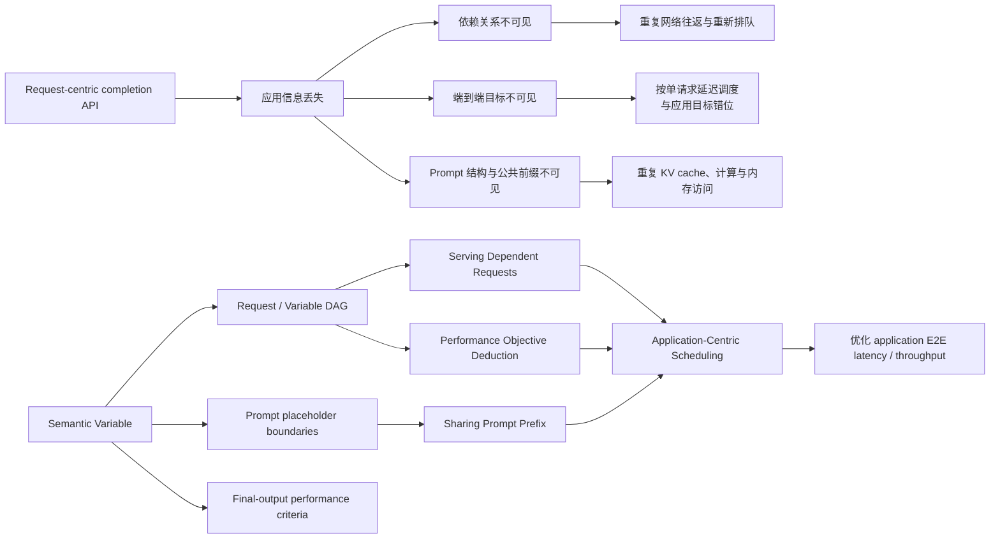
```mermaid
flowchart LR
    A[Request-centric completion API] --> B[应用信息丢失]
    B --> B1[依赖关系不可见]
    B --> B2[端到端目标不可见]
    B --> B3[Prompt 结构与公共前缀不可见]

    B1 --> C1[重复网络往返与重新排队]
    B2 --> C2[按单请求延迟调度<br/>与应用目标错位]
    B3 --> C3[重复 KV cache、计算与内存访问]

    D[Semantic Variable] --> D1[Request / Variable DAG]
    D --> D2[Prompt placeholder boundaries]
    D --> D3[Final-output performance criteria]

    D1 --> E1[Serving Dependent Requests]
    D1 --> E2[Performance Objective Deduction]
    D2 --> E3[Sharing Prompt Prefix]
    E1 --> E4[Application-Centric Scheduling]
    E2 --> E4
    E3 --> E4

    E4 --> F[优化 application E2E latency / throughput]
```

### 0.3 最关键的判断

Parrot 认为，现有服务的问题不是缺少某个单点 kernel，而是 **LLM application 在客户端已经形成了 workflow，但提交给公共 LLM service 后被压扁成大量互不相关的 completion requests**。这使服务端无法进行传统系统中很常见的数据流分析、依赖调度、目标传播和 locality-aware placement。

### 0.4 主要结果

论文报告：

- 在 multi-agent programming 中，相对 latency-centric vLLM baseline，端到端延迟最高改善 **11.7×**；相对 throughput-centric baseline，最高改善 **2.45×**（Figure 18）。
- 在多种 GPTs 应用的 4-GPU 场景中，可承载的 request rate 相对不共享 prompt 的 baseline 最高提高 **12×**（Figure 17）。
- 在 mixed workloads 中，Parrot 同时接近 latency baseline 的 chat decoding latency，并接近 throughput baseline 的 Map-Reduce JCT（Figure 19）。

这些最大值来自不同实验，不能合并理解成“Parrot 在所有场景都提升一个数量级”。

---

## 1. 论文基本信息

| 项目 | 内容 |
|---|---|
| 题目 | **Parrot: Efficient Serving of LLM-based Applications with Semantic Variable** |
| 作者 | Chaofan Lin, Zhenhua Han, Chengruidong Zhang, Yuqing Yang, Fan Yang, Chen Chen, Lili Qiu |
| 单位 | Shanghai Jiao Tong University；Microsoft Research |
| 会议 | USENIX Symposium on Operating Systems Design and Implementation，**OSDI 2024** |
| 年份 | 2024 |
| 本地阅读版本 | OSDI 2024 正式 proceedings PDF；正文 17 页，文件含 1 页 USENIX 封面 |
| 对应预印本 | arXiv:2405.19888v1，2024-05-30 |
| 系统定位 | 面向多租户 LLM applications 的 application-centric LLM service |
| 核心抽象 | **Semantic Variable** |
| 核心分析对象 | Request / Semantic Variable DAG；prompt structure |
| 核心优化 | dependent-request serving、performance-objective deduction、prompt-prefix sharing、application-centric scheduling |
| 实现规模 | 约 14,000 行；包含 Python 与 CUDA 实现 |

作者脚注说明，Chaofan Lin 的部分工作在 Microsoft Research 实习期间完成，Chen Chen 的部分工作在 Microsoft Research 访学期间完成。

---

## 2. Section 2：Background

### 2.1 LLM Service 的基本接口

论文将多数 LLM services 抽象为条件生成接口：

```text
Completion(prompt: str) -> generated_text: str
```

客户端提交完整文本 prompt，服务端返回生成文本。API 背后通常包含：

1. 一个或多个 LLM inference engine 集群；
2. request queue；
3. cluster-level request scheduler；
4. 每个 engine 使用一组 GPU 执行推理。

这个接口足够通用，却只暴露一个已经完全物化的字符串。服务端看不到字符串内部哪些部分是固定 instruction、few-shot examples、动态输入或上一步的输出，也看不到该请求与后续请求的联系。

### 2.2 LLM-based Application 不是单次调用

**Figure 1（PDF p.2）**给出四类典型 workflow：

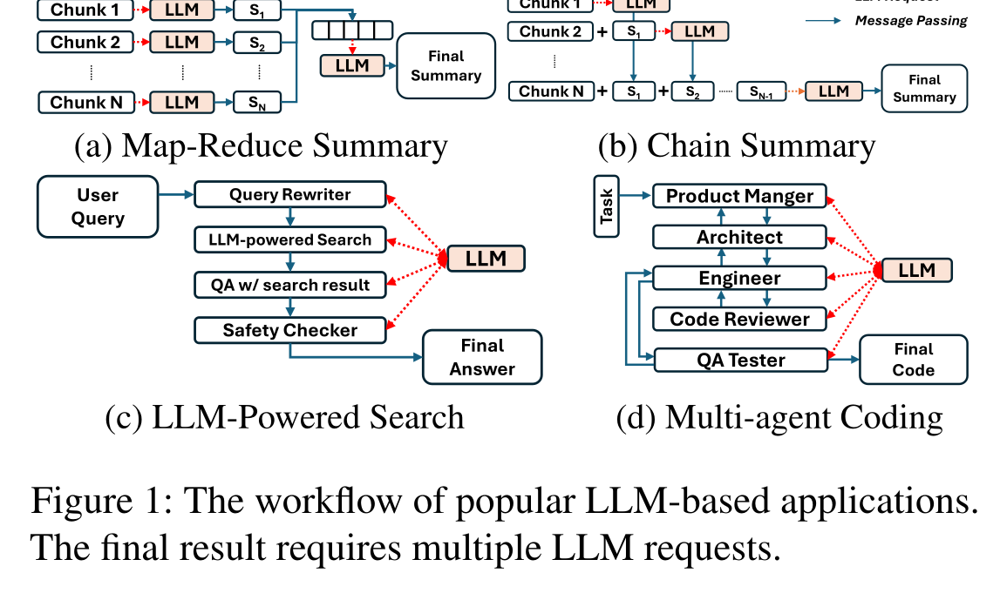

*图源：正式 OSDI 2024 论文 Figure 1（PDF p.2，论文印刷页 929），按原图裁切。读图时沿蓝色消息与红色 LLM 调用观察四种拓扑：并行后归并、严格链式、多阶段搜索与多角色协作。该图只说明应用结构和依赖形态不同，不是四类工作负载的性能比较。*

| Figure 1 子图 | Workflow | 请求关系 |
|---|---|---|
| Figure 1a | Map-Reduce Summary | 多个并行 Map requests 生成局部摘要，随后一个 Reduce request 汇总 |
| Figure 1b | Chain Summary | 前一 chunk 的摘要被持续加入下一 request，形成严格依赖链 |
| Figure 1c | LLM-Powered Search | Query Rewriter、Search、QA、Safety Checker 等多个步骤协作 |
| Figure 1d | Multi-agent Coding | Product Manager、Architect、Engineer、QA Tester、Code Reviewer 等角色通过多次 LLM calls 协作 |

**Figure 2（PDF p.3）**进一步用 multi-agent coding 展示 Semantic Variable 式的数据传递关系：

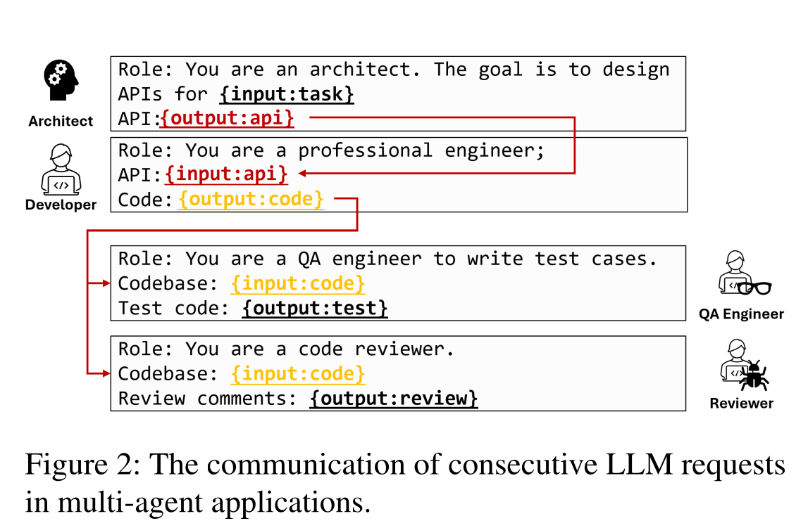

*图源：正式 OSDI 2024 论文 Figure 2（PDF p.3，论文印刷页 930），按原图裁切。沿 `api → code → test/review` 读取变量的生产者与消费者，可以看到同一个 `code` 同时进入 QA 和 Reviewer。它说明服务端可获得的数据依赖，不等同于实际运行时的完成顺序或调度策略。*

- Architect 生成 `api`；
- Developer 以 `api` 为输入生成 `code`；
- QA Engineer 与 Reviewer 都以 `code` 为输入，分别生成 `test` 与 `review`。

这类应用在客户端本来就有清晰的数据流，但传统 completion API 将每次调用独立提交，服务端无法恢复这种结构。

---

## 3. Section 3：Problems of Serving LLM Applications

论文将 request-centric serving 的问题归纳为三类。三类问题分别对应 Parrot 后续的三类信息：request dependency、performance criteria 与 prompt structure。

## 3.1 Excessive Overhead of Consecutive Requests

### 问题来源

对于链式或多轮 workflow，客户端必须：

1. 等待上一个 request 返回；
2. 解析输出；
3. 组装下一个 prompt；
4. 再次跨 Internet 提交；
5. 新 request 再进入服务端队列。

即使两次 LLM calls 在逻辑上是连续步骤，当前服务端也不能将它们作为一个 application 的连续任务来处理。

### Figure 3 的证据

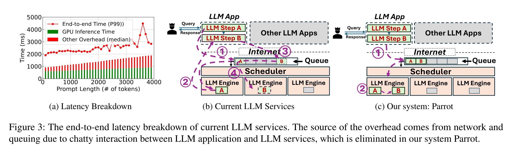

*图源：正式 OSDI 2024 论文 Figure 3（PDF p.4，论文印刷页 931），按原图裁切。先看左图中不同 prompt 长度下 LLM engine 外部开销占总延迟的比例，再对比中、右两图中 A→B 是否需要返回客户端并重新排队。左图是一个生产链式应用的观测，不能单独把全部开销归因于网络或队列。*

**Figure 3a（PDF p.4）**分析了一个生产中的 chain-style application：

- prompt length：约 150–4000 tokens；
- output length：约 50 tokens；
- LLM engine 之外的开销平均占总延迟的 **30%–50%**；
- 最坏情况下超过 **70%**；
- prompt 越长，额外开销越明显，高延迟还可能触发 API timeout 与 resubmission。

**Figure 3b**展示传统服务：Step A 完成后先跨网络返回客户端，客户端再提交 Step B；Step B 还可能被其他应用的新请求插入，从而再次排队。

**Figure 3c**展示 Parrot：A、B 的依赖在服务端已知，A 的输出可以直接进入 B，绕过中间客户端往返与二次排队。

### Table 1：应用中多次调用与重复内容

| Application | # Calls | Tokens | Repeated |
|---|---:|---:|---:|
| Long Document Analytics | 2–40 | 3.5k–80k | 3% |
| Chat Search | 2–10 | 5k | 94% |
| MetaGPT | 14 | 17k | 72% |
| AutoGen | 17 | 57k | 99% |

Table 1 的 repeated 定义是：一个 paragraph 至少出现在两个 LLM requests 中，即计为重复。

### 本质

这里的关键不是纯粹的网络优化，而是 **服务端缺少 producer-consumer dependency，无法把相关 requests 留在服务内部连续执行**。

---

## 3.2 Misaligned Scheduling Objectives

### 单请求目标与应用目标不一致

传统 LLM services 往往默认所有 requests 都应该获得较低的 per-request latency。但 LLM application 通常关心的是最终输出何时完成，而不是每个中间 request 的完成时间。

### Figure 4：为什么 Map 阶段反而应偏 throughput

**Figure 4（PDF p.4）**使用 16 个 chunks 的 Map-Reduce summary 举例：

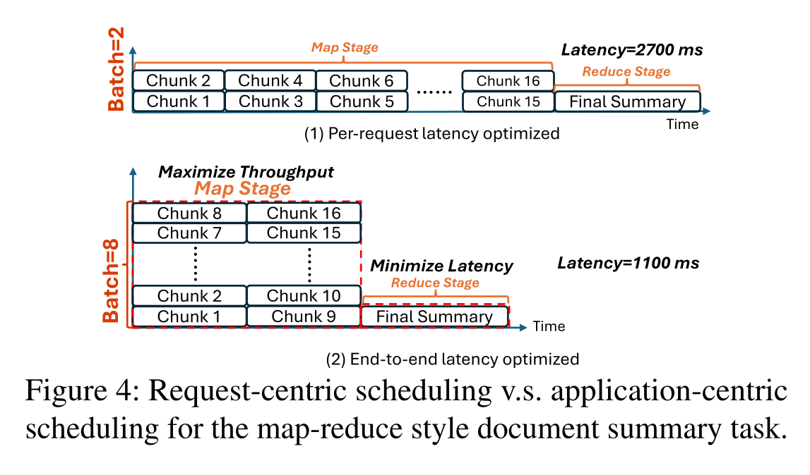

*图源：正式 OSDI 2024 论文 Figure 4（PDF p.4，论文印刷页 931），按原图裁切。上下两条时间线使用同一 Map-Reduce DAG：上方小 batch 优先单请求延迟，下方大 batch 优先并行 Map 组的完成时间，再让 Reduce 尽早启动。2700 ms 与 1100 ms 是动机示例中的结果，不是完整评测的统计值。*

- request-centric 策略使用较小 batch（图中 Batch=2），逐个请求延迟较低，但 Map 阶段吞吐不足，最终延迟约 **2700 ms**；
- application-centric 策略在 Map 阶段使用较大 batch（图中 Batch=8）以提高吞吐，在稀缺的 Reduce 阶段再优化单请求延迟，最终延迟约 **1100 ms**；
- 图中对应约 **2.4×** 的端到端改善。

论文引用已有观察：提高 batch size 可带来最高 **8.2× throughput**，但可能使 latency 增加 **95%**。因此，单纯固定“大 batch”或“小 batch”都不对，关键是知道 request 在 application DAG 中扮演什么角色。

### 本质

**低端到端延迟不等于所有中间请求都低延迟。** 对一组并行 Map tasks，优化整个 task group 的完成时间通常需要牺牲某些单请求延迟，换取更高 token-generation throughput。

---

## 3.3 Redundant Computations

### Prompt 中存在大量公共部分

**Figure 5（PDF p.5）**将 Bing Copilot prompt 分成：

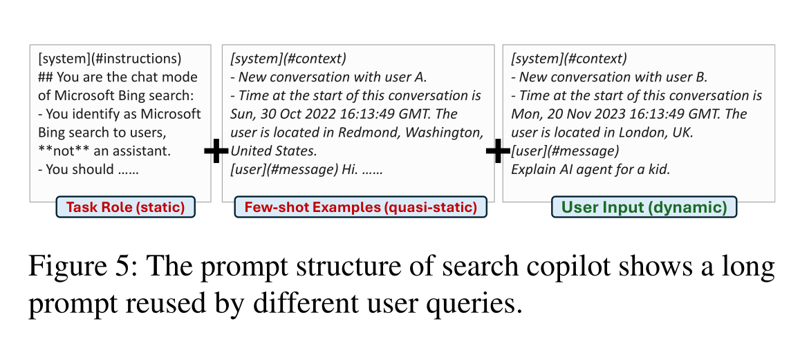

*图源：正式 OSDI 2024 论文 Figure 5（PDF p.5，论文印刷页 932），按原图裁切。按从左到右的三个 prompt 比较可见：Task Role 固定，Few-shot Examples 在部分请求间复用，User Input 每次变化。该图展示潜在共享边界，不代表所有应用都具有相同比例，也不保证缓存一定命中。*

- Task Role：static；
- Few-shot Examples：quasi-static；
- User Input：dynamic。

同一应用不同用户的 prompt 往往共享很长的 system prompt。Table 1 中 Chat Search 的重复比例为 94%，MetaGPT 为 72%，AutoGen 为 99%。这些重复部分会导致：

- 重复存储 KV cache；
- 重复 prompt computation；
- 重复从 GPU memory 读取公共 KV blocks；
- 更高 GPU memory bandwidth 消耗。

### 为什么仅有 engine-level prefix caching 不够

vLLM 一类 engine 可以在已知公共前缀的情况下共享 KV cache，但公共服务首先要解决两个 cluster-level 问题：

1. 如何快速发现大量请求的公共前缀，而不是对每个请求做昂贵的 token-by-token 全量匹配；
2. 如何把共享前缀的 requests 调度到同一个 engine，使 engine-level sharing 真正发生。

因此，**commonality discovery、affinity scheduling 与 engine context sharing 必须协同**。只实现最后一步并不足够。

---

## 4. 核心思想与贡献

### 4.1 Semantic Variable：保留“刚刚好”的应用信息

论文把一个 LLM request 视为由自然语言实现、由 LLM 执行的 **SemanticFunction**。Semantic Variable 是该 SemanticFunction prompt 中的 input 或 output placeholder。

它同时承担两种职责：

1. **编程职责**：作为 semantic function 的输入、输出，以及多个 functions 之间的数据管道；
2. **系统职责**：向公共 LLM service 保留 prompt 边界、producer-consumer 关系和最终输出目标，使服务端能够做 inter-request analysis。

它不是普通的 Python 字符串，也不是一个复杂的形式化类型系统。论文 API 中它主要由 variable ID、input/output 属性、placeholder 位置与可选 transformation 表示。

### 4.2 从 Semantic Variable 推导两类信息

| 信息 | 如何得到 | 支持的优化 |
|---|---|---|
| Request DAG | output Semantic Variable 被后续 request 作为 input 使用 | dependent-request serving、performance-objective deduction、task-group scheduling |
| Prompt structure | Semantic Variables 将 prompt 切分为多个有意义边界，并可在边界处计算 PrefixHash | prefix commonality detection、context fork、affinity placement |

### 4.3 论文的主要贡献

1. 提出 Semantic Variable 这一统一抽象，使公共 LLM service 能看到原本被 completion API 隐藏的 application-level information。
2. 在同一抽象上实现四类联合优化：Serving Dependent Requests、Performance Objective Deduction、Sharing Prompt Prefix、Application-Centric Scheduling。
3. 实现完整 Parrot service，包括 frontend、centralized manager、LLM engine、context management 与自定义 CUDA attention kernel，并在多类 LLM applications 上验证端到端收益。

---

## 5. Section 4：Parrot Design

## 5.1 Figure 6：系统总体架构

**Figure 6（PDF p.5）**把 Parrot 分成三层：

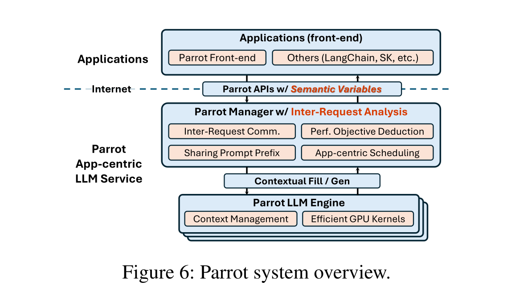

*图源：正式 OSDI 2024 论文 Figure 6（PDF p.5，论文印刷页 932），按原图裁切。自上而下读为应用/适配器、Parrot API、带跨请求分析的集中式 Manager、多个 LLM Engine；横向模块分别承担通信、目标推导、前缀共享、调度与 engine 内执行。它描述的是 Parrot 可同时修改服务管理层和推理引擎的设计边界，不是性能结果。*

1. **Applications / Front-end**
   - Parrot Front-end；
   - 也可通过 adapter 接入 LangChain、Semantic Kernel 等现有 orchestration frameworks。

2. **Parrot Manager with Inter-Request Analysis**
   - Inter-Request Communication；
   - Performance Objective Deduction；
   - Sharing Prompt Prefix；
   - App-centric Scheduling。

3. **Parrot LLM Engine**
   - Contextual Fill / Gen；
   - Context Management；
   - Efficient GPU Kernels。

其中，Semantic Variables 通过 Parrot APIs 跨越应用与服务端的边界。Manager 负责恢复 application structure 并作 cluster-level 决策；Engine 负责具体推理、KV context 管理和 kernel 执行。

### 简化执行链

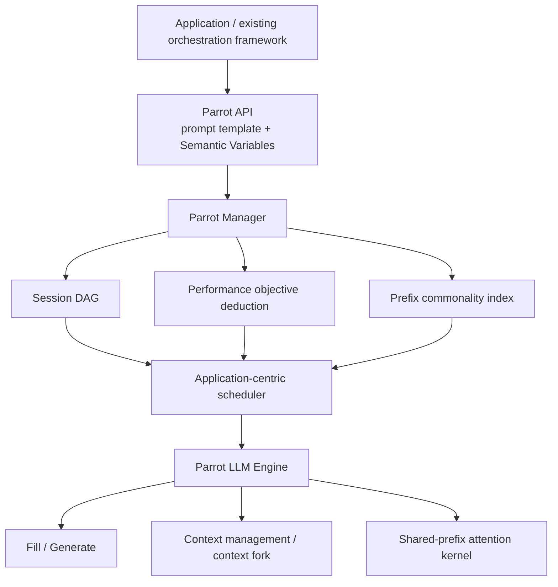
```mermaid
flowchart TB
    A[Application / existing orchestration framework]
    B[Parrot API<br/>prompt template + Semantic Variables]
    C[Parrot Manager]
    C1[Session DAG]
    C2[Performance objective deduction]
    C3[Prefix commonality index]
    C4[Application-centric scheduler]
    D[Parrot LLM Engine]
    D1[Fill / Generate]
    D2[Context management / context fork]
    D3[Shared-prefix attention kernel]

    A --> B --> C
    C --> C1
    C --> C2
    C --> C3
    C1 --> C4
    C2 --> C4
    C3 --> C4
    C4 --> D
    D --> D1
    D --> D2
    D --> D3
```

---

## 5.2 Section 4.1：Semantic Variable

### 5.2.1 Figure 7 的编程例子

**Figure 7（PDF p.6）**定义两个 SemanticFunctions：

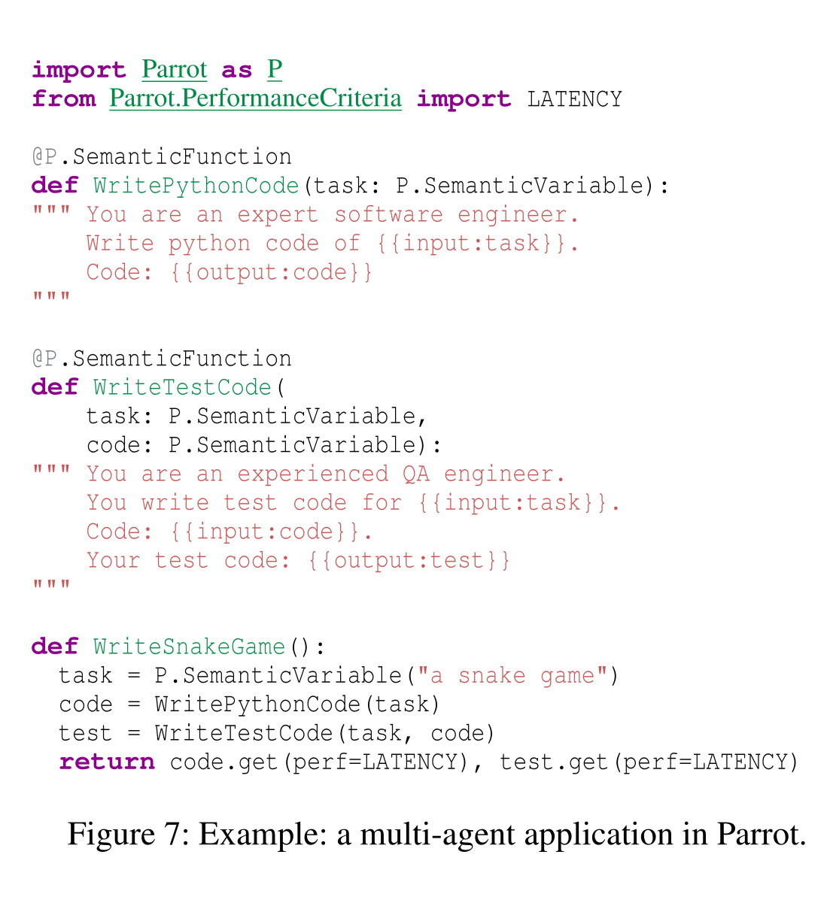

*图源：正式 OSDI 2024 论文 Figure 7（PDF p.6，论文印刷页 933），按原图裁切。先识别模板中的 `input`/`output` 占位符，再看 `code` 如何同时成为第一个函数的输出和第二个函数的输入，最后看 `get(perf=LATENCY)` 如何标注最终目标。这是静态多智能体工作流的接口示例，不证明任意动态控制流都可被提前分析。*

- `WritePythonCode(task)`：软件工程师根据 `task` 生成 `code`；
- `WriteTestCode(task, code)`：QA 工程师根据 `task` 与 `code` 生成 `test`。

三个 Semantic Variables 是：

- `task`：输入任务；
- `code`：第一个 request 的输出，同时是第二个 request 的输入；
- `test`：第二个 request 的输出。

因此，`code` 不只是“保存了一段文本”，它还显式建立：

```text
WritePythonCode  --produces-->  code  --consumed by-->  WriteTestCode
```

### 5.2.2 与普通 prompt template placeholder 的区别

LangChain 等框架本来也有 placeholder，但通常在客户端把变量渲染为完整字符串后才提交。此时服务端只看到最终 prompt，placeholder 边界和变量身份已经消失。

Parrot 提交的是：

- prompt template；
- placeholders；
- 每个 placeholder 对应的 Semantic Variable ID；
- input/output 属性及 transformation。

因此，公共服务仍能看到 prompt structure。

### 5.2.3 submit / get 分离

Parrot 将传统同步 completion 拆成两个操作：

1. **submit**：调用 SemanticFunction 时提交 request，执行是 asynchronous，并立即返回 output Semantic Variables 的 futures；
2. **get**：应用真正需要某个 output Semantic Variable 时再获取其值，并可标注 performance criteria。

Figure 7 中：

```text
code.get(perf=LATENCY)
test.get(perf=LATENCY)
```

表示最终应用关心 `code` 和 `test` 的端到端延迟。

这一设计的系统意义是：只要后续步骤不被 native function 或 dynamic control flow 阻塞，多个 requests 可以提前提交到服务端。Parrot 因而能够在执行前或执行过程中 just-in-time 地看到它们的联系，而不是每完成一步才收到下一步。

### 5.2.4 Performance criteria

论文实现的主要 criteria 是：

- end-to-end latency；
- throughput。

作者说明该接口可扩展到 streaming 场景中的 per-token latency、time-to-first-token 等，但论文没有实现和实验这些扩展目标。

---

## 5.3 Section 4.2：Primitives of Inter-Request Analysis

**Figure 8（PDF p.6）**列出 Parrot 用于 inter-request analysis 的代表性 primitives：

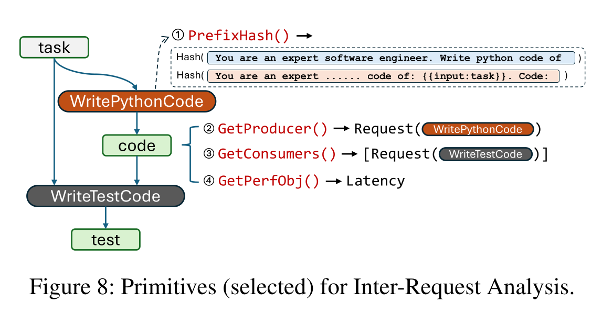

*图源：正式 OSDI 2024 论文 Figure 8（PDF p.6，论文印刷页 933），按原图裁切。左侧是 request/variable DAG，右侧把前缀哈希、生产者、消费者和性能目标四类查询映射到具体节点。该图说明 Manager 能查询哪些结构信息，不给出分析复杂度或大规模 session 下的可扩展性。*

- `GetProducer()`；
- `GetConsumers()`；
- `GetPerfObj()`；
- `PrefixHash()`。

这里的 primitives 不是用户应用中的 LLM tools，而是 Parrot Manager 查询和分析 Semantic Variables 的内部操作。

### 5.3.1 DAG-based analysis

#### 输入

- 同一 registered session 中已提交的 requests；
- request prompt 中引用的 input/output Semantic Variables；
- final Semantic Variables 上通过 `get` 标注的 criteria。

#### 数据结构

Parrot 在每个 session 中维护一个 DAG-like structure，node 可以是：

- request / SemanticFunction；
- Semantic Variable。

request 到 variable、variable 到 request 的边表示生产与消费关系。

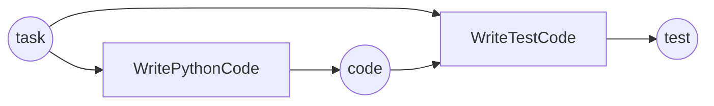
```mermaid
flowchart LR
    T((task)) --> R1[WritePythonCode]
    R1 --> C((code))
    T --> R2[WriteTestCode]
    C --> R2
    R2 --> X((test))
```

#### 步骤

1. 新 request 到达时，解析其中的 placeholders；
2. 将 request node 与对应 Semantic Variable nodes 插入 session DAG；
3. 用 `GetProducer` 查询某 variable 的生产 request；
4. 用 `GetConsumers` 查询其下游 requests；
5. 用 `GetPerfObj` 取得 final output 上的 performance criterion；
6. 基于 DAG 做 dependency recovery 与 objective deduction。

#### 为什么这样设计

传统编译器和数据处理系统已经有成熟的数据流分析方法。Parrot 的创新不在于重新发明 DAG，而在于利用 Semantic Variable 让公共 LLM service 终于能构造这个 DAG。

### 5.3.2 Prompt structure-based analysis

#### 输入

- prompt template；
- Semantic Variable 的边界；
- 已物化的 variable values。

#### 步骤

`PrefixHash()` 只在由 Semantic Variables 切分出的有意义位置计算 prompt prefix hash。

以 `WritePythonCode` 为例，可能计算：

1. `{{input:task}}` 之前的固定 instruction 前缀；
2. `{{output:code}}` 之前的前缀，即 instruction 加已经物化的 task。

#### 为什么这样设计

- 不必在任意 token position 做昂贵的全量匹配；
- 可以检测静态 system prompt；
- 也可以检测含动态生成内容但被多个 requests 共同引用的前缀；
- 支持同一应用内及不同应用间的公共前缀。

论文没有给出 hash collision 的处理细节。

---

## 6. Section 5：Optimizations with Semantic Variable

## 6.1 Section 5.1：Serving Dependent Requests

### 输入

- session request DAG；
- 每个 request 的 producer completion 状态；
- Semantic Variable 的 materialized value；
- 可选 string transformation。

### 执行步骤

1. graph-based executor 持续轮询；
2. 当一个 request 的所有 producer requests 均已完成，该 request 变为 ready；
3. executor 立即把 ready request 发送到对应 LLM engine；
4. producer 的输出通过为该 Semantic Variable 分配的 message queue 直接传给 consumer；
5. 如输入需要转换，先执行 string transformation，例如从 JSON-formatted LLM output 中提取字段；
6. Parrot 支持 LangChain 中大部分 output parsing 方法。

### 为什么这样设计

- 省去服务端到客户端、再从客户端返回服务端的网络往返；
- 下游 request 不必重新进入公共队列与无关 requests 竞争；
- producer 一完成即可触发 consumer，增大连续 requests 的 co-scheduling 与 batching 机会。

### 论文没有声称什么

这一机制只自动处理能够在服务端以 Semantic Variables 连接的 LLM requests。涉及 Python native function、动态分支或未托管外部工具的步骤仍需客户端执行，Section 6 明确将其排除。

---

## 6.2 Section 5.2：Performance Objective Deduction

### 目标

从 final Semantic Variable 的 application-level criterion 推导每个 request 或 task group 的 scheduling preference。

### 6.2.1 Throughput-oriented output

如果某个 Semantic Variable 被标注为 throughput-preferred，则直接或间接生成它的所有 requests 都被标记为 throughput-preferred。论文将 bulk document analytics 视为典型使用场景。

### 6.2.2 Latency-oriented output

低端到端 latency 的推导更复杂，因为某些中间并行阶段应优先提高 throughput。

**Figure 9（PDF p.7）**展示两个 latency-sensitive outputs：

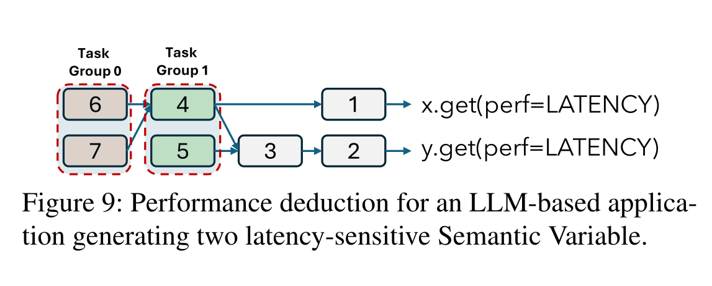

*图源：正式 OSDI 2024 论文 Figure 9（PDF p.7，论文印刷页 934），按原图裁切。应从右侧带 `LATENCY` 的 `x/y` 反向沿依赖边读取：接近最终输出的请求按低延迟处理，更上游的并行请求 4/5、6/7 分别合并为 task group。它是分类与分组规则示例，不是形式化的关键路径最优求解器。*

- Request 1 生成 `x`；
- Request 2 生成 `y`；
- Request 3 是 Request 2 的前驱；
- 更上游的并行 requests 4/5 和 6/7 分别被组织为两个 task groups。

### 推导步骤

1. 从带有 `LATENCY` criterion 的 final Semantic Variables 开始；
2. 按 reverse topological order 向上游分析；
3. 直接生成 final variables 的 requests 被标为 latency-sensitive；
4. 串行路径上的直接前驱也需要被及时执行；
5. 同一 stage 的并行 requests 被归入一个 **task group**；
6. scheduler 优化的是整个 task group 的完成时间，而不一定是其中每个 request 的最小 latency。

### 设计理由

在 Map stage，较大的 engine token capacity 和 batch size 可能使单请求变慢，却能让整组 tasks 更早完成，从而缩短后续 Reduce request 的启动时间。Figure 4 是该逻辑的动机示例。

### 需要注意的边界

论文给出了推导规则和例子，但没有形式化定义完整的优化目标函数，也没有提供基于 predicted runtime 的精确 critical-path 求解器。它更接近一个应用结构驱动的 scheduling classification / grouping 机制。

---

## 6.3 Section 5.3：Sharing Prompt Prefix

这一部分包含三层机制，缺一不可。

### 6.3.1 Cluster-level commonality detection

Parrot 用 `PrefixHash` 在 Semantic Variable boundaries 上生成 hash，并维护：

```text
hashed token prefix -> requests sharing this prefix
```

scheduler 可以在线查询：

- queue 中是否有共享前缀的其他 requests；
- 某个 engine 上是否已经存在可复用的 context。

这避免对海量 requests 做 token-by-token 任意位置匹配。

### 6.3.2 Placement 与 context fork

只有将共享前缀的 requests 放到同一个 engine，KV cache sharing 才能发生。Parrot 因而将 prefix commonality 纳入 cluster scheduling，并通过 context fork 让新 request 继承父 context 的 KV cache。

### 6.3.3 Shared-prefix attention kernel

vLLM 的 PagedAttention 可以避免重复存储共享 prefix 的 KV cache，但其 kernel 在处理多个分叉 requests 时，仍可能反复把相同 KV tiles 从 global/L2 memory 装入 shared memory。

Parrot 将 PagedAttention 与 FlashAttention 的思路结合：

1. KV cache 仍采用 paged、non-contiguous layout；
2. 对 shared prefix 与 non-shared tokens 分别处理；
3. shared prefix 的 KV tiles 只加载到 shared memory 一次；
4. 计算该 prefix 的中间 attention statistics，包括 attention scores、`qk_max`、`exp_sum`；
5. 再处理各 request 分叉后的新 tokens；
6. 合并 prefix 与 non-prefix 的中间结果，得到最终 attention output。

设计重点是减少 shared prompt 在 decoding 阶段的重复 memory transactions，而不只是节省 KV cache 容量。

---

## 6.4 Section 5.4：Application-Centric Scheduling

### 调度原则

论文给出两条原则：

1. 将 performance requirements 相近的 requests 放在一起，避免 latency-oriented 与 throughput-oriented requests 相互牵制；
2. 最大化 shared-prefix/context reuse 机会。

LLM decoding 通常受 memory bandwidth 限制。一个 engine 可并发处理的 token 数会受到其中最严格 latency request 的约束。例如，论文举例：一个原本可容纳约 64,000 throughput-driven tokens 的 engine，若混入严格 latency request，capacity 可能必须降到约 2,000；若该 request 被放到已经运行 latency-sensitive workload 的 engine，新增负面影响则较小。

### Algorithm 1：Parrot’s Request Scheduling

#### 输入

- `Q`：request queue；
- 每个 request 的 topological position；
- TaskGroup 信息；
- shared-prefix requests in queue；
- contexts already resident in engines；
- request performance preference 与 engine state。

#### 主要步骤

1. **Line 1：Topological sort**
   按 request DAG 的 topological order 排序，使 application 中较早的依赖步骤优先可见。

2. **Line 3：FindSharedPrefix**
   同时检查：
   - queue 中共享 prefix 的 requests；
   - 已经在某个 engine 中存在的可复用 contexts。

3. **Line 4–5：TaskGroup first**
   若 request 属于 task group，优先尝试为整个 group 选择 engine，以优化 group completion time。

4. **Line 6–7：Queued sharing affinity**
   若 queue 中有共享前缀的 requests，尝试将它们一起分配。

5. **Line 8–9：Resident context affinity**
   若某些 engines 已有可共享 context，则只在这些 engines 中选择。

6. **Line 10–11：Fallback**
   若以上机会均不存在，独立为 request 选择 engine。

7. **Line 12：Remove scheduled request**
   从 queue 移除实际选中的 `r*`。

### 为什么使用这个优先级

- TaskGroup placement 直接服务于 application-level objective；
- queued sharing 可以形成新的共享执行组；
- resident context reuse 可避免重复 prefill 与 KV cache；
- 无优化机会时仍保留普通调度路径。

### 论文明确省略的内容

论文由于篇幅限制，没有给出 `FindEngine` 的完整算法、代价函数或所有 tie-breaking 规则，只概述为：选择满足 scheduling preference 且负面影响最小的 engine。因此，Algorithm 1 给出了总体决策顺序，但不是完全可复现的 cluster scheduler 规格。

---

## 7. 端到端执行流程

综合 Sections 4–5，Parrot 的一次 application 执行可整理为：

1. 开发者用 SemanticFunctions 与 Semantic Variables 表达 workflow；
2. 每次 SemanticFunction call 通过 submit API 异步提交，不等待 output materialization；
3. Parrot Manager 在 session 内构建 request-variable DAG；
4. Manager 在 variable boundaries 计算 PrefixHash；
5. 最终 `get` 为 output Semantic Variables 标注 latency 或 throughput criterion；
6. Objective deduction 从 outputs 向上游识别 latency requests 与 task groups；
7. graph executor 检测 ready requests；
8. scheduler 综合 DAG order、TaskGroup、queued sharing 和 resident context 选择 engine；
9. engine 通过 Fill / Generate 执行，并在可能时 fork context、复用 shared KV；
10. producer output 经 Semantic Variable message queue 与 transformation 传给 consumers；
11. 最终 Semantic Variable materialize 后由 `get` 返回给应用。

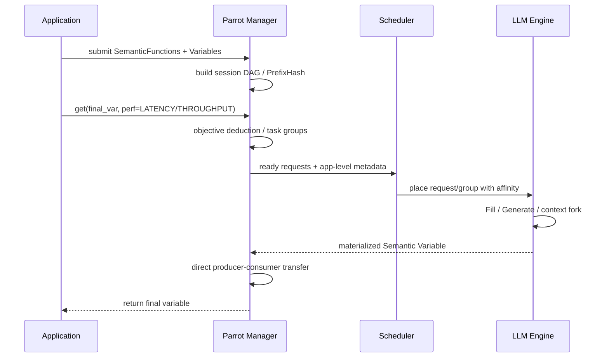
```mermaid
sequenceDiagram
    participant App as Application
    participant M as Parrot Manager
    participant S as Scheduler
    participant E as LLM Engine

    App->>M: submit SemanticFunctions + Variables
    M->>M: build session DAG / PrefixHash
    App->>M: get(final_var, perf=LATENCY/THROUGHPUT)
    M->>M: objective deduction / task groups
    M->>S: ready requests + app-level metadata
    S->>E: place request/group with affinity
    E->>E: Fill / Generate / context fork
    E-->>M: materialized Semantic Variable
    M->>M: direct producer-consumer transfer
    M-->>App: return final variable
```

---

## 8. Section 6：Discussion

## 8.1 Dynamic Applications and Function Calling

Parrot 当前只将不涉及动态控制流和 native functions 的 LLM requests 放到 cloud side orchestration。

- Python code、动态条件分支等仍需客户端执行；
- 作者刻意不把任意 native code 上传到公共服务，以降低 malicious injection 的安全风险；
- 对 trusted private service，可扩展 conditional connections 与 native code submission；
- 作者提出未来可根据历史 profile speculative pre-launch 高概率分支，但未实现、未实验。

## 8.2 Other Applications of Inter-Request Analysis

论文没有研究以下大规模调度问题：

- outliers；
- job failures；
- delay scheduling；
- fairness；
- starvation；
- heterogeneous clusters。

作者认为 Semantic Variable 提供了从 application 角度重新研究这些问题的基础，但本文只聚焦核心机制与少数 use cases。

## 8.3 与现有 orchestration frameworks 的关系

Parrot 并不要求完全替代 LangChain、Semantic Kernel、PromptFlow。它可以通过 adapter 接入，但框架不能在客户端先把模板彻底渲染成字符串；必须把 template 与 variables 一并包装成 SemanticFunction，才能保留服务端所需信息。

---

## 9. Section 7：Implementation

## 9.1 代码规模与组件

Parrot 是一个 end-to-end LLM service，约 14,000 行：

| 组件 | 规模 |
|---|---:|
| Front-end | 约 1,600 行 Python |
| Manager | 约 3,200 行 Python |
| LLM Engine | 约 5,400 行 Python + 1,600 行 CUDA |

系统使用或集成：

- FastAPI；
- vLLM；
- xFormers；
- PyTorch；
- Transformers；
- OPT 与 LLaMA model implementations；
- paged memory management；
- continuous batching。

## 9.2 API

submit body 保存：

- `prompt`；
- `placeholders`；
- placeholder 的 `name`、`in_out`、`semantic_var_id`、`transforms`；
- `session_id`。

get body 保存：

- `semantic_var_id`；
- `criteria`；
- `session_id`。

如果 Semantic Variable 的某个 intermediate step 在 engine、communication 或 string transformation 中失败，`get` 返回对应 error。

## 9.3 Universal Engine Abstraction

Parrot 要求可接入的 LLM engine 至少支持：

```text
Fill(token_ids, context_id, parent_context_id)
Generate(sampling_configs, context_id, parent_context_id)
FreeContext(context_id)
```

### Fill

- 处理 initial prompt tokens；
- 计算并填充 KV cache；
- `parent_context_id` 可用于从已有 context fork。

### Generate

- 在指定 sampling configuration 下 autoregressively 生成 token；
- 每轮生成一个 token；
- 直到 length limit、termination character 或 EOS；
- 同样可使用 parent context。

### FreeContext

显式释放一个 context 及其 GPU KV cache。

### 设计意义

1. 把 context lifecycle 暴露给 cluster manager，支持跨 request sharing；
2. 将传统 completion 拆成 Fill 与 Generate，更自然地对应 Semantic Variable：constant text/input values 由 Fill 处理，output values 由 Generate 产生；
3. 将 request-level dependency 进一步细化，可能形成更多并行执行机会。

论文没有对所有第三方 engine 的适配成本做系统评估。

---

## 10. Section 8：Evaluation

> 本文实验严格位于 **Section 8.1–8.5**。以下逐节记录 dataset、testbed、baseline、model、metric、数值与作者声称能够说明的内容。

## 10.1 Section 8.1：Experimental Setup

### Testbed

| 场景 | CPU | GPU | 软件 |
|---|---|---|---|
| Single-GPU | 24-core AMD EPYC 7V13 | 1× NVIDIA A100 80GB | CUDA 12.1, cuDNN 8.9.2 |
| Multi-GPU | 64-core AMD EPYC | 4× NVIDIA A6000 48GB | CUDA 12.1, cuDNN 8.9.2 |

每个 LLM engine 使用一张 GPU，运行 LLaMA 13B 或 LLaMA 7B。

### Workloads

1. **Long-document analytics**
   Arxiv dataset；chain summary 与 Map-Reduce summary。

2. **Popular LLM applications**
   Bing Copilot 与 GPTs 的 prompt structure；user queries 为 synthetic。

3. **Multi-agent programming**
   基于 MetaGPT 构建 Architect、Coders、Reviewers 的协作 workflow。

4. **Chat workload**
   从 ShareGPT 派生场景。

5. **Internet overhead emulation**
   根据作者测量分布，对请求加入随机 **200–300 ms** delay。

6. **Output-length control**
   作者先用 GPT-4 记录响应，使 LLaMA 在系统性能实验中生成相近长度的输出。

### Table 2：各 workload 实际启用的优化

| Workload | Dependent Requests | Perf. Obj. Deduction | Prompt Sharing | App-centric Scheduling |
|---|:---:|:---:|:---:|:---:|
| Data Analytics | ✓ | ✓ |  | ✓ |
| Popular LLM Applications |  |  | ✓ | ✓ |
| Multi-agent Application | ✓ | ✓ | ✓ | ✓ |
| Mixed Workloads | ✓ | ✓ |  | ✓ |

### Baselines

- 应用主要使用 LangChain 编写；
- 通过 FastChat 提供 OpenAI-style chat completion API；
- engine 使用 HuggingFace Transformers 或 vLLM；
- FastChat 默认将 incoming request 分配给当前 queue 最短的 engine；
- baseline 把所有 requests 当作彼此独立、latency-sensitive；
- engine capacity 由 active requests 的 aggregate token count 限制；
- capacity 满后，新请求按 FIFO 排队。

### Figure 10：capacity 校准

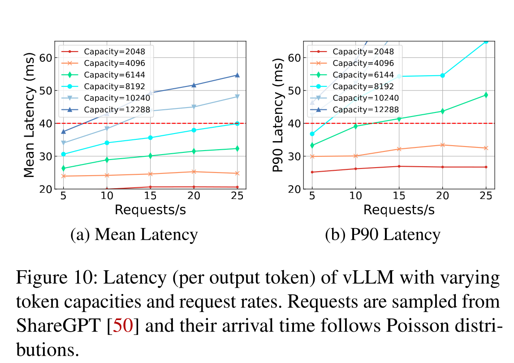

*图源：正式 OSDI 2024 论文 Figure 10（PDF p.10，论文印刷页 937），按原图裁切。左右分别比较 mean 与 P90 的每输出 token 延迟；在同一请求率内比较不同 capacity 曲线，并用红色 40 ms 虚线判断 latency-oriented baseline 的可接受范围。该图只用于选择 baseline capacity，不是 Parrot 的加速结果。*

Figure 10 使用 ShareGPT requests 与 Poisson arrivals，比较 capacity 从 2048 到 12288 时的 mean/P90 TPOT。作者观察到 capacity 超过 **6144** 后 per-output-token latency 明显上升，因此在 latency-sensitive baseline 中要求 generation latency 维持约 **40 ms/token**。

Figure 10 是 baseline capacity 选择的校准实验，不是 Parrot 相对 baseline 的最终性能结果。

---

## 10.2 Section 8.2：Data Analytics on Long Documents

### 公共设置

- 从 Arxiv-March dataset 随机选 10 篇长文档；
- 每篇超过 20,000 tokens；
- metric：10 篇文档的 mean end-to-end latency；
- engine：1× A100，LLaMA 13B。

### 10.2.1 Chain-style Applications

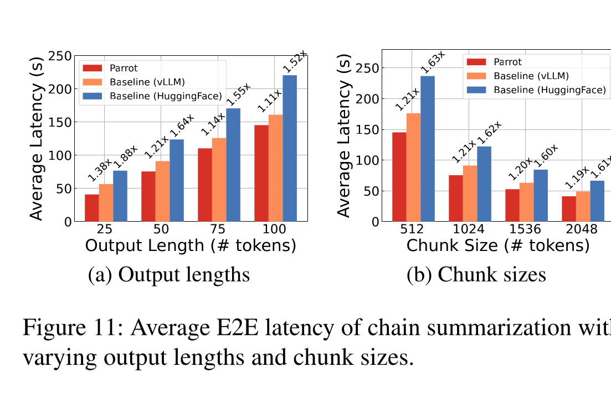

*图源：正式 OSDI 2024 论文 Figure 11（PDF p.11，论文印刷页 938），按原图裁切。两幅图都以 10 篇长文档的平均端到端延迟为纵轴；应在同一个横坐标内比较 Parrot、vLLM 和 HuggingFace，并把标注倍率作为相对 baseline 的 speedup。结果来自单 A100 与固定数据集，不包含摘要质量评价。*

#### Figure 11a：varying output length

| Output length | 相对 vLLM speedup | 相对 HuggingFace speedup |
|---:|---:|---:|
| 25 | 1.38× | 1.88× |
| 50 | 1.21× | 1.64× |
| 75 | 1.14× | 1.55× |
| 100 | 1.11× | 1.52× |

作者解释：output 越长，generation computation 占比越高，省去 network/client interaction 的相对收益越小。

#### Figure 11b：varying chunk size

Figure labels 显示：

- 相对 vLLM 约 **1.19×–1.21×**；
- 相对 HuggingFace 约 **1.60×–1.63×**。

正文将其概括为约 1.2× 与 1.66×；Figure labels 与正文概括存在轻微数值差异。论文给出的解释是：固定 output length 时，generation 仍占主要时间，因此改变 chunk size 后 speedup 基本稳定。

#### Figure 12a：加入 background requests

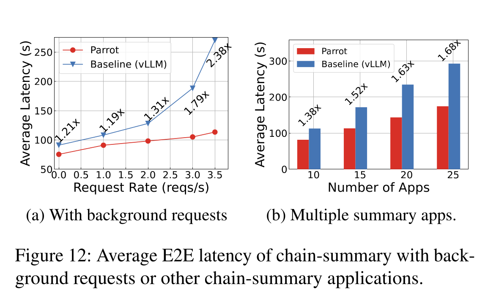

*图源：正式 OSDI 2024 论文 Figure 12（PDF p.11，论文印刷页 938），按原图裁切。左图增加 background request rate，右图增加并发 chain-summary 应用数；标注倍率均是同一负载点的 baseline/Parrot 延迟比。图中竞争效应包含注入的网络延迟与固定 workload 设置，不能直接外推到任意生产到达过程。*

随着 background request rate 增大，baseline 中每个下游 chain request 都要重新排队，Parrot 的优势扩大，最高达到 **2.38×**。

Figure 12a 标注的 speedup 依次包括约：1.21×、1.19×、1.31×、1.79×、2.38×。

#### Figure 12b：多个 chain-summary applications 并发

| Concurrent applications | Speedup |
|---:|---:|
| 10 | 1.38× |
| 15 | 1.52× |
| 20 | 1.63× |
| 25 | 1.68× |

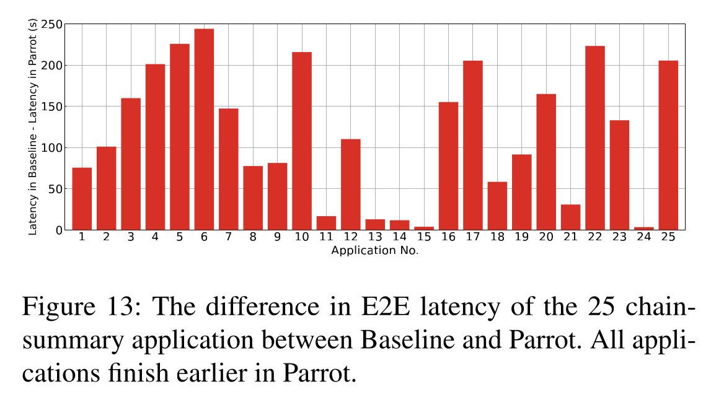

*图源：正式 OSDI 2024 论文 Figure 13（PDF p.11，论文印刷页 938），按原图裁切。横轴是应用编号，纵轴是 `baseline latency − Parrot latency`；柱子为正表示该应用更早完成。25 根柱均为正只说明这一次并发实验没有通过牺牲某个应用换取平均收益，图中未给出重复实验分布或置信区间。*

**Figure 13**显示 25 个 applications 在 Parrot 中都比 baseline 更早完成；图中每个 application 的“baseline latency − Parrot latency”均为正。

#### 作者声称实验说明了什么

识别连续 LLM requests 的 interconnection，可同时消除 client-side network round trip、避免下游 request 重新进入队列，并减少多个 applications 交错执行导致的整体 slowdown。

#### 实验没有证明什么

- 未评估摘要质量；
- 200–300 ms Internet delay 是根据测量分布注入的模拟开销，不是完整生产 trace replay；
- 结果不表示所有 chain workloads 都必然达到 2.38×。

### 10.2.2 Map-Reduce Applications

Map tasks 彼此独立，Parrot 与 baseline 都可以并发发出。主要区别不再是消除严格依赖链的网络往返，而是 **performance-objective deduction 与 task-group scheduling**。

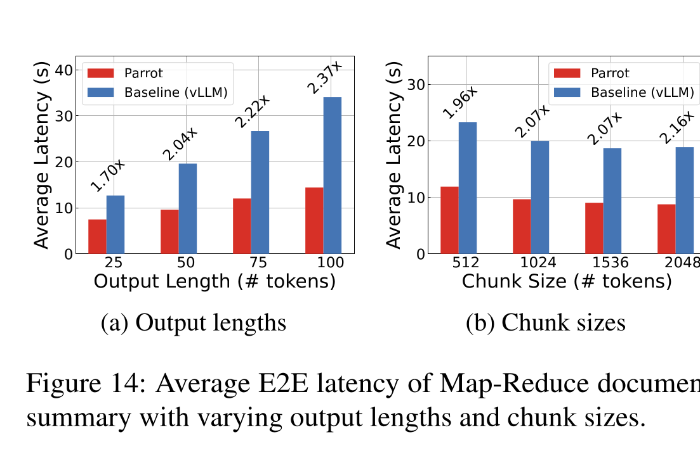

*图源：正式 OSDI 2024 论文 Figure 14（PDF p.12，论文印刷页 939），按原图裁切。两幅图分别改变 Map 输出长度与 chunk size；同一横坐标下比较平均端到端延迟，标注倍率是 Parrot 相对 vLLM 的 speedup。它支持目标推导与 task-group 调度的组合效果，不能把全部差异单独归因给某一条 scheduler 规则。*

#### Figure 14a：varying output length

| Output length | Parrot speedup over vLLM |
|---:|---:|
| 25 | 1.70× |
| 50 | 2.04× |
| 75 | 2.22× |
| 100 | 2.37× |

#### Figure 14b：varying chunk size

| Chunk size | Speedup |
|---:|---:|
| 512 | 1.96× |
| 1024 | 2.07× |
| 1536 | 2.07× |
| 2048 | 2.16× |

baseline 假设每个 Map request 都 latency-sensitive，将 engine token capacity 限制为 4096。Parrot 将并行 Map requests 识别为 task group，用更大 batch 提高 group throughput；Reduce request 再按 latency 处理。

#### 作者声称实验说明了什么

LLM service 必须区分中间 requests 的作用。即使所有 individual requests 使用同一 model，最优 scheduling objective 也可能因其在 application DAG 中的位置不同而不同。

---

## 10.3 Section 8.3：Serving Popular LLM Applications

### 10.3.1 Bing Copilot-style workload

#### 设置

- 作者无法获得 Bing Copilot 的完整 intermediate workflow，因此只评估最终生成 user response 的 request；
- 根据测量的 length distribution 合成 64 个 requests；
- system prompt 约 6000 tokens；
- output length 约 180–800 tokens；
- engine：A100，LLaMA 7B。

#### Figure 15：batch size

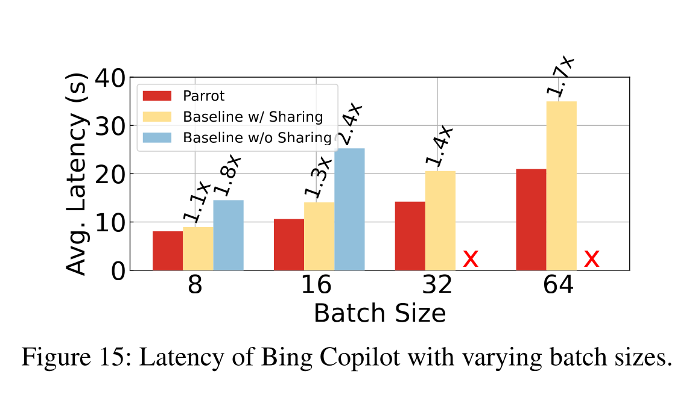

*图源：正式 OSDI 2024 论文 Figure 15（PDF p.12，论文印刷页 939），按原图裁切。横轴增大 batch size，纵轴比较每输出 token 延迟；`X` 表示不共享 prompt 的 baseline 因 KV cache 重复而 OOM。比较仅适用于该约 6000-token 公共前缀、LLaMA 7B 与单 A100 设置，不能解释为 batch 可无限增大。*

与 **不共享 prompt** 的 baseline 比：

- batch size 8、16 时，Parrot 分别获得约 **1.8×–2.4×** speedup；
- batch size 继续增加时，该 baseline 因重复 system-prompt KV cache 而 OOM。

与支持 static-prefix sharing、使用 vLLM PagedAttention 的 advanced baseline 比：

- Parrot 在 batch size 8–64 上约提升 **1.1×–1.7×**；
- 这部分差异主要来自 Parrot 的 shared-prefix attention kernel，而不是单纯节省 KV cache 容量。

#### Figure 16：output length

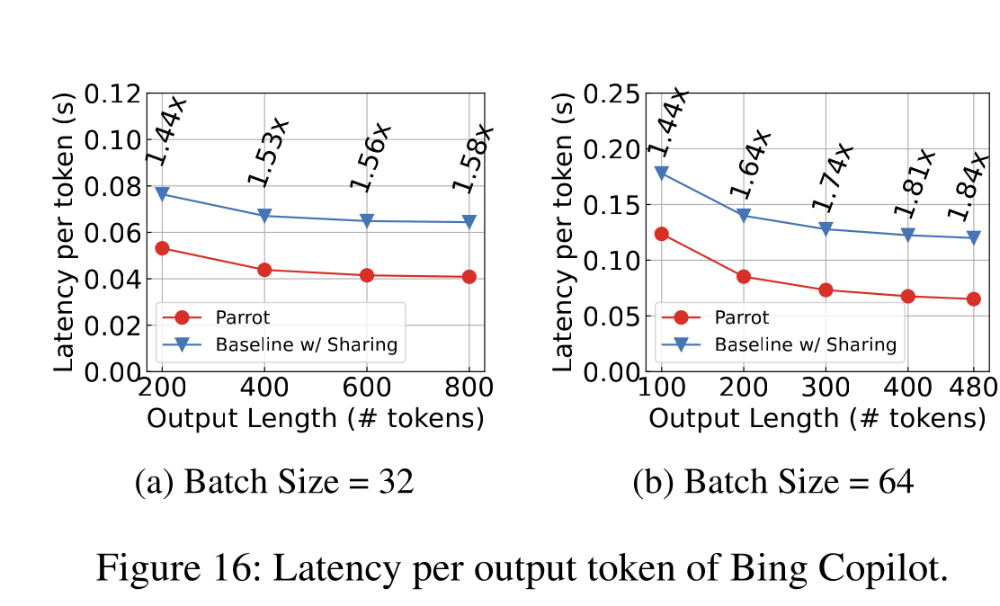

*图源：正式 OSDI 2024 论文 Figure 16（PDF p.13，论文印刷页 940），按原图裁切。左右分别固定 batch size 32 和 64，沿横轴增加输出长度并比较 Parrot 与已支持 sharing 的 PagedAttention baseline；倍率随输出变长而增大。这里比较的是共享前缀 kernel 与完整实现的组合，不代表 prefix caching 在所有 prompt 分布上都具有同样优势。*

Batch size = 32：

| Output length | Speedup over PagedAttention sharing baseline |
|---:|---:|
| 200 | 1.44× |
| 400 | 1.53× |
| 600 | 1.56× |
| 800 | 1.58× |

Batch size = 64：

| Output length | Speedup |
|---:|---:|
| 100 | 1.44× |
| 200 | 1.64× |
| 300 | 1.74× |
| 400 | 1.81× |
| 480 | 1.84× |

output 越长，decoding 中重复加载 shared prefix 的成本越显著，因此 Parrot kernel 的收益更大。正文还报告 batch size 32 时 Parrot 可达到约 40 ms TPOT。

### 10.3.2 Multiple GPTs applications

#### 设置

- 4× A6000 48GB；
- 4 个 LLaMA 7B engines；
- 4 类 GPTs：productivity、programming、image generation、data analysis；
- 各类以相同概率产生 requests；
- arrival follows Poisson distribution。

#### Figure 17 结果

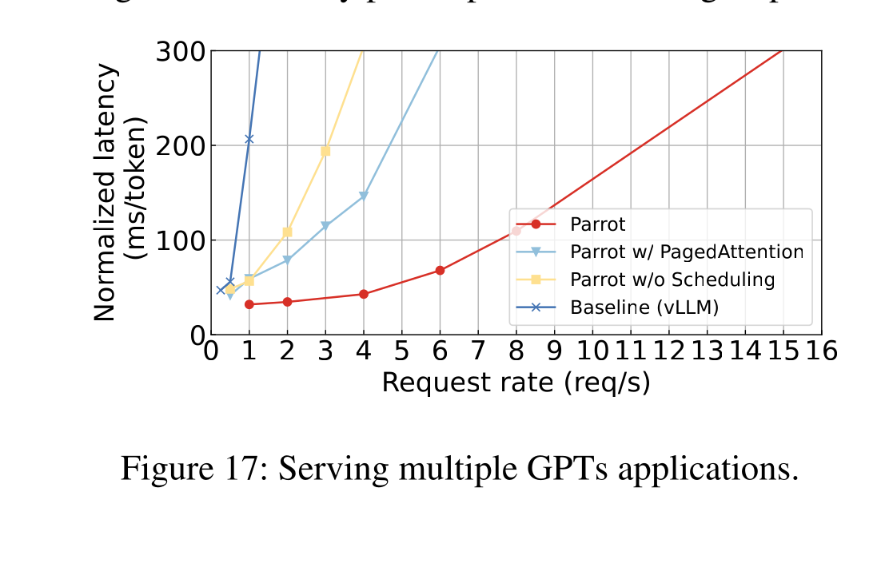

*图源：正式 OSDI 2024 论文 Figure 17（PDF p.13，论文印刷页 940），按原图裁切。横轴提高到达率，纵轴观察归一化平均端到端延迟何时陡增；比较完整 Parrot、关闭 scheduling、替换 kernel 和两个 baseline，可分辨 placement 与 kernel 的作用。容量拐点只对应 4×A6000、四类 GPTs 与该到达分布，不是跨硬件的固定上限。*

- Parrot 可承载的 request rate 相对不共享 prompt 的 baseline 最高提高 **12×**；
- 关闭 affinity scheduling 后，Parrot 只比 baseline 高约 **3×**，因为共享 prefix 的 requests 常被分散到不同 engines；
- 使用 Parrot 自定义 attention kernel，相对使用 vLLM PagedAttention 的 Parrot 版本，request rate 最高提高 **2.4×**。

#### 作者声称实验说明了什么

prefix sharing 不是单一 engine optimization。高收益依赖：

1. prompt structure 发现；
2. application affinity placement；
3. KV context sharing；
4. shared-prefix kernel。

Figure 17 通过关闭 scheduling 与替换 kernel，分别说明后二者的独立作用。

---

## 10.4 Section 8.4：Multi-agent Applications

### Workflow

基于 MetaGPT 构建三类角色：

1. Architect：设计文件结构与各文件 API；
2. 多个 Coders：每人实现一个文件；
3. 多个 Reviewers：每人 review 一个文件；
4. Coders 根据 comments 修改代码；
5. review-and-revision 循环执行 3 次，生成 final code。

设置：1× A100，LLaMA 13B；文件数量为 4、8、12、16。

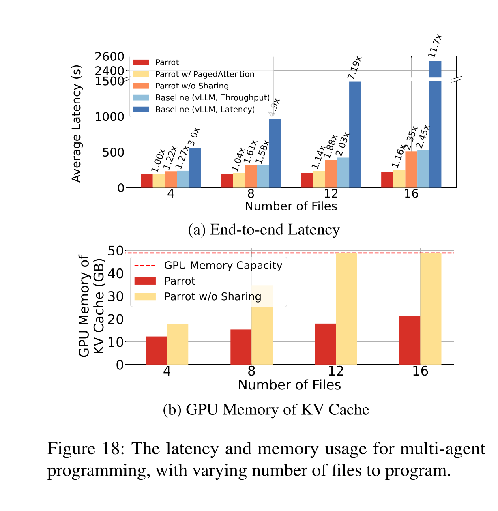

*图源：正式 OSDI 2024 论文 Figure 18（PDF p.13，论文印刷页 940），按原图裁切。上图按文件数比较端到端延迟，下图比较 KV cache 占用；柱顶倍率以 Parrot 为参照，内存图虚线是该实验图标出的约 48 GB 可用阈值，并非 A100 的物理总显存。该图展示固定 MetaGPT 风格 workflow 下多项优化叠加的效果，未评价生成代码质量。*

### Figure 18a：End-to-end latency

- 相对 latency-centric vLLM baseline，Parrot 最高加速 **11.7×**；
- 相对 throughput-centric vLLM baseline，最高加速 **2.45×**；
- 去掉 prompt sharing 后，差距最高为 **2.35×**，表明动态公共 context 复用是主要贡献之一；
- 将 Parrot kernel 替换为 vLLM PagedAttention 后，在 16 files 时 Parrot kernel 进一步贡献约 **1.2×**。

作者将 11.7× 的主要来源解释为：

- 根据 final-code latency objective 推导 coding、reviewing、revising 中的多个 parallel task groups；
- 用较大 batch 提升 task-group throughput；
- 识别角色间反复共享的动态 conversation/context；
- 避免重复 KV cache 与 memory transactions。

### Figure 18b：KV cache memory

- Parrot 使用 sharing 后，KV cache memory 随文件数增长但保持在 A100 80GB 环境下图示的约 48GB 可用阈值以内；
- `Parrot w/o Sharing` 在 12、16 files 时达到图中的 GPU memory capacity 上限；
- 这说明 static system-prompt reuse 不足以覆盖 multi-agent 中由运行时 Semantic Variables 形成的动态共享 context。

### 实验真正证明了什么

该实验支持：在具有大量并行角色和重复 conversation history 的固定 multi-agent workflow 中，objective deduction、task-group batching 与 dynamic prefix sharing 可以叠加获得显著系统收益。

### 实验没有证明什么

- 未评估最终代码正确性或质量；
- 未覆盖动态规划、工具调用或任意 agent control flow；
- 11.7× 是相对特定 latency-centric baseline、在最大文件数和该 testbed 下的最高值。

---

## 10.5 Section 8.5：Scheduling of Mixed Workloads

### 设置

- 4× A6000 48GB；
- 每张 GPU 一个 LLaMA 7B engine，共 4 engines；
- chat applications：1 request/s，要求低 latency；
- data analytics：Map-Reduce applications，偏高 throughput；
- 两个 reference implementations：
  - latency baseline：限制 engine capacity，降低 decoding latency；
  - throughput baseline：使用完整 capacity，提高 GPU utilization。

### Figure 19 原始结果

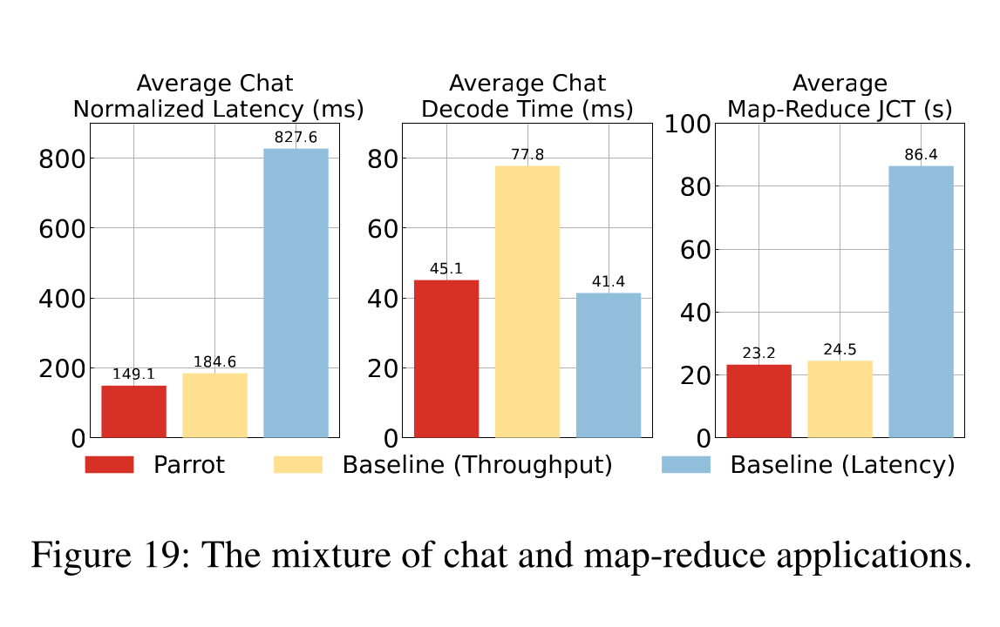

*图源：正式 OSDI 2024 论文 Figure 19（PDF p.14，论文印刷页 941），按原图裁切。三幅图的单位不同，只能在各自 panel 内比较：chat 端到端归一化延迟、chat decode time、Map-Reduce JCT。Parrot 同时接近两类专用 baseline 的较优指标，但该实验不提供多租户公平性或隔离结论。*

| Metric | Parrot | Throughput baseline | Latency baseline |
|---|---:|---:|---:|
| Average Chat Normalized Latency | 149.1 ms/token | 184.6 ms/token | 827.6 ms/token |
| Average Chat Decode Time | 45.1 ms | 77.8 ms | 41.4 ms |
| Average Map-Reduce JCT | 23.2 s | 24.5 s | 86.4 s |

对应正文结论：

- chat normalized latency：相对 latency baseline 改善 **5.5×**，相对 throughput baseline 改善 **1.23×**；
- chat decode time：与 latency baseline 接近，相对 throughput baseline 改善 **1.72×**；
- Map-Reduce JCT：相对 latency baseline 加速 **3.7×**，相对 throughput baseline 加速 **1.05×**。

### 作者声称实验说明了什么

Parrot 通过把不同 objective 的 requests 智能分配到不同 engines，降低 chat 与 Map-Reduce workload 在同一 engine 上的 capacity conflict，因而可以同时接近两类专用 baseline 的优势。

### 需要正确理解 Figure 19

latency baseline 的纯 decoding time 最低，但其 normalized end-to-end latency 最差，说明严格限制 capacity 会造成严重 queueing。Figure 19 的重点正是：只看 engine execution latency 会误判用户最终体验。

---

## 11. 实验证据总表

| 论文主张 | 对应实验 | 主要证据 | 结论边界 |
|---|---|---|---|
| 依赖感知可消除 client round trip 与二次排队 | Figures 11–13 | chain summary 最高 2.38×；25 apps 均更早完成 | 使用注入的 200–300 ms delay；固定 workflow |
| objective deduction 改善 task-group completion | Figure 14 | Map-Reduce 最高 2.37× | baseline 将所有 requests 视为 latency-sensitive |
| prompt sharing 可显著节省 memory/latency | Figures 15–18 | Bing/GPTs/Multi-agent 均有收益，w/o sharing 出现 OOM | 依赖长公共 prefix 或动态共享 context |
| affinity scheduling 对 sharing 至关重要 | Figure 17 | 12× 降为 3× when scheduling off | 4-GPU、4 GPT categories 的设置 |
| 自定义 kernel 减少 shared-prefix memory loading | Figures 16–18 | 最高 1.84× TPOT/latency improvement；GPTs rate 2.4× | 相对 vLLM PagedAttention sharing implementation |
| application-centric mixed scheduling 可兼顾两类 workload | Figure 19 | chat 与 Map-Reduce 同时接近各自专用 baseline | 仅 4 engines、两类 workload；未研究 fairness |

---

## 12. 优点与局限

## 12.1 论文明确支持的优点

### 1. 抽象统一

同一个 Semantic Variable abstraction 同时支持：

- dependency recovery；
- inter-request communication；
- performance-objective propagation；
- prompt commonality detection；
- scheduling affinity。

不是为每个优化单独增加一套 application hint。

### 2. API 信息增量相对克制

Parrot 没有要求公共服务执行整个任意应用程序，而是仅暴露 prompt template、variables、dependency 与 criteria。作者认为这是 system complexity 与 optimization information 之间的折中。

### 3. Cluster 与 engine 联动

论文清楚地区分：发现 commonality、placement、context sharing、kernel execution 是不同层次的问题，并通过 Parrot Manager 与 Parrot LLM Engine 将它们连接起来。

### 4. 端到端目标驱动

Figure 4、Figure 14 与 Figure 19 都说明：per-request latency、decode latency 或 GPU utilization 单独最优，并不保证 application JCT 最优。

### 5. 机制覆盖多类 application pattern

实验覆盖 chain、Map-Reduce、long shared system prompt、multi-agent workflow 和 mixed workloads，而不是只在一种 prompt 上展示 prefix caching。

## 12.2 作者在 Section 6 中明确写出的局限

1. 不支持 public service 上的 dynamic control flow 与 native functions；
2. 动态分支仍需客户端执行；
3. 任意 native code offloading 有安全风险；
4. fairness、starvation、failure、outlier、heterogeneous cluster 等问题未研究；
5. 与现有 orchestration framework 集成时，需要修改其 API adapter，不能在客户端先丢失模板结构。

## 12.3 笔记分析：论文未充分覆盖的问题

> 以下是基于论文内容的分析，不属于作者原文结论。

### 1. Scheduler 细节不完整

Algorithm 1 省略 `FindEngine` 的具体评分、capacity model 与冲突处理，因此 application-centric scheduling 的完整复现仍需工程判断。

### 2. Centralized Manager 的可扩展性未验证

Manager 负责 session DAG、prefix index、communication 与 cluster scheduling。实验最多 4 GPUs，未测大规模 manager throughput、状态存储开销或 manager failure recovery。

### 3. API 采用成本与兼容性

要获得收益，应用必须保留 template/placeholders 并使用 Semantic Variables。对于完全使用 opaque OpenAI API、无法修改 frontend 的应用，Parrot 无法自动恢复全部结构。

### 4. 动态 agent 是重要缺口

论文的 multi-agent workflow 虽然交互复杂，但执行图仍是预先可表达的。真实 agent 可能根据 LLM output 决定下一工具、分支和循环次数，Parrot 当前只能把这部分留在客户端。

### 5. 目标类型较粗

实验主要使用 latency 与 throughput 两类 criteria。deadline、SLO violation probability、cost、TTFT、TPOT、fairness 等没有进入实际调度算法和实验。

### 6. Multi-tenancy isolation 未评估

跨应用共享 prompt/context 可能与 tenant isolation、privacy、cache side channel、resource accounting 发生冲突。论文没有研究这些安全与计费问题。

### 7. 实验规模与模型范围有限

- 1× A100 或 4× A6000；
- LLaMA 7B/13B 为主；
- 未覆盖 tensor-parallel 大模型、跨节点 engine、超长 context 或大规模 production trace。

### 8. 只评估系统性能

论文通过控制 output length 进行系统实验，但没有报告 answer quality、summary quality 或 code correctness。它证明的是 serving efficiency，不是应用质量提升。

---

## 13. 我的理解与启发

> 以下为基于论文内容的个人分析，不属于论文原文贡献。

## 13.1 最值得学习的不是某个 kernel，而是 API boundary 的重新设计

Parrot 的核心洞察是：**很多系统优化机会在进入 serving system 之前就被 API 丢掉了。** 如果接口只保留最终字符串，后端再聪明也很难可靠恢复 producer-consumer、placeholder boundary 与 final objective。

它选择的做法不是上传整个 application code，而是暴露最少但高价值的信息：

- variable identity；
- input/output role；
- prompt boundary；
- session dependency；
- final performance criterion。

这是一个典型的“为优化设计 abstraction”思路。

## 13.2 从 sink 向 upstream 传播目标

Figure 9 所表达的思想很重要：用户只在 final output 上表达目标，系统再沿 DAG 向上游推导每个 stage 的策略。这样开发者不必逐个标注“这个 request 应使用大 batch、那个 request 应低延迟”。

更深一层的启发是：**上游算子的局部目标可能与全局目标方向相反。** 为降低 final latency，Map stage 可能要接受更高的 per-request latency，以换取更快的 group completion。

## 13.3 Locality 优化必须包含“发现—放置—执行”闭环

仅有 prefix cache 还不够：

1. 服务端要知道哪些 requests 可以共享；
2. scheduler 要把它们放到同一 engine；
3. engine 要能 fork context；
4. kernel 还要避免重复加载共享 KV。

Parrot 的价值在于把这四步放在一个系统中，而不是只做单点 cache。

## 13.4 submit/get 分离是获得全局视野的关键

同步 completion 会让 workflow 每一步都成为一个阻塞边界。Parrot 用 asynchronous submit 与 on-demand get，让服务端提前看到未来 requests。这个设计与 futures/dataflow execution 的思想一致，是服务端能够做 DAG analysis 的前提。

## 13.5 “Application as first-class citizen”意味着调度单位不再只是 request

Parrot 中实际需要考虑的调度单位可能是：

- 单个 latency-sensitive request；
- 一个 parallel task group；
- 一组共享 prefix 的 requests；
- 一个已有 resident context 的 affinity group。

这比传统 FIFO 或 least-queue request dispatch 多了一层 application semantics。

---

## 14. 与我的数据库 AI 算子执行与调度课题的关系

> 以下为结合当前课题的个人分析，不属于 Parrot 原文贡献。

## 14.1 可以直接对应的设计元素

| Parrot | 数据库驱动 AI 算子执行中的对应物 | 可借鉴点 |
|---|---|---|
| Semantic Variable | AI 算子输入字段、prompt template、上游结果与下游 request 之间的显式变量 | 不要在进入 Ray/vLLM 前把 job semantics 压扁成独立 HTTP requests |
| Session request DAG | 数据库 query / job 的 operator DAG 与 stage dependencies | 在 Request Organizer 中维护 producer-consumer 与 ready state |
| `get(perf=...)` | 最终 query sink 的 latency SLO、throughput goal 或 deadline | 从 final output 向上游阶段传播调度偏好 |
| Task Group | 同一 AI operator stage 中的并行 partitions / rows / batches | 以 group completion/JCT 而不是单 batch latency 为目标 |
| PrefixHash | prompt-template ID、共享 system prompt、相同 few-shot/examples | 进行 prefix-aware endpoint routing 与 KV-cache locality |
| Context fork | vLLM prefix caching / reusable KV context | 将可共享 requests 路由到持有对应 context 的 endpoint |
| submit/get split | Ray futures、异步 request submission、sink materialization | 提前暴露后续工作，避免 client-side stage barrier |
| App-centric scheduling | per-job / per-stage endpoint admission 与 routing | 避免 interactive request 与 bulk AI operator 在同一 endpoint 上互相拖累 |

## 14.2 对当前 PostgreSQL → Daft/Ray → vLLM 架构最有价值的三点

### 1. 在 Request Organizer 中保留 job-level metadata

不应只生成：

```text
(prompt, max_tokens)
```

还应至少保留类似：

```text
job_id
operator_id / stage_id
producer_ids / consumer_ids
final_objective
prompt_template_id
predicted_input_tokens / predicted_output_tokens
partition_or_group_id
```

这不是 Parrot 的原始 API，而是借鉴其思想在数据库 AI pipeline 中的映射。

### 2. 将 latency objective 转成 stage-specific policy

对数据库 AI operator：

- 上游大量独立 records 可能应偏 throughput，形成较大 token-budget batches；
- 进入 final reduce、verification 或用户可见输出阶段后，应偏 latency；
- 因此，固定 row cap、固定 batch size 或统一并发上限都可能与 final JCT 不一致。

Figure 4 与 Figure 14 可以直接作为这一动机的论文依据。

### 3. Routing 必须考虑 prefix/context locality

如果多个数据库 rows 使用相同 system prompt、schema instruction 或 few-shot examples，仅在 vLLM 内开启 prefix caching 仍不够。上游 router 必须尽量把这些 requests 送到持有对应 KV context 的 endpoint。Figure 17 对关闭 affinity scheduling 的消融非常适合作为该设计的依据。

## 14.3 与当前课题的关键区别

### 1. 优化范围不同

Parrot 主要优化多个 **LLM requests** 之间的关系；当前课题还包括：

- PostgreSQL/数据库 job semantics；
- 上游数据读取与 partition；
- Daft/Ray task execution；
- request organization；
- endpoint admission、credits 与 backpressure；
- sink 与结果物化。

因此，当前课题的闭环比 Parrot 更长。

### 2. Semantic Variable 不等于数据库 field

Parrot 的 Semantic Variable 是 prompt 中有特定语义用途的 input/output text region，并以 placeholder 连接 LLM requests。数据库 field 是关系数据中的属性。二者可以建立映射，但不能直接当成同一概念。

### 3. Parrot 可修改 LLM engine

Parrot 实现了 Fill/Generate/context fork 与 CUDA kernel。当前课题若把 vLLM 视为 black box，第一阶段更适合先实现：

- objective-aware admission；
- prefix-aware endpoint routing；
- per-job/task-group scheduling；
- completion-time credit release。

自定义 kernel 可以作为后续独立方向，而不是系统成立的前提。

### 4. 当前课题更强调资源闭环

Parrot Algorithm 1 主要讲 placement preference，没有研究当前课题中的：

- request credit / predicted-work credit；
- endpoint-level backpressure；
- per-job fairness；
- idle borrowing；
- release on completion/error；
- 数据阶段与模型服务状态联合调度。

这些正是可以在 Parrot 之上进一步推进的区别点。

## 14.4 可借鉴的实验组织

当前课题可以参考 Parrot 将实验拆成四类：

1. **Dependent chain**：上一步 AI result 直接进入下一步，观察 network/queue/barrier overhead；
2. **Parallel Map + final Reduce**：验证 task-group throughput policy 是否降低 final JCT；
3. **Shared prompt multi-tenant**：验证 prefix-aware routing、cache hit、GPU memory 与 throughput；
4. **Mixed interactive + bulk workload**：同时报告 interactive normalized latency/TPOT 与 bulk job JCT。

尤其应像 Figure 19 一样同时报告：

- end-to-end latency；
- queueing latency；
- decode/engine time；
- bulk job completion time。

这样可以避免只优化某个 engine metric，却恶化数据库查询端到端体验。

---

## 15. 术语表

| 术语 | 论文中的含义 |
|---|---|
| SemanticFunction | 用自然语言 prompt 实现、由 LLM 执行的语义函数 |
| Semantic Variable | SemanticFunction prompt 中的 input/output placeholder；也可连接多个 requests 形成 data pipeline |
| Orchestration Function | 连接多个 SemanticFunctions 的应用侧函数 |
| Session DAG | 同一 session 内由 requests 与 Semantic Variables 构成的 dependency graph |
| Producer / Consumer | 生成某 Semantic Variable 的 request / 使用该 variable 的下游 request |
| Performance Criteria | final output 上声明的 latency 或 throughput 目标 |
| Task Group | DAG 同一并行 stage 中应按整体完成时间优化的一组 requests |
| PrefixHash | 在 Semantic Variable boundaries 上计算的 prompt-prefix hash |
| Context | engine 上某 request 的 model execution state，主要是 KV cache |
| Context Fork | 新 request 从 parent context 继承共享 KV cache |
| Fill | 处理 prompt tokens 并填充 context/KV cache |
| Generate | 在 context 上 autoregressively 生成输出 tokens |
| Application-Centric Scheduling | 利用 workflow、objective 与 sharing 信息优化 application E2E performance，而非独立 request |

---

## 16. Figure / Table / Algorithm 索引

| 编号 | 内容 | 精读重点 |
|---|---|---|
| Figure 1 | 四类 LLM application workflows | 多请求是常态，且存在并行、串行和多 agent 关系 |
| Figure 2 | Multi-agent requests 的变量传递 | output variable 如何成为多个下游 requests 的 input |
| Figure 3 | latency breakdown；传统服务与 Parrot | network + requeue overhead 的来源 |
| Figure 4 | request-centric vs application-centric scheduling | final latency 目标可能要求 Map stage 偏 throughput |
| Table 1 | calls、tokens、repeated ratio | 多调用与 prompt redundancy 的实际程度 |
| Figure 5 | Bing Copilot prompt structure | static / quasi-static / dynamic 区域 |
| Figure 6 | Parrot system overview | Front-end、Manager、Engine 三层 |
| Figure 7 | SemanticFunction coding example | submit/get、future variables、dependency |
| Figure 8 | Inter-request analysis primitives | GetProducer、GetConsumers、GetPerfObj、PrefixHash |
| Figure 9 | Performance objective deduction | reverse-topological propagation 与 task groups |
| Algorithm 1 | Parrot request scheduling | TaskGroup、queued sharing、resident context、fallback |
| Table 2 | Workloads 与启用优化 | 每组实验究竟验证哪些机制 |
| Figure 10 | vLLM token capacity calibration | baseline latency capacity 的选取依据 |
| Figures 11–13 | Chain summary | dependent serving、network/queue savings |
| Figure 14 | Map-Reduce summary | performance-objective deduction 与 task group |
| Figures 15–17 | Bing Copilot / GPTs | sharing、affinity scheduling、kernel |
| Figure 18 | Multi-agent programming | 四种优化叠加后的 latency 与 KV memory |
| Figure 19 | Mixed workloads | application-aware separation of latency/throughput demands |

---

## 17. 最终总结

Parrot 的核心贡献可以压缩为一句系统设计原则：

> **不要让 request-level API 把 application-level semantics 丢掉；只要服务端能够看到变量、依赖、目标和公共结构，就可以把传统数据流分析、locality-aware placement 与目标感知调度引入 LLM serving。**

它真正改变的是 serving system 的观察尺度：

```text
individual request
        ↓
request group / shared context / application DAG
        ↓
end-to-end application performance
```

从论文证据看，Parrot 对以下 workload 最有价值：

- 多轮且依赖紧密的 LLM calls；
- 有大量并行中间 requests 的 Map-Reduce 或 multi-agent workflow；
- 多用户共享长 system prompt；
- latency-oriented 与 throughput-oriented tasks 混合运行。

论文没有证明它已经解决动态 agent、超大规模多租户、公平性、容错和跨节点大模型 serving；但它提供了一个非常重要的起点：**把应用语义重新带回模型服务端。**
