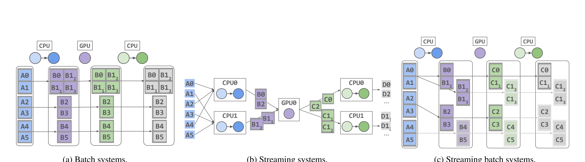
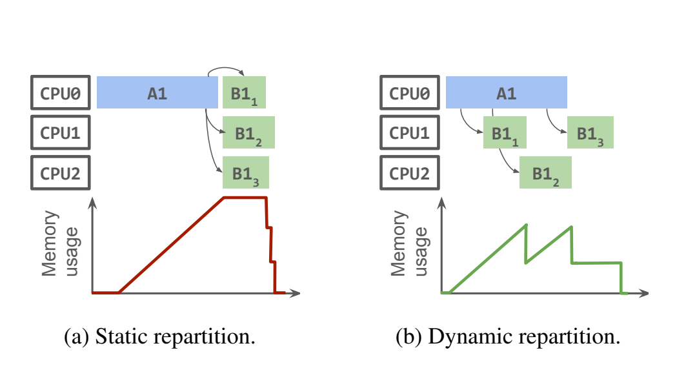
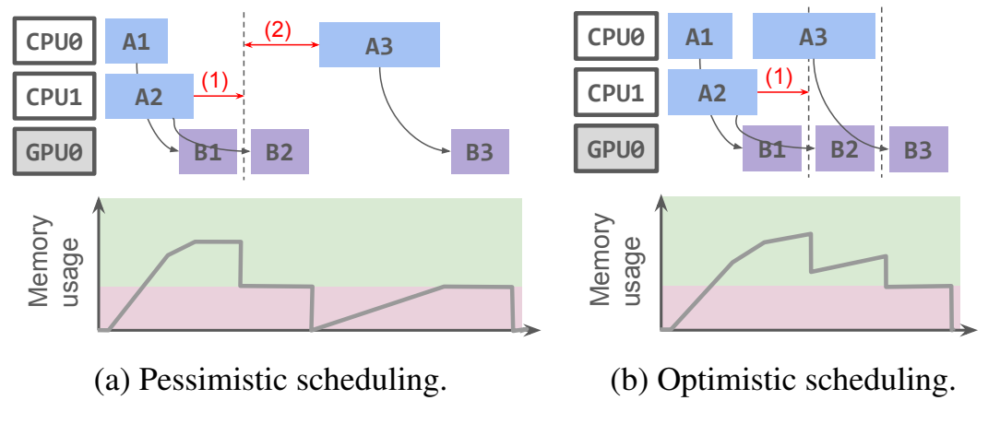
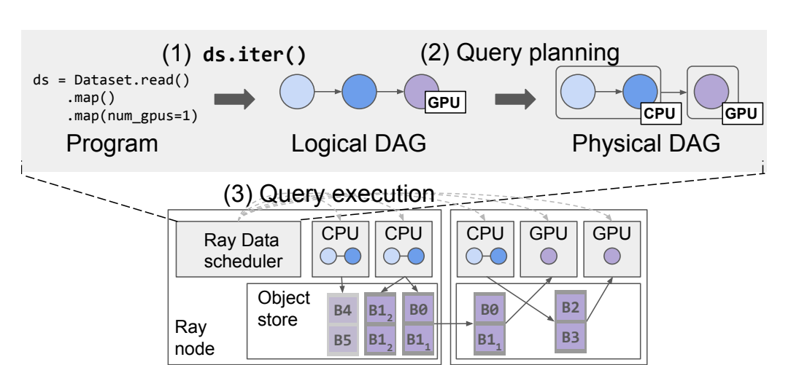
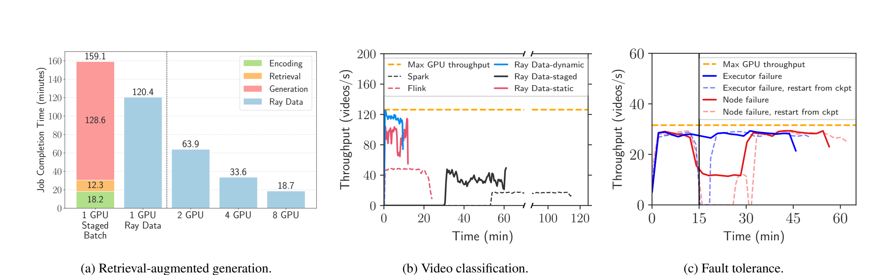
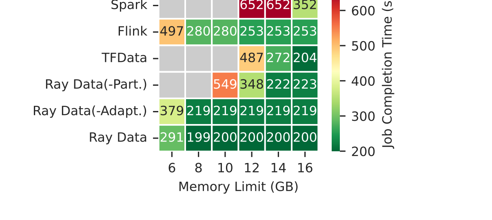

# Ray Data 论文精读笔记

## The Streaming Batch Model for Efficient and Fault-Tolerant Heterogeneous Execution

> **阅读版本**：用户上传 PDF，19 页，arXiv:2501.12407v5，2025-10-22。  
> **系统**：Ray Data  
> **核心概念**：Streaming Batch Model  
> **笔记原则**：正文主体只写论文明确支持的内容；论文没有证明或没有研究的内容明确标出。最后两节“理解与启发”“与课题关系”为基于论文内容的个人分析，不属于论文原文贡献。

---

# 0. 先给结论：这篇论文到底做了什么？

这篇论文解决的是一个很具体的系统问题：

> **当一个 ML 数据流水线同时包含 CPU、GPU、I/O 等异构算子时，怎样既像流处理系统一样流水执行、控制中间数据内存，又像批处理系统一样动态负载均衡、弹性扩缩容并进行细粒度故障恢复？**

作者提出 **Streaming Batch Model**：

- 仍然以 **partition** 作为执行和恢复的基本单位；
- 但 partition 不再完全在运行前静态确定，而是可以在运行过程中根据实际输出大小 **动态产生、动态切分**；
- 每个 partition 对应的 task 在运行时再动态分配给 CPU/GPU 等资源；
- 中央调度器同时观察：
  - operator DAG；
  - partition 状态；
  - CPU/GPU/custom resource；
  - shared-memory 中间数据占用；
- 通过 **dynamic repartitioning + memory-aware adaptive scheduling**，在保证总内存上限的同时尽量让异构流水线保持满载。

Ray Data 是这一模型的实现。

一句话概括：

> **Ray Data 的关键不是“把 Ray 用来做数据处理”，而是把 partition 变成一个既可动态流动、又可被 lineage 恢复的调度单位，并围绕这个单位联合控制异构计算资源和中间数据内存。**

---

# 1. 论文基本信息

## 1.1 题目

**The Streaming Batch Model for Efficient and Fault-Tolerant Heterogeneous Execution**

## 1.2 作者

Frank Sifei Luan, Ron Yifeng Wang, Yile Gu, Ziming Mao, Charlotte Lin, Amog Kamsetty, Hao Chen, Cheng Su, Balaji Veeramani, Scott Lee, SangBin Cho, Clark Zinzow, Eric Liang, Ion Stoica, Stephanie Wang.

Frank Sifei Luan 与 Ron Yifeng Wang 标记为 equal contribution。

## 1.3 单位

论文首页给出的单位是：

1. UC Berkeley
2. University of Washington
3. Anyscale

## 1.4 会议 / 期刊 / 年份

上传版本首页明确写的是：

- **arXiv:2501.12407v5**
- **22 Oct 2025**
- 分类：cs.DC

**需要注意：论文 PDF 首页没有标出正式会议/期刊名称。**

上传文件名包含 `nsdi2027`，但**不能仅根据文件名把论文 venue 写成 NSDI 2027**。本笔记因此将版本记为“arXiv v5, 2025”，不自行补正式 venue。

## 1.5 论文研究对象

论文主要面向：

- ML batch inference；
- ML training data preprocessing；
- CPU/GPU/I/O 混合的 heterogeneous dataflow；
- 以 map-style per-row transform 为主的流水线。

Section 2.1 明确说明，论文主要目标与现有 ML dataloader 类似，是 **map-style per-row transforms**。对于 sort、group-by 等需要 all-to-all shuffle 的操作，论文说可以使用作者此前 ExoShuffle 工作中的技术，但这不是本文的主要设计和实验重点。

---

# 2. 研究背景与问题

# 2.1 为什么 ML 数据处理会成为问题？

论文开篇的核心观察是：

虽然训练和推理通常被认为是 GPU-intensive，但完整 ML workload 并不只有 GPU 模型执行，还包括：

- 从本地盘 / 云对象存储加载数据；
- 图像、视频解码；
- 文本处理；
- embedding / encoding；
- 数据预处理；
- 后处理；
- 结果上传。

这些工作大量使用：

- CPU；
- I/O；
- 内存；
- 某些情况下还会使用与主训练/推理模型不同类型的 GPU。

作者指出，**CPU-based preprocessing 经常已经成为 training 和 batch inference 的瓶颈。**

随着多模态模型出现，一个输入还可能发生很大的数据膨胀。例如一个视频文件被 decode 成大量 frame，导致中间数据远大于输入。

---

# 2.2 Figure 1：典型异构 ML dataflow

**Figure 1a：Batch inference**

逻辑上是：

```text
load(CPU/I/O)
    ↓
decode(CPU)
    ↓
inference(GPU)
    ↓
encode(CPU)
    ↓
upload(CPU/I/O)
```

关键点不是 DAG 本身复杂，而是相邻 operator 使用完全不同的资源。

为了让 GPU 不空闲，CPU decode、GPU inference、CPU encode 必须尽可能流水重叠。

---

**Figure 1b：Stable Diffusion multimodal training**

包括：

```text
loadText ──→ TextEncoder(GPU) ──┐
                               ├──→ UNet.train() × 多 GPU replica
loadImage → clip → ImageEncoder(GPU) ─┘
```

这里不仅存在 CPU/GPU 异构，GPU 本身也可以进一步异构：

- Encoder 可以放到较便宜的 GPU；
- UNet trainer 使用更强的 GPU；
- 从而避免 Encoder 与 UNet 竞争同一批 GPU 的显存和计算资源。

这正是后面 Section 5.2.2 Stable Diffusion 实验的动机。

---

# 2.3 异构流水线提出两个系统要求

论文把核心困难压缩为两个要求。

## 要求 1：中间数据内存管理

为了 pipeline：

- buffer 太少 → downstream GPU 等不到数据，GPU idle；
- buffer 太多 → shared memory OOM，或者中间 partition spill 到 disk。

所以问题不是简单地“尽可能提前执行 upstream”。

必须回答：

> **在有限内存下，允许多少数据提前进入 pipeline？**

特别是输入/输出大小会动态变化。例如视频 decode 后到底产生多少 frame，运行前不一定知道。

---

## 要求 2：资源弹性与动态负载均衡

不同 record 的处理时间可能差很多。

论文使用视频为例：

- 长视频 decode 时间明显更长；
- 如果提前用 round-robin 把视频固定分给 executor；
- 某些 executor 会积压；
- 另一些 executor 已经空闲。

另外，在真实 cluster 中还要应对：

- CPU/GPU 资源重新分配；
- 节点加入；
- 节点离开；
- executor failure；
- node failure。

因此作者认为，一个异构数据系统必须既有 pipelining，又有 elasticity。

---

# 2.4 为什么传统 Batch System 不够？

Section 2.2 讨论：

- MapReduce
- Hadoop
- Spark
- Spark Streaming
- Flink BATCH mode

其核心执行方式是：

1. 运行前确定 partition；
2. stateless task 消费 partition；
3. task 输出 materialized partition；
4. lineage 记录 task DAG；
5. partition 丢失后重新执行对应 task。

这种方式的巨大优点是：

- task 可在任意 executor 上重新执行；
- 很容易扩缩容；
- failure recovery 粒度可以做到 partition；
- 不需要持续 durable logging 中间数据。

但作者指出两个关键限制。

---

## 限制 1：Stage barrier 阻止异构 pipeline

传统 batch system 一般要求：

> 一个 stage 全部执行完成，下一 stage 才执行。

这使 scheduling 和 recovery 很简单，因为重新调度 task 时，它的 input 已经 materialize。

问题是：

- CPU stage 做完之后 GPU stage 才开始；
- CPU/GPU 无法同时工作；
- 所有 stage 间中间结果都需要 materialize。

在 homogeneous CPU workload 中，这个问题没那么严重，因为连续 map operator 可以 fusion。

但在 heterogeneous pipeline 中：

- CPU operator 和 GPU operator 如果强行 fusion；
- 会把两个 operator 的 parallelism 绑定；
- 很容易让某一类资源闲置。

---

## 限制 2：Partitioning 必须在运行前确定

lineage recovery 需要知道：

> “一个 task 当初产生了哪些 partition？”

因此传统 batch system 往往在运行前把 partition 计划固定。

问题是运行前不知道：

- 中间 row 的真实 memory size；
- operator output expansion ratio；
- 某个输入会不会生成远多于其他输入的数据。

因此即使做一定程度的 pipelining，一个静态 partition 本身也可能突然非常大。

---

# 2.5 Figure 2a / Figure 3a：Batch 的问题

论文使用视频生成例子。

输入 record：

```text
A0 A1 A2 A3 A4 A5
```

其中 A1 是一个特别大的视频，decode 后产生：

```text
B11 B12 B13
```

而不是普通输入的一个输出。

Batch system 在运行前已经决定：

```text
[A0, A1] = 一个 partition
```

因此运行时即使发现 A1 很大，B0、B11、B12、B13 仍可能被绑定在同一个大的静态输出 partition 中。

**Figure 3a** 则展示 stage barrier：

```text
CPU stage 完整结束
        ↓
GPU stage 开始
        ↓
CPU stage 开始
```

资源利用率与内存效率都不理想。



*来源：论文 Figure 2，PDF 第 3 页；原图裁剪。Figure 3 的时间线含义已由本节文字展开，未重复截图。*

---

# 2.6 为什么传统 Stream Processing 不够？

Section 2.3 讨论：

- Naiad
- Flink
- Spark Continuous Processing
- MillWheel
- Kafka

流处理系统做了与 batch 几乎相反的 trade-off。

它通常：

1. 运行前把 logical operator shard 到固定 executor；
2. executor 长期拥有资源；
3. executor 直接向 downstream executor 发送动态大小的数据 batch；
4. downstream 堵塞时用 backpressure 限制 upstream。

优点：

- operator 可以异步并行；
- 中间数据不需要 stage 全量 materialization；
- batch 可以动态形成；
- backpressure 可以限制内存；
- heterogeneous operator 很容易流水起来。

问题是：

> executor、operator、data range 和 resource 被长期绑定。

因此不容易：

- 动态重新负载均衡；
- 根据当前 load 改 operator parallelism；
- 动态加减节点；
- 在 failure 后只重做一个 partition。

---

# 2.7 Streaming failure recovery 的代价

论文概括两种典型方案。

## Global checkpointing

优点：

- 正常运行开销较低。

问题：

- failure 或 cluster reconfiguration 后需要 rollback 到最近 checkpoint；
- 往往是全局 rollback；
- 加节点、减节点本身都可能导致停顿。

## Logging

优点：

- 可以做到 record-level 更快恢复。

问题：

- 中间数据需要 durable logging；
- 正常运行开销较高。

作者认为 ML pipeline 中大量计算是：

- deterministic；
- idempotent；

因此为每条中间记录付 durable logging 成本并不划算。

---

# 2.8 ML DataLoader 为什么也不够？

论文把：

- PyTorch DataLoader
- tf.data

视为某种 single-node stream processing system。

它们会：

- 在 GPU trainer 本机启动固定 worker pool；
- 不断 load/preprocess；
- 把数据送到本机 GPU。

主要限制：

1. 通常不是 distributed execution；
2. 无法在节点之间做动态 load balancing；
3. 不容易使用 CPU-only node；
4. 不容易使用 heterogeneous node types；
5. GPU 默认是 sink，因此不适合“GPU inference 后还有 CPU postprocess”的 batch inference；
6. preprocessing 与 trainer 往往 fate-share。

---

# 2.9 Table 1：论文对五类系统的定位

| 系统类别 | Dynamic partitioning | Dynamic resource assignment | Fault tolerance | 最小 rollback 粒度 | Heterogeneous node types |
|---|---:|---:|---|---|---:|
| Batch | × | ✓ | Lineage | Partition | ✓ |
| Stream | ✓ | × | Logging / Checkpointing | Record / Epoch | ✓ |
| PyTorch DataLoader | × | × | None | Job | × |
| tf.data | ✓ | ✓，但 local only | Checkpointing | Epoch | × |
| Streaming Batch / Ray Data | ✓ | ✓ | Lineage | Partition | ✓ |

这张表就是整篇论文的 thesis：

> **Batch 有 resource elasticity 和 lineage recovery；Stream 有 dynamic batching 和 pipelining；Ray Data 试图同时保留两边。**

---

# 3. 核心思想与贡献

论文给出三个贡献。

## 3.1 Streaming Batch Model

核心抽象：

> **partition 仍然是 execution unit，但 partition 可以在运行时动态创建并在 heterogeneous operator 之间流动。**

Ray Data 中：

- 一个 partition 是一个动态大小的 record batch；
- partition 被 task 消费；
- task 执行一个 operator，或者一个 fused operator；
- task 可以动态产生一个或多个 output partitions；
- task 在运行时被动态映射到 resource。

因此：

- partition 粒度保留 batch system 的 elasticity；
- 动态 output partition 又提供 stream system 的 pipelining。

---

## 3.2 Online memory-aware scheduling

调度器不是只看：

- CPU slot；
- GPU slot；

还同时看：

- shared memory；
- operator queue；
- output partition size；
- task duration；
- input/output size ratio。

目标是：

> 在 hard memory limit 下尽量提高整个 pipeline 的 compute utilization。

---

## 3.3 Ray Data implementation

系统建立在 Ray 之上：

- Ray 负责 distributed task execution；
- Ray object store 存 intermediate partition；
- Ray 提供 data movement；
- Ray 提供 object lineage / recovery；
- Ray Data 在 library level 实现 query planner 和 application-aware scheduler。

最重要的架构思想是：

> **centralized control plane + decentralized data plane**

中央 Ray Data scheduler：

- 只维护 partition metadata 和 reference；
- 不搬运真正的数据。

数据直接存在 / 流动于 Ray workers 和 distributed object store。

---

# 4. 系统与方法设计：严格按 Section 2 → Section 3 → Section 4

## Section 2 Background

Section 2 的作用不是提出算法，而是定义设计空间。

### 2.1 Applications

论文目标：

- training preprocessing；
- batch inference；
- CPU/GPU mixed operator；
- map-style transform 为主。

**不是**以低延迟实时 streaming 为目标。

---

### 2.2 Batch Processing Model

关键机制：

- stateless tasks；
- materialized partitions；
- lineage recovery；
- partition-level rescheduling；
- elastic executor pool。

关键限制：

- stage barrier；
- static partitioning。

---

### 2.3 Stream Processing Model

关键机制：

- stateful executors；
- executor-to-executor streaming；
- dynamic batch；
- backpressure。

关键限制：

- resource/operator/data range static binding；
- reconfiguration expensive；
- checkpoint/logging recovery overhead。

---

## Section 3 Overview: The Streaming Batch Model

Section 3 明确给出两个 challenge。

---

## Challenge 1：Dynamic partitioning

目标：

用户最好只指定：

> **target partition size in bytes**

系统根据运行时实际 memory usage 自动决定：

- 当前 partition 应该什么时候 flush；
- 一个 task 最终产生几个 partition。

但这里产生冲突：

- dynamic partitioning 意味着运行前不知道输出 partition 数量；
- lineage recovery 又通常要求运行前知道 task output。

---

## Section 3 的解决方法

中央 scheduler：

- 决定 initial dataset partition；
- 跟踪当前 partition status；
- 对 materialized partition 提交 task。

executor：

- 不断运行 transform；
- 把输出 accumulate 到 local buffer；
- 当 buffer 达到 target partition size 后 flush；
- 形成一个 output partition；
- task 继续执行并产生下一 partition。

所以一个 task：

```text
input partition
      ↓
 transform iterator
      ↓
 local output buffer
      ↓ 满足 target bytes
 output partition #1
      ↓
 continue
      ↓
 output partition #2
      ↓
 ...
```

---

## Figure 4：Static repartition vs Dynamic repartition

### Figure 4a：Static repartition

必须预先决定输出怎么切。

即使能够 repartition，也要等当前 operator 做完才能开始下游 operator。

峰值内存较高。

### Figure 4b：Dynamic repartition

例如 A1 正在 decode：

```text
A1 ──→ B11 ──→ 下游立即开始
   └→ B12
   └→ B13
```

B11 materialize 后：

- downstream task 就可以立即处理 B11；
- A1 同时继续产生 B12；
- B11 可以更早被释放。

所以 dynamic partitioning 同时改善：

- pipeline parallelism；
- peak memory。



*来源：论文 Figure 4，PDF 第 4 页；原图裁剪。*

---

### 为什么需要修改 Ray？

原始 Ray task：

> 一般在 task 完成时一次性返回所有 outputs。

但 Ray Data 需要：

> task 还没结束时就不断产生新的 output partition reference。

另外 lineage recovery 通常需要：

> 提交 task 时就知道 output count。

因此作者扩展 Ray：

- generator task 可以动态返回 output reference；
- task 可以 stream returned references；
- recovery subsystem 可以处理 unknown output count。

这部分在 Section 4.2.1 和 4.2.2 详细实现。

---

### Challenge 2：Dynamic resource assignment

中央 scheduler 同时知道：

- 当前 DAG；
- 当前有哪些 partition；
- 哪些 CPU/GPU free；
- shared memory 使用情况。

这样它可以在每个 partition boundary 重新决定：

> 下一份资源应该给哪个 operator？

相比 streaming executor 固定绑定，这提供更细粒度的 elasticity。

但问题变成：

> **resource scheduling 和 memory scheduling 不能分开。**

---

### Figure 5：Pessimistic vs Optimistic scheduling

这是理解 Section 4.3 的关键图。

设：

- 每个 CPU executor 本地只能暂存 1 partition；
- shared memory 只能再存 1 partition；
- GPU 正在处理 B1/B2/B3；
- upstream CPU 还有 A1/A2/A3。

## Pessimistic policy

如果内存紧张：

- upstream task 会因为 output 无处放而 stall；
- scheduler 为了避免制造更多 blocked task，会继续阻止 A3 启动。

优点：

- 安全；
- 不容易 spill / OOM。

缺点：

- CPU slot 可能空着；
- pipeline 不够满。

---

## Optimistic policy

调度器估计：

- downstream task 什么时候结束；
- memory 什么时候释放。

如果估计 A3 做完时正好 downstream 已腾出空间：

> 可以现在就提前启动 A3。

这样 CPU 不空闲。

代价是：

> 调度器需要估计 task runtime 和 data expansion。

Section 4.3.1 的 Adaptive Scheduler 就是在做这个事情。



*来源：论文 Figure 5，PDF 第 4 页；原图裁剪。*

---

### 3.1 The Dataset API

Table 2 给出主要 API。

| API | 语义 |
|---|---|
| `read` | 从文件读取 items |
| `map` | 对每个 item transform |
| `map_batches` | 对一个 batch 做 transform，尤其适合控制 GPU batch size |
| `flat_map` | transform 后 flatten |
| `filter` | predicate filter |
| `limit` | 截断到前 N 项 |
| `write` | 写文件 |
| `iter` | 返回 item iterator |
| `iter_split` | 分成 N 个 iterator |
| `cache` | materialize 并缓存 |

其中：

- `write`
- `iter`
- `iter_split`
- `cache`

属于 consumption API，会触发执行。

其他 transform 是 lazy。

---

## Resource requirement

每个 transform 都可以附加：

```text
{CPU: x, GPU: y, custom_resource: z}
```

默认 transform 需要 1 CPU。

因此 logical operator 自己携带 resource requirement。

---

## UDF 假设

`map` 使用 stateless UDF。

对于初始化昂贵的模型，例如 GPU 模型：

- 可以使用带 read-only state 的 UDF。

但与其他 lineage system 一样，论文假设：

> **UDF 是 pure 的。**

这是 failure recovery 正确性的关键前提。

---

### 3.2 Executing a Ray Data Program

**Figure 6 是 Ray Data 的核心架构图。**

整个过程分三步。

---

## Step 1：用户触发 consumption

例如：

```python
ds = Dataset.read()
    .map(...)
    .map(..., num_gpus=1)

ds.iter()
```

在 `iter()` 前：

- Dataset 只是 lazy logical DAG。

---

## Step 2：Query planning

planner 把：

```text
Logical DAG
```

编译成：

```text
Physical DAG
```

并做：

- operator fusion；
- initial partitioning。

---

## Step 3：Query execution

Ray Data scheduler：

- 维护 partition metadata；
- dispatch Ray task。

Ray：

- 在 worker 上运行 task；
- 在 distributed object store 存 partition；
- 负责 reference 和 data movement。



*来源：论文 Figure 6，PDF 第 5 页；原图裁剪。*

---

## Stateless UDF

直接作为 Ray task：

- 可以在任意 worker 执行。

## Stateful UDF

例如已经加载模型的 GPU worker：

- Ray Data 创建 Ray actor pool；
- actor lifetime 内占有资源；
- actor 保留 read-only application state；
- actor **不保存 Ray Data system state**。

因此：

> 任一 stateful UDF task 都可以调度到 actor pool 中任意 actor。

这仍然保留了动态 load balancing 的能力。

如果多个 stateful UDF 需要相同 resource，还可以共享 actor pool。

---

### 为什么不直接把整个 DAG 一次提交给 Ray？

Section 3.2 明确回答了这个问题。

理论上可以把 Figure 2a 整个 task graph upfront 提给 Ray。

但这样：

1. 无法动态决定 output partition 数；
2. 很难实现本文的 application-aware memory scheduling；
3. naive Ray scheduler 在 Section 5.3.3 中性能更差。

所以作者并不是认为 Ray Core scheduler 不重要，而是：

> Ray Data 需要一个更高层、理解 operator DAG 和 partition memory 的 application-specific scheduler。

---

## Section 4 System Design

### 4.1 Query Planning

planner 做：

1. logical DAG → physical DAG；
2. operator fusion；
3. 决定 read 的 initial partitions；
4. 把 consumption API 也编译进 DAG。

---

## Initial partition 数量

策略是：

- partition 数足够多，使所有 execution slots 能被用起来；
- 又不要太多，避免每个 partition 太小导致 scheduling / RPC overhead。

如果文件类型可以估计 output size：

> 初始 partition 尽量落在 **1–128 MB**。

作者强调：

> 这个 initial partitioning 不需要特别准确，因为 runtime 还有 dynamic repartition。

---

## `write`

用 `map` 实现。

## `iter`

不断：

- fetch 已 materialize 的 output partitions；
- buffer；
- 以 stream 形式返回 records。

## `iter_split`

把 output 分成 N 个 stream。

例如 distributed data-parallel training：

- N 个 trainer；
- 每个 trainer 一个 iterator。

实现上使用额外 Ray actor：

> 动态协调 materialized output partition 分给哪个 reader。

---

### 4.2 Query Execution

Ray Data scheduler 维护三类状态。

## Partition metadata

每个 partition：

- number of rows；
- size in bytes；
- node location。

node location 用于 data locality。

## Operator state

每个 operator：

- 一个 input partition queue；
- queue 中存 Ray references。

## Task/resource state

- 正在执行的 task；
- free / used resources。

---

#### Ray Data scheduler 主循环

论文描述的循环可以整理成：

```text
while query 未完成:

    1. 等某个 running task materialize 一个 output partition

    2. 把 partition reference
       push 到 downstream operator input queue

    3. 如果这已经是 task 的最后一个 output:
           释放 task resource

    4. while 还有 free resource 且 queue 中存在可运行 partition:
           用 Section 4.3 policy 选一个 operator
           launch task
           标记 resource used
```

这个 scheduler 的一个重要特征：

> task 不一定等到全部 outputs 都生成后才通知 scheduler。

每生成一个 partition，scheduler 都有机会重新调度 downstream。

---

#### Partition 生命周期与 object store

launch task 时，scheduler 传：

- physical operator closure；
- input partition references。

Ray 负责把 reference 替换成实际数据。

正常情况下：

> downstream task 一旦提交，scheduler 就可以删除自己持有的 upstream partition reference。

这样通知 Ray：

- downstream 执行完成后；
- 如果没有其他 reference；
- object 可以 garbage collect。

`Dataset.cache()` 则相反：

> scheduler 故意一直保留 output references。

---

#### 4.2.1 Dynamic Repartitioning

这是论文第一个核心机制。

## 输入

executor 得到：

- input partition；
- transform；
- target partition size。

## 处理过程

Ray Data task 本质上是一个 iterator：

```text
for output in transform(input):
    append 到 buffer

    if accumulated_buffer > target_size:
        flush 为一个 Ray object partition
        yield partition reference
```

默认：

> **maximum target partition size = 128 MB**

---

## 为什么本地 executor 自己决定切分？

因为 executor 才知道：

- 当前实际 output rows；
- 当前实际 memory usage。

如果所有输出都先回中央 scheduler 再决定怎么切：

- control plane 成为 data path；
- 性能和扩展性都会变差。

因此：

> scheduler 只给 target；executor 根据实际数据切。

---

## 例子：video decode

一个 video task 可以不断产生 frame。

Ray Data executor 把 frame 动态组成：

```text
partition 1
partition 2
partition 3
...
```

而不是必须等整个视频 decode 完再产生一个巨大 partition。

---

## Too-small partition 的处理

有些 operator：

> output size 远小于 input size。

会导致大量很小 partition。

Ray Data scheduler 会进行 **coalesce**：

- 一次把多个 upstream partitions 传给一个 task；
- 合并到最大 target partition size 附近。

---

## `map_batches`

ML 用户还经常关心：

> GPU batch size，而不仅仅是 partition bytes。

`map_batches` 接收：

- batch transform；
- target batch size。

task 在 input partition 上切 slice 来保证 batch size。

如果 partition 太小：

- scheduler 同样 coalesce 到所需 batch size。

---

#### 4.2.2 Failure Recovery

这是论文把 dynamic partitioning 与 batch lineage 重新兼容起来的关键。

Ray 原有 object recovery 需要：

1. driver alive；
2. task deterministic + side-effect-free；
3. task input/output immutable。

generator task 的问题是：

> task 提交时不知道最终输出几个 object。

---

## 作者的关键观察

如果 transform 是 pure，而且：

- input partition 相同；
- target partition size 相同；

那么 dynamic repartitioning 可以做到 deterministic。

即同一个 task 重跑：

> 应该产生同样的 output partition stream。

---

## Generator task recovery 机制

第一次 task 成功执行：

> caller 记录实际产生的 output 数量。

之后如果任一 output 丢失：

1. 重新执行整个 generator task；
2. task 重新产生所有 outputs；
3. 如果新的 output 数量与第一次不同：
   - throw error。

所以 Ray Data 仍然保留：

> **partition-level lineage recovery**

但一个 generator task 的某个 output 丢失时，恢复动作是：

> 重新执行整个 generator task。

---

## Central scheduler failure

论文明确说：

如果 centralized scheduler 死亡：

- Ray 会 garbage-collect 这个 job；
- Ray Data 必须从头重新执行。

可以通过 checkpointing 减少 rollback。

因此：

> Ray Data 并没有在本文中解决 scheduler high availability。

---

### 4.3 Scheduler Policy

scheduler policy 输入：

## 1. Physical operator DAG

每个 operator 带 resource requirement：

```text
{GPU: 1}
```

或者 CPU / custom resource。

## 2. Cluster resources

每个 node：

- CPU slot；
- GPU slot；
- custom resource slot；
- shared-memory pool capacity。

输出是：

> 当前 cluster resource → operator task / partition 的映射。

每当 task 完成：

- resource 可以立刻分给其他 operator。

这就是所谓 dynamic resource assignment。

---

#### 一个重要细节：允许一个 resource 有多个 outstanding tasks

Section 4.3 特别提到 LLM inference：

有些模型服务会对多个 sequence 做 continuous batching。

因此 scheduler 可以允许：

> 某一个 cluster resource 上同时存在多个 outstanding tasks。

论文以 LLM 为例：

- 多个 partition 可以同时送到一个 LLM replica；
- LLM engine 可以跨 partition 对 sequence 继续 batching。

这说明 Ray Data 并不强制：

> “一个 GPU 同时只能有一个 partition request”。

但论文没有进一步提出 token-level / KV-cache-level LLM scheduler。

---

#### Pessimistic scheduling

共享 memory 是 hard limit。

pessimistic policy：

- 优先 output queue 更短的 operator；
- 当 global memory 达到上限时，让 in-progress upstream task stall；
- 本质上类似 streaming system backpressure。

效果：

> 很稳，但可能像 Figure 5a 一样过于保守，留下空闲 compute slot。

---

#### 4.3.1 Optimistic Policy

目标：

> 用 runtime profiling 估计未来 memory availability，让 source task 尽可能早进入 pipeline。

核心思想不是直接预测“最佳 schedule”，而是：

> **估计每个 operator 的 processing rate，然后让 pipeline 各 stage 的 processing rate 尽量匹配。**

如果 stage rate 不匹配：

- 慢 stage 前会不断积压 input；
- 最终耗尽 memory。

---

#### Algorithm 1：Adaptive Scheduler

## 输入

隐含来自 Section 4.3：

- physical DAG；
- resource requirements；
- cluster resource slots；
- shared memory limit；
- runtime task duration；
- input/output size statistics。

## 初始化

```text
budget ← totalMemoryCapacity
```

这个 budget 是：

> optimistic estimate：现在还允许多少新的 source data 进入 pipeline。

---

## 每轮步骤

### Step 1

更新：

- resource utilization；
- runtime estimate。

### Step 2

调用 **Algorithm 2** 更新 memory budget。

### Step 3：优先判断 source task

如果：

```text
budget ≥ estimated source output partition size
```

就：

- launch source task；
- 从 budget 扣除这个 partition 的预计大小。

这一步是 optimistic policy 的核心：

> 即使当前 shared-memory 看起来很紧，只要预测未来 drain rate 足够，也允许 source 提前开始。

### Step 4：构造 qualified operator set Q

operator 必须同时满足：

1. `hasInputData(op)`
2. `hasAvailableResources(op)`
3. `hasOutputBufferSpace(op)`

### Step 5：选择普通 operator

在 Q 中选择：

> `bufferedOutputsSize(op)` 最小的 operator。

然后 launch。

---

## 为什么选 buffered output 最少的 operator？

这是与 backpressure 类似的原则：

- 某 operator downstream 已经堆了很多 output → 暂时别继续生产；
- 某 operator output queue 很短 → 更值得获得资源。

因此 Algorithm 1 实际有两层：

1. **source optimistic launch**：尽量保持 pipeline full；
2. **downstream-aware queue priority**：避免某个 operator 继续制造积压。

---

#### Algorithm 2：Memory Budget Update

Algorithm 2 每秒运行一次。

## 变量

对 operator `op_i`：

- `E_i`：available execution slots；
- `T_i`：estimated task duration；
- `I_i`：estimated input size；
- `O_i`：estimated output size；
- `α_i`：从 source 到当前 operator 的累计 output expansion ratio。

初始化：

```text
P = 0
α0 = 1
```

对于非 source operator：

```text
α_i = α_{i-1} × O_i / I_i
```

然后：

```text
P_i = (T_i / E_i) × α_{i-1}
P = P + P_i
```

最后：

```text
budget += outputPartitionSize(source) / P
```

直觉是：

> `P` 估计一份 source partition 穿过 pipeline 需要占用的“单位处理时间”；因此 `1/P` 对应 pipeline 的 source-partition drain rate。

---

#### Algorithm 2 的论文示例

pipeline：

```text
load(CPU) → transform(CPU) → inference(GPU)
```

cluster：

- 8 CPU；
- 4 GPU。

---

## Transform

假设：

```text
E1 = 6
T1 = 12 s
α0 = 1
```

则：

```text
P1 = 12 / 6 × 1 = 2 s/source-partition
```

---

## Transform output expansion

transform 输出大小是输入的 2 倍：

```text
α1 = 2
```

---

## Inference

假设：

```text
E2 = 4
T2 = 2 s
```

则：

```text
P2 = 2 / 4 × 2 = 1 s/source-partition
```

---

## 整体

```text
P = P1 + P2 = 3 s/source-partition
```

所以：

> 大约每 3 秒，budget replenishment 足够允许一个新的 source partition 进入 pipeline。

---

#### 为什么作者认为这个 budget algorithm 是稳定的？

如果 runtime estimate 完全准确、processing time 和 output size 没有 variance：

> 论文声称 schedule 可以证明为 optimal。

但真实 workload 有 variance：

- task runtime 会抖；
- output size 会抖。

budget 可能高估 pipeline processing rate。

结果：

- launch 太多 source task；
- 产生 backpressure；
- 甚至临时 spill。

作者认为仍然稳定，因为存在 **negative feedback loop**：

1. source task 启动太多；
2. 它们占用 execution slot；
3. downstream 可用 parallelism 降低；
4. Algorithm 2 计算出的 downstream processing rate 降低；
5. budget replenishment 变慢；
6. 后续 source launch rate 被压低。

注意：

> 论文这里只声称算法具有这种负反馈稳定机制；并没有证明它对所有 stochastic workload 都达到 global optimal。

---

### 4.4 Implementation

Ray Data 构建在 Ray 之上，因为 Ray 已提供：

- dynamic tasks；
- automatic data movement；
- lineage-based recovery；
- disk spilling。

作者没有把 Ray Data 做进 Ray Core，而是：

> 作为 Ray library 实现。

理由：

- Ray Core 把 task logic/input/output 当 black box；
- data processing scheduler 需要理解：
  - partition；
  - operator DAG；
  - pipeline memory；
- library level 更容易实现 application-aware policy；
- 同时对 Ray Core 改动较少。

代码规模：

- Ray Data 总计约 **51k Python LoC**；
- query planner 约 **1k LoC**；
- scheduler 约 **1k LoC**；
- map executor logic 约 **2k LoC**。

---

### 把完整执行流程串起来

可以把论文系统压缩成下面这条链：

```text
Dataset API
   │
   │ lazy logical operators
   ▼
Logical DAG
   │
   │ query planning
   │ - fusion
   │ - initial partitions
   ▼
Physical DAG
   │
   ▼
Ray Data Central Scheduler
   │
   ├─维护 partition metadata
   ├─维护 operator input queues
   ├─维护 CPU/GPU/memory 状态
   └─运行 adaptive scheduling policy
          │
          │ dispatch tasks / refs
          ▼
      Ray Workers / Actors
          │
          │ transform input partition
          │ 动态产生 output partitions
          ▼
  Ray Distributed Object Store
          │
          │ partition ref 返回 scheduler
          ▼
   downstream operator queue
          │
          └────────→ 继续 pipeline
```

关键控制面和数据面关系：

```text
Control:
Ray Data Scheduler → task / partition scheduling decision

Data:
Worker/Object Store ↔ Worker/Object Store

scheduler 不经过真正 partition 数据
```

---

# 5. 实验分析：严格按照 Section 5

论文 Section 5 只有：

- **5.1 Inference**
- **5.2 Training**
- **5.3 Microbenchmarks**

**本文没有 Section 5.4 / 5.5。**

---

## Section 5 Evaluation Setup and Baselines

系统版本：

- Apache Spark **3.5.1**
- Apache Flink **1.19.0**
- tf.data
- PyTorch DataLoader
- Ray Data on **Ray 2.40.0**

为了把“执行模型”与“系统实现差异”区分开，作者还做两个 Ray Data variant。

## Ray Data-staged

模拟 batch processing：

> 一个 stage 完全 materialize 后才执行下一 stage。

## Ray Data-static

模拟 streaming 中的 static operator assignment：

- 每个 operator parallelism 固定；
- 去掉 Section 4.3 dynamic scheduler；
- partition 用 round-robin 分配。

因此：

- Ray Data-staged ≈ batch execution model；
- Ray Data-static ≈ static streaming execution model；
- Ray Data-dynamic / Ray Data ≈ full streaming batch。

---

## 5.1 Inference: Ray Data vs. Batch and Stream Processing



*来源：论文 Figure 7，PDF 第 9 页；原图裁剪。三幅子图分别对应 §5.1.1、§5.1.2 和 §5.1.3。*

### 5.1.1 Retrieval-Augmented Generation (RAG)

## Pipeline

三个 stage：

### 1. Encode — CPU

- Contriever encoder
- prompt → dense embedding

### 2. Retrieve — CPU

- FAISS vector index
- knowledge base：TriviaQA
- retrieve top-k documents

### 3. Generate — GPU

- Llama-3-8B
- vLLM serving

---

## Hardware

1 个 node：

- **8 × H200 GPU**
- **256 CPU**

数据：

- **100K prompts**

指标：

- Job Completion Time，JCT。

---

## Figure 7a 结果

### 1 GPU Staged Batch

总 JCT：

- **159.1 min**

分阶段：

- Encoding：**18.2 min**
- Retrieval：**12.3 min**
- Generation：**128.6 min**

### 1 GPU Ray Data

- **120.4 min**

相对 staged baseline：

- **1.32× speedup**

原因：

> CPU encode/retrieve 与 GPU generate 同时执行，整体 JCT 接近最慢的 generation stage，而不是三个 stage 的时间相加。

---

## 多 GPU scaling

Ray Data 给 `generate` 设置 N-way parallelism：

- 创建 N 个 vLLM replica。

结果：

| GPU 数 | JCT |
|---:|---:|
| 1 | 120.4 min |
| 2 | 63.9 min |
| 4 | 33.6 min |
| 8 | 18.7 min |

论文按 1 GPU Ray Data 计算 speedup：

- 2 GPU：**1.88×**
- 4 GPU：**3.58×**
- 8 GPU：**6.44×**

从 4 → 8 GPU scaling 变差：

> CPU encode/retrieve 开始成为 bottleneck。

---

## 作者声称这个实验说明什么？

论文 Takeaways：

1. asynchronous stage execution 使 Ray Data 优于 staged batch；
2. Ray Data 可以通过 data parallelism 扩展 LLM inference，直到新的 CPU 或 GPU bottleneck 被饱和。

**论文没有在这个实验中研究：**

- token-level LLM scheduling；
- KV-cache-aware routing；
- tail latency / SLO；
- 多租户公平性。

---

### 5.1.2 Video Classification

## Dataset

Kinetics-700-2020 test split：

- **64,535 videos**
- **137.3 GB**
- Amazon S3

## Model

- VideoMAE

## Cluster

4 × `g5.2xlarge`

每个节点：

- 8 vCPU
- 1 × NVIDIA A10G GPU

合计：

- 32 vCPU
- 4 A10G

---

## Operators

1. `read`
   - S3 download + binary file read

2. `preprocess`
   - video decode → frames

3. `map_batches(VideoMAE)`
   - GPU classification

---

## Figure 7b：Batch systems

### Spark

直到：

- **t = 53 min**

才产生第一批最终结果。

JCT：

- **116 min**

### Ray Data-staged

直到：

- **t = 31 min**

才产生结果。

JCT：

- **61 min**

原因：

> stage 之间全量 materialize，中间数据过大，需要 spill 到 disk 才能避免 OOM。

---

## Streaming systems

### Flink

可以很快产生结果，因为支持 pipeline。

但存在：

- Java ↔ Python serialization/copy overhead；
- static executor assignment。

### Ray Data-static

也支持 pipeline。

但：

- round-robin 固定分配；
- workload 中不同视频处理时间不同；
- 因此 throughput 波动明显。

---

## Ray Data-dynamic

与 Ray Data-static 相比唯一核心变化是：

> 用 Section 4.3 dynamic scheduler 替代 round-robin partition assignment。

结果：

- 达到 **88.4% of optimal runtime based on maximum GPU throughput**
- 相对 Flink：**2.5×**
- 相对 Ray Data-static：**1.25×**

---

## 作者声称实验说明什么？

1. streaming / streaming-batch 通过 pipelining 明显优于 staged batch；
2. 仅仅能 pipeline 还不够；
3. **dynamic resource assignment** 相比 static streaming assignment 继续提高吞吐。

---

### 5.1.3 Fault Tolerance in Heterogeneous Clusters

使用与 Section 5.1.2 相同的 video workload，但只处理：

- dataset 的 **10%**

cluster：

- 1 × `g5.xlarge`
  - 4 vCPU
  - 1 GPU
- 1 × `m7i.2xlarge`
  - 8 vCPU
  - CPU-only

---

## Failure injection

在：

- **t = 15 min**

注入：

### Executor failure

杀掉一个 worker process。

### Node failure

断开 CPU-only node。

然后：

- **t = 30 min**
- 把 CPU-only node 重新加入 cluster。

---

## Baseline recovery policy

作者修改 Ray Data 模拟 stream processing 的 global checkpoint：

- 每 **6 min** 做一次 empty checkpoint。

---

## Figure 7c 结果

Checkpoint baseline：

- executor failure → global rollback；
- node failure → global rollback；
- CPU node 在 t=30 重新加入 → 又一次 global rollback；
- 因此都有明显 downtime。

原始 Ray Data：

- executor failure 基本没有明显 throughput drop；
- CPU node remove 后 throughput 自动下降到新的 cluster capacity；
- CPU node add back 后 throughput 平滑恢复；
- 不需要整个 job rollback。

---

## 作者声称实验说明什么？

相对依赖 global checkpoint 的 streaming system：

- Ray Data 正常运行 overhead 类似；
- 但 CPU failure 和 cluster reconfiguration 更平滑。

**论文没有证明：**

- scheduler 自身 failure 可以无停机恢复；
- 多节点同时 failure；
- network partition；
- stateful side-effect operator 的 exactly-once external effect。

---

## 5.2 Training: Ray Data vs. ML Data Loaders

### 5.2.1 ResNet Training

## Benchmark

MLPerf ResNet-50 ImageNet training。

preprocessing：

```text
load image
→ decode
→ random crop
→ random flip
→ GPU trainer
```

存储两种：

- local disk；
- S3。

---

## Hardware

基础实验：

- 1 × `g5.2xlarge`
- 1 NVIDIA A10G
- 8 vCPU

Ray Data(S3) 额外加入：

- 1 × `m7i.2xlarge`
- 8 vCPU CPU-only node

baseline：

- tf.data

论文没有测 PyTorch DL，因为引用 tf.data 论文称同 benchmark 上 tf.data comparable or better。

---

## Figure 8a：Local disk

tf.data throughput：

> 比 Ray Data 低 **19%**

原因不是作者声称 Ray Data 的单机算子执行天然快 19%，而是：

- tf.data 在该设置下为了防止 OOM；
- 必须使用更低 batch size。

Ray Data：

- CPU worker failure 与 GPU trainer 隔离；
- CPU worker 可以数秒内 respawn；
- 不影响整体 pipeline throughput。

---

## Figure 8a：S3

tf.data：

> 比 maximum GPU throughput 低 **88%**

原因：

- S3 loading 成为 bottleneck；
- GPU node 本地 CPU 不够。

Ray Data：

- 加一个 CPU-only `m7i.2xlarge`；
- 独立扩展 S3 loading；
- training throughput 达到 **93% of max GPU throughput**。

---

## 作者声称实验说明什么？

相比 single-node ML dataloader，Ray Data 提供：

1. heterogeneous resource failure isolation；
2. heterogeneous node types；
3. 可以单独 scale CPU preprocessing，而不需要增加 GPU trainer。

---

### 5.2.2 Pre-Training Stable Diffusion

这是本文最能体现 heterogeneous cluster 的 training 实验。

## Workload

- Stable Diffusion pre-training
- **2B images**
- 执行 **1 training epoch**

pipeline：

### CPU

`loadText / loadImage + clip`

### GPU preprocessing

pre-trained:

- text encoder；
- image encoder。

### GPU training

- `UNet.train()`
- PyTorch FSDP

---

## 一个需要保留的论文版本不一致

Section 5.2.2 正文写：

> `4 × p4de.4xlarge nodes, with 8 A100 GPUs each`

但 **Figure 8b 表格**明确写：

> `4 × p4de.24xlarge`

因此本文自身存在 instance name 不一致。

本笔记不自行改写原文。后续资源数字优先按 Figure 8b 表格逐项记录。

---

## Figure 8b：PyTorch DataLoader

资源：

- 4 × `p4de.24xlarge`

throughput：

- **2,811 images/s**

run time：

- **111.3 hours**

cost：

- **$18,192**

问题：

> Encoder preprocessing 与 UNet trainer 竞争 GPU memory。

---

## Figure 8b：Ray Data-staged

资源：

- preprocessing 与 training 仍以 4 × `p4de.24xlarge` 为主；
- 先 offline 预计算 embedding，再存 cloud storage。

throughput：

- preprocessing 阶段为 0 training throughput；
- training 阶段 **4,068 images/s**

run time：

- **90.3 hours**
- 相比 PyTorch DL：**-19%**

cost：

- **$14,753**
- 相比 PyTorch DL：**-19%**

为什么 training 更快：

> UNet 不再与 Encoder 竞争显存，因此 batch size 可以更大。

适合：

> 同一批 embedding 会被重复使用。

---

## Figure 8b：Ray Data streaming batch

资源：

- 4 × `p4de.24xlarge`
- 额外 **40 × g5.2xlarge**

Encoder 放到较便宜 A10G 上。

throughput：

- **4,075 images/s**

run time：

- **76.8 hours**
- 相比 PyTorch DL：**-31%**

cost：

- **$16,275**
- 相比 PyTorch DL：**-11%**

相对 Ray Data-staged：

- 论文正文称 throughput / training time 进一步改善约 **15%**。

原因：

- Encoder 与 UNet disaggregate；
- UNet 独享自己的 GPU；
- embedding 直接在 memory pipeline 中流动；
- 不需要先写 cloud storage 再读回来。

适合：

- random transforms；
- iterative development；
- embedding 无法长期复用。

---

## 作者声称实验说明什么？

Ray Data 相比传统 ML dataloader：

1. 可以支持 offline batch preprocessing；
2. 也可以 support online/streamed preprocessing；
3. 可以使用 heterogeneous GPU cluster；
4. 可以把不同 GPU operator 拆到不同 GPU 类型。

---

## 5.3 Microbenchmarks

### 5.3.1 Memory-Aware Pipelining

这是验证 Section 4 两个核心机制的实验：

- dynamic repartitioning；
- adaptive memory-aware scheduling。

---

## Synthetic pipeline

### Stage 1：Load(CPU)

- 160 tasks
- 每 task 5 s
- 每 task 最终产生 500 × 1MB rows

### Stage 2：Transform(CPU)

- 每 row sleep 0.5 s
- output 新的 1MB row

### Stage 3：Inference(GPU)

- 每 batch 100 rows
- 0.5 s / batch

---

## Machine

1 × `m6i.2xlarge`

- 8 vCPU
- 4 simulated GPU slots
- 32 GB RAM

---

## 理论下界

论文给：

```text
(160 × 5s + 800 × 0.5s) / 8 = 150s
```

作为 unlimited-memory 的 theoretical best JCT。

Appendix B 的离散最优 solver 后来得到：

- **153 s**

作为这个 scheduling instance 的 exact optimal JCT。

因此 150s 更像 analytical lower bound，而 153s 是离散模型的 solver optimum。

---

## Figure 9：精确结果

单位：JCT，秒。灰色表示 OOM / 无法完成。

| Memory limit | 6 GB | 8 GB | 10 GB | 12 GB | 14 GB | 16 GB |
|---:|---:|---:|---:|---:|---:|---:|
| Spark | OOM | OOM | OOM | 652 | 652 | 352 |
| Flink | 497 | 280 | 280 | 253 | 253 | 253 |
| tf.data | OOM | OOM | OOM | 487 | 272 | 204 |
| Ray Data(-Part.) | OOM | OOM | 549 | 348 | 222 | 223 |
| Ray Data(-Adapt.) | 379 | 219 | 219 | 219 | 219 | 219 |
| Ray Data | 291 | 199 | 200 | 200 | 200 | 200 |



*来源：论文 Figure 9，PDF 第 11 页；原图裁剪。灰色单元格表示 OOM；`-Part.` 关闭动态 repartition，`-Adapt.` 关闭 adaptive memory-aware scheduling。*

---

## Spark

最好：

- 352 s
- 约 theoretical optimal 的 **2.35×**

12–14GB：

- 652 s
- 约 **4.34×**

≤10GB：

- OOM。

作者归因：

- full materialization；
- static partition；
- 为满足内存限制必须减少 executor。

---

## Flink

最好：

- 253 s
- 约 **1.68×** theoretical optimum。

比 Spark 对 memory 更稳定：

- dynamic batching；
- backpressure。

但小 memory 下：

- 必须减少 executor；
- 一个 CPU slot multiplex 多个 physical operator threads；
- throughput 最多下降约 2×。

---

## tf.data

16GB：

- 204 s

12GB：

- 487 s

≤10GB：

- OOM。

论文说：

- tf.data 有 adaptive scheduler 和 memory budget；
- 但作者实验中 memory budget 并不总能 enforce；
- 仍需要手动调 thread count。

---

## Ray Data(-Part.)

关闭 Section 4.2.1 dynamic repartition：

- 6 / 8 GB OOM；
- 10GB：549s；
- 12GB：348s。

说明：

> 只有 adaptive scheduler、没有动态 partition，仍然会被“大 partition”卡住。

---

## Ray Data(-Adapt.)

关闭 optimistic adaptive policy，使用 pessimistic policy：

- 6GB：379s
- 8–16GB：219s

论文称：

> 相比完整 Ray Data 慢 **10–88%**。

说明：

- backpressure 可以保证稳定；
- 但过度保守会留下 compute bubble。

---

## Full Ray Data

- 6GB：291s
- 8GB：199s
- 10–16GB：约 200s

也就是说：

> 除最小 6GB 设置外，JCT 几乎不随 memory limit 改变。

论文总结：

- dynamic repartition 带来 stream-system 类似的 memory stability；
- runtime profiling + optimistic scheduling 进一步提高 utilization。

---

### 5.3.2 Overhead of Partitioning

目的：

> 测 dynamic partition + centralized scheduler 本身的 overhead。

pipeline：

- 2 stages
- 8192 × 1MB input rows
- 每 row 每 stage 模拟 10 ms processing。

Figure 10a：

- partition 太小：
  - RPC 多；
  - bookkeeping 多；
  - throughput 下降。
- partition 太大：
  - task 粒度太粗；
  - load balancing 变差。

因此系统默认：

> **128 MB target partition size**

作者把它视为 control overhead 和 load balancing 之间的折中。

---

### 5.3.3 Scalability

## Cluster

head：

- 1 × `m8i.4xlarge`
- 16 vCPU
- 64 GiB RAM

workers：

- 最多 32 × `m8i.2xlarge`
- 每 node：
  - 8 vCPU
  - 32 GiB RAM

dataset：

- 每 node **5GB**
- cluster 扩大时 dataset 也同比扩大。

---

## Baselines

### Ray

- 每 task 返回 128MB；
- 随即把 result 给 consumer task。

### Ray Generator

与 Ray 相同，但使用本文 generator task。

### Ray Data

- 默认 128MB partition；
- 完整 application-aware scheduler。

---

## Figure 10b 结果

Ray Generator ≈ Ray：

> 说明 generator task extension 的额外 overhead 很小。

在 ≤2 nodes：

> Ray Data 反而更慢。

作者归因：

- query planning warmup。

在大 cluster：

> Ray Data linear scaling，并且最高达到 Ray / Ray Generator 的 **1.8× throughput**。

作者归因：

- application-aware scheduling；
- 更好的 load balancing；
- 避免不必要 spilling。

注意：

> 这个 scalability 实验最高只到 32 worker nodes；论文没有在本文中展示更大集群规模的该项 benchmark。

---

## Appendix A：Fractional Parallelism

这个 appendix 对理解“动态 resource assignment”很重要。

设两 stage：

- Stage 1 平均 1s；
- Stage 2 平均 2s。

传统 streaming system：

- parallelism 通常必须是整数；
- executor 静态绑定 operator。

8 CPU 情况下，为完全平衡流水线需要 fractional assignment。

论文随后给出的具体数字是：

- 2.67
- 5.33

两个 stage 的 slot allocation。

Ray Data 不需要固定每个 stage 拿几个 CPU：

> executor slot 可以随时间动态 multiplex 给不同 stage。

因此从时间平均上可以形成 fractional parallelism。

---

## Figure 11

比较：

- dynamic fractional allocation；
- static 4–4 allocation。

结果：

> dynamic allocation JCT 快 **19%**。

图中表现为：

- execution slot 的 bubble 更少。

---

## 一个需要保留的文字不一致

Appendix A 原文说：

> “Ideally, the operator parallelisms should be set as 2:1”

但同段又给出：

> 2.67 和 5.33

后者实际上约为 **1:2**。

而且若 Stage 1 = 1s、Stage 2 = 2s，从吞吐平衡直觉也应该给 Stage 2 更多 parallelism。

因此这里是论文文本中的明显不一致。本笔记不自行替作者修改，只记录：

> **“2:1”的文字与后续数值不一致。**

---

## Appendix B：Solver for Discrete-Time Scheduling

作者为了验证 scheduling microbenchmark，另外写了离散时间 solver。

## 输入

- operator chain；
- total data size；
- 每个 task：
  - input partition count；
  - output partition count；
  - fixed duration；
  - CPU/GPU resource requirement；
- resource slot 数；
- shared buffer capacity；
- 最大 time ticks。

---

## State

一个 execution state 包括：

1. 当前时间；
2. 每个 executor 正在执行哪个 task；
3. shared memory buffer 中 partition 数；
4. 每个 operator pending task 数。

---

## 搜索过程

从：

```text
t=0
所有 executor idle
buffer empty
所有 task pending
```

开始。

每个时间 tick：

- advance time；
- 更新 executor；
- 更新 running task progress；
- 更新 memory buffer；
- 枚举 scheduling action。

一个 scheduling primitive 例子：

> “把 operator i 的 next task 调度到 executor j。”

这里的 **scheduling primitive** 只是一个原子调度动作，与 Ayo 论文里的 task primitive 不是同一个概念。

---

## Solver

作者使用 A* 的变体。

priority queue：

> 优先 completed task 更多的 state。

要得到最优 JCT：

> 需要访问所有可能 state 后返回 optimum。

---

## Complexity

naive：

```text
O((E × T)^N)
```

优化后：

```text
O(2^N × T)
```

其中：

- N = task 数；
- E = executor 数；
- T = time limit。

两项优化：

### 1. Symmetry of tasks and executors

给 executor canonical ordering，消掉只因 executor 编号不同的等价 state。

### 2. Temporal equivalence

如果在时间 t 两个 history 到达相同 execution progress：

> 后续最优 completion time 相同。

因此不用保留不同历史。

---

## Solver result

对 Section 5.3.1 microbenchmark：

> optimal JCT = **153 s**

完整 Ray Data 在 8–16GB 下约：

> 199–200 s。

所以论文并没有声称 online adaptive scheduler 达到 exact optimum，而是：

> 接近、稳定，并显著优于对照系统。

---

# 6. Figure / Table / Algorithm 索引与真正应该看懂的内容

## Figure 1

**作用**：说明 workload 为什么 heterogeneous。

- 1a：CPU → GPU → CPU 的 batch inference；
- 1b：CPU + heterogeneous GPU preprocessing + GPU training。

---

## Figure 2

**整篇论文最关键的概念图。**

### 2a Batch

- static partitions；
- runtime dynamic resource assignment；
- stage-by-stage。

### 2b Streaming

- dynamic batches；
- pipelining；
- static resource/data-range assignment。

### 2c Streaming Batch

- initial partitions；
- runtime dynamic split；
- runtime dynamic resource assignment；
- partition-level pipelining。

---

## Figure 3

把 Figure 2 从“结构”变成“时间线”。

真正要看的是：

> Ray Data 让 CPU、GPU、CPU 三类 stage 在时间轴上同时活动，同时还能把 A1 这种异常大输入拆开。

---

## Figure 4

证明 dynamic repartition 的直接作用：

- 降低 peak memory；
- downstream 提前开始。

---

## Figure 5

证明 scheduler 不是只解决“有无 backpressure”。

核心 trade-off：

```text
pessimistic:
少冒险 → 安全但资源可能 idle

optimistic:
预测未来内存释放 → 更早启动 task → 更高 utilization
```

---

## Figure 6

系统架构：

```text
Dataset program
→ Logical DAG
→ Query planner
→ Physical DAG
→ Ray Data scheduler
→ Ray workers / object store
```

中央 scheduler 控 metadata，不经过数据。

---

## Table 1

论文的 design-space 定位。

如果只复习一张表，就是这张。

---

## Table 2

Dataset API。

重点不是 API 本身，而是：

> resource requirement 是 operator 的一等属性。

---

## Algorithm 1

在线 scheduler 主循环：

- optimistic source admission；
- qualified downstream operator；
- buffered output-aware priority。

---

## Algorithm 2

真正决定：

> “多久允许一个新的 source partition 进入系统？”

其核心是：

- online task duration；
- execution slots；
- input/output expansion ratio；
- estimated pipeline drain rate。

---

## Figure 7

5.1 三个结论：

- RAG：pipeline overlap + GPU scaling；
- Video：dynamic assignment > static stream；
- Failure：partition lineage > global rollback。

---

## Figure 8

training 场景两个结论：

- CPU preprocessing 可以 independent scale-out；
- GPU preprocessing 与 training 可以 disaggregate 到 heterogeneous GPU。

---

## Figure 9

本文最有说服力的 mechanism ablation。

它分开验证：

- dynamic partition；
- adaptive scheduler。

---

## Figure 10

证明两个 engineering concern：

- 128MB 粒度是 overhead/load-balance 折中；
- centralized application-aware scheduler 在测试规模内可以 scale。

---

## Figure 11

说明 dynamic scheduling 还能实现：

> 时间平均意义上的 fractional operator parallelism。

---

# 7. 优点与局限

# 7.1 论文明确支持的优点

## 优点 1：把 batch 与 stream 的 trade-off 落到了一个明确的执行单位上

不是笼统说“融合 batch 和 stream”，而是明确：

> **partition = execution / scheduling / recovery unit**

同时让 partition 可以动态产生。

这个 abstraction 非常干净。

---

## 优点 2：资源和内存联合调度

很多 scheduler 只回答：

> CPU/GPU 给谁？

本文同时回答：

> 给谁，以及允许多少中间数据进入系统？

在 heterogeneous pipeline 中这两个问题本来就是耦合的。

---

## 优点 3：control plane / data plane 分离

中央 scheduler 获得 global view：

- DAG；
- resource；
- memory；
- partition metadata。

但 partition data 不经过 scheduler。

这避免了：

> “为了 centralized optimization 把数据也集中化”。

---

## 优点 4：fault tolerance 与 elasticity 是执行模型的一部分

作者没有只做 throughput scheduler。

Streaming Batch Model 从 partition lineage 出发，使：

- executor replacement；
- node remove/add；
- task re-execution；

天然与执行模型兼容。

---

## 优点 5：实验覆盖真正的 heterogeneous workload

实验包括：

- RAG；
- video；
- ResNet；
- Stable Diffusion；
- local / S3；
- CPU / A10G / A100 / H200；
- node failure；
- memory pressure。

不是只在 synthetic DAG 上证明算法。

---

# 7.2 Section 7 作者明确指出的未来工作 / 未完成部分

论文 Section 7 没有单独标题叫 “Limitations”，但明确说目前仍有静态 planning 决策：

1. initial input partition 数仍在 planning 时决定；
2. initial cluster shape 仍由用户指定。

作者未来目标：

> **fully autotuning + autoscaling**

即联合决定：

- application configuration；
- cluster configuration。

---

## 另外，Section 7 提到未来 API 还需要更灵活

随着：

- RAG；
- test-time training；
- multimodal；
- 更复杂 inference/training parallelism；

未来系统需要：

- 更灵活的 sharding API；
- 更少 data copy。

本文没有完整解决这些问题。

---

# 7.3 论文其他章节明确暴露的限制

这些不是笔记自行猜测，而是论文机制本身明确写出的边界。

## 1. Central scheduler failure

scheduler 死亡：

> job 从头执行。

本文没有 scheduler HA。

---

## 2. Pure UDF assumption

lineage recovery 假设：

- deterministic；
- side-effect-free；
- immutable inputs/outputs。

因此对 external side effect 的语义不是本文重点。

---

## 3. 主要目标是 offline throughput

Related Work 明确把 Ray Data 与 MillWheel 区分：

> Ray Data targets offline processing。

因此：

- watermark；
- event time；
- low-latency online stream semantics；

不是本文贡献。

---

## 4. 主要 workload 是 map-style

sort/group-by 等 all-to-all shuffle：

- 论文引用 ExoShuffle 技术；
- 但没有在本文核心设计中重新展开。

---

## 5. 动态 query planning 还未实现

runtime scheduler 是 dynamic 的；

但 query plan 不是全面 runtime-adaptive 的。

---

# 7.4 【笔记分析】额外值得警惕的边界

以下是基于论文内容的分析，不属于作者原文结论。

## 1. 调度目标主要是 throughput / JCT + memory

没有把：

- P95/P99；
- per-job SLO；
- fairness；
- foreground/background priority；

纳入 Algorithm 1/2。

因此不能直接把本文 scheduler 结论外推到多租户 serving scheduler。

---

## 2. GPU 被抽象成 resource slot

虽然论文在 RAG 中使用 vLLM，也允许一个 resource 多个 outstanding tasks，但核心调度模型仍主要看：

- resource slot；
- partition size；
- operator runtime。

没有显式建模：

- KV cache；
- prompt tokens；
- output tokens；
- continuous-batching queue；
- endpoint-specific service state。

---

## 3. 32-worker scalability 不能代表任意大规模

Figure 10b 已经证明：

> centralized scheduler 在作者测试规模下没有成为瓶颈。

但论文没有给出：

- 数百 / 数千 node；
- 多 job；
- 高 churn；

下的 control-plane scalability。

---

## 4. Stable Diffusion 实验资源字段有版本不一致

Section 5.2.2 的 `p4de.4xlarge` 与 Figure 8b 的 `p4de.24xlarge` 不一致。

后续引用实验环境时应注明这个问题。

---

## 5. Appendix A 的 parallelism ratio 有文字不一致

“2:1”与“2.67 / 5.33”冲突。

复用该 appendix 时最好引用实际数值和 Figure 11，不要直接复制“2:1”。

---

# 8. 论文没有证明 / 未研究的事情

为了避免后续引用时扩大结论，单独列出。

论文没有证明：

1. Ray Data 对所有 heterogeneous DAG 都是最优调度；
2. Algorithm 1/2 在任意随机 processing-time 分布下都达到 global optimum；
3. scheduler failure 可以 partition-level 无停机恢复；
4. side-effecting UDF 可以自动 exactly-once；
5. 多租户 job fairness；
6. tail-latency / SLO aware scheduling；
7. KV-cache-aware / token-aware LLM serving；
8. 跨多个 vLLM endpoint 的动态 routing；
9. 数据库 transaction / snapshot / query lifecycle 语义；
10. SQL optimizer 与 Ray Data scheduler 的联合优化；
11. 自动决定 cluster shape；
12. 自动扩缩 cluster 的完整 autoscaler；
13. real-time stream 的 event-time / watermark 语义；
14. 超过本文 32 worker scalability benchmark 的控制面表现；
15. 任意 shuffle-heavy workload 都可获得本文相同收益。

---

# 9. 【个人分析】我对这篇论文最重要的理解与启发

> 以下为基于论文内容的个人分析，不属于论文原文贡献。

# 9.1 真正的核心不是 “streaming”

Ray Data 最值得学习的不是“把数据做成 stream”。

真正核心是：

> **把动态性放在 partition boundary 上。**

partition 同时承担：

- execution unit；
- load-balancing unit；
- memory unit；
- recovery unit。

所以系统可以频繁重新做 decision，但不必细到 record-level。

这是一个非常典型的 systems design：

> 找到一个足够细、但仍可管理的统一粒度。

---

# 9.2 Dynamic batching 与 dynamic scheduling 是两个不同问题

论文非常清楚地区分：

### Dynamic partitioning

回答：

> 数据怎么切？

### Dynamic resource assignment

回答：

> 切好的 partition 给谁执行？

只做其中一个不够。

Figure 9 的 ablation 也直接证明：

- 没 dynamic repartition → 小内存会崩；
- 没 adaptive scheduling → 虽然稳定，但 utilization 差。

这对任何 AI dataflow scheduler 都很有启发：

> **batch formation 与 resource scheduling 最好不要完全解耦。**

---

# 9.3 “内存”其实是 admission control

Algorithm 2 表面在做 memory budgeting。

从调度角度看，它其实回答的是：

> upstream source 以多快的速度被允许进入系统？

所以可以把它理解成：

```text
downstream drain-rate estimation
          ↓
source admission rate
```

这比单纯“buffer 满了就停”多了一步：

> scheduler 在 memory 真正释放前，就根据预测决定是否提前 admission。

---

# 9.4 Online profiling 的用法非常克制

作者没有做一个复杂 ML predictor。

只维护：

- task duration；
- input size；
- output size；
- execution slots。

然后形成简单负反馈。

这个设计优点是：

- 可解释；
- online；
- 不需要离线训练；
- workload 改变时能自然更新。

---

# 9.5 Fractional parallelism 是 dynamic scheduling 的一个非常漂亮的解释

传统 streaming scheduler 常问：

```text
operator A parallelism = ?
operator B parallelism = ?
```

Ray Data 的答案是：

> parallelism 不一定要是长期固定整数。

通过：

- 每个 partition boundary 重新调度；
- 同一批 executor 在时间上 multiplex；

长期平均就能实现：

> fractional parallelism。

这比“自动调一个整数 parallelism 参数”更灵活。

---

# 9.6 Ray Core 与 Ray Data 的边界很值得借鉴

Ray Core：

- 通用 task；
- resource scheduler；
- object store；
- lineage；
- data transfer。

Ray Data：

- 理解 dataflow；
- 理解 operator；
- 理解 partition；
- 理解 memory；
- 实现 domain-specific scheduler。

这体现一种很重要的架构：

> **通用分布式 runtime + 领域 scheduler。**

不必把所有策略塞进底层 runtime。

---

# 10. 【个人分析】与当前“数据库 AI 负载执行优化与调度”课题的关系

> 以下为基于论文内容和当前项目设计的个人分析，不属于 Ray Data 原文贡献。

当前课题的目标已经是：

```text
数据库 planner-visible AI 语义算子
        ↓
managed row-batch stream
        ↓
外部数据/执行层
        ↓
Ray actor
        ↓
vLLM / CLIP 等模型执行后端
```

因此 Ray Data 与课题不是“泛泛相关”，而是非常直接的 execution-model 参考。

---

# 10.1 最直接可以借鉴的：row batch ≈ partition

数据库 AI operator 不宜把：

> 整个 query result 一次性 materialize 后再送模型。

Ray Data 给出的替代思想是：

> 让 row-batch 成为流水执行单位。

对应关系可以理解为：

```text
Ray Data:
record → partition → task → operator

当前课题:
DB rows → row batch → Ray submission → AI operator backend
```

因此 partition abstraction 很适合作为：

- batch formation；
- scheduling；
- backpressure；
- recovery；

共同使用的基本粒度。

但这只是可借鉴的设计思路，不代表论文已经验证数据库 AI operator 场景。

---

# 10.2 Ray Data 最值得课题复用的是“上游发送速率由下游 drain rate 决定”

当前课题若只控制：

- 固定 row batch；
- 固定并发 K；

可能无法适应：

- 不同 prompt/token 工作量；
- 不同 endpoint service rate；
- GPU queue / KV pressure；
- CPU prepare speed。

Ray Data Algorithm 2 提供了一个很好的结构：

```text
online profile downstream
        ↓
estimate service / drain rate
        ↓
control source admission
```

对数据库 AI workload，可以进一步考虑把 Ray Data 的：

```text
bytes-based memory budget
```

扩展成多个维度。

例如：

```text
memory bytes
+
request credits
+
predicted work / token credits
```

这属于课题可探索方向，**不是论文已证明的方案**。

---

# 10.3 Ray Data 解决的是“pipeline resource imbalance”，当前课题还多一个“model serving state”

Ray Data scheduler 主要观察：

- CPU/GPU slot；
- partition bytes；
- runtime；
- input/output expansion。

当前课题中的模型 endpoint 还可能存在：

- KV cache occupancy；
- running sequence 数；
- waiting sequence 数；
- predicted input/output token work；
- per-endpoint instantaneous service rate。

所以两者的区别可以概括为：

```text
Ray Data:
dataflow-aware + memory-aware heterogeneous scheduler

当前课题:
database-semantic
+ dataflow-aware
+ model-serving-state-aware
+ multi-job admission/routing/scheduling
```

如果后续方法要体现论文创新性，不能只是：

> “把 Ray Data 的动态 partition 搬到数据库里”。

更合理的差异是：

> 数据库提供 query/operator/job 语义，模型服务端提供运行状态，两边联合形成 AI operator execution control。

---

# 10.4 Ray Data 可以作为非常强的 baseline，而不只是 related work

当前项目规划中本来就需要 system-level matched comparison。

Ray Data 的 baseline 价值在于：

> 它已经代表“成熟的 streaming-batch + dynamic partition + resource-aware execution”。

如果 proposed system 赢不了 Ray Data，就不能把收益简单归因于：

- “用了 streaming”；
- “用了 Ray”；
- “batch 动态了”。

需要进一步证明：

> 数据库语义 / model-serving state / job-aware control 带来了 Ray Data 没有的收益。

---

# 10.5 可以直接借鉴的实验方法

Ray Data 的实验组织非常适合当前课题。

## 1. Full system + execution-model variant

Ray Data：

- full；
- staged；
- static。

课题也可以对应设置：

- native / direct baseline；
- static admission；
- dynamic admission；
- state-aware proposed。

这样能把：

> “系统实现差异”

与：

> “调度机制差异”

分开。

---

## 2. Memory / pressure sweep

Figure 9 不是只测一个最佳配置，而是扫：

- 6–16GB memory。

当前课题也应尽量扫：

- endpoint capacity；
- request credit K；
- work credit W；
- job pressure；
- GPU/KV pressure regime。

这能回答：

> 方法究竟在哪个 regime 有效？

而不是只报告一个 winner point。

---

## 3. Ablation 必须拆机制

Ray Data 分开关掉：

- dynamic partition；
- adaptive scheduler。

当前 proposed system 也应该把：

- batching；
- request admission；
- work admission；
- routing；
- fairness / priority；

分别拆开，否则无法证明哪个机制带来收益。

---

# 10.6 最值得借鉴的一条研究问题表达

Ray Data 的研究问题不是：

> “我要设计一个更聪明的 scheduler。”

而是先定义一个结构矛盾：

```text
Batch:
elastic + recoverable
但不能高效 pipeline

Stream:
高效 pipeline
但资源/数据绑定，重配置昂贵
```

然后提出一个新的 execution model 解这个 trade-off。

对当前课题，一个更强的 framing 也应该先找到类似的结构矛盾，例如：

```text
数据库层知道：
query / operator / job / row-batch 语义

模型服务层知道：
GPU / KV / sequence / token work 状态

现有执行链：
这两类状态是割裂的
```

再由此推出：

> 为什么需要一个跨数据库上游与模型 serving 的 execution control layer。

这比单纯说“现有 fixed batch 不够好”更像一篇 systems 论文的核心问题。

---

# 11. Ray Data 与当前课题的关键区别总结

| 维度 | Ray Data | 当前课题需要进一步解决 |
|---|---|---|
| 上游数据单位 | Dynamic partition | DB row batch / AI operator batch |
| DAG 语义 | Dataset operator DAG | DB plan + AI semantic operator |
| CPU/GPU 异构 | 核心问题 | 同样重要 |
| Dynamic batching | 支持 | 需要结合 DB row / AI work |
| Dynamic resource assignment | 支持 | 还要考虑 endpoint / job |
| Memory awareness | shared-memory bytes | bytes + serving work/state |
| LLM backend | 可作为 operator；实验用 vLLM | 核心执行后端之一 |
| KV cache state | 未显式建模 | 可能是关键状态 |
| Token work | 未显式建模 | 可能需要 work credit / prediction |
| Multi-job fairness | 非本文重点 | 当前课题可能需要 |
| DB snapshot/query lifecycle | 不涉及 | 数据库场景需要 |
| Fault tolerance | lineage，partition 粒度 | 还需与 DB result/query semantics 对齐 |
| Objective | throughput / JCT / memory | throughput + tail/SLO/fairness 等 |
| Cluster autoscaling | future work | 可后置，不必当前全部做 |

---

# 12. 最后复习：这篇论文最应该记住的 12 个点

1. **问题不是 GPU inference 本身，而是 CPU/GPU/I/O heterogeneous dataflow。**

2. **Batch system 的强项：**
   - partition；
   - dynamic resource assignment；
   - lineage；
   - elasticity。

3. **Batch system 的弱项：**
   - stage barrier；
   - static partitioning；
   - 中间结果 materialization。

4. **Streaming system 的强项：**
   - dynamic batching；
   - pipelining；
   - backpressure。

5. **Streaming system 的弱项：**
   - executor/operator/data-range static binding；
   - reconfiguration / recovery expensive。

6. **Streaming Batch Model：**
   - partition 是 execution unit；
   - partition runtime dynamic；
   - resource runtime dynamic。

7. **Dynamic repartitioning：**
   - executor 根据真实 output memory；
   - 默认 128MB；
   - generator task streaming references。

8. **Failure recovery：**
   - pure deterministic UDF；
   - 第一次记录 output count；
   - 丢 partition 后整 generator task 重跑；
   - output count 不一致则报错。

9. **Adaptive scheduler：**
   - memory + compute 联合；
   - pessimistic backpressure；
   - optimistic source admission。

10. **Algorithm 2：**
    - task duration；
    - execution slots；
    - input/output expansion；
    - 估计 downstream drain rate；
    - 控制 source launch rate。

11. **最强机制实验 Figure 9：**
    - Ray Data 8–16GB 基本稳定在 199–200s；
    - dynamic partition 和 adaptive scheduler 两者都必要。

12. **对数据库 AI 执行研究最有价值的启发：**
    - 统一调度粒度；
    - batch formation 与 resource scheduling 联合；
    - 用 downstream real-time drain/state 反向控制 upstream admission。

---

# 13. 一句话长期记忆版

> **Ray Data 用“运行时动态生成、但仍能 lineage 恢复的 partition”作为统一执行单位，把 streaming 的 pipeline/backpressure 与 batch 的动态资源分配/弹性恢复结合起来，并通过基于在线 profiling 的 memory budget 控制 source admission，从而在 CPU/GPU 异构 ML dataflow 中同时获得较高资源利用率、较低中间数据内存和细粒度故障恢复。**
