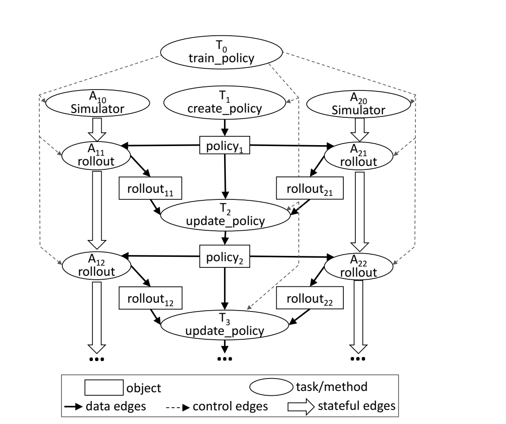
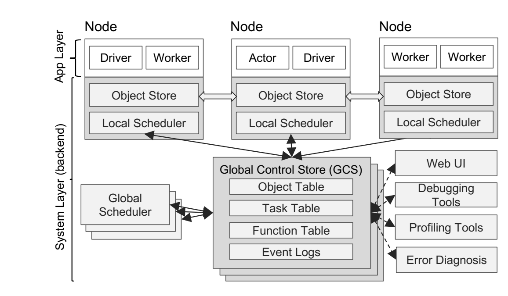
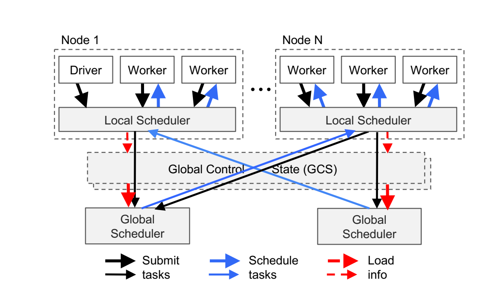
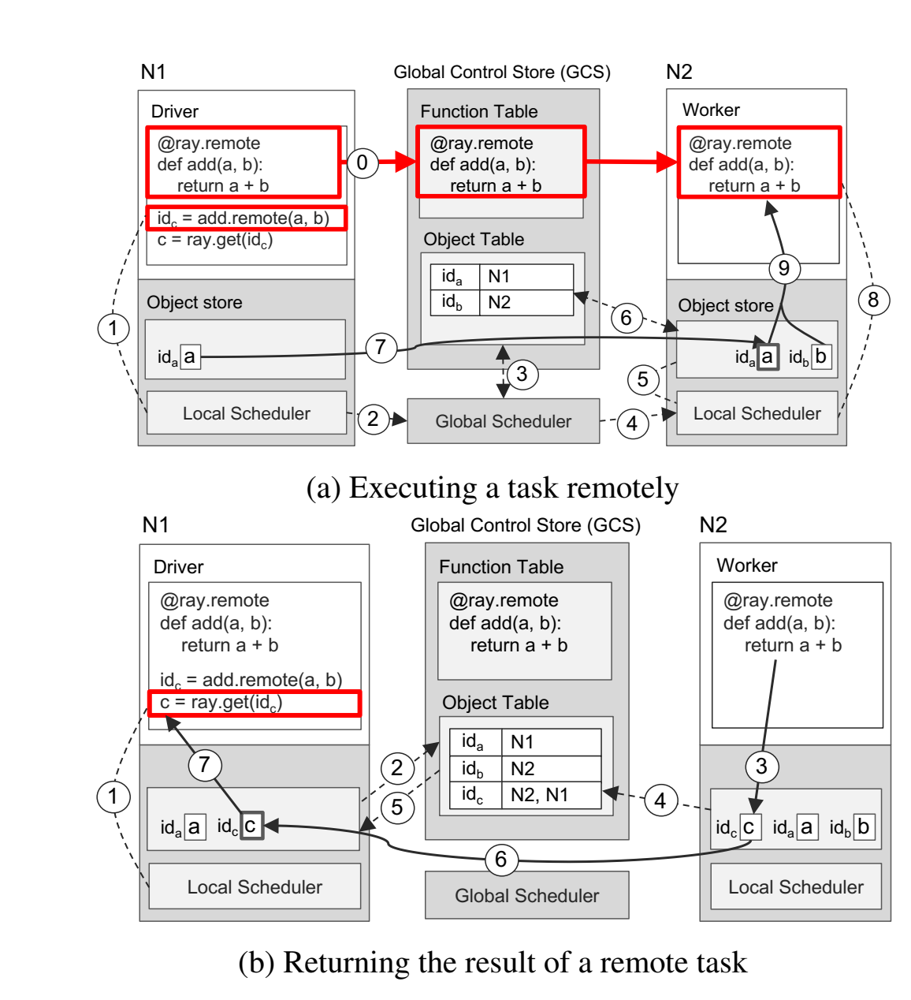
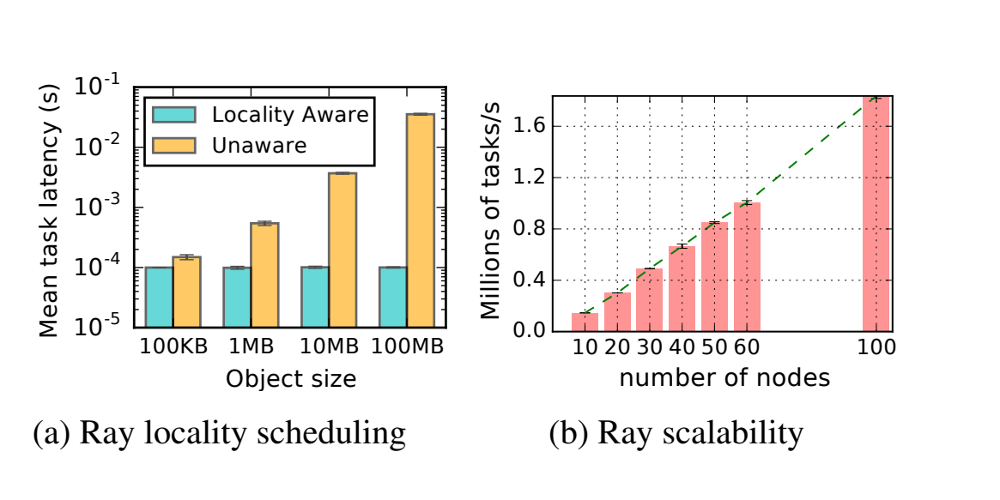
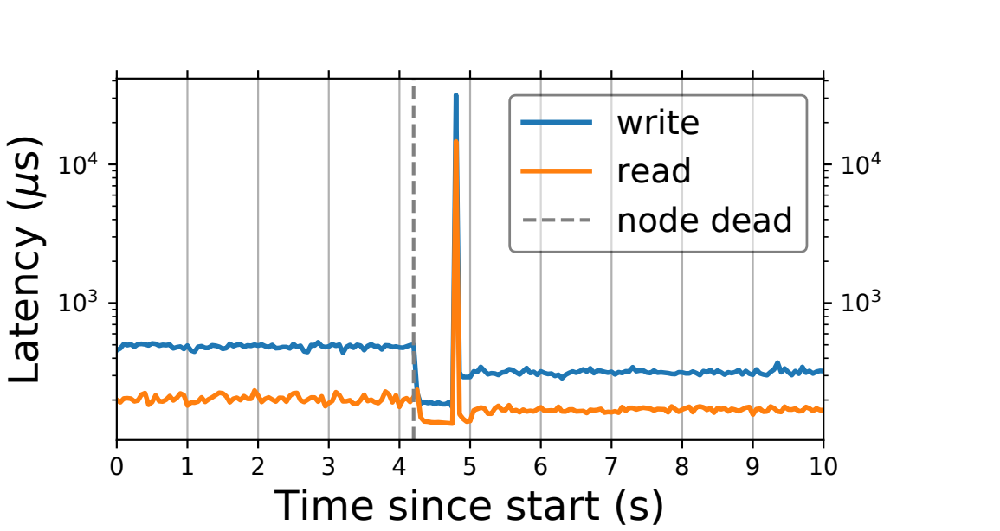
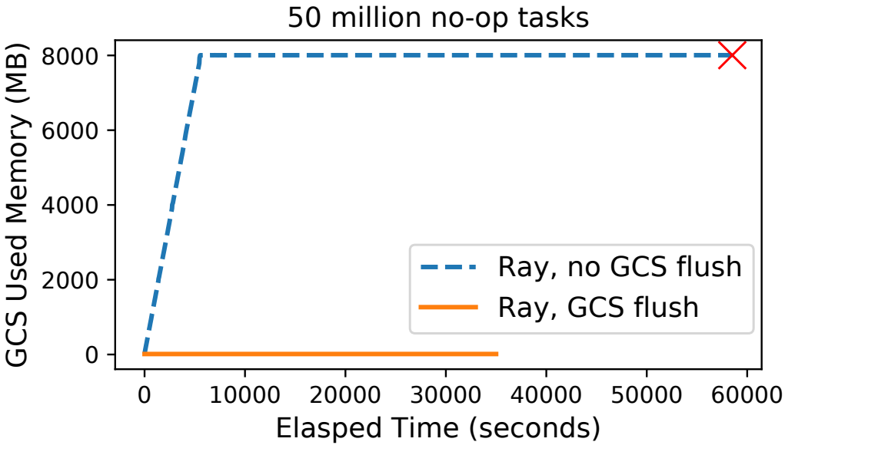
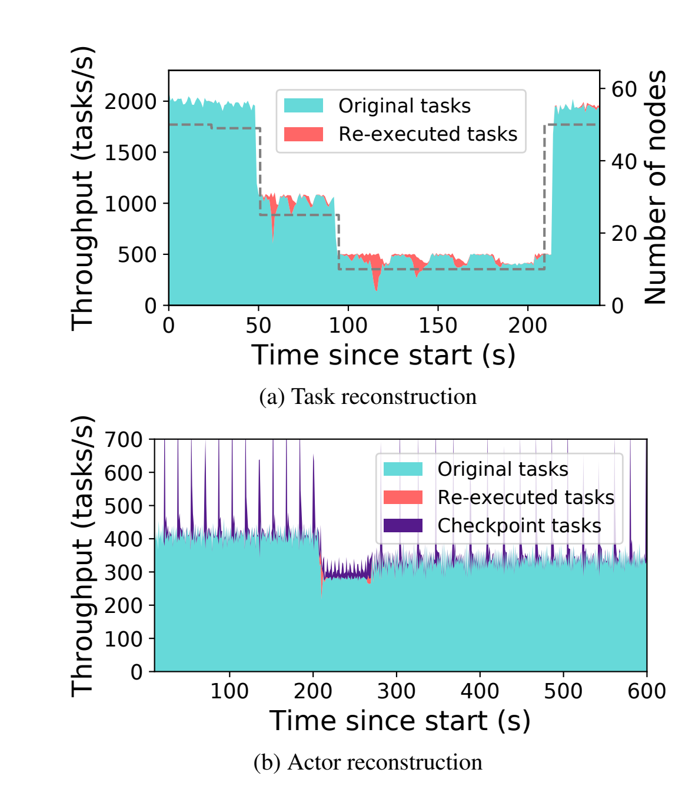
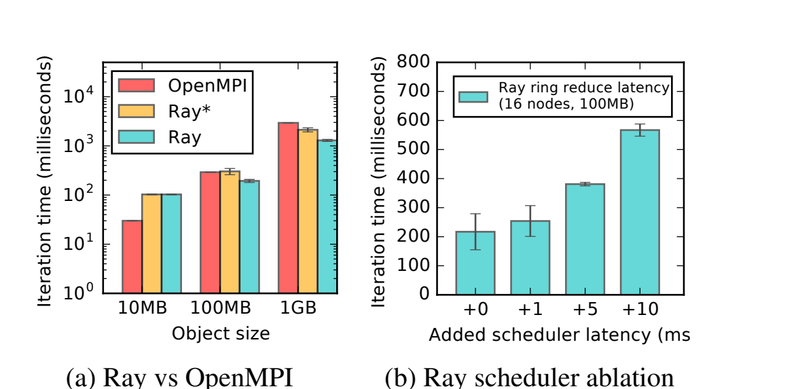
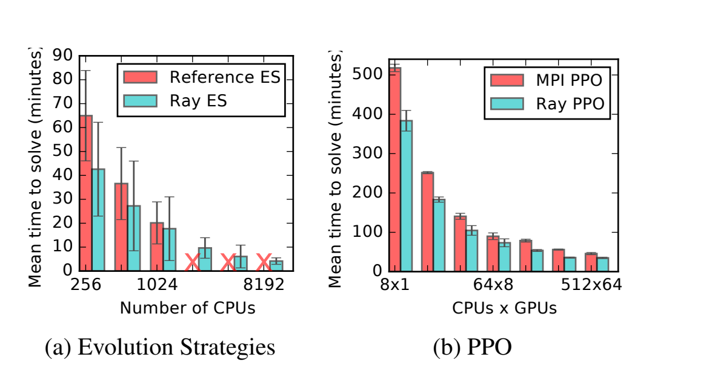

# Ray: A Distributed Framework for Emerging AI Applications  
## 论文精读笔记

> **阅读版本**：OSDI ’18 正式版  
> **阅读原则**：正文仅整理论文明确提出、实现或实验支持的内容；不使用今天 Ray 的架构反推 2018 年论文。  
> **特别说明**：本文 Evaluation 只有 **Section 5.1–5.3**，不存在 Section 5.4/5.5；本文也没有正式编号的 Algorithm，Figure 2 是 RL pseudocode，Figure 3 是 Ray Python example。

---

# 1. 论文基本信息

**题目**

Ray: A Distributed Framework for Emerging AI Applications

**作者**

Philipp Moritz\*, Robert Nishihara\*, Stephanie Wang, Alexey Tumanov, Richard Liaw, Eric Liang, Melih Elibol, Zongheng Yang, William Paul, Michael I. Jordan, Ion Stoica

其中 Philipp Moritz 与 Robert Nishihara 为 equal contribution。

**单位**

University of California, Berkeley

**会议**

13th USENIX Symposium on Operating Systems Design and Implementation (**OSDI ’18**)

**年份**

2018

**论文定位**

Ray 的目标不是单独优化某一种机器学习算子，而是提供一个能够同时支持：

- simulation
- distributed training
- serving

的通用分布式执行框架，尤其针对论文所称的 **emerging AI applications**，其中最主要的代表是 reinforcement learning（RL）。

论文的系统核心可以概括为：

> **Task + Actor programming model  
> + Dynamic Task Graph  
> + Global Control Store (GCS)  
> + Bottom-Up Distributed Scheduler  
> + In-Memory Distributed Object Store**

---

# 2. 研究背景与问题

## 2.1 从 Big Data / Supervised Learning 到 Reinforcement Learning

论文首先区分了三代典型计算需求。

早期 Big Data 系统主要针对：

- batch processing：MapReduce、Spark、Dryad；
- streaming：Storm、Naiad；
- graph processing 等。

之后 TensorFlow、MXNet、PyTorch 等系统主要解决 supervised learning 中的深度神经网络训练问题，重点是利用 GPU/TPU 缩短 batch training 时间。

但论文认为，下一代 AI application 不只是：

> 输入数据 → 训练模型 → 离线预测

而是需要持续与环境交互，根据环境变化动态产生新的计算。

这类问题最自然地体现为 reinforcement learning。

---

## 2.2 Figure 1：RL application 为什么对系统提出不同要求

**Figure 1（PDF p.3）** 给出了论文理解 RL workload 的核心框架：

```text
                  trajectory
        ┌─────────────────────────┐
        │                         ▼
   ┌──────────┐             ┌───────────┐
   │ Training │             │   Agent   │
   │ policy   │────────────▶│  Policy   │
   │ update   │             │ Serving   │
   └──────────┘             └─────┬─────┘
                                  │ action
                                  ▼
                             ┌───────────┐
                             │Environment│
                             │Simulation │
                             └─────┬─────┘
                                  │ state/reward
                                  └──────────▶ Agent
```

一个 RL application 包含三个紧密耦合的 workload：

### 1. Simulation

使用 simulator 与 policy 交互，产生 trajectories。

simulation 的执行时间可能极不规则：

- 几毫秒；
- 几秒；
- 甚至几分钟或几小时。

### 2. Training

利用 trajectories 更新 policy。

典型方式包括：

- SGD；
- distributed SGD；
- allreduce；
- parameter server。

### 3. Serving

根据当前 environment state 快速执行 policy：

```text
state → policy → action
```

这里通常要求低 latency。

---

## 2.3 Figure 2：为什么三种 workload 无法简单分开

**Figure 2（PDF p.4）** 用 pseudocode 表达了典型 RL learning loop。

核心逻辑是：

```text
rollout(policy, environment):
    不断：
        policy.compute(state)     ← Serving
        environment.step(action)  ← Simulation
    返回 trajectory

train_policy(environment):
    不断：
        并行产生多个 rollout
        policy.update(trajectories) ← Training
```

因此其结构本质上是：

```text
Simulation
     ↓
trajectory
     ↓
Training
     ↓
new policy
     ↓
Simulation
     ↓
...
```

这与 supervised learning 中可以相对独立部署的 training 和 serving 不同。

论文强调：

> RL 中 training、simulation 和 serving 位于同一个紧密耦合的 application loop 中。

如果把这三部分分别放到独立系统中，例如：

- Horovod → training
- Clipper → serving
- CIEL → simulation

就需要跨系统传输数据和协调执行。

作者认为这种方式在 RL 的 latency 要求下并不可行，并且会迫使 application developer 自己解决：

- scheduling；
- fault tolerance；
- data movement；
- coordination。

因此当时许多 RL 系统实际上是 one-off custom system。

---

## 2.4 Section 2 给出的三个核心系统需求

### Requirement 1：Fine-grained, heterogeneous computations

任务执行时间高度异构：

```text
milliseconds ────────────────────── hours
serving / small simulation          training
```

资源也异构：

- CPU；
- GPU；
- TPU。

因此系统不能假设：

> 每个 worker 执行相同 workload。

论文进一步指出，如果：

- 一个 task 使用 1 CPU core；
- 平均持续 5 ms；
- 集群有 200 个节点；
- 每节点 32 cores；

理论 task generation / execution demand 可以达到：

\[
(1s/5ms)\times32\times200
=1.28M\ tasks/s
\]

因此 scheduler 必须具备 million-task/s 级能力。

---

### Requirement 2：Flexible computation model

RL 同时存在两类计算。

#### Stateless computation

适合：

- simulation；
- image/video processing；
- feature processing。

优点是：

- 可以在任意节点执行；
- 容易 load balancing；
- 容易移动 computation 到 data。

#### Stateful computation

适合：

- parameter server；
- GPU-backed iterative computation；
- model training；
- 第三方 simulator。

这些 workload 需要：

> 多次调用持续访问同一份内部 mutable state。

因此只支持 stateless task 不够，只支持 actor 也不够。

---

### Requirement 3：Dynamic execution

RL application 的 computation graph 往往无法提前完整确定。

两个原因：

#### completion order 不确定

例如：

```text
simulation A ── 20ms
simulation B ───────────── 200ms
simulation C ─────── 80ms
```

系统应该先使用已经完成的结果，而不是等待 BSP barrier。

#### computation result 会决定后续 computation

例如：

```text
simulation result
       ↓
是否需要继续 simulation？
       ↓
动态产生新的 task
```

因此 Ray 的目标不是 static DAG executor，而是支持：

> **Dynamic Task Graph**

---

## 2.5 现有系统为什么不能直接解决

论文分别讨论：

### MapReduce / Spark / Dryad

主要针对 coarse-grained data-parallel processing。

问题：

- per-task overhead 较高；
- 不适合毫秒级 simulation；
- Spark / MapReduce 采用 BSP 风格；
- 不适合动态细粒度 workload。

### CIEL / Dask

已经支持 dynamic task graph。

但主要是 task-parallel model，对：

- stateful computation；
- distributed training；
- serving

支持不足。

### TensorFlow / MXNet

非常适合：

- DNN training；
- CPU/GPU computation。

但不自然适合：

- simulation；
- embedded serving；
- 动态生成大量 task。

### TensorFlow Serving / Clipper

解决的是 model serving。

不能同时提供：

- simulation；
- training。

### Orleans / Akka

主要提供 actor abstraction。

但缺少 Ray 所需要的 task abstraction 和 lineage-based recovery。

---

# 3. 核心思想与贡献

论文列出了四项贡献。

## 3.1 统一 training、simulation 与 serving

Ray 被设计为一个通用 cluster-computing framework，使三种 workload 可以存在于同一个 application 和 execution environment 中：

```text
Simulation ─┐
            │
Training ───┼── Ray
            │
Serving ────┘
```

作者把这一点作为 Ray 与 specialized system 的核心区别。

---

## 3.2 统一 Task 与 Actor

Ray 同时提供：

```text
Task
    stateless computation

Actor
    stateful computation
```

但二者不是两个完全独立的 runtime。

Ray 将两种 abstraction 都映射到：

> **single dynamic task execution engine**

---

## 3.3 将 control state 与 system components 解耦

作者提出：

> 将整个系统的 control state 存储在 distributed、sharded、fault-tolerant metadata store 中。

这个组件就是：

> **Global Control Store (GCS)**

由此 scheduler 等 system component 不需要自己永久保存系统状态。

论文的设计思想是：

```text
Control State
      ↓
     GCS

Scheduler / other system components
      ↓
can be stateless
```

注意这里的“stateless”指的是系统控制组件的设计，不意味着 Ray 的 Actor abstraction 没有状态。

---

## 3.4 Bottom-Up Distributed Scheduling

Ray 不让所有 task 都先进入一个 global scheduler。

而是：

```text
task
 ↓
Local Scheduler
 ↓
优先尝试 local execution
 ↓ only when needed
Global Scheduler
```

从 scheduling hierarchy 的叶节点向上提交，因此称：

> **bottom-up distributed scheduler**

目标是减少 global scheduling path 上的请求数量，使 scheduler 能扩展到 million-task/s。

---

# 4. 系统 / 方法设计

# 4.1 Section 2：从 workload 推导 execution model

Section 2 的关键逻辑不是具体算法，而是在建立设计约束：

```text
RL workload
   ↓
fine-grained + heterogeneous
   ↓
Task

stateful computation
   ↓
Actor

runtime-dependent execution
   ↓
Dynamic Task Graph

millions tasks/s
   ↓
Distributed Scheduler

fault tolerance + dynamic lineage
   ↓
GCS
```

因此后面的 Task、Actor、GCS、scheduler 并不是彼此独立的机制，而是在解决 Section 2 的不同 requirement。

---

# 4.2 Section 3：Programming and Computation Model

## 4.2.1 Section 3.1：Tasks

Task 表示：

> 在 stateless worker 上执行一个 remote function。

例如：

```python
@ray.remote
def f(x):
    ...
```

调用：

```python
future = f.remote(x)
```

不会等待 f 执行完成，而是立即返回一个：

> **future**

之后：

```python
ray.get(future)
```

才阻塞等待结果。

更重要的是，future 可以直接作为另一个 remote function 的输入：

```text
T1 → future → T2
```

调用 T2 时不必首先在 driver 中 `get()` T1。

这样 task dependency 可以直接表达给 runtime。

---

## 4.2.2 Table 1：Ray API

**Table 1（PDF p.5）**

| API | 论文中的语义 |
|---|---|
| `f.remote(args)` | 远程执行函数 f，立即返回 future，non-blocking |
| `ray.get(futures)` | 获取 future 对应对象，blocking |
| `ray.wait(futures, k, timeout)` | 等到 k 个结果完成或 timeout |
| `Class.remote(args)` | 创建 remote actor |
| `actor.method.remote(args)` | 异步调用 actor method，返回 future |

其中 `ray.wait()` 对 RL 特别重要。

原因是不同 simulation 的执行时间不同。

假设：

```text
simulation 1 = 20 ms
simulation 2 = 500 ms
simulation 3 = 50 ms
```

如果使用：

```text
ray.get(all)
```

可能被最慢 simulation 阻塞。

而：

```text
ray.wait(...)
```

允许 application 先消费已经完成的结果。

---

## 4.2.3 Task 的语义要求

Remote function：

- operate on immutable objects；
- expected to be stateless；
- expected to be side-effect free。

因此：

> output 只由 input 决定。

这意味着 task 具有 idempotence，failure 后可以通过重新执行 function 恢复结果。

这为后面的 lineage-based fault tolerance 提供基础。

---

# 4.3 Actors

Actor 表示：

> **stateful computation**

Actor 本质上是一个 stateful process。

例如：

```python
@ray.remote
class Simulator:
    def __init__(self):
        self.env = Environment()

    def rollout(...):
        ...
```

区别在于：

```text
Task
T1 → worker
T2 → 可能另一 worker
没有跨 task local mutable state
```

而 Actor：

```text
Actor
 ├─ method 1
 ├─ method 2
 ├─ method 3
 └─ internal mutable state persists
```

同一个 actor 的 method：

> serially executed。

因此 method 2 可以看到 method 1 修改后的 actor state。

---

## 4.3.1 Table 2：Tasks 与 Actors 的 trade-off

**Table 2（PDF p.5）**

| Tasks | Actors |
|---|---|
| Fine-grained load balancing | Coarse-grained load balancing |
| Support for object locality | Poor locality support |
| High overhead for small updates | Low overhead for small updates |
| Efficient failure handling | Overhead from checkpointing |

这张表非常重要。

论文不是说 Actor 比 Task 高级，而是在强调：

> 两种 abstraction 解决不同的问题。

### Task 更适合

- 大规模 independent simulation；
- data processing；
- 需要 data locality 的计算；
- failure 后方便 re-execution 的计算。

### Actor 更适合

- parameter server；
- training；
- GPU resident state；
- third-party simulator；
- 很难序列化的 state。

因此：

> **Task + Actor 的组合本身就是 Ray programming model 的核心。**

---

# 4.4 为 heterogeneity 增加的三个机制

Section 3.1 还特别指出三项扩展。

## 1. `ray.wait()`

处理：

> heterogeneous task durations。

## 2. Resource requirements

开发者可以给 task / actor 声明资源需求，例如：

```python
@ray.remote(num_gpus=2)
```

scheduler 根据 resource requirement 做 placement。

## 3. Nested remote functions

remote function 自己可以继续产生：

```text
remote task
   ↓
new remote tasks
```

这不仅支持 dynamic execution，也允许多个 worker 并行生成 task。

作者特别指出：

> nested remote functions 对 Ray 的 scalability 也很重要，因为 task creation 不需要全部集中在一个 driver。

---

# 4.5 Section 3.2：Dynamic Task Graph

Ray 把 application 表示成：

> **执行过程中不断变化的 dependency graph**

也就是 dynamic task graph。

---

## 4.5.1 Graph 中有哪些 node

首先忽略 Actor。

存在两种 node：

### Data Object

例如：

```text
policy
trajectory
```

### Task

即 remote function invocation。

---

## 4.5.2 Data Edge

如果：

```text
Task T → produces → Object D
```

则：

```text
T ──data edge──▶ D
```

如果 D 是某个 task 的输入：

```text
D ──data edge──▶ T
```

因此：

```text
T1 → D → T2
```

显式表达 data dependency。

---

## 4.5.3 Control Edge

如果：

```text
Task T1
   ↓ invokes
Task T2
```

那么：

```text
T1 ──control edge──▶ T2
```

这用来表示 nested remote function 带来的 execution dependency。

---

## 4.5.4 Stateful Edge

这是 Actor 被整合到 task graph 的关键。

假设同一个 actor 上：

```text
method M1
method M2
```

并且 M2 在 M1 后被调用。

Ray 加入：

```text
M1 ──stateful edge──▶ M2
```

因为 M2 的结果实际上依赖：

> M1 执行结束后的 actor state。

---

# 4.6 Figure 3 + Figure 4：Task 和 Actor 如何真正统一

**Figure 3（PDF p.6）** 给出了 Ray code：

```text
create_policy()
      ↓
Simulator actors × 10
      ↓
rollout()
      ↓
update_policy()
      ↓
new policy
      ↓
下一轮 rollout
```

**Figure 4（PDF p.6）** 把同一程序展开为 dynamic task graph。

图中：

- rectangle：object；
- ellipse：task / actor method；
- data edge：数据依赖；
- control edge：nested invocation；
- stateful edge：actor successive methods。

最重要的是两个 simulator actor：

```text
Actor 1:
A11 rollout
   │ stateful edge
A12 rollout
   │
...

Actor 2:
A21 rollout
   │ stateful edge
A22 rollout
   │
...
```

同时 rollout 的输出又通过 data edge 进入：

```text
update_policy
```

所以 actor 没有脱离 dataflow system。

论文通过 **stateful edge** 把它嵌入了同一个 task graph。

这也是后续 fault tolerance 能统一处理 task 与 actor lineage 的基础。



*来源：论文 Figure 4，PDF 第 6 页；原图裁剪。Figure 3 的 Python 示例已由本节代码流程完整转写，未重复截图。*

---

# 4.7 Section 4：Architecture

## 4.7.1 Figure 5：整体架构

**Figure 5（PDF p.7）** 是全文最重要的系统架构图。

可以简化为：

```text
──────────────── Application Layer ────────────────

 Node 1                  Node 2                 Node N
┌───────────┐          ┌───────────┐          ┌───────────┐
│ Driver    │          │ Actor     │          │ Worker    │
│ Workers   │          │ Driver    │          │ Workers   │
└─────┬─────┘          └─────┬─────┘          └─────┬─────┘
      │                      │                      │

───────────────── System Layer ────────────────────

┌─────▼─────┐          ┌─────▼─────┐          ┌─────▼─────┐
│ObjectStore│          │ObjectStore│          │ObjectStore│
├───────────┤          ├───────────┤          ├───────────┤
│LocalSched │          │LocalSched │          │LocalSched │
└─────┬─────┘          └─────┬─────┘          └─────┬─────┘
      └──────────────────────┼──────────────────────┘
                             │
                     ┌───────▼────────┐
                     │      GCS       │
                     │ Object Table   │
                     │ Task Table     │
                     │ Function Table │
                     │ Event Logs     │
                     └───────┬────────┘
                             │
                ┌────────────┴───────────┐
                ▼                        ▼
        Global Scheduler          Global Scheduler
```

另外 GCS 还为：

- Web UI；
- Debugging Tools；
- Profiling Tools；
- Error Diagnosis

提供统一系统状态。

整个架构可以分成：

### Application Layer

- Driver
- Worker
- Actor

### System Layer

- Global Control Store
- Distributed Scheduler
- Distributed Object Store



*来源：论文 Figure 5，PDF 第 7 页；原图裁剪。*

---

# 4.8 Section 4.1：Application Layer

## Driver

执行 user program 的 process。

---

## Worker

Worker：

- stateless；
- 执行 remote function；
- 由 system 自动启动；
- system layer 给 worker 分配 task；
- 单个 worker serially executes tasks；
- task 之间不维护 local state。

Remote function 定义后会自动发布到 workers。

---

## Actor

Actor：

- stateful process；
- 只执行该 actor 暴露的方法；
- 由 driver 或 worker 显式创建；
- methods serially execute；
- 每次 method execution 可以依赖上一次 method 产生的 state。

---

# 4.9 Section 4.2.1：Global Control Store（GCS）

这是 Ray 架构中最核心的系统设计之一。

## 4.9.1 GCS 存什么

GCS 保存：

> entire control state of the system。

Figure 5 中包括：

- Object Table；
- Task Table；
- Function Table；
- Event Logs。

GCS 本质上是：

> key-value store + pub-sub functionality。

---

## 4.9.2 GCS 如何扩展

论文采用：

### Sharding

把 control state 分片。

### Per-shard chain replication

每个 shard 采用 chain replication 提供 fault tolerance。

因此：

```text
GCS
├── shard 1 → replicated chain
├── shard 2 → replicated chain
├── shard 3 → replicated chain
└── ...
```

---

# 4.10 为什么必须设计 GCS

作者主要给出两个原因。

## 原因 1：Lineage 不能集中存在一个 master

Spark 等系统处理较 coarse-grained task，可以让：

```text
Master / Driver
```

保存 lineage。

但 Ray 面对：

> millions of dynamically generated fine-grained tasks。

如果所有 lineage 都经过一个 central master：

> central master 会成为 scalability bottleneck。

因此 Ray：

```text
Lineage
   ↓
distributed GCS
```

并让 scheduler、object store 等组件独立扩展。

---

## 原因 2：Task scheduling 与 task dispatch 必须解耦

作者区分：

### Scheduling

决定：

> task 在哪里执行。

### Dispatch

实际：

> 把 task input 移到目标节点并执行。

很多传统 dataflow system 让 centralized scheduler 同时保存：

- object location；
- object size。

这样 object transfer 也会依赖 scheduler。

Ray 认为对于：

> allreduce 等 communication-intensive、latency-sensitive primitive

这是不可接受的。

因此：

```text
Object metadata
       ↓
      GCS

Scheduler ← query GCS
Object Store ← query GCS
```

scheduler 不需要位于每一次 object transfer 的 critical path。

---

# 4.11 GCS 最重要的设计原则

论文总结这一机制时提出：

> 将 control state 放入 GCS，可以让 system components 本身保持 stateless。

于是 component failure 后可以：

```text
restart component
      ↓
read state / lineage from GCS
      ↓
continue
```

同时：

- scheduler；
- object store；
- debugging tools

都通过 GCS 获取统一状态。

---

# 4.12 Section 4.2.2：Bottom-Up Distributed Scheduler

**Figure 6（PDF p.8）** 是论文 scheduling 设计的核心。

传统 centralized scheduling：

```text
所有 tasks
    ↓
Central Scheduler
    ↓
nodes
```

Ray：

```text
Driver / Worker
       ↓
Local Scheduler
       │
       ├── local resources sufficient → execute locally
       │
       └── overloaded / resource unavailable
                    ↓
             Global Scheduler
                    ↓
             target node
                    ↓
             Local Scheduler
                    ↓
                 Worker
```

因此叫：

> **Bottom-Up Distributed Scheduler**

因为任务从 scheduling hierarchy 的 bottom 开始。

---

# 4.13 Local Scheduler 什么时候不上交 task

Local scheduler 优先在本节点 scheduling。

只有以下情况才提交给 global scheduler：

### 1. 本节点 overloaded

论文具体定义为：

> local task queue 超过 predefined threshold。

### 2. 无法满足 resource requirement

例如：

```text
task requires GPU
当前 node 没有 GPU
```

此时 task 才被 forward 到 global scheduler。

---

# 4.14 Global Scheduler 如何选择节点

global scheduler 首先筛选：

> 拥有足够所需 resource 的 node。

然后在这些 node 中选择：

> estimated waiting time 最小的 node。

论文的估计可以整理为：

\[
EstimatedTime(node)
=
QueueTime(node)
+
TransferTime(node)
\]

其中：

\[
QueueTime
\approx
queue\ size \times average\ task\ execution\ time
\]

而：

\[
TransferTime
\approx
\frac{total\ size\ of\ remote\ inputs}
{average\ bandwidth}
\]

所以 scheduler 同时考虑：

- load；
- resource constraints；
- data locality。

---

## scheduler 获取信息的位置

### heartbeat

提供：

- queue size；
- resource availability。

### GCS

提供：

- input object location；
- object size。

### exponential averaging

估计：

- average task execution time；
- average transfer bandwidth。

如果 global scheduler 本身成为瓶颈：

> 可以增加 global scheduler replicas。

这些 scheduler 通过 GCS 共享状态。

---

# 4.15 Figure 6 真正想说明什么

Figure 6 中箭头粗细代表 request rate。

最粗的 scheduling request 路径集中在：

```text
Workers / Driver
      ↓
Local Scheduler
```

只有一部分 request：

```text
Local Scheduler
      ↓
Global Scheduler
```

这正是 bottom-up architecture 的核心：

> **不要让 global scheduling 成为每个 task 都必须经过的路径。**



*来源：论文 Figure 6，PDF 第 8 页；原图裁剪。箭头粗细表示请求速率。*

---

# 4.16 Section 4.2.3：In-Memory Distributed Object Store

Ray 为每个 node 提供：

> in-memory object store。

它保存 task 的：

- inputs；
- outputs。

---

## 4.16.1 Same-node：shared memory + zero-copy

同一个 node 上：

```text
Worker A
    │
    ▼
Shared-memory Object Store
    ▲
    │
Worker B
```

worker 之间不通过重新序列化/复制数据交换。

Ray 使用：

> Apache Arrow

作为数据格式。

论文称这支持：

> zero-copy data sharing。

---

## 4.16.2 Remote input

如果 task 的 input 不在 local object store：

```text
remote object store
        ↓ replicate
local object store
        ↓
execute task
```

即：

> input 必须在 task 执行前复制到本节点。

task output 同样先写入 local object store。

---

## 4.16.3 为什么要 replication

作者认为 replication 有两个作用：

### 避免 hot object bottleneck

多个 task 如果都访问同一个 remote object，可以复制 object。

### task execution 只访问 local memory

从而降低 task execution latency。

---

## 4.16.4 Immutable objects

object store 中的 object 是：

> immutable。

这避免了 distributed mutable object 所需要的复杂 consistency protocol。

failure 后可以通过：

> lineage re-execution

重新生成 object。

---

## 4.16.5 Memory 不够怎么办

论文采用：

> LRU policy

把 object evict 到 disk。

---

## 4.16.6 一个明确限制

论文明确指出：

> object store 不支持单个 distributed object。

即：

> 一个 object 必须能够放入单个 node。

大 matrix / tree 可以在 application level：

```text
future 1
future 2
future 3
...
```

表示为多个 object 的 collection。

---

# 4.17 Section 4.2.4：Implementation

论文中的 Ray 实现约：

> **40K LoC**

其中：

- 72% C++：system layer；
- 28% Python：application layer。

GCS：

- 每 shard 一个 Redis；
- GCS table 按 object/task ID sharding；
- 每 shard chain-replicated；
- operation 为 single-key operation。

scheduler：

- local/global scheduler 都是 event-driven；
- single-threaded processes。

Local scheduler 会缓存：

- local object metadata；
- waiting-for-input tasks；
- ready-for-dispatch tasks。

large object 跨 node 传输时：

> stripe object across multiple TCP connections。

---

# 4.18 Section 4.3 + Figure 7：一个 task 到底怎么执行

**Figure 7（PDF p.9）** 是理解 Ray runtime 最值得仔细看的图。

例子：

```python
c = add.remote(a, b)
c = ray.get(c)
```

其中：

```text
a 在 Node N1
b 在 Node N2
```

---

## Figure 7a：Executing a task remotely

### Step 0

`add()` remote function 注册到 GCS，并发布给 workers。

### Step 1

N1 Driver：

```text
add(a,b)
   ↓
N1 Local Scheduler
```

### Step 2

例子中 N1 没有直接 local schedule，于是：

```text
N1 Local Scheduler
      ↓
Global Scheduler
```

论文特别注明：

> N1 也可能选择 local execution；Figure 7 只是一个示例。

### Step 3

Global Scheduler 查询 GCS：

```text
a location = N1
b location = N2
```

### Step 4

Scheduler 决定：

```text
schedule add(a,b) on N2
```

### Step 5

N2 Local Scheduler 检查 local object store。

发现：

```text
b ✓
a ✗
```

### Step 6

N2 查询 GCS 得到：

```text
a → N1
```

### Step 7

N2 Object Store：

```text
N1:a
  ↓ replicate
N2:a
```

### Step 8

所有 input local 后：

```text
N2 Local Scheduler
       ↓
N2 Worker
```

执行 `add()`。

### Step 9

Worker 通过 shared memory 访问：

```text
a + b
```

---

# 4.19 Figure 7b：ray.get() 如何拿回结果

Driver 执行：

```python
ray.get(idc)
```

### Step 1

N1 查 local object store：

```text
c 不存在
```

### Step 2

N1 查询 GCS。

此时 c 尚未生成，因此 Object Table 还没有 c。

于是：

> N1 object store 向 Object Table 注册 callback。

### Step 3

与此同时 N2 完成：

```text
c = a + b
```

将 c 写入 N2 object store。

### Step 4

N2 将：

```text
c → N2
```

写入 GCS Object Table。

### Step 5

GCS 根据之前注册的 callback 通知 N1。

### Step 6

N1：

```text
N2:c
  ↓ replicate
N1:c
```

### Step 7

local object store 把 c 返回给：

```text
ray.get()
```

至此完成。

---

## Figure 7 的核心意义

这个图明确表现出 Ray 把：

### Control plane

- scheduling；
- object metadata；
- callbacks；
- GCS。

与：

### Data plane

- actual object transfer

分开。

论文 caption 中：

- solid lines = data plane operations；
- dotted lines = control plane operations。

这正对应前面 GCS 的核心设计：

> scheduler 不需要位于实际 data movement 的关键路径。



*来源：论文 Figure 7，PDF 第 9 页；原图裁剪。*

---

# 5. 实验分析

# 5.0 Evaluation 的问题与整体环境

Section 5 明确提出四个 evaluation question：

1. Ray 是否满足 Section 2 中的 latency、scalability、fault tolerance requirements？
2. 使用 Ray API 实现 allreduce 等 distributed primitive 的 overhead 多大？
3. Ray 在 training、serving、simulation 上相比 specialized systems 如何？
4. Ray 对完整 RL application 相比 custom system 有什么优势？

**实验平台**

所有实验运行在 AWS。

除特殊说明外：

- CPU instance：`m4.16xlarge`
- GPU instance：`p3.16xlarge`

---

# 5.1 Section 5.1：Microbenchmarks

## 5.1.1 Figure 8a：Locality-aware task placement

**目的**

验证 Task abstraction 可以利用 data locality。

**设置**

- 1000 tasks；
- 每个 task 随机依赖一个 object；
- 两个 node；
- 比较 locality-aware 与 locality-unaware placement；
- object size 从 100KB 增大到 100MB。

**结果**

论文指出，在 10–100MB input 下：

> 不考虑 locality 的 task latency 增加 **1–2 orders of magnitude**。

而 locality-aware placement 的 latency 基本不随 input object size 增长。

**论文说明了什么**

Task 的 movable computation 可以：

> 把 computation 调度到 data 所在位置。

这也是 Table 2 中：

> Task 支持 object locality，而 Actor locality support 较差

的实验依据。

**论文没有证明**

这个实验只有两个 node 和简单随机依赖，不能据此推导任意复杂 DAG 上 locality scheduler 的效果。

---

# 5.1.2 Figure 8b：End-to-end scalability

**Workload**

> embarrassingly parallel empty tasks。

**变量**

逐渐增加 cluster node 数。

**结果**

- 60 nodes：**超过 1 million tasks/s**
- 100 nodes：**超过 1.8 million tasks/s**
- 100 million tasks：**54 s** 完成
- throughput 随 node 数接近线性增长。

作者还指出：

> task duration 增大时 throughput 会按平均 task duration 相应下降，但整体 scaling trend 仍保持线性。

**作者声称证明**

GCS + bottom-up distributed scheduler 的整体 architecture 可以承受非常高的 fine-grained task throughput。

**重要边界**

作者明确承认：

> 真实 workload 可能因为 object dependency 和 application parallelism 限制而具有明显更低的 scalability。

因此：

> **1.8M tasks/s 是高并行 empty-task microbenchmark，不是所有 Ray workload 的普遍吞吐量。**



*来源：论文 Figure 8，PDF 第 9 页；原图裁剪。左图为 locality，右图为空 task 扩展性。*

---

# 5.1.3 Figure 9：Object Store Performance

**环境**

`m4.4xlarge`，16 cores。

**指标**

- small objects → IOPS；
- large objects → write throughput。

**结果**

单 client：

- large objects：**>15 GB/s**
- small objects：**18K IOPS**

实现细节：

- object > 0.5MB：8 threads copy；
- small objects：1 thread；
- 图中 throughput 分别测试 1/2/4/8/16 threads；
- 结果 averaged over 5 runs。

**作者分析**

Large object：

> `memcpy` 成为主要 object creation cost。

Small object：

主要 overhead 来自：

- serialization；
- IPC between client and object store。

---

# 5.1.4 Figure 10a：GCS Fault Tolerance

**目的**

测试 chain replication failure / reconfiguration 对 latency 的影响。

**设置**

- key：25 bytes；
- value：512 bytes；
- client 最多一个 in-flight request；
- initial chain：2 replicas；
- `t≈4.2s` kill 一个 chain member；
- 新 member 随后加入并 state transfer；
- 恢复 2-way replication。

**结果**

整个 reconfiguration 过程中：

> maximum client-observed latency **<30 ms**

该数值同时包括：

- failure detection；
- recovery delay。

**证明**

GCS chain reconfiguration 可以在保持 fault tolerance 的同时限制 client-visible disruption。



*来源：论文 Figure 10a，PDF 第 10 页；原图裁剪。纵轴为对数刻度。*

---

# 5.1.5 Figure 10b：GCS Flushing

**Workload**

连续提交：

> **50 million no-op tasks**

并观察 GCS memory。

### 不 flush

memory 随 tracked task 数线性增长。

最终达到 memory capacity，系统 stalled，workload 未能在预设时间内完成。

### flush

periodically flush GCS contents to disk。

结果：

- memory footprint 可限制在 configurable level；
- lineage 可以 snapshot 到 disk。

**作者声称**

flushing 同时解决：

1. long-running application 中 GCS memory bound；
2. lineage persistence。



*来源：论文 Figure 10b，PDF 第 10 页；原图裁剪。红色叉号表示未 flush 路径未在预设时间内完成。*

---

# 5.1.6 Figure 11a：Task Failure Recovery

**Workload**

- `m4.xlarge`
- linear chains of tasks；
- 每 task = **100 ms**
- 每 task 依赖前一个 task 生成的 object。

**Failure**

node 分别在：

- 25 s；
- 50 s；
- 100 s

被移除。

**机制**

local scheduler 根据 GCS lineage：

> reconstruct previous results。

**结果**

随着 node 被删除：

- total throughput 随资源减少；
- re-executed tasks 出现；
- **per-node throughput 保持稳定**。

node 加回来后恢复原有 throughput。

---

# 5.1.7 Figure 11b：Actor Failure Recovery

**设置**

- 10 nodes；
- 2000 actors；
- `t=200s` kill 2 nodes；
- 因而 **400 actors** 需要在剩余节点恢复；
- recovery 大致发生在 `t=200–270s`。

Actor 利用：

> user-defined checkpoint functions

限制 replay 长度。

**结果**

使用 checkpoint：

> 只需要 re-execute **500 methods**

而没有 checkpoint：

> 需要约 **10K method re-executions**

**论文明确的局限**

Actor recovery 仍依赖 checkpoint。

作者表示未来希望通过例如标记：

> 不修改 state 的 method

进一步减少 reconstruction。



*来源：论文 Figure 11，PDF 第 11 页；原图裁剪。上图为 task reconstruction，下图为 actor reconstruction。*

---

# 5.1.8 Figure 12a：Allreduce

**目标**

测试 Ray 的低层 scheduling / object movement overhead 是否低到可以实现 ML communication primitive。

**设置**

- ring allreduce；
- 16 × `m4.16xl` nodes；
- 每 worker 独占一个 node；
- AWS node 间约 25 Gbps；
- baseline：OpenMPI v1.10。

**结果**

Ray：

- 100 MB：约 **200 ms**
- 1 GB：约 **1200 ms**

相比 OpenMPI：

- 100 MB：约 **1.5× faster**
- 1 GB：约 **2× faster**

**作者给出的原因**

Ray 使用 multiple threads 进行 network transfer。

OpenMPI 在该实验实现中：

> sequentially sends and receives on a single thread。

因此 Ray 更充分利用 25 Gbps network。

**重要例外**

small objects：

> OpenMPI 优于 Ray。

原因是 OpenMPI 会切换到 lower-overhead algorithm，而 Ray 当时没有实现这一优化。

因此 Figure 12 并没有证明：

> Ray allreduce 在所有 message size 下都优于 MPI。

---

# 5.1.9 Figure 12b：Scheduler Latency Ablation

作者人为增加 scheduler latency：

```text
+0 ms
+1 ms
+5 ms
+10 ms
```

测试 16 nodes / 100MB ring reduce。

结果：

> 只增加几毫秒 latency，allreduce execution time 就接近下降到原性能的一半，即 completion time 接近翻倍。

作者借此说明：

> millisecond-level scheduler latency 是 Ray 能直接实现 allreduce 这类 primitive 的关键。

同时 ring reduce 所需 task 数会随 participant 数增加，因此 scheduler throughput 也可能成为瓶颈。



*来源：论文 Figure 12，PDF 第 11 页；原图裁剪。左图同时保留 small-object 反例，右图展示人为增加调度延迟的影响。*

---

# 5.2 Section 5.2：Building Blocks

这一节分别隔离测试：

- distributed training；
- serving；
- simulation。

注意：

> 这里不是完整 RL application，而是把三个 building block 单独测试。

---

# 5.2.1 Distributed Training — Figure 13

## 实现方式

Ray 使用 Actor 表示：

> model replica。

采用：

> data-parallel synchronous SGD。

model weights 通过：

- allreduce；
- 或 parameter server

同步，两种机制都通过 Ray API 实现。

---

## 实验

Figure 13：

- Model：**ResNet-101**
- Framework：TensorFlow
- Data：synthetic data generator
- GPU：V100
- Instance：p3.16xl
- Network：25 Gbps Ethernet
- 每 worker：4 GPUs
- OpenMPI 3.0
- TensorFlow 1.8
- NCCL2

GPU 数：

```text
4 → 8 → 16 → 32 → 64
```

Baseline：

- Horovod + TensorFlow；
- Distributed TensorFlow；
- Ray + TensorFlow。

指标：

> mean images / s。

---

## 结果

论文正文没有逐个列出 Figure 13 每个 bar 的精确数值。

作者明确给出的结论是：

> Ray **matches Horovod**

并且：

> 与 distributed TensorFlow 相差 **within 10%**。

因此严格笔记不从柱状图人为读取额外精确数字。

---

## 为什么能做到

一个关键 optimization 是：

> pipeline gradient computation、network transfer 和 summation。

为了 overlap：

```text
GPU computation
      ||
network transfer
```

作者实现 custom TensorFlow operator：

> tensors 可以直接写到 Ray object store。

**实验真正支持**

Ray general-purpose API 可以表达在 specialized distributed training system 中使用的一些 application-level optimization，而没有表现出明显额外 runtime overhead。

**没有证明**

不能因此得出 Ray 在所有 distributed training workload 上都等价或优于 specialized training framework。

---

# 5.2.2 Serving — Table 3

这里需要特别注意论文的 serving 场景：

> **embedded serving**

即：

> model 与 simulator 位于同一个 Ray application / dynamic task graph 中。

不是普通互联网 model-serving workload。

---

## 设置

Ray：

> Actor serves policy。

Baseline：

> Clipper over REST。

client 和 server：

> co-located on the same `p3.8xlarge` machine。

两种 model：

- residual network：约 10 ms evaluation；
- small fully connected network：约 5 ms evaluation。

输入：

- 4 KB；
- 100 KB；

batch size：

> 64。

---

## Table 3 精确结果

| System | Small Input | Larger Input |
|---|---:|---:|
| Clipper | 4400 ± 15 states/s | 290 ± 1.3 states/s |
| Ray | 6200 ± 21 states/s | 6900 ± 150 states/s |

作者将优势归因于：

- low-overhead serialization；
- shared-memory abstraction。

对 large-input fully connected model，正文称 Ray 达到：

> order-of-magnitude higher throughput。

---

## 非常重要的实验边界

作者自己明确说明：

Clipper 面向：

> external clients / general web serving。

而这里测试的是：

> co-located embedded serving。

因此论文没有证明：

> Ray 是通用 model-serving system 的替代品。

Introduction 也明确指出 Ray 不打算替代：

- Clipper；
- TensorFlow Serving。

因为这些系统还解决：

- model management；
- testing；
- model composition。

---

# 5.2.3 Simulation — Table 4

## Workload

OpenAI Gym：

> **Pendulum-v0**

指标：

> timesteps / second。

---

## Baseline

### MPI

在 n cores 上运行：

> `3n` simulation runs

分成：

> 3 rounds

每轮之间有：

> global barrier。

### Ray

发出同样数量 `3n` tasks。

但：

> asynchronously / concurrently collect finished simulation results。

---

## Table 4

| System | 1 CPU | 16 CPUs | 256 CPUs |
|---|---:|---:|---:|
| MPI, bulk synchronous | 22.6K | 208K | 2.16M |
| Ray, asynchronous tasks | 22.3K | 290K | 4.03M |

256 CPUs 时：

> Ray 4.03M vs MPI 2.16M timesteps/s。

作者概括为：

> Ray achieves up to **1.8× throughput**。

---

## 为什么

simulation task duration 存在 heterogeneity。

BSP：

```text
fast task ── finish ───────── wait
slow task ────────────────── finish
                           barrier
```

Ray：

```text
task finishes
     ↓
result immediately consumed
```

因此资源利用率更高。

---

## 作者给出的重要 caveat

论文脚注明确指出：

> MPI expert 可以使用 asynchronous primitives 避开 barrier。

作者选择该实现，是为了模拟 BSP programming model。

因此：

> Table 4 证明的是 Ray dynamic asynchronous programming model 相比 BSP implementation 的优势，而不是证明“Ray 本质上比所有 MPI 程序快 1.8×”。

---

# 5.3 Section 5.3：RL Applications

这一节测试完整 RL workload。

论文选择：

1. Evolution Strategies（ES）
2. Proximal Policy Optimization（PPO）

benchmark：

> OpenAI Gym **Humanoid-v1**

Figure 14 的指标：

> 达到 score = **6000** 所需时间。

---

# 5.3.1 Evolution Strategies — Figure 14a

## Baseline

reference implementation [49]。

这是针对 ES 专门开发的 system：

- Redis 做 messaging；
- low-level multiprocessing libraries 做 data sharing。

---

## Workload

每轮：

> broadcast new policy。

然后大约 aggregate：

> **10,000 tasks**

每 task：

> 10–1000 simulation steps。

---

## 扩展结果

Ray：

> scale 到 **8192 cores**。

每当 core 数翻倍：

> average completion-time speedup ≈ **1.6×**。

special-purpose implementation：

正文指出在 **2048 cores** 时不能完成，因为 driver processing capacity 不足；

Figure 14 caption 从可运行范围角度表述为：

> failed to run beyond 1024 cores。

两者并不冲突：1024 是最后能运行的规模，2048 已失败。

---

## Ray 如何避免 driver bottleneck

采用：

> **aggregation tree of actors**

而不是所有 result 直接返回一个 driver。

结果：

> median time = **3.7 min**

论文比较的 best published result：

> **10 min**

因此作者称：

> more than twice as fast。

---

## Programming effort

作者报告：

把 serial implementation 初步 parallelize 到 Ray：

> 只修改 **7 lines of code**。

而 reference implementation：

> 有 several hundred lines 专门处理 worker communication / data protocol。

需要 hierarchical aggregation 时，Ray 使用：

- nested tasks；
- actors

即可表达。

---

## 实验真正说明

作者希望证明：

> Ray programming model 不只是性能足够，而且允许 application developer 改变 computation structure，例如从 centralized aggregation 改成 hierarchical aggregation。

这是 Section 5.3 与单纯 microbenchmark 最大的不同。

---

# 5.3.2 PPO — Figure 14b

## Baseline

highly optimized reference implementation：

> OpenMPI-based PPO [5]。

---

## PPO workload

模式：

> asynchronous scatter-gather。

simulation task 不断产生 rollout，直到收集：

> **320,000 simulation steps**

每个 task：

> 10–1000 steps。

policy update：

- 20 SGD steps；
- batch size = **32,768**。

model parameters：

> approximately **350 KB**。

实验节点：

- `p2.16xlarge` GPU instances；
- `m4.16xlarge` high-CPU instances。

---

## 结果

Figure 14b：

> Ray PPO 在所有测试规模上优于 optimized MPI implementation。

同时 GPU 使用量明显更低。

MPI：

> **1 GPU / 8 CPUs**

Ray：

> 最多使用 **8 GPUs**，并且不超过 1 GPU / 8 CPUs。

---

## 作者给出的原因

Ray 可以给每个：

- task；
- actor

单独声明 resource requirement。

因此可以形成：

> asymmetric architecture。

例如：

```text
Simulation → cheap CPU node
Training   → GPU node
```

而不是要求所有 process 拥有相同 resource configuration。

Ray implementation 还可以：

- 使用 TensorFlow single-process multi-GPU；
- 在可能情况下把 object pin 在 GPU memory。

作者认为这种结构不容易映射到 MPI implementation。

---

## 成本结果

论文报告：

Resource heterogeneity 使 PPO cost：

> 降低 **4.5×**。

原因：

> CPU-only tasks 可以运行在更便宜的 high-CPU instances。

进一步假设：

> spot instance 比 on-demand 便宜 **4×**

那么：

> fault tolerance + resource-aware scheduling

组合后作者估算：

> cost reduction **18×**。

这里必须注意：

> **18× 是基于论文给定的 4× spot-price 假设得到的场景结果，不应扩大为 Ray 一般性的固定成本优势。**



*来源：论文 Figure 14，PDF 第 13 页；原图裁剪。左图为 Evolution Strategies，右图为 PPO；红叉表示参考 ES 在对应规模无法完成。*

---

# 5.4 / 5.5

**本文没有 Section 5.4 或 Section 5.5。**

Evaluation 在：

- 5.1 Microbenchmarks
- 5.2 Building blocks
- 5.3 RL Applications

结束。

因此不人为补充不存在的实验章节。

---

# 6. 实验整体上真正证明了什么

综合 Section 5，论文证据链可以整理为：

```text
Figure 8
GCS + distributed scheduler
→ high task throughput / locality

Figure 9
shared-memory object store
→ high local object throughput

Figure 10–11
GCS lineage + replication
→ fault tolerance

Figure 12
low scheduler latency
→ fine-grained distributed primitives are feasible

Figure 13 + Table 3 + Table 4
Task + Actor model
→ training / embedded serving / simulation 都能表达

Figure 14
flexible dynamic computation structure
→ 在两个 RL application 中匹配或超过 custom implementation
```

论文最有说服力的地方不是某一个 benchmark 上的峰值，而是：

> **同一个 execution model 同时覆盖了 simulation、training、serving，并在三个方向都达到了有竞争力的性能。**

---

## 论文没有证明 / 未研究的内容

严格按照实验范围：

### 1. 没有证明所有真实 workload 都能达到 1.8M tasks/s

该结果来自：

> embarrassingly parallel empty-task benchmark。

作者自己明确指出 dependency 和 application parallelism 会限制真实 scalability。

### 2. 没有证明 Ray 比所有 MPI implementation 都快

Simulation baseline 使用 BSP-style MPI。

论文明确承认 asynchronous MPI 可以避免 barrier，只是 programming complexity 更高。

### 3. 没有证明 Ray 可以替代专业 model serving system

Serving 实验是：

> co-located embedded serving。

论文明确表示 Ray 不替代 Clipper / TensorFlow Serving。

### 4. 没有证明 Ray 是 generic data processing system 的替代品

Introduction 明确指出 Ray 当时缺少 Spark 等系统已有的：

- straggler mitigation；
- query optimization；
- richer data APIs。

### 5. Figure 14 的结论不能直接推广到所有 RL algorithms

完整 application experiment 主要是：

- ES；
- PPO；
- Humanoid-v1。

---

# 7. 优点与局限

## 7.1 论文明确体现出的优点

### 优点 1：Programming model 同时覆盖 stateless + stateful computation

Task：

> movable、fine-grained、locality-aware、easy recovery。

Actor：

> stateful、低成本 repeated update、适合 GPU / simulator。

这解决了 RL workload 本身具有混合计算模式的问题。

---

### 优点 2：Dynamic Task Graph

computation graph 可以运行时继续增长。

因此适合：

- task completion order 不确定；
- result-dependent computation；
- nested computation。

---

### 优点 3：Control state 与 execution components 解耦

GCS 统一保存 control state。

使：

- scheduler；
- object store；
- debugging tools

可以围绕同一个 state plane 工作。

也是 horizontal scalability 和 fault tolerance 的基础。

---

### 优点 4：Global scheduler 不在所有 task critical path

bottom-up scheduling：

> local first，global only when needed。

这直接服务于 million-task/s scalability。

---

### 优点 5：Data plane 与 control plane 解耦

scheduler 决定 placement。

object store 根据 GCS metadata 直接完成 actual data transfer。

因此 scheduler 不需要参与每次 object movement。

---

### 优点 6：统一 fault-tolerance model

Task：

> immutable object + lineage → re-execution。

Actor：

> stateful edge + checkpoint → reconstruction。

GCS：

> chain replication。

三者构成完整 fault-tolerance 体系。

---

# 7.2 Section 7 作者自己明确写出的 Limitations

这一部分优先采用论文 Section 7。

## Limitation 1：通用性使 specialized optimization 更困难

论文原意：

> workload generality makes specialized optimizations hard。

例如 scheduler：

> 做 decision 时并不知道完整 computation graph。

因此某些 optimization 可能需要：

> more complex runtime profiling。

这是 dynamic execution 带来的直接代价：

```text
提前不知道完整 graph
        ↓
灵活性高
        ↓
但全局优化更困难
```

---

## Limitation 2：Lineage storage 的空间问题

Ray 为：

> each task

保存 lineage。

长时间执行后，GCS storage cost 会不断增长。

因此必须实现：

> garbage collection policies

来 bound GCS storage。

论文发表时：

> 该功能仍在 actively developing。

Figure 10b 的 GCS flushing 解决了一部分 memory pressure，但 Section 7 仍明确将 lineage GC 列为 limitation。

---

# 7.3 论文其他明确写出的系统边界

这些不是 Section 7 `Limitations` 段落中的两项，但论文正文明确写出。

### Actor locality 较差

Actor placement 后无法像 Task 一样随 object 移动。

见 Table 2 / Figure 8a。

### Actor fault tolerance 有 checkpoint overhead

见 Table 2 与 Figure 11b。

### 单 object 必须 fit in one node

Object Store 不直接支持 distributed object。

见 Section 4.2.3。

### Ray 不替代通用 serving system

缺少：

- model management；
- testing；
- model composition。

### Ray 不替代 Spark 类 data-processing framework

当时缺少：

- straggler mitigation；
- query optimization；
- richer APIs。

---

# 8. 我的理解与启发

> **以下为基于论文内容的个人分析，不属于论文原文贡献。**

## 8.1 Ray 最重要的创新并不是“分布式执行 task”

分布式 task executor 在 Ray 之前已经很多。

Ray 真正巧妙的地方是把：

```text
Stateless Task
Stateful Actor
```

统一到：

```text
Dynamic Task Graph
```

中。

尤其是：

> **stateful edge**

这个设计非常关键。

Actor 原本属于 message-passing / stateful programming model，而 dataflow task 属于 dependency graph model。

Ray 没有把二者做成两套 runtime，而是人为显式化：

```text
actor state dependency
```

从而能够统一：

- scheduling；
- dependency tracking；
- lineage；
- fault recovery。

这是整篇论文 programming model 层面最值得学习的设计思想。

---

## 8.2 GCS 的核心思想不是“用 Redis”

Redis 只是论文当时的 implementation。

真正值得学习的是：

> **把 control state 与 control logic 解耦。**

传统设计容易形成：

```text
Master
├─ scheduler state
├─ object metadata
├─ lineage
├─ task state
└─ failure recovery
```

Master 越来越重。

Ray 改成：

```text
               GCS
        ┌───────┼───────┐
        ▼       ▼       ▼
 scheduler   object   debugging
             store
```

于是：

> state 可以单独 scale，logic 也可以单独 scale。

这是一个非常典型的 distributed-system design pattern：

> **logically centralized state + physically distributed implementation。**

---

## 8.3 Bottom-up scheduler 的本质是“减少全局决策”

Figure 6 最值得学习的不是 local/global scheduler 有两层，而是：

> **大部分容易做的 decision 留在 local。**

只有真正需要 cluster-wide knowledge 的任务才升级到 global scheduler。

即：

```text
common case → cheap local path
exception   → expensive global path
```

这是一种非常强的 scalable-system 设计思想。

---

## 8.4 Task locality 与 Actor affinity 是两个相反方向

Task：

```text
computation moves to data
```

Actor：

```text
state remains fixed
computation goes to actor
```

因此 heterogeneous AI workload 并不存在一个万能 abstraction。

这也是为什么 Ray 同时保留两种 abstraction，而不是强行全部 Actor 化或全部 Task 化。

---

## 8.5 Figure 12 是理解 Ray 为什么要“毫秒级 scheduler”的关键

如果只看 1.8M tasks/s，很容易把 Ray 理解为：

> 一个高吞吐 task framework。

但 Figure 12 更重要。

Allreduce 中存在：

```text
communication
→ new task
→ communication
→ new task
→ ...
```

如果每次 scheduler 都增加数十毫秒：

> 整个 collective communication primitive 就无法成立。

因此 Ray 追求的是同时满足：

- high throughput；
- low latency。

这也是论文相比传统 coarse-grained data-processing framework 的核心区别。

---

# 9. 与我的课题关系

> **以下为基于论文内容与当前“数据库 AI 算子执行与调度”研究方向的个人分析，不属于 Ray 论文原文贡献。**

## 9.1 Ray 更像你的“执行底座”，而不是完整优化策略

如果一个 database-driven AI workload 表示为：

```text
Database / upstream data
        ↓
data processing
        ↓
AI requests
        ↓
model serving
        ↓
downstream processing
```

Ray 已经提供很多底层 building blocks：

```text
Task
Actor
Future
Dynamic Task Graph
Resource-aware scheduling
Distributed Object Store
Fault tolerance
```

因此你的研究不需要重新实现：

> 一个完整 distributed execution runtime。

更合理的问题是：

> **在 Ray 已经能够执行这些 task 的情况下，应该如何更好地组织、admit、schedule 和 coordinate AI operator workload？**

---

## 9.2 Task / Actor 可以映射到两类 AI workload

一种比较自然的理解是：

### Task

适合：

- stateless preprocessing；
- data transformation；
- request construction；
- postprocessing；
- 可以自由 placement 的 upstream operation。

### Actor

适合：

- stateful coordinator；
- persistent model-serving endpoint wrapper；
- GPU resident model；
- per-endpoint state manager。

这与 Ray 论文中：

```text
Task → stateless
Actor → stateful
```

的原始设计原则一致。

---

## 9.3 你的问题比 Ray 2018 scheduler 多了一层 AI-specific state

Ray Global Scheduler 的主要 decision information 是：

```text
resource availability
queue size
average task execution time
object location
object size
average bandwidth
```

其目标近似为：

\[
queue\ waiting + input\ transfer
\]

但是数据库 AI 算子 / model-serving pipeline 还可能需要考虑：

```text
prompt / token size
model endpoint state
batch formation
GPU service capacity
queued requests
KV-cache pressure
request execution phase
upstream/downstream dependency
job-level objective
```

这些都不是 Ray 2018 scheduler 的核心 cost model。

因此可以把两者区分为：

```text
Ray
→ generic distributed task placement / execution

你的研究
→ AI-workload-aware orchestration / scheduling
   on top of or together with Ray
```

这也是一个很重要的研究边界。

---

## 9.4 Ray 的 bottom-up architecture 对你的调度层次很有启发

Ray 的思想是：

```text
Local Scheduler
      ↓ only when necessary
Global Scheduler
```

对于 AI operator execution，也可以思考类似层次：

```text
endpoint-local decision
        ↓
cross-endpoint routing / coordination
        ↓
job/workflow-level policy
```

不是所有 request 都需要进入昂贵的 global optimization。

常见路径尽量 local decision，只有需要：

- load balancing；
- heterogeneous resource；
- cross-endpoint coordination

时才做更高层决策。

---

## 9.5 GCS 对你的控制面设计也很有参考价值

你的 scheduler 如果需要观察：

- endpoint state；
- outstanding work；
- task state；
- selected endpoint；
- completion；
- resource availability；

一个关键问题同样是：

> 这些 control state 应该属于哪个 component？

Ray 提供的设计启发是：

```text
不要让每个 scheduler 自己成为 state owner
```

而可以考虑：

```text
logically shared control state
          ↓
multiple scheduling / execution components
```

这样 scheduler logic 与 system state 可以独立演进。

但这只是设计启发；Ray 论文没有研究 AI endpoint telemetry，因此不能直接说明 GCS 就是你的具体实现方案。

---

## 9.6 Ray 没有解决 admission control / backpressure 问题

Ray 论文重点解决：

> 已经产生的 distributed task 如何动态 schedule 和 execute。

但对于 AI serving workload，还会出现：

```text
upstream produces work faster
        ↓
model endpoint cannot consume fast enough
        ↓
queue explosion / latency increase
```

Ray OSDI’18 并没有把：

- admission control；
- token-aware capacity；
- request/work credits；
- model-service backpressure

作为核心问题研究。

因此如果你的研究关注：

> upstream 数据阶段如何根据 downstream model-serving capacity 控制提交量

那么这与 Ray 是明显互补关系，而不是重复工作。

---

## 9.7 Ray 没有做 database-job-level end-to-end optimization

Ray scheduler 看的是：

> individual task placement。

它并不知道：

```text
这个 task 属于哪个数据库 AI operator
前面还有多少 rows
后面是否要访问模型
哪个 stage 是 critical path
这个 request 对整个 job completion time 的贡献多大
```

论文 Section 7 甚至明确指出：

> dynamic workload 下 scheduler 做 decision 时没有完整 computation graph。

因此从你的研究角度，一个自然的延伸问题是：

```text
Database / AI job semantics
           +
Ray runtime state
           +
Model-serving state
           ↓
end-to-end execution / scheduling decision
```

这正是 Ray 论文没有处理的层次。

---

# 10. 最后总结：真正需要记住的 Ray

如果以后复习这篇论文，只需要先回忆下面这条主线：

```text
RL requires
simulation + training + serving
           ↓
workload is
fine-grained + heterogeneous + dynamic
           ↓
one abstraction is insufficient
           ↓
Task + Actor
           ↓
unified as Dynamic Task Graph
           ↓
need millions of tasks/s
           ↓
Bottom-Up Distributed Scheduler
           ↓
need scalable metadata + lineage
           ↓
Global Control Store
           ↓
need low-latency data movement
           ↓
Distributed Shared-Memory Object Store
           ↓
scalable + fault-tolerant dynamic AI execution
```

进一步压缩成一句话：

> **Ray 的核心不是简单地“把 Python task 分布式执行”，而是通过 Dynamic Task Graph 统一 Task 与 Actor，再通过 GCS、Bottom-Up Distributed Scheduler 和 Distributed Object Store，使这种细粒度、异构、动态的计算模型在集群规模上仍然具有低延迟、高吞吐和故障恢复能力。**

从系统论文设计角度看，最值得反复看的四处是：

1. **Figure 4**：Task、Actor 与 stateful edge 如何统一；
2. **Figure 5**：GCS 如何把 control state 从系统组件中解耦；
3. **Figure 6**：Bottom-Up Scheduler 为什么能够 scale；
4. **Figure 7**：一个 task 从 scheduling、object lookup、data movement 到 `ray.get()` 的完整执行路径。

从实验角度最关键的是：

- **Figure 8**：scalability；
- **Figure 10–11**：fault tolerance；
- **Figure 12**：为什么 scheduler latency 必须足够低；
- **Figure 14**：programming flexibility 如何真正转化成 RL application-level optimization。

这几组图基本构成了整篇 Ray OSDI’18 的完整证据链。
