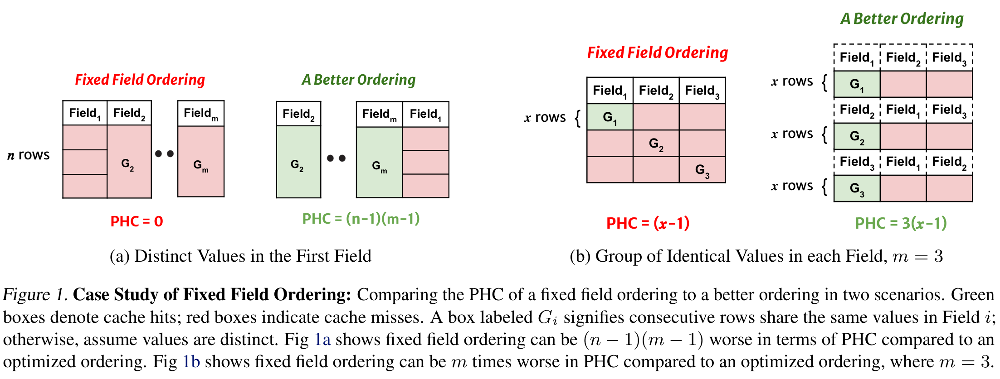
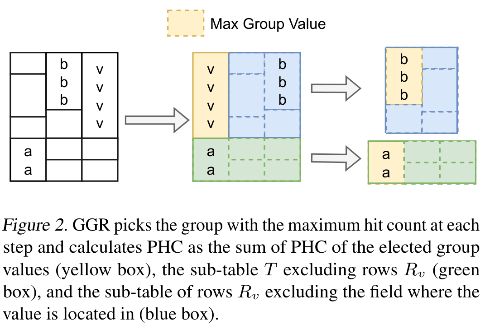
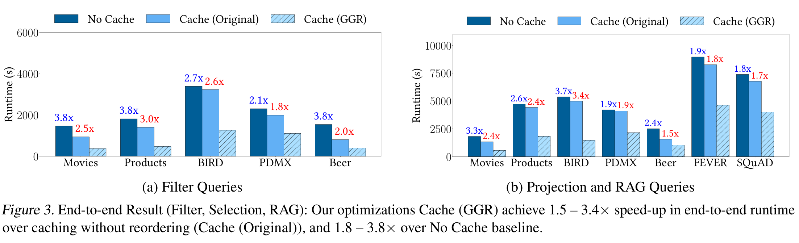
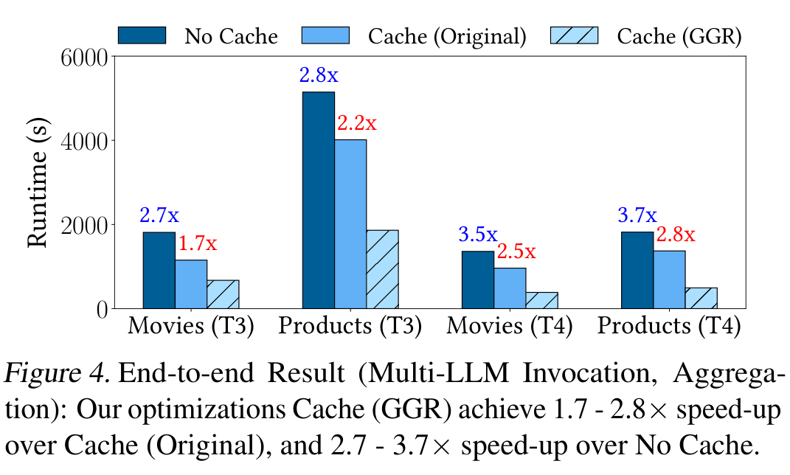
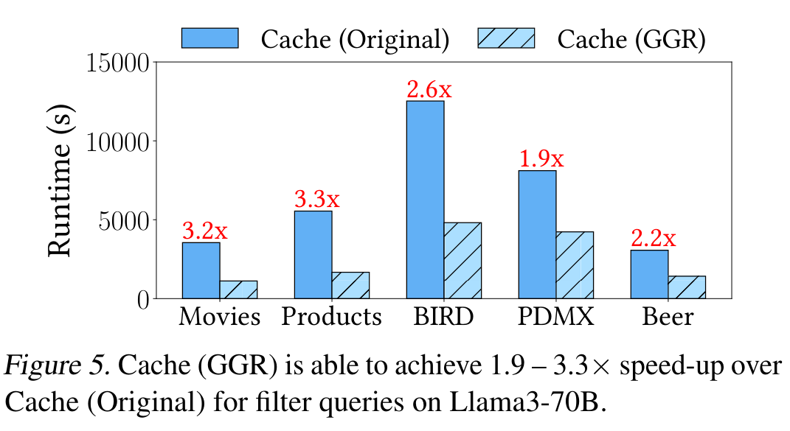
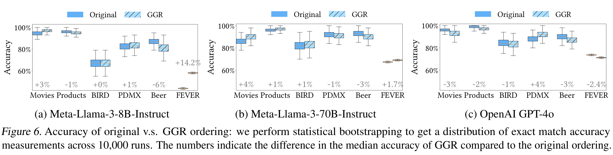

# 《Optimizing LLM Queries in Relational Data Analytics Workloads》论文精读笔记

> **阅读原则**：正文主体尽量只写论文明确支持的内容；算法、实验结论均沿用论文术语。论文未证明的内容明确标注“论文未证明 / 未研究”。最后两节“理解与启发”“与课题关系”为基于论文内容的个人分析，不属于论文原文贡献。

---

# 1. 论文基本信息

## 1.1 题目

**Optimizing LLM Queries in Relational Data Analytics Workloads**

可直译为：

**关系数据分析工作负载中的 LLM 查询优化**

论文讨论的不是 Text-to-SQL，而是：

> 已经存在一个关系查询，其中对表中每一行调用 LLM，如何优化这些大量 LLM inference requests 的执行。

论文将这种查询称为 **LLM queries**。

---

## 1.2 作者

* Shu Liu *
* Asim Biswal *
* Amog Kamsetty
* Audrey Cheng
* Luis Gaspar Schroeder
* Liana Patel
* Shiyi Cao
* Xiangxi Mo
* Ion Stoica
* Joseph E. Gonzalez
* Matei Zaharia

其中 Shu Liu 与 Asim Biswal 为 equal contribution。

---

## 1.3 单位

* **UC Berkeley**
* **Technical University of Munich**
* **Stanford University**

---

## 1.4 会议与年份

**Proceedings of the 6th MLSys Conference, 2025**

地点：

**Santa Clara, California, USA**

---

# 2. 一句话概括论文

这篇论文的核心思想可以压缩成一句话：

> **关系型 LLM workload 在执行之前通常已经知道整张输入表，因此可以利用表中值重复、Functional Dependency 和列统计信息，重新排列“行的请求顺序”和“每一行内部字段顺序”，使相邻 LLM prompts 拥有更长的公共 prefix，从而提高 KV cache reuse，降低 prefill 开销和 API 成本。**

核心不是：

* 改模型；
* 改 attention kernel；
* 改 vLLM scheduler；
* 换小模型；

而是：

> **改变送给 LLM serving backend 的 request organization。**

---

# 3. 研究背景与问题

# 3.1 为什么关系数据分析开始大量调用 LLM

论文 Section 1 指出，越来越多分析系统已经支持直接在关系查询中调用 LLM，包括：

* AWS Redshift；
* Databricks；
* Google BigQuery；
* DataFrame / programming frameworks。

典型形式：

```sql
SELECT user_id,
       request,
       support_response,
       LLM(
         'Did {support_response} address {request}?',
         support_response,
         request
       ) AS success
FROM customer_tickets
WHERE support_response <> NULL
```

这里不是对整个表调用一次 LLM，而是：

> **对于满足条件的每一行，都生成一个 LLM request。**

因此，一张具有几十万、几百万行的数据表可能对应几十万甚至几百万次模型调用。

这类 LLM query 可以用于：

* classification；
* entity extraction；
* summarization；
* translation；
* RAG；
* sentiment analysis；
* filtering。

---

# 3.2 LLM inference 成为了严重瓶颈

论文开头给出的动机数据是：

* NVIDIA L4 上运行 Llama3-8B：

  * 约只能处理 **6 KB text/s**；
* 处理约 15 GB 数据：

  * 可能需要接近 **一个月**；
* 使用论文当时的 GPT-4o API 处理类似规模数据：

  * 约需要 **$18K**。

因此，对于 batch data analytics：

> LLM operator 与普通数据库 operator 的成本完全不在一个量级。

---

# 3.3 Prompt KV cache 提供了优化机会

Section 2 回顾 LLM inference：

1. **Prefill**

   * 处理完整输入 prompt；
2. **Decoding**

   * autoregressively 生成 token。

prefill 阶段为输入 token 计算 attention state，并产生：

**Key-Value Cache（KV cache）**

如果后续 request 和之前 request 具有相同 prefix，就可以复用对应 KV cache：

```text
Request 1:
A B C D E

Request 2:
A B C X Y
─────
共享 prefix
```

Request 2 的：

```text
A B C
```

对应状态不需要重新计算。

因此 prefix caching 同时可以：

* 减少 prefill computation；
* 减少 GPU memory usage；
* 增加 serving throughput；
* 在部分商业 API 中降低 cached-input token 的价格。

---

# 3.4 为什么现有 relational LLM execution 没有充分利用 cache

简单方案是：

```text
Relational Engine
      │
      │ 每行一个 request
      ▼
LLM Serving Engine
      │
      ▼
Prompt Cache
```

即使 backend 支持 prefix caching，cache hit 仍然可能很低。

问题不是数据库中不存在重复数据。

相反，关系数据中大量存在：

* join 后重复的 metadata；
* popular items；
* foreign-key relationships；
* 相同 category；
* 重复 descriptions；
* RAG 中重复 context；
* 相同 feature values。

真正的问题是：

> **这些相同值未必出现在 prompt 的 prefix。**

---

# 3.5 最关键的观察：关系 workload 是 offline / batch workload

论文的一个非常重要前提是：

> 在执行 batch relational query 时，整张输入表通常已经提前知道。

因此系统具有论文所说的：

**oracular knowledge of all requests**

即可以在真正发送 LLM request 前看到：

```text
Request 1
Request 2
Request 3
...
Request N
```

于是产生一个新的优化自由度：

> **先把这些 requests 重新排序，再提交给 LLM。**

甚至不仅可以改变 row order，还可以改变：

> **同一行数据生成 prompt 时，各个字段出现的顺序。**

---

# 4. Section 2：Background and Motivation

# 4.1 LLM inference

论文把 inference 分为：

```text
Prompt
  │
  ▼
Prefill
  │
  │ KV cache
  ▼
Decode
  │
  ▼
Output
```

论文给出的量级：

* 13B model 的 KV cache：

  * 每 token 最多约 **800 KB**；
* 2,000 token request：

  * 最多约 **1.6 GB memory**；
* 即使 batching：

  * inference 仍然是昂贵操作。

因此：

> 提高 prompt prefix reuse 可以避免大量重复的 prefilling。

---

# 4.2 relational data 为什么特别适合 prefix reuse

数据库长期以来就在利用数据重复性，例如：

* RLE；
* column compression；
* C-Store；
* Parquet；
* correlation analysis；
* multidimensional clustering；
* Z-order。

论文指出：

> 这些原本被数据库系统用于 compression / clustering 的关系结构，也意味着 LLM prompts 之间可能存在大量公共值。

因此关系数据的结构本身可以成为：

> **KV cache optimization signal。**

---

# 4.3 论文的目标

对于一个 LLM query：

```text
Table T
 n rows
 m fields
```

希望同时决定：

1. **row ordering**
2. **field ordering for every row**

以最大化：

**prefix hit count**

论文特别强调：

> 每一行允许拥有不同的 field ordering。

这一点非常关键。

因为搜索空间为：

$$
n! \times (m!)^n
$$

其中：

* (n!)：行排列；
* 每行存在 (m!) 个字段排列；
* n 行共同产生 ((m!)^n)。

因此不能直接枚举。

---

# 5. Section 3：Problem Setup

# 5.1 LLM operator 模型

论文假设一个通用 LLM operator：

```text
LLM(prompt, T.a, T.b, T.c)
```

或者：

```text
LLM(prompt, T.*)
```

例如：

```sql
SELECT LLM("Summarize: ", pr.*)
FROM (
    SELECT review, rating, description
    FROM reviews r JOIN product p
    ON r.asin = p.asin
) AS pr
```

对于：

```text
review
rating
description
```

这三个字段：

论文允许执行系统动态改变它们进入 prompt 的顺序。

---

# 5.2 request schedule

论文使用列表：

$$
L
$$

表示 request schedule。

其中：

```text
L[r]
```

对应第 r 个 request。

而：

```text
L[r][f]
```

代表该 request 中第 f 个位置的 field cell value。

因此同时改变：

```text
tuple 在 L 中的位置
```

即可改变 row order；

改变：

```text
tuple 内部 element 顺序
```

即可改变 field order。

---

# 5.3 Prefix Hit Count（PHC）

论文优化的正式 objective 是：

**Prefix Hit Count，PHC**

定义：

$$
\mathrm{PHC}(L)=\sum_{r=1}^{n}\operatorname{hit}(L,r)
$$

其中：

$$
\operatorname{hit}(L,r)=
\max_{0\leq c<m}
\left\{
\sum_{f=1}^{c}\operatorname{len}(L[r][f])^2
\right\}
$$

条件是：

$$
\forall f \leq c,\quad
L[r][f]=L[r-1][f]
$$

也就是说：

> 从第一个 field 开始，与前一个 row 连续相等的字段才能贡献 prefix hit。

例如：

```text
Row 1: A B C X
Row 2: A B D X
```

共享：

```text
A B
```

但后面的：

```text
X
```

即使相等也不能算，因为：

```text
C != D
```

prefix 已经断掉。

---

# 5.4 为什么长度使用平方

论文将 field length 的贡献写成：

$$
\operatorname{len}(\mathrm{value})^2
$$

论文给出的理由是：

> LLM token processing 的计算复杂度随着上下文长度呈 quadratic growth，因为每个 token 的 attention 依赖前面的 tokens。

因此 PHC 并不是简单：

```text
重复字段数量
```

而倾向优先缓存：

```text
更长的重复字段。
```

---

# 5.5 两个明确假设

Section 3.1 明确提出两个简化假设。

### 假设 1

至少：

> **一个 tuple / row 能够放进 KV cache。**

这是 request reuse 得以发生的基本条件。

### 假设 2

只有：

> **exactly matching cell value**

才算 hit。

不考虑：

* substring；
* semantic similarity；
* approximate matching。

例如：

```text
"University of California"
```

和：

```text
"California"
```

不算共享 field value。

论文认为 exact repetitions 在 relational databases 中已经非常常见，因此这个假设仍然可以取得实际收益。

---

# 6. Section 3.2：为什么 Fixed Field Ordering 不够

这是理解整篇论文最重要的一节之一。

传统关系表：

```text
Field1 Field2 Field3
```

通常所有 row 都使用完全相同 column order。

论文证明：

> fixed field ordering 最坏情况下可以比 per-row field ordering 差 m 倍。

---

# 6.1 Figure 1(a)：第一个字段全部 unique

假设：

```text
n rows
m fields
```

其中：

```text
Field1：所有 row 都不同
Field2...Fieldm：所有 row 都相同
```

如果顺序为：

```text
Field1 | Field2 | ... | Fieldm
```

由于第一个 field 每行不同：

```text
prefix 第一个位置就 miss
```

所以：

$$
\mathrm{PHC}=0
$$

但如果排列成：

```text
Field2 ... Fieldm | Field1
```

前 m−1 个字段都可以 hit。

得到：

$$
\mathrm{PHC}=(n-1)(m-1)
$$

**Figure 1(a)** 用绿色表示 cache hit，红色表示 cache miss。

它说明：

> 一列 highly unique 的 ID / timestamp 如果被放在 prompt 最前面，可能直接破坏后面全部重复字段的 prefix reuse。

---

# 6.2 Figure 1(b)：为什么每一行必须允许不同 field order

更重要的是第二个例子。

对于：

```text
Field1
Field2
Field3
```

分别存在：

```text
G1
G2
G3
```

三个不同 row groups。

每个 group 中：

```text
x rows
```

在对应 field 上具有相同值。

这些 group 在 row dimension 上互不重叠。

如果所有 rows 强制使用：

```text
Field1 Field2 Field3
```

最多只能让一个 group 获得 prefix reuse：

$$
\mathrm{PHC}=x-1
$$

而 per-row ordering 可以：

```text
G1 rows → Field1 first
G2 rows → Field2 first
G3 rows → Field3 first
```

于是：

$$
\mathrm{PHC}=3(x-1)
$$

一般化到 m fields：

> dynamic per-row field ordering 最多可以获得 fixed ordering 的 m 倍 PHC。

---

# 6.3 Figure 1 真正证明了什么

Figure 1 并没有证明实际数据库一定提高 m 倍。

它证明的是：

> **存在一类合法关系数据分布，使 fixed field ordering 相比 per-row field ordering 可以差最多 m 倍。**

这是论文为什么不采用：

```text
找到一个全局最佳 column order
```

而需要：

```text
每个 row 独立决定 field order
```

的理论动机。



*来源：论文 Figure 1，PDF 第 4 页；原图裁剪。绿色表示 cache hit，红色表示 cache miss；该图构造的是 fixed field ordering 的 worst case，用来证明逐行 field ordering 的额外自由度，不表示真实数据库必然获得 $m$ 倍收益。*

---

# 7. Section 4：Recursive Request Reordering

论文提出两个算法：

```text
OPHR
 │
 │ optimal but exponential
 ▼
GGR
   approximate but practical
```

---

# 8. Section 4.1：Optimal Prefix Hit Recursion（OPHR）

## 8.1 输入与输出

输入：

$$
T
$$

即当前 table / sub-table。

输出：

* optimal PHC：

$$
S
$$

* reordered tuple list：

$$
L
$$

---

# 8.2 Base Case 1：只有一行

如果：

$$
|T|_{rows}=1
$$

不存在前一个 request，因此：

$$
PHC=0
$$

直接返回该 row。

---

# 8.3 Base Case 2：只有一个字段

如果只有一个 field：

```text
a
b
a
a
c
```

最优方式显然是将相同 value 排在一起：

```text
a
a
a
b
c
```

对于某个 distinct value $v$，出现 $k$ 次：

第一行是 cold miss；

剩下：

$$
k-1
$$

次可以 reuse。

论文因此按：

```text
value length² × (occurrence - 1)
```

计算贡献。

---

# 8.4 Recursive Case

对于 table 中：

```text
每一个 field c
```

以及其中：

```text
每一个 distinct value v
```

定义：

$$
R_v=\{r\mid T[r,c]=v\}
$$

即 field c 中值等于 v 的所有 rows。

然后将问题拆成两部分。

### Sub-table A

不属于这个 group 的 rows：

$$
T_A=T[\text{rows}\setminus R_v]
$$

### Sub-table B

属于 $R_v$ 的 rows，但删除 field c：

$$
T_B=T[R_v,\text{columns}\setminus c]
$$

因为这些 rows 的 field c 已经被用于形成 prefix group。

然后：

$$
\mathrm{PHC}(T)=\mathrm{PHC}(T_A)+\mathrm{PHC}(T_B)+\operatorname{Contribution}(v)
$$

OPHR 对：

```text
所有 c
×
所有 v
```

都尝试一次。

最后选择 PHC 最大的方案。

---

# 8.5 为什么要这样递归

核心思想是：

> 如果决定让某个 value v 成为当前 prefix，就应该把拥有 v 的 rows 聚到一起，让 v 的全部重复机会连续出现。

随后：

* 不属于 v group 的数据继续独立优化；
* 属于 v group 的 rows，则继续在剩余 columns 中寻找下一级 prefix。

于是实际上形成类似：

```text
选一个公共 prefix value
        │
        ├── 不属于该 group 的 rows → 继续优化
        │
        └── 属于该 group 的 rows
                 │
                 └── 删除已经固定的 field
                         ↓
                    继续寻找下一层 prefix
```

---

# 8.6 Optimality Proof

论文采用 induction。

### Base case

单 row 或单 field：

最优解显然可以直接得到。

### Inductive hypothesis

假设 OPHR 对：

$$
k\leq n,\quad l\leq m
$$

的 table 都能得到 optimal PHC。

### Inductive step

对于：

$$
(n+1)\times(m+1)
$$

的 table：

OPHR 枚举每个：

```text
field c + distinct value v
```

将 table 分成：

$$
T_A,\ T_B
$$

根据归纳假设：

```text
T_A
T_B
```

都能被最优求解。

同时 value $v$ 的完整 contribution 被单独计算。

因此选择所有候选 decomposition 中 PHC 最大者，就得到整体最优解。

---

# 8.7 OPHR 的问题

论文明确指出：

> OPHR 的复杂度随着 row 和 field 数量呈 exponential growth。

原因是：

```text
每一层
→ 枚举所有 columns
→ 枚举所有 distinct values
→ 再递归探索
```

因此虽然：

**optimal**

但：

**not practical for large datasets**

Section 6.1.3 甚至指出：

> 一个只有约 10 rows 的 table，OPHR 都可能需要 several minutes。

Appendix D.1 进一步显示某些几十行样本需要数百到数千秒。

---

# 9. Section 4.2：Greedy Group Recursion（GGR）

由于 OPHR 不可实际使用，论文提出：

**Greedy Group Recursion，GGR**

核心差别只有一句话：

> OPHR 每一层尝试所有 candidate groups；GGR 每一层只选择当前 HITCOUNT 最大的 group。

---

# 9.1 Algorithm 1：输入输出

**Algorithm 1：Greedy Group Recursion (GGR)**

输入：

* Table $T$
* Functional Dependency (FD)

输出：

* Prefix Hit Count $S$
* Reordered List of Tuples $L$

---

# 9.2 HITCOUNT

Algorithm 1 Lines 3–8：

对于：

```text
value v
column c
```

先找到：

$$
R_v=\{i\mid T[i,c]=v\}
$$

即共享该值的所有 rows。

然后：

```text
inferred_cols =
{c' | (c,c') ∈ FD}
```

即所有可以由 c functional-dependently 推出的 columns。

Algorithm 1 Line 6 原文写为：

$$
\mathrm{tot\_len}=
\operatorname{len}(v)^2
+
\sum_{c'\in \mathrm{inferred\_cols}}
\frac{
\sum_{r\in R_v}\operatorname{len}(T[r,c'])
}{
|R_v|
}
$$

然后：

$$
\operatorname{HITCOUNT}=\mathrm{tot\_len}\times(|R_v|-1)
$$

并返回：

```text
[c] + inferred_cols
```

作为这个 group 一起处理的 columns。

> 注：这里严格保留 Algorithm 1 的公式排版。依赖列部分在论文中写的是 average `len(...)`，没有自行改写为平方。

---

# 9.3 GGR 的 Greedy Selection

Algorithm 1 Lines 17–23：

遍历当前 table 中的：

```text
每一个 column c
每一个 distinct value v
```

计算：

```text
HITCOUNT(v,c,T,FD)
```

然后只保留：

```text
最大 HITCOUNT
```

对应：

* best value：

$$
b_v
$$

* best column：

$$
b_c
$$

* associated columns：

$$
b_{cols}
$$

这就是：

**Greedy**

的来源。

---

# 9.4 Recursive Split

选择：

$$
(b_v,b_c)
$$

以后：

$$
R_v={i\mid T[i,b_c]=b_v}
$$

然后递归两个 subproblems。

### A

不属于 selected group：

$$
\operatorname{GGR}(T[\text{rows}\setminus R_v,\mathrm{cols}])
$$

### B

属于 selected group，但移除已经处理的 columns：

$$
\operatorname{GGR}(T[R_v,\mathrm{cols}\setminus b_{cols}])
$$

最后：

$$
S=A_{\mathrm{HC}}+B_{\mathrm{HC}}+C_{\mathrm{HC}}
$$

其中：

$$
C_{\mathrm{HC}}=\operatorname{HITCOUNT}(b_v,b_c,T,\mathrm{FD})
$$

---

# 9.5 Figure 2：GGR 的图形化含义

**Figure 2** 是理解 GGR 最直观的图。

它将一次递归分成三块：

* **黄色**：

  * 当前最大 HITCOUNT group；
* **绿色**：

  * 不属于 $R_v$ 的 rows；
* **蓝色**：

  * 属于 $R_v$ 的 rows，但是删掉已经使用的 field。

也就是：

```text
Current Table
     │
     │ choose maximum HITCOUNT group
     ▼
 ┌──────────────┐
 │ selected v   │  ← yellow
 └──────────────┘
       │
       ├───────────────┐
       ▼               ▼
 rows not in Rv      rows in Rv
 all fields          remaining fields
   green                blue
       │               │
       └── recurse ─────┘
```

这张图本质上揭示：

> GGR 在递归构造一个“prefix-sharing hierarchy”。



*来源：论文 Figure 2，PDF 第 5 页；原图裁剪。黄色是当前选中的最大 HITCOUNT group，绿色是不属于 $R_v$ 的 rows，蓝色是属于 $R_v$ 但删除已使用 field 后的 sub-table。*

---

# 9.6 GGR 与 OPHR 的真正区别

OPHR：

```text
当前所有 candidate group
     │
     ├─ candidate 1 → 完整递归
     ├─ candidate 2 → 完整递归
     ├─ candidate 3 → 完整递归
     ...
     └─ 选全局最好
```

GGR：

```text
当前所有 candidate group
     │
     └─ 根据局部 HITCOUNT
          只选当前最好一个
                    │
                    ▼
                  递归
```

因此：

* OPHR：

  * optimal；
  * exponential；
* GGR：

  * approximate；
  * practical。

论文指出 GGR 最大 recursion depth：

$$
O(\min(n,m))
$$

因为每次递归都会减少：

* rows；
* 或 columns。

但每个 recursion step 仍然需要扫描 table 找 distinct values，因此仍可能产生相对于 table size 的 quadratic scanning cost。

---

# 10. Section 4.2.1：Functional Dependencies

这是论文把：

**数据库 metadata**

引入：

**LLM serving optimization**

的关键位置。

---

# 10.1 FD 是什么

论文定义关系：

$$
X\leftrightarrow Y
$$

如果：

```text
t1.X = t2.X
→
t1.Y = t2.Y
```

并且反方向同样成立。

例如：

```text
product_id ↔ product_description
```

一个 product ID 对应固定 description。

如果两行具有相同：

```text
product_id
```

则通常也意味着相同：

```text
product_description
```

---

# 10.2 GGR 怎么利用 FD

假设：

```text
A ↔ C
```

GGR 一旦选择：

```text
A
```

就知道与 A functionally dependent 的：

```text
C
```

不必再作为独立 search dimension。

于是可以将：

```text
A C
```

直接放在一起。

这样有两个作用：

### 作用 1：减少 search space

不必递归重新决定 C。

### 作用 2：提高 prefix benefit estimation

如果 A 相同意味着 C 也相同：

```text
A
```

group 实际带来的 prefix reuse 不只来自 A，还来自 C。

因此 HITCOUNT 会把 functionally dependent fields 一起考虑。

---

# 10.3 论文给出的例子

对于：

```text
R(A,B,C)
```

如果：

$$
A\leftrightarrow C
$$

一旦 A 已经被加入 prefix：

> C 不再参与后续 recursive search。

---

# 11. Section 4.2.2：Table Statistics

即使 GGR 已经比 OPHR 快，逐层扫描大表仍然可能昂贵。

论文进一步利用数据库通常已有的：

**table statistics**

例如：

* cardinality；
* unique value count；
* field value length distribution。

---

# 11.1 Early stopping

GGR 可以在以下情况下停止递归：

### 条件 1

达到特定：

* row-wise recursion depth；
* column-wise recursion depth。

### 条件 2

estimated HITCOUNT 没有超过 threshold。

---

# 11.2 Statistics-based HITCOUNT

论文给出的 field-level estimation：

$$
\operatorname{HITCOUNT}(C)=\operatorname{avg}(\operatorname{len}(c))^2
$$

论文称该 score 用来估计：

> 一个 field 对 PHC 的 expected contribution。

然后：

> 优先处理更可能产生大 PHC 的 fields。

---

# 11.3 Recursion 停止以后怎么办

停止以后不是随机排列。

论文提出：

> 对剩余 subtable 使用 table statistics 建立 fixed field ordering。

因此完整逻辑实际上是：

```text
精确扫描 + greedy recursion
          │
          │ 达到 stopping condition
          ▼
statistics-based fixed ordering
```

这样避免对大表一直扫描到底。

---

# 12. Section 4.2.3：什么时候 GGR 可以得到 Optimal PHC

GGR 一般不是 optimal。

论文明确给出几个可以 optimal 的情况。

---

## 情况 1

只有一行。

## 情况 2

只有一列。

这两个情况和 OPHR base case 一致。

---

## 情况 3

Functional Dependencies 足够准确，并覆盖所有 fields。

例如：

```text
A
↓
all other fields
```

如果一个 A functionally determines 所有其余 fields：

GGR 对 A group 计算 HITCOUNT 时，会累计所有 correlated fields 的贡献。

因此可以优先选择正确 group，得到 optimal ordering。

---

## 什么时候可能 suboptimal

论文明确指出：

> 当多个 fields 的 HITCOUNT tie 时，GGR 可能 suboptimal。

因为 GGR 没有：

```text
backtracking / exhaustive search
```

来判断哪个当前相同 score 的选择会产生更优的 future solution。

---

# 13. 方法整体执行流程

下面是根据 Sections 3–5 重画的简化逻辑图，**不是论文原图**。

```text
                    Relational Query
                           │
                           ▼
                Materialized input table T
                           │
          ┌────────────────┴────────────────┐
          │                                 │
          │ Table content                   │ Metadata
          │                                 │
          │ repeated values                 ├─ Functional Dependencies
          │                                 ├─ Cardinality
          │                                 └─ Value length statistics
          │
          ▼
                GGR Request Reordering
          ┌─────────────────────────────────┐
          │ 1. enumerate candidate (c,v)    │
          │ 2. estimate HITCOUNT            │
          │ 3. choose max group             │
          │ 4. reorder rows                 │
          │ 5. reorder fields per row       │
          │ 6. recursively process subtables│
          └─────────────────────────────────┘
                           │
                           ▼
              Reordered list of tuples L
                           │
                           ▼
             JSON-formatted LLM prompts
                           │
                           ▼
                      LLM endpoint
                     (e.g. vLLM)
                           │
                           ▼
                Prefix KV-cache reuse
                           │
                           ▼
           lower prefill time / lower cost
```

这里真正跨层的地方是：

```text
Relational metadata
        ↓
Request organization
        ↓
LLM KV-cache behavior
```

---

# 14. Section 5：Implementation

论文 implementation 很简洁。

## 14.1 代码规模

约：

**1.3K lines of Python**

---

## 14.2 Data analytics backend

使用：

**PySpark**

底层：

**Apache Spark**

---

## 14.3 LLM operator

LLM operator 被实现成：

**PySpark UDF**

输入包括：

* system prompt；
* query prompt；
* one row of data。

真正调用：

> configurable LLM endpoint

因此方法不是绑定某一种 serving engine。

---

## 14.4 Prompt construction

系统按照 GGR 返回的：

```text
row order
+
field order
```

生成 prompt。

每个 row 中：

> 用 JSON encoding 表示 field name 与 value 的关系。

这一点非常重要，因为字段被重新排序后：

```text
位置本身已经不能表达 schema
```

所以仍然需要：

```json
{
  "field_name": "value"
}
```

这样的结构帮助模型保持字段语义。

---

# 15. Section 6：Evaluation

论文实验回答三个主要问题：

1. request reordering 对：

   * latency；
   * cost；
     有多大影响？

2. field / row reordering 是否影响 LLM accuracy？

3. GGR solver 本身要花多长时间？

---

# 16. Section 6.1：Evaluation Benchmark

由于论文认为当时：

> 缺乏标准化 relational LLM query benchmark，

作者自行构造了：

* **7 datasets**
* **16 LLM queries**
* **5 query types**

---

# 16.1 Table 1：Datasets

| Dataset  |   Rows | Fields | Avg. input tokens | Avg. output tokens | Query Types |
| -------- | -----: | -----: | ----------------: | ------------------ | ----------- |
| Movies   | 15,000 |      8 |               276 | {2, 29, 16, 2}     | T1–T4       |
| Products | 14,890 |      8 |               377 | {3, 107, 62, 2}    | T1–T4       |
| BIRD     | 14,920 |      4 |               765 | {2, 43}            | T1, T2      |
| PDMX     | 10,000 |     57 |               738 | {2, 72}            | T1, T2      |
| Beer     | 28,479 |      8 |               156 | {2, 38}            | T1, T2      |
| SQuAD    | 22,665 |      5 |             1,047 | 11                 | T5          |
| FEVER    | 19,929 |      5 |             1,302 | 3                  | T5          |

数据来源：

* Rotten Tomatoes Movie Reviews；
* Amazon Product Reviews；
* BIRD；
* Public Domain MusicXML；
* RateBeer Reviews；
* SQuAD；
* FEVER。

对于 BIRD：

> 使用 Posts 和 Comments tables，并通过 PostID join。

---

# 17. Section 6.1.2：五类 LLM Query

## T1：LLM Filter

类似：

```sql
WHERE LLM(...) = ...
```

典型任务：

* sentiment；
* classification；
* content filtering。

特点：

> output 很短。

共：

**5 queries**

覆盖除 SQuAD 和 FEVER 外的五个 dataset。

---

## T2：LLM Projection

类似：

```sql
SELECT LLM(...)
```

任务：

* summarization；
* interpretation。

特点：

> output 相对较长。

共：

**5 queries**

---

## T3：Multi-LLM Invocation

一个 query 内包含多个 sequential LLM calls。

例如：

```text
先 Filter
↓
再 Projection
```

共：

**2 queries**

分别在：

* Movies；
* Products。

---

## T4：LLM Aggregation

将 LLM output 再送入：

```text
AVG
```

等普通 relational operator。

例如：

```sql
SELECT AVG(
    LLM("Rate sentiment 1 to 5", ...)
)
FROM ...
```

共：

**2 queries**

---

## T5：RAG

流程：

```text
question
   │
   ▼
Vector retrieval
   │
   ▼
contexts
   │
   ▼
LLM
```

使用：

* FEVER：4 contexts；
* SQuAD：5 contexts。

共：

**2 queries**

---

## 总数

$$
5+5+2+2+2=16
$$

---

# 18. Appendix A：Query Examples

论文附录给出了五类 SQL 示例。

例如 Movies Filter：

```sql
SELECT t.movietitle
FROM MOVIES
WHERE LLM(
    'Given the following fields,
     determine whether the movie is
     suitable for kids.
     Answer ONLY with "Yes" or "No".',
    movieinfo,
    reviewcontent,
    reviewtype,
    movietitle
) = 'Yes'
```

注意这里：

```text
movieinfo
reviewcontent
reviewtype
movietitle
```

就是 GGR 可以重新排列的输入 fields。

---

# 19. Section 6.1.3：实验设置

# 19.1 Metrics

论文主要测量：

### Performance

**end-to-end query latency**

### Cost

OpenAI / Anthropic API monetary cost。

### Accuracy

对部分 LLM Filter queries：

> 人工标注 ground truth 并比较 exact match。

---

# 19.2 Models

主要模型：

**Meta Llama-3-8B-Instruct**

RAG embedding：

**Alibaba-NLP/gte-base-en-v1.5**

vector search：

**FAISS**

另外测试：

**Llama-3-70B-Instruct**

用于 Filter queries。

Cost experiment 使用：

* **OpenAI GPT-4o-mini**
* **Anthropic Claude 3.5 Sonnet**

Accuracy 还测试：

**GPT-4o**

---

# 19.3 Hardware

### Llama-3-8B

* 1 × NVIDIA L4
* 24 GB GPU memory
* GCP g2-standard-4

### Llama-3-70B

* 8 × NVIDIA L4
* GCP g2-standard-48
* tensor parallelism

---

# 19.4 Baselines

三种主要方案：

### No Cache

不启用 prompt caching。

### Cache (Original)

启用 prompt caching：

> 但 row / field 维持原始 ordering。

### Cache (GGR)

启用 prompt caching：

> 并使用 GGR 重排 row 与 field。

---

## 为什么没有 OPHR baseline

论文明确说：

> OPHR 对大型 table 不可行。

甚至：

> solving a 10-row table 可以需要 several minutes。

所以正式 end-to-end benchmark 不运行 OPHR。

---

# 20. Section 6.2：End-to-End Benchmark Results

整体结果：

相对于：

**Cache (Original)**

GGR 提升：

$$
1.5\times \sim 3.4\times
$$

相对于：

**No Cache**

提升：

$$
1.8\times \sim 3.8\times
$$

覆盖全部 16 queries。

注意：

> 摘要中“up to 3.4×”主要对应相比已经启用了 caching、但没有 reordering 的 Cache (Original)。



*来源：论文 Figure 3，PDF 第 8 页；原图裁剪。左 panel 为 Filter，右 panel 为 Projection 与 RAG；比较 No Cache、Cache (Original) 和 Cache (GGR)。图中收益只适用于论文给定的 batch workload、模型和 cache 配置。*

---

# 21. Figure 3(a)：LLM Filter

Cache (GGR) 相对 No Cache：

$$
2.1\times \sim 3.8\times
$$

Cache (Original) 相对 No Cache：

$$
1.03\times \sim 1.9\times
$$

Cache (GGR) 相对 Cache (Original)：

$$
1.8\times \sim 3.0\times
$$

---

# 21.1 为什么 Filter 收益最大

Filter output 一般只有：

```text
Yes / No
Positive / Negative
```

即只有几个 tokens。

因此：

```text
Prefill
```

在总体 inference latency 中占比较高。

提高 prefix hit：

> 可以直接减少大量主要计算。

---

# 21.2 Movies / Products / BIRD

这些 review datasets 由于 join metadata：

原始前几列常常是：

```text
highly distinct values
```

例如：

```text
review_content
```

GGR 将：

```text
description
product_title
```

等重复性更强的字段优先。

论文报告：

* prefix hit rate 提高：

  * **57–74 percentage points 左右的量级**；
* end-to-end：

  * **2.5–3×** 相比 original ordering。

---

# 21.3 PDMX

PDMX：

* 57 fields；
* 大量 unique、long text。

原始 PHR：

**12%**

GGR：

**57%**

但仍有：

**43% cache miss**

因此最终只有：

**1.8×**

相对 Cache (Original) 的 speedup。

这说明：

> cache hit 提升并不意味着所有计算都能消失。

---

# 21.4 Beer

Beer 原始字段中已经存在一些重复项，例如：

```text
review/profileName
```

因此 Cache (Original) 已经可以达到：

**50% PHR**

GGR 进一步提升到：

**80%**

最终约：

**2× speedup**

---

# 22. Figure 3(b)：LLM Projection

Projection output 更长：

Movies：

**29 tokens**

Products：

**107 tokens**

因此 decode 开销变大。

GGR 相比 No Cache：

$$
2.4\times \sim 3.7\times
$$

相比 Cache (Original)：

$$
1.5\times \sim 3.4\times
$$

---

# 22.1 为什么 Projection 相对收益可能降低

Prompt caching 主要节省：

**prefill**

如果：

```text
decode dominates
```

则即使 prefilling 快很多：

```text
end-to-end latency
```

下降比例仍然有限。

因此：

> output 越长，prefix caching 的相对收益通常越容易被 decode time 稀释。

论文同时指出，对 BIRD / PDMX 这种 input string 很长的数据：

prompt caching 还会降低 decode 时的 memory pressure，因此仍能产生明显收益。

---

# 23. Figure 4：Multi-LLM Invocation

Movies：

* vs No Cache：

  * **2.7×**
* vs Cache (Original)：

  * **1.7×**

Products：

* vs No Cache：

  * **2.8×**
* vs Cache (Original)：

  * **2.2×**

---

# 23.1 为什么比单个 Filter / Projection 收益下降

Multi-LLM query 的第一阶段：

```text
sentiment filter
```

主要读取 distinct reviews。

因此：

```text
Original
```

与：

```text
GGR
```

这一阶段差异不大。

Movies 中：

> 第一 invocation 占将近一半 total query time。

所以原本约：

```text
2.5×
```

的收益在 multi-invocation 后变成：

```text
1.7×
```

Products 第二阶段 Projection output 很长：

约：

**107 tokens**

第二阶段占主导，因此仍获得：

**2.2×**

---

# 24. Figure 4：LLM Aggregation

Movies：

* vs No Cache：

  * **3.5×**
* vs Cache Original：

  * **2.5×**

Products：

* vs No Cache：

  * **3.7×**
* vs Cache Original：

  * **2.8×**

论文认为结果类似 Filter：

原因是 aggregation 所需的 LLM sentiment score output 很短。



*来源：论文 Figure 4，PDF 第 8 页；原图裁剪。T3 是顺序执行多个 LLM invocation，T4 是将 LLM 输出交给关系 Aggregation；两者与 Figure 3 的单次 Filter/Projection 不是重复 workload。*

---

# 25. RAG Results

FEVER：

* vs No Cache：

  * **1.9×**
* vs Original：

  * **1.8×**

SQuAD：

* vs No Cache：

  * **1.9×**
* vs Original：

  * **1.7×**

---

# 25.1 为什么 RAG 也能重排

RAG table 可以看成：

```text
question
context1
context2
context3
context4
...
```

不同 questions 可能 retrieve 到：

> 相同或重叠 contexts。

因此 GGR 可以：

1. 改变 question rows 的执行顺序；
2. 改变 context fields 在 prompt 中的顺序；

从而让相同 context 尽可能位于 prefix。

论文报告：

> GGR 相比 Original 将 RAG PHR 提高约 56–59 percentage points。

---

# 26. Table 2：Prefix Hit Rate

| Dataset  | Original |     GGR |
| -------- | -------: | ------: |
| Movies   |      35% | **86%** |
| Products |      27% | **83%** |
| BIRD     |      10% | **85%** |
| PDMX     |      12% | **57%** |
| Beer     |      50% | **80%** |
| FEVER    |      11% | **67%** |
| SQuAD    |      11% | **70%** |

论文总结：

> GGR 提升约 **30–75 percentage points** 的 prefix hit rate。

注意：

**PHC** 与 **PHR** 不是完全同一个实验量。

* PHC：

  * Section 3 中正式定义的 optimization objective；
* PHR：

  * Section 6 中报告的 prefix hit rate percentage。

论文正文没有单独给出 PHR 的完整数学定义。

---

# 27. Figure 5：Llama-3-70B

作者进一步测试：

**Llama-3-70B-Instruct**

8 × L4。

GGR 相比 Cache Original：

| Dataset  | Speedup |
| -------- | ------: |
| Movies   |    3.2× |
| Products |    3.3× |
| BIRD     |    2.6× |
| PDMX     |    1.9× |
| Beer     |    2.2× |

总体：

$$
1.9\times\sim3.3\times
$$

论文据此认为：

> GGR 在更大模型上呈现与 8B 类似的趋势。



*来源：论文 Figure 5，PDF 第 9 页；原图裁剪。该实验使用 8×L4 的 Llama-3-70B，只验证 Filter queries 的跨模型规模趋势，不覆盖 Projection、RAG 或其他 serving 环境。*

---

# 28. Section 6.3：Commercial API Cost

这一节需要特别区分：

1. **真实 API experiment**
2. **基于 pricing model 的估算**

不能混在一起。

---

# 28.1 当时 API 的 cache constraint

论文指出当时：

OpenAI 和 Anthropic 都要求：

> prefix 至少达到 **1,024 tokens**

才可 cache。

为了满足这一条件，作者：

> 将每一个 field value 重复 5 次。

并从 FEVER 选：

**1,000 rows**

进行真实 API experiment。

这是一个人为构造的实验设置，不能忽略。

---

# 28.2 Table 3：真实 API 结果

## GPT-4o-mini

Original：

* PHR：0.0%
* Cost：$0.81

GGR：

* PHR：62.2%
* Cost：$0.55

Savings：

$$
32\%
$$

---

## Claude 3.5 Sonnet

Original：

* PHR：0.0%
* Cost：$5.49

GGR：

* PHR：30.6%
* Cost：$4.33

Savings：

$$
21\%
$$

---

# 28.3 为什么 Anthropic PHR 更低

论文当时的 Anthropic cache：

> 需要显式指定 cache。

作者为了保守估计：

> 每个 request 只指定前 1,024 tokens cache write。

所以 GGR 实际测得：

**30.6% PHR**

约只有 OpenAI：

**62.2%**

的一半。

---

# 28.4 Table 4：Estimated Cost Savings

论文进一步做了一个假设：

> 假设未来支持 automatic prefix caching，而且任意 token length 都可被 cache。

然后使用 Table 2 中 PHR：

模拟两种 pricing model。

| Dataset  | Original PHR | GGR PHR | OpenAI Est. Saving | Anthropic Est. Saving |
| -------- | -----------: | ------: | -----------------: | --------------------: |
| Movies   |        34.6% |   85.7% |                31% |                   73% |
| Products |        26.7% |   83.3% |                33% |                   73% |
| BIRD     |        10.4% |   84.8% |                39% |                   79% |
| PDMX     |        11.8% |   56.6% |                24% |                   48% |
| Beer     |        49.9% |   80.1% |                20% |                   55% |
| FEVER    |        11.2% |   67.4% |                30% |                   60% |
| SQuAD    |        11.0% |   69.7% |                31% |                   63% |

因此：

OpenAI：

$$
20\%\text{--}39\%
$$

Anthropic：

最高：

$$
79\%
$$

但是必须强调：

> **79% 并不是论文实际 API 实验测出的成本降低，而是基于未来 cache 假设和 pricing model 的估算。**

论文真实 API experiment 的最大 savings 是：

**32%**

---

# 29. Section 6.4：Field Reordering 是否影响 Accuracy

这是论文非常重要的正确性实验。

原因是：

> relational semantics 虽然没有因为 row/field reordering 改变，但 LLM 对 prompt field order 可能敏感。

---

# 29.1 Evaluation Method

测试：

* LLM Filter queries；
* FEVER RAG。

不测试 SQuAD accuracy：

> 因为 SQuAD 是 open-ended question。

Ground truth：

* FEVER：

  * dataset 自带完整 labels；
* 其他 datasets：

  * 人工标注 100 rows。

使用：

**10,000-run statistical bootstrapping**

每次：

```text
sampling with replacement
```

统计：

**exact-match accuracy**

模型：

* Llama-3-8B；
* Llama-3-70B；
* GPT-4o。

---

# 29.2 Figure 6(a)：Llama-3-8B

GGR 相比 Original 的 median accuracy difference：

| Dataset  | Δ Accuracy |
| -------- | ---------: |
| Movies   |        +3% |
| Products |        -1% |
| BIRD     |        +0% |
| PDMX     |        +1% |
| Beer     |        -6% |
| FEVER    | **+14.2%** |

FEVER 反而提高很多。

论文解释：

> GGR 将 `claim` field 放到了 prompt 末尾，而 Llama3-8B 在这个任务上偏好这种排列。

但是：

> 该现象没有在更大模型中稳定出现。

### 论文内部一个小数值不一致

正文称：

> 除 FEVER 外，GGR accuracy 都在 Original 的 5% 范围内。

但 **Figure 6(a)** 给 Beer 标注的是：

**-6%**

因此图中数值与正文“within 5%”表述存在轻微不一致，这里不替论文自行修正。

---

# 29.3 Figure 6(b)：Llama-3-70B

| Dataset  | Δ Accuracy |
| -------- | ---------: |
| Movies   |        +4% |
| Products |        +1% |
| BIRD     |        +1% |
| PDMX     |        -1% |
| Beer     |        -3% |
| FEVER    |      +1.7% |

都在：

$$
\pm5\%
$$

范围。

---

# 29.4 Figure 6(c)：GPT-4o

| Dataset  | Δ Accuracy |
| -------- | ---------: |
| Movies   |        -3% |
| Products |        -2% |
| BIRD     |        -1% |
| PDMX     |        +4% |
| Beer     |        -3% |
| FEVER    |      -2.4% |

也都在：

$$
\pm5\%
$$

范围。

论文据此认为：

> larger models 对 field reordering 更 robust。

---

# 29.5 实验真正证明了什么

实验支持的是：

> 对作者测试的 constrained-output filter tasks 和 FEVER，在 Llama-3-70B / GPT-4o 上，GGR 与 Original 的 median exact-match accuracy difference 在 5% 内。

论文没有证明：

> 任意 LLM、任意 prompt、任意 open-ended generation 任务都不会受 field order 影响。

事实上：

* Llama3-8B FEVER：

  * +14.2%；
* Beer：

  * Figure 中为 -6%。

已经说明：

> prompt order 确实可能改变模型输出。



*来源：论文 Figure 6，PDF 第 10 页；原图裁剪。箱线图来自 10,000 次 bootstrap，覆盖 constrained-output Filter 与 FEVER；它不证明任意 open-ended task 对 field order 不敏感。Figure 6(a) 的 Beer 为 −6%，与正文“除 FEVER 外在 5% 内”的表述存在轻微不一致。*

---

# 30. Section 6.5：Algorithm Overhead

GGR 使用：

* row recursion depth = 4；
* column recursion depth = 2；
* early stopping threshold：

  * **0.1M hit count**。

---

# 30.1 Table 5：Solver Time

| Dataset  | Solver Time |
| -------- | ----------: |
| Movies   |       3.3 s |
| Products |       4.5 s |
| BIRD     |       1.2 s |
| PDMX     |      12.6 s |
| Beer     |       8.0 s |
| FEVER    |       5.6 s |
| SQuAD    |       4.5 s |

全部：

**< 15 seconds**

论文报告：

> solver time 少于 LLM query runtime 的 **0.01%**。

因此作者认为：

> GGR preprocessing overhead 相对于实际 LLM inference 可以忽略。

---

# 30.2 Memory

GGR 需要将：

$$
n\times m
$$

的 query input table $T$ 放入 memory。

由于 recursive split 不会让数据规模增加：

总 memory：

$$
O(nm)
$$

除：

* recursion stack；
* temporary variables；

外没有额外的大规模空间开销。

---

# 31. Appendix D.1：GGR 到底离 OPHR 多远

这是验证 GGR approximation quality 的重要 ablation。

由于 OPHR 太慢：

只测试各 dataset 前：

```text
10 / 25 / 50 / 100 / 200 rows
```

运行超过：

**2 hours**

即终止。

PDMX 由于有 57 columns：

> 还进一步缩到 10 columns。

---

# 31.1 Table 6

| Dataset     | OPHR PHR | GGR PHR |  Diff | OPHR Time | GGR Time |
| ----------- | -------: | ------: | ----: | --------: | -------: |
| Movies-50   |    80.6% |   80.6% |    0% |    2556 s |   0.05 s |
| Products-25 |    19.7% |   18.5% | -1.2% |     357 s |   0.06 s |
| BIRD-50     |    77.5% |   76.2% | -1.3% |    0.43 s |   0.05 s |
| PDMX-25     |    29.4% |   28.6% | -0.8% |     822 s |   0.05 s |
| FEVER-50    |     7.3% |    6.9% | -0.4% |     110 s |   0.23 s |
| Beer-10     |    25.7% |   25.6% | -0.1% |    1269 s |   0.08 s |
| SQuAD-10    |    34.0% |   34.0% |    0% |     1.6 s |   0.05 s |

作者结论：

> 在这些小样本上，GGR 距 OPHR optimal PHR 在 2% 以内，同时 solver 可以快几个数量级。

但需要严格限定：

> 论文没有证明 GGR 在完整的大规模 datasets 上也始终距离 optimal 2% 以内，因为 OPHR 根本无法在这些完整 datasets 上运行。

---

# 32. Appendix D.2：Smaller Model

作者还测试：

**Llama-3.2-1B**

单 L4。

---

## Table 7

| Dataset  | Runtime Orig/GGR | Original PHR | GGR PHR |
| -------- | ---------------: | -----------: | ------: |
| BIRD     |             1.5× |       10.41% |  83.99% |
| Movies   |             1.3× |       29.32% |  82.10% |
| PDMX     |             1.3× |       11.97% |  56.00% |
| Products |             1.4× |       24.06% |  82.10% |
| Beer     |             1.2× |       47.98% |  73.93% |

一个有意思的现象是：

> 1B 和 8B 的 PHR 提升很相似，但 1B 的 runtime speedup 更小。

论文解释：

prefix caching 的作用有两类：

1. 减少 shared-prefix computation；
2. 共享 KV cache，降低 memory consumption，从而允许更大的 batch。

对于 1B：

```text
model only ~1.8 GB
```

24 GB L4 memory 很充裕。

所以：

> 即使没有那么多 KV reuse，也已经可以使用较大的 batch。

而 8B：

```text
~7.6 GB
```

memory pressure 更高，因此 prefix caching 带来的相对收益更明显。

---

# 33. Appendix B：Functional Dependencies

论文列出的部分 dataset schema / FD 信息包括：

### Movies

Fields：

* genres
* movieinfo
* movietitle
* productioncompany
* reviewcontent
* reviewtype
* rottentomatoeslink
* topcritic

FD 列表涉及：

* movieinfo
* movietitle
* rottentomatoeslink

---

### Products

Fields：

* description
* id
* parent_asin
* product_title
* rating
* review_title
* text
* verified_purchase

FD：

* parent_asin
* product_title

---

### BIRD

Fields：

* Body
* PostDate
* PostId
* Text

FD：

* Body
* PostId

---

### Beer

FD group：

* beer/beerId
* beer/name

---

### FEVER

```text
FDs: []
```

---

### SQuAD

```text
FDs: []
```

这也说明：

> GGR 的收益并不完全依赖 FD。

即使 FEVER / SQuAD 没有 FD：

仍然可以通过：

* repeated values；
* row reordering；
* field reordering；

获得 PHR 提升。

---

# 34. 论文核心贡献

可以将论文贡献概括为三点。

## Contribution 1：发现 relational data ordering 是一种新的 LLM inference optimization dimension

已有 serving optimization 通常关注：

```text
GPU kernel
batching
KV management
scheduler
```

本文指出：

> LLM request 在进入 serving engine 之前，其数据排列本身也可以优化。

尤其是：

**row order + per-row field order**

---

## Contribution 2：OPHR + GGR

提出：

### OPHR

* optimal；
* exponential。

以及：

### GGR

* greedy approximation；
* 利用：

  * functional dependencies；
  * cardinality；
  * field length statistics；
* practical。

---

## Contribution 3：relational LLM query benchmark

构建：

* 7 datasets；
* 16 queries；
* 5 query types。

并在：

* Llama3-1B；
* Llama3-8B；
* Llama3-70B；
* GPT-4o；
* GPT-4o-mini；
* Claude 3.5 Sonnet；

等不同设置中验证。

---

# 35. 论文真正证明了什么

从实验可以较严格地总结为：

### 1. Row + field reordering 能显著提高 prefix reuse

Table 2：

例如：

```text
BIRD
10% → 85%
```

---

### 2. 更高 PHR 可以显著降低 batch relational LLM query latency

Figure 3 / Figure 4：

相比已经开启 cache 但不 reorder：

$$
1.5\times-3.4\times
$$

---

### 3. 该方法在不同大小 Llama models 上都有效

* 1B；
* 8B；
* 70B。

但相对 speedup：

> larger / more memory-constrained model 更明显。

---

### 4. GGR solver overhead 相比 LLM inference 很小

Table 5：

<15 s。

---

### 5. 商业 API 中 prefix reordering 可以降低费用

真实实验：

最高：

**32%**

---

### 6. GGR 在小规模可求 OPHR 的样本上接近 optimal

Table 6：

PHR difference：

**<2%**

但：

> 只证明小规模样本。

---

# 36. 论文没有证明 / 未研究的内容

为了避免扩大论文结论，下面单独列出。

## 36.1 没有证明 GGR 对任意大表接近 optimal

Appendix D.1 只能在：

```text
10–50 rows 左右的可运行样本
```

上比较 OPHR。

完整 dataset 上没有 optimal ground truth。

---

## 36.2 没有证明 field reordering 对所有 LLM task 都不影响质量

作者只评估：

* constrained filter；
* FEVER。

并明确排除了：

* open-ended SQuAD accuracy。

---

## 36.3 没有优化模型 decoding 本身

论文没有提出：

* decoding scheduler；
* speculative decoding；
* token scheduler；
* continuous batching algorithm。

---

## 36.4 没有改变 vLLM 内部 KV cache algorithm

vLLM 是 serving backend。

论文优化的是：

> **进入 vLLM 前 request 的 row / field organization。**

---

## 36.5 没有研究在线未知 workload

方法依赖：

> 全部 input rows 提前已知。

因此研究对象本质上是：

**offline / batch relational analytics workload**

而不是无法预知未来 request 的普通 online chat serving。

---

## 36.6 没有研究复杂 cache eviction / multi-tenant interference

论文目标函数主要围绕：

```text
prefix sharing
```

展开。

并没有构建：

* detailed KV eviction model；
* competing workload model；
* multi-tenant GPU contention model。

---

## 36.7 没有研究使用 cheaper model 替代 expensive LLM

Section 7 明确把：

```text
approximate query generation
cheaper model
```

认为是 orthogonal direction。

本文关注：

> regular given SQL query 内部的 LLM calls。

---

# 37. 优点与局限

论文没有独立的 **Limitations Section**；正式版的 Section 7 是 **Related Work**。因此这里先列论文明确体现出的 scope / assumptions，再单独列“笔记分析”。

---

## 37.1 优点：直接利用 relational semantics

方法不是把所有 requests 当作无结构字符串。

它利用：

* field；
* row；
* FD；
* cardinality；
* value length。

因此是一种：

> **database-aware LLM serving optimization**

---

## 37.2 优点：不要求修改模型

GGR 在 inference 前处理 request ordering。

因此理论上容易接到：

* vLLM；
* commercial API；
* 其他支持 prompt caching 的 serving backend。

---

## 37.3 优点：把 per-row field order 也纳入优化

这比：

```text
global sort
```

或：

```text
fixed column ordering
```

更细粒度。

Figure 1 证明这一额外自由度是有理论意义的。

---

## 37.4 优点：优化成本远小于 LLM inference

Table 5：

几秒 solver time；

LLM query：

几千秒级。

这使 preprocessing optimization 在 batch workload 下非常合理。

---

## 37.5 局限：需要提前看到完整 workload

这是最核心限制。

如果 request 是在线逐个到达：

```text
request1
request2
...
```

系统并不知道后面的 rows。

就无法进行论文这种全局 row reordering。

---

## 37.6 局限：exact value repetition assumption

论文只利用：

```text
exact same cell value
```

无法直接利用：

* approximate text similarity；
* partially shared prefix；
* semantic equivalence。

---

## 37.7 局限：GGR 是 heuristic

HITCOUNT 最大：

并不意味着未来 recursive decisions 一定最好。

论文自己承认：

> tie 情况可能 suboptimal。

---

## 37.8 局限：商业 API 成本实验具有特殊构造

为了达到 1,024-token caching threshold：

> field value 被重复 5 次。

因此 Table 3 是真实 API measurement，但 workload 本身经过人为放长。

---

## 37.9 局限：field ordering 可能影响 LLM output

Figure 6 已经显示：

LLM 对顺序不是严格 invariant。

因此：

> “relational semantics 不变”不能简单等价成“LLM answer 完全不变”。

---

## 37.10 笔记分析：优化目标没有完整建模真实 serving state

以下属于笔记分析，不是论文原文结论。

PHC 主要描述：

```text
潜在 prefix reuse
```

但实际 latency 还会受：

* current KV occupancy；
* cache eviction；
* batch composition；
* request queue；
* GPU utilization；
* output length；
* endpoint load；

影响。

所以 PHC 更像：

> **data-side static objective**

而不是完整：

> **runtime execution cost model**。

---

# 38. 与 Related Work 的定位

论文把自己放在两个方向之间。

## 38.1 Serving Systems

例如：

* vLLM；
* SGLang；
* Hydragen；
* Cascade Inference。

这些工作：

> 优化 serving engine 如何高效利用 shared prefixes。

本文：

> 优化 relational workload 如何产生更多 shared prefixes。

因此两者是：

**complementary**

---

## 38.2 LLM + Relational Analytics

例如：

* Databricks；
* BigQuery；
* Redshift；
* LOTUS。

这些系统允许：

```text
LLM over relational data
```

但论文认为：

> 之前没有研究通过 row / field reordering 提高 KV cache hits。

---

# 39. 我对这篇论文的理解与启发

> **以下属于基于论文内容的个人分析，不属于论文原文贡献。**

这篇论文最值得学习的并不是 GGR 本身，而是它选择优化边界的方式。

---

## 39.1 最重要的设计思想：不要把 LLM request 当成不可改变的黑盒

传统 serving 视角：

```text
request 已经生成
      ↓
scheduler 决定什么时候执行
```

而本文往前多看了一层：

```text
relational data
      ↓
如何构造 request
      ↓
serving
```

也就是说：

> **request 本身也是可以优化的。**

这使原本属于数据库层的信息：

```text
FD
cardinality
repeated values
```

可以改变：

```text
GPU KV-cache reuse
```

这是一种非常典型的：

**cross-layer optimization**

---

## 39.2 数据库 optimizer 不一定只能优化 CPU / I/O cost

传统 optimizer 状态可能是：

```text
rows
cardinality
selectivity
CPU
I/O
```

本文增加了一个非常不同的思路：

```text
field repetition
prefix length
KV cache reuse
```

即：

> AI operator 的 cost structure 与传统 relational operator 完全不同。

数据库已有 statistics 仍然有价值，但：

> 使用方式需要改变。

---

## 39.3 “逻辑等价”带来了物理执行自由度

在 relational semantics 中：

只要最终：

```text
row ↔ result
```

关系保持正确，

batch 中：

```text
先执行哪一行
```

通常并不影响查询语义。

同样，用 JSON 标明 field name 后：

```text
field order
```

在关系意义上也可以改变。

论文抓住了这种：

> **semantic equivalence → physical scheduling freedom**

这和传统数据库 optimizer：

```text
Join reorder
operator reorder
```

本质上有相似思想。

只不过这里重排的是：

```text
LLM requests / prompt fields
```

---

## 39.4 Offline workload knowledge 非常有价值

普通 LLM serving：

```text
未来 request 未知
```

batch relational LLM query：

```text
未来数万 requests 全部可见
```

因此 database-driven AI workload 其实拥有普通 online inference service 没有的信息。

这意味着：

> 数据系统不应该简单把 requests 一个个扔给 vLLM，而应该在 upstream 先进行 workload-level organization。

---

# 40. 与我的课题关系

> **以下为基于论文内容与当前课题方向的个人分析，不属于论文原文贡献。**

这篇论文与数据库 AI 算子执行和上游调度研究的相关性非常高，而且比普通的 vLLM scheduler paper 更直接。

---

## 40.1 它实际上优化的是 Request Organizer

如果把数据库 AI query 的执行链理解成：

```text
Database / Data Engine
        │
        ▼
Request Organization
        │
        ▼
Distributed Execution / Scheduling
        │
        ▼
LLM Endpoint
```

本文主要优化的是第二层：

**Request Organization**

输入：

```text
rows + fields + DB statistics
```

输出：

```text
reordered requests
+
per-request field ordering
```

随后才进入：

```text
vLLM
```

因此它和“上游 request organization 决定下游模型执行效率”的研究思路高度一致。

---

# 40.2 它提供了一个非常具体的跨层优化范例

本文的链条是：

```text
Database semantics
     │
     ├─ Functional Dependency
     ├─ Cardinality
     └─ Repeated values
            │
            ▼
    Request Reordering
            │
            ▼
      Prefix reuse
            │
            ▼
       KV cache
            │
            ▼
    GPU inference latency
```

即：

> **数据库层的状态最终影响 GPU serving 层成本。**

这可以作为数据库 AI 算子执行研究中一个非常强的 motivation：

> 数据库如果只把 LLM endpoint 当普通 UDF / RPC 服务，会丢失大量跨层优化机会。

---

# 40.3 与我的课题最大的区别

本文研究的是：

**static / offline structural reordering**

主要决策变量：

```text
row order
field order
```

而数据库 AI 算子运行时调度还可能关注：

```text
request size
predicted tokens
current endpoint load
queue length
GPU KV occupancy
batch formation
concurrency
admission
routing
```

因此两者对应：

```text
本文
Data-aware static organization
        │
        ▼
生成更容易 cache 的 workload
```

和：

```text
进一步的执行调度研究
Runtime-aware dynamic scheduling
        │
        ▼
决定这些 requests 何时、在哪个 endpoint 执行
```

二者并不冲突，而是前后两层。

---

# 40.4 可以直接借鉴的设计点

## 借鉴 1：把关系统计信息作为 AI operator scheduling feature

不只使用：

```text
row count
```

还可以使用：

* cardinality；
* field length；
* repeated-value ratio；
* FD；
* predicted input tokens；
* predicted output tokens。

---

## 借鉴 2：Request organization 应该成为显式优化阶段

可以把 pipeline 分成：

```text
Logical AI Operator
       │
       ▼
Request Organization
       │
       ▼
Admission / Routing / Scheduling
       │
       ▼
LLM Serving
```

本文就是 Request Organization 的一个非常强 baseline。

---

## 借鉴 3：GGR 可以作为实验 baseline

如果后续研究 relational LLM workload scheduling，可以至少比较：

```text
Original Order
Random / Fixed Ordering
GGR
GGR + Dynamic Scheduler
```

这样就可以回答：

> 性能来自“数据重排”多少，来自“运行时调度”多少。

---

## 借鉴 4：PHR 应作为 AI operator execution metric 之一

传统数据库实验：

```text
latency
throughput
CPU
I/O
```

本文增加：

```text
Prefix Hit Rate
```

对于 LLM operator，可以进一步同时观察：

```text
PHR
KV cache occupancy
prefill tokens executed
decode tokens
GPU utilization
batch size
queue delay
endpoint throughput
```

这样才能解释性能变化原因。

---

# 40.5 本文尚未解决、但对课题很有价值的空白

本文基本没有考虑：

```text
多个 LLM endpoints
```

之间的 runtime difference。

例如假设存在：

```text
Endpoint A
KV state A
Queue A

Endpoint B
KV state B
Queue B
```

那么一个 request 即使：

```text
在 A 上 prefix hit 很高
```

也可能因为：

```text
A queue 很长
```

而不如送到 B。

这样优化目标就从本文的：

$$
\max \mathrm{PHC}
$$

变成更接近：

$$
\min\left(\text{queue delay}+\text{prefill cost}+\text{decode cost}\right)
$$

其中：

```text
prefill cost
```

又取决于：

```text
request ordering
+
endpoint-specific KV state
```

这恰好说明：

> 本文解决的是 **data-aware request ordering**，但没有解决 **data semantics + serving runtime state 的统一调度**。

这是与数据库 AI 算子执行/调度方向最值得连接的地方。

---

# 41. 与 LOTUS / vLLM / Ayo 的位置关系

作为已经阅读过的几类论文，可以这样定位：

```text
LOTUS
│
├─ 解决：如何表达 / 优化 semantic operators
│
▼
Relational LLM Queries（本文）
│
├─ 解决：关系 rows / fields 如何组织成更适合 KV reuse 的 requests
│
▼
Ayo / workflow orchestration
│
├─ 解决：复杂 LLM app 中 primitive 如何并行、流水和调度
│
▼
vLLM / serving systems
   └─ 解决：GPU 上如何高效执行 LLM requests
```

当然这些系统并不是严格上下游依赖关系，这只是用于理解研究层次。

本文最接近：

> **database/data layer 与 serving layer 之间的 request preparation / organization layer。**

---

# 42. 最终总结

这篇论文解决的问题非常集中：

> **一个 relational LLM query 已经产生了大量待执行 rows，怎样在不改变关系查询语义的情况下，通过重新排列 rows 和每个 row 内部的 fields，提高 prompt KV-cache reuse？**

论文答案是：

```text
OPHR
→ 找 optimal ordering
→ 但 exponential

GGR
→ 每轮选择 HITCOUNT 最大 group
→ FD 减少 search dimension
→ table statistics 提前停止
→ 获得 practical ordering
```

最终效果：

```text
Prefix Hit Rate
Original: 10%–50%左右
        ↓
GGR:     57%–86%左右
```

并转化为：

* 相比 Cache (Original)：

  * **1.5–3.4× end-to-end speedup**
* 相比 No Cache：

  * **1.8–3.8×**
* 真实 commercial API experiment：

  * **最高 32% cost saving**
* GGR solver：

  * **<15 s**
* 小规模样本：

  * **PHR 距 OPHR optimal <2%**

这篇论文最值得记住的不是“GGR 是一个很厉害的排序算法”，而是：

> **关系型 AI workload 在请求进入 LLM serving engine 之前，仍然存在很大的物理执行优化空间。数据库中的 schema、Functional Dependency、cardinality 和数据重复结构，不仅能优化传统 CPU/I/O，也可以直接用于优化 GPU KV-cache reuse。**

对于数据库 AI 算子执行研究而言，它提供了一个非常清晰的范例：

> **不要把数据库与模型服务之间的边界当成不可优化的 RPC 边界，而应该把 request organization 本身当成 query execution plan 的一部分。**
