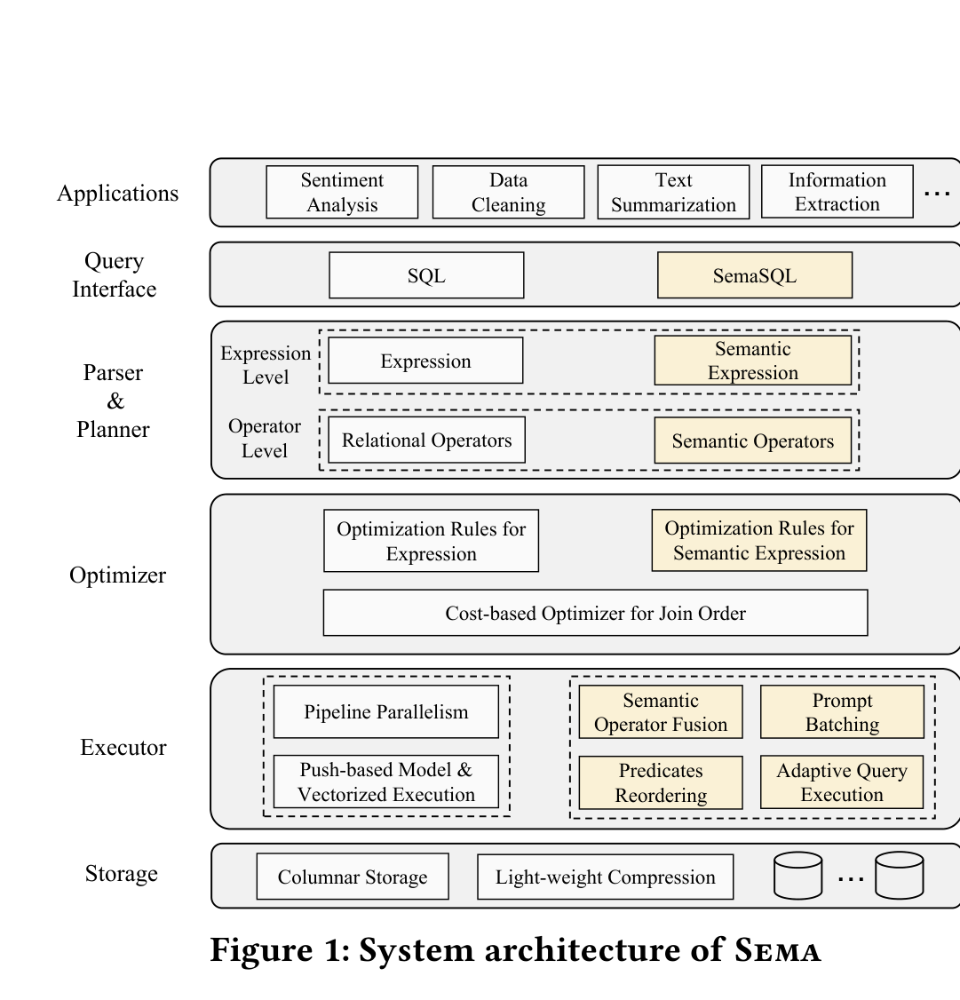
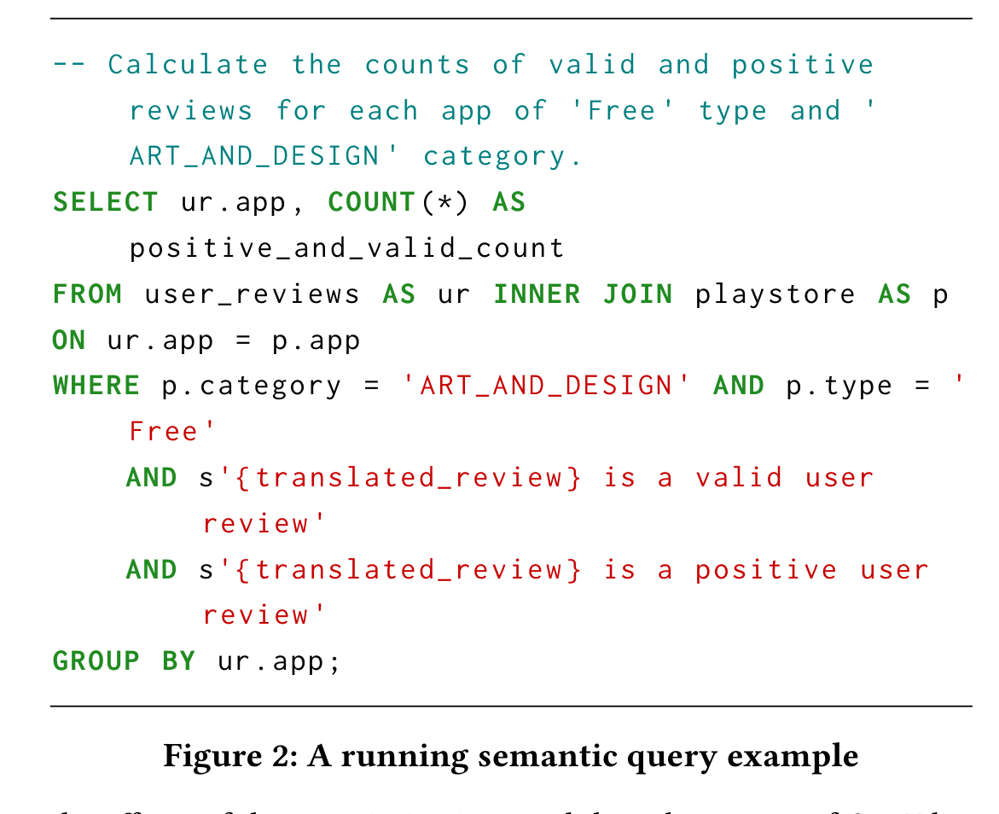
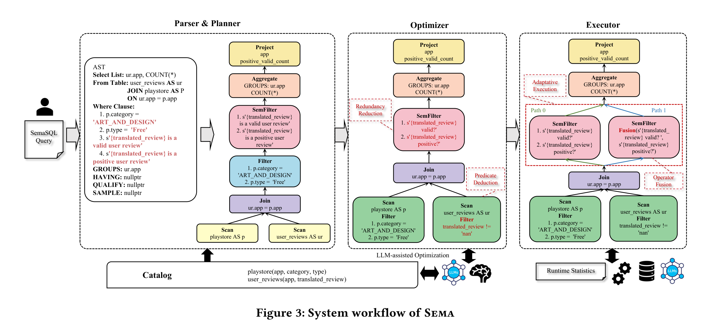
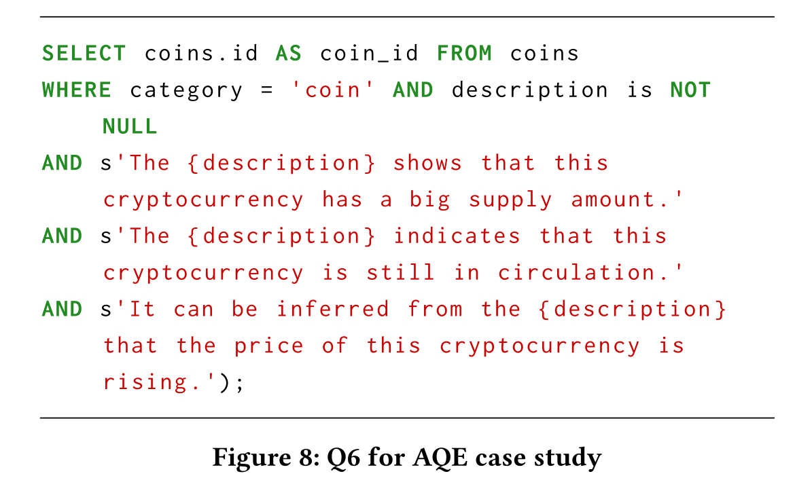
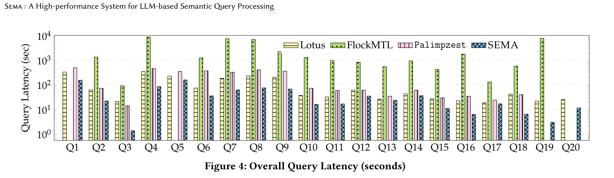
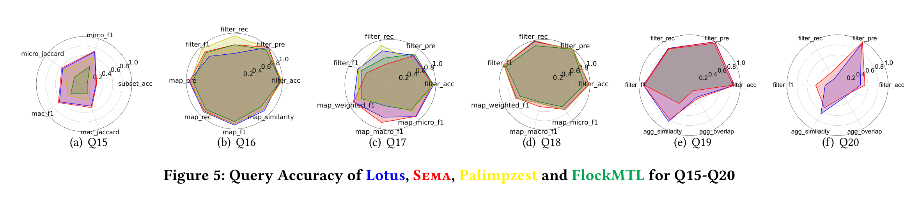
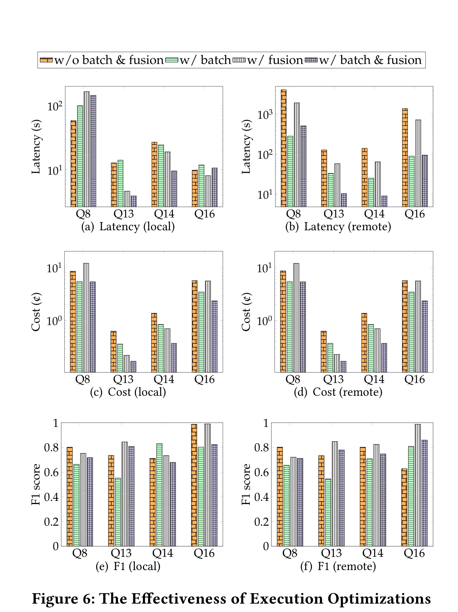
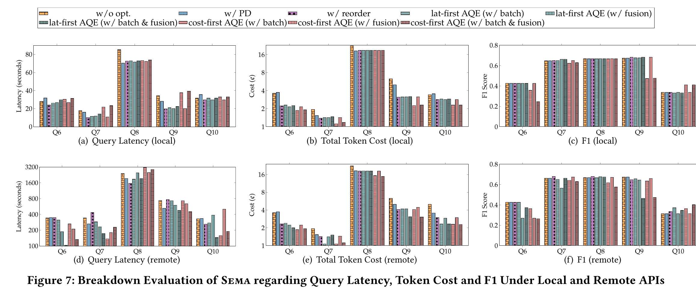

> **论文来源与发表状态**：Kangkang Qi et al., *Sema: A High-performance System for LLM-based Semantic Query Processing*，已被 VLDB 2026 Research Track 录用；本笔记实际精读的全文为 arXiv:2603.11622v1（2026-03-12）。截至 2026-08-24，正式卷期、页码和 DOI 尚未发布。
>
> **证据边界说明**：除明确标注为“笔记分析 / 个人理解”的部分外，正文仅整理 arXiv v1 明确给出的设计、算法、实验和作者结论。VLDB 2026 官方程序把录用版本概括为 26 个语义查询，而 arXiv v1 为 20 个；下文图表、查询编号和细分结果均按实际阅读的 arXiv v1 解读，不把录用版本的新摘要数字反向套入旧全文。
>
> **章节编号说明**：Sema 的实际方法章节为 Section 2–6，实验章节为 Section 7.1–7.5。以下严格按论文原始顺序展开，而不是套用其他论文的章节编号。

## 阅读导航

- 0–3：问题、核心思想与贡献；
- 4–8：严格按 Section 2–6 精读语义算子、SemaSQL、optimizer、executor/AQE 与工程实现；
- 9：严格按 Section 7.1–7.5 整理 dataset、query、baseline、model、metrics、数值与作者结论；
- 10：论文明确限制、笔记分析与原文内部不一致；
- 11–12：个人理解及与数据库 AI 算子执行/调度课题的关系；
- 13 与 Appendix：复习卡片、20 个 query 映射、术语表。

# 0. 一页总览

## 0.1 一句话概括

Sema 的核心不是“给 DuckDB 加几个调用 LLM 的 UDF”，而是把 **LLM-powered semantic operators 作为 query plan 中的一等公民**：用 SemaSQL 表达语义操作，在优化器阶段压缩 Natural Language（NL）expression、从 SemFilter 中推导可下推的 relational predicate，在执行器阶段进行 semantic operator fusion、prompt batching，并通过 Adaptive Query Execution（AQE）在线选择延迟与 token cost 的 Pareto-optimal execution path，同时用 reference path 限制结果偏差。

## 0.2 论文要解决的三个断层

| 断层 | 现有方式 | 论文指出的问题 | Sema 的回答 |
|---|---|---|---|
| 查询表达断层 | DataFrame primitives 或 SQL UDF | 前者与 SQL/DBMS 生态割裂；后者让语义逻辑对 optimizer/executor 不透明 | SemaSQL：在标准 SQL clause 中直接注入 NL expression |
| 系统执行断层 | DataFrame 系统自行重做执行基础设施，或 UDF 黑盒调用 | 难以同时利用 vectorized execution、pipeline parallelism、I/O/memory management 和 query optimization | 将 SemFilter、SemProj、SemJoin、SemOrderBy、SemAgg 作为原生 plan operator 嵌入 DuckDB |
| 优化模型断层 | 传统静态 rewrite 与 cost model | LLM operator 的 selectivity、latency、token cost 和结果偏差依赖 expression、prompt、model 与 serving environment，难以静态估计 | 编译期 NL expression optimization + 运行期 AQE micro-execution |

## 0.3 系统的三层优化

| 层次 | 技术 | 直接目标 |
|---|---|---|
| Query interface / plan | SemaSQL、native semantic operator | 让语义计算进入统一的 SQL plan |
| Logical optimizer | NL Expression Compression、Predicate Deduction | 缩短 prompt；把可确定的必要条件转成 relational filter，减少 LLM invocation |
| Physical executor / runtime | Semantic Operator Fusion、Prompt Batching、Predicate Reordering、AQE | 在 latency、token/monetary cost 与 result consistency 之间在线选 execution path |

## 0.4 主要实验结论

- **版本提示**：以下具体实验结论来自 arXiv v1；VLDB 2026 官方程序中的录用版本摘要已把实验规模更新为 26 个查询，并增加 ranking 类任务。
- 论文在 9 个 BIRD 数据集上设计 20 个 semantic queries，覆盖 classification、summarization 和 extraction。
- 作者报告：相对 Lotus 为约 2–4× speedup，相对 Palimpzest 为约 2–10× speedup；Section 7.2 又报告复杂查询 Q6–Q20 上可达到约 3–6× speedup。Figure 4 没有给出逐柱的精确数值标签。
- Sema 与 Lotus、Palimpzest 的结果质量总体“competitive”，但不是每个查询都最好；FlockMTL 在多数指标上明显较差。
- fusion 与 batching 的收益强烈依赖 serving environment：remote API 中减少 call count 往往同时降低 latency 和 cost；local vLLM 中，更少但更长的 request 可能降低 continuous batching 的调度效率，反而增加 latency。
- AQE 能展示 latency-first 与 cost-first 的可控取舍，但其“accuracy”是相对 reference path 的一致性，不是相对人工 ground truth 的绝对正确率。

## 0.5 最重要的阅读结论

这篇论文真正有价值的地方，是把 semantic query optimization 拆成两个时间尺度：

1. **优化器阶段处理可静态识别的 expression-level 冗余和必要条件**；
2. **执行器阶段用少量真实执行数据估计 selectivity、correlation、latency、token cost 和 result deviation，再做 inter-operator 决策**。

这是一种“compile-time semantic reduction + runtime feedback”的数据库系统设计，而不是单纯的 prompt engineering。

# 1. 论文基本信息

| 项目 | 内容 |
|---|---|
| 题目 | *Sema: A High-performance System for LLM-based Semantic Query Processing* |
| 作者 | Kangkang Qi, Dongyang Xie, Wenbo Li, Hao Zhang, Yuanyuan Zhu, Jeffrey Xu Yu, Kangfei Zhao（corresponding author） |
| 单位 | Beijing Institute of Technology；Wuhan University；The Chinese University of Hong Kong；HKUST (Guangzhou) |
| 年份 | 2026 |
| 当前版本 | arXiv:2603.11622v1，2026-03-12 |
| 会议/期刊 | VLDB 2026 Research Track 已录用，官方程序标记为 REG research paper；截至 2026-08-24，PVLDB 对应卷期、页码和 DOI 尚未发布。当前本地 PDF 为 arXiv v1。 |
| 系统基础 | DuckDB v1.2.2 |
| 推理后端 | 本地 vLLM；远程 OpenRouter API |
| 代码 | Section 9 给出 SemaSystem 的公开代码仓库 |

# 2. 研究背景与问题

## 2.1 为什么需要 semantic query processing

论文面向一种混合分析场景：数据仍以 table/tuple 的形式组织，但某些 predicate、projection、join criterion 或 aggregation criterion 不能由确定性的 SQL expression 表达，而需要 LLM 对文本语义进行判断、抽取、总结或比较。例如：

- 判断一条 review 是否“有效且正面”；
- 从 document content 中抽取关键词；
- 判断两段文本的主题是否相关；
- 按自然语言给定的标准对记录排序；
- 汇总一组论文关键词的主要研究主题。

这些任务要求系统同时处理 relational computation 与 semantic reasoning。

## 2.2 现有两条实现路线及不足

### 路线 A：DataFrame primitives

代表系统包括 Lotus、Palimpzest、Abacus 等。它们把 semantic operators 定义为 DataFrame API 中的自定义 primitive，并可以为这些 primitive 设计专门算法。

论文指出的不足是：轻量 DataFrame/library 通常缺少成熟 DBMS 的 execution infrastructure，开发者需要重新部署或实现 vectorized execution、pipeline parallelism、I/O 和 memory management、query optimization 等能力。

### 路线 B：SQL UDF

另一条路线是在 PostgreSQL/DuckDB 等系统中用 UDF 包装 LLM call。优点是灵活，缺点是 semantic logic 被封装成 optimizer/executor 看不见的 black box：

- 系统无法识别它是 SemFilter、SemProj 还是 SemJoin；
- 无法安全地做 semantic-specific rewrite、fusion、batching 或 runtime reordering；
- 用户承担实现、调试、维护、安全与可靠性成本。

## 2.3 为什么传统 optimizer 不能直接处理 semantic operator

论文在 Section 2.2 强调，semantic operator 与 relational operator 的根本区别不是“它更贵”，而是其语义和代价都不稳定：

1. **结果依赖上下文和模型**：不仅依赖 input tuple，还依赖 NL expression、prompting strategy 和具体 LLM。
2. **缺少稳定 algebraic law**：
   - SemFilter 只有在 tuple-independent prompting、zero-temperature inference 等限制条件下才可能交换；
   - SemProj、SemJoin 的 commutativity/associativity 通常不能保证 semantics-preserving。
3. **静态 selectivity 与 cost 难估计**：延迟、throughput、monetary cost 受 model、prompt、KV cache、Paged Attention、continuous batching、remote network 等影响，不可仅由 database statistics 推出。
4. **优化目标不止 latency**：还包括 token/monetary cost 和 result quality。

因此，把 LLM call 当作普通 expensive UDF 并套用传统规则是不够的。

## 2.4 论文的研究问题

论文实际回答两个问题：

- 如何用与 SQL 兼容的方式表达 semantic query，使 relational operator 与 semantic operator 能进入同一个 query plan？
- 在静态代价不可可靠估计、优化可能改变结果的条件下，如何利用 DBMS execution infrastructure，并在线选择合适的 semantic execution path？

# 3. 核心思想与贡献

## 3.1 核心思想

Sema 采用“**native operator + cross-layer optimization**”路线：

- 语法层：NL expression 是 SemaSQL 的 first-class construct；
- 计划层：semantic operator 是显式 logical/physical plan node；
- 优化器层：对 operator 内部的 NL expression 做 compression 与 predicate deduction；
- 执行器层：对 operator 之间做 fusion、batching、reordering；
- 运行时：用 AQE 对小样本 micro-execution，按 latency/token cost 的 Pareto frontier 选择 path；
- 基础设施层：复用 DuckDB 的 columnar storage、vectorized execution 和 pipeline parallelism。

## 3.2 论文列出的四项贡献

1. 设计并实现基于 DuckDB 的高性能 semantic query engine，把 LLM-powered semantic operators 作为 query plan 中的一等公民。
2. 提出 SemaSQL，用 NL expression 扩展标准 SQL clause，使 semantic 与 relational computation 可组合。
3. 提出 semantic-specific optimization：logical-level expression optimization，以及结合 fusion、batching、reordering 的 runtime AQE。
4. 构建 9 个数据集、20 个查询的 semantic query benchmark，并与 Lotus、Palimpzest、FlockMTL 对比。

# 4. Section 2：Background

## 4.1 形式化记号

- $T(A_1,\ldots,A_j)$：table，$A_j$ 为 attribute。
- $t\in T$：tuple；$t(A_j)$：tuple 在 attribute $A_j$ 上的值。
- $M:\mathcal{T}\mapsto\mathcal{T}$：预训练 LLM，输入输出均在 textual space 中。
- $e$：作为 operator parameter 的 NL expression。

## 4.2 Table 1：五类 Semantic Operators

*原论文 Table 1（PDF p.3）已在下表逐项转写，因此不再重复插入表格截图。*

| Operator | 形式/语义 | Reference Algorithm 的核心做法 | 论文给出的 LLM call 复杂度 |
|---|---|---|---|
| Semantic Filter（SemFilter） | 选择满足 NL predicate 的 tuple | 扫描 $T$，逐 tuple 调用 LLM 返回 True/False | $O(|T|)$ |
| Semantic Projection（SemProj） | 按 NL expression 生成新 textual attribute | 扫描 $T$，逐 tuple 调用 LLM 生成文本 | $O(|T|)$ |
| Semantic Join（SemJoin） | 用 NL predicate 判断两个 tuple 是否可连接 | 对 $T_1\times T_2$ 做 nested-loop，逐 pair 调 LLM | $O(|T_1|\cdot|T_2|)$ |
| Semantic Order By（SemOrderBy） | 按 NL-specified criterion 比较、排序 tuple | Reference Algorithm 为 Selection Sort，LLM 做 pairwise comparison | $O(|T|^2)$ |
| Semantic Aggregate（SemAgg） | 对一组 tuple 按 NL-specified function 汇总 | 把 attribute values 放入一个 prompt，生成聚合结果 | $O(1)$ |

### 关于 SemAgg 的 $O(1)$

Table 1 把 SemAgg 写成一次 LLM call；正文同时说明，如果所有 values 超过模型 context limit，系统会对 subsets 做 hierarchical aggregation。因此，$O(1)$ 是“单 prompt 能容纳全部输入”时的 Reference Algorithm 描述，实际调用次数可能因分层聚合而增加。

## 4.3 各 Reference Algorithm 的输入、步骤与设计理由

### 4.3.1 SemFilter

**输入**：table $T$、一个或多个被 placeholder 引用的 columns、NL predicate $e$、LLM $M$。

**步骤**：

1. 扫描 tuple $t$；
2. 把 $t$ 的相关 attribute value 与 $e$ 组织为 prompt；
3. 要求 $M(t,e)$ 返回 True/False；
4. 保留 True tuple。

**为什么这样设计**：它是最直接、与 predicate 定义一致的 Reference Algorithm，为后续 reordering、fusion、batching 的结果比较提供基准。

### 4.3.2 SemProj

**输入**：$T$、projection expression $e$、LLM $M$。

**步骤**：逐 tuple 调用 $M(t,e)$，生成一个新的 textual attribute；可通过 `AS` 命名，供后续 semantic expression 引用。

**代价**：$O(|T|)$ 次 invocation。

### 4.3.3 SemJoin

**输入**：$T_1,T_2$、semantic join predicate $e$。

**步骤**：Reference Algorithm 枚举 tuple pair $(t_i,t_j)$，由 LLM 判断是否满足 $e$。

**代价**：$O(|T_1||T_2|)$，因此它是潜在最昂贵的 operator 之一。

**论文边界**：本文没有提出专门的 SemJoin algorithm；Section 2.2 明确把 individual operator 的 specialized algorithmic improvement 留给 future work。

### 4.3.4 SemOrderBy

**输入**：$T$、NL comparison criterion $e$。

**步骤**：Reference Algorithm 使用 Selection Sort，LLM 比较 tuple pair 的相对顺序。

**代价**：$O(|T|^2)$ 次 comparison。

**论文边界**：后续 optimizer/executor 主要围绕 SemFilter、SemProj、SemJoin、SemAgg 展开，论文没有进一步优化 SemOrderBy，也没有在 Section 7 benchmark 中单独报告其效果。

### 4.3.5 SemAgg

**输入**：一组 values、NL aggregate expression $e$。

**步骤**：把 values 作为 many-to-one reduce 输入 LLM，生成一个 aggregated result；超出 context 时可层次化聚合。

**论文边界**：Sema 支持 SemAgg，但 AQE 不对 SemAgg 做 runtime reordering/fusion；Palimpzest 因缺少 SemAgg 支持而不能执行 Q20。

## 4.4 Semantic operator 的代数与代价特性

论文没有建立完整的 semantic relational algebra。相反，它强调传统 law 只能在受限条件下成立：

- SemFilter 的 commutativity 取决于 tuple independence、temperature 等条件；
- SemProj 与 SemJoin 的交换/结合一般不保证语义保持；
- cost 由 external inference environment 主导，数据库 statistics 不足以预测。

因此，Sema 选择：

- 对 operator 内部做相对保守的 expression optimization；
- 对 operator 之间可能改变结果的 optimization 延迟到 runtime，并用 reference path 约束 deviation。

## 4.5 Section 2.2 明确限定的研究范围

论文明确说，本工作重点是 semantic operator 在 relational engine 中的 system design 与 end-to-end integration，不试图覆盖全部 production concerns。留给 future work 的内容包括：

- individual operator 的 specialized algorithm；
- storage-level optimization；
- LLM routing 与 model selection；
- external inference 的 privacy、governance、fault tolerance。

# 5. Section 3：System Overview

## 5.1 Figure 1：系统架构



*图源：本地 arXiv v1 PDF Figure 1（PDF p.2），按原图裁切。应自下而上看 Storage、Executor、Optimizer、Parser & Planner、Query Interface 和 Applications 六层，再沿黄色框定位 Sema 对 DuckDB 的扩展点。该图说明组件放在哪里以及哪些部分被扩展，不是性能分解图，也不能据此判断每次查询都会启用所有黄色机制。*

Figure 1 把 Sema 分为六层：

1. **Applications**：sentiment analysis、data cleaning、text summarization、information extraction 等。
2. **Query Interface**：标准 SQL 与 SemaSQL 共存。
3. **Parser & Planner**：
   - expression level 同时识别普通 expression 与 semantic expression；
   - operator level 同时生成 relational operator 与 semantic operator。
4. **Optimizer**：保留 DuckDB 对普通 expression、join order 的优化，并新增 semantic expression rules。
5. **Executor**：保留 pipeline parallelism、push-based model、vectorized execution，并新增 semantic operator fusion、prompt batching、predicate reordering、AQE。
6. **Storage**：沿用 columnar storage 和 lightweight compression。

该图表达的关键点是：Sema 不是在 executor 末端调用一个外部脚本，而是同时扩展 query interface、parser/planner、optimizer 和 executor。

## 5.2 SemaSQL 的设计原则

Section 3.1 给出三个原则：

- **Transparency**：用户不需要了解底层 implementation 与 optimization。
- **Flexibility**：NL expression 能表达足够广泛的 semantic intent。
- **Compatibility**：尽量保持 SQL 语法与数据库实现兼容。

## 5.3 NL expression 与 SQL clause 的映射

SemaSQL 的 first-class construct 是带 placeholder 的 NL expression：`s'...{column}...'`。placeholder 指向 column/attribute 或其自然语言描述。

| SQL 位置 | 隐式 semantic operator | 说明 |
|---|---|---|
| `SELECT s'...' AS new_col` | SemProj | 生成新的 textual column，可由 `AS` 命名 |
| `WHERE s'...'` / `HAVING s'...'` | SemFilter | LLM 评估 NL predicate |
| `JOIN ... ON s'...'` | SemJoin | 可与 INNER/OUTER/SEMI JOIN 等组合 |
| `sem_agg(s'...')` | SemAgg | 可与 `GROUP BY` 组合 |

论文实现了 SemOrderBy，但 Section 3.1 没有给出它对应的 SemaSQL 语法或示例；论文也没有在 Appendix A 中给出 SemOrderBy query。

SemaSQL 还声称支持 subquery、CTE、window function 等复杂 SQL syntax。它与 NL2SQL 不同：NL2SQL 把完整自然语言转换为 SQL，而 SemaSQL 只在 SQL 内部插入 NL expression，仍保留 SQL 的 symbolic structure。

## 5.4 Figure 2 的 running example



*图源：本地 arXiv v1 PDF Figure 2（PDF p.4），按原图裁切。绿色是 SQL 关键字，黑色是 relation/column 与普通表达式；红色同时标出字符串常量和两个 `s'...'` NL expression，因此应以 `s` 前缀而不是只凭颜色识别 SemFilter。它说明 SemaSQL 怎样把关系计算和语义判断写进同一查询；这仍是语法与 running example，不是优化后的物理计划。*

论文示例查询对 `user_reviews` 与 `playstore` 做 relational join，先使用普通 predicate 限定 `category='ART_AND_DESIGN'`、`type='Free'`，再对 `translated_review` 施加两个 SemFilter：

```sql
AND s'{translated_review} is a valid user review'
AND s'{translated_review} is a positive user review'
```

最后按 app 分组计数。该例同时包含 relational filter、relational join、SemFilter 与 aggregate，适合展示 Sema 的 cross-layer workflow。

## 5.5 Figure 3：端到端 workflow



*图源：本地 arXiv v1 PDF Figure 3（PDF p.5），按原图裁切。按左上输入查询 → Parser & Planner → Optimizer → Executor 的方向阅读：中间绿色 Filter 是 Predicate Deduction 产生的关系谓词，右侧分支则展示 reference、reorder、fusion 与 batch 等候选执行路径。该图把候选机制放在同一工作流中，但不表示每个查询都会生成或最终选择全部候选。*

Figure 3 可按以下顺序理解：

1. **Parser & Planner**：解析 SemaSQL，生成 AST 与 initial logical plan；两个 NL predicate 被识别为显式 SemFilter plan node。
2. **Redundancy Reduction / Expression Compression**：把冗长 expression 压缩为 `valid?`、`positive?` 等更短形式。
3. **Predicate Deduction**：从“valid review”中推导 `translated_review != 'nan'`，生成普通 Filter，并下推到 scan 之后。
4. **Conventional SQL optimization**：普通 relational filter、join、aggregate、project 继续由 DuckDB 优化。
5. **Adaptive Execution**：executor 对 SemFilter 的 order、fusion、batching 形成候选 path，micro-execute 并选定 path。
6. **Operator Fusion**：可把两个 SemFilter 合成一个 fused SemFilter。
7. **Runtime statistics**：selectivity、latency、token cost 和 result consistency 反馈给 AQE。

# 6. Section 4：The Optimizer of Sema

## 6.1 优化目标与位置

Sema optimizer 的直接目标是：**在不主动牺牲 accuracy 的前提下减少 LLM invocation overhead**。

论文把 LLM-assisted semantic expression optimization 放在 conventional SQL rule-based optimization 之前。原因是：只有先把 NL expression 中可静态转化的部分暴露成 relational predicate，后续 optimizer 才能利用 predicate pushdown 等成熟规则。

## 6.2 NL Expression Compression（EC）

### 输入

一个 semantic operator 内的任意 NL expression。

### 步骤

1. 调用一个 lightweight auxiliary LLM；
2. 使用带 demonstration 的 Chain-of-Thought prompt；
3. 按多条规则去除 stop words；
4. 简化 sentence structure，例如 passive voice 转 active voice；
5. 合并对同一 placeholder 的重复 pronoun/reference；
6. 输出更短、更清晰的 expression。

### 代价

每个 semantic operator 额外一次 auxiliary LLM call。

### 设计理由

同一 expression 会随大量 tuple 重复进入 prompt。即使 compression 本身需要一次 call，只要减少的 per-tuple token 足够多，整体 token cost 可能下降。

### 论文没有证明的内容

论文没有给出 EC 的形式化 semantic equivalence guarantee。Table 4 直接用实验质量指标检查其影响；结果也显示 EC 并非在每个查询上都完全不改变质量。

## 6.3 Predicate Deduction（PD）

### 目标

把 SemFilter 的 entire 或 partial NL expression 转成 cheap SQL predicate，让 CPU 先排除必然不满足语义条件的 tuple，减少后续 LLM call。

### Entire deduction 与 partial deduction

- **Entire deduction**：整个 NL predicate 可由 SQL expression 表达，直接绕过 LLM。
- **Partial deduction**：只推导一个 **necessary condition**。SQL predicate 只负责过滤必然失败的 tuple，剩余语义仍由更短的 SemFilter 判断。

partial deduction 是论文强调的区别：它不是把 NL expression 完整翻译成 SQL，也不是用已知“好值”做 sufficient-condition whitelist。

### 支持的 predicate 类型

论文实现：

- categorical matching；
- numeric comparison；
- string `LIKE` operation。

### 输入

- 压缩后的 NL expression；
- database schema；
- column metadata/statistics。Appendix prompt 明确提到 nullable、distinct count 和 top-5 frequent values。

### 详细步骤

1. CoT prompt 抽取 expression 涉及的 table 与 column；
2. 判断 intent 是否是 objective comparison；
3. 判断能否映射到 symbolic comparison pattern；
4. 生成 DuckDB SQL predicate 的 string/JSON array；
5. 做语法有效性检查；
6. 用另一个 CoT prompt 做 back-forward self-reflection，判断 candidate 是否为原 NL expression 的 necessary condition；
7. 验证失败则回退到原 SemFilter；
8. 验证通过则把 predicate 放入 relational plan，并利用 pushdown 提前过滤。

### 为什么强调 necessary condition

若原语义条件为“review 是 positive and meaningful”，`Review != 'nan'` 可以作为必要条件：不满足它的 tuple 可安全排除；而 `Review = 'Good'` 只是一个可能的 sufficient condition，会错误排除其他 positive review，因此不能作为 pushdown filter。

## 6.4 Example 4.1

Figure 3 的 `translated_review` column 中约 41.8% entry 为字符串 `'nan'`。用户只写了“is a valid user review”，但 optimizer 结合 metadata 推导：

```sql
translated_review != 'nan'
```

该 predicate 被下推到 `user_reviews` scan 后。论文声称这样可在进入 SemFilter 前删除大量 tuple，从而绕过相应 LLM invocation。

## 6.5 Algorithm 2：Natural Language Expression Reduction

Algorithm 2 的接口是：

- **Input**：`userInputNLE`
- **Output**：`processedNLE`

其伪代码先调用 `AssessDbReduction`，若不可 reduction 则返回 cleaned NLE，否则调用 `ExpressionReduction`。

需要注意：Algorithm 2 只是高度概括的 wrapper；它没有展开 Section 4 描述的 schema reasoning、candidate SQL generation、syntax validation、necessary-condition verification 和 fallback，也出现了未在算法内定义的 `cleanedNLE`。因此，真正的 PD 过程主要依赖正文与 Appendix prompt，而不能仅从 Algorithm 2 完整复现。

## 6.6 Optimizer 阶段真正保证了什么

论文的系统机制是“生成 candidate + LLM self-reflection + failure fallback”，而不是形式化证明。也就是说：

- 论文意图保持 necessary-condition safety；
- 但 correctness 仍依赖 auxiliary LLM 对 deduction 和 verification 的判断；
- 论文没有给出对所有 expression 的 soundness proof。

# 7. Section 5：Execution Optimization

## 7.1 Section 5.1：Physical Optimization

### 7.1.1 Semantic Operator Fusion

#### 基本思想

普通 operator fusion 通常通过 code generation 把多个 operator 编译成一段代码；Sema 的 semantic fusion 是把相邻 operator 的 NL expressions 合并为一个 expression，使每个 tuple 只进行一次 LLM inference。

#### 支持范围

Sema 只支持同一 pipeline、同一 table 上两个 unary operator 的四种模式：

| 模式 | 含义 |
|---|---|
| $\sigma_a\oplus\sigma_b$ | SemFilter → SemFilter |
| $\Pi_a\oplus\Pi_b$ | SemProj → SemProj |
| $\sigma_a\oplus\Pi_b$ | SemFilter → SemProj |
| $\Pi_a\oplus\sigma_b$ | SemProj → SemFilter |

论文没有融合 SemJoin、SemAgg、SemOrderBy，也限制一次只融合两个 operator。

#### 匹配条件

- SemFilter-first pattern：两个 expression 的 placeholder 需要引用共同 attribute。
- SemProj-first pattern：前一个 SemProj 用 `AS` 产生 intermediate column，后一个 operator 的 expression 引用该 column。

#### 执行步骤

1. 识别连续 operator 是否匹配四种 pattern；
2. concatenates 两个 NL expressions；
3. 加入 step-by-step processing instruction；
4. 生成一个 fused semantic operator 替换原两个 operator。

#### Table 2 的 LLM call 数量

| Pattern | Original | Fused |
|---|---:|---:|
| $\sigma_a\oplus\sigma_b$ | $2|T|$ | $|T|$ |
| $\Pi_a\oplus\Pi_b$ | $2|T|$ | $|T|$ |
| $\sigma_a\oplus\Pi_b$ | $(1+s)|T|$ | $|T|$ |
| $\Pi_a\oplus\sigma_b$ | $(1+s)|T|$ | $|T|$ |

其中 $s$ 被正文定义为 first SemFilter 在 $T$ 上的 selectivity。

> **原文一致性提醒**：Table 2 与紧随其后的文字并不完全一致。正文说“SemProj-first pattern 节省 $|T|$，SemFilter-first pattern 节省 $s|T|$”，但 Table 2 的四列不能统一推出这一描述，尤其 $\sigma_a\oplus\sigma_b$ 与 $\Pi_a\oplus\sigma_b$ 的公式/分类存在歧义。论文没有进一步解释，本笔记保留原表，不自行修正。

#### Example 5.1

两个 filter：

- `translated_review is valid`
- `translated_review is positive`

被合并为：

- `translated_review is valid and positive`

随后用一个新的 SemFilter 替代原 operator flow。

### 7.1.2 Prompt Batching

Sema 在 DuckDB vectorized execution 的基础上，将多个 tuple 放入一个 LLM prompt；支持 SemFilter、SemProj、SemJoin。

**目标**：减少 API call count，提高 token utilization 和 throughput。

**结构化输出约束**：LLM API 的返回值被要求为 JSON Array，并要求结果数量与 batch tuple 数量一致。

### 7.1.3 Fusion/Batching 的一致性保护

fusion 与 batching 都打破了 operator-independent、tuple-independent execution，可能改变 LLM 输出。Sema 做三项限制：

1. batching 使用结构化 JSON Array；
2. 对 SemFilter-first fusion，combined prompt 要求显式输出 first operator 的 intermediate result，以尽量保持原 flow 的 evaluation consistency；
3. SemFilter 允许用户给出 result consistency tolerance，交给 AQE 选择实际 path。

论文没有把这些措施描述为形式化等价保证。

## 7.2 Section 5.2：Adaptive Query Execution for SemFilter

### 7.2.1 为什么需要 AQE

静态 optimizer 难以预测：

- SemFilter selectivity；
- 各 path latency；
- input/output token 与 monetary cost；
- fusion/batching 引起的 result deviation。

因此，Sema 把 reordering、fusion、batch prompting 推迟到 runtime，先在少量数据上执行候选 path，再对剩余数据 exploit。

### 7.2.2 优化目标

AQE 在 **query latency** 与 **token/monetary cost** 的二目标空间中求 Pareto frontier，并以用户给定的 accuracy inconsistency tolerance 为约束。

由于真正 ground truth 通常不可提前获得，Sema 使用一个 **reference path** 产生 proxy ground truth。reference path 通常是 optimizer 产生的、保持原 operator order、不开 fusion 与 batch prompting 的 path。

因此，这里的 accuracy 表示“候选 path 与 reference path 的一致程度”，不是对真实语义标签的绝对 accuracy。

## 7.3 Algorithm 1：AQE 总流程

*原论文 Algorithm 1（PDF p.7）已在下文按输入、三个阶段与结果组成完整转写，因此不再重复插入伪代码截图。*

### 输入

- input chunks $D$；
- expression exploration limit；
- path exploration limit。

### 三阶段

#### Phase 1：Expression Exploration

在一小部分 $\delta_1$ tuples 上独立执行每个 SemFilter，收集 selectivity、boolean result vector 与 pairwise MCC。

#### Phase 2：Path Exploration

根据 Phase 1 statistics 生成候选 path，在另一小部分 $\delta_2$ tuples 上测量 latency、token cost 和相对 accuracy，过滤不满足 $\tau_{acc}$ 的 path，构造 Pareto frontier。

#### Phase 3：Path Exploitation

用选出的 $p^\star$ 处理剩余 $1-(\delta_1+\delta_2)$ 数据。

### 最终 query result 的组成

论文明确说明最终结果不是只来自 exploitation，而是三段结果 concatenation：

1. Phase 1：对 $\delta_1$ tuples 独立执行所有 SemFilter，并取结果 intersection；
2. Phase 2：对 $\delta_2$ tuples 由 reference/candidate evaluation 产生结果；
3. Phase 3：剩余 tuples 使用 $p^\star$。

> **原文一致性提醒**：Algorithm 1 的 input 把 `path_limit` 写成 $\delta_2|D|$，并用 `n < path_limit` 作为第二阶段边界；正文和 Section 7.5 却把 $\delta_2$ 解释为“额外的 path-exploration fraction”，且使用 $1-(\delta_1+\delta_2)$。若严格按伪代码，第二阶段长度会变成 $\delta_2-\delta_1$。论文没有说明 `path_limit` 是否实际应为 $(\delta_1+\delta_2)|D|$。

## 7.4 Phase 1：Expression Exploration（Algorithm 3）

### 输入

- SemFilter sequence $\Sigma=\{\sigma_1,\ldots,\sigma_n\}$；
- sample chunk $D_1$。

### 步骤

1. 对每个 $\sigma_i$ 独立执行 `ExecutePredicate`；
2. 得到 boolean vector $R[i]$；
3. 用 True 比例估计 selectivity $s_i$；
4. 对每一对 filter 统计 TP/TN/FP/FN；
5. 计算 Matthews Correlation Coefficient（MCC）。

### 输出

- selectivity vector $S$；
- result vectors $R$；
- pairwise MCC matrix。

### 为什么用 MCC

论文把 MCC 当作 fusion potential 的统计 proxy：

- MCC = 1：绝对正相关；
- MCC = -1：绝对负相关；
- MCC = 0：随机关联。

只有 MCC 大于 threshold 的 filter pair 才进入 fusion candidate set。论文没有证明高 MCC 必然使 fusion 保持语义，只把它作为动态剪枝 heuristic。

## 7.5 Phase 2：Path Generation 与 Exploration（Algorithms 4–5）

### Reference path 与 base path

- $p_{ref}$：保持 SemaSQL 中用户给出的 SemFilter order；不开 fusion/batch。
- $p_{base}$：按 selectivity 升序排列 filter，使更 selective 的 predicate 更早执行，减少下游 tuple 数。

### Fusion candidate

若 $MCC(\sigma_i,\sigma_j)>\tau$：

1. 合并为 $\sigma_{i\oplus j}$；
2. 把 fused selectivity 设为 $\min(s_i,s_j)$；
3. 每个 candidate path 最多引入一次 fusion；
4. 对 $n$ 个 filter，最多生成 $n(n-1)/2$ 个含 $n-1$ operator 的 fusion path；
5. reference/base/fusion path 都再生成 batch prompting counterpart。

### Micro-execution 与动态剪枝

在 $D_2$ 上执行 candidate：

- 收集 latency、token consumption、selection result；
- 与不 batching 的 $p_{ref}$ 比较 F1/Accuracy；
- 低于 $\tau_{acc}$ 的 path 被丢弃。

两条动态剪枝规则：

1. 若 batched reference path 自身低于 accuracy threshold，则不探索所有 batched path；
2. 若某 fusion path 不达标，则跳过它的 batched counterpart。

### Pareto selection

在 latency–token cost 二维空间求 non-dominated set；根据用户 preference 选 latency-first 或 token/cost-first path。

> **Algorithm 5 的缺口**：伪代码把 $\tau_{acc}$ 作为 input，却没有显式执行“discard acc below threshold”；最后固定写成 `arg min latency`，而正文说也可选择 minimum cost。完整逻辑依赖正文描述，而非 Algorithm 5 单独可复现。

## 7.6 Phase 3：Path Exploitation

$p^\star$ 处理剩余 bulk data。作者认为探索成本可由大规模 exploitation 摊销，并在 Table 6 中报告 exploration time 相对较小。

## 7.7 Q6 AQE Case Study（Figure 8、Table 5）



*图源：本地 arXiv v1 PDF Figure 8（PDF p.11），按原图裁切。绿色是 SQL 关键字；先看黑色关系条件如何限定 `category='coin'` 且 description 非空，再把三个带 `s` 前缀的红色 NL expression 分别对应为“大供应量”“仍在流通”“价格上涨”三个 SemFilter。查询文本本身没有显示 AQE 选择了哪条路径；reorder、fusion 和 batching 的选择必须结合下方 Phase 1 统计与 Table 5 的 micro-execution 结果判断。*

Q6 包含三个 SemFilter：

- $\sigma_1$：cryptocurrency has a big supply amount；
- $\sigma_2$：still in circulation；
- $\sigma_3$：price is rising。

### Phase 1 statistics

在 $1/32$ subsample（27 rows）上：

- $s(\sigma_1)=0.66$；
- $s(\sigma_2)=0.77$；
- $s(\sigma_3)=0.22$；
- $MCC(\sigma_1,\sigma_2)=0.755$；
- $MCC(\sigma_1,\sigma_3)=0.377$。

论文据此说明 $\sigma_3$ 最 selective 且较独立，并生成 reorder/fusion/batch candidates。

### Table 5：候选 path 的 micro-execution 结果

| Description | Path | Relative Acc. | Latency | Cost |
|---|---|---:|---:|---:|
| $[\sigma_3,\sigma_1,\sigma_2]$ | $p_1$ | 100.00% | 0.997 s | $0.0008 |
| 同上 + batch | $p_{b1}$ | 94.04% | 1.936 s | $0.0006 |
| $[\sigma_2\oplus\sigma_3,\sigma_1]$ | $p_2$ | 100.00% | 0.504 s | $0.0007 |
| 同上 + batch | $p_{b2}$ | 91.66% | 1.412 s | $0.0005 |

作者据此报告：$p_2$ 相对 $p_1$ latency 降低约 49%，cost 降低约 9%，accuracy 保持 100%。local setting 下 batching 因 request 更长、并发下降，latency 反而更高。

### Case study 中的原文不一致

1. 已报告的强相关 pair 是 $(\sigma_1,\sigma_2)$，但实际 fusion path 是 $\sigma_2\oplus\sigma_3$；论文没有报告 $MCC(\sigma_2,\sigma_3)$，因此无法从给出的数值验证该 fusion 的触发依据。
2. Table 5 中 $p_{b2}$ 同时比 $p_{b1}$ latency 更低、cost 更低，且两者 accuracy 都高于 0.80；按表格，$p_{b2}$ 应支配 $p_{b1}$。正文却说 $p_{b1}$ 与 $p_2$ 在 Pareto frontier，并在 cost-first 时选择 $p_{b1}$。论文没有解释该矛盾。
3. 正文一句把 batched paths 写成“$p_{b1}$ and $p_{b1}$”，应为明显排版/笔误，但本笔记不据此改动算法结论。

## 7.8 AQE 的当前实现边界

论文明确限定：

- AQE 只支持 DuckDB 单一 execution pipeline 内的 SemFilter；
- 不支持跨多个 pipeline 的复杂 operator runtime optimization；
- 更复杂 operator 会带来 context switch 与 implementation overhead；
- 每个 candidate path 最多一次 fusion；
- ground truth 是 reference path 的 proxy result。

# 8. Section 6：Engineering Details

## 8.1 Concurrent LLM Invocations

Sema 在 DuckDB morsel-driven pipeline engine 中加入 thread-local concurrent I/O：

1. DuckDB 把工作切成处理小 batch tuple 的 morsel；
2. central scheduler 把 morsel 动态分给 worker thread；
3. 每个 worker thread 持有独立 CURL multi-handle，作为私有 HTTP connection pool；
4. worker 在 morsel loop 内发出 LLM API request；
5. CURL multi-handle 提供 non-blocking progress 与 connection reuse；
6. 避免 cross-thread synchronization，使多个 worker 并发管理 LLM request。

作者认为这使 Sema 保留 DuckDB 的 fine-grained parallelism，并同时适配 compute-bound 与 I/O-bound workload。

## 8.2 Pipeline-Parallel AQE

Sema 实现自定义 physical operator `PhysicalSemAdaptiveFilter`，把三阶段 AQE 与 streaming execution 合并。

- 使用 DuckDB `NEED_MORE_INPUT` / `HAVE_MORE_OUTPUT` primitive 做 progressive data slicing；
- 多个 executor 在 disjoint partition 上并行；
- thread-local state 保存 expression evaluator、intermediate buffer；
- shared global state 汇总 selectivity、latency、token cost；
- atomic update 进行轻量协调；
- global controller 把 refined execution choice 传播给各 thread。

其设计目标是“global coordination with local autonomy”，在保持 DuckDB streaming、memory-efficient model 的同时做 runtime adaptation。

## 8.3 工程设计的含义

Sema 的 semantic optimization 并不是离线生成一个 plan 后串行调用 API。它把 LLM request 放入 DuckDB 原有 pipeline scheduler，让 relational scan/filter/join 与 semantic operator 共享一个 execution model；这也是作者把性能优势归因于 vectorized execution、pipeline parallelism 和 asynchronous execution 协同的原因。

# 9. Section 7：System Evaluation

## 9.1 Section 7.1：Experimental Setup

### 9.1.1 Datasets（Table 7）

论文使用 BIRD 中 9 个数据库：

| Dataset | # Tables / 主要规模 | 关键文本属性 | Queries |
|---|---|---|---|
| Appstore | user_review 10,840；playstore 64,286 | `Translated_Review` | Q7, Q8 |
| Chicago_Crime | IUCR 401 | primary/secondary description、index code | Q3 |
| Superstore | product 5,298 | productName、category | Q2 |
| Food_Inspection | violations 36,050 | description、risk_category | Q4 |
| Food_Inspection_2 | violation 525,709 | inspector_comment、fine | Q5 |
| Social_Media | twitter 99,901；user 99,260；location 6,211 | twitter.text | Q1, Q9, Q16–Q18 |
| Movies_4 | 7 tables；movie 4,627，另有 country/genre/language 等 | movie.overview | Q10, Q13–Q15 |
| CoinMarketCap | coins 8,927；historical 4,441,972 | coins.description | Q6, Q11, Q12 |
| Authors | Paper 2,254,920；PaperAuthor 2,315,574；另有 Journal/Conference/Author | Paper.Keyword、Paper.Title | Q19, Q20 |

### 9.1.2 Benchmark queries（Table 8）

| Category | Operator flow | Query ID |
|---|---|---|
| Single SemFilter/SemProj | Single Operators | Q1–Q5 |
| Consecutive SemFilter | Filter → Filter | Q6–Q10 |
| SemProj-first | Proj → Filter | Q11–Q13 |
| SemProj-first | Proj → Proj | Q14–Q15 |
| SemFilter-first | Filter → Proj | Q16–Q18 |
| SemFilter-first | Filter → Aggregate | Q19–Q20 |

Section 7.1 的一段 prose 对 Q14–Q20 的分类出现重复/错位；Table 8 与 Appendix C 的 query 本身更清楚，本笔记按 Table 8 记录。

### 9.1.3 Ground truth

- Q1–Q5：来自 original datasets；
- Q6–Q20：默认由 reference LLM Gemma-3 27B 的 inference result 生成。

这意味着 Q6–Q20 的 quality evaluation 主要衡量系统输出与 reference model output 的一致性，而不是人工标注的客观真值。

### 9.1.4 Metrics

- Q1–Q14：single-label multi-class classification，报告 Accuracy、Precision、Recall、F1。
- Q15：multi-label multi-class，报告 subset Accuracy、micro/macro F1、micro/macro Jaccard。
- Q16：先评估 SemFilter binary classification，再评估 keyword extraction 的 macro P/R/F1 与 Jaccard/similarity。
- Q17–Q18：先评估 filter，再评估 downstream classification 的 weighted/micro/macro F1。
- Q19–Q20：先评估 filter，再以 word overlap/similarity 评估 aggregation/summarization。
- 效率：query latency、LLM invocation count、input/output token、API cost（¢）。

论文没有在 Section 7.1 说明 Q1–Q14 的 Precision/Recall/F1 使用 macro、micro 还是 weighted averaging；Table 3 只给出数值。

### 9.1.5 Baselines

| System | 论文定位 | Vectorized | Pipeline Parallelism | Async |
|---|---|---:|---:|---:|
| Lotus | Pandas/DataFrame semantic operator system | ✓ | ✗ | ✓ |
| FlockMTL | DuckDB 内以 UDF 实现 semantic operator | ✗ | ✓ | ✗ |
| Palimpzest | 带 cascaded optimizer 的 AI analytics pipeline | ✗ | ✓ | ✓ |
| Sema | DuckDB native semantic operator | ✓ | ✓ | ✓ |

Palimpzest 使用 `MinTime` optimizer policy。

### 9.1.6 Models、software 与 hardware

- Sema 基于 DuckDB v1.2.2；
- local inference：vLLM；remote：OpenRouter；
- Google Gemma-3 4B、12B、27B；temperature = 0；
- `tensor_parallel_size=4`，bfloat16，GPU memory utilization 0.9；
- server：4× NVIDIA RTX 5090、AMD EPYC 9554（64 cores）、503 GB RAM；
- remote price：
  - Gemma-3 12B：$0.04 / million input tokens，$0.13 / million output tokens；
  - GPT-4.1：$2 / million input，$8 / million output。

## 9.2 Section 7.2：Overall Quality & Efficiency

### 9.2.1 模型配置

- Q1–Q5：Gemma-3 4B；
- Q6–Q20：Gemma-3 12B；
- 所有系统使用 local vLLM，以减小 network fluctuation。

### 9.2.2 Figure 4：Overall Query Latency



*图源：本地 arXiv v1 PDF Figure 4（PDF p.9），按原图裁切。横轴为 Q1–Q20，纵轴是对数刻度的秒数；每个 query 内比较 Lotus、FlockMTL、Palimpzest 与 Sema 的柱高，缺柱表示该系统不支持该查询。对数轴适合看数量级差异，但柱上没有精确标签，因此不能从像素高度反推逐查询秒数或额外精确 speedup。*

作者结论：

- Sema 在全部 20 个 query 上 latency 最低；
- 对复杂 Q6–Q20，最高约 3–6× speedup；
- Abstract/Introduction 给出的总体表述为：对 Lotus 约 2–4×，对 Palimpzest 约 2–10×。

作者将差异归因于：

- Sema 同时有 vectorized execution、pipeline parallelism、async invocation；
- Lotus 缺 pipeline parallelism；
- FlockMTL 缺 vectorized 与 async；
- Palimpzest 缺 vectorized execution。

Figure 4 只有柱状图，没有逐查询精确 latency 表，因此本笔记不从图上反向估计具体秒数。

### 9.2.3 Table 3：Sema 在 Q1–Q14 的精确质量指标

| Query | Acc. | Pre. | Rec. | F1 |
|---|---:|---:|---:|---:|
| Q1 | 0.9934 | 1.0000 | 0.9934 | 0.9967 |
| Q2 | 0.7369 | 0.8154 | 0.7369 | 0.7407 |
| Q3 | 0.7124 | 1.0000 | 0.7124 | 0.8320 |
| Q4 | 0.4428 | 0.7349 | 0.4428 | 0.4878 |
| Q5 | 0.1265 | 1.0000 | 0.1265 | 0.2245 |
| Q6 | 0.7030 | 1.0000 | 0.2693 | 0.4243 |
| Q7 | 0.8148 | 0.7825 | 0.5715 | 0.6606 |
| Q8 | 0.8426 | 0.6958 | 0.7375 | 0.7160 |
| Q9 | 0.9955 | 0.3636 | 0.1538 | 0.2162 |
| Q10 | 0.9543 | 0.9364 | 0.4873 | 0.6410 |
| Q11 | 0.9651 | 0.9740 | 0.8598 | 0.9133 |
| Q12 | 0.7273 | 0.6082 | 0.4683 | 0.5292 |
| Q13 | 0.7315 | 0.9012 | 0.6834 | 0.8883 |
| Q14 | 0.7570 | 0.7954 | 0.7570 | 0.7563 |

### 9.2.4 Q1–Q14 的 F1 横向对比

#### Q1–Q7

| System | Q1 | Q2 | Q3 | Q4 | Q5 | Q6 | Q7 |
|---|---:|---:|---:|---:|---:|---:|---:|
| Lotus | 0.9970 | 0.7450 | 0.8343 | 0.4534 | 0.4662 | 0.4078 | 0.7180 |
| FlockMTL | – | 0.7994 | 0.3732 | 0.4543 | – | 0.5017 | 0.3557 |
| Palimpzest | 0.9723 | 0.4022 | 0.9705 | 0.2326 | 0.7341 | 0.4201 | 0.7480 |
| Sema | 0.9967 | 0.7407 | 0.8320 | 0.4878 | 0.2245 | 0.4243 | 0.6606 |

#### Q8–Q14

| System | Q8 | Q9 | Q10 | Q11 | Q12 | Q13 | Q14 |
|---|---:|---:|---:|---:|---:|---:|---:|
| Lotus | 0.7670 | 0.1875 | 0.5356 | 0.5648 | 0.5035 | 0.7666 | 0.7115 |
| FlockMTL | 0.1083 | 0.1429 | 0.2949 | 0.1360 | 0.3664 | 0.8115 | 0.7249 |
| Palimpzest | 0.7272 | 0.2632 | 0.7166 | 0.8562 | 0.5532 | 0.7912 | 0.6543 |
| Sema | 0.7160 | 0.2162 | 0.6410 | 0.9133 | 0.5292 | 0.8883 | 0.7563 |

这些数值支持“competitive”而不是“全面更准确”：例如 Sema 在 Q11、Q13、Q14 表现突出，但 Q5 明显低于 Lotus/Palimpzest，Q7/Q8/Q10 也不是最高。

### 9.2.5 Q15–Q20



*图源：本地 arXiv v1 PDF Figure 5（PDF p.9），按原图裁切。六个雷达图分别对应 Q15–Q20，轴名会随查询任务变化，应在同一个面板内比较四个系统在各指标上的轮廓；不同面板的指标数量与含义并不相同，不能用多边形面积跨 query 排名。该图支持“质量竞争性且各有优劣”的定性判断，不提供可可靠反推的精确数值。*

Figure 5 用 radar charts 展示多种 filter/downstream 指标，但论文没有把精确数值列成表格。作者结论是：

- Sema、Lotus、Palimpzest 在大多数指标上整体可比，不同 query 各有优势；
- small prompt-format differences 会引起输出波动；
- FlockMTL 几乎在所有指标上更差。

本笔记不对 radar chart 做未经论文提供的精确数字反推。

### 9.2.6 Baseline 支持范围的原文不一致

- Table 3 caption 写 FlockMTL 不支持 Q1、Q5、Q20；
- Section 7.2 prose 写 FlockMTL 不支持 Q1、Q5、Q19、Q20；
- 同段又说原因是 columns 包含 multiple data types。

论文没有统一这两个列表。Palimpzest 不支持 Q20 的原因则写得明确：缺少 SemAgg。

### 9.2.7 这一实验真正证明了什么

在作者的单机 4×RTX 5090、Gemma-3、local vLLM 配置下，native integration 与 DuckDB execution infrastructure 能显著降低这 20 个 query 的 end-to-end latency，同时没有系统性地把结果质量降到低于 Lotus/Palimpzest。

它没有证明：

- Sema 对所有 LLM、serving engine、query distribution 都有相同 speedup；
- Sema 的 semantic output 更接近人工 truth；
- 单独某一项优化一定带来 latency 改善。

## 9.3 Section 7.3：Execution Optimization Evaluation

### 9.3.1 配置

四种 Sema 配置：

1. w/o optimization；
2. w/ prompt batching，batch size = 16；
3. w/ operator fusion；
4. w/ batch & fusion。

查询：Q8、Q13、Q14、Q16；模型：Gemma-3 12B；同时测试 local vLLM 与 remote API。



*图源：本地 arXiv v1 PDF Figure 6（PDF p.10），按原图裁切。上、下两行分别是 local vLLM 与 remote API，三列依次报告 latency、cost 和 F1；每个 query 内比较无优化、batch、fusion 与 batch+fusion。应把同一 serving environment 中的三类指标一起读：减少调用次数在 remote API 上较有利，但 local vLLM 可能因 request 变长而失去并行度。结果只适用于论文给定模型、查询与服务配置，不能外推成 batching 或 fusion 的普适胜负。*

### 9.3.2 Latency

- **Remote**：batching 与 fusion 都减少 invocation 数，摊薄 network/scheduling overhead；batching 一般比 fusion latency 更低。
- **Local**：二者可能增加 latency。原因是 fewer but longer sequences，而 vLLM continuous batching 更适合 many short requests；长 request 降低 scheduling efficiency 与 parallelism。

### 9.3.3 Cost

- batching/fusion 通常减少重复 input tokens，降低 cost；
- Q8 是例外，fusion 可能不降反升。作者解释：涉及 filter 且 selectivity low 时，fused prompt 仍处理额外 token，抵消 call reduction。

### 9.3.4 Quality

- batching 在四个 query 中持续造成 quality degradation，作者归因于同一 prompt 内多个 query 的 interference；
- fusion 对 Q13、Q14、Q16 提升质量，对 Q8 降低；
- 作者解释：Q8 的 tasks 相互独立，joint processing 引入干扰；Q13/Q14/Q16 是 sequentially dependent tasks，共享 context 可能复用 intermediate reasoning。

Figure 6 未提供精确柱值标签，因此该节只能严格记录方向与作者解释。

## 9.4 Section 7.4：Expression Optimization Evaluation

### 9.4.1 实验方法

- 查询：Q3、Q6、Q13、Q14；
- EC 测试：人为在 NL expression 中加入重复、冗长内容；
- PD 测试：把原本可由 SQL 表达的 predicate 改写成 NL expression，检查能否推导回来；
- Table 4 中 `+` 后的红色数字是 auxiliary LLM 的额外成本。

### 9.4.2 Expression Compression（Table 4）

| Q | Config | Pre. | Rec. | F1 | Latency | Input Tokens | Output Tokens | LLM Calls |
|---|---|---:|---:|---:|---:|---:|---:|---:|
| Q3 | w/o EC | 1.0000 | 0.9880 | 0.9944 | 95.43 s | 91.24K | 1.08K | 401 |
| Q3 | w/ EC | 1.0000 | 0.9890 | 0.9945 | 102.05 s | 72.20K + 1.69K | 1.00K + 0.09K | 401 + 1 |
| Q6 | w/o EC | 0.9868 | 0.9418 | 0.9637 | 256.42 s | 9.16K | 0.15K | 59 |
| Q6 | w/ EC | 0.9818 | 0.9795 | 0.9803 | 239.32 s | 8.15K + 1.46K | 0.14K + 0.03K | 59 + 1 |
| Q13 | w/o EC | 0.8112 | 0.4610 | 0.5878 | 342.25 s | 38.73K | 3.98K | 318 |
| Q13 | w/ EC | 0.7647 | 0.6569 | 0.7067 | 357.97 s | 34.84K + 3.38K | 4.28K + 0.07K | 318 + 1 |
| Q14 | w/o EC | 0.5314 | 0.2744 | 0.3031 | 554.89 s | 74.53K | 8.04K | 548 |
| Q14 | w/ EC | 0.4603 | 0.2506 | 0.2814 | 556.16 s | 62.47K + 3.42K | 9.54K + 0.08K | 548 + 1 |

#### 严格读表后的结论

- Q3、Q14 的 net input token 明显下降；Q13 仅小幅下降；Q6 加上 auxiliary cost 后 input token 从 9.16K 变为 9.61K，反而略升。
- output token 并非总下降：Q13、Q14 都上升。
- latency 也并非总下降：Q3、Q13、Q14 上升，只有 Q6 下降。
- quality 不是严格不变：Q14 F1 从 0.3031 降到 0.2814；Q13 则明显上升。

因此，Table 4 支持“EC 可能减少重复 token，并大体保持可用质量”，但不支持“对所有 query 同时降低 input/output token 和 latency”。

#### 原文数值笔误

Section 7.4 prose 把 Q3 w/o EC 的 input/output token 写为 73.24K/1.07K；Table 4 中 w/o EC 实际是 91.24K/1.08K，73.24K/1.07K 属于 Q3 w/ PD 的主查询 token。论文没有修正这一处。

### 9.4.3 Predicate Deduction（Table 4）

| Q | Config | Pre. | Rec. | F1 | Latency | Input Tokens | Output Tokens | LLM Calls |
|---|---|---:|---:|---:|---:|---:|---:|---:|
| Q3 | w/o PD | 1.0000 | 0.9950 | 0.9975 | 410.66 s | 191.24K | 6.08K | 856 |
| Q3 | w/ PD | 1.0000 | 0.9950 | 0.9975 | 135.11 s | 73.24K + 1.07K | 1.07K + 0.051K | 492 + 2 |
| Q6 | w/o PD | 1.0000 | 0.9072 | 0.9513 | 443.66 s | 7.76K | 0.16K | 59 |
| Q6 | w/ PD | 1.0000 | 0.9072 | 0.9513 | 447.67 s | 7.76K + 1.13K | 0.16K + 0.03K | 59 + 2 |
| Q13 | w/o PD | 0.8057 | 0.5293 | 0.6388 | 637.30 s | 57.10K | 4.62K | 601 |
| Q13 | w/ PD | 0.8182 | 0.5505 | 0.6582 | 346.65 s | 31.64K + 1.25K | 3.90K + 0.03K | 318 + 2 |
| Q14 | w/o PD | 0.6134 | 0.6160 | 0.6147 | 1055.36 s | 97.15K | 7.65K | 1023 |
| Q14 | w/ PD | 0.3787 | 0.6338 | 0.4741 | 548.93 s | 57.78K + 0.99K | 8.80K + 0.02K | 552 + 2 |

#### 严格读表后的结论

- Q3：latency 410.66→135.11 s，main calls 856→492，F1 不变；是最清楚的成功案例。
- Q13：latency 637.30→346.65 s，calls 601→318，F1 0.6388→0.6582。
- Q6：没有产生 tuple pruning，latency 与 token 因 auxiliary calls 略升；PD 无收益。
- Q14：latency 与 calls 近乎减半，但 F1 0.6147→0.4741，quality 明显下降；论文没有解释为什么一个应为 necessary condition 的 deduction 会伴随如此大质量变化。

因此，PD 的效率收益依赖是否真正推导出有 selectivity 的 predicate；“保持质量”在 Q14 上并不成立。

## 9.5 Section 7.5：Breakdown Evaluation of Sema

### 9.5.1 AQE 配置

- Queries：Q6–Q10；
- $\delta_1=1/32$；
- $\delta_2=3/32$；
- 剩余 $28/32$ 用 selected path；
- local model：Gemma-3 12B；
- MCC fusion threshold = 0.5；
- $\tau_{acc}=0.80$。



*图源：本地 arXiv v1 PDF Figure 7（PDF p.11），按原图裁切。上排是 local、下排是 remote，三列依次为 latency、total token cost 与 F1；同一个 query 下的多根柱比较无优化、Predicate Deduction、reorder 以及 latency-first/cost-first AQE 的 batch/fusion 组合。应在相同 query、环境和指标内比较，不能把所有柱合成一个全局配置排序；图中的 F1 是候选路径相对 reference path 的一致性，不是人工 ground truth accuracy。*

### 9.5.2 Local 与 Remote 的不同主导因素

#### Local LLM

作者认为主要受 GPU compute/memory 与 token length per call 限制，throughput 相对固定：

- batching/fusion 减少 call count，但增加单 call token；
- 可能破坏 vLLM 对 many short prompts 的并行调度；
- cost-first 往往选择 fusion/batching，cost 下降但 latency 上升；
- latency-first 会避免 aggressive batching，只在 dataset 上有收益时选择 fusion。

#### Remote API

network RTT、handshake、provider queue、rate limit 等 per-call overhead 更显著：

- 减少 call count 往往同时降低 latency 与 cost；
- latency-first 与 cost-first 可能选择相似 path；
- fusion/batching 在作者测试中更接近 Pareto improvement。

### 9.5.3 Multi-objective 的精确例子

作者报告：

- latency-first：Q6 29.64 s，Q9 51.94 s；
- cost-first：Q6 2.21¢，Q9 3.04¢。

这些例子说明 objective preference 会改变最终 path，而不是存在一个在所有维度都最优的固定配置。

### 9.5.4 Planning / exploration overhead（Table 6）

- plan construction time 在 Q6–Q10、各 variant 中约 29–56 ms；
- exploration phase $t_1,t_2$ 通常远小于 exploitation $t_3$；
- 例如 Q6 latency-optimal path：$t_1=0.57$ s，$t_2=3.45$ s，$t_3=25.61$ s；
- Q6 cost-optimal path：$t_1=0.57$ s，$t_2=4.86$ s，$t_3=30.85$ s；
- Q10 latency-optimal path：$t_1=1.35$ s，$t_2=3.24$ s，$t_3=27.29$ s。

作者据此声称 AQE 把大部分时间花在 exploitation，planning/exploration overhead 较轻。

### 9.5.5 Section 7.5 真正证明了什么

在 Q6–Q10 与给定 sampling fractions 下，runtime feedback 能识别 environment-dependent plan trade-off，并用较小的探索比例选择可行 path。

它没有证明：

- $1/32$、$3/32$ 对所有 dataset 都足以稳定估计；
- MCC threshold 0.5 与 $\tau_{acc}=0.80$ 是普适最优参数；
- 数据分布在 exploration 与 exploitation 之间变化时仍可靠；
- reference path 本身是准确答案。

# 10. 优点与局限

## 10.1 论文方法的优点

### 10.1.1 真正把 semantic operator 纳入 DBMS

相比 UDF，Sema 让 optimizer/executor 能看见 operator type、expression、order 和 runtime statistics，因此可以做跨层优化。

### 10.1.2 复用成熟 OLAP infrastructure

DuckDB 的 columnar/vectorized/pipeline execution 不必由 semantic analytics system 重新实现，论文实验也把主要 latency 优势归因于此。

### 10.1.3 把静态与动态优化合理分工

- EC/PD 处理 expression 内部、可静态识别的问题；
- AQE 处理 selectivity、latency、cost、quality shift 难静态预测的问题。

### 10.1.4 明确承认 quality–cost–latency 多目标

Sema 没有假设“call 数越少一定越好”，而是通过 reference path、accuracy tolerance 和 Pareto frontier 显式处理优化带来的结果变化。

### 10.1.5 给出 local/remote 环境差异

论文没有把 batching 作为普适优化；Figure 6/7 表明 local serving 与 remote API 的主导 overhead 不同，这是很有价值的 system observation。

## 10.2 作者明确写出的限制与 future work

1. 不完全优化 individual semantic operator；
2. 未做 storage-level optimization；
3. 未研究 LLM routing、model selection；
4. 未覆盖 privacy、governance、external inference fault tolerance；
5. fusion 只支持两个 unary operators；
6. AQE 只支持单一 DuckDB pipeline 内的 SemFilter；
7. 跨 pipeline、复杂 operator 的 runtime optimization 未实现。

## 10.3 笔记分析：额外局限（非论文原文贡献）

### 10.3.1 Reference path 只保证行为一致，不保证语义正确

AQE 的 accuracy constraint 是相对 reference path。若 reference path 错误，候选 path 与其高度一致也不能说明结果正确。

### 10.3.2 Q6–Q20 的 benchmark truth 来自 Gemma-3 27B

这限制了“quality”结论：它更接近 model agreement，而不是人工评价的 semantic correctness。

### 10.3.3 Predicate Deduction 没有形式化 soundness

candidate 与 verification 都依赖 LLM；即使使用 self-reflection，也不是 proof。Q14 PD 的 F1 降幅说明该风险在实验中并非纯理论问题。

### 10.3.4 Sampling 稳定性未系统研究

论文固定 $\delta_1,\delta_2$，未报告不同 sample size、skew、distribution shift 对 plan selection 的影响，也未给 confidence interval。

### 10.3.5 Benchmark 与 workload 范围有限

20 个手工设计 query、9 个 BIRD database 能展示机制，但没有覆盖：

- 高并发 multi-query throughput/fairness；
- 多租户；
- 多 endpoint routing；
- 模型切换；
- node failure / API error；
- distributed scale-out。

### 10.3.6 Serving-engine generality 未证明

local 结果强烈受 vLLM continuous batching 影响；实验没有比较其他 serving scheduler，因此不能把 local trade-off 普遍化为所有推理系统。

## 10.4 论文内部需要谨慎阅读的地方

| 位置 | 不一致/缺口 |
|---|---|
| Table 2 与 Section 5.1 prose | fusion call-saving 公式与“SemProj-first / SemFilter-first”的文字总结不完全匹配 |
| Algorithm 1 | `path_limit` 与 $\delta_1+\delta_2$ 的阶段边界存在歧义 |
| Algorithm 5 | 输入有 $\tau_{acc}$，伪代码未使用；只写 min latency，正文却支持 min cost |
| Section 7.1 vs Table 8 | query category 的编号描述重复/错位 |
| Table 3 caption vs Section 7.2 | FlockMTL 不支持的 query 列表不一致 |
| Section 7.4 prose vs Table 4 | Q3 EC 的 token 数引用了 PD 行的数值 |
| Q6 case study | 已报告 MCC pair 与实际 fusion pair 不对应；Table 5 与正文 Pareto frontier 选择矛盾 |

# 11. 我的理解与启发

> **以下为基于论文内容的个人分析，不属于论文原文贡献。**

## 11.1 最值得学习的设计思想：把“不确定性”放到正确层次处理

Sema 没有试图建立一个一次性、全静态、精确的 LLM cost model。它承认：selectivity、latency、token cost 和 quality shift 只有在真实 model/serving environment 上执行后才可信，于是用 micro-execution 将这些未知量变成 runtime statistics。

这种思路与传统数据库 AQE 一脉相承，但把反馈对象从 cardinality 扩展为：

- predicate selectivity；
- filter correlation；
- prompt length / token cost；
- serving latency；
- result consistency。

## 11.2 “一等公民”比某个单点算法更关键

若 semantic call 仍是 UDF black box，系统无法知道哪些 operator 可 reorder、哪些 expression 可 fuse、哪些 tuples 可 batch。Sema 的主要贡献不是某个新 LLM algorithm，而是建立了让这些 optimization 可被系统表达和组合的 plan abstraction。

## 11.3 Reference path 是一个工程上的行为契约

当 ground truth 不存在时，Sema 用 reference path 作为 behavioral contract：优化 path 可以更快、更省，但偏差不能超过 tolerance。这不是 correctness proof，却是一种可部署的 safety mechanism。

## 11.4 环境感知比“固定 batch”更重要

Figure 6/7 显示同一种 fusion/batching 在 remote 和 local 的 latency 方向可能相反。因此，batch size、fusion、reordering 不应只由 operator 类型决定，还必须看 endpoint 的调度机制和 per-call overhead。

# 12. 与我的数据库 AI 算子执行与调度课题的关系

> **以下为基于论文内容与当前课题架构的个人分析，不属于论文原文贡献。**

## 12.1 高度相关的部分

当前课题关注 PostgreSQL/Daft/Ray/Request Organizer/vLLM endpoint pool 之间的 AI operator execution 与 scheduling。Sema 提供了非常接近的“上层 query semantics 与下层 inference execution 连接方式”。

### 12.1.1 Semantic operator metadata

Sema 在 runtime 收集 selectivity、MCC、latency、token cost。你的系统可以进一步把 metadata 扩展为：

- input row count / filtered row count；
- estimated input/output tokens；
- prompt batchability、fusibility；
- target endpoint；
- endpoint queue、request credit、work credit；
- service time、TTFT、TPOT；
- result-quality tolerance。

这些状态可成为 Request Organizer 与 Ray-side coordinator 的统一调度输入。

### 12.1.2 Explore–exploit 调度

Sema 的 $\delta_1/\delta_2$ 三阶段可迁移为：

1. 少量 records 测试各 AI operator/selectivity；
2. 在少量 batch 上探索不同 batch size、fusion、endpoint route、concurrency；
3. 对剩余 job 采用选定 policy。

这比仅用固定 row cap、固定 token budget、固定 batch size 更有依据。

### 12.1.3 Reference path + quality guard

你的系统若尝试改变 prompt organization、operator fusion 或 model endpoint，可保留一个 reference execution，在线比较结果偏差，避免只优化 latency/throughput 而没有质量约束。

### 12.1.4 Local/remote 或异构 endpoint-aware policy

Sema 的关键 observation 可直接转化为 endpoint-aware scheduling：

- 高 per-call overhead endpoint：更偏向 batching/fusion；
- 本地高并发 vLLM endpoint：可能更偏向较短 request、保留 continuous batching parallelism；
- 不同 GPU/model endpoint 应分别维护 cost/latency profile，而不是共享一个全局固定策略。

## 12.2 与课题的主要区别

| 维度 | Sema | 当前课题 |
|---|---|---|
| 主要层次 | 单个 DuckDB semantic query 的 logical/physical execution | 数据库 job 到 Daft/Ray/vLLM endpoint pool 的跨系统执行与调度 |
| 调度对象 | SemFilter sequence、fusion/batch execution path | batch/request、job、endpoint、request/work credits |
| 资源状态 | latency、token cost、selectivity、MCC | endpoint capacity、queue、GPU serving state、backpressure、fairness |
| 多租户 | 未重点研究 | per-job equal-share、idle borrowing、admission/fairness 是核心 |
| 路由 | 未研究 LLM routing/model selection | 先 route 再 acquire，per-endpoint credit domain |
| 执行基础 | DuckDB vectorized/pipeline engine | Daft + Ray + vLLM，多 stage、多 endpoint |
| 主要目标 | latency/cost Pareto，受 reference-path consistency 约束 | end-to-end latency/throughput、公平性、资源利用率、跨端点稳定性，可叠加质量约束 |

Sema 解决的是“query plan 内怎么组织 semantic operators”；你的课题更进一步解决“这些 operator 产生的大量 inference work 如何在分布式数据执行与多 endpoint serving 之间被 admission、routing、batching 和回收资源”。

## 12.3 可以直接借鉴的设计

### 设计 1：把 plan alternative 显式化

建立候选空间：

- operator order；
- fusion on/off；
- prompt batching size；
- row/token cap；
- endpoint route；
- per-endpoint concurrency；
- admission credit allocation。

随后用在线 profile 排除 dominated plan，而不是只调一个 batch size。

### 设计 2：两级 optimizer/scheduler

- logical/query 层：识别可下推 relational predicate、可交换/可融合 operator；
- runtime/serving 层：根据 endpoint state 选择 batch、route、concurrency。

这能避免数据库 optimizer 不知道 serving state、serving scheduler 不知道 job semantics 的断层。

### 设计 3：把 selectivity 与 token work 同时纳入 credit

Sema 说明 row count 不能单独代表 AI work。你的 dual-credit 设计可以利用：

- request credit：限制并发 request 数；
- work credit：由预计 input/output tokens、fusion/batch 后的 work 估计；
- selectivity：决定下游预计剩余 work。

### 设计 4：环境分型

可把 endpoint profile 分为：

- per-call-overhead dominated；
- token-throughput dominated；
- memory/KV-cache dominated；
- queueing dominated。

然后让 optimizer 根据 profile 决定是否 fusion/batch，而不是把 Sema 的某个固定结论照搬。

## 12.4 与课题结合后的简化闭环

```text
SQL / AI operator plan
        │
        ├─ expression compression / relational predicate deduction
        │
        ├─ candidate operator paths: reorder × fuse × batch
        │
        ▼
Request Organizer / Ray scheduler
        │
        ├─ endpoint routing
        ├─ request-credit + work-credit admission
        ├─ per-job fairness / idle borrowing
        ▼
vLLM endpoint pool
        │
        └─ runtime telemetry: queue, tokens, latency, completion
                    │
                    └──────── feedback to path / route / admission policy
```

Sema 主要覆盖上半部分；你的课题可以把其 runtime-statistics 思路向下延伸到 endpoint admission 与 multi-job scheduling，形成数据库语义—数据执行—模型服务的统一闭环。

# 13. 复习卡片

## 13.1 十个必须记住的问题

1. Sema 为什么不用 UDF？因为 UDF 让 semantic logic 对 optimizer/executor 不透明。
2. SemaSQL 的核心是什么？在标准 SQL clause 中注入 `s'...{column}...'`。
3. 五个 operator 是什么？SemFilter、SemProj、SemJoin、SemOrderBy、SemAgg。
4. Optimizer 做什么？Expression Compression 与 Predicate Deduction。
5. PD 为什么要求 necessary condition？避免把 sufficient whitelist 当成安全 pushdown。
6. Executor 做什么？Fusion、Prompt Batching、Predicate Reordering、AQE。
7. AQE 为什么要 reference path？没有 ground truth 时，用它衡量 candidate result deviation。
8. MCC 做什么？用 SemFilter 输出相关性剪枝 fusion candidate。
9. 为什么 local batching 可能更慢？更长 request 降低 vLLM continuous batching 的并行调度效率。
10. 论文最重要的边界是什么？AQE 只支持单 pipeline 的 SemFilter，quality constraint 只是相对 reference path。

## 13.2 最终评价

Sema 是一篇“数据库系统整合型”工作：它没有为每个 semantic operator 发明最强算法，而是证明把这些 operator 原生地放进 DuckDB plan、optimizer 和 pipeline executor 后，可以获得一整套 UDF/DataFrame 路线难以实现的跨层优化。论文最值得借鉴的是 compile-time expression reduction 与 runtime AQE 的组合，以及对 local/remote serving environment 差异的明确承认。

同时，论文中的多处伪代码/表格/文字不一致、reference-path quality 定义、LLM-based predicate deduction 的 soundness，以及有限 benchmark 范围，都要求读者不要把作者的总体结论扩大为形式化 correctness 或普适性能保证。

# Appendix A：20 个 Benchmark Query 的任务与 Operator Flow

| Q | Dataset | 任务概述 | Operator flow |
|---|---|---|---|
| Q1 | Social_Media | 判断 sentiment label 与 tweet text 是否一致 | Single SemFilter |
| Q2 | Superstore | 将 Product Name 分类为 Furniture / Office Supplies / Technology | Single SemProj |
| Q3 | Chicago_Crime | 判断 crime description 与 index code 是否一致 | Single SemFilter |
| Q4 | Food_Inspection | 由 violation description 预测 risk category | Single SemProj |
| Q5 | Food_Inspection_2 | 判断 inspector comment 与 fine severity 是否一致 | Single SemFilter |
| Q6 | CoinMarketCap | 过滤大供应量、仍流通、价格上涨的 cryptocurrency | 3×SemFilter |
| Q7 | Appstore | TOOLS 类 app 中 positive、完整、有信息且有用的 review | 3×SemFilter |
| Q8 | Appstore | GAME 类 app 中 positive、完整、有信息且体验有趣的 review | 3×SemFilter |
| Q9 | Social_Media/Appstore query set | FAMILY app 中 positive、完整且适合儿童的 review | 3×SemFilter |
| Q10 | Movies_4 | action、central role、historical events 的 movie | 3×SemFilter |
| Q11 | CoinMarketCap | 先总结 circulation，再判断 under development/testnet | SemProj → SemFilter |
| Q12 | CoinMarketCap | 先抽取 technology feature，再判断 independent blockchain/consensus | SemProj → SemFilter |
| Q13 | Movies_4 | 先总结 geographic/temporal background，再判断 modern setting | SemProj → SemFilter |
| Q14 | Movies_4 | 先总结 plot，再分类 genre | SemProj → SemProj |
| Q15 | Movies_4 | 先抽取 conflict，再做 multi-label conflict classification | SemProj → SemProj |
| Q16 | Social_Media | 过滤 AWS/cloud recruitment tweet，再抽取 job title/skill | SemFilter → SemProj |
| Q17 | Social_Media | 过滤 AWS security/privacy tweet，再分类 concern type | SemFilter → SemProj |
| Q18 | Social_Media | 过滤 AWS/cloud topic tweet，再抽取 programming topic | SemFilter → SemProj |
| Q19 | Authors | 过滤 database paper，再聚合 keyword 得到 research theme | SemFilter → SemAgg |
| Q20 | Authors | 过滤 interdisciplinary paper，再按 conference 聚合 trend | SemFilter → SemAgg |

> Appendix C 的 Q9 SQL 实际来自 Appstore `user_reviews/playstore`，而 Table 7 把 Q9 列在 Social_Media；这是论文 dataset-query mapping 中又一处需要核对的地方。本笔记在任务描述中按 Appendix query 本身记录。

# Appendix B：术语表

| 术语 | 本文中的含义 |
|---|---|
| NL expression | 嵌入 SemaSQL、带 placeholder 的自然语言表达式 |
| Semantic operator | 由 LLM 按 NL expression 对 table 做 filter/projection/join/order/aggregate 的 operator |
| Reference Algorithm | 每个 semantic operator 的默认直接实现，用作功能/比较基准 |
| Reference path | 保持原 order、不做 fusion/batching 的执行路径，用作 proxy ground truth |
| Expression Compression | 用 auxiliary LLM 去除 NL expression 冗余 |
| Predicate Deduction | 从 SemFilter 推导 entire/partial SQL predicate，partial predicate 必须是 necessary condition |
| Operator Fusion | 合并两个相邻 unary semantic operator 的 expressions，一次 LLM inference 完成两步 |
| Prompt Batching | 一个 prompt 中放多个 tuples，并用结构化 array 返回多结果 |
| MCC | 用两个 SemFilter 的 boolean output 估计 pairwise correlation，剪枝 fusion candidate |
| AQE | 对小样本执行候选 path，基于 runtime metrics 选定后续 execution path |
| Pareto frontier | latency 与 token/cost 上不存在同时更优替代的 non-dominated path 集合 |
