# VTC 论文精读笔记：*Fairness in Serving Large Language Models*

> **阅读版本说明**：以下笔记以你上传的 `vtc_osdi2024.pdf` 为主体逐节整理。该文件是 arXiv v2（2024-06-05），对应正式发表在 **18th USENIX Symposium on Operating Systems Design and Implementation（OSDI '24）** 的论文，正式版页码 965–988。 ([USENIX][1])
>
> **结构说明**：本文实验部分实际只有 **Section 5.1–5.4，没有 Section 5.5**。因此下面严格按照论文真实结构整理；Appendix B 中的额外实验会单独列出，不人为补一个 5.5。

---

## 1. 论文基本信息

**题目**

*Fairness in Serving Large Language Models*

**作者**

Ying Sheng, Shiyi Cao, Dacheng Li, Banghua Zhu, Zhuohan Li, Danyang Zhuo, Joseph E. Gonzalez, Ion Stoica

**单位**

* UC Berkeley
* Stanford University
* Duke University

其中 Ying Sheng 同时标注 UC Berkeley / Stanford University。

**会议**

18th USENIX Symposium on Operating Systems Design and Implementation (**OSDI 2024**)

**年份**

2024

**核心系统 / 算法**

**Virtual Token Counter（VTC）**

**研究问题**

> 在共享的 LLM inference server 上，如何在**不同 client 之间实现公平服务（fair sharing）**，同时保持 **work-conserving**，避免 RPM rate limit 带来的 GPU 空闲？

论文的核心并不是提高单请求推理速度，而是研究：

**多个 client 同时竞争一个 LLM serving engine 时，究竟应该按照什么东西来定义“公平”，以及 scheduler 应该怎样实现这种公平。** 

---

# 2. 研究背景与问题

## 2.1 Section 2.1：Large Language Models Serving

论文首先建立 LLM serving 的执行模型。

### 2.1.1 单个请求的执行

一个请求表示为：

$$
(a,x,u)
$$

其中：

* $a$：arrival time
* $x$：input token sequence
* $u$：client

LLM inference 包含两个阶段：

### Prefilling

输入：

$$
x=(x_1,x_2,\ldots,x_n)
$$

计算：

$$
P(x_{n+1}|x_1,\ldots,x_n)
$$

也就是一次处理整个 prompt，产生第一个 output token。

### Decoding

之后 autoregressive 地逐 token 生成：

$$
P(x_{n+t+1}|x_1,\ldots,x_{n+t})
$$

直到：

* EOS；
* 或达到 maximum output length。

---

## 2.2 多请求 serving 与 Continuous Batching

在线服务中，同时存在多个 client。

系统维护两条逻辑 stream：

### Monitoring stream

负责：

> incoming request → waiting queue

### Execution stream

负责：

> 从 waiting queue 选择请求 → 加入 running batch → LLM inference

由于单请求 decode GPU utilization 很低，现有 LLM serving system 通常采用 **continuous batching**。

### Algorithm 1：LLM serving with Continuous Batching

核心流程：

```text
Waiting Queue Q
      │
      │ select_new_requests()
      ▼
New Requests
      │
      ▼
    Prefill
      │
      ▼
Running Batch B
      │
      ▼
    Decode
      │
      ├── unfinished → 下一轮 decode
      │
      └── finished → remove
                       │
                       ▼
                 加入新 request
```

Algorithm 1 中，论文认为：

> Fairness scheduler 最自然的插入位置就是
> `select_new_requests(Q)`。

也就是说，VTC **没有重新设计 LLM execution engine**，而是改变 continuous batching 中：

> **下一批应该选谁。**

同时论文明确假设：

> **请求一旦进入 running batch，就不 preempt。**

Preemption 被留作 Appendix C.3 的 future work。

---

# 3. Section 2.2：Existing Fairness Approaches

论文重点分析了三类相关思想。

---

## 3.1 Request Per Minute（RPM）

很多商业 API 通过：

> 每个 client 每分钟最多提交多少个请求

来避免一个 client 占满系统。

它可以提供一定 isolation，但存在根本问题：

假设现在只有一个 client：

```text
GPU capacity = 100
RPM 限制允许 client 使用 30
实际其他 client 没有请求
```

那么剩下的：

```text
70% capacity
```

仍然不能被这个 client 使用。

因此 RPM **不是 work-conserving**。

论文想达到的是：

> 当其他 client 没有需求时，活跃 client 应该能够借用 unused capacity。

---

## 3.2 Fair Queueing

传统网络 fair queueing 的目标：

对于两个持续 backlogged 的 flow $f,g$：

$$
|W_f(t_1,t_2)-W_g(t_1,t_2)|\le U(f,g)
$$

这里 $W$ 是已经获得的 service。

网络中的 service 很自然：

> transmitted bits。

传统算法包括：

* Weighted Fair Queueing
* Self-clocked Fair Queueing
* Start-time Fair Queueing（SFQ）
* Deficit Round Robin（DRR）

---

## 3.3 Completely Fair Scheduler（CFS）

Linux CFS 给每个 task 维护：

> `vruntime`

总是优先执行：

> vruntime 最小的 task。

这个思想和 VTC 很接近：

```text
CFS:
task with minimum vruntime

VTC:
client with minimum virtual token counter
```

但论文指出 CFS 主要面向可频繁 preempt 的 CPU task，而且没有处理：

> 一个 client 同时拥有多个能够 concurrent execution 的 requests

这种 LLM batching 特性。

---

# 4. Section 2.3：为什么已有公平调度算法不能直接搬到 LLM Serving

这是理解 VTC 最重要的 motivation。

论文指出三个本质问题。

---

## 4.1 Challenge 1：到底什么叫“获得了相同 service”？

网络非常容易：

> 发送 1 bit = 获得 1 bit service。

但 LLM 中：

> 一个 token 不一定等于另一个 token。

尤其：

### Input token

Prefill 可以大量并行计算。

### Output token

Decode 是 autoregressive 的：

> 每轮只能生成下一 token。

因此：

$$
Cost(input\ token)\neq Cost(output\ token)
$$

简单按 request 数量公平明显不合理。

例如论文 Introduction 中的例子：

```text
Client A: 每个 request 约 2000 tokens
Client B: 每个 request 约 200 tokens
```

如果每个 client 都执行 10 个 request：

```text
A: ~20000 tokens
B: ~2000 tokens
```

request-level fairness 实际并不公平。

所以论文转向：

> **token-level fair sharing**。

---

## 4.2 Challenge 2：服务器 capacity 本身不是固定的

这点非常重要。

传统网络：

$$
capacity \approx fixed
$$

但 LLM serving：

$$
tokens/sec = dynamic
$$

原因包括：

* sequence length 不同；
* KV cache memory usage 不同；
* running batch size 不同；
* input/output token mix 不同；
* continuous batching 到达模式不同。

### Figure 2

Figure 2 用示意图说明：

随着已有 sequence 越来越长：

> decode token 的处理时间增加。

长 request：

* 占用更多 memory；
* 能同时 batch 的 request 数可能下降；
* effective throughput 会降低。

因此不能简单定义：

> Server capacity = 固定 1000 token/s，然后每个 client 分 500。

VTC 的设计因此尽量：

> **不依赖对 server capacity 的显式估计。**

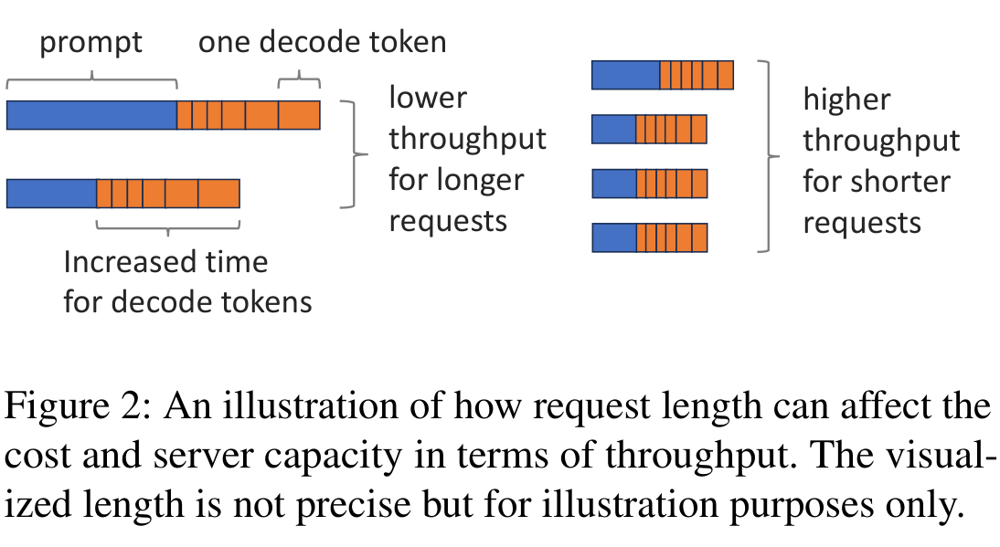

*来源：论文 Figure 2，PDF 第 4 页；原图裁剪。该图仅说明方向，论文题注明确指出图中的 request length 并非精确比例。*

---

## 4.3 Challenge 3：Output length 事先不知道

SFQ 等网络调度算法会计算 packet 的：

* Start tag
* Finish tag

但计算 Finish tag 必须知道 packet length。

LLM request 在 dispatch 时：

> 不知道最终会生成多少 output tokens。

同样，DRR 需要知道：

> 一个 request 会消耗多少 quantum。

LLM 无法提前准确知道。

所以论文的关键策略变成：

> **不要提前一次性估算整个 request cost，而是在 token 真正被处理之后持续更新已经获得的 service。**

这就是 Virtual Token Counter。


---

# 5. Section 3：Definition of Fairness in LLM Serving

这一节并没有开始设计 scheduler，而是先回答：

> **究竟应该公平地分什么？**

---

# 5.1 Section 3.1：Measurement of Service

论文讨论四种 service measurement。

---

## 5.1.1 Number of Tokens

最简单：

$$
W(t_1,t_2)=n_p(t_1,t_2)+n_q(t_1,t_2)
$$

其中：

* $n_p$：processed input tokens
* $n_q$：processed output tokens

问题：

> input/output token 的实际成本不同。

---

## 5.1.2 Number of FLOPs

可以进一步使用：

$$
W=FLOP_{input}+FLOP_{output}
$$

优点：

> 能体现 attention computation 随 prefix length 增长。

但是作者认为仍不能准确描述 serving cost。

原因是：

> 同样 FLOPs，在 prefill 和 decode 阶段可能对应完全不同的 GPU utilization。

---

## 5.1.3 Weighted Number of Tokens

这是论文主要使用的方法：

$$
W(t_1,t_2)=w_p n_p(t_1,t_2)+w_q n_q(t_1,t_2)
$$

其中：

* $w_p$：input token weight
* $w_q$：output token weight

实验里设置：

$$
w_p=1,\qquad w_q=2
$$

作者说这个选择参考当时 OpenAI 的 input/output pricing。

重要的是：

> **论文没有证明 1:2 就是正确的真实 GPU cost。**

它只是论文为了分析和实验采用的一个简单 service function。

---

## 5.1.4 Customized Cost Function

进一步推广：

$$
W=\sum_r h(n_p^r,n_q^r)
$$

只要求：

$$
h(n_p,n_q)
$$

随着 $n_p,n_q$ 单调增加。

这意味着 VTC 的真正抽象不是：

> “每个 token 算 1 分”

而是：

> **维护一个可配置的 cumulative service cost。**

这是 VTC 很重要的设计点。

---

# 5.2 Section 3.2：Fairness in LLM Serving

论文采用经典的 **max-min fairness**。

理想系统要求三条性质。

---

## Property 1：Backlogged Clients

如果 client $f,g$ 在整个：

$$
[t_1,t_2)
$$

期间都 continuously backlogged：

$$
W_f(t_1,t_2)=W_g(t_1,t_2)
$$

实际系统无法完全做到，所以 Section 4 将其改成 bounded difference。

---

## Property 2：Non-backlogged Clients

如果 $f$ 一直 backlogged，而 $g$ 不一直 backlogged：

$$
W_f(t_1,t_2)\ge W_g(t_1,t_2)
$$

直觉：

> 高需求 client 不应该因为需求高而反过来拿得比低需求 client 更少。

作者把前两条解释为：

* misbehaving client 应该被 **contained**
* 但不应该被 **punished**

---

## Property 3：Work-conservation

只要 waiting queue 还有 request：

> server 就不应该因为公平策略主动 idle。

这一条正是 RPM 不满足的地方。

---

# 6. Section 4：Achieving Fairness

---

# 6.1 Section 4.1：Virtual Token Counter（VTC）

VTC 的核心状态只有一个：

$$
c_i
$$

即 client $i$ 的：

> **virtual token counter**

它表示这个 client 到目前为止已经获得了多少 service。

基本调度思想：

$$
\boxed{\text{优先调度 counter 最小的 client}}
$$

但仅仅如此还不够。

论文真正关键的机制是：

> **counter lift。**

---

# 6.2 Algorithm 2：Virtual Token Counter

### 输入

Algorithm 2 的输入是：

* request trace
* input token weight $w_p$
* output token weight $w_q$
* fairness bound 中使用的 $U$

系统状态：

* current running batch $B$
* waiting queue $Q$
* 每个 client 的 virtual counter $c_i$

---

## 6.2.1 Monitoring Stream：处理新请求

如果 client $u$ 新来一个 request：

先检查：

> 当前 waiting queue $Q$ 中是否已经存在来自 $u$ 的 request。

如果没有，则意味着：

> client $u$ 之前可能已经离开 backlog，现在重新加入。

此时执行 **counter lift**。

---

## 6.2.2 为什么必须 Counter Lift

考虑：

```text
Client A 一直工作
counter A = 10000

Client B 早早离开
counter B = 1000
```

之后 B 重新回来。

如果直接使用：

> minimum counter first

那么：

```text
B = 1000
A = 10000
```

B 会被持续优先服务，直到追上 10000。

这意味着：

> B 把之前没有使用的 share 当成了可以积累的 credit。

论文认为这是错误的。

Fair sharing 中：

> 未使用的 share 应立即被其他 client 借用，而不应该永久储存成 future credit。

因此 B 重新加入时，需要：

$$
c_B \leftarrow
\max(c_B,\min_{i\in Q}c_i)
$$

也就是：

> 至少提升到当前 active clients 中最小 counter 的位置。

---

## 6.2.3 系统完全 idle 后怎么办

如果：

$$
Q=\varnothing
$$

新 client $u$ 到来，则使用：

> last client that left Q，记作 $l$

然后：

$$
c_u=\max(c_u,c_l)
$$

作者明确没有把所有 counter reset 到 0。

原因：

> reset 可能把之前已经形成的 service deficit 一起抹掉。

---

# 6.3 Execution Stream

当：

```text
can_add_new_request()
```

成立时：

创建：

$$
B_{new}
$$

然后反复：

### Step 1：找 counter 最小的 client

$$
k=\arg\min_{i\in Q}c_i
$$

---

### Step 2：取该 client 最早到达的请求

维持同一 client 内部的 arrival order。

---

### Step 3：检查 memory

如果这个 request 无法放进当前 batch：

> 停止继续添加。

---

### Step 4：立即计入 input token service

$$
c_k
\leftarrow
c_k+w_p\cdot input_length(r)
$$

注意：

> 这里是在 request 加入 batch 时立即 charge input cost，而不是等 prefill 完成。

论文 Footnote 5 给出的原因非常具体：

如果不立即增加 counter：

```text
选 k
选完以后 k 还是 minimum
再选 k
再选 k
...
```

很容易整个 $B_{new}$ 都来自同一个 client。

---

### Step 5：Prefill

执行：

```text
forward_prefill(Bnew)
```

---

### Step 6：Decode

每一次：

```text
forward_decode(B)
```

之后立即更新：

$$
c_i
\leftarrow
c_i+
w_q\cdot
|{r\mid client(r)=i,r\in B}|
$$

也就是说：

> client $i$ 这一 decode iteration 生成多少个 token，就马上 charge 多少 output-token service。

---

## VTC 的完整执行逻辑

下面是根据 **Figure 1 + Algorithm 2** 重画的简化示意：

```text
                  New Request
                       │
                       ▼
              ┌─────────────────┐
              │ Waiting Queue Q │
              └────────┬────────┘
                       │
              client重新加入？
                       │ Yes
                       ▼
              ┌─────────────────┐
              │  Counter Lift   │
              └────────┬────────┘
                       │
                       ▼
           choose client with min ci
                       │
                       ▼
                earliest request
                       │
                       ▼
               memory can fit?
                 │           │
                Yes          No
                 │           └── stop adding
                 ▼
      ci += wp × input_tokens
                 │
                 ▼
               Prefill
                 │
                 ▼
          Running Batch B
                 │
                 ▼
               Decode
                 │
                 ▼
      ci += wq × generated_tokens
                 │
          ┌──────┴──────┐
          │             │
       finished      unfinished
          │             │
        leave        next decode
```

### Figure 1 真正表达的重点

Figure 1 并不是新的 inference architecture。

它表达的是：

> VTC 位于 **waiting queue 与 LLM execution engine 之间**，并根据实际处理 token 持续更新 per-client counters。

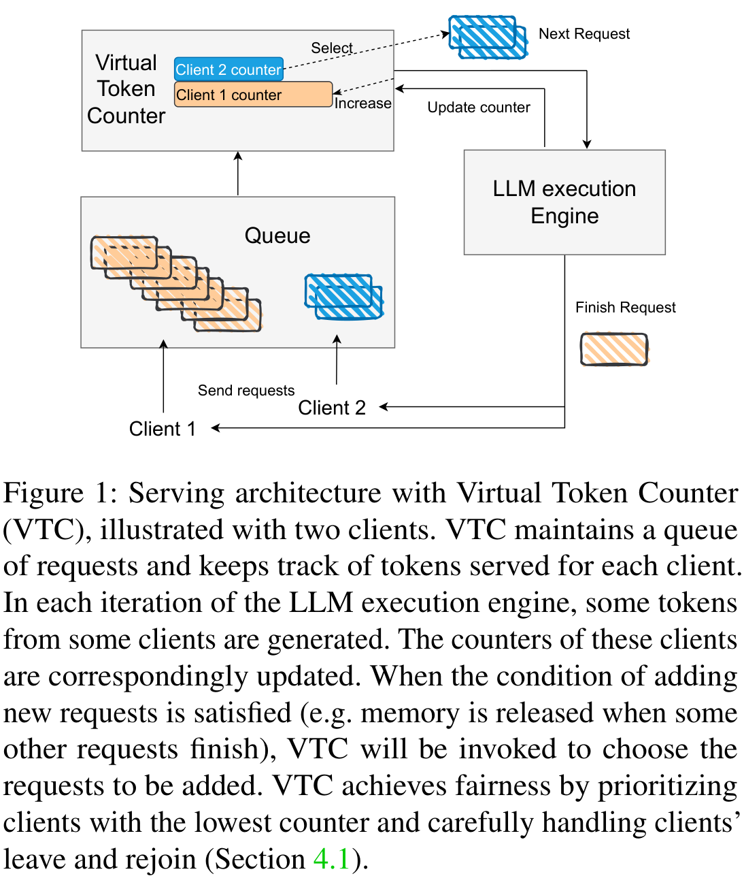

*来源：论文 Figure 1，PDF 第 2 页；原图裁剪。该图表达调度与记账位置，不表示作者提出了新的 inference engine。*

---

# 7. VTC 为什么能够处理 unknown output length？

这是这篇论文最漂亮的一点。

传统做法试图在 dispatch 时计算：

$$
TotalCost(request)
$$

但：

$$
output\ length=unknown
$$

VTC 不解决“预测整个请求长度”这个问题。

它换了一个问题：

> 我不需要提前知道未来 cost，只需要持续准确记录**已经发生的 cost**。

因此：

```text
Prefill:
    charge input tokens

Decode iteration 1:
    charge 1 output token

Decode iteration 2:
    charge 1 output token

...

EOS:
    stop
```

这就是论文所谓：

> token-level online accounting。

---

# 8. Section 4.1.1：Backlogged Client 的理论公平保证

首先定义 backlog。

### Definition 4.1

如果 client $f$ 在：

$$
[t_1,t_2)
$$

中的任意时刻，都至少有一个 request 在 waiting queue：

则 $f$ 在该区间 backlogged。

注意：

> 论文定义 backlog 看的是 **waiting queue**，不是仅仅 running batch 中有 request。

---

## 8.1 Definition 4.2：Fairness

一个 scheduler 对 $\delta$ fair，当：

$$
|W_f(t_1,t_2)-W_g(t_1,t_2)|\le\delta
$$

对于任意持续 backlogged 的 $f,g$ 成立。

最关键之处是：

> $\delta$ 不应随着 $t_2-t_1$ 增长。

也就是服务差异：

```text
可以波动
但不能越来越大
```

---

# 9. Lemma 4.3：VTC 的核心 invariant

定义：

* $L_{input}$：单请求最大 input length
* $M$：running batch 最多可容纳的 token 数

论文定义：

$$
U=
\max
(
w_pL_{input},
w_qM
)
$$

并证明：

$$
\boxed{\max_{i\in Q}c_i-\min_{i\in Q}c_i\le U}
$$

这其实就是整个 VTC proof 的核心。

含义：

> waiting queue 中 active clients 的 counters 会不断“追赶”彼此，最大差距始终有限。

为什么上界有两项？

### Prefill 一次最多跳：

$$
w_pL_{input}
$$

因为一次 dispatch 一个 request 时，会一次性加整个 prompt cost。

### Decode 一次最多产生：

$$
w_qM
$$

量级的 service imbalance，因为一个 non-preemptive running batch 可能已经包含大量来自同一 client 的 token state。

---

# 10. Theorem 4.4：Backlogged Fairness

对于任意两个持续 backlogged 的 client：

$$
\boxed{
|W_f(t_1,t_2)-W_g(t_1,t_2)|
\le
2\max(w_pL_{input},w_qM)
}
$$

即：

$$
|W_f-W_g|\le2U
$$

最重要的是：

> 这个 bound **与时间区间长度无关**。

因此即使：

```text
运行 10 秒
运行 10 分钟
运行 10 小时
```

service difference 也不会无限累积。

Figure 3a 就是对此性质的实验示意。

---

# 11. Theorem 4.8：为什么不能把 bound 任意做小

论文进一步证明：

对于任何：

* work-conserving
* non-preemptive

scheduler，都存在某种 workload，使：

$$
|W_f-W_g|
\ge
w_qM
$$

直觉非常清楚。

假设：

```text
t=0
Client F 先来大量 requests
```

work-conserving 要求 scheduler 尽量填满 running batch。

然后：

```text
t=ε
Client G 到来
```

但 running batch 不能 preempt。

于是直到 F 的 batch 结束：

```text
F 一直拿 service
G 一直等
```

最大可能产生：

$$
w_qM
$$

的 service gap。

因为通常：

$$
w_q>w_p
$$

Theorem 4.4 的 upper bound 近似：

$$
2w_qM
$$

而任何这类 scheduler 的 lower bound 是：

$$
w_qM
$$

因此论文称：

> VTC 的 fairness bound 在这一类 work-conserving、non-preemptive scheduler 中距离最优 lower bound 不超过 **2×**。

这里的“2×”指：

> **理论 fairness bound**，

不是“VTC 性能提升 2×”。

这个区别很重要。

---

# 12. Fairness 与 Work-conservation 的内在冲突

Remark 4.7 明确讨论了这个问题。

如果希望更严格 fairness，可以：

> 限制每个 client 在 running batch 中最多占多少 memory。

这样 $M$ 中来自单一 client 的比例下降，fairness bound 也可能更小。

但问题是：

```text
某 client 还有 request
GPU memory 也有空位
```

却因为 fairness quota 不允许继续加入。

于是：

> work-conservation 被破坏。

因此论文认为这里存在：

$$
\boxed{
Fairness\ Bound
\leftrightarrow
Work\ Conservation
}
$$

的 trade-off。

这不是实现偶然导致的，而与：

* request granularity
* unknown length
* non-preemption

直接相关。

---

# 13. Section 4.1.2：Non-backlogged Client 的公平保证

---

## 13.1 Theorem 4.9

如果 $f$ 在整个区间 backlogged，那么对于任意 $g$：

$$
\boxed{
W_f(t_1,t_2)
\ge
W_g(t_1,t_2)-4U
}
$$

即：

> 一个长期 overloaded client 不会比其他 client 少获得任意大的 service。

---

# 14. Theorem 4.11：新请求的 Dispatch Latency Bound

定义 server 瞬时 capacity：

$$
S(t)
$$

且：

$$
a<S(t)\le b
$$

其中 $a>0$。

如果：

* 总共 $n$ 个 clients；
* client $f$ 在 $t_1$ 时不 backlogged；
* running batch 中也没有 $f$ 的 request；

那么它之后的下一请求 $r_f$ 有：

$$
\boxed{
D(r_f)-A(r_f)
\le
2(n-1)
\frac{U}{a}
}
$$

其中：

* $A(r)$：arrival time
* $D(r)$：dispatch time

### 一个需要特别注意的地方

论文正文把它称为 response-time bound，但公式实际定义的是：

$$
dispatch\ time-arrival\ time
$$

所以严格来说：

> 这里证明的是**等待至 dispatch 的 latency bound**，并不是 request 完整生成结束的 end-to-end response time bound。

论文强调：

> 这个 bound 与其他 client 的 request rate 无关。

因此即使一个恶意 client 无限发请求，也不能让低负载 client 永久 starve。

---

# 15. Theorem 4.13：Non-overloaded Client

这是一个更严格的 sufficient condition。

如果 client $f$ 在 $t_1$ 时不 backlogged，并且在任意：

$$
[t,t_2),\quad t_1\le t<t_2
$$

内，它请求的 service 小于：

$$
\frac{T(t,t_2)}{n(t,t_2)}-5U
$$

那么：

> $f$ 在 $[t_1,t_2)$ 请求的所有 service 都会被 dispatched。

论文把它解释成：

> 请求速率持续低于自身 fair share 的 client 应该能够获得及时服务。

但要注意：

**论文严格证明的是上面的带 $5U$ slack 的条件，并不是简单证明“只要 < 1/n capacity 就一定零等待”。**

---

# 16. Section 4.2：Adapt to Different Fairness Criteria

VTC 并不要求：

$$
W=w_pn_p+w_qn_q
$$

如果使用：

$$
h(n_p,n_q)
$$

那么 dispatch 时把 Algorithm 2 Line 24 改成：

$$
c_k
\leftarrow
c_k+h(n_p^r,0)
$$

每次生成新 token 时，用：

$$
h(n_p^r,n_q^r)-h(n_p^r,n_q^r-1)
$$

作为 incremental cost。

这意味着：

> VTC 本质上只要求“新获得多少 service，就给 counter 增加多少”。

因此 cost model 和 scheduler 被分离了。

---

# 17. Section 4.3：Weighted VTC

如果 client 有不同 priority，可以定义 client weight：

$$
w_i
$$

例如：

```text
Client A weight = 2
Client B weight = 1
```

希望：

$$
A:B=2:1
$$

此时目标变成：

$$
\left|\frac{W_f}{w_f}-\frac{W_g}{w_g}\right|
$$

保持 bounded。

实现上：

> counter increment 除以 client weight。

即获得相同 service 时：

```text
高 weight client
counter 增长更慢
→ 更容易再次被选中
→ 最终获得更多 service
```

---

# 18. Section 4.4：VTC with Length Prediction

标准 VTC 的一个问题：

dispatch 时只知道 input：

$$
c_i += input\ cost
$$

未来可能产生大量 output，但暂时没有反映到 counter。

于是 scheduler 可能：

> 对这个 client 加入过多 requests。

之后这些 requests 的 output 又不能 preempt，只能继续生成，形成 service overshoot。

---

## 18.1 Length Prediction 的思路

选择 request $r$ 时提前加入：

$$
w_q
\times
predicted_output_length(r)
$$

即：

```text
input cost
+
predicted future output cost
```

之后真实 decode 时修正。

### 实际比预测更多

counter 继续增加。

### 实际比预测少

请求完成时把多估的部分减回来。

---

## 18.2 Algorithm 3

Algorithm 3 就是：

> **VTC + speculative service accounting + reconciliation**

需要注意：

论文明确说：

> Length Prediction **不会改善 Theorem 4.8 的 theoretical worst-case lower bound**。

它改善的是：

> practical / average-case service discrepancy。

---

# 19. Algorithm 4：General VTC

Appendix C.1 将 VTC 抽象成实际 serving system 需要增加的三个模块。

### ① Request arrives

执行：

> counter lift

### ② New tokens processed

执行：

> counter update

### ③ Need to select request

执行：

> choose client with minimum counter

因此论文认为 VTC 可以作为：

> existing request scheduler 上面很薄的一层。

在 S-LoRA 上实现约 **100 lines of code**。

---

# 20. Section 5：Evaluation

## 重要说明

本文实验只有：

* Section 5.1 Setup
* Section 5.2 Synthetic Workloads
* Section 5.3 Real Workloads
* Section 5.4 Ablation Study

**不存在 Section 5.5。**

额外 Weighted VTC、custom cost function 和 prediction 实验放在 Appendix B。

---

# 21. Section 5.1：Setup

## 21.1 Implementation

VTC 实现在：

**S-LoRA**

S-LoRA 的 serving backbone 基于：

**LightLLM**

已有：

* continuous batching
* PagedAttention

VTC 直接建立在这些机制上。

代码规模：

> 在 S-LoRA 基础上约增加 100 lines。

实验虽然来自 S-LoRA，但：

> fairness 是按一般 client 定义，而不是按 LoRA adapter 定义。

作者只是指出：

> personalized serving 中也可以把 adapter 当 fairness unit。

---

# 22. Baselines

### FCFS

按照请求 arrival order。

论文指出 vLLM 和 HuggingFace TGI 当时默认使用类似 FCFS scheduling。

### RPM

每个 client 每分钟 request limit。

### Least Counter First（LCF）

可以理解为：

> **VTC 去掉 Counter Lift。**

维护累计 service counter，总选最小 counter。

这个 baseline 非常重要，因为它专门验证：

> counter lift 到底有没有必要。

---

## Prediction Variants

### VTC (predict)

用该 client：

> 最近 5 个 request 的平均 output length

预测下一个 request。

### VTC (oracle)

直接使用真实 output length：

> 100% accurate predictor。

显然 oracle 不是实际可实现方案，它用于展示 prediction 上限。

---

# 23. Synthetic Workload 环境

模型：

**Llama-2-7B**

GPU：

**NVIDIA A10G 24 GB**

KV cache memory pool：

**10,000 tokens**

---

# 24. Real Workload

来源：

**LMSYS Chatbot Arena trace**

原 trace 是多个 LLM。

论文将：

> 每一个 LLM 当成一个 client

因此：

**27 clients**

测试 duration：

**10 min**

整个系统 request rate：

**210 requests/min**

然后把实际 timestamp re-scale 到 10 min。

模型仍然：

**Llama-2-7B**

GPU：

**A10G 24 GB**

---

# 25. Ablation Study 环境

模型：

**Llama-2-13B**

GPU：

**A100 80 GB**

测试两种 memory pool：

* 35,000 tokens
* 65,000 tokens

主要观察：

> memory capacity $M$ 与 request length 对 fairness discrepancy 的影响。

---

# 26. Metrics

实验主要 service metric：

$$
W=w_pn_p+w_qn_q
$$

其中：

$$
w_p=1,\qquad w_q=2
$$

滑动窗口：

$$
T=30s
$$

---

## Service Received

client $i$ 在时间 $t$：

$$
W_i(t-T,t+T)
$$

---

## Absolute Difference in Accumulated Service

$$
\max_{i,j}
|W_i(0,t)-W_j(0,t)|
$$

用于观察公平差距是否持续增长。

---

## Response Time

论文这里实验测的是：

> requests 在 ([t-T,t+T]) 内的平均 **first-token latency**。

因此这里并非完整 generation completion latency。

---

## Service Difference

论文还定义了一个 quantitative metric。

假设：

$$
s_1\le s_2
$$

则：

$$
\min(s_2-s_1,\ |r_1-s_1|)
$$

用来避免把：

> 某 client 本来就没有请求那么多 service

错误计算成 scheduler unfairness。

---

# 27. Section 5.2：Synthetic Workloads

---

## 27.1 Figure 3：两个 overloaded clients

设置：

### Client 1

90 requests/min

### Client 2

180 requests/min

所有请求：

* input = 256
* output = 256

两者都超过 fair share，因此都 backlogged。

### Figure 3a

VTC：

> accumulated service difference 始终在一个较小范围内波动。

FCFS：

> difference 随时间不断增长。

### Figure 3b

VTC 中两个 clients 的 60s-window service rate 基本处于同一水平。

### 作者结论

实验上验证：

> Theorem 4.4 所描述的 bounded service difference。

需要注意：

**理论证明来自 Theorem 4.4；Figure 3 只是 empirical illustration，不是证明本身。**

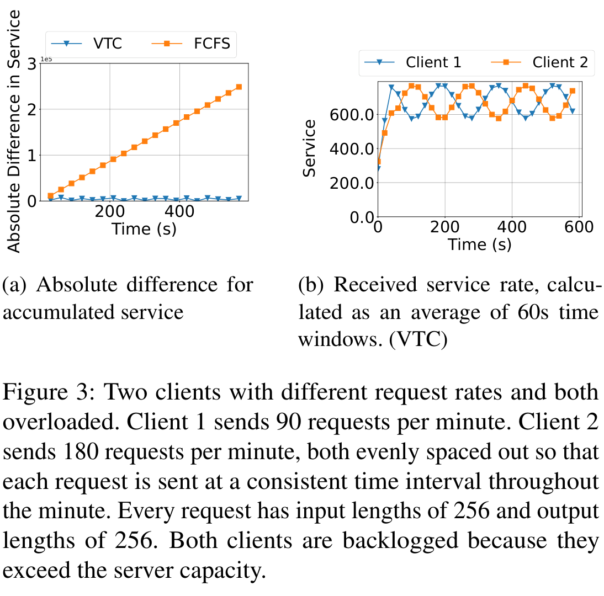

*来源：论文 Figure 3，PDF 第 10 页；原图裁剪。左图是 VTC/FCFS 累积 service difference，右图是 VTC 的 60 秒窗口 service rate；它是经验示意，不替代理论证明。*

---

# 28. Figure 4：Work-conserving

三个 clients：

| Client   | Request rate |
| -------- | -----------: |
| Client 1 |       15 RPM |
| Client 2 |       30 RPM |
| Client 3 |       90 RPM |

request：

* input = 256
* output = 256

Clients 1/2 不 backlogged。

Client 3 backlogged。

结果：

### Client 1

得到约与自身请求相对应的 service。

### Client 2

约为 Client 1 的 2×，对应：

$$
15:30=1:2
$$

### Client 3

使用所有剩余 capacity。

因此它获得：

> 超过固定 (1/3) 的 server capacity。

这正是：

> unused fair share 可以被 overloaded client 借用。

### 作者结论

Figure 4 用来说明：

> **VTC 是 work-conserving 的。**

同时低负载 Clients 1/2 的 request 基本能立即获得 service。

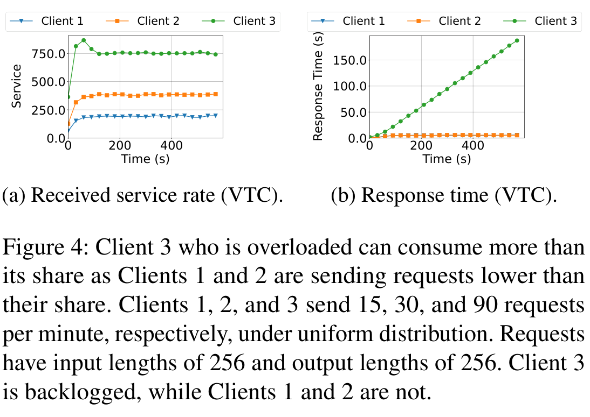

*来源：论文 Figure 4，PDF 第 10 页；原图裁剪。service rate 与 response time 两个 panel 共同说明 VTC 的 work-conserving 行为。*

---

# 29. Figure 5：ON/OFF Workload

Client 1：

* ON：30 RPM
* OFF：不发请求

Client 2：

* 一直 120 RPM

request：

256 input + 256 output。

因为 Client 1 在 ON 阶段仍然低于一半 capacity：

> 它基本不会形成 backlog。

当它 OFF 时，剩余 capacity 可以被另一个 overloaded client 使用。

Figure 5a 显示：

> total service rate 基本保持稳定。

Figure 5b 则显示低负载 client 的 response time 较小。

### 文本中的一个值得注意之处

论文正文在 Figure 5 附近写有一句：

> “When it is in the OFF phase, Client 1 thus takes all the system capacity.”

按照 Figure 5 的 workload 定义，Client 1 在 OFF phase 不发送 request，因此这句话与图和上下文并不一致，应该属于正文措辞问题。

这里不替作者自行修改；**严格以 Figure 5 的 workload 定义和图中结果解释。**

---

# 30. Figure 6：OFF 了，但 backlog 还没消失

Client 1：

* ON：120 RPM
* OFF：停止产生新 request

Client 2：

* 一直 180 RPM

两个 client 都超过 fair share。

关键区别是：

> Client 1 虽然进入 OFF，不再生成新请求，但之前积压的 requests 仍在 queue 中。

所以：

> Client 1 仍然是 backlogged client。

因此 VTC 仍使：

$$
W_1\approx W_2
$$

Figure 6 展示：

> “是否产生新请求”和“是否 backlogged”不是一回事。

这是理解论文 fairness definition 很重要的一点。

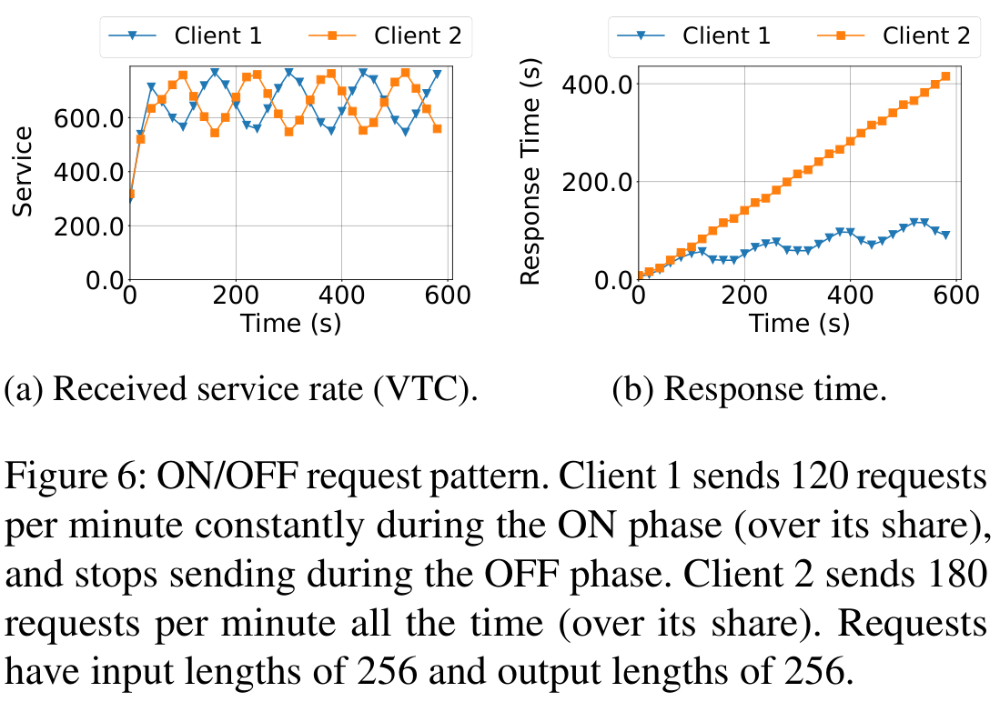

*来源：论文 Figure 6，PDF 第 11 页；原图裁剪。ON/OFF 描述的是新请求到达，backlogged 描述的是尚有未服务完的请求，二者不能等同。*

---

# 31. Figure 7：Variable Request Length

使用 Poisson arrival：

coefficient of variation = 1。

### Client 1

* 480 RPM
* input = 64
* output = 64

### Client 2

* 90 RPM
* input = 256
* output = 256

两者都 overloaded。

结果：

* VTC：service difference bounded
* FCFS：difference 持续增长

说明：

> request size 不相同时，按 token-service accounting 仍然有效。

---

# 32. Figure 8：Input/Output Cost 不同

### Client 1

* 480 RPM
* input = 64
* output = 512

### Client 2

* 90 RPM
* input = 512
* output = 64

仍使用：

$$
w_p=1,\quad w_q=2
$$

因此即使：

> 一个 workload 偏 decode-heavy，另一个偏 prefill-heavy

VTC 仍然维持 bounded service difference。

这比 Figure 7 更直接验证：

> scheduler 使用的是 service cost，而不是 request count。

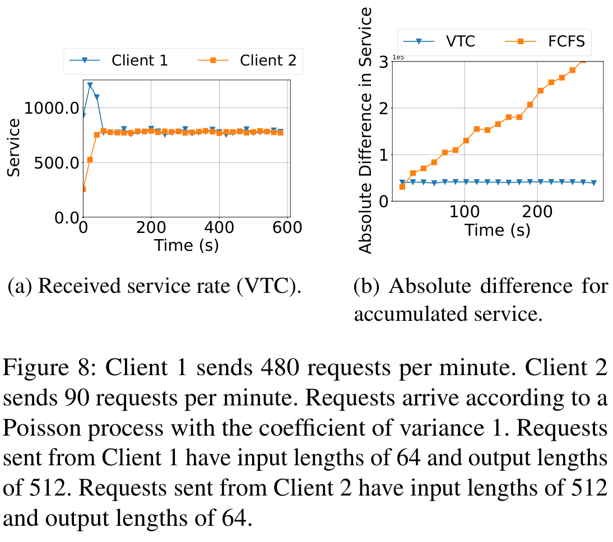

*来源：论文 Figure 8，PDF 第 11 页；原图裁剪。两个 client 分别偏 decode-heavy 与 prefill-heavy，图中比较 VTC 的 service rate 及 VTC/FCFS 的累积 service difference。*

---

# 33. Figure 9：Isolation

Client 1：

> 30 RPM，低于自身 share。

Client 2：

> workload 随时间增加，并逐渐超过 fair share。

论文 Figure 9 caption 同时出现 “120 requests/min” 和 “linearly increasing rate”的描述，因此具体文字存在一定不一致；作者要验证的核心变量很明确：

> Client 2 越来越 aggressive。

结果：

### Client 2

response time 随 overload 增长。

### Client 1

response time 大体保持不变。

作者认为这：

> empirically validates Theorem 4.13 的 isolation property。

也就是说：

> ill-behaved client 的流量继续增长，不会把低负载 client 的 latency 一起拖垮。

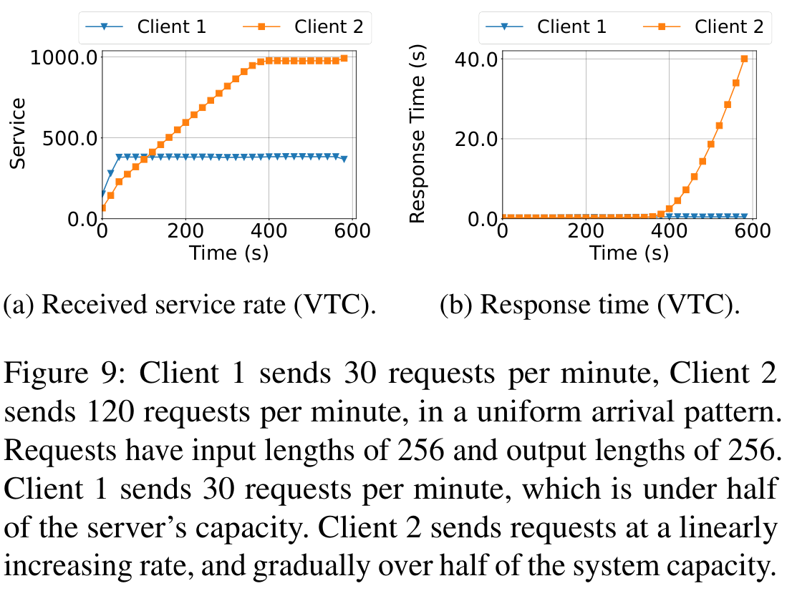

*来源：论文 Figure 9，PDF 第 12 页；原图裁剪。论文题注同时出现 Client 2 固定 120 RPM 与线性增加 rate 两种说法，具体到达率文字存在不一致；这里只据正文解读 isolation 现象。*

---

# 34. Figure 10：Counter Lift 为什么必要

这是全文最值得看的实验之一。

workload 共 **15 min**，分三阶段。

---

## Phase 1：0–5 min

Client 1：

* ON/OFF
* ON 时 30 RPM

Client 2：

* 持续高负载

Client 1 经常没有 backlog。

---

## Phase 2：5–10 min

两者都：

> 60 RPM

系统 overloaded，两者都 backlogged。

公平结果应该：

$$
W_1\approx W_2
$$

### VTC

确实快速进入相同 service rate。

### LCF

却明显优先 Client 1。

为什么？

因为 LCF 中：

```text
Client 1 Phase 1 经常 idle
→ counter 增长较少
→ 留下一个很大的 historical deficit
```

Phase 2 开始后：

> LCF 会“补偿” Client 1 过去没使用的 service。

但 max-min fairness 并不要求：

> unused share 可以跨时间储存。

VTC 的 Counter Lift 正是用来消除这一问题。

---

## Phase 3：10–15 min

Client 1：

30 RPM

Client 2：

90 RPM

Client 1 低于 share，因此其所有请求立即获得服务。

VTC 和 LCF 在这个阶段表现接近。

### Figure 10 真正证明的东西

不是“minimum-counter 算法就够了”，恰恰相反：

> **Counter Lift 是 VTC 能处理 client leave/rejoin 和 workload distribution shift 的关键机制。**

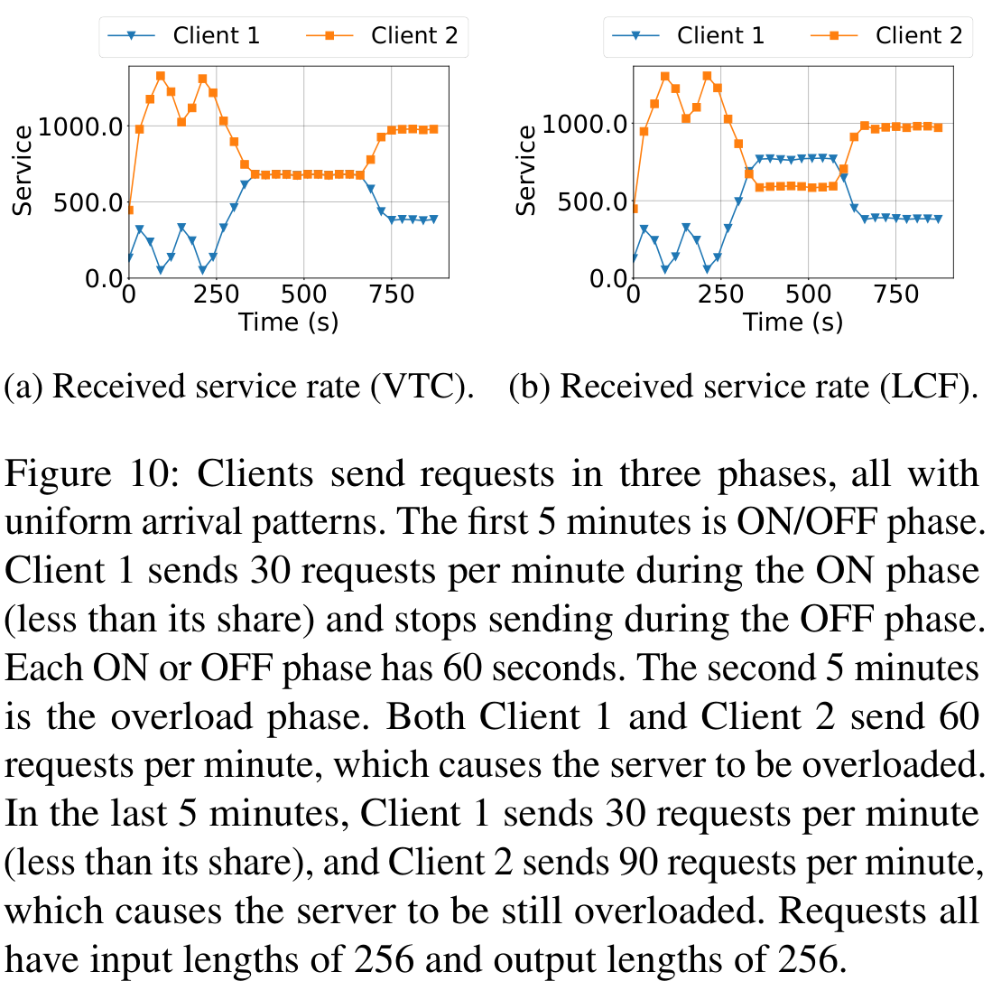

*来源：论文 Figure 10，PDF 第 12 页；原图裁剪。三阶段 workload 下，VTC 在 client rejoin 时抬升旧 counter，LCF 则让落后的 counter 获得不合理补偿。*

---

# 35. Section 5.3：Real Workloads

---

## 35.1 Figure 11：LMSYS Trace 的 workload

27 clients 的 request rate：

> 高度动态。

而且少数 client 产生的 request 远多于其他 client。

request length：

### Average input

136 tokens

### Average output

256 tokens

### Input range

$$
[2,1021]
$$

### Output range

$$
[2,977]
$$

Figure 20 在 Appendix 中给出了长度分布。

---

# 36. Figure 12：FCFS vs VTC

选择：

* 两个 request 数量最多的 client；
* 两个中等 request 数量的 client。

FCFS：

> 随着几个 high-rate clients 占据服务，所有 client 的 response time 都明显上升。

VTC：

> 主要只有超过自身 share 的 clients response time 大幅增长。

作者因此认为 VTC 能实现：

> performance isolation。

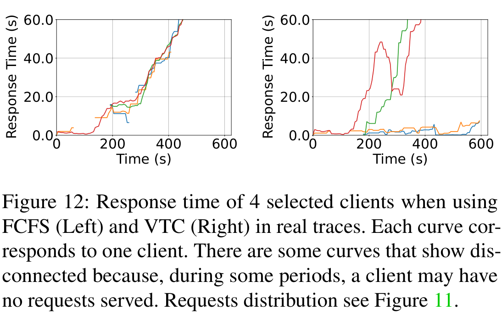

*来源：论文 Figure 12，PDF 第 12 页；原图裁剪。左为 FCFS，右为 VTC；曲线断开表示相应时段该 client 没有请求被服务。*

---

# 37. Figures 13–14：RPM 的根本问题

RPM thresholds：

* 5
* 15
* 20
* 30 requests/min

### RPM = 5

公平性看起来很好。

但原因是：

> 大量 requests 被 admission control 拒绝。

吞吐只有大约：

$$
340
$$

而 VTC：

$$
\approx779
$$

### RPM threshold 增大

throughput：

```text
340
→ ...
→ 747
```

不断接近正常 serving throughput。

但此时 fairness 越来越差。

最终 response-time pattern：

> 越来越接近 FCFS。

因此作者把 RPM 总结为：

> **FCFS + admission control**

而不是一个真正 work-conserving 的 fair scheduler。

---

# 38. Table 2：Real Trace 的核心定量结果

| Scheduler     |   Max Diff |   Avg Diff |    Diff Var | Throughput | Isolation |
| ------------- | ---------: | ---------: | ----------: | ---------: | --------- |
| FCFS          |     759.97 |     433.53 |    32112.00 |        777 | No        |
| LCF           |     750.49 |     323.82 |    29088.90 |        778 | Some      |
| **VTC**       | **368.40** | **251.66** | **6549.16** |    **779** | **Yes**   |
| VTC (predict) |     365.47 |     240.33 |     5321.62 |        773 | Yes       |
| VTC (oracle)  |     329.46 |     227.51 |     4475.76 |        781 | Yes       |
| RPM(5)        |     143.86 |      83.58 |     1020.46 |        340 | Some      |
| RPM(20)       |     446.76 |     195.71 |     7449.79 |        694 | Some      |
| RPM(30)       |     693.66 |     309.45 |    24221.31 |        747 | Some      |

Table 2 很容易被误读。

### RPM(5) 的 fairness difference 最小

所以论文**没有证明 VTC 在所有 fairness 数值上绝对最低**。

RPM(5) 更低：

$$
MaxDiff=143.86
$$

但是 throughput：

$$
340
$$

远低于 VTC：

$$
779
$$

因此作者真正要证明的是：

> VTC 同时保持 **较低 service discrepancy + 高 throughput + isolation**。

而不是单纯最小化 fairness metric。

### LCF 的 “Some”

论文 Footnote 9 明确解释：

> workload 不变时 LCF 可以有 isolation；但新加入 client 的 counter 落后时 isolation 会被破坏。

这正对应 Figure 10。

---

# 39. Section 5.4：Ablation Study

---

## 39.1 Figure 15a：Memory Pool Size

比较：

* 35,000 KV cache tokens
* 65,000 KV cache tokens

结果：

> 65,000 memory pool 下 service difference 波动更大。

原因：

memory pool 越大：

$$
M\uparrow
$$

根据 Theorem 4.4：

$$
2\max(w_pL_{input},w_qM)
$$

理论 bound 同样变大。

作者认为 Figure 15a：

> empirically validates Theorem 4.4 对 $M$ 的依赖。

---

# 40. Figure 15b：Request Length

比较：

* $256\times2$
* $512\times2$
* $768\times2$

这里表示相同 input/output length。

结果：

> request 越长，通常 service discrepancy 越大。

作者解释：

dispatch 时标准 VTC 只计入 input token：

```text
potential future output
暂时没有加入 counter
```

因此容易：

> over-compensate 当前 minimum-counter client。

短 request 这个影响较小。

值得注意的是：

> 512×2 和 768×2 的 variance 基本相同。

作者解释：

> 在 512×2 时已经达到当前环境下 VTC 的 upper bound，因此继续增大 request length 不再明显增加 variance。

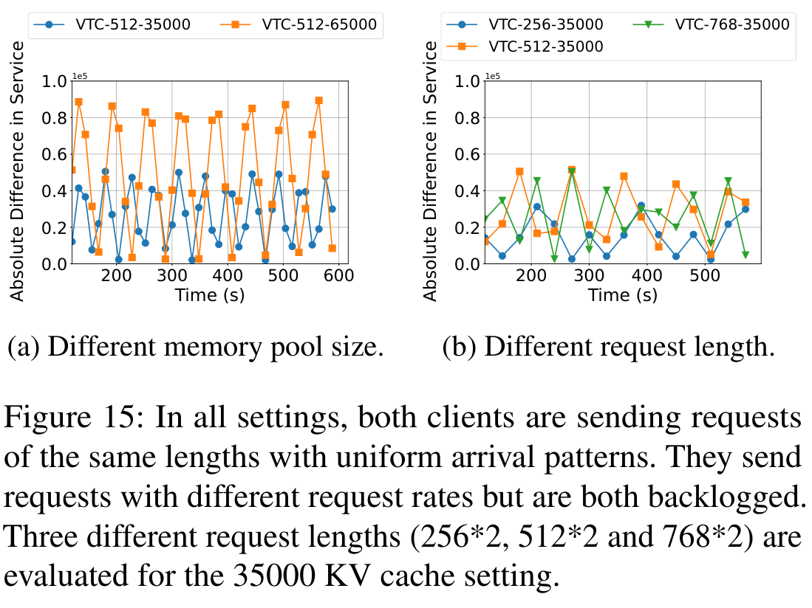

*来源：论文 Figure 15，PDF 第 14 页；原图裁剪。左 panel 改变 KV memory pool，右 panel 改变相同的 input/output request length，分别对应 Theorem 4.4 中对 $M$ 与请求代价上界的敏感性。*

---

# 41. Appendix B.1：Weighted VTC

### Figure 16

4 个 overloaded clients。

Standard VTC：

> 四者获得大致相同 service。

Weighted VTC：

设置：

$$
1:2:3:4
$$

结果：

> 4 个 clients 的 service level 也大致按照 (1:2:3:4) 分布。

作者用它验证 Section 4.3 的 weighted fairness。

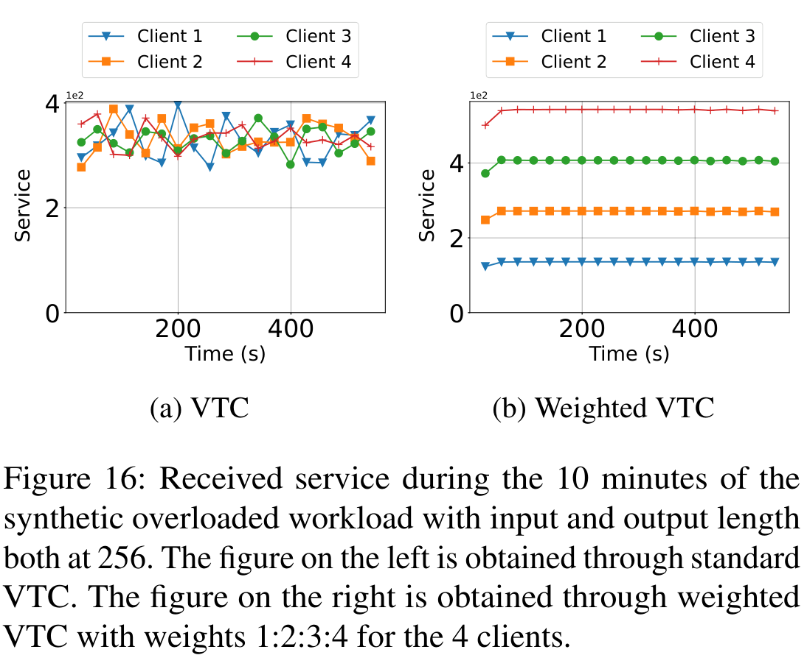

*来源：论文 Figure 16，PDF 第 20 页；原图裁剪。左为 standard VTC，右为 weighted VTC；图中 service level 按预设 client weight 分化。*

---

# 42. Appendix B.2：VTC with Profiled Cost Function

这一组实验很重要，因为它说明：

> VTC 不依赖线性的 $w_pn_p+w_qn_q$。

环境：

* Llama-2-7B
* A10G 24 GB

Figure 17 profiling 不同 input/output length 的：

* prefill time
* decode time

作者拟合：

$$
h(n_p,n_q)=2.1n_p+n_q+0.04n_pn_q+0.032n_q^2+11.46
$$

这个 cost function 是非线性的。

然后重新使用：

> VTC + $h(n_p,n_q)$

进行调度。

---

## Table 3：Real Trace + Profiled Cost

例如：

| Scheduler   | Max Diff | Avg Diff | Throughput |
| ----------- | -------: | -------: | ---------: |
| FCFS        |   743.23 |   457.29 |        777 |
| VTC         |   707.35 |   368.74 |        780 |
| VTC predict |   617.22 |   337.05 |        778 |
| VTC oracle  |   387.43 |   277.18 |        783 |

作者指出真实 workload 下数字差距没有线性模型那么明显，因为：

> low-request-rate client 即使发生 starvation，对整体 service-difference metric 的贡献也有限。

Figure 18 的 response time 能更清楚显示 isolation。

---

## Table 4：Synthetic Overloaded Workload

| Scheduler  | Max Diff | Avg Diff | Throughput |
| ---------- | -------: | -------: | ---------: |
| FCFS       |   323.18 |   317.13 |        876 |
| VTC        |   137.27 |    74.87 |        900 |
| VTC oracle |     4.28 |     0.34 |        893 |

这组结果更加直接展示：

> customized cost function 下 VTC 仍可实现公平调度。

### 作者明确没有研究的内容

Appendix B.2 最后明确说：

> **论文的目标不是确定 optimal cost function 或 optimal pricing model。**

因为生产环境中的实际 cost：

* 与 hardware 有关；
* 与 model 有关；
* 与 workload 有关；
* 可能随时间变化。

作者把这个问题留给 future research。

---

# 43. Appendix B.3：Length Prediction

### Figure 19

比较：

* VTC
* VTC (±50%)
* VTC (oracle)

其中 ±50% 表示：

> predictor 在实际 output length 的 ±50% 范围随机产生预测。

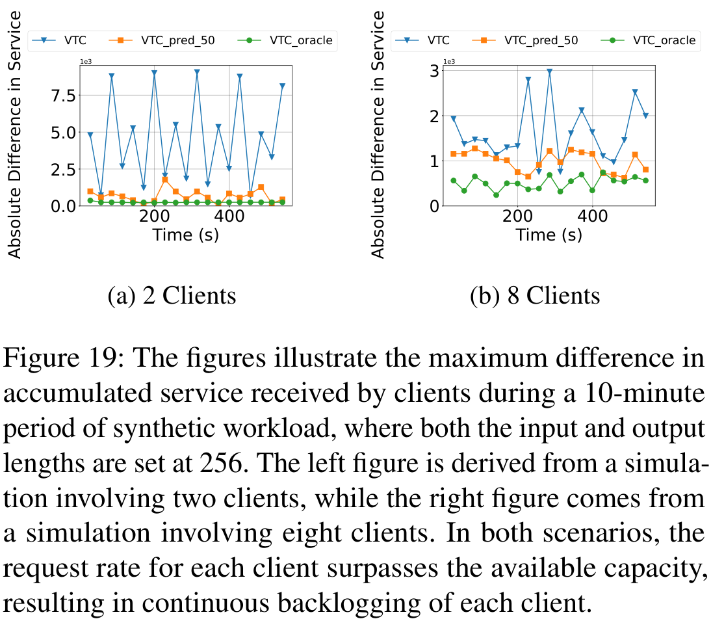

*来源：论文 Figure 19，PDF 第 22 页；原图裁剪。预测改善的是实验中的 practical service discrepancy；论文明确说明它不改变 Section 4.1 的 theoretical worst-case bound。*

---

## Table 5：2 Clients

| Scheduler  | Max Diff | Avg Diff | Diff Var | Throughput |
| ---------- | -------: | -------: | -------: | ---------: |
| VTC        |   192.88 |   103.77 |  6981.24 |        893 |
| VTC ±50%   |    33.98 |    12.54 |   111.94 |        904 |
| VTC oracle |     5.87 |     0.51 |     1.71 |        895 |

即使 prediction error 可达到：

$$
\pm50%
$$

service discrepancy 仍明显下降。

---

# 44. Table 6：8 Clients

| Scheduler  | Max Diff | Avg Diff | Diff Var | Throughput |
| ---------- | -------: | -------: | -------: | ---------: |
| VTC        |   322.16 |   162.20 |  5151.49 |        875 |
| VTC ±50%   |    99.43 |    66.32 |   487.10 |        875 |
| VTC oracle |    43.23 |    36.34 |    56.52 |        875 |

因此作者认为：

> output-length prediction 能明显改善 practical service discrepancy。

但是再次强调：

> **它没有改变 Section 4.1 的 theoretical worst-case bound。**

---

# 45. Appendix C.1：VTC Integration in Real Systems

作者认为在现有 serving system 中只需要改三处：

```text
Request Arrival
     ↓
Counter Lift

Tokens Processed
     ↓
Counter Update

Request Selection
     ↓
Minimum Counter First
```

因此它可以是一层：

> additive scheduler feature。

但作者同时指出一个实际冲突。

例如 cache-aware scheduling：

> 可能希望 shared-prefix requests 优先运行，从而提高 KV reuse。

而 VTC：

> 希望 minimum-counter client 优先。

二者可能产生冲突：

$$
Performance\ Optimization
\neq
Fairness\ Optimization
$$

论文只提出一个可能方向：

> 设置 tolerable fairness bound，在两个 scheduler 之间切换。

**论文没有实现或评估这种联合策略。**

---

# 46. Appendix C.2：Adapted Deficit Round Robin

作者进一步说明：

> DRR 虽然不能原样应用，但可以进行改造。

传统 DRR：

* 每个 client 有 quantum $Q$
* deficit $C_i$
* 在 quantum 范围内尽可能 dispatch packet

问题仍然是：

> LLM 的 output cost 不知道。

作者改造后的 DRR：

* 允许 $C_i$ 因实际 decode cost 变成负数；
* 每轮不断 refill quantum；
* actual generated token 持续从 deficit 中扣除。

当：

$$
Q=\epsilon
$$

而且 $\epsilon$ 小于单个 prompt token cost 时：

> modified DRR 趋近于 VTC。

此时：

```text
largest deficit
```

等价于：

```text
smallest virtual counter
```

Counter Lift 也可以从这个极小 quantum 的 DRR 过程中得到类似解释。

但作者认为：

> 实际模拟大量极小 round robin round 很低效，

因此论文只正式分析 VTC。

---

# 47. Appendix C.3：Future Work / 作者明确给出的局限

需要特别注意：

> 本文 **Section 7 是 Conclusion，不是 Limitations**。

作者真正集中的 limitations / future work 在 **Appendix C.3**。

---

## 47.1 Preemption

当前 VTC：

> **不支持 preemption。**

而 Theorem 4.4 中的 $M$ 项很大程度来自：

> 已经进入 running batch 的请求无法中断。

作者提出未来可以：

当：

$$
service\ difference>\ threshold
$$

时：

> preempt counter 较高 client 的 requests，swap in counter 较低 client。

这可能进一步 tighten fairness bound。

但：

**论文没有实现，也没有实验验证。**

---

## 47.2 Distributed VTC

论文主体研究的是：

> 单个 serving engine 上的 fairness。

如果有多个 replicas：

作者提出可以增加：

> central request dispatcher

在那里维护 VTC counter。

但新的问题是：

* 多个 serving engines 同时产生 token；
* counter 被多个 engine 并发更新；
* 需要 counter synchronization。

而理论 bound 会依赖：

> 所有 serving engines 的 total memory capacity。

### 论文状态

> **Distributed VTC 没有解决，是明确的 future work。**

---

## 47.3 Auto-scaling

VTC 本身：

> 不要求 server capacity 恒定。

所以增加/减少 GPU 原则上不会改变核心算法。

但是真正多 replica / auto-scaling 下还可能需要：

> hierarchical virtual counter。

作者指出 autoscaling 也有：

* operational overhead；
* workload prediction error；
* scaling delay。

因此：

> VTC + auto-scaling

也是 future work。

---

# 48. 论文明确支持的优点

## 48.1 把 fairness 从 request 粒度提升到了 service 粒度

最核心的抽象是：

$$
Request\ Count
\rightarrow
Service\ Cost
$$

不同 request 长度不同时仍然可以比较 client 获得的实际 service。

---

## 48.2 不需要预先知道 output length

通过：

> token-level online accounting

规避了传统 SFQ/DRR 对完整 request size 的依赖。

---

## 48.3 不要求 server capacity 固定

VTC 比较的是：

$$
c_i
$$

而不是显式计算：

$$
capacity/n
$$

因此能适应 LLM serving 中动态变化的 token throughput。

---

## 48.4 Work-conserving

与 rigid RPM 不同：

> unused share 可以由 overloaded clients 使用。

Figure 4 和 real trace 实验均围绕这个属性展开。

---

## 48.5 有明确理论保证

最核心：

$$
|W_f-W_g|
\le
2\max(w_pL_{input},w_qM)
$$

同时给出：

$$
w_qM
$$

的 lower bound。

因此 VTC 的 fairness bound 在论文研究的 scheduler family 中达到 **2× lower bound**。

---

## 48.6 实现很薄

作者在 S-LoRA 中增加约：

> 100 LoC

主要维护：

* counters
* counter lift
* selection policy

因此容易叠加到 continuous batching 系统。

---

# 49. 局限与论文没有证明的事情

下面先列**论文自己明确指出的内容**。

### ① 没有解决 preemption

因此 service discrepancy 与 running batch memory $M$ 密切相关。

### ② 没有实现 distributed VTC

多 replica counter synchronization 未解决。

### ③ 没有解决 VTC + auto-scaling

只讨论了可行性。

### ④ 没有寻找最优 cost function

$w_p=1,w_q=2$ 不是论文证明出的 optimal resource cost。

### ⑤ 与 cache-aware / performance-oriented scheduling 的联合未解决

Appendix C.1 明确把它留给未来。

### ⑥ Length Prediction 没有改善 worst-case theoretical bound

只改善 practical average discrepancy。

---

## 笔记分析：额外需要谨慎看待的地方

> **以下不是论文原文贡献，而是基于实验范围的阅读分析。**

论文主体的大部分实验是：

* Llama-2-7B
* 单 A10G
* 单 serving instance

A100 主要用于 Section 5.4 ablation。

因此论文**没有证明**：

* 大型多节点 inference cluster 上同样的 fairness bound 能直接成立；
* 多 endpoint 下如何维护 global fairness；
* speculative decoding / disaggregated prefill-decode 下如何定义 service；
* prefix cache hit 应该如何计价；
* 不同 model / GPU 的统一 cost function；
* p99/p999 tail latency；
* 从数据库/应用端开始的 end-to-end workflow fairness。

这些问题不能从本文实验自动推出。

---

# 50. Figure / Table / Algorithm 索引

为了之后复习，这篇论文最值得重新看的对象可以按下面顺序。

### 核心方法

* **Figure 1**：VTC 在 Queue 与 LLM Execution Engine 之间的位置
* **Figure 2**：request length 对 cost / capacity 的影响
* **Algorithm 1**：Continuous Batching
* **Table 1**：所有数学符号
* **Algorithm 2**：标准 VTC
* **Theorem 4.4**：backlogged fairness upper bound
* **Theorem 4.8**：work-conserving non-preemptive lower bound
* **Theorem 4.9 / 4.11 / 4.13**：non-backlogged clients / isolation

### 核心实验

* **Figure 3**：VTC vs FCFS，backlogged fairness
* **Figure 4**：work conservation
* **Figure 5–6**：ON/OFF 与 backlog 区别
* **Figure 7–8**：variable request/input/output lengths
* **Figure 9**：isolation
* **Figure 10**：Counter Lift 必要性，VTC vs LCF
* **Figure 11–14 + Table 2**：LMSYS real workload
* **Figure 15**：$M$ 和 request length 对 fairness bound 的影响

### 进阶机制

* **Figure 16**：Weighted VTC
* **Figure 17–18 + Tables 3–4**：customized cost function
* **Algorithm 3 + Figure 19 + Tables 5–6**：Length Prediction
* **Algorithm 4**：General VTC integration
* **Figure 20**：real trace token-length distribution
* **Appendix C.2**：VTC 与 adapted DRR 的关系

---

# 51. 这篇论文最核心的逻辑链

如果最后只记一条主线，可以记成：

```text
LLM requests 长度高度不一致
          ↓
request-level fairness 不合理
          ↓
定义 service cost h(n_p,n_q)
          ↓
传统 Fair Queueing 要提前知道 request size
但 LLM output length unknown
          ↓
不预测完整 cost
而是在线记录已经发生的 service
          ↓
每个 client 维护 virtual counter ci
          ↓
始终优先 minimum ci client
          ↓
client 离开再回来时执行 Counter Lift
避免 unused share 变成 future credit
          ↓
生成 token 时持续更新 ci
          ↓
实现 work-conserving max-min-like fairness
          ↓
counter gap ≤ U
          ↓
backlogged service gap ≤ 2U
```

我认为这比单独记住“VTC = 一个 token counter”更重要。

---

# 52. 我的理解与启发

> **以下为基于论文内容的个人分析，不属于论文原文贡献。**

我认为 VTC 最值得学习的并不是 `argmin(counter)` 本身，而是三个设计思想。

### 第一，先定义“公平的资源单位”，再设计 scheduler

论文没有直接问：

> 怎么公平地排 request？

而是先问：

> **LLM serving 中什么才叫 service？**

于是：

$$
request
\rightarrow
token
\rightarrow
weighted\ token
\rightarrow
h(n_p,n_q)
$$

这是一种非常典型的系统研究方法：

> 如果调度对象的真实成本高度异构，那么首先应该设计 accounting abstraction，而不是马上设计 scheduling heuristic。

---

### 第二，Counter Lift 比 Minimum Counter 更关键

最简单的想法其实是 LCF：

> 谁 service 少就先服务谁。

Figure 10 证明这种方法在 client workload 改变后会出现问题。

VTC 真正增加的语义是：

> **fair share 不可跨 idle period 储存。**

这对应 counter lift。

因此：

> VTC 不只是 service accounting，还定义了 service credit 的生命周期语义。

---

### 第三，用 online accounting 绕过不可预测未来

LLM output length 无法准确提前知道。

VTC 没有强行预测它，而是：

> 把 scheduling state 建立在已经发生的事实之上。

Prediction 可以后来作为 optimization 加进去，但：

> correctness/fairness 的基本机制不依赖 predictor。

这是一个很稳健的系统设计思想：

$$
\text{prediction}=\text{optimization}
$$

而不是：

$$
\text{prediction}=\text{correctness requirement}
$$

---

# 53. 与你的数据库 AI 算子执行与调度课题的关系

> **以下为基于论文内容与你当前课题的个人分析，不属于 VTC 原文贡献。**

VTC 和你的课题不是同一个问题，但它和你目前研究的 **AI operator → request organization / Ray → vLLM endpoint** 这条执行链有非常直接的局部对应关系。

---

## 53.1 最值得借鉴的是“Work 应该怎么计量”

传统数据库算子可能使用：

* rows
* cardinality
* CPU
* I/O

而 AI operator 请求的 cost 明显不适合只看：

```text
request count
```

VTC 提供了非常好的参考：

$$
\text{Work}=h(\text{input tokens},\text{output tokens})
$$

你的 work accounting 进一步还可以包含：

* prompt tokens
* predicted output tokens
* actual output tokens
* model / endpoint differences

这和你现在研究中把 request 数量与 predicted work 分开控制的方向非常吻合。

---

## 53.2 VTC 与双 Credit 其实是互补的，不是替代关系

可以把两者区分成：

```text
Request Credit / Work Credit
        ↓
“现在还能不能提交？”

VTC-style Virtual Counter
        ↓
“多个 eligible job 里，下一个应该让谁提交？”
```

也就是说：

### Credit

解决：

> capacity / admission safety

### Virtual Counter

解决：

> fairness / arbitration

因此一个很自然的组合是：

```text
Job queues
    │
    ▼
VTC-style fair arbiter
    │
    │ choose job
    ▼
Request Credit AND Work Credit available?
    │
    ├── No → wait
    │
    └── Yes
          ↓
       acquire
          ↓
        submit
          ↓
      actual work
          ↓
 update virtual service counter
```

这比“所有 job round robin”或单纯 equal request count 更能够处理：

> 不同 job 的 request cost 差异。

---

## 53.3 Counter Lift 对你的 per-job scheduling 很值得参考

假设：

```text
Job A 一直发送 AI requests
Job B 暂停了 30 秒
```

如果只维护 cumulative served work：

```text
A = 500000
B = 50000
```

B 回来以后简单 Least-Work-First 会导致：

> B 长时间独占调度，追赶历史差额。

VTC 的思想是：

> Job B 的 unused share 已经在过去由 Job A 使用了，不能在未来再次要求补偿。

所以：

> **job idle → rejoin 的 counter-lift semantics**

非常值得作为你 fairness arbiter 的候选机制。

---

# 54. VTC Length Prediction 与你的 Predicted Work 几乎是一一对应的启发

标准 VTC：

```text
submit request
→ 只知道 input cost
→ output cost 后续逐步记账
```

VTC-predict：

```text
submit
→ reserve / account predicted output cost
→ execution
→ reconcile predicted vs actual
```

这个机制可以抽象为：

$$
predicted\ work
\rightarrow
admission/scheduling
\rightarrow
actual\ work
\rightarrow
reconciliation
$$

这与 AI operator 调度中：

> predicted work 用于 admission，但完成后根据真实执行量释放/校正

在思想上高度接近。

---

# 55. 但 VTC 不能直接解决你的完整问题

这里的边界一定要区分清楚。

VTC 的研究对象主要是：

```text
Client
   ↓
Waiting Requests
   ↓
Single LLM Serving Engine
```

而你的问题还包含：

```text
Database Job semantics
        ↓
upstream data processing
        ↓
request organization
        ↓
Ray task scheduling
        ↓
endpoint routing
        ↓
LLM serving
        ↓
downstream processing
```

因此 VTC **没有研究**：

* upstream/downstream dependencies；
* 数据 batch 如何形成；
* AI operator 的 row/selectivity；
* endpoint routing；
* 多 endpoint global admission；
* DB job critical path；
* upstream backpressure；
* end-to-end Job latency。

特别值得注意的是：

> VTC 自己在 Appendix C.3 都把 **distributed multi-replica fairness** 留作 future work。

所以如果你的系统有多个 vLLM endpoints：

> 不能直接说“每个 endpoint 单独跑一个 VTC 就等于 global fairness”。

需要进一步处理：

* global vs per-endpoint virtual counter；
* endpoint routing；
* counter synchronization；
* capacity heterogeneity。

---

# 56. 对你的课题最适合怎么引用 VTC

我会把 VTC 放在你文献分类里的：

> **推理服务——公平性 / service-aware scheduling**

它能够作为非常强的论据支持：

> **固定 request 数或固定 concurrency 并不能表示 AI serving 中实际获得的资源。**

因为 VTC 已经明确指出：

$$
Request\ Count
\neq
Service\ Consumption
$$

更合理的是：

$$
\text{Service}=\operatorname{Cost}(\text{Input},\text{Output})
$$

但是你和它的区别可以概括成：

> **VTC 在 LLM server 内解决 client-level fair sharing；你的方向进一步研究数据库驱动 AI workload 中，上游 Job 语义、work estimation、admission、Ray 调度与多 endpoint 执行之间的闭环。**

所以 VTC 很适合作为你设计 **per-job fair arbiter / work accounting** 时的直接参考算法和 baseline，但它不是你整个 end-to-end scheduler 的现成答案。

---

## 最终一句话总结

**VTC 最核心的贡献不是“按 token 调度”，而是建立了一套适用于 unknown-length、variable-capacity、continuous-batching LLM serving 的 service accounting + fair scheduling 机制：用在线更新的 Virtual Token Counter 表示 client 已获得的 service，用 Counter Lift 消除 idle client 的历史 credit，再始终优先 service 最少的 active client，从而在保持 work-conserving 的同时，将持续 backlogged clients 的 service difference 控制在与运行时间无关的常数范围内。** 

[1]: https://www.usenix.org/conference/osdi24/presentation/sheng?utm_source=chatgpt.com "Fairness in Serving Large Language Models | USENIX"
