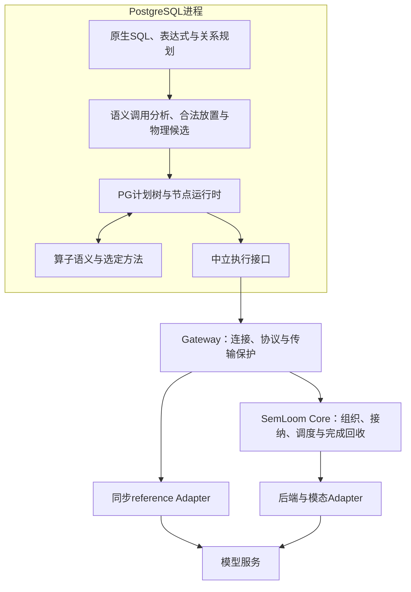

# SemLoom PostgreSQL 内置 AI 语义算子整体架构与实施计划

更新日期：2026-09-08
状态：`current / architecture-revised / implementation-partial`
受众：项目维护者；本文是架构、接口演进与实施依赖的唯一主入口，不是新增运行授权。

本次以`codex/semfilter-and@66887463`为代码基线，吸收用户补充设计并重新核对现有源码。
该实现及设计已合并main。已实现同步Filter/Map、共享PG运行时、两个Filter AND及有界gateway会话；
开发分支已实现共同调用/结果绑定和一个Filter→一个生成Map；受限生成Map也已接入增量核心的v6多在途路径；按需语义值、多个Map、Filter/组合异步及查询级共享资源控制尚未实现。
已有真实模型接线与小规模资源诊断不等于正式资源、语义质量或性能资格全部完成。
具体状态看[INFRA_STATUS](../../code/INFRA_STATUS.md)，提交、测试与失败看
[证据台账](../results/EXPERIMENT_EVIDENCE_REGISTRY.md)；本文不再逐段复制实验数字。

设计主线是：PostgreSQL拥有关系与表达式语义，算子方法将选定语义转换为执行任务，SemLoom负责
有界的数据组织与多作业调度。新增能力应沿这三项职责扩展，不以某个AND用例或某个cost字段决定整个架构。
近期实施与未定问题见[§9](#implementation-sequence)。A1/A2a的确定方案见
[PG调用与绑定详细设计](postgresql_call_binding_design.md)，B1静态复核/B2的操作状态与责任见
[增量session详细设计](semloom_incremental_session_design.md)；共同tuple绑定与受控单流session已实现；有界异步HTTP和受限生成Map的v6 PG多在途已通过[真实验证](../results/postgresql/async_window_20260908/README.md)，其它算子/组合与多活动Core会话仍待接入。
A1首步已提取Map调用分析并通过行为保持验证，见[记录](../results/postgresql/semantic_call_extraction_20260907/README.md)；
后续共同调用与tuple绑定及setrefs原型已[通过验证](../results/postgresql/semantic_binding_20260907/README.md)。
在此基础上，一个Filter→一个生成Map通过[PG18.3完整检查](../results/postgresql/filter_map_binding_20260907/README.md)，1910项TAP通过；仅在开发分支，本轮零真实模型请求。
外层carrier已接入该组合；OFFSET普通输出行为按PG18.3实测修订，详细结果与预期由近期规格维护。
总体决策只由本文拥有，下级详细设计不重复总体架构；全部专项与恢复入口见§13。
补充审查已收敛到这两份规格：交付提交点、唯一终态结算、可立即推进状态、分阶段等待和残余归属；
PG新Map先验证权限与OFFSET/LIMIT投影。FIFO、bytes、单成员提交、预留时机与当前placement是
首版可替换选择。实施从A1行为保持提取开始，B1表征可独立推进，不预造多模态或多Job平台。

## 1. 目标与架构决策

研究对象保持为**PostgreSQL 内置 AI 语义算子的外部分布式物理执行与调度优化**。
数据组织与提交/路由/多作业调度是两项研究内容；算子方法提供数据库工作来源，代价估计是共同支撑，
多模态检验可迁移性。功能更多、分层更多、支持已有文献机制本身不构成研究贡献。

### 1.1 长期能力与关系

| 长期需求 | 架构需要表达的关系 | 当前基础与缺口 |
|---|---|---|
| 扩展SQL中的算子调用 | 调用出现、输入依赖、求值范围、结果消费者与合法计划位置 | 已有单算子/双Filter；Map仍有单输出形状限制，共同分析待完成 |
| 同一算子的不同方法 | 语义要求约束可选方法；方法产生任务并解释完成值 | 已有同步reference与机器接口；多阶段方法及真实第二路径待实现 |
| 有界数据执行 | 取数、表示转换、组织、准备、提交、结果消费分别持有资源 | 已有库外组织与流水资产；PG增量接入和总量账本待完成 |
| 多查询、多算子流共享资源 | 查询执行属于调度组，组内含多个流；连接数量不决定公平份额 | gateway多会话已实现，不等于多查询公平调度已接通 |
| 正确性与可靠性 | 可复制计划、单次执行、节点状态与远端任务的寿命分开 | 同步受限路径已验证；重扫、多在途、重连需新合同 |
| 后端与模态替换 | 语义能力、数据表示、工作量和部署配置分别适配 | completion与文本/图像资产已有；不存在已接通的万能任务协议 |
| 估计、质量与反馈 | 观测共享，计划选择、运行调度、质量授权各有决策者 | 已有启发式/估计器/观测；真实匹配校准与闭合反馈接线未完成 |
| 同核心验证与移植 | PG和独立producer使用同一方法/执行核心，各自拥有输入获取 | 公司参考不是已获准发布的实现；移植分别验证算子方法与provider |

### 1.2 选择与不采用的方案

保留一个仓库，以PG backend和进程外执行设施为主要进程分工；Module分开不要求增加独立服务或RPC。
普通SQL语法、布尔表达式、关系运算、MVCC、权限、事务与执行计划树继续由PG承担。
扩展负责把语义调用正确放入这些设施，而非重写AND/OR、Join或数据库资源管理。

| 方案 | 决定及理由 |
|---|---|
| 所有语义计算退回普通逐行HTTP UDF | 不作为主架构；无法据此获得显式物理候选、有界批处理和研究所需的外部调度接入。普通辅助函数仍复用PG表达式 |
| 保留PG规划执行，薄计划适配连接算子方法与外部核心 | 采用；现有CustomScan、同步reference和gateway继续作为可验证基础 |
| SQL整体交给外部通用DAG服务 | 不采用；会复制关系语义、快照/权限与取消责任，并割裂PG计划 |
| 为每一种组合增设专用节点/协议 | 不作为长期设计；组合用例检验公共分析与绑定，节点按真实物理执行差异增加 |
| 立即修改PG core | 不采用；锁定REL_18_3，只有身份、放置或生命周期的可复现阻断才评估最小修改，不扩grammar/storage/model runtime |

函数volatility、parallel safety、COST和planner support属于不同扩展信息；补COST不自动产生批执行，
选择CustomScan也不要求接管普通表达式。[PG函数优化信息](https://www.postgresql.org/docs/18/xfunc-optimization.html)

Sema是数据库原生语义算子的主要架构参照；LOTUS用于可选兼容、方法参考与baseline。其能力不直接
证明PG18.3扩展能够表达相同计划，文献与版本审计见[架构研究](../../research/sema_native_semantic_operator_architecture_reference_20260827.md)。
公司demo与pgml的已核对采用范围保留在§8.7–8.8，本轮没有重新访问公司源码或引入其材料。

## 2. 并行研发与接入依赖

数据库框架、增量执行核心和共同支撑可以协同推进，不是三个新增研究方向，也不要求开启三个实现任务。

| 工作 | 近期消费者与交付 | 必要前提 | 不必等待 |
|---|---|---|---|
| 数据库与算子方法 | 多个独立Map、Filter→Map、依赖Map验证共同调用/绑定；定义值求值与关系过滤的区别 | 对应语义、合法求值位置、PG权限/复制计划/生命周期检查 | 所有SQL形状、Filter质量或完整调度器 |
| SemLoom增量核心 | 从已有scheduler提取持续接纳/完成交付；fixture验证有界组织、取消、多流与多Job | 旧行为表征、任务/资源所有权、终态与等待条件 | PG全部组合、真实分类质量、公司接线 |
| 共同支撑与实际接入 | 能力/配置/身份、资源与观测随前两者消费者推进；再验证PG单算子增量纵切面 | 两端同版本合同、同步对照、匹配输入与结果 | 无关估计器、缓存、所有后端 |
| Filter方法资格 | reference质量、matched cost、显式近似方法及fallback | 对应质量/服务/任务证据与独立实验计划 | 不阻塞生成型Map或纯执行核心研发 |
| 公司移植 | 数据库计划/方法适配与同一SemLoom provider分别验证 | 材料、环境及发布授权，目标平台行为核对 | 不作为自有主实现的前置条件 |

数据库和核心在共同接口处对接。一个外部fixture测试通过不能变成PG接入证据；接口设计存在也不表示
实现完成。后续代码、模型、下载、正式实验和公司环境操作均按具体任务授权；本轮仅修改设计文档。

## 3. 目标执行关系



这是目标职责图，非现有接线图。当前PG实际走同步reference；Core的增量PG Adapter仍待实现。
模型、Python、Ray、vLLM在PG进程外。gateway与Core可以同进程，文本任务不必经过Ray或Daft；
Adapter只在真实协议/执行方式不同处增加，不按本机/云端部署复制实现。

数据库决定什么工作在何时具备语义上的执行资格，SemLoom在已就绪工作中决定组织、接纳、派发与路由。
PG producer只读取当前ordinary child输出；独立producer可使用文件/fixture/既有数据源。
外部provider不接收SQL/Plan、不另开数据库连接重新取数，不暗换prompt、模型方法或结果解释。
算子方法属于逻辑职责，当前纯C语义与方法状态由PG运行时驱动；耗时prepare/model步骤在外部执行，
以后移动方法控制状态必须显式版本化，不能在PG和Core各自运行一份相同决策逻辑。

## 4. Module 职责与复用

### 4.1 主要职责

| Module | Interface后隐藏的职责 | 不拥有 |
|---|---|---|
| PG原生设施 | 表访问、表达式/关系树、snapshot、ACL/RLS、事务、普通结果写入 | 外部模型计算回滚 |
| PG计划适配 | 调用识别、依赖/列绑定、合法求值位置、物理候选与计划复制/依赖 | 模型请求、外部队列、另建SQL AST |
| 算子语义 | 参数、结果类型、NULL/error/order、prompt/parser和方法允许范围 | endpoint、PG Slot、调度份额 |
| 算子方法 | 执行选定算法的局部状态，产生已确定任务、解释结果及后续步骤 | 重排整个查询、读取数据库、重新选择未授权方法 |
| PG节点与共享运行时 | child pull、值绑定、执行期任务关联、provider生命周期、计数与错误/取消 | 模型HTTP、全局调度、语义真值的第二套实现 |
| wire/gateway | 编解码、版本/能力检查、连接隔离、传输缓冲及期限 | 普通SQL、Core模式下另一套业务任务队列 |
| SemLoom Core | 中立工作描述、数据组织、准入、资源账本、路由、多Job调度、完成回收 | PG专有类型、业务prompt/parser、未经授权的近似选择 |
| 后端/模态Adapter | 数据表示和prepare/model映射、服务方言、执行证据 | SQL placement、改变方法语义、不可见重试 |

当前`OperatorMachine`的build_task/apply_completion和同步pump可以保留，不提前替换成万能工作流。
未来方法状态按实际消费者演进：一次输入可以无需模型任务、产生一个任务，或由选定方法产生多个阶段任务。
增加阶段后仍复用同一资源/结果接口，不增加独立调度算法。策略计算、PG生命周期和供应商操作分别测试。

### 4.2 横向支撑与决策者

| 支撑能力 | 主要输入/消费者 | 不能混同的职责 |
|---|---|---|
| 估计与统计 | 长度、选择率、work、服务观测；供后续PG计划比较与Core工作量判断 | 计划启发式不等于真实校准；不在planner隐式发模型采样 |
| 质量资格 | 语义质量、误差、近似授权；约束可选方法与fallback | 高吞吐不授予降低质量或改模型的权限 |
| 运行反馈 | 队列、容量、完成速度、健康与未知终态；供当前Core/生命周期判断 | 不修改既定语义；估计模型在线更新须独立设计，正式run配置不暗变 |
| 结果/前缀复用 | 前者受语义、版本、输入与权限范围约束；后者是模型服务计算复用 | payload相同不等于允许跳过调用，前缀命中不等于结果缓存或KV可锁定 |
| 配置与能力 | 语义、物理执行、部署、实时状态四层；见§6.5–6.6 | 地址/凭据不进入语义摘要，模型字符串不替代部署身份 |
| 观测与证据 | 关联计划/执行、方法、任务、派发、后端完成及SQL处置 | 一个日志事件不能同时证明模型终止、内存释放和SQL提交 |

### 4.3 用新增能力检验接口

| 新需求 | 理想的主要改动位置 | 验收反例 |
|---|---|---|
| 新的文本completion算子 | 自身语义/方法及必要PG放置 | 不复制HTTP、sequence、取消与公共资源代码 |
| 新组织/调度策略 | Core中已有策略接口 | 同样任务与容量下替换，不改SQL结果解释 |
| 新模型服务 | 后端Adapter与能力/部署配置 | planner不出现服务方言；不兼容能力明确拒绝 |
| 新估计方法 | 估计及产物接口 | 不为模型内部字段修改任务协议或现场采样 |
| 近似/级联方法 | 算子方法、候选选择与质量资格 | Core只能调度已获准任务，reference可独立对照 |
| 新图像阶段 | 模态表示/物理阶段及Adapter | 不要求全量Arrow，也不把PG内存地址跨进程传递 |
| 重扫或复杂SQL | PG放置、绑定与生命周期 | gateway不理解SQL，未定义重复调用语义前拒绝 |
| 其他数据库移植 | 新数据库Adapter、语义承接与验证 | 复用方法与执行核心，一次连通不冒充完整移植 |

## 5. 语义、计划与逐项数据

### 5.1 算子范围

- 一参 `ai_semantic.map(text)` / `filter(text)` 继续是 recording 兼容入口。
- Filter 的目的为按自然语言条件保留满足条件的行。当前三参 exact Filter 使用数据库保存的
  instruction、prompt/parser、model/generation，并接受 TRUE/FALSE/UNKNOWN 模型输出；SQL 只保留 TRUE。
  三值是当前 profile 的选择，不是所有 Filter 的必要条件；二值及公司行为的对照见 §8.7.2。
  模型链路可运行不等于自然语言判断质量已通过。
- 四 D 为真正的 row-preserving 生成型 SemMap 提供独立定义；不能把 recording echo 改名为 AI_COMPLETE。
- Filter 第二路径仍是必需研究工作；Join、aggregate、order、fusion 等只在各自立项后设计。

SQL marker 必须在受支持形状下 lower 为 planner-visible 算子；未 lower 时明确拒绝，不能静默退回
逐行 HTTP UDF。已支持 SQL、常量要求和实际选项值以[extension README](../../code/postgres/semloom_pg/README.md)
及源码/测试为准，本文不复制第二份完整语法手册。

### 5.2 PG-owned SemanticPlanSpec

计划保存当前算子真正消费的逻辑语义、prompt/parser/model/generation、NULL/error/order policy 与
physical algorithm/role；使用可复制、严格解码的 PG plan data。列号、TupleTableSlot 和 snapshot
是 executor 本地 binding。cost estimate 是独立 planner metadata，不伪装成 semantic identity。

planned choice profile 必须自包含并进入新 semantic digest；provider identity 与模型执行实现另行绑定。
不同 prompt/parser/UNKNOWN 含义不共用语义身份。只有出现真实 alternative 时，才加入被 planner
消费的 quality/evidence/threshold/fallback；EXACT 不得被 cost optimizer 偷换成近似语义。

### 5.3 当前中立 Interface：open spec 与 per-item task 分开

以下是当前 C seam 的分工，精确定义见[ai_provider_port.h](../../code/postgres/semloom_pg/src/provider/ai_provider_port.h)：

| 对象 | 当前字段职责 |
|---|---|
| `AiOpenSpec`（operator-instance-fixed） | operator/value kinds、policy、schema/spec identity、algorithm/role、prompt/parser/model identity、semantic/physical digests，以及 `temperature/top_p/max_tokens/n/stream/has_stop/stop`；choice 路径另持有完整 generation profile；生成型 Map 传递计划 input/output 字节上限 |
| `AiPreparedTask`（per-item） | `sequence`、`input`、`canonical_messages`、`semantic_payload_digest`、`is_null` |
| `AiCompletion`（per-item） | `sequence`、`output`、`response_model_id`、`finish_reason`、`prompt_tokens/output_tokens`、`is_null` |
| `AiProviderError` | caller-owned 中立分类、errno、限长脱敏详情及必要固定宽度参数 |

本表的固定配置属于**单次算子执行实例**，在该实例期间不变；不是整条查询只允许一份配置或一个连接。
查询拥有这些实例的取消和清理寿命，一个查询可含多个不同spec/sequence空间。
model 与 generation constraints 不逐行复制成 task 字段。本表列出公共 C seam；四 C 实现
已把 profile 接入 PG plan、中立 open spec 和 wire v4，fixture 执行已接通；
新 profile 已另有受控 fixture 资源和受限真实模型接入证据，不表示分类质量已合格。
`PreparedSemanticTask/CompletionRecord` 只在旧设计中作为概念名使用，不是当前两个 C struct 的别名。
wire task/completion 可携带身份摘要用于核验，不意味着这些字段全部暴露在中立 C task/completion 中。

### 5.4 生命周期身份与证据

当前 wire v2/v3/v4/v5 依靠一个已建立的、归属于该算子执行实例且受查询清理管理的session connection、连接内 `sequence` 和相应摘要
关联任务。v3/v4/v5 校验 semantic-spec、physical-algorithm、provider-execution、payload 和 completion evidence；
v4 另核对完整 generation profile 及其摘要，v5 使用生成型 Map 的语义、文本和生成要求。
五类主摘要的职责如下；prompt/parser 与 choice profile 还有各自摘要，不能把“五类”当作字段总数：

| 摘要 | 回答的问题 | 不代表什么 |
|---|---|---|
| semantic spec | 算子的指令、程序、模型/生成参数和结果 policy 是什么 | 同名模型在任意部署中都等价 |
| physical algorithm | 计划选择什么算法与 role | 当前已经有第二条可比较路径 |
| provider execution | 使用什么版本的执行实现/profile | 已验证实际 endpoint、GPU 或模型权重所在位置 |
| semantic payload | 实际输入与规范消息是什么 | 相同 payload 是同一个任务或可直接命中缓存 |
| completion evidence | 完成值、usage、sequence 与上述身份是否对应 | 远端真实执行的加密证明或 exactly-once inference |

当前 v3/v4/v5 的 provider 摘要只编码 domain、协议版本、provider execution ID 与 model ID，
不包含 endpoint URL、部署实例、timeout 或硬件。该粒度符合固定实现身份的现有
用途，但不能承担未来跨部署归因。当前 calibration 另保存 workload/service signature，由实验编排
选择匹配记录，PG 没有在线核实 endpoint。部署证据应补足，而不是据此重写旧摘要或改判旧功能测试。
摘要用于内容一致性与关联检查，不是认证/授权；计算摘要的一方也能重算它。tuple binding 留在 PG，
sequence 会传到 provider，真实部署的可信度仍依赖受控配置、运行观测和相应信任假设。

当前没有跨进程 `query_id/operator_instance_id/task_id/job_id` 组合，也没有 query-level registry。
未来多节点、多 Job 或重连场景确需时再引入 opaque identity；只有引入 retry 才讨论 attempt identity。
已集成的 choice 路径仍采用同步连接/sequence 关联，没有顺带加入上述 ID。

### 5.5 调用、方法、任务与工作单元（目标合同）

本节是演进要求，不是当前C struct或wire字段声明。已有同步合同保持其版本与用途。

| 对象 | 身份与寿命 | 关系 |
|---|---|---|
| SQL调用出现 | 查询表达式中的一次出现；依赖PG查询层级和求值范围 | 相同表达式/摘要不是同一出现；只有语义允许的优化才可复用 |
| 物理方法实例 | 某次执行中按计划选定的方法状态 | 独立节点是当前reference，未来显式融合候选可以承载多个调用，但必须保存归属 |
| 执行任务 | 具体输入、方法阶段和所需能力已确定的工作 | 当前reference每个非NULL行一次独立请求；后续已选方法可按阶段产生零至多项任务 |
| 调度工作单元 | Core为了局部性、容量和效率临时组织的一组任务 | 分组不合并语义身份，不改变每项任务的prompt、输出关联或允许的方法 |

一个调用面对多行输入会产生任务流；一条流结束不代表整个查询结束。NULL、获准复用、级联阶段的
零/多任务只是目标关系，不能据此更改当前版本。现有根规则要求行间独立完整请求，Core不得拆分单行
prompt或把多行拼成一个模型请求。跨行语义batching须先获授权、另定方法/版本/质量合同；§7继续
区分PG传输块、Core工作单元和模型服务内部batch，不能靠同一个batch_size表示这些对象。

多阶段方法的最小状态仅表达“可产生的任务、等待的完成、当前输出/错误、是否终止”，对阶段数、
在途数和留存bytes设限；不解释SQL依赖。具体接口由同步reference与确定性两阶段fixture共同驱动，
有真实消费者前不实现通用工作流注册器。fixture只证明接口可承接方法，不证明级联质量或性能。

### 5.6 统一PG调用分析与结果绑定（目标设计）

公共流程为：识别函数对象和调用上下文 → 建立输入/结果依赖 → 检查合法求值范围 → 生成合法物理候选
→ 由PG生成并执行计划。已有Map/Filter的参数、NULL/parser差异继续属于各算子，不集中成一个巨型switch。
仅依据funcid或表达式equal去重都不足以代表调用身份；规划期出现、可复制计划与每次执行状态分别保存。

合法放置须同时满足三项，不能只检查输入列存在：

- 数据依赖：普通列或前序语义结果已经可用，并能映射到后继消费者。
- 求值范围：条件是否需要该调用、行是否已被淘汰，输入中的volatile/报错表达式是否会被提前计算。
- 关系与安全：不能随意跨过外连接、聚合、LIMIT、RLS/security barrier或权限检查。

节点绑定明确输入、输出、普通列透传和由PG继续计算的表达式。默认保留结果出现的独立性，不因输入
相等复用输出位置。保留需要PG修正和跟踪的表达式于`custom_exprs`，实际扫描元组描述使用
`custom_scan_tlist`，可复制私有计划中不放运行时句柄或跨进程指针。
[PG CustomScan计划接口](https://www.postgresql.org/docs/18/custom-scan-plan.html)

| 场景 | 设计要求 | 目前状态/开放条件 |
|---|---|---|
| 顶层Filter AND | 连续过滤可作为物理实现；次序/投影必须满足调用语义 | 双Filter已验证；数量限制是当前支持范围，不是永久对象模型 |
| 多个独立Map、Filter→Map | 独立结果绑定，消费者仍在PG计划树中；不强制全量materialize | 一个Filter→一个生成Map已在开发分支验证；多个Map仍待实现 |
| `M_b(M_a(x))`、`length(M_a(x))` | 前者表达语义结果依赖，后者由PG普通表达式消费结果 | 待实现；不为每个普通函数增加组合分支 |
| OR/NOT、布尔投影、IS NULL | 先有布尔值合同，再由PG表达式组合；不能串联两个丢行节点 | 模型UNKNOWN、SQL NULL、错误的对应关系尚须独立定稿 |
| CASE等有条件求值 | 按条件保护整个输入准备与模型任务，而非只阻止HTTP派发 | 按需求验证惰性载体；增加结果列不代表已解决 |
| 普通Join上的语义判断 | 保留PG关系语义和参数化/重扫要求，外连接ON与WHERE不可随意互换 | 当前不支持；有复现目标才开放 |
| 语义Join、Top-K、组总结 | 定义候选生成、组状态、完成及重扫规则，复用公共任务/资源 | 不强塞入一元pump，不默认可结合/可交换，另行立项 |

PG不承诺普通表达式按SQL书写顺序执行；OR的第二个调用是否可跳过也不能成为未经定义的固定调用数保证。
CASE的分支与PG表达式自身的规划期求值规则须分别验证。当前遇到无合法承载方式的形状明确拒绝，
不预计算所有语义值再假称复用了惰性求值，也不暗退逐行HTTP。
[PG表达式求值规则](https://www.postgresql.org/docs/18/sql-expressions.html#SYNTAX-EXPRESS-EVAL)

只有实际接口阻断时才按§8.3评估最小core修改。独立节点保持reference；融合、重排和跨节点窗口是
未来显式物理候选，需要等价性或明确近似授权、成本/质量证据、阶段身份及取消资源验证。

## 6. 同步 port 与未来增量执行

### 6.1 当前同步行为

本节描述 main 已实现的 recording、exact/choice Filter 和生成型 Map golden 路径，它们共用同步生命周期。
接通wire v4/v5前的临时执行拒绝只属于历史切片；Map真实模型接线及小规模资源诊断已有证据，
正式资源资格仍未完成，当前支持范围见INFRA_STATUS。

同步兼容 `AiProviderPort` 使用 `open/drive/close`，一次 `drive` 接收一项任务、返回一项 completion 或错误。
query begin 固定 Adapter/config 并注册 cleanup；首个非 NULL task 才真正 open，plain EXPLAIN、LIMIT 0、
空输入与全 NULL 输入保持无连接。NULL 不消耗 sequence；输入借用至 drive 返回，completion 存活至
下次 drive/close，PG 及时复制到明确的 tuple context。

非 OK 状态终止 session，先保存中立错误、幂等关闭，再由 PG 映射 SQLSTATE；interrupt/OOM 等
非协议错误保持 PG 原语义。这些同步路径没有自动重试、重连、多在途或显式 `provider.cancel`。
新增可选offer/receive和v6已在受限生成Map接入；字段、缓冲与验收由[PG规格§13](postgresql_call_binding_design.md#pg-async-readiness)维护。

### 6.2 版本策略

recording wire v2 与 exact Filter wire v3 的字段集合、摘要 golden、错误和旧 SQL 行为保持不变。
choice 使用独立 schema 3 / wire v4，详见四 C；生成型 Map 的 schema 4 / wire v5 已接通 PG 与 golden，
真实模型/资源验收仍见四 D 专项。v5 不是异步通用协议。后续多在途、部署绑定或多算子复用一条连接时，先定
实际合同再选择新版本，不能占用 v5、向旧帧塞可选字段，或预先承诺某个后续版本号。
复用 framing、JSON primitives、session loop 与 deadline，不用“可选字段大集合”放宽旧 schema，
也不复制整套 socket/HTTP/runtime。未有数据拷贝瓶颈证据前，不新增共享内存或零拷贝传输。

### 6.3 独立 SchedulingSession 与 PG batch port 是两件事

核心的候选 `offer/advance/seal/cancel` 表示供给、推进、输入结束和停止接纳等状态动作，先在公开
sealed-task producer、fake clock/Adapter 上验证。它们不是现有 PG wire 方法，也不要求先扩 C port。
具体签名、返回值和状态表由工作包七的首个实现切片固定，不能仅因计划中有名字就判定已实现。

后续 PG batch port 在相应路径验证后，才用独立版本表达 accepted-prefix、多在途、乱序完成与有界
reorder：未接受的后缀仍归调用方，接受后保持可核验终态；任务数、payload bytes、estimated work 与
结果缓冲各有上限。零接受是正常 backpressure；输入 seal 后不再接纳新任务，仍可排空已接受项。
跨调用保留的已接受任务须有明确的 owned storage/copy 规则，并计入相应容量；不能继续引用已重置的
PG per-tuple 值或已结束 drive 的借用 slice。具体转移和释放时机先在 session 合同测试中固定。
显式 close/cancel disposition 属于该后续协议，不得反写成当前 v3/v4 的能力。

同语义的有界并发不等于 Filter 的 proxy/oracle 第二路径，也不自动需要近似授权；但它改变执行
算法、调用时机、资源和可能的过取量，不能继续冒充 `MODEL_REFERENCE_SYNC_V1`。切片须明确
physical/provider identity、代价适用条件与计划需保存的实际选择；只有语义字段未变且旧载体足够时，
才可保留 semantic digest/plan schema，不能事先承诺“plan 零改动”。
输入重排后恢复行序只是一个条件；还须验证 LIMIT/OFFSET、条件求值、错误先后、no-task、取消和
已提交但未消费的模型工作。新的过取行为须先定义可接受上限和使用条件，不以结果行相同替代检查。
PG 执行线程负责 child/slot/MemoryContext 与结果推进；本项目不在 backend 内启动线程访问这些
对象。非阻塞 I/O/latch 是当前路线，未来原生 PG parallel worker 仍须独立审查，不称 PG 完全不能并行。

<a id="multi-session-execution"></a>

### 6.4 多节点会话与单节点多在途分开设计

`1d83c975` 的 gateway 按整会话串行，曾导致上游持有连接时下游无法进展。
[2026-09-07切片](#semfilter-and-slice)已用有界会话线程、独立请求名额和保留的同步wire解决该问题，
并通过两个Filter AND的PG18.3验证。下面的要求继续约束后续路径；受限生成Map已实现v6单节点多在途，该新模式仍只有一个活动连接，多活动Core会话尚未实现。

多节点同步执行首先需要外部 gateway 能服务多个存活会话；每个会话仍可保持单任务同步，不因此
增加 PG accepted-prefix、乱序或批协议。当前同步服务采用已验证的有界会话线程；后续Core模式更换连接执行方式时独立验证，不重新打开已完成选型。仍满足：

- 会话/连接上限、活跃模型请求上限、排队项与 bytes 上限分别定义；空闲会话不独占模型执行名额，
  也不能占满所有服务能力而使依赖它的下游永久等待。有限线程数本身不构成无死等证明。
- 任务完成后释放本地使用权，连接可继续复用；容量不足有明确拒绝或可取消、有截止时间的等待。
  远端是否仍在计算按真实终态记录，不能仅因本地断连就视为模型容量已经释放。
- 会话内 sequence、计划身份、完成结果和错误彼此隔离；相同 payload/digest 不是同一算子实例。
  需要额外关联标识时按实际消费者设计，不提前建立通用 query registry。
- 用无模型 fixture 验证 A 空闲时 B 能完成、嵌套依赖超过服务容量不会挂死、超限/断连/取消隔离、
  单会话旧路径和结束后 FD/线程/缓冲回收。共享 Adapter 的并发访问与配置不漂移也须验证。

上述是进展与隔离检查，不以两个 golden 会话“吞吐约两倍”作为正确性或真实性能的通过标准。
当前线程方案已证明所测范围内的空闲连接隔离；后续替换须先证明空闲连接不会耗尽执行worker，
再比较机制和成本。现有 resolver 的锁不足以证明整个 Adapter 已经通过并发资格。
连接复用是可独立测量的工程优化，不是多会话/多在途正确性的必然前置条件。若引入连接池，单独
验证 acquire 等待计入总 deadline、旧 timer 不影响下一借用者、未排空响应/不可用连接不再使用、
认证与 endpoint 隔离、有限 idle FD 和关闭；不得在借用失败后隐式重发已有模型请求。

这项改动属于 gateway 执行服务能力；PG 仍只拥有客户端和查询清理，不新增库内 listener 或 HTTP。
本节不授权替换现有 HTTP Adapter、增加连接池、重试或真实模型运行；这些变化按实际需要单独验收。

<a id="execution-deployment-identity"></a>

### 6.5 显式 endpoint 选择与部署证据（增量设计，待实现）

先保留固定 endpoint reference。当前用仓库外 `--fixed-model-config` 显式选择一份配置，
不是新 SQL option 或动态路由；同一 Adapter 的两份本地/第三方配置无需两个类。配置支持某种
HTTP 方言不等于真实服务已经通过 model/usage/finish/choice 合同或获得数据外发授权。
后续可命名 endpoint profile（服务配置身份），但名称本身不证明模型版本、部署等价或授权。

按实际消费方分开保存以下对象；表中是待实现职责，不是可直接加入旧 wire 的字段清单：

| 对象与 owner | 需要表达什么 | 变化如何处理 |
|---|---|---|
| PG 选定、gateway 核验的执行 profile | 版本化 provider 实现、路由 policy 及有效参数、获准候选 endpoint 配置集合的摘要 | 查询内保持不变；有新身份需求时独立版本化 provider 摘要/握手，不能静默扩候选集 |
| 外部部署 manifest | 不含秘密的 endpoint profile ID/配置版本；模型 revision、tokenizer/template、有效生成默认、serving/资源与数据处理许可；timeout/连接策略等运行签名 | 保存私有地址映射与可核验快照；配置内容改变需新签名。无法验证的 revision/能力写 unavailable，不据 model ID 推断等价 |
| 逐任务执行记录 | session/节点/sequence 的实际关联、选中 endpoint profile/部署版本、终态、usage；失败和未确认请求也记录 | 随路由动作记录；未获授权不重试，不能在事后只记录成功 endpoint |
| 运行期容量与健康观测 | 当前可用名额、队列、服务状态与采样时间 | 可在已授权候选内影响选择，不逐条重写 operator-instance-fixed 摘要，也不自动授权新部署 |

实施时先在一个固定 endpoint 上建立部署快照和记录，再考虑候选集；不预建服务发现系统。
候选集按规范化内容而非显示名称计算身份，必要时使用 ID/版本排序以消除列表次序差异。
查询开始选定要求，首个非 NULL task 的惰性 open 先确认匹配，再发送 payload；继续保留无任务零连接。
如果部署身份只留在外部 trace，准确标为外部审计证据；若声称逐项协议已绑定实际 endpoint，
新 completion evidence 必须覆盖其部署引用，PG 验证该引用属于选定集合。仅增加日志列不能作此声明。
既有 v2/v3/v4 及四 D v5 的字段与 golden vectors 不因本设计改义；精确的新编码/协商先在独立切片定稿。

显式选择应在首次外发前同时满足语义与数据处理要求：

- 不做静默本地→第三方 fallback，超时/容量不足不授予换模型或扩大目的地的权限；当前路径继续失败即终止。
- 同名 model ID 不足以允许副本互换；至少核对所需模型/模板/生成能力和数据处理许可。换模型或改变
  请求语义交回 PG 所选 semantic/physical alternative；等价副本的实时选择才由 SemLoom 执行。
- credential reference 与 token 分开；真实 token 只供 gateway HTTP 认证，不进入 SQL/Plan/EXPLAIN、
  摘要或公开记录。实际地址、账号与私有部署映射留在仓库外，凭据轮换不改变算子语义身份。
- 质量与成本校准分别核对模型/workload/service 条件；增加部署摘要不能把未校准成本变成可比较成本。

最小验收：同 profile 内容变化不能复用配置签名；同模型不同部署可分别追溯；open 声明与查询要求
不符时在 payload 前拒绝，路由候选越界时在 HTTP 前拒绝；完成记录引用越界或关联错误时不发布结果。
不得因 primary 超时调用未授权目的地；计划复制/新查询仍绑定正确 profile，并保留旧路径、no-task、
错误与取消测试。多会话本身不依赖多 endpoint，这项设计不插入四 D 前置项。

### 6.6 身份、资源与接纳所有权（目标设计）

| 配置范围 | 内容与改变时机 |
|---|---|
| 语义 | instruction、模型要求、生成/parser、NULL/error；由版本化语义计划确定 |
| 物理执行 | 所选方法、允许的组织/次序、运行资源策略；计划或运行开始时确定，禁止执行中暗换方法 |
| 部署 | 地址、凭据、服务实例/方言、机器容量；仓库外配置，换部署后重验能力和相关校准 |
| 实时状态 | 队列、健康、占用、完成速度；Core可据此在已批准策略范围内决策，不反向改语义 |

可复用计划只保存语义与物理选择；一次查询执行创建运行时资源和节点状态。同一prepared plan的两次
执行有不同任务空间。一个节点的输入结束、一个socket断开、一个Job结束不是同一事件。
下列身份是待实现消费者的最低要求，不往现有wire一次性追加所有字段：

| 范围 | 最低职责 | 引入时机 |
|---|---|---|
| 调度组/Job | 份额、优先级、查询级累计资源及取消所属关系 | Core多流/多查询接入；PG默认一次查询执行归属一组，分配策略由可信调用方决定 |
| 算子任务流 | 方法实例、输入结束、在途与完成状态；属于已登记组 | 同一查询的多个节点共享Core时 |
| 任务 | 流内独立关联、输入所有权与终态 | 增量接口；重复payload保持独立 |
| 执行尝试/实例 | 已提交工作的服务身份与未知终态 | 实际部署路由/恢复消费者；attempt记录本身不授权重试 |

连接只是传输载体，不授予额外公平份额。一个查询含三个算子不能自动获得三倍Job份额；无就绪任务
不应被误判为组已结束。Core只需组/流归属与就绪工作，不能为了公平控制获取完整SQL/Plan。
共享服务不能信任客户端自行声明的无限优先级或容量；已有同机私有UDS的信任假设不能外推为网络多租户认证。

接纳模式只有一个业务任务所有者：

- 同步reference：现有`RequestAdmission`立即接受或拒绝，未知远端终态保留名额；没有等待队列。
- SemLoom模式：Core拥有任务接纳、就绪队列和计算账本；gateway只限制连接/编码帧/传输缓冲。
  不在两者之间再套一个不了解Core状态的业务队列，不用自动重试把拒绝伪装成反压。

未来API须将“暂时未接受”“已接受但尚未完成”“永久拒绝”“执行失败”区分；未接受前输入仍属调用方。
其任务数量、payload bytes、估计work及完成存储均受限，不能仅设一个模型并发数。
零接受或推进无结果时返回阻塞原因和可等待/唤醒条件；输入结束和取消有独立终态，不能依赖无期限
忙轮询或把“目前没有完成”解释为整个执行结束。

| 资源 | 责任者与限制范围 | 释放条件 |
|---|---|---|
| PG留存输入/关联/重排 | PG节点与查询共享预算 | 对应结果已消费或取消清理；不能全查询collect后提交 |
| 传输帧/连接 | gateway与port，进程/连接范围 | 帧处理/连接关闭；编码帧上限不等于总RSS |
| 待执行/prepare/ready数据 | Core及数据Adapter，流/组/服务范围 | 责任转移或明确丢弃，转换峰值计入两个表示共存 |
| 已派发计算 | Core或reference接纳器，服务实例范围 | 可信完成/取消确认；本地超时不自动说明远端空闲 |
| 完成但未消费的数据 | Core/PG消费方各自账本，组/服务范围 | 确认转移或丢弃，不随模型完成一起假定归零 |

先预留最坏允许输出空间，或采用另一种可证明有界的完成交付机制，再派发工作。上游完成后释放其
计算名额，结果占用另记，避免为等下游而长期占模型额度。输入、结果和重排窗口满时都要能停止新接纳；
下游必须仍能排空/取消，不能让所有名额被等待后继的上游占住。对无可推进状态给出明确错误或可中断
期限，测试等待环和每个流关闭后的清理。仅限制线程数量不足以证明进展或全链路内存上限。

运行观测按实际接入版本关联组/流/任务、方法/语义身份、部署实例、接纳、等待、提交、完成、解析及SQL处置。
当前session/task事件仅是连接内外的观测标识，不是已经实现的查询级Job身份。生产日志默认不保存业务全文；
阶段可重叠，统计区分失败/取消/成功，指标不可用不填零。资源、质量和性能分别验收，不借用旧单会话归因结论。

## 7. 数据传输与 batching 的不同作用

| 对象 | 谁决定 | 语义与测试重点 |
|---|---|---|
| semantic prompt batching / fusion | PG 选择的 semantic algorithm | 可能改变调用结构，需独立语义/质量证据 |
| database execution batch / transport chunk | PG carrier 与选定 placement | 有界取数、过取量、取消、输入所有权；不自动成为不可拆分模型 batch |
| SemLoom work-unit organization | SemLoom 或实验明确指定的组织 owner | 对已定语义的独立请求按 work/locality 重组；不拆单行 prompt、不改 payload |
| continuous batching / KV 管理 | 原生模型 serving scheduler | 保持黑盒，不把 vLLM 内部策略算作自有实现 |

允许 PG 的必要取数窗口与 backpressure；避免两层复制同一组织/准入控制器。只有逐项语义允许时
才可 rebatch；不可拆分 batch 必须显式表达或拒绝。IMLane-like DB batch 与 provider rebatch 是研究
对照，等真实 PG 增量接入和匹配条件满足后运行，而不是预先认定某个位置最优。
同一查询内一元算子的基本数据依赖属于工作包六的组合检查；Kalypso-like lineage/KV、Join 与
blocking operator 的新算法仍只作另行立项后的参考。

<a id="research-mechanism-slices"></a>

### 7.1 工程能力与研究机制分别推进

需要解释新颖性、前缀瓶颈、布局选择或论文主张时，先读
[研究审查](../../research/semantic_prefix_reuse_design_audit_20260903.md)；涉及性能归因再读
[因果对照](baseline_reference.md#semantic-prefix-causal-controls)。本文只规定实现位置与完成条件，
不复制推导或新建平行研究内容。当前代码能发请求不等于前缀重算是主要瓶颈。

| 类别 | 当前决定 | 升级条件 |
|---|---|---|
| 可靠语义与执行能力 | 继续四 D、公共增量核心、外部多会话与受限组合 | 按各工作包验证，不等待新布局、cache hit 或 Filter 第二路径 |
| same-message 组织/提交候选 | 对既定独立请求使用有限可见窗口、work budget 与软亲和；消息/调用语义不变 | 先有具体供给、重算或等待损失；同容量/同观测的简单控制无法充分消除它，再加最小决策规则 |
| 新 prompt 表示候选 | canonical 加一个明确候选；由数据库选择，query 内不变 | 有字段/消息语义、独立质量与适用性、实际 token 机会和强对照；不在 gateway 自动重写，不混入四 D |
| lineage/KV 与多 Job 联合候选 | 仍按真实消费者和独立问题决定，保留不使用这些信息的对照 | 依赖/Job 信息消融有增量，控制动作可实现；多 Job 本身可独立推进，不必等待 prefix 路线成功 |

第一版亲和规则只选择已就绪且合法的任务/目标：比较可省 prefill 的保守收益与新增等待、组织和
重排成本；观测不足或区间重叠就使用同上限普通策略。先不增加等待未来输入、学习控制、硬 KV lease
或逐行布局选择。实际 shared-prefix token 信息不存在时，不能用 payload/spec digest 冒充。
这是一项待验证候选，普通 HRW、longest-prefix 或最少 work 已能解决时，不将多一层封装算作创新。

### 7.2 按真实消费者确定代码改动

下表是条件性工程映射，不是要求研发立即创建所有结构或增加协议字段；具体 Interface 先由切片测试固定。

| 切片 / 输入输出 | 复用位置与必要改动 | 完成条件 |
|---|---|---|
| 机会分析：选定程序/公开输入 → 实际 token/block 机会及成本范围 | 算子自己的 compiler 继续生成消息；tokenizer/template 相关计算放进外部模态/分析 Adapter，不放 planner 或公共 JSON writer；先在实验工具完成 | 完整消息、实际 tokenizer/template、block/config 身份明确；区分潜在 LCP、实际 hit、估计/不可用；无模型分析不冒充 cache 实验 |
| 增量 same-message 组织：sealed tasks → 有界接纳/完成事件 | 从 scheduling/core/scheduler.py 及真实调用方表征行为，复用 ready_window.py、planning/work.py 和既有 policy；gateway 只做任务适配 | 旧行为与窗口 1 对照一致；未接受项仍归调用方，所有缓冲有限；取消、部分失败、晚到结果、永久背压有终态；不复制 scheduler |
| PG 单算子多在途：对应 reference → 新执行路径 | 同一最小切片调整 ai_provider_port、wire、PgSemanticRuntime、pump；跨调用存活的 slot 所需值/消息/结果由有界 owned storage 持有 | input-order 输出之外，还验证函数求值/模型调用、LIMIT 过取、错误先后、结果缓冲、取消与长文本；不能沿用同步借用对象或仅恢复行序就称等价 |
| 受限多算子：两个真实 spec → PG 可见的依赖与结果绑定 | 先用嵌套的现有 CustomScan/独立 runtime 与外部多会话形成同步可组合路径；共同调用分析与各算子 placement 分开 | 两个 Filter AND、Filter→Map 的独立身份/权限/计数和生命周期通过；普通 pull 能推进时不新建 SemCompose 或隐藏组合 pump |
| 一个新表示：显式语义选择 → operator-instance-fixed 程序 | 纯语义 Module 增加版本化程序，plan spec 保存真正消费的选择；公共 sem_message_writer 仅在两种合法编码确有共同点时扩展；cost 与 quality artifact 分开 | 不能把 opaque text 自行拆成字段；新字段表示先定义 schema/NULL/序列化。程序改变有独立 opt-in/质量检查，旧消息/摘要不变，prepared plan 可核验 |
| 必要的软亲和/部署观测：获准任务与状态 → 目标选择/审计 | 复用 endpoint_routing 与 work 描述；模型 Adapter 解释指标，SemLoom 只看中立的值/来源/时间。身份按 §6.5，cache epoch 与内容亲和分开 | 缺失不是 0；总 kv_usage 不当作逐前缀驻留；不因亲和扩大发送目的地，不保留已完成 task credit 假装 pin KV；按需版本化独立 telemetry |

组合首先验证嵌套的既有节点，而不是预定新万能 DAG 执行器。只有同步嵌套节点已验证，而进一步跨节点共享窗口的收益和
生命周期要求确实需要整体 physical alternative 时，再评估显式复合 plan；每个 stage 的 spec、列依赖、
质量与错误归属仍要可见。先用一个轻量连接/节点方案证明需求，不把所有算子都收进 pump。

依赖只表达“何时允许产生后继”，亲和只表达“可能在哪复用计算”；二者不互相替代。两个任意内容
hash 不足以证明跨算子亲和，两个独立 endpoint 的兼容配置也不表示共享 KV。首版无需把横向/纵向
做成两个硬编码字段；先由实际消费算法证明需要哪种最小描述，再决定是否引入有界 prefix index。

研究切片启动前，在既有切片记录写清：瓶颈信号及反例、最接近的已实现 baseline、唯一改变的动作、
输入/输出与所有权、受影响 Module、可判定测试、真实运行前提和停止条件。不预定新 schema/wire 号，
不改变 Map 的 schema 4/v5，不添加没有消费者的 layout/prefix/parent 字段。

## 8. 工程落点与维护方式

### 8.1 当前目录与目标增量

| 位置 | 工程职责 |
|---|---|
| `code/postgres/semloom_pg/` | 自有 PG carrier、plan spec、machine、pump/runtime、neutral port 与 UDS/wire |
| `code/src/execution_provider/` | 公共 gateway、版本化 codec、completion Adapter；现役调用方已使用公共入口，旧 extension gateway 别名已删除 |
| `code/src/planning/`、`code/src/scheduling/` | 已有 work/cost、组织、准入、路由和执行代码；增量核心先从真实调用和测试表征中抽取 |
| 未来 SemLoom gateway Adapter | 将中立 task 映射到现有核心，不能再写一套 scheduler；具体文件只在有实现消费者时创建 |
| 公司 fork | 承接自有算子语义/处理/优化方法的 planner/executor 适配，以及 SemLoom provider client 与本地 lifecycle 映射；见 §8.7 |

源码文件树与可运行命令只由代码 README/INFRA_STATUS 维护，不在本计划复制易过期的全量清单。

### 8.1.1 扩展职责目录重构（2026-09-07，本地与PG验证通过，已合并本地main）

已完成的迁移保留planner、semantics、executor、provider/wire职责；拆除总头文件和provider对planner
的无关依赖，Map路径明确命名。历史起点`41e103f2`；参考§8.7及pgml
`caf2b6ccdf0d6efc2c1910cbc06725a34320181a`的共享入口原则，仅浅看demo结构，不复制公司代码。
源码、验证、失败和合并身份见[目录重构记录](../results/postgresql/pg_module_layout_20260907/README.md)。
原详细实施叙事可从本文件的`66887463` Git版本恢复，不继续作为待执行清单。

### 8.2 设计模式与验证

共享Module由实际变化轴和至少两个消费者驱动。保留现有scan/pump/runtime/provider，按新需求调整
接口；不为统一目录或行数拆模块，不添加没有真实替换实现的registry/Factory/Strategy。
PG节点方法、算子方法状态与Core任务状态各自描述其责任，不合成万能执行器。
新接口先有同步reference和可控fixture的差异测试，再验证真实PG或后端Adapter；测试通过不扩大运行授权。

<a id="semfilter-and-slice"></a>

#### 两个SemFilter AND实施切片（2026-09-07，已验证）

`codex/semfilter-and@66887463`实现已合并main。调用分析进入`sem_filter_call`，两个现有Filter
节点保留独立spec、输入、计数与runtime；中间节点不吸收下游projection，修复VOLATILE输入被复用。
保留marker于PG表达式字段，并以原生表达式初始化执行权限检查，修复转换后的权限遗漏。

gateway分为CLI装配、连接生命周期、协议分发与独立请求接纳；有限会话线程避免空闲连接阻塞其他会话。
比较后未选择selectors（需重写现有阻塞协议/Adapter）或集中等待队列（增加取消与等待状态）。
默认容量是可配置工程值，不绑定某台机器；未来Core模式的所有权转换见§6.6。

参考沿用§8.7调用识别/连接与执行额度分开及§8.8共享客户端原则；本切片未重新读取公司实现。
实际源码哈希、同步v2–v5回归、PG双Filter、权限/快照/取消、HTTP未知终态及反例修复全部见
[AND与多会话记录](../results/postgresql/semfilter_and_20260907/README.md)。原实施计划详见`66887463`
版本的本节。该切片作为后续公共绑定的reference，不把“至多两个”或一个节点一次请求固化成目标架构。

### 8.3 carrier audit 与最小 core patch

先按算子目的选择 PG 接入方式：普通本地辅助计算可用 SQL/C 函数；需要独立语义策略、AI-work cost
与执行生命周期的路径保留 planner-visible 表达；已经能由 PG/pgvector 完成的表达式、索引或 ordinary
plan 优先复用。CustomScan 是当前载体，不是所有功能都必须新增节点的理由；也不能把现有 marker
静默改成逐行 HTTP fallback 来冒充路径优化。公司三类接入方式的源码对照见 §8.7.2；
公开 SQL 函数封装与属性选择的补充参照见 [§8.8](#pgml-engineering-reference)。

审查随对应目标增量进行：同步 Map/Filter、真实生成型 Map、算子组合、batch/reorder、第二 Filter path
分别验证对象身份、SQL 函数属性、prepared invalidation、hook coexistence、placement 与 executor 生命周期。
无需等 Filter 第二路径完成才检查生成型 Map；也不能用旧同步证据替代新 batch carrier 资格。

若问题仅在 identity/path generation，最小 patch 仍 lower 到既有 CustomScan；只有 executor lifecycle
有独立阻断才引入 native node support。每处 core 修改须绑定复现反例，并比较同语义 task/result/error
与生命周期行为；不 vendor 全量 PostgreSQL，不扩 grammar/storage 或模型 runtime。

<a id="frontend-adapter-strategy"></a>

### 8.7 公司工程参照与自有成果向公司移植（工程设计，尚未移植）

两件事方向不同：**现在吸收公司 demo 的工程经验，完成自有系统；未来可把自有成果移植到公司系统。**
自有成果包括语义算子的定义与处理、reference/optimized 策略、代价/质量与回退方法，以及 SemLoom
数据组织、提交、路由和调度。公司算子调用 SemLoom 只是执行接入，不代表前述算子方法已经移植。
自有 PG18.3 主实现继续独立构建和复现；公司移植是可选应用方向，不成为主实验的私有前置依赖。

本节是公司算子工程对照与移植的唯一入口：从“算子做什么、怎样进入 PG”到“如何产生请求、恢复关系结果、
管理新增资源”，多算子组合只是其中一项。每项采用决定都回到 §1 的研究目标；公司实现更宽的 SQL
表面、已有连接池或更多函数，不自动成为自有系统必须照搬的实现方式。

<a id="own-to-company-transfer"></a>

#### 8.7.1 迁移范围与 Module 分工

| 层次 | 自有实现继续完成什么 | 未来向公司系统移植什么 / 本地保留什么 |
|---|---|---|
| 算子语义与策略 | prompt/parser/model/generation identity、关系结果处理，以及按工作包实现的 reference/optimized 策略、work/cost、质量与回退 | 移植可复用的策略计算、状态流程和合同测试；由公司 planner/executor 保存并执行相应语义与物理选择，不能交给 scheduler 暗中决策 |
| PG carrier | SQL marker、合法 placement、CustomPath/CustomScan、plan 编解码、tuple binding 与 query lifecycle | 适配目标 PG 版本及公司载体；Plan/Datum/slot、snapshot、权限、错误和事务仍由目标数据库处理，不要求 C 结构或 hook 完全相同 |
| SemLoom execution provider | work 组织、有界提交、路由、多 Job 调度、可替换 backend 与观测 | 复用同一执行核心，通过公司侧 Adapter 转换请求与完成结果；公司 fork 不另维护第二套 organizer/scheduler/router |
| 模型执行 Adapter | 已定语义到模型请求的映射、原始结果与模型证据 | 按实际模型能力适配，HTTP/认证/供应商字段留在模型 Adapter；不改写前端选定的 prompt/parser |

以上是职责划分，不要求现在创建独立策略 SDK、registry 或新目录。可独立测试的值/策略先与 PG
binding 分开；已有文件能承载时继续使用，出现真实消费者和变化原因再抽取。两类数据库前端都使用
当前查询提供的 tuple/task，gateway 不重新连库取数、不重做事务/MVCC/WAL。

```text
工程经验：公司 demo ------------------------> 自有语义算子实现
未来移植：自有算子语义 / 处理 / 优化方法 ----> 公司 planner / executor 适配
          自有 SemLoom 执行 / 调度核心 -----> 公司系统可用的同一核心与 Adapter
```

上图表达成果移植方向；运行时请求仍由公司算子经 Adapter 进入 SemLoom，再将结果返回数据库。
移植后仍由数据库选择 semantic/physical plan，SemLoom 执行已确定的 work。接口连通、算子行为等价、
优化策略等价、质量与性能分别验收；当前公司路径没有这些通过证据。

<a id="company-engineering-reference"></a>

#### 8.7.2 现在就参考：具体定位、采用范围与验证

来源：2026-09-02 对用户提供的 `x_semantic` 当前工作副本的只读源码核对；该副本有未提交改动，
不是一个已经锁定或通过 PG18.3 验证的 release。下面是源码观察与工程决定，不是模型/性能结论。
表中自有实现描述保留该次核对基线；后续共享消息、PG plan 和 C v5/golden 的进展见四 D 及
INFRA_STATUS，不因表中的历史差异再次重构已完成模块。
参考核对当时区分 main 与四 C 独立分支；当前集成状态见 INFRA_STATUS，原始证据不重新绑定。两边所查目录
均为 PGXS extension，未据此发现必须引入 core patch 的依据；该观察不覆盖未提供的公司数据库内核。
路径相对用户提供的参考目录；后续切片须重新确认实际版本和函数体。这里只记录最小定位与行为摘要，
不复制公司源码、prompt 原文、内部测试数据或日志；详细快照与来源证明保留在授权位置。
同一表格单元内省略目录的文件名沿用前一个文件的目录；自有 C 文件位于 `code/postgres/semloom_pg/src/`。

**PG 接入与执行语义。** 先确定函数的目的、输入输出和返回行数，再选择载体；不能把注册函数、
planner-visible 算子和外部执行请求当成同一件事。

| 公司参考对象（只读定位） | 当前观察与自有差异 | 自有决定、落点与必查用例 |
|---|---|---|
| `Makefile`、`sql/x_semantic--0.1.0.sql` | 同时注册实际执行的标量/集合函数和不能直接执行的 marker；部分函数标为 parallel safe。自有 Map/Filter 是 fail-closed marker，当前禁并行 | 保留自有语义路径的 planner 接管；辅助计算按目的选普通函数。核对 `VOLATILE/STRICT/PARALLEL/SECURITY/LEAKPROOF/COST` 的实际含义，不为解锁计划改属性。测 NULL/default、未加载 hook、权限与普通 SQL；只有独立验证后才开放并行 |
| `src/operators/sem_distance_planner.c:lower_sem_distance_marker`、`sem_distance_scan.c` | 距离 marker 改写为 pgvector 距离表达式，查询 embedding 经子查询求值，并包装已有路径；并非所有计算重写成专用执行循环 | 在后续向量/候选检索路径复用已有表达式、索引和 child plan；当前不增加新算子。若采用，测实际 path、类型/维度、空输入和 plain EXPLAIN 零模型调用；向量距离不能自动替代自然语言 Filter 真值 |
| `src/operators/sem_distance_planner.c:lookup_extension_function` | 除 schema/参数 OID 外还核验扩展成员关系；自有复核基线 `c494e1b2` 只查固定 schema/签名，身份切片已复现误接管、补校验并合入 main | 采用成员身份原则，不复制源码；验证扩展缺失、非成员/重载、删除重建与函数替换失效。仅成员 DDL 要按下方要求刷新所有相关连接，自动刷新仍 pending；不扩可迁移 schema 或改语法。状态见下方切片及 INFRA_STATUS |
| `src/operators/sem_map_op.c`、`sem_generate_op.c` 与 `src/hooks/x_semantic_hooks.c` | 普通函数可按 SQL 规则组合，但专用 Map/Generate 同层仍只允许一次，并有 shape 限制；自有也有单 marker 和 Map/Filter 互斥检查 | 从 `sem_path_common.*`、`sem_path.c`、`sem_filter_path.c` 提炼真正共用的调用识别、查询层级和绑定；各算子保留独立 placement。工作包六用实际组合验证，不仅删除 guard，也不声称公司已实现任意 SQL 组合 |
| `src/operators/sem_map_op.c:sem_map_exec` | 已有真实文本生成、输入/输出列映射和结果存储；先收集全部 child 行，再取 GUC 配置调用模型。自有 Map 仍为 recording，已有增量 pump | 四 D 复用 Map lowering、plan spec、pump/runtime，增加真实生成合同。保留计划内语义和增量取数；测行数保持、列顺序/别名、重复输入、多字节/大输出、LIMIT、INSERT 与取消。不把全量 collect 当成所有算子的公共行为 |
| `src/operators/sem_map_op.c:sem_map_rescan`、`sem_topk_op.c` | Map rescan 清空结果状态并重扫 child；自有当前明确拒绝 rescan/EPQ | 需要新 SQL 形状时先定义同参重扫复用还是重新求值、参数变化怎样重建、模型调用如何计数；再决定 tuple store 或新状态。测参数变化、重复扫、早停、错误和取消，不把 callback 存在当作语义正确；有全局状态的算子另定内存/落盘上限 |
| `test/sql/sem_map_offline.sql`、`sem_generate_offline.sql`、`llm_offline.sql` | 覆盖离线 SQL 形状、配置与空值；公司 Map 可将行内 NULL 当空串发送 | 在自有 regression/TAP 使用公开合成数据，预期由自有语义定义。分别测 NULL 不调模型、空串、RLS/权限、snapshot、prepared/invalidation、普通 SQL 非干扰；不复制私有输入或沿用公司测试资格 |

SQL 属性与扩展回调以 [PG18 CREATE FUNCTION](https://www.postgresql.org/docs/18/sql-createfunction.html)
和 [CustomScan execution](https://www.postgresql.org/docs/18/custom-scan-execution.html) 为公开依据；
实际编译与验证仍锁定 `REL_18_3`，官方文档不能代替该版本的运行证据。

**请求构造与外部执行。** 同样比较复用方式和所有权，不因公司公共 LLM 层位于 PG 进程内，就把
它的网络、分词或调度实现搬入自有 backend。

| 公司参考对象（只读定位） | 当前观察 / 值得吸收的经验 | 自有决定、落点与必查用例 |
|---|---|---|
| `src/operators/sem_map.c:sem_map_build_params`、`src/llm/llm_prompt.c:llm_build_per_row_requests` | Map 的不同入口共用构造，固定内容与逐行输入分开。当时自有task编译仍以Filter为主；后续生成型Map已消费独立生成合同，不再是当前缺口 | 已按生成型Map合同分开公共消息编码与算子自己的prompt/text parser；后续复用既有task/Adapter，不复制Filter执行栈。测完整规范消息、Unicode/空串/模板样式输入、输入输出上限，以及旧 Filter bytes/digest/错误不变 |
| `src/llm/llm_protocol.{h,c}:llm_effective_request / llm_resolve_request` | 请求默认值先消解，再给编码与缓存使用；当前视图借用请求/GUC 字符串且含 PG 依赖和 endpoint 方言 | 吸收“实际参数只有一个来源”：`sem_plan_spec.c` 保存语义参数，`pg_semantic_runtime.c` 只转换到中立 `AiOpenSpec`；HTTP endpoint/方言检查归模型 Adapter。测缺省与显式参数、配置变化、身份与真实出站字段一致，不直接把该 C struct 作为跨进程合同 |
| `src/llm/llm_chat.{h,c}`、`llm_error.c` | 请求编码与响应解析分开，结果有 model、usage、finish reason 与错误分类 | 需要相关能力时补在 `code/src/execution_provider/adapters/openai_compatible_fixed.py` 等实际模型 Adapter，复用自有 framing/deadline/脱敏错误机制；测试错误模型、截断、缺失 usage、无效编码。只吸收本次需求，缺失观测不得填零冒充实际值 |
| `src/operators/sem_filter.c:sem_filter / parse_bool_from_llm / filter_cascade_check` | 当前是标量 boolean 函数：未命中缓存时调用大模型，再宽松解析 True/False；输入 NULL 返回 false，调用无结果或解析失败告警后返回 false。没有 UNKNOWN 输出类，embedding cascade 始终 disabled | 先对齐自然语言条件筛行的目的；二值是贴近公司的候选，不要求所有 Filter 都有 UNKNOWN。保留现有三值 profile 的兼容与严格解析；新增二值或容错策略须单独定合同/身份。向量粗筛不是公司已有能力，不可直接记为复用完成 |
| `src/llm/llm_batch.c:llm_batch_execute`、`llm_conn.c:llm_pool_multi_begin / llm_pool_multi_end` | 当前 backend 独有的连接池，批次内有界 serial/multi、完成后补位，结束后归还使用权但可保留连接；不是跨查询统一调度器，也没有自有路径这种 UDS gateway | 借鉴执行名额与连接寿命分开，落实在外部 gateway/SemLoom；多会话要求见 §6.4。未来公司执行接入点见 §8.7.4。测配置/容量、原行关联、逆序完成、异常清理；不因连接可复用就认定可以无限持有执行名额 |
| `src/llm/llm_batch.c`、`llm_error.c`、`llm_cache.c` | 串行路径可重试部分传输错误，prompt 层可命中完整有效请求缓存；这些都会改变实际模型调用数 | 现有自有路径继续无自动重试/缓存。将来独立指定 owner、键的语义/模型/权限范围、淘汰与资源上限、重试终态和重复结果处理；分列逻辑项、cache hit、实际尝试与 usage，不把失败变成合法空结果 |
| `src/llm/llm_tokenizer.c`、`llm_prompt.c:llm_build_per_row_requests / llm_build_merged_requests` | 检查完整消息的上下文长度，可回退估计；merged 将多行写进同一 prompt，不是只把独立请求一起发送 | work 估计与模型 Adapter 的有效请求保持一致，精确/估计明确区分；超长单项的处理由算子合同决定。prompt 合并按 §7 归语义算法，独立请求组织归 SemLoom，服务内部 batching 归 serving；不在四 D 暗加截断、拆行或 prompt 合并 |

首次完整对照按两张表逐维给出采用、保留、延期或不适用的判断；后续切片只读取其受影响项，不要求
每次通读公司仓库。四 C 核对参数身份、错误与 Filter 差异；四 D 同时核对 PG 注册/载体、生成任务、
取数和结果恢复；涉及会话或执行接入时再核对 batch/config/cancel。算子优化仍以相应论文、公开实现
与自有实验为依据。缺少参考目录只阻塞依赖私有实现的移植判断，不阻塞按公开依据完成自有算子。

**先贴近算子目的，再选择实现细节。** 公司 Filter 与自有 Filter 都判断一行是否满足自然语言条件；
真实模型 reference 都采用大模型判断，公司命中缓存时复用旧回答，不是通过 embedding 直接判真值；
自有 recording/golden 路径只是机制测试，不作为模型判断能力。
TRUE/FALSE 是可成立的二值合同；UNKNOWN 只在明确需要表达“无法判断”的 profile 中保留，不能和
SQL NULL、调用失败或解析失败混为一类。后续若以二值为目标，先确定输出词、严格 parser、NULL/error
policy 和测试预期，再增加显式版本/profile；不暗改已有 tristate 身份，也不把旧三值质量失败改判为通过。
贴近公司不要求复制其宽松搜词或失败转 false。公司 Map/Generate 的共同目的是逐行生成文本；四 D
参考这种输入/输出关系，具体 prompt、NULL 和输出上限仍由自有合同明确，不继承未声明的 GUC 默认值。

三值可继续作为自有 profile，用于区分否定与无法判断；是否更适合任务由实际需求与质量测试决定。
可移植性不要求公司 SQL 新增一个 UNKNOWN 字面返回值：在已经声明的 WHERE 过滤范围内，可以复用
自有 parser/keep-drop 规则，将 UNKNOWN 映射为不保留该行，并保留原始完成状态用于审计。该关系结果
映射不是把原始模型答案改成 FALSE，更不允许把执行错误伪装成模型判断。SELECT 投影、NOT、复合
谓词或其他 SQL 位置的等价性须另行定义和测试，不能从 WHERE 不保留推断。

#### 8.7.3 已完成部分：保留底座，按实际问题定点修改

| 已有部分 | 本轮决定 / 后续允许调整的条件 |
|---|---|
| thin scan、pump、PgSemanticRuntime、neutral port、UDS/wire、query cleanup | 继续作为自有底座；不因公司目录不同重写或合并层次。新消费者暴露真正遗漏时，先用失败用例定位再改相应 Module |
| plan-owned 语义、严格 Filter、已集成的 choice 配置 | 保留现有接口及原证据；二值 profile 或公司兼容策略可另行明确，但不静默修改已有三值身份和错误表现。不把已完成状态当作语义永远不能调整的理由 |
| prompt、有效生成参数与结果解析 | 真实Map消费者已促成Filter专用task编译与公共消息编码分开；后续继续复用，原始值解析与 WHERE keep/drop 在其他 SQL 位置出现时再分别表达。行为变化独立版本化，结构重构保持旧输出与错误 |
| marker 识别、query shape 与列绑定 | 围绕实际 SQL 形状和两个算子消费者整理共同分析；新增算子不应复制整套 rewrite-tree 特判。对象身份、placement、列绑定与具体语义策略分别验证，不只删除单 marker guard |
| operator strategy 与 PG binding | 可独立表达的计算和关系 disposition 留在语义 Module；SQL/Plan/slot 操作留在 PG adapter。实际公司移植需要的局部适配可做，但不为假想数据库改造全部现有代码 |

修改已完成代码前，切片记录须写明具体耦合/反例、涉及调用方、保留行为和复验范围。没有发现问题时
记录“保留现有实现”即可。不得用“学习 demo”替代问题定义，也不能把尚未移植当成已完成代码有缺陷。

验收重构看变化是否集中：新增生成语义不修改 UDS socket 等待，新增执行 Adapter 不修改 Filter
真值，新增合法 SQL 位置不复制 provider 生命周期。缺陷修复、结构重构、语义变化分别可审阅；
同一算子差异散落多个层时应集中到拥有该语义的 Module，而不是只追求减少少量分支或提前创建通用框架。

#### 8.7.4 两个不同的移植接点

**算子方法进入公司 planner/executor。** 自有语义定义、task/result 处理与策略计算可复用；公司侧
仍需表达逻辑/物理身份、合法 placement、path 生成与选择、cost/quality/evidence/fallback 和生命周期。
公司现有生成型 CustomScan 可作为载体候选；其 Filter 标量函数不自动拥有上述能力。先选择一个已经
在自有系统实现并验证的算子/策略移植，检查计划真正消费这些字段，而不只新增 EXPLAIN 标签。
新旧 NULL、parser、失败策略不同就显式保留不同语义身份，不能静默改公司旧 SQL 或共用同一 digest。
自有 quality/calibration 证据不自动适用于不同模型、任务分布、服务或目标 PG 环境。

**执行能力通过公司 provider Adapter 接入。** `llm_batch_execute` 附近是当前候选位置，不是已经
完成的接口。现有请求构造和结果回填继续由公司调用方拥有，提供显式选择的 native 与 SemLoom 两种
执行 Implementation；原 native 可保留作兼容/对照，SemLoom 分支不再进入它的 curl 调度或重试循环。
首次只支持受约束的 per-row 文本请求；独立 deterministic Adapter 先证明映射，真实接入再使用已经
可执行的自有文本生成合同。当前 Filter wire v3 与 choice v4 不能充当任意消息/生成请求的通用协议。

开始该 Adapter 切片前确认以下对象，不只替换函数调用：

- 请求：消解模型/生成默认值，固定实际 messages 与 identity；借用值跨调用时复制到有明确上限和
  生命周期的存储。PG 类型与供应商方言不穿过中立 Interface；只在 native 实现检查其 HTTP 配置。
- 关联与输出：原始行位置与 task sequence 明确对应；重复 payload 仍是不同项。返回 raw output、
  model、usage、finish reason 与中立错误；公司适配恢复结果，缺失证据标 unavailable 或按该合同拒绝。
- 调用 owner：首个对照明确关闭或隔离缓存、传输重试和业务补发，记录实际调用数。后续恢复策略时
  分别指定 owner，native 与 SemLoom 不叠加同职责控制器，也不在失败后暗中换 backend。
- 资源：公司 Map 全量 materialization 只可用于事先限定规模的映射验证；形成增量路径时另改为有界
  child 窗口。普通传输块可按逐项语义重组，merged prompt 不得随意拆开；IMLane-like placement 仍待匹配实验。
- 取消：公司 `llm_set_cancel` 当前没有启用实现，本地 PG interrupt 与远端停止分别核对。注册/复用
  目标 PG 的清理设施，验证 no-task、早停、异常、取消、重复关闭与新查询；不承诺远端 GPU 立即停算。

公司私有差异集中在其 Adapter/载体中；只有真实双方消费者证明缺少概念时才扩展中立合同。
opaque task/job/attempt ID、异步 registry 与批协议按实际关联需求设计，不在首次移植中预建。

<a id="operator-engineering-actions"></a>

#### 8.7.5 研发顺序与完成记录

工程顺序与完成条件统一见[§9](#implementation-sequence)。开始某个新增算子、方法或接入切片前，
按§8.7.2与§8.8重查受影响项，在该切片记录源码版本/工作副本、具体符号、已观察行为、采用/适配/
保留/延期的决定、自有落点与测试。不把公司旧接口或目录状态当成当前事实；无法访问时明确未复核。
已完成choice/Map/AND不重复列作待开发；公司实现只读参考、自有开发和获准移植是不同操作。
移植前仍分别完成算子方法适配与执行Adapter验证，不因公共核心可运行就跳过目标数据库检查。

#### 8.7.6 代码来源与环境

| 目标 | 允许范围与条件 |
|---|---|
| 公司内网 fork | 在公司制度及授权范围内直接复用既有 plan/executor、provider/client、生命周期和测试设施，并承接获准移植的自有方法与执行核心 |
| 可公开主实现 | 公司源码、内部测试、常量或衍生实现只有获得明确外部发布授权后才能进入；否则依据公开接口/资料独立实现，记录工程参照与不照搬原因 |
| 公开 AutoDL 实验 | 自有 `semloom_pg`、可公开的 SemLoom、公开或获准模型、公开/合成数据；遵守 runtime preflight 与独立实验计划 |
| 公司 fork 实验 | 仅在公司批准的环境运行；AutoDL 未获批准时不上传 fork、二进制、容器、数据或日志，内网测试亦须在授权范围内 |

fork/修改权限不等于外部发布或部署权限；改名、翻写、打包均不改变来源要求。当前具体参考与未来
移植服务于自有完整实现和可复现研究，不增加新的研究内容，也不授予模型运行或公司代码修改权限。

<a id="pgml-engineering-reference"></a>

### 8.8 pgml 公开工程参照：模型能力封装与复用（工程设计）

本节补充 §8.7 的公司工程经验，不建立第二套架构或要求安装 pgml。目标是让新增语义算子主要增加
自身的语义、计划接入和结果解释，并复用现有模型调用、通信与清理；不是将 Python/模型加载迁入 PG。

**来源与范围。** 2026-09-02 只读核对 [PostgresML 固定提交](https://github.com/postgresml/postgresml/tree/caf2b6ccdf0d6efc2c1910cbc06725a34320181a)
`caf2b6ccdf0d6efc2c1910cbc06725a34320181a` 下的 `pgml-extension/`；
其中 [Cargo.toml](https://github.com/postgresml/postgresml/blob/caf2b6ccdf0d6efc2c1910cbc06725a34320181a/pgml-extension/Cargo.toml)
声明包版本 2.10.0、Rust/pgrx、PG12–17 features，默认 PG17 + Python。所查本地模型 binding 经 PyO3
调用 Python 模型库，与自有 PG 外执行路线不同。这里的“SQL AI 函数”不等于已经证明存在专用
SemFilter/SemJoin 计划优化器；也不能据此说普通 PG 优化器完全不能优化函数表达式。
本次未安装、构建或运行 pgml，未验证 PG18.3 兼容性、性能或所有 backend 共享模型权重。

下表左列是固定版本源码事实，右两列是自有工程决定；参考不等于直接复制代码。实际采用时在对应
切片记录确认源码版本、保留行为和用例结果，来源与取舍仍只进入工程计划或切片记录。

| 已核对的公开实现 | 自有采用方式与落点 | 时机与完成条件 |
|---|---|---|
| [api.rs：embed、transform_json/transform_string](https://github.com/postgresml/postgresml/blob/caf2b6ccdf0d6efc2c1910cbc06725a34320181a/pgml-extension/src/api.rs#L589-L708) 用扩展注册带类型的 SQL 入口，再交给模型 binding | 保留 `sql/semloom_pg--0.1.0.sql` 的函数入口、PG 类型检查和普通表达式；需要语义身份、位置或执行控制时仍由 planner/CustomScan 接管。不把未 lower 的 marker 变成普通函数模型调用 | PG 基础检查及相应算子切片：输入类型、NULL/空串、函数对象身份、合法位置与未支持形状均有明确行为；plain EXPLAIN 与无任务查询不调用模型 |
| 同一 api.rs 的多个 transform 重载归一为 task/args/inputs 后调用同一个 transformers binding | 四 D 由真实 Map/Filter 消费者整理 `sem_operator_machine.c`：共享消息编码与调用能力，各算子保留自己的 prompt/parser/关系 disposition；生成参数仍由 plan → `AiOpenSpec` 单向传递，复用 `PgSemanticRuntime` 与外部 completion Adapter | 四 D：Map 的文本输出与 Filter 的真值解析分别验证；完整规范消息、生成参数及摘要可核对，旧 Filter bytes/digest/SQLSTATE 不变。新增 Map 不复制 provider、wire、deadline 或 cleanup |
| [transformers.py 的模型/管线字典](https://github.com/postgresml/postgresml/blob/caf2b6ccdf0d6efc2c1910cbc06725a34320181a/pgml-extension/src/bindings/transformers/transformers.py#L62-L64)与 [generate 缓存未命中加载](https://github.com/postgresml/postgresml/blob/caf2b6ccdf0d6efc2c1910cbc06725a34320181a/pgml-extension/src/bindings/transformers/mod.rs#L253-L289)复用昂贵准备 | 借鉴初始化不逐项重复的原则，而非复制 PG 内模型缓存。模型实例由外部 serving 管理；如需客户端/连接复用，在 gateway 的模型 Adapter 内实现。PG 查询仍拥有独立 plan、sequence、结果缓冲与关闭动作 | 资源复用是有实际需求后的独立切片，不是四 C/四 D 的新增前置项。先写配置/认证隔离与资源上限，验证复用次数、超时/断连恢复、取消不干扰其他会话，以及 no-task 不提前连接 |
| [api.rs：embed 与 embed_batch](https://github.com/postgresml/postgresml/blob/caf2b6ccdf0d6efc2c1910cbc06725a34320181a/pgml-extension/src/api.rs#L589-L610)共用一个底层 embedding 调用；这不是自动把标量 SQL 调用合批的证据 | 保留当前同步单项 port；后续批接口复用同一单项任务语义与结果校验，由 §6.3/工作包七管理接受、关联、缓冲和完成。批量传输不改变每行 prompt，不用全表 array_agg/collect 代替有界取数 | PG 增量桥接阶段：batch size 1 与同步对照一致，重复输入/NULL/尾批/早停/取消/乱序结果按新合同验证；输入与结果缓冲都有上限。prompt 合并仍按 §7 作为另一个语义算法处理 |

**复用时保留的三项区别。**

- SQL 可组合性不等于语义优化能力：Filter placement、reference/optimized、quality/fallback 仍由自有
  planner 与算子策略实现，不能仅靠增加函数重载或改函数属性得到；也不要求所有本地辅助计算变成 CustomScan。
- 模型实例/连接复用不等于推理结果缓存。后者会改变实际调用数与复用范围，须另定语义/模型/权限身份、
  资源上限和统计口径；当前不顺带增加结果缓存、自动重试或新 registry。复用客户端也不代表空闲 session
  可以占住模型执行名额，多会话的进展与隔离继续按 §6.4 验证。
- pgml 上述入口的 `IMMUTABLE/PARALLEL SAFE` 声明不直接移植。模型生成、外部状态和查询私有资源须
  按 [PG volatility](https://www.postgresql.org/docs/18/xfunc-volatility.html)与
  [parallel safety](https://www.postgresql.org/docs/18/parallel-safety.html)分别审查；保留当前已验证的
  `VOLATILE/PARALLEL UNSAFE`，有明确语义依据及 PG18.3 用例后才另行调整，防止意外规划期求值或不安全并行。

四 C 收尾范围不变。近期只把入口/属性检查纳入既定 PG 基础检查，把任务编译与结果复用落实在四 D；
客户端复用与批量执行按上表分别推进。无需迁移到 Rust/pgrx、引入库内 Python，或预建通用模型框架。

<a id="implementation-sequence"></a>

## 9. 工作包与完成条件

本节是当前实施依赖的唯一入口。下面的A/B/C表示工程工作线，不是研究贡献或已授权运行任务。
先验证职责与接口能承接真实消费者，再增加机制；不先造完整框架，也不把一次功能案例当作总体设计。

### 9.1 数据库框架与算子方法

| 次序 | 交付与现有落点 | 前提和完成条件 |
|---|---|---|
| A1 公共调用/绑定 | 按[PG详细设计](postgresql_call_binding_design.md)共同描述/tuple绑定已实现，外层carrier在A2a接入，各算子保留placement规则 | 现有SQL与wire回归通过；来源检查、规划期出现和执行状态分开 |
| A2 真实组合消费者 | A2a先一个Filter→一个生成Map，详见[近期规格](postgresql_call_binding_design.md)；多个/依赖Map为后续A2b | A2a保持final Map位置与同步wire；新输入/结果位置分开，验证投影/NULL/LIMIT/权限/取消；A2b另定稿 |
| A3 方法扩展验证 | 同步reference与有界确定性两阶段fixture共同检验方法接口 | 同一输入的阶段任务与唯一结果关联、阶段失败/取消、零任务、资源释放；不据fixture宣称近似方法质量 |
| A4 条件与复杂关系 | 值语义/OR/NOT/CASE；重扫/参数化/Join等按实际需求分别推进 | 先定三值/NULL/错误及求值规则，再验证合法载体；无可靠extension表达时保留阻断并评估最小core方案 |

A1不先生成通用registry；以A2的多个真实消费者证明公共接口。A3可在纯方法层独立验证，不以全部SQL
组合为前置。A4属于后续明确需求的实现，不由本次设计自动开启。

### 9.2 SemLoom增量核心与PG桥接

| 次序 | 交付与现有落点 | 前提和完成条件 |
|---|---|---|
| B1 旧行为表征 | [增量详细设计§1](semloom_incremental_session_design.md)已有旧基线及受控单流动态表征；未迁移策略继续走原run | 对照旧run输出、策略时机、错误/credit；全历史collector与在途账本分开 |
| B2 增量session | 按[增量详细设计](semloom_incremental_session_design.md)实现单流非阻塞step、接受前缀、完成lease/release及Engine残余账本 | 受控核心与有界异步HTTP真实smoke已验证，FIFO选择独立于账本；生成Map已接v6；其它算子协议及旧driver包装仍待迁移 |
| B3 多流/多Job | 组内算子流与跨组份额、工作单元组织、路由和完成回收 | 多流不增加组权重，计算与存储分账；取消一组不破坏其他组；覆盖等待环、结果堆积、晚完成与无进展 |
| B4a 单节点窗口1 | 版本化port/wire接单查询单算子，匹配同步reference | 对应算子语义/绑定明确、B2可用及最小残余账本；不要求完整B3公平算法 |
| B4b 单节点扩大窗口 | PG输入/重排/结果预算与accepted-prefix接纳、消费确认 | B4a通过；生产者自身有界，测试过取/乱序/取消；不声称多节点总量已受控 |
| B4c 多节点/多查询共享 | 按组接入流和查询总预算 | 依赖B3的组/流、共享账本、可信份额与取消/进展子集，以及实际SQL组合 |

B1–B3可使用独立producer推进，不等待A2全部完成、Filter质量或公司系统。B4接线时必须验证受影响的
旧Filter/Map路径；不能用反复调用同步drive、多个独立gateway或全量collect冒充增量接入。
具体API字段与wire版本由这一步真实消费者决定，§5.3保留同步C接口的兼容记录。
生成Map已完成受限B4a/B4b，实际配置与验证见[PG规格§13](postgresql_call_binding_design.md#pg-async-readiness)；B3/B4c及Filter/组合接入仍待完成。

### 9.3 共同支撑、验收矩阵与停止条件

C线随A/B推进：维护语义/方法/部署身份、配置范围、结果关联与资源观测；各层用同一生产核心，
PG和独立producer各自取数。估计、质量、缓存和新后端按真实消费者接入，不互设无关前置条件。

| 验证层次 | 最小输入或反例 | 可以证明 / 不能证明 |
|---|---|---|
| 方法与接口 | 同步和两阶段fixture，重复payload，NULL/错误，不同完成次序 | 方法/任务关系与状态正确；不证明模型质量 |
| PG适配 | 不同结果列、嵌套依赖、volatile输入、RLS隐藏错误行、LIMIT、复制计划/重扫拒绝 | 对应形状的求值与生命周期；不证明任意SQL可组合 |
| Core | 部分接纳、输入未结束、多个组/流、结果缓冲满、取消/未知终态 | 容量/关联/进展；不自动成为PG证据 |
| 桥接 | 同步与窗口1匹配，扩大窗口后的accepted-prefix、乱序、取消和所有缓冲 | 对应版本PG端到端接入；不等于性能收益 |
| 方法实验 | 同数据/语义/质量目标/模型服务与资源，强静态或原生baseline | 分别归因任务量变化与同量work执行收益；不混入无匹配优化 |

固定fixture不是自然语言质量ground truth；真实模型也不能替代确定性关联/权限反例。
硬性正确性失败、预算/资源越界、无法确认配置身份或无进展时停止该路径验收，保存首次失败，修复原因后
使用新运行记录验证。正式样本/重复/阈值由具体实验计划定义，本次不指定或授权任何GPU矩阵。

### 9.4 端到端设计检验场景与未定问题

以下是远期验收场景，不是当前支持SQL，也不是单个巨大实现任务：

```sql
INSERT INTO results
SELECT id, M_b(M_a(body))
FROM documents
WHERE category = 'paper' AND (F_a(body) OR F_b(body));
```

PG保有扫描、普通条件与INSERT；计划适配管理四次调用、条件求值与结果依赖；方法产生已定语义任务；
Core仅组织就绪工作、归组限额并返还完成；PG按计划消费。条件分支必须涵盖输入准备，取消涵盖组内所有流；
某流暂时无任务不代表查询结束。分解为A2、A4、B2、B3、B4的检查，不为整条SQL增加专用协议。

近期绑定与单流接纳/完成lease已在两份详细设计中选定，仍需实施验证。剩余问题按阻塞对象处理：

| 未定问题 | 定稿时间 | 不阻塞 |
|---|---|---|
| 多个/依赖Map的出现和结果绑定 | A2b实施前 | 已限定的A2a |
| Filter值/SQL NULL、按需OR/CASE载体 | A4开放该表达式前 | 关系Filter→Map及单流Core |
| 参数化重扫/缓存合法性 | 对应能力开放前 | 继续拒绝重扫的同步路径 |
| 多阶段方法状态 | A3前 | 当前单阶段reference和B2 |
| 可信组/流/份额与查询共享账本 | B3或B4c前 | B2和B4a单流验证 |
| 跨进程接纳/lease确认与断连恢复 | B4a详细wire设计前 | 不跨进程的B2 |

这些是已标明的设计问题，不假定CustomScan或新列已自动解决。数值容量来自实际部署校准，不来自本图。

### 9.5 已有专项与兼容入口

<a id="choice-profile-engineering"></a>

**工作包四C已完成。** 字段、版本和当时预算只从
[choice专项](completed/postgresql_choice_profile_engineering.md)及证据台账读取，不重新打开旧任务。

<a id="composable-operators-work-package"></a>

**可组合执行。** 双Filter已有验证且已推送，后续共同分析与绑定按A1–A2推进；条件值及复杂关系按A4。
已完成AND不是通用组合引擎，暂不合并主分支也不影响以其为reference讨论设计。

<a id="real-semmap-work-package"></a>

**工作包四D。** 生成型Map的SQL/消息/结果规则由
[生成合同](postgresql_semmap_generation_contract.md)唯一定义。同步PG/golden/真实模型链路已有结果，
正式资源资格仍未完成，剩余验收按专项与证据台账执行；不重写早期失败，也不让它阻塞纯增量核心研发。

**工作包五。** Filter reference质量 → 同签名matched cost → 获准的近似/第二物理候选及fallback。
这是方法资格工作，继续保留；PG选择方法，Core不因当前队列繁忙而静默改用代理模型。
算法/模型角色、质量与真实成本证据分别核对，不借生成型Map或fixture结果补足。

<a id="carrier-audit-work-package"></a>

**工作包六。** A2、A4与B4按实际路径做carrier审查：对象身份、函数属性、合法放置、计划复制/依赖、
ACL/RLS、输入输出、取消/重扫和资源。只在已复现的extension阻断后做最小core修改。

<a id="function-identity-slice"></a>

**对象身份已有检查。** 非成员误接管、同名/重载和函数替换等记录见
[身份验证](../results/postgresql/function_identity_20260902/README.md)。仅ALTER EXTENSION ADD/DROP成员
而函数定义不变时，跨会话prepared plan自动刷新仍pending；继续按原操作要求暂停相关查询、结束旧事务，
DDL提交后使每个相关物理连接DISCARD PLANS或重连。该限制不是在线无感DDL或即时权限撤销能力。

**工作包七。** 独立增量核心与数据库桥接的当前动作、前提及完成条件统一为B1–B4，不另保留串行排期。

### IMLane-like placement 与远期工作

DB batch preserved / provider rebatch 在真实 PG 增量接入、取消/backpressure 与匹配条件满足后对照；
分别记录 child pull、组织、提交、模型、fan-in、overfetch、取消浪费和服务空闲，组织策略 owner 只有一处。
Join、aggregate、fusion/AQE、Kalypso-like lineage/KV、图像动态/HSE 和旧 SAOR formal 均不由本次
并行排期自动启动；需要实际需求、独立计划和相应资格。LOTUS compatibility/native baseline 不阻塞主实现。

Kalypso-like 前缀复用仅保留为条件性研究参考：当前 Filter 与生成型 Map 的 system 内容不同，
相同 tuple/model 不保证相同 token prefix。先核对实际 tokenizer/chat template 后的共同 token 段，
不能为制造命中改写既有 canonical messages；新 prompt 程序须另定语义身份与质量检查。
vLLM 自己管理缓存与淘汰，SemLoom 持有 work credit 不等于锁住 KV，也不能保证远端缓存驻留。
没有真实依赖、可观测命中与缓存生命周期证据时，不提前添加 prefix/parent 字段或保留 credit 到所有
后继结束。指标缺失写 unavailable；资源压力分组、否定条件和参数范围在运行前确定，不为出现收益
临时缩 KV 池。该参考不新增第三项研究内容，也不要求当前修改 vLLM。

## 10. 查询、取消与事务正确性

当前同步路径：LIMIT/early stop 或 statement cancel → 停止继续消费 child → 正常 End 或 query cleanup
幂等 close provider session/关闭客户端 FD。SQL cancel 仍可通过 PG longjmp；没有显式 cancel frame。
关闭后的迟到 completion 不再形成 SQL 结果，但 gateway 可能到同步 HTTP 完成/截止时间才发现断连。

HTTP deadline 不覆盖空闲 UDS 会话的任意等待；系统 DNS worker 无法强制终止，只限制未完成解析数量。
listener 属于 gateway 进程，单个查询 close 不删除监听 socket。不能把这些能力表述成远端 GPU 立即停算、
所有线程立即归零或任意情况下 graceful shutdown 都有界。具体资源反例见四 C 的验证要求及当前实现说明。

普通 SELECT 已发出的 DataRow 不能物理撤回，最终失败不算成功查询，取消后不再发布新行；
INSERT 的数据库效果由 PG transaction 决定。模型调用不可回滚；exactly-once 只描述被数据库接受的
终态/结果，不表示 exactly-once inference。retry、重连、attempt identity 只有独立设计后才允许增加。

| 反例 | 当前/目标要求 |
|---|---|
| 残留 marker、非法 SQL 形状 | 在已声明阶段明确拒绝，不回退普通 HTTP UDF |
| 修改 payload、错误版本、错误模型/摘要、重复或越序 completion | 当前同步 session/sequence 校验拒绝，错误脱敏且终止 session |
| NULL、空串、UNKNOWN、无效模型文本 | 各算子按自己的计划解释；provider 不猜真值、不修补输出 |
| no-task、LIMIT、ERROR、cancel、savepoint 与新查询 | 懒连接、本地回收、结果隔离和恢复通过；不能要求不存在的 provider.cancel |
| 同名函数、不同扩展成员、参数改变与重复扫描 | 按工作包六先验证对象身份和重扫语义；未开放 rescan/EPQ 的路径继续拒绝，不能把再次调用模型当作无影响的回调实现 |
| 后续多个算子/会话 | 每个节点的计划、计数与完成关联独立；空闲会话与容量不足的处理按 §6.4 验证，不由单节点测试推出通过 |
| 后续多在途/乱序/输入 seal | 仅在新增接口实现后验证前缀所有权、唯一终态、reorder 上限、取消和排空；不写成当前能力 |
| provider crash 或断连 | PG 明确错误；外部计算不保证回滚，未提交 INSERT 的数据库效果由 PG 回滚 |

## 11. 实验与 baseline

独立核心、PG 功能接入、provider matched comparison 与 native full-system comparison 分开记录。
原生 baseline 保留自己的 execution/scheduler owner；自写 control 不冒充 LOTUS/Sema/IMLane/Daft/Ray 原生。
同一 task/model/generation/service/capacity 与适合任务的质量要求满足后，才归因组织/提交/路由；
减少模型调用与同量 work 执行更快分开评价，阶段可能重叠，不要求分阶段 wall time 相加等于 E2E。

gateway、PG 接入与 SemLoom 增量使用
[baseline reference 的 A/B/C/D 分层对照](baseline_reference.md#gateway-layered-controls)，不以 RSS/FD
或 fixture 正确性证明协议开销可忽略。它们是机制诊断，不替代原生系统比较，也不沿用四 D 的真实请求预算。

正式实验继续遵守[baseline reference](baseline_reference.md)、根环境规则及具体计划。公开 AutoDL
和公司环境的材料与授权按 §8.7 区分；本次修订没有运行实验或批准新模型下载。

## 12. 当前不能声称

- 四 C 的同步工程验证可外推为任意规模、多会话、任意模型或完整优化系统的验证；
- 四 D、算子组合、增量 SchedulingSession、PG batch/reorder、公司 Adapter 已因计划存在而实现；
- fixture、emulated producer 或历史外部执行结果来自新增的 PG 内置算子路径；
- choice 格式合法代表自然语言判断正确，或 raw text 可返回代表任务质量达标；
- 独立核心测试替代 PG lifecycle、资源、语义/质量或真实匹配 E2E 验证；
- extension 必然不够、core patch 必然需要，或一次兼容示例证明任意数据库/生产支持；
- 进程解耦、批量提交、原生模型 continuous batching 或已有文献机制本身是新增研究贡献。

## 13. 文档职责与维护

| 入口 | 唯一职责 |
|---|---|
| 本文 | 当前架构、分工、工作包依赖、完成条件和可声称范围 |
| [PG调用/绑定详细设计](postgresql_call_binding_design.md) | A1与A2a的范围、对象、PG接入时序、carrier/slot绑定、兼容与具体预期；共同基础及一个Filter→一个生成Map已验证，后续形状另行实施 |
| [增量session详细设计](semloom_incremental_session_design.md) | B1静态复核与B2的输入/状态/lease/资源/后端进展合同，以及B4a–c最低依赖；受控核心、真实后端和受限生成Map多在途已验证；物理多成员提交与其它PG路径待进行 |
| [四 C 专项完成记录](completed/postgresql_choice_profile_engineering.md) | 保存 choice 字段/版本/预算/资源与当时的详细实施要求；结果看证据台账，后续工作看本主计划 |
| [四 D 生成型 Map 合同](postgresql_semmap_generation_contract.md) | 唯一定义生成型 Map 的 SQL、消息/文本语义、版本、golden vectors 与实施验收；合同定稿，不代表代码完成 |
| [INFRA_STATUS](../../code/INFRA_STATUS.md) | 实际源码结构、接线、协议版本、测试状态及未实现能力 |
| [证据台账](../results/EXPERIMENT_EVIDENCE_REGISTRY.md)及结果目录 | 提交/构建身份、测试数字、运行配置、失败、原始记录与证据包；结果目录保留请求前条件 |
| [历史快照](archive/postgresql_ai_semantic_operator_architecture_serial_20260901.md) | 旧顺序、原接口表述与完整历史合同，供溯源，不授予执行权限 |

后续具体实验条件不继续堆入本文。未运行的实施设计与实验结果分开，不覆盖既有失败证据；状态更新
只修改真实受影响的入口。旧链接 `#choice-profile-engineering` 保留为专项计划指向，避免已有引用失效。

## 14. 依据与范围

Sema/Cortex 的数据库语义所有权、LOTUS 的 reference/optimized algorithms、IMLane 的 DB/runtime
batch placement、Kalypso 的条件性 dependency/KV 参考，统一由
[架构研究与一手来源审计](../../research/sema_native_semantic_operator_architecture_reference_20260827.md)
及[知识库](../../research/knowledge_hub.md)说明。本次长期能力划分、接口演进与并行排期是工程决策，不是新的文献结论。

本轮部署/路由判断结合 [Cortex AISQL: A Production SQL Engine for Unstructured Data §2](https://arxiv.org/html/2511.07663v3#S2)：
其模型平台已有引擎调度与 partner endpoint 分派；支持自有 GPU/外部服务、gateway 或 cascade 本身
不作为自有创新。IMLane 的桥接、资源调度与异步 batch 参照仍按上述一手来源审计和本地精读说明；
不把其全部进程外设计归因于 GIL，也不由此推断本项目需要相同线程结构。
[Kalypso 精读 §2.3–2.4](../../research/精读文献笔记/kalypso_arxiv2026/kalypso_arxiv2026.md)与
[vLLM Automatic Prefix Caching](https://docs.vllm.ai/en/stable/design/prefix_caching/)
仅支持“相同 token 前缀及缓存状态是复用条件”的判断，不提供当前 SemLoom 的性能或 KV pinning 证据。
具体实现仍核对选定 serving 版本；多 Job/work 与本地性的方法收益由匹配实验检验，不预写成贡献。


本次输入还包括用户提供的总体设计参考稿；它作为需求与候选设计输入，不作为代码事实、项目规则或
新增实验授权。取舍如下：

| 补充稿建议 | 本文处理 |
|---|---|
| PG、算子语义/方法、SemLoom三项核心职责 | 采用，§1–4明确进程与决策者；不把每层建设成服务 |
| 调用/方法/任务/工作单元不固定一对一 | 采用为目标关系，§5.5保留当前逐行独立请求的版本合同 |
| 普通逻辑由PG消费语义值 | 采用方向，§5.6保留OR/CASE按需载体与值语义未定状态，不承诺自动支持 |
| 查询、算子流及全流水资源控制 | 采用目标，§6.6明确组内份额、计算/结果分账与单一任务接纳者 |
| 复用现有Core、三线协同、按新增能力改动位置验收 | 采用，§4.3与§9给出实际消费者、反例、依赖与停止条件 |
| 语义批处理、融合、缓存、完整Join与公司迁移 | 保留为有条件能力；根规则、专项语义/质量及环境授权未改变，不立即建设平台 |

官方接口复核还包括[PG执行期CustomScan状态与回调](https://www.postgresql.org/docs/18/custom-scan-execution.html)
和[行级安全策略](https://www.postgresql.org/docs/18/ddl-rowsecurity.html)。它们支持复用原生计划/执行及
安全设施的选择，不证明任何尚未实施的放置转换正确；特别是RLS策略与非leakproof用户表达式的关系
不能被提前外发模型请求绕过。保留§8.7–8.8的固定来源版本，不从补充稿推断公司当前实现。
