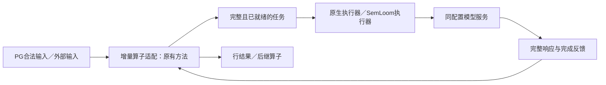

# 语义系统与同后端方法对照

本方案补充同应用任务的数据库与语义系统比较，随后补同后端的简单控制与工作量控制。
研究对象为 PostgreSQL 内置 AI 语义算子的外部分布式物理执行与调度优化。
执行层既有结果继续引用[四路径报告](../results/postgresql/text_map_four_path_comparison_20260930/README.md)；
本方案的原生提示、解析、请求量和质量分别记录，具体身份按[对照规范](reference/对照规范.md#execution-comparison-levels)。
当前准备把下面12条文本Map路径放入同一轮比较。就绪计时按[既有方案](SQL就绪计时.md)扩展；
各新增入口先核对准备、提交和完整消费，再生成具体运行清单。下方已执行清单保留原运行设计与身份。

## 统一Map比较

| 路径 | 实际执行方式 | 在总表中的用途 |
|---|---|---|
| PostgreSQL＋SemLoom（Daft＋Ray） | PG拥有语义与查询生命周期，Daft物化批次、Ray worker调用模型 | 自有主系统 |
| PG-source direct | 普通SQL读取，再由有界HTTP客户端执行完整请求 | 固定语义的简单执行参照 |
| 原生Ray Data SQL→HTTP | 原生SQL reader与HTTP Processor，由Ray拥有执行 | 固定语义的原生执行系统 |
| 原生Daft Native SQL→HTTP | 原生SQL读取与单行异步批次用户函数，由Daft拥有执行 | 固定语义的原生执行系统 |
| LOTUS1.2.4 Map | 原生`sem_map`，LOTUS拥有提示、解析和执行 | 同任务语义系统 |
| Sema作者产物 | 原生SQL语义投影，作者Linux二进制 | 同任务数据库语义系统 |
| DuckDB1.5.4＋ai0.4.14 | 原生SQL `ai_try_complete` | 同任务社区AI扩展 |
| Daft0.7.21 prompt | 内置`prompt`＋Native runner | 同任务框架内置生成函数 |
| PG＋SemLoom本地HTTP | PG语义Map与SemLoom本地执行，使用独立选定的请求数配置 | 主实现的内部执行参照 |
| PG本地HTTP请求数控制 | 固定请求数上限，按输入顺序提交 | 同后端简单控制 |
| PG本地HTTP token表征与宽额度 | 模型文本单位token的工作量描述及相同组织，额度足够宽 | 同后端描述与组织成本 |
| PG本地HTTP工作量控制 | 与上一行同请求数上限、描述和组织，仅降低在途工作量额度 | 同后端工作量限制作用 |

总表为每行保留用途、源码／配置与运行来源；统一排名使用同一轮、相同输入集合的测量。
用户确认核心对照为SemLoom（Daft＋Ray）、原生Daft和原生Ray Data三种系统身份。
SemLoom拥有自有任务接纳与执行控制，原生Daft／Ray基线分别拥有自己的执行与调度。
完整语义系统保留各自原生提示和解析，固定语义的执行参照核对相同消息与生成设置；
共同应用任务允许放在同表，但耗时、质量、实际请求和token工作量同时解释。
Daft内置prompt与Daft Native SQL→HTTP为不同入口，各占一行。主实现的worker复用、物化方式等
具体配置写入配置列；若另作对照，每种配置使用独立行和运行身份。

共同指标包含完整应用耗时、准备耗时、就绪后SQL／API提交至统一消费结束、首行、吞吐、
准确率、失败／缺行／重复、实际调用与token用量、HTTP在途峰值及CPU／内存／GPU资源。
完整查询、批量单行交付、统一代理HTTP分别给出样本数与P99／P99.99；
客户端请求起止可观察时另报真实请求耗时，缺项注明原因。预热、全部重复、慢样本和失败按身份保存。
查询与行／HTTP分别计数；小样本P99.99若选中最大值，只作样本观察，总体估计是否可靠另按样本设计判断。

新一轮使用同一模型服务配置与物理资源、相同原始输入、轮换执行顺序，各路径保留原生执行所有权。
每个系统的有限配置选择机会单独记录；三种控制同时面对独立选定的请求数参照。
首次请求失败、资源超限、缺行／重复／关联错误、非法输出或清理错误即停止当前清单，不自动重跑。
主实现、direct、原生Ray Data与Daft Native的新增就绪入口先验证；Ray后端与组织控制的组合
通过接入检查后才增加相应行。本表的三个方法控制当前按已有本地HTTP路径准备。
OceanBase `AI_COMPLETE`已有SQL适配；[现有对照记录](reference/对照规范.md)保存过容器初始化失败，
本轮尚未确认指定服务器有可用实例。恢复连接后先只读核对，满足输入、原生调用和计时要求后再列入新清单，
不把适配存在写成已运行，也不将尚不可运行的产品填成零耗时。

Map使用同一原始评论关系与二值情感任务，各系统保留自己的原生提示和解析。
不对原生系统注入SemLoom组织、提交或路由策略。请求预算与透明观察只记录实际发送，
不改变正文、不重试、不缓存响应。每条查询包含输入读取、原生输入构造、执行和完整结果消费；
模型服务启动、离线数据准备及事后质量评价单列。

Sema来源固定为[作者仓库](https://github.com/BITQiKangK/SemaSystem/tree/3f2c7182bdaa26c1e8925f486585da25337e687e)，
公开文件为`Sema.zip`，实际二进制版本`v0.0.1 8c2d3bd2`，摘要
`15a534667a668a152524a8756fe5d66c0fa9c9822e73d26029e1a71693a56ec3`。
公开版本发送JSON字符串生成要求，但未暴露请求级输出长度旋钮；服务统一默认输出上限128，
其他Map系统显式请求128。保存实际请求与服务配置，不能据此称提示或模型工作量相同。
当前只验证作者二进制与SQL入口，不声称已审查其未公开实现或复现全部作者实验。

## 原生baseline性能预演（2026-10-09）

用户要求先测已可运行baseline的表现。范围为PG-source direct、原生Ray Data、原生Daft Native、
LOTUS Map、DuckDB AI、Daft内置prompt和Sema七条路径；新增SemLoom适配由工程任务完成后另做成对验证。
本轮使用同一Movie输入集合、缓存Qwen2.5-7B-Instruct、GPU0单实例与既定服务配置。
各原生系统保留自己的提示、解析、提交与并发控制，记录不同模型工作量，不将整体差异全部归因调度。

先用确定性替身核对七个入口，再进行每路径16行正确性、128行规模检查。
有限配置比较采用128行、4／16／64三个并发候选；Sema采用1／4／8个原生线程。
每候选预热一次、测量三次，配置确定后以512行预热一次并轮转顺序测量十次。
共175条真实查询、最多51,184次模型POST，最长60分钟，最后120秒保留清理；单查询最多120秒。
首次协议、关联、缺行、重复、非法输出、计数、配置或超时错误停止本轮，保存失败，不自动重跑。
候选选择只代表这些有限点的表现，不声明已达到持续供给或服务饱和平台；正式扩展按新的实际签名另行安排。

观测保留完整应用与准备耗时、实际提交SQL／原生接口至读完结果、首行与消费、代理请求阶段、
模型计数／token／队列，以及driver、原生子进程、PG、Ray和模型服务资源。
代理阶段区分接收、读请求体、发送前记账、上游往返、返回观察与响应写出；HTTP往返不等于纯模型计算。
原生请求池之前的任务就绪／排队无法观测时写不可观测，不将代理抵达作为完整请求起点。
请求与整查询分别报告P99／P99.99、样本数和最大值；每路径十次查询不能支持总体极端尾部结论。
同时保存准确率、全部输出、实际调用／token、HTTP峰值、失败／重试和后台工程活动，排查资源干扰。
后台编译或工程检查有明显影响时，本轮结果保持性能预演身份，不并入最终性能排名。

运行代码来自一致交接版本`cbfd952b`，私有有限控制脚本与源码包分别记录散列。
使用仓库外runtime配置并保存只读预检；模型与driver解释器隔离，新输出使用数据盘独立目录。
本会话先负责该baseline运行，整合任务的真实模型预演随后执行，避免同时占用GPU0。

已完成175条查询／51,184次POST，账本／代理／服务计数及独立清理一致；各路径十次512行测量仍是有限预演。
原运行主报告`experiments/results/postgresql/native_baseline_performance_20261009/README.md`由baseline会话单独交付，
合入时保留该入口与实际源码身份；适配器模型试跑不与之合并样本。

## 原生与SemLoom的常驻查询补测（2026-10-09）

用户要求排除服务和执行器启动，比较系统准备完成后的实际查询耗时。本轮承接已完成的13条
工程适配路径，保留原来的首次运行结果；不从旧耗时中扣除首批工作来估算预热结果。
研究对象仍为PostgreSQL 内置 AI 语义算子的外部分布式物理执行与调度优化；本轮为外部输入
及原生SQL适配的生命周期观察，不代表PG多算子接入或完整性能排名。

用户补充的审查意见建议先查清生命周期与首次payload，而不是扩大系统名单。
真实模型本轮采用共同固定Map的Daft／Ray／SemLoom三条，以及LOTUS单Map的原生／
SemLoom本地执行诊断／SemLoom Daft＋Ray三条。本地诊断保留同一执行核心，绕过Daft／Ray，
不称普通HTTP或LOTUS原生。首组先完成这六条路径；DuckDB和Sema按下述追加清单继续，
两Map的已有接入证据保留，本次不重复模型测量。
每条路径在独立调用进程中复用连接、LM、Ray会话及SemLoom请求worker，按预先声明的路径顺序
分块执行；需要Ray时各自使用8CPU集群，不让另一条路径的闲置actor占其逻辑名额。
全部路径共用同一模型服务；本轮不称随机化交错比较，顺序与前后服务计数保留。
补充只读核对原生Daft可复用客户端和batch设置，
采用的实际实现及其局限明确记录，不把固定接法称为原生最佳性能。
原生Ray Data按原API管理每个执行图的actor，若图间自动重建，保留该行为并记录身份；
不能通过更换其执行器制造常驻收益。无法证明复用的对象明确列出，不称完全预热。

输入复用已有资格集合的前8行与已有规模集合的128行，保持原始行ID、文本和参考答案，
不是新留出的质量数据。单Map原生与SemLoom核对实际完整调用值。之前两Map的后继任务变化
及Sema后置接入的供给差异继续由原报告说明，不借本轮六条路径补测消除这些缺项。

每路径先进行1次8行正确性查询；随后分别在8行和128行执行固定2次同形状预热及5次测量。
共90条查询，最多5,760次真实模型POST；运行最长30分钟，
单查询120秒，最后120秒保留清理。预热不足或耗时仍变化时记录原值及初始化事件，
不追加预热、改变配置或只选快样本；该范围不提供总体P99／P99.99或服务饱和结论。

使用指定服务器GPU0、缓存Qwen2.5-7B-Instruct和独立driver／vLLM解释器；服务BF16、
单实例、context4096、max-num-seqs128、max-num-batched-tokens8192、FCFS、chunked-prefill开启、
prefix-cache关闭，单调用输出上限128。SemLoom保持请求4、worker2、batch2、payload2MiB、
对象8MiB、Ray对象存储256MiB；原生库配置沿用前次小清单，不能根据本轮性能在线选择。
实际签名、CPU分工、服务命令及模型／二进制摘要由运行配置和只读预检保存。

调用方释放新查询至统一消费EOF为主要指标，保留实际SQL／原生API提交时刻；
当前查询特有的输入处理、提示构造、图创建、物化及消费都计入，一次性准备和owner退出另计。
同形状预热不提前准备当前测量查询的首批数据；不从旧时间或日志累计时间扣出所谓纯执行耗时。
保留输入／方法准备、首批生成内部步骤、对象写入、请求就绪／提交／返回、HTTP各阶段、
首行与全部结果、逐次质量、调用／token、资源曲线以及跨查询的对象身份。
首批工作观察内部墙钟；本次固定源码没有单函数线程／进程CPU探针，该项写不可观测。
进程树观察从准备开始覆盖到退出，包括RSS、可取的PSS、CPU时间及创建身份，不能冒充单函数CPU。
对象写入保留单次分布、每查询次数和累计／时间线覆盖，重叠部分不扣减总时间。
本轮保持完整诊断观察，低扰动观察的敏感性检查尚未完成时明确说明；不关闭请求保护或通过扣除日志改写耗时。
缺乏独立起止的组织、纯排队或模型内部计算写不可观测；没有数据库写回时明确说明。
每查询结束核对行／调用对应、资源全部归还、缓存政策、代理／账本／服务计数；
协议、关联、非法值、计数、配置、超时或清理错误首次出现即停止，保留失败，不自动重跑。
正常分类错误保留在质量分母，不作为系统错误抹去。

先通过真实库HTTP替身的跨查询复用与旧入口回归，再打包固定源码并启动有限后台owner。
原始成功、失败、预热及测量全部保留；结果进入现有适配主报告，生命周期与性能结论分开。

执行状态：六条路径各15条常驻查询均完成，共90条／5,760次真实POST。独立复核确认同方法
调用值一致、实际worker与Core／LM身份复用、全部结果和质量对应、资源归还及服务计数。
主模型owner运行884.690秒；两次0请求准备失败与后续沿原额度和结束时间继续的记录保留。
实际源码为整合分支的`resident-source02`，完整记录见[常驻模型报告](../results/postgresql/native_adapter_integration_20261009/README.md#persistent-model)。完整诊断观察下LOTUS发送前回调等待增加，
低扰动敏感性尚未测量；本轮结果不用于纯执行核心归因或跨系统统一排名。

### DuckDB AI与Sema的常驻查询追加

用户随后提供LOTUS接入性能审查，要求先确认接入正确高效，再开始追加模型。
追加模型当前暂停；LOTUS方法适配、公共执行推进、DuckDB批次桥、Sema服务和统一观察分别
开展无模型诊断与最小修复，整合者负责旧路径回归及真实库常驻检查。
诊断使用既有完整请求／响应和有上限的HTTP替身，记录调用次数、函数墙钟与线程／进程CPU、
实际线程位置、接纳／提交／响应／释放及查询时间轴，不把profiler输出作为系统性能排名。
同时检查平均HTTP在途和仍有必要工作时的空档；上游HTTP区间不等于GPU模型内部计算。
旧模型记录没有批请求返回时刻时明确写未采集，不按其余事件猜测。
修复保持提示、解析、usage／费用统计、错误、取消、资源责任和实际出站核验，
不通过扩大并发、删除统计或去掉请求保护制造速度改善。
常驻管理另行检查部分初始化失败：事件记录成功后代理进入失败、执行实例成功后LM／
tokenizer初始化失败，均须关闭已取得资源；正常关闭不能重复执行后端退出。
查询错误、清理错误、状态读取与摘要写入错误分别保存：已有查询第一错误继续作为主要错误，
没有查询错误时传播最早的退出或记录错误。回归包含取消等待者、迟到结果归还容量、
未知远端工作、部分接纳、结果重排及协议失败；替身成功和真实模型资格分开记录。

用户要求同时覆盖原生数据库语义系统。追加DuckDB AI原生／SemLoom批次接入两条，
以及Sema原生直连／透明转发／SemLoom请求服务三条，不重跑已完成的六条路径。
先用真实扩展与作者二进制的HTTP替身检查各路径连续查询和8行改为128行时的输入、
行ID、调用数与结果更新；核对DuckDB同一连接、Sema同一进程确实复用，避免沿用旧表或旧请求。
DuckDB使用已固定的公开扩展补丁，原生臂仍由扩展拥有调度；实际库加载环境单独记录。
Sema保留原生SQL、提示、线程和解析，其后置服务仍受上游请求供给影响，不能称执行器替换。
若Sema请求服务的Core或worker按查询创建，该事实和耗时一并保留，写为作者SQL进程常驻、
后置执行核心逐查询创建，不称执行器充分预热。不能通过改变原生算法来配平这项差异。

每路径沿用首组的1次8行正确性、8行与128行各2次预热和5次测量，共75条查询，
最多4,800次真实模型POST，最长30分钟、单查询120秒、末尾120秒用于清理。
模型、GPU0、CPU分工、服务配置、输入与参考答案沿用首组，追加运行重新保存只读预检、
二进制／模型摘要、固定源码与实际配置；不使用已耗尽的首组调用账本。
路径按预先声明顺序在独立调用进程中分块执行，共用模型服务，保留全部成功与失败重复。
不在线调参、增加预热、追加超时或重跑成功单元；首次协议、关联、计数、超时或清理错误即停止。

修复与真实库检查全部通过后，还须对LOTUS原生／SemLoom本地／SemLoom Daft＋Ray三条
按相同15查询清单做修复后模型复核，最多45查询／2,880次POST。
可与上述五条合成一个有限owner，合计120查询／7,680次POST，仍为30分钟、单查询120秒，
以新的账本记录修复后源码；若路径仍未通过检查就保留具体问题，不启动该合并清单。
固定Map旧路径以受影响的fixture回归覆盖，不能把它的提示换进LOTUS来缩短耗时。
新结果与旧负结果分开记录，同方法前后比较保留实际请求、token、质量及观察配置。

时间口径和证据要求沿用上节。当前输入替换、CSV／表导入和提示装配均计入新查询释放到EOF，
同时直接记录SQL提交到EOF，不能将两者混称。Sema三条路径比较实际完整请求和返回值，
DuckDB两条路径比较完整批任务与返回值；调用／token或原生供给不同就单列，不据此做纯调度归因。
每形状五次查询的P99／P99.99仅为有限样本观察；追加结果进入同一适配主报告，注明与首组
共用配置但分时运行，不能把跨系统耗时合并为相同算子策略的排名。

最新LOTUS、DuckDB与Sema异常释放／退出修复已在新的`adapter-repair-source02`共同核对，
源提交`aef350b2`与1,028份文件一致；170项回归及八路径26正常查询／1,154 fixture POST通过，真实模型0。
原`adapter-repair-source01`、旧失败与成功原件保留，模型owner使用新账本和本节120查询清单；
源码身份、检查范围与可复核观察见[最终共同检查](../results/postgresql/native_adapter_integration_20261009/README.md#adapter-final-source)。
新模型清单已完成120查询／7,680次POST，源为`aef350b2`；后续DuckDB内层与摘要修订的CPU检查另按来源登记，不能改写该GPU身份。

### 修复后的有限容量校准待办

已有八路径120查询／7,680 POST对应`adapter-repair-source02`／`aef350b2`，
结果见[修复来源模型报告](../results/postgresql/native_adapter_integration_20261009/README.md#repair-model)。
SemLoom请求4仍是接入及修复诊断配置，不能代表合理调优后的最终性能；Sema原生峰值128也不是最佳点证明。
本节仅登记有限校准的准备与选择要求，尚未实施参数拆分、运行新GPU扫描或确定新的比较配置。
新校准使用完成参数接线后的实际实验源码与独立运行身份；旧`aef350b2`模型记录继续保留为修复历史。

公共只读审计核对`a24ca67b`的31份源码，Core已有独立活动请求数C与持有任务数H。
现有实验owner把H与C都绑定`options.concurrency`，Sema包装还用它设置原生SQL线程；
最小后续工程只需在现有实验入口、group和supplier中分开传已有参数，不新增公共调度机制。
省略新增可选值时保留旧行为；调参显式固定`sema_native_threads=4`、H=128，C作为扫描变量。
C4也须在H128下重新取得参照；旧H4／C4与新H128各点不能连成只改变C的同一条曲线。
不能改用通用`NativeGraphOptions.num_threads`冒充Sema HTTP容量，它还管理通用CPU／原生图资源。

候选C为4、8、16、32、64、128，按观察逐步筛查，不承诺全部跑完；相邻值接近、回落或不可达时
再决定有限邻近点。每候选新建匹配容量的owner和worker pool，不能沿用C4池并只修改options值。
固定H=128、输入与结果各128MiB、每项metadata最多1,024字节；两名worker、集群CPU8、
每actor CPU1、payload batch2／window2MiB、Ray对象存储256MiB及模型服务签名保持。
worker2／batch2不固有地把SemLoom限制在4：actor并发和HTTP连接容量随C装配，Core仍控制全局C。
8MiB传输对象额度能否容纳目标实际Arrow backing buffer仍为pending；先用对应workload的fixture
核对未归还表的`get_total_buffer_size()`和字节计数，一次确定足够的固定额度，再扫描C。
若需要调整字节额度，单列准备检查，不能在各C点悄悄扩大物理资源或留存。

作者固定README及二进制设置的只读核对确认：SQL线程数不是HTTP在途上限；
`llm_rate_limit`表示每秒速率，0为不限速，不能当C；`semantic_batch_size`改变联合提示与请求粒度，保持1。
目前没有核实原生HTTP最大在途或输出token旋钮；原生请求不含`max_tokens`，共同服务默认生成设置另记。
不改后置请求补token字段，也不凭当前128或旧512行峰值256推断作者隐藏池大小。

首轮Sema校准沿用当前逐查询创建Core与worker的部署，选点解释为该部署及查询规模下的合理C。
查询释放至完整消费为主指标，实际SQL提交至完整消费为辅助指标，两者都直接记录；
不将该结果称为纯模型服务或常驻后置执行器的最佳并发，不从旧总时间减去准备中值构造常驻结果。
常驻Core／worker复用另作实现与合法生命周期检查，不作为本轮有限校准的前提。

128行保留为历史小查询；选点另用数百条独立输入，使窗口多次补充，按实际持续时间决定是否增加规模。
不用复制相同文本伪装独立输入，不机械要求每条满60秒；保留未参与选择的最终验证集合。
主选点采用合法完成行数／释放至完整消费时间，全部分类错误仍在质量分母。
记录全部重复、实际prompt／generation token、错误／重试、资源与前端正文留存，
并用共同上游dispatch至完整响应体读取重算平均／峰值在途，另观察vLLM running／waiting、KV使用与preemption。
按部署版本核对实际可采指标；HTTP在途不能代替GPU执行序列，字段不可取时说明缺项。

预先声明近最佳吞吐差异ε=5%，在有效已测点中选择达到最佳吞吐95%的最低C，
对候选及邻近点作交错重复；差异小于测量不确定性时记录不能区分。
最高可达点仍改善时登记“已测最佳、尚未观察到平台”，不以宽平台或硬件绝对极限为继续比较的条件。
随后在未参与选择的数据上核对质量、资源及完整查询，并确定各系统自己的比较配置。

系统比较给原生、透明及SemLoom各自合理调参机会，不要求参数数字相同。
若解释SemLoom相对简单请求数控制的增量，另设“Sema＋简单有界转发控制”参照；
可复用已有服务完整请求／响应和退出处理，给TCPConnector独立容量，默认透明路径保持0。
它尚未实现，不称原生；须核对实际发送／收据、连接池等待、正文留存和超时，
不能把forwarded计数或接纳之后的gateway时间当作完整请求起点。
简单有界转发不阻塞首轮SemLoom容量筛查；声称后置组织／调度具有额外收益前，须补齐该对照。
测试前准备仅包括已有参数的独立传递及目标输入的对象容量核对；两项完成后进入有限筛查与候选复验。
校准后的运行清单再声明源码、环境、资源、停止条件和具体调用数；本次不启动该清单。

## 跨系统算子策略与SemLoom执行接入总体设计

日期：2026-10-09。本文为跨系统接入的唯一总体设计。公共任务入口、LOTUS、DuckDB、Sema及原生Daft／Ray执行参照已整合；
源码、实际库检查与失败修订归[工程报告](../results/postgresql/native_adapter_integration_20261009/README.md)。
新增路径由独立实验入口选择，已有十二路径与原生默认保持；实际能力从[代码状态](../../code/INFRA_STATUS.md)
与[证据台账](../results/EXPERIMENT_EVIDENCE_REGISTRY.md)核对，模型性能结论仍需实际成对运行。

### 目标与首版范围

研究目标为**PostgreSQL 内置 AI 语义算子的外部分布式物理执行与调度优化**。
每个系统保留自己的算子方法，在同一方法下比较原生执行与SemLoom Daft＋Ray执行。
不同系统之间无需使用相同级联算法；同一系统的成对运行需保持提示、模型角色、生成设置、
采样／校准／阈值、联合提示、缓存政策和结果解释一致，并核对实际工作与质量。

首版实现单模型文本Map、完整响应适配，以及一条两Map串行链的外部输入验证。
不全面重写已有算子优化，不先建设任意查询图、全表校准、跨行Join或并行阶段展开。
级联和多个真实模型角色等到具体消费者需要时增加；不把单模型连通解释为这些能力已经支持。
PG继续拥有SQL、普通子计划、快照、权限及查询生命周期；外部执行接口不接收原始SQL重新取数。

### 职责与两个接点

| 拥有者 | 决定与保存的内容 |
|---|---|
| 数据库或原系统 | 合法输入、算子配置、原始行与输出归属、查询取消和错误政策 |
| 算子方法与薄适配 | 提示与解析、方法选择、模型角色、算法必需的等待、当前阶段是否具备执行资格 |
| SemLoom核心 | 已就绪任务的组织、接纳、提交、服务选择、共享容量及结果留存与归还 |
| Daft／Ray后端 | 有限数据块的物理准备、传输和任务执行；不再套入原系统的模型请求池 |
| 模型服务 | 实际推理与服务内部批处理；服务配置与资源在成对实验中一致 |

方法接点承接有限输入与继续执行；任务接点位于原生请求池、限流、排队及物理批次提交之前。
全表校准等算法必需的等待继续保留；仅因原实现采用整表物化或逐批返回造成的等待可以替换。
接点之前已被原生执行器限制的供给，不能通过后置HTTP接入自动恢复。
单算子任务接通不等于跨算子流水；后者还要求输出可以及时交给同一方法的后继。

### 公共信息与实现复用

复用[SessionEngine](../../code/src/scheduling/core/session.py)、
[任务与完成接口](../../code/src/scheduling/core/session_contract.py)、
[方法继续执行](../../code/src/semantic_methods/README.md)及现有Daft／Ray传输。
新增适配处理真实供应商差异，不建立第二套调度、排队、容量管理或方法决策核心。
具体类型和跨语言协议由公共入口任务依据LOTUS、DuckDB两个消费者确定，总设计不预定另一套通用接口。

| 信息 | 首版需要保留的含义 |
|---|---|
| 查询、算子、行、阶段和请求身份 | 同一行可有多个阶段；响应乱序不改变归属；物理分组不重写逻辑身份 |
| 完整调用说明 | 原系统已选消息、模型与生成参数；供应商SDK的参数转换需与原生请求核对 |
| 工作量与局部性 | 显式描述来源、单位和校准身份；获取信息与估算的成本计入耗时 |
| 就绪与继续执行 | 只交出合法就绪任务；结果触发下一阶段；输入结束不等于不再有后继任务 |
| 完整响应 | 原始响应体、HTTP状态及必要响应元数据；保留用量、置信信息与错误，原系统解释结果 |
| 所有权与退出 | 接纳前后谁保存输入、谁留存结果；取消、错误、未知远端结果及清理都有明确处理 |

原系统的一次完整模型调用为任务单位。首版Map每行一次；原方法以后生成的多行联合提示保持整体，
不能借数据组织拆分或合并提示。阶段标识本身不能代替真实的数据依赖和执行资格。
成功响应已有原始字节通路；PG文本完成结果会提取字段，固定模型传输会归并错误类别，
因此跨系统结果适配需另行保留完整响应，旧PG默认接口和错误行为继续接受回归检查。
当前方法驱动支持按行串行继续执行，QueryRegistry只登记流数量；不据此声称已接收完整查询依赖图。

### 已采用接点与源码调查

以下决定来自固定源码、原生请求核对和实际库检查。公共入口复用既有Core与Daft／Ray执行；
供应商接点、SDK转换及响应处理由各自局部说明维护，具体观测与失败进入工程报告。

| 系统 | 固定来源与采用位置 | 保留的供给与适用范围 |
|---|---|---|
| 自有PG | 旧provider、增量Map与旧错误策略保持；私有PG18.3执行旧查询／direct回归 | 新外部输入入口不改变PG语义，不声称已接入PG多Map |
| LOTUS1.2.4 | `b1a85fd7a66fabed8a1585d44d7597d592b4433f`；`LM._process_uncached_messages`进入原生RPM／TPM等待及LiteLLM请求池之前 | 原DataFrame、完整消息、缓存逻辑、统计及解析保留；单Map成对实验关闭缓存并保留整批返回等待 |
| LOTUS两Map | 同版本formatter与parser；复用已有`MethodDriver`逐行继续执行 | 阶段等待原生、阶段等待SemLoom、逐行SemLoom三条路径；后继请求使用真实前继结果，仅外部文本输入 |
| DuckDB AI0.4.14 | upstream `9b7b16a5d5bfa97180b8be48d69bd9a4a4106419`；`PrepareCompletion`后、`RunProviderJobs`前的完整C ABI批次 | 原SQL当前vector和原生解析保留；SemLoom分支跳过原线程池、请求控制、重试及缓存；SQL整vector返回仍保留 |
| Sema作者产物 | v0.0.1、产物名含`8c2d3bd2`；已核对二进制摘要，接公开`llm_url` | 直达、透明转发与SemLoom请求服务三条补充路径；作者SQL、线程、请求池、联合提示及parser保持，原生任务就绪不可观测 |
| 原生Daft／Ray Data | Daft0.7.21／Ray2.56.1；共同完整调用在图外生成，再进入各自原生执行图 | 原生图拥有并发和缓冲；其HTTP kernel不启动SemLoom，旧SQL reader路径继续保留 |
| Daft内置prompt | Daft0.7.21的`OpenAIPrompter.prompt`与表达式源码 | 公共接口合并内容转换、SDK调用和结果文本提取，未提供独立完整调用／响应导出；保留完整系统比较 |

不能取得合适接口的系统，不逆向猜造作者实现；保持原生整体比较，或将可实现的请求服务接入标为补充观察。
新增路径明确命名为对应系统方法＋SemLoom，不覆盖或重命名未修改的原生基线。

### 成对比较与观测

先保留未修改的原生系统，再按实际可实现的共同入口增加适配后原生执行、SemLoom固定执行和待测物理方法。
共同入口若改变原生执行流程，适配后原生路径单独命名；新增适配与序列化成本通过原生路径核对。
同一适配后的短算子链可比较分阶段等待与逐行继续执行；不借此声称已经替换原数据库完整执行器。
原生系统各自保留合理配置，在同资源上限下比较；线程数、批大小和HTTP实际在途数分别记录。

| 指标 | 起止与解释 |
|---|---|
| 完整应用耗时 | 查询准备入口至统一消费端读完结果，保留各系统准备工作明细 |
| 就绪查询耗时 | 数据、连接和组件就绪后，实际提交SQL／原生接口至结果全部读完；不从完整耗时减去准备时间估算 |
| 请求端到端延迟 | 完整任务已就绪、尚未本次执行器准备与排队，至原调用者取得完整响应；供给受限路径缺起点时写不可观测 |
| 数据执行阶段 | 输入供给、方法准备、组织、表示／传输、接纳等待、模型、返回／消费和中间结果留存分别记录 |
| 质量与工作量 | 行／任务关联、输出质量、实际调用与各角色token、失败／重试及资源峰值；客户端尝试不冒充服务端执行证明 |

请求与整查询分别保留全部样本、P99与P99.99。统计单位为模型调用或完整查询，不将一次联合提示的多行当独立请求。
样本不足时报告有限样本分位值与最大值，不宣称已测准总体极端尾部。
按执行时延自适应选择方法的系统，先固定方法选择；实际任务集合或质量不同的运行另报差异。
请求服务补充观察保留原生直达、透明转发和SemLoom服务三条路径，记录上游供给与后置等待。
每次模型POST只累计记一次；旧透明观察代理不因记录事件而变成新的执行器。

### 工程任务与依赖

| 任务 | 交付与完成条件 | 依赖及改动职责 |
|---|---|---|
| 公共任务执行与完整响应 | 基于现有核心提供有限批次入口、关联、退出及完整响应适配；完成乱序、背压、错误、取消和旧PG路径回归 | 首先明确最小接口；拥有公共执行适配、相关测试与局部说明，不改原生算子算法 |
| LOTUS批次与增量方法适配 | 固定源码调查、单Map成对入口、原始请求／响应核对；再用原提示与解析完成两Map外部输入继续执行 | 消费公共接口；拥有LOTUS专属方法适配与测试，不重写级联或扩展PG多Map |
| DuckDB AI批次适配 | 固定版本源码调查、最小可编译改动和单Map接入；证实SemLoom分支跳过原工作线程与请求控制，保留原生解析 | 消费公共接口；拥有公开扩展的最小补丁、构建适配与测试；无法替换时交付具体阻断证据 |
| Sema请求服务适配与能力核对 | 核对作者产物；可实现时提供透明转发与SemLoom请求服务成对入口，保留完整响应及查询退出 | 消费公共接口；拥有Sema接入及测试，保留原生供给身份，不伪称干净执行器替换 |
| 执行参照与整合验证 | 核对Daft／Ray及内置prompt接点；整合已通过接入，补统一指标、同方法比较与PG兼容回归 | 消费上述交付；拥有实验入口与总文档同步，不并行改写各供应商或公共模块 |

实现会话从一致的本地交接版本创建独立工作树，记录所用提交；不修改本会话工作树或main。
各任务先完成自己的源码调查与不依赖公共接口的检查；公共接口未确定时不复制一套临时生产实现。
任务提交仅包含自己拥有的文件和验证；公共模块变更由公共任务负责，总入口与状态同步由整合任务负责。
交接包含提交、改动范围、上游版本、检查原值、未完成项和源码所证明的供给范围，不能以计划或mock替代真实接入。

首轮并行工作以工程实现、确定性替身和可用原生库验证为主。真实模型由整合任务集中安排，
先读runtime规则、保存只读预检并编制有限资源、配置、重复与停止清单，不并行抢占同一GPU。
用户已有持续服务器使用授权，工程阶段不重复索取额度批准；失败运行、旧报告与原始证据继续保留。
接口整合的fixture检查模型调用为0；随后13路径／39查询／384次模型预演通过，来源、原值、差异及退出归工程报告。
原生baseline的175查询／51,184次运行独立保留。模型性能、多模型角色、真实级联、
跨行Join、并行展开及PG多Map保持`pending`。

依据：[LOTUS LM](https://github.com/lotus-data/lotus/blob/b1a85fd7a66fabed8a1585d44d7597d592b4433f/lotus/models/lm.py)、
[LOTUS Map](https://github.com/lotus-data/lotus/blob/b1a85fd7a66fabed8a1585d44d7597d592b4433f/lotus/sem_ops/sem_map.py)、
[DuckDB批次执行](https://github.com/leonardovida/duckdb-ai/blob/9b7b16a5d5bfa97180b8be48d69bd9a4a4106419/src/duckdb_ai_extension.cpp)、
[DuckDB provider](https://github.com/leonardovida/duckdb-ai/blob/9b7b16a5d5bfa97180b8be48d69bd9a4a4106419/src/duckdb_ai_provider.cpp)、
[Sema作者说明](https://github.com/BITQiKangK/SemaSystem/blob/3f2c7182bdaa26c1e8925f486585da25337e687e/README.md)、
[Kalypso: Relational LLM Serving](https://arxiv.org/html/2607.23815v2)与
[既有前端审计](../../docs/research/lotus_postgresql_execution_layer_fit_20260821.md)。
Kalypso提供方法与执行分离的参照；本设计不据此承诺远端KV缓存驻留或复制其完整执行栈。

## 输入与设置

- 目标为用户指定服务器，单张RTX4090、GPU0；另一张卡不计入本轮资源。
- 使用已缓存Qwen2.5-7B-Instruct，revision为`a09a35458c702b33eeacc393d103063234e8bc28`；
  vLLM0.25.1、BF16、单模型实例、FCFS、context4096、max-num-seqs128、batched-token8192，
  分块输入处理、前缀缓存关闭，显存比例0.8。保留实际启动参数与模型文件身份。
- 驱动与模型服务使用现有独立环境。查询驱动及PG使用相同8个可用CPU；各原生系统保留自身并行设置。
  实际HTTP峰值另测，不把Daft的并发参数或Sema线程数视为相同的在途上限。
- 复用既有原始Movie CSV。按电影分组划分调参128行与评价512行，排除已知使用过的电影、原始ID和文本；
  资格检查取调参前16行。保留源摘要、选择种子、排除记录和token长度；不截断原文。
- 原始SemBench Movie Q3使用固定checkout `c814e3807e72d4cf876b852b17e77f3cc94575c2`与既有2000行源，
  `taken_3`共120行。PG和LOTUS各16行检查，再各1次预热＋3次完整查询。逐行真假审计与原始COUNT评分同时保留。
  这是首次该查询的模型比较，不能把它与Map的新评价集合并为一个独立样本集。

## 有限运行清单

| 内容 | 配置与轮次 | 真实请求最大数 |
|---|---|---:|
| 五系统Map检查 | 每系统16行一次 | 80 |
| Map有限选点 | 每系统3点，128行，每点1次预热＋3次轮换测量 | 7680 |
| Map独立评价 | 每系统固定选点，512行，1次预热＋3次轮换测量 | 10240 |
| PG／LOTUS原始Movie Q3 | 两路径各16行检查；各4×120行 | 992 |
| 同后端控制检查 | 请求数FIFO、仅token表征、工作量FIFO各8行 | 24 |
| 工作量有限选点 | 两点，各4×128行 | 1024 |
| 三控制独立评价 | 每控制4×512行 | 6144 |
| **合计** | 新账本；含全部预热 | **26184** |

Map的前三类原生API与PG请求数候选为4/16/64；Sema按原生线程数1/4/8比较，批量大小保持1。
每系统获得三个有限候选及相同重复机会，以完整查询耗时中位数选点，保存选择摘要后才评价。
该选点只代表已测集合，不表示稳态吞吐平台或充分搜索后的最优配置。

同后端三控制复用现有PG Map与组织接口：简单请求数FIFO使用前组PG选点；
token表征但不限制使用C64与足够宽的工作量额度；工作量FIFO在C64下只选4096/16384两点，
其余输入、顺序、存储与观测保持。tokenizer初始化和描述成本计入查询时间。
组织信息的增量、实际限制与代价按[数据组织](数据组织.md#m1-throughput-platform)核对；
持续供给或平台条件不满足时停止相关方法结论，保留已执行结果，后续条件阶段不自动运行。

## 质量、资源与停止

主表记录全部重复、完整耗时、首行、有效完成、合法标签、真假错误、输出差异、实际调用与token工作量。
Sema的JSON字符串与其他系统的纯文本结果分别保存原值及各自解析后的值；不补标签或删掉错误行。
普通分类错误进入质量分母；关联、缺行、重复、非法输出、计费、配置或超时错误立即停止当前清单。
完整查询、准备、模型活动与结果消费分别解释，不把启动耗时或观察开销直接算成调度方法收益。

整体最多45分钟，单查询最多120秒，保留最后120秒清理。每次实际发送先提交持久计数；
累计上限26184，不退款、不重试、不复用历史额度。首次失败保留已完成与失败单元，
没有新授权不补跑失败单元或开始另一份清单。

原始输入、输出、协议与账本在仓库外保存；公开材料保留脱敏的身份、计数、全部重复和复算入口。
结束核对PG、模型与子进程、请求活动、GPU、端口及临时ACL恢复。单进程RSS不当作完整系统唯一物理内存。

真实运行须取得覆盖以上清单、服务器、资源和停止条件的用户授权；本方案本身不启动模型。
多Job、图像、Filter真实成本校准及更多组合查询继续按各自计划，不能由本轮单Map或Q3替代。

## 首次执行与拟补充清单（2026-10-08）

用户已批准上述两组按顺序执行。首次真实清单在32次调用后停止：PG＋SemLoom的16行检查通过，
Sema的16行均为非法分类标签；其余系统、调参、独立评价、Q3与方法组未开始。
[运行报告](../results/postgresql/semantic_system_comparison_20261008/README.md)保留原始响应、计数与停止核对。
Sema原生JSON字符串的解析与返回值一致，尚不能认定具体模型或结构化生成实现为原因。

用户于2026-10-08进一步要求处理Sema并继续其他系统，覆盖本节修订清单。
使用新运行标识和新预算，沿用原硬件、缓存模型、输入、有限选点与重复次数，总上限22,600次和45分钟。
Sema先核对原生格式，再尝试在SQL应用指令中明确JSON字符串；作者二进制、请求schema与解析保持。

| 顺序 | 内容 | 请求最大数 |
|---|---|---:|
| Sema处理 | 同提示保留／移除JSON格式各8次，再以明确JSON字符串的原生SQL检查16行 | 32 |
| 原生入口检查 | LOTUS Map、Daft prompt、DuckDB AI各16次；既有PG检查保留 | 48 |
| 四系统有限选点 | PG、LOTUS、Daft、DuckDB各3点，每点4×128行 | 6144 |
| 四系统独立评价 | 每系统固定选点，4×512行 | 8192 |
| 原始Movie Q3 | 依原方案PG／LOTUS检查及4次完整查询 | 992 |
| 同后端方法组 | 依原方案检查、工作量选点与三控制评价，条件不满足则停止后续阶段 | 7192 |
| **新清单合计** | 含全部预热；45分钟、GPU0、单查询120秒 | **22600** |

前16次定位结构化生成对标签的影响：完整消息保持，显式移除`response_format`的路径记录为诊断。
随后16次仅改变作者SQL中的应用指令，明确所需JSON字符串编码，不修改传输正文或修补输出；
通过后才认为该格式适配可用。诊断允许保留非法标签，HTTP、关联、计数和长度错误仍停止；
随后完整系统比较继续首次错误即停、不重试。Sema原始失败作为覆盖结果保留，未通过则不参与有效排名。
不改作者二进制、传输请求schema、输出解析或模型。Sema格式通过但方法持续供给条件不满足时，
可将不再使用的方法额度中的最多3,584次用于Sema原生三线程候选及独立评价，依原五系统机会和重复次数；
总上限22,600不变。若方法条件满足则优先完成方法组，Sema重复评价另记待完成。

## 文件容量修订后的补充清单

Sema格式修订已通过16行真实检查；四系统的三点调参完成。当前清单在Daft的512行预热因
进程文件描述符不足停止，已发送8,009次，另有0请求的准备失败；原件保持。
512行模拟检查在临时驱动soft limit8192下通过；新入口先检查`3×源行数+128`的保守文件额度，
检查只读，不替原生系统限流。共同驱动使用8192额度与相同8个CPU，模型服务条件沿用。

LOTUS新设置显式使用`LITELLM_LOCAL_MODEL_COST_MAP=True`，关闭启动时的远端价格元数据获取；
该设置来自已安装LiteLLM的公开环境选项，调度与提示保持。旧联网等待及数据不作为新配置的排名依据，
LOTUS三点调参重做，PG／Daft／DuckDB保留已完成且文件额度未触及的128行调参身份。
用户于2026-10-08授权在确认可运行后使用真实模型。五条Map路径各512行和PG／LOTUS原始Q3
各16行已通过同环境模拟验证，实际模型请求为0；随后执行本补充清单，最大14,408次、45分钟、
GPU0和缓存Qwen2.5-7B：

| 内容 | 请求最大数 |
|---|---:|
| 五系统同环境16行检查 | 80 |
| LOTUS本地元数据三点调参 | 1536 |
| Sema修订格式三线程候选调参 | 1536 |
| 五系统512行评价，各1次预热与3次轮换测量 | 10240 |
| PG／LOTUS原始Movie Q3检查与评价 | 992 |
| 同后端三控制的8行工程检查 | 24 |
| **合计** | **14408** |

此前完整查询和失败保持，预留未发送的263次不退款。新清单有独立预算及运行身份；
原来只有预热的评价不混入新的测量聚合。新评价仍与128行调参集合分开，但512行集合已被部分使用，
称为同集合工程补测，不称为首次未见样本。
已完成容量扫描的持续供给不满足计划要求，工作量选点与方法性能评价继续待完成；
本清单的24次只检查工程路径，不支持方法收益结论。首次错误停止、不自动重试。

该清单的实际执行与剩余方法资格归[主报告](../results/postgresql/semantic_system_comparison_20261008/README.md#文件容量修订后的完整补测2026-10-08)，本方案保留原设计要求。

## 单请求与完整查询尾延迟

用户于2026-10-08要求五系统与三种同后端控制同时比较单请求端到端和完整SQL/查询的P99、P99.99。
现有全扫描数据按查询准备入口到每行被统一消费端读取计算行级分布，另保留完整查询和release至EOF。
每行一个完整模型调用；外部逐请求到达时刻没有记录。原件的7,704行时刻已离线恢复，模型0，
结果归[主报告](../results/postgresql/semantic_system_comparison_20261008/README.md#三种同后端控制及两类尾延迟)。

现有五系统每条路径1,536行／3条完整查询，三控制各8行／1条查询，P99.99最近秩均落在样本最大值。
完整查询的P99也落在最大值。保留这些样本值和缺项，不把行数当作独立SQL数量，不声称高分位资格。

### 已授权的有限扩测清单

用户于2026-10-08批准以下新清单，旧14,408次额度不继承；最大823,424次、6小时、用户原服务器GPU0，
缓存Qwen2.5-7B及原vLLM服务条件。每个查询仍使用相同8个CPU、soft file limit8192，
单请求30秒、单查询120秒、预留最后120秒清理，首次错误即停止，不重试、不退款、不自动开始另一份清单。
用当前同一512行集合表征重复批量查询的延迟，保持原生提示／解析／执行和质量审计，称同集合扩展观察。

五系统保持已选择的PG C16、LOTUS C16、DuckDB C64、Daft C64、Sema4线程。
三控制统一C64：请求数FIFO；token work组织与宽W262144；同一work组织与W4096。
两种work路径的窗口64、组内16、组work4096保持；请求数FIFO的组织仍为其原路径。
新增C64请求数控制与原C16工程检查分别标识；现有PG C16作为已经调优的静态参照。
组织信息、准备、HTTP和消费等待分别解释；持续供给和方法资格仍按数据组织方案，不自动认定方法收益。

| 内容 | 每路径数量 | 路径数 | 最大模型请求 |
|---|---:|---:|---:|
| 同环境真实资格 | 16行一次 | 8 | 128 |
| 512行完整预热 | 1条查询 | 8 | 4096 |
| 固定512行完整查询轮换测量 | 200条查询 | 8 | 819200 |
| **新清单合计** | 1616条查询，含资格与预热 | 8 | **823424** |

测量部分每路径102,400个行／请求观察，200条完整查询；保存每次原始时刻、身份、失败和全部尾部样本，
不只导出成功子集，也不使用服务直方图的插值来代替逐条时刻。始终同时报告行数和独立查询数，
按查询分组的变化另列。模型预算同时覆盖全部资格和预热，执行前刷新只读环境／版本／源码／模型核对。
三控制各512行的模拟路径通过，共1,536次本地响应、模型0，资源清理通过；只读环境检查与身份核对通过。
该清单已停止，实际执行与故障见[主报告](../results/postgresql/semantic_system_comparison_20261008/README.md#tail-transport-failure)，完整应用与补测判断见[分析](../results/postgresql/semantic_system_comparison_20261008/README.md#tail-comparison)。

这份清单扩大行级P99/P99.99与查询P99的观察，不能承诺总体高分位资格；查询P99.99的最近秩仍是200条中的最大值。
行级观察也共享查询准备和排队，不视为102,400次独立查询。若按“上方约10个观察”选择P99.99目标，
需约100,000个对应统计单位：以512行SQL为单位时，每路径约51,200,000次模型调用，8路径约409,600,000次。
这只是数量换算，不是普遍充分样本阈值，也不授予如此规模的执行；独立性、到达模式和统计精度仍须单独设计。

6小时为停止上限，按当前冷驱动完整耗时作有限预算估计，可能不能完成全部200轮；届时保留未完成状态。
单行SQL、小批量SQL或常驻驱动会改变工作负载或生命周期，若选用须单列新配置和0模型检查，不能替代原512行SQL。

### 实验记账与主实现返回链路的补充观察

用户要求结合侧边聊天《审查四路径结果并定位准备开销》，同时补SemLoom Daft/Ray主实现的返回链路诊断。
该聊天的现行来源为main `91aec567`中的[返回分段报告](https://github.com/3444374/ai-operator-execution-optimization/blob/91aec567/experiments/results/diagnostics/map_queued_preparation_20261008/README.md#ray-return-wait)。
其真实Ray、模拟actor结果表明局部接收等待减少可以伴随完整消费变慢；不能把线程记账直接推荐为默认。

八路径原运行使用已核对源码与配置。已有事件补出查询准备、PG任务观察至HTTP开始的有符号时差、
HTTP结束至Map完成和统一行交付，以及原生代理收到上游响应后的观察处理。
HTTP观察包含发送前持久登记及记录；事务完整起止、原生客户端回调和原生响应至行交付的同钟关联没有采集，明确保留缺项。
这些行级时段会重叠，累计值不从完整查询时间中扣除，也不改名为纯模型或GPU时间。

独立主实现诊断使用main `91aec567`的Core、Daft物化及Ray传输；actor只校验fixture字节、等待20–26毫秒并返回确定结果。
四组为即时／准备追加与同步／线程登记的组合，每组16行检查、1024行预热及三次交错测量，
合计20次运行、最多16,448次模拟actor行处理、600秒，HTTP／模型／PG／GPU均0。
最多留存128行、活动请求与work64、batch16、准备2MiB、对象4MiB、Ray8个CPU槽位与256MiB对象存储；
保留当前默认，不增加准备计时等待，不取消逐行持久登记。它在当前模型扩测结束并核对清理后执行，避免改变正在测量的运行条件。

在原worker结束→driver future回调→Map读取之外，新增实际`reserve`调用起止、调用线程CPU时间、
自愿／非自愿上下文切换和有序消费时刻，依据出现序号核对请求／登记／调用／结果及资源归还。
线程CPU与墙钟的差只说明该线程未持续执行，不能单独区分存储等待、解释器调度或OS抢占。
任务分批、提交时间和全部耗时同时报告；一次探针不能证明模型路径的净收益。

本机最小复现与服务器探针的实际结果统一归[主报告](../results/postgresql/semantic_system_comparison_20261008/README.md#main-return-observation)，本方案只保留设计与采集要求。
服务器探针已完成，实际结果见上述主报告；该诊断不含模型请求。
