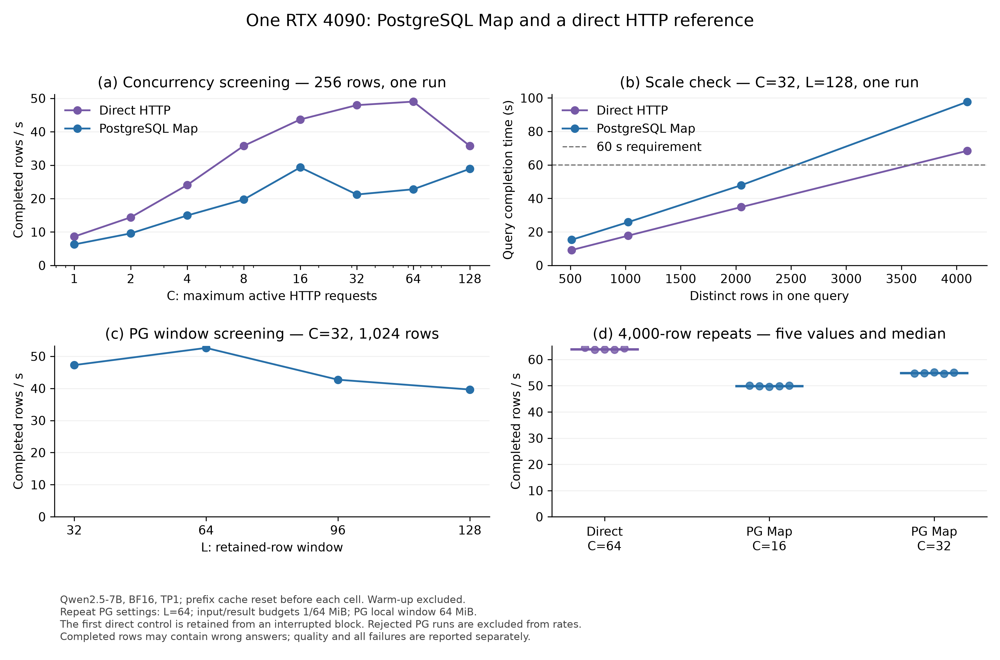

# PG Map 测量修复与单卡容量画像

> 2026-09-10 后续审查：本报告保留原始版本和运行数字。旧记录器部分失败查询的终点可能包含
> 输入流退出时的清理等待；不根据后续受控复现回写这些历史时间。执行修复与新增查询的当前
> 安排见[独立工作包计划](../../../plans/data_organization_batching.md#当前实施执行修复与数据库查询套件2026-09-10)。

日期：2026-09-10。角色：内部工程与校准记录。研究对象为 **PostgreSQL 内置 AI 语义算子的外部分布式物理执行与调度优化**。
当前合同见[数据执行计划](../../../plans/data_organization_batching.md#当前-pg-单-map-数据执行切片)。

已完成可复跑的 Map runner、独立 producer 绑定、可扩规模预算、分阶段记录、真实单卡画像与独立样本验证。
C 表示活跃 HTTP 请求上限，L 表示可保留的行窗口；D0 是后续组织方法比较需要使用的固定静态参照。
**强静态 D0 尚未成立**：稳态重复只覆盖 PG C=16/32，C=32 仍比 C=16 快；C=64/128 只有短诊断，
不足以证明同规模吞吐平台。当前选出的 **候选为 C=32、L=64**，不把它登记为已完成的强静态参照。

## 目的、设置与自检

本轮把上一轮的小样本验收工具扩展到可检查的容量测量，回答服务供给、窗口、字节预算与观测是否影响结果。
没有实现新的组织/调度算法。direct 是复用同一 HTTP transport 的独立有界客户端，不经过 SessionEngine/组织器，
身份是诊断参照；PG 使用真实 SQL、SemMap、v6 和当前静态执行装配。

| 项目 | 实际设置与检查 |
|---|---|
| 授权 | 最多 100,000 次模型请求、2 小时；独立 SQLite 预算，无退款或后端重试 |
| 数据 | SQuAD v1.1 dev，官方 SHA/10,570 行检查；全部消息先计 token，再按 context 分组、种子 20260910 选样 |
| 子集 | tuning/evaluation 的 context 不重叠；自然/分层样本每侧各 5,000 行；不按答案正确与否选样 |
| 消息 | 原有最短答案 Map system/user 模板；temperature=0、top_p=1、max_tokens=64、n=1、stream=false、stop=null |
| 模型 | Qwen2.5-7B-Instruct，revision `a09a35458c702b33eeacc393d103063234e8bc28`，9 个文件运行前后核对 SHA |
| 服务 | 单 RTX 4090、TP1/BF16；vLLM 0.25.1、FCFS、max_model_len=4096、max_num_seqs=128、max_num_batched_tokens=8192、GPU memory utilization=0.8 |
| 缓存与编译 | chunked prefill/prefix cache 开启；实际捕获 FULL/PIECEWISE CUDA graphs；每单元先清空前缀缓存，并检查 engine 成功日志 |
| PG | PostgreSQL 18.3，独立安装前缀和数据目录；默认关闭的测试期行绑定观测，不改 wire 或执行策略 |
| 查询 | `SELECT source_example_id, ai_semantic.map(input_text, instruction, options) FROM ONLY capacity_inputs`；导入/读回/ANALYZE/EXPLAIN 在查询计时外 |
| 计时 | JCT = 观察到 EOF/终止错误 − 应用释放查询；首/末接收、结果持久化、stream 清理与外部清理另记 |
| 质量 | 合法完整但答错仍进入 EM/F1 分母；错行、消息漂移、非法完成和资源拒绝不能作为有效性能值 |

完整配置与软件来源见 [service-identity.json](raw/service-identity.json)、[preflight.json](raw/preflight.json)、
[data-profile.json](raw/data-profile.json) 和各运行清单。输入范围为 **76–852 tokens**，中位数 205、P95 354，
均满足输入加 64 输出预算不超过 4096；没有文本截断。分层样本本轮只完成离线准备，未另开模型实验。
实际完整执行覆盖 tuning 的 4,096 个、evaluation 的 2,000 个不同 source ID，共 6,096 个；
96,601 次调用包含重复，不能理解为同等数量的不同问题。
实际软件版本见 [runtime-versions.json](raw/runtime-versions.json)：driver Transformers 4.57.6、
serving Transformers 5.14.1，使用相同 tokenizer 文件；完整重复及独立评测的实际 prompt usage 已逐行核对。

## 工具修复与验证

| 修复 | 可检查的行为 |
|---|---|
| producer 绑定 | PG 在 offer 前记录原始行 ID/stream/sequence/digest，再记录实际接纳；沿已有 planner tuple binding 找列，不从完成或 attempt/offset 反推 |
| 大额度预算 | v1 创建/追加前检查 64 KiB 容量；新单元先持久预留、一次 claim、运行中内存扣减；崩溃和未用额度不退款 |
| 查询记录 | received/recorded 分开；EOF/错误、刷盘与清理分时段，失败保留部分结果，评价失败不改写执行事实 |
| 观测与评价 | 有字节/条数上限的后台事件写入，满队列/写盘失败使单元失败；评价后置，当前评价字典仍受声明行数约束 |
| runner | 同一配置入口运行 direct/PG；独立工作量、预算、记录、评价、进程 RSS；服务/事务仍由调用者拥有 |

本地/Linux **各 214 项相关测试通过**；PG 严格编译、回归 **1/1**、14 个 TAP 文件 **2,032/2,032** 通过。
新增 26 项 PG 检查覆盖默认不记录、引用现有列绑定、重复 payload、带引号行 ID、同一连接不同查询从零编号及缺失列拒绝。
真实 PG＋本地 HTTP fixture 另完成两个查询的乱序/重复输入检查，模型请求为 0。
来源：[Linux 最终测试](raw/linux-final-tests.log.gz)、[PG 最终回归/TAP](raw/installcheck-final.log.gz)、
[fixture 验证](raw/fixture-pg2-driver.log.gz)。

运行基于 `main@14acdc44` 的隔离代码副本。最终 **683 个非 Markdown 代码目录文件**与本地实现一致，
见 [source-final.json](raw/source-final.json)。前 19,520 次请求后的唯一执行工具文件变化，是为尚未运行的
qualification 模式选择完整私有事件，防止拿公开脱敏输出验证原值；缓冲模式参数不变，随后真实 qualification 检查通过。
[该差异](raw/qualification_observer_change.patch.gz)与[初始代码指纹](raw/source-before-model.json)保留，未把不同来源隐藏成同一快照。

## 全部运行、规模与重复值

[queries.csv](raw/queries.csv) / [queries.json](raw/queries.json)保存全部 63 个查询的配置、状态、时刻、行数和质量；
[units.json](raw/units.json)保存 61 个单元的观测、RSS 与逻辑资源。

预算共预留 **99,808**，实际出站与 vLLM HTTP 200 日志均为 **96,601**；差额 **3,207** 是失败单元未使用但不退还的预留。
共有 **62 个完整查询、1 个失败查询**。两个 trace-off 查询仅用于观测诊断，不能代替独立 producer 资格。
完整原文/预测及逐行记录保存在仓库外私有归档；公开材料不含这些文本。

TP1 指张量并行度 1，BF16 是 16 位浮点精度；EM 是答案完全匹配率，F1 是答案词重叠分数。
图中完成行吞吐包含合法但答错的结果；答案质量另报。前三个面板是单次诊断，不能与第四个面板的重复值混为同一证据。
图源、SVG 与检查见[图审计](../../../../figures/audit/map_capacity_20260910.md)。

固定 C=32、L=128 扩大规模时，4,096 行 direct/PG 的 JCT 为 **68.430/97.657 s**；
相较 2,048 行，单位吞吐变化均约 2%，满足本轮 60 s 和约 3% 规模稳定条件。
随后以 4,000 行做重复，每次仍超过 60 s。

| 路径 | 五次 JCT（秒） | 中位数（秒） | 中位完成吞吐（行/秒） | 平均 EM / F1（%） |
|---|---|---:|---:|---:|
| direct，C=64 | 62.046, 62.763, 62.679, 62.718, 62.233 | 62.679 | 63.817 | 81.600 / 90.272 |
| PG，C=16、L=64 | 79.930, 80.201, 80.610, 80.276, 79.961 | 80.201 | 49.875 | 81.600 / 90.270 |
| PG，C=32、L=64 | 73.073, 73.024, 72.611, 73.338, 72.637 | 73.024 | 54.777 | 81.650 / 90.308 |

首组因 PG 8 MiB 资源拒绝中断；已经成功的 direct 对照按预先声明保留，后续 PG 使用独立新单元。
direct 不读取 PG 本地字节参数，因此其推理条件没有改变；没有按对照结果高低挑选或重跑。
这不是五组均连续无中断的实验。见[原重复清单](raw/repeats-schedule.json)和[后续清单](raw/final-schedule.json)。
原清单在首个 direct 和失败 PG 后停止，未执行的项目没有继续调用；后续 14 个查询使用同一总预算另行登记。

在重复过的 PG 16/32 中，C=16 的中位吞吐为峰值的 **91.05%**，不满足 97% 规则；候选选 C=32。
其吞吐为 direct C=64 的 **85.83%**。两个路径活跃上限不同，这个比例是本次完整路径的比较，
**不能叫纯 PG 开销，也不能据此排除服务批处理效率的影响**。

[selection.json](raw/selection.json)明确保存 `strong_d0_qualified=false`：最高稳态测试并发 32 相比 16 仍有提升，
更高并发的长查询平台尚未核实。当前候选配置为 **C=32、L=64、核心输入/结果预算 1/64 MiB、PG 本地窗口 64 MiB**。
它可用于后续复测，暂不承担已完成强静态 baseline 的角色。

选点文件先于 evaluation 保存，之后未调参。两个互不与 tuning 共享 context 的 2,000 行查询均通过身份/资源检查：
PG 的 EM/F1 为 **81.15/90.414%**，direct 为 **81.35/90.487%**。
这些查询约 37.18/32.24 s，只作独立样本验证，不作稳态性能确认，见[评测清单](raw/evaluation-schedule.json)。

## 观测扰动、资源与阶段解释

512 行诊断中，正常预算 PG 的缓冲日志/关闭 producer 观测/完整日志分别为 **10.119/10.167/10.236 s**；
direct 缓冲／紧凑事件同步写入为 **8.982/9.231 s**。旧 direct qualification 实际仍只写紧凑事件，
不能称为完整日志对照。每种只有一次，不能据此声称零开销或统计等价。
核心结果预算降至 32 MiB 后，带 producer 观测为 **18.172 s**，关闭后仍为 **17.492 s**；
该配置的 held tasks 峰值为 32，正常候选为 64。变慢主要不能由这次 producer 日志开销解释。
这里的低结果预算点还使用核心输入 128 MiB、PG 窗口 64 MiB，而上述正常预算缓冲点为
核心输入 1 MiB、PG 窗口 8 MiB；两组不能作为只改变结果预算的严格单变量对照。
归档追加审计确认 `bytes-result` 为 **24,708 次 offer、512 次接纳，48.2578125 倍**，见
[纯计数汇总](../execution_repairs_20260910/raw/historical-offer-counts.json)。该比例证明重复探测，
不直接等于其耗时占比；修复后的匹配配置验证另行记录。

| 4,000 行重复的进程 | 五次采样峰值范围（MiB） |
|---|---:|
| direct 消费者/HTTP 客户端 | 103.25–103.48 |
| PG 结果消费者 | 98.13–98.50 |
| PG gateway/Core（C=32） | 48.90–49.37 |
| PG backend（C=32） | 21.31–21.50 |
| direct 离线 evaluator | 117.26–117.51 |
| PG 离线 evaluator（C=32） | 134.86–135.63 |

RSS 每 0.2 s 采样，不能排除更短峰值，也不证明任意运行时长或跨查询 RSS 上限。
当前每单元独立 gateway；两个连续查询的检查不等于长期多 Job 内存验证。
`result_bytes=64 MiB` 是每任务最大响应的责任预留，**不是实际结果体积或 RSS**；当前 work 单位仍为每请求 1。
所有 PG 单元结束后五类逻辑资源归零，包括资源拒绝的失败单元。

服务每秒采样，GPU 每五次采样读取一次。重复中 direct/PG C32 的平均 running 分别约 **47.17/19.92**，
waiting 峰值分别为 **2/0**；GPU utilization 采样均接近 100%，这不等于已证明算力或吞吐饱和。
3,489 个服务样本中 18 个错误均在查询区间外；查询内错误为 0，见[服务观测审计](raw/service-observation-audit.json)。

低并发 1 的单次诊断中，HTTP 完成到下次开始的平均空档为 direct **0.715 ms**、PG **20.275 ms**。
完整重复的在线结果记录总耗时均低于 0.056 s。它们提供供给/执行节奏的观察信号，不能从中直接认定某个组件是唯一瓶颈。
当前 HTTP 计时合并网络、服务排队、计算及响应读取；source、organization、serialization、model、fan-in
尚未全部分离为独立计时，缺失阶段不以 JCT 相减补造。导入/启动不在查询 JCT 中，消费与在线记录在其中。

## 失败保留与清理

| 事件 | 保留与处理 |
|---|---|
| 新 TAP 的 SQL 漏写 temperature、fixture 两个 slow 等待第三个 fast | 均为测试准备错误，0 模型请求；修正后新 26 项及完整 2,032 项通过，旧日志保留 |
| child tuple 列名丢失 | 真实 PG 检查拒绝绑定；改为沿已有 planner tuple binding 取原始行 ID，未从结果反推 |
| 第一次 PG runner fixture 指向旧日志路径 | 完成 8 次本地 fake HTTP 后核验失败；新目录用实际 postmaster 日志通过，0 模型请求 |
| 缓存管理 API 返回空 HTTP 200 | 本地已安装 0.25.1 与最新文档不同；首次准备失败时 0 模型请求，随后额外核对 engine 成功日志 |
| PG 8 MiB 的 4,000 行候选 | 预留 4,000、出站 793、落盘 756 行后 SQLSTATE 54000；执行终点/部分结果保留，不退款、不纳入有效吞吐 |

8 MiB 拒绝来自 PG 的每行窗口内存份额，不能解释为模型输入超上下文或文本被截断。
后续恢复的是已验证的 **资源配置**，输入、提示、输出预算、stop 规则和质量分母均未放宽。
失败原始记录见 [repeat-1-pg16.log.gz](raw/repeat-1-pg16.log.gz)及全查询表。

[原始日志交叉审计](raw/independent-audit.json)核对请求哈希/次数、预算区间、结果文件 SHA/行数、
时间顺序、质量以及成功 PG 的独立绑定，没有新增模型请求。
模型、PG、gateway 和采样进程已停止；模型正常退出、端口可重新绑定，两卡均为 1 MiB、无 GPU compute 进程，
根目录临时 ACL 逐字恢复。开始准备到清理完成 **4,676.18 s（77.94 min）**，在原 2 小时内。
旧服务器主目录及旧已验证 PG 安装未修改，见[清理记录](raw/final-cleanup.json)。

## 对课题的含义与下一步

1. 测量已覆盖持续单查询和参数变化；无需再用相同四样本的接线验收代替容量工作。
2. 已有可复测静态候选与清楚的资源拒绝证据，但强 D0 仍待同规模高并发平台确认；不能提前宣称组织方法有效。
3. 后续先补候选附近更高 C 的长查询重复，再决定是否定位普通供给开销或进入固定资源下的组织对照。
4. 分层输入、token 工作量描述、多 Job、双 endpoint、原生系统对照与 SemBench 按现有计划分步推进，本轮没有完成这些验证。

复跑入口为 [map_capacity.py](../../../../code/scripts/baselines/map_capacity.py)，接口说明见[脚本说明](../../../../code/scripts/README.md#单-map-容量单元)。
单元配置来自公开清单；服务与私有路径由调用者绑定。私有归档包含 1,493 个文件，已下载并核验全部 1,492 个索引内容，
归档 SHA256 为 `d978e5f790f5cc3130740ff4f384203b9ad1159d343e07ecf766b8e01761f69a`。
[归档核验](raw/private-archive.json)说明未打包的可重生成缓存/PGDATA；原始输入、结果、失败、完整日志与测试扩展已保存。
公开文件校验见 [SHA256SUMS](raw/SHA256SUMS)。

## 主干集成

实现与证据提交 `13d349096c8e66d2986115d86df21c5d607f93a2` 已从 `codex/map-capacity-tools` 快进合入并推送 `main`。
合并后 683 个非 Markdown 代码目录文件与服务器核验版本相同，公开校验清单与私有归档检查通过。
强 D0 尚未成立的限定保持不变；本节只补充集成事实，没有新增模型请求或修改已测代码。
