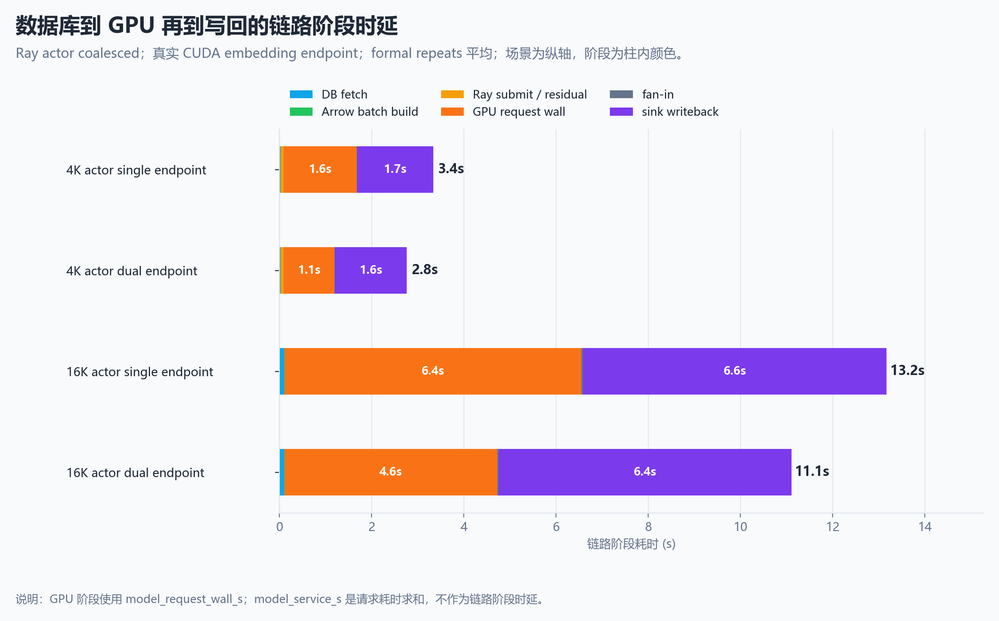
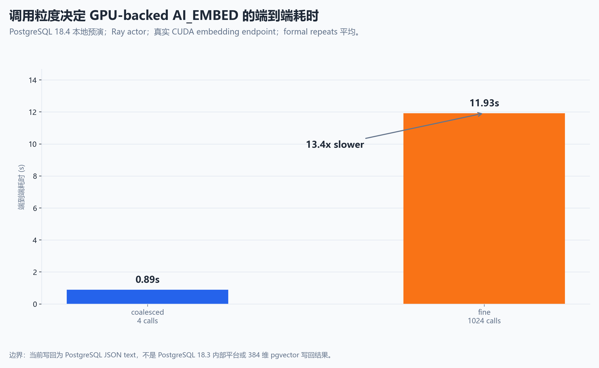
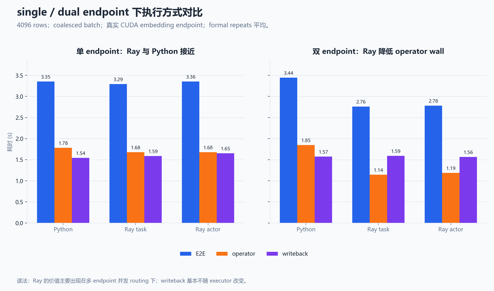
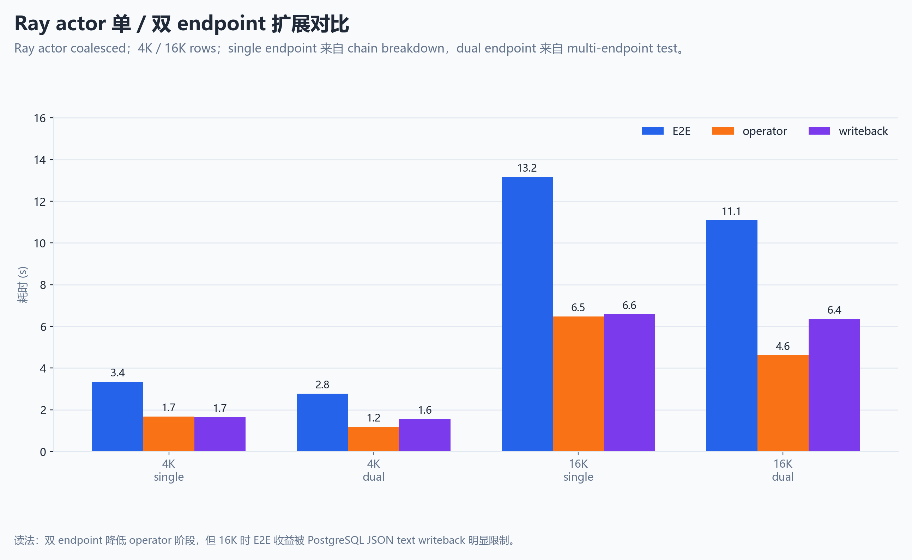

# 开题动机图表选择说明

本文档用于确定开题报告、飞书文档和开题 PPT 中优先使用哪些图来说明“为什么要做这个课题”。选择原则是：主线图必须能直接支撑课题动机，优先使用真实 GPU-backed 端到端实验；fake/CPU 和组件 benchmark 只作为备用解释，不放在主线里承担最终瓶颈结论。

## 场景和调优变量的依据

三类 workload 不是为了把题目铺大，而是用于覆盖数据库 AI 算子中三种不同的系统压力。

| 场景 | 为什么选 | 依据类型 | 主要放大的系统压力 |
|---|---|---|---|
| `AI_EMBED` / RAG ingestion | 数据库落地最自然，能和 pgvector、Lance、向量写回形成闭环；项目已有真实 GPU-backed 链路画像 | Snowflake `AI_EMBED`、pgvector、pgai vectorizer worker；本项目 GPU-backed `AI_EMBED` 实验 | 向量输出、batch 调用、writeback、fan-in |
| `AI_FILTER/AI_CLASSIFY` | 代表 AI predicate，输出小但模型调用多，选择率会影响下游数据量 | Snowflake `AI_FILTER` / `AI_CLASSIFY`；本项目 fake/CPU workload matrix | selectivity、模型调用次数、predicate ordering、cascade |
| `AI_COMPLETE` / offline LLM | 更接近 inference infra，涉及 token 长度、共享 prefix、队列和失败重试 | Snowflake `AI_COMPLETE`、BigQuery `ML.GENERATE_TEXT`、Ray Data offline batch inference、Ray Serve dynamic batching、vLLM offline inference | token-aware batching、prefix-aware routing、queue wait、backpressure |

需要调的变量也有对应支撑。batch、partition、task/actor 和 object 粒度来自 Ray、Daft、Spark 等分布式执行系统的公开文档；本项目 fake/CPU 三类 workload 预研在 `upstream=32, downstream=32` 时观察到 fine/coalesced e2e 比值约为 `4.01x`、`4.32x`、`4.37x`，说明这些变量对统一执行骨架有明显影响。endpoint routing 和 bounded in-flight 来自 Ray Serve / vLLM 等模型服务机制；backpressure 模拟显示 `queue_limit=8` 在不提高 tokens/s 的情况下把平均 queue wait 从 `4768.50 ms` 降到 `114.41 ms`。writeback 和 fan-in 来自 pgai vectorizer worker、pgvector / Lance 存储形态以及当前 GPU-backed 链路画像；16K 行 `AI_EMBED` 场景中 operator 与 PostgreSQL JSON text writeback 都是大块成本。因此，图表讲解时要明确：这些变量是由外部系统机制和项目实验信号共同筛选出来的，不是凭感觉挑选。

## 图表进入材料的分层标准

图表不按“是否已经生成”来选，而按它对课题论证的作用分层：

| 层级 | 使用位置 | 选择标准 | 图表数量建议 |
|---|---|---|---|
| A. 正文主线图 | 开题报告正文、PPT 正文、飞书开题报告 | 能直接回答“为什么要做这个课题”“研究对象是什么”“主要变量为什么值得调” | 报告 4-6 张，PPT 4-5 张 |
| B. 支撑性数据图 | 报告可行性小节、PPT 备份页、飞书补充说明 | 数据维度较多，用表格不直观；能支撑场景选择、变量选择或消融设计 | 报告可选 2-4 张，PPT 备份 3-5 张 |
| C. 表格或文字即可 | 连接验证、smoke、简单二值结果、负结果说明 | 数据简单，画图会制造“性能结论”错觉，或证据层级不足 | 不画正式图 |

当前建议：PPT 正文只放 A 层；开题报告正文以 A 层为主，可在可行性分析中补 1-2 张 B 层；飞书可以比报告多放 B 层，用于透明展示实验来源和边界。

后续维护资产时，以根目录 `figures/` 为正式图资产库。旧的 `opening/assets/charts/python/`、`opening/assets/charts/all_meaningful/` 和 ECharts 根目录图已经不再作为正式材料引用；如需重新生成候选图，使用 `figures/scripts/` 中的 Python 脚本和原始 CSV。

## A 层：正文主线图组

### 图 A：系统研究对象与链路边界


文件：

```text
figures/architecture/system_architecture_ai_data_execution.png
figures/architecture/system_architecture_ai_data_execution.svg
```

讲解作用：先说明本课题研究的不是单个数据库算子、GPU kernel 或单纯 Ray 调度器，而是数据库驱动 AI workload 进入 Daft/Arrow、Ray、GPU 模型服务和 Lance / 数据库 sink 后形成的分布式数据执行与存储协同过程。

适合位置：报告第 3 章总体框架、PPT 研究对象页、飞书开题报告研究内容前。

边界说明：这是研究对象图，不是实验结果图；它负责定义系统边界和后续图表的坐标系。

### 图 A2：研究缺口与本课题定位


文件：

```text
figures/architecture/research_gap_three_islands.png
figures/architecture/research_gap_three_islands.svg
```

讲解作用：说明已有研究的三个方向（DB4AI、AI 推理服务、AI 数据存储）各自有大量 CCF-A 工作但分别止于数据库进程边界、GPU 侧和存储层，缺少跨方向端到端协同。本课题聚焦方向一（数据组织）与方向二（GPU 调度）的跨层协同优化，方向三（持久化）作为边界确认。

适合位置：报告 §2 结尾、PPT 文献综述页、飞书开题报告研究缺口。

边界说明：这是研究缺口概念图，三个方向的代表性工作选取基于报告 §2 的实际引用，不覆盖所有相关工作。

### 图 B：真实 GPU-backed 链路阶段耗时



文件：

```text
figures/data/report_main/02_gpu_stage_latency_stack.png
figures/data/report_main/02_gpu_stage_latency_stack.svg
```

讲解作用：这是最适合作为“为什么要做这个课题”的主证据。它把数据库读取、Arrow batch 构造、Ray 提交与调度残差、GPU 模型服务请求、fan-in 和写回拆到同一张图里，说明端到端耗时不是一个黑盒；模型请求和写回是当前显著成本，且不同阶段可以被分别观测和优化。

适合位置：报告可行性分析核心图、PPT 动机页、飞书实验结论摘要。

边界说明：数据来自真实 GPU-backed embedding endpoint 和 PostgreSQL 18.4 本地预演链路；目前用于开题动机和可行性说明，不写成最终系统性能结论。

### 图 C：调用粒度对端到端耗时的影响



文件：

```text
figures/data/report_main/03_invocation_granularity.png
figures/data/report_main/03_invocation_granularity.svg
```

讲解作用：这张图说明同样是 AI_EMBED workload，fine-grained invocation 与 coalesced batch invocation 的端到端耗时差异很大。它直接支撑“数据组织、batch 粒度和算子调用边界值得研究”，而不是只研究模型本身。

适合位置：报告研究内容一的动机证据、PPT 数据组织与批处理构造页。

边界说明：该图可以说明粒度是重要变量，但不能单独推出所有 workload 都会获得同等收益；后续还需要在更多数据规模、embedding 维度和 sink 类型上复测。

### 图 D：执行方式与模型端点数量的关系



文件：

```text
figures/data/report_main/04_executor_endpoint_comparison.png
figures/data/report_main/04_executor_endpoint_comparison.svg
```

讲解作用：这张图用于解释 Ray 不是被预设为“必然更快”，而是在多 endpoint、可并行模型服务和调度策略存在时才可能体现价值。它适合支撑“GPU 服务状态感知的 Ray 并行调度与反压控制”这一研究内容。

适合位置：报告研究内容二、PPT 调度动机页、答辩中回答“为什么需要 Ray/actor/task”。

边界说明：不把该图解释为 Ray 对所有场景都优于 Python 顺序执行；它强调适用条件和调度变量。

### 图 E：模型侧扩展后的写回约束



文件：

```text
figures/data/report_main/05_actor_endpoint_scaling_writeback.png
figures/data/report_main/05_actor_endpoint_scaling_writeback.svg
```

讲解作用：这张图用于说明仅优化模型请求或执行并行度不够，写回和结果汇聚会在部分设置下成为端到端收益的上限。因此课题需要把 Lance / pgvector / PostgreSQL sink 的持久化协同纳入研究内容。

适合位置：报告研究内容三、PPT 写回与存储协同页。

边界说明：当前 sink 仍以 PostgreSQL JSON text writeback 为主，不能直接宣称 Lance 或 pgvector 优化已经完成；它说明下一步为什么必须研究持久化路径。

## B 层：支撑性数据图组

这些图对项目有意义，值得保留和讲解。它们不一定全部进入 PPT 正文，但如果在报告、飞书或答辩里解释“为什么选三个场景”“为什么调这些变量”，比单纯表格更直观。

### 支撑图 1：三类 workload 的粒度敏感性

文件：

```text
figures/data/backup/b01_workload_matrix_speedup.png
```

为什么值得关注：这张图直接服务于“三个场景为什么都要保留”。在 `upstream=32, downstream=32` 条件下，`embed_rag`、`classify_filter`、`offline_llm` 的 fine/coalesced e2e 比值约为 `4.01x`、`4.32x`、`4.37x`。它说明三类 workload 虽然语义不同，但都可能受到 batch / task / object 粒度影响。

适合位置：报告中解释三类场景选择依据；PPT 备份页；飞书实验依据页。

边界说明：fake/CPU 预研，只能说明三类场景共享同一类机制风险，不能说明真实 LLM 或真实 GPU 链路一定有同等收益。

### 支撑图 2：收益来源拆分与 granularity attribution

文件：

```text
figures/data/backup/b02_granularity_attribution.png
```

为什么值得关注：这张图解释“为什么不是只调 fan-in，也不是只调 Ray”。预研显示，收益同时与 total Ray tasks、operator invocation、Ray refs 和 fan-in 依赖数有关；只在细粒度执行之后追加 coalesce 不一定有效，更关键的是在任务划分阶段控制过细 invocation。

适合位置：报告研究内容一的依据补充；PPT 备份页回答“为什么调 batch / partition / task / object”。

边界说明：fake/CPU 机制拆分，不直接外推为真实 GPU-backed 链路瓶颈。

### 支撑图 3：bounded in-flight 与队列压力

文件：

```text
figures/data/backup/b03_backpressure_queue_pressure.png
```

为什么值得关注：这张图解释“为什么要调 backpressure / in-flight”。模拟结果显示，`queue_limit=8` 不提高 tokens/s，但把平均 queue wait 从 `4768.50 ms` 降到 `114.41 ms`，说明无界提交会放大模型服务队列和 token backlog。

适合位置：报告研究内容二的依据补充；PPT 备份页；飞书实验依据页。

边界说明：模拟实验，只能说明队列压力控制的必要性，不能宣称 backpressure 一定提高吞吐。

### 支撑图 4：写回批量与持久化压力

文件：

```text
figures/data/backup/b04_writeback_batching.png
```

为什么值得关注：这张图解释“为什么写回不是附属环节”。结合真实 GPU-backed 16K 场景中 operator 与 JSON text writeback 都是大块成本，PG18.4 写回批处理图可以进一步说明 sink 写入方式和批量大小会改变端到端收益边界。

适合位置：报告研究内容三的依据补充；PPT 写回协同备份页；飞书补充说明。

边界说明：PG18.4 fake / 历史预演证据，不等同于 PostgreSQL 18.3、pgvector(384) 或 Lance 最终结论。

### 支撑图 5：Ray / Arrow fan-out fan-in 组件信号

文件：

```text
figures/data/backup/b05_ray_arrow_fanout_fanin.png
```

为什么值得关注：这张图解释 object 数量、fan-out/fan-in 和 RecordBatch 粒度为什么值得记录。它不是主结论，但能把 Ray/Daft 文档中的 object slot / shuffle 风险和项目实验变量连接起来。

适合位置：答辩备份页或飞书补充说明；报告正文不优先使用。

边界说明：组件 benchmark，只说明机制可观测，不承担端到端 GPU-backed 归因。

## C 层：表格或文字即可

以下数据不建议做成主线图：

- PG18.4 连接验证、dry-run、smoke：只证明环境可用，表格或一句话即可。
- `all_cpu_vs_gpu_endpoint_e2e_20260712`：可作为边界说明，但容易把题目带偏成 CPU/GPU 或模型 kernel 对比；若使用，放答辩备份页。
- `all_feasibility_arrow_serialization_20260712`：当前更像负结果或组件成本说明，用表格/文字即可，不要渲染成主瓶颈。
- `all_feasibility_ray_small_task_latency_20260712`：能说明 small task 固定成本，但数值简单，不适合占用正文图位。
- `all_feasibility_shuffle_simulation_20260712`：本地 shuffle simulation 是对照/负信号，正文不画。
- `all_pg18_fake_baseline_matrix_e2e_20260712` 和 `all_fake_cpu_embed_pipeline_coalescing_20260712`：历史价值较高，但与真实 GPU-backed 调用粒度图功能重叠，若正文图位有限，用真实 GPU-backed 图替代。

## A 层可替代图

文件：

```text
figures/data/backup/b06_stage_share.png
figures/data/backup/b06_stage_share.svg
```

用途：当需要强调“端到端瓶颈占比如何变化”时使用。它比绝对耗时图更适合说明结构变化，但不如绝对耗时图直观。

若 PPT 正文图位有限，优先使用绝对时延图；阶段占比图放备份页。绝对时延图更适合讲“成本有多大”，占比图更适合讲“优化模型阶段后，writeback 占比为什么会上升”。

## 推荐讲解顺序

1. 先用系统架构图定义研究对象：数据库驱动 AI workload 的分布式数据执行与存储协同。
2. 用真实 GPU-backed 阶段耗时图说明端到端链路存在可观、可拆解、可观测的系统成本。
3. 用调用粒度图说明数据组织和 batch 策略会显著影响端到端耗时。
4. 用执行方式与端点对比图说明调度策略需要感知模型服务端点和并行条件，不能孤立讨论 Ray。
5. 用 actor endpoint scaling 图说明模型侧扩展后写回与汇聚会限制收益，因此必须研究结果持久化协同。
6. 如果需要解释三个场景和调优变量的依据，加入 B 层支撑图：workload matrix、granularity attribution、backpressure、writeback batching 和 Ray / Arrow fan-in。

## 2026-07-14 pgai-integrated GPU rerun figures

For the latest opening-report update, prefer these figures over the older
2026-07-12 GPU charts:

| Figure | Role | Boundary |
|---|---|---|
| `figures/data/report_main/06_gpu_pgai_rerun_granularity_20260714.png` / `.svg` | Shows that fine-grained 1024-row AI_EMBED calls are 37.5x slower than coalesced calls in the GPU-backed local chain. | PG18.4 local rehearsal, no writeback, one formal run. |
| `figures/data/report_main/07_gpu_pgai_rerun_stage_writeback_20260714.png` / `.svg` | Shows model request wall time and JSON writeback time in the same full-chain timing view. | JSON text writeback, not pgvector vector(384). |
| `figures/data/report_main/08_gpu_pgai_rerun_endpoint_comparison_20260714.png` / `.svg` | Shows dual local endpoints reduce model/operator wall time while writeback remains similar. | Two endpoint replicas on one RTX 5070, not multi-GPU. |

Source:

```text
motivation/results/gpu/pgai_integrated_key_rerun_20260714.md
motivation/results/gpu/ai_embed_pgai_integrated_key_20260714.csv
```
# 2026-07-14 Current Opening-Report Preference

For the current opening-report version, prefer the PG18.4 pgai-integrated
GPU-backed rerun figures `06_gpu_pgai_rerun_granularity_20260714`,
`07_gpu_pgai_rerun_stage_writeback_20260714`, and
`08_gpu_pgai_rerun_endpoint_comparison_20260714` over the older
`03_invocation_granularity`, `04_executor_endpoint_comparison`, and
`05_actor_endpoint_scaling_writeback` figures.
