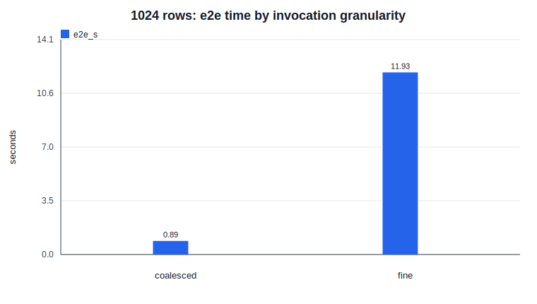
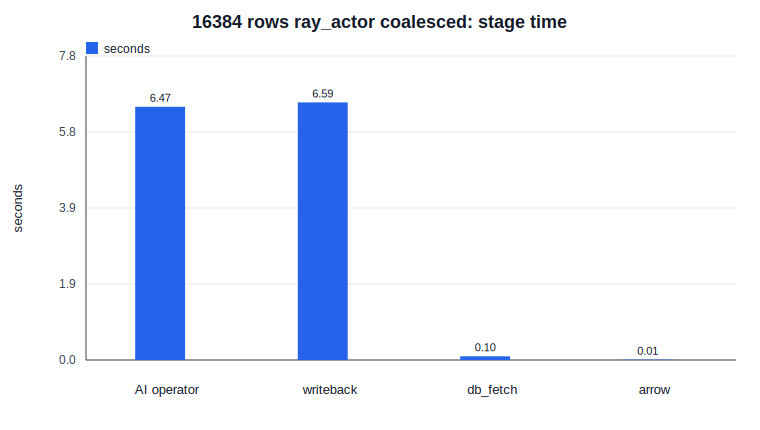

# 已完成实验学习讲解

本文按项目推进顺序讲解已经做过的实验。目标不是替代正式报告，而是帮你理解：

- 这些实验在测什么；
- 为什么要测；
- 术语是什么意思；
- 数据在链路里怎么流动；
- 结果有什么用；
- 不能从结果里过度推出什么。

> **2026-07-20 拆分说明**：pre-convergence 时期的早期实验讲解（组件可行性验证、fake/CPU 动机测试、PG18.4 接入、pgvector scaling 等）已归档至 `learning/archive/early_experiments_walkthrough.md`。本文档只保留 GPU-backed 真实 embedding 画像及之后的内容（§9 起），对应项目当前 AI_COMPLETE + vLLM + Daft 主线。

## 目录

## 9. GPU-backed 真实 embedding 画像：把真实模型服务接进链路

正式结果：`motivation/results/gpu/ai_embed_profile.md`

**为什么做：**

前面的模拟 embedding 测试只能说明链路和计时边界可用。真正的主动机需要把真实模型服务接进来：

```text
PostgreSQL documents 表
  -> Python / Ray 外部执行链路
  -> CUDA embedding HTTP endpoint
  -> fan-in
  -> PostgreSQL 写回
```

这次模型是 `sentence-transformers/all-MiniLM-L6-v2`，本地 endpoint 返回 384 维 embedding，并通过 `/health` 确认 `device=cuda`。这次 endpoint 是用户手动启动的；后续复现实验要先检查 `localhost:8000`，没有服务时再启动。

**这次解决了什么问题：**

我们第一次不再只用 fake embedding，而是真的调用了 GPU-backed embedding endpoint。这样可以开始回答：

- 真实模型接入后，逐行调用还会不会很慢？
- batch 调用是否仍然重要？
- Ray task / Ray actor 是否明显优于普通 Python？
- 模型服务和写回哪个阶段更重？

**关键结果：**

| rows | executor | strategy | calls | e2e_s | model request time sum (`model_service_s`) | writeback_s |
|---:|---|---|---:|---:|---:|---:|
| 1024 | `ray_actor` | `coalesced` | 4 | 0.990 | 0.451 | 0.402 |
| 1024 | `ray_actor` | `fine` | 1024 | 13.458 | 24.648 | 0.394 |
| 4096 | `python` | `coalesced` | 16 | 3.436 | 1.808 | 1.595 |
| 4096 | `ray_task` | `coalesced` | 16 | 3.175 | 2.705 | 1.594 |
| 4096 | `ray_actor` | `coalesced` | 16 | 3.165 | 2.561 | 1.554 |

**怎么读：**

1024 行时：

```text
fine:
  1024 次真实模型 HTTP 调用
  平均 e2e 13.458s

coalesced:
  4 次真实模型 HTTP 调用
  平均 e2e 0.990s
```

也就是说，真实 GPU embedding 下，逐行调用仍然很慢，约慢 `13.6x`。这比模拟结果更有价值，因为它证明了“不要一行一次模型调用”不是 fake 实验才有的现象。

4096 行 coalesced 时，Python / Ray task / Ray actor 差距不大。原因是这次只有一个本地 HTTP endpoint，Ray 并没有让模型服务本身变成多个 GPU replica。Ray 主要改变提交方式，但真正算模型的还是同一个 endpoint。

**本地实验事实：**

- 真实 CUDA endpoint 已接入。
- fine 逐行调用比 coalesced batch 调用慢约 `13.6x`。
- coalesced 后，writeback 已经是大块成本，约 `1.55s-1.60s`。
- 数据库读取和 Arrow 构造都很小，不是当前瓶颈。

**合理推断：**

- 后续优化不应该先纠结 Ray task 还是 Ray actor，而应先保证 batch 调用模型服务。
- 当模型调用被 batch 化之后，写回路径会变成重要优化点。
- 如果要让 Ray 明显发挥作用，需要多个模型 replica、Ray Serve 或更真实的 model-service 调度，而不是只有一个本地 HTTP endpoint。

**不能声称：**

- 这不是 PostgreSQL 18.3 内部平台结果。
- 这不是 vLLM 或 Ray Serve 结果。
- 当前 GPU utilization 只是 `nvidia-smi` 快照，不是连续 GPU profile。
- 当时 384 维真实 embedding 还没有写入 pgvector；2026-07-14 已补同链路 `vector(384)` 写回对比，见第 14.8 节。

下一步在当时是改出 384 维 pgvector 写回表，再比较 JSON text 和 pgvector 写回；这一步现在已经完成。

## 10. CPU/GPU 对比：这些时间到底包括什么

正式结果：`motivation/results/cpu/cpu_vs_gpu_embed_comparison_20260712.md`

学习图：

- `../figures/learning/cpu_gpu_coalesced_e2e_20260712.svg`
- `../figures/learning/fine_vs_coalesced_e2e_20260712.svg`

这一节专门解释你问的那个问题：

> `CPU 1024 coalesced 2.95s` 和 `GPU 1024 coalesced 0.99s` 是整体流程时间吗？包括 AI 算子从 CPU 到 GPU 的搬运吗？

答案要拆开讲。

### 10.1 先画出这次实验链路

这次不是在测“数据库里的算子从 CPU 搬到 GPU”。数据库里没有直接执行 embedding 模型。真实计算发生在数据库外部的模型服务里：

```text
PostgreSQL documents 表
  -> Python profile driver 从数据库读文本
  -> Python 把文本整理成 Arrow RecordBatch
  -> Ray actor 把一批文本发给 HTTP embedding endpoint
  -> endpoint 里运行 all-MiniLM-L6-v2 模型
  -> endpoint 返回 embedding 数组
  -> Python / Ray 收集结果，fan-in
  -> Python 把 embedding 写回 PostgreSQL document_embeddings 表
```

CPU 和 GPU 对比只改一个关键点：

```text
CPU endpoint:
  endpoint 里的模型在 CPU 上跑
  http://localhost:8001/v1/embeddings

GPU endpoint:
  endpoint 里的模型在 CUDA GPU 上跑
  http://localhost:8000/v1/embeddings
```

数据库、Python driver、Ray actor、HTTP 调用方式、模型文件、batch size、写回方式尽量保持一致。

### 10.2 `e2e_s` 是什么

`e2e_s` 是 end-to-end seconds，也就是一次实验从开始到结束的墙钟时间。

它包含：

```text
创建 job 记录
  + 从 PostgreSQL 读取 documents
  + 构造 Arrow RecordBatch
  + 调用 embedding HTTP endpoint
  + 等结果回来，fan-in
  + 写回 PostgreSQL
```

所以：

```text
CPU 1024 coalesced e2e_s = 2.948s
GPU 1024 coalesced e2e_s = 0.990s
```

意思是：

> 同样处理 1024 条文本，整条数据库外部 embedding 链路，CPU endpoint 平均 2.948 秒，GPU endpoint 平均 0.990 秒。

它不是单独的“CPU 到 GPU 搬运时间”。

### 10.3 GPU 里有没有 CPU 到 GPU 的搬运

有，但当前实验没有单独拆出来。

GPU endpoint 内部大概是：

```text
收到 HTTP JSON 文本
  -> tokenizer 把文本变成 token ids
  -> PyTorch 创建 tensor
  -> tensor 放到 GPU
  -> GPU forward
  -> embedding 从 GPU 拿回 CPU
  -> 转成 Python list / JSON
  -> HTTP 返回
```

当前 `model_service_s` 来自每次 HTTP embedding 请求从发出到收到结果的耗时，并在一次实验结束时把这些请求耗时加总。它包含 endpoint 内部这些步骤，但没有细分成：

```text
tokenization_s
h2d_s
gpu_forward_s
d2h_s
json_serialize_s
```

所以严谨说法是：

> 当前结果包含 GPU endpoint 内部的数据搬运成本，但没有把搬运成本单独量出来。

不能说：

> CPU 到 GPU 搬运花了多少秒。

因为我们还没有这个字段。

### 10.4 `model_service_s` 为什么有时比 `e2e_s` 大

这是一个容易误解的点。先记住一句话：

> `model_service_s` 这个字段名有点误导。它不是“模型阶段墙钟时间”，而是“所有模型 HTTP 请求耗时的加和”。

Ray actor 可以让多个请求重叠执行，所以：

```text
请求 A 耗时 1 秒
请求 B 耗时 1 秒
如果它们并发重叠，墙钟可能接近 1 秒
但 model_service_s 加和是 2 秒
```

因此：

- `e2e_s` 是整次实验真实经过了多少秒；
- `model_service_s` 是 endpoint 请求耗时加和；
- 两者不是同一个概念。

读结果时，优先用 `e2e_s` 判断端到端快慢，用 `model_service_s` 判断模型服务压力大不大。

如果后续要更严谨，我们应该在脚本里新增一个字段：

```text
operator_wall_s
```

它表示：

```text
从第一批模型请求发出
  -> 到最后一批模型结果回来
```

这才是“模型调用阶段的墙钟时间”。目前还没有这个字段，所以不能用 `model_service_s` 当它。

### 10.5 这次 CPU/GPU 对比结果

| endpoint | rows | strategy | calls | e2e_s | model request time sum (`model_service_s`) | writeback_s |
|---|---:|---|---:|---:|---:|---:|
| CPU | 1024 | `coalesced` | 4 | 2.948 | 2.407 | 0.406 |
| GPU | 1024 | `coalesced` | 4 | 0.990 | 0.451 | 0.402 |
| CPU | 1024 | `fine` | 1024 | 9.186 | 15.899 | 0.430 |
| GPU | 1024 | `fine` | 1024 | 13.458 | 24.648 | 0.394 |
| CPU | 4096 | `coalesced` | 16 | 10.662 | 16.995 | 1.627 |
| GPU | 4096 | `coalesced` | 16 | 3.165 | 2.561 | 1.554 |

下面两张图分别画两个现象。图只负责呈现实验数值，解释放在正文里。


几个变量先解释清楚：

| 变量 | 在这次实验里是什么意思 |
|---|---|
| endpoint | 模型服务跑在 CPU 还是 GPU |
| rows | 从 PostgreSQL `documents` 表读多少条文本 |
| strategy | 文本怎么分批；`coalesced` 是一批多行，`fine` 是一行一调 |
| calls | 调用 embedding endpoint 的次数 |
| e2e_s | 整条链路总耗时 |
| model_service_s | HTTP 模型请求耗时加和；不是模型阶段墙钟时间 |
| writeback_s | embedding 结果写回 PostgreSQL 的时间 |

### 10.6 最重要的读法

第一，batch 后 GPU 明显更快。

```text
1024 rows coalesced:
  CPU: 2.948s
  GPU: 0.990s
  CPU/GPU = 2.98x

4096 rows coalesced:
  CPU: 10.662s
  GPU: 3.165s
  CPU/GPU = 3.37x
```

这说明真实模型 endpoint 接入后，GPU-backed endpoint 确实能明显降低端到端时间。

第二，逐行调用时 GPU 反而更慢。

```text
1024 rows fine:
  CPU: 9.186s
  GPU: 13.458s
```

这不是说 GPU 不行，而是说：

> 如果一行文本就调用一次模型服务，GPU 的优势发挥不出来，反而被 HTTP、tokenization、tensor 搬运、kernel launch、JSON 返回这些小调用开销拖住。

这对课题很重要，因为它说明：

```text
GPU-backed model service 不等于自动变快
必须配合 batch / in-flight / queue / writeback 设计
```

第三，GPU 加速后，写回变得更显眼。

```text
4096 rows GPU coalesced:
  e2e_s = 3.165s
  writeback_s = 1.554s
  writeback/e2e ≈ 49.1%
```

这说明模型快了以后，瓶颈会迁移到外部链路的其他部分，尤其是写回 PostgreSQL。

这正是本课题要抓的点：

> 不是只证明 GPU 比 CPU 快，而是证明 GPU-backed AI 算子链路里，batch、模型服务调用、fan-in、writeback 这些外部链路问题会决定端到端效果。

### 10.7 本地实验事实

- CPU/GPU 都使用同一个 `all-MiniLM-L6-v2` 模型。
- CPU endpoint 在 `localhost:8001`，GPU endpoint 在 `localhost:8000`。
- coalesced 模式下，GPU 端到端比 CPU 快约 `3x`。
- fine 模式下，GPU 比 CPU 慢，说明逐行调用模式很差。
- 4096 行 GPU coalesced 下，写回占了约一半端到端时间。

### 10.8 合理推断

- 后续不能把主线写成“把 AI 算子放到 GPU 就快了”。这个太浅。
- 更合理的研究问题是：数据库 AI 算子调用 GPU-backed model service 时，如何决定 batch、并发、队列、fan-in 和写回策略。
- CPU baseline 有必要保留，因为它帮助我们看出：哪些现象是 GPU 特有的，哪些是外部链路通用问题。

### 10.9 待确认问题

- 还没有拆 endpoint 内部时间：tokenization、CPU 到 GPU tensor transfer、GPU forward、GPU 到 CPU、JSON serialization。
- 还没有用 Ray Serve / vLLM 这种更接近生产的模型服务。
- 当时还没有把 384 维真实 embedding 写进 pgvector；2026-07-14 已通过 `vector(384)` 写回对比补齐。
- GPU utilization 只是 `nvidia-smi` 快照，不是连续 profile。

### 10.10 不能声称的结论

不能说：

- “CPU 到 GPU 搬运耗时是多少”，因为没拆这个指标。
- “GPU 总是比 CPU 快”，因为 fine 模式下 GPU 更慢。
- “这就是 PostgreSQL 18.3 内部平台结果”，因为现在是本地 PG18.4。
- “Ray 调度已经证明有效”，因为当前只有单个本地 endpoint，不是多 GPU replica。

可以说：

> 在本地 PG18.4 + 真实 embedding endpoint 链路中，batch 化调用 GPU endpoint 能显著降低端到端时间；但 GPU 加速后，写回和外部链路成本会变得更重要。逐行调用真实模型服务是明显错误的执行形态。

## 11. 到目前为止，整个课题流程是什么

可以把项目推进理解成 5 层：

### 第 1 层：组件可行性

问题：Ray / Arrow / object store 这些组件有没有明显单点瓶颈？

结论：Arrow serialization 不是主瓶颈；小 object 和 fan-in 有成本。

### 第 2 层：AI 算子动机

问题：这些组件现象放进 fake AI_EMBED 链路还存在吗？

结论：存在，而且不只 embedding 场景敏感。

### 第 3 层：收益来源拆分

问题：收益来自 fan-in 变少，还是 task / invocation 变少？

结论：两者都有，但减少过细 AI operator invocation 更关键。

### 第 4 层：真实数据库触发

问题：接 PostgreSQL 后现象还存在吗？

结论：PG18.4 本地同构链路里仍存在，且 writeback 开始显著。

### 第 5 层：baseline 和瓶颈迁移

问题：Python / Ray task / Ray actor、batch size、worker 数、pgvector 写回、规模变化如何影响瓶颈？

结论：

- Ray task 是必须保留的强 baseline；
- actor 不应默认更优；
- pgvector 批量写回可用且显著；
- 行数扩大后，Ray 并行会把瓶颈推向 writeback。

## 12. 后续该怎么学

下一步应该优先学习和验证 GPU-backed external chain，因为它是课题主动机，不只是校准项。你需要重点理解：

- fake embedding 和真实模型有什么区别；
- 模型 batch size 为什么影响吞吐；
- GPU-backed model service 的队列、in-flight、GPU utilization 和 batch policy 怎么影响端到端结果；
- Ray task 为什么适合无状态函数；
- Ray actor 为什么可能适合常驻模型；
- writeback 为什么必须单独计时；
- 为什么不能只看 e2e。
- 为什么 CPU/fake 结果只能做历史预研 / 脚本调试 / 计时边界验证，不能直接当作 GPU 链路调优结论。
- 为什么 GPU-backed E2E profile 是“真实端点画像”，不是“GPU kernel 优化主线”。

建议下一次实验讲解继续按这个模板：

1. 这个实验在整个链路里测哪一步？
2. 这个实验为什么现在做？
3. 输入数据从哪里来，经过哪些组件？
4. 每个参数是什么意思？
5. 记录了哪些指标？
6. 结果怎么读？
7. 它支持什么，不支持什么？
8. 下一步因此该做什么？

## 13. 真实 embedding 链路拆分：开题动机更强的一组结果

正式结果：

```text
motivation/results/gpu/ai_embed_chain_breakdown_20260712.md
motivation/results/gpu/ai_embed_chain_breakdown_20260712.csv
```

这里曾经出现过一个临时文件名 `clean`。它不是实验术语，只是表示“我修正了计时字段语义以后重新跑的一版干净数据”。正式分析只看：

```text
ai_embed_chain_breakdown_20260712.csv
```

不要看：

```text
ai_embed_chain_breakdown_draft_20260712.csv
```

### 13.1 这次实验为什么要做

前面我们已经知道：

- 真实 GPU embedding endpoint 能跑；
- fine 逐行调用很慢；
- coalesced batch 调用快很多；
- 4096 行时 writeback 已经很明显。

但开题时只说“fine 慢、batch 快”还不够。老师可能会继续问：

> 慢到底慢在哪里？是数据库读慢？Arrow 慢？Ray 慢？HTTP 模型服务慢？还是写回慢？

所以这次要把链路拆成：

```text
PostgreSQL fetch
  -> Arrow / batch 构造
  -> Ray task / actor 调度和外部 AI operator
  -> HTTP 模型服务请求墙钟时间
  -> fan-in
  -> writeback
```

### 13.2 新字段是什么意思

| 字段 | 通俗解释 | 怎么读 |
|---|---|---|
| `e2e_s` | 整个实验从开始到结束的墙钟时间 | 判断端到端快慢 |
| `db_fetch_s` | 从 PostgreSQL 读 `documents` 表的时间 | 看数据库读是不是瓶颈 |
| `arrow_build_s` | 把数据库行组装成 Arrow RecordBatch 的时间 | 看 batch 构造是否明显 |
| `operator_wall_s` | 外部 AI 算子阶段的墙钟时间 | 看 Ray/Python + 模型调用 + 结果取回这一段总体多长 |
| `model_request_wall_s` | 第一批 HTTP 模型请求开始，到最后一批请求结束的墙钟跨度 | 更适合看模型服务阶段占多少 |
| `model_service_s` | 每个 HTTP 请求耗时的加和 | 不能直接当阶段占比 |
| `submit_s` | 提交 Ray task / actor 调用的本地耗时 | 只看提交动作，不是完整 Ray 成本 |
| `bounded_wait_s` | 因为 in-flight 达到上限而等待的时间 | fine 模式下通常会变大 |
| `fanin_s` | 从 Ray worker 收回结果的时间 | 看结果合并成本 |
| `writeback_s` | 把 embedding 结果写回 PostgreSQL 的时间 | 看写回是否成为瓶颈 |

重点是：

```text
model_service_s 是请求耗时加和
model_request_wall_s 才更接近“模型请求阶段实际占了多少墙钟时间”
```

如果两个请求并发，每个请求 1 秒：

```text
model_service_s = 2 秒
model_request_wall_s 约等于 1 秒
e2e_s 也可能约等于 1 秒多一点
```

所以以后做阶段拆分图，优先用 `model_request_wall_s`、`operator_wall_s`、`writeback_s`，不要用 `model_service_s` 做占比。

### 13.3 图怎么看

图放在：

```text
figures/learning/
```

这三张图各讲一个问题。图下面的文字只解释怎么看图，图本身只保留标题、坐标轴、图例和数值。

**图 1：1024 行时，fine 和 coalesced 的端到端差异**



这张图看横轴的两个柱子：`coalesced` 是 4 次模型 endpoint 调用，`fine` 是 1024 次模型 endpoint 调用。纵轴是端到端时间，单位是秒。它说明逐行调用真实 GPU embedding endpoint 会把整条链路显著拖慢。

**图 2：4096 行 coalesced 下，不同 executor 的端到端时间**


这张图比较 `python`、`ray_task`、`ray_actor`。三根柱子很接近，所以当前不能说 Ray 已经明显更快。更严谨的结论是：在单个本地 GPU endpoint、16 个 coalesced batch 的设置下，Ray 和 Python 端到端接近；Ray 的价值需要在多 endpoint、路由、反压、worker 写回等后续实验里验证。

**图 3：16384 行时，AI operator 和 writeback 都已经很大**



这张图里的 `AI operator` 不是 PostgreSQL 内部算子，也不是 GPU kernel。它指数据库外部的 AI 算子执行阶段：

```text
Arrow batch 已经准备好
  -> 提交给 Python / Ray task / Ray actor
  -> Ray actor 调用 HTTP embedding endpoint
  -> 等模型服务返回 embedding
  -> ray.get / fan-in 把结果收回主控程序
```

它不包括前面的 `db_fetch` 和 `arrow_build`，也不包括后面的 `writeback`。在这张图里，`AI operator` 和 `writeback` 两根柱子都在 6 秒多，说明数据量扩大后，真实 GPU-backed 链路里不只是模型请求阶段重要，写回 PostgreSQL 也已经是同等级的大块成本。

### 13.4 结果怎么读

正式 repeat 均值如下：

| rows | executor | strategy | calls | e2e_s | operator_wall_s | model_request_wall_s | writeback_s |
|---:|---|---|---:|---:|---:|---:|---:|
| 1024 | ray_actor | coalesced | 4 | 0.888 | 0.505 | 0.397 | 0.374 |
| 1024 | ray_actor | fine | 1024 | 11.925 | 11.528 | 11.423 | 0.386 |
| 4096 | python | coalesced | 16 | 3.353 | 1.784 | 1.805 | 1.542 |
| 4096 | ray_task | coalesced | 16 | 3.291 | 1.677 | 1.685 | 1.588 |
| 4096 | ray_actor | coalesced | 16 | 3.355 | 1.677 | 1.587 | 1.651 |
| 16384 | ray_actor | coalesced | 64 | 13.168 | 6.473 | 6.448 | 6.586 |

第一，1024 行 fine 明显比 coalesced 慢：

```text
11.925 / 0.888 ≈ 13.4x
```

原因不是数据库读取，也不是 Arrow 构造。核心差异是：

```text
coalesced: 4 次模型 endpoint 调用
fine: 1024 次模型 endpoint 调用
```

所以这个结果支持：

> 数据库 AI 算子不能一行一行随便调用模型服务，batch / invocation 粒度是第一层必须解决的问题。

第二，4096 行 coalesced 下，Python、Ray task、Ray actor 很接近：

```text
python:    3.353s
ray_task:  3.291s
ray_actor: 3.355s
```

这说明当前不能说：

> Ray 已经明显更快。

更准确的说法是：

> 在单个本地 GPU endpoint、16 个 coalesced batch 的设置下，Ray 和 Python 端到端接近。Ray 的价值需要在多 endpoint、多 replica、路由、反压、worker 写回这些更复杂场景里验证。

第三，16384 行时，AI operator 和 writeback 都很大：

```text
operator_wall_s = 6.473s
writeback_s     = 6.586s
e2e_s           = 13.168s
```

这说明 GPU-backed 链路不是只有“模型推理”一个问题。模型请求阶段和写回阶段都已经接近端到端的一半。

### 13.5 对开题有什么用

这组结果让开题动机更稳，因为它能回答：

```text
外部链路是否存在瓶颈？存在。
瓶颈是否可分解？可以分成 AI operator / model request / writeback 等阶段。
是不是只要 GPU 就够？不是。
是不是已经证明 Ray 更好？还没有。
下一步为什么要研究调度、batch、反压、写回？因为这些阶段已经在真实 GPU-backed 链路里占了很大比例。
```

开题里可以安全地说：

> 在本地 PostgreSQL 18.4 同构预演环境中，真实 CUDA embedding endpoint 显示，数据库 AI 算子的性能问题不只来自模型计算。逐行调用模型服务会让端到端时间放大约 13.4 倍；当数据量扩大到 16384 行时，外部 AI operator 阶段和 PostgreSQL 写回阶段都接近端到端时间的一半。因此，本课题需要研究数据库 AI 算子的外部分布式执行链路，包括 batch 构造、Ray task/actor、模型服务请求控制、fan-in 和 writeback。

### 13.6 和三个场景的关系

现在开题优先用 `AI_EMBED`，不是因为另外两个场景不重要，而是因为 `AI_EMBED` 最容易形成真实闭环：

```text
PostgreSQL documents
  -> embedding endpoint
  -> embedding result
  -> writeback
```

但后续不能只停在 embedding。

三个场景的定位应是：

| 场景 | 当前定位 |
|---|---|
| `AI_EMBED` / RAG ingestion | 开题阶段真实链路主动机主场景 |
| `AI_FILTER` / `AI_CLASSIFY` | 后续补 selectivity、predicate ordering、cascade |
| `AI_COMPLETE` / offline LLM | 后续更贴近 AI infra 的重点主线候选 |

尤其是 `AI_COMPLETE`，后续要尽量作为主线候选推进，因为它能自然引出：

- token-aware batching；
- prefix-aware routing；
- KV cache / prefix cache locality；
- 模型服务队列；
- GPU utilization；
- backpressure；
- 失败重试和结果写回。

所以当前路线不是“只做 embedding”，而是：

```text
先用 AI_EMBED 建立真实数据库 AI 算子链路的主动机
再把 AI_COMPLETE 提升为更贴近 AI infra 的核心压力 workload
AI_FILTER / AI_CLASSIFY 用来补足 AI predicate 场景
```

### 13.7 Ray 的价值为什么还要继续测

正式结果：

```text
motivation/results/gpu/multi_endpoint_ray_motivation_20260712.md
motivation/results/gpu/ai_embed_multi_endpoint_20260712.csv
```

前面的 4096 行单 endpoint 实验里，Python、Ray task、Ray actor 很接近。这说明：

```text
不能直接说 Ray 已经有明显收益
```

但也不能反过来说：

```text
Ray 没有价值
```

因为单 endpoint 实验里，Ray 没有什么可调度的对象。所有 batch 最后都打到同一个本地模型服务，Ray 不能体现多 endpoint 路由、负载均衡、反压控制这些能力。

所以这次补了一个很小的多 endpoint 动机实验：

```text
endpoint 1: http://localhost:8000/v1/embeddings
endpoint 2: http://localhost:8001/v1/embeddings
```

注意，这还不是多 GPU。两个 endpoint 都跑在本机同一张 GPU 上。它只能用来做初步机制验证，不能写成多 GPU 结论。

三种执行方式的区别是：

| executor | 怎么用两个 endpoint |
|---|---|
| python | 轮询两个 endpoint，但仍然顺序调用 |
| ray_task | batch 并发提交，按 batch 轮询 endpoint |
| ray_actor | 两个 actor，分别绑定到两个 endpoint |

4096 行、16 个 coalesced batch 的正式均值：

| executor | e2e_s | operator_wall_s | model_request_wall_s | writeback_s |
|---|---:|---:|---:|---:|
| python | 3.444 | 1.845 | 1.865 | 1.573 |
| ray_task | 2.761 | 1.144 | 1.153 | 1.591 |
| ray_actor | 2.780 | 1.188 | 1.099 | 1.565 |

这里可以看出：

```text
Ray 主要降低了 AI operator 阶段
但 writeback 仍然差不多
```

所以端到端收益没有 operator 阶段那么大。

16384 行时，和前面的单 endpoint Ray actor 对比：

| setting | e2e_s | operator_wall_s | model_request_wall_s | writeback_s |
|---|---:|---:|---:|---:|
| 1 endpoint | 13.168 | 6.473 | 6.448 | 6.586 |
| 2 endpoints | 11.100 | 4.628 | 4.620 | 6.363 |

这个结果说明：

- Ray 的价值在多 endpoint / 并发路由设置下开始出现；
- 它主要体现在降低 `operator_wall_s` 和 `model_request_wall_s`；
- 但写回还是大块瓶颈，所以总 e2e 没有按模型阶段等比例下降；
- 后续必须把 Ray routing / backpressure 和 writeback 一起测，不能只测 Ray 调度。

开题里更严谨的说法是：

> 单 endpoint 下 Ray 和 Python 接近，不能证明 Ray 已经有效；但双 endpoint 初步实验显示，Ray task/actor 能通过并发路由降低外部 AI operator 阶段耗时。这支持后续继续研究多模型服务副本、请求路由、反压和 worker 写回，但当前还不能声称 Ray 在所有场景下都更优。

## 14. pgai SQL 触发面冒烟验证：从 job table 模拟到真实 SQL surface

正式记录：

```text
feasibility/results/pgai_sql_smoke_20260714.md
deploy/pgai/README.md
```

### 14.1 为什么要做

前面的 PG18.4 画像脚本确实用了 PostgreSQL 读写数据，但 `AI_EMBED` 触发是
`ai_operator_jobs` 表里的模拟任务。也就是说，它像这样：

```text
Python 脚本插入一条 job
  -> Python/Ray 从 documents 读文本
  -> 外部模型服务生成 embedding
  -> Python 写回 document_embeddings
```

这能测外部执行链路，但还不是“在 SQL 里真实调用 AI 算子”。pgai 冒烟验证补的是
触发面：

```sql
SELECT ai.ollama_embed('all-minilm', text)
FROM pgai_documents;
```

它证明 PostgreSQL SQL surface 可以直接调用 embedding 函数，并把结果写入
pgvector。

### 14.2 数据放在哪里

这次环境在 `deploy/pgai/`，和原来的 PostgreSQL 18.4 容器隔离。

```text
ai-operator-pgai-db       PostgreSQL 17.10 + ai + vector
ai-operator-pgai-ollama   Ollama model service
```

`all-minilm` 模型不是放在项目 `.cache/` 里，而是放在 Docker named volume：

```text
ai-operator-pgai_pgai_ollama
```

如果 Docker Desktop 数据盘已经迁到 D 盘，那么模型物理上在 Docker 的 D 盘数据盘
里；它不在 Git 工作区，也不会进入项目版本管理。

### 14.3 这次验证了什么

本地验证事实：

| 项目 | 结果 |
|---|---|
| PostgreSQL | 17.10 |
| pgai extension | `ai 0.11.2` |
| pgvector extension | `vector 0.8.4` |
| Ollama model | `all-minilm:latest`, 45 MB |
| SQL output | 3 行 embedding，均为 384 维 |

最小链路是：

```text
pgai_documents.text
  -> SQL 调用 ai.ollama_embed('all-minilm', text)
  -> Ollama 返回 embedding
  -> PostgreSQL 写入 vector(384)
```

这说明“真实 SQL 触发 embedding”这个表面已经跑通。

### 14.4 不能过度解释什么

不能说：

- 这是 PostgreSQL 18.4 结果，因为 pgai 容器跑的是 PostgreSQL 17.10。
- 这是 PostgreSQL 18.3 内部平台结果。
- 这是 GPU-backed 结果，因为当前 Ollama 日志显示 CPU inference。
- 这是性能结论，因为只跑了 3 行 smoke data。

可以说：

> pgai 隔离环境已经证明 SQL 触发的 embedding 函数和 pgvector 写回能跑通。下一步可以把它作为真实 SQL surface baseline，和当前 `ai_operator_jobs` 模拟触发方式区分开。

### 14.5 对后续代码有什么用

后续可以给 `code/scripts/postgres_ai_operator_profile.py` 增加一个触发面参数：

```text
--operator-surface job_table|pgai_sql
```

其中：

- `job_table`：保留当前模拟触发，用于外部 Ray/Python 链路画像；
- `pgai_sql`：使用 `ai.ollama_embed(...)` 这类 SQL 函数，作为真实 SQL 触发面的 baseline。

注意，`pgai_sql` 不一定是最终论文主线。它的作用是补齐“真实数据库 AI 算子触发”的
验证面；真正的优化问题仍然是 batch、Ray task/actor、模型服务队列、backpressure、
fan-in 和 writeback。

### 14.6 2026-07-14 触发面验证补充

补充记录：

```text
feasibility/results/trigger_surface_validation_20260714.md
code/scripts/pgai_sql_operator_profile.py
```

这次依次做了三件事：

1. 原 PG18.4 job-table 链路健康检查：256 行 fake embedding smoke 成功。
2. pgai SQL 触发面 1024 行 profile：4 条 SQL batch，每条 256 行，写入
   1024 条 `vector(384)`。
3. 小规模触发面对比：`job_table` 和 `pgai_sql` 都能用 Ollama `all-minilm`
   生成 1024 条 embedding。

关键结果：

| Trigger surface | Rows | Model | Writeback | e2e_s | rows/s |
|---|---:|---|---|---:|---:|
| `job_table` | 1024 | Ollama HTTP `/v1/embeddings` | JSON text | 7.805 | 131.197 |
| `pgai_sql` | 1024 | SQL `ai.ollama_embed` | `vector(384)` | 40.964 | 24.998 |

这张表不能用来声称 pgai SQL 更慢。原因是两个路径不等价：

- `job_table` 跑在 PostgreSQL 18.4，写 JSON 文本。
- `pgai_sql` 跑在 PostgreSQL 17.10，写 `vector(384)`。
- `pgai_sql_operator_profile.py` 目前没有把 SQL embedding 和 pgvector writeback 分开计时。
- 两组都只跑了 1 次 formal repeat。

它能说明的是：

> 现有模拟触发链路没有坏；真实 SQL 触发面也能跑 1024 行；后续如果要做正式比较，需要统一 PostgreSQL 版本、数据、模型服务、写回格式和重复次数。


## 14.7 2026-07-14 pgai 集成后的 GPU-backed 关键复测

正式记录：

```text
motivation/results/gpu/pgai_integrated_key_rerun_20260714.md
motivation/results/gpu/ai_embed_pgai_integrated_key_20260714.csv
```

这次复测和前面的 pgai SQL 冒烟验证不是同一类结果。pgai SQL 冒烟验证证明：

```text
SQL 里可以调用 ai.ollama_embed(...)
```

GPU-backed 关键复测证明：

```text
PostgreSQL 18.4 本地预演
  -> job-table 触发外部 AI_EMBED 链路
  -> GPU embedding endpoint
  -> JSON text 写回 PostgreSQL
```

这条链路里，模型 endpoint 明确返回 `device=cuda`，所以它可以放到
`motivation/results/gpu/`。但它仍然不是 PostgreSQL 18.3 内部平台结果，也不是
pgai SQL 性能结论。

关键数字：

| 问题 | 对照 | 结果 |
|---|---|---|
| batch 粒度 | 1024 行 coalesced vs fine | 0.550 s vs 20.614 s |
| 写回影响 | 4096 行 no-writeback vs JSON writeback | 1.944 s vs 3.420 s |
| 双 endpoint | Ray actor 1 endpoint vs 2 endpoints | 3.621 s vs 2.862 s |
| 数据规模 | 4096 行 vs 8192 行 JSON writeback | 3.420 s vs 7.100 s |

怎么读这些数字：

- `model_request_wall_s` 表示外部模型请求在墙钟时间上的跨度。
- `operator_wall_s` 表示 AI operator 阶段整体耗时。
- `writeback_s` 表示把 embedding 写回 PostgreSQL 的耗时。
- `e2e_s` 是从数据库读、模型调用到写回结束的端到端时间。

这次最重要的观察是：

> GPU 模型端点接入后，模型阶段变快，写回在 4096/8192 行时变成全链路里的大块时间。

但不能过度解释：

- 这不是多 GPU 结果；`8000` 和 `8001` 是同一张 RTX 5070 上的两个本地服务副本。
- 这组关键复测本身不是 384 维 pgvector 写回结果；它先把 384 维 embedding 写成 JSON text。
- 这不是最终优化收益，只是动机画像和关键复测。

后续已补齐同一条 GPU-backed 链路上的三种落盘方式：

```text
no writeback
JSON text writeback
pgvector vector(384) writeback
```

## 14.8 2026-07-14 pgvector(384) 写回对比

正式记录：

```text
motivation/results/gpu/pgvector_writeback_20260714.md
motivation/results/gpu/ai_embed_pgvector_writeback_20260714.csv
figures/data/report_main/09_gpu_pgvector_writeback_comparison_20260714.png
```

这次实验只改变 `writeback_mode`，其他条件保持一致：

```text
PostgreSQL 18.4 本地预演
  -> job-table 触发外部 AI_EMBED 链路
  -> Ray actor
  -> 1 个 CUDA embedding endpoint
  -> 4096 行、16 个 coalesced batch
  -> no writeback / JSON text / pgvector vector(384)
```

注意：这次没有切到 Python worker，三组都使用 `--executor ray_actor`。

数据库核对也做了：

```text
document_embeddings.embedding_vector = vector(384)
非空 embedding_vector 行数 = 4096
min(vector_dims(embedding_vector)) = 384
max(vector_dims(embedding_vector)) = 384
```

formal repeat 均值：

| writeback_mode | e2e_s | model_request_wall_s | operator_wall_s | writeback_s | rows/s |
|---|---:|---:|---:|---:|---:|
| none | 1.635 | 1.518 | 1.609 | 0.000 | 2505.0 |
| json_text | 3.198 | 1.516 | 1.603 | 1.567 | 1280.8 |
| pgvector | 2.524 | 1.512 | 1.600 | 0.897 | 1623.2 |

怎么读：

- 三组的 `model_request_wall_s` 和 `operator_wall_s` 几乎不变，说明模型服务阶段不是差异来源。
- JSON text 写回平均 `1.567 s`。
- pgvector `vector(384)` 写回平均 `0.897 s`。
- pgvector 写回比 JSON text 写回低，但它仍然是端到端时间里的可见成本。

不能过度解释：

- 这仍然是 PG18.4 本地预演，不是 PostgreSQL 18.3 内部平台结果。
- 这不是 pgai SQL 性能结果；它用的是 job-table profile 链路，因为这个链路能拆开阶段时间。
- 不能说 pgvector 在所有设置下都比 JSON text 快；这里只覆盖 4096 行、384 维、本地 PostgreSQL、单 endpoint、一个 write batch 设置。
