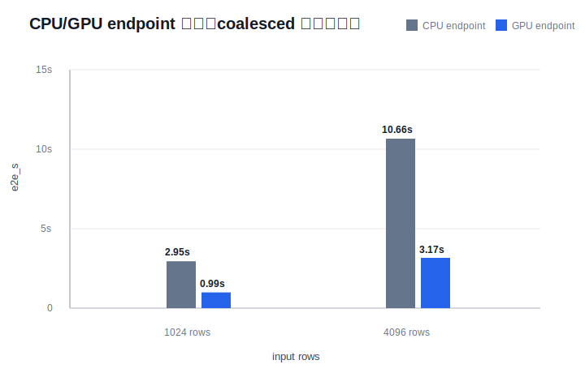
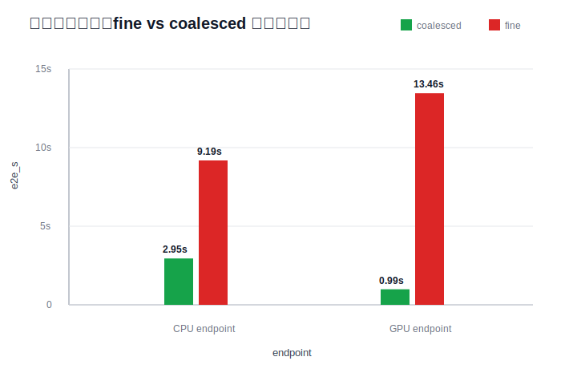
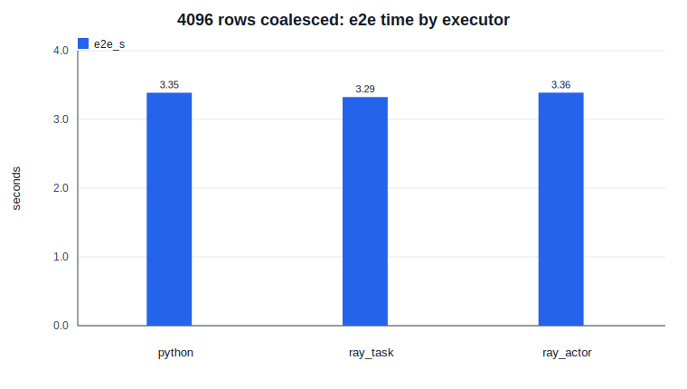

# 已完成实验学习讲解

本文按项目推进顺序讲解已经做过的实验。目标不是替代正式报告，而是帮你理解：

- 这些实验在测什么；
- 为什么要测；
- 术语是什么意思；
- 数据在链路里怎么流动；
- 结果有什么用；
- 不能从结果里过度推出什么。

如果只看正式 CSV 和报告，很容易被 `object_count`、`fan-in`、`bounded_wait_s`、`writeback_s` 这些词挡住。本文会尽量先讲人话，再对应到实验指标。

## 目录

- [0. 先建立全局图景](#0-先建立全局图景)
- [1. 核心术语](#1-核心术语)
  - [Ray](#ray)
  - [Daft](#daft)
  - [Lance](#lance)
  - [Arrow 和 RecordBatch](#arrow-和-recordbatch)
  - [batch / partition](#batch--partition)
  - [object / object store](#object--object-store)
  - [fan-in](#fan-in)
  - [backpressure](#backpressure)
  - [writeback](#writeback)
- [2. 组件可行性验证：先测基础组件](#2-phase-0先测基础组件)
  - [2.1 Ray small task 实验](#21-ray-small-task-实验)
  - [2.2 Ray object transfer 实验](#22-ray-object-transfer-实验)
  - [2.3 Arrow serialization 实验](#23-arrow-serialization-实验)
  - [2.4 Shuffle simulation 实验](#24-shuffle-simulation-实验)
  - [2.5 Ray many objects fan-in 实验](#25-ray-many-objects-fan-in-实验)
  - [2.6 Ray Arrow fan-out/fan-in 实验](#26-ray-arrow-fan-outfan-in-实验)
- [3. 动机实验：把问题放到 AI 算子链路里](#3-动机实验把问题放到-ai-算子链路里)
  - [3.1 fake AI_EMBED(text) 端到端实验](#31-fake-ai_embedtext-端到端实验)
  - [3.2 三类 AI 算子场景对比](#32-三类-ai-算子场景对比)
  - [3.3 Granularity attribution 实验](#33-granularity-attribution-实验)
  - [3.4 Backpressure 模拟实验](#34-backpressure-模拟实验)
- [4. 接入 PostgreSQL 18.4：从 toy 链路到真实数据库触发](#4-接入-postgresql-184从-toy-链路到真实数据库触发)
  - [4.1 PG18.4 连接验证](#41-pg184-连接验证)
  - [4.2 PG18.4 系统画像：python/ray_actor × fine/coalesced](#42-pg184-系统画像pythonray_actor--finecoalesced)
- [5. Baseline 矩阵：不能默认 actor 就是最好](#5-baseline-矩阵不能默认-actor-就是最好)
  - [5.1 executor × strategy baseline](#51-executor--strategy-baseline)
  - [5.2 Ray actor batch size × worker 数](#52-ray-actor-batch-size--worker-数)
- [6. pgvector 写回实验：确认 writeback 不是 JSON 假象](#6-pgvector-写回实验确认-writeback-不是-json-假象)
- [7. pgvector scaling 实验：看规模扩大后瓶颈怎么变](#7-pgvector-scaling-实验看规模扩大后瓶颈怎么变)
- [8. 2026-07-12 优先动机补跑：先确认 GPU 主实验入口，再补最高可行 baseline](#8-2026-07-12-优先动机补跑先确认-gpu-主实验入口再补最高可行-baseline)
- [9. GPU-backed 真实 embedding 画像：把真实模型服务接进链路](#9-gpu-backed-真实-embedding-画像把真实模型服务接进链路)
- [10. CPU/GPU 对比：这些时间到底包括什么](#10-cpugpu-对比这些时间到底包括什么)
- [11. 到目前为止，整个课题流程是什么](#11-到目前为止整个课题流程是什么)
- [12. 后续该怎么学](#12-后续该怎么学)
- [13. 真实 embedding 链路拆分：开题动机更强的一组结果](#13-真实-embedding-链路拆分开题动机更强的一组结果)
  - [13.1 这次实验为什么要做](#131-这次实验为什么要做)
  - [13.2 新字段是什么意思](#132-新字段是什么意思)
  - [13.3 图怎么看](#133-图怎么看)
  - [13.4 结果怎么读](#134-结果怎么读)
  - [13.5 对开题有什么用](#135-对开题有什么用)
  - [13.6 和三个场景的关系](#136-和三个场景的关系)
  - [13.7 Ray 的价值为什么还要继续测](#137-ray-的价值为什么还要继续测)

## 0. 先建立全局图景

当前课题不是“研究 Ray 本身”，也不是“研究数据库内核”，而是研究：

> 数据库里触发一个 AI 算子以后，数据离开数据库、进入外部 AI / 分布式执行系统、再写回数据库的整条执行链路是否有可优化的瓶颈。

可以把当前链路理解成：

```text
PostgreSQL 表
  -> 取出一批行
  -> 转成 Arrow RecordBatch
  -> 切成 batch / partition
  -> 交给 Python / Ray task / Ray actor 执行 fake AI_EMBED
  -> 等所有结果回来，做 fan-in
  -> 写回 PostgreSQL / pgvector
```

这里每一步都可能慢：

- 取数据可能慢；
- 把数据转成 Arrow 可能慢；
- 切得太碎可能慢；
- Ray 任务太多可能慢；
- 模型服务排队可能慢；
- 结果合并可能慢；
- 写回数据库可能慢。

所以实验不是随便跑 benchmark，而是在逐步排查：到底哪一步值得研究。

这里要特别区分两个容易混在一起的说法：

```text
说法 A：AI 算子的真实计算端点可能是 GPU-backed model service
说法 B：论文主线是研究“怎么把数据库算子搬到 GPU / 怎么优化 GPU kernel”
```

本项目接受说法 A，但不把说法 B 当主线。工业界已经有 Snowflake AISQL、PostgresML、pgai vectorizer、pgvector 这类“数据库里暴露 AI 能力 / 数据库附近或外部 worker 计算 AI 结果 / 向量写回和检索”的路线。真实 embedding 或 LLM 服务很可能最终跑在 GPU、vLLM、Ray Serve 或其他模型服务上。我们要研究的是：

```text
数据库数据如何被取出、分批、分区、送到外部模型服务
  -> 如何控制 Ray task / actor / ObjectRef / in-flight 请求
  -> 如何避免 fan-in、队列、writeback 把吞吐吃掉
  -> 如何把结果可靠写回 PostgreSQL / pgvector / Lance
```

因此，“不优先接 GPU”的旧说法容易误导，应该改成更精确的说法：不优先研究 GPU 迁移或 GPU kernel，但主实验链路应尽早接入 GPU-backed model service。因为如果最终要优化的是 GPU-backed 外部链路，那么 CPU-only 阶段计时不能直接作为最终调优依据；CPU 上的瓶颈、变量敏感性和最优 batch/worker 配比，都可能在 GPU 模型服务加入后改变。

CPU/fake 实验仍然有用，但用途要进一步收窄：

- 作为脚本调试：确认 fetch、Arrow build、`ray.put`、fan-in、writeback 这些计时边界能被稳定记录。
- 作为历史预研：说明为什么早期会关注 task/object/fan-in/writeback。
- 作为粗略对照：说明“没有真实 GPU 模型服务时”系统表现是什么样。

它不能替代 GPU-backed E2E profile，也不能直接解释真实 GPU 链路瓶颈。更准确地说，GPU-backed E2E profile 才是“为什么要做这个课题”的第一层动机：如果真实生产式链路里，AI 算子外部服务链路、队列、fan-in 或 writeback 占了明显损耗，才有充分理由把论文主线放在外部链路调优上。后续变量解释应优先来自同一条 GPU-backed 链路上的大块消融，而不是退回 CPU/fake。

## 1. 核心术语

这一节不要先背定义。先固定一个具体场景：

```text
PostgreSQL 里有一张 documents 表
  -> 每一行是一篇文档或一段文本
  -> Python 程序从 PostgreSQL 取出一批行
  -> 把这些行整理成 Arrow RecordBatch
  -> 按 batch / partition 切成多块
  -> 交给数据库外部的 Ray task 或 Ray actor 做 fake AI_EMBED(text)
  -> 每个 Ray worker 在自己的 Python 进程里产出一批 embedding 结果
  -> 主控 Python 程序 ray.get 多个结果并合并，这一步属于 fan-in
  -> 主控 Python 程序再调用数据库连接写回 PostgreSQL 的 document_embeddings 表，或者写成 pgvector
```

所以每个术语都要问三件事：

1. 它在这条链路的哪一步？
2. 数据从哪里来，到哪里去？
3. 它影响的是数据形态、任务粒度、并行执行、排队，还是写回成本？

在代码里，当前有两个重要入口：

- `motivation/benchmarks/fake_embed_pipeline.py`：不连真实数据库，生成 fake 文档，用 Ray + Arrow 跑端到端动机实验。
- `code/scripts/postgres_ai_operator_profile.py`：连接 PostgreSQL 18.4，同构预演数据库触发、Ray/Python 执行、fan-in 和 writeback。

后面说“主控 Python 程序”时，主要指运行这些脚本的 Python 进程。PG18.4 画像脚本里对应 `main()` 调 `run_once()`，再在 `run_once()` 里完成取数、切 batch、提交 Ray、收结果和写回。

`psycopg` 是 Python 连接 PostgreSQL 的驱动库。它的作用类似“Python 和 PostgreSQL 之间的数据库连接器”。在 `code/scripts/postgres_ai_operator_profile.py` 里，Python 主控程序通过 `psycopg.connect()` 连接数据库，通过 SQL 把 `documents` 取出来，也通过它把 embedding 写回 `document_embeddings`。

当前链路里可以把几个进程分开看：

```text
PostgreSQL 服务进程
  保存 documents / document_embeddings

主控 Python 进程
  运行 postgres_ai_operator_profile.py
  通过 psycopg 读写 PostgreSQL
  通过 Ray API 提交任务、取回结果

Ray worker / actor 进程
  在数据库外部执行 fake embedding

Ray object store
  暂存 Ray task / actor 的输入输出对象
```

这个“数据库保存数据，外部 worker 计算 AI 结果，再写回数据库”的模式不是只有本项目这么做。更准确地说，业界和开源生态里常见几类路线：

| 路线 | 计算在哪里做 | 例子 | 和本项目关系 |
|---|---|---|---|
| 数据库内扩展 | PostgreSQL 扩展或数据库进程附近 | PostgresML 这类把 ML 能力集成进 PostgreSQL 的扩展 | 更像“数据库内 AI 能力”路线 |
| 外部 worker / vectorizer | 数据库外部的 worker 进程或服务 | pgai vectorizer worker、应用自建 embedding worker | 和本项目外部执行链路最接近 |
| 应用层 ETL / 服务 | 应用服务、Airflow/Spark/Ray 等外部系统 | 应用从数据库读文本，调用模型服务，再写回向量表 | 本项目用 Ray 学 AI infra 的合理落点 |
| 向量存储扩展 | 数据库负责存向量和检索，不一定负责算 embedding | pgvector | 本项目的 PostgreSQL + pgvector 写回实验属于这里 |

所以本项目不是在说“PostgreSQL 官方必须这样做”，而是在研究一种现实存在的架构选择：数据库触发或保存数据，AI 计算由外部执行链路承担，最后结果写回数据库。

也要注意：工程实现不一定都像当前脚本这样“主控 Python 进程统一 `ray.get` 所有结果，然后统一写回”。常见还有另一种方式：

```text
多个外部 worker
  -> 各自从队列取任务
  -> 各自调用模型生成 embedding
  -> 各自直接写回 PostgreSQL
```

这种方式可以减少主控进程的集中 fan-in，但会把压力转移到数据库连接数、写回并发、事务冲突、失败重试和结果一致性上。当前脚本选择主控进程收回再写回，是为了把 `fan-in_s` 和 `writeback_s` 两个时间边界分开测清楚，不代表所有工程都必须这样实现。

可对照的外部资料：

- Psycopg 官方文档：`psycopg` 是 Python 的 PostgreSQL database adapter。
- pgvector README：pgvector 支持在 Postgres 里存向量并做向量相似搜索。
- PostgresML README：代表“把 ML/AI 能力带到 PostgreSQL 内部或近数据库侧”的路线。
- pgai README：代表“PostgreSQL + stateless vectorizer workers”的路线，worker 从配置/队列读取任务，生成 embeddings，再写回数据库；但注意该项目 README 标注 2026 年 2 月起不再维护，所以只能作为架构参考，不能作为后续依赖前提。

更正式的路线判断和证据边界，见 `research/literature_and_evidence_review.md` 的 “PostgreSQL AI 链路的几类工程路线” 小节。学习文档只负责帮你理解这些路线是什么意思；是否影响课题规划，要回到 research / overview / motivation 的证据链里判断。

如果从工业系统角度理解本课题，可以先分成两个参照：

- Snowflake Cortex AISQL：用来理解“数据库/SQL 里直接暴露 AI_EMBED、AI_FILTER、AI_CLASSIFY 等 AI 算子”这个场景为什么真实存在。
- OceanBase / 达梦这类分布式数据库：用来理解数据库侧的工业边界，例如分布式执行、列式/向量化执行、事务、写回、资源隔离和多租户。

因此，学习时不要把问题理解成“我们凭空造一个 Ray benchmark”。更准确的图景是：工业界已经有数据库 AI SQL / AI Functions 的需求，而我们的课题是在探索这类需求背后的外部执行链路如何调优。

### Ray

Ray 是一个 Python 分布式执行框架。你可以把它理解成“帮你把很多 Python 函数或对象方法分发到多个 worker 上并行跑”的系统。

本项目里 Ray 主要用两种形态：

| 形态 | 通俗理解 | 项目里的意义 |
|---|---|---|
| Ray task | 每次调用都是一个远程函数任务 | 适合无状态、一次性的小计算 |
| Ray actor | 常驻 worker，对外暴露方法 | 适合需要保留模型、连接、缓存、状态的服务 |

放到本项目链路里，Ray 的位置是：

```text
Python 主控程序
  -> 把一批文本交给 Ray
  -> Ray 调度 task / actor worker
  -> worker 计算 embedding
  -> 结果先留在 Ray object store
  -> Python 主控程序再取回结果
```

从进程角度看：

- PostgreSQL 是数据库进程，负责保存 `documents` 和 `document_embeddings`。
- Python 主控程序是实验脚本，负责取数、切 batch、提交 Ray 任务、收结果、写回。
- Ray worker 是另外的 Python worker 进程，负责执行 AI 算子。
- Ray object store 是 Ray 管理的共享数据区域，用来放 worker 的输入或输出对象。

在 `code/scripts/postgres_ai_operator_profile.py` 里，三种执行方式对应不同函数：

| executor | 代码位置 | 运行含义 |
|---|---|---|
| `python` | `submit_python_batches()` | 不用 Ray，在主控 Python 进程里顺序执行 fake embedding |
| `ray_task` | `submit_ray_tasks()` | 主控进程提交 Ray task，Ray worker 进程执行 `fake_embed_batch()` |
| `ray_actor` | `submit_with_backpressure()` + `FakeEmbeddingActor.embed()` | 主控进程把 batch 发给常驻 Ray actor，actor worker 执行 embedding |

注意：当前实验发现 `ray_task` 在 fake workload 下很强，但不能直接说明真实模型也一定该用 task。真实模型可能需要常驻加载，这时 actor 可能更合理。

你说“不论怎么样都想使用 Ray”，这个作为学习目标是合理的：Ray 能帮你学习 task/actor、object store、分布式调度、队列和模型服务这些 AI infra / inference infra 能力。但作为论文论证，仍然需要保留 Python baseline、Ray task baseline、Ray actor baseline。否则导师或审稿人会问：为什么一定需要 Ray，而不是普通 Python worker、数据库内部线程池或普通服务？

### Daft

Daft 是一个面向 AI / 多模态数据处理的数据框和执行系统。你可以把它粗略理解成“更贴近 AI 数据处理的 Spark / DataFrame 系统”，它可以把表格、图片、文本、embedding 等数据组织成分区并执行计算。

当前项目还没有真正接 Daft。现在提 Daft，是因为未来数据库 AI 算子的外部执行链路可能类似：

```text
数据库表 -> Arrow/Parquet -> Daft DataFrame -> Ray 执行 -> 结果写回
```

这里几个词拆开看：

- 数据库表：例如 PostgreSQL 里的 `documents` 表，里面每一行有 `doc_id` 和 `text`。
- Arrow：内存里的列式表格格式，适合在 Python、数据库、执行系统之间传数据。
- Parquet：磁盘上的列式文件格式，常用于离线数据集。可以理解成“存到文件里的表格数据”。
- Daft DataFrame：Daft 看到的一张逻辑表，类似 pandas DataFrame 或 Spark DataFrame，但更面向 AI 数据处理。
- Ray 执行：Daft 可以把底层任务交给 Ray worker 去跑。

所以这条链路的意思不是“必须用 Daft”，而是：

```text
数据库里的表
  -> 变成外部系统容易处理的数据格式
  -> 进入一个 DataFrame 执行层
  -> 被切成 partition
  -> 交给 Ray 这样的执行后端并行跑
```

所以现在先用 Ray / Arrow / PostgreSQL 做最小可控实验，观察瓶颈是否存在。

### Lance

Lance 是面向 AI 数据和向量数据的列式存储格式 / 数据集格式，常用于 embedding、向量检索、多模态数据管理。

当前项目还没有真正接 Lance。现在先用 PostgreSQL + pgvector 写回，是为了模拟“AI 算子产出 embedding 后，需要写入向量存储”的环节。未来 Lance 可能作为写回或中间数据存储的候选路线。

这里要先理解 PostgreSQL 和 pgvector：

- PostgreSQL：开源关系数据库。可以存普通表，例如 `documents(id, text)`。
- pgvector：PostgreSQL 的一个扩展，让 PostgreSQL 可以存向量，例如 `embedding vector(128)`，并支持向量相似度检索。

本项目里的典型写回目标是：

```text
document_embeddings(doc_id, embedding)
```

其中 `embedding` 不是普通字符串，而是模型把文本转成的向量。例如 128 维向量可以理解成 128 个浮点数：

```text
[0.12, -0.03, 0.88, ..., 0.41]
```

pgvector 的作用就是让 PostgreSQL 能更自然地保存和查询这种向量。

`vector(128)` 里的 `128` 是向量维度，也就是每条文本被表示成 128 个浮点数。真实 embedding 模型常见维度可能是 384、768、1024 等；本项目用 128 维，是为了让本地实验更轻，同时保留“embedding 输出是一段浮点向量”的数据形态。它不是 128 行，也不是 128 个文档，而是一条文档 embedding 里的 128 个数。

### Arrow 和 RecordBatch

Arrow 是一种列式内存数据格式。它的目标是让不同系统之间高效交换表格数据。

RecordBatch 是 Arrow 里的“一批表格行”。例如 4096 行文档可以被组织成 16 个 RecordBatch，每个 256 行。

本项目关心 RecordBatch，因为数据库数据交给外部 AI 执行系统时，常常会变成这种批数据格式。

为什么需要从数据库到外部执行系统？

因为数据库擅长保存、查询、过滤表格数据，但 AI 算子通常需要 Python 生态、模型库、GPU/CPU 推理服务、批处理队列和分布式执行框架。例如 embedding 模型通常在 Python / PyTorch / Transformers / vLLM / Ray Serve 这一侧运行，而不是直接在 PostgreSQL 内核里运行。

所以当前场景是：

```text
PostgreSQL 保存文本
  -> 外部 Python/Ray 系统执行 AI_EMBED(text)
  -> PostgreSQL 保存 embedding 结果
```

这个外部 Python/Ray 系统可以有不同来源：

- 数据库厂商自己实现：例如企业数据库产品内置一个外部 worker、任务队列或模型服务适配层。
- 使用开源/第三方组件：例如 Ray、Spark、Daft、vLLM、Ray Serve、普通 Python 服务。
- 用户应用侧自己实现：业务系统定时从数据库读数据，调用模型 API 或本地模型，再写回数据库。

对本课题来说，重点不是先断言“谁来实现”，而是研究这个外部执行链路的共性问题：batch、partition、task/actor、object、fan-in、backpressure、writeback 如何影响端到端性能。

为什么外部执行系统不希望一行一行处理？

假设 `documents` 表里有 4096 行文本。如果一行一行处理，就会变成：

```text
取 1 行 -> 调 1 次模型 -> 写 1 行
取 1 行 -> 调 1 次模型 -> 写 1 行
...
重复 4096 次
```

这样会产生很多固定开销：函数调用、Ray task 调度、对象管理、数据库写入、模型调用队列。AI 模型和分布式系统通常更喜欢一次处理一批：

```text
取 256 行 -> 调 1 次模型 batch -> 写 256 行
```

这里的“行”就是表格的一行。例如：

| doc_id | text |
|---:|---|
| 1 | "database AI operator ..." |
| 2 | "Ray object store ..." |

把行按列放在内存里，就是列式数据。行式和列式可以这样理解：

```text
行式：
  row1 = (doc_id=1, text="...")
  row2 = (doc_id=2, text="...")

列式：
  doc_id column = [1, 2, ...]
  text column   = ["...", "...", ...]
```

列式格式适合批量计算和跨系统传输，因为同一列的数据连续组织，批处理时更容易一次性传给下游系统。

Arrow IPC 是 Arrow 的一种进程间或跨系统传输格式。IPC 可以理解成 Inter-Process Communication，也就是“进程之间交换数据”。Arrow IPC 序列化就是把内存里的 Arrow RecordBatch 变成一段可传输或可保存的二进制数据；反序列化就是再还原回来。

本项目测 Arrow IPC 序列化，是为了确认“把 RecordBatch 变成可传输格式”是不是瓶颈。当前实验事实是：Arrow IPC 本身不是当前最明显瓶颈，所以不能把主线写成单纯 Arrow serialization 优化。

### batch / partition

batch 是“一批数据”。partition 是“把数据切成几份”。在很多系统里二者会接近，但重点不同：

- batch 更强调一次送给算子或模型多少行；
- partition 更强调数据被分成多少块并行处理。

这里的“行”仍然是 `documents` 表里的一行，或者 Arrow RecordBatch 里的一行。比如：

```text
4096 行 documents
  -> batch_rows = 256
  -> 16 个 batch
```

如果交给 4 个 Ray worker，可以大致理解为：

```text
16 个 batch
  -> 分给 4 个 worker
  -> 每个 worker 处理若干 batch
```

批太小：任务太多、调度和合并成本高。
批太大：并行度不足，worker 可能吃不满。

所以当前课题不是简单说“batch 越大越好”，而是研究这些东西怎么匹配：

- batch：一次给模型多少行文本；
- partition：数据切成多少块；
- worker 数：有多少 Ray task / actor worker 并行处理；
- 模型服务吞吐：模型每秒能处理多少文本或 token；
- writeback：AI 结果从 Python/Ray 侧写回 PostgreSQL/pgvector 的速度。

### object / object store

Ray 会把远程任务的输入输出放进 object store。你可以把 object 理解成 Ray 管理的一块数据。

如果 16MB 数据切成 1 个 object，管理成本低。
如果同样 16MB 切成 256 个 object，数据总量没变，但对象数量变多，调度、引用、合并成本会上升。

更具体一点：

```text
Python 主控程序提交 Ray task
  -> Ray worker 处理一个 batch
  -> worker 返回 embedding 结果
  -> Ray 不一定立刻把大结果复制回主控程序
  -> Ray 先把结果放在 object store
  -> 主控程序拿到一个 ObjectRef
```

`ObjectRef` 可以理解成“结果对象的引用”或“取货单”。真正的数据在 Ray object store 里。主控程序需要结果时，会调用：

```python
ray.get(object_ref)
```

`ray.get` 的意思是：根据这个引用，把 Ray object store 里的实际结果取回到当前 Python 进程。这里的数据移动是：

```text
Ray object store / worker 侧结果
  -> Python 主控程序内存
```

如果有很多 `ObjectRef`，主控程序就要取很多次或取一大组，然后才能合并、排序、写回。

注意，`ray.get` 不是写数据库。它只做这一段：

```text
Ray object store 里的结果
  -> 回到主控 Python 进程内存
```

写数据库是后面的 `write_embeddings()` 做的：

```text
主控 Python 进程内存中的结果
  -> psycopg 数据库连接
  -> PostgreSQL document_embeddings 表
```

所以完整顺序是：

```text
提交 Ray 任务 -> 得到 ObjectRef -> Ray worker 算 embedding
  -> ray.get 取回结果 -> Python 合并结果 -> writeback 写数据库
```

### fan-in

fan-in 是“很多上游结果汇聚到一个下游”的过程。

在当前最小场景里，fan-in 是这样的：

```text
PostgreSQL documents 表里有 4096 行
  -> 切成 16 个 batch
  -> 16 个 Ray task / actor 调用并行处理
  -> 每个 task 产出一个 embedding 结果 object
  -> Python 主控程序 ray.get 这 16 个 object
  -> 按 doc_id 或原始顺序合并成一批结果
  -> 写回 document_embeddings 表
```

如果上游结果很多而且很碎，fan-in 会变慢。

这里的“上游”是多个 Ray worker 或多个 Ray task 的输出；“下游”通常不是另一个神秘系统，而是等待汇总结果的 Python 主控程序，或者下一阶段的合并/写回逻辑。

为什么说 `ray.get` 参与 fan-in？

不是因为 `ray.get` 这个 API 名字等于 fan-in，而是因为在这个场景里主控程序要对很多 Ray 结果调用 `ray.get`，把分散在多个 worker/object store 里的结果收回到一个地方。这个“多个结果回到一个主控程序并被合并”的流程就是 fan-in。

在代码里：

- `motivation/benchmarks/fake_embed_pipeline.py` 里，`reduced_outputs = ray.get(reducer_refs)` 取回多个 reducer 的输出。
- `code/scripts/postgres_ai_operator_profile.py` 里，`submit_with_backpressure()` 和 `submit_ray_tasks()` 内部对 ready refs 调 `ray_module.get(ready)`，把已完成的 Ray 结果取回。

所以 `ray.get` 只负责“取回结果”；fan-in 是围绕它发生的“多结果汇聚流程”；writeback 是再后面的数据库写入。

fine 粒度下可能是：

```text
1024 个小 object
  -> 主控程序需要等待和取回 1024 个结果
  -> 合并 1024 份小结果
  -> 再写回数据库
```

coalesced 粒度下可能是：

```text
32 个较大 object
  -> 主控程序取回 32 个结果
  -> 合并 32 份结果
  -> 再写回数据库
```

这就是 fan-in 成本为什么和 object 数量有关：数据总量可能一样，但“结果碎片数”不同。

不过要注意，项目后面的 granularity attribution 实验显示：收益不只来自 fan-in refs 变少，还来自 task 数、operator invocation 数减少。所以不能把课题简化成“只优化 fan-in”。

### backpressure

backpressure 是“下游处理不过来时，上游不要无限提交”的机制。

如果数据库 / CPU 侧一直生产请求，而模型服务消费速度固定，不限制提交会导致：

- 排队变长；
- in-flight 请求变多；
- token backlog 变大；
- 吞吐不一定提高。

这里的“上游”不是只指数据库本身，而是指更靠前、负责提交请求的一侧。在本项目模拟里，上游可以是：

```text
Python 主控程序 / 数据库外部 worker
  -> 不断从 documents 拿文本
  -> 不断向模型服务提交 embedding 请求
```

下游是：

```text
模型服务 replicas
  -> 逐个或逐批消费请求
  -> 执行 embedding / LLM 推理
```

如果上游每秒提交 2000 个请求，但模型服务只能稳定处理更少，请求就会排队。

几个相关词：

- in-flight：已经提交出去、但还没有完成的请求。它们“在路上”，既不在原地，也还没返回结果。
- queue wait：请求进入模型服务队列后，真正开始被模型处理前等待的时间。
- token backlog：队列里还没处理的 token 总量。LLM 服务常按 token 消耗算工作量，排队请求越多、每个请求越长，backlog 越大。

backpressure 的作用是限制 in-flight 请求数。例如 `queue_limit=8` 可以理解成最多只允许 8 个请求在路上。这样不一定提高吞吐，但可以避免队列无限变长。

当前 backpressure 结果来自模拟，不是真实 Ray Serve / vLLM 实验。因此它说明“模型服务队列值得验证”，不能直接写成真实模型服务结论。

### writeback

writeback 是“把 AI 算子的结果写回数据库或向量库”。

本项目里它可能是：

- 写 JSON TEXT；
- 写 pgvector `vector(128)`；
- 未来写 Lance 或其他向量存储。

写回经常被忽略，但最近实验显示，当 Ray 并行把模型阶段压短后，writeback 会变成大块成本。

在当前 PostgreSQL + pgvector 场景里，writeback 是：

```text
Ray worker / Python 主控程序已经拿到 embedding 结果
  -> Python 主控程序通过数据库连接 psycopg
  -> 把 (doc_id, embedding) 写入 PostgreSQL
  -> 目标表是 document_embeddings
```

从硬件/系统层面粗略看，是：

```text
Python 进程内存中的 embedding 数组
  -> 通过本机或网络 socket 发给 PostgreSQL 服务进程
  -> PostgreSQL 写入自己的 shared buffers / WAL / 数据文件
```

`upsert` 是 update + insert 的组合。意思是：

```text
如果 doc_id 还不存在，就 insert 一行；
如果 doc_id 已经存在，就 update 原来的 embedding。
```

单行 upsert 就是每次只写一条：

```text
写 doc_id=1
写 doc_id=2
写 doc_id=3
...
```

批量写回就是一次写一批：

```text
一次写 256 条 embedding
```

本项目实验显示，单行 upsert 会让写回成为很重的成本；批量写回明显更合理。这里不能过度解释成“pgvector 很慢”，因为慢的是单行写回模式和数据库交互开销，不是已经证明 pgvector 本身有问题。

## 2. 组件可行性验证：先测基础组件

组件可行性验证的目的不是证明论文贡献，而是排雷：先看哪些方向不值得优先做。

从这一节开始，读每个实验时都按同一个顺序：

```text
脚本入口
  -> 哪个 Python 进程是主控程序
  -> 数据对象是什么
  -> 数据从哪里到哪里
  -> Ray worker 是否参与
  -> 记录的指标对应哪一步
```

如果看到 `ray.put`、`ray.get`、fan-in、writeback，不要先背词，要先问：

- `ray.put`：主控进程把什么对象放到 Ray object store？
- `ray.get`：主控进程从 Ray object store 取回什么结果？
- fan-in：多少个结果汇到哪里？
- writeback：最终结果写到文件，还是写回 PostgreSQL 表？

### 2.1 Ray small task 实验

正式结果：`feasibility/results/ray_small_task.csv`

**为什么做：**
如果 Ray 每个小任务本身就很慢，那论文可能要研究 Ray scheduler / runtime。但如果小任务开销很低，就不应该把主线放在“改 Ray 调度器”。

**测什么：**
提交很多很小的 Ray task，看每个 task 平均耗时。

**结果怎么读：**
warm-up 后最高平均 task latency 约 `0.183 ms`。

**说明什么：**
在当前环境和实验规模下，Ray small task 固定开销不是最强瓶颈。

**不能说明什么：**
不能说 Ray task 永远不慢。后面真实数据库链路里，task 数量、数据传输、模型执行和写回都会叠加。

### 2.2 Ray object transfer 实验

正式结果：`feasibility/results/ray_object_transfer.csv`

**为什么做：**
数据库 AI 算子外部执行时，数据会在数据库、Arrow、Ray object store、worker 之间传递。我们要知道“小 object 传来传去”是不是有固定成本。

**测什么：**
把 bytes / numpy / Arrow 数据放进 Ray object store，再取出来，记录 `put`、`get` 和 round-trip 时间。

**结果怎么读：**
小 object 有毫秒级 round-trip 固定成本。

**说明什么：**
如果把数据切成大量很小的 object，即使总数据量不大，也可能因为对象数量多而变慢。

### 2.3 Arrow serialization 实验

正式结果：`feasibility/results/arrow_serialization.csv`

**为什么做：**
如果 Arrow IPC 序列化本身很慢，那么可以考虑做 Arrow buffer / serialization 优化。

**测什么：**
把 Arrow RecordBatch 序列化、反序列化，记录耗时。

**结果怎么读：**
最大 IPC 大小约 `12.21 MB`，平均 serialize 约 `1.015 ms`，deserialize 约 `0.053 ms`。

**说明什么：**
Arrow IPC 本身不是当前最明显瓶颈。

**对方向的影响：**
不优先做“单纯 Arrow serialization 优化”。

### 2.4 Shuffle simulation 实验

正式结果：`feasibility/results/shuffle_simulation.csv`

**为什么做：**
很多分布式数据系统会有 shuffle：数据按 key 重新分组、重新分区。我们想知道 coalescing 是否一定让 shuffle 更快。

**测什么：**
用本地 Python 模拟 shuffle，对比 fine 和 coalesced。

**结果怎么读：**
本地模拟没有证明 coalescing 更快。

**说明什么：**
这是一个负结果。它提醒我们不能为了证明 coalescing 好，就构造一个一定赢的故事。

### 2.5 Ray many objects fan-in 实验

正式结果：`feasibility/results/ray_many_objects.csv`

**为什么做：**
想单独看“object 数量”对 fan-in 的影响。固定总数据量，只改变 object 个数。

**测什么：**
固定总数据量 `16MB`，把它切成 `1` 到 `256` 个 object，再让下游取回。

**结果怎么读：**
`1` 个 object fan-in 约 `7.27 ms`，`256` 个 object fan-in 约 `18.85 ms`，放大约 `2.59x`。

**说明什么：**
总数据量不变时，对象数量本身会影响 fan-in 成本。

### 2.6 Ray Arrow fan-out/fan-in 实验

正式结果：`feasibility/results/ray_arrow_fanout_fanin.csv`

**为什么做：**
前一个实验是普通 object。这个实验换成更接近数据库 AI 链路的 Arrow RecordBatch。

**测什么：**
固定 `65536` 行、`128` 维 embedding，比较 fine 和 coalesced 在不同 upstream/downstream 下的 fan-in。

**结果怎么读：**
平均 fine/coalesced fan-in 比约 `3.17x`。

**说明什么：**
当数据形态接近数据库 AI 算子输出时，小 RecordBatch / 小 object 多会明显放大 fan-in 成本。

## 3. 动机实验：把问题放到 AI 算子链路里

组件可行性验证只证明组件现象。动机实验要回答：这个现象放到 AI 算子场景里还存在吗？

这一节开始进入你当前真正关心的场景：AI 算子不是普通计算，而是类似 `AI_EMBED(text)` 这种“输入文本、输出向量”的 operator。先记住这一层链路：

```text
文本行
  -> batch
  -> fake / real AI operator
  -> embedding / label / generated text
  -> fan-in
  -> write output
```

当前多数实验还是 fake AI operator：它模拟模型执行和输出形态，但不是完整真实模型。因此它适合定位系统链路问题，不适合直接声称真实模型推理收益。

### 3.1 fake AI_EMBED(text) 端到端实验

正式结果：`motivation/results/fake_cpu/fake_embed_pipeline.csv`

**为什么做：**
我们不想只测孤立的 Ray object，而是模拟数据库里的 `AI_EMBED(text)`：输入文本，输出 embedding。

**链路：**

```text
generate documents
  -> Arrow RecordBatch
  -> ray.put
  -> fake AI_EMBED
  -> downstream fan-in
  -> write Arrow output
```

**关键术语：**

- `AI_EMBED(text)`：把文本变成向量。
- fake embedding：不跑真实模型，用 sleep / 随机向量模拟模型耗时和输出。
- upstream / downstream：上游分区数和下游汇聚分区数。

**关键结果：**
`upstream=32, downstream=32` 时：

- fine：`1024` 个 input objects，e2e `1318.44 ms`
- coalesced：`32` 个 input objects，e2e `430.10 ms`

**说明什么：**
RecordBatch fan-in 的现象迁移到了 fake AI_EMBED 链路。

**不能说明什么：**
不能说真实 embedding 模型一定有同样收益。这个实验同时改变了 task 数、object 数和 operator invocation 数。

### 3.2 三类 AI 算子场景对比

正式结果：`motivation/results/fake_cpu/workload_matrix.csv`

**为什么做：**
如果只有 embedding 场景受影响，那问题太窄。我们要看 classify/filter/offline LLM 这类 AI 算子是否也对粒度敏感。

**三个场景：**

| 场景 | 通俗解释 |
|---|---|
| embed_rag | 文本切块、生成 embedding、写入向量库 |
| classify_filter | 用 AI 对文本分类、过滤、重排 |
| offline_llm | 离线生成、抽取、评测类 LLM 任务 |

**关键结果：**
`upstream=32, downstream=32` 下，三类场景 fine/coalesced e2e ratio 都约 `4x`。

**说明什么：**
问题不只存在于 embedding vector 写回，也可能是数据库 AI 算子外部执行链路的共性粒度问题。

**不能说明什么：**
当前 offline LLM 仍是 fake，不代表真实 LLM prefill/decode、KV cache 或 continuous batching。

### 3.3 Granularity attribution 实验

正式结果：`motivation/results/fake_cpu/granularity.csv`

**为什么做：**
前面的 coalesced 变快了，但到底是因为 fan-in refs 少了，还是 task / operator invocation 少了？这个实验专门拆原因。

**策略解释：**

| 策略 | 通俗解释 |
|---|---|
| fine | 一开始就切很碎，每个小块都跑 AI operator |
| two_stage_coalesced | 先细粒度执行，再额外合并 |
| downstream_coalesced | 一开始就按下游目标做粗粒度 AI operator |
| upstream_bundled | 按上游打包执行，但保留较多逻辑 payload |

**关键结果：**
`upstream=32, downstream=32`：

- fine：`1056` 个 Ray tasks，e2e `139.27 ms`
- two_stage_coalesced：fan-in refs 降了，但 e2e 变成 `176.00 ms`
- downstream_coalesced：tasks 降到 `64`，e2e `16.41 ms`
- upstream_bundled：tasks 降到 `64`，e2e `19.24 ms`

**说明什么：**
只在最后合并 object 不一定有用。更关键的是一开始就不要制造太多 AI operator invocation / Ray tasks。

**对课题的意义：**
优化点从“fan-in 合并”升级到“任务划分 + 并行执行组织”。

### 3.4 Backpressure 模拟实验

正式结果：`motivation/results/fake_cpu/backpressure.csv`

**为什么做：**
AI 模型服务吞吐有限。如果数据库侧无限提交请求，会不会更快？还是只会把队列撑爆？

**模拟链路：**

```text
database / CPU producer
  -> submit requests
  -> model replicas consume tokens
  -> optional queue_limit backpressure
```

**关键术语：**

- producer rate：上游提交请求速度。
- replicas：模型服务副本数。
- queue_limit：最多允许多少请求在路上。
- token backlog：排队还没处理的 token 总量。

**关键结果：**

`producer_rate=2000 rps, replicas=2`：

- 无界提交：tokens/s `23864.52`，avg queue wait `4768.50 ms`
- `queue_limit=8`：tokens/s 仍是 `23864.52`，avg queue wait 降到 `114.41 ms`

**说明什么：**
当模型吞吐固定时，无界提交不提高吞吐，只会放大排队和 backlog。

**不能说明什么：**
这是离散事件模拟，不是真实 Ray Serve / vLLM。

## 4. 接入 PostgreSQL 18.4：从 toy 链路到真实数据库触发

这一节开始，数据源不再只是脚本里生成的 fake documents，而是真实 PostgreSQL 表。主控 Python 程序通过 `psycopg` 连接数据库：

```text
PostgreSQL documents 表
  -> psycopg fetch 到 Python
  -> Arrow RecordBatch
  -> Python 或 Ray 执行 fake embedding
  -> Python 主控进程收回结果
  -> psycopg 写回 document_embeddings 表
```

这也是理解后续 PG18.4 实验的关键：Ray 只负责外部 AI 计算和结果对象管理；PostgreSQL 负责保存输入表和输出表；Python 主控脚本负责把两边串起来。

### 4.1 PG18.4 连接验证

正式结果：`feasibility/results/pg18_4_connection_validation.md`

**为什么做：**
之前都是本地 fake benchmark，没有真实数据库触发。这个实验先证明本地 PostgreSQL 18.4 + pgvector 环境能用。

**链路：**

```text
PostgreSQL documents/job table
  -> psycopg fetch
  -> Arrow RecordBatch
  -> Ray fake-embedding actors
  -> bounded in-flight + fan-in
  -> PostgreSQL document_embeddings writeback
```

**关键结果：**

- PostgreSQL `18.4`
- pgvector `0.8.2`
- 256 行 smoke run 成功
- `documents` 和 `document_embeddings` 都有 256 行

**说明什么：**
本地真实数据库链路通了。

**不能说明什么：**
这只是连接验证，不是性能结论，也不是公司 PostgreSQL 18.3 平台结果。

### 4.2 PG18.4 系统画像：python/ray_actor × fine/coalesced

正式结果：`motivation/results/pg18_4_fake/system_profile.md`

**为什么做：**
数据库真的接上后，要看之前的 fine/coalesced 差异是否还存在。

**固定设置：**

- `total_rows=4096`
- `ray_batch_rows=256`
- `embedding_dim=128`
- `model_workers=2`
- `max_inflight=8`

**关键结果：**

| executor | strategy | e2e_s | writeback_s | bounded_wait_s | fanin_s |
|---|---|---:|---:|---:|---:|
| python | fine | 64.288 | 0.479 | 0.000 | 0.000 |
| python | coalesced | 3.798 | 0.507 | 0.000 | 0.000 |
| ray_actor | fine | 32.922 | 0.477 | 28.378 | 0.593 |
| ray_actor | coalesced | 2.435 | 0.470 | 0.000 | 0.006 |

**说明什么：**

- 数据库真实触发链路里，fine 仍明显慢于 coalesced。
- Ray actor fine 会暴露大量 `bounded_wait_s` 和 `fanin_s`。
- coalesced 下 writeback 约 `0.47s`，已经是可见成本。

**对下一步的影响：**
必须补 Ray task baseline、batch/worker 矩阵、pgvector 写回。

## 5. Baseline 矩阵：不能默认 actor 就是最好

正式结果：`motivation/results/pg18_4_fake/baseline_matrix.md`

### 5.1 executor × strategy baseline

**为什么做：**
上一轮只有 python 和 ray_actor。我们需要知道 Ray task 是否也是强 baseline。

**结果：**

| executor | strategy | e2e_s | writeback_s | bounded_wait_s |
|---|---|---:|---:|---:|
| python | coalesced | 3.729 | 0.464 | 0.000 |
| ray_task | coalesced | 2.200 | 0.458 | 0.000 |
| ray_actor | coalesced | 2.353 | 0.481 | 0.000 |
| ray_task | fine | 8.797 | 0.451 | 4.507 |
| ray_actor | fine | 33.567 | 0.490 | 28.224 |

**说明什么：**

- 在 fake 无状态 embedding 下，Ray task 很强。
- actor 不一定优于 task。
- fine 下 actor 的 bounded wait 很明显。

**不能说明什么：**
真实模型可能需要常驻加载、缓存和连接复用，所以不能说 Ray task 永远优于 actor。

### 5.2 Ray actor batch size × worker 数

**为什么做：**
batch 太小任务多，batch 太大并行少。actor 数也会影响吞吐。这个实验看 batch 和 worker 怎么配。

**结果：**

- `batch=1024, workers=4` 最快，e2e `1.433s`
- `batch=256, workers=4` e2e `1.500s`
- `batch=64, workers=1` e2e `4.554s`

**说明什么：**
不是 batch 越大或越小越好，而是 batch size 和 worker 数要匹配。

## 6. pgvector 写回实验：确认 writeback 不是 JSON 假象

正式结果：`motivation/results/pg18_4_fake/vector_writeback.md`

**为什么做：**
前面 writeback 用 JSON TEXT。真实 embedding 通常要写到 pgvector `vector(128)`。我们要确认 JSON TEXT 有没有误导。

**对照：**

- `json_text`
- `pgvector`
- write batch rows：`1, 64, 256, 1024, all`

**关键结果：**

| mode | batch | e2e_s | writeback_s | writeback/e2e |
|---|---:|---:|---:|---:|
| json_text | 1 | 4.116 | 3.127 | 75.98% |
| pgvector | 1 | 3.935 | 2.960 | 75.22% |
| json_text | all | 1.455 | 0.458 | 31.48% |
| pgvector | all | 1.360 | 0.377 | 27.72% |

**说明什么：**

- 单行 upsert 会让写回成为绝对主瓶颈。
- 批量写回非常重要。
- pgvector 批量写回没有比 JSON TEXT 更慢。
- 但 writeback 仍是显著成本，最快时也占约 28%。

**对下一步的影响：**
后续实验默认用 pgvector 批量写回，不要用单行 upsert。

## 7. pgvector scaling 实验：看规模扩大后瓶颈怎么变

正式结果：`motivation/results/pg18_4_fake/pgvector_scaling.md`

**为什么做：**
4096 行看到 writeback 可见，但行数扩大后瓶颈是否迁移？Ray 并行是否更有用？

**设置：**

- `total_rows = 1024, 4096, 16384`
- `executor = python, ray_task, ray_actor`
- `strategy = coalesced`
- `writeback_mode = pgvector`
- `write_batch_rows = 256`

**关键结果：**

| rows | executor | e2e_s | rows/s | writeback/e2e |
|---:|---|---:|---:|---:|
| 1024 | python | 0.914 | 1120 | 11.4% |
| 1024 | ray_task | 0.924 | 1109 | 11.3% |
| 1024 | ray_actor | 1.070 | 957 | 9.8% |
| 4096 | python | 3.588 | 1142 | 10.7% |
| 4096 | ray_task | 1.240 | 3304 | 33.8% |
| 4096 | ray_actor | 1.363 | 3008 | 28.0% |
| 16384 | python | 14.247 | 1150 | 10.4% |
| 16384 | ray_task | 3.172 | 5166 | 47.1% |
| 16384 | ray_actor | 4.967 | 3300 | 31.1% |

**怎么读：**

- 1024 行只有 1 个 batch，Ray 没有并行优势。
- 4096 行开始 Ray 明显快。
- 16384 行 Ray task 吞吐最高。
- Ray 并行压缩了 fake model 的墙钟时间后，writeback 占比上升到 47.1%。

**重要解释：**

这说明瓶颈会迁移：

```text
Python 顺序执行：主要慢在 fake model
Ray 并行执行：model 墙钟时间下降，writeback 变成大块成本
```

**Fine 对照：**

4096 行：

- Ray task fine/coalesced：`8.722s / 1.240s = 7.03x`
- Ray actor fine/coalesced：`16.981s / 1.363s = 12.46x`

Fine 下 writeback 占比反而低，不是因为写回不重要，而是因为 invocation / queue / fan-in 把时间吞掉了。

## 8. 2026-07-12 优先动机补跑：先确认 GPU 主实验入口，再补最高可行 baseline

正式结果：`motivation/results/pg18_4_fake/simulated_embed_test_20260712.md`

**为什么做：**

当前项目第一优先级是 GPU-backed E2E profile，也就是：

```text
PostgreSQL documents 表
  -> 外部 Python / Ray worker
  -> GPU-backed embedding endpoint
  -> fan-in
  -> PostgreSQL / pgvector 写回
```

这次先检查本机是否已经具备这个主实验条件。结果是：

- PostgreSQL 18.4 + pgvector 0.8.2 已启动并可连接；
- NVIDIA GPU 能被 `nvidia-smi` 看到；
- 但 `localhost:8000` 没有 OpenAI-compatible embedding endpoint；
- `localhost:11434` 也没有可用本地模型服务。

所以这次不能把结果放进 `motivation/results/gpu/`。正确做法是：先补最高可行的 PG18.4 fake-model 同构 baseline，并明确它不能代表真实 GPU 链路。

**这次跑了什么：**

固定 4096 行、`db_fetch_rows=512`、`ray_batch_rows=256`、`embedding_dim=128`、2 个 worker、`max_inflight=8`、1 次 warm-up、2 次 formal，对比：

| executor | strategy | writeback | 用途 |
|---|---|---|---|
| `ray_actor` | `coalesced` | `json_text` | 当前外部 actor 链路 baseline |
| `ray_actor` | `fine` | `json_text` | 粒度过细的反例 |
| `python` | `coalesced` | `json_text` | no-Ray baseline |
| `ray_task` | `coalesced` | `json_text` | stateless Ray task baseline |
| `ray_actor` | `coalesced` | `pgvector` | 向量写回 baseline |

**关键结果：**

| executor | strategy | writeback | objects | invocations | e2e_s | rows/s | bounded_wait_s | fanin_s | writeback_s |
|---|---|---|---:|---:|---:|---:|---:|---:|---:|
| `ray_task` | `coalesced` | `json_text` | 16 | 16 | 2.239 | 1829.3 | 0.000 | 0.006 | 0.492 |
| `ray_actor` | `coalesced` | `pgvector` | 16 | 16 | 2.259 | 1813.5 | 0.000 | 0.006 | 0.391 |
| `ray_actor` | `coalesced` | `json_text` | 16 | 16 | 2.375 | 1724.9 | 0.000 | 0.006 | 0.518 |
| `python` | `coalesced` | `json_text` | 16 | 16 | 3.764 | 1088.1 | 0.000 | 0.000 | 0.506 |
| `ray_actor` | `fine` | `json_text` | 4096 | 4096 | 33.210 | 123.4 | 28.158 | 0.637 | 0.489 |

**怎么读：**

`fine` 的意思是几乎一行一个小任务；`coalesced` 的意思是一批行一起调用一次 AI operator。这次 4096 行里：

```text
fine:
  4096 个 object
  4096 次 operator invocation

coalesced:
  16 个 object
  16 次 operator invocation
```

所以 fine 慢不是因为数据库读取慢，也不是 Arrow build 慢。它主要慢在外部执行链路：任务太碎、调用太多、in-flight 等待和 fan-in 成本被放大。

**本地实验事实：**

- Ray actor fine/coalesced e2e 比约 `13.98x`。
- Ray task/coalesced 和 Ray actor/coalesced 接近。
- Python/coalesced 比 Ray coalesced 慢，说明这个 fake sleep 型 operator 能从 Ray 并行中受益。
- 批量 pgvector 写回在这轮没有比 JSON text 更慢。

**合理推断：**

真实 GPU-backed endpoint 接入后，第一件事仍应防止“一行一次模型服务调用”。否则模型服务 queue wait 和 invocation overhead 很可能先爆掉，后面再谈 object/fan-in 就晚了。

**不能声称：**

- 不能说这是真实 GPU embedding 结果；
- 不能说这是 PostgreSQL 18.3 内部平台结果；
- 不能说 `nvidia-smi` 可见就代表模型用了 GPU；
- 不能把 fake model 的 Ray task/actor 排名直接外推到真实模型。

下一步真正该补的是 `motivation/results/gpu/ai_embed_profile.md` 和 `.csv`。条件是先启动一个真实 GPU-backed embedding endpoint，例如 OpenAI-compatible 的：

```text
http://localhost:8000/v1/embeddings
```

脚本已经支持：

```powershell
--model-backend http_openai `
--embedding-endpoint-url http://localhost:8000/v1/embeddings `
--embedding-model <model-name>
```

## 9. GPU-backed 真实 embedding 画像：把真实模型服务接进链路

正式结果：`motivation/results/gpu/ai_embed_profile.md`

**为什么做：**

前面的模拟 embedding 测试只能说明链路和计时边界可用。真正的主动机需要把真实模型服务接进来：

```text
PostgreSQL documents 表
  -> Python / Ray 外部执行链路
  -> CUDA embedding HTTP endpoint
  -> fan-in
  -> PostgreSQL 写回
```

这次模型是 `sentence-transformers/all-MiniLM-L6-v2`，本地 endpoint 返回 384 维 embedding，并通过 `/health` 确认 `device=cuda`。这次 endpoint 是用户手动启动的；后续复现实验要先检查 `localhost:8000`，没有服务时再启动。

**这次解决了什么问题：**

我们第一次不再只用 fake embedding，而是真的调用了 GPU-backed embedding endpoint。这样可以开始回答：

- 真实模型接入后，逐行调用还会不会很慢？
- batch 调用是否仍然重要？
- Ray task / Ray actor 是否明显优于普通 Python？
- 模型服务和写回哪个阶段更重？

**关键结果：**

| rows | executor | strategy | calls | e2e_s | model request time sum (`model_service_s`) | writeback_s |
|---:|---|---|---:|---:|---:|---:|
| 1024 | `ray_actor` | `coalesced` | 4 | 0.990 | 0.451 | 0.402 |
| 1024 | `ray_actor` | `fine` | 1024 | 13.458 | 24.648 | 0.394 |
| 4096 | `python` | `coalesced` | 16 | 3.436 | 1.808 | 1.595 |
| 4096 | `ray_task` | `coalesced` | 16 | 3.175 | 2.705 | 1.594 |
| 4096 | `ray_actor` | `coalesced` | 16 | 3.165 | 2.561 | 1.554 |

**怎么读：**

1024 行时：

```text
fine:
  1024 次真实模型 HTTP 调用
  平均 e2e 13.458s

coalesced:
  4 次真实模型 HTTP 调用
  平均 e2e 0.990s
```

也就是说，真实 GPU embedding 下，逐行调用仍然很慢，约慢 `13.6x`。这比模拟结果更有价值，因为它证明了“不要一行一次模型调用”不是 fake 实验才有的现象。

4096 行 coalesced 时，Python / Ray task / Ray actor 差距不大。原因是这次只有一个本地 HTTP endpoint，Ray 并没有让模型服务本身变成多个 GPU replica。Ray 主要改变提交方式，但真正算模型的还是同一个 endpoint。

**本地实验事实：**

- 真实 CUDA endpoint 已接入。
- fine 逐行调用比 coalesced batch 调用慢约 `13.6x`。
- coalesced 后，writeback 已经是大块成本，约 `1.55s-1.60s`。
- 数据库读取和 Arrow 构造都很小，不是当前瓶颈。

**合理推断：**

- 后续优化不应该先纠结 Ray task 还是 Ray actor，而应先保证 batch 调用模型服务。
- 当模型调用被 batch 化之后，写回路径会变成重要优化点。
- 如果要让 Ray 明显发挥作用，需要多个模型 replica、Ray Serve 或更真实的 model-service 调度，而不是只有一个本地 HTTP endpoint。

**不能声称：**

- 这不是 PostgreSQL 18.3 内部平台结果。
- 这不是 vLLM 或 Ray Serve 结果。
- 当前 GPU utilization 只是 `nvidia-smi` 快照，不是连续 GPU profile。
- 384 维真实 embedding 还没有写入 pgvector，因为当前表里的 vector 列是 `vector(128)`。

下一步最自然的实验是改出 384 维 pgvector 写回表，再比较 JSON text 和 pgvector 写回。

## 10. CPU/GPU 对比：这些时间到底包括什么

正式结果：`motivation/results/cpu/cpu_vs_gpu_embed_comparison_20260712.md`

学习图：

- `learning/figures/cpu_gpu_coalesced_e2e_20260712.svg`
- `learning/figures/fine_vs_coalesced_e2e_20260712.svg`

这一节专门解释你问的那个问题：

> `CPU 1024 coalesced 2.95s` 和 `GPU 1024 coalesced 0.99s` 是整体流程时间吗？包括 AI 算子从 CPU 到 GPU 的搬运吗？

答案要拆开讲。

### 10.1 先画出这次实验链路

这次不是在测“数据库里的算子从 CPU 搬到 GPU”。数据库里没有直接执行 embedding 模型。真实计算发生在数据库外部的模型服务里：

```text
PostgreSQL documents 表
  -> Python profile driver 从数据库读文本
  -> Python 把文本整理成 Arrow RecordBatch
  -> Ray actor 把一批文本发给 HTTP embedding endpoint
  -> endpoint 里运行 all-MiniLM-L6-v2 模型
  -> endpoint 返回 embedding 数组
  -> Python / Ray 收集结果，fan-in
  -> Python 把 embedding 写回 PostgreSQL document_embeddings 表
```

CPU 和 GPU 对比只改一个关键点：

```text
CPU endpoint:
  endpoint 里的模型在 CPU 上跑
  http://localhost:8001/v1/embeddings

GPU endpoint:
  endpoint 里的模型在 CUDA GPU 上跑
  http://localhost:8000/v1/embeddings
```

数据库、Python driver、Ray actor、HTTP 调用方式、模型文件、batch size、写回方式尽量保持一致。

### 10.2 `e2e_s` 是什么

`e2e_s` 是 end-to-end seconds，也就是一次实验从开始到结束的墙钟时间。

它包含：

```text
创建 job 记录
  + 从 PostgreSQL 读取 documents
  + 构造 Arrow RecordBatch
  + 调用 embedding HTTP endpoint
  + 等结果回来，fan-in
  + 写回 PostgreSQL
```

所以：

```text
CPU 1024 coalesced e2e_s = 2.948s
GPU 1024 coalesced e2e_s = 0.990s
```

意思是：

> 同样处理 1024 条文本，整条数据库外部 embedding 链路，CPU endpoint 平均 2.948 秒，GPU endpoint 平均 0.990 秒。

它不是单独的“CPU 到 GPU 搬运时间”。

### 10.3 GPU 里有没有 CPU 到 GPU 的搬运

有，但当前实验没有单独拆出来。

GPU endpoint 内部大概是：

```text
收到 HTTP JSON 文本
  -> tokenizer 把文本变成 token ids
  -> PyTorch 创建 tensor
  -> tensor 放到 GPU
  -> GPU forward
  -> embedding 从 GPU 拿回 CPU
  -> 转成 Python list / JSON
  -> HTTP 返回
```

当前 `model_service_s` 来自每次 HTTP embedding 请求从发出到收到结果的耗时，并在一次实验结束时把这些请求耗时加总。它包含 endpoint 内部这些步骤，但没有细分成：

```text
tokenization_s
h2d_s
gpu_forward_s
d2h_s
json_serialize_s
```

所以严谨说法是：

> 当前结果包含 GPU endpoint 内部的数据搬运成本，但没有把搬运成本单独量出来。

不能说：

> CPU 到 GPU 搬运花了多少秒。

因为我们还没有这个字段。

### 10.4 `model_service_s` 为什么有时比 `e2e_s` 大

这是一个容易误解的点。先记住一句话：

> `model_service_s` 这个字段名有点误导。它不是“模型阶段墙钟时间”，而是“所有模型 HTTP 请求耗时的加和”。

Ray actor 可以让多个请求重叠执行，所以：

```text
请求 A 耗时 1 秒
请求 B 耗时 1 秒
如果它们并发重叠，墙钟可能接近 1 秒
但 model_service_s 加和是 2 秒
```

因此：

- `e2e_s` 是整次实验真实经过了多少秒；
- `model_service_s` 是 endpoint 请求耗时加和；
- 两者不是同一个概念。

读结果时，优先用 `e2e_s` 判断端到端快慢，用 `model_service_s` 判断模型服务压力大不大。

如果后续要更严谨，我们应该在脚本里新增一个字段：

```text
operator_wall_s
```

它表示：

```text
从第一批模型请求发出
  -> 到最后一批模型结果回来
```

这才是“模型调用阶段的墙钟时间”。目前还没有这个字段，所以不能用 `model_service_s` 当它。

### 10.5 这次 CPU/GPU 对比结果

| endpoint | rows | strategy | calls | e2e_s | model request time sum (`model_service_s`) | writeback_s |
|---|---:|---|---:|---:|---:|---:|
| CPU | 1024 | `coalesced` | 4 | 2.948 | 2.407 | 0.406 |
| GPU | 1024 | `coalesced` | 4 | 0.990 | 0.451 | 0.402 |
| CPU | 1024 | `fine` | 1024 | 9.186 | 15.899 | 0.430 |
| GPU | 1024 | `fine` | 1024 | 13.458 | 24.648 | 0.394 |
| CPU | 4096 | `coalesced` | 16 | 10.662 | 16.995 | 1.627 |
| GPU | 4096 | `coalesced` | 16 | 3.165 | 2.561 | 1.554 |

下面两张图分别画两个现象。图只负责呈现实验数值，解释放在正文里。





几个变量先解释清楚：

| 变量 | 在这次实验里是什么意思 |
|---|---|
| endpoint | 模型服务跑在 CPU 还是 GPU |
| rows | 从 PostgreSQL `documents` 表读多少条文本 |
| strategy | 文本怎么分批；`coalesced` 是一批多行，`fine` 是一行一调 |
| calls | 调用 embedding endpoint 的次数 |
| e2e_s | 整条链路总耗时 |
| model_service_s | HTTP 模型请求耗时加和；不是模型阶段墙钟时间 |
| writeback_s | embedding 结果写回 PostgreSQL 的时间 |

### 10.6 最重要的读法

第一，batch 后 GPU 明显更快。

```text
1024 rows coalesced:
  CPU: 2.948s
  GPU: 0.990s
  CPU/GPU = 2.98x

4096 rows coalesced:
  CPU: 10.662s
  GPU: 3.165s
  CPU/GPU = 3.37x
```

这说明真实模型 endpoint 接入后，GPU-backed endpoint 确实能明显降低端到端时间。

第二，逐行调用时 GPU 反而更慢。

```text
1024 rows fine:
  CPU: 9.186s
  GPU: 13.458s
```

这不是说 GPU 不行，而是说：

> 如果一行文本就调用一次模型服务，GPU 的优势发挥不出来，反而被 HTTP、tokenization、tensor 搬运、kernel launch、JSON 返回这些小调用开销拖住。

这对课题很重要，因为它说明：

```text
GPU-backed model service 不等于自动变快
必须配合 batch / in-flight / queue / writeback 设计
```

第三，GPU 加速后，写回变得更显眼。

```text
4096 rows GPU coalesced:
  e2e_s = 3.165s
  writeback_s = 1.554s
  writeback/e2e ≈ 49.1%
```

这说明模型快了以后，瓶颈会迁移到外部链路的其他部分，尤其是写回 PostgreSQL。

这正是本课题要抓的点：

> 不是只证明 GPU 比 CPU 快，而是证明 GPU-backed AI 算子链路里，batch、模型服务调用、fan-in、writeback 这些外部链路问题会决定端到端效果。

### 10.7 本地实验事实

- CPU/GPU 都使用同一个 `all-MiniLM-L6-v2` 模型。
- CPU endpoint 在 `localhost:8001`，GPU endpoint 在 `localhost:8000`。
- coalesced 模式下，GPU 端到端比 CPU 快约 `3x`。
- fine 模式下，GPU 比 CPU 慢，说明逐行调用模式很差。
- 4096 行 GPU coalesced 下，写回占了约一半端到端时间。

### 10.8 合理推断

- 后续不能把主线写成“把 AI 算子放到 GPU 就快了”。这个太浅。
- 更合理的研究问题是：数据库 AI 算子调用 GPU-backed model service 时，如何决定 batch、并发、队列、fan-in 和写回策略。
- CPU baseline 有必要保留，因为它帮助我们看出：哪些现象是 GPU 特有的，哪些是外部链路通用问题。

### 10.9 待确认问题

- 还没有拆 endpoint 内部时间：tokenization、CPU 到 GPU tensor transfer、GPU forward、GPU 到 CPU、JSON serialization。
- 还没有用 Ray Serve / vLLM 这种更接近生产的模型服务。
- 还没有把 384 维真实 embedding 写进 pgvector，因为当前表是 `vector(128)`。
- GPU utilization 只是 `nvidia-smi` 快照，不是连续 profile。

### 10.10 不能声称的结论

不能说：

- “CPU 到 GPU 搬运耗时是多少”，因为没拆这个指标。
- “GPU 总是比 CPU 快”，因为 fine 模式下 GPU 更慢。
- “这就是 PostgreSQL 18.3 内部平台结果”，因为现在是本地 PG18.4。
- “Ray 调度已经证明有效”，因为当前只有单个本地 endpoint，不是多 GPU replica。

可以说：

> 在本地 PG18.4 + 真实 embedding endpoint 链路中，batch 化调用 GPU endpoint 能显著降低端到端时间；但 GPU 加速后，写回和外部链路成本会变得更重要。逐行调用真实模型服务是明显错误的执行形态。

## 11. 到目前为止，整个课题流程是什么

可以把项目推进理解成 5 层：

### 第 1 层：组件可行性

问题：Ray / Arrow / object store 这些组件有没有明显单点瓶颈？

结论：Arrow serialization 不是主瓶颈；小 object 和 fan-in 有成本。

### 第 2 层：AI 算子动机

问题：这些组件现象放进 fake AI_EMBED 链路还存在吗？

结论：存在，而且不只 embedding 场景敏感。

### 第 3 层：收益来源拆分

问题：收益来自 fan-in 变少，还是 task / invocation 变少？

结论：两者都有，但减少过细 AI operator invocation 更关键。

### 第 4 层：真实数据库触发

问题：接 PostgreSQL 后现象还存在吗？

结论：PG18.4 本地同构链路里仍存在，且 writeback 开始显著。

### 第 5 层：baseline 和瓶颈迁移

问题：Python / Ray task / Ray actor、batch size、worker 数、pgvector 写回、规模变化如何影响瓶颈？

结论：

- Ray task 是必须保留的强 baseline；
- actor 不应默认更优；
- pgvector 批量写回可用且显著；
- 行数扩大后，Ray 并行会把瓶颈推向 writeback。

## 12. 后续该怎么学

下一步应该优先学习和验证 GPU-backed external chain，因为它是课题主动机，不只是校准项。你需要重点理解：

- fake embedding 和真实模型有什么区别；
- 模型 batch size 为什么影响吞吐；
- GPU-backed model service 的队列、in-flight、GPU utilization 和 batch policy 怎么影响端到端结果；
- Ray task 为什么适合无状态函数；
- Ray actor 为什么可能适合常驻模型；
- writeback 为什么必须单独计时；
- 为什么不能只看 e2e。
- 为什么 CPU/fake 结果只能做历史预研 / 脚本调试 / 计时边界验证，不能直接当作 GPU 链路调优结论。
- 为什么 GPU-backed E2E profile 是“真实端点画像”，不是“GPU kernel 优化主线”。

建议下一次实验讲解继续按这个模板：

1. 这个实验在整个链路里测哪一步？
2. 这个实验为什么现在做？
3. 输入数据从哪里来，经过哪些组件？
4. 每个参数是什么意思？
5. 记录了哪些指标？
6. 结果怎么读？
7. 它支持什么，不支持什么？
8. 下一步因此该做什么？

## 13. 真实 embedding 链路拆分：开题动机更强的一组结果

正式结果：

```text
motivation/results/gpu/ai_embed_chain_breakdown_20260712.md
motivation/results/gpu/ai_embed_chain_breakdown_20260712.csv
```

这里曾经出现过一个临时文件名 `clean`。它不是实验术语，只是表示“我修正了计时字段语义以后重新跑的一版干净数据”。正式分析只看：

```text
ai_embed_chain_breakdown_20260712.csv
```

不要看：

```text
ai_embed_chain_breakdown_draft_20260712.csv
```

### 13.1 这次实验为什么要做

前面我们已经知道：

- 真实 GPU embedding endpoint 能跑；
- fine 逐行调用很慢；
- coalesced batch 调用快很多；
- 4096 行时 writeback 已经很明显。

但开题时只说“fine 慢、batch 快”还不够。老师可能会继续问：

> 慢到底慢在哪里？是数据库读慢？Arrow 慢？Ray 慢？HTTP 模型服务慢？还是写回慢？

所以这次要把链路拆成：

```text
PostgreSQL fetch
  -> Arrow / batch 构造
  -> Ray task / actor 调度和外部 AI operator
  -> HTTP 模型服务请求墙钟时间
  -> fan-in
  -> writeback
```

### 13.2 新字段是什么意思

| 字段 | 通俗解释 | 怎么读 |
|---|---|---|
| `e2e_s` | 整个实验从开始到结束的墙钟时间 | 判断端到端快慢 |
| `db_fetch_s` | 从 PostgreSQL 读 `documents` 表的时间 | 看数据库读是不是瓶颈 |
| `arrow_build_s` | 把数据库行组装成 Arrow RecordBatch 的时间 | 看 batch 构造是否明显 |
| `operator_wall_s` | 外部 AI 算子阶段的墙钟时间 | 看 Ray/Python + 模型调用 + 结果取回这一段总体多长 |
| `model_request_wall_s` | 第一批 HTTP 模型请求开始，到最后一批请求结束的墙钟跨度 | 更适合看模型服务阶段占多少 |
| `model_service_s` | 每个 HTTP 请求耗时的加和 | 不能直接当阶段占比 |
| `submit_s` | 提交 Ray task / actor 调用的本地耗时 | 只看提交动作，不是完整 Ray 成本 |
| `bounded_wait_s` | 因为 in-flight 达到上限而等待的时间 | fine 模式下通常会变大 |
| `fanin_s` | 从 Ray worker 收回结果的时间 | 看结果合并成本 |
| `writeback_s` | 把 embedding 结果写回 PostgreSQL 的时间 | 看写回是否成为瓶颈 |

重点是：

```text
model_service_s 是请求耗时加和
model_request_wall_s 才更接近“模型请求阶段实际占了多少墙钟时间”
```

如果两个请求并发，每个请求 1 秒：

```text
model_service_s = 2 秒
model_request_wall_s 约等于 1 秒
e2e_s 也可能约等于 1 秒多一点
```

所以以后做阶段拆分图，优先用 `model_request_wall_s`、`operator_wall_s`、`writeback_s`，不要用 `model_service_s` 做占比。

### 13.3 图怎么看

图放在：

```text
learning/figures/
```

这三张图各讲一个问题。图下面的文字只解释怎么看图，图本身只保留标题、坐标轴、图例和数值。

**图 1：1024 行时，fine 和 coalesced 的端到端差异**


这张图看横轴的两个柱子：`coalesced` 是 4 次模型 endpoint 调用，`fine` 是 1024 次模型 endpoint 调用。纵轴是端到端时间，单位是秒。它说明逐行调用真实 GPU embedding endpoint 会把整条链路显著拖慢。

**图 2：4096 行 coalesced 下，不同 executor 的端到端时间**



这张图比较 `python`、`ray_task`、`ray_actor`。三根柱子很接近，所以当前不能说 Ray 已经明显更快。更严谨的结论是：在单个本地 GPU endpoint、16 个 coalesced batch 的设置下，Ray 和 Python 端到端接近；Ray 的价值需要在多 endpoint、路由、反压、worker 写回等后续实验里验证。

**图 3：16384 行时，AI operator 和 writeback 都已经很大**


这张图里的 `AI operator` 不是 PostgreSQL 内部算子，也不是 GPU kernel。它指数据库外部的 AI 算子执行阶段：

```text
Arrow batch 已经准备好
  -> 提交给 Python / Ray task / Ray actor
  -> Ray actor 调用 HTTP embedding endpoint
  -> 等模型服务返回 embedding
  -> ray.get / fan-in 把结果收回主控程序
```

它不包括前面的 `db_fetch` 和 `arrow_build`，也不包括后面的 `writeback`。在这张图里，`AI operator` 和 `writeback` 两根柱子都在 6 秒多，说明数据量扩大后，真实 GPU-backed 链路里不只是模型请求阶段重要，写回 PostgreSQL 也已经是同等级的大块成本。

### 13.4 结果怎么读

正式 repeat 均值如下：

| rows | executor | strategy | calls | e2e_s | operator_wall_s | model_request_wall_s | writeback_s |
|---:|---|---|---:|---:|---:|---:|---:|
| 1024 | ray_actor | coalesced | 4 | 0.888 | 0.505 | 0.397 | 0.374 |
| 1024 | ray_actor | fine | 1024 | 11.925 | 11.528 | 11.423 | 0.386 |
| 4096 | python | coalesced | 16 | 3.353 | 1.784 | 1.805 | 1.542 |
| 4096 | ray_task | coalesced | 16 | 3.291 | 1.677 | 1.685 | 1.588 |
| 4096 | ray_actor | coalesced | 16 | 3.355 | 1.677 | 1.587 | 1.651 |
| 16384 | ray_actor | coalesced | 64 | 13.168 | 6.473 | 6.448 | 6.586 |

第一，1024 行 fine 明显比 coalesced 慢：

```text
11.925 / 0.888 ≈ 13.4x
```

原因不是数据库读取，也不是 Arrow 构造。核心差异是：

```text
coalesced: 4 次模型 endpoint 调用
fine: 1024 次模型 endpoint 调用
```

所以这个结果支持：

> 数据库 AI 算子不能一行一行随便调用模型服务，batch / invocation 粒度是第一层必须解决的问题。

第二，4096 行 coalesced 下，Python、Ray task、Ray actor 很接近：

```text
python:    3.353s
ray_task:  3.291s
ray_actor: 3.355s
```

这说明当前不能说：

> Ray 已经明显更快。

更准确的说法是：

> 在单个本地 GPU endpoint、16 个 coalesced batch 的设置下，Ray 和 Python 端到端接近。Ray 的价值需要在多 endpoint、多 replica、路由、反压、worker 写回这些更复杂场景里验证。

第三，16384 行时，AI operator 和 writeback 都很大：

```text
operator_wall_s = 6.473s
writeback_s     = 6.586s
e2e_s           = 13.168s
```

这说明 GPU-backed 链路不是只有“模型推理”一个问题。模型请求阶段和写回阶段都已经接近端到端的一半。

### 13.5 对开题有什么用

这组结果让开题动机更稳，因为它能回答：

```text
外部链路是否存在瓶颈？存在。
瓶颈是否可分解？可以分成 AI operator / model request / writeback 等阶段。
是不是只要 GPU 就够？不是。
是不是已经证明 Ray 更好？还没有。
下一步为什么要研究调度、batch、反压、写回？因为这些阶段已经在真实 GPU-backed 链路里占了很大比例。
```

开题里可以安全地说：

> 在本地 PostgreSQL 18.4 同构预演环境中，真实 CUDA embedding endpoint 显示，数据库 AI 算子的性能问题不只来自模型计算。逐行调用模型服务会让端到端时间放大约 13.4 倍；当数据量扩大到 16384 行时，外部 AI operator 阶段和 PostgreSQL 写回阶段都接近端到端时间的一半。因此，本课题需要研究数据库 AI 算子的外部分布式执行链路，包括 batch 构造、Ray task/actor、模型服务请求控制、fan-in 和 writeback。

### 13.6 和三个场景的关系

现在开题优先用 `AI_EMBED`，不是因为另外两个场景不重要，而是因为 `AI_EMBED` 最容易形成真实闭环：

```text
PostgreSQL documents
  -> embedding endpoint
  -> embedding result
  -> writeback
```

但后续不能只停在 embedding。

三个场景的定位应是：

| 场景 | 当前定位 |
|---|---|
| `AI_EMBED` / RAG ingestion | 开题阶段真实链路主动机主场景 |
| `AI_FILTER` / `AI_CLASSIFY` | 后续补 selectivity、predicate ordering、cascade |
| `AI_COMPLETE` / offline LLM | 后续更贴近 AI infra 的重点主线候选 |

尤其是 `AI_COMPLETE`，后续要尽量作为主线候选推进，因为它能自然引出：

- token-aware batching；
- prefix-aware routing；
- KV cache / prefix cache locality；
- 模型服务队列；
- GPU utilization；
- backpressure；
- 失败重试和结果写回。

所以当前路线不是“只做 embedding”，而是：

```text
先用 AI_EMBED 建立真实数据库 AI 算子链路的主动机
再把 AI_COMPLETE 提升为更贴近 AI infra 的核心压力 workload
AI_FILTER / AI_CLASSIFY 用来补足 AI predicate 场景
```

### 13.7 Ray 的价值为什么还要继续测

正式结果：

```text
motivation/results/gpu/multi_endpoint_ray_motivation_20260712.md
motivation/results/gpu/ai_embed_multi_endpoint_20260712.csv
```

前面的 4096 行单 endpoint 实验里，Python、Ray task、Ray actor 很接近。这说明：

```text
不能直接说 Ray 已经有明显收益
```

但也不能反过来说：

```text
Ray 没有价值
```

因为单 endpoint 实验里，Ray 没有什么可调度的对象。所有 batch 最后都打到同一个本地模型服务，Ray 不能体现多 endpoint 路由、负载均衡、反压控制这些能力。

所以这次补了一个很小的多 endpoint 动机实验：

```text
endpoint 1: http://localhost:8000/v1/embeddings
endpoint 2: http://localhost:8001/v1/embeddings
```

注意，这还不是多 GPU。两个 endpoint 都跑在本机同一张 GPU 上。它只能用来做初步机制验证，不能写成多 GPU 结论。

三种执行方式的区别是：

| executor | 怎么用两个 endpoint |
|---|---|
| python | 轮询两个 endpoint，但仍然顺序调用 |
| ray_task | batch 并发提交，按 batch 轮询 endpoint |
| ray_actor | 两个 actor，分别绑定到两个 endpoint |

4096 行、16 个 coalesced batch 的正式均值：

| executor | e2e_s | operator_wall_s | model_request_wall_s | writeback_s |
|---|---:|---:|---:|---:|
| python | 3.444 | 1.845 | 1.865 | 1.573 |
| ray_task | 2.761 | 1.144 | 1.153 | 1.591 |
| ray_actor | 2.780 | 1.188 | 1.099 | 1.565 |

这里可以看出：

```text
Ray 主要降低了 AI operator 阶段
但 writeback 仍然差不多
```

所以端到端收益没有 operator 阶段那么大。

16384 行时，和前面的单 endpoint Ray actor 对比：

| setting | e2e_s | operator_wall_s | model_request_wall_s | writeback_s |
|---|---:|---:|---:|---:|
| 1 endpoint | 13.168 | 6.473 | 6.448 | 6.586 |
| 2 endpoints | 11.100 | 4.628 | 4.620 | 6.363 |

这个结果说明：

- Ray 的价值在多 endpoint / 并发路由设置下开始出现；
- 它主要体现在降低 `operator_wall_s` 和 `model_request_wall_s`；
- 但写回还是大块瓶颈，所以总 e2e 没有按模型阶段等比例下降；
- 后续必须把 Ray routing / backpressure 和 writeback 一起测，不能只测 Ray 调度。

开题里更严谨的说法是：

> 单 endpoint 下 Ray 和 Python 接近，不能证明 Ray 已经有效；但双 endpoint 初步实验显示，Ray task/actor 能通过并发路由降低外部 AI operator 阶段耗时。这支持后续继续研究多模型服务副本、请求路由、反压和 worker 写回，但当前还不能声称 Ray 在所有场景下都更优。

