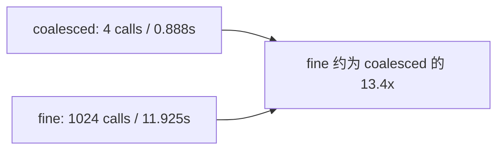
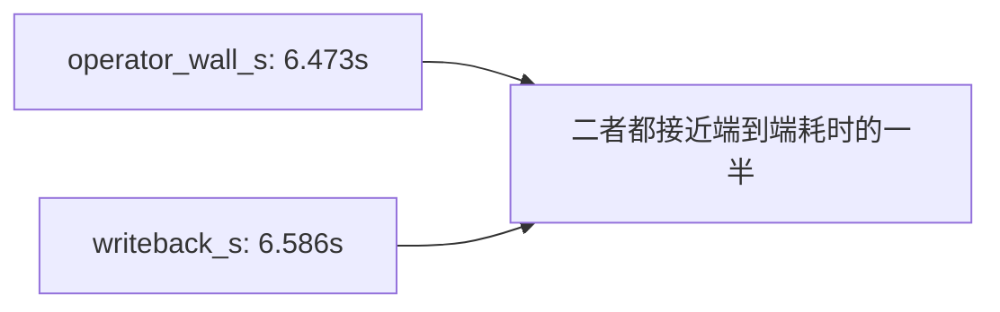
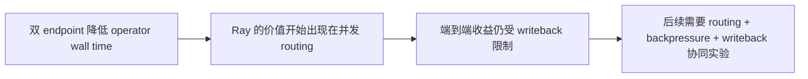
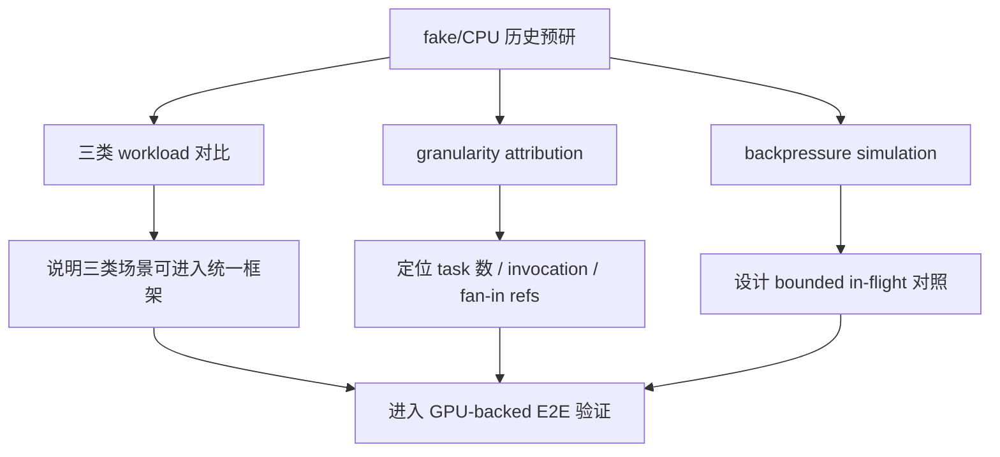

# 动机测试与可行性测试

## 1. 本页定位

本页汇总开题阶段已经完成的动机测试、可行性验证和实验边界。它不是项目总大纲，也不替代根目录 `PROJECT_OUTLINE.md`；它的作用是把实验事实讲清楚：实验在整条数据库 AI 算子执行链路中的位置是什么，记录了哪些指标，结果能说明什么，不能说明什么，下一步应该补哪些实验。

当前正式动机证据优先来自真实 GPU-backed `AI_EMBED` 端到端画像。`feasibility/` 中的内容主要用于环境、连接、脚本和组件级可行性验证；fake/CPU 结果用于解释早期为什么关注 task/object/fan-in、backpressure 和三类 workload，但不能替代真实 GPU-backed 链路结论。

## 2. 当前结论摘要

当前最稳妥的开题结论如下：

1. 数据库 AI 算子端到端链路已经在本地 PostgreSQL 18.4 同构预演环境中跑通，并接入真实 CUDA embedding endpoint。
2. `AI_EMBED` 的执行成本不只来自模型推理。batch 粒度、endpoint routing、fan-in 和 PostgreSQL writeback 都会影响端到端耗时。
3. 1024 行场景下，fine 逐行调用产生 1024 次 endpoint 请求，coalesced batch 调用只有 4 次请求；fine 的端到端耗时约为 coalesced 的 `13.4x`。
4. 4096 行单 endpoint 场景下，Python、Ray task、Ray actor 的 coalesced 结果接近，不能据此声称 Ray 天然更快。
5. 双 endpoint 场景下，Ray task / actor 可以降低 external operator wall time，但 16K 行时 writeback 仍然接近 `6.36s`，会限制端到端收益。
6. fake/CPU 预研说明 task 数、operator invocation、fan-in refs 和 queue wait 值得进入实验设计，但它们不是正式 GPU-backed 性能结论。

## 3. 实验主链路

当前真实 GPU-backed `AI_EMBED` 画像链路如下：

实验环境与边界：

| 项目 | 当前设置 |
|---|---|
| 数据库 | PostgreSQL 18.4 local rehearsal |
| 模型 | `all-MiniLM-L6-v2` |
| endpoint | OpenAI-compatible HTTP embedding endpoint |
| device | CUDA |
| GPU | NVIDIA GeForce RTX 5070 |
| embedding 维度 | 384 |
| 当前写回 | JSON text |
| 重要边界 | 不是 PostgreSQL 18.3 内部平台结果；当前还不是 384 维 pgvector 写回结果 |

本实验记录的主要阶段字段包括 `e2e_s`、`db_fetch_s`、`arrow_build_s`、`operator_wall_s`、`model_request_wall_s`、`bounded_wait_s`、`fanin_s` 和 `writeback_s`。其中 `model_service_s` 是请求耗时求和，存在并发时可能大于端到端耗时，因此不用它直接做阶段占比。

## 4. 真实 GPU-backed AI_EMBED 结果

### 4.1 batch 粒度影响

1024 行实验中，fine 与 coalesced 的差异主要来自 endpoint 调用粒度：

| Rows | Executor | Strategy | Calls | e2e_s | operator_wall_s | writeback_s | rows/s |
|---:|---|---|---:|---:|---:|---:|---:|
| 1024 | Ray actor | coalesced | 4 | 0.888 | 0.505 | 0.374 | 1153.9 |
| 1024 | Ray actor | fine | 1024 | 11.925 | 11.528 | 0.386 | 86.0 |

结果怎么读：在真实 CUDA embedding endpoint 接入后，逐行调用会显著放大 external operator stage。这个结果支持把 batch/coalescing 作为后续优化的基础变量。

当前不能声称：这不是 GPU kernel 优化收益，也不能直接外推到所有模型服务；它只说明当前 `AI_EMBED` 链路中 endpoint 调用粒度必须被控制。

### 4.2 单 endpoint 下 Ray 的边界

4096 行、单 endpoint、coalesced 场景中，Python、Ray task、Ray actor 结果接近：

| Rows | Executor | Strategy | Calls | e2e_s | operator_wall_s | writeback_s |
|---:|---|---|---:|---:|---:|---:|
| 4096 | Python | coalesced | 16 | 3.353 | 1.784 | 1.542 |
| 4096 | Ray task | coalesced | 16 | 3.291 | 1.677 | 1.588 |
| 4096 | Ray actor | coalesced | 16 | 3.355 | 1.677 | 1.651 |

结果怎么读：Ray 不能被写成“天然更快”。在单 endpoint、coalesced batch 已经成立时，Ray 目前主要是后续多 endpoint routing、bounded in-flight、actor pool 和 worker-side writeback 的实验 substrate。

当前不能声称：不能用这组结果证明 Ray 普遍优于 Python，也不能把 Ray 本身当成论文主问题。

### 4.3 writeback 成本已经进入主问题

16K 行、Ray actor、coalesced 场景中，operator 和 writeback 都是大块成本：

| Rows | Executor | Strategy | Calls | e2e_s | operator_wall_s | model_request_wall_s | writeback_s |
|---:|---|---|---:|---:|---:|---:|---:|
| 16384 | Ray actor | coalesced | 64 | 13.168 | 6.473 | 6.448 | 6.586 |

结果怎么读：只优化模型调用或并行调度可能被写回阶段限制。后续必须比较 driver fan-in 后统一写回、worker-side writeback、vectorizer-like queue worker 写回，以及 JSON text、pgvector(384)、Lance / Parquet 等不同 sink。

当前不能声称：当前写回是 JSON text，不是 384 维 pgvector 写回，因此不能把这组结果写成 pgvector 性能结论。

## 5. 多 endpoint Ray 动机测试

单 endpoint 实验不能证明 Ray 的优势，因此补充了双 endpoint 测试。当前两个 endpoint 都运行在本地同一块 GPU 上，作用是验证并发 routing 机制，不代表多 GPU 或 Ray Serve / vLLM 最终结果。

| Rows | Executor | Endpoints | Calls | e2e_s | operator_wall_s | writeback_s | rows/s |
|---:|---|---:|---:|---:|---:|---:|---:|
| 4096 | Python | 2 | 16 | 3.444 | 1.845 | 1.573 | 1189.3 |
| 4096 | Ray task | 2 | 16 | 2.761 | 1.144 | 1.591 | 1484.1 |
| 4096 | Ray actor | 2 | 16 | 2.780 | 1.188 | 1.565 | 1473.3 |
| 16384 | Ray actor | 2 | 64 | 11.100 | 4.628 | 6.363 | 1476.3 |

与单 endpoint Ray actor 对比：

| Rows | Executor | Endpoints | e2e_s | operator_wall_s | writeback_s |
|---:|---|---:|---:|---:|---:|
| 4096 | Ray actor | 1 | 3.355 | 1.677 | 1.651 |
| 4096 | Ray actor | 2 | 2.780 | 1.188 | 1.565 |
| 16384 | Ray actor | 1 | 13.168 | 6.473 | 6.586 |
| 16384 | Ray actor | 2 | 11.100 | 4.628 | 6.363 |

结果怎么读：Ray 的价值不应从“使用 Ray”本身出发，而应放在多模型 endpoint、并发 routing、bounded in-flight、actor pool 和 worker-side writeback 条件下验证。

当前不能声称：这不是多 GPU 实验，不是 Ray Serve / vLLM 结论，也不是最终系统贡献。

## 6. fake/CPU 预研结果如何使用

fake/CPU 预研只用于解释变量来源和实验设计，不作为真实 GPU-backed 链路瓶颈归因。

| 预研实验 | 关键数据 | 对后续实验的作用 | 不能声称 |
|---|---|---|---|
| 三类 workload fake 对比 | `upstream=32, downstream=32` 时，`embed_rag`、`classify_filter`、`offline_llm` 的 fine/coalesced e2e 比值约为 `4.01x`、`4.32x`、`4.37x` | 支持三类 AI 算子都进入统一执行策略验证 | 不能说真实 LLM 推理一定有 4x 收益 |
| granularity attribution | `fine` 为 1056 个 Ray tasks、e2e `139.27 ms`；`downstream_coalesced` 为 64 个 tasks、e2e `16.41 ms` | 说明收益不只来自 fan-in refs，还包括 operator invocation 和 task 数 | 不能直接外推到真实模型服务 |
| backpressure simulation | `queue_limit=8` 将平均 queue wait 从 `4768.50 ms` 降到 `114.41 ms`，tokens/s 基本不变 | 支持 bounded in-flight / queue-aware 调度设计 | 不能说 backpressure 一定提高吞吐 |
| PG18.4 fake-model 画像 | 4096 行 Ray actor fine/coalesced e2e 比约 `13.52x` | 说明数据库触发链路中 batch/invocation 粒度值得继续验证 | 不能代表 PostgreSQL 18.3 或真实 GPU 结果 |

## 7. 可行性验证的作用边界

`feasibility/` 目录当前只承担组件级验证职责。它可以说明环境、连接、脚本和数据通路可用，但不能承担项目总大纲职责，也不能替代 `motivation/results/` 中的正式动机证据。

| 证据来源 | 已完成内容 | 能说明什么 | 不能说明什么 |
|---|---|---|---|
| PG18.4 + pgvector 连接验证 | 数据库可连接、可读写、pgvector 扩展可用 | 本地预演环境可用 | 不能说明性能收益 |
| fake-model 链路 | PostgreSQL -> Arrow -> Python/Ray -> fake operator -> writeback | 阶段计时口径和脚本链路可运行 | 不能说明真实 GPU 瓶颈 |
| GPU-backed `AI_EMBED` | PostgreSQL -> Arrow -> Python/Ray -> CUDA endpoint -> writeback | 真实模型服务可进入端到端画像 | 当前写回不是 384 维 pgvector |
| 双 endpoint 动机测试 | Python / Ray task / Ray actor 调用两个本地 endpoint | 可验证并发 routing 对 operator wall time 的影响 | 不能代表多 GPU、Ray Serve 或 vLLM |

## 8. 对开题方向的含义

这些实验支持当前开题主线：

> 面向数据库 AI 算子的模型服务感知批处理执行与写回协同优化研究。

对应关系如下：

| 开题研究内容 | 当前实验支撑 | 后续需要补的证据 |
|---|---|---|
| 模型服务感知的批处理执行调度 | fine/coalesced 差异、单 endpoint 下 Ray 边界、双 endpoint routing 动机 | bounded vs unbounded in-flight、Ray Serve / vLLM replica、GPU utilization 连续采样 |
| 写回压力感知的结果汇聚与持久化协同 | 16K 行 writeback 与 operator 接近 | pgvector(384)、driver vs worker vs queue worker writeback、Lance / Parquet sink |
| 面向多类数据库 AI 算子的策略选择与边界 | fake/CPU 三类 workload 预研 | `AI_FILTER/AI_CLASSIFY` 与 `AI_COMPLETE` 的真实或半真实链路验证 |

## 9. 下一步实验

短期优先补以下实验：

1. 补 384 维 pgvector 写回实验，比较 JSON text 与真实 vector 写回。
2. 比较 driver fan-in 后统一写回、Ray worker-side writeback、vectorizer-like queue worker 写回。
3. 在真实 GPU-backed 链路中补 bounded vs unbounded in-flight，对比 queue wait、bounded wait、throughput、writeback。
4. 用 Ray Serve、vLLM 或等价本地模型服务替代手动双 endpoint。
5. 扩展到 `AI_FILTER/AI_CLASSIFY`，验证 selectivity-aware predicate pipeline。
6. 扩展到 `AI_COMPLETE`，验证 token-aware batching、prefix-aware routing 和 queue-aware backpressure。
7. 后续迁移到 PostgreSQL 18.3 内部平台复测，避免把 PG18.4 本地同构预演结果写成正式平台结论。

## 10. 本页引用的本地材料

- `motivation/results/gpu/ai_embed_chain_breakdown_20260712.md`
- `motivation/results/gpu/ai_embed_chain_breakdown_20260712.csv`
- `motivation/results/gpu/multi_endpoint_ray_motivation_20260712.md`
- `motivation/results/gpu/ai_embed_multi_endpoint_20260712.csv`
- `motivation/results/fake_cpu/analysis.md`
- `feasibility/README.md`
- `PROJECT_OUTLINE.md`
