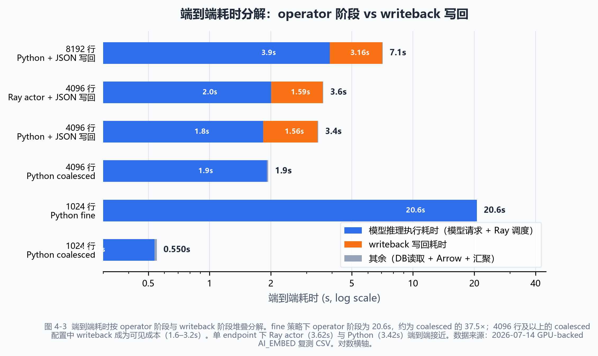

# 硕士生论文开题报告

题目：面向数据库驱动 AI 工作负载的分布式数据执行与存储协同优化研究

## 1. 课题背景、目的和意义

数据库系统正在从管理结构化数据，扩展到承载文本、图像、向量和模型推理结果等 AI 数据处理任务。Snowflake Cortex AISQL[1]、BigQuery ML/AI[2] 和 Oracle AI Vector Search[3] 等云数据库厂商已在 SQL 中直接提供 `AI_EMBED`、`AI_COMPLETE`、`AI_FILTER`、`AI_CLASSIFY` 等 AI 算子，允许用户在 SQL 查询中调用大语言模型完成 embedding、分类、过滤、摘要和生成等操作。PostgreSQL 生态中，pgvector[4] 提供了向量存储与检索能力，pgai[5] 和 PostgresML[6] 则尝试把模型推理能力带入数据库周边。这些系统共同表明：数据库已经成为 AI workload 的常见入口。

然而，这类 AI 操作和传统 SQL 算子（scan、filter、join、aggregate）有本质区别。传统算子在数据库执行器内部完成，数据不离开数据库进程；而 AI 算子的执行链路要长得多：表数据被组织为 batch 或 Arrow RecordBatch，经由外部数据处理层完成数据流组织，再调度 GPU-backed 模型服务执行推理，最后将 embedding、分类结果或生成文本写回数据库或外部存储。端到端性能不只由模型推理速度决定，也受数据组织方式、任务划分粒度、模型服务队列状态、结果汇聚和写回批量等因素影响。 Snowflake 的生产数据[1] 也印证了这一点：AI 算子主导查询成本，约 40% 的查询涉及多表操作且消耗超过 58% 的总执行时间。但 Snowflake 是闭源系统，其内部数据组织、批处理构造、模型服务交互和写回之间的阶段边界不可拆分，无法直接作为可观测、可消融的实验对象。

本课题以 `AI_COMPLETE`（生成式 LLM 推理）为主场景，研究数据库 AI 算子外部执行链路中的上游调度优化问题。核心关注两个方面：一是数据组织策略，即如何将数据库中的行打包为发送给推理引擎的请求，探索按 token 量而非固定行数的动态组织方式，以及按 token 长度或 prefix 分组对推理效率的影响；二是提交控制策略，即利用 Ray actor 的异步能力，探索去中心化的自适应提交方式，使请求的发送节奏能够响应模型服务的实际队列状态，替代传统的固定并发上限或无界提交。在此基础上，通过对照实验验证两项策略是否需要联合调优。结果写回作为端到端评价的一部分：优先采用当前工程最优的写入方案作为 baseline；仅当写回占比持续过高、严重吞噬上游收益时，才考虑额外的写回优化。

课题的理论意义在于，将数据库 AI 算子外部执行链路中的上游调度作为独立的优化对象。现有工作中，推理引擎内部已有大量关于批处理调度和内存管理的优化工作，但数据从数据库表出发到进入推理引擎之前的这段链路（数据如何组织为请求、以什么节奏发送、如何根据模型服务状态调节并发）尚未被作为系统性的优化目标来对待。本课题在这段上游链路中探索数据组织策略和提交控制策略的设计空间，利用 Ray 的 actor 模型和异步能力实现可实验验证的调度方案。课题的应用意义在于，在真实 GPU-backed 环境中测量不同策略的端到端效果，为数据库 AI 算子的外部执行链路提供可落地的优化参考。

## 2. 国内外研究现状

### 2.1 数据库 AI SQL 算子现状

Snowflake 于 SIGMOD 2026 发表了 Cortex AISQL 生产系统论文[1]，正式将 AI 算子作为 SQL 执行引擎的一等公民。Cortex AISQL 提供六类 AI SQL 算子：`AI_EMBED`（向量生成）、`AI_COMPLETE`（文本生成）、`AI_FILTER`（语义过滤）、`AI_CLASSIFY`（分类）、`AI_JOIN`（语义连接）和 `AI_AGG`/`AI_SUMMARIZE_AGG`（语义聚合）。生产环境监控数据显示 AI 算子主导查询成本，约 40% 的查询涉及多表操作且消耗超过 58% 的总执行时间。论文提出三项核心技术。一是 AI 感知查询优化：将 LLM 推理成本作为一阶优化目标，必要时将昂贵 AI 谓词上拉到 Join 后执行，一个案例中 LLM 调用从 11 万次降至 330 次（2-8× 加速）。二是自适应模型级联：用小模型处理大部分行，仅不确定行升级到大模型（2-6× 加速，90-95% 质量保持）。三是语义 Join 重写：将 O(N×M) 交叉连接转为线性多标签分类（15-70× 加速）。

BigQuery ML/AI 提供了 `ML.GENERATE_TEXT`、`ML.GENERATE_EMBEDDING` 和 `AI.GENERATE` 等函数[2]，支持在 SQL 查询中调用 Gemini、Claude、Llama 等模型，并报告了 100× 吞吐提升（第一方 LLM）和 99.99% 查询完成率。Oracle AI Vector Search 提供 `VECTOR_EMBEDDING` SQL 函数[3]，直接在数据库 SQL 中调用 embedding 模型。三大云数据库厂商的 AI SQL 函数表明，数据库已经是 AI workload 的常见入口。

然而 Snowflake Cortex AISQL 论文虽然给出了 AI 感知查询优化、模型级联和语义 Join 等方法，但它是一个生产闭源系统，其内部数据组织、批处理构造、外部执行调度、GPU 模型服务交互和写回之间的阶段边界不可拆分。BigQuery 和 Oracle 同样只暴露 SQL 入参和结果，不公开内部执行阶段。对于研究”数据库到 AI 执行再到存储”的端到端链路而言，这些系统证明了需求真实性，但不能直接作为可拆分、可消融的实验 baseline。

这类系统说明，研究重点不应停留在”模型能否被 SQL 调用”，而应进一步分析大量表数据进入 AI 数据执行系统后，如何被批处理、调度、推理和持久化。Snowflake 六类 AI 算子的并存，对应本项目三类 workload 的划分：`AI_EMBED` 对应向量生成与写回，`AI_FILTER`/`AI_CLASSIFY` 对应 AI predicate 批处理（selectivity 感知），`AI_COMPLETE` 对应离线生成式推理（token / prefix / queue 感知）。它们用于定义工作负载，不直接决定本文的系统实现路线。

### 2.2 PostgreSQL AI 生态现状与”数据库内 ML”对照路线

PostgreSQL 生态中，pgvector[4] 负责向量类型、索引和相似度检索，定义了 `vector(384)` 等数据类型和 IVFFlat、HNSW 索引，但本身不负责 embedding 计算。pgai[5] 曾提供 PostgreSQL + stateless vectorizer worker + embedding endpoint + 写回数据库的外部执行形态，其 vectorizer worker 以独立进程读队列、调模型、写回结果，与本课题关注的外部执行链路高度一致。PostgresML[6] 代表把模型能力放到数据库内或近数据库执行的路线，提供 `pgml.transform()`、`pgml.predict()` 等 SQL 函数。

在学术侧，华为与清华大学联合提出的 GaussML[7] 在 ICDE 2024 发表，将 20 余种典型 ML 算子直接集成进 openGauss 查询引擎，以原生 SQL 接口替代 ML-as-UDF 方案，引入 ML 感知的基数与代价估计器和 SIMD 加速，相比 Apache MADlib 实现 2-6× 速度提升。类似地，Smart[8]（VLDB Journal 2025, 清华大学李国良团队）在 PostgreSQL 中实现了 ML 谓词的推理重写、渐进式推理和成本最优物理优化，相比 baseline 最高提升三个数量级。NeurDB[9]（CIDR 2025）和 LEADS/INDICES[10]（VLDB 2024）进一步提出了 AI 原生数据库和 SQL 感知的动态模型切片方法，在数据库内核中嵌入 AI 能力的蓝图日渐清晰。

上述系统共同构成了”模型进数据库”（DB4AI）路线：将 AI/ML 能力嵌入数据库内核、以 SQL 原生语法调用、通过查询优化器统一优化。这条路线在减少数据移动和降低推理延迟方面有优势，但其优化范围止于数据库进程边界。它不研究数据出数据库后经由外部分布式执行系统（Ray/Daft）和 GPU-backed 模型服务再写回的完整路径。本课题与之形成对照而非重复：GaussML 和 Smart 把模型拉进数据库，本课题把数据交出去执行 AI 再收回来，两种路线的适用场景、瓶颈形态和优化方法互不相同。

在向量数据库侧，除 pgvector 作为数据库内嵌方案外，专用向量数据库亦有其系统设计贡献。Milvus[51]（SIGMOD 2021）首次将向量数据管理系统作为专用架构发表，提出 CPU/GPU 混合查询引擎和 LSM-tree 存储；其 2.0 版本 Manu[52]（VLDB 2022）进一步引入存算分离和 log-structured 写入路径，其从日志到索引节点的写入设计与本课题的三种写回架构（driver fan-in、worker-direct、queue-worker）形成对比参照。VBASE[53]（OSDI 2023）通过 relaxed monotonicity 统一向量检索与关系过滤，其 selectivity 感知的自适应队列管理对 AI_FILTER 类 workload 的批处理策略有参考价值。BigVectorBench[54]（VLDB 2025）和 Big ANN Benchmarks 等评测工作为向量数据库的性能比较提供了方法论基础。这些系统的共同特点是优化范围止于存储和检索层，它们不研究数据在到达向量数据库之前经历了怎样的上游数据组织、调度执行和推理过程。

### 2.3 分布式数据与 AI 执行框架现状

**分布式执行框架。** Ray[11]（OSDI 2018）定位为面向新兴 AI 应用的分布式框架，同时支持 task-parallel 和 actor-based 计算，用动态执行引擎、分布式调度和分布式对象存储支撑 AI workload。Daft 运行在 Ray 上，提供 partition、batch、shuffle、join 等数据处理抽象。Ray Data 团队在 2025 年提出 Streaming Batch Model[12]，一种面向异构资源（CPU+GPU）的批处理执行模型，在 CPU/GPU 混合批推理管线上实现 3-8× 吞吐提升。在 Arrow 生态中，Velox[55]（VLDB 2022, Meta）是 C++ 向量化执行引擎库，为 Presto、Spark 和 PyTorch 特征工程提供统一的列式批处理执行层；DuckDB[56]（SIGMOD 2019）和 Arrow DataFusion[57]（SIGMOD 2024）分别提供了嵌入式分析数据库和 Arrow-native 查询引擎方案。这些系统的存在说明数据组织层有多种选择，Daft 是本课题采用的 Python 层方案，Velox/DuckDB 则代表更接近 C++/嵌入式执行的优化路径。这些框架共同构成了本课题关注的 AI 数据执行链路：Daft/Ray Data 负责数据组织和批处理，Ray 负责分布式任务执行和资源调度。

**GPU 推理服务系统。** vLLM[13]（SOSP 2023, Best Paper）提出 PagedAttention 内存管理技术，受操作系统虚拟内存分页启发，将 KV cache 划分为固定大小的块并允许非连续存储，实现近零内存浪费（>96% 利用率），配合 iteration-level continuous batching 实现 2-4× 吞吐提升。Orca[14]（OSDI 2022）率先提出 iteration-level scheduling，将调度粒度从请求级降到迭代级，在 GPT-3 175B 上实现最高 36.9× 吞吐提升。Sarathi-Serve[15]（OSDI 2024）通过 chunked-prefills 和 stall-free scheduling 在不同模型上实现 2.6-5.6× 的服务容量提升。ServerlessLLM[16]（OSDI 2024）利用 GPU 服务器上本地多级存储（GPU 内存、DRAM、NVMe、SATA），将 LLM 模型加载时间缩短 6-10×。DistServe[33]（OSDI 2024）将 LLM 推理的 prefill 和 decode 阶段分离到不同 GPU 上以消除阶段间干扰。Parrot[37]（OSDI 2024）引入语义变量抽象实现跨请求的 prompt 共享和 prefix 缓存。

在模型服务调度层面，Clockwork[58]（OSDI 2020）提出集中式确定性调度，通过弃用线程池和 OS 调度等不可预测机制实现可预测的推理延迟，与本课题的 bounded in-flight 和 backpressure 控制形成对照。Nexus[59]（SOSP 2019）提出 batch-aware 的 GPU 集群调度，将 batch size 作为一等调度维度。Clipper[60]（NSDI 2017）提出基于 AIMD 的自适应批处理，本课题的动态 batching 策略可视为其在 GPU 推理场景下的延伸。INFaaS[61]（ATC 2021）实现自动化的模型变体选择和资源配置。在流水线并行和微批次方面，GPipe[62]（NeurIPS 2019）首次引入 micro-batch 拆分隐藏通信延迟，PipeDream[63]（SOSP 2019）提出 1F1B 调度和权重暂存实现通用流水线并行，这些是服务端批次拆分与流水线机制的奠基性工作。Alpa[64]（OSDI 2022）通过层次化的 inter/intra-operator parallelism 自动化，为本课题的 Ray actor 粒度选择和资源配比提供了并行策略设计参考。

这些系统说明 GPU 推理服务的批处理、内存和调度已有大量 CCF-A 工作，但它们的研究范围止于 GPU 侧：数据从何而来、计算结果写往何处，不在其优化目标之内。Nexus 和 Clockwork 虽然考虑了 batch 感知调度，但同样不穿透上游数据组织或下游存储层。

**AI 数据存储与写回优化。** Lance[17]（LanceDB, 2025）提出面向 AI/ML 的列式存储格式，通过自适应结构编码在随机访问和全表扫描间取得平衡；ColStorEval[50]（PVLDB 2023）对 Parquet/ORC 等列式存储格式的写入性能进行了系统对比，为 AI 数据 sink 的格式选择提供了量化依据。Arrow Flight[18] 面向高性能列式数据传输。在向量数据库侧，如前所述的 Milvus[51]/Manu[52] 代表了专用向量存储的系统设计路线。在存储引擎层面，TurboVecDB[46]（PVLDB 2025）利用并行 I/O 和空间感知插入将 HNSW 索引构建时间减少 98.4%；Delta Lake[47]（PVLDB 2020）通过 optimistic concurrency 和盲追加实现了多 worker 并行写入，其盲追加模式是本课题 worker-direct writeback 架构的直接参考；FlexPushdownDB[48]（PVLDB 2021）提出了代价驱动的 compute-vs-storage pushdown 决策模型；WiscKey[49]（FAST 2016）通过 KV 分离避免了 compaction 对大 value 的重写开销。pgvector 和 Lance 分别代表"数据库内嵌向量存储"和"独立 AI 数据存储"两条技术路线。这些工作覆盖了存储引擎、写入路径和索引构建等关键环节，但研究范围止于存储层。数据在到达存储之前经历了怎样的数据组织、调度执行和推理过程，不在其优化目标之内；写回批量与上游 GPU 批处理之间的协同效应也未被系统考察。

上述三个方向都有大量 CCF-A 论文，但优化目标并不相同：Ray/Daft 关注数据流组织和资源调度，vLLM/Orca 关注 GPU 侧的内存、队列和批处理效率，TurboVecDB/Delta Lake/Lance 关注存储格式、写入路径和索引构建效率。数据库驱动 AI workload 的执行链路同时经过这三个方向：数据从数据库表出发，经由 Arrow 批处理组织、Ray 调度执行、GPU 推理服务调用，最终写回 Lance、pgvector 或 PostgreSQL。现有研究通常没有把这条链路作为一个可观测、可拆分、可调优的整体来处理。本文重点研究方向一的数据组织策略与方向二的调度与提交控制策略，方向三用于写回瓶颈判定和端到端收益检查。


图 2-1 已有研究的三个方向与本课题的定位。DB4AI、AI 推理服务和 AI 数据存储三个方向各自有大量 CCF-A 工作，但优化范围分别止于数据库进程边界、GPU 服务侧和存储层，缺少跨方向的端到端链路视角。本课题聚焦方向一的数据组织与方向二的执行调度/模型服务协同，方向三用于写回瓶颈判定和端到端收益检查。

### 2.4 当前研究存在的问题

综合以上三个方向的分析，当前研究的空白不在某一个单点，而在三个方向之间的连接处。

**第一，数据库 AI 算子方向**。Snowflake Cortex AISQL[1] 证明了 AI SQL 算子的工业可行性，GaussML[7]、Smart[8]、NeurDB[9]、LEADS[10] 等在数据库内核中嵌入了 AI/ML 能力。但这条 DB4AI 路线的优化范围主要停留在数据库进程边界内。它们不研究"数据库触发后经由外部分布式系统执行 AI 再写回"的路径，其内部执行阶段（数据组织、模型服务调用、结果汇聚、持久化写回）也难以拆分观测。

**第二，GPU 推理服务方向**。vLLM[13]、Orca[14]、Sarathi-Serve[15]、ServerlessLLM[16] 等 CCF-A 工作在 GPU 侧的内存管理、批处理调度和模型加载上取得了进展。但它们通常把数据来源抽象为"输入请求"，把结果去向抽象为"返回客户端"。数据库表结构、批处理执行路径和写回约束不在其优化目标之内。

**第三，AI 数据存储与写回方向**。TurboVecDB[46]、Delta Lake[47]、FlexPushdownDB[48] 和 Lance[17] 分别优化了向量索引构建、多 worker 并行写入、compute-storage pushdown 决策和列式存储格式。但数据在到达存储之前经历了怎样的数据组织、调度执行和推理过程，不在其研究范围内。写回批量与上游 GPU 批处理之间的关系也缺少系统分析。

**第四，数据库 AI workload 的场景差异被忽视。** Snowflake 的生产数据[1] 已经证实了 `AI_EMBED`、`AI_FILTER/AI_CLASSIFY` 和 `AI_COMPLETE` 三类算子的并存需求。Embedding 产生高维向量并对写回压力敏感，AI predicate 受 selectivity 影响，LLM 类 workload 受 token 长度和共享 prefix 影响。现有系统大多以单一算子为优化目标，没有在三类 workload 上验证方法的一般性。

**第五，已有本地预研和 GPU-backed 复测**显示，在同一 GPU-backed `AI_EMBED` 链路中，batch 粒度（fine vs coalesced）可导致 37.5× 的端到端差异；多 endpoint 路由可降低 operator wall time 但 writeback 基本不变（1.585s → 1.541s）。这些信号表明数据组织与调度执行是当前应优先调优的上游阶段，同时写回可能限制端到端收益。仅把问题写成 object/fan-in 或仅写成 Ray 调度都过窄。持久化写回（JSON text 1.567s、pgvector 0.897s）在当前规模下是可见成本但不是主导瓶颈，本文将其纳入端到端效果评价，而不是作为独立方法贡献。

综合以上分析，本课题的核心研究空白在于：面向数据库 AI workload 的数据组织与运行层调度/模型服务批处理之间缺少可观测、可拆分、可调优的上游执行链路研究，持久化写回需要纳入端到端效果评价。现有工作无论是 Ray/Daft 的数据流组织、vLLM/Orca 的 GPU 内部调度，还是 DB4AI 路线的数据库内 ML，都没有系统考察"数据库表数据如何被组织为 batch、如何根据模型服务状态调节提交与反压、以及这些上游决策在加入写回后是否仍然改善端到端效果"。

因此，本课题的研究问题是：在数据库驱动 `AI_COMPLETE` workload 从表数据出发、经由 Arrow/Daft 数据组织、Ray 动态 batching 和自适应提交、GPU 推理并最终写回的链路中，上游数据组织策略和提交控制策略如何设计与验证，尚未被系统研究。

## 3. 研究目标与研究内容

### 3.1 研究目标

本课题的总体目标是：面向数据库驱动 AI workload，以 `AI_COMPLETE`（生成式 LLM 推理）为主场景，构建基于 Daft/Ray 的端到端实验链路。优化侧重点放在上游执行链路：探索数据组织策略（按 token 量而非固定行数的动态组织方式、按 token 长度或 prefix 分组）和提交控制策略（Ray actor 去中心化自适应提交），并通过对照实验验证两项策略是否需要联合调优。结果写回纳入端到端效果评价，用于判断上游优化收益是否被持久化阶段吞噬。

具体目标包括：

1. 建立 vLLM + 小 LLM（适配 RTX 5070 12GB VRAM）作为 GPU baseline，替代手动 HTTP endpoint，在真实 continuous batching 环境下进行所有后续实验。
2. 设计并验证上游动态 batching policy：token-budget batching（按 token 预算累积行而非固定行数）、length-aligned grouping（减少 straggler）、prefix-aware grouping（利用 vLLM APC），利用 Ray 异构 actor pool 实现。
3. 设计并验证 Ray actor 去中心化自适应提交策略：每个 actor 独立观测模型服务队列深度，自主决定 flush 时机，K_max 由 queue-adaptive 行为自然形成。
4. 通过耦合验证实验（独立最优拼接 vs 联合 grid search）判断上游 batching 策略和提交策略是否需要联合调优。
5. 确认结果持久化在当前链路中的瓶颈位置，通过 sink 对比判断上游优化收益是否被持久化阶段吞噬。
6. 以 `AI_EMBED` 预研结果支撑实验框架可行性，以 `AI_FILTER/AI_CLASSIFY` 作为 simulated extension 讨论 selectivity-aware 方向的适用性。

### 3.2 研究内容

阶段划分、分阶段性能剖析和瓶颈归因用于支撑动机测试、方案设计和效果评价。围绕这些观测结果，本课题研究两项策略设计和一个端到端验证问题。主场景为 `AI_COMPLETE`（生成式 LLM 推理）；`AI_EMBED` 为预研验证场景（已完成真实 GPU-backed 端到端链路）；`AI_FILTER/AI_CLASSIFY` 为 simulated extension。

**优化层级聚焦**：本课题聚焦部署服务层（PagedAttention + In-Flight-Batching），不涉及模型结构（GQA/MQA）和计算内核（Flash-Attention）。vLLM 为部署平台，论文不修改其内部调度器，重点研究上游 Ray 数据执行层的数据组织策略和提交控制策略。

**研究内容一：AI workload 感知的动态数据组织与批处理构造策略。**

数据库驱动 AI workload 进入分布式数据执行系统时，传统的做法是按固定行数（如 batch_size=64）将数据库行打包为请求发送给推理引擎。但在 `AI_COMPLETE` 场景下，各行 token 长度差异可能很大（从 50 到 2000 tokens），固定行数的 batch 意味着各请求的 token 总量不可预测，有的 batch 严重欠载、有的 batch 超出推理引擎的 token 上限。此外，共享 system prompt 的请求如果随机分散到不同 batch，推理引擎的 prefix caching 无法发挥作用。

本课题在上游 Ray 侧探索动态的数据组织策略：

- **Token-budget batching**：以 `max_tokens_per_submission`（类似 vLLM 的 `max_num_batched_tokens`）替代固定 batch_size，按 token 累积量而非行数决定何时发送请求。
- **Length-aligned grouping**：按 token 长度对行排序后分组，使相似长度的行合并为一个请求，减少 generation straggler（长文本请求拖慢整个 batch）。
- **Prefix-aware grouping**：共享 system prompt 的行合并发送，利用推理引擎的 prefix caching 减少重复 KV-cache 计算。

Ray actor 异构化是实现上述策略的关键机制：创建不同配置的 actor 类型。短 token actor 使用高 token_budget 处理短文本，长 token actor 使用低 token_budget 加 max_rows 上限处理长文本，prefix 亲和 actor 绑定特定 system prompt hash 以最大化 APC 命中率。Actor pool 按行特征路由。

评价时比较静态固定 batch_size（按行数）、token-budget batching、length-aligned grouping、prefix-aware grouping 及其组合。指标包括端到端耗时、tokens/s、TTFT（Time To First Token）、TPOT（Time Per Output Token）、GPU utilization、vLLM prefix cache hit rate 和 queue wait。消融实验分别固定 batching policy 类型、token budget 大小和 prefix grouping 开关，用于判断收益来源。

**研究内容二：运行层调度与提交控制策略。**

传统方式中，上游 Ray worker/actor 按固定并发度（K_max）提交请求，要么无界提交导致模型服务队列堆积，要么保守限制导致 GPU 饥饿。本课题利用 Ray actor 的 stateful + async 能力，研究运行层的调度与提交控制：探索去中心化的自适应提交方式（每个 actor 独立观测模型服务队列深度，自主决定 flush 时机），以及 K_max 动态控制、actor pool 分池路由等候选策略。这些策略的目标是使请求的发送节奏能够响应模型服务的实际队列状态，替代传统的固定并发上限或无界提交。

研究内容一和研究内容二的策略各自通过消融实验独立验证。在此基础上，分别独立搜索两项策略的最优配置后拼接，再与联合 grid search 对比：如果联合显著优于拼接，说明两项策略需要联合调优；如果两者接近，则分层独立优化即可。无论哪种结果，课题的核心贡献（上游调度策略的设计与验证）不受影响。

评价时比较固定 K_max、无界提交（unbounded in-flight）、queue-adaptive flush 和 actor pool 分池路由等方案。指标包括端到端耗时、P50/P99 latency、tokens/s、模型服务队列深度、GPU utilization 和 queue wait。消融实验分别固定 submission policy 类型、queue depth 阈值和 actor 异构配置，用于判断收益来源。

耦合验证实验设计如下：
1. 独立搜索最优 batching policy（固定默认 submission policy）
2. 独立搜索最优 submission policy（固定默认 batching policy）
3. 拼接独立最优配置
4. 联合 grid search（batching policy type, token budget, submission policy type, queue threshold）
5. 比较联合搜索与拼接的端到端差异：如果联合搜索显著优于拼接，说明两项策略需要联合调优；如果两者接近，分层独立优化即可

**端到端验证：AI 数据流结果持久化的瓶颈判定。**

本部分不作为独立方法贡献，而是以瓶颈判定为目标：采用当前工程最优的写回方案作为 baseline，确认在加入上游优化后，写回是否严重限制端到端收益。比较不同 sink 类型（JSON text、pgvector 等）的写回成本。仅当写回占比持续过高时才考虑额外的写回优化，否则文档化并收尾。评价指标包括 writeback time、端到端耗时和写回占比变化。

### 3.3 总体研究框架

本课题的总体框架如图 3-1 所示。数据库 AI workload 是场景入口，以 `AI_COMPLETE`（生成式 LLM）为主场景，经由 Daft/Arrow 数据组织后进入 Ray 动态 batching 层（token-budget / length-align / prefix-aware grouping），通过异构 Ray actor pool + 去中心化自适应提交，将请求送入 GPU 推理引擎，最终写回数据库 sink。研究内容一关注上游动态 batching 策略，研究内容二关注自适应提交控制，写回作为端到端瓶颈判定。


图 3-1 课题总体研究框架。数据库 AI workload 作为入口，Daft/Arrow、Ray 动态 batching（异构 actor pool）、GPU 推理引擎和数据库 sink 共同构成研究对象；上游数据组织策略与调度提交控制构成主要优化内容，写回作为瓶颈判定和端到端效果评价的一部分。

## 4. 研究方案与可行性分析

### 4.1 研究方案

本课题采用”GPU baseline 建立 -> 分阶段性能剖析 -> 上游动态 batching 策略设计 -> 自适应提交策略设计 -> 耦合验证 -> 写回瓶颈判定”的研究路线。

基础执行路径如下：

```text
Database AI COMPLETE workload source (PostgreSQL)
  -> Daft / Arrow RecordBatch
  -> Ray 动态 Batching（token-budget / length-align / prefix-aware grouping）
     + Ray actor 架构（异构 actor pool / async loop / 去中心化协调）
  -> GPU 推理引擎
  -> fan-in / result consolidation
  -> 工程最优写回
```

实验分为四个阶段：

**前置阶段：vLLM baseline 建立。** 部署 vLLM + 小 LLM（如 Qwen2.5-1.5B-Instruct，适配 RTX 5070 12GB VRAM），替代当前手动 HTTP endpoint。构造 AI_COMPLETE workload（4096+ 行，含三类 token 长度分布：短 <128 tokens、中 128-512 tokens、长 >512 tokens，控制 shared prefix ratio）。记录 vLLM 默认 continuous batching 行为下的端到端指标（TTFT、TPOT、tokens/s、GPU utilization、queue metrics），为后续动态 batching 和自适应提交实验建立可对比 baseline。

**第一阶段（研究内容一）：上游动态 batching 策略消融。** 固定 vLLM 配置和默认提交策略，比较四种方案：
- 静态 baseline：固定 batch_size=32/64/128（按行数打包，不做 token 感知）
- Token-budget batching：max_tokens_per_submission = 2048/4096/8192，按 token 累积量而非行数决定发送时机
- Length-aligned grouping：按 token 长度排序后分组，相似长度的行合并为一个请求
- Prefix-aware grouping：共享 system prompt 的行合并发送，利用 vLLM APC 减少重复 KV-cache 计算

Ray 侧按 actor 类型异构化部署（短 token actor / 长 token actor / prefix 亲和 actor），行级路由按 token 长度和 prefix hash 分配到对应 actor 类型。

**第二阶段（研究内容二）：自适应提交策略消融。** 固定第一阶段筛选出的最优 batching policy，比较四种方案：
- 固定并发上限 baseline（K_max = 8/16/32）
- 无界提交（不做任何并发控制）
- 队列感知自适应 flush：每个 actor 独立观测 vLLM 的 `num_requests_running` 和 `num_requests_waiting`。队列空时立刻提交，哪怕 buffer 未满；队列接近 `max_num_seqs` 时暂停积攒
- Actor pool 分池路由：不同 token 类型走不同提交策略

**第三阶段：耦合验证实验。** 分别独立搜索最优 batching policy（固定默认提交策略）和最优提交策略（固定默认 batching policy），得到独立最优配置后拼接，再对两类策略做联合 grid search。比较拼接后的端到端表现与联合搜索最优之间的差异。如果联合搜索显著优于独立拼接，则上游 batching 与下游 continuous batching 需要联合调优；如果两者接近，则分层独立优化已足够。

**第四阶段：写回瓶颈判定。** 在最优上游配置下，对比不写回和不同 sink 类型（JSON text、pgvector 等）的端到端表现。如果写回占比在可接受范围内，文档化并收尾；仅当占比持续过高时才考虑额外的写回优化。

评价指标包括端到端耗时、tokens/s、TTFT、TPOT、P50/P99 latency、GPU utilization、模型服务队列深度、prefix cache hit rate、writeback time 和端到端吞吐。

拟解决的关键技术问题包括：

1. 上游动态 batching policy 如何影响 vLLM continuous batching 的调度效率。Token-budget batching 是否优于固定行数 batching？Length-aligned grouping 是否减少 straggler 延迟？Prefix-aware grouping 是否能显著提高 APC hit rate？
2. Ray actor 去中心化自适应提交是否优于固定 K_max。Queue-adaptive flush 能否在保持吞吐的同时降低 P99 延迟？去中心化协调是否避免了中央 scheduler 的瓶颈？
3. 上游 batching 和提交策略之间是否需要联合调优。独立最优拼接是否等于联合最优？如果两者接近，则分层独立优化即可。
4. 持久化写回是否会限制上游收益。当前工程最优写回方法下，writeback 占比是否可控？

为验证全链路调优效果，本文采用逐步递进的对照实验：首先建立 GPU baseline；其次在默认提交策略下搜索最优动态 batching policy；再用最优 batching 搜索最优自适应提交策略；然后联合 grid search 与独立最优拼接对照，判定两项策略是否需要联合调优；最后加入写回检查端到端收益是否被持久化阶段吞噬。`AI_EMBED` 预研结果仅用于证明阶段计时方法和实验框架可行，不作为论文主体贡献证据。`AI_FILTER/AI_CLASSIFY` 作为 simulated extension 在 §6 Discussion 中讨论 selectivity-aware 方向的适用性。


图 4-1 研究方案图。以 AI_COMPLETE 为主场景，先做分阶段性能剖析，再通过数据组织策略（token-budget / length-align / prefix-aware）与调度提交控制策略（queue-adaptive flush / K_max 动态控制 / actor pool 分池路由）优化上游执行链路。端到端验证包含耦合实验（独立拼接 vs 联合 grid search）与写回瓶颈判定，用于确认上游优化收益是否成立。

三类 workload 的选择依据不是为了罗列更多应用，而是为了覆盖数据库 AI 算子中三种不同的系统压力。`AI_COMPLETE` 是本课题的主场景，对应离线生成式 LLM 推理，外部依据来自 Snowflake `AI_COMPLETE`、BigQuery `ML.GENERATE_TEXT`、Ray Data offline batch inference 和 vLLM continuous batching。它引入 token 长度分布不均、共享 prefix、queue wait 和 generation straggler 等系统问题，适合验证上游动态 batching 和自适应提交策略。`AI_EMBED` 对应批量 embedding / RAG ingestion，外部依据来自 Snowflake `AI_EMBED`、pgvector 和 pgai vectorizer worker；项目已完成真实 GPU-backed `AI_EMBED` 链路画像，作为预研验证场景，用于支撑阶段计时方法和实验框架可行性。`AI_FILTER/AI_CLASSIFY` 对应 AI predicate 和分类过滤，外部依据来自 Snowflake `AI_FILTER` / `AI_CLASSIFY`；特点是输出小、模型调用次数多、选择率影响下游数据量，在本课题中作为 selectivity-aware simulated extension。三者共用同一条数据库读取、批处理组织、Ray 执行、模型服务调用和写回链路，但分别放大 token/queue、向量写回和选择率变化三类压力。

调优变量的选择同样有依据。batch、partition、task/actor 和 object 粒度来自 Ray/Daft/Spark 等分布式执行系统的官方文档和性能调优经验；token-budget batching、queue-adaptive flush 和 actor pool 路由等机制来自 Ray Serve dynamic batching / routing、vLLM continuous batching 等模型服务机制；writeback 和 fan-in 来自 pgai vectorizer worker、pgvector / Lance 存储形态以及当前 GPU-backed 链路画像。当前 `AI_EMBED` 复测已经覆盖 batch 粒度、Ray/Python 执行方式、单双 endpoint、JSON text 写回和 pgvector(384) 写回，在 4096/8192 行场景中 PostgreSQL 写回已经是全链路的大块成本，说明只优化模型调用不能保证端到端收益。这些变量由外部系统机制和本项目真实 GPU-backed 实验信号共同支撑，不是凭经验选择。

### 4.2 可行性分析

**已完成预研（AI_EMBED 阶段）。** 目前已完成本地 PostgreSQL 18.4 同构预演环境、PG18.4 + pgvector 连接验证、pgai SQL trigger surface 冒烟验证、真实 GPU-backed embedding 端到端画像和双 endpoint Ray 动机测试。这些实验证明了阶段计时方法可行、数据库到 GPU 再到写回的端到端链路可观测、batch 粒度（fine vs coalesced，37.5× 差异）是一阶变量。但 AI_EMBED 仅作为预研验证；论文主体实验将在 vLLM + AI_COMPLETE 平台上进行。

**下一步前置条件。** 论文主体实验的前置条件是建立 vLLM + 小 LLM baseline：部署 vLLM + Qwen2.5-1.5B-Instruct（适配 RTX 5070 12GB VRAM），替代手动 HTTP endpoint。构造 AI_COMPLETE workload（含三类 token 长度分布和 shared prefix ratio 控制）。此步骤完成后，AI_EMBED 的手动 endpoint 实验不再承担论文主证据角色。

表 4-1 汇总了当前可行性证据的来源、作用和边界。本课题已经具备数据库读写、Arrow batch、Ray task/actor、GPU-backed endpoint 和写回阶段计时的基础；开题报告中的可行性结论以真实 GPU-backed 链路为主。


图 4-2 运行时信号驱动的上游执行闭环。以 AI_COMPLETE 查询为例，数据组织决策（token-budget / 分组）在执行前确定，提交控制决策（queue-adaptive flush / K_max / routing）在运行中根据 vLLM 队列状态自适应调节。GPU 侧仅观测队列状态作为反馈信号，不修改 vLLM 内部批处理机制。写回占比作为保护约束，用于判断上游调优是否真正改善全链路。

| 证据来源 | 已完成内容 | 支撑的可行性 | 边界 |
|---|---|---|---|
| PG18.4 连接验证 | PostgreSQL 18.4 + pgvector 可连接、可读写 | 数据库和向量扩展环境可用 | 只证明环境可用，不证明性能收益 |
| GPU-backed `AI_EMBED` 画像 | PostgreSQL -> Arrow -> Ray/Python -> CUDA embedding endpoint -> writeback | 真实模型服务可接入端到端执行路径；7 月 14 日复测覆盖 batch、writeback、endpoint、规模和 pgvector(384) sink 对比 | PG18.4 本地预演，不代表 PostgreSQL 18.3 内部平台性能 |
| 双 endpoint Ray 动机测试 | Ray actor 调用 `8000` / `8001` 两个本地 endpoint | 可验证并发 routing 对 operator wall time 的影响 | 两个 endpoint 在同一 GPU 上，不代表多 GPU 或 Ray Serve 结论 |

**硬件边界说明。** 当前实验环境为单机单 GPU（NVIDIA GeForce RTX 5070, 12GB VRAM, 64GB RAM），这一约束对研究方案设计有以下影响：（1）无法运行 7B 以上大模型，AI_COMPLETE 场景需使用 1-3B 级 LLM（如 Qwen2.5-1.5B）；（2）多模型并行和跨 GPU actor pool 分池收益无法在此平台上验证：单 GPU 下所有请求最终共享同一物理设备，workload-aware 分池的价值主要通过 in-flight 上限差异和队列优先级体现，而非物理隔离；（3）多节点分布式调度（如两层 Engine + Cluster 架构）属于 §8 未来工作，不在本文实验范围内。以上约束不影响数据组织、in-flight 控制、routing 和耦合验证等核心方法的单机验证。

真实 GPU-backed `AI_EMBED` 复测首先说明，batch 粒度本身会显著影响端到端执行。如图 4-3 所示，1024 行 fine 策略发起 1024 次 endpoint 调用，coalesced 策略只发起 4 次调用；在无写回条件下，fine 的端到端耗时约为 coalesced 的 `37.5x`。这说明在真实 CUDA embedding endpoint 接入后，逐行调用不是合理 baseline，批处理执行是必须研究的对象。注意：逐行调用（fine）和无界 in-flight 是诊断工具，用于理解瓶颈机制、回答"如果把批处理完全拿掉会怎样"，不作为论文方法对照的 baseline。论文动机展示使用 coalesced batch=64 + driver fan-in 作为合理默认配置，方法对照使用文献和工程最优 baseline（vLLM continuous batching、COPY + deferred index 等）。



图 4-3 端到端耗时按模型推理执行、writeback 写回和其余阶段（DB 读取 + Arrow + 汇聚）堆叠分解。fine 策略下推理执行阶段为 20.6s，约为 coalesced 的 37.5×；4096 行及以上 coalesced 配置中 writeback 成为可见成本（1.6–3.2s）；单 endpoint 下 Ray actor（3.62s）与 Python（3.42s）端到端接近。前三行为无写回对照组（writeback_mode=none）。数据来源：2026-07-14 GPU-backed AI_EMBED 复测 CSV，对数横轴。

图 4-3 还说明，单 endpoint 下 Ray 并不天然优于 Python。4096 行 coalesced 场景中，Python + JSON 写回的端到端时间为 `3.420s`，Ray actor 单 endpoint 为 `3.621s`。因此，后续研究需要进一步分析 Ray 在多 endpoint、bounded in-flight、routing、actor pool 和 worker-side writeback 等条件下的适用范围，而不能把 Ray 简化为”默认更快”的执行方式。


图 4-4 数据库到 GPU 再到写回的链路阶段时延。该图使用 2026 年 7 月 14 日真实 GPU-backed CSV，以 4096 行无写回、4096 行 JSON 写回和 8192 行 JSON 写回为对照，并在每个场景内部堆叠 DB fetch、Arrow build、GPU model request wall、fan-in、sink writeback 和 residual。结果表明，GPU 模型调用变快后，PostgreSQL JSON text writeback 在 4096 行时占 `1.557s`，在 8192 行时占 `3.159s`，已经成为端到端时间中的大块成本。

双 endpoint 实验进一步补充了 Ray 的使用动机。如图 4-5 所示，4096 行、16 个 coalesced batch 下，Ray actor 单 endpoint 的端到端时间为 `3.621s`，双 endpoint 为 `2.862s`；`model_request_wall_s` 从 `1.933s` 降到 `1.204s`，`operator_wall_s` 从 `2.009s` 降到 `1.292s`。但 writeback 分别为 `1.585s` 和 `1.541s`，几乎不随 endpoint 数量下降，说明写回会限制端到端收益。


图 4-5 双 endpoint 场景下 Ray actor 的端到端对比。两个本地 CUDA endpoint 可以降低 model request wall time 和 operator wall time，但端到端收益仍受 writeback 约束。两个 endpoint 是同一张 RTX 5070 上的本地服务副本，不能写成多 GPU 结论。

为了确认 JSON text 写回是否会误导对 sink 成本的判断，本项目进一步在同一条 GPU-backed Ray actor 链路中补充了 no writeback、JSON text 和 pgvector `vector(384)` 三种落盘方式的对比。实验使用 4096 行、16 个 coalesced batch、一个 CUDA embedding endpoint、`embedding_dim = 384` 和 `write_batch_rows = 512`，只改变 `writeback_mode`。pgvector 组运行后，数据库中 4096 行 `embedding_vector` 非空，`vector_dims(embedding_vector)` 的最小值和最大值均为 384。


图 4-6 no writeback、JSON text 和 pgvector(384) 写回对比。formal repeat 均值显示，no writeback 的端到端时间为 `1.635s`；JSON text 写回为 `3.198s`，其中 `writeback_s = 1.567s`；pgvector `vector(384)` 写回为 `2.524s`，其中 `writeback_s = 0.897s`。三组的 `model_request_wall_s` 均约为 `1.51-1.52s`，`operator_wall_s` 均约为 `1.60s`，说明差异主要来自 sink/writeback 阶段，而不是 GPU 模型请求阶段。

进一步将关键场景按 executor、endpoint 和写回阶段展开后，可以看到并发模型服务调用和 sink writeback 之间的收益边界。当前本地预演链路已经记录 `operator_wall_s`、`model_request_wall_s`、`fanin_s` 和 `writeback_s` 等字段；后续接入 Daft / Lance 后，将沿用同一类阶段边界继续记录 partition、shuffle、object transfer 和 Lance sink 写入时间。

综合上述结果，当前可行性结论有三点。第一，数据库驱动 AI workload 的端到端画像链路已在 `AI_EMBED` 预研中跑通，真实 GPU-backed 模型服务也能接入本地 PostgreSQL 同构预演环境。第二，已有实验显示 batch 粒度和 endpoint routing 都会影响端到端性能，支撑本文选择上游数据组织与提交策略作为优化对象；持久化写回成本也已在本地实验中量化。第三，论文主体实验将在 vLLM + `AI_COMPLETE` 平台上进行，`AI_EMBED` 预研仅支撑实验框架可行性。

当前仍需补齐的关键环节：7 月下旬至 8 月上旬建立 vLLM + 小 LLM baseline，替代手动 HTTP endpoint；8 月至 9 月在 AI_COMPLETE 场景下完成动态 batching 和自适应提交消融；9 月至 10 月完成耦合验证和写回瓶颈判定。

## 5. 进度安排

2026 年 7 月：完成开题报告、文献清单和现有 GPU-backed `AI_EMBED` 预研实验整理；完成 384 维 pgvector 写回对比；启动 vLLM + 小 LLM（Qwen2.5-1.5B 级）部署和 AI_COMPLETE workload 构造。

2026 年 8 月：完成 GPU baseline 建立和第一阶段实验（研究内容一消融），同时完成工程最优写回 baseline。

2026 年 9 月：完成第二阶段（研究内容二：固定 K_max vs queue-adaptive flush vs actor pool 分池路由 消融）和第三阶段（耦合验证：独立最优拼接 vs 联合 grid search）。

2026 年 10 月：完成第四阶段（写回瓶颈判定 + sink 对比）。若联合搜索显著优于独立拼接，补充联合调优的增强对照。`AI_FILTER/AI_CLASSIFY` selectivity-aware simulated extension 实验。

2026 年 11 月：整理统一方法，补齐 baseline、消融和反证实验；形成可复现实验脚本、结果 CSV、图表和阶段分析报告。

2026 年 12 月以后：完成论文实验、图表、正文撰写、答辩材料和结果复核；根据导师和企业侧反馈收敛题目表述、贡献边界和最终实验组合。

## 6. 预期成果

预期形成以下成果：

1. 一个基于 vLLM + Ray 的数据库驱动 AI_COMPLETE 端到端实验链路，支持 PostgreSQL 表读取、Daft/Arrow batch、Ray 动态 batching（异构 actor pool + 去中心化自适应提交）、vLLM continuous batching 和写回阶段计时。
2. 一组以 `AI_COMPLETE` 为主、`AI_EMBED` 为预研验证的可复现实验 workload。
3. 一套上游动态 batching policy 设计方法（token-budget / length-align / prefix-aware grouping）和 Ray actor 自适应提交策略（queue-adaptive flush），以及耦合验证实验框架。
4. 实验报告、开题 PPT、论文图表和硕士论文正文。

预期关键技术指标包括：

1. 阶段计时完整性：实验结果至少覆盖 DB fetch、Arrow build、Ray actor flush decision、模型服务队列深度、model request wall、TTFT/TPOT、fan-in 和 writeback 等字段。
2. 可复现性：每组正式实验保留运行命令、参数、CSV 输出、warm-up / formal repeat 标记和结果解释。
3. 对照完整性：至少比较静态固定 batch_size vs token-budget vs length-aligned vs prefix-aware grouping；固定 K_max vs queue-adaptive flush vs actor pool 分池路由。
4. 边界清晰性：实验结论明确区分 PG18.4 本地预演（AI_EMBED 预研）和 AI_COMPLETE + vLLM 主实验平台。
5. 统计严谨性：每组正式实验至少 3 次重复（核心发现额外补到 5 次），取中位数且报告 IQR 或标准差；每次重复间重启 Ray 并重建数据库表；warm-up run 不计入结果；数据生成固定随机种子确保不同配置跑同一批数据。

预期创新点包括：

1. AI workload 感知的上游动态数据组织与批处理构造策略。借鉴 vLLM continuous batching 的"按 token 预算而非固定请求数"原则，在 Ray 侧设计 token-budget batching、length-aligned grouping 和 prefix-aware grouping 三种动态 batching policy，利用 Ray actor 异构化实现，填补"上游数据管道 batching 策略如何影响下游 continuous batching 效率"这一研究空白。
2. Ray actor 去中心化自适应提交策略。利用 Ray actor 的 stateful async loop 实现每个 actor 独立观测模型服务队列深度并自主决定 flush 时机，K_max 由 queue-adaptive 行为自然形成。通过耦合验证实验（独立最优拼接 vs 联合 grid search）判定两项策略是否需要联合调优。
3. AI 数据流结果持久化的瓶颈判定。通过工程最优写回 baseline 和 sink 对比，确认上游优化收益是否被持久化阶段吞噬，为数据库 AI 算子的全链路优化提供写入侧边界条件。

## 7. 主要参考文献

[1] Paritosh Aggarwal, Bowei Chen, Anupam Datta, Benjamin Han, Boxin Jiang, Nitish Jindal, et al. Cortex AISQL: A Production SQL Engine for Unstructured Data. In: Companion of the International Conference on Management of Data (SIGMOD Companion '26), Bengaluru, India, 2026. arXiv:2511.07663.

[2] Google Cloud. BigQuery ML: Generate Text and Embeddings. https://cloud.google.com/bigquery/docs/generate-text-tutorial, 2025.

[3] Oracle. Oracle AI Vector Search: VECTOR_EMBEDDING SQL Function. https://docs.oracle.com/en/database/oracle/oracle-database/23/vecse/, 2025.

[4] pgvector. Open-source Vector Similarity Search for Postgres. https://github.com/pgvector/pgvector.

[5] Timescale. pgai: AI workflows for PostgreSQL. https://github.com/timescale/pgai.

[6] PostgresML. PostgresML: Machine Learning inside PostgreSQL. https://github.com/postgresml/postgresml.

[7] Guoliang Li, Ji Sun, Shifu Li, Jiang Wang, Wen Nie, Lijie Xu. GaussML: An End-to-End In-database Machine Learning System. In: Proceedings of the 40th IEEE International Conference on Data Engineering (ICDE), Utrecht, Netherlands, 2024.

[8] Yunyan Guo, Guoliang Li, Ruilin Hu, Yong Wang. In-database Query Optimization on SQL with ML Predicates. The VLDB Journal, Vol.34, No.1, Article 12, 2025. DOI:10.1007/s00778-024-00888-3.

[9] Zhanhao Zhao, Shaofeng Cai, Gang Chen, Yanyan Shen, Kian-Lee Tan, Yuncheng Wu, Xiaokui Xiao, Naili Xing, Cong Yue, Lingze Zeng, Meihui Zhang, Beng Chin Ooi. NeurDB: On the Design and Implementation of an AI-powered Autonomous Database. In: Proceedings of the Conference on Innovative Data Systems Research (CIDR), Amsterdam, Netherlands, 2025.

[10] Lingze Zeng, Naili Xing, Shaofeng Cai, Gang Chen, Beng Chin Ooi, Jian Pei, Yuncheng Wu. Powering In-Database Dynamic Model Slicing for Structured Data Analytics. Proceedings of the VLDB Endowment (PVLDB), Vol.17, No.13, pp.4813-4826, 2024.

[11] Philipp Moritz, Robert Nishihara, Stephanie Wang, Alexey Tumanov, Richard Liaw, Eric Liang, et al. Ray: A Distributed Framework for Emerging AI Applications. In: Proceedings of the 13th USENIX Symposium on Operating Systems Design and Implementation (OSDI), Carlsbad, CA, USA, 2018: 561-577.

[12] Frank Sifei Luan, Ziming Mao, Ron Yifeng Wang, Charlotte Lin, Amog Kamsetty, Hao Chen, et al. The Streaming Batch Model for Efficient and Fault-Tolerant Heterogeneous Execution. arXiv:2501.12407, 2025.

[13] Woosuk Kwon, Zhuohan Li, Siyuan Zhuang, Ying Sheng, Lianmin Zheng, Cody Hao Yu, Joseph E. Gonzalez, Hao Zhang, Ion Stoica. Efficient Memory Management for Large Language Model Serving with PagedAttention. In: Proceedings of the 29th ACM Symposium on Operating Systems Principles (SOSP), Koblenz, Germany, 2023: 611-626. (Best Paper Award)

[14] Gyeong-In Yu, Joo Seong Jeong, Geon-Woo Kim, Soojeong Kim, Byung-Gon Chun. Orca: A Distributed Serving System for Transformer-Based Generative Models. In: Proceedings of the 16th USENIX Symposium on Operating Systems Design and Implementation (OSDI), Carlsbad, CA, USA, 2022: 521-538.

[15] Amey Agrawal, Nitin Kedia, Ashish Panwar, Jayashree Mohan, Nipun Kwatra, Bhargav S. Gulavani, Alexey Tumanov, Ramachandran Ramjee. Taming Throughput-Latency Tradeoff in LLM Inference with Sarathi-Serve. In: Proceedings of the 18th USENIX Symposium on Operating Systems Design and Implementation (OSDI), Santa Clara, CA, USA, 2024.

[16] Yao Fu, Leyang Xue, Yeqi Huang, Andrei-Octavian Brabete, Dmitrii Ustiugov, Yuvraj Patel, Luo Mai. ServerlessLLM: Low-Latency Serverless Inference for Large Language Models. In: Proceedings of the 18th USENIX Symposium on Operating Systems Design and Implementation (OSDI), Santa Clara, CA, USA, 2024: 135-153.

[17] Weston Pace, Will Jones, Chang She, Lei Xu, Albert Lockett, Jun Wang, Raunak Shah. Lance: Efficient Random Access in Columnar Storage through Adaptive Structural Encodings. arXiv:2504.15247, 2025.

[18] Apache Arrow. Arrow Flight: A Framework for Fast Data Transport. arXiv:2204.03032, 2022.

[19] Daft Documentation. Distributed Execution with Ray / Partitioning and Batching / Shuffle Algorithms. https://docs.daft.ai, 2025.

[20] Apache Spark. Spark SQL Performance Tuning Guide. https://spark.apache.org/docs/latest/sql-performance-tuning.html, 2025.

[21] Dario Satriani, Enzo Veltri, Donatello Santoro, Sara Rosato, Simone Varriale, Paolo Papotti. Logical and Physical Optimizations for SQL Query Execution over Large Language Models. In: Proceedings of the ACM SIGMOD/PODS Conference (SIGMOD), Berlin, Germany, 2025. DOI:10.1145/3725411.

[22] Xun Wang, et al. AnDB: Breaking Boundaries with an AI-Native Database for Universal Semantic Analysis. In: Proceedings of the ACM SIGMOD Conference (SIGMOD Demo), 2025. arXiv:2502.13805.

[23] Rong Zhu, Tianjing Zeng, Bolin Ding, Jingren Zhou. Learned Query Optimizer: What is New and What is Next. In: Proceedings of the ACM SIGMOD Conference (SIGMOD), 2024.

[24] Roman Heinrich, Manisha Luthra, Johannes Wehrstein, Harald Kornmayer, Carsten Binnig. How Good are Learned Cost Models, Really? Insights from Query Optimization Tasks. In: Proceedings of the ACM SIGMOD Conference (SIGMOD), 2025.

[25] Xuanhe Zhou, Guoliang Li, Xinyang Zhao. LLM for Data Management. Proceedings of the VLDB Endowment (PVLDB), Vol.17, No.12, pp.4213-4216, 2024.

[26] James Jie Pan, Guoliang Li. Database Perspective on LLM Inference Systems. Proceedings of the VLDB Endowment (PVLDB), Vol.18, 2025.

[27] Shaojie Qiao, Hanlin Fan, Nan Han, et al. Learning Database Optimization Techniques: The State-of-the-Art and Prospects. Frontiers of Computer Science, 2025.

[28] Kyoungmin Kim, Anastasia Ailamaki. Trustworthy and Efficient LLMs Meet Databases. Proceedings of the VLDB Endowment (PVLDB), Vol.17, 2024. (Tutorial)

[29] Xuanhe Zhou, Guoliang Li, Ji Sun, et al. D-Bot: Database Diagnosis System using Large Language Models. Proceedings of the VLDB Endowment (PVLDB), Vol.17, 2024.

[30] Guoliang Li, et al. openGauss: An Autonomous Database System. Proceedings of the VLDB Endowment (PVLDB), Vol.14, 2021.

[31] Ricardo Salazar-Díaz, Boris Glavic, Tilmann Rabl. InferDB: In-Database Machine Learning Inference Using Indexes. Proceedings of the VLDB Endowment (PVLDB), Vol.17, No.8, pp.1830-1842, 2024.

[32] Qiuru Lin, Sai Wu, Junbo Zhao, Jian Dai, Meng Shi, Gang Chen, Feifei Li. SmartLite: A DBMS-Based Serving System for DNN Inference in Resource-Constrained Environments. Proceedings of the VLDB Endowment (PVLDB), 2024.

[33] Yinmin Zhong, et al. DistServe: Disaggregating Prefill and Decoding for Goodput-optimized Large Language Model Serving. In: Proceedings of the 18th USENIX Symposium on Operating Systems Design and Implementation (OSDI), Santa Clara, CA, USA, 2024.

[34] Pratyush Patel, Esha Choukse, Chaojie Zhang, Aashaka Shah, Íñigo Goiri, Saeed Maleki, Ricardo Bianchini. Splitwise: Efficient Generative LLM Inference Using Phase Splitting. In: Proceedings of the 51st ACM/IEEE International Symposium on Computer Architecture (ISCA), 2024: 118-132.

[35] Ruoyu Qin, Zheming Li, Weiran He, Mingxing Zhang, Yongwei Wu, Weimin Zheng, Xinran Xu. Mooncake: A KVCache-centric Disaggregated Architecture for LLM Serving. ACM Transactions on Storage, 2025. arXiv:2407.00079.

[36] Guangming Sheng, Chi Zhang, Zilingfeng Ye, Xibin Wu, Wang Zhang, Ru Zhang, Yanghua Peng, Haibin Lin, Chuan Wu. HybridFlow: A Flexible and Efficient RLHF Framework. In: Proceedings of the Twentieth European Conference on Computer Systems (EuroSys), Rotterdam, Netherlands, 2025. DOI:10.1145/3689031.3696075.

[37] Chaofan Lin, et al. Parrot: Efficient Serving of LLM-based Applications with Semantic Variable. In: Proceedings of the 18th USENIX Symposium on Operating Systems Design and Implementation (OSDI), Santa Clara, CA, USA, 2024.

[38] Lianmin Zheng, et al. SGLang: Efficient Execution of Structured Language Model Programs. In: Advances in Neural Information Processing Systems (NeurIPS), 2024.

[39] DeepSeek-AI. DeepSeek-V3 Technical Report. arXiv:2412.19437, 2024.

[40] Snowflake Inc. Cortex AI Functions Documentation. https://docs.snowflake.com/en/user-guide/snowflake-cortex/aisql, 2025.

[41] Ray Documentation. Core Objects / Anti-Patterns / Serve Dynamic Batching / Offline Batch Inference. https://docs.ray.io, 2025.

[42] vLLM Documentation. Offline Inference Examples. https://docs.vllm.ai/en/latest/examples/offline_inference/basic.html, 2025.

[43] 本项目实验报告. GPU-Backed AI_EMBED Chain Breakdown + Multi-Endpoint Ray Motivation Test, 2026-07-12. `motivation/results/gpu/`

[44] 本项目实验报告. PGAI-Integrated GPU-Backed Key Rerun, 2026-07-14. `motivation/results/gpu/pgai_integrated_key_rerun_20260714.md`

[45] 本项目实验报告. GPU-Backed pgvector(384) Writeback Test, 2026-07-14. `motivation/results/gpu/pgvector_writeback_20260714.md`

[46] (Authors). Turbocharging Vector Databases Using Modern SSDs. Proceedings of the VLDB Endowment (PVLDB), Vol.18, 2025. DOI:10.14778/3749646.3749724.

[47] Michael Armbrust, Tathagata Das, Aaron Davidson, Ali Ghodsi, Laurel Or, Josh Rosen, Ion Stoica, Reynold Xin, Matei Zaharia. Delta Lake: High-Performance ACID Table Storage over Cloud Object Stores. Proceedings of the VLDB Endowment (PVLDB), Vol.13, No.12, pp.3411-3424, 2020.

[48] Yifei Yang, Matt Youill, Matthew Woicik, Yizhou Liu, Xiangyao Yu, Marco Serafini, Ashraf Aboulnaga, Michael Stonebraker. FlexPushdownDB: Hybrid Pushdown and Caching in a Cloud DBMS. Proceedings of the VLDB Endowment (PVLDB), Vol.14, No.11, pp.2101-2114, 2021.

[49] Lanyue Lu, Thanumalayan Sankaranarayana Pillai, Hariharan Gopalakrishnan, Andrea C. Arpaci-Dusseau, Remzi H. Arpaci-Dusseau. WiscKey: Separating Keys from Values in SSD-Conscious Storage. In: Proceedings of the 14th USENIX Conference on File and Storage Technologies (FAST), Santa Clara, CA, USA, 2016: 133-148.

[50] Xinyu Zeng, Yulong Hui, Jiahui Shen, Andrew Pavlo, Wes McKinney, Huanchen Zhang. An Empirical Evaluation of Columnar Storage Formats. Proceedings of the VLDB Endowment (PVLDB), Vol.17, No.2, pp.148-161, 2023.

[51] Jianguo Wang, Xiaomeng Yi, Rentong Guo, Hai Jin, Peng Xu, Shengjun Li, et al. Milvus: A Purpose-Built Vector Data Management System. In: Proceedings of the ACM SIGMOD International Conference on Management of Data (SIGMOD), Virtual Event, China, 2021: 2614-2627. DOI:10.1145/3448016.3457550.

[52] Jianguo Wang, et al. Manu: A Cloud Native Vector Database Management System. Proceedings of the VLDB Endowment (PVLDB), Vol.15, No.12, pp.3548-3561, 2022.

[53] Qianxi Zhang, et al. VBASE: Unifying Online Vector Similarity Search and Relational Queries via Relaxed Monotonicity. In: Proceedings of the 17th USENIX Symposium on Operating Systems Design and Implementation (OSDI), Boston, MA, USA, 2023: 377-394.

[54] Guoxin Kang, Zhongxin Ge, Jingpei Hu, Xueya Zhang, Lei Wang, Jianfeng Zhan. BigVectorBench: Heterogeneous Data Embedding and Compound Queries are Essential in Evaluating Vector Databases. Proceedings of the VLDB Endowment (PVLDB), Vol.18, No.5, pp.1536-1550, 2025. DOI:10.14778/3718057.3718078.

[55] Pedro Pedreira, Orri Erling, Masha Basmanova, Kevin Wilfong, Laith Sakka, Krishna Pai, Wei He, Biswapesh Chattopadhyay, et al. Velox: Meta's Unified Execution Engine. Proceedings of the VLDB Endowment (PVLDB), Vol.15, No.12, pp.3372-3384, 2022.

[56] Mark Raasveldt, Hannes Mühleisen. DuckDB: An Embeddable Analytical Database. In: Proceedings of the ACM SIGMOD International Conference on Management of Data (SIGMOD), Amsterdam, Netherlands, 2019: 1981-1984. DOI:10.1145/3299869.3320212.

[57] Andrew Lamb, et al. Apache Arrow DataFusion: A Fast, Embeddable, Modular Analytic Query Engine. In: Proceedings of the ACM SIGMOD/PODS Conference (SIGMOD), Santiago, Chile, 2024. DOI:10.1145/3626246.3653368.

[58] Arpan Gujarati, Reza Karimi, Safya Alzayat, Wei Hao, Antoine Kaufmann, Ymir Vigfusson, Jonathan Mace. Serving DNNs like Clockwork: Performance Predictability from the Bottom Up. In: Proceedings of the 14th USENIX Symposium on Operating Systems Design and Implementation (OSDI), Banff, Alberta, Canada, 2020: 939-956.

[59] Haichen Shen, Lequn Chen, Yuchen Jin, Liangyu Zhao, Aarti Aswani, Ratul Mahajan, Paramvir Bahl. Nexus: A GPU Cluster Engine for Accelerating DNN-Based Video Analysis. In: Proceedings of the 27th ACM Symposium on Operating Systems Principles (SOSP), Huntsville, Canada, 2019: 322-337.

[60] Daniel Crankshaw, Xin Wang, Giulio Zhou, Michael J. Franklin, Joseph E. Gonzalez, Ion Stoica. Clipper: A Low-Latency Online Prediction Serving System. In: Proceedings of the 14th USENIX Symposium on Networked Systems Design and Implementation (NSDI), Boston, MA, USA, 2017: 613-627.

[61] Francisco Romero, Qian Li, Neeraja J. Yadwadkar, Christos Kozyrakis. INFaaS: Automated Model-less Inference Serving. In: Proceedings of the USENIX Annual Technical Conference (ATC), Virtual Event, 2021: 397-411.

[62] Yanping Huang, Youlong Cheng, Ankur Bapna, Orhan Firat, Mia Xu Chen, Dehao Chen, et al. GPipe: Efficient Training of Giant Neural Networks using Pipeline Parallelism. In: Advances in Neural Information Processing Systems 32 (NeurIPS), Vancouver, Canada, 2019: 103-112.

[63] Deepak Narayanan, Aaron Harlap, Amar Phanishayee, Vivek Seshadri, Nikhil R. Devanur, Gregory R. Ganger, Phillip B. Gibbons, Matei Zaharia. PipeDream: Generalized Pipeline Parallelism for DNN Training. In: Proceedings of the 27th ACM Symposium on Operating Systems Principles (SOSP), Huntsville, Canada, 2019: 1-15.

[64] Lianmin Zheng, Zhuohan Li, Hao Zhang, Yonghao Zhuang, Zhifeng Chen, Yanping Huang, et al. Alpa: Automating Inter- and Intra-Operator Parallelism for Distributed Deep Learning. In: Proceedings of the 16th USENIX Symposium on Operating Systems Design and Implementation (OSDI), Carlsbad, CA, USA, 2022: 559-578.
