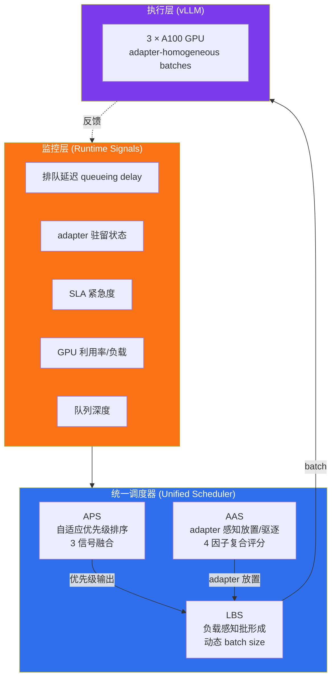

# 精读笔记：CoLoRA — Collaborative Scheduling for Multi-Tenant LoRA LLM Inference (ASP-DAC 2026)

> **证据级别声明（前置）**：本笔记基于 ASP-DAC 2026 会议归档的**全文幻灯片 PDF**（`aspdac.com/aspdac2026/archive/pdf/4A-1.pdf`），**不是仅基于摘要**。但该 PDF 是会议演示文稿，不是带完整公式与表格的 proceedings 全文——因此**模块的定性设计、关键数字和整体架构来自一手全文**，而**融合公式/权重、消融细节、统计方差在幻灯片中未给出**，相关条目标注为待确认。IEEE Xplore 页面（document/11420717）在抓取时返回 500 错误，无法获取正式 proceedings 版本。

> **重要校正（相对本课题 seed 摘要）**：本课题在 `research/knowledge_hub.md` §5.5 与 `research/ray_actor_dynamic_batching_reference.md` §6.10 中，将 CoLoRA 描述为"GPU 利用率 + 队列深度 + adapter 状态 → 三维信号融合"，并将其作为"我们的 queue-adaptive flush 应感知的（running + waiting + KV cache）三信号"的参考。**精读全文后确认：论文的实际三信号是"排队延迟 + adapter 驻留状态 + SLA 紧急度"（APS 模块），不涉及 KV cache 信号**。"adapter 驻留"指 LoRA 权重是否在 GPU 内存，与 KV cache 是两类资源。本笔记第四层会明确这一校正对课题的影响。

---

## ▎第一层 · 基本信息

| 字段 | 内容 |
|------|------|
| **论文** | Zechao Lin, Xingbin Wang, Yiming Xie, Dan Meng, Rui Hou. *CoLoRA: Collaborative Scheduling for Multi-Tenant LoRA LLM Inference.* ASP-DAC 2026, Session 4A-1, 2026-01-21. IEEE Xplore document/11420717 |
| **来源级别** | **CCF-C**（ASP-DAC，Asia and South Pacific Design Automation Conference，EDA 区域会议；非 CCF-A，非系统/ML 顶会）。EDA 四大会议之一但等级低于 DAC/ICCAD（A 类） |
| **链接** | 全文幻灯片 PDF：https://www.aspdac.com/aspdac2026/archive/pdf/4A-1.pdf / IEEE Xplore：https://ieeexplore.ieee.org/document/11420717/ |
| **阅读日期** | 2026-07-23 |
| **状态** | 精读完成（基于全文幻灯片 PDF） |
| **相关论文组** | LLM 推理服务调度 / 多租户 LoRA 服务 / 准入与批处理控制 |

### 一句话核心结论

CoLoRA 针对**多租户 LoRA 推理**场景（共享 base model + 多个租户专属 LoRA adapter 动态加载到 GPU），提出由 APS（自适应优先级）+ AAS（adapter 感知放置/驱逐）+ LBS（负载感知批形成）三个模块组成的协同调度框架，以"监控→排序→放置→批形成→反馈"闭环协调三类决策，在 3×A100 + vLLM 上将吞吐提升至 +55%、P95 延迟降低至 −34%、adapter cache 命中率 +42%。

`#LLM-serving` `#multi-tenant-LoRA` `#multi-signal-fusion` `#scheduling` `#admission-control` `#ASP-DAC2026`

---

## ▎第二层 · 论文结构分析

### 1. 问题拆解

| 问题 | 论文的回答 |
|------|-----------|
| 要解决什么痛点？ | 多租户 LoRA 推理服务的效率瓶颈：一个共享 base model 同时服务多个租户，每个租户有专属 LoRA adapter，**adapter 需要动态加载到 GPU 内存**。生产负载是 online（延迟敏感）+ offline（吞吐导向）混合，adapter 动态竞争 GPU 资源，导致三类系统挑战：(1) 冲突的 QoS 目标；(2) 高 adapter 加载/切换开销；(3) 静态批处理在该场景失效 |
| 之前的方法为什么不够？ | 论文明确列出三类不足：(1) **Uniform request treatment**——FIFO/静态优先级无法自适应平衡延迟敏感性与 adapter 复用；(2) **Recency-only adapter caching**——LRU 驱逐忽略 SLA 紧急度、请求动态和租户公平性，导致冷启动与延迟不稳；(3) **Static batching strategies**——固定 batch size 无法随负载波动调整，要么 GPU 利用不足要么队列延迟过高 |
| 论文的**核心论点** | 多租户 LoRA 推理本质上是一个**调度问题**（"Multi-tenant LoRA inference is a scheduling problem"）。三个关键洞察：(1) **adapter 驻留是 tail latency 的主要贡献者**（冷启动开销）；(2) **优先级、缓存、批处理三类决策相互耦合**；(3) **独立优化各自模块不足以应对**——必须协同。因此用统一调度器协调 APS/AAS/LBS |
| 它的**关键假设** | (1) adapter 加载/切换开销显著到值得专门调度（多 LoRA 场景成立，单模型场景不成立）；(2) 三类决策（优先级/缓存/批）存在强耦合，独立优化次优（论文以"独立优化不足"为前提，但幻灯片未给出独立 vs 协同的隔离对比数据，待确认）；(3) vLLM 作为底层执行引擎，CoLoRA 作用在其上层做请求级调度 |

### 2. 方法拆解

**核心技术要点**：

1. **APS — Adaptive Priority Scheduling（自适应优先级，三信号融合）**：核心 idea 是"基于**排队延迟 + adapter 驻留状态 + SLA 紧急度**动态调整请求优先级"。优先级周期性重算并指导下游批处理决策。**为什么有效**：FIFO/静态优先级无法在动态多租户负载下同时平衡延迟敏感性与 adapter 复用；加入 adapter 驻留信号可直接降低冷启动概率。**注意**：这是论文中真正的"三信号融合"，但三信号是排队/驻留/SLA，**不是** running/waiting/KV-cache。

2. **AAS — Adapter-Aware Scheduling（adapter 感知放置与驱逐，四因子复合评分）**：核心 idea 是"基于**复合评分**做 adapter 驱逐决策，评分融合 **recency + SLA 紧急度 + 预测热度 + 租户公平性**"。运行时优先选择 adapter 已驻留的 GPU；若无，选负载最轻的 GPU 并驱逐评分最低的 adapter。**为什么有效**：LRU 只看 recency，忽略 SLA 与公平性；在有限 GPU 内存下，adapter 驱逐是 tail latency 与 cache 效率的一阶影响因素。

3. **LBS — Load-Aware Batch Scheduling（负载感知批形成）**：核心 idea 是"基于**运行时负载信号动态调整 batch size**，并按 adapter 分组形成 adapter-homogeneous batch 以降低切换开销"。关键观察："最优 batch size 依赖**系统负载与队列动态**，应随时间变化"。LBS 接收 APS 的优先级输出，与 AAS 协调。**为什么有效**：固定 batch size 无法适应负载波动（欠利用或队列延迟过高）。

4. **Unified Scheduler（统一调度闭环）**：架构为 **monitor → prioritize → place → batch → feedback** 闭环。统一调度器协调 APS/AAS/LBS 三个模块，强调"独立优化不足以应对耦合决策"。**为什么有效**：三类决策相互影响，必须协同（论文 claim，但幻灯片未给出"独立 vs 协同"的隔离消融，待确认）。

> ⚠️ **融合公式/权重未知**：APS 的三信号如何组合（加权和？字典序？阈值？）、AAS 的四因子如何加权，幻灯片**均未给出**。论文只列出因子清单，未给出数学形式。融合的具体机制标注为 **待确认**，需 proceedings 全文或源码确认。

### 3. 实验拆解

| 维度 | 内容 |
|------|------|
| **数据集** | 幻灯片仅说明"混合 online/offline workloads"，**未公开具体数据集名称、规模、trace 来源**——待确认 |
| **Baseline** | 幻灯片仅对照"现有方法"（三类不足：uniform treatment / LRU caching / static batching）。**未指明具体系统名**（是 vLLM 原生？Punica？S-LoRA？），baseline 强度**存疑**——倾向 strawman 而非 SOTA 对照 |
| **评价指标** | latency、throughput、utilization、fairness（Jain's fairness index）。**未报告** tokens/s（vLLM Prometheus 口径）、service_p99 时间序列、inflight/queue 时间序列——对本课题的指标完整性要求而言有缺失 |
| **消融实验** | 幻灯片**未展示** APS/AAS/LBS 三模块的独立消融。无法判断"协同"相对"独立最优"的增益多少——这是论文最关键的 claim，却缺少直接证据（待确认） |
| **统计显著性** | ❌ 幻灯片未报告方差/置信区间，所有结果以"up to X%"形式呈现（best-case 口径） |
| **复现条件** | 🟡 基于公开框架（vLLM）+ 公开硬件（3×A100），但**未提及代码开源**；adapter workload 细节未公开，复现难度中高 |

### 4. 关键数字

| Claim | 数字 | 条件 |
|-------|------|------|
| 吞吐提升 | **up to +55%** | 多租户 LoRA 混合负载，3×A100，vLLM 之上（best-case，非均值） |
| P95 延迟降低 | **up to −34%** | 同上（best-case） |
| GPU 利用率 | **up to 86.3%** | 同上 |
| Adapter cache 命中率 | **+42%** | 相对 recency-only（LRU）baseline |
| 租户公平性 | Jain's index **up to 0.954** | 多租户场景 |
| 硬件/平台 | 3 × A100 GPU，built on **vLLM** | — |

> ⚠️ 所有数字均为"up to"口径（best-case），非均值/中位数。本课题引用时必须保留"up to"限定词，不能写成"提升 55%"。

---

## ▎第三层 · 批判性评估

> **评估前置约束**：本层评估基于**会议幻灯片全文**，非带完整公式与表格的 proceedings 全文。因此对"实验严谨性""消融完整性"的判断受限——涉及公式/方差/消融细节的结论均标注为基于幻灯片的推断，正式 proceedings 公开后可能修正。本层同时应用 `nature-reviewer` + `ars-reviewer` 的同行评议视角。

### 1. 假设检验

- **假设 1**：adapter 加载/切换开销是 tail latency 的主导因素，值得专门调度
  - 反例 / 边界：此假设**仅在多租户 LoRA 场景成立**。本课题（AI_COMPLETE/AI_EMBED 单模型推理）**没有 adapter 概念**，adapter 驻留信号完全不适用。论文的核心动机与我们的场景正交。
- **假设 2**：三类决策（优先级/缓存/批）强耦合，独立优化次优（论文最关键 claim）
  - 反例 / 边界：幻灯片**未给出"独立优化各自模块 vs 协同"的隔离消融**。论文以"Key Insight 3: Independent optimizations are insufficient"作为前提，却缺少直接证据。这是评议中最薄弱的环节——如果协同增益只有几个百分点，整个统一调度器的复杂度可能不划算（类比 Ray ConcurrencyCapBackpressurePolicy 废弃教训：~400 行复杂控制不如简单方案）。
- **假设 3**：vLLM 之上做请求级调度即可，不需修改 vLLM 内部
  - 反例 / 边界：此假设对本课题**有利**——与本课题"vLLM 作为部署平台不修改"的边界一致。但 CoLoRA 的 adapter 管理逻辑实际需要 hook 进 vLLM 的 batch 形成路径（adapter-homogeneous batch），这与"不修改 vLLM"有张力。待确认 CoLoRA 是否真的纯外部。

### 2. 边界探查

- **方法适用边界**：CoLoRA 的价值**完全绑定多租户 LoRA 场景**。一旦场景变为单模型 batch 推理（本课题主场景），APS 的 adapter 驻留信号失效、AAS 整个模块失效、LBS 退化为"负载 + 队列动态"两信号。对本课题而言，CoLoRA 能迁移的只有 **LBS 的负载感知批形成思想** 和 **统一闭环架构**。
- **扩展性限制**：论文在 3×A100 上评测，未讨论规模放大（数十 GPU、数百租户）时统一调度器是否会成为瓶颈（集中式 monitor→prioritize→place→batch→feedback 闭环在规模放大时延迟可能上升）。
- **复现难度**：🟡 基于 vLLM（公开），但 adapter workload 与代码未公开，复现难度中高。

### 3. 可信度评估

| 维度 | 评价 | 依据 |
|------|------|------|
| 实验公平性 | 🟡 有疑点 | baseline 未指明具体系统（疑似 vLLM 原生 + LRU + 静态 batch 的组合 strawman），未对照 S-LoRA / Punica 等多租户 LoRA SOTA；所有结果"up to"best-case 口径 |
| 结果显著性 | 🟡 勉强 | +55%/−34% 数字显著，但缺少消融拆分协同增益、缺少方差，best-case 口径高估风险存在 |
| 开源/可复现 | 🔴 闭源（截至幻灯片） | 未提及代码开源，workload 细节未公开 |
| 论文自身局限 | 🟡 部分 | 明确承认"独立优化不足"是前提，但未给隔离证据；未讨论单模型场景边界；未讨论集中式调度器扩展性 |
| 来源层级 | 🟡 CCF-C | ASP-DAC 为 EDA 区域会议（CCF-C），非系统/ML 顶会。证据权重低于本课题承重的 CCF-A 文献（vLLM/Orca/Sarathi 等），引用时应标注等级 |

### 4. 与同行工作的对比

- 比 **Punica / S-LoRA**（多租户 LoRA 服务 SOTA）：CoLoRA 的差异在**调度层**（APS/AAS/LBS 协同），而 Punica/S-LoRA 的核心在**CUDA kernel 层**（batched LoRA 计算）。两者正交。但 CoLoRA **未与它们直接对照**——这是 baseline 选择的薄弱点。
- 比 **CONCUR (2025)**（本课题已纳入）：CONCUR 明确将 **KV cache 作为共享资源信号**，CoLoRA **不涉及 KV cache**。对本课题想要的"running + waiting + KV cache"三信号，**CONCUR 才是正确的来源，不是 CoLoRA**。
- 比 **SABER (2025)**：SABER 强调"前瞻性准入"（预测提交后是否违反 SLA）和 Universal Scalability Law 建模，CoLoRA 的 APS 是反应式重排（非预测式）。SABER 的预测性思路对本课题更有用。
- 在 **[本课题]** 的坐标系中：CoLoRA 属于"模型服务上层调度"文献，与我们的外部提交控制（queue-adaptive flush）同一层，但**场景（多租户 LoRA）与信号集（adapter 驻留）不同**。可借鉴的是**架构模式**，不是具体信号。

---

## ▎第四层 · 与你课题的连接

> **应用 `idea-evaluator` 五维相关性 + fatal-flaws 视角**。本课题 RC2 queue-adaptive flush 当前为**负结果**（E2E 10.2s vs static 7.3s，~40% 更差），读 CoLoRA 的目标是从中提取"多信号融合"作为我们的 flush 应感知的模型服务状态。

### 1. ⚠️ 关键校正：CoLoRA 不是我们想要的三信号来源

任务摘要预设 CoLoRA 提供"running + waiting + KV cache"三信号融合。**精读全文后确认这是不准确的**：

| 任务预设 | 论文实际 | 对课题的影响 |
|---|---|---|
| 三信号 = running + waiting + KV cache | APS 三信号 = **排队延迟 + adapter 驻留 + SLA 紧急度** | **KV cache 信号在 CoLoRA 中不存在**；adapter 驻留是 LoRA 权重驻留，与 KV cache 是两类资源 |
| 作为我们 queue-adaptive flush 的信号来源 | CoLoRA 的信号集是**多租户 LoRA 专属**，不迁移到单模型场景 | 我们不能从 CoLoRA 直接拿信号集 |

**正确归位**：本课题想要的"running + waiting + KV cache"三信号应来自 **CONCUR (2025)**（已明确将 KV cache 作为共享资源信号）+ **vLLM Prometheus**（`num_running` / `num_waiting` / `gpu_cache_usage_perc`）。CoLoRA 的贡献是**架构模式（多信号融合 + 闭环）**，不是信号本身。**必须在 knowledge_hub §5.5 与 ray_actor_dynamic_batching_reference §6.10 中更正此点**（本次精读只负责本笔记，不改动其他文件）。

### 2. 可引用的观点（配精确位置）

> **幻灯片 Key Insight 3**："Independent optimizations are insufficient in this setting."
> → **直接解释我们 RC2 负结果**：我们的 queue-adaptive flush 只用了**单信号（队列深度）**做 flush 决策，相当于"独立优化一个维度"。CoLoRA 的论断（虽然其自身证据待确认）从架构层面解释了为什么单信号不够——优先级、缓存、批处理三类决策耦合，只调一个维度可能反而恶化 E2E（我们的 10.2s vs 7.3s 正是这种恶化）。**但注意**：这是对 CoLoRA claim 的借用，其自身该 claim 缺消融证据。

> **幻灯片 LBS Core idea**："Optimal batch size depends on both **system load and queue dynamics**, and should vary over time."
> → **支撑我们 RC2 的设计方向**：静态 batch / 静态 K_max 次优，batch size 应随负载与队列动态变化。这与我们"queue-adaptive flush"的动机一致——只是我们之前只感知了 queue 一个维度，应补 load（GPU 利用率）维度。**LBS 实际上是"两信号"（load + queue），不是 seed 摘要写的"三维"**——这是对 seed 的次要校正。

> **幻灯片 Unified Scheduler 架构**："Workflow: monitor → prioritize → place → batch → feedback"
> → **可作为我们 RC2 控制器的架构骨架**：monitor（采集 vLLM Prometheus 多信号）→ decide（融合决策）→ execute（调节 K_max / flush）→ feedback（采集执行后指标）。CoLoRA 的闭环结构与我们需要的一致。

### 3. ⚠️ 不能过度引用的地方

- ❌ **不声称**"CoLoRA 验证了 running + waiting + KV cache 三信号融合有效"——论文**不涉及 KV cache**，信号集是排队延迟 + adapter 驻留 + SLA 紧急度。
- ❌ **不声称**"CoLoRA 的 +55% 吞吐提升适用于本课题场景"——该数字在多租户 LoRA 混合负载下取得，本课题是单模型 batch 推理，adapter 相关模块（AAS）完全失效，APS 的 adapter 信号也失效。可迁移部分仅剩 LBS 思想。
- ❌ **不声称**"CoLoRA 证明了多信号融合一定优于单信号"——论文的 baseline 是"static batching + LRU + uniform"组合 strawman，**未做"单信号 vs 多信号"的隔离消融**。融合的边际价值未证实（这是 fatal-flaw 审查的关键发现）。
- ❌ **不声称**"独立优化不足（Key Insight 3）已被 CoLoRA 实证"——幻灯片将该论断作为前提（insight），未给独立 vs 协同的隔离数据。
- ❌ **不声称** CoLoRA 是 CCF-A 顶会成果——ASP-DAC 为 CCF-C，引用时须标注来源等级，不能与 vLLM/Orca 等并列表述为同等级证据。

### 4. 对本课题的实际用途（idea-evaluator 五维）

| 维度 | 评价 | 说明 |
|---|---|---|
| 相关性 | 🟡 中 | 场景（多租户 LoRA）与课题（单模型 batch）不重合；可迁移的是架构模式而非信号集 |
| 新颖性 | 🟡 中 | 三模块协同的框架不新（CONCUR/SABER/ProServe 都有类似闭环），但 adapter 驻留作为一阶信号对 LoRA 场景有针对性 |
| 严谨性 | 🔴 弱 | baseline strawman、无消融、无方差、best-case 口径、CCF-C |
| 可迁移性 | 🟡 中 | LBS（load + queue → 动态 batch）+ 闭环架构可迁移；APS/AAS 不可迁移 |
| fatal-flaws | 🟡 存在风险 | 最大风险：多信号融合的复杂度可能不划算（Ray ConcurrencyCapBackpressurePolicy 教训）——若融合增益只有几个百分点，统一调度器的工程复杂度反而拖累。**我们 RC2 的负结果已部分验证此风险** |

| 用途类型 | 具体方式 | 优先级 |
|----------|----------|--------|
| □ 设计参考 | 借鉴 LBS 的"load + queue → 动态 batch size"思想，把我们的 queue-adaptive flush 从单信号扩展为两信号（队列深度 + GPU 利用率） | ⭐⭐ |
| □ 设计参考 | 借鉴 monitor→decide→execute→feedback 闭环架构作为 RC2 控制器骨架 | ⭐⭐ |
| □ 对照区分 | 在开题/论文中明确：本课题的"三信号"（running + waiting + KV cache）来自 CONCUR + vLLM Prometheus，**不是** CoLoRA；CoLoRA 提供 LoRA 场景的多信号融合先例 | ⭐⭐⭐ |
| □ 负结果解释 | Key Insight 3（"独立优化不足"）从架构层面解释我们 RC2 单信号 flush 为何负结果——作为改进方向的旁证（标注该 claim 在 CoLoRA 中缺消融） | ⭐⭐ |
| ❌ Baseline | **不作为 baseline**——场景不重合，无法直接对比 | — |

### 5. 不足 → 你的机会（fatal-flaws 视角）

| 论文的不足 / 未回答的问题 | 你的课题可能如何填补 |
|--------------------------|---------------------|
| 未做"单信号 vs 多信号"隔离消融，融合的边际价值未证实 | 我们的 RC2 实验可设计 **单信号（仅 queue）vs 两信号（queue + GPU 利用率）vs 三信号（queue + GPU + KV cache）** 的阶梯消融，直接回答"多信号融合到底值不值"——这正是 CoLoRA 缺失的证据 |
| 未在单模型场景验证（adapter 信号主导） | 我们在单模型 batch 推理（AI_COMPLETE）上验证"去 adapter 化"后的信号集是否仍有效，填补 CoLoRA 未覆盖的场景 |
| 未讨论复杂度性价比（统一调度器工程量大） | 遵循本项目编码规范"自适应策略第一版 <100 行"，用简单融合（如加权和 + 静态阈值）验证收益，再决定是否引入复杂协调——避免重蹈 Ray ConcurrencyCapBackpressurePolicy 覆辙 |
| best-case 口径，缺 tokens/s 与 service_p99 | 本课题新实验 CSV 已强制要求 tokens/s、service_p99、inflight 时间序列——我们在指标完整性上可直接超越 CoLoRA 的报告口径 |

### 6. 可论文化的措辞

> 多租户 LoRA 服务场景下，CoLoRA [Lin et al., ASP-DAC 2026] 通过协调自适应优先级、adapter 感知放置与负载感知批形成，验证了多信号融合调度在该场景的有效性。但该工作面向多 adapter 动态竞争，其信号集（adapter 驻留、SLA 紧急度）不适用于本课题的单模型批量推理场景；本课题的提交控制所需感知的模型服务状态（运行中请求数、等待请求数、KV cache 压力）主要参考 CONCUR [2025] 与 vLLM Prometheus 指标。

> Lin et al. [ASP-DAC 2026] 指出"独立优化单一调度维度不足以应对耦合决策"——本课题前期 queue-adaptive flush 的负结果（单信号感知，E2E 反而恶化 ~40%）与此论断一致，提示提交控制需融合多维模型服务状态而非仅依赖队列深度。

### 7. 后续待读

- [ ] [[concur_2025]] — **本课题真正想要的"KV cache 作为共享资源信号"来源**；优先于 CoLoRA 完成
- [ ] [[saber_2025]] — 前瞻性准入 + Universal Scalability Law 建模，比 CoLoRA 的反应式重排更接近我们需要的预测式控制
- [ ] [[clipper_nsdi2017]] — AIMD 自适应 batching 的经典来源，CoLoRA 的反馈闭环可视为其思想在多租户场景的延伸
- [ ] **Punica / S-LoRA** — 多租户 LoRA 服务的 kernel 层 SOTA，CoLoRA 未对照，理解 CoLoRA baseline 缺口
- [ ] CoLoRA proceedings 全文（IEEE Xplore 11420717，当前 500 错误）— 补全融合公式/权重与消融细节

---

## 元反思

- **精读收益**：🟡 中。收益不在"拿到 KV cache 三信号"（预设落空——CoLoRA 不涉及 KV cache），而在**证伪了一个错误归因**：本课题 seed 摘要将 CoLoRA 误记为"三维信号融合"来源，精读纠正了这一点，避免后续开题/论文错误引用。同时 LBS 的 load+queue 思想与统一闭环架构仍有参考价值。
- **是否纳入核心文献库**：是（作为"多信号融合架构先例 + LoRA 场景对照"纳入，**非承重文献**——CCF-C，不可与 vLLM/CONCUR 并列为同级证据）
- **计划复习周期**：6 周后（或 proceedings 全文公开后立即重读，补全公式与消融）
- **一句话自评**：理解到位且做了必要校正。**最大价值是负向的**——阻止了基于错误 seed 的以讹传讹（"CoLoRA = running+waiting+KV cache 融合"）。正向价值是 LBS 架构与 Key Insight 3 对 RC2 负结果的解释。诚实标注了全文幻灯片（非 proceedings）与 CCF-C 的证据约束。

---

## 相关笔记

- [[vllm_sosp2023]] — 本课题部署平台，CoLoRA built on vLLM，两者执行层一致
- [[clipper_nsdi2017]] — AIMD 自适应 batching 经典，CoLoRA 反馈闭环的思想源头
- [[concur_2025]] — **本课题真正需要的 KV cache 信号来源**，替代 CoLoRA 在 seed 中的误位
- [[saber_2025]] — 前瞻性准入与 USL 建模，比 CoLoRA 反应式重排更贴近本课题需求
- [[文献地图]] — 文献全景
- [[ai_operator_literature_inventory]] — 完整文献清单
