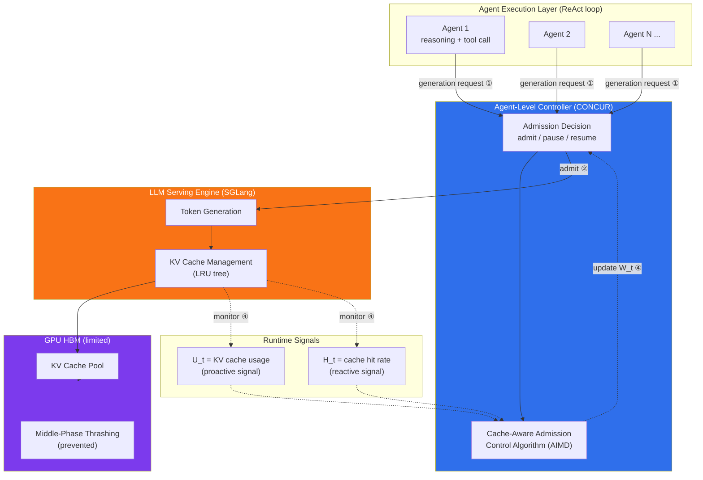

# 精读笔记：CONCUR — Proactive Agent-Level Admission Control for Efficient Agentic Batch Inference (2025)

> **证据纪律**：本文所有数字、§位置、图号均来自本地 PDF `opening/literature/reference/concur_2025.pdf`（11 页）的精读。论文为 arXiv 预印本（2026-02-02），尚未经同行评审——所有结论均标注此约束。

---

## ▎第一层 · 基本信息

| 字段 | 内容 |
|------|------|
| **论文** | Qiaoling Chen¹, Zhisheng Ye², Tian Tang³, Peng Sun³, Boyu Tian³, Guoteng Wang³, Shenggui Li¹, Yonggang Wen¹, Zhenhua Han³, Tianwei Zhang¹. *CONCUR: Proactive Agent-Level Admission Control for Efficient Agentic Batch Inference.* arXiv:2601.22705v1 [cs.DC], 30 Jan 2026 (preprint 2026-02-02) |
| **来源级别** | arXiv 预印本（**非 CCF-A，未发表**）。 affiliation：¹NTU Singapore / ²Independent Researcher / ³Shanghai Qiji Zhifeng |
| **链接** | arXiv:2601.22705 / 本地 PDF：`opening/literature/reference/concur_2025.pdf` / HuggingFace Papers: `huggingface.co/papers/2601.22705` |
| **阅读日期** | 2026-07-23 |
| **状态** | 精读完成 |
| **相关论文组** | LLM agent 推理服务 / 准入控制 / KV cache 拥塞 / AIMD 控制律 |

### 一句话核心结论

CONCUR 将 LLM agent 批推理中的"中段抖动（middle-phase thrashing）"——长生命周期 agent 累积 KV cache 导致 LRU 驱逐→重算的恶性循环——识别为主要病态，借鉴 TCP AIMD 拥塞控制，在 agent 执行层与推理引擎之间插入一个轻量级 controller，按运行时 KV cache 使用率/命中率两个信号动态调节活跃 agent 并发数（窗口 W_t），在 Qwen3-32B 上实现 **4.09×** 端到端吞吐提升（§5.1，Table 1）。

`#agentic-inference` `#admission-control` `#AIMD` `#KV-cache` `#congestion-control` `#middle-phase-thrashing` `#preprint`

---

## ▎第二层 · 论文结构分析

### 1. 问题拆解

| 问题 | 论文的回答 |
|------|-----------|
| 要解决什么痛点？ | 离线 **agentic** 批推理（ReAct 式 agent 反复 reasoning + tool call）中，每个 agent 的上下文随步数单调增长，KV cache 从"短期加速结构"变成"长期共享争用资源"。agent 异步推进（有的在生成，有的在等 tool），LRU 把暂停 agent 的关键 prefix 当作可驱逐对象，恢复时被迫 prefill 重算——这个开销在整个执行期间反复发生 |
| 之前的方法为什么不够？ | (1) 请求级 LRU 调度（vLLM/SGLang）对 chat-style 有效，但无法表达 agent 的"长生命周期状态连续性"；(2) HiCache 类 CPU offload 在高并发下 PCIe 带宽争用反而更慢（Fig 1c：并发 8 时 KV cache 传输延迟 ~1100ms，高于 prefill 重算 ~600ms）；(3) 静态固定并发上限要么浪费内存（保守）要么触发抖动（激进）——§5.3 证明 fixed level 30/32/64/128 均被 CONCUR 的自适应策略击败 |
| 论文的**核心论点** | 从**反应式 cache 管理**转向**主动式 agent 级准入控制**：把 GPU-resident KV cache 类比为网络带宽（有限共享资源），把活跃 agent 类比为竞争流，用 AIMD（Additive Increase Multiplicative Decrease）在 agent 粒度（而非 request 粒度）调节并发——"overcommitment degrades efficiency long before physical capacity is exhausted"（§1） |
| 它的**关键假设** | (1) agentic 批推理存在可观测的"中段抖动"三阶段模式（warmup→middle-thrashing→cooldown）；(2) KV cache 使用率 U_t 和命中率 H_t 是有效的拥塞信号；(3) AIMD 的加性探测/乘性回退能平衡"充分利用内存"与"避免抖动"；(4) **agent 是准入的单位**（而非单条 request）——保留已活跃 agent 的连续性至关重要 |

### 2. 方法拆解



**核心技术要点**：

1. **Middle-Phase Thrashing 的识别与表征**（§3.1-3.2）：论文通过 DeepSeek-V3 生产 trace 分析（Fig 3a），发现 agentic 批推理呈三阶段——warmup（cache hit ~90%）→ **middle thrashing**（KV cache 使用率 80-100% 饱和但命中率骤降，占 >90% 总执行时间，额外重算占 49.1% 端到端延迟）→ cooldown（部分 agent 完成释放内存，命中率部分恢复）。关键反直觉发现：middle 阶段"增加 agent 数反而降低吞吐"——经典 Denning 抖动（§3.2 引用 Denning 1968）。

2. **Agent-Level 控制抽象**（§4.2）：不同于 request-level 调度，CONCUR 以** agent 为准入单位**，暴露三个原语——`admit`（授权下一步生成）、`pause`（在 generation step 边界暂停，**保留执行状态**，不打断 in-flight 计算）、`resume`（资源可用时重新激活）。图 2b 的三 agent 示例：controller size=2，A1/A2 admitted，A3 pending；A2 完成释放 cache 后才 admit A3。**关键**：pause 不丢弃 agent 状态，与 LRU 驱逐的根本区别。

3. **Cache-Aware AIMD 控制律**（§4.3，Eq 1）——**本文最强设计模式，必须精确记录**：

   ```
   W_{t+1} = W_t + α       if U_t < U_low                          (加性探测)
   W_{t+1} = W_t · β       if U_t > U_high AND H_t < H_thresh      (乘性回退)
   W_{t+1} = W_t           otherwise                                (死区/hold)
   ```
   参数（§5.1 Hyperparameter Configuration，固定跨所有实验）：**α=2**（加性步长）、**β=0.5**（乘性回退因子，即回退一半）、**U_low=0.2**、**U_high=0.5**、**H_thresh=0.2**。
   - **两个信号**：U_t（KV cache 使用率，**proactive** 信号）+ H_t（cache 命中率，**reactive** 失败信号）。乘性回退需**同时**满足 U_t>U_high 且 H_t<H_thresh——双重条件防止误触发。
   - **死区宽度** = U_high - U_low = 0.5 - 0.2 = **0.3**（30% 缓冲）。论文解释（§4.3 Interpretation 第 3 点）：admitting 长 context agent 造成离散内存跳变而非平滑增量，宽死区防止跳变瞬时触发回退。
   - **二次惩罚论证**（§4.3 第 2 点）：cache thrashing 的代价是 O(L²) prefill 重算（凸惩罚），因此乘性回退使系统在 O(log N) 步内退出高成本区——这是选择 AIMD（而非其他控制律）的核心理论依据。

4. **与 Ray ConcurrencyCapBackpressurePolicy 的关键对照**：CONCUR 的 AIMD 结构（proactive 信号 + reactive 信号 + 死区 + 加性增/乘性减）与本课题 seed `research/ray_actor_dynamic_batching_reference.md` §3.7 记录的 Ray 废弃策略 ConcurrencyCapBackpressurePolicy **概念上高度相似**（后者也用 EWMA 队列水平 + deadband + backoff/rampup），但有关键差异——见第四层 §2。

### 3. 实验拆解

| 维度 | 内容 |
|------|------|
| **数据集 / workload** | 离线 agentic 批推理（ReAct paradigm，§2）。具体 agent framework/benchmark 未在正文详述（论文聚焦系统层），使用 "real-world agent workloads"（§1）。**未见 ShareGPT/Alpaca 等标准数据集**——agent trajectory 由 RL rollout / 数据蒸馏 / agent 评估三类 workload 驱动（§1 列举） |
| **Baseline** | (i) **SGLang**（request-level batching + LRU）；(ii) **SGLang + Request-level admission control**（固定 request-level cap）；(iii) **SGLang + HiCache**（cache-centric，KV cache CPU offload 保留）。**注意**：baseline 是 SGLang，**不是 vLLM**——论文 §4.1 仅以 SGLang 为 serving engine 示例 |
| **评价指标** | 端到端批推理 latency（秒，越低越好）；KV cache 命中率（%）；KV cache 使用率时间序列。**missing 指标**：未报告 tokens/s、service p99/tail latency、controller 决策时间序列（upshift/downshift 计数）、方差/置信区间 |
| **消融实验** | ✅ §5.3 Static vs Adaptive：fixed level {30,32,64,128} vs CONCUR adaptive；✅ §A.1 敏感性分析：U_high ∈ {0.4,0.5,0.6,0.8} × U_low ∈ {0.1,0.2,0.3,0.5}（Table 3） |
| **统计显著性** | ❌ **未报告方差/置信区间**——Table 1 仅给单点 latency。多次运行?  未说明。这是预印本的典型短板 |
| **复现条件** | 🟡 **代码未提及开源链接**（正文无 GitHub URL）。硬件详尽：NVIDIA H100 80GB，900 GB/s NVLink，8×400 Gbps RoCE，PyTorch 2.7.1 / Python 3.12 / CUDA 12.6。依赖 SGLang（开源）+ 自研 controller（闭源？） |

### 4. 关键数字

| Claim | 数字 | 条件（什么设置下） |
|-------|------|-------------------|
| 最大吞吐提升 | **4.09×**（SGLang 1480s → CONCUR 362s） | Qwen3-32B, Batch=256, TP=8, 8 GPUs（Table 1） |
| DeepSeek-V3 最大提升 | **1.90×**（SGLang 3877s → CONCUR 2043s） | DeepSeek-V3, Batch=40, TP=16, 16 GPUs（Table 1） |
| 中段重算占端到端延迟 | **49.1%** | DeepSeek-V3 生产 trace（Fig 3b） |
| 中段占执行时间 | **>90%** | §3.2 |
| AIMD 参数 | α=2, β=0.5, U_low=0.2, U_high=0.5, H_thresh=0.2 | 固定跨所有模型/workload（§5.1） |
| KV cache 命中率（高并发） | CONCUR 73.36% vs SGLang 35.41% vs Request-Control 32.21% vs HiCache 96.08% | DeepSeek-V3, Batch=40, TP=8（Table 2） |
| 静态 vs 自适应最优 | CONCUR 846ms vs best-fixed Level64=1605ms（1.9×）vs Baseline 2527ms（2.99×） | Qwen3-32B, Batch=256, TP=2, 2 GPUs（Fig 6） |
| U_high 敏感性 | 0.5→0.6 仅增 24-99ms；0.5→0.8 恶化 4-5× | Qwen3-32B（Table 3） |
| KV cache 规模 | DeepSeek-V3 step 10 ~17GB；Qwen3-32B step 10 ~1.5GB | 单 agent 10 步（Fig 1b） |
| 并发传输延迟 | KV transmission 1100ms vs prefill recompute 600ms @ 并发 8 | DeepSeek-V3, 6.67GB cache, 4096 tokens（Fig 1c） |

---

## ▎第三层 · 批判性评估

> 本层应用 `nature-reviewer` + `ars-reviewer`（peer-review 视角）+ `karpathy-guidelines`（事实/推断/待确认分离）。

### 1. 假设检验

- **假设 1**：agentic 批推理存在可观测的"中段抖动"三阶段模式
  - 论文证据：Fig 3a 的 DeepSeek-V3 生产 trace（单次部署，单模型）。**待确认**：该模式是否在所有 agent workload 上复现？论文未给多个 workload 的 trace 对照。**反例边界**：若 agent 间步调高度同步（非异步），或 context 增长缓慢（短 horizon），中段抖动可能不出现。
  - **对本课题的关键质疑**：我们的数据库 AI operator（AI_COMPLETE / AI_EMBED）大多是**无状态单轮**请求，不是 ReAct 多步 agent——**中段抖动这一前提病态在我们的 workload 上可能根本不存在**。这是移植 CONCUR 的头号 fatal flaw（见第四层 §3）。

- **假设 2**：U_t（KV cache 使用率）和 H_t（命中率）是充分的拥塞信号
  - 论文证据：§4.3 双信号设计 + Table 2 命中率与 latency 强相关。
  - **反例边界**：U_t 是 aggregate 标量，不区分"活跃 agent 的 cache"与"暂停 agent 的 cache"。若大量 agent 暂停（tool call），U_t 虽高但实际计算压力低——此时降低 W_t 反而浪费。论文未讨论此区分。

- **假设 3**：AIMD（而非其他控制律，如 PI 控制、MPC）是最优选择
  - 论文论据：§4.3 的"二次惩罚 → 乘性回退 O(log N) 退出"论证 + TCP AIMD 的历史成功。
  - **反例边界**：论文未做控制律对照实验（未对比纯加性、纯乘性、EWMA 平滑、PID）。AIMD 的选择是**类比论证**（network→KV cache），非实验证明最优。**推断**：其他控制律可能更好，但论文未排除。

- **假设 4**：固定参数（α=2, β=0.5, U_low=0.2, U_high=0.5）跨所有模型/workload 通用
  - 论文证据：§5.1 声明"all parameters are kept constant for all models, workloads, and serving engines"；Table 3 敏感性分析仅 Qwen3-32B。
  - **反例边界**：DeepSeek-V3 与 Qwen3-32B 的 KV cache 量级差 10×（Fig 1b：17GB vs 1.5GB），但共用同一组阈值——是否因为 trace 信号是归一化比率（0-1）所以可迁移？**合理推断**：比率信号天然归一化，参数迁移性合理，但论文未验证更小模型（如 Qwen2.5-1.5B，本课题的 baseline 模型）。

### 2. 边界探查

- **方法适用边界**：(1) **仅 agentic（多步 ReAct）workload**——单轮 chat/embedding 无中段抖动；(2) **高并发离线批**——在线低并发场景 pause/resume 的收益不明显；(3) 依赖 serving engine 暴露 cache hit rate 信号——若引擎不暴露 H_t，reactive 信号缺失。
- **扩展性限制**：(1) W_t 是 agent 数整数——小批量（<10 agent）下加性步长 α=2 可能过粗；(2) agent 异构（不同 context 长度）时，单一 W_t 上限不区分 agent 大小——长 context agent 应占用更多"预算"，论文未建模此异质性。
- **复现难度**：🟡 **代码未公开**（正文无链接），controller 实现细节（如 pause/resume 的工程接口、信号采样频率、W_t 更新周期）未充分说明。SGLang 侧需暴露 U_t/H_t——这是否需修改 SGLang？论文称"non-intrusive middleware"但未说明信号获取方式。**待确认**：能否在不变更 vLLM/SGLang 的前提下获取 H_t。

### 3. 可信度评估

| 维度 | 评价 | 依据 |
|------|------|------|
| 实验公平性 | 🟡 有疑点 | baseline 是 SGLang（非 vLLM）；CONCUR 的 controller 本身是否引入额外开销未单独报告；HiCache baseline 在 Batch=40/TP16 配置下反而比 SGLang 慢（0.34×，Table 1），暗示 baseline 调参可能未优化；无方差报告 |
| 结果显著性 | 🟢 显著 | 4.09× 跨多配置一致（Table 1 六组配置中五组 CONCUR 最低 latency）；命中率 73% vs 35% 差异极大；静态 vs 自适应消融清晰（Fig 6） |
| 开源/可复现 | 🔴 闭源 | 代码未公开，无 GitHub 链接；controller 工程细节不足；信号采样接口未说明。仅算法层可复现，系统层难复现 |
| 论文自身局限 | 🟡 部分诚实 | 承认静态 limit 的两难（§4.3 开头），但未讨论 agent 异构性、未报告方差、未对比其他控制律、未讨论 online/低并发场景失效。预印本完整度中等 |

### 4. 与同行工作的对比

- **比 Clipper（NSDI 2017）多了什么**：CONCUR 以 **agent 为准入单位**（保留跨步状态连续性），Clipper 以 **batch 为单位**（无状态）。CONCUR 用 **proactive（U_t）+ reactive（H_t）双信号**，Clipper 用单 SLO 延迟信号。CONCUR 的死区更宽（0.3），Clipper 的 deadband 较窄。CONCUR 明确针对 LLM KV cache 的 O(L²) 重算凸惩罚论证乘性回退。
- **比 SABER（2025）少了什么**：SABER 有**前瞻性**准入（用 Universal Scalability Law 离线建模 + 在线预测新请求是否违反 SLA）；CONCUR 是**反应式** AIMD（信号滞后）。SABER 的前瞻性正是本课题 RC2 控制器想引入的特性。
- **比 CoLoRA（2026）多了什么**：CONCUR 有清晰的 KV cache 信号（CoLoRA 不涉及 KV cache，误归因已在本课题 [[colora_2026]] 笔记中纠正）。CONCUR 的 AIMD 控制律是可复用的算法模式；CoLoRA 的 LBS 仅是架构启发。
- **与 Ray ConcurrencyCapBackpressurePolicy（§3.7 seed）的关系**：两者结构同构（aggregate 信号 + deadband + 非对称增减）。但 Ray 的策略用 **EWMA 平滑 + 绝对残差跟踪**，CONCUR 用**瞬时 U_t/H_t**——见第四层 §2 的关键对比。
- **在 [本课题] 坐标系中**：CONCUR 是"agent 级准入控制"的承重参考文献，但其 **workload（agentic ReAct）与本课题（database AI operator，多为无状态单轮）根本不同**——CONCUR 提供"控制律设计模式"，不提供"可直接移植的系统"。

---

## ▎第四层 · 与你课题的连接

> 本层应用 `idea-evaluator`（5 维 + fatal-flaws）+ `karpathy-guidelines`。

### 1. 可引用的观点（配精确位置）

> §1："overcommitment degrades efficiency long before physical capacity is exhausted"——KV cache 作为共享资源，过度提交在容量耗尽前就降低效率。
> → **支撑本课题 RC2 的动机**：我们的 shared-vLLM 干扰实验已证明 K_max 无上限时 foreground E2E 恶化 2.3×（`experiments/plans/experiment_status_and_gaps.md` §07-19 Shared-vLLM 实验），与 CONCUR 的"overcommitment 早于容量耗尽就退化"一致。

> §4.3 Eq 1 + Interpretation：AIMD 控制律，α=2/β=0.5，U_low=0.2/U_high=0.5，双信号（proactive U_t + reactive H_t），死区宽度 0.3。
> → **直接的设计参考**：这是本课题 RC2 queue-adaptive flush 从负结果（foreground E2E 10.2s vs static K_max=8 7.3s，~40% 更差）转向正结果的最强候选控制律。当前我们的控制器用瞬时 queue-depth 单信号 + 无死区——CONCUR 的双信号 + 宽死区 + AIMD 非对称是三个可立即借鉴的修正。

> §4.3 第 2 点：cache thrashing 的 O(L²) 凸惩罚论证乘性回退——"forces the system to exit the high-cost regime exponentially fast (O(log N) steps)"。
> → **理论依据**：为本课题的 K_max 回退策略提供"为何乘性（而非加性）回退"的论证。当 vLLM 队列堆积时，恢复成本是超线性的，乘性回退比加性更快脱离高成本区。

> §4.2：agent-level pause/resume 三个原语——pause 在 generation step 边界，保留状态，不打断 in-flight 计算。
> → **启发**：本课题的 K_max 控制器当前在 submission 层做"有 slot/无 slot"二元判断——CONCUR 的"边界处暂停、保留状态、资源可用时恢复"比二元 reject 更温和，可减少请求饿死。

> §5.3 + Fig 6：fixed level {30,32,64,128} 均被自适应击败（CONCUR 846ms vs best-fixed 1605ms）。
> → **支撑本课题 RC2 的"自适应必要性"论证**：即使本课题当前自适应输给静态 K_max=8，CONCUR 的结果证明"自适应在理论上应优于静态"——我们的负结果更可能是控制器设计缺陷（信号、死区、控制律），而非自适应本身无效。

### 2. ⚠️ 不能过度引用的地方

- ❌ **不声称** "CONCUR 验证了 EWMA 平滑自适应并发的有效性"——**这是本笔记最重要的校正**。CONCUR 使用的是**瞬时** KV cache 使用率 U_t 和命中率 H_t（§4.3 Eq 1 直接代入瞬时值），**全文未出现 EWMA / exponential smoothing / 滑动平均**（已用全文检索确认）。任务描述中"EWMA-smoothed adaptive concurrency"的预设**不成立**。CONCUR 的稳定性来自**宽死区（0.3）+ AIMD 非对称 + 双信号双重条件**，而非信号平滑。若要在本课题引入 EWMA，那是**我们超越 CONCUR 的改进**，不能归因于 CONCUR。

- ❌ **不声称** "CONCUR 在 vLLM 上验证了 4.09× 提升"——论文 baseline 是 **SGLang**（§4.1、§5.1），实验仅在 SGLang 上进行。论文 abstract 称"compatible with existing LLM serving systems"，但**未在 vLLM 上做任何实验**。vLLM 的 preemption（all-or-nothing）与 SGLang 的 LRU tree 行为不同，收益不可直接迁移。

- ❌ **不声称** "CONCUR 的 agent 级控制直接适用于数据库 AI operator"——CONCUR 的**前提病态（middle-phase thrashing）依赖 ReAct 多步 agent 的异步暂停/恢复**。本课题的 AI_COMPLETE（单轮生成）和 AI_EMBED（无状态 embedding）**没有多步 agent 状态累积**。直接套用等于"为不存在的问题套用方案"。

- ❌ **不声称** "4.09× 是 peer-reviewed 结论"——论文是 **arXiv 预印本（2026-02-02），未经同行评审**。无方差报告、无代码开源、baseline 调参公平性存疑。引用时必须标注"preprint"。

- ❌ **不声称** "CONCUR 的固定参数（U_low=0.2 等）适用于我们的 workload"——CONCUR 的阈值基于 agentic 长 context（step 10 时 ~17GB/agent）。我们的 Qwen2.5-1.5B + ShareGPT 短序列，KV cache 量级小 10×+，同一阈值无意义。

### 3. 对本课题的实际用途

| 用途类型 | 具体方式 | 优先级 |
|----------|----------|--------|
| ✅ 设计参考（控制律） | AIMD 控制律（α=2 加性/β=0.5 乘性）+ 双信号（proactive + reactive）+ 宽死区（0.3）——作为 RC2 queue-adaptive flush v2 的核心候选控制律 | ⭐⭐⭐ |
| ✅ 动机证据 | §1 "overcommitment 早于容量耗尽就退化"+ §3 middle-thrashing 的 49.1% 重算占比——支撑"shared-vLLM 下 K_max admission control 必要性" | ⭐⭐⭐ |
| ✅ 对照区分（负向） | CONCUR 的 workload（agentic 多步）与本课题（DB operator 单轮）根本不同——论文中需明确区分"借鉴控制律"与"移植系统" | ⭐⭐⭐ |
| ✅ 空白论证 | CONCUR **不用 EWMA** → 本课题"EWMA 平滑 + AIMD"是超越 CONCUR 的改进点，可论文化为"我们将 CONCUR 的瞬时信号 AIMD 扩展为 EWMA 平滑信号 AIMD，解决信号噪声导致的控制器振荡" | ⭐⭐ |
| □ Baseline | 不直接作为 baseline（workload 不同），但其 AIMD 控制器可作为 RC2 的算法 baseline 对照 | ⭐⭐ |

### 4. 不足 → 你的机会

| 论文的不足 / 未回答的问题 | 你的课题可能如何填补 |
|--------------------------|---------------------|
| **用瞬时信号，无 EWMA 平滑**（§4.3 Eq 1 直接用瞬时 U_t/H_t） | 本课题可在 AIMD 之上叠加 EWMA 平滑（如 `S_t = λ·S_{t-1} + (1-λ)·sample_t`），解决我们当前 RC2 控制器因瞬时 queue-depth 噪声导致的 102 次 downshift 振荡（`experiment_status_and_gaps.md` §07-19）。这是 CONCUR 未做、Ray ConcurrencyCapBackpressurePolicy 做过但过度复杂的中间路线 |
| **仅验证 agentic workload，未验证无状态批推理** | 本课题的 AI_COMPLETE/AI_EMBED 是无状态单轮——验证 AIMD 控制律在"无 middle-thrashing 前提"下是否仍有效，是 CONCUR 未覆盖的 workload 空间 |
| **未对比其他控制律**（无 PID / EWMA / MPC 对照） | 本课题可做控制律消融：瞬时-AIMD（CONCUR 复现）vs EWMA-AIMD（我们的改进）vs PI 控制 vs 静态 K_max |
| **未报告控制器决策时间序列**（upshift/downshift 计数、恢复时间） | 本课题的 `experiment_status_and_gaps.md` §3 已识别此 gap——新增 inflight/queue/K_max 时间序列指标正好填补 CONCUR 的指标缺失 |
| **agent 同质化假设**（单一 W_t 上限，不区分 agent 大小） | 本课题的 token-budget 分组策略天然形成"异构 batch"——可设计 per-actor-pool 的 K_max 而非全局 W_t，是 CONCUR 未探索的异构化方向 |
| **仅在 SGLang 验证，未在 vLLM 验证** | 本课题以 vLLM 为部署平台——在 vLLM 上验证 AIMD 控制律（通过 Prometheus 获取 vLLM 的 `gpu_cache_usage_perc` 和 cache hit 信号）是 CONCUR 未做的平台扩展 |

### 5. 可论文化的措辞

> CONCUR [Chen et al., 2026] 将 LLM agent 批推理中的 KV cache 类比为网络带宽，以 AIMD 拥塞控制在 agent 粒度调节并发，在 Qwen3-32B 上实现 4.09× 吞吐提升。与 CONCUR 以瞬时 KV cache 使用率/命中率为信号不同，本课题在提交控制层引入 EWMA 平滑信号——因为数据库 AI operator 的请求流无 agentic 中段抖动，瞬时信号噪声更显著，需平滑后才能稳定驱动 AIMD 控制律。

> 与 CONCUR 针对 ReAct 多步 agent 的 middle-phase thrashing 不同，本课题针对的是数据库 AI 算子的无状态单轮批推理——不存在 agent 状态累积导致的中段抖动，但 shared-vLLM 下的跨查询干扰同样表现为"overcommitment 早于容量耗尽就退化"[Chen et al., 2026]。因此本课题借鉴 CONCUR 的 AIMD 控制律与双信号设计，但将控制单位从 agent 替换为 per-actor in-flight 请求数。

> CONCUR [Chen et al., 2026] 的未解决问题之一是控制信号未做平滑——其 AIMD 控制律直接代入瞬时 KV cache 使用率与命中率，在高频噪声下可能触发多余回退。本课题在 vLLM 上游的提交控制层将瞬时 queue-depth 替换为 EWMA 平滑估计，在不牺牲响应速度的前提下降低控制器振荡——这正是本课题相对于 CONCUR 的改进点。

### 6. 后续待读

- [ ] [[clipper_nsdi2017]] — **已精读**。AIMD 控制律的经典来源（NSDI 2017）。CONCUR 的 AIMD 是 Clipper 思想在 agent 粒度的延伸。CONCUR 与 Clipper 的关键差异见第三层 §4。
- [ ] [[saber_2025]] — **待精读**。前瞻性准入（USL 建模 + SLA 预测），比 CONCUR 的反应式 AIMD 更接近本课题需要的预测式控制。CONCUR 是反应式，SABER 是预测式——两者对照可定位本课题控制器的设计点。
- [ ] [[colora_2026]] — **已精读**。纠正了 seed 对 CoLoRA 的误归因。CoLoRA 不涉及 KV cache 信号。
- [ ] **Chiu & Jain 1989** — AIMD 收敛性经典理论（CONCUR §2 引用）。理解 α/β 选择的理论依据。
- [ ] **TokenCake (Bian et al., 2025)** / **Continuum (Li et al., 2025)** — CONCUR §6 提到的反应式对照（offloading / TTL-based cache pinning）。
- [ ] **Parrot (OSDI 2024)** / **Autellix** / **Kairos** — CONCUR §6 的 application-centric serving 对照，DAG/dependency 感知调度。

---

## 元反思

- **精读收益**：🟢 **高**。核心收益有二：(1) **精确拿到 AIMD 控制律的参数与公式**（§4.3 Eq 1：α=2/β=0.5/U_low=0.2/U_high=0.5/H_thresh=0.2，双信号，死区 0.3），这是 RC2 v2 控制器的直接设计输入；(2) **校正了一个关键误读**——任务描述预设 CONCUR 用"EWMA 平滑"，实际全文用瞬时信号。这个负向发现比正向发现更有价值：它把"EWMA + AIMD"确立为本课题**超越 CONCUR 的原创点**，而非"复现 CONCUR"。
- **是否纳入核心文献库**：是（作为"控制律设计参考 + workload 对照"纳入，与 [[clipper_nsdi2017]]（AIMD 经典）、[[saber_2025]]（前瞻性准入）并列为 RC2 控制器设计的三角参考）。**证据层级标注**：arXiv 预印本，引用时必须标 "preprint"。
- **计划复习周期**：2 周后复习（RC2 v2 控制器编码前必须重读 §4.3 Eq 1 和 §A.1 敏感性分析）。
- **一句话自评**：理解到位且做了必要校正。最大价值是**双向的**——正向给出 AIMD 控制律的精确参数与双信号设计，负向阻止了"CONCUR 已用 EWMA"的错误归因，将 EWMA+AIMD 确立为本课题的差异化贡献。**必须警惕**：CONCUR 的 workload（agentic ReAct）与本课题（DB operator 单轮）根本不同，middle-phase thrashing 这一前提在我们的场景不存在——引用时严格区分"借鉴控制律"与"移植系统"，避免被审稿人质疑"你的 workload 没有 thrashing，为何用 thrashing 控制器"。

---

## 相关笔记

- [[vllm_sosp2023]] — 本课题部署平台；CONCUR 的 serving engine 是 SGLang 但论文声称兼容 vLLM，未验证
- [[clipper_nsdi2017]] — AIMD 自适应 batching 经典；CONCUR 的 AIMD 是其在 agent 粒度的延伸，双信号设计更精细
- [[saber_2025]] — 前瞻性准入 + USL 建模；CONCUR 是反应式 AIMD，SABER 是预测式，两者对照定位本课题控制器
- [[colora_2026]] — 多信号融合架构先例；纠正了 seed 对"KV cache 三信号"的误归因（CoLoRA 不涉及 KV cache，CONCUR 才是）
- [[ray_osdi2018]] — Ray actor 模型基础；CONCUR 的 agent-level pause/resume 可映射到 Ray actor 的 max_concurrency 调节
- [[文献地图]] — 文献全景
- [[ai_operator_literature_inventory]] — 完整文献清单
- [[tpl-文献精读-深度版]] — 本模板
