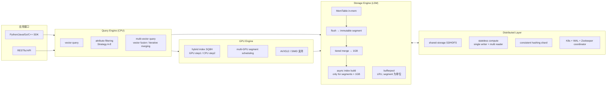

# 精读笔记：Milvus — A Purpose-Built Vector Data Management System (SIGMOD 2021)

---

## ▎第一层 · 基本信息

| 字段 | 内容 |
|------|------|
| **论文** | Jianguo Wang, Xiaomeng Yi, Rentong Guo, Hai Jin, Peng Xu, Shengjun Li, Xiangyu Wang, et al. *Milvus: A Purpose-Built Vector Data Management System.* SIGMOD 2021 (Industrial Track). DOI: 10.1145/3448016.3457550 |
| **来源级别** | CCF-A 会议工业轨（Zilliz & Purdue University），已评审发表 |
| **链接** | DOI: https://doi.org/10.1145/3448016.3457550 / 代码：https://github.com/milvus-io/milvus / 本地 PDF：`opening/literature/reference/milvus_sigmod2021.pdf` |
| **阅读日期** | 2026-07-23 |
| **状态** | 精读完成 |
| **相关论文组** | 结果持久化与写回（第六组），向量数据库系统级对照 |

### 一句话核心结论

Milvus 是 Zilliz 开源的 purpose-built 向量数据管理系统，采用 LSM-tree + segment 化的写回路径（MemTable → flush 为 segment → tiered merge 到 1GB），对大段才异步建索引（默认 >1GB），配合多类索引（IVF/HNSW/ANNOY）、CPU/GPU 混合执行（SQ8H）和分布式 shared-storage 架构，在 SIFT/Deep 1B 上比 Vearch/SPTAG/3 个商业系统快 up to 2 个数量级。

### 关键词 / 标签

`#vector-database` `#LSM-tree` `#segment-merge` `#deferred-index` `#hybrid-CPU-GPU` `#SQ8H` `#attribute-filtering` `#multi-vector-query` `#shared-storage` `#SIGMOD2021` `#industrial-track`

---

## ▎第二层 · 论文结构分析

### 1. 问题拆解

| 问题 | 论文的回答 |
|------|-----------|
| 要解决什么痛点？ | 非结构化数据爆炸（IDC 预测 2025 年 80% 数据非结构化，§1）+ ML 把它们变成高维向量；现有算法库（Faiss/SPTAG）和扩展型系统（AnalyticDB-V/PASE/Vearch）在"大规模 + 动态数据 + 高级查询 + 异构计算 + 分布式"五个维度上无法同时满足（Table 1） |
| 之前的方法为什么不够？ | (1) 算法库不是系统，假设全量数据驻留内存、单机，不支持动态数据/高级查询/GPU；(2) AnalyticDB-V/PASE 这类"关系库 + 向量列"路线被 legacy optimizer/storage 拖累，不能对向量做 fine-tuned 优化，也不支持 multi-vector；(3) Vearch 不适合 billion-scale（论文报告 6.4–47× 慢于 Milvus） |
| 论文的**核心论点** | 向量数据需要 one-size-does-not-fit-all 的 purpose-built 系统（§1，引用 Stonebraker 2005 [60]），而不是在关系库上加"向量列"。Milvus 把 segment 作为"搜索 / 调度 / 缓存"的统一基本单元，用 LSM-tree 解决动态数据 + 异步索引 + snapshot isolation |
| 它的**关键假设** | (1) 大部分数据和索引可以驻留内存（bufferpool 退化路径存在但非主路径，§2.4）；(2) 向量检索的吞吐-精度 tradeoff 可以由用户参数（nprobe、k）控制；(3) 当前客户场景 read-heavy，单 writer 足够（§5.3） |

### 2. 方法拆解

**核心技术要点**：

1. **LSM + segment 作为统一单元（§2.3, §2.4, §5.2）**：新插入实体先进内存 MemTable，累积到阈值或每秒 flush 为 immutable segment；tiered merge policy（类似 Lucene）合并到 ~1GB。**默认只对 >1GB 的大段建索引**，小段不建——用户可手动覆盖。index 与 data 同段，segment 同时是 search/schedule/buffer 的基本单元。snapshot isolation 通过段版化实现：每次 flush/merge/build index 生成新版本，latest segments 组成当前快照，旧段 GC。
2. **异步写处理 + flush 语义（§5.1）**：重写入先落 WAL-like 日志并立即 ACK，后台线程消费；`flush()` API 阻塞直到所有 pending ops 完成。索引构建也是异步的。用户因此可能看不到刚插入的数据，除非显式 flush。
3. **多类索引 + 可扩展接口（§2.2）**：主推 quantization-based（IVF_FLAT / IVF_SQ8 / IVF_PQ）和 graph-based（HNSW / RNSG），加上 tree-based（ANNOY）。显式排除 LSH（billion-scale 上精度低于 quantization）。coarse quantizer 默认 `nclusters=16384`（同 Faiss），`nprobe` 控制精度-速度 tradeoff。
4. **CPU 优化：cache-aware + SIMD-aware（§3.2）**：Faiss 原始实现每线程一次处理一个 query，导致每个线程都要把全量数据 stream 过 CPU cache。Milvus 改成"线程分配到 data vector 块 + query block 共享 L3"——query block 大小 B 由 L3 cache size、维度 D、top-k、线程数 C 公式确定（Eq. 1）。自动 SIMD 选择：SSE/AVX/AVX2/AVX512 四份源文件分别编译，运行时按 CPU flags hook 函数指针（Faiss 要求编译期指定）。
5. **GPU 优化：SQ8H 混合索引 + multi-GPU segment 调度（§3.3, §3.4, Algorithm 1）**：Faiss GPU 限制 `k≤1024`（shared memory 限制），Milvus 多轮累计到 `k=16384`（人为上限防大数据网络传输）。Faiss 编译期声明 GPU 数，Milvus 改成运行时可选——引入 segment-based 调度，每段绑定一个 GPU。SQ8H 关键设计：GPU 只放 centroids 执行 step 1（找 nprobe 桶），CPU 执行 step 2（桶内扫描），避免 on-the-fly 段拷贝；只有 batch > 1000 时全 GPU。
6. **属性过滤 Strategy E（partition-based, §4.1）**：在 A/B/C/D（cost-based，来自 AnalyticDB-V）之上提出 E：按高频查询属性离线分片，查询只扫属性 range 重叠的 partition；若 partition range 被查询 range 完全覆盖，跳过属性检查。推荐每 partition ~1M 向量（1B 数据 ~1000 partitions）。
7. **多向量查询（§4.2）**：vector fusion（把多向量拼成一长向量，单次查询，仅适用可分解相似度如内积）和 iterative merging（基于 Fagin NRA，自适应 `k'`，每轮翻倍直到终止；不依赖 vector index 的 getNext()，因为 ANN 索引不支持高效 getNext()）。
8. **分布式 shared-storage（§5.3）**：S3 存储层（高可用）+ stateless 计算层（单 writer + 多 reader，consistent hashing 分片，无跨片事务）+ Zookeeper 协调层（3 副本 HA）+ K8s 管理。计算层只发日志（Aurora-style）+ 本地 buffer/SSD cache 减少共享存储访问。

### 3. 实验拆解

| 维度 | 内容 |
|------|------|
| **数据集** | SIFT1B（1B × 128-dim，512GB）和 Deep1B（1B × 96-dim，384GB），公开标准数据集；系统对比取前 10M 子集（SIFT10M / Deep10M），因为 baseline 在 1B 上建索引太慢；完整 1B 留给 §7.3 可扩展性 |
| **Baseline** | 2 个开源（Jingdong Vearch v3.2.0、Microsoft SPTAG）+ 3 个商业系统匿名化为 A/B/C；底层算法对比直接和 Faiss 原始实现比（§7.4）；**没有**和 DiskANN 对比（DiskANN 在 NeurIPS 2019 发表，当时工业可用性较弱） |
| **评价指标** | recall（`|R∩R'|/|R|`，默认 k=50）+ throughput（10,000 random queries 的 QPS）；**missing 指标**：写延迟、写吞吐、索引构建时间（只在 Fig 13 隐含提到）、tail latency、内存占用只在 SPTAG 对比中提到（17.88GB vs 1.27GB）、并发写场景 |
| **消融实验** | cache-aware（Fig 11，12MB vs 35.75MB L3 两块 CPU）、SIMD（Fig 12，AVX2 vs AVX512）、SQ8H hybrid（Fig 13，pure CPU vs pure GPU vs SQ8H）、属性过滤策略 A-E（Fig 14）、多向量算法 NRA vs IMG vs fusion（Fig 16） |
| **统计显著性** | 只有均值曲线，**未报告方差/置信区间**——典型工业轨披露深度 |
| **复现条件** | 阿里云 ecs.g6e.4xlarge（Xeon Platinum 8269, 16 vCPU, 35.75MB L3, AVX512, 64GB）+ ecs.gn6i-c16g1.4xlarge（Tesla T4, 16GB）；Milvus 单节点跑，System A/C 两节点、System B 四节点（非等价配置）；商业系统 A/B/C 匿名无法独立复现；Milvus 开源（Apache 2.0） |

### 4. 关键数字

| Claim | 数字 | 条件（什么设置下） |
|-------|------|-------------------|
| Milvus vs Vearch (IVF) | 6.4–47.0× throughput | §7.2, SIFT10M/Deep10M, IVF_FLAT, 同 recall |
| Milvus vs SPTAG | 1.3–2.1× throughput；SPTAG 多用 14× 内存（17.88GB vs 1.27GB） | §7.2, 10M 子集；SPTAG 无法达到 recall 0.99 |
| Milvus vs 商业 System B | 153.7× throughput | §7.2, 注 11 明确 System B 当时禁用了参数调优，用 brute-force——**论文自己承认是非公平对比，预期未来 System B 改善** |
| Milvus vs System C (HNSW) | 7.3–73.9× throughput | §7.2, HNSW index, System C 两节点 vs Milvus 单节点 |
| cache-aware 加速 | 1.5×（35.75MB L3）, 2.7×（12MB L3） | §7.4 Fig 11, query batch=1000 |
| AVX512 vs AVX2 | ~1.5× | §7.4 Fig 12, Xeon CPU |
| Strategy E vs D（属性过滤） | up to 13.7× | §7.5 Fig 14, 100M SIFT 子集，不同 selectivity |
| Milvus 属性过滤 vs 其他系统 | 48.5–41299.5× | §7.5 Fig 15，范围极大说明 baseline 在不同 selectivity 下表现不一 |
| IMG-4096 vs NRA-2048 | 15×（同 recall） | §7.6 Fig 16a, Euclidean, Recipe1M |
| vector fusion vs iterative merging | 3.4–5.8× | §7.6 Fig 16b, 内积场景 |
| distributed scalability | 近线性 | §7.3 Fig 10b, 4–12 节点 |
| 索引默认建段阈值 | 1GB | §2.3，segments > 1GB 才默认建索引 |
| partition 推荐大小 | ~1M 向量/partition | §4.1，1B 数据 ~1000 partitions |
| `k` 上限 | 16384 | §3.3，人为限制以防大数据网络传输 |
| nprobe / nclusters 默认 | 16384 | §3.1，coarse quantizer |

---

## ▎第三层 · 批判性评估

### 1. 假设检验

- **假设 1：大部分数据和索引驻留内存**
  - 论文原文（§2.4）："Milvus assumes that most (if not all) data and index are resident in memory for high performance. If not, it relies on an LRU-based buffer manager."
  - 反例 / 边界：在 billion-scale × 高维场景下（如 1024 维 text embedding × 1B 条 ≈ 4TB），单机内存装不下；此时退化为 LRU + segment swap，论文未对冷数据场景做吞吐曲线。

- **假设 2：客户场景 read-heavy，单 writer 足够**
  - 论文原文（§5.3）："Milvus is read-heavy and currently a single writer is sufficient to meet the customer needs."
  - 反例 / 边界：高吞吐在线 embedding 写回（如本课题 AI 算子持续批量写回 pgvector）会击穿单 writer；论文承认 "Otherwise, the log processing can be managed by a dedicated instance" 但未实现。

- **假设 3：工业部署数据近似静态，属性分布可离线学习**
  - 论文原文（§4.1）："In the current version of Milvus, we create the partitions offline based on historical data and serve query processing online."
  - 反例 / 边界：分布漂移场景（推荐系统新 item 类别）下 partition 失效；论文列为 future work（用 ML 动态 partition）。

- **假设 4：batch 越大 GPU 越有利**
  - 论文原文（§3.4 Algorithm 1）："GPU outperforms CPU only if the query batch size is large enough considering the expensive data movement"，阈值 ~1000。
  - 反例 / 边界：在线低延迟点查（batch=1）场景下 SQ8H 退化到 hybrid 模式；论文没有给出延迟分布。

### 2. 边界探查

- **方法适用边界**：Milvus 的写回性能高度依赖"大批量 + 段化合并"。在 WORM（write-once read-many）+ 周期性大批量场景最好；在持续小批量 + 高频单条更新的 OLTP 场景下，MemTable flush + merge 放大效应未被讨论。
- **扩展性限制**：
  - 数据量再大 10×（10B+）：依赖分布式分片，但单 writer 是瓶颈，论文未报告写入吞吐随节点数的曲线。
  - 模型调用密集：Milvus 不生成 embedding，只存检索——本课题关心的"上游算子→embedding 生成→写回"链路中的 embedding 生成不在 Milvus 范畴。
  - 多模态高维（768/1024/1536 维 text embedding 或 image embedding）：实验只测到 128/96 维；§4.1 partition 推荐基于低维假设。
- **复现难度**：🟡 部分。Milvus 本体开源（Apache 2.0），但商业 System A/B/C 匿名无法独立验证；System B 的 brute-force 对比是论文承认的实验瑕疵（注 11）。硬件为阿里云专有实例类型。

### 3. 可信度评估

| 维度 | 评价 | 依据 |
|------|------|------|
| 实验公平性 | 🟡 有疑点 | System B 使用 brute-force（禁用参数调优）导致 153.7× 的极端对比，论文注 11 自己承认；商业系统 A/B/C 配置不一致（2 节点 vs 4 节点 vs 单节点）；Milvus 底层就是 Faiss，与 Faiss 对比有"自家打自家"的潜在偏差 |
| 结果显著性 | 🟢 显著 | 在多数对比中即使排除 System B 的极端值，仍有 6–73× 的稳定优势；消融实验（cache/SIMD/SQ8H/Strategy E/IMG）均显示清晰增益 |
| 开源/可复现 | 🟢 全开 | Milvus 代码完全开源（GitHub: milvus-io/milvus），活跃维护，已被数百组织部署；数据集公开（SIFT1B/Deep1B） |
| 论文自身局限 | 🟡 部分坦诚 | 承认 System B 对比非公平（注 11）、承认 partition 当前是离线的（future work）、承认 multi-vector 最优性是 open question（§4.2 末）；但未讨论单 writer 瓶颈的量化、未报告写吞吐/写延迟/索引构建时间/tail latency |

### 4. 与同行工作的对比

- 比 **Faiss**（Johnson et al., IEEE TBD 2019 [35]）：Faiss 是算法库，Milvus 在其上加 cache-aware / SIMD / GPU hybrid / LSM 动态数据 / 分布式 / 高级查询。Table 1 明确把 Faiss 列为缺 5 项能力。
- 比 **AnalyticDB-V**（Wei et al., PVLDB 2020 [65]）和 **PASE**（Yang et al., SIGMOD 2020 [68]）：这两者是"在关系库加向量列"路线的代表。Milvus 的论点正是 purpose-built 优于 one-size-fits-all——但论文未给出"同等 SQL 能力下"的公平对比（Milvus 自己只支持数值属性，PASE/AnalyticDB-V 有完整 SQL）。
- 比 **Vearch**（Li et al., Middleware 2018 [39]）：同为 purpose-built 向量系统，但 Vearch 在 billion-scale 上效率差（6.4–60× 慢），不支持 multi-vector。
- 比 **DiskANN**（Subramanya et al., NeurIPS 2019）：DiskANN 是索引算法（Vamana 图 + SSD 两层存储），Milvus 是系统（多索引 + LSM + 分布式 + GPU）。Milvus 把 DiskANN 类索引当作可接入的索引类型之一（§2.2 强调可扩展接口），论文未直接实验对比。**对本课题而言**：DiskANN 提供索引算法视角的存储分层参考，Milvus 提供系统级的写回路径架构参考，两者互补。
- 比 **Snowflake**（Dageville et al., SIGMOD 2016 [16]）：借鉴其 skip pointers（min/max data pages）和 shared-storage 架构。
- 比 **Aurora**（Verbitski et al., SIGMOD 2017 [63]）：借鉴其"计算层只发日志"的 I/O 优化。
- 在 **[本课题]** 的坐标系中：Milvus 属于**专业向量库的写回与索引架构工程对照**。它不涉及数据库 AI 算子执行、模型推理调度、上游数据组织，只在"推理结果如何写回 + 如何索引"这一工程环节上提供系统级设计参考。

---

## ▎第四层 · 与本课题的连接

### 1. 可引用的观点（配精确位置）

> §2.3 Dynamic Data Management："By default, Milvus builds indexes only for large segments (e.g., > 1GB) but users are allowed to manually build indexes for segments of any size if necessary."
> → 这是本课题 pgvector 写回采用 **COPY + deferred index** 路线的直接工程先例。专业向量库的默认行为就是"小段不建索引、合并到阈值后再建"——本课题并非临时凑合，而是与 purpose-built 系统的工程惯例一致。

> §2.3 + §5.1："Newly inserted entities are stored in memory first as MemTable. Once the accumulated size reaches a threshold, or once every second, the MemTable becomes immutable and then gets flushed to disk as a new segment." + "Milvus is designed to minimize the foreground processing via asynchronous processing... There is a background thread that consumes the operations." + "Milvus builds indexes asynchronously."
> → 三段合起来刻画了"批量积攒 → 段化落盘 → 异步建索引"的完整写回链路。这正面支持本课题 writeback 路径的设计哲学：把写回分阶段、把索引构建从写路径上解耦。

> §2.3 tiered merge policy："Smaller segments are merged into larger ones for fast sequential access. Milvus implements a tiered merge policy (also used in Apache Lucene) that aims to merge segments of approximately equal sizes until a configurable size limit (e.g., 1GB) is reached."
> → 段合并到固定阈值（Lucene 风格）是工业级向量写回的标准做法。本课题 pgvector 的 COPY 批量大小选择可以参考这一阈值量级（1GB 量级的段是 practical sweet spot）。

> §2.3 snapshot isolation："Every query only works on the snapshot when the query starts. Subsequent updates to the system will create new snapshots and do not interfere with the on-going queries."
> → 段版化 + snapshot 是 LSM 系统保证读写一致性的标准方案。pgvector 的写回也可以借鉴这种"写不阻塞读、读看到一致快照"的语义，尽管 PostgreSQL 自身的 MVCC 已经提供了类似保证——但这对解释"为什么 deferred index 不会让查询看到不一致状态"有用。

> §5.3 分布式架构："single writer instance and multiple reader instances since Milvus is read-heavy... There are no cross-shard transactions since there are no mixed reads and writes in the same request."
> → 写回瓶颈在单 writer。这反向印证本课题为什么把 writeback 仅作为工程 baseline 而非研究内容——专业向量库已经把这件事做到了工程合理状态，研究空间不大；本课题的研究价值在上游调度（数据组织 + 提交控制）。

> §1 + Table 1：将"专业向量库 vs 关系库 + 向量列"两种路线并列，PASE（PostgreSQL 扩展）被归为后者。
> → 可以在开题报告中引用此对照界定 pgvector 的工程定位：pgvector 属于 Table 1 的"关系库扩展"路线，与 purpose-built 的 Milvus 是不同设计哲学；本课题选择 pgvector 是为了贴近 PostgreSQL 数据库落地语境，而不是因为 pgvector 在向量检索性能上优于 Milvus。

> §7.4 + Fig 11/12/13：cache-aware 1.5–2.7×、AVX512 vs AVX2 ~1.5×、SQ8H 优于 pure CPU/GPU。
> → 这些数字仅在需要解释"为什么向量检索不是本课题瓶颈"时可以引用。在本课题的 AI 算子链路中，瓶颈在数据组织与上游提交控制，而不是向量索引本身的指令级优化——Milvus 的这些工程优化说明索引层已经成熟，研究价值不高。

### 2. ⚠️ 不能过度引用的地方

- ❌ **不声称** "本课题要用 Milvus 作为写回系统"或"本课题对比 Milvus"——本课题写回用 PostgreSQL + pgvector（COPY + deferred index），Milvus 仅作工程对照，不是 baseline、不是对比对象、不是研究内容的一部分。
- ❌ **不声称** "Milvus 的写回设计是本课题的贡献"——LSM + segment + deferred index 是 Milvus 和其他向量库（Elasticsearch、Vearch）共有的成熟工程实践，本课题的创新点在上游调度，不在写回层。
- ❌ **不声称** "Milvus 的 SQ8H / cache-aware / AVX512 优化与本课题相关"——这些是向量检索层的指令/硬件优化，与本课题的"数据组织 + 提交控制"研究内容不在同一层。
- ❌ **不声称** "Milvus 性能数字可以代表 pgvector 性能"——Milvus 测的是 SIFT/Deep 1B 上的检索 QPS，本课题 pgvector 写回测的是 embedding 批量写入延迟/吞吐，指标和场景完全不同。
- ❌ **不声称** "Milvus 的 multi-vector query / attribute filtering 算法可以直接迁移到 pgvector"——Milvus 的算法依赖其 segment-based 索引架构，pgvector 有自己的 IVFFlat/HNSW 索引机制，两者不是直接可移植关系。
- ❌ **不声称** "Milvus 工业轨论文的对比绝对公平"——§7.2 注 11 明确 System B 用了 brute-force，且 3 个商业系统匿名配置不一致；引用对比数字时必须标注"论文自我承认的非公平条件"。

### 3. 对本课题的实际用途

| 用途类型 | 具体方式 | 优先级 |
|----------|----------|--------|
| □ 对照区分 | 在开题报告 / 实验设置中说明"专业向量库（Milvus）的 LSM + segment + deferred index 写回路径是 purpose-built 路线；本课题选择 pgvector（PostgreSQL 扩展路线）是为了贴近数据库 AI 算子的 SQL 落地语境；writeback 仅作为工程 baseline" | ⭐⭐ |
| □ 设计参考 | 引用 Milvus §2.3 "段 > 1GB 才默认建索引"作为 COPY + deferred index 的工程先例，佐证本课题写回策略的合理性 | ⭐⭐ |
| □ 边界论证 | 引用 Milvus §5.3 "单 writer 瓶颈"和成熟的段化/异步索引实践，论证"写回层已被 purpose-built 系统解决，研究价值有限"——支持本课题把 writeback 排除出研究内容 | ⭐⭐ |
| □ 文献矩阵补全 | 作为"向量数据库系统"类目的代表，与 DiskANN（索引算法代表）互补，共同覆盖写回/索引方向 | ⭐ |
| ❌ Baseline | 本课题不与 Milvus 对比 | — |
| ❌ 动机证据 | Milvus 不能证明本课题研究问题的存在性（本课题动机来自 GPU-backed E2E profile） | — |

### 4. 不足 → 你的机会

| 论文的不足 / 未回答的问题 | 本课题可能如何填补（保持克制） |
|--------------------------|---------------------|
| Milvus 只管"存检索"，不生成 embedding——embedding 生成的上游链路（数据组织、提交节奏、模型服务感知）完全不在其范围 | 本课题的研究内容一/二（数据组织策略 + 提交控制策略）正是 Milvus 视角下"上游"的优化空间。但**不能声称这是 Milvus 的缺陷**——Milvus 的设计边界本就不覆盖 embedding 生成 |
| 单 writer 瓶颈被承认但未量化 | 本课题不解决此问题（writeback 非研究内容），但可在实验设置中记录 pgvector 写回吞吐作为工程参考值 |
| 未报告写吞吐 / 写延迟 / 索引构建时间的曲线 | 本课题在 pgvector writeback 实验中会补充这些指标（COPY + deferred index vs 逐条 INSERT + 立即建索引），但仅作为工程 baseline 报告，不上升为研究贡献 |
| 实验数据集最高 128 维（SIFT）和 96 维（Deep），未覆盖 text embedding 的高维场景（768–1536 维） | 本课题 text 场景（AI_COMPLETE）和图像场景（AI_EMBED/AI_CLASSIFY）会用更高维 embedding，但维度影响的是 writeback 工程指标，不是研究主线 |
| Milvus 的 multi-vector query 假设离线 partition，未考虑分布漂移 | 本课题不做 multi-vector query；但若未来 writeback 要考虑"按属性分批 COPY"，partition 漂移是需要注意的工程问题 |

### 5. 可论文化的措辞

> 在 writeback 工程实现上，本课题采用 PostgreSQL + pgvector 的 COPY + deferred index 路线。这一路线与 purpose-built 向量数据库 Milvus（Wang et al., SIGMOD 2021）的工程惯例一致——Milvus 默认仅对大于 1GB 的 segment 异步构建索引，将索引构建从写路径解耦。本课题不将 writeback 作为研究内容，仅作为实验设置中的工程 baseline。

> 需要说明的是，本课题的 writeback 方案（pgvector + COPY + deferred index）与专业向量库（如 Milvus）不是对比关系。Milvus 采用 LSM-tree + segment + shared-storage 的 purpose-built 架构（Wang et al., 2021, §2.3 §5.3），代表"专业向量库"路线；pgvector 作为 PostgreSQL 扩展属于"关系库 + 向量列"路线（Wang et al., 2021, Table 1）。本课题选择 pgvector 是为了贴近数据库 AI 算子的 SQL 落地场景，研究价值在上游的数据组织与提交控制，而非 writeback 层本身。

> 与 DiskANN（Subramanya et al., NeurIPS 2019）从索引算法层面提供写回存储分层参考不同，Milvus 从系统层面展示了 LSM + segment + 异步索引的工程化写回路径。两者共同界定了向量写回的工程设计空间，说明本课题将研究重心放在写回之外的上游调度是合理的。

### 6. 后续待读

- [ ] [[diskann_neurips2019]] — 已精读。索引算法层面的写回参考（Vamana 图 + SSD 两层存储），与本篇互补
- [ ] **AnalyticDB-V**（Wei et al., PVLDB 2020 [65]）— Milvus 的 Strategy D（cost-based 属性过滤）来源，PostgreSQL 系向量检索对照
- [ ] **PASE**（Yang et al., SIGMOD 2020 [68]）— PostgreSQL 超高维 ANN 扩展，直接是 pgvector 的前身/对照
- [ ] **Faiss**（Johnson et al., IEEE TBD 2019 [35]）— Milvus 底层库，理解 Milvus 的算法基线
- [ ] **HNSW**（Malkov & Yashunin, TPAMI 2020 [49]）— Milvus 和 pgvector 共同支持的图索引算法
- [ ] **LSM-based Storage Techniques: A Survey**（Luo & Carey, VLDB Journal 2020 [47]）— Milvus §2.3 LSM 设计的综述背景
- [ ] **Snowflake**（Dageville et al., SIGMOD 2016 [16]）— Milvus §2.4 skip pointer 和 §5.3 shared-storage 借鉴来源

---

## 元反思

- **精读收益**：🟡 中（系统设计全景清晰，对本课题 writeback 工程定位有直接参考价值；但因 writeback 非研究内容，连接深度低于 DiskANN——DiskANN 至少在算法层启发存储分层，Milvus 主要在工程层确认"段化 + 异步索引"是成熟做法）
- **是否纳入核心文献库**：是（写回工程对照，与 DiskANN 配对组成"算法 + 系统"双视角）
- **计划复习周期**：6 周后复习（开题报告 writeback 章节定稿时复核）
- **一句话笔记自评**：理解到位。本篇的核心价值不在于其工程优化细节（cache/SIMD/SQ8H 与本课题无关），而在于 §2.3 的 LSM + segment + deferred index 写回路径——它提供了"本课题 pgvector COPY + deferred index 是工程合理选择"的直接先例。必须严格克制：Milvus 不是本课题的 baseline 或对比对象，仅是写回工程设计的系统级对照。

---

## 相关笔记

- [[diskann_neurips2019]] — 索引算法层面的写回参考，与本篇互补（算法 vs 系统）
- [[galois_sigmod2025]] — DB4AI 方向代表，LLM 作为存储层
- [[cortex_aisql_sigmod2026]] — 产业 DB4AI 代表，AI 算子嵌入 SQL 引擎
- [[db_perspective_llm_pvldb2025]] — 数据库视角下的 LLM，writeback 工程定位的更高层语境
- [[文献地图]] — 文献全景
- [[ai_operator_literature_inventory]] — 完整文献清单
