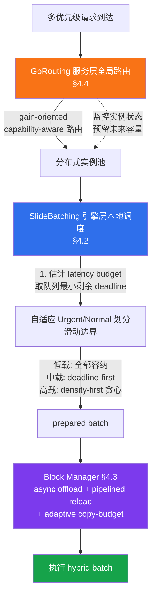

# 精读笔记：ProServe — Unified Multi-Priority Request Scheduling for LLM Serving (arXiv 2025/2026 预印本)

> ⚠️ **重要勘误（相对任务描述）**：任务说明将本论文描述为"预测式 prefill/decode 分离调度"。经完整读取 PDF（arXiv:2512.12928v2），本论文的真实主题是 **多优先级请求调度（multi-priority request scheduling）**，而非 prefill/decode 分离。论文中的"预测"成分体现在三处：(a) §4.1 的 batch latency estimator（回归模型预测执行时间）；(b) §4.4 GoRouting 的"proactively reserve capacity for future high-priority or long requests"（为未来请求预留容量）；(c) §3.4 对 over-balancing 问题的分析。PD disaggregation 只是论文支持的两种部署模式之一（另一为 PD co-location），不是论文核心贡献。本笔记按论文真实内容撰写，并在第四层如实标注与课题的连接与错配。

---

## ▎第一层 · 基本信息

| 字段 | 内容 |
|------|------|
| **论文** | Weizhe Huang, Tao Peng, Tongxuan Liu, Donghe Jin, Meng Kang, Xianzhe Dong, Ke Zhang. *ProServe: Unified Multi-Priority Request Scheduling for LLM Serving.* arXiv:2512.12928v2 [cs.DC], 12 Jun 2026（v1 为 2025 年 12 月）。JD.com + USTC + Unaffiliated。 |
| **来源级别** | 🟡 **arXiv 预印本，未经同行评审**（低于 OSDI/SOSP/MLSys 等已评审论文的严谨性档次；引用时需降档处理） |
| **链接** | arXiv: https://arxiv.org/abs/2512.12928 / 本地 PDF：`opening/literature/reference/proserve_2025.pdf`（文件名 2025 对应 v1 提交年；v2 为 2026-06） |
| **阅读日期** | 2026-07-23 |
| **状态** | 精读完成 |
| **相关论文组** | LLM 推理服务调度 / SLO-aware scheduling / 多优先级调度 / vLLM-Sarathi 生态（对照） |

### 一句话核心结论

ProServe 将多优先级 LLM 请求调度形式化为 **service gain maximization** 问题，提出 Token-level Deadline-aware Gain（TDG）收益函数，并设计两层调度框架：引擎层的 **SlideBatching**（按负载自适应地将队列划分为 Urgent/Normal 子集，边界随负载"滑动"，低载用 deadline-first、高载用 density-first 的 fractional-knapsack 贪心），以及服务层的 **GoRouting**（gain-oriented、capability-aware 的分布式路由，主动为未来高优先级/长请求预留容量）；在 4 个开源数据集 + 1 个 JD.com 工业数据集上，系统收益（TDG）最高提升 35%、SLO 达成率最高提升 52%。

`#LLM-serving` `#multi-priority-scheduling` `#gain-maximization` `#slide-batching` `#SLO-aware` `#capacity-reservation` `#preprint-2025`

---

## ▎第二层 · 论文结构分析

### 1. 问题拆解

| 问题 | 论文的回答 |
|------|-----------|
| 要解决什么痛点？ | 企业级 LLM 服务中，不同客户端（client）存在**内在优先级差异**（business-critical vs non-critical），现有调度器要么只处理 SLO 异构性（EDF/SJF 类）而不区分客户端优先级，要么只做 online/offline 粗粒度协同，无法在**满足 SLO 的同时按优先级差异化服务**（§1） |
| 之前的方法为什么不够？ | (1) FCFS/EDF/SJF 等固定排序策略不区分优先级（§3.2，图 3-7）；(2) Weighted VTC 只做 token 比例公平、不保证延迟（§5.2）；(3) 严格 priority-first 会饿死低优先级（§3.1，图 3）；(4) 静态 batch capacity（如 vLLM 的 `max_num_batched_tokens`）无法适应负载波动（§3.2，图 8）；(5) 全局 MinLoad 路由产生 over-balancing，无法为未来长/高优请求保留容量（§3.4，图 10） |
| 论文的**核心论点** | 多优先级调度应被建模为"在 SLO 约束下最大化加权收益"的优化问题；通过一个精心设计的 per-token 收益函数（TDG）+ 两层（引擎/服务）协同调度，可以在不静态划分资源的前提下同时兼顾 SLO 达成与优先级差异化 |
| 它的**关键假设** | (1) 请求优先级由**来源客户端**预先确定且静态（脚注 1：priority 指客户端优先级）；(2) 每个 token 存在一个**固定 deadline**，超时即损害用户体验、提前完成不增加收益（§2，TDG 定义）；(3) batch 执行时间可用线性回归从 token/序列特征估计（§4.1，MAPE ~4.5%）；(4) PD co-location 下 decode 请求总能被纳入 batch（§4.4） |

### 2. 方法拆解

**核心技术要点**：

1. **TDG（Token-level Deadline-aware Gain）收益函数（§2）**：论文最重要的概念贡献。把"服务收益"形式化为每个输出 token 是否在 deadline 前产出的二元指示，再按优先级权重 ρ 聚合。作者系统地反驳了三个 strawman：(a) Weighted SLO Attainment（公式 1）——会诱发 discard-or-postpone trick（直接丢弃无法满足 SLO 的请求）；(b) TA-SLO（公式 2-3，变长 deadline）——会诱发 postpone-decoding trick（故意延迟 token 输出使下一个 token 更易达标）；(c) 最终 TDG 采用**固定 deadline + 二元收益**，既禁止无限推迟（晚完成的 token 损害后续 token 的 slack，形成 deadline-miss propagation 风险），又不奖励过早完成。**NP-hard（附录 C，通过限制到 1|r_j|Σw_jU_j 归约证明）**，故采用启发式。

2. **SlideBatching（§4.2，算法 1）**：引擎层本地调度器。每轮迭代做两个决策——(a) admission order（接纳顺序）、(b) batch capacity（批量大小）。核心机制：
   - 利用 §4.1 的 latency estimator 把 token/sequence budget 换算成**时间级 latency budget**，设为队列中最小剩余 deadline（带下界 ε，算法 1 line 6-7）；
   - **自适应 Urgent/Normal 划分**（line 9-13）：用 load-judgment 函数 Φ 评估每个请求在当前负载下是否可能超时；Urgent 组内按 density（gain/exec_time）**降序**排（fractional knapsack 贪心），Normal 组内按剩余时间到 deadline**升序**排；
   - **滑动边界**：Urgent/Normal 的数量随队列负载动态变化——低载时全部容纳（顺序无所谓）、中载时偏 deadline-first、高载时偏 density-first；
   - 配合 chunked prefill（line 18-21，请求被视为 fractional knapsack 中的"可分割物品"）；
   - 防饿死：等待时间超过可配置阈值 τ_s 的请求被临时提升至队首（§4.2 末）；
   - aggressiveness 系数 α（line 10）控制 Urgent/Normal 偏移，附录 D.1 显示 α≈0.8-1.0 最优，α=0.01 在高载下严重退化（图 20）。

3. **Batch Latency Estimator（§4.1）**：把 batch 执行时间分解为常数开销 + 计算时间 + 访存时间。对 prefill（compute-bound）和 decode（memory-bound）分别训练线性回归模型：
   - prefill：`L̃_p(n) = a·len² + b·len·n + c·n`（公式 5，含 attention 二次项）；
   - decode：`L̃_d(n) = d·kvcache_len + e·n_tokens + f`（公式 6，线性）；
   - 兼容 chunked prefill 与 prefix caching；用离线 profiling 数据训练，评估 MAPE ≈ **4.5%**（§4.1 末）。

4. **Efficient Block Management（§4.3）**：应对优先级抢占导致的频繁 KV cache 驱逐。三个机制：
   - **Eviction Policy**：优先驱逐排序队列尾部请求的 block（它们近期不太可能被调度），驱逐时 spill 到 host memory 而非丢弃；
   - **Asynchronous Offloading**：单独线程异步拷贝，按 block 增量触发；**优先级感知阈值**——低优先级请求被分配更小的阈值（更频繁拷贝），因为它们更可能被高优请求抢占；
   - **Pipelined Reloading**：逐层异步上传（layer L 计算时上传 layer L+1 的 KV）；
   - **Adaptive Copy-Budget Control**：二分搜索最大可拷贝 block 数 copy，使传输时间 ≤ batch latency（利用两者单调性）。

5. **GoRouting（§4.4，算法 2）**：服务层全局路由器。维护轻量级实例状态（prefill 队列 Q_pre、decode 计数 D、空闲 block 数 F），事件驱动更新 + 时间戳补偿陈旧性。核心是 **gain-oriented、capability-aware 路由**：
   - 对每个 prefill 实例调用 EstimateGain 评估"接纳该请求前后的收益差"（line 2-5）；
   - 候选集 C = {增益接近最大值 max G 的实例}（line 7）；
   - **双阈值能力感知策略**（line 8-16）：设轻载子集 S、重载子集——(i) 若 S=∅（全轻载）：选最空闲实例避免资源浪费；(ii) 若 C\S=∅（全重载）：退回 MinLoad 负载均衡避免过载；(iii) **否则选 C\S 中"相对最重"的实例**——这会增加当前请求的 TTFT，但保证其 SLO 仍满足，同时为未来潜在的长/高优请求保留轻载实例的容量（图 10 的 over-balancing 反例正是此设计的动机）。

### 3. 实验拆解

| 维度 | 内容 |
|------|------|
| **数据集** | 4 个开源：ShareGPT、Azure、BurstGPT、QwenTrace + 1 个 JD.com **工业数据集**（图 1 展示三类优先级的到达模式）。有真实时间戳的（Azure/QwenTrace/BurstGPT）用 scaling 方法按预设总请求率重放；无时间戳的（ShareGPT）用 Poisson 分布模拟 |
| **Baseline** | 5 个 batch 调度：vLLM-FCFS、Weighted VTC (OSDI'24)、Sarathi-FCFS、Sarathi-Priority、FairBatching；多节点用 MinLoad 全局路由。所有 baseline 统一在 xLLM 框架内实现以保证公平 |
| **评价指标** | **TDG_Ratio**（捕获的收益占总可收益的比例）+ **SLO attainment**（TTFT 和 TPOT 都严格小于预设阈值才算达标）。注：**未报告 tokens/s 吞吐、P99 tail latency、inflight/queue 时间序列**——这些是本课题关心的指标盲区 |
| **消融实验** | ✅ SlideBatching 三组件（only deadline / only density / w/o latency-aware，图 17 左）；Block Management 三组件（Recompute / w/o async / w/o dynamic，图 17 右）；aggressiveness α 敏感性（图 20）；优先级权重 scaling（图 18） |
| **统计显著性** | ❌ **未报告方差/置信区间**，所有曲线为单次或均值。这是个明显短板 |
| **复现条件** | 🟡 **未提及代码开源**；基于 xLLM（JD.com 开源，C++）；硬件为 **16× Ascend 910B NPU + 96 CPU 核 + 2TB RAM/服务器**（非 NVIDIA GPU，跨平台可复现性受限）；大规模实验用 32× Qwen3-32B 实例 / 8 服务器 |

### 4. 关键数字

| Claim | 数字 | 条件（什么设置下） |
|-------|------|-------------------|
| 系统收益（TDG）提升 | **up to 35%** | 摘要，vs SOTA baselines，跨 4 开源 + 1 工业数据集 |
| SLO 达成率提升 | **up to 52%** | 摘要，同上 |
| Latency estimator 误差 | MAPE ≈ **4.5%** | §4.1，离线 profiling 训练 + 评估集 |
| SlideBatching 调度开销 | **0.17%** 平均 batch forward 时间 | 附录 D.3，与传统 FCFS 几乎相同 |
| GoRouting 路由开销 | TTFT 的 **0.04%→0.11%** | 附录 D.3，随负载略增，仍可忽略 |
| SlideBatching 消融退化（高载） | Recompute/block-mgmt 消融 worst 指标 vs Ours：低载 **1.29x→6.00x**、中载 **1.20x→6.24x**、高载 **1.16x→1.86x**（Normalized Miss TDG，图 17 右） | QwenTrace，低内存阈值 |
| SlideBatching 自身消融（高载） | "w/o latency-aware" 在高载下退化为 worst（图 17 左） | Azure/QwenTrace |
| 静态优先级划分 vs 协同部署 | ProServe 协同显著优于按平均负载静态划分（图 2 左） | 工业数据集，request rate 16-36 |
| 最优 aggressiveness α | ~0.8-1.0（图 20） | Azure/QwenTrace，α=0.01 高载下严重退化 |

---

## ▎第三层 · 批判性评估

### 1. 假设检验

- **假设 1：请求优先级是预先确定且静态的**（脚注 1：priority 指"来源客户端"的优先级）
  - 反例 / 边界：很多实际系统中优先级是**动态/上下文相关**的（同一客户端不同请求紧急度不同；交互式 vs 批量混合）。论文 §5 的开源数据集实验用 **50/50 随机分配**高/低优先级（权重 2/1）模拟——这是一个人造分布，不反映真实优先级流（只有 §5.6 工业数据集按真实业务价值赋权，但未给出各优先级的具体 SLO 值）。

- **假设 2：每个 token 存在固定的 deadline，且 deadline 可计算**（TDG 定义，§2）
  - 反例 / 边界：deadline 源自 SLO（TTFT_SLO、TPOT_SLO）。在交互式场景这些 SLO 可设定，但在**离线批量推理**（如数据库 ETL、RAG 数据准备）中往往没有 per-request deadline——而本课题正是离线批量场景。ProServe 的收益函数在此场景失去直接意义，需重新定义"收益"。

- **假设 3：batch 执行时间可用离线 profiling 训练的线性回归稳定估计**（§4.1，MAPE 4.5%）
  - 反例 / 边界：(a) 4.5% 是**平均**误差，论文未报告**尾态误差**——而 deadline-sensitive 调度恰恰对最坏情况预测误差最敏感；(b) 模型参数 {a,b,c,d,e,f} 与模型权重、NPU 型号、tensor parallel 度、context 长度分布均相关，模型更新或部署迁移时需重新 profiling；(c) linear regression 对 attention 的二次项拟合（公式 5）在超长 context（128K+）或 MoE expert 路由下可能失效。

- **假设 4：α（aggressiveness 系数）和 τ_s（防饿死阈值）需手工调参**
  - 反例 / 边界：论文承认最优 α≈0.8-1.0 且依赖数据集（图 20），但未提供自适应机制。这违背了本课题 code/AGENTS.md §编码规范-1（"保持简单"）的精神——硬编码值跑通后再参数化，但论文把 α 暴露为用户参数却又给不出跨场景的推荐策略。

### 2. 边界探查

- **方法适用边界**：SlideBatching 的 Urgent/Normal 划分依赖"请求有明确 deadline"。对于无 deadline 的**离线批处理**（数据库 AI 负载典型场景），整个收益驱动框架需重新定义——这也正是本课题与 ProServe 的根本场景差异。
- **扩展性限制**：(a) 只在 Qwen2-7B 和 Qwen3-32B（decoder-only LLM）上评测，**未涉及 embedding/classification 模型**——本课题的多模态泛化（CLIP/Qwen2.5-VL）无法从论文获得直接证据；(b) 硬件为 Ascend 910B NPU，block 管理机制（H2D/D2H copy stream、逐层 pipelined reload）的 GPU 可迁移性未验证；(c) 大规模实验（32 实例）是单点报告，未给出随实例数的 scaling 趋势。
- **复现难度**：🟡 未提及代码开源；xLLM 虽开源但 ProServe 的 SlideBatching/GoRouting 实现是否合入主线未知；依赖 Ascend NPU 硬件，多数研究者无法直接复现。

### 3. 可信度评估

| 维度 | 评价 | 依据 |
|------|------|------|
| 实验公平性 | 🟢 较公平 | 5 个 baseline 含 vLLM/Sarathi/VTC/FairBatching 等代表性方法；所有 baseline 统一在 xLLM 内实现避免框架差异；覆盖 2 模型 × 4 开源 + 1 工业数据集 |
| 结果显著性 | 🟡 勉强显著 | 35%/52% 提升是"up to"（峰值），曲线图中部分场景下 ProServe 与 FairBatching/Sarathi-FCFS 在低载下接近重合（图 12）；**未报告方差/CI** |
| 开源/可复现 | 🔴 不利 | 未提及代码开源；依赖 Ascend NPU；vLLM-FCFS 等基线是 xLLM 内重实现而非原生 vLLM |
| 论文自身局限 | 🟡 部分诚实 | 讨论了 over-balancing（§3.4）和静态调度器不足（§3.2），但**未讨论离线批量场景的适用性**、**未讨论 MAPE 尾态误差**、**未讨论 α 的跨场景泛化** |
| **整体来源级别** | 🟡 **预印本（arXiv 2512.12928），未经同行评审** | 引用时应标注"预印本"，不可与 OSDI/SOSP 已评审论文等同对待 |

### 4. 与同行工作的对比

- 比 **Sarathi-Serve (OSDI 2024)**：ProServe 的 Sarathi-FCFS/Sarathi-Priority baseline 直接基于 Sarathi-Serve 的 chunked-prefill。但 Sarathi-Serve 是 SLO-agnostic 的 FCFS/decode-prioritized 调度，ProServe 在其上叠加了优先级感知与收益驱动。两者关系：ProServe 复用 chunked-prefill 机制，替换了排序逻辑。
- 比 **VTC/Fairness (OSDI 2024, Sheng et al.)**：Weighted VTC 做 token 比例公平但不保证延迟；ProServe 认为"显式延迟保证"对 LLM 服务更关键（§1）。这是 fairness vs SLO-attempts 的路线分歧。
- 比 **Llumnix (OSDI 2024)**：Llumnix 通过动态迁移和静态内存预留处理优先级，但不提供显式延迟保证；ProServe 的 GoRouting 用收益驱动路由替代迁移。
- 比 **SLOs-Serve / SCORPIO / Sola（2025 SLO-aware 系列）**：这些方法按 SLO 紧迫度隐式排序，但不区分客户端内在优先级。ProServe 的贡献是把"客户端优先级"作为独立维度引入。
- 比 **DistServe (OSDI 2024) / Splitwise (ISCA 2024)**：这些是 PD disaggregation 路线的代表。ProServe **不是 PD 分离方法的竞争者**——它**同时支持** PD co-location 和 PD disaggregation 两种部署模式，贡献在调度层而非架构层。任务描述把它说成"prefill/decode 分离调度"是误读。
- 在 **[本课题]** 的坐标系中：ProServe 是 **推理服务内部（引擎层 + 服务层）的多优先级调度**——与本课题处于推理链路的**不同环节**。本课题在推理服务**上游**做数据组织（RC1）和提交控制（RC2），不进入 vLLM/xLLM 内部。ProServe 的"收益驱动 + 自适应排序 + 容量预留"思想可以作为**信号**指导上游如何组织数据、何时提交；但不能照搬其引擎内调度。

---

## ▎第四层 · 与你课题的连接

### 1. 可引用的观点（配精确位置）

> §2 TDG 定义 + §3.1 Priority-First vs FCFS（图 3）：严格优先级调度会因计算资源严重不均衡导致低优先级请求饥饿，而纯 FCFS 无法提供差异化服务。
> → 这对本课题 RC2 的 **actor pool 分池路由** 有警示意义：如果按优先级/计算量分池，需设计防饿死机制（ProServe 的 τ_s 阈值提升是可直接借鉴的轻量方案）。

> §3.2 + 图 8：不同排序策略（EDF/SJF/FCFS）对 batch capacity 有不同偏好，且该偏好随系统负载波动——**静态固定 batch capacity 配置不足以适应真实工作负载动态**。
> → 直接支撑本课题 RC1 的核心立论：**按固定行数/固定 batch size 组织数据是次优的**，应按计算量（token budget）动态组织，且 budget 需随推理服务状态调节。

> §4.1 Batch Latency Estimator（公式 4-6，MAPE 4.5%）：batch 执行时间可分解为常数开销 + 计算时间 + 访存时间，prefill 用二次回归、decode 用线性回归即可较准确估计。
> → 这是本课题 RC2"**如何预测请求行为来决定提交时机**"的最直接参考：用轻量回归模型从 token 量/序列长度预测 batch 执行时间，作为提交节奏（queue-adaptive flush）和 K_max 控制的输入信号。注意仅报告了平均误差，本课题实现时应补测尾态误差。

> §4.2 SlideBatching 的自适应 Urgent/Normal 划分（算法 1 line 9-13）+ 滑动边界：低载用 deadline-first、高载切到 density-first（fractional knapsack 贪心）。
> → 核心启发：**单一固定调度策略在任何负载下都不是最优**。本课题的 queue-adaptive flush 应同样设计"负载感知的策略切换"——低队列压力时按某种简单规则（如 FIFO/length-align），高压力时切换到按"计算量密度"贪心组织。这比写一个复杂的 EWMA 自适应控制器（参考 Ray ConcurrencyCapBackpressurePolicy 废弃教训）更简单且更有效。

> §3.4 + §4.4 GoRouting 的 over-balancing 分析（图 10）：纯负载均衡（MinLoad）会把容量碎片化，导致后续长/高优请求无法满足 SLO；GoRouting 故意选"相对更重"的实例以保留轻载实例的容量。
> → 这是 RC2 **actor pool 分池路由**的关键设计参考：**不要贪心地往最闲的 actor 派活**——应保留部分 actor 的容量应对未来计算量大的请求。对本课题而言，"为未来请求预留容量"对应到"为长 prompt / 多模态大计算量请求保留高 GPU 配额的 actor"。

> 附录 D.3：SlideBatching 调度开销仅 0.17% batch forward 时间，GoRouting 仅 0.04%-0.11% TTFT。
> → 支撑本课题 RC2 的工程可行性论证：自适应调度的开销可以做到可忽略，不会成为吞吐瓶颈。

### 2. ⚠️ 不能过度引用的地方

- ❌ **不声称**"ProServe 是预测式 prefill/decode 分离调度"——这是对论文的误读。ProServe 是**多优先级请求调度**框架，PD disaggregation 只是其支持的两种部署模式之一。引用时必须按论文真实主题（multi-priority scheduling + gain maximization）描述。
- ❌ **不声称**"ProServe 的引擎内调度可直接用于本课题"——本课题**不修改 vLLM 内部**（部署平台约束），ProServe 的 SlideBatching/Block Management 是在 xLLM 引擎**内部**实现的，两者处于推理链路的不同环节。本课题只能借鉴其**思想**（自适应排序、容量预留、收益函数），不能照搬其实现。
- ❌ **不声称**"ProServe 的结果可作为已证实的结论"——它是 **arXiv 预印本（2512.12928），未经同行评审**，且未报告方差/置信区间、未开源代码、硬件为 Ascend NPU（非 NVIDIA GPU）。引用时必须标注"预印本"，与 OSDI/SOSP 已评审论文区分。
- ❌ **不声称**"ProServe 的 TDG 收益函数适用于本课题的离线批量场景"——ProServe 假设每请求有明确 deadline（源自 TTFT/TPOT SLO），而本课题是**数据库 AI 负载的离线/近线批量执行**，通常没有 per-request deadline。ProServe 的预测信号来自在线请求流的 deadline紧迫度，本课题的信号来自**批量数据的计算量分布与模型服务队列状态**——信号来源根本不同。
- ❌ **不声称**"ProServe 的优先级概念等同于本课题的分组维度"——ProServe 的优先级是**客户端业务价值**（business-critical vs non-critical），是外部给定的；本课题的"分组"维度是**数据内在计算量**（token 量/frame 量、length-align、prefix-aware），是数据驱动的。两者不能混为一谈。

### 3. 对本课题的实际用途

| 用途类型 | 具体方式 | 优先级 |
|----------|----------|--------|
| ✅ **设计参考** | **SlideBatching 的自适应策略切换**（低载 deadline-first / 高载 density-first）→ 直接指导 RC2 的 **queue-adaptive flush**：不用固定 flush 频率，而是按队列负载切换组织策略 | ⭐⭐⭐ |
| ✅ **设计参考** | **Batch Latency Estimator**（§4.1，线性回归 + MAPE 4.5%）→ 指导 RC2 的"提交时机"预测机制：从 token 量/序列长度预测 batch 执行时间，作为 flush 触发与 K_max 控制的信号 | ⭐⭐⭐ |
| ✅ **设计参考** | **GoRouting 的容量预留**（§4.4，over-balancing 反例图 10）→ 指导 RC2 的 **actor pool 分池路由**：不贪心派活到最闲 actor，保留容量应对未来大计算量请求 | ⭐⭐ |
| ✅ **设计参考** | **防饿死阈值 τ_s**（§4.2 末）→ 指导 RC1 异构 actor pool 的公平性保障：长 prompt/大 frame 请求被分到低并发池时需防饿死 | ⭐⭐ |
| ⚠️ 对照区分 | ProServe 是推理服务**内部**调度，本课题是推理服务**上游**数据组织与提交控制——在报告中明确"内外两侧"的边界 | ⭐⭐ |
| □ 空白论证 | ProServe 假设 deadline 已知，未处理**无 deadline 的离线批量**场景——这正是本课题可填补的空白 | ⭐ |
| □ 代价估计 | TDG 收益函数的**形式化思路**（§2）可借鉴用于本课题的算子代价估计（RC 补充讨论）：把"服务收益"建模为可聚合的 per-token/per-frame 指标 | ⭐ |

**对"提交时机"决策的具体启发（用户指定核心用途）**：

ProServe 没有直接讲"上游何时把请求提交给推理服务"（它讲的是请求已经在服务内时的调度），但其 §4.1 的 **latency estimator**（预测 batch 执行时间）和 §4.2 的 **latency budget = min(队列剩余 deadline)** 机制，为 RC2 的提交时机决策提供了**可移植的预测驱动思路**：本课题可在上游维护一个轻量回归模型，预测"当前组织好的 batch 提交后预计执行多久"，结合推理服务反馈的队列状态（类比 ProServe 的 Q_pre 监控），动态决定 flush 时机——当预测执行时间 + 排队时间接近某个预算上限时触发提交。**关键差异**：ProServe 的预算来自外部 deadline，本课题的预算需自行定义（如吞吐最大化约束、或用户设定的端到端延迟目标）。

### 4. 不足 → 你的机会

| 论文的不足 / 未回答的问题 | 你的课题可能如何填补 |
|--------------------------|---------------------|
| 只考虑在线交互式场景（有 deadline），未处理离线批量场景 | 本课题的数据库 AI 负载是离线/近线批量——重新定义"收益"（如吞吐/资源利用率而非 SLO 达成），并设计无 deadline 约束下的提交时机策略 |
| SlideBatching 在引擎内部排序已到达请求；不考虑请求以什么形态/节奏从外部到达 | 本课题研究请求**到达前**的组织（RC1：token-budget/length-align/prefix-aware 分组）和**到达节奏**（RC2：queue-adaptive flush、K_max），填补上游空白 |
| 优先级是客户端业务价值，外部给定；不考虑数据内在计算量异构性 | 本课题的"分组"维度是数据计算量——把 ProServe 的"按优先级排序"替换为"按计算量相似度组织"，使每个 batch 内计算量均匀（充分利用 token budget） |
| 未涉及多模态/embedding/classification 模型（只测 Qwen2-7B/Qwen3-32B decoder-only LLM） | 本课题多模态泛化验证（CLIP/Qwen2.5-VL 图像 embedding/classify）可检验"按计算量组织"思想是否模态无关 |
| Latency estimator 只报告平均 MAPE，无尾态误差分析 | 本课题实现预测模型时应补测 P95/P99 预测误差，评估其对调度决策的鲁棒性影响 |
| α/τ_s 等参数手工调参，无跨场景推荐策略 | 本课题遵循 code/AGENTS.md §编码规范-1，先用硬编码值跑通，确认有效后再考虑是否需要参数化——避免 ProServe 暴露过多参数却给不出推荐值的陷阱 |

### 5. 可论文化的措辞

> Huang et al. [ProServe, arXiv 2025] 将多优先级 LLM 请求调度形式化为收益最大化问题，并提出 SlideBatching 在引擎层按负载自适应切换 deadline-first 与 density-first 排序策略。本课题借鉴其"负载感知的策略切换"思想，但不进入推理引擎内部——而是在数据提交侧，根据推理服务的队列状态动态调节 flush 时机与批量组织方式，使请求以"计算量预对齐"的形态到达推理服务。

> 与 ProServe 在引擎内对已到达请求做排序不同（§4.2），本课题的研究对象是请求**到达推理服务之前**的数据组织与提交控制。ProServe 的 batch latency estimator（§4.1，MAPE 4.5%）表明执行时间可从 token 量稳定预测——本课题在上游复用此思路，将其作为 queue-adaptive flush 的触发信号，而非在引擎内做调度。

> ProServe 的 GoRouting（§4.4）通过"选相对更重的实例以保留轻载实例容量"避免 over-balancing。这一容量预留思想被本课题 RC2 的 actor pool 分池路由采纳：不贪心派活到最闲 actor，而是为未来计算量大的请求（长 prompt、多模态大帧量）保留高配额 actor 的容量。

> 需要指出，ProServe 的收益函数 TDG 依赖 per-request deadline（§2），适用于在线交互式场景。本课题的数据库 AI 负载多为离线批量执行、无显式 deadline——因此本课题的优化目标重新定义为吞吐/资源利用率，ProServe 的收益驱动框架不能直接照搬。

### 6. 后续待读

- [ ] **FairBatching** (Lyu et al., arXiv 2510.14392, 2025) — ProServe 的强 baseline，EDF 增强版，按 decode-near-deadline → prefill → 剩余 decode 排序；与本课题 queue-adaptive flush 的策略切换相关
- [ ] **SLOs-Serve** (Chen et al., arXiv 2504.08784, 2025) / **SCORPIO** (Tang et al., arXiv 2505.23022, 2025) — 多 SLO 调度路线，与 ProServe 形成对照
- [ ] **VTC** (Sheng et al., OSDI 2024) — fairness 路线代表，ProServe 的 Weighted VTC baseline 源于此
- [ ] **xLLM Technical Report** (Liu et al., arXiv 2510.14686, 2025) — ProServe 的实现底座，了解 service-engine 解耦架构
- [ ] **Tempo** (Zhang et al., arXiv 2504.20068, 2025) — ProServe TA-SLO 灵感来源，变长 deadline 的 token-level 收益函数
- [ ] **Sarathi-Serve** (Agrawal et al., OSDI 2024) — ProServe 复用其 chunked-prefill，本课题已有精读笔记 [[sarathi_serve_osdi2024]]，可交叉对比两者对 batch capacity 的处理

---

## 元反思

- **精读收益**：🟡 **中**。论文本身工程完整度高（两层框架 + 5 baseline + 消融 + 大规模工业验证），但其核心场景（在线多优先级 + deadline 驱动）与本课题（离线批量 + 无 deadline）有根本差异，可移植的主要是**思想**（自适应策略切换、latency estimator、容量预留）而非具体方案。加之是预印本、未开源、未报告方差，需谨慎引用。
- **是否纳入核心文献库**：**待定**（作为 RC2 queue-adaptive flush 与 actor pool 路由的**思想参考**纳入；但因预印本身份不作为 S 级依据）
- **计划复习周期**：4 周后复习（与 RC2 queue-adaptive flush 设计同步；复习时重点核对论文是否已被会议接收、代码是否开源）
- **一句话笔记自评**：理解到位，且**纠正了任务描述对论文主题的误读**（"预测式 prefill/decode 分离调度"实为"多优先级请求调度"）。关键收获有三：(1) SlideBatching 的"负载感知策略切换"比单一复杂自适应控制器更简单有效，契合本课题"保持简单"的编码规范；(2) §4.1 的 latency estimator 是"提交时机预测"可直接借鉴的机制；(3) GoRouting 的容量预留思想指导 actor pool 分池路由设计。最大保留：ProServe 的 deadline 假设与离线批量场景不匹配，本课题需重新定义优化目标。

---

## 相关笔记

- [[tpl-文献精读-深度版]] — 本模板
- [[sarathi_serve_osdi2024]] — ProServe 复用其 chunked-prefill，可交叉对比 batch capacity 处理
- [[文献地图]] — 文献全景
- [[ai_operator_literature_inventory]] — 完整文献清单
