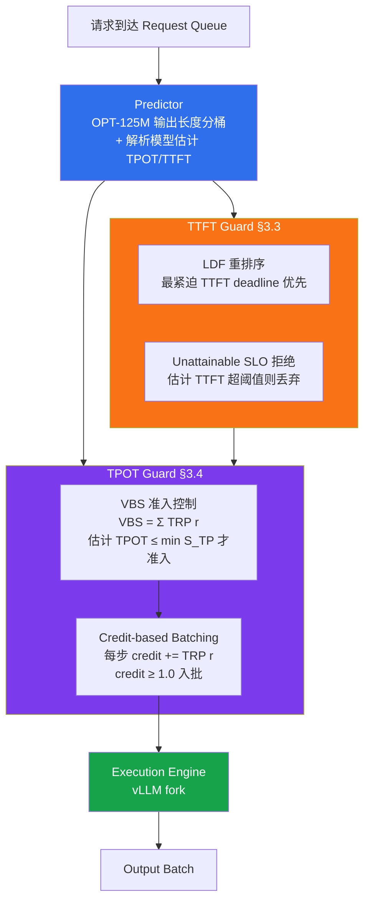

# 精读笔记：SCORPIO — Serving the Right Requests at the Right Time for Heterogeneous SLOs in LLM Inference (2025)

---

## ▎第一层 · 基本信息

| 字段 | 内容 |
|------|------|
| **论文** | Yinghao Tang, Tingfeng Lan, Xiuqi Huang, Hui Lu, Wei Chen. *SCORPIO: Serving the Right Requests at the Right Time for Heterogeneous SLOs in LLM Inference.* arXiv:2505.23022v1, Preprint (Under review), May 2025. |
| **来源级别** | arXiv preprint（Under review，非 CCF-A 已录用；作者来自浙大 CAD&CG + UVA + UTA） |
| **链接** | arXiv: https://arxiv.org/abs/2505.23022 / 代码：https://github.com/MisterBrookT/Scorpio / 本地 PDF：`opening/literature/reference/scorpio_llm_serving_2025.pdf` |
| **阅读日期** | 2026-07-23 |
| **状态** | 精读完成 |
| **相关论文组** | LLM 推理服务 SLO 调度 / vLLM 生态 / 异构 SLO 准入控制 |

### 一句话核心结论

SCORPIO 的核心洞察是**利用 SLO 异构性**而非忽视它：在准入控制（VBS-based Admission Control）、队列重排（Least-Deadline-First）、批选择（Credit-based Batching with TRP）三个阶段分别针对 TTFT/TPOT 做精细调度，相比 vLLM/S3/Mooncake 在高 QPS（=15）下将系统 goodput 提升至 14.4×、SLO adherence 提升 46.5%，调度开销 <1%。

`#LLM-serving` `#heterogeneous-SLO` `#TPOT-guard` `#TTFT-guard` `#credit-based-batching` `#virtual-batch-size` `#admission-control` `#SLO-attainment`

---

## ▎第二层 · 论文结构分析

### 1. 问题拆解

| 问题 | 论文的回答 |
|------|-----------|
| 要解决什么痛点？ | 现有 LLM serving 系统（vLLM/SGLang）贪心准入、吞吐优先，忽视 TTFT/TPOT 两类 SLO，且对所有请求一视同仁——而真实应用的 SLO 本质异构（编程助手需低 TTFT，聊天机器人只要 TPOT 跟上阅读速度即可），导致 SLO attainment 严重次优（§1, Fig 1 中 throughput-oriented 的 SLO attainment 仅 16.6%） |
| 之前的方法为什么不够？ | (1) vLLM 贪心准入+统一批处理，高负载下 TPOT 雪崩；(2) S3 [Jin et al.] 仅按预测输出长度做 SJF，未考虑 TPOT 异构；(3) Mooncake [Qin et al.] 有 early-rejection 但准入过严且不考虑 SLO 异构——三者都未在准入/队列/批选择三个阶段同时利用 SLO 异构性（§1, §4.1 Baselines, §5 Related Work） |
| 论文的**核心论点** | 把 SLO 异构性作为可利用的资源：TTFT 松的请求可以晚一点服务，TPOT 松的请求可以**跳过部分 decode iteration**（让出资源给 TPOT 紧的请求）。由此在三个调度阶段做差异化处理即可在不增加硬件的前提下大幅提升 goodput（§1 Key Insight） |
| 它的**关键假设** | (1) 每个请求都带显式 TTFT SLO 阈值 `S_TT(r)` 和 TPOT SLO 阈值 `S_TP(r)`；(2) ITL（inter-token latency）可用 `|R|·L_avg` 的线性模型拟合（R²>0.9）；(3) 输出长度可由 OPT-125M 分类器分桶预测；(4) 被拒请求可简单丢弃（不做降级或迁移） |

### 2. 方法拆解

**核心技术要点**：

1. **解析型 TPOT/TTFT 估计器（§3.2，对应 token-level 延迟建模）**：核心是一阶 ITL 公式 `ITL{|R|, L_avg} = α·|R|·L_avg + β·|R| + γ·L_avg + δ`（式 4），其中 `|R|` 是运行批大小、`L_avg` 是批内平均序列长度（含 prompt+已生成 token），α/β/γ/δ 由经验拟合。新请求 r 加入后的 batch-level TPOT 由式 5 估计（保守假设所有在批请求都还要走 P(r) 步，并引入 ≥ 1 的 inefficiency coefficient κ 应对系统开销）。TTFT 估计基于分段 prefill 时间（式 6：prompt 短于 θ 则取常数 α，否则线性 β·L+γ）+ 队前 prefill 时间累加（式 7）。**报告 R²=0.994 prefill / 0.987 ITL（Llama-8B ShareGPT，Table 4），MAPE 在 5% 内**。这是本论文最值得借鉴的"可计算延迟模型"。

2. **Credit-based Batching with TRP（§3.4，对应自适应批大小）**：定义 **TPOT-relative Proportionality** `TRP(r) = min_{r'∈R(t)} S_TP(r') / S_TP(r)`（Definition 1）。TRP 量化请求相对于"最严 TPOT 请求"的紧迫度，且随 batch 成员变化自适应。每个 decode step，请求 r 的 credit 按 TRP(r) 速率累积；credit ≥ 1.0 才进入本步 batch，随后 credit 减 1.0。**效果**：TPOT 松的请求 TRP<1，credit 累积慢，会**跳过部分 iteration**；TPOT 紧的请求 TRP=1，每步都被批处理。长时间尺度上，请求 r 被批处理的频率收敛到 TRP(r)。这是比 Clipper AIMD 更细粒度的控制——Clipper 调的是整个 batch size，Scorpio 调的是**每个请求在批中的出现频率**。

3. **VBS-based Admission Control（§3.4，对应 K_max 准入）**：由于 credit-based batching 使部分请求间歇参与，直接用 `|R|` 当 batch size 会高估负载。引入 **Virtual Batch Size** `VBS(R) = Σ_{r∈R} TRP(r)`（式 8）——把 TRP<1 的请求视为"部分请求"。新请求 r 被准入当且仅当 `EstimatedTPOT(VBS(R∪{r}), L_avg) ≤ min_{r'∈R} S_TP(r')`（Algorithm 1 第 5 行）。这等价于一个**带 SLO 约束的 K_max 自适应机制**：当系统负载使 TPOT 估计即将突破最严 SLO 时，拒绝新请求进入 running queue。

4. **TTFT Guard（§3.3）**：相对简单。LDF（Least-Deadline-First）重排序——按距 TTFT deadline 的剩余时间升序排队列；Unattainable SLO Rejection——估计 TTFT 已超阈值的请求直接丢弃。论文坦言其他策略（降优先级、迁移到其他节点）留作 future work。

5. **Sequence Length Predictor（§3.2）**：fine-tune OPT-125M 作文本分类器，把输出长度分桶。关键设计决策：**用 100 个等宽桶**而非 S3/faster-decoding 的 10 桶——论文 §4.4 + Appendix A.4 论证 10 桶在长尾分布下掩盖 minority class（93% 样本落第一桶导致虚高 accuracy），100 桶在 Kendall's tau 和 RMSE 上最优。

### 3. 实验拆解

| 维度 | 内容 |
|------|------|
| **数据集** | ShareGPT + LMSYS-Chat-1M（真实对话）；real-world trace 用 Azure Inference Trace 前 20 分钟（§4.3, Fig 8 峰值 QPS 60+，§A.2） |
| **Baseline** | vLLM（throughput-oriented，prefill-prioritizing）、S3 [Jin et al. OSDI 2023]（重实现进 vLLM）、Mooncake [Qin et al.]（early-rejection 集成进 vLLM）。三个 baseline 都在 vLLM fork 上重实现以保证公平——属于 SOTA 级而非 strawman |
| **评价指标** | **Goodput**（式 1：SLO-compliant 请求数 / T）、**SLO adherence rate**（式 2：SLO-compliant / 总请求）、累积 SLO-met 请求数（Fig 5）、TTFT violation 数、TPOT violation 数（Fig 6）、调度开销（Table 2）。**Missing 指标**：未报告原始 throughput（非 goodput）和 P99/tail latency 分布；未报告方差/置信区间 |
| **消融实验** | ✅ Fig 6：vLLM → +TPOT Guard → +TTFT Guard → full Scorpio，单 QPS=14，4 种配置 × 4 设定。结论：两 Guard 互依——单加 TTFT Guard 会加剧 TPOT 违例，反之亦然。Bucketing 策略消融（Table 5，10-1000 桶 × equal-width/equal-frequency × 2 模型 × 2 数据集） |
| **统计显著性** | 🔴 **未报告方差/置信区间**，多数图为单次运行的曲线。趋势在 2 模型 × 2 数据集上一致提供部分可信度，但缺 error bar |
| **复现条件** | 🟢 代码开源（github.com/MisterBrookT/Scorpio，vLLM fork）；需 4× A100 80GB + OPT-125M 预测器；预测器与 LLM 同 GPU 共置会有 5-20% 干扰（§A.5, Fig 9） |

### 4. 关键数字

| Claim | 数字 | 条件 |
|-------|------|------|
| Goodput 提升 | **up to 14.4×** vs baselines | QPS=15, Llama-3.1-8B, LMSYS-Chat-1M（§4.2, Fig 4a；摘要与§4.2 均陈述 8.8-14.4× 区间） |
| SLO adherence 提升 | **up to 46.5%** vs baselines | QPS=15, Llama-3.1-8B, LMSYS（§4.2；40.7-46.5% 区间） |
| 真实 trace 累积 SLO-met | 1.25× / 2.01× / 2.11× vs Mooncake / vLLM / S3 | Azure trace 20 min, 跨 4 设定（§4.3） |
| 调度开销 | **0.12%-0.17%**（<1%） | 512 请求，含 TTFT/TPOT Guard 全部子组件，不含预测器（Table 2） |
| 解析模型 R² | 0.994 prefill / 0.987 ITL | Llama-8B ShareGPT；Gemma-27B 降到 0.988/0.953（Table 4） |
| 低 QPS 反向退化 | vLLM 1.08× goodput / +1.5% adherence | QPS=5, Gemma-27B ShareGPT（§4.2 坦承） |
| 预测器共置干扰 | 5-20% goodput/adherence 下降 | OPT-125M 与 LLM 同 A800 GPU vs 分离到 GTX 3090（§A.5, Fig 9） |
| SLO 类别 | 6 类（TTFT 0.5-7.5s / TPOT 30-50ms @ Llama-8B） | Table 1，对应编程助手/工具调用/聊天/摘要等场景 |

---

## ▎第三层 · 批判性评估

### 1. 假设检验

- **假设 1**：每个请求都携带显式、可量化的 TTFT/TPOT SLO 阈值（Table 1 的 6 类）
  - 反例 / 边界：实际部署中 SLO 往往是隐式的（应用层"用户体验目标"），或仅有粗粒度等级（P50/P99）。本课题的数据库 AI 负载（AI_COMPLETE 批量离线生成、AI_EMBED 离线向量化）**根本没有 per-request TPOT SLO**——这是 Scorpio 直接移植的最大障碍。Scorpio 的"利用异构性"在 SLO 同质的离线批处理 workload 上收益会大幅缩水。
- **假设 2**：ITL 可由 `|R|·L_avg` 的双线性模型拟合（式 4）
  - 反例 / 边界：该模型未显式建模 (a) prefill 与 decode 混批时的干扰（Sarathi-Serve 已证明 prefill 会 stall decode）；(b) PagedAttention 的 KV-cache 访问模式（序列长度增长后 memory-bound 行为非线性）；(c) tensor parallel 下的通信开销（27B 模型 R² 从 0.994 降到 0.953 已露端倪，Table 4）。在 chunked prefill 或 prefix-sharing 场景下该模型可能需要扩展。
- **假设 3**：被拒绝的 unattainable 请求可以直接丢弃（§3.3 "reject them for simplicity"）
  - 反例 / 边界：在生产中丢弃用户请求意味着业务损失。论文把降级服务、迁移到其他节点都留给 future work——这是一个相当强的简化，使"goodput"指标带有一定乐观偏差（被拒请求不计入分母的 goodput，但用户感知的"完成率"会低）。
- **假设 4**：credit-based batching 的"跳过 iteration"对生成质量无影响
  - 反例 / 边界：论文未讨论 decode 间歇化是否影响 KV-cache 一致性或采样分布。虽然数学上 skip iteration 只是推迟生成、不改变 token 概率，但实际 vLLM 的 continuous batching 实现中，一个请求被踢出 batch 后其 KV-cache 是否驻留、是否会被 evict，论文未说明。

### 2. 边界探查

- **方法适用边界**：仅适用于**重负载 + SLO 异构**的双条件场景。论文自己承认（§A.6）在低 QPS 时性能反而略差——因为复杂的控制介入在轻载下徒增开销而无异构性可利用。如果 workload 接近 SLO 同质（如纯离线批量 embedding），Credit-based Batching 退化为普通 FCFS，VBS 准入退化为固定阈值。
- **扩展性限制**：(a) 与 prefill-decode disaggregation（DistServe/SplitWise）不兼容——论文 §A.6 明确列为 limitation，因为 Scorpio 的 TPOT 模型假设 prefill+decode 在同一 batch；(b) 与 speculative decoding、prefix caching 等 vLLM 新特性未集成；(c) 模型规模继续增长时，解析模型的 R² 下降趋势（Table 4 中 27B 已显著低于 8B）暗示在 70B+ 可能需要更复杂模型。
- **复现难度**：🟡 部分。代码开源，但 (a) 需 4× A100 80GB（非消费级硬件）；(b) 预测器需 fine-tune OPT-125M（额外训练成本）；(c) SLO 类别标签需人工设定（Table 1）——真实 trace 不带这些标签，论文是从数据集 + 人工规则合成的。

### 3. 可信度评估

| 维度 | 评价 | 依据 |
|------|------|------|
| 实验公平性 | 🟢 较公平 | 三个 baseline 全部在 vLLM fork 上重实现，S3/Mooncake 的核心策略被保留；2 模型 × 2 数据集 × 多 QPS 覆盖面合理 |
| 结果显著性 | 🟢 显著（高 QPS）/ 🟡 一般（低 QPS） | 14.4× goodput 是重负载下的峰值，论文坦诚低 QPS 反向退化 8%；无 error bar 是扣分项 |
| 开源/可复现 | 🟡 部分 | 代码开源但需 A100 集群 + OPT-125M 训练；SLO 标签为人工合成，真实部署需自行标注 |
| 论文自身局限 | 🟢 诚实 | §A.6 主动列出 disaggregation 不兼容、低 QPS 退化两条局限；§3.3 承认拒绝策略是简化；§4.2 坦承预测器干扰 |

### 4. 与同行工作的对比

- 比 **vLLM [Kwon et al. SOSP 2023]**：vLLM 调度器是 prefill-prioritizing + 贪心准入，完全吞吐导向。Scorpio 在 vLLM fork 上**替换调度逻辑**，保留 PagedAttention。两者在调度目标上正交——vLLM 最大化吞吐，Scorpio 最大化 SLO-compliant goodput。
- 比 **Sarathi-Serve [Agrawal et al. OSDI 2024]**：Sarathi-Serve 解决 prefill-decode **干扰**（chunked prefill + stall-free batching），目标是 throughput-latency tradeoff；Scorpio 解决 SLO **异构性**（credit-based batching + VBS），目标是 goodput。**两者正交且可互补**——Sarathi-Serve 的 token budget 给定均匀 batch，Scorpio 在此基础上按 TRP 差异化批选择。但论文未做与 Sarathi-Serve 的直接对比实验（§5 仅一笔带过），这是一个实验缺口。
- 比 **Mooncake [Qin et al. 2024]**：Mooncake 用 early-rejection 做过载保护，但准入判据不区分 SLO 异构性。Scorpio 的 VBS 准入可视为 Mooncake 的 SLO-aware 版本。
- 比 **S3 [Jin et al. OSDI 2023]**：S3 用预测输出长度做 SJF，缩短平均 TTFT 但不区分 TPOT。Scorpio 复用了 S3 的长度预测思路（升级为 OPT-125M + 100 桶），但把长度预测用于 TPOT 估计而非直接排序。
- 比 **Clipper [Crankshaw NSDI 2017]（本课题 RC2 第一候选 AIMD）**：Clipper 的 AIMD 在 batch size 维度做加性增/乘性减，**对全体请求一视同仁**；Scorpio 的 Credit-based Batching 在**每请求维度**做差异化批处理频率，粒度更细。但 Clipper 是 serving 中间件（引擎无关），Scorpio 是 vLLM 内部调度（引擎绑定）——对本课题（不修改 vLLM）而言，Clipper 的架构位置更接近，Scorpio 的控制律更精细。
- 在 **[本课题]** 的坐标系中：Scorpio 是**推理服务内部的 SLO 调度器**——与 Sarathi-Serve 一样处于"推理引擎内部"，而本课题处于**推理服务上游**（数据如何组织、以什么节奏到达）。Scorpio 的 token-level 延迟建模（式 4-7）和 TRP/VBS 控制律是可抽象外迁的算法资产；其 vLLM-fork 实现不可直接复用。

---

## ▎第四层 · 与你课题的连接

### 1. 可引用的观点（配精确位置）

> §3.2 式 4：`ITL{|R|, L_avg} = α·|R|·L_avg + β·|R| + γ·L_avg + δ`，R² > 0.9。
> → 这是本课题**算子代价估计（研究内容四）**可直接借鉴的延迟模型形态。`|R|` 对应 batch 并发度（RC2 的 K_max），`L_avg` 对应请求平均计算量（RC1 的 token-budget 组织结果）——这两个变量正是本课题两项研究内容的输出。把 Scorpio 的双线性 ITL 模型作为 vLLM 的代价估计器，输入是 RC1 的分组结果和 RC2 的 K_max，输出是预测 TPOT，可用于闭环反馈控制。

> §3.4 Definition 1 + Credit-based Batching：`TRP(r) = min S_TP / S_TP(r)`，请求按 TRP 速率累积 credit，credit ≥ 1.0 入批。
> → 这是本课题 **RC2 adaptive controller 的第二套候选方案**（与 Clipper AIMD / CONCUR EWMA 并列）。粒度比 AIMD 更细：AIMD 调整体 batch size，TRP 调整每请求批处理频率。在本课题的异构 actor pool 场景下，可把 TRP 重解释为"请求对严 SLO actor 的路由权重"。

> §3.4 式 8 + Algorithm 1：`VBS(R) = Σ TRP(r)`，`EstimatedTPOT(VBS) ≤ min S_TP` 才准入。
> → 这等价于一个**带 SLO 约束的自适应 K_max**。本课题的 K_max 动态控制可直接借鉴：把"请求计算量预算"（token-budget）代入 VBS，把"目标 tail latency"代入 min S_TP，即得到一个可计算的准入判据。比纯 AIMD 反馈控制多了**前馈预测**能力。

> §4.4 Ablation, Fig 6：TTFT Guard 单独使用会加剧 TPOT 违例，反之亦然——两组件互依。
> → 印证本课题 RC1 与 RC2 也需做联合 vs 拆分对比实验（PROJECT_OUTLINE.md 已规划）。Sarathi-Serve §5.4.2 消融得出同样结论——两篇独立工作共同支撑"联合调优必要性"的论证。

> §4.2 + §A.6：Scorpio 在低 QPS 反向退化 8%，因复杂控制在轻载下徒增开销。
> → 这是对本课题**保持简单原则（code/AGENTS.md §1）**的有力警示：自适应控制器必须设计"轻载回退到简单策略"的开关，否则会在低负载场景伤害性能。Ray ConcurrencyCapBackpressurePolicy 被废弃的教训在此再次得到印证。

> §A.4 Table 5：bucketing 策略消融——10 桶在长尾分布下掩盖 minority class（93% 落第一桶），100 桶最优。
> → 这是本课题**长度预测器设计**的直接参考：若 RC1 的 length-align 分组需要一个"请求计算量预测器"，应避免粗粒度分桶。同时也佐证：评估预测器不能只看 accuracy，必须看 Kendall's tau / RMSE / off-by-n。

### 2. ⚠️ 不能过度引用的地方

- ❌ **不声称** "Scorpio 的 SLO 调度 = 本课题的上游提交控制"——Scorpio 是 vLLM **内部**调度器（在 running queue 和 batch selection 层），本课题**不修改 vLLM 内部**，只在数据提交侧做组织与节奏控制。两者位于推理服务的内外两侧，不能混为一谈。
- ❌ **不声称** "Scorpio 的 14.4× goodput 提升适用于本课题 workload"——Scorpio 的提升严重依赖 (a) 重负载、(b) SLO 异构性两个前提。本课题的数据库 AI 负载多为离线批处理（SLO 同质、追求吞吐而非尾延迟），VBS/Credit 退化为简单策略，提升幅度会大幅缩水。
- ❌ **不声称** "Scorpio 的 TRP 可直接用作 actor pool 路由权重"——TRP 定义在 per-request TPOT SLO 上，本课题的 actor pool 路由目标可能是吞吐均衡或计算量匹配，而非 SLO 差异化。TRP 的**形式**（按相对紧迫度差异化分配资源）可借鉴，但其**TPOT 语义**需重新定义。
- ❌ **不声称** "Scorpio 解决了 token-level 延迟建模的完整问题"——其 ITL 模型（式 4）是 `|R|·L_avg` 双线性，未建模 prefill-decode 混批干扰、prefix caching、chunked prefill 等现代 vLLM 特性。Sarathi-Serve 已证明 prefill 对 decode 的 stall 效应不可忽略。
- ❌ **不声称** "Scorpio 的 goodput 指标可直接对比本课题的吞吐"——Scorpio 的 goodput 分母是"到达请求总数"且把被拒请求排除在 SLO-compliant 之外，本质是 SLO 达标率加权吞吐。本课题若用 rows/s 或 tokens/s 作主指标，与 goodput 不可直接比。

### 3. 对本课题的实际用途

| 用途类型 | 具体方式 | 优先级 |
|----------|----------|--------|
| ✅ 设计参考（RC2） | TRP + Credit-based Batching 作为 RC2 adaptive controller 的**第二候选方案**，与 Clipper AIMD / CONCUR EWMA 并列对比。控制粒度从"整体 batch size"细化到"每请求批处理频率" | ⭐⭐⭐ |
| ✅ 设计参考（RC2） | VBS-based Admission Control 提供"带预测的 K_max 准入"范式——比纯反馈式 AIMD 多了前馈分支。式 8 的 `VBS = Σ TRP` 可重解释为"按请求计算量加权的有效并发度" | ⭐⭐⭐ |
| ✅ 设计参考（代价估计） | 式 4-7 的解析型 ITL/TPOT/TTFT 估计器是**研究内容四（算子代价估计）**的直接模板。双线性 `α·|R|·L_avg + β·|R| + γ·L_avg + δ` 形式简洁、可拟合、R²>0.9 | ⭐⭐⭐ |
| ✅ 对照区分 | 本课题"不修改 vLLM 内部"的边界需在报告中明确——Scorpio（以及 Sarathi-Serve）是 vLLM 内部调度，本课题是上游提交控制，两者互补而非重叠 | ⭐⭐ |
| ✅ 动机证据 | 低 QPS 反向退化（§A.6）+ 调度开销 <1%（Table 2）共同支撑本课题自适应策略必须"简单 + 带轻载回退"的设计原则 | ⭐⭐ |
| ⚠️ Baseline | **不能**直接作为本课题 baseline——Scorpio 修改 vLLM 内部，本课题不修改。但若做"假设可以修改 vLLM 内部"的 oracle 对比，Scorpio 是合适的上限参考 | ⭐ |

### 4. 不足 → 你的机会

| 论文的不足 / 未回答的问题 | 你的课题可能如何填补 |
|--------------------------|---------------------|
| 强依赖 per-request TTFT/TPOT SLO 标签，离线批处理 workload 无此标签 | 本课题的数据库 AI 负载（AI_COMPLETE 批量生成、AI_EMBED）多是无 per-request SLO 的离线场景——可研究"无显式 SLO 时的等效约束"（如队列长度上限、吞吐下限），把 TRP 重定义在"计算量相似度"或"延迟紧迫度"上 |
| 完全在推理引擎内部调度，不考虑数据如何从外部到达 | 本课题研究**数据如何组织（RC1 token-budget/length-align）和以什么节奏提交（RC2 queue-adaptive flush）**——Scorpio 假设请求已到达 serving 系统的队列，本课题填补"请求到达 serving 系统之前"的优化空白 |
| ITL 模型未考虑 prefill-decode 干扰、prefix caching、chunked prefill | 本课题在 vLLM 上层做 prefix-aware 分组（RC1），可把 prefix 命中作为新的 cost factor 加入 ITL 模型；与 Sarathi-Serve 的 chunked prefill 联合建模是开放问题 |
| Credit-based batching 的"跳过 iteration"对 KV-cache 生命周期的影响未讨论 | 本课题若用异构 actor pool（RC1），actor 间 KV-cache 隔离天然存在——可研究"skip iteration → KV-cache 驻留策略"作为 actor pool 调度的子问题 |
| 实验仅在 decoder-only 生成式 LLM 上验证 | 本课题多模态泛化验证（AI_EMBED/AI_CLASSIFY 图像）可测试 TRP/credit 思想在非生成式模型上的适用性——embedding 的"延迟"是单次前向，无 decode iteration 概念，TRP 需重新定义 |
| 代码实现绑定 vLLM fork，不可外迁 | 本课题把 TRP/Credit 控制律**抽象到 Ray actor 层**，与 vLLM 内部解耦——这是一个明确的工程贡献点 |

### 5. 可论文化的措辞

> 正如 Tang et al. [SCORPIO, 2025] 所示，在 LLM serving 中利用 SLO 异构性——而非一视同仁地处理所有请求——可在不增加硬件的前提下将 goodput 提升 14.4×。其 Credit-based Batching 机制通过 TPOT-relative Proportionality（TRP）为每个请求差异化分配批处理频率，粒度显著细于 Clipper [Crankshaw et al., 2017] 的整体 batch size AIMD 控制。本课题借鉴这一"per-request 差异化控制"思想，但不进入推理引擎内部——而是在上游数据提交侧，以 TRP 为模板定义请求对 actor pool 的相对路由权重。

> SCORPIO 的解析型 ITL 模型（`ITL = α·|R|·L_avg + β·|R| + γ·L_avg + δ`，R²>0.9）为本课题的算子代价估计提供了简洁可拟合的范式。不同之处在于，SCORPIO 的模型作用于 vLLM 内部 running batch，本课题将其外迁至上游——用 RC1 的 token-budget 分组结果代入 `L_avg`，用 RC2 的 K_max 代入 `|R|`，使两项研究内容的输出直接驱动延迟预测。

> 与 SCORPIO 在 vLLM 内部替换调度逻辑不同，本课题遵循"部署平台不修改"原则——vLLM（continuous batching + PagedAttention）作为 S 级 baseline 被视为黑盒。SCORPIO 的 TRP/VBS 控制律被抽象为上游 Ray actor 层的提交控制策略，与 vLLM 内部调度构成"内外协同"：上游控制请求到达形态，vLLM 内部消化请求。

> SCORPIO §A.6 坦承其控制在低 QPS 下反向退化 8%，这与 Ray ConcurrencyCapBackpressurePolicy 废弃教训一致——自适应控制在轻载下的开销可能超过收益。本课题的自适应策略因此设计"轻载回退到静态阈值"的开关，避免重蹈覆辙。

### 6. 后续待读

- [ ] **CONCUR** — 本课题 RC2 adaptive controller 的第三候选（EWMA-based）。需精读以三角对比 Clipper AIMD / Scorpio TRP / CONCUR EWMA 的控制律粒度与适用场景。
- [ ] **S3** (Jin et al., OSDI 2023) — Scorpio 的长度预测与 SJF 调度前身，理解输出长度预测在 LLM serving 的演进。
- [ ] **Mooncake** (Qin et al., 2024) — Scorpio 的 early-rejection baseline，KVCache-centric disaggregated 架构，与本课题写回链路有潜在联系。
- [ ] **QM** (Patke et al., 2025) — 队列管理框架提升 TTFT SLO，Scorpio §5 引用为同期 SLO 工作，与本课题 queue-adaptive flush 相关。
- [ ] **AdaServe** (Li et al., 2025) / **SLOs-Serve** (Chen et al., 2025) — Scorpio §5 标注的并发工作，用 speculative decoding 做 SLO-customized serving，代表另一条 SLO 路线。
- [ ] **DistServe** (Zhong et al., OSDI 2024) — prefill-decode disaggregation，Scorpio §A.6 承认与之不兼容——若本课题后续需兼容 disaggregation 部署，需理解此约束。

---

## 元反思

- **精读收益**：🟢 高。Scorpio 的 TRP + Credit-based Batching + VBS 是本课题 RC2 adaptive controller 三候选中**控制粒度最精细**的一套，其解析型 ITL 模型是研究内容四（算子代价估计）的最直接模板。论文虽是 preprint（非 CCF-A 已录用），但方法清晰、实验充分、代码开源，参考价值高。
- **是否纳入核心文献库**：是（作为 RC2 第二候选方案 + 代价估计模板的核心参考）
- **计划复习周期**：3 周后复习（与 RC2 adaptive controller 三候选对比实验设计同步；复习时重点对比 Clipper AIMD / Scorpio TRP / CONCUR EWMA 的控制律数学形式与适用条件）
- **一句话自评**：理解到位。关键捕获了三点：(1) Scorpio 是 vLLM **内部**调度，不可直接复用代码，但其控制律可抽象外迁；(2) TRP/Credit 粒度比 Clipper AIMD 细——这是它作为"第二候选"的核心价值；(3) ITL 双线性模型是代价估计的直接模板。未完全搞清的是 Credit-based batching 与 vLLM PagedAttention KV-cache 生命周期的实际交互（论文未讨论），以及 TRP 在无显式 SLO 的离线 workload 上如何重定义——这两点留待 RC2 设计阶段深挖。

---

## 相关笔记

- [[clipper_nsdi2017]] — RC2 adaptive controller 第一候选（AIMD），与本文 TRP 形成粒度对比
- [[sarathi_serve_osdi2024]] — 同属 vLLM 内部调度，chunked prefill 与 Scorpio SLO 调度正交
- [[orca_osdi2022]] — iteration-level batching 原始论文，Scorpio 的执行引擎基础
- [[vllm_sosp2023]] — PagedAttention 原论文，本课题部署平台核心
- [[文献地图]] — 文献全景
