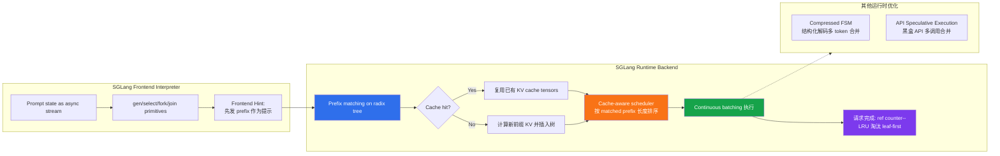

# 精读笔记：SGLang — Efficient Execution of Structured Language Model Programs (NeurIPS 2024)

---

## ▎第一层 · 基本信息

| 字段 | 内容 |
|------|------|
| **论文** | Zheng, Yin, Xie, Sun, Huang, Yu, Cao, Kozyrakis, Stoica, Gonzalez, Barrett, Sheng. *SGLang: Efficient Execution of Structured Language Model Programs.* NeurIPS 2024. |
| **来源级别** | CCF-A 会议论文（Stanford + UC Berkeley + 上海交大 + Texas A&M；第一/通讯作者同属 LMSYS/Chatbot Arena 团队，vLLM 核心作者群） |
| **链接** | arXiv:2312.07104v2 / 代码 https://github.com/sgl-project/sglang / 本地 PDF：`opening/literature/reference/sglang_neurips2024.pdf` |
| **阅读日期** | 2026-07-23 |
| **状态** | 精读完成 |
| **相关论文组** | LLM 推理服务 / KV cache 复用 / 结构化解码 / vLLM 生态 / 上游 prefix grouping 参考 |

### 一句话核心结论

SGLang 面向"多调用、含控制流、结构化输入输出"的 LM Program 场景，提出 **RadixAttention**——用 radix tree 统一管理所有请求的 KV cache 并以 LRU 淘汰 + cache-aware 调度（longest-shared-prefix-first）实现自动前缀复用，配合 **compressed FSM** 加速结构化解码，在多调用工作负载上实现最高 6.4× 吞吐（LLaVA-v1.5-7B 图像，Table 2）、cache 命中率达 50%~99%、调度命中率达到理论最优的 96%（§6.2，Fig. 13）。

`#LLM-inference` `#KV-cache-reuse` `#RadixAttention` `#prefix-sharing` `#cache-aware-scheduling` `#structured-decoding` `#NeurIPS2024`

---

## ▎第二层 · 论文结构分析

### 1. 问题拆解

| 问题 | 论文的回答 |
|------|-----------|
| 要解决什么痛点？ | LLM 应用正从"单轮聊天"转向"程序化使用"——一个任务要多次 LLM 调用、含控制流、结构化 I/O（§1）。现有推理引擎（vLLM/TGI/TRT-LLM）**不感知 workload**，把每个请求当独立请求重算 KV cache，导致共享前缀（system prompt、few-shot examples、chat history）被反复重算 |
| 之前的方法为什么不够？ | vLLM [23] 与 ChunkedAttention [58] 只支持简单共享（如 system prompt），需手工配置，无法处理多级树状共享；PromptCache [12] 支持非前缀模块化复用但精度最多掉 43%；HydraGen [18]/FlashInfer [59] 只做 kernel 优化、无 LRU cache 概念（§7）。即没有一个系统能自动处理 few-shot / self-consistency / multi-turn / tree-of-thought 四类共享模式（Fig. 9） |
| 论文的**核心论点** | 把 KV cache 当作**传统 cache**（而非请求私有资源）来管理：用 radix tree 做前缀索引 + LRU 淘汰 + cache-aware 调度，就能在运行时自动捕获所有复用模式，零手工配置 |
| 它的**关键假设** | (1) LM program 的多调用之间确实存在大量可共享 token 前缀（§3 假设，由 Fig. 9 四例佐证）；(2) GPU 内存可被 cache 与运行请求**共享同一池**动态分配（§3）；(3) **精确 token 序列匹配**足以捕获绝大多数复用（不支持模糊/语义匹配，§8 列为 future work） |

### 2. 方法拆解

**核心技术要点**：

1. **RadixAttention（radix tree + LRU + 共享内存池）**（§3, Fig. 3）：
   - radix tree 是经典 trie 的空间高效变体——边可以标注**任意长度的 token 序列**而非单 token，显著降低树高与查找开销。
   - KV cache tensors 以 **non-contiguous paged layout** 存储（page size = 1 token），与 vLLM PagedAttention 的分页思想兼容。
   - **LRU 淘汰 leaf-first**：先淘汰最近最少使用的叶子节点，使祖先节点尽可能被后续请求复用，直到祖先自己也变叶子才被淘汰。
   - **Reference counter**：continuous batching 下，每个节点维护"当前运行 batch 中有多少请求在用我"的计数；ref > 0 的节点不可淘汰。
   - 关键设计：**不预分配固定 cache 池**——cached tokens 与运行中请求**共享同一内存池**。当等待队列足够长时，系统宁可淘汰所有 cache 也要换更大 batch size；反之空闲内存自动变成 cache。这是一个隐式的"cache vs batch size"权衡，由内存压力动态驱动。

2. **Cache-aware scheduling（longest-shared-prefix-first = DFS order）**（§3, Alg. 1, Thm 3.1）：
   - batch 处理模式：对等待队列中所有请求先做 `T.match_prefix()`，按 **matched prefix 长度降序**排序，优先调度共享前缀最长的请求。
   - **Theorem 3.1（offline 最优性）**：当 cache size ≥ 最大请求长度时，按 radix tree 的 **DFS 顺序**访问可实现最优 cache hit rate；而 longest-shared-prefix-first 等价于 DFS。证明思路：DFS 下每条边 e 的 KV cache 恰好计算一次，达到计算复杂度下界 Σ|e|（§A.3）。
   - 在线场景：DFS 顺序会被新请求打断，但调度器在"增量 radix tree"上仍近似 DFS 行为（§A.3 给出了 C^(0)→C^(1)→…→C^(k) 的归约论证）。
   - **诚实承认**：greedy cache-aware scheduling 可能导致**starvation**，与公平调度的结合列为 future work（§3 末，引用 [42]）。

3. **Frontend-runtime co-design（Frontend Hint）**（§3）：
   - frontend interpreter 向 runtime 发送完整 prompt，但 `fork` 时**先把 prefix 作为 hint 发送**确保正确插入树，再发剩余部分。
   - 消融（Fig. 8c "No Frontend Hint"）显示关闭 hint 会导致性能下降——说明前端语言与运行时的协同设计是 RadixAttention 发挥作用的前提。

4. **Compressed FSM（结构化解码加速）**（§4, Fig. 4）：
   - 现有系统把 regex 转 FSM 后，每步只能解码 1 token（因 FSM 与 model runner 未集成）。
   - SGLang 识别 **singular transition edge**（源节点只有一个后继 + 只有一个可接受字符），递归合并连续 singular edge 为一条 **compressed edge**，使得 `{"summary": "` 这类常量序列可在**单次 forward pass** 中整体跳过（Jump Forward）。
   - 需要对 compressed edge 文本**重新分词（retokenization）**以对齐 LLM tokenizer（§B.2），有轻微开销。
   - 诚实标注局限：compressed edge 会造成**概率扭曲**（§B.3），是 future work。

5. **API speculative execution**（§5）：针对 GPT-4 等黑盒 API 模型，第一次 `gen` 忽略 stop 条件多生成若干 token，后续 primitive 匹配复用，省掉重复 input token 费用（约 3× 成本降低，§6.2）。

### 3. 实验拆解

| 维度 | 内容 |
|------|------|
| **数据集/Workload** | 12 类工作负载：5-shot MMLU、20-shot HellaSwag、ReAct agent、Generative agent、Tree-of-thought (GSM-8K)、Skeleton-of-thought、LLM Judge (branch-solve-merge)、JSON decoding、Multi-turn chat (short/long, 4 轮)、DSPy RAG pipeline；multi-modal 用 llava-bench-in-the-wild (image) + ActivityNet (video) |
| **Baseline** | Guidance v0.1.8 (llama.cpp 后端)、vLLM v0.2.5 (默认 API server)、LMQL v0.7.3 (HF Transformers 后端)。**注意脚注 3**：因 RadixAttention 已被部分集成为 vLLM 实验特性，对比用了**更早的 vLLM 版本**以关闭该特性 |
| **评价指标** | **Throughput**（programs/s，最大批量吞吐）+ **Latency**（单程序串行执行平均延迟）+ **Cache hit rate**（cached prefill tokens / total prefill tokens）+ **Overhead**（ShareGPT 无复用场景的纯管理开销）。**Missing**：未报告方差/置信区间；无 tail latency（P99 TTFT/TBT）拆分；未报告不同 prefix 重叠度分布下的敏感性 |
| **消融实验** | ✅ RadixAttention 组件消融（Fig. 8c：No Cache / No Tree-Structure / FCFS / Random Schedule / No Frontend Parallelism / No Frontend Hint / Full）；cache hit rate vs 延迟/吞吐关系（Fig. 8a/b，通过部分禁用 matched tokens 获得）；compressed FSM 消融（§6.3，1.6× 提升 + preprocessing 复用重要性）；overhead 实验（§6.3，ShareGPT 100 请求 74.3s 中仅 0.2s 管理开销 = <0.3%） |
| **统计显著性** | ❌ 未报告方差/置信区间（但跨 12 workload + 4 模型规模 + 2 硬件类型趋势一致） |
| **复现条件** | 🟢 完全开源（GitHub: sgl-project/sglang）；PyTorch + FlashInfer CUDA kernel + Triton；硬件 A10G (24GB) / A100G (80GB)；DSI 为独立 DSPy 集成 |

### 4. 关键数字

| Claim | 数字 | 条件（什么设置下） |
|-------|------|-------------------|
| 最大吞吐提升 | **6.4×** | LLaVA-v1.5-7B 图像（1.15 vs 0.18 image/s，Table 2）；文本工作负载（Fig. 5/6）最高达 6.4×、延迟最多降 3.7×（§6.2，具体 benchmark 未逐一列出） |
| Video 吞吐提升 | **5×** | LLaVA-NeXT-34B（0.10 vs 0.02 frame/s，Table 2） |
| Cache hit rate 范围 | **50%~99%** | 12 个 text benchmark（§6.2） |
| 调度命中率 vs 理论最优 | **平均 96%** | cache-aware scheduling 达到的 hit rate 占 Thm 3.1 最优 hit rate 的比例（Fig. 13） |
| 生产环境命中率 | 52.4%（LLaVA-Next-34B）/ 74.1%（Vicuna-33B） | Chatbot Arena 部署 1 个月（§6.2） |
| 生产环境首 token 延迟改善 | **1.7×** | Vicuna-33B（§6.2） |
| Compressed FSM 提速 | **1.6×** | JSON decoding benchmark（§6.3） |
| RadixAttention 管理开销 | **<0.3%**（0.2s / 74.3s） | ShareGPT 100 请求无任何 KV 复用场景（§6.3） |
| API speculative execution 成本节省 | **~3× input token** | OpenAI GPT-3.5 提取 3 个字段（§6.2） |

---

## ▎第三层 · 批判性评估

### 1. 假设检验

- **假设 1**：**精确 token 序列匹配**足以捕获绝大多数前缀复用机会
  - 反例 / 边界：当多个请求语义相似但 token 序列不同（如同义 system prompt 的不同措辞、不同 tokenizer 版本、空格/标点差异），radix tree 无法命中。论文在 §8 明确把"fuzzy semantic matching within RadixAttention"列为 future work。在数据库 AI 算子场景下，若 system prompt 由不同应用层拼装（带动态变量、时间戳），前缀可能被这些变量打断，命中率会骤降。
- **假设 2**：Theorem 3.1 的最优性依赖 **cache size ≥ 最大请求长度**
  - 反例 / 边界：论文证明（§A.3）显式假设 cache 足够大使得遍历子树期间边 e 不会被淘汰。在生产环境（Chatbot Arena 52.4% 命中率）实际命中率远低于理论最优——部分原因正是内存压力下的淘汰。脚注 2 也承认：实际计算与证明不同，因为"unpredictable number of output tokens can cause the recomputation of the KV cache"。
- **假设 3**：**LRU + leaf-first eviction** 是合适的淘汰策略
  - 反例 / 边界：LRU 假设"最近用过的最可能再用"，但在 batch 式离线工作负载中（如本课题的数据库批量 AI 算子），同一批数据按表扫描顺序进入，前缀访问可能是 **scan-pattern 而非 recency-pattern**。此时 LRU 可能淘汰掉下一批马上要用的前缀。论文未对比 FIFO / LFU / scan-resistant 策略。
- **假设 4**：**greedy longest-prefix-first 调度**不会饿死请求
  - 反例 / 边界：论文自己承认会导致 starvation（§3 末）。对于短前缀请求（如独特问题），可能被长前缀请求（如共享 system prompt 的批量请求）无限延后——在本课题场景下，这意味着"无 system prompt 的裸 AI_EMBED 请求"可能被"带长 system prompt 的 AI_COMPLETE 请求"饿死。
- **假设 5**：测试工作负载（多调用 LM program）能代表真实部署
  - 反例 / 边界：12 个 benchmark 全部是**多调用、强前缀共享**的 LM program（few-shot、self-consistency、tree-of-thought）。对于**单次调用、无前缀共享**的工作负载（如本课题的 AI_EMBED 对独立文档批量 embedding），RadixAttention 退化为零命中 + <0.3% 开销——论文测了这一点（§6.3 ShareGPT），但未深入讨论"何时 RadixAttention 无收益"的判据。

### 2. 边界探查

- **方法适用边界**：RadixAttention 的收益与 **prefix 重叠度**强相关。当请求间无共享前缀（独立 embedding、一次性问答）时，收益接近 0（仅有 <0.3% 开销）。论文 Fig. 8(a)(b) 用 tree-of-thought 证明 cache hit rate 与延迟/吞吐的单调关系，但未给出"hit rate 低于多少时 RadixAttention 不值得开"的阈值——尽管 §6.3 结论"可以 default 开启"基于"overhead 可忽略"，但这是工程便利而非性能论证。
- **扩展性限制**：(a) 长上下文（100K+ token）下，radix tree 单节点存储的 KV tensor 体积膨胀，CPU 端树维护虽线性复杂度，但 GPU 端内存压力会让淘汰更激进，命中率下降；(b) 多租户场景下不同应用的 system prompt 差异大，meta-tree（§A.4）的 router 调度会成为瓶颈，论文只测了 4 worker 线性扩展；(c) **fuzzy matching 缺失**意味着 RAG 场景下不同 retrieved context 拼接出的 prompt 几乎无前缀共享。
- **复现难度**：🟢 代码全开且活跃维护（sgl-project/sglang）。但脚注 3 揭示一个重要事实：**RadixAttention 已部分回流到 vLLM 作为 experimental feature**——这意味着如果用最新 vLLM 做 baseline，SGLang 的相对优势会被缩小。复现论文原数字需要锁定 vLLM v0.2.5。

### 3. 可信度评估

| 维度 | 评价 | 依据 |
|------|------|------|
| 实验公平性 | 🟡 有疑点 | 脚注 3 承认对比 vLLM 时用了**更早版本**以关闭 prefix caching——这放大了 SGLang 优势。若用 vLLM 的 APC（automatic prefix caching）对比，差距会缩小。此外 Guidance/LMQL 后端（llama.cpp/HF Transformers）本身比 vLLM 慢，部分 "6.4×" 收益来自 backend 差异而非算法 |
| 结果显著性 | 🟢 显著 | 跨 12 workload + 4 模型规模（7B~70B + MoE + multi-modal）趋势一致；Chatbot Arena 生产数据（52.4%/74.1% 命中率）提供了真实部署佐证 |
| 开源/可复现 | 🟢 全开 | 完整代码 + 活跃社区 + Chatbot Arena 生产部署 |
| 论文自身局限 | 🟢 诚实 | 明确列出 starvation、fuzzy matching、multi-level memory hierarchy、probability distortion 等 future work；脚注坦诚 vLLM 已部分集成；Theorem 3.1 脚注承认在线与离线计算的差距 |

### 4. 与同行工作的对比

- 比 **vLLM (Kwon et al., SOSP 2023)**：vLLM 的 PagedAttention 解决的是 KV cache 的**内存碎片**问题（分页管理），默认**请求结束后丢弃 KV cache**；SGLang 的 RadixAttention 解决的是 KV cache 的**跨请求复用**问题（radix tree + LRU）。两者正交——SGLang 明确声明兼容 PagedAttention（§3）。注意：现代 vLLM 已将 prefix caching 作为 APC（automatic prefix caching）内置，采用 hash-based 匹配，是 RadixAttention 思想的简化回流。
- 比 **Orca (Yu et al., OSDI 2022)**：Orca 提供 continuous batching（iteration-level scheduling），SGLang 的 Alg. 1 是**在 continuous batching 之上**叠加 cache-aware 排序——两者是"调度框架 vs 调度策略"的关系。
- 比 **PromptCache (Gim et al., 2023)**：PromptCache 支持非前缀的模块化 KV 复用，但精度最多掉 43%；RadixAttention 只做严格前缀复用但精度无损。
- 比 **HydraGen (Juravsky et al., 2024)**：HydraGen 也做 shared prefix 复用，但聚焦 CUDA kernel 层（shared prefix kernel vs separate kernel），无 LRU cache 与调度策略。
- 比 **Preble (Srivatsa et al., 2024)**：Preble 研究的是 **data-parallel 分布式 prompt 调度**，论文 §A.4 的分布式 RadixAttention 是其早期基础——Preble 是 SGLang 分布式路由的后续专门工作。
- 在 **[本课题]** 的坐标系中：SGLang 属于 **LLM 推理服务内部的 KV cache 复用优化**——它在 runtime 层决定"哪些请求的 KV cache 可以共享"。本课题处于**推理服务上游**：决定数据如何从数据库组织成请求、以什么节奏到达推理服务。两者处于"推理服务内外两侧"：SGLang 在服务内部做 cache 感知调度，本课题在上游做 prefix 感知分组——上游分组可以让"到达推理服务的请求序列"天然具有更高前缀重叠度，从而让 SGLang/vLLM-APC 的 cache 命中率从"被动捕获"变为"上游主动构造"。

---

## ▎第四层 · 与你课题的连接

### 1. 可引用的观点（配精确位置）

> §3 RadixAttention：KV cache computation depends only on prefix tokens. Therefore, requests with the same prompt prefix can reuse the KV cache, reducing redundant computation and memory usage.
> → 这是本课题 **RC1 prefix-aware batching 策略**的底层理论支撑：相同 system prompt 的请求共享 KV cache 前缀——数据库表场景下，同一张表的 AI 算子调用通常共享 system prompt（schema 描述、任务指令），这是 prefix-aware grouping 的天然土壤。

> §3 Cache-aware scheduling：we sort the requests by matched prefix length and prioritize requests with longer matched prefixes instead of using a first-come-first-served schedule.
> → 直接的设计模式参考：本课题 RC1 的 prefix-aware grouping 可借鉴"按共享前缀长度排序"的思路——在数据组织阶段就把前缀相同的请求分到同一 batch 提交。

> §3 Theorem 3.1：For a batch of requests, we can achieve an optimal cache hit rate by visiting the radix tree of the requests in the depth-first search order ... The longest-shared-prefix-first order is equivalent to a depth-first search order.
> → 提供了 prefix-aware grouping 的**最优性理论依据**：按 DFS（等价于 longest-prefix-first）组织请求顺序可达到最优 cache 命中率。本课题在上游做 prefix-aware grouping，本质就是把"在线近似 DFS"前移为"离线精确 DFS"——数据来自数据库表，可以在提交前就完整看到一批请求的前缀结构。

> §3 Frontend Hint：During the execution of the fork primitive, the frontend sends the prefix first as a hint, ensuring the prefix is correctly inserted into the tree. This "Frontend Hint" exemplifies the benefits of frontend-runtime co-design.
> → 本课题是"前端-runtime 协同设计"的**极端形式**：上游数据管线（Daft/Ray）就是 SGLang/vLLM 的"超级前端"。如果上游能在提交时主动告知 prefix 结构（如通过 prompt hash、prefix length 元数据），推理服务的 cache 命中率可以从被动捕获变为主动规划。

> §6.2 Production deployment：52.4% RadixAttention cache hit rate for LLaVA-Next-34B and 74.1% for Vicuna-33B ... reduces first-token latency by an average of 1.7×.
> → 生产级真实数据：即使在没有上游 prefix 感知的 Chatbot Arena 流量下，RadixAttention 仍有 52%~74% 命中率。这反向证明：如果上游主动做 prefix-aware grouping，命中率有显著上行空间——这是本课题 RC1 的价值锚点。

> §6.3 Overhead：The time used for managing the RadixAttention data structures is only 0.2 seconds ... a negligible overhead of less than 0.3%. Thus, we can turn on RadixAttention by default.
> → 支持"prefix 感知机制即使命中率低也几乎无代价"——本课题在上游做 prefix grouping 的排序/分组开销同样应是线性复杂度，不应成为瓶颈。

> §A.4 Data-Parallel Distributed RadixAttention：the router oversees a meta-tree ... We implement various policies based on each request's affinity—measured by the length of the shared prefix with specific workers.
> → 本课题 RC2 的 **actor pool 分池路由**策略可直接借鉴"基于 prefix affinity 的请求路由"：把共享 prefix 的请求路由到同一 actor/worker，使该 worker 的局部 radix tree 命中率最大化。

> Fig. 9：四类典型 KV cache 共享模式（few-shot / self-consistency / multi-turn chat / tree-of-thought）。
> → 这是论证"prefix 共享在真实 LM workload 中普遍存在"的核心证据图，可用于开题报告动机部分。

### 2. ⚠️ 不能过度引用的地方

- ❌ **不声称** "SGLang 的 RadixAttention cache 等于本课题的上游 prefix grouping"——两者处于不同层面：RadixAttention 在推理服务**内部**对到达的请求做 cache 感知**调度**（请求已被提交，只是决定执行顺序）；本课题在**上游数据组织侧**做请求**分组与构造**（决定哪些请求组成一个 batch 提交、何时提交）。前者是调度层，后者是数据组织层。
- ❌ **不声称** "本课题会接入/修改 RadixAttention"——本课题明确**不修改 vLLM 内部**（PROJECT_OUTLINE §边界）。RadixAttention 是 SGLang runtime 的内部机制；本课题的部署平台是 vLLM，其对应机制是 APC（automatic prefix caching）。本课题只能在上游让请求序列"更 cache 友好"，不能改写下游 cache 逻辑。
- ❌ **不声称** "SGLang 的 6.4× 提升适用于本课题 workload"——SGLang 评测的是多调用 LM program（few-shot、tree-of-thought、multi-turn chat），有强前缀共享；本课题主场景 AI_COMPLETE（生成式 LLM）和 AI_EMBED（图像 embedding）的前缀共享结构完全不同。特别是 AI_EMBED 的 prompt 通常是对每个文档独立的，前缀共享度可能远低于 SGLang benchmark。
- ❌ **不声称** "SGLang 的 cache-aware scheduling 解决了全部调度问题"——论文自己承认 greedy 调度会导致 **starvation**（§3 末），且 Theorem 3.1 的最优性只在 **offline + cache 足够大**时成立。在线场景只是近似，脚注 2 坦承"unpredictable output tokens cause recomputation"。
- ❌ **不声称** "RadixAttention 的 LRU 淘汰对数据库批量场景最优"——LRU 假设 recency 局部性，但数据库表扫描式批量请求的访问模式可能是 scan-pattern，LRU 可能不如 scan-resistant 策略。论文未测试此类 workload。

### 3. 对本课题的实际用途

| 用途类型 | 具体方式 | 优先级 |
|----------|----------|--------|
| ✅ 设计参考 | **prefix-aware grouping 策略**（RC1）：借鉴 cache-aware scheduling 的"按 matched prefix 长度排序"思路，在数据组织阶段把共享 system prompt 的请求分到同一 batch。Theorem 3.1 的 DFS 最优性为本课题的离线 prefix grouping 提供**理论基准**——上游可做到 SGLang 在线调度做不到的"精确 DFS" | ⭐⭐⭐ |
| ✅ 设计参考 | **actor pool 分池路由**（RC2）：借鉴 §A.4 的"基于 prefix affinity 路由到 worker"，把共享 prefix 的请求路由到同一 actor，使该 actor 对应的 vLLM APC 局部命中率最大化 | ⭐⭐⭐ |
| ✅ Baseline 对照区分 | 本课题不修改 vLLM，但 vLLM 的 APC（由 RadixAttention 思想回流而来）是事实上的 prefix caching baseline。需要在实验中说明：本课题的 upstream grouping 与 vLLM APC 是**互补**关系（上游提升 APC 命中率），而非替代 | ⭐⭐⭐ |
| ✅ 动机证据 | 生产数据（52.4%/74.1% 命中率）证明 prefix 共享在真实流量中普遍存在且收益显著（1.7× 首 token 延迟）——支撑本课题做 prefix-aware grouping 的必要性 | ⭐⭐ |
| ✅ 代价估计 | §6.3 的 overhead 数据（<0.3%）可作为"prefix 感知机制的线性开销可忽略"的证据，用于本课题算子代价估计模块 | ⭐⭐ |
| ⚠️ 对照区分 | SGLang 在推理服务内部做 cache-aware 调度，本课题在上游做 prefix-aware grouping——两者层面不同，需在报告中明确区分，避免被误读为"重复工作" | ⭐⭐ |

### 4. 不足 → 你的机会

| 论文的不足 / 未回答的问题 | 你的课题可能如何填补 |
|--------------------------|---------------------|
| RadixAttention 是**在线、被动**捕获前缀复用——请求到达后才发现能否命中 | 本课题在**上游离线**组织数据时就能完整看到一批请求的前缀结构（数据库表 + schema），可做 SGLang 做不到的**精确 DFS 离线排序**（Theorem 3.1 的最优解） |
| Greedy cache-aware scheduling 会 **starvation**（论文自承认） | 本课题上游分组可以在提交时就保证公平性——把短前缀请求和长前缀请求按比例混合组 batch，从源头避免下游 starvation |
| 仅支持**精确 token 匹配**，不支持 fuzzy/semantic matching | 数据库场景下，同一张表的 AI 算子调用天然共享结构化 system prompt（schema 描述 + 任务指令固定），精确匹配命中率本就高——这是数据库 AI 负载相对于一般 LLM 服务的独特优势 |
| LRU 淘汰假设 **recency 局部性**，未针对 batch scan-pattern 优化 | 本课题的数据库批量场景是 scan-pattern，可设计 **scan-aware 淘汰/预取**策略，让即将到来的请求前缀提前进 cache |
| 评测未报告 prefix 重叠度分布对命中率的敏感性 | 本课题可设计消融：人工构造不同 prefix 重叠度（0%/25%/50%/75%/100%）的数据集，量化 upstream grouping 对下游 vLLM APC 命中率的提升曲线 |
| 不感知数据来源（请求是否有 schema 约束、是否来自同一表） | 本课题数据来自 PostgreSQL 表，schema 信息可直接指导 prefix grouping（如按 `table_name + operator_type` 分组） |

### 5. 可论文化的措辞

> Zheng et al. [SGLang, NeurIPS 2024] 提出的 RadixAttention 通过 radix tree 与 cache-aware scheduling 在推理服务内部实现了自动 KV cache 前缀复用，生产部署中达到 52%~74% 的命中率。然而，RadixAttention 的工作前提是请求**已经到达**推理服务——它只能被动捕获前缀复用机会，无法在请求提交前主动组织。本课题将前缀感知前移至数据组织阶段：利用数据库表 schema 和 AI 算子调用的结构化特征，在上游按 system prompt 前缀对请求分组，使到达推理服务的请求序列天然具有更高前缀重叠度，从而将 SGLang 在线近似 DFS 调度升级为离线精确 DFS（Theorem 3.1 的最优解）。

> 与 SGLang [Zheng et al., 2024] 在推理引擎内部修改 cache 管理不同，本课题不修改 vLLM 内部，而是在上游数据管线中做 prefix-aware grouping。两者的关系是互补而非替代：上游 grouping 提升了 vLLM automatic prefix caching 的命中率，而 vLLM APC 将上游构造的前缀结构实际转化为 KV cache 复用收益。

> SGLang 的消融实验（Fig. 8c）表明，关闭 frontend hint 或 frontend parallelism 均导致性能下降，验证了前端-运行时协同设计的必要性。本课题将这一协同推到极致：上游数据管线（Daft + Ray）本身就是推理服务的"超级前端"，通过在提交时主动构造 prefix 友好的请求序列，实现比 SGLang frontend hint 更强的协同。

### 6. 后续待读

- [ ] **Preble** (Srivatsa et al., 2024) [45] — 分布式 prompt 调度，基于 SGLang 早期版本的 §A.4 扩展；与本课题 RC2 actor pool 分池路由直接相关
- [ ] **vLLM** (Kwon et al., SOSP 2023) [23] — PagedAttention 原论文；需配套阅读 vLLM APC（automatic prefix caching）的设计文档，理解 RadixAttention 思想回流后的简化形式
- [ ] **HydraGen** (Juravsky et al., 2024) [18] — shared prefix 的 kernel 层优化，与本课题 prefix-aware grouping 的下游收益计算相关
- [ ] **PromptCache** (Gim et al., 2023) [12] — 非前缀模块化 KV 复用，了解 prefix-only 路线的边界
- [ ] **APIServe** (Abhyankar et al., 2024) [1] / **LLM-SQL** (Liu et al., 2024) [29] — 论文 §7 提到的"KV cache 复用于关系数据库 / 外部 API 调用交错"的并发工作，与本课题数据库场景最接近
- [ ] **Fairness in LLM Serving** (Sheng et al., 2024) [42] — SGLang starvation 问题的公平调度解法，可能用于本课题上游公平性保障

---

## 元反思

- **精读收益**：🟢 高（RadixAttention 是本课题 RC1 prefix-aware grouping 策略最直接的设计参考，Theorem 3.1 提供了离线最优性理论基准，§A.4 的分布式路由直接对应 RC2 actor pool 分池路由）
- **是否纳入核心文献库**：是
- **计划复习周期**：2 周后复习（与 RC1 prefix-aware grouping 实现设计前的重读同步；需配套确认 vLLM APC 当前实现细节）
- **一句话自评**：理解到位。这篇论文与本课题的关系是"推理服务内部 cache 感知调度 vs 上游 prefix 感知分组"——两者互补，SGLang 被动捕获、本课题主动构造。核心收获：(1) Theorem 3.1 的 DFS 最优性给了本课题上游离线 prefix grouping 的理论锚点；(2) 生产命中率数据（52%~74%）是 prefix-aware 策略必要性的最强证据；(3) 必须严格区分"cache 层（SGLang/vLLM-APC）"与"数据组织层（本课题）"，避免在报告中把两者混为一谈。待确认的是 vLLM APC 相对 RadixAttention 的具体简化（hash-based vs tree-based），这影响本课题实验中 baseline 的设置。

---

## 相关笔记

- [[sarathi_serve_osdi2024]] — 同属推理服务内部调度优化，chunked-prefills 与 token-budget 概念与本课题 RC1 互补
- [[tpl-文献精读-深度版]] — 本模板
- [[文献地图]] — 文献全景
- [[ai_operator_literature_inventory]] — 完整文献清单
