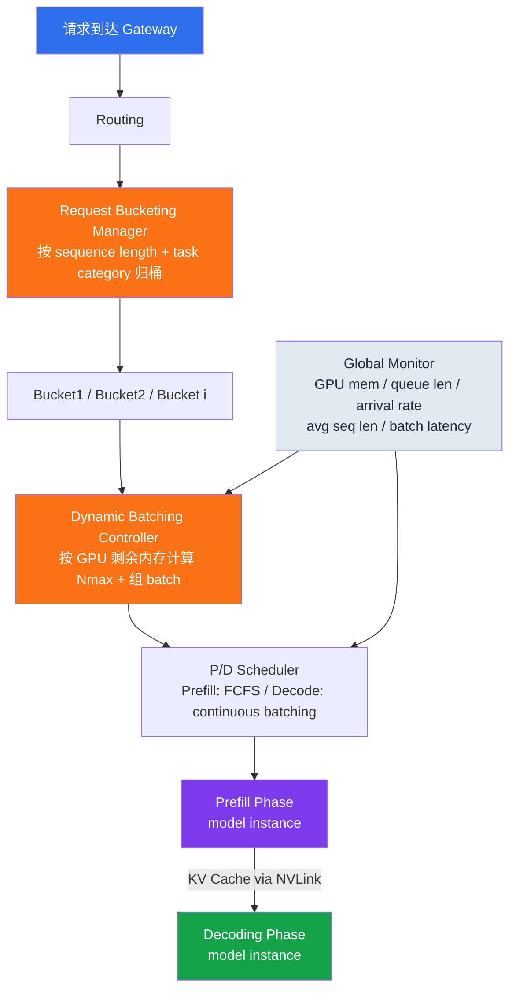
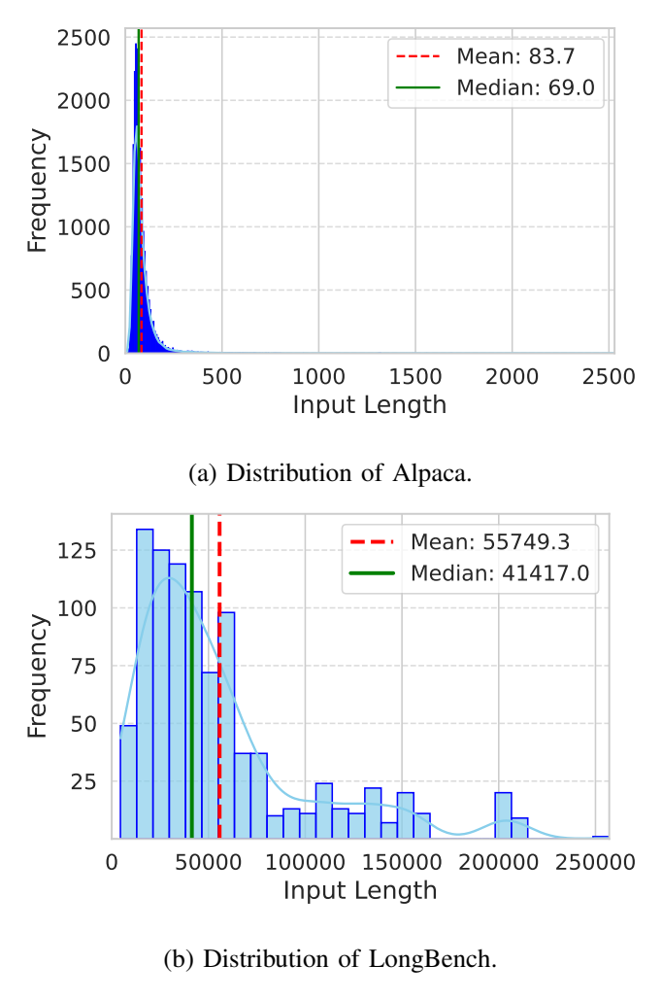

# 精读笔记：BucketServe — Bucket-Based Dynamic Batching for Smart and Efficient LLM Inference Serving (arXiv 2025)

---

## ▎第一层 · 基本信息

| 字段 | 内容 |
|------|------|
| **论文** | Zheng, Xu, Song, Ye. *BucketServe: Bucket-Based Dynamic Batching for Smart and Efficient LLM Inference Serving.* arXiv:2507.17120v1 [cs.DC], Jul 2025. |
| **来源级别** | arXiv 预印本（未明确标注已被会议录用；采用 IEEE 会议格式，疑似在投）。南方科技大学 + 中科院深圳先进技术研究院 |
| **链接** | https://arxiv.org/abs/2507.17120 / 本地 PDF：`research/reference/bucketserve_2025.pdf` |
| **阅读日期** | 2026-07-23 |
| **状态** | 精读完成 |
| **相关论文组** | LLM 推理服务调度 / Disaggregated 架构 / Length-aware batching / vLLM 生态 |

### 一句话核心结论

BucketServe 在 disaggregated（prefill/decode 分离）架构上，通过**按 sequence length 自适应分桶**（adaptive bucketing，请求进入 serving 系统的 middleware 层时按长度归入 size-homogeneous bucket）、**动态 batch size 调整**（基于 GPU 剩余内存反推最大安全 batch）和**桶内优先级调度**（offline 用 SJF/LJF，online 用 FCFS by arrival），减少 padding 浪费并提升 GPU 利用率；在 Mixed workload（Alpaca + LongBench）下吞吐相对 UELLM 提升最高 **3.58×**，在 80% SLO attainment 下承载的 server RPS 相对 DistServe 高 **1.93×**（Mixed 数据集），分桶开销 < 1%。

`#LLM-inference` `#length-aware-batching` `#adaptive-bucketing` `#padding-reduction` `#disaggregated-serving` `#dynamic-batching`

---

## ▎第二层 · 论文结构分析

### 1. 问题拆解

| 问题 | 论文的回答 |
|------|-----------|
| 要解决什么痛点？ | Disaggregated 架构（DistServe 类）虽消除了 prefill/decode 干扰，但在**异构 sequence length** workload 下，混合 batch 导致大量 padding 浪费 GPU 内存与算力；且静态分桶/连续 batching 难以适应 workload 动态波动，高并发下 SLO 违规 |
| 之前的方法为什么不够？ | (1) 静态 batching 在异构长度下 padding 严重；(2) 连续 batching（Orca/vLLM）解决了动态插入但未解决长度异构的 padding；(3) DistServe 消除了阶段干扰但"lacks specialized process"导致异构 workload 下表现次优（§V-B）；(4) UELLM 仍耦合 prefill/decode 且缺乏对 workload 波动的动态适应 |
| 论文的**核心论点** | 按 sequence length 把请求分入 size-homogeneous bucket，每个 bucket 内的 batch 因长度相近而 padding 最小化；bucket 边界随负载动态分裂/合并，batch size 随 GPU 剩余内存动态调整，从而同时优化吞吐、利用率和 SLO |
| 它的**关键假设** | (1) 请求的 input sequence length 在到达时已知（prefill 输入静态，成立）；(2) padding 是异构 batch 的主要浪费来源（Fig. 3b 支持：Long workload decoding 利用率仅 24%）；(3) bucket 中点二分能近似 Eq. (4) 的条件期望最优边界；(4) 分桶开销远小于推理开销（实测 <1%，§V-B） |

### 2. 方法拆解

**核心技术要点**：

1. **自适应分桶（Adaptive Bucketing, Algorithm 1）**：系统初始只有一个桶 `[0, Lmax)`。请求按 sequence length 归入对应桶。当总请求数超过 `Nmax` 时触发分裂：对每个桶，若超过 50% 的请求落在中点 `mb = (blow+bup)/2` 以下**且**桶内请求数 > `Nmax`，则在中点处一分为二（lines 14-29）。当总数跌回 `Nmax` 以下，所有桶合并回单一桶（lines 11-13）。中点二分是对 Eq. (4) 理论最优边界（条件期望）的轻量近似。整体复杂度 `O(n·k + 4k)`（§IV Algorithm Complexity Analysis）。

2. **内存安全的动态 batch size（Eq. 1, 5, 6）**：KV cache 内存占用 `Memory_KV = 2·L·H·D·Smax·B·N`（L=层数，H=注意力头数，D=每头维度，Smax=batch 内最大序列长度，B=每元素字节数如 FP16 为 2，N=batch size）。系统预留 10% 内存给系统开销：`Msafe = 0.9·Mremain`（Eq. 5）。最大安全 batch size 反推为 `Nmax = max N s.t. Σ N_i ≤ Msafe/(2LHDB)`（Eq. 6），保证 KV cache 不 OOM。

3. **Padding 浪费的形式化（Eq. 2, 3, 4）**：定义浪费率 `WasteRatio = (Smax − Savg)/Smax`（Eq. 2）；跨所有桶的期望浪费率 `E[Waste] = 1 − Σ_b ∫_{Lb}^{Ub} S·f(S)dS / (Σ_b Ub·∫_{Lb}^{Ub} f(S)dS)`（Eq. 3）。最小化 E[Waste] 的最优桶边界是 sequence length 的**条件期望** `Ub* = ∫_{Lb}^{Ub*} S·f(S)dS / ∫_{Lb}^{Ub*} f(S)dS`（Eq. 4）。分桶通过缩小桶内 `Smax − Savg` 来降低浪费。

4. **Phase-aware 调度（§III, §IV）**：Prefill 阶段对**静态输入**用桶内 SJF（吞吐优先时最短作业先出发，降低排队延迟）或 LJF（token/s 优先时长作业先，最大化 decode 并行）；Decode 阶段对**动态输出**用 continuous batching（新 token 即时插入，不等整批）。Online 任务按最早到达时间优先以满足 SLO。P/D 之间通过 NVLink 传 KV cache。

### 3. 实验拆解

| 维度 | 内容 |
|------|------|
| **数据集** | Stanford Alpaca（短序列，mean **83.7** tokens, median 69.0）+ LongBench（长文本摘要，mean **55749.3** tokens, median 41417.0）+ Mixed（两者混合，长尾分布）。超长序列截断到模型上限。**公开数据集** |
| **Baseline** | **UELLM**（ICSOC 2024，aggregated 架构，用微调 LLM 预测资源需求做 batching，仍耦合 P/D）+ **DistServe**（OSDI 2024，disaggregated 架构，co-optimize 资源分配）。两者均为近年 SOTA，非 strawman |
| **评价指标** | Offline：throughput（tokens/s）+ 平均 GPU 利用率；Online：SLO attainment rate + server load capacity（RPS）。**缺失指标**：未报告 TTFT/TBT 分位数（只看 SLO attainment 比例）、未报告方差/置信区间、未报告端到端延迟分布 |
| **消融实验** | 🔴 **几乎缺失**。论文未做"分桶 vs 不分桶""SJF vs LJF""分裂阈值 ε 敏感性""桶数量影响"等组件级消融。Fig. 6b 只展示了分桶开销随桶数（1-8）稳定，但不是策略消融。这是本文最大的实验严谨性短板 |
| **统计显著性** | 🔴 未报告方差/置信区间/多次重复。所有数字疑似单次运行 |
| **复现条件** | 🟡 未提及代码开源（待确认）。需 4× A100 40GB + NVLink + vLLM backend。基于 vLLM **修改**（"Built upon vLLM, extends its capabilities"） |

### 4. 关键数字

| Claim | 数字 | 条件 |
|-------|------|------|
| 吞吐提升 vs UELLM | **3.58×** | Llama2-13B, Mixed workload, 高 batch（§V-B, Fig. 5a） |
| 吞吐提升 vs DistServe | **1.31×** | 同上（§V-B） |
| 平均 GPU 利用率 | **81.66%**（BucketServe）vs 68.45%（DistServe）vs 57.87%（UELLM） | Mixed workload（Fig. 5b） |
| 80% SLO attainment 下 server RPS 提升 vs DistServe | **1.37×**（Alpaca）/ **1.93×**（Mixed） | Llama2-13B（Fig. 5c, 5d, §V-B） |
| Server RPS 提升 vs UELLM | **1.975×**（Alpaca）/ **3.47×**（Mixed） | 高并发（Fig. 5e, 5f, §V-B） |
| Server RPS 提升 vs DistServe（Mixed） | **1.4×** | Fig. 5f, §V-B |
| 分桶开销占总执行时间 | **< 1%** | RPS ≤ 32, 桶数 1-8（Fig. 6a, 6b, §V-B） |
| Decode 阶段时间占比 | **~90%** | 典型 workload（Fig. 6a, §V-B） |
| Long workload decoding GPU 利用率 | **24.0%**（vs prefill 97.0%） | LongBench 长 batch（Fig. 3b）—— 说明长度异构下 decode 利用率极低，是分桶动机 |
| 算法复杂度 | **O(n·k + 4k)** | n=请求数, k=桶数（§IV Algorithm Complexity Analysis） |

---

## ▎第三层 · 批判性评估

### 1. 假设检验

- **假设 1**：中点二分 `mb = (blow+bup)/2` 近似 Eq. (4) 的条件期望最优边界
  - 反例 / 边界：若桶内 sequence length 分布严重偏态（如大量短请求 + 少量极长请求），中点落在稀疏区，分裂后子桶内长度仍不均匀。论文自己也承认这是"simple but efficient approximation"（§IV）且未来工作要探索"distribution-aware methods"（§IV 末）。这是一个**已知但未量化**的近似误差。
- **假设 2**：input sequence length 在请求到达时完全已知
  - 反例 / 边界：对 prefill 成立（prompt 已确定）。但分桶只针对 prefill 阶段；decode 阶段输出长度不可预测，论文对此用 continuous batching 规避，未声称分桶对 decode 有效。这个边界处理是诚实的。
- **假设 3**：`Nmax` 用一次内存计算（Eq. 6）即可保证不 OOM
  - 反例 / 边界：Eq. 6 用 `Smax`（batch 内最大序列长度）计算 KV cache，是保守上界。但实际 batch 中各请求长度不同，真实占用小于 `Smax·N`——这意味着 `Nmax` 被低估，throughput 有进一步压榨空间。论文未讨论这一保守性代价。
- **假设 4**：预留 10% 内存（`Msafe = 0.9·Mremain`，Eq. 5）足够覆盖系统开销
  - 反例 / 边界：10% 是未经论证的 magic number。在更紧的内存配置或更大模型下，10% 可能不够（OOM）或过多（浪费）。论文未做该参数的敏感性分析。
- **假设 5**：分桶 + 动态 batching 是 BucketServe 性能提升的主要原因
  - 反例 / 边界：**由于缺乏消融实验，这一归因无法从论文数据中确认**。DistServe baseline 是否在同一 disaggregated 架构上、是否用相同 GPU 配置、是否公平调参，论文未充分说明。BucketServe 相对 DistServe 的 1.31× 提升可能部分来自架构实现差异而非分桶策略本身。

### 2. 边界探查

- **方法适用边界**：分桶只在 prefill 阶段对**静态输入长度**有效；对 decode 阶段无作用（已诚实声明）。对 sequence length 高度同质的 workload（如所有请求固定长度），分桶退化为单桶，收益消失。Alpaca 短序列场景下相对 DistServe 的优势（1.37×）小于 Mixed 场景（1.93×），正说明异构度越大分桶越有价值。
- **扩展性限制**：(a) 单节点 4× A100，**多节点扩展是未来工作**（§VII），跨节点 KV cache 传输 + 分桶协调的开销未验证；(b) 仅测 Llama2-13B + OPT 系列，**未测更大模型**（如 70B+），大模型下 KV cache 占比更高、Nmax 更小，分桶收益曲线未知；(c) 算法复杂度 `O(n·k)` 在 k 桶数增大时是否仍是瓶颈未测（只测到 8 桶）；(d) priority-aware scheduling 虽在贡献里列出，但实验中**未单独隔离其效果**（待确认是否真的实现并评测）。
- **复现难度**：🟡 论文未提供代码链接（待确认）。基于 vLLM 修改而非纯外挂，复现需 fork vLLM。无方差/无多次运行，单次结果的抖动范围未知。

### 3. 可信度评估

| 维度 | 评价 | 依据 |
|------|------|------|
| 实验公平性 | 🟡 有疑点 | 与 DistServe/UELLM 对比，但未说明三者是否在同一硬件、相同模型并行度、相同调参努力下。BucketServe 基于 disaggregated 架构，与 UELLM（aggregated）对比存在架构代差，3.58× 中多少归因于架构本身、多少归因于分桶不清晰 |
| 结果显著性 | 🟡 勉强显著 | 3.58× vs UELLM 的数字醒目，但 vs 同为 disaggregated 的 DistServe 仅 1.31×（throughput）/1.4×（RPS），且无方差。Mixed 场景 1.93× 是最强结果，但依赖长尾分布假设 |
| 开源/可复现 | 🔴 未提及开源 | 论文未给代码链接，未提及 artifact。待确认 |
| 论文自身局限 | 🟡 部分诚实 | 承认中点二分是近似（§IV）、承认多节点是 future work（§VII），但**未讨论消融缺失**这一关键局限，未讨论 priority scheduling 是否被评测 |

### 4. 与同行工作的对比

- 比 **DistServe (Zhong et al., OSDI 2024)**：BucketServe 复用 DistServe 的 disaggregated 范式，但在 prefill 侧加入 sequence-length 分桶 + 自适应边界，填补 DistServe 在异构 workload 下"lacks specialized process"的空白。差异：DistServe 重点在资源分配 co-optimization，BucketServe 重点在请求分组。
- 比 **Sarathi-Serve (Agrawal et al., OSDI 2024)**：Sarathi-Serve 在**同一 replica 内**用 chunked-prefills + token-budget 解决 prefill/decode 干扰（aggregated 路线）；BucketServe 走 **disaggregated 路线**（prefill/decode 分离到不同 instance）+ 分桶。两者正交：Sarathi-Serve 优化的是单 replica 内的计算量调度，BucketServe 优化的是请求分组。Sarathi-Serve 有扎实的 arithmetic intensity 理论分析和完整消融，BucketServe 的理论分析（padding 浪费形式化）较浅、消融缺失。
- 比 **Orca (Yu et al., OSDI 2022)**：Orca 的 iteration-level batching 解决了动态插入但**不考虑长度异构**导致的 padding。BucketServe 在 Orca 的 continuous batching 基础上叠加长度分桶。
- 比 **UELLM (He et al., ICSOC 2024)**：UELLM 用微调 LLM 预测资源需求做 profiling-based batching，但仍耦合 P/D 且不适应 workload 波动。BucketServe 不依赖预测模型，用规则式分桶，更轻量。
- 在 **[本课题]** 的坐标系中：BucketServe 属于**推理服务内部（middleware 层）的请求调度优化**——它在请求到达 serving 系统后、进入 GPU 前做分组。本课题在推理服务的**更上游**——数据离开数据库后的组织与提交阶段。两者处于请求生命周期的不同阶段：本课题决定请求以什么形态、什么节奏**到达** serving 系统，BucketServe 决定到达后**如何分组执行**。两者的 length-align 思想同源，但作用层面不同。

---

## ▎第四层 · 与你课题的连接

### 1. 可引用的观点（配精确位置）

> §II-B *Dynamic Batching with Prefill Bucketing*：异构 sequence length 分布（Fig. 2，Alpaca mean 83.7 tokens，LongBench median 41417 tokens）说明长度异构是真实工作负载的常态；对 prefill 采用 bucketing-based batching（requests are grouped into size-homogeneous buckets e.g. [0-256 tokens], [256-1024 tokens]）可最小化 padding。
> → 直接支撑本课题 RC1 **length-align 策略**的存在性论证：长度异构普遍存在，按长度分组能减少 padding。但要注意 BucketServe 的分桶发生在 serving middleware，本课题的 length-align 发生在数据组织侧——论证时用"同一设计原则在不同层面的复用"来表述。

> §IV Eq. (2)(3)(4)：`WasteRatio = (Smax − Savg)/Smax` 与跨桶期望浪费率形式化，最优桶边界为 sequence length 的条件期望。
> → **直接可复用为本课题 length-align 的目标函数**。本课题在组织 batch 时可以最小化同样的 `(Smax − Savg)/Smax`，只是优化变量从"serving 内部桶边界"变成"上游请求构造时的行分组"。

> Fig. 3b：Long workload 的 decoding GPU 利用率仅 **24.0%**（prefill 97.0%），说明长度异构 batch 在 decode 阶段严重浪费算力。
> → 这是本课题 RC1 的**动机数据**：如果上游在数据组织阶段就把长度相近的请求分到同一批，serving 系统收到的 batch 已经预对齐，GPU 利用率更高。

> §IV Eq. (6) + Algorithm 1：`Nmax` 由 GPU 安全内存反推，桶边界由中点二分动态调整，整体复杂度 `O(n·k + 4k)`。
> → 为本课题 RC1 的 length-align 提供**轻量实现范式**：不需要复杂预测模型（对比 UELLM），用规则式分组即可。这与项目 CLAUDE.md 中"自适应策略第一版 < 100 行""优先用简单规则"的编码规范一致。

> §V-B：分桶开销 < 1%，decode 阶段占总执行 ~90%。
> → 支撑本课题的工程判断：在上游做 length-align 分组的开销（类似量级的 metadata 操作）相对推理本身可忽略，优化空间在"让每个 batch 更均匀"而非"减少分组开销"。

### 2. ⚠️ 不能过度引用的地方

- ❌ **不声称** "BucketServe 的分桶 = 本课题的上游 length-align"——BucketServe 是请求**到达 serving 系统后**在 middleware 层分组，本课题是数据**离开数据库后**在组织为请求时分组。两者作用层面不同（serving 内部 vs 数据组织上游），只是设计原则同源。
- ❌ **不声称** "分桶隐含了行内拆分"——BucketServe 与本课题都**只在请求/行之间分组**（inter-request / inter-row grouping），不做任何把单条 prompt 拆成多条请求的行内拆分。本课题严格遵循 `code/AGENTS.md` §2 硬性规则：**每行是一个独立完整的 vLLM 请求**，禁止在 Ray actor / Daft UDF 中自动拆分单行 prompt 为多条请求；超长单行只能预处理截断、独占一个 batch 或从数据集排除。这与 vLLM 的 `--enable-chunked-prefill`（token 级数学等价拆分）是完全不同层面的操作。
- ❌ **不声称** "BucketServe 验证了本课题的端到端方案"——BucketServe **修改了 vLLM 内部**（"Built upon vLLM, extends its capabilities"），本课题明确**不修改 vLLM**。BucketServe 还依赖 disaggregated 架构（prefill/decode 分到不同 instance），本课题以 vLLM 单体为部署平台，架构假设不同。
- ❌ **不声称** "3.58× 吞吐提升适用于本课题 workload"——该数字是相对 UELLM（aggregated 架构，代差巨大）在 Mixed workload 下的结果；相对同代 disaggregated 的 DistServe 仅 1.31×。本课题的 baseline 是 vLLM（continuous batching + PagedAttention），与 BucketServe 的对比对象不同。
- ❌ **不声称** "BucketServe 的 priority-aware scheduling 已被验证有效"——论文在贡献中列出该项，但实验中**未单独隔离** priority scheduling 的效果（待确认是否真正实现并评测），不能借它证明本课题 RC2 的调度策略。
- ❌ **不声称** "BucketServe 解决了多模态 / 写回 / 数据库侧组织问题"——它完全是文本 LLM serving 内部机制，不涉及图像、PostgreSQL 写回、数据库 schema。本课题的多模态泛化和写回优化无法从本文获得支撑。

### 3. 对本课题的实际用途

| 用途类型 | 具体方式 | 优先级 |
|----------|----------|--------|
| ✅ 设计参考 | **padding 浪费形式化（Eq. 2/3）直接作为 RC1 length-align 的目标函数**——本课题组织 batch 时最小化 `(Smax − Savg)/Smax`，与 BucketServe 的桶内浪费率定义一致 | ⭐⭐⭐ |
| ✅ 设计参考 | **自适应桶边界算法（Algorithm 1 中点二分）作为 RC1 动态分组的实现范式**——但本课题在数据组织侧做（**Ray actor + Daft pipeline**，而非 vLLM 内部），输入是数据库行而非到达的 HTTP 请求；可复用"总数超阈值则分裂、低于则合并"的规则式自适应逻辑，符合项目"< 100 行、简单规则优先"的编码规范。具体落地路径：策略层只依赖 `BatchRequest` 抽象（`prompt_tokens_sum` / `row_count` / `prefix_key`），不感知底层引擎；引擎层通过 Daft `into_batches` / `batch_size` / `repartition` 参数把分组决策物化为实际 batch | ⭐⭐⭐ |
| ✅ 动机证据 | **Fig. 3b（Long workload decoding 利用率 24%）作为长度异构导致 GPU 浪费的实测证据**——支撑"为什么需要 length-align" | ⭐⭐ |
| ✅ 对照区分 | 在报告中说明"本课题的 length-align 在数据组织侧做，与 BucketServe 在 serving middleware 侧的分桶构成互补但不同层的优化"——明确研究边界 | ⭐⭐ |
| ⚠️ Baseline | **不建议直接作为 baseline**——BucketServe 修改 vLLM 内部，本课题不修改 vLLM；若对比，需说明架构差异。本课题的 baseline 应是"vLLM 默认 continuous batching + 上游不做分组" | ⭐ |

### 4. 不足 → 你的机会

| 论文的不足 / 未回答的问题 | 你的课题可能如何填补 |
|---------------------------|---------------------|
| 分桶发生在 serving 系统内部（请求已到达），不考虑请求来自哪里、是否有 schema/prefix 共享 | 本课题数据来自 PostgreSQL 表，有明确 schema——可做 **prefix-aware grouping**（相同 system prompt 的请求共享 KV-cache prefix），这是 BucketServe 完全未触及的维度 |
| 完全没有消融实验，无法区分分桶 vs 动态 batching vs 优先级调度的各自贡献 | 本课题按项目规范（RC1、RC2 独立消融 + 联合 grid search vs 拼接对比）必须做组件级消融，能产出更可信的归因 |
| 只在 prefill 侧分桶，依赖 continuous batching 处理 decode | 本课题的 token-budget 策略同时考虑 prefill 计算量（输入 token）和生成量（输出 token），对 decode 阶段的优化比 BucketServe 更深入 |
| 未考虑数据到达节奏（请求何时、以多大批量到达 serving 系统） | 本课题 RC2 的 queue-adaptive flush / K_max 动态控制正研究提交节奏——BucketServe 假设请求已到达，本课题研究请求如何到达 |
| 只测文本 LLM，未涉及多模态 | 本课题多模态泛化验证（CLIP 图像 embedding、Qwen2.5-VL）可检验"按计算量分组"思想在非文本模态的适用性（token-budget → frame-budget） |
| 用 `Smax` 保守计算 Nmax，未利用 batch 内长度异构的真实占用 | 本课题可基于实际 token 量而非 max 做更紧的 batch 构造，压榨 BucketServe 低估的 throughput |

### 5. 可论文化的措辞

> Zheng et al. [BucketServe, arXiv 2025] 通过按 sequence length 自适应分桶，形式化了异构 batch 的 padding 浪费率 `(Smax − Savg)/Smax`，并验证长度同质化分组可将 GPU 利用率从 57.87% 提升至 81.66%。本课题沿用这一**浪费率最小化**目标，但将分组操作前移至数据组织阶段——在请求离开数据库、进入推理服务之前完成长度对齐，使推理服务接收到的 batch 已经过"计算量预对齐"。

> 与 BucketServe 在推理服务 middleware 层修改 vLLM 内部调度不同，本课题明确不修改 vLLM，而是在上游数据管线中通过 Daft DataFrame 的批次构造实现 length-align。两者构成"内外协同"：上游预对齐降低 serving 系统内部的分组负担，serving 系统的 continuous batching 负责动态插入。

> BucketServe 的一个未解决问题是缺乏组件级消融——分桶、动态 batch size、优先级调度三者的独立贡献无法从其数据中分离。本课题在实验设计中要求对数据组织策略（RC1）和提交控制策略（RC2）分别做消融后联合验证，以提供更可信的归因。

### 6. 后续待读

- [ ] **DistServe** (Zhong et al., OSDI 2024) — BucketServe 的 disaggregated 架构基础，理解 prefill/decode 分离的资源分配 co-optimization
- [ ] **UELLM** (He et al., ICSOC 2024) — BucketServe 的主要 baseline（同课题组前作），理解 profiling-based batching 的设计
- [ ] **SplitWise** (Patel et al., ISCA 2024) — 另一 disaggregation 方案，BucketServe 引用的 KV cache 迁移设计
- [ ] **TetriInfer** (Hu et al., 2024) — BucketServe 引用的 fixed-size chunk + two-level scheduler，reducing TTFT by 97%，对比其 chunk 化分桶与本课题的行间合并
- [ ] **FastServe** (Wu et al., 2023) — preemptive scheduling + skip-join MLFQ，BucketServe 对比的动态 batching 工作

---

## 元反思

- **精读收益**：🟡 中（论文核心思想——按长度分组减少 padding——对本课题 RC1 length-align 有直接参考价值，尤其 padding 浪费率形式化和自适应分桶算法；但论文本身是 arXiv 预印本、缺消融、缺方差、未开源，严谨性中等，需批判性引用）
- **是否纳入核心文献库**：是（作为 RC1 length-align 的工程参考和 padding 浪费率公式的来源，但标注为"预印本，待同行评审验证"）
- **计划复习周期**：3 周后复习（与 RC1 length-align 策略实现同步，重点复习 Eq. 2/3/4 的目标函数复用和 Algorithm 1 的移植）
- **一句话自评**：理解到位。BucketServe 的核心价值不在它的实验结果（预印本、无消融、数字需谨慎），而在它提供了一个**完整的"按长度分组"工程参考**：从动机（Fig. 3b 利用率 24%）、到形式化（Eq. 2/3 浪费率）、到算法（Algorithm 1 中点二分）、到内存安全（Eq. 6）。本课题 RC1 的 length-align 可直接复用其形式化目标函数，但必须强调作用层面不同（上游数据组织 vs serving 内部 middleware）且不修改 vLLM。

---

## 相关笔记

- [[tpl-文献精读-深度版]] — 本模板
- [[sarathi_serve_osdi2024]] — 同方向 LLM 推理服务调度，aggregated 路线 + chunked-prefills，与本篇 disaggregated + 分桶形成对比
- [[文献地图]] — 文献全景
- [[ai_operator_literature_inventory]] — 完整文献清单

## ▎配图（辅助讲解）

> 
>
> **图 4 · The Architecture of BucketServe（分桶 middleware）**。对应核心论点的 adaptive bucketing：请求进入 middleware 层时按 sequence length 归入 size-homogeneous bucket，bucket 边界随负载分裂/合并，batch size 由 GPU 剩余内存反推。读图重点：分桶发生在 disaggregated 架构的 serving middleware，padding 浪费如何被消除。
