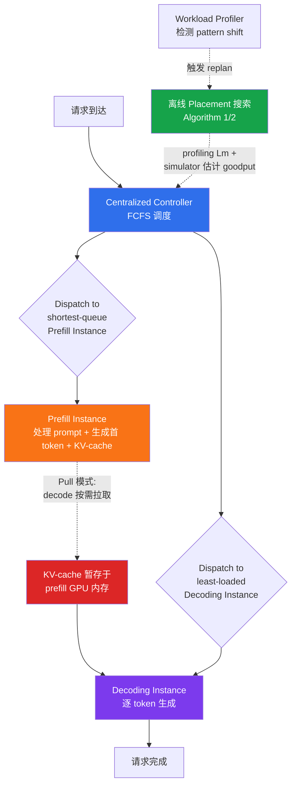
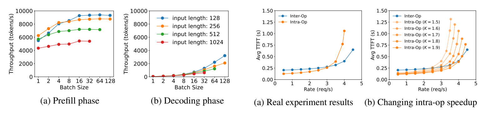

# 精读笔记：DistServe — Disaggregating Prefill and Decoding for Goodput-optimized Large Language Model Serving (OSDI 2024)

---

## ▎第一层 · 基本信息

| 字段 | 内容 |
|------|------|
| **论文** | Zhong, Liu, Chen, Hu, Zhu, Liu, Jin, Zhang. *DistServe: Disaggregating Prefill and Decoding for Goodput-optimized Large Language Model Serving.* OSDI 2024. |
| **来源级别** | CCF-A 会议论文（北京大学 + UC San Diego + StepFun） |
| **链接** | https://www.usenix.org/conference/osdi24/presentation/zhong-yinmin / 代码：https://github.com/LLMServe/DistServe / 本地 PDF：`research/reference/distserve_osdi2024.pdf` |
| **阅读日期** | 2026-07-23 |
| **状态** | 精读完成 |
| **相关论文组** | LLM 推理服务 disaggregation / Prefill-Decoding 分离 / Goodput 优化 / vLLM 生态 |

### 一句话核心结论

DistServe 通过将 prefill 和 decoding **彻底分离到不同 GPU instance**（每类 instance 维护独立模型权重副本），并配合基于仿真器的 placement 搜索算法（co-optimize 两阶段的 GPU 分配 + 并行策略）与 bandwidth-aware 部署，在 TTFT+TPOT 双 SLO 约束下最大化 per-GPU goodput，相对 vLLM/DeepSpeed-MII 可服务 **最高 7.4× 更多请求或 12.6× 更紧 SLO**，且 KV-cache 跨 instance 传输开销 <0.1% 总延迟。

`#LLM-inference` `#prefill-decode-disaggregation` `#goodput-optimization` `#placement-search` `#model-parallelism` `#KV-cache-transfer` `#OSDI2024`

---

## ▎第二层 · 论文结构分析

### 1. 问题拆解

| 问题 | 论文的回答 |
|------|-----------|
| 要解决什么痛点？ | 现有 LLM 服务系统把 prefill 和 decoding 共置（colocate）在同一 GPU 上做 continuous batching，导致两个问题：(a) **prefill-decoding 干扰**——长 prefill 拖慢 decode（TPOT 恶化），decode 反过来拖慢 prefill（TTFT 恶化）；(b) **资源与并行策略耦合**——两阶段计算特征和延迟需求不同却被迫共享同一套 parallelism 配置。在严格 TTFT/TPOT 双 SLO 下，系统只能 over-provision GPU |
| 之前的方法为什么不够？ | vLLM（continuous batching + PagedAttention）最大化整体吞吐但牺牲延迟；DeepSpeed-MII 的 chunked-prefill（即 Sarathi 思路）拆分长 prefill 试图缓解干扰，但论文 §2.3 论证它"trade TTFT for TPOT, cannot eliminate interference"——要么 chunk 太小 prefill 因争抢 GPU 变慢，要么 chunk 太大 piggyback 空间消失，且 chunked-prefill 导致 O(N²) 次 KV-cache 重复加载 |
| 论文的**核心论点** | 既然两阶段计算特征和延迟需求截然不同，就应**按阶段分到不同 GPU instance**，各自独立优化 resource allocation + parallelism strategy，在 per-GPU goodput（满足 SLO 的最大单 GPU 请求率）意义下找到最优 placement。disaggregation 的通信开销在现代 GPU 集群中可被带宽吸收（§3.3） |
| 它的**关键假设** | (1) prefill 是 compute-bound、decoding 是 memory-bandwidth-bound，且二者可清晰分离；(2) KV-cache 跨 instance 传输开销可被 InfiniBand 或 intra-node NVLINK 吸收到可忽略；(3) workload 的到达过程和输入/输出长度分布可从历史 trace 拟合、长周期可预测，从而离线搜索 placement；(4) 集群规模足够支撑分 instance（资源受限单 GPU 场景被论文自己承认失效，§7） |

### 2. 方法拆解

**核心技术要点**：

1. **Disaggregation + per-phase instance（§2.3 Opportunities, §4）**：将 prefill 分配到 prefill instance、decoding 分配到 decoding instance，每类 instance 维护一份完整模型权重。一个 decoding instance 可对应多个 prefill instance（因 decoding 单 job 利用率低，可累积更大 batch）。这彻底消除两阶段干扰，并允许各阶段独立选择 parallelism。论文用 instance 表示"管理一份完整模型权重的资源单位"，一个 instance 可跨多 GPU（当应用 model parallelism 时）。

2. **Placement 搜索算法（§4.1 Alg.1 + §4.2 Alg.2）**：核心是用**仿真器**（基于 FLOPs + memory access 的延迟模型，Appendix A）估计给定 workload / parallelism / SLO 下的 goodput，然后枚举所有可行 parallelism 配置做二分搜索。两个变体：
   - **Algorithm 1（High Node-Affinity）**：适用于有高速跨节点 InfiniBand 的集群，prefill 和 decode instance 可跨任意两节点部署。先分别独立优化两阶段的 parallelism（最大化 per-GPU goodput），再按目标流量复制 instance。复杂度 O(N·M²)，最大设置求解 < 1.3 分钟。
   - **Algorithm 2（Low Node-Affinity）**：适用于跨节点带宽受限的集群（如论文 testbed 仅 25 Gbps）。关键洞察：KV-cache 传输只发生在 prefill/decode 对应层之间。利用 inter-op parallelism 把 instance 切成 instance segments（每个 segment 维护一个 pipeline stage），把 prefill 和 decode **同 stage 的 segment 共置在同一节点内**，强制传输只走 intra-node NVLINK。同节点内两阶段 segment 共享同一 parallelism 配置。

3. **Online scheduling 优化（§4.3）**：基础是 FCFS + centralized controller（dispatch 到最短队列的 prefill instance、再到负载最低的 decode instance）。三个增强：
   - **减少 pipeline bubble**：profiling 出使 GPU 饱和的最短 prompt 长度 Lm，调度时让 prefill batch 总序列长度接近 Lm（短请求多打包、长请求单独调度）。
   - **抗突发（pull 模式 KV-cache 传输）**：decoding instance **按需从 prefill instance 拉取** KV-cache（而非 prefill 推送），把 prefill 的 GPU 内存当作排队缓冲。prefill 处理完 prompt 后只需在内存中保留 KV-cache 即可继续接其他 job，两类 instance 各自按自己节奏运行，无需复杂协调。
   - **周期性 replanning**：workload profiler 监控平均输入/输出长度和到达率，检测到显著 pattern shift 时重跑 placement 算法（秒级求解 + 分钟级重载权重，远短于小时级 workload 漂移）。

4. **Tradeoff 分析（§3，理论支撑）**：
   - **Prefill instance**：compute-bound，单条 512-token 序列即可饱和 A100（13B 模型），batch size 通常很小。用 M/D/1 排队模型推导：低到达率时 intra-op parallelism 更优（缩短执行时间直接降 TTFT），高到达率时 inter-op parallelism 更优（线性扩展 rate 容量、降低排队延迟）。存在 speedup 系数 K（1<K<2）反映 intra-op 的非完美加速。
   - **Decoding instance**：memory-bandwidth-bound，batching 是提高利用率的关键。大 batch 下 decoding 逼近 compute-bound、行为类似 prefill；intra-op 降延迟但有递减收益，inter-op 线性扩吞吐。紧 TPOT SLO 时必须用 intra-op，之后用 inter-op 扩吞吐。

### 3. 实验拆解

| 维度 | 内容 |
|------|------|
| **数据集** | ShareGPT（chatbot，avg input 755.5 / output 200.3 tokens）、HumanEval（code completion，avg input 171.3 / output 98.2）、LongBench（summarization，avg input 1738.3 / output 90.7）；到达时间用 Poisson 分布生成 |
| **Baseline** | vLLM（colocation + continuous batching + PagedAttention，仅支持 intra-op parallelism）、DeepSpeed-MII（chunked-prefill，即 Sarathi 思路的工程实现）。**未对比 Splitwise（同期并发工作）**，也未对比 Sarathi-Serve 本体——这是评估空白（见第三层） |
| **评价指标** | **SLO attainment**（满足 TTFT+TPOT 的请求比例）；**per-GPU goodput**（满足 90% SLO attainment 的单 GPU 最大请求率）；**SLO Scale**（线性缩放两 SLO，找系统能承受的最紧 SLO 倍数）。SLO 按应用经验设定（Table 1）：chatbot 13B TTFT 0.25s/TPOT 0.1s，66B 2.5s/0.15s，175B 4.0s/0.2s；code completion 66B 0.125s/0.2s；summarization 66B 15s/0.15s |
| **消融实验** | ✅ Alg.1 vs Alg.2 placement 对比（DistServe-High vs DistServe-Low，§6.4 图 11）；vLLM vs vLLM++（枚举 parallelism 的 vLLM）；simulator 精度验证（Table 2，误差 <2%）；99% SLO attainment 下的端到端结果（Appendix C） |
| **统计显著性** | ❌ 未报告方差/置信区间（但覆盖 3 个模型规模 × 3 类应用 + simulator 误差 <2% + 32 GPU 真实集群，趋势一致性提供一定可信度） |
| **复现条件** | 🟡 部分。代码开源（GitHub），但实现为 orchestration layer + 自研 parallel execution engine（6.5K Python + 8.1K C++/CUDA，基于 Ray actor 实现 GPU worker），非直接基于 vLLM 主线；硬件需 4 节点 32 张 A100-80GB 才能完整复现 |

### 4. 关键数字

| Claim | 数字 | 条件 |
|-------|------|------|
| 最大 goodput 提升（vs SOTA）| **7.4× 更多请求 或 12.6× 更紧 SLO** | Abstract，各模型/应用/延迟约束，>90% 请求满足 SLO |
| Figure 1 motivating 例子 | colocation **1.6 rps/GPU**；prefill-only **5.6 rps**；decode-only **10 rps**；disaggregated 2P+1D → **3.3 rps/GPU = 2.1×** | 13B LLM, 1×A100-80GB, input=512/output=64, synthetic |
| Chatbot vs vLLM | **2.0×–4.6× 更高 rate** | ShareGPT, OPT-13B/66B/175B（§6.2 图 8） |
| Chatbot vs DeepSpeed-MII | **1.6×–7.4× 更高 rate** | ShareGPT（§6.2） |
| Chatbot SLO 紧度 | vs vLLM **1.8×–3.2× 更紧**；vs DeepSpeed-MII **1.7×–1.8× 更紧** | SLO Scale（图 8 第二行） |
| Code completion vs vLLM | **5.7× rate, 1.4× 更紧 SLO** | OPT-66B, HumanEval（图 9a） |
| Summarization vs vLLM | **4.3× rate, 12.6× 更紧 SLO** | OPT-66B, LongBench（图 9b） |
| KV-cache 传输开销 | **<0.1% 总延迟**；**>95% 请求传输 <30ms** | OPT-175B, ShareGPT, 25Gbps 跨节点带宽 testbed（图 10） |
| KV-cache 大小 | 512-token 请求在 OPT-66B 上约 **1.13GB**；10 rps 需 **90 Gbps** 带宽才能让开销不可见 | §3.3 |
| Prefill 饱和阈值 Lm | 单条 **512 tokens** 即饱和 A100 | 13B 模型（§3.1 图 3a） |
| Simulator 精度 | SLO attainment 误差 **<2%** | vLLM 与 DistServe-Low，多 rate 点（Table 2） |
| OPT-175B 选定 placement | prefill PP=3,TP=3；decoding PP=3,TP=4 | ShareGPT（§6.2 + Table 3） |
| 99% SLO attainment 下 | vs vLLM **3×–8× rate，1.24×–6.67× 更紧 SLO** | Appendix C |
| 算法求解时间 | 最大设置 **<1.3 分钟**，与模型大小无关 | 96 核 AWS m5d.metal（§6.5 图 12） |

---

## ▎第三层 · 批判性评估

### 1. 假设检验

- **假设 1：prefill 和 decoding 可清晰分离，且各有独立最优 parallelism**
  - 反例 / 边界：对**生成式 decoder-only 自回归 LLM 成立**。但本课题的 **AI_EMBED / AI_CLASSIFY 是非生成式**（只跑一次前向、无自回归 decode），没有 decoding 阶段可分，DistServe 的整套 disaggregation 逻辑**完全不适用**。论文 §8 Related Work 承认 AlpaServe "only targets the non-autoregressive generation"，但未量化 DistServe 对非自回归的不适用性。§7 Discussion 也未覆盖 embedding/classification 场景。
- **假设 2：KV-cache 跨 instance 传输开销可被带宽吸收到可忽略**
  - 反例 / 边界：论文 testbed 跨节点带宽仅 **25 Gbps**（不是 InfiniBand），所以被迫用 Algorithm 2 把传输限制在 intra-node NVLINK 内（600 GB/s）。§3.3 自己算出：OPT-66B 单请求 KV-cache 1.13GB，10 rps 需 90 Gbps——这意味着**在 25 Gbps 跨节点环境下，传输开销绝不可忽略**，Alg.2 的 NVLINK 约束是被迫的妥协，不是通用解。对超长 prompt（KV-cache 几十 GB）即使 NVLINK 也可能挤占带宽。论文 §7 承认 long-context 下传输开销随 prompt 线性增长（但认为 prefill 二次增长更快，相对占比下降——这一论证对 1M context 未实测）。
- **假设 3：workload 长周期可预测，可离线搜索 placement**
  - 反例 / 边界：论文用历史 trace 拟合分布 + 重采样喂仿真器。§4.3 的 replanning 机制承认 workload 会漂移，但依赖"小时级"漂移速度。真实多租户云负载可能在分钟级剧烈波动（突发流量），此时 placement 重算（秒级）+ 权重重载（分钟级）可能跟不上。论文未量化 replanning 的响应延迟上限。
- **假设 4：FCFS 调度足够，不需要 preemption**
  - 反例 / 边界：论文 §4.3 自己承认 FCFS 会导致 "convoy effect"（长请求阻塞短请求），preemption 留作 future work。在 prefill 阶段，长 prompt 请求会阻塞短 prompt 请求的 TTFT——这在 prompt 长度方差大的 workload（如混合 chatbot + summarization）下会显著恶化短请求 SLO。这是 DistServe 当前实现的结构性短板。
- **假设 5：disaggregation 总是优于 colocation**
  - 反例 / 边界：论文 §7 自己承认三类退化场景：(a) **throughput-optimized（离线无 SLO）**——chunked-prefill with piggyback 可能更优（每个 batch 填满到 compute-bound 阈值）；(b) **resource-constrained（单 GPU）**——disaggregation 设计空间消失，简单 colocation 更好；(c) 故障传播风险——decode instance 故障会拖垮所有依赖它的 prefill instance。这与 Splitwise §VI-E 的"高负载退化为同池"结论一致。

### 2. 边界探查

- **方法适用边界**：仅适用于**自回归生成式 LLM + SLO 约束下的在线服务 + 多 GPU 集群**。三类场景失效：非生成式（embedding/classification）、离线吞吐优先（无 SLO）、资源受限（单/少 GPU）。论文 §7 诚实承认前两类，但未量化。
- **扩展性限制**：(a) 模型更大（KV-cache 更大）→ 传输开销增长，Alg.2 的 intra-node 约束可能不够；(b) 多轮对话场景——KV-cache 需跨请求保持或迁回 prefill instance，论文未讨论；(c) MoE 模型的 expert 路由使 batch 构成不均匀，pipeline bubble 假设需重检；(d) FCFS convoy effect 在长尾 prompt 分布下恶化。
- **复现难度**：🟡 部分。代码开源但**不是基于 vLLM 主线**——是自研 parallel execution engine（Ray actor + 8.1K C++/CUDA），与 vLLM 生态演进解耦但也意味着无法直接复用 vLLM 最新优化。完整复现需 4 节点 32×A100-80GB + 特定网络配置。

### 3. 可信度评估

| 维度 | 评价 | 依据 |
|------|------|------|
| 实验公平性 | 🟡 有疑点 | Baseline 只用 vLLM 和 DeepSpeed-MII（chunked-prefill），**未对比 Splitwise（同期 disaggregation 并发工作）**，也未直接对比 Sarathi-Serve；DeepSpeed-MII 无法服务 OPT-175B（vocab_size 限制），175B 对比只有 vLLM；testbed 跨节点带宽仅 25Gbps， Alg.2 是被迫选择而非 Alg.1 的自由部署；SLO 值为作者经验设定，无工业标准引用 |
| 结果显著性 | 🟢 显著 | 7.4×/12.6× 级别提升，且在 3 模型 × 3 应用下趋势一致；KV-cache 传输 <0.1% 的实测干净；simulator 误差 <2% 验证了 placement 搜索的可信度 |
| 开源/可复现 | 🟡 部分 | 代码开源（GitHub），但自研 engine 而非 vLLM 主线；硬件门槛高（32×A100）；trace 需自采样 |
| 论文自身局限 | 🟢 较诚实 | §7 主动讨论了 throughput-optimized / resource-constrained / long-context 三类边界；§4.3 承认 FCFS convoy effect 和 fault tolerance 是 future work；但**未承认缺少 Splitwise 对比**这一关键空白 |

### 4. 与同行工作的对比

- 比 **Splitwise (ISCA 2024)**：两者是**同期并发工作**（DistServe §8 明确将 Splitwise 列为 concurrent work [38]），同为 prefill/decode disaggregation 路线。**核心差异**在优化目标——DistServe 优化 **per-GPU goodput**（SLO 约束下的单 GPU 请求率，TTFT+TPOT 双目标），Splitwise 优化 **Perf/$ 和 Perf/W**（成本、功耗、空间 provisioning）。DistServe 用仿真器搜索 parallelism 配置，Splitwise 用仿真器搜索池配比。DistServe 用 **pull 模式** KV-cache 传输（decode 按需拉取），Splitwise 用 **push 模式**（prefill 逐层推送 + MSCCL++）。详细对比见第四层 §2。
- 比 **Sarathi-Serve (OSDI 2024)**：路线对立。DistServe **disaggregate**（分 GPU instance + KV-cache 迁移），Sarathi-Serve **colocate**（同 replica 内 chunked-prefill + stall-free batching）。DistServe §2.3 论证 chunked-prefill"无法消除干扰"，Sarathi-Serve 论证 colocation 无需迁移开销。**两者未在任一篇中直接对比**——与 Splitwise 一样构成 disaggregation vs colocation 的未解设计轴。
- 比 **vLLM (SOSP 2023)**：DistServe 的 execution engine **不是基于 vLLM**，而是自研（Ray actor + C++/CUDA），但集成了 continuous batching、FlashAttention、PagedAttention 等优化。vLLM 在 DistServe 中是 baseline，不是实现底座。
- 比 **AlpaServe (OSDI 2023)**：AlpaServe 用 model parallelism 做统计多路复用提升利用率，但**只针对非自回归生成**。DistServe §8 自称"first work to optimize the goodput for autoregressive LLM inference"。
- 在 **[本课题]** 的坐标系中：DistServe 是 **推理服务内部的部署层 disaggregation**——它在推理引擎/GPU instance 层面把 prefill 和 decode 分到不同 GPU。本课题在推理服务的**上游**：优化数据如何从数据库组织成请求、以什么节奏提交到推理服务。两者处于"推理服务的内外两侧"。DistServe 的 per-phase 资源差异化分配思想可类比迁移到本课题 RC2 的**异构 actor pool 分池路由**，但 GPU instance ≠ Ray actor、且本课题不修改 vLLM 内部。

---

## ▎第四层 · 与你课题的连接

### 1. 可引用的观点（配精确位置）

> §1 + Figure 1：现有系统 colocation 下单 A100 goodput 仅 1.6 rps，而 prefill-only 可达 5.6 rps、decode-only 可达 10 rps；disaggregation（2P+1D）可达 3.3 rps/GPU = 2.1×。
> → 这是本课题 **RC2 异构 actor pool 分池路由**的**量化动机证据**：当不同任务的资源画像和延迟需求差异显著时，按任务类型分池并独立配置资源能带来数倍收益。本课题的异构 actor pool 可引用此数据说明"按计算量/任务类型分池"的必要性。

> §3.1 Batching strategy：For a 13B LLM, processing a single sequence of 512 tokens can fully engage an A100 GPU. Once compute-bound, adding more requests no longer improves efficiency but proportionally extends processing time.
> → 直接支撑本课题 **RC1 token-budget 数据组织策略**：prefill 阶段有明确的饱和点（Lm），超过此点的 batch 不增吞吐反增延迟。按 token 量而非固定行数组织 batch 是有量化依据的——与 Splitwise Fig 6a 的 2048 拐点、Sarathi-Serve 图 4 的 512 饱和点三篇相互印证。

> §3.1 Parallelism plan（M/D/1 排队模型）：低到达率时 intra-op 优（缩短执行时间），高到达率时 inter-op 优（线性扩吞吐、降排队延迟）。
> → 本课题 **RC2 K_max 动态控制**的方法论参考：最优并发度（K_max / parallelism）**不是静态的**，而是负载相关的——低负载时减并发以降单请求延迟，高负载时加并发以扩吞吐。DistServe 用排队理论证明了这一权衡，本课题的 K_max 自适应可引用同一逻辑。

> §4.3 Combat burstiness（pull 模式）：Decoding instances fetch KV cache from prefill instances as needed, using the GPU memory of prefill instances as a queuing buffer ... each type of instance operates at its own pace without complex coordination.
> → 本课题 **RC2 去中心化协调**的设计参考：DistServe 的 pull 模式是一种"用缓冲解耦生产者/消费者节奏"的去中心化机制。本课题的 actor pool 间也可借鉴"下游按需拉取 + 上游暂存"的反压模式，而非集中式 push——这与 queue-adaptive flush 的思路互补。

> §4.3 Reducing pipeline bubbles：We schedule prefill batches with a total sequence length close to Lm.
> → 本课题 **RC1 length-align / token-budget 分组**的直接参考：DistServe 在 prefill 调度时显式按"总序列长度接近 Lm"组织 batch——这正是按计算量（token 量）组织数据的具体实现。本课题的 token-budget batch construction 与此同构。

> §7 Discussion：In offline applications that are not latency-sensitive ... techniques such as chunked-prefill with piggyback may be preferred ... In resource-constrained scenarios ... the design space for DistServe is significantly limited.
> → 本课题的**诚实边界**参考：disaggregation 的收益只在 SLO 约束下的多 GPU 在线服务成立。本课题若声称 actor 分池有收益，必须覆盖不同负载/资源场景，不能只报理想区间的数字。

### 2. ⚠️ 不能过度引用的地方

- ❌ **不声称** "DistServe 的 prefill/decode 分 instance = 本课题的 actor pool 分池路由"——DistServe 是**推理服务部署层**的 GPU instance 分离（自研 engine + 跨 GPU 迁移 KV-cache + 维护独立模型权重副本），本课题是**数据提交上游**的 Ray actor 分池（**不修改 vLLM 内部**、不迁移 KV-cache、不维护模型权重副本）。两者层级不同、对象不同、成本结构不同。
- ❌ **不声称** "DistServe 证明 disaggregation 对所有 AI 算子都有效"——DistServe 明确限定于**自回归生成式 LLM**（§8："DistServe is the first work to optimize the goodput for autoregressive LLM inference"）。本课题的 **AI_EMBED / AI_CLASSIFY 是非生成式**（无 decode 阶段），DistServe 的分池逻辑对其**完全不适用**。仅 AI_COMPLETE 场景才相关。
- ❌ **不声称** "DistServe 的 7.4×/12.6× 提升适用于本课题场景"——DistServe 的数字是在 OPT 模型 + ShareGPT/HumanEval/LongBench + 32×A100 集群 + 特定 SLO 下的部署层收益。本课题的上游调度收益是另一层，数字不可移植。且 DistServe 的 baseline 是 vLLM/DeepSpeed-MII 的 colocation，不是上游调度优化。
- ❌ **不声称** "本课题借鉴 DistServe 做 KV-cache 跨池迁移"——本课题**明确不修改 vLLM 内部**（PROJECT_OUTLINE 边界），不做 KV-cache 跨 instance/actor 迁移。DistServe 的 pull 模式迁移机制是其 disaggregation 的核心成本，本课题不承担这一成本也不获取其部署层收益。
- ❌ **不声称** "DistServe 解决了推理调度的全部问题"——DistServe 自己承认 FCFS convoy effect（§4.3）、无 preemption、无 fault tolerance、resource-constrained 场景失效（§7），这些都是结构性未解问题。

### 3. 对本课题的实际用途

| 用途类型 | 具体方式 | 优先级 |
|----------|----------|--------|
| ✅ 设计参考（RC2）| **异构 actor pool 分池路由**的动机证据：per-phase 资源差异化（Figure 1 的 2.1× + §3 排队分析）证明"按任务类型/计算量分池匹配不同资源"有效 | ⭐⭐⭐ |
| ✅ 设计参考（RC1）| **token-budget 数据组织**：Lm 饱和阈值（§3.1，512 token 饱和 A100）+ "总序列长度接近 Lm"的 batch 组织（§4.3）是按 token 量控批的量化锚点 | ⭐⭐⭐ |
| ✅ 设计参考（RC2）| **K_max 动态控制**的负载相关性：§3.1 的 M/D/1 排队模型证明最优并发度随到达率变化——支撑本课题 K_max 自适应（非静态）的必要性 | ⭐⭐ |
| ✅ 设计参考（RC2）| **pull 模式反压**：§4.3 的 decode 按需拉取 KV-cache 是"用缓冲解耦上下游节奏"的去中心化机制，可迁移到 actor pool 间的 queue-adaptive 协调 | ⭐⭐ |
| ✅ 对照区分 | 本课题**不修改 vLLM、不做 KV-cache 迁移、处于上游、覆盖非生成式 AI_EMBED**——与 DistServe 做推理引擎内部 disaggregation 的路线明确区分 | ⭐⭐ |
| ⚠️ 方法论参考（算子代价估计）| **placement 搜索 + 仿真器 + 延迟模型**（Appendix A 的 GEMM FLOPs + memory access 建模，误差 <2%）：本课题"算子代价估计"补充研究内容可借鉴此方法论，用仿真枚举 actor pool 配比 | ⭐⭐ |
| ⚠️ 适用边界说明 | AI_EMBED/AI_CLASSIFY 无 decode，DistServe disaggregation 不适用；仅 AI_COMPLETE 场景可类比 | ⭐⭐ |

### 4. 与 Splitwise 的关键对比（disaggregation 路线内部）

DistServe 与 Splitwise 是同期并发工作（DistServe §8 将 Splitwise 标注为 concurrent work [38]），同为 prefill/decode disaggregation，但在四个维度上有明确差异：

| 对比维度 | DistServe (OSDI 2024) | Splitwise (ISCA 2024) |
|----------|----------------------|----------------------|
| **(a) 分池/优化依据** | **Per-GPU goodput**：满足 TTFT+TPOT 双 SLO 的单 GPU 最大请求率。co-optimize 两阶段的 GPU 分配 + parallelism strategy（intra-op / inter-op），用仿真器枚举 parallelism 配置 | **Perf/$ 和 Perf/W**：iso-cost / iso-power / iso-throughput 下的成本功耗最优。co-optimize 两阶段的**机器池配比** + 硬件型号选择（H100/A100），用仿真器枚举 (prompt 机数 × token 机数) |
| **(b) KV-cache 跨池迁移** | **Pull 模式**：decoding instance 按需从 prefill 拉取，prefill GPU 内存作缓冲；跨节点用 NCCL，intra-node 用 async CudaMemcpy；Alg.2 强制同 stage segment 共置节点内走 NVLINK。开销 <0.1% 总延迟，95% 请求 <30ms | **Push 模式**：prompt 机逐层异步推送，MSCCL++ zero-copy one-sided put over InfiniBand，与 prefill 计算重叠。开销 <7% prompt compute，0.8% E2E，第二 token +16.5% |
| **(c) 调度与配对机制** | **FCFS + shortest-queue dispatch**（§4.3）。runtime 无 prefill-decode 配对预测、无 fairness 机制；离线用 simulator + profiling Lm 决定 placement。**注意：用户任务描述中提到的"AFGM（attention-focused fairness）decode 调度"与"prediction-based prefill-decode pairing"在本论文中不存在**——论文 §4.3 原文明确写 "DistServe operates with a simple FCFS scheduling policy"，dispatch 是 shortest-queue prefill / least-loaded decode 的负载均衡，全文 grep 无 fairness/AFGM/attention-focused/pairing 机制（已 pdftotext 全文核实，见元反思） | **JSQ（Join the Shortest Queue）路由 + 分池 FCFS**（§IV-A/B）。prompt 机硬限 batch ≤2048 token，token 机尽量打包到内存满，mixed 机优先 prompt + token 年龄防饿死。无 fairness 机制，无配对预测 |
| **(d) 适用边界** | goodput-optimized 在线服务（§7）：离线吞吐优先 / 单 GPU 资源受限 / 无 InfiniBand 三类场景退化。仅自回归 LLM | SLO 约束中低负载（§VI-E）：高负载退化为 iso-count 同池 baseline。仅自回归 LLM（§VIII 明确） |

**对本课题的启示**：
- 两者**都仅适用于自回归生成式 LLM**，对本课题的 AI_EMBED/AI_CLASSIFY（无 decode）都不适用——这凸显本课题设计"模态无关上游调度"的必要性。
- 两者的**分池思想**（按计算量/任务类型差异化配置资源）可迁移到本课题 RC2 的异构 actor pool，但 actor ≠ GPU instance，且本课题不做 KV-cache 迁移。
- DistServe 的 **goodput 概念**（SLO 约束下的有效吞吐）比 Splitwise 的纯吞吐更有参考价值——本课题的实验指标应包含 SLO attainment 意义下的 goodput，而非只看 raw throughput（呼应 code/AGENTS.md §6 的新实验指标完整性要求：tokens/s + service_p99）。
- DistServe 的 **pull 模式反压**与 Splitwise 的 **push 模式重叠迁移**代表两种去中心化协调思路——本课题的 queue-adaptive flush 设计时可对比两者的适用条件。

### 5. 不足 → 你的机会

| 论文的不足 / 未回答的问题 | 你的课题可能如何填补 |
|--------------------------|---------------------|
| 只优化推理引擎内部部署层，不考虑外部数据如何到达、以什么节奏到达 | 你的课题研究**上游数据组织 + 提交控制**：数据如何从数据库组织成请求、以什么节奏提交——填补 DistServe 完全未触及的链路 |
| 仅适用于生成式 LLM，未量化 embedding/classification 场景 | 你的多模态泛化验证（AI_EMBED/AI_CLASSIFY 图像）正是不含 decode 的场景——DistServe/Splitwise 均不适用，凸显本课题"模态无关上游调度"的独特价值 |
| FCFS 调度的 convoy effect 未解决（长请求阻塞短请求），preemption 留作 future work | 你的 RC2 queue-adaptive flush + length-align 分组可在上游预先缓解——按计算量分组让相似长度的请求进同一 batch，避免推理服务内部的长短请求混批 |
| placement 是 workload-pattern 驱动的离线搜索，依赖小时级可预测性 | 你的 K_max 自适应可根据推理服务**实时状态**（队列长度、延迟反馈）动态调节，比 DistServe 的周期性 replan 更实时 |
| 不考虑请求的数据来源（来自哪张表、有无 schema、可否 prefix 共享） | 你的场景数据来自 PostgreSQL 表，有明确 schema——可用于 prefix-aware grouping（相同 system prompt 共享 KV prefix），这是 DistServe 完全没有的上游信息优势 |
| 未对比 colocation 路线（Sarathi-Serve）| 你的课题可在 vLLM（colocation 默认）作为 S 级 baseline 的前提下，引用 DistServe + Splitwise（disaggregation）+ Sarathi-Serve（colocation）三条路线，说明上游优化的收益**不依赖**推理引擎内部选哪条路线 |

### 6. 可论文化的措辞

> Zhong et al. [DistServe, OSDI 2024] 通过将 prefill 和 decoding 分离到不同 GPU instance，在 TTFT+TPOT 双 SLO 约束下最大化 per-GPU goodput。本课题借鉴其"按任务类型差异化配置资源"的核心思想，但将其从推理服务部署层上移到数据提交上游：在不修改 vLLM 内部的前提下，用异构 Ray actor pool 对应不同计算量 profile 的请求，实现上游的分池路由。

> DistServe 的 disaggregation（§4）和本课题的 actor pool 分池路由（RC2）共享同一动机——不同计算量的任务有不同的资源画像和延迟需求，应匹配不同资源配置（DistServe Figure 1 的 2.1× goodput 提升）。两者的区别在于作用层级：DistServe 在推理引擎内部按 prefill/decode 分 GPU instance 并迁移 KV-cache，本课题在上游按请求计算量分 Ray actor 且不进入推理引擎内部。

> DistServe 的适用边界（§7-§8：仅自回归 LLM）表明，prefill/decode 分离对非生成式 workload 不适用。本课题的主场景包含非生成式的 AI_EMBED/AI_CLASSIFY（无 decode 阶段），DistServe 不直接适用——这正凸显本课题设计"模态无关上游调度策略"的必要性：token-budget → frame-budget 的泛化不依赖推理引擎内部的 phase 结构。

> 与 Splitwise [Patel et al., ISCA 2024] 侧重 Perf/$ 与功耗 provisioning 不同，DistServe 侧重 per-GPU goodput 优化——两者代表 disaggregation 路线内部的不同目标函数。本课题引用 disaggregation 路线时保持中立，不声称某一目标函数普遍更优。

### 7. 后续待读

- [ ] [[splitwise_isca2024]] — **已精读**。disaggregation 路线的对照，重点在 Perf/$ + 异构硬件 + push 模式 KV-cache 迁移。与 DistServe 形成 goodput vs cost/power 的轴
- [ ] [[sarathi_serve_osdi2024]] — **已精读**。colocation 路线（chunked-prefills + stall-free batching），与 DistServe disaggregation 路线形成本课题需厘清的核心设计轴
- [ ] **DéjàVu** (Strati et al., 2024, ref [49]) — DistServe 同期引用的另一个 disaggregation + KV-cache streaming 工作，关注 fault tolerance（DistServe 未解决）。用户任务中提到的"prediction-based pairing / fairness"机制可能在类似工作中——待确认归属
- [ ] **TetriInfer** (Hu et al., 2024, ref [27]) — DistServe 引用的另一 disaggregation 思路工作（"Inference without interference"）
- [ ] **FastServe** (Wu et al., 2023, ref [53]) — DistServe 作者参与的 preemptive scheduling 工作，可能补充 FCFS convoy effect 的解法
- [ ] **AlpaServe** (Li et al., OSDI 2023, ref [33]) — 统计多路复用 + model parallelism，非自回归 serving 对照
- [ ] **Orca** (Yu et al., OSDI 2022, ref [54]) — continuous batching / iteration-level scheduling 原始论文
- [ ] **vLLM** (Kwon et al., SOSP 2023, ref [32]) — PagedAttention 原论文，本课题部署平台核心

---

## 元反思

- **精读收益**：🟢 高（DistServe 是本课题 RC2 异构 actor pool 分池路由的**重要对照文献**，goodput 概念 + per-phase 差异化资源配置 + pull 模式反压均可迁移；但其 disaggregation 路线与本课题上游路线的边界必须严格区分，且对 AI_EMBED 不适用）
- **是否纳入核心文献库**：是（与 Splitwise、Sarathi-Serve 共同构成 prefill/decode 处理的三大参考，分别代表 disaggregation-goodput / disaggregation-cost / colocation 三条路线）
- **计划复习周期**：2 周后复习（与 RC2 actor pool 分池路由实验设计前的重读同步；届时需配合 Splitwise + Sarathi-Serve 重读，厘清三条路线对上游调度的影响差异）
- **一句话自评**：理解到位。DistServe 的价值在于用 goodput 概念和排队分析量化证明了"按阶段/计算量差异化配置资源"的收益（Figure 1 的 2.1× + §3 的 M/D/1 模型），其 pull 模式反压和 length-aware batch 组织可直接启发本课题 RC1/RC2。最大未解问题：(1) 已 pdftotext 全文核实：本文确无 AFGM fairness 与 prediction-based pairing 机制，§4.3 明确用 simple FCFS scheduling policy——任务描述中的相关表述系混入其他论文（疑为 DéjàVu/FastServe 类工作）的机制，本笔记已据原文修正，未沿用错误描述；(2) DistServe/Splitwise/Sarathi-Serve 三篇均未两两直接对比，本课题需自行厘清三条路线对上游调度的含义。

---

## 相关笔记

- [[splitwise_isca2024]] — disaggregation 路线对照（Perf/$ + push 模式），与 DistServe 形成 cost vs goodput 轴
- [[sarathi_serve_osdi2024]] — colocation 路线（chunked-prefills + stall-free batching），与 DistServe disaggregation 形成核心设计轴
- [[tpl-文献精读-深度版]] — 本模板
- [[文献地图]] — 文献全景
- [[ai_operator_literature_inventory]] — 完整文献清单

## ▎配图（辅助讲解）

> 
>
> **图 3 · 两阶段吞吐 vs batch size（prefill vs decode）**。支撑核心论点'两阶段计算特征截然不同'：prefill（compute-bound）与 decode（memory-bandwidth-bound）在不同 batch size 下吞吐曲线形态不同，各自有独立的最优 batch / 饱和点——这是把两阶段分到不同 GPU instance 的量化依据（→ 课题 RC1 token-budget 的 Lm 饱和阈值来源之一）。
