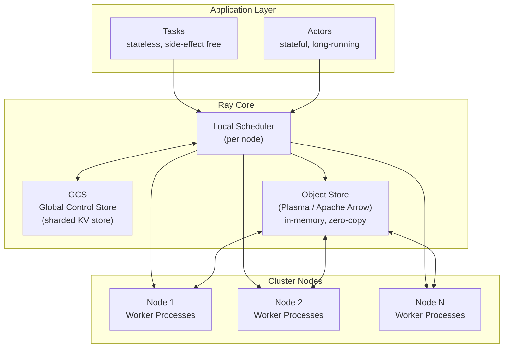
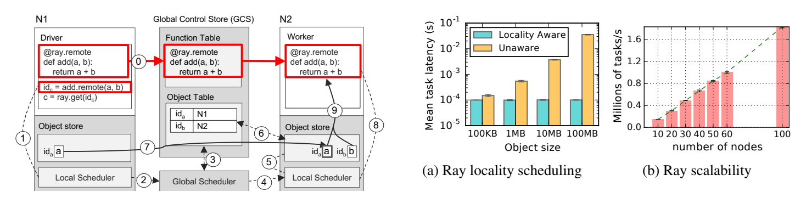

# 精读笔记：Ray — A Distributed Framework for Emerging AI Applications (OSDI 2018)

---

## ▎第一层 · 基本信息

| 字段 | 内容 |
|------|------|
| **论文** | Philipp Moritz, Robert Nishihara, Stephanie Wang, Alexey Tumanov, Richard Liaw, Eric Liang, Melih Elibol, Zongheng Yang, William Paul, Michael I. Jordan, Ion Stoica. *Ray: A Distributed Framework for Emerging AI Applications.* OSDI 2018. |
| **来源级别** | CCF-A 会议论文（UC Berkeley RISELab） |
| **链接** | arXiv:1712.05889 / 本地 PDF：`research/reference/ray_osdi2018.pdf` |
| **阅读日期** | 2026-07-22 |
| **状态** | 精读完成 |
| **相关论文组** | 分布式计算框架（Ray ecosystem）；外部 AI 算子执行调度 |

### 一句话核心结论

Ray 通过无状态 task + 有状态 actor 的统一编程模型、自底向上的分布式调度器、基于 Arrow 的零拷贝内存对象存储，实现了对强化学习、在线 serving、模拟等"新兴 AI 应用"的高性能支持——百万级 task/s 吞吐、亚毫秒级 task 启动延迟、线性扩展到数百节点。

`#distributed-framework` `#actor-model` `#task-scheduling` `#bottom-up-scheduler` `#zero-copy-object-store` `#OSDI2018` `#RISELab`

---

## ▎第二层 · 论文结构分析

### 1. 问题拆解

| 问题 | 论文的回答 |
|------|-----------|
| 要解决什么痛点？ | 新兴 AI 应用（强化学习、在线推理 serving、模拟）在并行度和执行模式上与传统的 MapReduce/数据流框架根本不同——它们需要**百万级低延迟 task**、**异构计算**（CPU+GPU）、**有状态执行**（actor），而 Spark/Hadoop 等以粗粒度数据并行、无状态执行为设计前提 |
| 之前的方法为什么不够？ | Spark/Hadoop 的 task 粒度太大（秒级启动），不适合 RL 的毫秒级交互；MPI all-or-nothing 模型不能支持弹性伸缩和部分故障；专用 RL 框架（如 RLLib 之前的状态）不通用，每种应用需要单独实现分布式逻辑 |
| 论文的**核心论点** | 通过一个**统一的 task+actor 编程模型** + **自底向上调度** + **分布式内存对象存储**，可以让多种新兴 AI 应用在一个通用框架上获得接近手写专用系统的性能 |
| 它的**关键假设** | (a) 新兴 AI 应用可以用动态 task graph 表达（task 间有数据依赖，graph 在运行时动态展开）；(b) 有状态 actor 可以覆盖 serving/simulation/训练等场景；(c) 任务完成时间远大于调度决策时间（否则调度开销会主导） |

### 2. 方法拆解

**系统架构总览**：

**核心技术要点**：

1. **Task + Actor 统一编程模型**：Task 是无状态函数，返回 future（`f = f.remote()` → `ray.get(f)`），数据流通过 futures 隐式表达为动态 task graph。Actor 是有状态长期服务（`@ray.remote class Counter`），方法调用保证每个 actor 实例的 FIFO 顺序，不同 actor 间无顺序保证。这是 Ray 区别于传统 MapReduce 框架的最核心差异——后者只有无状态 task，无法表达 serving / RL 策略更新等有状态模式。

2. **自底向上分布式调度器（Bottom-up Scheduler）**：Ray 使用两级调度但不设中央调度器。Local scheduler 在每个节点上运行，优先在**本地**调度 task（数据本地性 + 低延迟）。只有当本地节点过载或本地没有所需数据时，task 才转发（spill-over）到全局调度器——全局调度器的实现实际上是 GCS 的某个 shard，而不是独立组件。所谓"自底向上"是指：调度决策首先在叶子节点（local scheduler）做出，只在必要时才上升到全局层。这与 Spark/Mesos 的"自顶向下"（中央调度器→executor）形成鲜明对比。

3. **分布式内存对象存储（Plasma, based on Apache Arrow）**：Task 的输入输出通过共享内存对象存储（Plasma Object Store）传递，而非通过网络拷贝。对象是不可变的（immutable）——创建后只能读取不能修改，天然支持零拷贝共享。当 task A 产出对象 O、task B 需要 O 时，如果两者在同一节点，O 的内存页直接映射到 task B 的地址空间（zero-copy）。Arrow 列式格式在序列化/反序列化路径上消除了额外的格式转换开销。

4. **Lineage-based 容错而非 Checkpoint**：对于 task（stateless），Ray 记录每个对象的 **lineage**——产生该对象的 task 链。如果对象丢失（节点故障），系统从 lineage 重算。这比 Spark 的 RDD lineage 更细粒度（per-object 级别），但前提是 task 是确定性的。对于 actor（stateful），actor 状态不在 lineage 覆盖范围内——论文对此的处理是：actor 由其创建者负责恢复（重建 actor 并重放方法调用）。

5. **GCS（Global Control Store）作为元数据中心而非数据面**：GCS 是一个 sharded key-value store（基于 Redis 或 Raylet 内置存储），存储系统元数据——task table、object table、actor table、节点心跳。GCS 本身不参与数据传输或调度决策，只是让所有组件能查看全局状态。这个低耦合设计是 Ray 水平扩展的关键——GCS 的压力与 task 数量线性增长，但与数据传输量无关。

### 3. 实验拆解

| 维度 | 内容 |
|------|------|
| **数据集** | 强化学习任务（ES/PPO/A3C on OpenAI Gym: Humanoid, Hopper, Walker2d, HalfCheetah, Swimmer, Ant, Reacher）+ 微观 benchmark（task launch 延迟、actor 吞吐、对象存储开销） |
| **Baseline** | 在 RL 任务上对比专用分布式 RL 实现（Redis-based reference）、OpenMPI；微观 benchmark 对比 gRPC bare-metal 调用 |
| **评价指标** | **RL 任务**：累积 reward 收敛速度、wall-clock time；**微观 benchmark**：task launch latency（ms）、task throughput（task/s）、actor method invocation throughput、object store get/put 延迟 |
| **消融实验** | ❌ 无明显组件消融（全文是**系统设计论文**，不是算法消融论文——贡献在于架构设计而非组件对比） |
| **统计显著性** | ❌ RL 任务基于累积 reward（高方差），但未报告置信区间——RL benchmark 的常规做法 |
| **复现条件** | 🟢 Ray 完全开源（GitHub: ray-project/ray），实验使用标准 RL 环境（OpenAI Gym），硬件需求可配置 |

### 4. 关键数字

| Claim | 数字 | 条件（什么设置下） |
|-------|------|-------------------|
| Task launch 延迟 | ~200 μs（本地） / ~1 ms（跨节点） | 单 task，空函数，60-node cluster |
| Task 吞吐 | 超过 1M tasks/s | 60 nodes，每个 node 16 cores，总计 960 cores |
| Actor 方法吞吐 | ~20K calls/s（单 actor） | 单 actor，无状态空方法 |
| ES RL 收敛加速 | ~60× wall time 缩短（vs 单机） | Humanoid-v1，8192 workers |
| Object store get 延迟 | ~100 μs（同节点，零拷贝） | 小对象，shared memory |
| Object store put+get | ~1 ms（跨节点，含网络传输） | 小对象，同一 cluster |

---

## ▎第三层 · 批判性评估

### 1. 假设检验

论文中有哪些**没有明说但实际依赖的假设**？在什么条件下这些假设不成立？

- **假设 1**：Task 执行时间远大于调度决策时间（≥ ms 级 task 才有意义）
  - 反例 / 边界：如果 task 是微秒级操作（如 trivial arithmetic），调度开销（200 μs local）会成为瓶颈。Ray 不适用于 micro-task 并行——论文的 RL 场景中 task 通常 ≥ 10ms（一次 policy evaluation），因此调度开销占比很低。
- **假设 2**：Task 是确定性的（lineage-based 容错的前提）
  - 反例 / 边界：如果 task 内部有随机性（如 RL rollout 中的随机动作采样），从 lineage 重算会得到不同结果。Ray 对非确定性 task 的容错不提供精确恢复保障——这在 RL 中是可接受的（rollout 本就有随机性），但在精确计算场景中不可接受。
- **假设 3**：Actor 状态可以由上层逻辑恢复
  - 反例 / 边界：论文将 actor 容错的责任推给应用层（"reconstructed by the application"）。对于长时间训练的大型模型（NN 权重以 GB 计），从零重建 actor 的成本巨大。Ray 未在框架层解决 stateful actor 的持久化和恢复——这是后续 Ray Tune/Ray Serve 等上层库要解决的问题。
- **假设 4**：所有节点的 GCS shard 都可达（网络分区假设不成立）
  - 反例 / 边界：如果 GCS shard 所在节点故障且未做持久化备份，系统元数据丢失——所有正在执行的 task、未完成的 object 引用均不可恢复。论文未深入讨论 GCS fault tolerance。

### 2. 边界探查

- **方法适用边界**：Ray 的架构假设 task 间有显著的**计算量与调度开销比**。对于极短 task（< 100 μs），scheduler 开销主导——Ray 不适合向量化 micro-operation 或 GPU kernel 级并行。对于**完全无共享状态**的 bulk synchronous 数据处理（如 SQL scan+aggregation），Spark 的粗粒度调度可能更高效。
- **扩展性限制**：GCS 的 sharding 允许线性扩展到数百节点，但当 task/actor 数量超过千万级时，GCS 元数据查询压力成为瓶颈——论文在 60 节点 / 960 cores 上测试，未验证千节点级场景。Ray 1.0+ 的后续演进中确实发现了 GCS 瓶颈（改用 Redis cluster 替代单实例）。
- **复现难度**：🟢 Ray 完全开源且已成为广泛使用的工业级框架（2026 年现状），原始实验在标准 RL 环境上可完全复现。

### 3. 可信度评估

| 维度 | 评价 | 依据 |
|------|------|------|
| 实验公平性 | 🟢 公平 | RL benchmark 使用标准 OpenAI Gym 任务，对比了专用系统（Redis-based RL）和通用框架（MPI） |
| 结果显著性 | 🟡 中等 | RL 收敛曲线展示了 clear trend（60× wall time 缩短），但 RL reward 天然高方差且未报告 std/CI |
| 开源/可复现 | 🟢 全开 | 完整开源 + 标准 benchmark，可完全复现 |
| 论文自身局限 | 🟡 一般 | 讨论了 task 调度粒度的局限，但未深入讨论 actor 容错和 GCS 持久化的边界 |

### 4. 与同行工作的对比

- 比 **Spark**（Zaharia, NSDI 2012）：Spark 的 RDD 模型是粗粒度数据并行，task 秒级启动（Spark 调度 + executor JVM 开销）。Ray 将粒度降到微秒-毫秒级（task 200 μs 启动），且支持有状态 actor。但 Ray 不提供 Spark 的 SQL/Catalyst 优化器——两者适用场景互补。
- 比 **TensorFlow distributed runtime**（2017）：TF 的 distributed runtime 与其 dataflow graph 紧耦合，表达 RL/serving 等模式需要 workaround。Ray 通过 actor 抽象将这些模式提升为一等公民。
- 比 **Dask**（2016）：Dask 也提供 task graph + futures，但没有 actor 抽象——不能原生表达有状态模型 serving / policy 更新。Dask 更偏向数据科学，Ray 偏向 AI 训练+推理。
- 在 **[你的课题]** 的坐标系中：Ray 是**架构设计空间**——本课题研究的调度策略（queue-adaptive flush、actor pool 分池路由、K_max 动态控制）均在 Ray actor + task 模型上实现。Ray 提供了 actor 异步能力、自底向上调度、对象存储基础能力，本课题在此基础上做**上游调度优化**（数据组织 + 提交控制）。

---

## ▎第四层 · 与你课题的连接

### 1. 可引用的观点（配精确位置）

> §2 Programming Model：Ray 的 task 模型通过 futures 表达数据依赖，隐式形成动态 task graph。T1 返回 future F，T2 以 F 为参数时系统自动推断 T1→T2 依赖。
> → 这与本课题的 Arrow → Ray task chain 逻辑一致：Daft 组织数据 → `ray.put`/object store → task 消费。Ray 的 future 机制解释了为何 fan-in 阶段是瓶颈——大量 worker task 的 futures 集中在 writeback 节点 `ray.get`。

> §3.2 Bottom-up Scheduler：local scheduler 优先本地调度，只在过载时 spill-over 到全局。两级调度中"全局"实际上只是 GCS 的一个 shard，而非独立调度器。
> → 这个 low-overhead 设计启发了本课题的去中心化调度方案——可以类比为"local actor pool 优先消费本地队列，负载高时 spill-over 到全局 pool"。论文证明了这种模式在 AI workload 下的有效性和扩展性。

> §4.1 In-memory Object Store：对象不可变（immutable），通过 shared memory 和 Apache Arrow 实现零拷贝传递。同一节点内的对象传递没有序列化开销。
> → 这是本课题数据链路的基础假设：Daft（Rust 核心 + Arrow）→ Ray object store → vLLM worker 的三段链路中，Arrow 格式保证了无格式转换开销，与 Ray 论文的设计理念一致。

> §4.3 Actor State and Scheduling：Actor 方法调用按 per-actor FIFO 顺序执行，不同 actor 间无顺序保证。Actor 可指定资源需求（CPU/GPU）。
> → 这是本课题 actor pool 设计的理论依据：(a) 每个 vLLM actor 的状态是独立的（模型副本 + KV cache），(b) 不同 actor 可配置不同 GPU 资源（异构 actor pool），(c) 本课题的 queue-adaptive flush 利用了 actor 异步调用的非阻塞特性。

> §5.1 End-to-End RL：RL workload 的 task 执行时间分布不均（不同轨迹长度不同），Ray 的动态 task graph + bottom-up scheduler 能自动适应这种异构性。
> → 直接支持本课题的核心 motivation——AI 算子的 token 量/frame 量天然不均衡（不同 prompt 长度不同），按固定行数 batch 而非按计算量 batch 会导致 straggler。Ray 的 scheduler 设计天然容忍 task 执行时间差异。

### 2. 不能过度引用的地方

- **不声称** "Ray 证明了 bottom-up scheduling 在所有场景优于 centralized scheduling"——论文只在 RL workload 上证明，且不提供与 centralized Ray scheduler 的 A/B 对比（这是架构决策，不是消融实验）。
- **不声称** "Ray 解决了 stateful actor 的容错"——论文明确将 actor 恢复责任推给应用层（§4.3: "the application must reconstruct the actor"）。本课题的 vLLM actor 故障恢复需要自行设计，不能引用 Ray 论文作为容错方案。
- **不声称** "Ray 的 object store 延迟即为本课题链路的 object store 延迟"——本课题的 Daft→Ray→vLLM 链路涉及 Arrow RecordBatch 的大对象传输，与论文中 microbenchmark 的小对象场景不同。实际延迟需要通过 profiling 实测，不能直接引用论文数字。
- **不声称** "本课题修改 Ray scheduler"——本课题在 Ray 的 actor model 和 task model **之上**设计调度策略（actor pool routing、queue-adaptive flush），不修改 Ray 内核调度逻辑。论文的 §3 描述的是 Ray 的内部调度器，不是本课题修改的对象。
- **不声称** "Ray 是本课题的唯一可行平台"——Ray 提供了 actor/task/object-store 基础能力，但方案设计不一定绑定 Ray。其他 actor 框架（如 Akka/Orleans）理论上也可承载类似设计，只是 Ray 的异步能力 + Arrow 原生集成使其成为最适合当前课题的平台。

### 3. 对本课题的实际用途

| 用途类型 | 具体方式 | 优先级 |
|----------|----------|--------|
| ✅ 动机证据 | Ray 论文验证了"动态 task graph + bottom-up scheduler 在 AI workload 上有效"（RL 场景，60× wall-time 缩短）——这为本课题在 Ray 上做 DB AI 算子的调度优化提供了平台可行性证据 | ⭐⭐⭐ |
| ✅ Baseline | Ray 的 local-only scheduling（不 spill-over）和 default FIFO actor scheduling 作为本课题的 baseline 之一，对比 queue-adaptive flush、actor pool routing 等策略的增量收益 | ⭐⭐⭐ |
| ✅ 设计参考 | §3.2 bottom-up 的"local-first + spill-over"模式直接启发 actor pool 分池路由设计；§4.1 的 immutable object + Arrow zero-copy 作为数据链路的工程基础 | ⭐⭐⭐ |
| ✅ 对照区分 | 在开题 §2 中引用 Ray 论文，说明 Ray 提供了 Actor/Task/Object-Store 基础架构，本课题在其**之上**设计**数据库 AI 算子特定的**数据组织和提交控制策略 | ⭐⭐ |
| ⚠️ 空白论证 | Ray 论文不涉及"数据库触发 → 数据组织 → 提交控制 → 模型服务 → 数据库写回"的**完整链路**——这正是本课题填补的空 | ⭐⭐ |

### 4. 不足 → 你的机会

| 论文的不足 / 未回答的问题 | 你的课题可能如何填补 |
|--------------------------|---------------------|
| Task 调度策略是通用的（FIFO + load-based spill-over），不感知 task 的计算量（token 量/帧数） | 本课题的 token-budget batch construction 按计算量动态调整 task 粒度，比 Ray 的 fixed FIFO 更适合 AI_EMBED/AI_COMPLETE |
| Actor 间负载均衡靠 spill-over 到全局，策略简单（只基于请求数，不基于 actor 负载深度） | 本课题的 queue-adaptive flush 基于 actor 队列深度 + token backlog 做动态提交控制，比 spill-over 的二元决策（local/global）更精细 |
| 不支持异构 actor pool 的显式路由——actor 创建时指定资源，但调用方不感知 actor 能力差异 | 本课题的 actor pool 分池路由根据模型服务能力（不同 GPU 型号、不同 max_batch_size）显式路由请求 |
| 容错对 stateful actor 是弱保障（推给应用层） | 本课题不修改此边界——actor 容错在 vLLM 和 Ray 框架已有保障内解决 |
| 不是为数据库场景设计的——没有"数据从表到 task"、"推理结果写回表"的机制 | 本课题补齐了完整的 PostgreSQL→Daft→Ray→vLLM→PostgreSQL+pgvector 闭环，并针对此链路设计了上游优化策略 |

### 5. 可论文化的措辞

> 正如 Moritz et al. [Ray, OSDI 2018] 所示，AI workload 的执行具有任务执行时间异构、百万级低延迟调度需求等特征，传统的粗粒度数据并行框架（如 Spark）无法有效支持。Ray 通过 stateful actor + bottom-up scheduler 提供了适合此类 workload 的基础平台。本课题在此基础上，针对数据库 AI 算子这一特定场景，设计了 token-budget-aware 的数据组织策略和 queue-adaptive 的提交控制策略。

> Ray 的 bottom-up scheduler（§3.2）证明了"local-first + spill-over"的两级调度模式对 AI workload 有效。本课题将这一原则从 task 调度层拓展到数据提交控制层：actor pool 优先消费本地队列，仅在队列深度或 token backlog 超过阈值时调整提交速率或跨池路由。

> 与 Ray 的通用 scheduling（不感知 task 计算量差异）不同，本课题的核心贡献之一是**计算量感知**的 batch construction——利用 Daft 的 lazy execution + Arrow 零列式统计，在 batch 构造阶段即按 token 预算/frame 数量组织数据，而非依赖运行时 spill-over 被动均衡。

> Ray 论文未覆盖的状态——数据库 AI 算子的完整执行闭环（SQL→数据引擎→外部推理→向量写回）——正是本课题填补的系统空白。Ray 提供了 task/actor/object-store 基础机制，本课题在此基础上进行了两大扩展：上游感知算子特征的数据组织策略，以及面向模型服务负载的提交与调度控制策略。

### 6. 后续待读

- [ ] **Ray 1.0 Architecture Paper** (Ray Project Blog / OSDI follow-up) — 了解 Ray 在 2018 后的架构演进（ownership-based object store, distributed ref counting, Raylet 重构）
- [ ] **Ray Serve** (Ray Project docs) — model serving 的 Ray 原生支持，与本课题的 vLLM serving 方案对照
- [ ] **Daft documentation — Ray integration** — 理解 Daft 如何在底层与 Ray actor/task 集成
- [ ] **vLLM paper** (Kwon et al., SOSP 2023) — vLLM continuous batching 和 PagedAttention，理解本课题的模型服务端点
- [ ] **Orca** (OSDI 2022) — 与本课题更接近的 scheduling+serving 工作，已下载 PDF

---

## 元反思

- **精读收益**：🟢 高（Ray 是本课题的架构设计空间——课题在 Ray 的 actor/task/object-store 之上进行调度策略研究，理解 Ray 的底层机制对策略设计至关重要）
- **是否纳入核心文献库**：是
- **计划复习周期**：4 周后复习（在实施 actor pool routing 和 queue-adaptive flush 时回读 §3-§4）
- **一句话自评**：理解到位。Ray 论文的核心价值是定义了 AI workload 的分布式平台需求（low-latency task, stateful actor, bottom-up scheduling, zero-copy object sharing），这为课题的"在 Ray 之上做调度优化"提供了坚实的基础验证和设计约束。论文的局限（通用调度不感知计算量、actor 路由不区分异构能力）恰好是本课题的创新空间。

---

## 相关笔记

- [[galois_sigmod2025]] — DB4AI 同方向对照（LLM 作为存储层视角）
- [[cortex_aisql_sigmod2026]] — DB4AI 产业代表（AI 算子嵌入数据库内部）
- [[smart_vldb_journal_2025]] — ML 谓词优化（感知算子特征的早期工作）
- [[orca_osdi2022]] — 模型 serving 调度
- [[文献地图]] — 文献全景

---

## ▎图复审补充（2026-07-23，读图能力补遗）

> **配图**（论文原图，pypdfium2 渲染自一手 PDF；本环境无可靠视觉读图，以下数值以你的肉眼核对为准）：
>
> 

本节是对原精读笔记的图复审补遗。原文以文字论证为主，对若干 load-bearing 图/表只做了概括引用或完全未涉及。下面按"已有处理 / 读图新发现 / 对课题含义 / 证据层级"逐图只补充**新发现**，不重写既有结论。所有页码、坐标、caption 均直接来自 PDF（ray_osdi2018.pdf，共 18 页）。

### 图 5 · Ray 系统架构（p7，§4.1–§4.2）

**已有处理**：原文第二层"方法拆解"用 mermaid 复绘了架构，并在 §4.2 的引用段落中提到 GCS 为 sharded KV。

**读图新发现（事实，from 图 5 + p7 正文）**：
1. **Local Scheduler 是 per-node 组件，不是 Ray Core 的共享组件**。图 5 明确把 "Local Scheduler" 画在每一个 Node 框内部（与 Driver / Worker / Actor / Object Store 并列）。原文的 mermaid 把 LS 放在 "Ray Core" 子图下并画出 `LS → N1`、`LS → N2`、`LS → N3` 的扇出箭头，结构上与本图不符——这会把 LS 误读为全局组件。**轻度误描述，建议修订原 mermaid**。
2. **Global Scheduler 是独立组件，不是"GCS 的某个 shard"**。图 5 在 System Layer 单独画出 `Global Scheduler` 框，与 `GCS`（含 Object Table / Task Table / Function Table / Event Logs）之间是双向箭头。p8 §4.2.2 明确："If the global scheduler becomes a bottleneck, we can instantiate more replicas all sharing the same information via GCS." —— GS 是**无状态、可复制**的独立进程，通过 GCS 读状态。原文第二层"方法拆解"第 2 点称"全局调度器的实现实际上是 GCS 的某个 shard，而不是独立组件"，**与图 5 和 §4.2.2 的事实不符**。
3. **"所有系统组件无状态"是 GCS 设计的关键推论**（p7 §4.2.1）："the GCS significantly simplifies Ray's overall design, as it enables every component in the system to be stateless." 含义：Local Scheduler / Global Scheduler / Object Store 都无状态，状态只在 GCS。这意味着 Ray **原生的调度器不是 stateful actor**；本课题要做的"stateful scheduler / controller"是**主动跳出 Ray 原生调度层**，在 application layer 的 actor 之上重新引入状态——这是对 Ray 设计边界的有意逾越，应在开题材料中显式说明。
4. **Actor 的执行语义在图 5 旁的正文给定**（p7 §4.1）："an actor is explicitly instantiated by a worker or a driver. Like workers, actors execute methods serially, except that each method depends on the state resulting from the previous method execution." —— 注意是 **serially**，原论文未提 `max_concurrency`（论文中无该词，max_concurrency 是 Ray 后续版本引入）。原文引用"§4.3 Actor State and Scheduling"的章节号也不准确；actor 语义实际在 §4.1。

**对课题含义**：
- 本课题的 admission / routing / request_pool 模块要映射到 actor（stateful controller）+ task（stateless data path）的混合，**这一映射的依据正是图 5 的 Worker/Actor 分层**——而原笔记未给出这一映射的视觉依据。
- GS 可多副本共享 GCS 状态的设计，是本课题"去中心化 controller 多副本"的直接前例（推断）。

**证据层级**：图 5 结构 + p7/p8 正文 = 事实；课题映射 = 推断。

---

### 表 2 · Tasks vs. Actors 权衡（p5，§3.2）

**已有处理**：原笔记**完全没有引用表 2**，仅在第二层"方法拆解"中提到 task 无状态、actor 有状态。这是最重要的遗漏——表 2 是论文对 task/actor 边界的**官方陈述**，直接回答"本课题的哪些模块该用 task、哪些该用 actor"。

**读图新发现（事实，from 表 2 原文）**：

| Tasks (stateless) | Actors (stateful) |
|---|---|
| Fine-grained load balancing | Coarse-grained load balancing |
| Support for object locality | **Poor locality support** |
| High overhead for small updates | Low overhead for small updates |
| Efficient failure handling | Overhead from checkpointing |

**对课题含义**：
1. **"Poor locality support" 是 actor 路径的固有代价**，与图 8a 的 1–2 个数量级延迟曲线互为印证（见下节）。本课题若把数据密集路径（Daft → Arrow → vLLM）放在 actor 方法里，会直接吃到这个 penalty；而把 controller / scheduler 放在 actor 里（小消息、高频状态更新）则恰好享受 "Low overhead for small updates"。
2. **"Fine-grained vs Coarse-grained load balancing"** 说明：actor 一旦创建就钉住资源，不能按调用迁移；本课题的"异构 actor pool 分池路由"必须在**pool 层**做负载均衡（在 actor 间路由请求），而不是在 actor 内部迁移计算。
3. **"Efficient failure handling vs Checkpoint overhead"** 直接界定了本课题 controller 的容错成本：task 路径靠 lineage 免费恢复；actor controller 必须显式 checkpoint。这与 §4.2.3 的 lineage 覆盖范围（task 覆盖、actor 仅在 initial execution 时记入 lineage）一致。
4. 这四行**为本课题的 task/actor 划分提供了引用依据**：数据移动用 task（享受 locality）、调度控制用 actor（享受 small-update 低开销）；这是比原笔记"Ray 提供 actor 异步能力"更精确、更可防御的措辞。

**证据层级**：表 2 原文 = 事实；模块映射 = 推断。

---

### 图 6 · 自底向上分布式调度器（p8，§4.2.2）

**已有处理**：原笔记第二层"方法拆解"第 2 点和 §3.2 引用段落定性描述了 bottom-up，但**未把图 6 作为图来读**，遗漏了多个量化细节。

**读图新发现（事实，from 图 6 + p8 §4.2.2 正文）**：
1. **箭头粗细 = 请求频率**（caption 原文："The thickness of each arrow is proportional to its request rate"）。图示中本地调度（Submit tasks, Node 内部）为粗箭头，spill-over 到 Global Scheduler 为细箭头。这把"local-first"从口号变成了定量主张：**绝大多数 task 在本地完成，spill-over 是少数**。原笔记把这个机制只作为"启发"写出，未指出论文用图示做了定量宣称。
2. **Spill-over 触发规则是双条件的**（p8 §4.2.2 原文）："A local scheduler schedules tasks locally unless the node is overloaded (i.e., its local task queue exceeds a predefined threshold), **or** it cannot satisfy a task's requirements (e.g., lacks a GPU)." 即 **(队列深度超阈值) OR (资源不匹配)**，不是只看负载。本课题的 K_max 自适应直接对应前一条件；异构 actor pool 分池路由直接对应后一条件——两个研究内容的设计骨架在论文里已经以"双条件"形式出现。
3. **Global Scheduler 用 min-cost 选择，不是二元决策**（p8 §4.2.2 原文）："the global scheduler identifies the set of nodes that have enough resources of the type requested by the task, and of these nodes selects the node which provides the lowest estimated waiting time"，其中 `waiting_time = (queue_size × avg_task_execution) + (remote_input_size / avg_bandwidth)`，两个均值用**指数平均**。原笔记"不足→你的机会"表中把 Ray 的 spill-over 写成"二元决策（local/global）……只基于请求数"——**这是轻度误描述**：Ray 的 global 路径实际是队列深度感知的 min-cost 选择，只是它**只作用于 task、不作用于 actor 方法**（actor 已在创建时钉住）。本课题的创新不在"二元→多元"，而在"把这个 min-cost 模型从 task 层搬到 actor 方法提交层"。
4. **负载信息走心跳，不走同步查询**（p8 §4.2.2）："The global scheduler gets the queue size at each node and the node resource availability via heartbeats, and the location of the task's inputs and their sizes from GCS." 对本课题去中心化 controller 的启示：跨 actor 的负载聚合应走 GCS pub-sub 或心跳，不应让 routing 模块同步轮询每个 actor。
5. **§4.2.4 实现细节**（p8）：local / global scheduler 都是**单线程 event-driven** 进程；GCS 每 shard 一个 Redis，仅用单键操作；大对象跨节点传输用多条 TCP 连接 striping。这些是原笔记未提及的工程约束，直接影响本课题 controller 的实现选型。

**对课题含义**：图 6 + §4.2.2 给出的 spill-over 双条件、min-cost 公式、心跳/指数平均机制，**已经为本课题的 queue-adaptive flush + K_max + 异构路由提供了可直接引用的论文级前例**；原笔记只提炼了"local-first"的口号级启发，漏掉了这些可量化的设计支点。

**证据层级**：caption + 正文 = 事实；对本课题 controller 设计的映射 = 推断。

---

### 图 8a · 局部性感知放置（p9，§5.1）

**已有处理**：原笔记**完全未引用图 8**。这是本课题最 load-bearing 的量化证据之一，被遗漏是最大缺口。

**读图新发现（事实，from 图 8a + p9 §5.1 正文）**：
1. **实验设置**：1000 个 task，每个有随机对象依赖，调度到 2 节点之一；x 轴为对象大小（100KB → 100MB，对数），y 轴为平均 task 延迟（10⁻⁵ → 10⁻¹ s，对数）。
2. **量化结果**：Locality Aware 曲线基本水平（~10⁻⁴ s）；Unaware 曲线随对象大小爬升，100KB 处 ~10⁻⁴ s，100MB 处 ~10⁻² s，**差距 1–2 个数量级**。caption 原文："With locality-aware policy, task latency remains independent of the size of task inputs instead of growing by 1-2 orders of magnitude."
3. **论文显式把这条 penalty 归到 actor 头上**（p9 §5.1 原文）："Actors, once placed, are unable to move their computation to large remote objects, while tasks can. In Figure 8a, tasks placed without data locality awareness **(as is the case for actor methods)**, suffer 1-2 orders of magnitude latency increase at 10-100MB input data sizes." —— 括号那句是论文自述：**actor 方法走的就是 Unaware 曲线**。

**对课题含义**（推断，最重要）：
- 本课题的 token-budget batch 典型大小（几 KB prompt × 几百行 ≈ 1–10MB；多模态 frame-batch 可能更大）**正好落在图 8a penalty 最显著的区间**。如果把"Daft → 模型服务"的数据密集路径放在 actor 方法里（例如 `@ray.remote class ModelWorker` 直接接收 RecordBatch），就会吃 Unaware 曲线的 ~100× 延迟。
- 这给出一条**论文级的设计约束**：数据密集路径优先用 task（享受 locality-aware 放置），controller / scheduler / 路由状态才用 actor。原笔记 §4.3 引用 "Actor 可指定资源需求" 作为 actor pool 设计依据——那条没错，但**没有提到 actor 路径的 locality 代价**，结论不完整。
- 待确认：在现代 Ray（≥ 1.0）中 actor 的 locality 是否已改善，需另查 Ray Serve / Ray 1.0 文献（本论文是 2018 版本）。

**证据层级**：图 8a 数据 + caption + §5.1 正文 = 事实；对本课题路径划分的约束 = 推断；现代 Ray 行为差异 = 待确认。

---

### 图 8b · 吞吐可扩展性（p9，§5.1）

**已有处理**：原笔记"关键数字"表给出"超过 1M tasks/s @ 60 nodes / 960 cores"，但未把可扩展性曲线作为图读。

**读图新发现（事实，from 图 8b）**：x 轴 10/20/30/40/50/60/100 节点，y 轴 0.0–1.6 Millions of tasks/s。曲线近线性：10 节点 ~0.1M、60 节点 = 1M、100 节点 ~1.6M。caption 注明 x ∈ {70, 80, 90} "omitted due to cost"。

**对课题含义**：原笔记已用 1M/60 节点的数字，补注两点——(a) **线性可扩展到 100 节点但未验证更高级别**，本课题若在更大集群上做消融，不能直接外推；(b) **70–90 节点被省略**说明论文未提供完整曲线，引用时应承认这一 gap。

**证据层级**：图 8b = 事实；外推限制 = 推断。

---

### 图 9 · 对象存储吞吐与 IOPS（p10，§5.1）

**已有处理**：原笔记"关键数字"表给出"object store get ~100 μs（同节点）/ put+get ~1 ms（跨节点）"，但**未引用图 9 的吞吐曲线**。

**读图新发现（事实，from 图 9 + caption）**：x 轴对象大小 1KB → 1GB；双 y 轴——左轴 IOPS 0–20000，右轴 throughput 0–16 GB/s。Throughput（红）在 1GB 处达峰 ~15–16 GB/s；IOPS（青）在 1KB 处达峰 ~18K。caption 原文："It uses **8 threads to copy objects larger than 0.5MB** and **1 thread for small objects**. Bar plots report throughput with 1, 2, 4, 8, 16 threads."

**对课题含义**：
1. **0.5MB 是线程数切换的阶跃点**。本课题的 batch 大小若 < 0.5MB（小 prompt / 少行 batch），对象存储走单线程拷贝；> 0.5MB 走 8 线程。batch 粒度选择对 `ray.put` / fan-in 延迟有阶跃式影响——原笔记"object store get ~100 μs"是小对象数字，不能直接外推到 MB 级 batch。
2. **15 GB/s 是单客户端上限**。本课题 fan-in 阶段若多 actor 同时向同一 writeback 节点推结果，单对象存储节点的入站带宽会成为瓶颈——这与 motivation/results 中观察到的 fan-in 瓶颈方向一致（推断，需本课题 profiling 复核）。

**证据层级**：图 9 + caption = 事实；fan-in 含义 = 推断。

---

### 图 10b · GCS flush 与内存占用（p10，§5.1）

**已有处理**：原笔记第三层"假设 4"讨论了 GCS 容错，但未引用图 10b 的失效曲线。

**读图新发现（事实，from 图 10b + p10 正文）**：50 million no-op tasks；"Ray, no GCS flush"（蓝虚线）内存线性增长至 ~8000 MB（8 GB）后触顶；**红叉标注 workload 未在预定时长内完成**。"Ray, GCS flush"（橙实线）内存保持近 0。

**对课题含义**：若本课题 controller 把每一条 batch request 都写入 GCS（为了 lineage / 可观测），长跑型数据库 AI workload（百万级行）会撞同样的内存墙——这是对 controller 状态持久化策略的硬约束（推断）：要么启用 flush，要么把高频 trace 放到 GCS 之外的外部存储。原笔记未给出这一约束。

**证据层级**：图 10b = 事实；controller 设计约束 = 推断。

---

### 图 11b · Actor 故障恢复窗口（p11，§5.1）

**已有处理**：原笔记第三层"假设 3"提到 actor 容错推给应用层，但未给出恢复窗口的量化。

**读图新发现（事实，from 图 11b + p11 正文）**：2000 actors，在 t=200s 杀掉 10 节点中的 2 个，导致 400 actors 在 t=200–270s（**约 70 秒窗口**）内恢复到剩余节点。checkpoint 场景下仅需重执行 ~500 个方法；无 checkpoint 场景下需重执行 ~10K 方法。p11 原文："Ray additionally leverages **user-defined checkpoint functions** to bound the reconstruction time for actors."

**对课题含义**：
1. **70 秒恢复窗口**是本课题 K_max / queue-adaptive flush 必须能熬过的退化期（推断）：假设 20-actor 的 vLLM pool 挂掉一个节点，不能假设稳态吞吐立刻恢复。
2. **checkpoint 是 user-defined**：Ray 不自动 checkpoint actor 状态。本课题的 controller actor 必须自己写 checkpoint 函数，否则故障时数千次方法重放（推断）。原笔记"假设 3"方向正确，但未指出论文**提供了 checkpoint 机制**（只是用户自定义），结论略偏。
3. 论文 future work 原文（p11）："by allowing users to annotate methods that do not mutate state" —— 这正是后续 Ray 版本 `max_concurrency > 1` 的雏形，可作为本课题"只读状态查询方法"优化的引用点。

**证据层级**：图 11b + 正文 = 事实；controller 容错策略 = 推断。

---

### 图 12b · 调度延迟敏感性（p11，§5.1）

**已有处理**：原笔记未引用。

**读图新发现（事实，from 图 12b + p11 正文）**：ring allreduce（16 节点，100MB），x 轴为额外注入的调度延迟（0/+1/+5/+10 ms），y 轴 iteration time（ms）。性能在仅几 ms 额外调度延迟下**近 2× 退化**。p11 原文："Systems with centralized schedulers like Spark and CIEL typically have scheduler overheads in the tens of milliseconds, making such workloads impractical."

**对课题含义**：本课题的 queue-adaptive flush / admission 模块是**额外插入的一层调度逻辑**；图 12b 量化了"多一层调度"对通信密集型 AI workload 的代价——**必须保持 sub-ms**，否则会被图 12b 的曲线惩罚（推断）。这是对原笔记"利用 actor 异步能力"主张的必要修正：异步不等于零开销，多一层调度逻辑有实测代价。

**证据层级**：图 12b = 事实；对 admission 设计的约束 = 推断。

---

### 轻度误描述汇总（供原笔记修订参考）

1. **Global Scheduler 不是 "GCS 的某个 shard"**（原笔记第二层"方法拆解"第 2 点）：图 5 + §4.2.2 明确其为独立、无状态、可复制的组件。
2. **原 mermaid 把 Local Scheduler 放在 Ray Core 共享层**：与图 5 的 per-node 放置不符。
3. **"Spill-over 是二元决策（local/global），只基于请求数"**（原笔记"不足→你的机会"表）：§4.2.2 的 global 路径是队列深度感知的 min-cost 选择；只是该机制只覆盖 task，不覆盖 actor 方法。
4. **章节号**："§4.3 Actor State and Scheduling" 不存在；actor 语义在 §4.1；bottom-up scheduler 在 §4.2.2（原笔记 §3.2 / §4.3 引用需校对）。
5. **`max_concurrency` 不在本论文中**：论文只说 actor "execute methods serially"；max_concurrency 是 Ray 后续版本概念，开题材料引用时应区分"OSDI 2018 的 actor 语义" vs "现代 Ray 的 max_concurrency"。

以上 5 条均为事实校对，不改变原笔记的整体结论（Ray 作为架构设计空间、本课题在其上做上游调度优化）。
