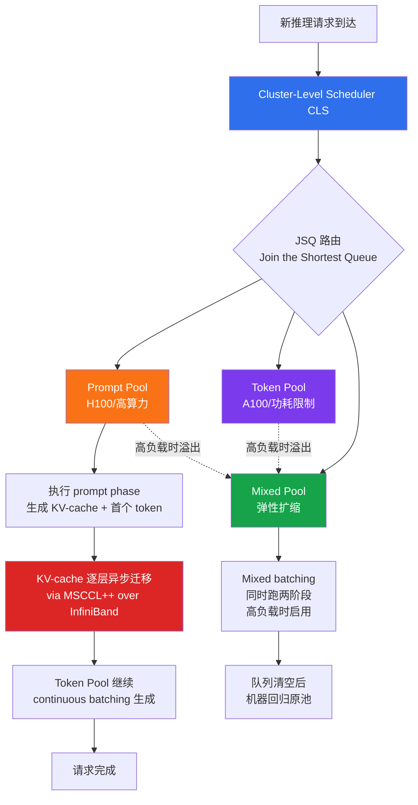
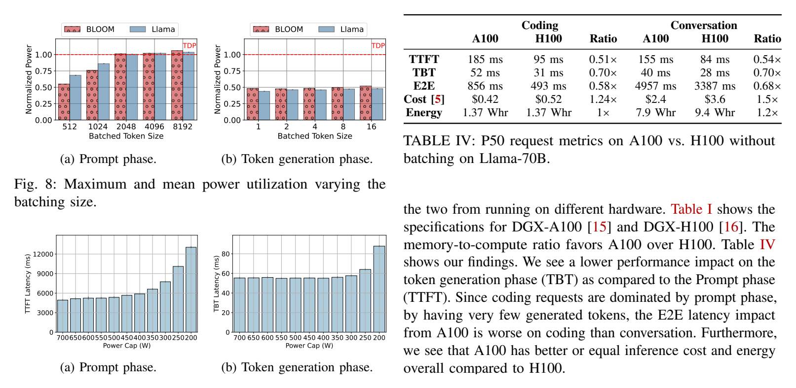

# 精读笔记：Splitwise — Efficient Generative LLM Inference Using Phase Splitting (ISCA 2024)

---

## ▎第一层 · 基本信息

| 字段 | 内容 |
|------|------|
| **论文** | Patel, Choukse, Zhang, Shah, Goiri, Maleki, Bianchini. *Splitwise: Efficient Generative LLM Inference Using Phase Splitting.* ISCA 2024. |
| **来源级别** | CCF-A 会议论文（UW + Microsoft Research，ISCA 体系结构顶会） |
| **链接** | arXiv:2311.18677v2 / 代码与 trace：https://github.com/Mutinifni/splitwise-sim + vLLM PR #2809 / 本地 PDF：`research/reference/splitwise_isca2024.pdf` |
| **阅读日期** | 2026-07-23 |
| **状态** | 精读完成 |
| **相关论文组** | LLM 推理服务 disaggregation / Prefill-Decode 分离 / 异构集群调度 / vLLM 生态 |

### 一句话核心结论

Splitwise 基于"prompt computation 是 compute-bound、token generation 是 memory-bound"这一画像，将 LLM 推理的两阶段**分离到不同 GPU 机器池**，配合优化的逐层 KV-cache 跨机迁移（overhead <7%），在 iso-power/iso-cost 下实现最高 2.35× 吞吐提升，并支持异构硬件（H100 做 prompt、A100 做 token）与 power-capping 以优化 Perf/$ 和 Perf/W。

`#LLM-inference` `#phase-disaggregation` `#prefill-decode-split` `#heterogeneous-pool` `#KV-cache-transfer` `#cluster-provisioning` `#ISCA2024`

---

## ▎第二层 · 论文结构分析

### 1. 问题拆解

| 问题 | 论文的回答 |
|------|-----------|
| 要解决什么痛点？ | 生成式 LLM 推理请求内部有两阶段——prompt computation（计算密集，吃 FLOPs）和 token generation（内存带宽/容量密集）——两阶段资源画像截然不同。强行在同一机器上用 mixed batching 跑，要么 prefill 抢占 decode 导致 TBT 尾延迟恶化，要么 decode 占满 batch 导致 prompt 阶段 GPU 计算利用率低；服务方只能 over-provision 昂贵 GPU 满足 SLO |
| 之前的方法为什么不够？ | vLLM/Orca 的 continuous/mixed batching 在同一 batch 内混合两阶段（图 2c），prefill 会拖慢 decode（Insight II：60-70% 时间 batch 里只有 ≤20 个 active token）。这些方案无法按阶段匹配硬件，也无法分别管理两阶段的资源、功耗、成本 |
| 论文的**核心论点** | 既然两阶段资源画像完全不同（Insight V：prompt compute-bound、token memory-bound；Insight VI/VII：token 对算力和功耗不敏感），就应**按阶段拆到不同机器池**，对每个池做 phase-specific 的硬件选择、功耗限制和 batch 策略，从而同时提升 Perf/$ 和 Perf/W |
| 它的**关键假设** | (1) 生成式 LLM 推理可清晰分两阶段，且阶段间过渡可被调度利用；(2) KV-cache 可在两池间以低开销迁移（依赖 InfiniBand 带宽 + 逐层 overlap）；(3) 负载分布可被 profiling 并据此静态/半静态地 provisioning 两个池的大小；(4) GPU 集群规模足够大，使分池不会导致严重碎片化（或用 mixed pool 吸收碎片） |

### 2. 方法拆解

**核心技术要点**：

1. **Phase splitting + 三池架构（§IV-A, Fig 10）**：维护 prompt pool、token pool、mixed pool 三个机器池。所有机器预装模型，新请求由 CLS 同时分配一台 prompt 机和一台 token 机（配对分配，便于 overlap KV-cache 迁移与 prompt 计算）。mixed pool 是弹性缓冲：当某池排队过长时，CLS 把对侧机器拉入 mixed pool 用 mixed batching 跑，队列清空后回归原池。混合池的机器"保留身份"，回归不产生明显延迟。

2. **Hierarchical two-level scheduling（§IV-A/§IV-B）**：
   - **CLS（Cluster-Level Scheduler）**：池管理 + 请求路由，用 **Join the Shortest Queue (JSQ)** 按待处理 token 数选 prompt 机和 token 机；机器定期上报内存容量和队列长度。
   - **MLS（Machine-Level Scheduler）**：每台机器内部维护 pending queue + 决定 batch 构成。**Prompt 机器**用 FCFS，硬限制 prompt batch 总 token ≤2048（因 Fig 6a 显示超 2048 吞吐下降，§IV-B）；**Token 机器**用 FCFS 并尽量打包，直到内存快满才排队（因 Fig 6b 显示 token 吞吐随 batch 线性增长到 batch 64 OOM）；**Mixed 机器**优先 prompt（可 preempt token），为防饿死给 token 加年龄优先级并限制单请求被 preempt 次数。

3. **逐层异步 KV-cache 迁移（§IV-C, Fig 11）**：naive 序列化迁移要等 prompt 算完才整体传输 KV-cache，阻塞下一个 token。Splitwise 在 prompt 机器每算完一层就触发该层 KV-cache 的异步传输（用 MSCCL++ 的 zero-copy one-sided put over InfiniBand，按 vLLM 的 KV block 粒度批量发，同 semaphore 的连续 block 合并传输）。小 prompt（<512 tokens on H100）用序列化更省事，大 prompt 用逐层。结果：overhead <7% prompt compute、0.8% E2E、第二 token 延迟仅增 16.5%（序列化为 64%）。

4. **Cluster provisioning 设计空间搜索（§IV-D, Fig 12）**：用事件驱动仿真器（SplitwiseSim）枚举 (prompt 机数 × token 机数) 二维空间，输入 trace 分布 + SLO + 性能模型（piecewise linear, MAPE <3%），按目标函数（iso-power / iso-cost / iso-throughput × min cost/power）选最优点。池配比反映负载分布：coding trace 长 prompt 短 output → 更多 prompt 机（如 Splitwise-HH coding: 35P, 5T）；conversation 短 prompt 长 output → 更多 token 机（如 25P, 15T）。

5. **四种部署变体（§IV-D, Table V）**：Splitwise-AA（两池均 A100）、Splitwise-HH（均 H100）、Splitwise-HA（H100 prompt + A100 token，据 Insight VII A100 对 token 阶段性价比更优）、Splitwise-HHcap（均 H100 但 token 池 power-cap 到 70%，据 Insight VI token 阶段对功耗不敏感）。

### 3. 实验拆解

| 维度 | 内容 |
|------|------|
| **数据集** | Microsoft Azure 两条生产 trace（coding 服务 + conversation 服务，2023-11-11 各 20 分钟）；trace 含到达时间、输入 token 数、输出 token 数（不含 prompt 内容，因隐私）。已开源子集到 AzurePublicDataset |
| **Baseline** | Baseline-A100（全 A100 + mixed continuous batching）、Baseline-H100（全 H100 + mixed continuous batching）；两者都是非 disaggregated 的同池方案。**未直接对比 Sarathi-Serve / DistServe（见第三层批判）** |
| **评价指标** | TTFT、TBT、E2E 三者的 P50/P90/P99；throughput (RPS, tokens/s)；cost ($/hr)、power (W)、space（机器数）。SLO 用相对 DGX-A100 无争用的 slowdown 倍数定义（Table VI：TTFT P50 2×/P99 6×，TBT/E2E P50 1.25×/P99 5×） |
| **消融实验** | ✅ 逐层 vs 序列化 KV-cache 迁移（Fig 14/15）；四种 Splitwise 变体互比（Fig 16-19）；workload 漂移鲁棒性（§VI-D，换 trace/换模型）；batch job 高负载场景（§VI-E，Splitwise 退化为 iso-count baseline） |
| **统计显著性** | ❌ 未报告方差/置信区间（但性能模型 MAPE <3%、仿真器用 50K+ iteration 端到端验证、覆盖 2 模型 × 2 trace × 4 集群设计，趋势一致提供一定可信度） |
| **复现条件** | 🟢 仿真器 + trace + vLLM KV-cache 迁移原型均开源（GitHub + Zenodo DOI）；硬件需两台 DGX-A100/H100 + InfiniBand 才能复现迁移实验，仿真器只需 x86 CPU |

### 4. 关键数字

| Claim | 数字 | 条件 |
|-------|------|------|
| 最大吞吐提升（同成本同功耗）| **2.35×** throughput | Splitwise 集群 vs Baseline，iso-cost + iso-power（Abstract / Conclusion） |
| 吞吐提升（同功耗，成本优化）| **1.76×** throughput + **15%** lower power at same cost | Conclusion |
| 吞吐提升（同成本）| **1.4×** throughput at **20%** lower cost | Splitwise-AA vs Baseline-H100, iso-cost（Abstract / Fig 18b: 25% lower cost for same throughput） |
| Splitwise-AA vs Baseline-A100 | **2.15×** throughput，同 power 同 cost | iso-power throughput-optimized, conversation trace（§VI-B） |
| KV-cache 迁移开销 | **<7%** prompt compute；**0.8%** E2E（序列化为 3%）；第二 token **+16.5%**（序列化 +64%）| coding trace, A100+H100 两机 setup（Fig 14/15, §VI-A） |
| Prompt batch 上限 | **2048** tokens（超此吞吐下降）| BLOOM-176B/Llama2-70B on H100, Fig 6a，写入 MLS 硬约束（§IV-B） |
| Token batch 上限 | **64**（吞吐线性增长至 OOM）| Fig 6b，token 池尽量打包直到内存满 |
| A100 vs H100 阶段敏感度 | TTFT ratio **0.51×**，TBT ratio **0.70×**（A100/H100）| Table IV，Llama-70B 无 batching；token 阶段对算力更不敏感 → 支持 Insight VII |
| Coding trace 池配比 | 35P, 5T（Splitwise-HH）| 长 prompt 短 output → prompt 池大 |
| Conversation trace 池配比 | 25P, 15T（Splitwise-HH）| 短 prompt 长 output → token 池大 |
| Batch job 高负载退化 | 0.89 RPS/$ (A100) / 0.75 RPS/$ (H100)，**Splitwise 退化为 iso-count baseline** | 无 SLO 约束、全部机器进 mixed pool（§VI-E） |

---

## ▎第三层 · 批判性评估

### 1. 假设检验

- **假设 1：生成式 LLM 推理可被清晰地切成 prompt + token 两阶段，阶段间无耦合**
  - 反例 / 边界：对**生成式 decoder-only LLM 成立**，但本课题的 **AI_EMBED / AI_CLASSIFY 是非生成式**（embedding / 分类，只跑一次前向、无自回归 decode）。对这些 workload，Splitwise 的整套分池逻辑（prompt pool / token pool / KV-cache 迁移）**完全不适用**——没有 token generation 阶段可分。论文 §VIII 承认"as long as the auto-regressive nature of the workload requires these two phases"，但未量化非自回归场景。
- **假设 2：KV-cache 迁移开销可被 InfiniBand + 逐层 overlap 压到可忽略**
  - 反例 / 边界：论文实验用的是数据中心级 InfiniBand（A100 setup 200 Gbps，H100 setup 400 Gbps）。§VIII 明确说"10× lower bandwidth would likely still be beneficial"但未实测；跨机架 / 跨可用区 / RoCE 场景开销未验证。对超长 prompt（KV-cache 几十 GB）即使逐层迁移也可能挤占带宽、影响 prompt 机器的下一 batch。论文只在 1500/1020 中位 prompt 上验证。
- **假设 3：负载分布可被静态 profiling，据此 provisioning 池配比**
  - 反例 / 边界：论文 §VI-D 自己测了 workload 漂移——当 conversation trace 跑在为 coding 设计的集群上，**Splitwise-HA/HHcap 因硬件异构无法变形，吞吐退步 7%**。只有 homogeneous 设计（AA/HH）能靠 mixed pool 变形。这说明**异构分池（HA）的前提是负载分布稳定可预测**，而真实多租户云负载是动态混合的。
- **假设 4：mixed pool 能吸收碎片化**
  - 反例 / 边界：mixed pool 本质是"退化回非 disaggregated"。§VI-E batch job 场景显示，高负载下 Splitwise **完全退化为 iso-count baseline**（所有机器进 mixed pool 跑 mixed batching）。这意味着 disaggregation 的收益**只在 SLO 约束下的中低负载区成立**——一旦打满，分池反而引入迁移开销却拿不到吞吐收益。
- **假设 5：两阶段资源画像差异足够大，值得付出迁移开销**
  - 反例 / 边界：Sarathi-Serve (OSDI 2024) 证明在**同一 replica 内**用 chunked-prefills + stall-free batching 也能消除 prefill-decode 干扰，且无需 KV-cache 跨机迁移。Splitwise 论文未直接对比 Sarathi-Serve（Sarathi-Serve 与 Splitwise 几乎同期发表），这一缺位是评估 disaggregation vs colocation 取舍的最大空白。

### 2. 边界探查

- **方法适用边界**：仅适用于**自回归生成式 LLM 且 SLO 约束下的中低负载**。非生成式（embedding/classification）、纯 batch job（无 SLO）、超高负载（接近饱和）三种场景下，disaggregation 要么不适用、要么退化。
- **扩展性限制**：(a) 模型更大（KV-cache 更大）→ 迁移开销增长，InfiniBand 可能成瓶颈；(b) 多轮对话场景（§VIII "Conversation back and forth"）需把 KV-cache 迁回 prompt 机或跨请求保持，论文承认这会改变 prompt 阶段内存画像；(c) MoE 模型的 expert 路由使 batch 构成更不均匀，uniform batch 假设需重检（论文 §VIII 只说"applicable"但无实验）。
- **复现难度**：🟡 部分。仿真器 + trace 全开源且只需 CPU，易复现；但 KV-cache 迁移原型需双 DGX GPU + InfiniBand，且是 vLLM PR（#2809）非主线合并，依赖 vLLM 版本演进可能失效。

### 3. 可信度评估

| 维度 | 评价 | 依据 |
|------|------|------|
| 实验公平性 | 🟡 有疑点 | Baseline 只用同池 mixed batching，**未对比 Sarathi-Serve（colocation + chunked-prefill）这条更强 baseline**；SLO 定义（Table VI）是 Splitwise 作者自定义的 slowdown 倍数，未引用工业标准；仿真器为主、硬件实验仅 2 机 setup |
| 结果显著性 | 🟢 显著 | 2.35× / 1.4× 级别提升，且在 2 模型 × 2 trace × 4 设计下趋势一致；KV-cache 迁移开销（0.8% E2E）的测量用真实硬件，数值干净 |
| 开源/可复现 | 🟢 全开 | trace + 仿真器 + vLLM 迁移原型 + Zenodo DOI，MIT/CC-BY 许可；仿真器性能模型 MAPE <3% 且用 50K iteration 端到端验证 |
| 论文自身局限 | 🟡 部分诚实 | 主动讨论了 batch job 退化（§VI-E）、workload 漂移 7% 退步（§VI-D）、多轮对话未解决（§VIII）、HA 异构难变形；但**未承认缺少 Sarathi-Serve / DistServe 对比**这一关键空白，也未量化非生成式 workload 的不适用性 |

### 4. 与同行工作的对比

- 比 **Sarathi-Serve (OSDI 2024)**：两者解决同一问题（prefill-decode 干扰），但路线相反——Splitwise **disaggregate**（分池 + KV-cache 迁移），Sarathi-Serve **colocate**（同 replica 内 chunked-prefill + stall-free batching）。Splitwise 的优势是 phase-specific 硬件选择（Perf/$、Perf/W），劣势是迁移开销 + 分池碎片化 + 需 InfiniBand。两者**未在任一篇中直接对比**，是本课题需要自己厘清的设计轴。
- 比 **DistServe (OSDI 2024)**：同为 prefill/decode disaggregation 路线，目标类似但 DistServe 更关注单请求 TTFT/TBT 最优，Splitwise 更关注集群级 throughput/cost/power provisioning。两者是 disaggregation 路线内部的不同侧重。
- 比 **vLLM (SOSP 2023)**：Splitwise 的 KV-cache 迁移原型**直接建在 vLLM 之上**（PR #2809），复用 PagedAttention 的 block 粒度 KV-cache。Splitwise 不改 PagedAttention 本身，而是加了一层跨机迁移 + 分池调度。
- 比 **Orca (OSDI 2022)**：Orca 提供 iteration-level batching 和 hybrid batch 的概念基础，Splitwise 的 mixed pool 机器用的就是 Orca 式 mixed continuous batching。
- 在 **[本课题]** 的坐标系中：Splitwise 是 **推理服务内部的部署层 disaggregation**——它在 vLLM/推理引擎层面把 prefill 和 decode 分到不同 GPU 机器。本课题在推理服务的**上游**：优化数据如何从数据库组织成请求、以什么节奏提交到推理服务。两者处于"推理服务的内外两侧"。Splitwise 的 phase 分池思想可类比迁移到本课题 RC2 的**异构 actor pool 分池路由**，但 actor ≠ GPU 机器、且本课题不修改 vLLM 内部。

---

## ▎第四层 · 与你课题的连接

### 1. 可引用的观点（配精确位置）

> §III Insight V + Fig 7：Batching during the prompt phase is compute-bound, whereas the token phase is limited by memory capacity.
> → 这是本课题 **RC2 异构 actor pool 分池路由**的**理论依据核心**：既然两阶段资源画像截然不同（一个吃算力、一个吃内存容量），按阶段/任务类型分池并匹配不同资源配置是合理的。本课题的异构 actor pool（如高 GPU actor 做重计算、轻量 actor 做轻计算/IO 密集）可以引用此画像结论作为分池动机。

> §III Insight VII + Table IV：Token generation can be run on less compute-capable hardware for better Perf/W and Perf/$ efficiencies.（TTFT ratio 0.51×，TBT ratio 0.70×，A100/H100）
> → 直接支撑本课题 RC2 的**异构 actor 配置**论点：不同计算量的请求应路由到不同规格的 actor。token generation 对算力不敏感（0.70×）而对 prompt 敏感（0.51×），意味着"按计算量分池"有量化依据，不是拍脑袋。

> §IV-B Prompt machines MLS：restricts the batching of multiple prompts together to **2048 tokens** in total. This is a configurable value.
> → 本课题 **RC1 token-budget 数据组织策略**的直接参考：prompt 阶段有明确的吞吐拐点（Fig 6a 的 2048 token），按 token 量而非行数组织 batch 是有依据的。Splitwise 的 2048 是单机 prompt batch 上限，本课题的 token-budget 是提交给推理服务的请求组——两者概念不同但"按 token 量控批"的原理一致。

> §IV-A Mixed pool：A machine in the mixed pool retains its identity as a prompt or token machine and goes back to its original pool once there are no tasks of the opposite kind in its pending queue.
> → 本课题 RC2 **queue-adaptive flush + actor pool 弹性扩缩**的参考：Splitwise 的 mixed pool 是"分池导致碎片化"的兜底机制。本课题的 actor pool 在负载不均时也可借鉴"临时跨池借调 + 队列清空后回归"的弹性策略。

> §IV-D Provisioning：We provision more prompt machines under Splitwise-HH (35P, 5T) for the coding trace, while we provision more token machines (25P, 15T) for the conversation trace.
> → 本课题 **RC1 + RC2 联合调优**的方法论参考：池配比应由负载的 input/output 分布决定。本课题的 actor pool 配比同样应根据 workload（AI_COMPLETE 的 prompt/output 分布、AI_EMBED 的固定长度）数据驱动地确定，而非静态拍定。

> §VI-E Batch job：At high load, Splitwise devolves into the iso-count Baseline ... since it starts mixed batching with all the machines in the mixed pool.
> → 本课题的**诚实边界**参考：disaggregation/分池的收益只在 SLO 约束下的中低负载成立；高负载下分池退化为同池。本课题若声称 actor 分池有收益，必须在实验中覆盖不同负载区间，不能只报中低负载的数字。

### 2. ⚠️ 不能过度引用的地方

- ❌ **不声称** "Splitwise 的 prefill/decode 分池 = 本课题的 actor pool 分池路由"——Splitwise 是**推理服务部署层**的 GPU 机器分池（改 vLLM、做 KV-cache 跨机迁移），本课题是**数据提交上游**的 Ray actor 分池（不进 vLLM、不迁移 KV-cache）。两者层级不同、对象不同。
- ❌ **不声称** "Splitwise 证明分池对所有 AI 算子都有效"——Splitwise 明确限定于**自回归生成式 LLM**（§VIII："as long as the auto-regressive nature of the workload requires these two phases"）。本课题的 **AI_EMBED / AI_CLASSIFY 是非生成式**，无 token generation 阶段，Splitwise 的分池逻辑对其**不直接适用**。AI_COMPLETE 才有 prefill/decode。
- ❌ **不声称** "Splitwise 的 2.35× / 1.4× 提升适用于本课题场景"——Splitwise 的数字是在 Microsoft Azure 生产 trace + DGX GPU 集群 + SLO 约束下测得的部署层收益。本课题的上游调度收益是另一层，数字不可移植。
- ❌ **不声称** "本课题借鉴 Splitwise 做 KV-cache 跨池迁移"——本课题**明确不修改 vLLM 内部**（PROJECT_OUTLINE 边界），不做 KV-cache 跨机迁移。Splitwise 的迁移机制是其 disaggregation 的核心成本，本课题不承担这一成本也不获取其收益。
- ❌ **不声称** "Splitwise 的 phase splitting 优于 Sarathi-Serve 的 colocation"——论文未做此对比，两路线各有取舍（disaggregation 得 phase-specific 硬件选择但付迁移开销 + 碎片化代价；colocation 无迁移开销但无法按 phase 匹配硬件）。本课题引用时必须保持中立。

### 3. 对本课题的实际用途

| 用途类型 | 具体方式 | 优先级 |
|----------|----------|--------|
| ✅ 设计参考（RC2）| **异构 actor pool 分池路由**的理论依据：phase-specific / 计算量-specific 资源画像差异（Insight V/VI/VII + Table IV）证明"按任务类型分池匹配不同资源"有效 | ⭐⭐⭐ |
| ✅ 设计参考（RC1）| **token-budget 数据组织**：prompt batch 2048 token 吞吐拐点（Fig 6a）是"按 token 量控批"的量化锚点 | ⭐⭐ |
| ✅ 设计参考（RC2）| **mixed pool 弹性机制**：分池碎片化时临时跨池借调 + 队列清空回归，可迁移到 actor pool 的 queue-adaptive 弹性调度 | ⭐⭐ |
| ✅ 方法论参考（算子代价估计）| **cluster provisioning 设计空间搜索**（二维枚举 + 仿真器 + 性能模型 MAPE <3%）：本课题"算子代价估计"补充研究内容可借鉴此方法论，用仿真枚举 actor pool 配比 | ⭐⭐ |
| ✅ 对照区分 | 本课题**不修改 vLLM、不做 KV-cache 迁移、处于上游**——与 Splitwise 做推理引擎内部 disaggregation 的路线明确区分 | ⭐⭐ |
| ⚠️ 适用边界说明 | AI_EMBED/AI_CLASSIFY 无 decode，Splitwise 分池不适用；仅 AI_COMPLETE 场景可类比 | ⭐⭐ |
| ⚠️ 动机证据 | phase 资源画像差异（compute-bound vs memory-bound）是上游"按计算量组织数据"的间接动机，但非本课题直接动机 | ⭐ |

### 4. 不足 → 你的机会

| 论文的不足 / 未回答的问题 | 你的课题可能如何填补 |
|--------------------------|---------------------|
| 只优化推理引擎/集群部署层，不考虑外部数据如何到达、以什么节奏到达 | 你的课题研究**上游数据组织 + 提交控制**：数据如何从数据库组织成请求、以什么节奏提交——填补 Splitwise 完全未触及的链路 |
| 未对比 colocation 路线（Sarathi-Serve / DistServe）| 你的课题可在 vLLM（colocation 默认）作为 S 级 baseline 的前提下，引用 Splitwise + Sarathi-Serve 两条路线，说明上游优化的收益**不依赖**推理引擎内部选哪条路线 |
| 仅适用于生成式 LLM，未量化 embedding/classification 场景 | 你的多模态泛化验证（AI_EMBED/AI_CLASSIFY 图像）正是不含 decode 的场景——Splitwise 不适用，凸显本课题"模态无关的上游调度"的独特价值 |
| 分池 provisioning 是静态的（基于 trace profiling），workload 漂移时 HA/HHcap 退步 7% | 你的 RC2 queue-adaptive flush + K_max 动态控制可以根据推理服务**实时状态**调节，比 Splitwise 的静态池配比更自适应 |
| 不考虑请求的数据来源（来自哪张表、有无 schema、可否 prefix 共享）| 你的场景数据来自 PostgreSQL 表，有明确 schema——可用于 prefix-aware grouping（相同 system prompt 共享 KV prefix），这是 Splitwise 完全没有的上游信息优势 |
| KV-cache 迁移开销依赖专用 InfiniBand，未量化低带宽场景 | 你的课题不迁移 KV-cache（不进 vLLM），上游 actor 间只传 Arrow batch——对网络带宽的依赖形态不同 |

### 5. 可论文化的措辞

> Patel et al. [Splitwise, ISCA 2024] 通过刻画生成式 LLM 推理的两阶段资源画像，证明 prompt computation 是 compute-bound、token generation 是 memory-bound，并据此将两阶段分离到不同 GPU 池。本课题借鉴其"按计算量/任务类型分池匹配异构资源"的核心思想，但将其从推理服务部署层上移到数据提交上游：在不修改 vLLM 内部的前提下，用异构 Ray actor pool 对应不同计算量 profile 的请求，实现上游的分池路由。

> Splitwise 的 phase 分池（§IV）和本课题的 actor pool 分池路由（RC2）共享同一理论依据——不同计算量的任务有不同的资源画像，应匹配不同资源（Splitwise Insight V/VI/VII + Table IV）。两者的区别在于作用层级：Splitwise 在推理引擎内部按 prefill/decode 分 GPU 机器并迁移 KV-cache，本课题在上游按请求计算量分 Ray actor 且不进入推理引擎内部。

> Splitwise 的适用边界（§VIII："as long as the auto-regressive nature of the workload requires these two phases"）表明，phase 分池仅对生成式 LLM 有效。本课题的主场景包含非生成式的 AI_EMBED/AI_CLASSIFY（无 decode 阶段），Splitwise 不直接适用——这正凸显本课题设计"模态无关的上游调度策略"的必要性：token-budget → frame-budget 的泛化不依赖推理引擎内部的 phase 结构。

> 与 Splitwise 在高负载下退化为同池（§VI-E）类似，本课题的分池路由策略也需在实验中覆盖不同负载区间，验证中低负载的分池收益与高负载的退化边界。

### 6. 后续待读

- [ ] [[sarathi_serve_osdi2024]] — **已精读**。colocation 路线（chunked-prefills + stall-free batching），与 Splitwise disaggregation 路线形成本课题需厘清的核心设计轴
- [ ] **DistServe** (Zhong et al., OSDI 2024) — 另一 prefill/decode disaggregation 方案，与 Splitwise 目标类似但设计不同，需对比两篇的迁移机制和 provisioning 逻辑
- [ ] **POLCA** (Patel et al., 2023, ref [62]) — Splitwise 同作者关于 LLM 云功耗 oversubscription 的工作，支撑 Perf/W 分析
- [ ] **AlpaServe** (Li et al., OSDI 2023, ref [53]) — 统计多路复用 + 模型并行的 serving，与 Splitwise 的池化思路对照
- [ ] **Orca** (Yu et al., OSDI 2022, ref [81]) — iteration-level batching 原始论文，Splitwise mixed pool 的理论基础
- [ ] **vLLM** (Kwon et al., SOSP 2023, ref [51]) — PagedAttention 原论文，本课题部署平台核心，Splitwise 的实现底座

---

## 元反思

- **精读收益**：🟢 高（Splitwise 是本课题 RC2 异构 actor pool 分池路由的**主要理论依据**，phase-specific 资源画像 + 分池 provisioning 方法论直接可用；但其 disaggregation 路线与本课题上游路线的边界必须严格区分）
- **是否纳入核心文献库**：是
- **计划复习周期**：2 周后复习（与 RC2 actor pool 分池路由实验设计前的重读同步；届时需配合 Sarathi-Serve 重读，厘清 disaggregation vs colocation 的取舍）
- **一句话自评**：理解到位。Splitwise 的价值在于用严谨画像证明了"按阶段/计算量分池匹配异构资源"有效（Insight V/VI/VII + Table IV），这是本课题 RC2 分池路由的核心引用；但其"推理服务部署层 + 改 vLLM + KV-cache 迁移 + 仅生成式 LLM"的边界，决定了本课题只能借鉴思想、不能照搬机制。最大未解问题：Splitwise 未对比 Sarathi-Serve，本课题需自行厘清两条路线对上游调度的影响差异。

---

## 相关笔记

- [[sarathi_serve_osdi2024]] — colocation 路线，与 Splitwise disaggregation 形成设计轴
- [[tpl-文献精读-深度版]] — 本模板
- [[文献地图]] — 文献全景
- [[ai_operator_literature_inventory]] — 完整文献清单

## ▎配图（辅助讲解）

> 
>
> **图 10 · Splitwise high-level system diagram（三池架构）**。对应方法拆解的三池架构：prompt pool / token pool / mixed pool。CLS 把新请求同时配到一台 prompt 机和一台 token 机（便于 overlap KV-cache 迁移与 prompt 计算），mixed pool 做弹性缓冲。读图重点：phase splitting 如何在机器池层面落地。
