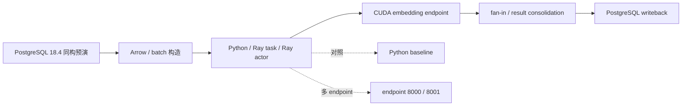
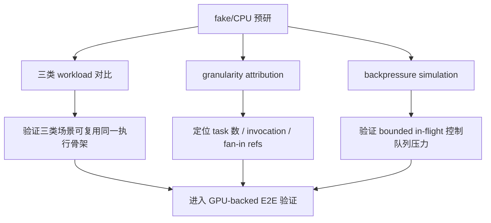

# 硕士生论文开题报告

题目：面向数据库驱动 AI 工作负载的分布式数据执行与存储协同优化研究

## 1. 课题背景、目的和意义

数据库系统正在从管理结构化数据，扩展到承载文本、图像、向量和模型推理结果等 AI 数据处理任务。Snowflake Cortex AISQL、BigQuery AI、Oracle `VECTOR_EMBEDDING`、PostgreSQL 生态中的 pgvector、pgai 和 PostgresML 等系统或组件表明，用户已经希望在 SQL 或数据库工作流中直接发起 embedding、分类、过滤、摘要、抽取和生成等 AI 操作。结合本项目已有场景分析，当前可落地的数据库 AI 算子主要包括三类：批量 embedding / RAG ingestion、`AI_FILTER` / `AI_CLASSIFY` 类 AI predicate，以及 `AI_COMPLETE` / 离线 LLM 生成与抽取。

这类操作和传统 SQL 算子不同。传统数据库执行器主要关注 scan、filter、join、aggregate、sort 等关系算子，而 AI workload 会把数据库变成数据入口和结果落点：表数据需要被组织为 batch 或 Arrow RecordBatch，经由 Daft 类数据处理层完成 partition、batch、shuffle 等数据流组织，再交给 Ray task/actor 或 actor pool 调度 GPU-backed 模型服务，最后将 embedding、分类结果或生成文本写入 Lance、pgvector、PostgreSQL 表或其他 AI 数据存储。端到端性能不只由模型推理决定，还可能受数据组织、任务划分、模型服务队列、fan-in、写回批量和反压策略影响。

本课题的研究目的，是面向数据库驱动的 AI workload，建立一条可观测、可替换、可消融的分布式数据执行与存储链路，并研究 Daft/Ray/Lance 类系统中数据组织、并行调度、GPU 推理服务调用和结果持久化之间的协同优化方法。数据库 AI 算子在本文中主要作为 workload 入口和验证场景，不作为单独的数据库内核问题；Daft、Ray 和 Lance 则分别对应数据流组织、分布式执行调度和 AI 数据持久化三个系统层次。与传统数据库 GPU 查询算子或模型 kernel 优化相比，本课题更关注 AI workload 在数据执行系统中的批处理、调度、反压和存储协同。

课题的理论意义在于，将数据库 AI workload 从单一 SQL 函数调用扩展为可观测、可拆分、可优化的数据执行系统问题，补充现有数据库执行优化、分布式数据处理框架和 AI 推理服务系统之间的研究空白。课题的应用意义在于，为 PostgreSQL / pgvector、Daft/Ray 执行层、GPU-backed 模型服务和 Lance 类 AI 数据存储之间的协同执行提供实验依据和方法参考。

## 2. 国内外研究现状

### 2.1 数据库 AI SQL 算子现状

Snowflake Cortex AISQL 提供 `AI_COMPLETE`、`AI_CLASSIFY`、`AI_FILTER`、`AI_EMBED` 等函数，说明 AI SQL 算子已经进入工业系统。BigQuery ML / BigQuery AI 和 Oracle AI Vector Search 也提供了从表数据调用模型或生成向量的能力。这些系统证明数据库已经成为 AI workload 的重要入口，但多数托管系统内部执行细节不可见，难以作为本课题可拆分的实验 baseline。

这类系统说明，研究重点不应停留在“模型能否被 SQL 调用”，而应进一步分析大量表数据进入 AI 数据执行系统后，如何被批处理、调度、推理和持久化。Snowflake 文档中 embedding、filter/classify、completion 等函数的并存，对应本项目三类 workload 的划分：向量生成与写回、AI predicate 批处理、离线生成式推理。它们用于定义工作负载，不直接决定本文的系统实现路线。

### 2.2 PostgreSQL AI 生态现状

PostgreSQL 生态中，pgvector 负责向量类型、索引和相似度检索；pgai 曾提供 PostgreSQL + stateless vectorizer worker + embedding endpoint + 写回数据库的执行形态；PostgresML 代表把模型能力放到数据库内或近数据库执行的路线。这些系统说明 PostgreSQL 生态确实存在 AI 数据处理需求，但也提示本课题需要区分“模型靠近数据库执行”和“外部 worker / 模型服务执行”两种路线。

pgvector 能支撑向量结果的存储和检索，但不负责 embedding 计算。pgai 的 vectorizer worker 形态更接近本课题关注的数据库表、外部模型服务和写回过程，但其工程实现不宜直接作为长期核心依赖。PostgresML 代表另一类对照路线，即把模型执行能力放在数据库内或数据库附近。

### 2.3 分布式数据与 AI 执行框架现状

Ray 支持 task、actor、object store、资源声明和模型服务相关组件；Daft 可以运行在 Ray 上，提供 partition、batch、shuffle、join 等数据处理抽象；Lance 和 Arrow 面向列式、向量和 AI 数据场景。这些框架共同构成本文关注的 AI 数据执行链路：Daft 负责数据组织和批处理计划，Ray 负责分布式任务执行和资源调度，Lance / pgvector / PostgreSQL 负责结果持久化和后续检索。本文不把 Daft/Ray/Lance 写成固定产品集成，而是以它们为开放可控的系统载体，研究数据库驱动 AI workload 在数据组织、调度和存储层之间的性能问题。

Spark SQL、Daft 和 Ray 文档都强调 partition、shuffle、batch、object 数量和 task 粒度对性能的影响。它们说明本课题关注的粒度控制和数据移动问题有系统研究基础。但数据库驱动 AI workload 还额外引入模型服务队列、GPU-backed endpoint、token-aware batching、prefix-aware routing、写回一致性和失败重试等问题，需要在真实 GPU-backed 执行链路中重新验证。

### 2.4 当前研究存在的问题

当前研究和系统实践中仍存在以下问题。

第一，现有 AI SQL 系统证明了需求，但托管系统内部执行过程通常不可见，难以拆分数据库读取、批处理构造、模型服务调用、fan-in 和写回的阶段成本。

第二，现有分布式执行框架提供了 task、actor、batch、shuffle、routing 等机制，但这些机制在数据库驱动 AI workload 中如何与 GPU 推理服务和 AI 数据存储组合，仍缺少面向端到端执行过程的验证。

第三，模型服务侧的 queue wait、bounded in-flight、token backlog、endpoint routing 与数据库侧 writeback 往往被分开讨论，缺少统一的协同优化视角。

第四，embedding、AI predicate 和 offline LLM completion 的执行压力不同。单一 embedding 场景不足以证明方法适用于更一般的数据库驱动 AI workload。

第五，已有本地预研显示，task 数、operator invocation、object 数、fan-in 依赖和模型服务队列可能同时影响执行过程。仅把问题写成 object/fan-in 或仅写成 Ray 调度都过窄；需要把 Daft 数据组织、Ray 并行执行、GPU 模型服务状态和 Lance / 数据库写回压力放在同一条 AI 数据执行路径中分析。

## 3. 研究目标与研究内容

### 3.1 研究目标

本课题的总体目标是：面向数据库驱动 AI workload，构建基于 Daft/Ray/Lance 类系统机制的端到端实验链路，分析数据组织、task/actor 调度、GPU 模型服务请求、fan-in、backpressure 和持久化写回的瓶颈形态，并提出分布式数据执行与存储协同优化方法。

具体目标包括：

1. 建立数据库驱动 AI workload 的分阶段执行画像方法，明确 DB fetch、Arrow/Daft batch、Ray task/actor、model request wall、fan-in 和 sink writeback 等阶段边界。
2. 分析 batch 粒度、partition 数、operator invocation 粒度和 object 合并方式对端到端性能的影响。
3. 研究 GPU 推理服务状态感知的 Ray 并行调度、endpoint routing 与反压策略，避免无界提交导致 queue wait 和 token backlog 放大。
4. 研究结果汇聚与 AI 数据持久化协同优化，比较 driver fan-in 后统一写回、worker 写回、vectorizer-like queue worker 写回和 Lance / pgvector 等 sink。
5. 通过 `AI_EMBED`、`AI_FILTER/AI_CLASSIFY` 和 `AI_COMPLETE` 三类 workload 验证方法的适用范围，分别覆盖向量写回、AI predicate 选择率和 token / prefix / queue 感知推理三类压力。

### 3.2 研究内容

阶段划分、执行画像和瓶颈归因用于支撑动机测试、方案设计和效果评价。围绕这些观测结果，本课题进一步研究以下三个可优化、可验证的方法问题。

研究内容一：AI workload 感知的数据组织与批处理构造方法。

数据库驱动 AI workload 进入分布式数据执行系统时，首先要解决的问题是如何把数据库中的行、文本、向量和中间结果组织成合适的 batch、partition 和 object。难点在于，数据组织策略既影响模型服务调用次数，也影响后续 Ray task 数、ObjectRef 数、fan-in 依赖和写回批量；不同 workload 的输入输出形态也不同：embedding 会产生高维向量，AI predicate 的输出行数受 selectivity 影响，LLM 类 workload 的 token 长度和共享 prefix 会影响 batch 的实际成本。如果只固定一个 batch size 或 partition 数，容易得到只在单一数据规模和单一 workload 上有效的策略。

本课题拟把 workload 特征引入 Daft/Arrow 数据组织与批处理构造过程。策略输入包括输入行数、单行文本长度、输出大小、token 数、selectivity、共享 prefix、目标 sink 类型和写回批量约束；策略输出包括 batch size、partition 数、operator invocation 粒度、object 合并方式和下游 fan-in 形态。实验中比较逐行调用与 batch 调用、不同 partition 数、不同 object 合并方式和不同输出规模下的端到端表现，分析数据组织策略在三类 AI workload 中的适用边界。

评价时与固定 batch、固定 partition、固定 object 粒度和逐行调用等方案对比。指标包括端到端耗时、rows/s、tokens/s、operator invocation 数、object 数、task 数、fan-in time、writeback time 和 model request wall time。消融实验分别固定 batch 只改变 partition、固定 partition 只改变 object 合并方式、固定 workload 只改变输出规模，用来判断收益来自请求合并、object / fan-in 减少，还是写回批量改善。

研究内容二：GPU 推理服务状态感知的 Ray 并行调度与反压控制方法。

AI workload 的执行瓶颈不只来自数据切分，也来自 GPU 推理服务的动态状态。难点在于模型服务的 queue wait、replica backlog、bounded wait、GPU utilization 和 token throughput 会随 batch、并发度和请求长度变化；Ray task/actor 提交过快时，表面上提高了并行度，实际可能只是把等待堆到模型服务队列中。单 endpoint 下 Ray 不一定优于 Python，多 endpoint 或多 replica 下 Ray 才可能通过并发 routing、actor pool 和反压控制体现价值。

本课题拟构建 GPU 推理服务状态感知的 Ray 调度策略，在数据组织阶段给定 batch 和 partition 后，根据 endpoint 数量、队列等待、replica backlog、token 长度和 GPU 利用率调节 actor 数、请求分配、routing 和 in-flight 上限。该方法不把 Ray 简化为“是否比 Python 快”的二元对比，而是研究 Ray runtime 在多 endpoint、多 replica、token 长短不均和服务端排队存在时如何调节并行度和资源使用。

评价时比较 Python 顺序执行、Ray task、Ray actor、actor pool、single endpoint、multi endpoint、unbounded in-flight 和 bounded in-flight 等方案。指标包括端到端耗时、operator wall time、model request wall time、queue wait、bounded wait、tokens/s、endpoint 利用率和 GPU utilization。消融实验分别固定 batch 粒度只改变 Ray 形态，固定 Ray 形态只改变 endpoint 数量，固定 endpoint 只改变 in-flight 策略，用来判断收益来自并发 routing、服务端排队控制还是单纯请求合并。

研究内容三：面向 AI 数据流的结果汇聚与 Lance / 数据库持久化协同方法。

模型调用阶段被优化后，结果持久化可能成为新的端到端限制。本部分研究 fan-in、worker 并行度和 AI 数据 sink 如何配合。难点在于 AI workload 结果不一定是传统标量：embedding 会产生高维向量，AI predicate 会改变写回行数，LLM 类 workload 会产生变长文本。所有结果先在 driver fan-in 后统一写回，可能抵消并行阶段收益；worker 各自写回，又会带来连接、事务、批量写入、失败重试和一致性控制问题。Lance / Parquet、pgvector 和 PostgreSQL JSON text 的写入特征不同，也会改变上游调度策略的收益边界。

本课题拟比较 driver fan-in 后统一写回、worker-side writeback、vectorizer-like queue worker 写回等方式，并在 PostgreSQL JSON、pgvector(384)、Lance / Parquet 等 sink 上记录端到端影响。同时分析模型调用并行度、fan-in 位置、写回批量大小、连接数和 sink 类型之间的关系，使持久化策略能够与上游 Daft batch、Ray 调度和反压策略配合。

评价时比较不同写回路径的 writeback time、端到端耗时、吞吐、失败重试成本和结果一致性边界。消融实验分别固定模型调用策略只改变写回方式，固定写回方式只改变 worker 并行度，固定 sink 只改变写回批量大小，以判断写回是否限制模型服务优化收益，以及 worker-side writeback 或 queue worker 是否能降低 driver fan-in 压力。三类 workload 用作适用边界验证：embedding 关注向量写回，AI predicate 关注选择率和下游数据量变化，LLM 类 workload 关注 token / prefix / queue-aware 调度。

### 3.3 总体研究框架

本课题的总体框架如图 3-1 所示。数据库 AI workload 是场景入口，统一进入由 Daft/Arrow 数据组织、Ray 分布式执行、GPU 模型服务和 Lance / 数据库 sink 组成的可观测执行链路；研究内容一关注数据组织与批处理构造，研究内容二关注 Ray 并行调度与模型服务反压，研究内容三关注结果汇聚与持久化协同。三类 workload 用于验证策略边界，避免把方法只建立在单一 embedding 场景上。


图 3-1 课题总体研究框架。数据库 AI workload 作为入口，Daft/Arrow、Ray、GPU 模型服务和 Lance / 数据库 sink 共同构成研究对象；数据组织与批处理构造、服务感知调度和持久化协同分别构成三个研究内容，并通过对照实验和消融实验验证。

## 4. 研究方案与可行性分析

### 4.1 研究方案

本课题采用“可控执行路径构建 -> 阶段画像 -> 大块消融 -> 方法设计 -> 多 workload 验证”的研究路线。

基础执行路径如下：

```text
Database AI workload source
  -> Daft / Arrow RecordBatch / batch construction
  -> Ray task / Ray actor / actor pool
  -> GPU-backed model service
  -> fan-in / result consolidation
  -> Lance / pgvector / PostgreSQL sink
```

第一阶段以 `AI_EMBED(text)` 为主，跑通真实 GPU-backed embedding endpoint，并记录分阶段指标。第二阶段做大块消融，包括 Python vs Ray、single endpoint vs multi endpoint、fine vs coalesced batch、driver writeback vs worker writeback、unbounded vs bounded in-flight。第三阶段引入 `AI_FILTER/AI_CLASSIFY` 与 `AI_COMPLETE`，验证方法是否能覆盖输出小但调用多、token 长度不均、prefix 共享和队列反压等不同瓶颈形态。

评价指标包括端到端耗时、rows/s、tokens/s、operator wall time、model request wall time、queue wait、bounded wait、fan-in time、writeback time、object 数、task 数、endpoint 利用情况和 GPU utilization。实验分析将区分实验现象、原因解释、适用边界和后续待验证问题。

拟解决的关键技术问题包括：

1. 数据库驱动 AI workload 的端到端成本如何拆分。需要避免只用总耗时判断系统瓶颈，而要把数据库读取、Daft / Arrow batch 构造、Ray execution、模型服务请求、fan-in 和 sink writeback 分开记录。
2. 数据组织和任务粒度如何影响批处理执行过程。初步实验显示逐行模型调用会显著放大 external operator wall time，但实际收益来源可能同时来自 partition 数、task 数、operator invocation 数、Ray refs、object 数和 fan-in 依赖数，需要进一步消融。
3. Ray 的价值边界是什么。当前单 endpoint 下 Python、Ray task、Ray actor 差距不大；多 endpoint 下 Ray 开始体现并发路由价值。因此需要研究 Ray 在多 replica、routing、反压和 worker 写回中的适用条件。
4. 持久化写回是否会限制端到端收益。2026 年 7 月 14 日真实 GPU-backed 复测显示，在 4096 行 coalesced 执行中，加入 PostgreSQL JSON text 写回后端到端时间从 `1.944s` 增至 `3.420s`，其中写回为 `1.557s`；8192 行时写回为 `3.159s`。后续如果只优化模型调用，收益可能被 Lance / pgvector / PostgreSQL sink 阶段限制。
5. 如何从 embedding 场景扩展到更一般的 AI workload。`AI_EMBED` 容易形成 pgvector 写回闭环；`AI_COMPLETE` 会引入 token-aware batching、prefix-aware routing、模型服务队列和失败重试；`AI_FILTER/AI_CLASSIFY` 则需要 selectivity-aware 执行和 cascade 策略。三类 workload 对应不同的执行压力，用来验证方法是否只适用于单一 embedding 场景。

三类 workload 的选择依据不是为了罗列更多应用，而是为了覆盖数据库 AI 算子中三种不同的系统压力。`AI_EMBED` 对应批量 embedding / RAG ingestion，外部依据来自 Snowflake `AI_EMBED`、pgvector 和 pgai vectorizer worker 形态，项目中也已经完成真实 GPU-backed `AI_EMBED` 链路画像，因此它适合作为第一阶段的真实端到端 baseline。`AI_FILTER/AI_CLASSIFY` 对应 AI predicate 和分类过滤，外部依据来自 Snowflake `AI_FILTER` / `AI_CLASSIFY` 等 AI SQL 函数；它的特点是输出小、模型调用次数多、选择率会影响下游数据量，适合验证 selectivity-aware 执行和模型调用次数控制。`AI_COMPLETE` / offline LLM 对应离线生成、抽取和评测，外部依据来自 Snowflake `AI_COMPLETE`、BigQuery `ML.GENERATE_TEXT`、Ray Data offline batch inference、Ray Serve dynamic batching 和 vLLM offline inference；它引入 token 长度、共享 prefix、队列等待和失败重试，适合验证更接近推理基础设施的 token-aware / prefix-aware 调度。三者共用同一条数据库读取、批处理组织、Ray 执行、模型服务调用和写回链路，但分别放大向量写回、选择率变化和 token / queue 三类压力。

调优变量的选择也有对应依据。batch、partition、task/actor 和 object 粒度来自 Ray/Daft/Spark 等分布式执行系统的官方文档和性能调优经验；本项目 fake/CPU 三类 workload 预研在 `upstream=32, downstream=32` 时观察到 fine/coalesced e2e 比值约为 `4.01x`、`4.32x`、`4.37x`，说明这些变量对统一执行骨架有明显影响。endpoint routing 和 bounded in-flight 来自 Ray Serve dynamic batching / routing、vLLM offline inference 等模型服务机制；本项目 backpressure 模拟显示 `queue_limit=8` 在不提高 tokens/s 的情况下把平均 queue wait 从 `4768.50 ms` 降到 `114.41 ms`，说明无界提交会放大队列压力。writeback 和 fan-in 来自 pgai vectorizer worker、pgvector / Lance 存储形态以及当前 GPU-backed 链路画像；在 4096/8192 行 `AI_EMBED` 复测中，PostgreSQL JSON text writeback 已经是全链路里的大块成本，说明只优化模型调用并不能保证端到端收益。因此，本文调这些变量是由外部系统机制和本项目实验信号共同支撑，而不是凭经验任意选择。

### 4.2 可行性分析

目前已完成本地 PostgreSQL 18.4 同构预演环境、PG18.4 + pgvector 连接验证、pgai SQL trigger surface 冒烟验证、真实 GPU-backed embedding 端到端画像和双 endpoint Ray 动机测试。2026 年 7 月 14 日，在 pgai SQL 触发面集成后，本项目重新启动 `8000` 和 `8001` 两个本地 CUDA embedding endpoint，并对 batch 粒度、全链路写回、单双 endpoint 和数据规模进行了关键复测。PG18.4 仅作为 PostgreSQL 18.3 内部平台的本地预演替身，相关结果用于验证实验方法和瓶颈形态，不代表 PostgreSQL 18.3 内部平台性能。

表 4-1 汇总了当前可行性证据的来源、作用和边界。可以看出，本课题已经具备数据库读写、Arrow batch、Ray task/actor、GPU-backed endpoint 和写回阶段计时的基础；同时，CPU/fake 结果只用于解释早期问题来源，不能作为真实 GPU 链路结论。



图 4-1 当前已跑通的 GPU-backed 数据库驱动 AI workload 画像链路。该链路覆盖数据库读取、batch 构造、Ray/Python 执行、模型服务调用、fan-in 和写回，能够支撑后续数据组织、调度与写回协同优化实验。

| 证据来源 | 已完成内容 | 支撑的可行性 | 边界 |
|---|---|---|---|
| PG18.4 连接验证 | PostgreSQL 18.4 + pgvector 可连接、可读写 | 数据库和向量扩展环境可用 | 只证明环境可用，不证明性能收益 |
| PG18.4 fake-model 画像 | PostgreSQL -> Arrow -> Python/Ray -> fake operator -> writeback | 阶段计时口径和脚本链路可运行 | fake-model 结果不能外推为真实 GPU 瓶颈 |
| GPU-backed `AI_EMBED` 画像 | PostgreSQL -> Arrow -> Ray/Python -> CUDA embedding endpoint -> writeback | 真实模型服务可接入端到端执行路径；7 月 14 日复测覆盖 batch、writeback、endpoint、规模和 pgvector(384) sink 对比 | PG18.4 本地预演，不代表 PostgreSQL 18.3 内部平台性能 |
| 双 endpoint Ray 动机测试 | Ray actor 调用 `8000` / `8001` 两个本地 endpoint | 可验证并发 routing 对 operator wall time 的影响 | 两个 endpoint 在同一 GPU 上，不代表多 GPU 或 Ray Serve 结论 |
| 三类 workload 预研 | `AI_EMBED`、`AI_FILTER/AI_CLASSIFY`、`AI_COMPLETE` 的 fake/CPU 对比 | 说明三类场景可复用同一执行骨架 | 只作为机制提示和实验设计依据 |

真实 GPU-backed `AI_EMBED` 复测首先说明，batch 粒度本身会显著影响端到端执行。表 4-2 中，1024 行 fine 策略发起 1024 次 endpoint 调用，coalesced 策略只发起 4 次调用；在无写回条件下，fine 的端到端耗时约为 coalesced 的 `37.5x`。这说明在真实 CUDA embedding endpoint 接入后，逐行调用不是合理 baseline，批处理执行是必须研究的对象。


图 4-2 逐行调用与 batch 调用的端到端对比。fine 策略将 endpoint 调用数从 4 次放大到 1024 次，在无写回条件下端到端耗时约为 coalesced 的 `37.5x`，说明模型服务调用粒度是必须控制的一阶成本。该图采用对数横轴以同时显示 `0.550s` 和 `20.614s` 两个量级。

| 行数 | 执行方式 | 策略 | endpoint 调用数 | e2e_s | operator_wall_s | writeback_s | 结论 |
|---:|---|---|---:|---:|---:|---:|---|
| 1024 | Python | coalesced | 4 | 0.550 | 0.537 | 0.000 | 无写回条件下的 batch 调用基线 |
| 1024 | Python | fine | 1024 | 20.614 | 20.597 | 0.000 | 逐行调用显著放大 operator 阶段 |
| 4096 | Python | coalesced | 16 | 1.944 | 1.915 | 0.000 | 观察无写回时模型请求阶段 |
| 4096 | Python | coalesced | 16 | 3.420 | 1.834 | 1.557 | JSON 写回接近端到端时间的一半 |
| 4096 | Ray actor | coalesced | 16 | 3.621 | 2.009 | 1.585 | 单 endpoint 下 Ray actor 不天然优于 Python |
| 8192 | Python | coalesced | 32 | 7.100 | 3.903 | 3.159 | 规模放大后模型请求与写回同步增长 |

表 4-2 还说明，单 endpoint 下 Ray 并不天然优于 Python。4096 行 coalesced 场景中，Python + JSON 写回的端到端时间为 `3.420s`，Ray actor 单 endpoint 为 `3.621s`。因此，后续研究需要进一步分析 Ray 在多 endpoint、bounded in-flight、routing、actor pool 和 worker-side writeback 等条件下的适用范围，而不能把 Ray 简化为“默认更快”的执行方式。


图 4-3 数据库到 GPU 再到写回的链路阶段时延。该图使用 2026 年 7 月 14 日真实 GPU-backed CSV，以 4096 行无写回、4096 行 JSON 写回和 8192 行 JSON 写回为对照，并在每个场景内部堆叠 DB fetch、Arrow build、GPU model request wall、fan-in、sink writeback 和 residual。结果表明，GPU 模型调用变快后，PostgreSQL JSON text writeback 在 4096 行时占 `1.557s`，在 8192 行时占 `3.159s`，已经成为端到端时间中的大块成本。

双 endpoint 实验进一步补充了 Ray 的使用动机。表 4-3 中，4096 行、16 个 coalesced batch 下，Ray actor 单 endpoint 的端到端时间为 `3.621s`，双 endpoint 为 `2.862s`；`model_request_wall_s` 从 `1.933s` 降到 `1.204s`，`operator_wall_s` 从 `2.009s` 降到 `1.292s`。但 writeback 分别为 `1.585s` 和 `1.541s`，几乎不随 endpoint 数量下降，说明写回会限制端到端收益。


图 4-4 双 endpoint 场景下 Ray actor 的端到端对比。两个本地 CUDA endpoint 可以降低 model request wall time 和 operator wall time，但端到端收益仍受 writeback 约束。两个 endpoint 是同一张 RTX 5070 上的本地服务副本，不能写成多 GPU 结论。

| 行数 | 执行方式 | endpoint 数 | e2e_s | model_request_wall_s | operator_wall_s | writeback_s | 结论 |
|---:|---|---:|---:|---:|---:|---:|---|
| 4096 | Ray actor | 1 | 3.621 | 1.933 | 2.009 | 1.585 | 单 endpoint 下 operator 与写回都是大块时间 |
| 4096 | Ray actor | 2 | 2.862 | 1.204 | 1.292 | 1.541 | 双 endpoint 降低 operator 阶段，但写回基本不变 |

为了确认 JSON text 写回是否会误导对 sink 成本的判断，本项目进一步在同一条 GPU-backed Ray actor 链路中补充了 no writeback、JSON text 和 pgvector `vector(384)` 三种落盘方式的对比。实验使用 4096 行、16 个 coalesced batch、一个 CUDA embedding endpoint、`embedding_dim = 384` 和 `write_batch_rows = 512`，只改变 `writeback_mode`。pgvector 组运行后，数据库中 4096 行 `embedding_vector` 非空，`vector_dims(embedding_vector)` 的最小值和最大值均为 384。


图 4-5 no writeback、JSON text 和 pgvector(384) 写回对比。formal repeat 均值显示，no writeback 的端到端时间为 `1.635s`；JSON text 写回为 `3.198s`，其中 `writeback_s = 1.567s`；pgvector `vector(384)` 写回为 `2.524s`，其中 `writeback_s = 0.897s`。三组的 `model_request_wall_s` 均约为 `1.51-1.52s`，`operator_wall_s` 均约为 `1.60s`，说明差异主要来自 sink/writeback 阶段，而不是 GPU 模型请求阶段。

| writeback_mode | e2e_s mean | model_request_wall_s mean | operator_wall_s mean | writeback_s mean | rows/s mean | 结论边界 |
|---|---:|---:|---:|---:|---:|---|
| none | 1.635 | 1.518 | 1.609 | 0.000 | 2505.0 | 只观察模型和执行链路，不落盘 |
| json_text | 3.198 | 1.516 | 1.603 | 1.567 | 1280.8 | JSON text 是可见 sink 成本 |
| pgvector | 2.524 | 1.512 | 1.600 | 0.897 | 1623.2 | pgvector(384) 低于 JSON text，但仍是可见成本 |

进一步将关键场景按 executor、endpoint 和写回阶段展开后，可以看到并发模型服务调用和 sink writeback 之间的收益边界。当前本地预演链路已经记录 `operator_wall_s`、`model_request_wall_s`、`fanin_s` 和 `writeback_s` 等字段；后续接入 Daft / Lance 后，将沿用同一类阶段边界继续记录 partition、shuffle、object transfer 和 Lance sink 写入时间。

历史 fake/CPU 预研主要用于说明为什么研究内容要覆盖 task/object 粒度、模型服务反压和三类 workload。表 4-4 汇总了这些结果。它们不能替代真实 GPU-backed 链路，但可以作为实验变量设计的依据。



图 4-6 fake/CPU 预研结果在课题中的作用。预研结果用于确定实验变量和对照组，正式结论仍需要在 GPU-backed 数据库驱动 AI workload 链路上验证。

| 实验 | 关键结果 | 对研究方案的含义 | 不能声称 |
|---|---|---|---|
| 三类 workload fake 对比 | `upstream=32, downstream=32` 时，`embed_rag`、`classify_filter`、`offline_llm` 的 fine/coalesced e2e 比值约为 `4.01x`、`4.32x`、`4.37x` | 三类 workload 都值得纳入统一执行策略验证 | 不能说真实 LLM 推理一定有 4x 收益 |
| granularity attribution | `downstream_coalesced` 将 total Ray tasks 降到 `64`，e2e 为 `16.41 ms`；`fine` 为 `1056` 个 tasks，e2e 为 `139.27 ms` | 收益不只来自 fan-in refs，过细 operator invocation 也是重要变量 | 不能直接外推到真实模型服务 |
| backpressure simulation | `queue_limit=8` 不提高 tokens/s，但将平均 queue wait 从 `4768.50 ms` 降到 `114.41 ms` | bounded in-flight 可控制模型服务队列压力 | 不能说 backpressure 一定提高吞吐 |
| PG18.4 fake-model 画像 | 4096 行 Ray actor fine/coalesced e2e 比约 `13.52x` | 数据库触发链路中 batch/invocation 粒度值得继续验证 | 不能代表 PostgreSQL 18.3 或真实 GPU 结果 |

综合上述结果，当前可行性结论有三点。第一，数据库驱动 AI workload 的端到端画像链路已经跑通，且真实 GPU-backed 模型服务能够接入本地 PostgreSQL 同构预演环境。第二，已有实验显示 batch 粒度、endpoint routing 和 writeback 都会影响端到端性能，研究内容中的数据组织、调度与持久化协同不是凭空提出。第三，三类 workload 的输入输出形态和瓶颈差异已经在项目材料中定义清楚，后续可以在同一套阶段计时框架下逐步验证。

当前仍需补齐的关键环节也比较明确：在已经完成 JSON text 与 pgvector(384) 对比的基础上，继续比较 driver fan-in 写回、worker-side writeback 和 queue worker 写回；用 Ray Serve / vLLM 或等价本地模型服务替代两个手动 endpoint；把链路迁移到 PostgreSQL 18.3 内部平台，并继续区分本地预演事实、模拟实验事实和正式平台结论。

## 5. 进度安排

2026 年 7 月：完成开题报告、文献清单和现有 GPU-backed 主动机实验整理；保留 PPT 页面布局规则并重做汇报内容；完成 384 维 pgvector 写回对比并明确 PostgreSQL 18.3 内部平台与本地 PG18.4 同构预演环境之间的迁移边界。

2026 年 8 月：完善 PostgreSQL 18.3 / PG18.4 同构执行路径，完成 `AI_EMBED` 的 batch、Ray task/actor、多 endpoint、bounded in-flight 和 worker 写回大块消融；形成 JSON text、pgvector(384)、worker-side writeback 的对照结果。

2026 年 9 月：扩展到 `AI_FILTER/AI_CLASSIFY`，设计 selectivity-aware predicate pipeline、cheap/expensive model cascade 和输出行数变化下的下游 partition 调整；分析 AI predicate 场景中模型调用次数、选择率和写回数据量之间的关系。

2026 年 10 月：扩展到 `AI_COMPLETE` / offline LLM 场景，接入 vLLM / Ray Serve 或等价本地模型服务，验证 token-aware batching、prefix-aware routing、queue-aware backpressure；记录 token throughput、queue wait、replica backlog 和失败重试信息。

2026 年 11 月：整理统一方法，实现稳定原型，补齐 baseline、消融和反证实验；形成可复现实验脚本、结果 CSV、图表和阶段分析报告。

2026 年 12 月以后：完成论文实验、图表、正文撰写、答辩材料和结果复核；根据导师和企业侧反馈收敛题目表述、贡献边界和最终实验组合。

## 6. 预期成果

预期形成以下成果：

1. 一个数据库驱动 AI workload 分阶段执行画像原型，支持 PostgreSQL 表读取、Daft/Arrow batch、Ray task/actor、GPU-backed endpoint、fan-in 和写回阶段计时。
2. 一组覆盖 `AI_EMBED`、`AI_FILTER/AI_CLASSIFY`、`AI_COMPLETE` 的可复现实验 workload。
3. 一套面向数据组织、模型服务状态和 AI 数据持久化压力的分布式执行优化方法。
4. 实验报告、开题 PPT、论文图表和硕士论文正文。

预期关键技术指标包括：

1. 阶段计时完整性：实验结果至少覆盖 DB fetch、Arrow build、operator wall、model request wall、bounded wait、fan-in 和 writeback 等字段。
2. 可复现性：每组正式实验保留运行命令、参数、CSV 输出、warm-up / formal repeat 标记和结果解释。
3. 对照完整性：`AI_EMBED` 场景至少比较 Python、Ray task、Ray actor、single endpoint、multi endpoint、fine/coalesced batch 和不同写回方式。
4. 边界清晰性：实验结论明确区分 PG18.4 本地预演、PostgreSQL 18.3 内部平台、JSON text 写回和 pgvector(384) 写回。

预期创新点包括：

1. AI workload 感知的数据组织与批处理构造方法。针对 embedding 输出大、AI predicate 选择率未知、LLM token 长度不均等不同 workload 特征，结合 Daft / Arrow batch、partition、operator invocation 和 Ray object 粒度调整数据组织策略。
2. GPU 推理服务状态感知的 Ray 并行调度与反压控制方法。将 endpoint routing、actor pool、bounded in-flight、queue wait、replica backlog 和 GPU utilization 纳入同一端到端评价，说明 Ray 在多 endpoint 和服务端排队存在时的收益边界。
3. 面向 AI 数据流的结果汇聚与持久化协同方法。将 driver fan-in、worker-side writeback、vectorizer-like queue worker、pgvector/Lance sink 纳入同一端到端评价，避免持久化阶段吞噬上游调度收益。

## 7. 主要参考文献

主要参考文献如下。

[1] Ionel Gog, Malte Schwarzkopf, Natacha Crooks, Matthew P. Grosvenor, Allen Clement, Steven Hand. Musketeer: all for one, one for all in data processing systems. In: Proceedings of the 10th European Conference on Computer Systems, Bordeaux, France, 2015

[2] Philipp Moritz, Robert Nishihara, Stephanie Wang, Alexey Tumanov, Richard Liaw, Eric Liang, et al. Ray: A Distributed Framework for Emerging AI Applications. In: Proceedings of the 13th USENIX Symposium on Operating Systems Design and Implementation, Carlsbad, CA, USA, 2018: 561-577

[3] Matei Zaharia, Mosharaf Chowdhury, Michael J. Franklin, Scott Shenker, Ion Stoica. Spark: Cluster Computing with Working Sets. In: Proceedings of the 2nd USENIX Workshop on Hot Topics in Cloud Computing, Boston, MA, USA, 2010

[4] Apache Spark. Spark SQL Performance Tuning. https://spark.apache.org/docs/latest/sql-performance-tuning.html

[5] Ray Documentation. Ray Core Objects. https://docs.ray.io/en/latest/ray-core/objects.html

[6] Ray Documentation. Anti-pattern: Too fine-grained tasks. https://docs.ray.io/en/latest/ray-core/patterns/too-fine-grained-tasks.html

[7] Ray Documentation. Ray Serve Dynamic Request Batching. https://docs.ray.io/en/latest/serve/advanced-guides/dyn-req-batch.html

[8] Daft Documentation. Distributed Execution with Ray. https://docs.daft.ai/en/stable/distributed/ray/

[9] Daft Documentation. Partitioning and Batching. https://docs.daft.ai/en/stable/optimization/partitioning/

[10] Daft Documentation. Shuffle Algorithms. https://docs.daft.ai/en/stable/optimization/shuffle/

[11] Apache Arrow. Arrow Flight RPC. https://arrow.apache.org/docs/format/Flight.html

[12] Snowflake Documentation. Cortex AISQL. https://docs.snowflake.com/en/user-guide/snowflake-cortex/aisql

[13] Timescale. pgai README. https://github.com/timescale/pgai

[14] pgvector. pgvector README. https://github.com/pgvector/pgvector

[15] PostgresML. PostgresML README. https://github.com/postgresml/postgresml

[16] 本项目实验报告. GPU-Backed AI_EMBED Chain Breakdown, 2026-07-12. `motivation/results/gpu/ai_embed_chain_breakdown_20260712.md`

[17] 本项目实验报告. Multi-Endpoint Ray Motivation Test, 2026-07-12. `motivation/results/gpu/multi_endpoint_ray_motivation_20260712.md`

[18] 本项目实验设计与预研分析. AI workload scenarios and motivation tests. `motivation/plans/workloads.md`

[19] 本项目实验报告. Fake/CPU motivation analysis. `motivation/results/fake_cpu/analysis.md`

[20] Ray Documentation. Offline Batch Inference. https://docs.ray.io/en/latest/data/batch_inference.html

[21] vLLM Documentation. Offline Inference Examples. https://docs.vllm.ai/en/latest/examples/offline_inference/basic.html

[22] 本项目实验报告. PGAI-Integrated GPU-Backed Key Rerun, 2026-07-14. `motivation/results/gpu/pgai_integrated_key_rerun_20260714.md`

[23] 本项目实验报告. GPU-Backed pgvector(384) Writeback Test, 2026-07-14. `motivation/results/gpu/pgvector_writeback_20260714.md`
