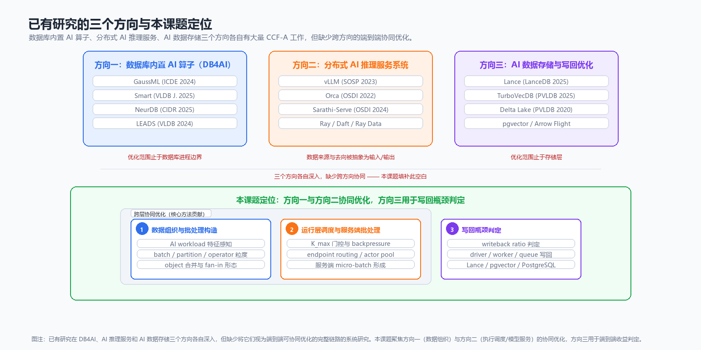
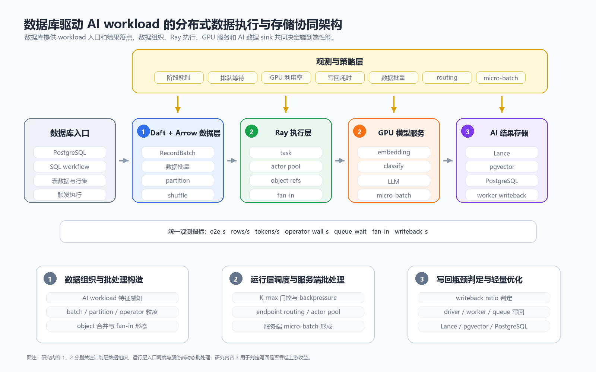
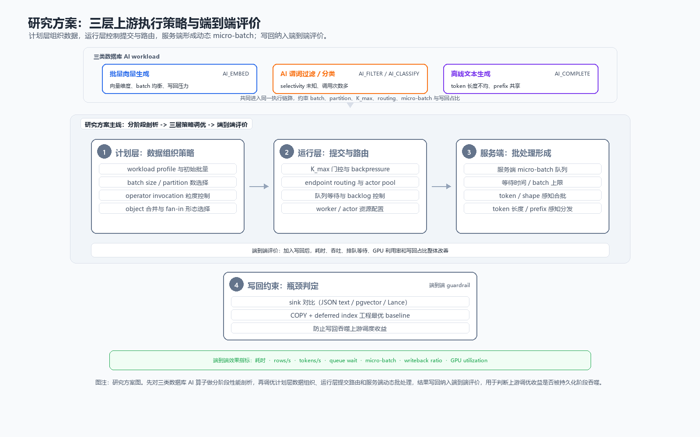
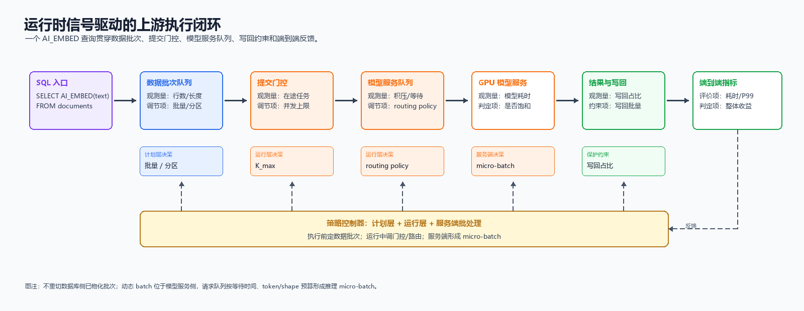
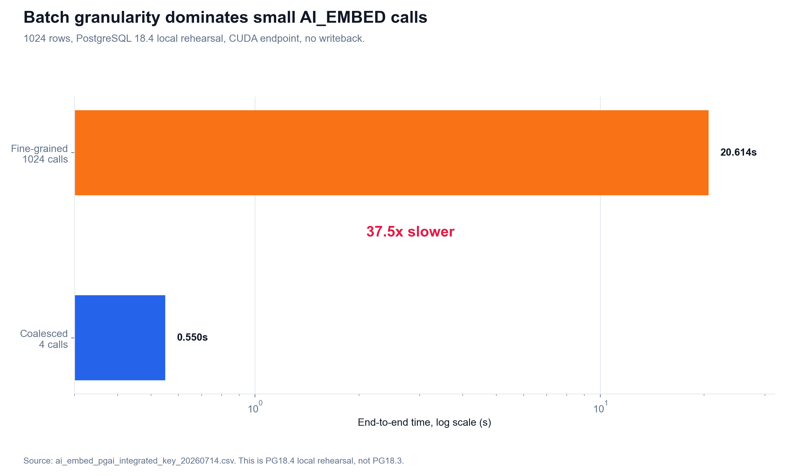
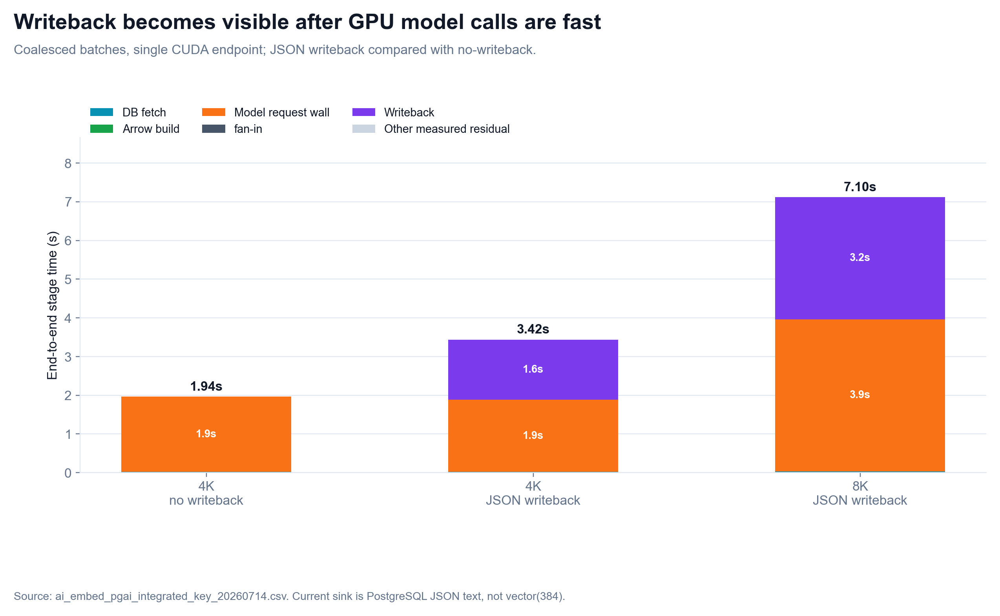
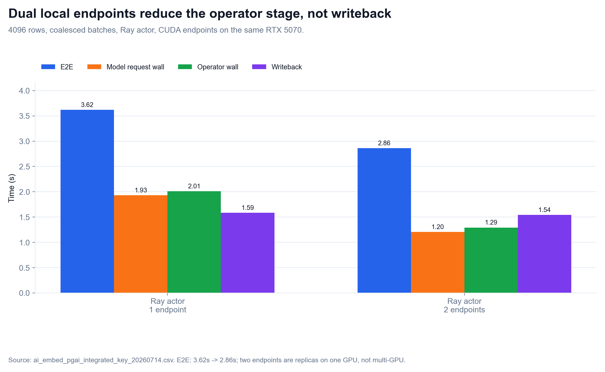
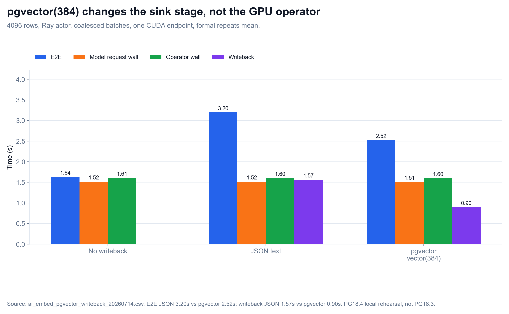

# 硕士生论文开题报告

题目：面向数据库驱动 AI 工作负载的分布式数据执行与存储协同优化研究

## 1. 课题背景、目的和意义

数据库系统正在从管理结构化数据，扩展到承载文本、图像、向量和模型推理结果等 AI 数据处理任务。Snowflake Cortex AISQL、BigQuery AI、Oracle `VECTOR_EMBEDDING`，以及 PostgreSQL 生态中的 pgvector、pgai 和 PostgresML 等系统或组件，说明用户已经在 SQL 或数据库工作流中直接发起 embedding、分类、过滤、摘要、抽取和生成等 AI 操作。结合本项目已有分析，当前可落地的数据库 AI 算子主要包括三类：批量 embedding / RAG ingestion、`AI_FILTER` / `AI_CLASSIFY` 类 AI predicate，以及 `AI_COMPLETE` / 离线 LLM 生成与抽取。

这类操作和传统 SQL 算子不同。传统数据库执行器关注 scan、filter、join、aggregate、sort 等关系算子，而 AI workload 把数据库变成数据入口和结果落点：表数据被组织为 batch 或 Arrow RecordBatch，经 Daft 类数据处理层完成 partition、batch、shuffle 等数据流组织，再交给 Ray task/actor 或 actor pool 调度 GPU-backed 模型服务，最后将 embedding、分类结果或生成文本写入 Lance、pgvector、PostgreSQL 表或其他 AI 数据存储。端到端性能不只由模型推理决定，也受数据组织、任务划分、模型服务队列、fan-in、写回批量和反压策略影响。

本课题的研究目的，是面向数据库驱动的 AI workload，建立一条可观测、可替换、可消融的分布式数据执行与存储链路，并研究 Daft/Ray/Lance 类系统中数据组织、并行调度、GPU 推理服务调用和结果持久化之间的协同优化方法。数据库 AI 算子在本文中主要作为 workload 入口和验证场景，不作为单独的数据库内核问题；Daft、Ray 和 Lance 则分别对应数据流组织、分布式执行调度和 AI 数据持久化三个系统层次。与传统数据库 GPU 查询算子或模型 kernel 优化相比，本课题更关注 AI workload 在数据执行系统中的批处理、调度、反压和存储协同。

课题的理论意义在于，将数据库 AI workload 从单一 SQL 函数调用扩展为可观测、可拆分、可优化的数据执行系统问题，补充现有数据库执行优化、分布式数据处理框架和 AI 推理服务系统之间的研究空白。课题的应用意义在于，为 PostgreSQL / pgvector、Daft/Ray 执行层、GPU-backed 模型服务和 Lance 类 AI 数据存储之间的协同执行提供实验依据和方法参考。

## 2. 国内外研究现状

### 2.1 数据库 AI SQL 算子现状

Snowflake 于 SIGMOD 2026 发表了 Cortex AISQL 生产系统论文[1]，正式将 AI 算子作为 SQL 执行引擎的一等公民。Cortex AISQL 提供六类 AI SQL 算子——`AI_EMBED`（向量生成）、`AI_COMPLETE`（文本生成）、`AI_FILTER`（语义过滤）、`AI_CLASSIFY`（分类）、`AI_JOIN`（语义连接）和 `AI_AGG`/`AI_SUMMARIZE_AGG`（语义聚合），在生产环境中运行的监控数据显示 AI 算子主导查询成本，约 40% 的查询涉及多表操作且消耗超过 58% 的总执行时间。论文提出三项核心技术：AI 感知查询优化——将 LLM 推理成本作为一阶优化目标，必要时将昂贵 AI 谓词上拉到 Join 后执行，一个案例中 LLM 调用从 11 万次降至 330 次（2-8× 加速）；自适应模型级联——用小模型处理大部分行，仅不确定行升级到大模型（2-6× 加速，90-95% 质量保持）；语义 Join 重写——将 O(N×M) 交叉连接转为线性多标签分类（15-70× 加速）。

BigQuery ML/AI 提供了 `ML.GENERATE_TEXT`、`ML.GENERATE_EMBEDDING` 和 `AI.GENERATE` 等函数[2]，支持在 SQL 查询中调用 Gemini、Claude、Llama 等模型，并报告了 100× 吞吐提升（第一方 LLM）和 99.99% 查询完成率。Oracle AI Vector Search 提供 `VECTOR_EMBEDDING` SQL 函数[3]，直接在数据库 SQL 中调用 embedding 模型。三大云数据库厂商的 AI SQL 函数表明，数据库已经是 AI workload 的常见入口。

然而 Snowflake Cortex AISQL 论文虽然给出了 AI 感知查询优化、模型级联和语义 Join 等方法，但它是一个生产闭源系统，其内部数据组织、批处理构造、外部执行调度、GPU 模型服务交互和写回之间的阶段边界不可拆分。BigQuery 和 Oracle 同样只暴露 SQL 入参和结果，不公开内部执行阶段。对于研究”数据库到 AI 执行再到存储”的端到端协同优化而言，这些系统证明了需求真实性，但不能直接作为可拆分、可消融的实验 baseline。

这类系统说明，研究重点不应停留在”模型能否被 SQL 调用”，而应进一步分析大量表数据进入 AI 数据执行系统后，如何被批处理、调度、推理和持久化。Snowflake 六类 AI 算子的并存，对应本项目三类 workload 的划分：`AI_EMBED` 对应向量生成与写回，`AI_FILTER`/`AI_CLASSIFY` 对应 AI predicate 批处理（selectivity 感知），`AI_COMPLETE` 对应离线生成式推理（token / prefix / queue 感知）。它们用于定义工作负载，不直接决定本文的系统实现路线。

### 2.2 PostgreSQL AI 生态现状与”数据库内 ML”对照路线

PostgreSQL 生态中，pgvector[4] 负责向量类型、索引和相似度检索，定义了 `vector(384)` 等数据类型和 IVFFlat、HNSW 索引，但本身不负责 embedding 计算。pgai[5] 曾提供 PostgreSQL + stateless vectorizer worker + embedding endpoint + 写回数据库的外部执行形态，其 vectorizer worker 以独立进程读队列、调模型、写回结果，与本课题关注的外部执行链路高度一致。PostgresML[6] 代表把模型能力放到数据库内或近数据库执行的路线，提供 `pgml.transform()`、`pgml.predict()` 等 SQL 函数。

在学术侧，华为与清华大学联合提出的 GaussML[7] 在 ICDE 2024 发表，将 20 余种典型 ML 算子直接集成进 openGauss 查询引擎，以原生 SQL 接口替代 ML-as-UDF 方案，引入 ML 感知的基数与代价估计器和 SIMD 加速，相比 Apache MADlib 实现 2-6× 速度提升。类似地，Smart[8]（VLDB Journal 2025, 清华大学李国良团队）在 PostgreSQL 中实现了 ML 谓词的推理重写、渐进式推理和成本最优物理优化，相比 baseline 最高提升三个数量级。NeurDB[9]（CIDR 2025）和 LEADS/INDICES[10]（VLDB 2024）进一步提出了 AI 原生数据库和 SQL 感知的动态模型切片方法，在数据库内核中嵌入 AI 能力的蓝图日渐清晰。

上述系统共同构成了”模型进数据库”（DB4AI）路线：将 AI/ML 能力嵌入数据库内核、以 SQL 原生语法调用、通过查询优化器统一优化。这条路线在减少数据移动和降低推理延迟方面有优势，但其优化范围止于数据库进程边界——它不研究数据出数据库后经由外部分布式执行系统（Ray/Daft）和 GPU-backed 模型服务再写回的完整路径。本课题与之形成对照而非重复：GaussML 和 Smart 把模型拉进数据库，本课题把数据交出去执行 AI 再收回来——两种路线的适用场景、瓶颈形态和优化方法互不相同。

### 2.3 分布式数据与 AI 执行框架现状

**分布式执行框架。** Ray[11]（OSDI 2018）将自身定位为面向新兴 AI 应用的分布式框架，核心是同时支持 task-parallel 和 actor-based 计算，并用动态执行引擎、分布式调度和分布式对象存储支撑 AI workload。Daft 可以运行在 Ray 上，提供 partition、batch、shuffle、join 等数据处理抽象。Ray Data 团队在 2025 年提出 Streaming Batch Model[12]——一种面向异构资源（CPU+GPU）的批处理执行模型，在 CPU/GPU 混合批推理管线上实现 3-8× 吞吐提升。这些框架共同构成本文关注的 AI 数据执行链路：Daft/Ray Data 负责数据组织和批处理，Ray 负责分布式任务执行和资源调度。

**GPU 推理服务系统。** 在推理服务侧，vLLM[13]（SOSP 2023, Best Paper）提出 PagedAttention 内存管理技术——受操作系统虚拟内存分页启发，将 KV cache 划分为固定大小的块并允许非连续存储，实现近零内存浪费（>96% 利用率），配合 iteration-level continuous batching 实现 2-4× 吞吐提升。Orca[14]（OSDI 2022）率先提出 iteration-level scheduling，将调度粒度从请求级降到迭代级，在 GPT-3 175B 上实现最高 36.9× 吞吐提升。Sarathi-Serve[15]（OSDI 2024）通过 chunked-prefills 和 stall-free scheduling 在不同模型上实现 2.6-5.6× 的服务容量提升。ServerlessLLM[16]（OSDI 2024）利用 GPU 服务器上被低估的本地多级存储（GPU内存→DRAM→NVMe→SATA），将 LLM 模型加载时间缩短 6-10×。这些系统说明 GPU 推理服务的批处理、内存和调度已有大量 CCF-A 工作，但它们的研究范围止于 GPU 侧——数据从何而来、计算结果写往何处，不在其优化目标之内。

**AI 数据存储与写回优化。** Lance[17]（LanceDB, 2025）提出面向 AI/ML 的列式存储格式，通过自适应结构编码在随机访问和全表扫描间取得平衡；ColStorEval[50]（PVLDB 2023）对 Parquet/ORC 等列式存储格式的写入性能进行了系统对比，为 AI 数据 sink 的格式选择提供了量化依据。Arrow Flight[18] 面向高性能列式数据传输。在存储引擎层面，TurboVecDB[46]（PVLDB 2025）利用并行 I/O 和空间感知插入将 HNSW 索引构建时间减少 98.4%；Delta Lake[47]（PVLDB 2020）通过 optimistic concurrency 和盲追加实现了多 worker 并行写入；FlexPushdownDB[48]（PVLDB 2021）提出了代价驱动的 compute-vs-storage pushdown 决策模型；WiscKey[49]（FAST 2016）通过 KV 分离避免了 compaction 对大 value 的重写开销。pgvector 和 Lance 分别代表"数据库内嵌向量存储"和"独立 AI 数据存储"两条技术路线。这些工作覆盖了存储引擎、写入路径和索引构建等关键环节，但它们的研究范围止于存储层——数据在到达存储之前经历了怎样的数据组织、调度执行和推理过程，不在其优化目标之内；写回批量与上游 GPU 批处理之间的协同效应也未被系统考察。

上述三个方向都有大量 CCF-A 论文，但优化目标并不相同：Ray/Daft 关注数据流组织和资源调度，vLLM/Orca 关注 GPU 侧的内存、队列和批处理效率，TurboVecDB/Delta Lake/Lance 关注存储格式、写入路径和索引构建效率。数据库驱动 AI workload 的执行链路同时经过这三个方向：数据从数据库表出发，经由 Arrow 批处理组织、Ray 调度执行、GPU 推理服务调用，最终写回 Lance、pgvector 或 PostgreSQL。现有研究通常没有把这条链路作为一个可观测、可拆分、可调优的整体来处理。本文重点研究方向一和方向二之间的数据组织、运行层调度与服务端批处理协同，方向三用于写回瓶颈判定和端到端收益检查。



图 2-1 已有研究的三个方向与本课题的定位。DB4AI、AI 推理服务和 AI 数据存储三个方向各自有大量 CCF-A 工作，但优化范围分别止于数据库进程边界、GPU 服务侧和存储层，缺少跨方向的端到端链路视角。本课题聚焦方向一的数据组织与方向二的执行调度/模型服务协同，方向三用于写回瓶颈判定和端到端收益检查。

### 2.4 当前研究存在的问题

综合以上三个方向的分析，当前研究的空白不在某一个单点，而在三个方向之间的连接处。

**第一，数据库 AI 算子方向**。Snowflake Cortex AISQL[1] 证明了 AI SQL 算子的工业可行性，GaussML[7]、Smart[8]、NeurDB[9]、LEADS[10] 等在数据库内核中嵌入了 AI/ML 能力。但这条 DB4AI 路线的优化范围主要停留在数据库进程边界内。它们不研究"数据库触发后经由外部分布式系统执行 AI 再写回"的路径，其内部执行阶段（数据组织、模型服务调用、结果汇聚、持久化写回）也难以拆分观测。

**第二，GPU 推理服务方向**。vLLM[13]、Orca[14]、Sarathi-Serve[15]、ServerlessLLM[16] 等 CCF-A 工作在 GPU 侧的内存管理、批处理调度和模型加载上取得了进展。但它们通常把数据来源抽象为"输入请求"，把结果去向抽象为"返回客户端"。数据库表结构、批处理执行路径和写回约束不在其优化目标之内。

**第三，AI 数据存储与写回方向**。TurboVecDB[46]、Delta Lake[47]、FlexPushdownDB[48] 和 Lance[17] 分别优化了向量索引构建、多 worker 并行写入、compute-storage pushdown 决策和列式存储格式。但数据在到达存储之前经历了怎样的数据组织、调度执行和推理过程，不在其研究范围内。写回批量与上游 GPU 批处理之间的关系也缺少系统分析。

**第四，数据库 AI workload 的场景差异被忽视。** Snowflake 的生产数据[1] 已经证实了 `AI_EMBED`、`AI_FILTER/AI_CLASSIFY` 和 `AI_COMPLETE` 三类算子的并存需求。Embedding 产生高维向量并对写回压力敏感，AI predicate 受 selectivity 影响，LLM 类 workload 受 token 长度和共享 prefix 影响。现有系统大多以单一算子为优化目标，没有在三类 workload 上验证方法的一般性。

**第五，已有本地预研和 GPU-backed 复测**显示，在同一 GPU-backed `AI_EMBED` 链路中，batch 粒度（fine vs coalesced）可导致 37.5× 的端到端差异；多 endpoint 路由可降低 operator wall time 但 writeback 基本不变（1.585s → 1.541s）。这些信号表明数据组织与调度执行是当前应优先调优的上游阶段，同时写回可能限制端到端收益。仅把问题写成 object/fan-in 或仅写成 Ray 调度都过窄。持久化写回（JSON text 1.567s、pgvector 0.897s）在当前规模下是可见成本但不是主导瓶颈，本文将其纳入端到端效果评价，而不是作为独立方法贡献。

综合以上分析，本课题的核心研究空白在于：面向数据库 AI workload 的数据组织与运行层调度/模型服务批处理之间缺少可观测、可拆分、可调优的上游执行链路研究，持久化写回需要纳入端到端效果评价。现有工作无论是 Ray/Daft 的数据流组织、vLLM/Orca 的 GPU 内部调度，还是 DB4AI 路线的数据库内 ML，都没有系统考察"数据库表数据如何被组织为 batch、如何根据模型服务状态调节提交与反压、以及这些上游决策在加入写回后是否仍然改善端到端效果"。

因此，本课题的研究问题是：在数据库驱动 AI workload 从表数据出发、经由 Arrow/Daft 数据组织、Ray 分布式调度执行、GPU-backed 模型服务调用并最终写回的链路中，数据组织与模型服务调度阶段如何调优、调优效果如何在包含写回的端到端指标上体现，尚未被系统研究。

## 3. 研究目标与研究内容

### 3.1 研究目标

本课题的总体目标是：面向数据库驱动 AI workload，构建基于 Daft/Ray 类系统机制的端到端实验链路，分析数据组织、task/actor 调度、GPU 模型服务请求、fan-in、backpressure 和写回阶段的瓶颈形态。优化侧重点放在上游执行链路：计划层确定数据批量和分区，运行层控制提交、路由和反压，服务端形成动态 micro-batch。结果写回纳入端到端效果评价，用于判断上游优化收益是否被持久化阶段吞噬。

具体目标包括：

1. 建立数据库驱动 AI workload 的分阶段性能剖析方法，明确 DB fetch、Arrow/Daft batch、Ray task/actor、model request wall、fan-in 和 sink writeback 等阶段边界。
2. 分析 batch 粒度、partition 数、operator invocation 粒度和 object 合并方式对端到端性能的影响。
3. 研究运行层调度与服务端批处理策略，包括 `K_max` 门控、endpoint routing、actor pool、backpressure 和服务端 micro-batch，避免无界提交导致 queue wait 和 token backlog 放大。
4. 确认结果持久化在当前链路中的瓶颈位置，通过 sink 对比和工程写回优化避免持久化吞噬上游调度收益。
5. 将数据组织、模型服务调度和结果写回放回同一条全链路中验证，判断阶段级优化是否真正改善全流程耗时、吞吐、排队和写回占比。
6. 通过 `AI_EMBED`、`AI_FILTER/AI_CLASSIFY` 和 `AI_COMPLETE` 三类 workload 验证方法的适用范围，分别覆盖向量生成、AI predicate 选择率和 token / prefix / queue 感知推理三类压力。

### 3.2 研究内容

阶段划分、分阶段性能剖析和瓶颈归因用于支撑动机测试、方案设计和效果评价。围绕这些观测结果，本课题研究三个可优化、可验证的问题。

研究内容一：AI workload 感知的数据组织与批处理构造方法。

数据库驱动 AI workload 进入分布式数据执行系统时，首先要解决的问题是如何把数据库中的行、文本、向量和中间结果组织成合适的 batch、partition 和 object。难点在于，数据组织策略既影响模型服务调用次数，也影响后续 Ray task 数、ObjectRef 数、fan-in 依赖和写回批量；不同 workload 的输入输出形态也不同：embedding 会产生高维向量，AI predicate 的输出行数受 selectivity 影响，LLM 类 workload 的 token 长度和共享 prefix 会影响 batch 的实际成本。如果只固定一个 batch size 或 partition 数，容易得到只在单一数据规模和单一 workload 上有效的策略。

本课题拟把 workload 特征引入 Daft/Arrow 数据组织与批处理构造过程。策略输入包括输入行数、单行文本长度、输出大小、token 数、selectivity、共享 prefix、目标 sink 类型和写回批量约束；策略输出包括 batch size、partition 数、operator invocation 粒度、object 合并方式和下游 fan-in 形态。实验中比较逐行调用与 batch 调用、不同 partition 数、不同 object 合并方式和不同输出规模下的端到端表现，分析数据组织策略在三类 AI workload 中的适用边界。

评价时与固定 batch、固定 partition、固定 object 粒度和逐行调用等方案对比。指标包括端到端耗时、rows/s、tokens/s、operator invocation 数、object 数、task 数、fan-in time、writeback time 和 model request wall time。消融实验分别固定 batch 只改变 partition、固定 partition 只改变 object 合并方式、固定 workload 只改变输出规模，用来判断收益来自请求合并、object / fan-in 减少，还是写回批量改善。

研究内容二：运行层调度与服务端批处理协同方法。

AI workload 的执行瓶颈不只来自数据切分，也来自运行时提交节奏和模型服务队列状态。难点在于 queue wait、replica backlog、bounded wait、GPU utilization 和 token throughput 会随 batch、并发度和请求长度变化；Ray task/actor 提交过快时，表面上提高了并行度，实际可能只是把等待堆到模型服务队列中。单 endpoint 下 Ray 不一定优于 Python，多 endpoint 或多 replica 下 Ray 才可能通过 routing、actor pool 和反压控制体现价值。

本课题拟构建运行层调度与服务端批处理协同策略。在计划层给定 batch 和 partition 后，运行层根据 endpoint 数量、队列等待、replica backlog、token 长度和 GPU 利用率调节 actor 数、请求分配、routing 和 in-flight 上限；服务端侧根据等待时间、batch 上限、token/shape 分布形成 micro-batch。该方法不把 Ray 简化为“是否比 Python 快”的二元对比，而是研究 Ray runtime 与模型服务队列在多 endpoint、多 replica、token 长短不均和服务端排队存在时如何配合。

评价时比较 Python 顺序执行、Ray task、Ray actor、actor pool、single endpoint、multi endpoint、unbounded in-flight 和 bounded in-flight 等方案。指标包括端到端耗时、operator wall time、model request wall time、queue wait、bounded wait、tokens/s、endpoint 利用率和 GPU utilization。消融实验分别固定 batch 粒度只改变 Ray 形态，固定 Ray 形态只改变 endpoint 数量，固定 endpoint 只改变 in-flight 策略，用来判断收益来自并发 routing、服务端排队控制还是单纯请求合并。

研究内容三：AI 数据流结果持久化的瓶颈判定与轻量优化。

模型调用阶段被优化后，结果持久化可能成为端到端限制——如果写回占比过高，上游数据组织和模型服务调度的优化收益将被持久化阶段吞噬。本部分不追求独立的写回方法创新，而是以瓶颈判定和轻量工程优化为目标：在当前实验条件下确认写回是否构成主要限制，并避免写回阶段抵消上游调优收益。

具体而言，本部分首先以 PostgreSQL COPY + 延迟建索引为工程最优 driver 写回 baseline（B 系列实验：UPSERT vs COPY、logged vs unlogged table、online vs deferred HNSW index），比较 JSON text、pgvector(384) 和 Lance / Parquet 等 sink 在当前数据规模下的写回成本。如果写回占比持续高于 30%，则进一步做轻量写回架构对比：driver fan-in 统一写回（当前方式）、worker-direct blind append（借鉴 Delta Lake[47] 的多 worker 并行盲追加，各 worker 直接写 staging table）和 pgai 风格的 queue-worker 解耦写回（GPU worker 写队列表、独立 writeback worker 轮询消费），确认更合适的写回路径。如果 COPY + deferred index 已将写回占比压至低位，则说明当前阶段应优先调优数据组织与模型服务调度。评价指标包括 writeback time、端到端耗时和写回占比变化。三类 workload 的 sink 差异（embedding 向量、filter 结果、LLM 生成文本）用于验证边界结论的一般性。

### 3.3 总体研究框架

本课题的总体框架如图 3-1 所示。数据库 AI workload 是场景入口，统一进入由 Daft/Arrow 数据组织、Ray 分布式执行、GPU 模型服务和 Lance / 数据库 sink 组成的可观测执行链路。研究内容一关注数据组织与批处理构造，研究内容二关注运行层调度与服务端批处理，研究内容三关注写回瓶颈判定与轻量优化；其中前两部分是主要优化对象，写回用于端到端效果评价和收益判断。三类 workload 用于验证策略边界，避免把方法只建立在单一 embedding 场景上。



图 3-1 课题总体研究框架。数据库 AI workload 作为入口，Daft/Arrow、Ray、GPU 模型服务和 Lance / 数据库 sink 共同构成研究对象；数据组织与批处理构造、运行层调度与服务端批处理构成主要优化内容，写回作为瓶颈判定和端到端效果评价的一部分，并通过对照实验和消融实验验证。

## 4. 研究方案与可行性分析

### 4.1 研究方案

本课题采用“可控执行路径构建 -> 分阶段性能剖析 -> 三层上游执行策略设计 -> 加入写回的全链路验证 -> 多 workload 验证”的研究路线。

基础执行路径如下：

```text
Database AI workload source
  -> Daft / Arrow RecordBatch / batch construction
  -> Ray task / Ray actor / actor pool
  -> GPU-backed model service
  -> fan-in / result consolidation
  -> Lance / pgvector / PostgreSQL sink
```

第一阶段以 `AI_EMBED(text)` 为主，跑通真实 GPU-backed embedding endpoint，并记录分阶段指标。第二阶段做大块消融，包括 Python vs Ray、single endpoint vs multi endpoint、fine vs coalesced batch、driver writeback vs worker writeback、unbounded vs bounded in-flight。第三阶段引入 `AI_FILTER/AI_CLASSIFY` 与 `AI_COMPLETE`，验证方法是否能覆盖输出小但调用多、token 长度不均、prefix 共享和队列反压等不同瓶颈形态。

评价指标包括端到端耗时、rows/s、tokens/s、operator wall time、model request wall time、queue wait、bounded wait、fan-in time、writeback time、object 数、task 数、endpoint 利用情况和 GPU utilization。实验分析将区分实验现象、原因解释、适用边界和后续待验证问题。

拟解决的关键技术问题包括：

1. 数据库驱动 AI workload 的端到端成本如何拆分。需要避免只用总耗时判断系统瓶颈，而要把数据库读取、Daft / Arrow batch 构造、Ray execution、模型服务请求、fan-in 和 sink writeback 分开记录。
2. 数据组织和任务粒度如何影响批处理执行过程。初步实验显示逐行模型调用会显著放大 external operator wall time，但实际收益来源可能同时来自 partition 数、task 数、operator invocation 数、Ray refs、object 数和 fan-in 依赖数，需要进一步消融。
3. Ray 和模型服务队列的价值边界是什么。当前单 endpoint 下 Python、Ray task、Ray actor 差距不大；多 endpoint 下 Ray 开始体现并发路由价值。因此需要研究 Ray 在多 replica、routing、反压和服务端 micro-batch 中的适用条件。
4. 持久化写回是否会限制端到端收益。2026 年 7 月 14 日真实 GPU-backed 复测显示，在 4096 行 coalesced 执行中，加入 PostgreSQL JSON text 写回后端到端时间从 `1.944s` 增至 `3.420s`，其中写回为 `1.557s`；但 pgvector(384) 写回仅为 `0.897s`，说明 sink 选择和工程优化（COPY + 延迟建索引）可能进一步缩小写回占比。本文先通过工程最优写回 baseline 和 sink 对比判断写回是否构成瓶颈；如果占比可控，课题优先调优数据组织与模型服务调度。
5. 如何从 embedding 场景扩展到更一般的 AI workload。`AI_EMBED` 容易形成 pgvector 写回闭环；`AI_COMPLETE` 会引入 token-aware batching、prefix-aware routing、模型服务队列和失败重试；`AI_FILTER/AI_CLASSIFY` 则需要 selectivity-aware 执行和 cascade 策略。三类 workload 对应不同的执行压力，用来验证方法是否只适用于单一 embedding 场景。
6. 加入写回后的全链路验证是否真正改善整体执行效果。数据组织和模型服务调度属于上游执行链路调优，写回路径属于结果持久化阶段；最终评价不能停留在单个阶段的局部指标，而要回到同一条数据库 AI 算子执行链路中，检查端到端耗时、吞吐、队列等待、fan-in 和写回占比是否整体改善。

为验证全链路调优效果，本文采用逐步递进的对照实验：首先以当前默认执行链路作为 baseline；其次分别加入计划层数据组织、运行层提交/路由和服务端批处理候选策略，观察每一步对端到端指标的影响；最后在三类 workload 上复测完整流程，确认方法不是只对 `AI_EMBED` 单一场景有效。如果后续实验显示各阶段局部最优之间存在明显相互制约，再补充“分别调优后拼接”和“全链路配置”的增强对照，用于分析跨阶段耦合关系，但该对照不作为当前开题主叙事的前置假设。



图 4-1 研究方案图。先用三类数据库 AI 算子做分阶段性能剖析，再设计和验证计划层数据组织、运行层提交/路由和服务端批处理三类候选策略；结果写回纳入端到端效果评价，用于判断上游调优收益是否被持久化阶段吞噬。

三类 workload 的选择依据不是为了罗列更多应用，而是为了覆盖数据库 AI 算子中三种不同的系统压力。`AI_EMBED` 对应批量 embedding / RAG ingestion，外部依据来自 Snowflake `AI_EMBED`、pgvector 和 pgai vectorizer worker 形态，项目中也已经完成真实 GPU-backed `AI_EMBED` 链路画像，因此它适合作为第一阶段的真实端到端 baseline。`AI_FILTER/AI_CLASSIFY` 对应 AI predicate 和分类过滤，外部依据来自 Snowflake `AI_FILTER` / `AI_CLASSIFY` 等 AI SQL 函数；它的特点是输出小、模型调用次数多、选择率会影响下游数据量，适合验证 selectivity-aware 执行和模型调用次数控制。`AI_COMPLETE` / offline LLM 对应离线生成、抽取和评测，外部依据来自 Snowflake `AI_COMPLETE`、BigQuery `ML.GENERATE_TEXT`、Ray Data offline batch inference、Ray Serve dynamic batching 和 vLLM offline inference；它引入 token 长度、共享 prefix、队列等待和失败重试，适合验证更接近推理基础设施的 token-aware / prefix-aware 调度。三者共用同一条数据库读取、批处理组织、Ray 执行、模型服务调用和写回链路，但分别放大向量写回、选择率变化和 token / queue 三类压力。当前仅 `AI_EMBED` 有真实 GPU embedding 链路；`AI_FILTER` 和 `AI_COMPLETE` 在当前阶段为模拟 workload（受控 selectivity 和 token 长度分布，参照 Orca 合成权重的做法），论文中将明确标注为 simulated workload。

调优变量的选择同样有依据。batch、partition、task/actor 和 object 粒度来自 Ray/Daft/Spark 等分布式执行系统的官方文档和性能调优经验；endpoint routing、bounded in-flight 和服务端 micro-batch 来自 Ray Serve dynamic batching / routing、vLLM offline inference 等模型服务机制；writeback 和 fan-in 来自 pgai vectorizer worker、pgvector / Lance 存储形态以及当前 GPU-backed 链路画像。当前 `AI_EMBED` 复测已经覆盖 batch 粒度、Ray/Python 执行方式、单双 endpoint、JSON text 写回和 pgvector(384) 写回，在 4096/8192 行场景中 PostgreSQL 写回已经是全链路的大块成本，说明只优化模型调用不能保证端到端收益。这些变量由外部系统机制和本项目真实 GPU-backed 实验信号共同支撑，不是凭经验选择。

### 4.2 可行性分析

目前已完成本地 PostgreSQL 18.4 同构预演环境、PG18.4 + pgvector 连接验证、pgai SQL trigger surface 冒烟验证、真实 GPU-backed embedding 端到端画像和双 endpoint Ray 动机测试。2026 年 7 月 14 日，在 pgai SQL 触发面集成后，本项目重新启动 `8000` 和 `8001` 两个本地 CUDA embedding endpoint，并对 batch 粒度、全链路写回、单双 endpoint 和数据规模进行了关键复测。PG18.4 仅作为 PostgreSQL 18.3 内部平台的本地预演替身，相关结果用于验证实验方法和瓶颈形态，不代表 PostgreSQL 18.3 内部平台性能。

表 4-1 汇总了当前可行性证据的来源、作用和边界。本课题已经具备数据库读写、Arrow batch、Ray task/actor、GPU-backed endpoint 和写回阶段计时的基础；开题报告中的可行性结论以真实 GPU-backed 链路为主。



图 4-2 运行时信号驱动的上游执行策略闭环。数据库侧数据批量和分区主要在执行前由计划层确定；运行中根据队列、在途请求和端到端指标调节 `K_max`、`routing policy` 与服务端 `micro-batch`，避免把动态批处理误写成“重切已经物化的数据库 batch”。写回占比、P99 和吞吐作为保护约束，用于判断上游调优是否真正改善全链路。

| 证据来源 | 已完成内容 | 支撑的可行性 | 边界 |
|---|---|---|---|
| PG18.4 连接验证 | PostgreSQL 18.4 + pgvector 可连接、可读写 | 数据库和向量扩展环境可用 | 只证明环境可用，不证明性能收益 |
| GPU-backed `AI_EMBED` 画像 | PostgreSQL -> Arrow -> Ray/Python -> CUDA embedding endpoint -> writeback | 真实模型服务可接入端到端执行路径；7 月 14 日复测覆盖 batch、writeback、endpoint、规模和 pgvector(384) sink 对比 | PG18.4 本地预演，不代表 PostgreSQL 18.3 内部平台性能 |
| 双 endpoint Ray 动机测试 | Ray actor 调用 `8000` / `8001` 两个本地 endpoint | 可验证并发 routing 对 operator wall time 的影响 | 两个 endpoint 在同一 GPU 上，不代表多 GPU 或 Ray Serve 结论 |

**硬件边界说明。** 当前实验环境为单机单 GPU（NVIDIA GeForce RTX 5070, 12GB VRAM, 64GB RAM），这一约束对研究方案设计有以下影响：（1）无法运行 7B 以上大模型，AI_COMPLETE 场景需使用 1-3B 级 LLM（如 Qwen2.5-1.5B）；（2）多模型并行和跨 GPU actor pool 分池收益无法在此平台上验证——单 GPU 下所有请求最终共享同一物理设备，workload-aware 分池的价值主要通过 in-flight 上限差异和队列优先级体现，而非物理隔离；（3）多节点分布式调度（如两层 Engine + Cluster 架构）属于 §8 未来工作，不在本文实验范围内。以上约束不影响数据组织、in-flight 控制、routing 和跨层联合优化等核心方法的单机验证。

真实 GPU-backed `AI_EMBED` 复测首先说明，batch 粒度本身会显著影响端到端执行。表 4-2 中，1024 行 fine 策略发起 1024 次 endpoint 调用，coalesced 策略只发起 4 次调用；在无写回条件下，fine 的端到端耗时约为 coalesced 的 `37.5x`。这说明在真实 CUDA embedding endpoint 接入后，逐行调用不是合理 baseline，批处理执行是必须研究的对象。注意：逐行调用（fine）和无界 in-flight 是诊断工具——用于理解瓶颈机制、回答"如果把批处理完全拿掉会怎样"——不作为论文 §7 方法对照的 baseline。论文 §4 动机展示使用 coalesced batch=64 + driver fan-in 作为"合理默认配置"（有基本工程常识的第一版代码），§7 方法对照使用文献/工程最优 baseline（vLLM continuous batching、COPY + deferred index 等）。



图 4-3 逐行调用与 batch 调用的端到端对比。fine 策略将 endpoint 调用数从 4 次放大到 1024 次，在无写回条件下端到端耗时约为 coalesced 的 `37.5x`，说明模型服务调用粒度是必须控制的一阶成本。该图采用对数横轴以同时显示 `0.550s` 和 `20.614s` 两个量级。

| 行数 | 执行方式 | 策略 | endpoint 调用数 | e2e_s | operator_wall_s | writeback_s | 结论 |
|---:|---|---|---:|---:|---:|---:|---|
| 1024 | Python | coalesced | 4 | 0.550 | 0.537 | 0.000 | 无写回条件下的 batch 调用基线 |
| 1024 | Python | fine | 1024 | 20.614 | 20.597 | 0.000 | 逐行调用显著放大 operator 阶段 |
| 4096 | Python | coalesced | 16 | 1.944 | 1.915 | 0.000 | 观察无写回时模型请求阶段 |
| 4096 | Python | coalesced | 16 | 3.420 | 1.834 | 1.557 | JSON 写回接近端到端时间的一半 |
| 4096 | Ray actor | coalesced | 16 | 3.621 | 2.009 | 1.585 | 单 endpoint 下 Ray actor 不天然优于 Python |
| 8192 | Python | coalesced | 32 | 7.100 | 3.903 | 3.159 | 规模放大后模型请求与写回同步增长 |

表 4-2 还说明，单 endpoint 下 Ray 并不天然优于 Python。4096 行 coalesced 场景中，Python + JSON 写回的端到端时间为 `3.420s`，Ray actor 单 endpoint 为 `3.621s`。因此，后续研究需要进一步分析 Ray 在多 endpoint、bounded in-flight、routing、actor pool 和 worker-side writeback 等条件下的适用范围，而不能把 Ray 简化为“默认更快”的执行方式。



图 4-4 数据库到 GPU 再到写回的链路阶段时延。该图使用 2026 年 7 月 14 日真实 GPU-backed CSV，以 4096 行无写回、4096 行 JSON 写回和 8192 行 JSON 写回为对照，并在每个场景内部堆叠 DB fetch、Arrow build、GPU model request wall、fan-in、sink writeback 和 residual。结果表明，GPU 模型调用变快后，PostgreSQL JSON text writeback 在 4096 行时占 `1.557s`，在 8192 行时占 `3.159s`，已经成为端到端时间中的大块成本。

双 endpoint 实验进一步补充了 Ray 的使用动机。表 4-3 中，4096 行、16 个 coalesced batch 下，Ray actor 单 endpoint 的端到端时间为 `3.621s`，双 endpoint 为 `2.862s`；`model_request_wall_s` 从 `1.933s` 降到 `1.204s`，`operator_wall_s` 从 `2.009s` 降到 `1.292s`。但 writeback 分别为 `1.585s` 和 `1.541s`，几乎不随 endpoint 数量下降，说明写回会限制端到端收益。



图 4-5 双 endpoint 场景下 Ray actor 的端到端对比。两个本地 CUDA endpoint 可以降低 model request wall time 和 operator wall time，但端到端收益仍受 writeback 约束。两个 endpoint 是同一张 RTX 5070 上的本地服务副本，不能写成多 GPU 结论。

| 行数 | 执行方式 | endpoint 数 | e2e_s | model_request_wall_s | operator_wall_s | writeback_s | 结论 |
|---:|---|---:|---:|---:|---:|---:|---|
| 4096 | Ray actor | 1 | 3.621 | 1.933 | 2.009 | 1.585 | 单 endpoint 下 operator 与写回都是大块时间 |
| 4096 | Ray actor | 2 | 2.862 | 1.204 | 1.292 | 1.541 | 双 endpoint 降低 operator 阶段，但写回基本不变 |

为了确认 JSON text 写回是否会误导对 sink 成本的判断，本项目进一步在同一条 GPU-backed Ray actor 链路中补充了 no writeback、JSON text 和 pgvector `vector(384)` 三种落盘方式的对比。实验使用 4096 行、16 个 coalesced batch、一个 CUDA embedding endpoint、`embedding_dim = 384` 和 `write_batch_rows = 512`，只改变 `writeback_mode`。pgvector 组运行后，数据库中 4096 行 `embedding_vector` 非空，`vector_dims(embedding_vector)` 的最小值和最大值均为 384。



图 4-6 no writeback、JSON text 和 pgvector(384) 写回对比。formal repeat 均值显示，no writeback 的端到端时间为 `1.635s`；JSON text 写回为 `3.198s`，其中 `writeback_s = 1.567s`；pgvector `vector(384)` 写回为 `2.524s`，其中 `writeback_s = 0.897s`。三组的 `model_request_wall_s` 均约为 `1.51-1.52s`，`operator_wall_s` 均约为 `1.60s`，说明差异主要来自 sink/writeback 阶段，而不是 GPU 模型请求阶段。

| writeback_mode | e2e_s mean | model_request_wall_s mean | operator_wall_s mean | writeback_s mean | rows/s mean | 结论边界 |
|---|---:|---:|---:|---:|---:|---|
| none | 1.635 | 1.518 | 1.609 | 0.000 | 2505.0 | 只观察模型和执行链路，不落盘 |
| json_text | 3.198 | 1.516 | 1.603 | 1.567 | 1280.8 | JSON text 是可见 sink 成本 |
| pgvector | 2.524 | 1.512 | 1.600 | 0.897 | 1623.2 | pgvector(384) 低于 JSON text，但仍是可见成本 |

进一步将关键场景按 executor、endpoint 和写回阶段展开后，可以看到并发模型服务调用和 sink writeback 之间的收益边界。当前本地预演链路已经记录 `operator_wall_s`、`model_request_wall_s`、`fanin_s` 和 `writeback_s` 等字段；后续接入 Daft / Lance 后，将沿用同一类阶段边界继续记录 partition、shuffle、object transfer 和 Lance sink 写入时间。

综合上述结果，当前可行性结论有三点。第一，数据库驱动 AI workload 的端到端画像链路已经跑通，真实 GPU-backed 模型服务也能接入本地 PostgreSQL 同构预演环境。第二，已有实验显示 batch 粒度、endpoint routing 和 writeback 都会影响端到端性能，可以支撑本文选择数据组织、运行层调度与服务端批处理作为优化对象；持久化写回成本也已在本地实验中量化。第三，三类 workload 的输入输出形态和瓶颈差异已经在项目材料中定义清楚，后续可以在同一套阶段计时框架下逐步验证。

当前仍需补齐的关键环节也比较明确：在已经完成 JSON text 与 pgvector(384) 对比的基础上，通过 COPY + 延迟建索引确认工程最优写回 baseline；用 Ray Serve / vLLM 或等价本地模型服务替代两个手动 endpoint；把链路迁移到 PostgreSQL 18.3 内部平台，并继续区分本地预演事实、模拟实验事实和正式平台结论。

## 5. 进度安排

2026 年 7 月：完成开题报告、文献清单和现有 GPU-backed 主动机实验整理；保留 PPT 页面布局规则并重做汇报内容；完成 384 维 pgvector 写回对比并明确 PostgreSQL 18.3 内部平台与本地 PG18.4 同构预演环境之间的迁移边界。

2026 年 8 月：建立 vLLM / Ray Serve 标准 GPU baseline（替代手动 HTTP endpoint）和 COPY + deferred index 工程最优写回 baseline；在 PG18.4 同构执行路径上完成 `AI_EMBED` 的 batch、Ray task/actor、多 endpoint、bounded in-flight 大块消融。

2026 年 9 月：扩展到 `AI_FILTER/AI_CLASSIFY`，设计 selectivity-aware predicate pipeline、cheap/expensive model cascade 和输出行数变化下的下游 partition 调整；完成 sink 对比实验（JSON text / pgvector(384) / Lance），确认持久化写回边界。

2026 年 10 月：扩展到 `AI_COMPLETE` / offline LLM 场景，接入 vLLM / Ray Serve 或等价本地模型服务，验证 token-aware batching、prefix-aware routing、queue-aware backpressure 和服务端 micro-batch；记录 token throughput、queue wait、replica backlog 和失败重试信息。如果写回瓶颈判定后占比仍高，实现 worker-direct writeback 作为轻量优化。

2026 年 11 月：整理统一方法，实现稳定原型，补齐 baseline、消融和反证实验；完成加入写回后的全链路验证，并在阶段间耦合明显时补充独立最优拼装与全链路配置的增强对照；形成可复现实验脚本、结果 CSV、图表和阶段分析报告。

2026 年 12 月以后：完成论文实验、图表、正文撰写、答辩材料和结果复核；根据导师和企业侧反馈收敛题目表述、贡献边界和最终实验组合。

## 6. 预期成果

预期形成以下成果：

1. 一个数据库驱动 AI workload 分阶段执行画像原型，支持 PostgreSQL 表读取、Daft/Arrow batch、Ray task/actor、GPU-backed endpoint、fan-in 和写回阶段计时。
2. 一组覆盖 `AI_EMBED`、`AI_FILTER/AI_CLASSIFY`、`AI_COMPLETE` 的可复现实验 workload。
3. 一套面向计划层数据组织、运行层提交/路由和服务端批处理的上游执行链路调优方法，以及面向端到端效果评价的写回瓶颈判定方法。
4. 实验报告、开题 PPT、论文图表和硕士论文正文。

预期关键技术指标包括：

1. 阶段计时完整性：实验结果至少覆盖 DB fetch、Arrow build、operator wall、model request wall、bounded wait、fan-in 和 writeback 等字段。
2. 可复现性：每组正式实验保留运行命令、参数、CSV 输出、warm-up / formal repeat 标记和结果解释。
3. 对照完整性：`AI_EMBED` 场景至少比较 Python、Ray task、Ray actor、single endpoint、multi endpoint、fine/coalesced batch 和不同写回方式。
4. 边界清晰性：实验结论明确区分 PG18.4 本地预演、PostgreSQL 18.3 内部平台、JSON text 写回和 pgvector(384) 写回。
5. 统计严谨性：每组正式实验至少 3 次重复（核心发现额外补到 5 次），取中位数且报告 IQR 或标准差；每次重复间重启 Ray 并重建数据库表；warm-up run 不计入结果；数据生成固定随机种子确保不同配置跑同一批数据。

预期创新点包括：

1. AI workload 感知的数据组织与批处理构造方法。针对 embedding 输出大、AI predicate 选择率未知、LLM token 长度不均等不同 workload 特征，结合 Daft / Arrow batch、partition、operator invocation 和 Ray object 粒度调整数据组织策略。
2. 运行层调度与服务端批处理协同方法。将 `K_max`、endpoint routing、actor pool、bounded in-flight、queue wait、replica backlog、服务端 micro-batch 和 GPU utilization 纳入同一端到端评价，说明 Ray 运行时与模型服务队列在多 endpoint 和服务端排队存在时的收益边界。
3. AI workload 执行链路中的写回瓶颈判定与轻量优化。通过工程最优 writeback baseline 和 sink 对比确认持久化在当前链路中的瓶颈位置，避免写回吞噬上游调度收益；如果写回占比仍高，以 Delta Lake blind append 为参考实现 worker-direct writeback 作为轻量优化。

## 7. 主要参考文献

[1] Paritosh Aggarwal, Bowei Chen, Anupam Datta, Benjamin Han, Boxin Jiang, Nitish Jindal, et al. Cortex AISQL: A Production SQL Engine for Unstructured Data. In: Companion of the International Conference on Management of Data (SIGMOD Companion '26), Bengaluru, India, 2026. arXiv:2511.07663.

[2] Google Cloud. BigQuery ML: Generate Text and Embeddings. https://cloud.google.com/bigquery/docs/generate-text-tutorial, 2025.

[3] Oracle. Oracle AI Vector Search: VECTOR_EMBEDDING SQL Function. https://docs.oracle.com/en/database/oracle/oracle-database/23/vecse/, 2025.

[4] pgvector. Open-source Vector Similarity Search for Postgres. https://github.com/pgvector/pgvector.

[5] Timescale. pgai: AI workflows for PostgreSQL. https://github.com/timescale/pgai.

[6] PostgresML. PostgresML: Machine Learning inside PostgreSQL. https://github.com/postgresml/postgresml.

[7] Guoliang Li, Ji Sun, Shifu Li, Jiang Wang, Wen Nie, Lijie Xu. GaussML: An End-to-End In-database Machine Learning System. In: Proceedings of the 40th IEEE International Conference on Data Engineering (ICDE), Utrecht, Netherlands, 2024.

[8] Yunyan Guo, Guoliang Li, Ruilin Hu, Yong Wang. In-database Query Optimization on SQL with ML Predicates. The VLDB Journal, Vol.34, No.1, Article 12, 2025. DOI:10.1007/s00778-024-00888-3.

[9] Zhanhao Zhao, Shaofeng Cai, Gang Chen, Yanyan Shen, Kian-Lee Tan, Yuncheng Wu, Xiaokui Xiao, Naili Xing, Cong Yue, Lingze Zeng, Meihui Zhang, Beng Chin Ooi. NeurDB: On the Design and Implementation of an AI-powered Autonomous Database. In: Proceedings of the Conference on Innovative Data Systems Research (CIDR), Amsterdam, Netherlands, 2025.

[10] Lingze Zeng, Naili Xing, Shaofeng Cai, Gang Chen, Beng Chin Ooi, Jian Pei, Yuncheng Wu. Powering In-Database Dynamic Model Slicing for Structured Data Analytics. Proceedings of the VLDB Endowment (PVLDB), Vol.17, No.13, pp.4813-4826, 2024.

[11] Philipp Moritz, Robert Nishihara, Stephanie Wang, Alexey Tumanov, Richard Liaw, Eric Liang, et al. Ray: A Distributed Framework for Emerging AI Applications. In: Proceedings of the 13th USENIX Symposium on Operating Systems Design and Implementation (OSDI), Carlsbad, CA, USA, 2018: 561-577.

[12] Frank Sifei Luan, Ziming Mao, Ron Yifeng Wang, Charlotte Lin, Amog Kamsetty, Hao Chen, et al. The Streaming Batch Model for Efficient and Fault-Tolerant Heterogeneous Execution. arXiv:2501.12407, 2025.

[13] Woosuk Kwon, Zhuohan Li, Siyuan Zhuang, Ying Sheng, Lianmin Zheng, Cody Hao Yu, Joseph E. Gonzalez, Hao Zhang, Ion Stoica. Efficient Memory Management for Large Language Model Serving with PagedAttention. In: Proceedings of the 29th ACM Symposium on Operating Systems Principles (SOSP), Koblenz, Germany, 2023: 611-626. (Best Paper Award)

[14] Gyeong-In Yu, Joo Seong Jeong, Geon-Woo Kim, Soojeong Kim, Byung-Gon Chun. Orca: A Distributed Serving System for Transformer-Based Generative Models. In: Proceedings of the 16th USENIX Symposium on Operating Systems Design and Implementation (OSDI), Carlsbad, CA, USA, 2022: 521-538.

[15] Amey Agrawal, Nitin Kedia, Ashish Panwar, Jayashree Mohan, Nipun Kwatra, Bhargav S. Gulavani, Alexey Tumanov, Ramachandran Ramjee. Taming Throughput-Latency Tradeoff in LLM Inference with Sarathi-Serve. In: Proceedings of the 18th USENIX Symposium on Operating Systems Design and Implementation (OSDI), Santa Clara, CA, USA, 2024.

[16] Yao Fu, Leyang Xue, Yeqi Huang, Andrei-Octavian Brabete, Dmitrii Ustiugov, Yuvraj Patel, Luo Mai. ServerlessLLM: Low-Latency Serverless Inference for Large Language Models. In: Proceedings of the 18th USENIX Symposium on Operating Systems Design and Implementation (OSDI), Santa Clara, CA, USA, 2024: 135-153.

[17] Weston Pace, Will Jones, Chang She, Lei Xu, Albert Lockett, Jun Wang, Raunak Shah. Lance: Efficient Random Access in Columnar Storage through Adaptive Structural Encodings. arXiv:2504.15247, 2025.

[18] Apache Arrow. Arrow Flight: A Framework for Fast Data Transport. arXiv:2204.03032, 2022.

[19] Daft Documentation. Distributed Execution with Ray / Partitioning and Batching / Shuffle Algorithms. https://docs.daft.ai, 2025.

[20] Apache Spark. Spark SQL Performance Tuning Guide. https://spark.apache.org/docs/latest/sql-performance-tuning.html, 2025.

[21] Dario Satriani, Enzo Veltri, Donatello Santoro, Sara Rosato, Simone Varriale, Paolo Papotti. Logical and Physical Optimizations for SQL Query Execution over Large Language Models. In: Proceedings of the ACM SIGMOD/PODS Conference (SIGMOD), Berlin, Germany, 2025. DOI:10.1145/3725411.

[22] Xun Wang, et al. AnDB: Breaking Boundaries with an AI-Native Database for Universal Semantic Analysis. In: Proceedings of the ACM SIGMOD Conference (SIGMOD Demo), 2025. arXiv:2502.13805.

[23] Rong Zhu, Tianjing Zeng, Bolin Ding, Jingren Zhou. Learned Query Optimizer: What is New and What is Next. In: Proceedings of the ACM SIGMOD Conference (SIGMOD), 2024.

[24] Roman Heinrich, Manisha Luthra, Johannes Wehrstein, Harald Kornmayer, Carsten Binnig. How Good are Learned Cost Models, Really? Insights from Query Optimization Tasks. In: Proceedings of the ACM SIGMOD Conference (SIGMOD), 2025.

[25] Xuanhe Zhou, Guoliang Li, Xinyang Zhao. LLM for Data Management. Proceedings of the VLDB Endowment (PVLDB), Vol.17, No.12, pp.4213-4216, 2024.

[26] James Jie Pan, Guoliang Li. Database Perspective on LLM Inference Systems. Proceedings of the VLDB Endowment (PVLDB), Vol.18, 2025.

[27] Shaojie Qiao, Hanlin Fan, Nan Han, et al. Learning Database Optimization Techniques: The State-of-the-Art and Prospects. Frontiers of Computer Science, 2025.

[28] Kyoungmin Kim, Anastasia Ailamaki. Trustworthy and Efficient LLMs Meet Databases. Proceedings of the VLDB Endowment (PVLDB), Vol.17, 2024. (Tutorial)

[29] Xuanhe Zhou, Guoliang Li, Ji Sun, et al. D-Bot: Database Diagnosis System using Large Language Models. Proceedings of the VLDB Endowment (PVLDB), Vol.17, 2024.

[30] Guoliang Li, et al. openGauss: An Autonomous Database System. Proceedings of the VLDB Endowment (PVLDB), Vol.14, 2021.

[31] Ricardo Salazar-Díaz, Boris Glavic, Tilmann Rabl. InferDB: In-Database Machine Learning Inference Using Indexes. Proceedings of the VLDB Endowment (PVLDB), Vol.17, No.8, pp.1830-1842, 2024.

[32] Qiuru Lin, Sai Wu, Junbo Zhao, Jian Dai, Meng Shi, Gang Chen, Feifei Li. SmartLite: A DBMS-Based Serving System for DNN Inference in Resource-Constrained Environments. Proceedings of the VLDB Endowment (PVLDB), 2024.

[33] Yinmin Zhong, et al. DistServe: Disaggregating Prefill and Decoding for Goodput-optimized Large Language Model Serving. In: Proceedings of the 18th USENIX Symposium on Operating Systems Design and Implementation (OSDI), Santa Clara, CA, USA, 2024.

[34] Pratyush Patel, Esha Choukse, Chaojie Zhang, Aashaka Shah, Íñigo Goiri, Saeed Maleki, Ricardo Bianchini. Splitwise: Efficient Generative LLM Inference Using Phase Splitting. In: Proceedings of the 51st ACM/IEEE International Symposium on Computer Architecture (ISCA), 2024: 118-132.

[35] Ruoyu Qin, Zheming Li, Weiran He, Mingxing Zhang, Yongwei Wu, Weimin Zheng, Xinran Xu. Mooncake: A KVCache-centric Disaggregated Architecture for LLM Serving. ACM Transactions on Storage, 2025. arXiv:2407.00079.

[36] Guangming Sheng, Chi Zhang, Zilingfeng Ye, Xibin Wu, Wang Zhang, Ru Zhang, Yanghua Peng, Haibin Lin, Chuan Wu. HybridFlow: A Flexible and Efficient RLHF Framework. In: Proceedings of the Twentieth European Conference on Computer Systems (EuroSys), Rotterdam, Netherlands, 2025. DOI:10.1145/3689031.3696075.

[37] Chaofan Lin, et al. Parrot: Efficient Serving of LLM-based Applications with Semantic Variable. In: Proceedings of the 18th USENIX Symposium on Operating Systems Design and Implementation (OSDI), Santa Clara, CA, USA, 2024.

[38] Lianmin Zheng, et al. SGLang: Efficient Execution of Structured Language Model Programs. In: Advances in Neural Information Processing Systems (NeurIPS), 2024.

[39] DeepSeek-AI. DeepSeek-V3 Technical Report. arXiv:2412.19437, 2024.

[40] Snowflake Inc. Cortex AI Functions Documentation. https://docs.snowflake.com/en/user-guide/snowflake-cortex/aisql, 2025.

[41] Ray Documentation. Core Objects / Anti-Patterns / Serve Dynamic Batching / Offline Batch Inference. https://docs.ray.io, 2025.

[42] vLLM Documentation. Offline Inference Examples. https://docs.vllm.ai/en/latest/examples/offline_inference/basic.html, 2025.

[43] 本项目实验报告. GPU-Backed AI_EMBED Chain Breakdown + Multi-Endpoint Ray Motivation Test, 2026-07-12. `motivation/results/gpu/`

[44] 本项目实验报告. PGAI-Integrated GPU-Backed Key Rerun, 2026-07-14. `motivation/results/gpu/pgai_integrated_key_rerun_20260714.md`

[45] 本项目实验报告. GPU-Backed pgvector(384) Writeback Test, 2026-07-14. `motivation/results/gpu/pgvector_writeback_20260714.md`

[46] (Authors). Turbocharging Vector Databases Using Modern SSDs. Proceedings of the VLDB Endowment (PVLDB), Vol.18, 2025. DOI:10.14778/3749646.3749724.

[47] Michael Armbrust, Tathagata Das, Aaron Davidson, Ali Ghodsi, Laurel Or, Josh Rosen, Ion Stoica, Reynold Xin, Matei Zaharia. Delta Lake: High-Performance ACID Table Storage over Cloud Object Stores. Proceedings of the VLDB Endowment (PVLDB), Vol.13, No.12, pp.3411-3424, 2020.

[48] Yifei Yang, Matt Youill, Matthew Woicik, Yizhou Liu, Xiangyao Yu, Marco Serafini, Ashraf Aboulnaga, Michael Stonebraker. FlexPushdownDB: Hybrid Pushdown and Caching in a Cloud DBMS. Proceedings of the VLDB Endowment (PVLDB), Vol.14, No.11, pp.2101-2114, 2021.

[49] Lanyue Lu, Thanumalayan Sankaranarayana Pillai, Hariharan Gopalakrishnan, Andrea C. Arpaci-Dusseau, Remzi H. Arpaci-Dusseau. WiscKey: Separating Keys from Values in SSD-Conscious Storage. In: Proceedings of the 14th USENIX Conference on File and Storage Technologies (FAST), Santa Clara, CA, USA, 2016: 133-148.

[50] Xinyu Zeng, Yulong Hui, Jiahui Shen, Andrew Pavlo, Wes McKinney, Huanchen Zhang. An Empirical Evaluation of Columnar Storage Formats. Proceedings of the VLDB Endowment (PVLDB), Vol.17, No.2, pp.148-161, 2023.
