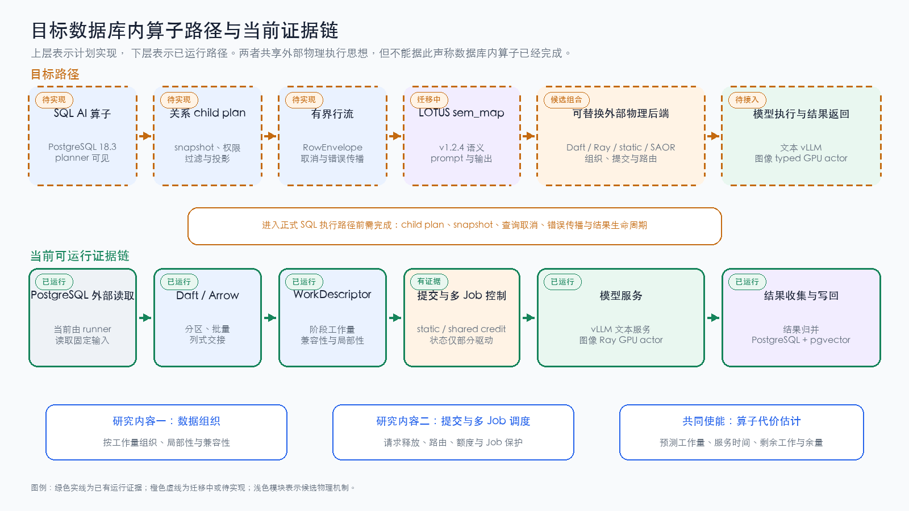

# 数据库 AI 负载的执行优化与调度研究

## 1. 课题背景、目的和意义

### 1.1 数据库 AI 算子的外部物理执行链

数据库正在成为人工智能（Artificial Intelligence，AI）任务的入口。关系算子先筛选业务记录，AI 语义算子再对记录执行分类、生成、抽取或向量化。Snowflake Cortex AISQL、Google BigQuery ML/AI、Oracle AI Vector Search，以及 PostgreSQL 生态中的 pgvector 和 pgai，均已提供 SQL 或数据库工作流中的模型调用能力[1-5]。LOTUS、Palimpzest 和 Galois 等研究进一步把大模型调用表达为可组合、可优化的语义算子[20,22,29]。

以评论分类为例，数据库中保存的是业务记录，而不是预先制作好的提示词：

| `review_id` | `product_id` | `review_text` | `created_at` |
|---:|---|---|---|
| 101 | phone_01 | 手机很好用，但是电池续航有点差 | 2026-08-18 |
| 102 | phone_01 | 发货太慢了，等了一个星期 | 2026-08-19 |
| 104 | phone_01 | 屏幕用了两天就出现坏点 | 2026-08-20 |

概念性的 AI SQL 可以写成：

```sql
SELECT
    review_id,
    AI_COMPLETE(
        review_text,
        instruction => '判断这条评论主要讨论的问题，只返回问题类别'
    ) AS issue
FROM reviews
WHERE product_id = 'phone_01'
  AND created_at >= CURRENT_DATE - INTERVAL '30 days';
```

不同系统的函数名称和参数形式并不相同。这个例子只说明逻辑语义：一条业务记录、一个 AI 算子实例及其参数共同形成一个逻辑请求，输出仍与原记录一一对应。物理执行时，数据库不必逐行同步调用模型。只要保留请求身份和结果对应关系，上游执行器可以把多个逻辑请求组织成提交批次，再交给外部模型服务。

与传统关系算子相比，调用外部模型服务的 AI 算子还要经历输入准备、请求提交、模型服务排队、GPU 执行和结果返回。文本任务可能涉及词元规模、输出上限和共享前缀，图像任务则涉及读取、解码、缩放、张量构造和模型前向。记录数因此不能完整描述执行代价。数据库还需要在查询生命周期内管理快照、权限、取消、错误和结果，而模型计算可以由数据库进程外的物理后端完成。

本课题的目标路径以 PostgreSQL 中可被查询计划识别的 AI 算子为入口。普通关系子计划产生有界行流，数据库将最小必要数据交给 LOTUS 1.2.4 `sem_map` 语义运行时，再由 Daft、Ray 等可替换后端组织外部物理执行。文本模型服务使用 vLLM，图像任务使用 GPU 模型执行单元。该路径不修改 PostgreSQL 内核、vLLM 内部调度器或模型实现，也不把 `SELECT/fetchall` 后由 Python 导出整表作为最终用户执行方式。

### 1.2 前期观察与核心问题

前期实验暴露出三个相互关联的现象。

第一，相同行数可能对应悬殊的模型工作。固定 16 行的两个文本批次，其预计词元工作量相差约 14.3 倍。第二，运行前设定的上限不等于实际运行状态。在同一 65,536 预计词元上限下，输入供给充足时在途工作可以接近上限，输入到达较慢时峰值只有上限约 29%。第三，继续增加在途工作并不会无限提高吞吐。当前双 GPU 文本环境在约 65K 处已经达到最高已测吞吐的 97.8%，继续增加上限主要带来更长的尾延迟。


图 1 表明，数据库记录数、运行前标定的准入范围和执行中的在途工作不能混作同一个量。三个子图来自不同实验设置，只用于说明概念差异，不进行跨子图性能比较。

这些现象对应两项研究问题和一个支撑问题：

| 类型 | 问题 | 对应内容 |
|---|---|---|
| RQ1 | 如何在保持逻辑请求与结果对应关系的前提下，用分阶段工作特征组织数据库 AI 请求，并处理工作量均衡与数据局部性的冲突？ | 研究内容一：工作描述与数据组织 |
| RQ2 | 在模型服务准入范围固定且多个数据库 Job 并发时，如何依据 Job 进度与模型服务状态安排请求释放和服务实例选择，以改善总体效率并控制 Job 间干扰？ | 研究内容二：提交、路由与多 Job 调度 |
| SQ | 轻量代价信息能否正确排列语义等价的执行配置和查询计划？ | 两项研究内容的共同使能组件 |

### 1.3 研究范围、术语和意义

本文研究单一资源管理主体内多个数据库 Job 共享同一模型服务资源池的情况。Job 严格指一次数据库查询执行中的一个 AI 算子实例，具有唯一标识、到达时间、剩余工作和完成时刻。模型、算子、输入分布或服务目标相近的一类 Job 称为工作负载类别（Workload Class）。实验按工作负载类别归组，但调度、完成时间和服务记账均以 Job 为单位。本文不声称解决租户级资源权益分配。

为避免逻辑语义、提交粒度和模型服务内部批处理混用，全文采用以下术语：

| 术语 | 定义 |
|---|---|
| 逻辑请求（Logical Request） | 一条业务记录、一个 AI 算子实例及其参数共同构成的逻辑处理单位 |
| 工作项（Work Item） | 逻辑请求及其运行前可知的物理特征，如输入词元、输出上限、图像尺寸和局部性标记 |
| 提交批次（Submission Batch） | 上游执行器一次交给提交线程或执行单元的多个完整工作项，不改变各工作项的语义身份 |
| 模型请求（Model Request） | 发送到一个模型服务实例接口的单个请求 |
| 服务内部批次（Service Batch） | vLLM 等服务在内部动态组成的执行批次，上游不直接控制其成员 |
| 准入范围（Admission Envelope） | 与硬件、模型、服务实例、缓存配置、请求协议和工作负载分布绑定的请求数上限 `N_max` 与估计工作量上限 `W_max` |
| 在途工作（In-flight Work） | 已提交但尚未完成的工作，包括模型服务中等待和正在运行的部分 |
| 估计工作量（Estimated Work） | 运行前按输入词元、输出上限、图像规模等计算的准入代理量 |
| 实际服务量（Actual Service） | 请求完成后按实际词元、图像数或阶段工作统计的已获得服务 |
| 预测执行时间（Predicted Time） | 代价估计器输出的服务时间、算子时间或剩余时间，不与估计工作量共用字段 |

运行状态按 `ready → in-flight → completed` 记录。其中 `ready` 表示已准备但尚未提交，`in-flight` 表示已提交但尚未完成，并可继续分为模型服务中的 `waiting` 和 `running`。服务实例（endpoint）是独立维护接口、队列和缓存状态的逻辑实例，多个服务实例可能共享同一块 GPU，因此不能把服务实例数直接解释为物理 GPU 数。

研究的理论价值在于把数据库任务身份、分阶段工作特征、模型服务运行状态和完整 Job 目标放到同一执行链中分析。近期数据库系统已开始研究 AI 函数的进程解耦、数据交换和批处理，本课题不把这一执行区域描述为无人研究的空白，而是继续研究模型服务特有的工作量、准入状态、服务实例路由与数据库 Job 目标之间的联系。工程价值则体现在可验证的决策上：减少欠供给和过早排队，说明共享资源带来的效率与隔离取舍，并为数据库计划比较提供可校准的 AI 算子代价信息。

## 2. 国内外研究现状

本章不按国别机械划分，而是按数据库查询、数据库 AI 函数的外部执行、分布式数据执行和模型服务四个相邻层次归纳国内外工作。国内代表包括 GaussML、NeurDB、LEADS、OceanBase AI Function、IMBridge 和 IMLane，国外代表包括 Cortex AISQL、LOTUS、Ray Data、vLLM、VTC 和 BlendServe。下文选择与本课题关系最直接的代表性工作，不以固定篇数限定研究主线。

### 2.1 数据库 AI 算子与查询优化

Cortex AISQL 把 AI 调用成本和选择率纳入查询优化，研究 AI 谓词重排、大小模型级联和语义连接重写[1]。BigQuery ML/AI、Oracle AI Vector Search、pgvector 和 pgai 分别提供生成、向量化、向量存储或外部模型连接能力[2-5]。OceanBase AI Function 也已提供 `AI_COMPLETE`、`AI_PROMPT`、`AI_EMBED` 和 `AI_RERANK` 等 SQL 表达式[55]，其 V5.0.1 发布说明还记录了图像类型支持和并发请求优化[56]。这些系统说明，让多条数据库记录调用模型已经是产品能力，单纯实现并发调用不能作为本课题的创新点。

LOTUS 将过滤、连接、排序和聚合等能力抽象为语义算子，并在满足准确率要求的前提下研究优化方法[20]。Palimpzest、Abacus、SemBench 和 Galois 分别研究声明式 AI 数据分析、代价优化、统一评测以及 SQL 中大模型调用的逻辑与物理优化[21-23,29]。关系数据分析中的 LLM 查询优化进一步利用函数依赖、列基数和字段长度重排行与字段顺序，以改善共享前缀复用[50]。GaussML、NeurDB 和 LEADS 代表把机器学习能力纳入数据库内部执行或自动优化的路线[6-9]，InferDB 和 SmartLite 则分别研究索引近似和资源受限环境中的数据库内推理[38-39]。这些工作解决了 AI 能力如何表达、组合和选择，但不都处理外部模型服务前的请求组织、准入和多 Job 释放。

数据库优化器还需要比较关系算子与 AI 算子的成本。已有研究表明，较低的平均预测误差并不必然带来正确的计划选择[26-28]。因此，本文把配置排序和决策损失作为代价估计的主要验收指标，而不是只报告平均误差。

### 2.2 数据库 AI 函数的外部执行与分布式数据执行

IMBridge 直接研究数据库引擎与预测查询执行之间的阻抗失配。其正式论文在 OceanBase 中引入预测感知算子，通过推理上下文复用和批次感知调用减少逐次函数执行的开销[52]；此前的 SIGMOD Companion 工作给出了原型路线[53]。这类工作已经覆盖数据库适配、上下文复用和批处理接缝。

OceanBase 官方论文清单将 IMLane 列为 PVLDB 2026 已接收工作[54]。官方发布材料将其描述为面向数据库引擎 AI 函数执行的可组合框架，涉及独立执行进程、数据交换、异步分批、资源感知协调和可插拔 Ray Executor[60]。它与本课题在数据库算子和外部异构执行之间的系统位置接近，因此必须纳入创新范围比较。由于论文正文、卷期页码、代码和完整实验条件尚未公开，本文只采用官方材料能够确认的内容，不推断其未披露的模型服务状态或多 Job 目标。

Ray 通过任务和有状态执行单元支持分布式 AI 应用[10]。Ray Data 的 Streaming Batch Model 允许分区在运行中产生和切分，并依据中间数据内存和资源状态安排异构流水线[18]；`map_batches` 还能使用有状态执行单元池进行模型推理[47]。Daft 提供复杂数据的分区、列式转换和 Ray 后端[19]，DuckDB 与 DataFusion 代表嵌入式和 Arrow 原生数据执行路线[24-25]。NeuStream 与 AYO 分别研究流处理和深度学习服务的协同，以及大模型应用任务图的跨模块执行[30,49]。

IMBridge 和 IMLane 说明数据库 AI 函数的解耦执行、数据交换和批处理已经得到直接研究；Ray Data 与 Daft 则提供通用外部执行基础。本课题不以 Python 进程隔离、Arrow 共享内存或框架接入本身为主要贡献，差异集中在模型服务特有的分阶段工作描述、`N_max/W_max` 准入、服务实例状态、完整 Job 剩余工作和多 Job 服务目标。

### 2.3 模型服务、准入与请求调度

Orca、vLLM、Sarathi-Serve、DistServe 和 Splitwise 分别从迭代级调度、键值缓存管理、预填充与解码干扰、阶段解耦和硬件匹配等角度提高大模型服务效率，数据库领域也已开始从查询执行视角归纳这类系统[11-14,40-41]。Parrot、Llumnix、SGLang 和 Clockwork 进一步研究语义变量、动态调度、结构化程序运行时和可预测执行[15,17,31,42]。这些方法主要决定已经到达模型服务的请求如何执行。

BlendServe 在离线推理中同时考虑输入输出规模与共享前缀，说明工作量均衡和数据局部性可能发生冲突[51]。VTC 根据实际输入和输出词元记录客户端获得的服务量，为不依赖输出长度预测的服务记账提供了基础[16]。FairServe、局部性感知公平调度和 Autellix 分别扩展到加权服务、前缀局部性和程序级调度[43-45]。GPU 集群研究还从多资源公平、性能隔离、作业完成体验和有效处理进度等角度提供了更广泛的调度依据[32-37]。

模型服务内部调度器通常看不到尚未完成数据库读取和请求构造的记录，也不拥有数据库查询的快照、取消和结果生命周期。上游如果把所有请求提前推入服务端，会失去对后续释放顺序的一部分控制。即使后端采用连续批处理，上游仍需决定保持多少工作处于在途状态，以及下一份工作来自哪个 Job、发往哪个服务实例。

### 2.4 相关工作比较与研究空间

| 工作 | 数据库查询语义 | 外部执行或数据交换 | 模型工作量与状态 | 多 Job 目标 | 与本课题的关系 |
|---|---|---|---|---|---|
| Cortex AISQL | 强 | 部分涉及 | 以计划成本和选择率为主 | 非重点 | 提供 AI 算子进入查询优化的依据 |
| IMBridge / IMLane | 强 | 核心内容 | IMLane 细节待全文核实 | 公开材料未显示为主要目标 | 是最接近的数据库外部执行路线，限定本课题创新范围 |
| Ray Data / Daft | 由上层提供 | 强 | 通用分区、资源和背压 | 不具有数据库 Job 生命周期 | 作为可替换物理后端和原生基线 |
| BlendServe | 无数据库语义 | 位于模型服务内部 | 输入输出规模与前缀局部性 | 离线请求集合 | 提供工作量与局部性联合组织依据 |
| VTC | 无数据库查询语义 | 位于模型服务内部 | 使用实际词元服务量 | 客户端服务均衡 | 提供完成后服务记账依据 |
| 本课题 | PostgreSQL 查询、AI 算子和记录 | 数据库管理的有界外部物理执行 | 分阶段估计工作、在途状态与完成事件 | JCT、SLO、服务差额和隔离 | 研究数据库 Job 信息与模型服务状态的上游联系 |

现有工作已经覆盖数据库 AI 语义、外部函数执行、通用数据流水线和模型服务内部调度。仍需回答的不是“如何让多行数据并发调用模型”，而是两个更窄的问题：数据库记录怎样形成带有分阶段工作与局部性信息的工作项；在运行签名和总准入范围固定时，怎样把 Job 进度、模型服务状态和服务实例选择用于尚未提交工作的释放。为了让外部执行结果进一步服务数据库计划比较，还需要一个共同的代价信息接口，但它不构成第三项研究内容。CONCERTO 等工作表明，并行阶段结构和资源竞争也应进入代价分析[46]。

## 3. 研究目标与研究内容

### 3.1 研究目标、可检验问题与范围

本课题设置三个可检验目标。第一，建立逻辑请求、工作项、提交批次和 Job 的统一身份与分阶段工作描述。第二，在相同 `N_max/W_max`、模型服务和输入到达条件下，比较不同请求释放和路由方法，评价吞吐、作业完成时间（Job Completion Time，JCT）、尾延迟、服务目标和 Job 间干扰。第三，评价代价信息能否改善语义等价配置或计划的排序，而不是只追求单点时间预测误差。

研究内容只有两项。代价估计是两项内容共用的使能组件，图像任务是跨模态验证场景。核心贡献不包括 PostgreSQL 内核修改、vLLM 内部调度器改造、模型训练或 GPU 算子优化。PostgreSQL 扩展、LOTUS 语义迁移、结果写回和可复现实验链属于完成研究所必需的系统接缝。

### 3.2 研究内容一：分阶段工作描述与数据组织

工作项由三类信息组成。`WorkDescriptor` 保存身份、兼容性、运行前已知的阶段工作和局部性标记；`SchedulingContext` 保存 Job 权重、优先级、服务目标和到达状态；`OptionalCostEstimate` 保存预测时间、剩余时间、不确定区间和校准签名。这样可以把输入事实、调度政策和估计器输出分开，避免一个结构同时承担所有语义。

文本工作描述包括输入词元、输出上限、提示模板和共享前缀；图像工作描述包括编码字节、解码与缩放、张量字节和模型前向。不同阶段不必压缩为跨模态可直接相加的单一数值。共用的是字段接口、准入流程和 Job 记账，模态适配器负责选择当前阶段的工作代理量。

组织器在不拆分逻辑请求的前提下形成提交批次。一个提交批次只属于一个 Job，每个工作项仍保存独立的请求和记录标识；不同 Job 的模型请求可以由模型服务内部连续批处理共同执行。候选方法包括保序词元预算、长度对齐、装箱和局部性优先。研究不预设某种方法必然更好，而是检验如下假设：在不同服务部署和缓存使用状态下，工作量均衡与前缀局部性的相对收益可能变化。

内容一的主要指标包括批内与批间工作偏斜、前缀保持程度、有效记录吞吐、有效词元吞吐、P95/P99、模型服务状态和任务质量。所有比较保持兼容性约束、`W_max`、服务实例和后续调度方式一致。

### 3.3 研究内容二：固定准入范围内的请求释放、路由与多 Job 协调

第二项内容研究尚未提交的工作。运行前先在固定硬件、模型、量化方式、服务实例拓扑、缓存配置、请求协议和工作负载类别下标定 `N_max/W_max`。该范围只是当前运行签名下的近饱和准入区间，不是模型服务的固有容量。签名变化时重新标定，正式运行期间不在线搜索上限。

运行时记录 `ready`、`waiting`、`running`、完成速率、缓存状态和各 Job 的剩余工作。候选方法在相同总准入范围内替换作业选择、请求释放和服务实例路由逻辑，不暂停已经开始执行的请求，也不修改 vLLM 的内部调度配置[48]。固定份额、共享空闲份额、完成后补位、服务差额记账和状态驱动选择均作为候选，只有显著优于同上限强静态点的方法才进入最终方案。

评价同时覆盖总体效率和 Job 保护。主要指标包括整体吞吐、JCT、减速比、P99、服务目标违约、服务差额和最长连续未获得服务的时间。Jain 指数只作描述性辅助指标，不代表系统已经提供理论公平保证。

### 3.4 共同使能组件：AI 算子代价信息

轻量代价估计器以关系子计划预计输出记录数、工作描述、模型配置、外部执行方式和历史测量为输入，输出算子启动时间、总执行时间、资源需求和不确定区间。首版采用解析模型、运行画像校准和残差修正。数据组织与调度在没有预测时间时必须能够独立运行，经过留出验证的估计结果才作为可选输入加入。

PostgreSQL `CustomPath` 需要设置行数、启动代价和总代价[57]。本课题的主接口是把校准后的预计时间映射到 `startup_cost` 和 `total_cost`，用于比较语义等价的候选 `CustomPath`；CPU、GPU、显存和不确定区间等多维信息保留给外部工作负载调度模块，不直接声称 PostgreSQL 核心优化器能够处理任意多维代价。评价顺序为单点误差、候选排序准确率、决策损失和实际计划选择结果。

### 3.5 跨模态验证、预期创新点与研究范围

文本 `AI_COMPLETE` 承担完整方法验证；图像 `AI_EMBED/AI_CLASSIFY` 用于检验工作描述、状态观测和 Job 记账接口能否复用。两类任务分别执行，不实现一次请求同时处理文本与图像的联合多模态推理。音频和视频只保留接口扩展位置，不列入预期实验。

| 预期创新 | 对应内容 | 核心评价 |
|---|---|---|
| 面向数据库 AI 请求的分阶段工作描述，显式区分工作量均衡与数据局部性 | 研究内容一 | 工作偏斜、前缀保持、吞吐、P99、质量 |
| 固定准入范围内，联合 Job 进度与模型服务状态的上游释放和服务实例选择 | 研究内容二 | JCT、P99、服务目标、服务差额、最长无服务时间、吞吐 |
| 面向执行决策而不是只追求平均预测误差的轻量代价信息 | 共同组件 | 排序准确率、决策损失、计划选择结果 |
| 文本与图像共用接口，同时保留模态相关阶段字段 | 跨模态验证 | 接口复用、阶段解释力和额外开销 |

预期创新不包括进程级并行、Arrow 共享内存、一般性的异步分批、Ray 集成或“数据库多行并发调用模型”。这些能力已由现有系统和相关工作覆盖。本课题拟研究的新联系是把数据库 Job 语义、模型工作代理量、模型服务准入状态和完整 Job 目标放进同一决策过程，并通过同资源、同语义和同计时范围的实验验证其作用条件。

## 4. 研究方案与可行性分析

### 4.1 目标架构与当前实现状态

目标架构的唯一逻辑数据入口是 PostgreSQL child plan。PostgreSQL 18.3 扩展负责 SQL、查询计划、快照、权限、取消、错误和结果生命周期；数据库按有界 `RowEnvelope` 行批交接最小必要数据。LOTUS 1.2.4 `sem_map` 提供语义算子功能，Daft、Ray、静态后端或后续候选调度器承担可替换的外部物理执行。结果收集后返回数据库执行链，并在需要时写入 PostgreSQL 或 pgvector。



图 2 将目标数据库内算子路径与当前可运行的下游实验链分开。实线框表示已有可运行证据，虚线框表示正在迁移或尚待完成，浅色框表示通过对照实验选择的候选机制。当前性能实验使用明确标注的有界算子执行契约，不能据此声称 PostgreSQL planner-visible AI 算子已经完成。

| 模块 | 当前状态 | 开题后目标 | 当前证据能说明什么 |
|---|---|---|---|
| PostgreSQL planner-visible AI 算子 | 接口设计完成，最小实现尚未完成 | 拥有 child plan、快照、取消、错误和结果生命周期 | 现有外部读取链不是数据库内算子实现证据 |
| LOTUS 1.2.4 `sem_map` 语义迁移 | 版本和迁移路径已确定，迁移尚未完成 | 替换现有 UDF 或清单驱动入口 | 当前实验只按拟定的算子接口运行 |
| 有界 RowEnvelope 交接 | 接口已设计 | 数据库按 child plan 流式交付最小必要列 | 不使用整表 `fetchall` 作为最终用户路径 |
| 工作描述与数据组织 | 文本和图像已有部分实现，五种候选可运行 | 统一身份、阶段字段和兼容性约束 | 策略排名依赖完整服务配置 |
| 运行状态记录 | 文本和图像均可采集，图像目前只观测 | 驱动请求释放和服务实例选择 | 低成本观测不等于状态驱动方法有效 |
| 多 Job 调度 | 静态、共享和若干记账方法已实现 | 在同一总范围内比较效率与 Job 保护 | 尚无方法在所有指标上全面胜出 |
| 代价估计 | 当前环境内完成配置选择可行性验证 | 接入最小 SQL 计划排序案例 | 尚未接入完整数据库优化器 |

目标实现固定使用 PostgreSQL 18.3，已有云端实验记录为 PostgreSQL 18.4。它们是研究复现所需的版本签名，不代表当前最新维护版本；截至文献检索截止日，PostgreSQL 18 的当前维护小版本为 18.6[58]。

### 4.2 两项研究内容的方法与实验设计

研究内容一先固定模型、服务实例、`N_max/W_max` 和后续调度，再替换数据组织器。每个提交批次包含同一 Job 的完整工作项。对照方法覆盖固定行数、保序工作预算、长度对齐、装箱和局部性优先，分别测量工作偏斜、局部性、吞吐、尾延迟和质量。数据组织与调度先独立选择较优配置，再直接组合，并与小规模联合搜索比较。如果联合搜索没有稳定优势，则采用分层独立优化。

研究内容二固定输入清单、到达时刻、总 `N_max/W_max`、模型服务和数据组织方式，只替换请求释放、Job 选择或服务实例路由。机制消融使用项目内部同一执行栈，判断某个选择器或状态信号的增量；完整系统比较保留 Daft、Ray Data、DuckDB 等系统自身的调度，只统一数据源、输出要求、硬件和计时范围。项目内部先到先服务（FIFO）、差额轮转或 VTC 风格实现均标为项目控制方法，不冒充框架或 vLLM 的原生算法。

所有正式实验在运行前确定配置并保持不变，先预热，再交错执行至少三次统计运行。5% 只作为预先规定的工程改善阈值，不代表统计显著性。数据组织和调度的主张必须同时通过输入输出映射、无重复遗漏、资源使用、供给饱和和重复稳定性检查。

### 4.3 计时范围与评价指标

| 名称 | 起点 | 终点 | 适用比较 |
|---|---|---|---|
| 数据库端到端（Database-E2E） | 数据库查询或扫描开始 | 完整结果写回并验证 | 完整数据库路径 |
| 算子端到端（Operator-E2E） | AI 算子接收首批 child-plan 输入 | 全部有效结果可见 | 外部物理后端比较 |
| 服务跨度（Service Span） | 首个模型请求到达 | 最后一个模型请求完成 | 模型服务供给状态 |
| 阶段时间（Stage Time） | 单阶段入口 | 单阶段出口 | 准备、传输和模型阶段分析 |

不同计时范围的结果不进入同一性能排名。有效记录吞吐表示每秒完成且满足唯一映射、无重复遗漏和格式要求的记录数；有效词元吞吐表示完成请求的实际输入和输出词元数；任务质量使用 EM、F1、分类准确率或检索质量；执行正确性单独检查输入输出映射、完整性，以及每条输入恰好产生一次有效结果（exactly-once）。`max_tokens` 表示输出上限，不要求模型必须生成恰好相同数量的词元，模型正常提前产生终止标记不视为错误。

模型服务指标优先使用时序聚合。vLLM 的前缀缓存指标按运行版本记录 `prefix_cache_queries` 和 `prefix_cache_hits` 的统计单位及分母，不能笼统解释为“命中请求比例”[59]。MFU 只有在理论峰值、精度、FLOP 估计和采样范围明确时发布；缺少共同分子时使用 GPU 忙碌比例、功耗、队列、运行请求和吞吐解释资源状态。

### 4.4 前期证据矩阵

| 前期证据 | 主要观察 | 支持什么 | 不支持什么 |
|---|---|---|---|
| 固定 16 行工作量相差 14.3 倍 | 行数不能稳定表示文本模型工作 | 需要词元或分阶段工作描述 | 不证明某种组批策略更快 |
| 65K 左右达到近饱和 | 当前签名存在最小近饱和准入范围 | 需要先标定 `N_max/W_max` | 65K 不能跨环境复用 |
| 同上限不同到达节奏状态不同 | 配置上限不等于实际状态 | 需要运行状态记录 | 不证明动态策略已经有效 |
| 组织策略在两种部署中排名变化 | 均衡与局部性的取舍依赖完整配置 | 需要配置相关评价 | 不能单独归因于缓存压力 |
| 共享份额提高总体效率但 Jain 下降 | 资源复用与服务均衡存在取舍 | 需要 floor、cap 或服务目标保护 | 不构成公平保证 |
| 代价模型具有初步排序价值 | 决策质量与单点误差不是同一目标 | 支持继续研究配置和计划选择 | 不支持跨硬件泛化 |
| 图像准备明显慢于 GPU 前向 | 图像工作具有阶段性 | 支持分阶段工作描述 | 不等于完整链只有一个瓶颈 |

文本数据库端到端均匀控制组使用 10,570 条 SQuAD、双 RTX 4090 和两个 Qwen2.5-7B 服务实例。直接静态分片、DuckDB AI 和项目固定参数路径的三次均值约为 62.1 s、62.1 s 和 61.6 s，有效记录吞吐约为 136.6、136.7 和 137.8 行/秒，质量接近。项目路径相对直接静态分片只高 0.83%，说明静态实现达到可比水平，不能写成明显胜出。另一组 ShareGPT 三路径实验存在直接客户端欠供给和 DuckDB 输出要求不一致，只保留为诊断，不进入性能排名。


图 3 左侧是完整 Database-E2E 均匀控制组，右侧是保留框架原生调度的模型服务吞吐观察。两组输入、输出要求和指标不同，不能交叉排序。

数据组织实验比较五种方法和两种完整服务配置。第一种配置为每块 GPU 一个服务实例、每实例约 90% 显存；第二种为每块 GPU 两个服务实例、每实例约 43% 显存。第二种配置中，保序方法约为 50.0K token/s，三种重排序方法约为 39.4K 至 40.4K token/s，前缀缓存命中指标同步下降。由于服务实例数和单实例显存同时变化，现有结果只能说明策略排名依赖完整运行配置，不能把差异单独归因于缓存压力。


图 4 比较两种离散服务配置，不表示单一变量的连续变化。正式解释以分面内的方法差异为主，连接线不作因果趋势解释。

固定准入范围的四 Job 实验中，共享未使用份额相对于静态分区使总体吞吐由 11,863 提高到 12,892 token/s，整组 JCT 由 143.3 s 缩短到 131.9 s；但按各 Job 独占完整资源完成速率归一化后的 Jain 指数由 0.988 降至 0.876。另一组两 Job 实验中，项目方法提高总体吞吐，却没有达到静态分区对后到短 Job 的保护效果。这些结果说明效率、隔离和服务均衡需要共同评价，不能声称共享或状态感知方法全面胜出。


图 5 中的归一化 JCT 均以同一 Job 独占完整资源的 JCT 为分母。Jain 指数只描述归一化进度的接近程度，不代表理论公平保证。

代价估计实验在同一双 GPU 文本环境中比较 20 个执行情境和 4 个 `W_max` 候选，共有 429 条统计运行。混合模型的候选两两排序准确率为 0.808，情境等权平均决策损失为 2.90%，最坏情境为 14.72%。解析模型的中位绝对相对偏差更小，岭回归的平均绝对误差更小，因此混合模型不是单点时间预测最准确的方法。当前只完成同一运行环境内的执行情境留出验证，尚未完成新硬件、新模型或完整 SQL 计划验证。

图像阶段测量使用 CLIP ViT-B/32。批大小 16、64 和 256 下，CPU 解码、缩放和张量构造时间约为 GPU 数据搬移、模型前向与归一化时间的 13.9、31.0 和 29.5 倍。输入表示实验还同时包含格式转换、复制次数和主机到 GPU 传输差异，不能只归因于 PCIe。提交窗口部分仅进行一次参数范围筛查，不作为动态方法收益证据。


图 6 的前两部分来自 30 次重复，最后一部分是单次参数范围筛查。该图支持分阶段工作描述与后续实验范围选择，不证明状态驱动图像调度已经提高性能。

图像四 Job 的 Daft 和 Ray Data 原生执行图均观察到不同程度的并发干扰。项目图像路径已接入分阶段工作描述和只记录、不驱动动作的状态快照，24 次运行全部完成预期结果，状态快照平均构建耗时 0.141 ms；带状态记录的现有共享方式与静态分区整组 JCT 相差 0.98%。这证明状态可以低成本采集，但不证明状态驱动动作有效。

### 4.5 风险与替代方案

| 风险 | 判定方式 | 替代方案 |
|---|---|---|
| PostgreSQL 扩展未按期完成 | CustomScan 无法通过查询生命周期和结果一致性检查 | 性能实验继续使用明确标注的有界算子契约，但不称数据库内算子已经实现 |
| 状态驱动方法未超过强静态点 | 同上限重复实验未达到预设改善幅度，或损害 Job 保护 | 保留简单静态方法，复杂策略作为条件性取舍或淘汰 |
| 代价模型换到新环境后不再适用 | 留出环境中的排序或决策损失不满足要求 | 退回离线配置排序，不用于在线控制或完整计划选择 |
| 图像路径持续受 CPU 准备限制 | GPU 供给不足且调整提交无稳定收益 | 只验证阶段工作描述和接口复用，不强求 GPU 调度收益 |

## 5. 进度安排

截至 2026 年 8 月 24 日，已完成开题文献整理、已有实验审计、主要动机实验、静态基线、多 Job 共享对照和当前环境内的代价选择可行性验证。8 月末至 9 月上旬，完成 LOTUS 1.2.4 `sem_map` 语义迁移、PostgreSQL child-plan 有界输入契约和最小 planner-visible 扩展资格验证。

2026 年 9 月中下旬，补充研究内容一的控制实验。保持模型和服务拓扑不变，分别改变工作量偏斜、前缀局部性和缓存使用状态，确认不同组织方法的作用条件，并统一 `WorkDescriptor`、`SchedulingContext` 和提交批次接口。

2026 年 10 月，完成研究内容二的同上限实验。分别比较请求释放、Job 选择和服务实例路由，覆盖不同到达顺序、工作量组合和服务目标，报告总体效率、JCT、尾延迟、服务差额和最长无服务时间。简单方法达到相同效率与 Job 保护时，不再扩展复杂控制器。

2026 年 11 月上旬，完成代价估计的不同采集时间和工作负载留出验证；11 月中旬，构造最小语义等价 SQL 计划排序案例，把预测时间映射到 `CustomPath` 的启动与总代价；11 月下旬至 12 月上旬，组合两项研究内容的较优方案，并完成必要的图像跨模态验证。

2026 年 12 月，汇总文本和图像结果，复核关键重复实验、异常和适用条件，完成学位论文主体初稿及复现实验说明。2027 年 1 月至答辩前，根据导师和评审意见补充必要实验，完成论文、代码、固定输入和运行记录整理。后续工作以回答两项核心研究问题为准，不通过无目的增加产品、模型或参数数量扩大实验规模。

## 6. 预期成果

1. 给出逻辑请求、工作项、提交批次和 Job 的统一定义，形成分阶段工作描述、兼容性约束和至少一组经对照验证的数据组织方法，并说明其适用运行条件。
2. 实现固定准入范围内可替换的请求释放与服务实例路由策略，报告总体效率、Job 保护和服务均衡之间的实际取舍。
3. 给出以排序准确率和决策损失为主要指标的轻量代价估计器，并完成至少一个语义等价 SQL 计划选择案例。
4. 完成 PostgreSQL AI 算子到外部模型执行的可复现原型。文本任务承担完整验证，图像任务承担跨模态验证。
5. 整理代码、固定输入清单、配置、请求级运行记录、原始统计结果和复现实验说明，使每项结论能够追溯到具体运行条件。

## 7. 主要参考文献

文献检索截止日期：2026 年 8 月 24 日。

[1] P. Liskowski, B. Han, P. Aggarwal, et al. Cortex AISQL: A Production SQL Engine for Unstructured Data. In: Companion of the 2026 International Conference on Management of Data, 2026: 400-412. DOI: 10.1145/3788853.3803093

[2] Google Cloud. BigQuery ML: Generate Text and Embeddings[EB/OL]. [2026-08-20]. https://docs.cloud.google.com/bigquery/docs/reference/standard-sql/bigqueryml-syntax-generate-embedding; https://docs.cloud.google.com/bigquery/docs/reference/standard-sql/bigqueryml-syntax-generate-table

[3] Oracle. SQL Quick Start Using a Vector Embedding Model Uploaded into the Database[EB/OL]. [2026-08-20]. https://docs.oracle.com/en/database/oracle/oracle-database/26/vecse/sql-quick-start-using-vector-embedding-model-uploaded-database.html

[4] pgvector. Open-source Vector Similarity Search for Postgres[EB/OL]. [2026-08-20]. https://github.com/pgvector/pgvector

[5] Timescale. pgai: AI Workflows for PostgreSQL[EB/OL]. [2026-08-20]. https://github.com/timescale/pgai

[6] G. Li, J. Sun, S. Li, et al. GaussML: An End-to-End In-database Machine Learning System. In: 2024 IEEE 40th International Conference on Data Engineering, 2024

[7] Y. Guo, G. Li, R. Hu, Y. Wang. In-database query optimization on SQL with ML predicates. The VLDB Journal, 2025, 34(1): Article 12

[8] Z. Zhao, S. Cai, H. Gao, et al. NeurDB: On the Design and Implementation of an AI-powered Autonomous Database. In: 15th Conference on Innovative Data Systems Research, 2025

[9] L. Zeng, N. Xing, S. Cai, et al. Powering In-Database Dynamic Model Slicing for Structured Data Analytics. Proceedings of the VLDB Endowment, 2024, 17(13): 4813-4826

[10] P. Moritz, R. Nishihara, S. Wang, et al. Ray: A Distributed Framework for Emerging AI Applications. In: 13th USENIX Symposium on Operating Systems Design and Implementation, 2018

[11] G. I. Yu, J. S. Jeong, G. W. Kim, S. Kim, B. G. Chun. Orca: A Distributed Serving System for Transformer-Based Generative Models. In: 16th USENIX Symposium on Operating Systems Design and Implementation, 2022

[12] W. Kwon, Z. Li, S. Zhuang, et al. Efficient Memory Management for Large Language Model Serving with PagedAttention. In: Proceedings of the 29th Symposium on Operating Systems Principles, 2023: 611-626

[13] A. Agrawal, N. Kedia, A. Panwar, et al. Taming Throughput-Latency Tradeoff in LLM Inference with Sarathi-Serve. In: 18th USENIX Symposium on Operating Systems Design and Implementation, 2024

[14] Y. Zhong, S. Liu, J. Chen, et al. DistServe: Disaggregating Prefill and Decoding for Goodput-optimized Large Language Model Serving. In: 18th USENIX Symposium on Operating Systems Design and Implementation, 2024

[15] C. Lin, Z. Han, C. Zhang, et al. Parrot: Efficient Serving of LLM-based Applications with Semantic Variable. In: 18th USENIX Symposium on Operating Systems Design and Implementation, 2024

[16] Y. Sheng, S. Cao, D. Li, et al. Fairness in Serving Large Language Models. In: 18th USENIX Symposium on Operating Systems Design and Implementation, 2024

[17] B. Sun, Z. Huang, H. Zhao, et al. Llumnix: Dynamic Scheduling for Large Language Model Serving. In: 18th USENIX Symposium on Operating Systems Design and Implementation, 2024

[18] F. S. Luan, R. Y. Wang, Y. Gu, et al. The Streaming Batch Model for Efficient and Fault-Tolerant Heterogeneous Execution. arXiv:2501.12407v5, 2025

[19] Daft. Architecture, Partitioning and Distributed Execution Documentation[EB/OL]. [2026-08-20]. https://docs.daft.ai/en/stable/architecture/; https://docs.daft.ai/en/stable/optimization/partitioning/; https://docs.daft.ai/en/stable/distributed/

[20] L. Patel, S. Jha, M. Pan, et al. Semantic Operators and Their Optimization: Enabling LLM-Based Data Processing with Accuracy Guarantees in LOTUS. Proceedings of the VLDB Endowment, 2025, 18(11): 4171-4184. DOI: 10.14778/3749646.3749685

[21] M. Russo, S. Sudhir, G. Vitagliano, et al. Abacus: A Cost-Based Optimizer for Semantic Operator Systems. Proceedings of the VLDB Endowment, 2026, 19(5): 1060-1073. DOI: 10.14778/3796195.3796215

[22] C. Liu, M. Russo, M. Cafarella, et al. Palimpzest: Optimizing AI-Powered Analytics with Declarative Query Processing. In: 15th Conference on Innovative Data Systems Research, 2025

[23] J. Lao, et al. SemBench: A Benchmark for Semantic Query Processing Engines. Proceedings of the VLDB Endowment, 2026, 19(8): 1754-1767. DOI: 10.14778/3811243.3811249

[24] M. Raasveldt, H. Mühleisen. DuckDB: An Embeddable Analytical Database. In: Proceedings of the 2019 International Conference on Management of Data, 2019

[25] A. Lamb, et al. Apache Arrow DataFusion: A Fast, Embeddable, Modular Analytic Query Engine. In: Companion of the 2024 International Conference on Management of Data, 2024

[26] R. Heinrich, M. Luthra, J. Wehrstein, H. Kornmayer, C. Binnig. How Good are Learned Cost Models, Really? Insights from Query Optimization Tasks. Proceedings of the ACM on Management of Data, 2025, 3(3): Article 172

[27] J. Wehrstein, T. Bang, R. Heinrich, C. Binnig. GRACEFUL: A Learned Cost Estimator for UDFs. In: 2025 IEEE 41st International Conference on Data Engineering, 2025

[28] R. Heinrich, C. Binnig, H. Kornmayer, M. Luthra. COSTREAM: Learned Cost Models for Operator Placement in Edge-Cloud Environments. In: 2024 IEEE 40th International Conference on Data Engineering, 2024: 96-109

[29] E. Satriani, E. Veltri, D. Santoro, et al. Logical and Physical Optimizations for SQL Query Execution over Large Language Models. Proceedings of the ACM on Management of Data, 2025. DOI: 10.1145/3725411

[30] Y. Yuan, et al. NeuStream: Bridging Deep Learning Serving and Stream Processing. In: Proceedings of the Twentieth European Conference on Computer Systems, 2025

[31] L. Zheng, L. Yin, Z. Xie, et al. SGLang: Efficient Execution of Structured Language Model Programs. Advances in Neural Information Processing Systems 37, 2024

[32] A. Ghodsi, M. Zaharia, B. Hindman, et al. Dominant Resource Fairness: Fair Allocation of Multiple Resource Types. In: 8th USENIX Symposium on Networked Systems Design and Implementation, 2011

[33] D. Shue, M. J. Freedman, A. Shaikh. Performance Isolation and Fairness for Multi-Tenant Cloud Storage. In: 10th USENIX Symposium on Operating Systems Design and Implementation, 2012

[34] A. Cheng, A. Kabcenell, X. Shi, et al. Fair Transaction Processing for Multi-Tenant Database Systems. Proceedings of the VLDB Endowment, 2025, 18(8): 2602-2615. DOI: 10.14778/3742728.3742751

[35] K. Mahajan, A. Balasubramanian, A. Singhvi, et al. Themis: Fair and Efficient GPU Cluster Scheduling. In: 17th USENIX Symposium on Networked Systems Design and Implementation, 2020

[36] J. Gu, M. Chowdhury, K. G. Shin, et al. Tiresias: A GPU Cluster Manager for Distributed Deep Learning. In: 16th USENIX Symposium on Networked Systems Design and Implementation, 2019

[37] A. Qiao, S. K. Choe, S. J. Subramanya, et al. Pollux: Co-adaptive Cluster Scheduling for Goodput-Optimized Deep Learning. In: 15th USENIX Symposium on Operating Systems Design and Implementation, 2021

[38] R. Salazar-Díaz, B. Glavic, T. Rabl. InferDB: In-Database Machine Learning Inference Using Indexes. Proceedings of the VLDB Endowment, 2024, 17(8): 1830-1842. DOI: 10.14778/3659437.3659441

[39] Q. Lin, S. Wu, J. Zhao, et al. SmartLite: A DBMS-Based Serving System for DNN Inference in Resource-Constrained Environments. Proceedings of the VLDB Endowment, 2023, 17(3): 278-291. DOI: 10.14778/3632093.3632095

[40] J. Pan, G. Li. Database Perspective on LLM Inference Systems. Proceedings of the VLDB Endowment, 2025, 18(12): 5504-5507. DOI: 10.14778/3750601.3750703

[41] P. Patel, E. Choukse, C. Zhang, et al. Splitwise: Efficient Generative LLM Inference Using Phase Splitting. In: 51st Annual International Symposium on Computer Architecture, 2024

[42] A. Gujarati, R. Karimi, S. Alzayat, et al. Serving DNNs like Clockwork: Performance Predictability from the Bottom Up. In: 14th USENIX Symposium on Operating Systems Design and Implementation, 2020

[43] R. I. S. Khan, K. Jain, H. Shen, et al. Ensuring Fair LLM Serving Amid Diverse Applications. arXiv:2411.15997, 2024

[44] S. Cao, et al. Locality-aware Fair Scheduling in LLM Serving. arXiv:2501.14312, 2025

[45] M. Luo, et al. Autellix: An Efficient Serving Engine for LLM Agents as General Programs. arXiv:2502.13965, 2025

[46] K. Zhang, H. Wang, K. Gu, et al. CONCERTO: Complex Query Execution Mechanism-Aware Learned Cost Estimation. arXiv:2412.00749, 2025

[47] Ray. ray.data.Dataset.map_batches Documentation[EB/OL]. [2026-08-23]. https://docs.ray.io/en/latest/data/api/doc/ray.data.Dataset.map_batches.html

[48] vLLM. Scheduler Configuration Documentation[EB/OL]. [2026-08-23]. https://docs.vllm.ai/en/stable/api/vllm/config/scheduler/

[49] X. Tan, Y. Jiang, Y. Yang, H. Xu. Towards End-to-End Optimization of LLM-based Applications with Ayo. In: Proceedings of the 30th ACM International Conference on Architectural Support for Programming Languages and Operating Systems, 2025, 2: 1302-1316. DOI: 10.1145/3676641.3716278

[50] S. Liu, A. Biswal, A. Kamsetty, et al. Optimizing LLM Queries in Relational Data Analytics Workloads. Proceedings of Machine Learning and Systems, 2025, 7

[51] Y. Zhao, S. Yang, K. Zhu, et al. BlendServe: Optimizing Offline Inference with Resource-Aware Batching. In: Proceedings of the 31st ACM International Conference on Architectural Support for Programming Languages and Operating Systems, 2026, 2: 255-273. DOI: 10.1145/3779212.3790133

[52] C. Zhang, J. Peng, C. Xu, Q. Xu, C. Yang. Mitigating the Impedance Mismatch between Prediction Query Execution and Database Engine. Proceedings of the ACM on Management of Data, 2025, 3(3): Article 189, 1-28. DOI: 10.1145/3725326

[53] C. Zhang, J. Peng, C. Xu, Q. Xu, C. Yang. IMBridge: Impedance Mismatch Mitigation between Database Engine and Prediction Query Execution. In: Companion of the 2024 International Conference on Management of Data, 2024: 456-459. DOI: 10.1145/3626246.3654754

[54] OceanBase. Publications: IMLane, A Composable Database AI Function Execution Framework[EB/OL]. [2026-08-24]. https://github.com/oceanbase/publications

[55] OceanBase. AI 函数服务语法及示例, OceanBase V5.0.1[EB/OL]. [2026-08-24]. https://www.oceanbase.com/docs/common-oceanbase-database-cn-1000000006615296

[56] OceanBase. Community V5.0.1_CE Release Notes[EB/OL]. [2026-08-24]. https://www.oceanbase.com/docs/common-oceanbase-database-cn-1000000001872926

[57] PostgreSQL Global Development Group. Creating Custom Scan Paths, PostgreSQL 18 Documentation[EB/OL]. [2026-08-24]. https://www.postgresql.org/docs/18/custom-scan-path.html

[58] PostgreSQL Global Development Group. PostgreSQL Versioning Policy[EB/OL]. [2026-08-24]. https://www.postgresql.org/support/versioning/

[59] vLLM. Metrics Design, Version 0.22.0[EB/OL]. [2026-08-24]. https://docs.vllm.ai/en/v0.22.0/design/metrics/

[60] OceanBase. IMLane 可组合数据库 AI 函数执行框架介绍[EB/OL]. [2026-08-24]. https://oceanbase.csdn.net/6a73ee9410ee7a33f296e3b9.html
