# 硕士生论文开题报告

题目：数据库 AI 负载的执行优化与调度研究

## 摘要

随着文本生成、向量计算与多模态分析进入 SQL 和数据工作流，数据基础设施正在从面向结构化分析的执行平台演进为 AI-Native Data Infrastructure。数据库触发的 AI 算子需要经过数据读取、请求构造、异构预处理、模型服务和结果回收等环节；其代价同时受 token/frame 工作量、CPU/GPU 阶段、缓存局部性、服务队列和多作业竞争影响，难以继续仅用行数、固定批大小或静态并发描述。本文拟研究数据库与模型服务之间的 AI 数据执行层：以分阶段 `WorkDescriptor` 统一表达文本与图像工作量，以轻量代价估计支持数据组织和配置选择，并在预先标定的稳定总容量内，根据作业活跃状态和服务压力控制准入、路由与共享额度。前期实验表明，固定 16 行对应的 token work 可相差 14.3 倍；相同静态上限在不同负载下会呈现显著不同的 running、MFU 与排队状态；文本与图像四作业并发都会造成任务级干扰；代价模型的逐行误差也不能替代配置排序与决策损失评价。课题将以文本 `AI_COMPLETE` 为主要场景，以图像 `AI_EMBED/AI_CLASSIFY` 验证抽象的跨模态适用性，并通过同上限强静态对照、逐层消融和完整状态—动作—结果 trace 评价方法的有效范围。

**关键词：** AI-Native Data Infrastructure；数据库 AI 算子；数据组织；状态感知调度；多作业协调；算子代价估计

## 1. 课题背景、目的和意义

数据库正从结构化数据管理系统扩展为 AI workload 的入口。Snowflake Cortex AISQL、BigQuery ML/AI、Oracle AI Vector Search 以及 PostgreSQL 的 pgvector、pgai 等系统，已经允许用户在 SQL 或数据库工作流中调用文本生成、向量化、语义过滤和分类模型[1-5]。这类算子改变了查询执行的成本结构：一条数据库任务不再只经历 scan、join 和 aggregate，还要把表中记录转换为模型请求，经由外部执行层提交到 GPU 服务，再把生成文本、分类结果或向量写回数据库。

模型服务通常把输入抽象为相互独立的请求，却不了解数据库行、作业边界、剩余工作量和写回语义；数据库优化器也通常看不到模型服务内部的队列、KV 压力和完成节奏。两者之间由此形成一个新的 AI 数据执行层：它决定哪些记录组成一个 work unit、在途 work 保持多少、请求何时提交、发往哪个 endpoint，以及多个数据库作业如何共享固定 GPU 容量。

本课题研究这一外部执行链路，不修改数据库内核、vLLM continuous batching、Ray 调度器、模型结构或 GPU kernel。核心目标有两个：一是按 token、frame 等计算量而非固定行数构造 staged work unit，并处理负载均衡与 prefix locality 的冲突；二是依据服务容量和运行状态控制准入、路由与多作业共享，使系统以尽可能小且可控的在途 work 达到有效吞吐，同时约束尾延迟和公平性。轻量算子代价估计是两项研究内容的共同使能部件：它统一产生 stage/service/remaining work、SLO slack 和不确定区间，既供数据组织形成 `WorkDescriptor`，也供准入、路由和多作业调度消费。

课题的研究意义在于把“数据库如何有效驱动模型服务”作为独立的系统问题。现有数据库 AI 工作主要优化查询语义、模型调用次数或数据库内推理；模型服务工作主要优化已到达请求的批处理、KV 管理和 GPU 调度。数据库记录到模型请求之间的数据组织、提交与多作业协调仍缺少统一、可观测且可证伪的方法。应用上，本课题希望给出一套能够复现实验条件、明确适用边界的执行策略与评价方法，而不是宣称上游系统能够突破模型服务本身的容量上限。

## 2. 国内外研究现状

### 2.1 数据库 AI 算子与语义查询优化

Cortex AISQL 把 `AI_COMPLETE`、`AI_EMBED`、`AI_FILTER`、`AI_CLASSIFY` 和语义连接等算子纳入 SQL，并通过谓词重排、模型级联和语义连接重写减少昂贵模型调用[1]。BigQuery 和 Oracle 也提供 SQL 级生成与向量化接口[2-3]。LOTUS、Palimpzest、Abacus 和 SemBench 分别研究语义算子的声明式执行、代价优化和统一评测[20-23]；Galois 面向 SQL over LLM 设计逻辑与物理执行计划[29]。GaussML、Smart、NeurDB 和 LEADS 则代表把模型推理或模型选择进一步带入数据库内核的路线[6-9]。

这些工作证明了场景真实性，也说明任务质量必须和执行性能同时评价。但它们主要优化 SQL 语义计划、模型选择或数据库内执行，并未系统回答：当数据库把大批记录交给外部 GPU 服务时，怎样构造请求、限制在途工作量、利用服务状态并协调多个数据库作业。

### 2.2 GPU 推理服务内部优化

Orca 提出 iteration-level scheduling，vLLM 通过 PagedAttention 和 continuous batching 提高 KV 利用率与吞吐，Sarathi-Serve 通过 chunked prefill 缓解 prefill/decode 干扰[11-13]。DistServe、Parrot、Llumnix、公平 LLM serving 与 SGLang 继续研究阶段分离、prefix 共享、动态调度和多租户公平性[14-17,31]。

多作业评价还不能只依赖 VTC 或 Jain。DRF、Pisces 与 DRFT 分别从多资源份额、全局
work-conserving 隔离和数据库事务资源记账定义公平性质；Themis、Tiresias 与 Pollux 从
finish time、attained service、饥饿和 useful progress 评价作业体验[32-37]。本课题据此同时
使用 full-solo、reserved-solo 和 static-multi 三种反事实，并把共同积压 service lag、
worst-Job JCT/P99 与 SLO 作为独立维度；Jain 只描述分配均匀度，不替代份额保证。

这些系统把“已经到达服务端的请求”作为基本输入。它们不负责解释数据库行如何组合成请求，也不知道 source scan、作业剩余 work、结果 exactly-once 或数据库 sink。因而，本课题不重复 vLLM 内部调度，而是在其上游形成容量受控的请求流，并将 vLLM 指标作为可观测信号而不是待修改对象。

### 2.3 分布式数据执行与异构流水线

Ray 以 task 和 actor 支撑分布式 AI 应用，Ray Data 的 Streaming Batch Model 进一步研究 CPU/GPU 异构批流水线[10,18]。Daft 提供 Arrow/Rust 数据路径、partition 与批处理抽象；NeuStream 研究流处理与深度学习服务之间的模块级流水线[30]；DuckDB 和 DataFusion 则代表嵌入式与 Arrow-native 执行引擎[19,24-25]。这些系统提供实现数据组织、异步提交和资源隔离所需的机制，但框架本身不等于面向数据库 AI workload 的优化方法。

本课题使用 Daft 作为统一数据引擎、Ray actor 作为可控执行载体，并把官方或内置执行路径作为基线。项目自写 actor、额度控制或 UDF 路径作为研究方法或诊断参照，与框架原生调度能力分开评价。

### 2.4 代价估计与当前研究空白

学习型代价模型研究表明，平均预测误差并不能直接代表查询优化决策质量；应进一步评价 ranking、regret 和未见 context 的泛化[26-28]。对 AI 算子而言，代价同时受 prompt/output work、缓存命中、endpoint 状态和流水线阶段影响，因此需要把简单解析模型、少量 profile 校准与 residual correction 结合起来。

综合上述工作，当前空白不是缺少另一个 serving engine，也不是缺少数据库 AI 函数，而是缺少两端之间的 AI 数据执行层方法：

1. 固定行数无法稳定代表 token 或 frame 计算量，工作均衡又可能破坏前缀局部性；
2. 固定并发或无限提交无法区分“达到容量所需的最小在途工作量”和无效排队；
3. 多个数据库作业共享服务端点时，需要同时处理资源不空闲、作业隔离和公平性；
4. 上游策略必须在统一数据源、完整结果收集、质量和资源合同下与强静态点比较；数据库写回只作为独立的端到端正确性护栏，不能用写回成本掩盖调度差异。

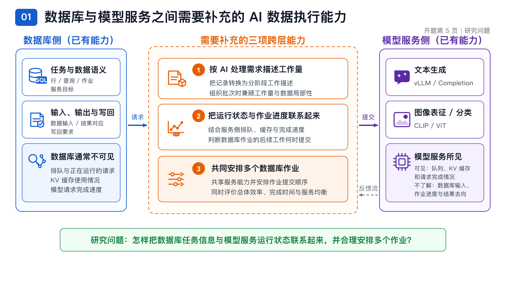

## 3. 研究目标与研究内容

### 3.1 总体目标

本课题拟构建并评价数据库 AI 数据执行层，使数据库触发的批量 AI 任务能够按真实工作量形成请求，并在模型服务总容量保持不变的条件下进行可控提交、路由和多作业协调。系统以文本生成为主要场景，以图像向量化和分类检验抽象能否跨模态复用。预期形成两项研究内容：面向 AI 工作量的数据组织，以及状态感知的提交与多作业调度；算子代价估计同时为两项内容提供决策依据。

### 3.2 研究问题

本课题围绕五个相互衔接、可通过实验检验的问题展开：

1. 如何用 token/frame、分阶段代价与局部性字段描述可比较的 AI work，使同一抽象能够服务文本和图像数据组织？
2. 数据阶段、模型服务和作业进度中哪些状态能够可靠地区分欠供给、有效供给与过量排队，状态缺失、过期或配置签名变化时如何稳定回退？
3. 当总 work 相同但长度、输出上限或 prefix 分布不同，work balance 与 locality 怎样共同影响端到端执行，是否存在跨运行压力普遍最优的组织策略？
4. 当作业活跃集合、到达过程或 work mix 改变时，在预先标定且保持不变的总容量上限内，额度借用、完成即回收和释放顺序能否相对全局 FIFO、静态分区与简单公平队列改善吞吐、尾延迟或作业公平性？
5. 算子代价估计能否在未见 context 上正确排序候选配置，并以可控的选择损失支持组织、准入、路由和多作业协调？

### 3.3 研究内容一：面向 AI 工作量的数据组织

数据库的“行”是数据语义单位，却不是稳定的 AI 计算单位。本课题先把记录或批次转换为分阶段工作描述 `WorkDescriptor`。该结构包含各执行阶段的工作量及单位、当前主要受限阶段、局部性键、时限、估计上下界和标定签名。标定签名绑定模型版本、预处理器、数据类型和硬件环境，避免把不同环境下不可比较的估计混用。

文本任务重点表达输入 token、预计输出 token、结果大小和共享前缀；图像任务重点表达编码字节、解码与缩放后的张量规模、像素工作量和向量结果大小。数据组织器在相同工作量预算下形成批请求，并比较保持原始顺序、按工作量相近分组、前缀感知分组和受控装箱等方案。研究关注工作均衡与局部性的关系：长度更整齐的批次可能减少批内方差，也可能打散共享前缀，降低缓存复用。

### 3.4 研究内容二：状态感知的提交、路由与多作业调度

本课题不在运行时反复放大或缩小模型服务的总并发上限。每个实验环境先通过离线扫描确定能够稳定供给模型服务的请求数和工作量上限，正式运行期间保持上限不变。调度器动态决定的是：哪些作业获得当前额度、请求完成后由谁补位、空闲份额能否借用，以及请求发往哪个服务端点。

运行状态以原子快照表示。每个阶段记录正在执行和等待的工作量、完成速率、最老等待时间、观测时间和容量；模型服务侧同时记录 running、waiting、KV 占用和端点工作量。快照必须满足时间新鲜度和标定签名一致性，缺失或过期时回退到冻结静态策略。多作业场景使用请求额度和工作量额度共同限制在途任务，并比较全局先来先服务、静态分区、简单公平队列以及阶段感知有序释放。若简单策略已经处于相同的吞吐、尾延迟与公平性前沿，则采用简单策略。

### 3.5 共同使能组件与多模态验证

算子代价估计采用“解析工作量 + 少量运行画像校准 + 残差修正”的轻量方案。它输出阶段工作量、算子服务时间、剩余工作量、时限余量和不确定区间，用于设置组织预算、排序候选配置、估计端点排空时间和计算多作业公平债务。评价不仅考察 MAE 或 MAPE，还考察候选配置的成对排序准确率、平均选择损失和最坏场景损失，避免出现“单点时间预测更准，却选错执行配置”的情况。

文本和图像复用同一套工作描述、额度、队列、完成事件与 trace 接口，只替换模态适配器。前缀局部性等文本特有字段，以及预处理、主机到设备传输等图像特有阶段，都由适配器显式提供，不把 token 简单改名为 frame。

### 3.6 研究边界

- PostgreSQL 是任务数据源；调度主实验以完整结果收集为边界。文本三臂保留一次统一数据库写回的端到端护栏，图像 pgvector 写回只作小规模 exactly-once 与检索质量工程闭环；写回不单列研究内容。
- vLLM 是文本生成服务，图像主路径使用 typed Ray GPU actor；不修改服务内部 batching 或模型实现。
- Daft 与 Ray 是数据引擎和执行机制；“使用框架”本身不构成创新。
- 文本 `AI_COMPLETE` 是主要方法场景，图像 `AI_EMBED/AI_CLASSIFY` 用于检验 work/credit 抽象的跨模态复用。
- 开题阶段用统一数据源、完整结果收集和输出质量闭合调度因果合同；已有文本三臂另提供数据库端到端护栏，不通过强制每组写回、增加第二数据库或扩大矩阵追求形式上的完整。

## 4. 研究方案与可行性分析

### 4.1 总体技术路线

系统链路为 PostgreSQL 数据源、Daft 数据帧、工作描述与数据组织器、Ray 异步执行与共享额度、文本 vLLM 或图像 GPU actor、结果收集及必要的数据库写回。数据库记录先被转换为带阶段工作量的批请求；组织器在预算和局部性约束下成形；调度器在固定总容量内依据新鲜状态决定释放顺序和端点；请求完成后立即归还额度并更新剩余工作量。状态、动作和结果通过同一 trace 串联，以便把性能变化定位到组织、等待、服务或结果回收阶段。

### 4.2 数据组织与工作描述实现

当前代码已实现通用的 `StageWork`、`WorkDescriptor` 和 `BatchRequest` 接口。文本兼容输入加预计输出 token 的标量工作量；图像构造器已能产生 source、prepare、model、result 四阶段描述。主要阶段工作量用于额度判定，其他阶段保留给瓶颈定位和后续阶段感知组织。超出预算的单条记录不会被静默丢弃，而是以显式超大请求单独执行。

### 4.3 状态观测与固定上限调度实现

当前调度器已实现完成即回收、最少工作量路由、共享公平工作量额度，以及固定总上限内的阶段感知有序释放策略。后者按作业应得份额缺口、等待工作量、公平债务和可选时限压力，对能够放入剩余额度的作业头请求排序，不改变请求数与工作量总上限。该策略已接入具名 Ray 协调器、配置和 active-set trace，并已完成双卡两作业的重复对照：它在共享额度策略中改善了前台尾延迟，但没有越过静态分区的隔离点，因此只形成方向性证据，不构成方法胜出。SLO 债务和阶段队列对释放动作的完整接线仍是后续工作。

### 4.4 算子代价估计方法

离线阶段先用解析特征估计 prompt/output 或 prepare/model 工作量，再用已有画像校准服务时间，并只对残差进行轻量修正。候选配置通过留一场景法评价，模型在未见场景上输出排序和选择损失。运行时只在估计结果通过离线排序门槛后，才将其写入工作描述和调度 trace；未通过时保留为诊断字段，不直接驱动动作。

### 4.5 实验设计

两项策略先分别独立搜索并冻结静态点，再执行单因素消融；之后把两个独立最优拼接，与小规模联合搜索对比。联合显著优于拼接，说明存在强交互；两者接近，则说明可以分层优化。每组正式实验固定负载清单、资源、模型服务参数、数据源、完整结果语义和随机种子，采用一次预热加三次交错重复，并保存请求明细、提交 trace、资源时序与版本信息。只有数据库端到端护栏额外固定写回路径。

核心指标包括正确结果行吞吐、数据库端到端完成时间、首 token 延迟、token 间延迟、P95/P99、SLO goodput、GPU/MFU/能耗、running/waiting/KV、端点工作量偏斜、任务质量和 exactly-once。候选方法相对强静态点达到约 5% 的关键指标改善，且正确性、模型服务供给和稳定性检查通过后，才进入下一轮验证。

### 4.6 前期工作与可行性证据

#### 4.6.1 动机证据：为什么需要工作量描述、状态感知与有界控制

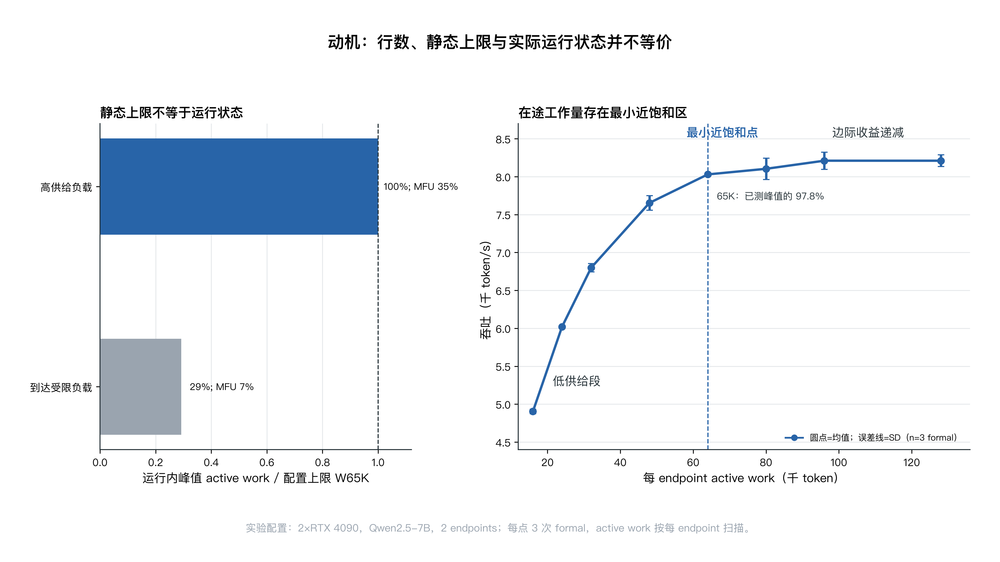

固定 16 行批次的输入 token 与输出上限之和，最小和最大中位数分别为 474 与 6,793 token，相差 14.3 倍，说明行数只能表示数据库记录数量，不能代表模型计算量。同一每端点 65K 工作量上限下，高输入压力时在途工作量达到配置上限、MFU 约 35%；到达受限时峰值仅为上限的 29%、MFU 约 7%，说明静态参数不是运行状态。八档扫描还显示，每端点 65K 已达到最大已测吞吐的 97.8%；继续增加工作量主要进入边际收益递减区，P99 在 98K 时由 36.8 秒升至 40.0 秒。

三组现象分别导出三项研究要求：显式 staged `WorkDescriptor`；可校验新鲜度的 runtime state snapshot；在预先标定且保持不变的总容量上限内重新分配 work credit。已有 SLO-EWMA、AIMD 等对照没有稳定超过强静态点，因此后续研究把总容量扫描与运行时份额调整分开，避免把在线调参本身当作贡献。

#### 4.6.2 统一文本数据库端到端三臂

文本数据库端到端实验采用两类负载：SQuAD 短答案均匀控制组和 ShareGPT 受控异质组。三条路径分别是直接调用容量参照、DuckDB AI 静态分片和项目的冻结静态执行路径。三者共享 PostgreSQL 数据源、不可变负载清单、两个 vLLM 服务端点、Qwen2.5-7B、前缀缓存、统一 PostgreSQL 写回，以及一次预热加三次正式重复。

K128 replacement 中，SQuAD direct、DuckDB AI、项目冻结静态的 correct rows/s 均值分别为 136.63、136.68 和 137.77；service tokens/s 分别为 40,920.72、40,955.99 和 41,277.95。项目/direct service ratio 为 100.87%，三臂 normalized EM 约 80.26%–80.31%，token F1 约 89.36%–89.38%。因此均匀短输出下三条静态路径近似中性；该结论不外推到 ShareGPT。

ShareGPT 组中，直接调用、DuckDB AI 和项目冻结静态路径的正确结果行吞吐均值分别为 11.36、2.26 和 17.55 行/秒；模型服务吞吐分别为 9,425.25、9,421.31 和 14,568.91 token/秒。后续在同一负载上扫描并发 32、64、128、256，得到 9,454.88、14,057.93、17,834.14 和 18,158.19 token/秒，说明原直接调用的并发 32 只达到已测峰值的 52.07%。因此项目与该直接调用点的差距反映并发和执行结构差异，不能作为饱和条件下的方法排名。DuckDB AI 则暴露了固定输出上限的产品语义边界：三次重复共有 4,921/6,144 行因输出上限语义失败，基础设施失败为 0。

| workload | 路径 | correct rows/s | service tokens/s | service ratio vs C32 direct | cap 语义失败 |
|---|---|---:|---:|---:|---:|
| SQuAD uniform | direct | 136.63 | 40,920.72 | 100.00% | 0 |
| SQuAD uniform | DuckDB AI | 136.68 | 40,955.99 | 100.09% | 3/31,710 |
| SQuAD uniform | project frozen-static | 137.77 | 41,277.95 | 100.87% | 0 |
| ShareGPT controlled-skew | direct | 11.36 | 9,425.25 | 100.00% | 0 |
| ShareGPT controlled-skew | DuckDB AI | 2.26 | 9,421.31 | 99.96% | 4,921/6,144 |
| ShareGPT controlled-skew | project frozen-static | 17.55 | 14,568.91 | 154.57%，但 C32 direct 欠供给，不排名 | 0 |

这组实验的目标不是证明项目路径胜出，而是建立可审计的统一比较边界。raw rows/s、correct rows/s 和 service tokens/s 必须同时报告；产品层因固定输出上限返回空结果时，GPU 已消耗的服务 work 不能被隐藏，也不能把语义不兼容误写成纯性能排名。

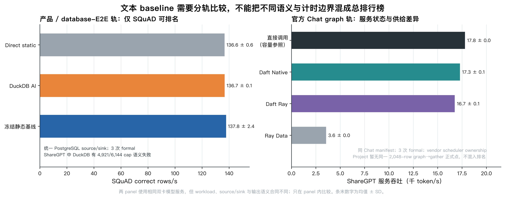

这张图不把 DuckDB、Daft 和 Ray Data 强行压入一个总排行榜。产品轨暴露正确吞吐与输出
语义边界，官方 Chat graph 轨暴露 underfeed、overqueue 与服务状态差异；两者共同对应到
研究内容一的 neutral WorkDescriptor，以及研究内容二的状态感知有界提交。也就是说，
baseline 的作用不是单独展示谁快，而是明确现有系统在哪一层缺少可迁移 work 表达、全局
状态观测或多 Job 协调。

#### 4.6.3 原生单 Job：任务完成与请求等待并不等价

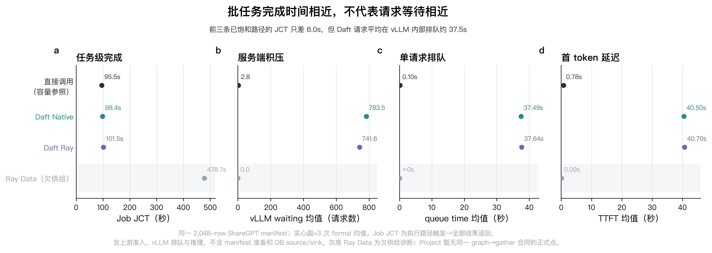

在同一 2,048 行 ShareGPT 负载上，直接调用的并发 128 容量参照、Daft Native、Daft Ray 和 Ray Data 官方执行图均完成一次预热和三次正式重复；共 12 次正式运行，失败为 0，吞吐与作业完成时间的变异系数均小于 0.7%。三次均值如下：

| 路径 | Job JCT | vLLM waiting 均值 | 单请求 queue time 均值 | TTFT 均值 |
|---|---:|---:|---:|---:|
| 直接调用（容量参照） | 95.5s | 2.8 | 0.10s | 0.78s |
| Daft Native | 98.4s | 783.5 | 37.49s | 40.50s |
| Daft Ray | 101.5s | 741.6 | 37.64s | 40.70s |
| Ray Data（欠供给诊断） | 478.7s | 0 | 约 0s | 0.09s |

Daft Native/Ray 的作业完成时间仅比容量参照增加约 2.9/6.0 秒，但单请求平均排队时间增至约 37.5 秒、TTFT 增至约 40.5 秒；大量并行排队被任务级完成时间掩盖。两臂模型服务吞吐仍为 17,286/16,747 token/秒，KV 最大占用接近 1。Ray Data 当前路径的服务吞吐和 MFU 仅为 3,551 token/秒和 0.112，因此零 waiting 反映供给不足，不表示调度更优。该现象要求提交控制同时观察任务吞吐与请求级排队和尾延迟。本实验只描述原生执行路径的外部状态，不用于比较尚未加入的项目状态感知方法。

上图先给出任务级结果和请求级延迟；下面的状态补充图再解释相同 JCT 背后的供给与资源机制。GPU utilization 在四条路径中均为 86%–97%，但 MFU、running、waiting 与 KV 明显分化，因此不能以 GPU utilization 单独判断是否喂饱模型服务。

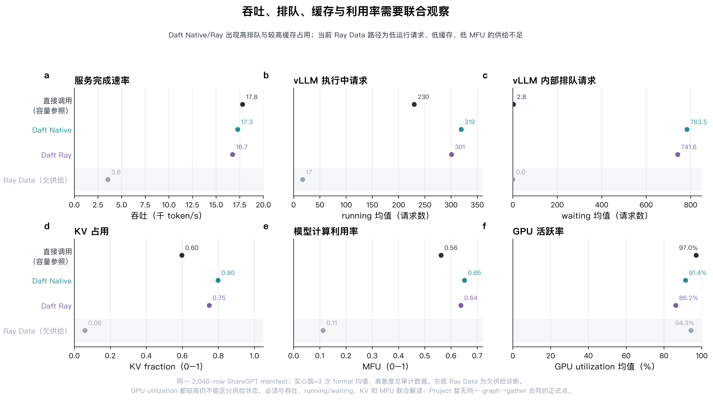

#### 4.6.4 两 Job 因果点与四 Job 扩展

同一 short/long manifest 上，所有系统只统一 Job 级到达：long 在 short 启动 5 s 后启动。项目在 Job 内按 `arrival_time_scale=0.001` 逐请求 replay；原生 Daft/Ray Data graph 在 Job 启动后获得完整 manifest，因此跨轨绝对 JCT 不具备排名合同。项目先用 full-pool 与 reserved-half-pool 两个 single-short 控制隔离静态额度效应；两者 short JCT 均约 71.24 s，quota-only 对 JCT/P99/work rate 的变化约为 −0.003%/−0.013%/−0.004%。long 真正加入后，static/shared 的实际 overlap 分别为 68.94/72.62 s，short JCT/P99/work rate 变化分别为 +3.79%/+90.80%/−3.57% 和 +8.95%/+173.33%/−8.28%，因此项目轨内的前台退化来自真实服务竞争，而不是额度减半本身。

shared 相对 static 将 aggregate service throughput 提高 21.03%、long JCT 降低 18.31%，但 short JCT 增加 4.98%，Jain fairness median 从 0.759 降到 0.707。它说明 shared work credit 会在效率、隔离和公平之间产生可测权衡，后续方法必须同时报告三类指标。Daft Native、Daft Ray、Ray Data 也都产生真实 overlap，均值分别为 15.17/25.19/166.14 s，short JCT 相对各自 single 增加 82.42%/104.84%/32.76%。这些只作为各原生轨内部 `single→overlap` 的外部观察，不归因框架内部算法，也不把项目 arrival-replay 的 71.24 s 与 Daft Native eager-manifest 的 11.06 s 写成系统性能倍数。原 15 s offset 下 Daft Native 的 short 在 long 到达前已完成，该数据不进入干扰结论。开题据此提出 per-job work/state 感知、idle borrowing 与 SLO/fairness guard；weighted/held-out、Long→Short 和图像 phase-change 留作论文阶段验证。

逐请求 raw 将该现象进一步定位：项目 single-short 的 71.24 s 中，66.875 s（93.87%）是冻结 arrival span，最后到达后的 drain 为4.367 s；平均 arrival→flush、flush→submit、submit→service 分别只有75.1/3.29/3.00 ms，backend service 为3.847 s。项目 vLLM 单请求 mean 3.837 s 反而低于 Daft Native 的6.654 s；Daft 更快来自完整 manifest 在计时前可见，使 running/MFU 达250.1/44.04%，而项目只有26.1/6.63%。long 加入后，static/shared 的 short backend service mean 分别增加59.74%/88.17%，buffer P99 从约86 ms 增至0.917/3.835 s，说明既有 GPU service 竞争，也有项目上游 pending/credit 软拥塞；vLLM queue mean 仍只有微秒量级，不能单独作为控制信号。

进一步把同一 Project short manifest 改为 all-at-t0 后，三次 T0 profiler E2E 为14.957s，T3 最早模型提交到最晚响应完成为11.354s，service throughput/MFU 为14,361 tok/s/42.93%；Daft Native 已记录的同边界为11.059s、14,727 tok/s/44.04%，只差约2.5%–2.7%。这排除了“Project 模型请求路径慢6.4×”的解释。Daft 的 source、provider、DataFrame 和 expression 准备位于现有 timer 之前，缺匹配 T0，故14.957s 与11.059s 仍不作完整 E2E 排名。短 Job 诊断无需为了60s人为扩规模；eager 多 Job 只补 Project 配对，在线 replay 与原生系统内干扰结论不替换。

Project eager 多 Job 配对随后补齐 full-pool single、half-pool single、static+long 和 shared+long，12/12 formal 均 exactly-once、零 incident，DB arrival span 统一压缩为66.76µs。full→half 的 quota-only 已使 short JCT+59.00%；在相同 half quota 下加入 long，static short JCT/P99/work rate 进一步变化+58.77%/+56.19%/−36.99%；shared+long 相对 full single 为+28.90%/+29.04%/−22.64%。eager shared 相对 static 将 short JCT 降低48.94%、aggregate throughput提高31.85%、long JCT降低25.75%，Jain均值0.894→0.972；long到达前 running总和均值120.6→230.1，直接体现 idle borrowing。逐阶段上，static matched competition 使short service mean/P99 +50.34%/+78.62%，shared为+14.63%/+28.70%，submit→service仍约2ms。在线 replay 中 shared 伤害 short/fairness，而 eager 中同时改善效率、隔离和公平，说明策略价值依赖 arrival regime；开题据此提出状态观测和受SLO/fairness约束的 work-conserving 调度，不声称最终动态控制器已经胜出。

为验证结论不只来自一个 long，进一步完成 `short@0s → {long1,long2,long3}@5s` 四 Job
矩阵。每个 Job 均为512行；Project先运行full/quarter single，再运行static/shared四Job，
从而把quota-only与真实竞争分离。full→quarter使short JCT +180.38%，在相同quarter上限
下加入其它Job又使static short +60.40%；shared相对static使short/long1/2/3 JCT分别
−72.23%/−8.28%/−20.24%/−52.66%，group throughput +8.68%、MFU +8.56个百分点，
所以按三次formal均值，在效率/JCT子向量上构成相对static的经验性Pareto改善；但raw-work Jain
0.960→0.923，表示收益分配更不均。shared相对quarter-solo的JCT比为
0.45/1.29/1.14/0.68，long1/2未达到经验性保留份额非劣。Daft Native、Daft Ray、Ray Data保持各自
vendor-owned graph，未注入项目调度；它们的short与三个long相对各自single也全部退化，
并分别呈现high-waiting/high-KV或low-running/low-MFU。四Job证据因此支持idle borrowing
与fairness/SLO guard必须同时设计，不支持Project或dynamic普遍胜出；这里不是完整多目标
Pareto改善，也不是DRF Pareto efficiency，Jain也不是share guarantee。历史紧凑数据不能还原event-level
service lag/starvation，相关保证留待带无损completion/backlog ledger的新formal验证。

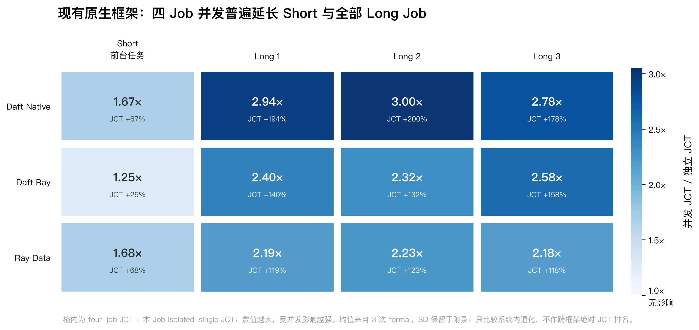

#### 4.6.5 最小饱和在途工作量

双 RTX 4090、冻结 Qwen/vLLM 配置下，每个服务端点 65,536 在途工作量已达到最大已测吞吐均值的 97.80%，下一档只增加 0.92%；继续提高到 98K，吞吐增量有限而 P99 由 36.78 秒上升到 40.05 秒。因此应先标定最小饱和点，再比较上游策略。65,536 只适用于当前机器、模型、协议和负载，不是通用常数。

#### 4.6.6 数据组织的服务压力依赖

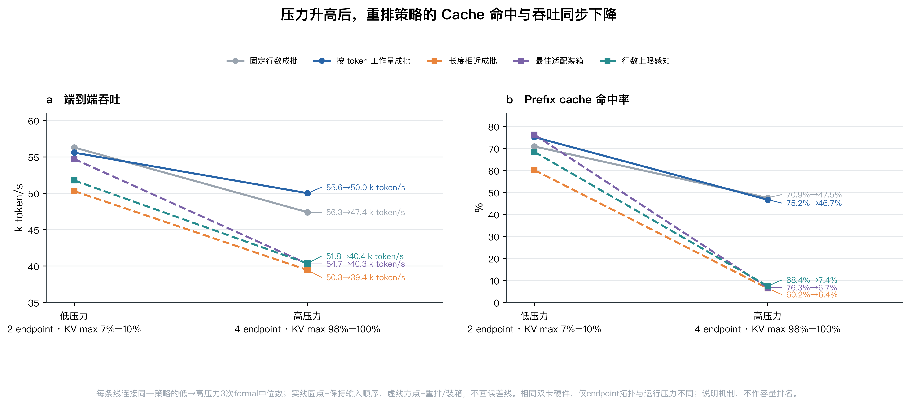

在相同双卡硬件上，2 endpoint 条件下 KV max 仅 7%–10%，五种组织策略约为
50K–56K tok/s，范围约 12%，locality 破坏尚未被放大；4 endpoint consolidation
使 KV max 达 98%–100% 时，吞吐分化到约 39K–50K tok/s，并出现排名反转。
重排序类 organizer 将 prefix group ratio 打散后，prefix cache hit 降至 0.06–0.07。
因此变化的是 serving 拓扑造成的运行压力，不是硬件池大小。该证据对应研究内容一中
work balance 与 locality preservation 的联合组织，不支持某个 organizer 全局最优。

#### 4.6.7 图像分阶段工作量与状态感知动机

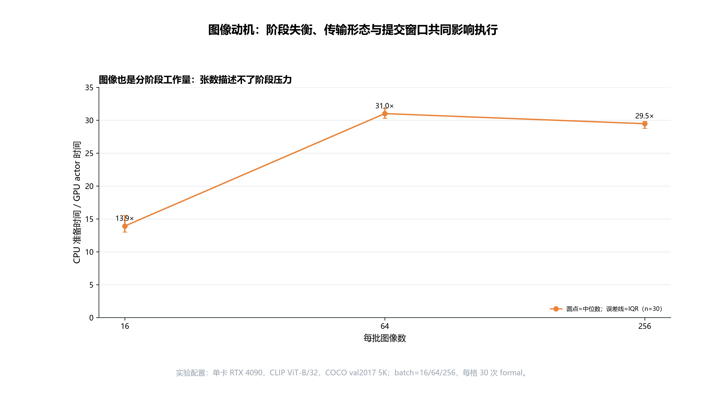

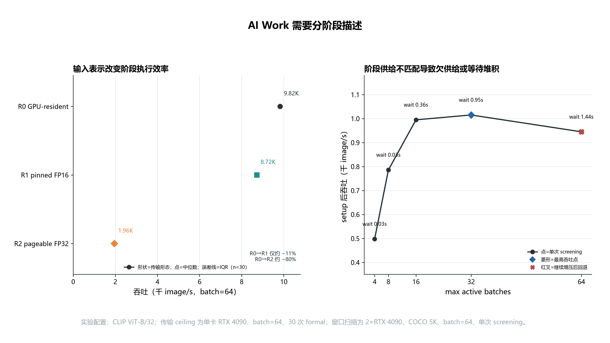

CLIP exact-path 画像显示，在 batch 16/64/256 时 CPU prepare/GPU actor 时间比为
13.8/31.2/29.5 倍，说明图像 work 不能只用 frame 数描述；prepare work、ready tensor
bytes 与 model work 必须分别约束。batch64 的 transfer ceiling 中，GPU-resident、pinned
FP16 与 pageable FP32 路径分别约为 9.82K、8.72K 和 1.96K img/s，说明所有“传输”不能
合并成一个常数项，host ownership-copy 与转换必须进入阶段描述。5K active-window 单次
screening 又显示 active4→32 时 setup 后吞吐由约 0.50K 增至 1.02K img/s，active64 回退且
wait P50 增至 1.44s。三组证据共同导出分阶段 WorkDescriptor、CPU prepare queue / ready
tensor / GPU actor 状态观测和有界准入；它们不证明 active32 可迁移，也不证明图像动态策略
已经胜出。

#### 4.6.8 图像基线的能力、扩展与可比边界

图像路径必须按角色分层，而不能把所有数字放进一个排行榜。Direct CLIP 是 GPU 容量
control；Daft Built-in 与 Ray Data 是 vendor-owned 原生 baseline；vLLM Pooling 是服务化
候选，但当前两次单图 capability gate 均在 600 s timeout 且无 embedding，因而只标
`blocked`，不生成吞吐值；Project Static 是冻结方法参考。Daft Native/Ray 自写 UDF 仅作
diagnostic reference，不冒充原生 baseline。

12K 同语义三臂均满足 exactly-once，Daft Built-in、Ray Data 与项目路径的 JCT 均值分别约为
65.2、17.8 和 15.9 s，但快臂仍是短窗口，且 Daft Built-in 在 20K 已因 object-store
OutOfDisk，因此该 panel 只承担结构诊断。120K matched-resource 下，只有 Ray Data native
与项目冻结静态路径具备同资源正式合同；CPU8/16 各三次重复，项目 JCT 比 Ray Data
低约 10%/17%。只有这一组可以进行相对比较；它提供静态阶段组织的初步信号，尚未回答状态感知调度能否带来额外收益。

#### 4.6.9 图像四 Job 并发干扰的跨模态证据

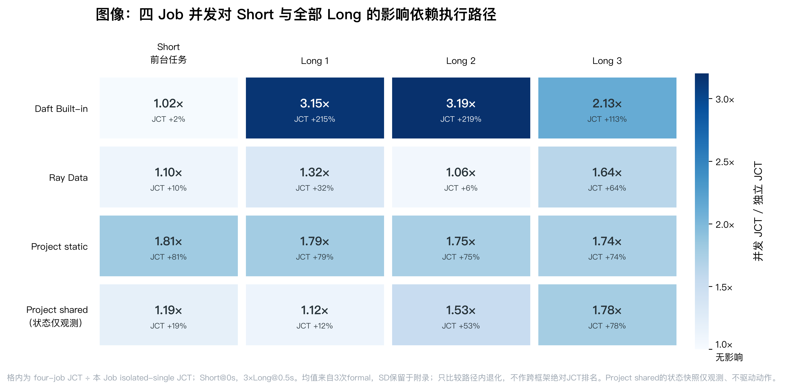

图中只比较每条路径内“four-job JCT / 对应 isolated JCT”，不比较不同框架的绝对时间。
Daft Built-in 的 Short/Long1/Long2/Long3 分别为 1.02×/3.15×/3.19×/2.13×，Ray Data
分别为 1.10×/1.32×/1.06×/1.64×；这说明相同 Job 数与输入规模并不产生相同的任务级
干扰形态。Project frozen-static 下四个 Job 约为 1.74×--1.81×；现有 shared-credit
路径下为 1.19×/1.12×/1.53×/1.78×，但该路径的 RuntimeStateSnapshot 只做
observe-only 记录，不驱动 credit 或路由，而且 shared/static group JCT 只差 0.98%。因此，
它支持“图像也需要 per-Job staged work、阶段进度、隔离和公平状态”这一动机；现阶段的状态快照仍属于接线与观测证据，尚未形成性能增量结论。原生适配器没有统一输出 prepare/H2D/forward
阶段计时，故本图不虚构阶段分解；CPU 准备、传输与模型阶段的机制证据由上一张独立图承担。

#### 4.6.10 代价模型的配置选择价值

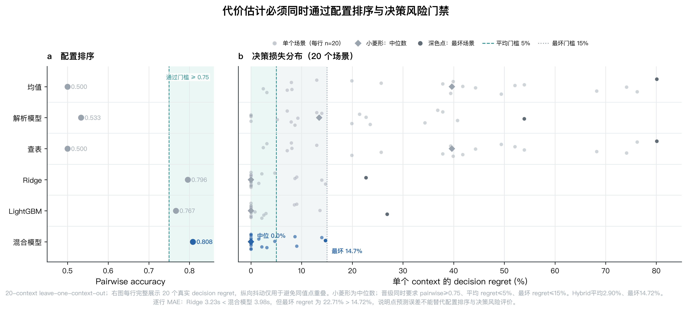

在 429 个正式观测、20 个场景和 4 个候选配置的留一场景评价中，混合模型的合并选择损失为 1.67%，场景等权平均损失为 2.90%，候选配置成对排序准确率为 0.808，最坏场景损失为 14.72%。最坏值仅比 15% 的预设门槛低 0.28 个百分点，因此属于边界通过。该结果说明代价估计具备初步配置选择价值，但仍需在新时间段、负载和硬件上校准。

#### 4.6.11 设计、实现与验证进度

开题中的设计不等于全部已进入正式执行路径。当前四个等权部件的边界如下：

| 部件 | 设计依据 | 当前实现 | 后续验证重点 |
|---|---|---|---|
| Work Unit / WorkDescriptor | 同 16 行 token work 差 14.3×；图像 prepare/model 阶段失衡 | 已有 staged descriptor、calibration signature、locality/deadline/uncertainty 字段，图像 production builder 已接入正式 Project runner | staged organization 尚未证明胜出；文本正式 runner 的同类 descriptor 接线仍待完成 |
| 状态感知 | 同 W65K 在 high/arrival-limited 下呈现不同 running/MFU；原生路径呈现 overqueue/underfeed | endpoint/resource trace 已采集；图像 stage snapshot 已以 observe-only 方式接入，并校验 freshness 与 calibration signature | snapshot 尚未驱动正式 active-work/release 动作，尚无独立性能增量 |
| 动态与多作业调度 | 两 Job 与四 Job 配对显示前台/long 干扰、idle borrowing、arrival-regime dependence 及效率—公平权衡 | 完成回收、最少工作量路由、共享公平额度和固定上限有序释放均已接入运行时；固定上限两作业 GPU 对照已完成，但有序释放未越过静态隔离点 | 先用非抢占前台优先诊断 release-only 可达域，再评估有限保护余量；补齐 SLO 债务和阶段队列输入 |
| 算子代价估计 | 20 contexts 的选错代价为 12.0%–86.5%，简单 proxy 决策失败 | CE1–CE5 离线估计器和 context leave-one-out 已完成，CE5 为 marginal pass | 尚未在线驱动 organization/routing/credit，也未验证跨模态 remaining work 与 SLO 收益 |

同一总容量下的全局先来先服务、静态分区、简单公平队列与有序释放两作业对照已经完成；结果显示无保护、不可抢占的有序释放不能免费复制静态分区的前台隔离。后续先做非抢占前台优先可达性诊断，再单变量评估有限保护余量，并按数据组织、路由、公平共享的顺序做消融。不在同一次实验中同时改变全部部件，以免无法归因。

#### 4.6.12 阶段性结论与后续验证重点

阶段性证据表明：固定行数不是稳定的工作量代理；固定资源下存在最小饱和在途工作量；运行状态会随输入压力改变；ShareGPT 在并发 32、128、256 时分别呈现供给不足、接近饱和和过量排队；原生单 Job 下 Daft Native/Ray 与 Ray Data 当前路径呈现过量排队与供给不足两种外部压力形态。文本与图像的多 Job 并发都会影响短任务和长任务，且干扰形态依赖作业与执行图。共享额度呈现效率、隔离与公平权衡；固定上限两作业对照进一步表明，有序释放在共享额度策略中改善前台尾延迟，但静态分区仍是更强隔离点。数据组织策略的相对表现受服务压力影响；图像同资源实验给出了静态阶段组织的可重复信号；统一三臂数据库端到端正确性护栏已经闭合。轻量代价模型也显示了配置选择价值，但仍属于文本场景下的初步证据。下一阶段只验证非抢占 release 的可达上界和有限保护余量；若简单策略或静态点已处于相同前沿，则不再增加控制器复杂度。

## 5. 进度安排

| 时间 | 工作内容 | 交付物与停止条件 |
|---|---|---|
| 2026 年 8 月 | 完成数据库端到端护栏、原生单 Job、两 Job 因果点与四 Job 扩展；冻结开题报告、正式图集与 20 页答辩材料 | 报告、PPT、图表和 Claim Matrix 完成一致性审计 |
| 2026 年 9 月 | 完成工作单元构造的跨负载、跨服务压力消融 | 数据组织正式实验报告；不以单点峰值选策略 |
| 2026 年 10 月 | 完成固定总并发上限下的活跃作业释放、路由和多作业公平性对照 | 同一总上限下比较全局 FIFO、静态分区、DRR/VTC 风格与状态感知有序释放；简单策略同样好时采用简单策略 |
| 2026 年 11 月 | 完成代价模型留出场景校准和两项策略耦合验证 | 配置排序、选择损失、独立拼接与联合搜索报告 |
| 2026 年 12 月 | 汇总实验数据，分析方法适用范围，完成论文主体初稿 | 数据分析报告、论文初稿与复现实验说明 |
| 2027 年 1 月及以后 | 根据评阅意见补充验证并修改论文，准备学位论文评审与答辩 | 学位论文定稿、完整原始证据和答辩材料 |

开题前不再增加第二数据库、更多框架产品、workload 或大规模参数扫描。已冻结的最小文本原生框架矩阵只用于补齐当前系统对照，不扩成产品排名。后续新增实验必须对应一个核心 claim，且现有证据无法回答；否则不启动。

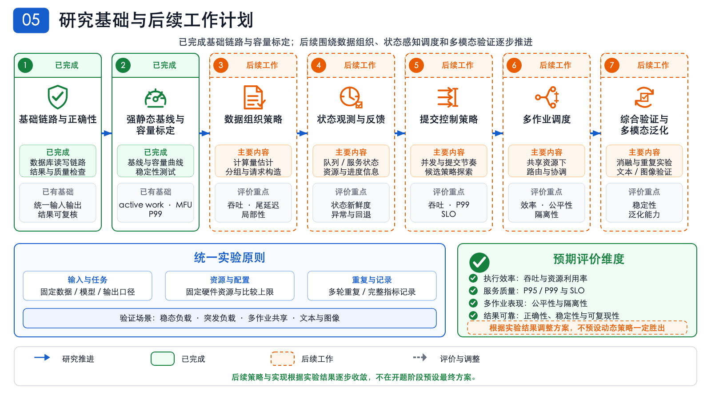

## 6. 预期成果、创新点与风险控制

### 6.1 预期成果

1. 一套数据库触发、模型服务执行、结果写回的可复现 AI 数据执行层实验系统。
2. 一套按 token/frame work 构造请求、按 request/work credit 提交与协调多作业的方法。
3. 一个用于 active-work、组织、路由和提交选择的轻量算子代价估计组件。
4. 统一的正确性、任务质量、模型服务供给、稳定性、资源和数据库端到端评价合同，以及相应实验报告、图表和论文正文。

### 6.2 预期创新点

1. 面向数据库 AI 负载的工作单元构造方法：统一 token/frame 工作量表征，刻画工作均衡与局部性的冲突及其服务压力边界。
2. 面向固定模型服务容量的上游提交、路由和多作业调度：以 shared request/work credit 和 completion release 表达真实在途 work，并以强静态点作为默认对照。
3. 面向执行决策的轻量代价估计：把误差评价进一步落实到配置 ranking、selection regret 和 SLO slack，为两项研究内容提供共同信号。

### 6.3 风险与降级路径

- 若状态感知策略不超过静态点，则收敛为最小饱和标定、服务状态诊断和动态控制的适用边界，不通过更换负载寻找正向结果。
- 若图像链路持续由 CPU 预处理主导，则把结论限定为异构流水线组织，不外推为 GPU serving 优化。
- 若代价模型 max regret 在新 context 上越过门槛，则保留解析 baseline 与不确定区间，并限制其只用于初始化或候选剪枝。
- 若某产品 AI 函数与统一 output-cap 语义不兼容，则同时报告 raw work、correct throughput 和失败类型，不进行失真的纯性能排名。

## 7. 主要参考文献

[1] P. Aggarwal, B. Chen, A. Datta, et al. Cortex AISQL: A Production SQL Engine for Unstructured Data. In: Companion of the 2026 International Conference on Management of Data. 2026

[2] Google Cloud. BigQuery ML: Generate Text and Embeddings. 2025

[3] Oracle. Oracle AI Vector Search: VECTOR_EMBEDDING SQL Function. 2025

[4] pgvector. Open-source Vector Similarity Search for Postgres

[5] Timescale. pgai: AI Workflows for PostgreSQL

[6] G. Li, J. Sun, S. Li, et al. GaussML: An End-to-End In-database Machine Learning System. In: 2024 IEEE 40th International Conference on Data Engineering. 2024

[7] Y. Guo, G. Li, R. Hu, Y. Wang. In-database query optimization on SQL with ML predicates. The VLDB Journal, 2025, 34(1): Article 12

[8] Z. Zhao, S. Cai, H. Gao, et al. NeurDB: On the Design and Implementation of an AI-powered Autonomous Database. In: 15th Conference on Innovative Data Systems Research. 2025

[9] L. Zeng, N. Xing, S. Cai, et al. Powering In-Database Dynamic Model Slicing for Structured Data Analytics. Proceedings of the VLDB Endowment, 2024, 17(13): 4813-4826

[10] P. Moritz, R. Nishihara, S. Wang, et al. Ray: A Distributed Framework for Emerging AI Applications. In: 13th USENIX Symposium on Operating Systems Design and Implementation. 2018

[11] G. I. Yu, J. S. Jeong, G. W. Kim, S. Kim, B. G. Chun. Orca: A Distributed Serving System for Transformer-Based Generative Models. In: 16th USENIX Symposium on Operating Systems Design and Implementation. 2022

[12] W. Kwon, Z. Li, S. Zhuang, et al. Efficient Memory Management for Large Language Model Serving with PagedAttention. In: Proceedings of the 29th Symposium on Operating Systems Principles. 2023: 611-626

[13] A. Agrawal, N. Kedia, A. Panwar, et al. Taming Throughput-Latency Tradeoff in LLM Inference with Sarathi-Serve. In: 18th USENIX Symposium on Operating Systems Design and Implementation. 2024

[14] Y. Zhong, S. Liu, J. Chen, et al. DistServe: Disaggregating Prefill and Decoding for Goodput-optimized Large Language Model Serving. In: 18th USENIX Symposium on Operating Systems Design and Implementation. 2024

[15] C. Lin, Z. Han, C. Zhang, et al. Parrot: Efficient Serving of LLM-based Applications with Semantic Variable. In: 18th USENIX Symposium on Operating Systems Design and Implementation. 2024

[16] Y. Sheng, S. Cao, D. Li, et al. Fairness in Serving Large Language Models. In: 18th USENIX Symposium on Operating Systems Design and Implementation. 2024

[17] B. Sun, Z. Huang, H. Zhao, et al. Llumnix: Dynamic Scheduling for Large Language Model Serving. In: 18th USENIX Symposium on Operating Systems Design and Implementation. 2024

[18] F. S. Luan, R. Y. Wang, K. Gu, et al. The Streaming Batch Model for Efficient and Fault-Tolerant Heterogeneous Execution. arXiv:2501.12407, 2025

[19] Daft Documentation. Distributed Execution with Ray, Partitioning and Batching. 2025

[20] L. Patel, S. Jha, M. Pan, et al. Semantic Operators and Their Optimization: Enabling LLM-Based Data Processing with Accuracy Guarantees in LOTUS. Proceedings of the VLDB Endowment, 2025, 18(11): 4171-4184

[21] M. Russo, S. Sudhir, G. Vitagliano, et al. Abacus: A Cost-Based Optimizer for Semantic Operator Systems. Proceedings of the VLDB Endowment, 2026, 19(5): 1060-1073

[22] C. Liu, M. Russo, M. Cafarella, et al. Palimpzest: Optimizing AI-Powered Analytics with Declarative Query Processing. In: 15th Conference on Innovative Data Systems Research. 2025

[23] J. Lao, et al. SemBench: A Benchmark for Semantic Query Processing Engines. Proceedings of the VLDB Endowment, 2026, 19(8): 1754-1767

[24] M. Raasveldt, H. Mühleisen. DuckDB: An Embeddable Analytical Database. In: Proceedings of the 2019 International Conference on Management of Data. 2019

[25] A. Lamb, et al. Apache Arrow DataFusion: A Fast, Embeddable, Modular Analytic Query Engine. In: Companion of the 2024 International Conference on Management of Data. 2024

[26] R. Heinrich, M. Luthra, J. Wehrstein, H. Kornmayer, C. Binnig. How Good are Learned Cost Models, Really? Insights from Query Optimization Tasks. Proceedings of the ACM on Management of Data, 2025, 3(3): Article 172

[27] J. Wehrstein, T. Bang, R. Heinrich, C. Binnig. GRACEFUL: A Learned Cost Estimator for UDFs. In: 2025 IEEE 41st International Conference on Data Engineering. 2025

[28] R. Heinrich, C. Binnig, H. Kornmayer, M. Luthra. COSTREAM: Learned Cost Models for Operator Placement in Edge-Cloud Environments. In: 2024 IEEE 40th International Conference on Data Engineering. 2024: 96-109

[29] E. Satriani, E. Veltri, D. Santoro, et al. Logical and Physical Optimizations for SQL Query Execution over Large Language Models. Proceedings of the ACM on Management of Data, 2025. DOI: 10.1145/3725411

[30] Y. Yuan, et al. NeuStream: Bridging Deep Learning Serving and Stream Processing. In: Proceedings of the Twentieth European Conference on Computer Systems. 2025

[31] L. Zheng, L. Yin, Z. Xie, et al. SGLang: Efficient Execution of Structured Language Model Programs. In: Advances in Neural Information Processing Systems 37. 2024

[32] A. Ghodsi, M. Zaharia, B. Hindman, et al. Dominant Resource Fairness: Fair Allocation of Multiple Resource Types. In: 8th USENIX Symposium on Networked Systems Design and Implementation. 2011

[33] D. Shue, M. J. Freedman, A. Shaikh. Performance Isolation and Fairness for Multi-Tenant Cloud Storage. In: 10th USENIX Symposium on Operating Systems Design and Implementation. 2012

[34] A. Cheng, A. Kabcenell, X. Shi, et al. Fair Transaction Processing for Multi-Tenant Databases. Proceedings of the VLDB Endowment, 2025, 18(8): 2602-2615

[35] K. Mahajan, A. Balasubramanian, A. Singhvi, et al. Themis: Fair and Efficient GPU Cluster Scheduling. In: 17th USENIX Symposium on Networked Systems Design and Implementation. 2020

[36] J. Gu, M. Chowdhury, K. G. Shin, et al. Tiresias: A GPU Cluster Manager for Distributed Deep Learning. In: 16th USENIX Symposium on Networked Systems Design and Implementation. 2019

[37] A. Qiao, S. K. Choe, S. J. Subramanya, et al. Pollux: Co-adaptive Cluster Scheduling for Goodput-Optimized Deep Learning. In: 15th USENIX Symposium on Operating Systems Design and Implementation. 2021
