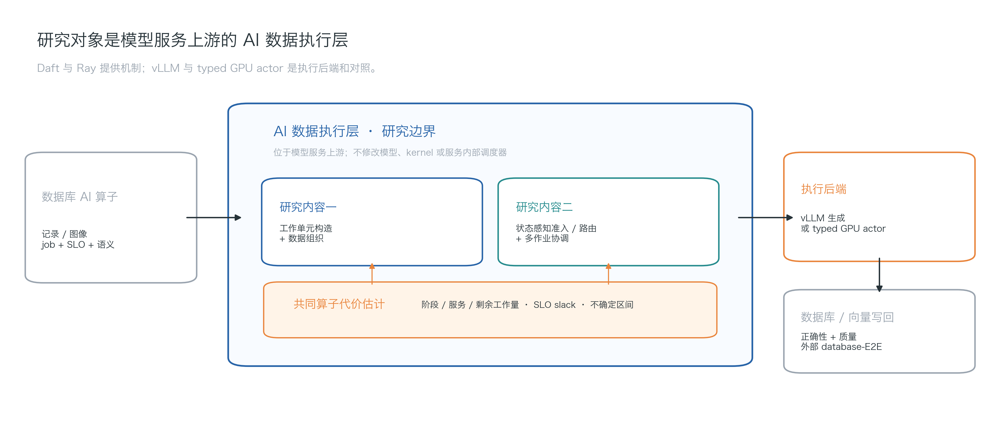
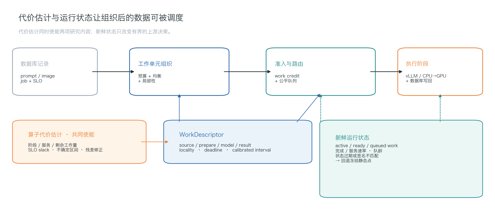
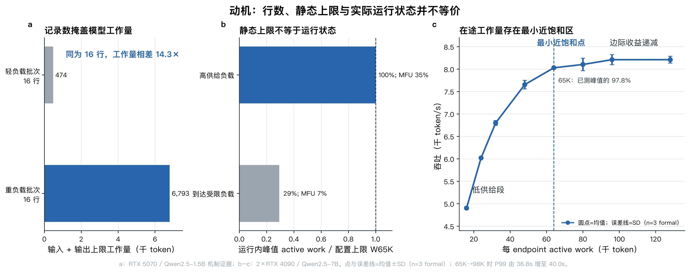
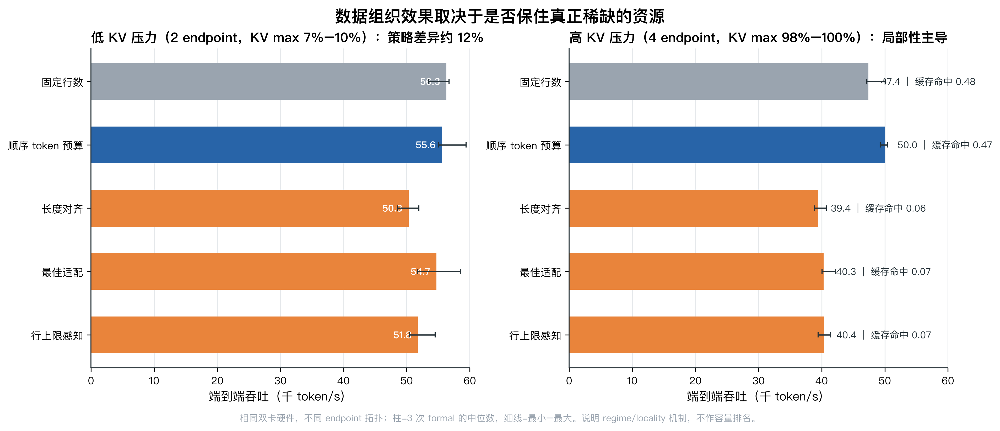
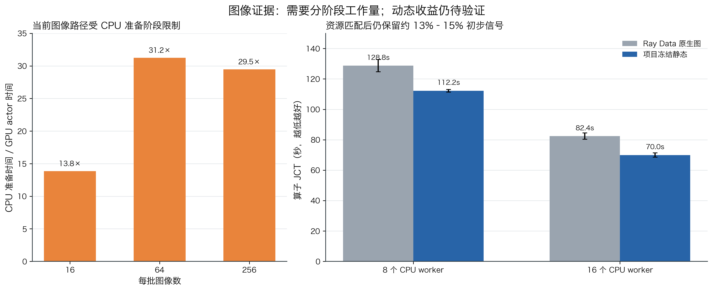
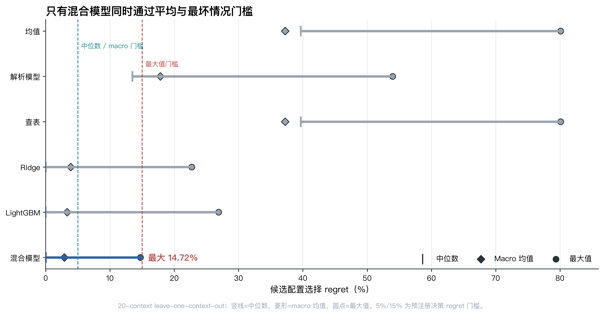

# 硕士生论文开题报告

题目：数据库 AI 负载的执行优化与调度研究

## 1. 课题背景、目的和意义

数据库正从结构化数据管理系统扩展为 AI workload 的入口。Snowflake Cortex AISQL、BigQuery ML/AI、Oracle AI Vector Search 以及 PostgreSQL 的 pgvector、pgai 等系统，已经允许用户在 SQL 或数据库工作流中调用文本生成、向量化、语义过滤和分类模型[1-5]。这类算子改变了查询执行的成本结构：一条数据库任务不再只经历 scan、join 和 aggregate，还要把表中记录转换为模型请求，经由外部执行层提交到 GPU 服务，再把生成文本、分类结果或向量写回数据库。

模型服务通常把输入抽象为相互独立的请求，却不了解数据库行、作业边界、剩余工作量和写回语义；数据库优化器也通常看不到模型服务内部的队列、KV 压力和完成节奏。两者之间由此形成一个新的 AI 数据执行层：它决定哪些记录组成一个 work unit、在途 work 保持多少、请求何时提交、发往哪个 endpoint，以及多个数据库作业如何共享固定 GPU 容量。

本课题研究这一外部执行链路，不修改数据库内核、vLLM continuous batching、Ray 调度器、模型结构或 GPU kernel。核心目标有两个：一是按 token、frame 等计算量而非固定行数构造 staged work unit，并处理负载均衡与 prefix locality 的冲突；二是依据服务容量和运行状态控制准入、路由与多作业共享，使系统以尽可能小且可控的在途 work 达到有效吞吐，同时约束尾延迟和公平性。轻量算子代价估计是两项研究内容的共同使能部件：它统一产生 stage/service/remaining work、SLO slack 和不确定区间，既供数据组织形成 `WorkDescriptor`，也供准入、路由和多作业调度消费。

课题的研究意义在于把“数据库如何有效驱动模型服务”作为独立的系统问题。现有数据库 AI 工作主要优化查询语义、模型调用次数或数据库内推理；模型服务工作主要优化已到达请求的批处理、KV 管理和 GPU 调度。数据库记录到模型请求之间的数据组织、提交与多作业协调仍缺少统一、可观测且可证伪的方法。应用上，本课题希望给出一套能够复现实验条件、明确适用边界的执行策略与评价方法，而不是宣称上游系统能够突破模型服务本身的容量上限。

## 2. 国内外研究现状

### 2.1 数据库 AI 算子与语义查询优化

Cortex AISQL 把 `AI_COMPLETE`、`AI_EMBED`、`AI_FILTER`、`AI_CLASSIFY` 和语义连接等算子纳入 SQL，并通过谓词重排、模型级联和语义连接重写减少昂贵模型调用[1]。BigQuery 和 Oracle 也提供 SQL 级生成与向量化接口[2-3]。LOTUS、Palimpzest、Abacus 和 SemBench 分别研究语义算子的声明式执行、代价优化和统一评测[20-23]。GaussML、Smart、NeurDB 和 LEADS 则代表把模型推理或模型选择进一步带入数据库内核的路线[6-9]。

这些工作证明了场景真实性，也说明任务质量必须和执行性能同时评价。但它们主要优化 SQL 语义计划、模型选择或数据库内执行，并未系统回答：当数据库把大批记录交给外部 GPU 服务时，怎样构造请求、限制 active work、利用服务状态并协调多个数据库作业。

### 2.2 GPU 推理服务内部优化

Orca 提出 iteration-level scheduling，vLLM 通过 PagedAttention 和 continuous batching 提高 KV 利用率与吞吐，Sarathi-Serve 通过 chunked prefill 缓解 prefill/decode 干扰[11-13]。DistServe、Parrot、Llumnix 和公平 LLM serving 工作继续研究阶段分离、prefix 共享、动态调度和多租户公平性[14-17]。

这些系统把“已经到达服务端的请求”作为基本输入。它们不负责解释数据库行如何组合成请求，也不知道 source scan、作业剩余 work、结果 exactly-once 或数据库 sink。因而，本课题不重复 vLLM 内部调度，而是在其上游形成容量受控的请求流，并将 vLLM 指标作为可观测信号而不是待修改对象。

### 2.3 分布式数据执行与异构流水线

Ray 以 task 和 actor 支撑分布式 AI 应用，Ray Data 的 Streaming Batch Model 进一步研究 CPU/GPU 异构批流水线[10,18]。Daft 提供 Arrow/Rust 数据路径、partition 与批处理抽象；DuckDB 和 DataFusion 则代表嵌入式与 Arrow-native 执行引擎[19,24-25]。这些系统提供实现数据组织、异步提交和资源隔离所需的机制，但框架本身不等于面向数据库 AI workload 的优化方法。

本课题使用 Daft 作为统一数据引擎、Ray actor 作为可控执行载体，并把官方或内置执行路径作为 baseline。项目自写 actor、credit 或 UDF 路径只能在明确合同下作为研究方法或 diagnostic reference，不能冒充被测框架的原生调度能力。

### 2.4 代价估计与当前研究空白

学习型代价模型研究表明，平均预测误差并不能直接代表查询优化决策质量；应进一步评价 ranking、regret 和未见 context 的泛化[26-28]。对 AI 算子而言，代价同时受 prompt/output work、缓存命中、endpoint 状态和流水线阶段影响，因此需要把简单解析模型、少量 profile 校准与 residual correction 结合起来。

综合上述工作，当前空白不是缺少另一个 serving engine，也不是缺少数据库 AI 函数，而是缺少两端之间的 AI 数据执行层方法：

1. 固定行数无法稳定代表 token/frame 计算量，work balance 又可能破坏 prefix locality；
2. 固定并发或无限提交无法区分“达到容量所需的最小 active work”和无效排队；
3. 多个数据库作业共享 endpoint 时，需要同时处理 work-conserving、隔离和公平；
4. 上游策略必须在统一 source、完整结果 gather、质量和资源合同下与强静态点比较；sink 只属于独立 database-E2E 护栏，不能用写回成本掩盖调度差异。

## 3. 研究目标、研究问题与边界

### 3.1 总体目标

本课题拟构建并评价数据库 AI 数据执行层，使数据库触发的批量 AI 任务能够按工作量形成请求，并在固定模型服务容量下进行可控提交、路由和多作业协调。统一抽象如下：

```text
Database
  -> AI Data Execution Layer
       -> research content 1: work-unit construction and organization
       -> research content 2: state-aware admission, routing and multi-job
       -> shared enabler: cost estimation
            -> stage/service/remaining work
            -> SLO slack and uncertainty interval
  -> Model Service / GPU Executor
  -> Database / Vector Sink
```



### 3.2 研究问题

本课题围绕四个可证伪问题展开：

1. 在固定机器、模型、协议和 workload 下，达到模型服务近饱和吞吐所需的最小 active work 是多少；超过该点后吞吐、尾延迟和能耗如何变化？
2. 当总 work 相同但行长度、输出上限或 prefix 分布不同，work-unit 的 balance 与 locality 怎样影响端到端执行？
3. 当 arrival rate、work mix 或阶段瓶颈发生突变时，状态感知准入与路由能否在相同最大 K/work 上限下比 frozen-static 更快回到标定的近饱和包络，并改善 SLO goodput 或 tail？
4. 多个数据库作业共享 endpoint pool 时，request/work credit、idle borrowing、路由和公平队列能否在不降低有效吞吐的条件下改善 JCT、尾延迟或公平性？

### 3.3 研究边界

- PostgreSQL 是任务 source；调度主实验以完整结果 gather 为边界。文本三臂保留一次统一 sink 的 database-E2E 护栏，图像 pgvector sink 只作小规模 exactly-once/检索质量工程闭环；写回不单列研究内容。
- vLLM 是文本生成服务，图像主路径使用 typed Ray GPU actor；不修改服务内部 batching 或模型实现。
- Daft 与 Ray 是数据引擎和执行机制；“使用框架”本身不构成创新。
- 文本 `AI_COMPLETE` 是主要方法场景，图像 `AI_EMBED/AI_CLASSIFY` 用于检验 work/credit 抽象的跨模态复用。
- 开题阶段用统一 source、完整结果 gather 和输出质量闭合调度因果合同；已有文本三臂另提供 database-E2E 护栏，不通过强制每组 sink、增加第二数据库或大矩阵追求完整感。

## 4. 研究内容与技术路线



### 4.1 研究内容一：workload-aware work-unit 构造

首先由共同代价估计器把数据库记录转换为可比较的分阶段 estimated work。文本侧估计 source/tokenize、prompt/output model work 与 result bytes；图像侧估计 encoded bytes、decode/resize/normalize、tensor/model work 与 embedding bytes。记录或 batch 携带 `WorkDescriptor`：source/prepare/model/result work、locality key、deadline/SLO、不确定区间和 calibration signature。Organizer 在预算内形成 `BatchRequest`，并保留 oversize row 的显式单独提交语义。

候选策略包括 sequential token/frame budget、length alignment、prefix-aware grouping 和受控的 best-fit 组织。研究重点不是预设某一策略必然最优，而是刻画两个冲突：更均衡的 work 可能减少 batch 内方差，却也可能打散共享 prefix；更强的 locality 可能提高缓存复用，却造成 endpoint work 不均衡。实验将分别报告 packing、endpoint work skew、prefix group ratio、cache hit、TTFT、吞吐与尾延迟。

### 4.2 研究内容二：容量感知的提交、路由与多作业调度

提交控制使用 request credit 与 work credit 两类约束。credit 在请求完成时精确释放，随后按 request-level replenishment 补位；多个 job 共享 endpoint 上限，空闲份额可以被其他 job 借用，但公平队列保留权重和隔离语义。路由在同一上限内考虑 predicted work、prefix/frame locality、endpoint active work 和服务压力。

固定静态 credit 是默认强 baseline。queue-adaptive flush、状态感知 K、路由和多作业控制只有显著优于同资源、同上限静态点时才晋级。若吞吐接近，则继续检验 tail、SLO、JCT 和 fairness；若这些指标也没有改善，结论应收敛为策略失效边界，而不是更换 workload 寻找正结果。

### 4.3 共同使能组件：算子代价估计

首版代价模型采用解析 work 特征、少量 profile 校准和 residual correction，预测 prompt/output 或 prepare/model work、operator service time、JCT、remaining work 与 SLO slack。离线阶段用于容量包络、组织预算与候选配置排序；运行时利用 completion residual 更新 remaining work，但动作仍受冻结安全集合约束。评价不只报告 MAE/MAPE，还报告候选配置 pairwise ranking、选择 regret、最坏 context、预测区间与 decision regret。它同时服务 active-work 初始化、数据组织、路由和多作业调度，不作为第三项独立研究内容。

### 4.4 多模态泛化验证

公共策略代码只消费 estimated work、credit、queue 和 completion event。文本 adapter 输出 token work，图像 adapter 输出 frame/pixel/preprocess work；Organizer、Scheduler、Tracing 与配置逻辑保持一致。不适用于某一模态的能力（如 prefix locality）必须显式声明，不能在缺列时静默退化。泛化评价同时报告性能、任务质量和资源利用率，避免把图像实验做成独立 demo。

### 4.5 实验与因果设计

两项策略先分别独立搜索冻结静态点，再执行单因素消融；之后把两个独立最优拼接，与小规模联合搜索对比。联合显著优于拼接，说明存在强交互；两者接近，则说明可以分层优化。每组正式实验固定 workload manifest、资源、模型服务 flags、source、完整结果语义和随机种子，采用 warmup 加交错 formal repeats，并保存完整原始请求、submission trace、资源时序与版本信息。只有 database-E2E 护栏额外固定 sink。

核心指标包括 correct rows/s、database-E2E JCT、TTFT/ITL、P95/P99、SLO goodput、GPU/MFU/能耗、running/waiting/KV、endpoint work skew、任务质量和 exactly-once。动态方法的默认晋级门槛为相对强静态点约 5%，同时要求 correctness、feeding-saturation 和稳定性门禁通过。

## 5. 前期工作与可行性证据

### 5.1 动机证据：为什么需要 work、感知与有界控制



固定 16 行批次的 prompt+output-cap work 最小/最大中位数为 474/6,793 token，相差 14.3 倍，说明 row count 只能承担数据库 correctness 单位，不能作为模型计算量代理。同一 W65K 配置下，高 offered load 的运行内峰值 active work 达配置上限、MFU 约 35%；arrival-limited 条件下峰值 active work 约为上限的 29%、MFU 约 7%，说明静态参数不是运行状态。active-work 八档曲线又显示 65K/endpoint 已达已测峰值 97.8%，继续增加 work 主要进入边际收益递减区，并使 P99 从 36.8 s 上升到 98K 的 40.0 s。

三组现象分别导出三项研究要求：显式 staged `WorkDescriptor`；可校验新鲜度的 runtime state snapshot；只在离线安全包络内移动的 bounded dynamic work credit。它们证明设计必要性，不证明现有动态控制器已经胜出。已有 SLO-EWMA、AIMD 等负结果因此保留为强静态基线和信号选择教训。

### 5.2 统一文本 database-E2E 三臂

开题前最后一组新增文本数据采用两类 workload：SQuAD short-answer 均匀控制组和 ShareGPT controlled-skew 异质组。三条路径分别是 bounded HTTP 静态直接控制、DuckDB AI static-sharded、项目 Daft organizer + Ray actor frozen-static。三者共享 PostgreSQL source、immutable manifest、双 vLLM endpoint、Qwen2.5-7B、prefix cache、统一 PostgreSQL sink、外部 database-E2E 与 1 warmup + 3 formal 合同。

K128 replacement 中，SQuAD direct、DuckDB AI、项目冻结静态的 correct rows/s 均值分别为 136.63、136.68 和 137.77；service tokens/s 分别为 40,920.72、40,955.99 和 41,277.95。项目/direct service ratio 为 100.87%，三臂 normalized EM 约 80.26%–80.31%，token F1 约 89.36%–89.38%。因此均匀短输出下三条静态路径近似中性；该结论不外推到 ShareGPT。

ShareGPT replacement 中，direct、DuckDB AI、项目冻结静态的 correct rows/s 均值分别为 11.36、2.26 和 17.55；service tokens/s 分别为 9,425.25、9,421.31 和 14,568.91。后续同 manifest 的 bounded C32/C64/C128/C256 校准得到 9,454.88/14,057.93/17,834.14/18,158.19 tok/s，证明旧 direct C32 只有已测峰值的 52.07%。因此 project/C32-direct=154.57% 只能视作并发与执行结构差异，不能作为喂饱后的方法排名。DuckDB AI 仍有效地暴露 fixed-cap 产品语义边界：三次 formal 共 4,921/6,144 行失败；基础设施失败为 0。

| workload | 路径 | correct rows/s | service tokens/s | service ratio vs C32 direct | cap 语义失败 |
|---|---|---:|---:|---:|---:|
| SQuAD uniform | direct | 136.63 | 40,920.72 | 100.00% | 0 |
| SQuAD uniform | DuckDB AI | 136.68 | 40,955.99 | 100.09% | 3/31,710 |
| SQuAD uniform | project frozen-static | 137.77 | 41,277.95 | 100.87% | 0 |
| ShareGPT controlled-skew | direct | 11.36 | 9,425.25 | 100.00% | 0 |
| ShareGPT controlled-skew | DuckDB AI | 2.26 | 9,421.31 | 99.96% | 4,921/6,144 |
| ShareGPT controlled-skew | project frozen-static | 17.55 | 14,568.91 | 154.57%，但 C32 direct 欠供给，不排名 | 0 |

这组实验的目标不是证明项目路径胜出，而是建立可审计的统一比较边界。raw rows/s、correct rows/s 和 service tokens/s 必须同时报告；产品层因固定输出上限返回空结果时，GPU 已消耗的服务 work 不能被隐藏，也不能把语义不兼容误写成纯性能排名。

### 5.3 原生单 Job 的服务压力形态

同一 2,048-row ShareGPT manifest 上，bounded C128、Daft Native、Daft Ray 和 Ray Data official graph 均完成 1 warm-up + 3 formal；16/16 cells、12 formal、0 failure，吞吐与 JCT CV 均小于 0.7%。三次均值如下：

| 路径 | JCT (s) | service tok/s | MFU | running mean | waiting mean | KV mean | TTFT mean (s) |
|---|---:|---:|---:|---:|---:|---:|---:|
| bounded C128 | 95.49 | 17,800 | 0.562 | 229.8 | 2.8 | 0.598 | 0.783 |
| Daft Native | 98.36 | 17,286 | 0.651 | 319.4 | 783.5 | 0.798 | 40.495 |
| Daft Ray | 101.53 | 16,747 | 0.637 | 300.9 | 741.6 | 0.750 | 40.704 |
| Ray Data HTTP | 478.66 | 3,551 | 0.112 | 17.3 | 0.0 | 0.059 | 0.094 |

Daft 两臂在吞吐接近 bounded 的同时形成大量 waiting，KV max 接近 1；Ray Data 当前路径则表现为低 running、低 MFU 的供给不足。它们证明单一静态并发或 GPU utilization 不能描述服务状态，需要联合完成速率/MFU、running/waiting、KV 与 tail；但该实验不包含项目动态臂，不能声称项目方法胜出，也不把外部现象归因给框架内部算法。

### 5.4 两 Job guaranteed-overlap 的前台干扰

同一 short/long manifest 上，所有系统只统一 Job 级到达：long 在 short 启动 5 s 后启动。项目在 Job 内按 `arrival_time_scale=0.001` 逐请求 replay；原生 Daft/Ray Data graph 在 Job 启动后获得完整 manifest，因此跨轨绝对 JCT 不具备排名合同。项目先用 full-pool 与 reserved-half-pool 两个 single-short 控制隔离静态额度效应；两者 short JCT 均约 71.24 s，quota-only 对 JCT/P99/work rate 的变化约为 −0.003%/−0.013%/−0.004%。long 真正加入后，static/shared 的实际 overlap 分别为 68.94/72.62 s，short JCT/P99/work rate 变化分别为 +3.79%/+90.80%/−3.57% 和 +8.95%/+173.33%/−8.28%，因此项目轨内的前台退化来自真实服务竞争，而不是额度减半本身。

shared 相对 static 将 aggregate service throughput 提高 21.03%、long JCT 降低 18.31%，但 short JCT 增加 4.98%，Jain fairness median 从 0.759 降到 0.707。它证明 shared work credit 存在效率—隔离—公平权衡，不证明动态全面胜出。Daft Native、Daft Ray、Ray Data 也都产生真实 overlap，均值分别为 15.17/25.19/166.14 s，short JCT 相对各自 single 增加 82.42%/104.84%/32.76%。这些只作为各原生轨内部 `single→overlap` 的外部观察，不归因框架内部算法，也不把项目 arrival-replay 的 71.24 s 与 Daft Native eager-manifest 的 11.06 s 写成系统性能倍数。原 15 s offset 下 Daft Native 的 short 在 long 到达前已完成，该数据不进入干扰结论。开题据此提出 per-job work/state 感知、idle borrowing 与 SLO/fairness guard，weighted/4+ job 和图像 phase-change 留作论文阶段验证。

逐请求 raw 将该现象进一步定位：项目 single-short 的 71.24 s 中，66.875 s（93.87%）是冻结 arrival span，最后到达后的 drain 为4.367 s；平均 arrival→flush、flush→submit、submit→service 分别只有75.1/3.29/3.00 ms，backend service 为3.847 s。项目 vLLM 单请求 mean 3.837 s 反而低于 Daft Native 的6.654 s；Daft 更快来自完整 manifest 在计时前可见，使 running/MFU 达250.1/44.04%，而项目只有26.1/6.63%。long 加入后，static/shared 的 short backend service mean 分别增加59.74%/88.17%，buffer P99 从约86 ms 增至0.917/3.835 s，说明既有 GPU service 竞争，也有项目上游 pending/credit 软拥塞；vLLM queue mean 仍只有微秒量级，不能单独作为控制信号。

### 5.5 最小饱和 active work

双 RTX 4090、冻结 Qwen/vLLM 合同下，每 endpoint 65,536 active work 已达到最大已测吞吐均值的 97.80%，下一档只增加 0.92%；继续提高到 98K，吞吐增量有限而 P99 由 36.78 s 上升到 40.05 s。该结果证明应先标定最小饱和点，再比较上游策略。65,536 只绑定当前机器、模型、协议和 workload，不是通用常数。

### 5.6 数据组织的 serving-regime 依赖



在双 endpoint、大 KV 池且压力较低的条件下，五种组织策略约为 50K–56K tok/s，差异接近中性；在四 endpoint、小 KV 池且 KV 饱和的条件下，吞吐分化到约 39K–50K tok/s，并出现排名反转。重排序类 organizer 将 prefix group ratio 打散后，prefix cache hit 可降至 0.06–0.07。该证据支持“组织策略必须结合 serving regime 评价”，不支持 sequential 或 prefix-aware 的全局最优性。

### 5.7 图像 staged-work 与 matched-resource 证据



CLIP exact-path 画像显示，在 batch 16/64/256 时 CPU prepare/GPU actor 时间比为 13.8/31.2/29.5 倍，说明图像 work 不能只用 frame 数描述；prepare work、ready tensor bytes 与 model work 必须分别约束。在相同 CPU 资源和输出合同下，项目 typed Ray GPU actor 静态路径相对 Ray Data native graph 的 operator JCT 在主正式报告中降低约 12.8%–15.1%，独立复测两档 CPU 仍同向。冻结 headline 为约 13%–15%，不使用资源不匹配比较得到的旧 45.7%。该结果证明 staged work 与执行结构可行性，不证明状态感知动态增量已经有效。

### 5.8 代价模型的配置选择价值



在 429 个 formal 观测、20 个 context 与 4 个候选配置的 context leave-one-out 评价中，Hybrid 模型 pooled regret 为 1.67%，macro regret 为 2.90%，candidate pairwise accuracy 为 0.808，max regret 为 14.72%。最大 regret 仅比 15% 门槛低 0.28 个百分点，属于边界通过。它可作为配置选择的第一份可行性证据，但仍需新时间段、workload 和硬件上的校准。

### 5.9 设计—实现—证据边界

开题中的设计不等于全部已进入正式执行路径。当前四个等权部件的边界如下：

| 部件 | 设计依据 | 当前实现 | 尚未验证 |
|---|---|---|---|
| Work Unit / WorkDescriptor | 同 16 行 token work 差 14.3×；图像 prepare/model 阶段失衡 | 已有 staged descriptor、calibration signature、locality/deadline/uncertainty 字段，`BatchRequest` 和图像合同可携带 descriptor | production descriptor builder 尚未贯通正式端到端 runner；staged organization 尚未证明胜出 |
| 状态感知 | 同 W65K 在 high/arrival-limited 下呈现不同 running/MFU；原生路径呈现 overqueue/underfeed | endpoint/resource trace 已在正式实验中采集；stage snapshot 包含 freshness 与 calibration-signature 校验，候选控制器具有静态 fallback | stage snapshot 和 fallback controller 尚未接入正式主 runner，尚无独立性能增量 |
| 动态与多作业调度 | 5 s guaranteed-overlap 显示前台干扰和效率—隔离—公平权衡 | completion release、least-work routing 和 shared fair-work credit 已进入调度器，static/shared 两 Job A/B 已完成 | shared 不是全面胜出；stage-aware dynamic、SLO guard、weighted/4+ Job 尚未正式验证 |
| 算子代价估计 | 20 contexts 的选错代价为 12.0%–86.5%，简单 proxy 决策失败 | CE1–CE5 离线估计器和 context leave-one-out 已完成，CE5 为 marginal pass | 尚未在线驱动 organization/routing/credit，也未验证跨模态 remaining work 与 SLO 收益 |

因此，后续工程顺序为 descriptor builder、observe-only snapshot、no-op/fallback 门禁和单动作消融；不在同一次实验中同时打开四个部件后归因总体差异。

### 5.10 当前能证明与不能证明的内容

已经证明：固定行数不是稳定 work 代理；固定资源下存在最小饱和 active work；运行状态会随 offered load 改变；ShareGPT C32/C128/C256 分别呈现欠供给、最小饱和和过量排队；原生单 job 下 Daft Native/Ray 与 Ray Data 当前路径稳定呈现 overqueue/underfeed 两种外部压力形态；5 s guaranteed-overlap 下后到 Job 会影响前台，shared credit 存在效率—隔离—公平权衡；数据组织排名受 serving regime 影响；图像 matched-resource 静态执行结构有可重复收益；统一三臂 database-E2E correctness 护栏已经闭合。条件性证据：轻量代价模型已体现配置选择价值。state-aware 策略是否能在同上限强静态点之上改善综合目标，仍是开题后的可证伪研究问题。

## 6. 进度安排

| 时间 | 工作内容 | 交付物与停止条件 |
|---|---|---|
| 2026 年 8 月 | 完成 database-E2E 护栏、原生单 job 与原生/项目两 job 错峰最小对照；冻结答辩内容大纲和待画图数据合同 | 三条最小矩阵报告与紧凑数据已完成；当前不制作新图或 PPT 成品 |
| 2026 年 9 月 | 完成 work-unit 构造的跨 workload、跨 serving-regime 消融 | 数据组织 formal 报告；不以单点峰值选策略 |
| 2026 年 10 月 | 完成状态感知提交、路由和多作业公平性对照 | 与同上限 frozen-static 比较；未过门则记录失效边界 |
| 2026 年 11 月 | 完成代价模型 held-out 校准和两项策略耦合验证 | ranking/regret、独立拼接与联合搜索报告 |
| 2026 年 12 月及以后 | 补齐外部有效性、论文图表和正文 | 可复现脚本、完整原始证据、论文与答辩材料 |

开题前不再增加第二数据库、更多框架产品、workload 或大规模参数扫描。已冻结的最小文本原生框架矩阵只用于补齐当前系统对照，不扩成产品排名。后续新增实验必须对应一个核心 claim，且现有证据无法回答；否则不启动。

## 7. 预期成果、创新点与风险控制

### 7.1 预期成果

1. 一套数据库触发、模型服务执行、结果写回的可复现 AI 数据执行层实验系统。
2. 一套按 token/frame work 构造请求、按 request/work credit 提交与协调多作业的方法。
3. 一个用于 active-work、组织、路由和提交选择的轻量算子代价估计组件。
4. 统一的 correctness、quality、feeding-saturation、stability、resource 和 database-E2E 评价合同，以及相应实验报告、图表和论文正文。

### 7.2 预期创新点

1. 面向数据库 AI workload 的 work-unit 构造方法：统一 token/frame work 表征，刻画 balance 与 locality 的冲突和 serving-regime 边界。
2. 面向固定模型服务容量的上游提交、路由和多作业调度：以 shared request/work credit 和 completion release 表达真实在途 work，并以强静态点作为默认对照。
3. 面向执行决策的轻量代价估计：把误差评价进一步落实到配置 ranking、selection regret 和 SLO slack，为两项研究内容提供共同信号。

### 7.3 风险与降级路径

- 若 state-aware 策略不超过静态点，则收敛为最小饱和标定、regime 诊断和动态控制失效边界，不更换 workload 追正结果。
- 若图像链路持续由 CPU 预处理主导，则把结论限定为异构流水线组织，不外推为 GPU serving 优化。
- 若代价模型 max regret 在新 context 上越过门槛，则保留解析 baseline 与不确定区间，并限制其只用于初始化或候选剪枝。
- 若某产品 AI 函数与统一 output-cap 语义不兼容，则同时报告 raw work、correct throughput 和失败类型，不进行失真的纯性能排名。

## 8. 主要参考文献

[1] Aggarwal P, Chen B, Datta A, et al. Cortex AISQL: A Production SQL Engine for Unstructured Data. SIGMOD Companion, 2026.

[2] Google Cloud. BigQuery ML: Generate Text and Embeddings. 2025.

[3] Oracle. Oracle AI Vector Search: VECTOR_EMBEDDING SQL Function. 2025.

[4] pgvector. Open-source Vector Similarity Search for Postgres.

[5] Timescale. pgai: AI Workflows for PostgreSQL.

[6] Li G, Sun J, Li S, et al. GaussML: An End-to-End In-database Machine Learning System. ICDE, 2024.

[7] Guo Y, Li G, Hu R, Wang Y. In-database Query Optimization on SQL with ML Predicates. The VLDB Journal, 2025.

[8] Zhao Z, Cai S, Chen G, et al. NeurDB: On the Design and Implementation of an AI-powered Autonomous Database. CIDR, 2025.

[9] Zeng L, Xing N, Cai S, et al. Powering In-Database Dynamic Model Slicing for Structured Data Analytics. PVLDB, 2024.

[10] Moritz P, Nishihara R, Wang S, et al. Ray: A Distributed Framework for Emerging AI Applications. OSDI, 2018.

[11] Yu G I, Jeong J S, Kim G W, et al. Orca: A Distributed Serving System for Transformer-Based Generative Models. OSDI, 2022.

[12] Kwon W, Li Z, Zhuang S, et al. Efficient Memory Management for Large Language Model Serving with PagedAttention. SOSP, 2023.

[13] Agrawal A, Kedia N, Panwar A, et al. Taming Throughput-Latency Tradeoff in LLM Inference with Sarathi-Serve. OSDI, 2024.

[14] Zhong Y, et al. DistServe: Disaggregating Prefill and Decoding for Goodput-optimized Large Language Model Serving. OSDI, 2024.

[15] Lin C, et al. Parrot: Efficient Serving of LLM-based Applications with Semantic Variable. OSDI, 2024.

[16] Sheng Y, Cao S, Li D, et al. Fairness in Serving Large Language Models. OSDI, 2024.

[17] Sun B, Huang Z, Zhao H, et al. Llumnix: Dynamic Scheduling for Large Language Model Serving. OSDI, 2024.

[18] Luan F S, Mao Z, Wang R Y, et al. The Streaming Batch Model for Efficient and Fault-Tolerant Heterogeneous Execution. arXiv:2501.12407, 2025.

[19] Daft Documentation. Distributed Execution with Ray, Partitioning and Batching. 2025.

[20] Patel L, Jha S, Pan M, et al. Semantic Operators and Their Optimization: Enabling LLM-Based Data Processing with Accuracy Guarantees in LOTUS. PVLDB, 2025.

[21] Russo M, Sudhir S, Vitagliano G, et al. Abacus: A Cost-Based Optimizer for Semantic Operator Systems. PVLDB, 2026.

[22] Liu C, Russo M, Cafarella M, et al. Palimpzest: Optimizing AI-Powered Analytics with Declarative Query Processing. CIDR, 2025.

[23] Lao J, et al. SemBench: A Benchmark for Semantic Query Processing Engines. PVLDB, 2026.

[24] Raasveldt M, Mühleisen H. DuckDB: An Embeddable Analytical Database. SIGMOD, 2019.

[25] Lamb A, et al. Apache Arrow DataFusion: A Fast, Embeddable, Modular Analytic Query Engine. SIGMOD, 2024.

[26] Heinrich R, Luthra M, Wehrstein J, et al. How Good are Learned Cost Models, Really? Insights from Query Optimization Tasks. SIGMOD, 2025.

[27] Wehrstein J, Bang T, Heinrich R, Binnig C. GRACEFUL: A Learned Cost Estimator for UDFs. ICDE, 2025.

[28] Heinrich R, Binnig C, Kornmayer H, Luthra M. COSTREAM: Learned Cost Models for Operator Placement in Edge-Cloud Environments. ICDE, 2024.
