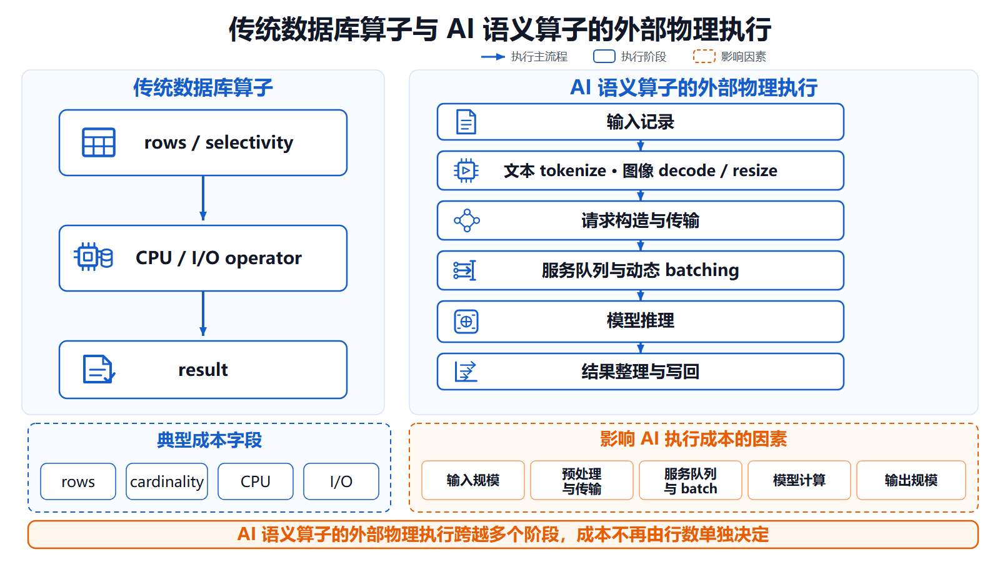
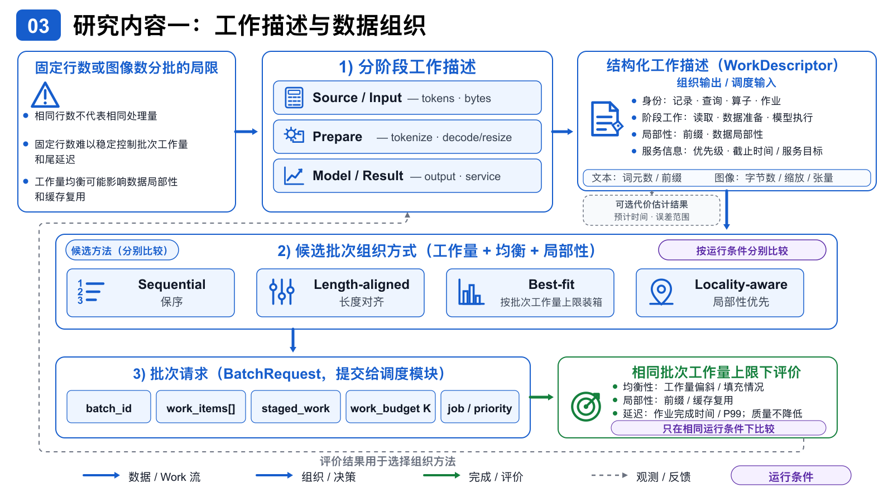
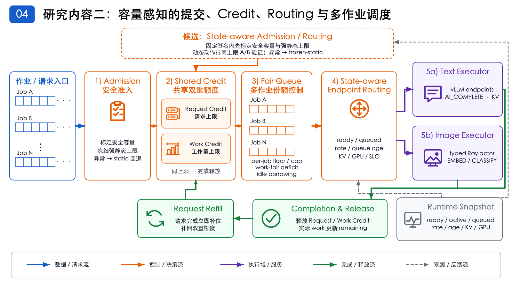
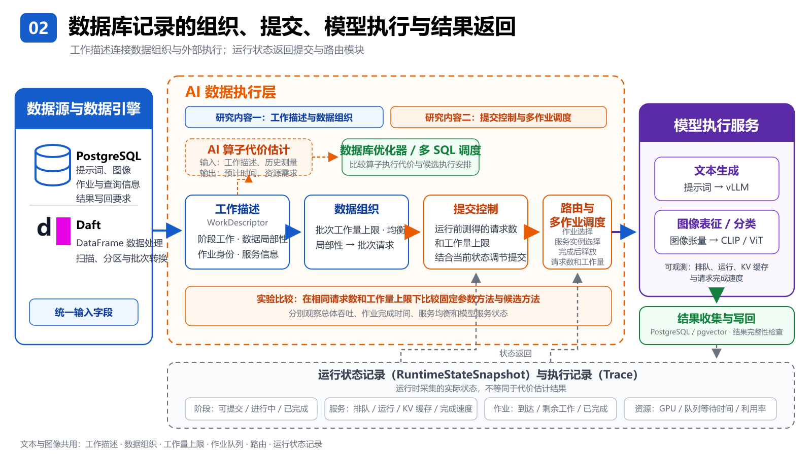
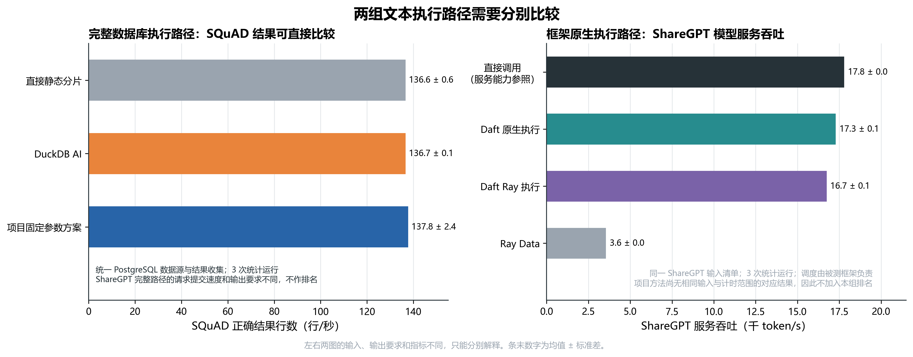
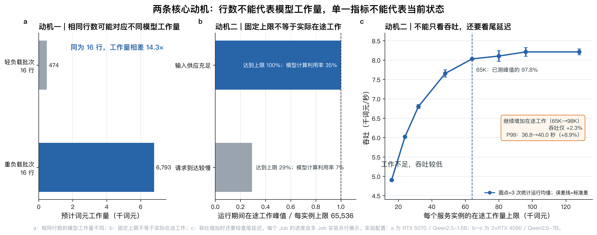
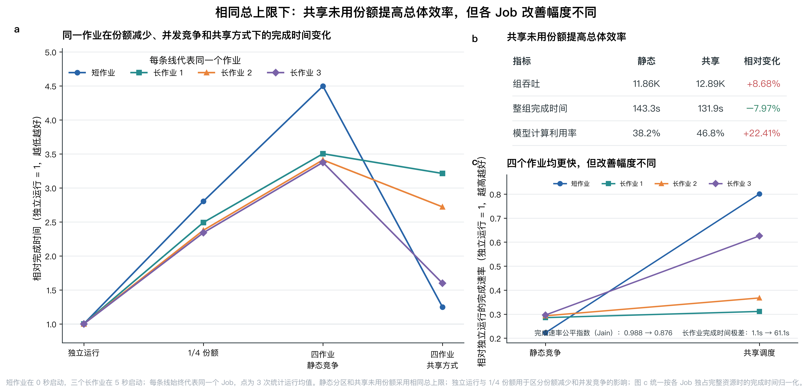
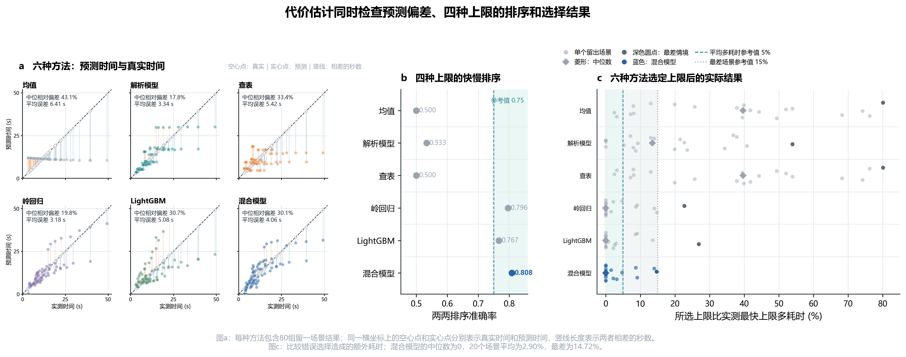
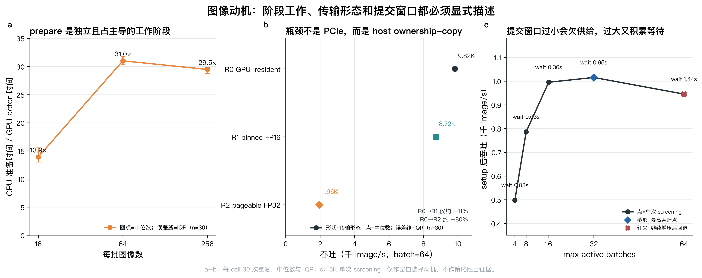

# 数据库 AI 负载的执行优化与调度研究

## 1. 课题背景、目的和意义

近年来，大语言模型、视觉模型和向量表示模型快速进入数据分析与数据管理系统，数据库所承担的任务正在从传统的结构化数据存储、检索与统计分析，逐步扩展到包含文本生成、语义理解、向量化、智能分类和多模态分析的复杂数据处理。Snowflake Cortex AISQL、Google BigQuery ML/AI、Oracle AI Vector Search，以及 PostgreSQL 生态中的 pgvector、pgai 等系统，已经允许用户直接通过 SQL 或数据库工作流触发模型生成、文本或图像向量化、语义过滤和分类等操作[1-5]。在这类工作流中，数据库开始承担 AI 任务的数据入口、任务组织和结果管理职责。

传统数据库查询主要围绕扫描、连接、排序、聚合等关系算子展开。虽然不同算子的执行代价并不完全与数据量成线性关系，但行数、数据字节数、CPU、内存和 I/O 等信息通常能够较好地描述其主要成本。数据库优化器可以据此估计不同执行计划的代价，执行引擎也能够依据分区、批大小和本地资源情况组织计算。然而，当 AI 算子进入数据库工作流后，一条查询的实际执行边界开始向数据库外部延伸。数据库中的记录经过 AI 算子触发后，通常还需要经历数据读取、请求构造、文本词元化、图像解码与缩放、数据格式转换、外部执行任务提交、模型服务排队、GPU 推理、结果收集。由此形成了从数据库到模型服务再返回数据库的数据执行链。

这一执行链与传统关系查询存在明显差异。首先，数据库中的“一行记录”不再能够稳定表示模型真正需要完成的计算工作。同样是一行文本，一条短标题与一段较长的对话记录在数据库中都只占一行，但经过分词后可能对应完全不同数量的词元（token），模型生成的输出长度也可能存在较大差异。因此，固定若干行组成一个批次，只能保证每个批次包含相同数量的数据库记录，却不能保证这些批次具有相近的模型计算量。对于图像任务，这种差异更加明显。一张图片在数据库中同样可以表示为一条记录，但真正进入模型之前还可能经历读取、解码、缩放、张量构造和主机到设备的数据传输等阶段；不同阶段依赖的资源也并不相同。因此，数据库记录是稳定的数据语义单位，却不天然是稳定的 AI 执行工作量单位。

其次，模型服务能够接受的最大工作量与模型服务当前实际处于什么状态是两个不同问题。一个 GPU 推理服务通常会配置最大并发请求数、显存限制或者允许的最大在途工作量，这些参数规定了系统最多允许多少请求或计算工作进入模型服务。但是，即使两个时刻使用完全相同的容量配置，实际运行状态仍可能截然不同。例如，在上游持续快速提交请求时，模型服务可能具有较多正在执行和排队的请求；而在上游读取、预处理或者提交速度较慢时，同样的容量上限下 GPU 可能得不到足够的工作。换言之，“系统最多允许多少工作进入”描述的是容量边界，而“此刻究竟有多少工作正在准备、排队和执行”描述的是运行状态。仅仅设置一个较大的固定并发值，既不能保证模型服务已经得到充分供给，也可能导致大量请求过早进入服务端形成无效等待。

再次，数据库用户关心的执行对象与模型服务直接调度的对象并不完全一致。模型服务通常以单个请求作为调度单位，根据已经到达服务端的请求执行批处理、显存管理和 GPU 调度；而数据库用户提交和等待的是一次完整的查询或 AI 数据处理任务。本文将由同一数据库查询或同一工作负载类别触发的一组相关 AI 执行任务称为作业（Job）。一个作业可能包含数百乃至数万条模型请求。多个作业共享同一组 GPU 服务时，即使模型服务能够高效处理所有已经到达的请求，也不能直接保证每个数据库作业都获得合理的服务。例如，持续产生大量请求的长作业可能长期占用共享容量，使后到的短作业等待时间明显增加；反过来，如果永久为短作业保留固定资源，又可能在短作业没有待处理数据时造成 GPU 资源闲置。因此，多作业执行既涉及总体资源利用效率，也涉及不同作业之间的干扰、服务目标和长期服务均衡。

上述三个矛盾表明，数据库与模型服务之间实际上存在一个尚未被传统数据库执行层或模型服务层完整覆盖的中间区域。一端的数据库掌握数据记录、查询边界、作业身份、到达时间以及最终结果语义；另一端的模型服务掌握已经到达的请求、正在执行和等待的请求、显存缓存和完成节奏。数据库通常不了解模型服务实时的排队和资源压力，模型服务也不知道数据库端尚有多少数据没有提交、不同请求属于哪个完整作业，以及某个作业已经完成了多少工作。两端的信息彼此分散，使得数据库难以仅依靠传统行批处理和静态并发参数高效驱动模型服务。

基于这一问题，本课题将数据库与模型服务之间的上述执行区域抽象为 AI 数据执行层（AI Data Execution Layer）。首版计划在 PostgreSQL 18.3 中通过 extension 注册 planner-visible 的 AI 语义算子，由数据库拥有 SQL、关系 child plan、snapshot、权限、取消、错误和结果生命周期；LOTUS v1.2.4 的 `sem_map` 提供现成的语义算子实现，Daft、Ray、SAOR 和 vLLM 作为可替换物理执行层。数据库关系子计划只把经过过滤和投影的最小必要 row batches 通过受管理通道交给 AI 数据执行层，而不是由用户先把整表 `fetchall` 到应用程序。该设计不声称模型推理位于 PostgreSQL backend 进程内，也不声称物理上零数据传输；其目标是使数据交接成为数据库查询计划拥有、可取消、可治理和可观测的内部物理步骤。其核心关注点不是改变 `sem_map` 的逻辑功能，而是研究 AI 算子的物理执行组织方式。例如，文本生成算子仍然针对每条输入记录生成对应结果，向量化算子仍然为每条记录生成对应向量；本课题只改变这些记录在底层如何分组、提交和调度，不改变其逻辑语义及结果对应关系。

如图 1 所示，与主要使用行数、选择率、CPU 和 I/O 代价描述执行过程的传统数据库算子相比，外部 AI 算子还包含请求组织、数据准备、提交与路由、模型执行和结果收集等环节。上游不仅需要描述每批数据包含多少模型工作，还需要接收排队、缓存和完成速率等运行状态，才能判断后续工作应当怎样进入模型服务。

图 1 传统数据库算子与外部 AI 算子的执行假设差异。外部 AI 算子的物理执行需要同时考虑工作量描述和模型服务状态反馈。

本课题拟重点解决两个相互关联的问题。第一，面向 AI 实际工作量研究数据库记录的分阶段工作量表征和数据组织方法。其核心不是简单地把传统的“行数”替换为某一个新的固定指标，而是结合文本、图像等任务在不同执行阶段的工作特征，建立能够供数据组织与后续调度共同使用的工作量描述，并研究工作量均衡与数据局部性之间的关系。第二，在模型服务总容量经过预先标定并保持稳定的条件下，研究基于运行状态的工作提交、服务实例路由以及多个作业之间的容量共享，使系统能够在不过量制造排队的同时保持模型服务得到有效供给，并控制不同作业之间的执行干扰。

本课题研究的是数据库内 AI 语义算子的外部物理执行链路。项目使用 extension 和 PostgreSQL 公开的 planner/executor 扩展 seam，不 fork PostgreSQL core；不重新设计模型服务内部的连续批处理机制，不修改分布式执行框架的底层调度器，也不研究模型结构、模型训练方法和 GPU 内核优化。主路径直接复用 LOTUS `sem_map` 语义代码，但不使用 LOTUS DataConnector/`pd.read_sql` 从数据库外部重新拉表。这样的研究边界将问题集中在数据库关系子计划到模型请求之间的组织与调度上；具体实现与实验平台在第 4.1 节说明。当前数据库内算子仍处于 capability 计划阶段，既有外部 profiler/manifest 实验只作为物理执行证据，不能重标为已完成的数据库内算子结果。

本课题的研究目的，是使数据库能够以更加符合真实 AI 工作量和实时运行状态的方式驱动外部模型服务。在数据组织方面，希望降低固定行数批处理产生的工作量偏斜，同时考虑共享前缀、缓存和数据顺序等局部性因素，避免为了追求表面上的工作量均衡反而破坏模型服务已有的复用机制。在运行调度方面，希望先确定当前硬件、模型和工作负载条件下能够稳定供给模型服务的容量范围，再在该范围内根据真实运行状态进行容量共享、完成后的资源回收和执行顺序选择，使动态控制建立在明确的安全容量边界之上，而不是在运行过程中反复猜测新的并发上限。

从理论研究意义看，现有数据库 AI 研究更多关注 AI 算子语义、查询计划、模型选择和调用次数，模型服务研究则主要关注已经到达服务端请求的批处理、显存管理和 GPU 调度。本课题关注两者之间的数据执行层，研究数据库记录、分阶段 AI 工作量、模型服务运行状态和数据库作业之间的关系。将“数据记录如何成为模型工作”“容量参数与实时状态如何区分”“请求级模型服务与作业级数据库目标如何衔接”放在同一执行链中考察，可以补充数据库查询与外部模型执行之间的系统研究。

从应用意义看，数据库内置或数据库触发的 AI 操作具有高计算成本和较强工作量异质性，GPU 资源又通常是整个执行链中成本较高的资源。如果上游长期供给不足，会造成模型服务资源闲置；如果大量请求无控制地提前提交，则会增加排队、显存压力和尾延迟；如果多个作业缺少合理的共享机制，还可能出现某一类任务长期受到干扰。因此，建立可描述、可观测和可控制的 AI 数据执行层，有助于提高数据库驱动模型服务的资源使用效率，并改善复杂工作负载下的作业完成体验。

本课题当前只研究单一资源管理主体内部多个数据库作业或工作负载类别共享同一模型服务资源池的情形，相关结论限于作业级效率、隔离和服务均衡，不扩展为多租户资源公平管理。

## 2. 国内外研究现状

### 2.1 数据库 AI 算子与语义查询优化现状

随着生成式人工智能和向量检索逐步融入数据分析过程，数据库系统开始直接支持 AI 算子和 AI SQL。Snowflake Cortex AISQL 提供文本生成、嵌入、分类和语义过滤等能力，并围绕昂贵 AI 调用研究谓词重排、模型选择和查询重写[1]。Google BigQuery ML/AI 提供生成文本与向量相关的数据仓库函数[2]，Oracle AI Vector Search 将向量生成与向量检索纳入 SQL 数据处理过程[3]。PostgreSQL 生态中的 pgvector 提供向量类型与向量索引，pgai 等组件则进一步连接数据库数据和外部模型服务[4-5]。这些系统说明 AI 能力已经成为数据库工作流的重要组成部分。

学术界针对语义算子和 AI 查询优化也开展了大量研究。LOTUS 将大语言模型能力抽象为语义算子，研究具有准确性约束的声明式数据处理与优化方法[20]。Palimpzest 从声明式 AI 数据分析角度研究算子选择和执行优化[22]。Abacus 将成本优化思想用于语义算子系统，根据算子代价进行物理执行方案选择[21]。SemBench 从基准测试角度研究语义查询处理系统的统一评价[23]。Galois 进一步面向 SQL 调用大语言模型的场景研究逻辑和物理查询优化[29]。GaussML、NeurDB 和 LEADS 等工作代表将机器学习能力进一步纳入数据库内部执行和自动优化的研究路线[6-9]。InferDB 通过数据库索引近似替代部分在线模型推理[38]，SmartLite 则面向资源受限环境将压缩后的神经网络执行转换为数据库内部操作[39]。这些方法进一步说明，数据库 AI 执行可以沿模型内置、索引近似和外部模型调用等不同路线展开，但它们改变的执行对象和结果质量约束并不相同。

这类研究主要解决 AI 能力如何以数据库算子的形式被表达、组合和优化。例如，数据库优化器需要判断某个昂贵 AI 谓词应该在普通过滤之前还是之后执行，是否应该选择成本较低的模型进行初步筛选，以及不同语义算子组合怎样满足准确率要求。这些问题属于数据库 AI 查询优化的重要内容。但是，当逻辑计划已经决定需要对大量数据库记录执行某个 AI 算子以后，这些记录怎样被组织成模型请求、模型服务上游应该保持多少在途工作量，以及多个完整数据库作业如何共享一组模型服务，并不是上述工作的主要研究重点。

因此，数据库 AI 算子研究为本课题提供了明确的应用场景和上层语义基础，同时也形成了一个新的系统接口问题：逻辑上逐行或逐记录定义的 AI 算子，在物理执行层并不意味着每一条记录必须单独建立一个 GPU 执行任务。只要能够保持输入记录与输出结果之间的语义对应关系，底层仍然可以根据工作量、批处理和模型服务状态组织多个记录共同执行。如何完成这种从逻辑记录到物理 AI 工作单元的转换，是数据库查询优化之后仍需进一步研究的问题。

### 2.2 分布式数据执行与异构流水线现状

数据库触发的大规模 AI 操作往往需要在多个 CPU 工作线程、GPU 和模型服务实例之间执行，因此分布式数据执行框架为此类系统提供了重要基础。Ray 通过任务（task）和有状态执行单元（actor）两类抽象支持分布式 AI 应用，使开发者能够同时组织无状态并行任务和长期保留状态的服务组件[10]。Ray Data 则进一步面向数据预处理和模型推理提供数据块、批处理、流水线和背压等执行机制。Streaming Batch Model 等工作关注 CPU 与 GPU 异构阶段之间的数据流和容错问题，为大规模 AI 数据处理提供了通用执行框架[18]。

Daft 是面向复杂数据和 AI 工作负载的分布式数据帧（DataFrame）引擎，能够利用 Apache Arrow 的列式数据表示组织数据，并可以借助 Ray 执行分布式任务[19]。Apache Arrow 提供跨语言、跨系统共享的列式内存格式，使不同执行阶段之间能够以较低的转换成本传递数据。DuckDB 代表了面向分析工作负载的嵌入式数据库执行路线[24]，DataFusion 等原生使用 Arrow 的数据处理引擎则反映了现代分析执行系统以列式数据和模块化执行为基础的发展趋势[25]。NeuStream 等研究进一步关注流式数据处理与深度学习服务之间的流水化协同[30]。

现有数据执行框架已经能够解决许多重要的工程问题，例如如何把一个大数据集划分为多个数据块，如何在不同 CPU/GPU 资源上放置任务，如何限制局部缓冲区，如何在上游和下游之间建立背压，以及如何提高异构流水线的资源利用率。但是，这些框架通常面向通用的数据块（block）、分区（partition）或批次（batch）进行调度。框架知道一个数据块有多少行、多少字节以及需要哪些系统资源，却不会天然知道该数据块经过 AI 算子后将产生多少输入和输出词元，也不知道当前模型服务处于供给不足还是大量排队状态，更不会天然掌握多个数据库作业的剩余 AI 工作量。

这意味着 Daft 和 Ray 等框架非常适合作为本课题的实现基础，却不能直接替代本课题研究的 AI 工作量组织和作业级调度。尤其需要区分“框架已经具有背压能力”与“系统已经具有面向 AI 工作量的容量控制”两个概念。普通背压可以限制数据流速度、防止内存无限增长，但如果其控制对象仍是固定数量的数据块或记录，就不能自动解决不同记录对应 AI 计算量相差很大的问题。同样，Ray 能够调度有状态执行单元，并不意味着 Ray 自身会依据数据库作业的剩余模型工作、服务目标和模型端实时状态决定不同作业之间的服务顺序。

### 2.3 GPU 模型服务与请求调度现状

GPU 模型服务是当前大模型系统研究最活跃的方向之一。已有综述从数据库的请求处理、执行优化和内存管理视角系统整理了大模型推理中的批处理、调度、负载均衡与代价估计问题[40]。Orca 提出的迭代级调度（iteration-level scheduling）能够在生成过程中更加灵活地组织不同请求[11]。vLLM 通过 PagedAttention 等技术改进键值缓存（KV Cache）的显存管理，并结合连续批处理（continuous batching）提高大语言模型服务吞吐[12]。Sarathi-Serve 通过分块预填充等方式缓解提示词预填充（prefill）与逐词生成（decode）阶段之间的相互干扰[13]。DistServe 和 Splitwise 分别从服务质量和硬件资源匹配角度研究预填充与逐词生成阶段的解耦[14,41]。Clockwork 则在传统深度学习推理中通过可预测执行和准入控制研究延迟服务目标[42]。Parrot、Llumnix 和 SGLang 等系统分别从语义复用、动态服务调度和结构化模型程序运行时等角度提高大模型服务效率[15,17,31]。

随着模型服务从单用户环境进入共享平台，公平性和服务隔离也成为重要研究问题。已有大语言模型服务公平研究尝试按照请求所消耗的服务量分配执行机会[16]。FairServe 进一步考虑不同应用和多次模型调用的加权服务与限流[43]；DLPM 将服务差额与前缀局部性共同纳入请求选择[44]；Autellix 则将累计服务量提升到多次模型调用组成的程序级调度[45]。后三项工作目前在项目文献库中均按预印本处理，而且主要位于模型服务或应用运行时层，不能直接作为数据库端上游调度已经解决的证据。在更广泛的资源管理领域，Dominant Resource Fairness 研究多资源类型下的公平份额分配[32]，Pisces 研究多租户存储中的性能隔离与资源共享[33]，数据库领域也研究了多租户事务处理中的公平调度[34]。Themis、Tiresias 和 Pollux 则分别从作业完成体验、已获得服务量和有效进展（goodput）等角度研究 GPU 集群中的多作业调度[35-37]。这些工作为分析共享资源环境下的效率、公平和作业体验提供了重要理论与方法基础。

然而，模型服务中的调度器通常只能够处理已经进入模型服务的请求。对于一个来自数据库的大规模 AI 作业，模型服务并不知道还有多少数据库记录尚未完成数据读取和请求构造，也无法直接判断不同请求属于哪些完整的数据库查询任务。模型服务内部调度解决的是“已经收到的请求怎样执行”，而数据库 AI 数据执行层还需要回答“哪些请求现在应该进入模型服务”。二者具有明显的上下游关系。

此外，将所有数据库请求提前推入模型服务并依靠模型服务内部调度，也会使上游失去一部分控制能力。已经进入服务端排队的请求占用了队列和可能的缓存资源，并且对非抢占式模型请求而言，上游很难再改变其执行顺序。因此，即使服务端具有成熟的 continuous batching，上游仍然需要决定应当保持多少尚未完成的工作处于在途状态，并在多个数据库作业之间控制新请求的释放顺序。本课题研究的状态感知提交与多作业协调正位于这一边界。

### 2.4 当前研究存在的问题

综合上述研究可以发现，数据库 AI 算子、分布式数据执行和 GPU 模型服务三个相邻领域已经分别积累了大量成果，但数据库到模型服务之间仍存在若干尚未充分解决的执行问题。

第一，数据库数据单位与 AI 计算单位之间缺少统一转换机制。数据库和通用数据执行框架习惯使用记录、字节、分区或批次描述数据规模，而模型执行成本可能受到输入词元、生成长度、图像预处理、张量大小和模型阶段等因素共同影响。传统数据规模可以描述“有多少数据”，但不能稳定表示“这些数据会形成多少模型计算”。因此，需要在逻辑记录语义不变的情况下建立适合物理执行的 AI 工作量描述。

第二，工作量均衡和数据局部性缺少统一考虑。如果仅按照原始数据顺序形成批次，可能使不同批次的 AI 工作量差异很大；如果为了获得更加均匀的工作量而大规模重排记录，又可能破坏共享提示词前缀、缓存键或原始数据局部性，降低模型服务复用已有中间结果的机会。现有通用装箱或批处理机制无法直接判断两种因素在不同模型服务压力下的相对重要性，因此需要研究工作量预算、均衡和局部性之间的关系。

第三，静态容量配置与实时运行状态缺乏明确区分。模型服务的并发上限或最大在途工作量只能描述系统允许的边界，而不同上游供给速度和不同工作负载结构会使相同容量对应完全不同的运行状态。仅根据一个固定并发数进行长期执行，无法判断当前系统是供给不足、处于有效饱和区间还是已经形成大量无效排队。因此，需要在离线确定容量边界的基础上建立运行状态观测机制。

第四，模型服务请求级调度与数据库作业级目标之间缺少衔接机制。在多个作业共享模型服务时，完全静态的资源分区能够提供较强隔离，但容易造成空闲份额无法使用；只强调“有工作就不让容量闲置”的完全共享策略能够提高总体资源利用率，却可能使不同作业获得的收益和服务量显著不均。数据库用户关注的是完整作业的完成时间、尾延迟和服务目标，而不仅是单个请求是否被公平调度。因此需要在固定总容量内研究作业级容量记账、空闲份额借用、完成回收和执行顺序选择。

第五，AI 算子代价估计与实际执行决策之间仍存在距离。传统成本模型通常关注预测执行时间本身，而对于数据组织和调度而言，真正重要的是估计结果能否帮助系统在多个候选配置之间做出正确选择。已有学习型代价模型研究已经表明，平均预测误差较低并不必然意味着配置排序正确[26-28]。CONCERTO 进一步表明，现代并行执行中的阶段结构、动态执行图和资源竞争会影响代价估计[46]。因此，AI 数据执行层中的代价估计应面向分阶段工作量、候选策略排序和错误选择造成的实际性能损失进行评价。

由此可见，现有研究尚未充分统一覆盖数据库作业状态、模型服务运行状态和上游工作释放决策之间的衔接问题。本课题据此开展分阶段工作量组织和固定容量下的状态感知调度研究。

图 2 进一步概括了本课题与相邻系统层次的关系。数据库侧已经掌握记录语义、作业边界和结果写回，模型服务侧已经负责到达请求的内部批处理与 GPU 执行；本课题研究二者之间的工作单元构造、上游提交、服务实例路由和多作业协调，代价估计与状态观测为两项研究内容提供共同信号。

图 2 数据库与模型服务之间的 AI 数据执行层及本课题研究边界。图中数据库侧和模型服务侧的既有能力不属于本课题改造对象。

## 3. 研究目标与研究内容

### 3.1 研究目标

本课题拟面向数据库触发的 AI 工作负载，构建和评价数据库与模型服务之间的 AI 数据执行层，使数据库记录能够按照真实 AI 工作量形成适合执行的工作单元，并在模型服务总容量预先确定的条件下进行可控的提交、服务实例路由和多作业协调。

研究首先希望建立一种区别于传统固定行数批处理的 AI 工作量表征，使文本生成、文本向量化和图像处理等任务能够根据各自执行特征描述不同阶段的工作需求。在此基础上研究数据组织方法，使一组数据库记录在组成模型请求时，同时考虑单批工作量预算、不同批次之间的负载均衡以及数据局部性，明确不同组织策略在不同模型服务压力下的适用范围。

研究其次希望建立固定模型服务容量下的运行状态观测与作业级调度机制。模型服务的总容量在正式运行前依据硬件、模型和工作负载完成标定，运行过程中不通过反复放大或缩小总容量获得性能收益，而是在这一稳定边界内，根据数据阶段、模型服务和作业进度决定新增工作何时进入执行链、发往哪个模型服务实例以及当前容量在活跃作业之间如何分配。研究重点是资源利用效率、作业隔离、尾延迟和服务均衡之间的关系，而不是单纯追求最大总吞吐。

研究还将构建面向执行决策的轻量代价估计组件，为两项研究内容提供共同的工作量和剩余工作估计。代价估计不独立构成第三项研究内容，其作用是把离线画像和运行特征转化为数据组织、容量初始化、路由和作业调度可以消费的决策信号。

在场景选择上，课题以文本生成类 AI 算子作为主要方法验证场景，以图像向量化和分类作为跨模态验证场景。文本任务与图像任务复用共同的工作量、状态、作业和完成事件抽象，由文本或图像适配模块将原始输入转换为相应阶段的工作量描述。通过这种方式检验所提出方法解决的是数据库 AI 数据执行中的一般问题，而不是针对单一大语言模型工作负载构造的专用优化。

研究的最终目标不是预设复杂状态感知算法一定能够超过所有静态方案，而是通过统一实验条件明确不同执行策略的性能前沿和适用边界。当简单的静态或公平队列策略已经能够获得相同的吞吐、尾延迟和作业服务效果时，应保留简单策略；只有状态信息能够带来稳定、可归因的额外价值时，才保留相应动态机制。由此保证研究结论具有可证伪性和可重复性。

### 3.2 研究内容

本课题包含两项正式研究内容：分阶段工作量表征与数据组织，以及固定容量下的提交、路由与多作业调度。轻量代价估计作为两项内容的共同支撑，文本和图像任务用于验证方法的跨模态适用性。

第一项研究内容是分阶段工作量表征与数据组织。

该研究内容关注数据库记录怎样转换成适合 AI 执行和后续调度的工作单元。数据库中的记录继续保留原始身份和结果语义，但物理执行层不再假定相同记录数量具有相同计算成本，而是根据记录经过 AI 执行链时产生的真实工作需求描述其工作量。

对于文本任务，工作量需要反映输入文本规模、可能的输出规模以及模型执行阶段的主要计算需求；对于图像任务，工作量还需要区分数据读取、图像准备、张量构造和模型执行等阶段。不同阶段使用的具体物理单位可以不同，但均需要被映射为结构化、可比较的工作描述。该研究重点不是强行设计一个能够跨所有模态比较的单一标量，而是保留不同阶段的工作特征，使后续系统能够选择当前主要受限阶段作为组织和调度依据。

在获得工作量描述之后，需要研究数据库记录怎样形成执行批次。数据组织主要涉及三个相互关联的因素。其一是工作量预算，即一个待执行批次应该包含多少 AI 计算工作；其二是工作量均衡，即多个批次或多个模型服务实例之间是否存在明显的计算量偏差；其三是数据局部性，即为了改善工作量均衡而改变记录顺序时，是否破坏共享提示词前缀、缓存复用或其他有利的数据关系。

因此，本项研究并不简单假定“工作量越均匀越好”，而是研究工作量均衡和局部性之间可能存在的冲突。模型服务侧已有工作也表明，前缀局部性收益与服务公平之间需要通过受控额度进行权衡[44]；本课题进一步考察这一冲突在数据库记录形成模型请求之前怎样表现。当模型服务缓存压力较低时，改善批间工作量均衡可能更重要；当大量请求共享提示词前缀且模型服务缓存接近压力边界时，保留原有局部性可能获得更高收益。最终需要通过不同工作负载和服务压力下的实验确定不同组织策略的适用条件，并形成能够描述策略选择边界的数据组织方法。

第一项研究内容的对象与输出如图 3 所示。原始记录首先被转换为包含阶段工作量、作业身份、局部性和不确定信息的工作描述，再由不同候选组织方法形成批执行请求。各方法在相同工作量上限和相同后续调度条件下比较，不预先假定重排序或装箱一定优于保序组织。

图 3 分阶段工作量描述与数据组织。文本和图像使用不同的阶段特征，但共享工作描述、批执行请求和评价接口。

第二项研究内容是固定容量下的提交、路由与多作业调度。

该研究内容关注工作单元形成之后，下一份工作应当什么时候进入模型服务、由哪个服务实例执行，以及多个数据库作业如何共享有限模型服务容量。研究首先区分模型服务“总容量”和“实时状态”：总容量通过离线实验在当前机器、模型和工作负载条件下确定能够接近稳定吞吐平台且不过度增加排队的工作范围；实时状态则描述正式运行过程中各数据阶段、模型服务和数据库作业实际正在发生的情况。

运行时调度保持总容量边界不变，通过作业级在途工作量记账控制已经释放但尚未完成的工作。对于同时活跃的多个作业，系统既需要保证任意时刻所有作业占用的总容量不超过已标定边界，又应尽可能避免有待执行工作的情况下出现无意义的资源闲置。因此，本研究将考察空闲份额借用：当某个作业当前没有可执行工作时，其暂时没有使用的容量能够由其他活跃作业使用；当请求完成时，相应容量立即被回收并重新进入可分配状态。

在此基础上进一步研究工作释放顺序和模型服务实例路由。工作释放需要结合不同作业的待执行工作、已经获得的服务、剩余工作量、等待时间及服务目标，在多个可执行作业之间选择下一份进入服务的工作。路由则需要结合多个模型服务实例当前的执行和排队状态选择执行位置。研究关注的是非抢占条件下后续工作如何有序进入模型服务，而不是暂停已经开始执行的模型请求。

多作业调度不以单一公平性指标作为最终目标。完全均匀的资源分配不一定具有最短作业完成时间，总吞吐最大也不代表每个作业都具有良好体验。已有模型服务和集群调度研究分别采用累计服务量、程序级完成时间、已获得服务量与减速比等视角描述这种差异[16,35-36,43-45]。因此，本课题同时评价总体效率、最差作业完成体验、服务目标违约、作业实际获得的服务量落后于目标份额的程度，以及最长连续未获得服务的时间，在明确保护条件下分析不同方案的多目标权衡。当前研究对象是单一资源管理主体内部的多个作业或工作负载类别，因此相关结论表述为作业级共享与服务均衡，不扩展为已经解决多租户资源公平。

如图 4 所示，第二项研究内容在预先标定的总容量内组织安全准入、请求数与工作量双重额度、多作业份额控制和服务实例路由。请求完成后立即释放额度并触发补位；运行状态只决定尚未提交的后续工作，不改变模型服务内部批处理，也不抢占已经开始执行的模型请求。

图 4 固定容量下的提交、路由与多作业调度。动态候选必须与相同容量上限下的冻结静态方案进行对照，异常或状态失效时回退到静态方案。

两项研究内容由轻量算子代价估计共同支撑。该组件根据输入工作特征和已有运行画像估计不同阶段的工作需求、模型服务时间、剩余工作量以及估计不确定性，并为工作量预算、数据组织和调度决策提供统一信号。已有代价估计研究表明，现代执行机制中的算子结构、阶段依赖和资源竞争需要与下游配置选择共同评价[26-28,46]。因此，本课题将通过候选配置排序正确性和错误选择造成的实际性能损失检验估计结果，而不只关注单点执行时间预测误差。

在跨模态验证方面，文本生成承担主要研究方法的完整验证，图像向量化和分类用于验证分阶段工作量、作业级状态和共享容量机制能否复用。对于文本特有的共享前缀和生成长度，以及图像特有的解码、缩放和张量准备，分别由模态相关部分处理；共同的数据组织、状态观测、作业记账和实验评价框架保持一致。

## 4. 研究方案与可行性分析

### 4.1 研究方案

本课题计划在现有数据库和分布式 AI 执行框架基础上构建实验系统。PostgreSQL 提供数据库任务和输入数据，Daft 负责数据读取及数据帧执行[19]，Apache Arrow 负责列式数据块表示[25]，工作量估计与数据组织模块将数据库记录转换为可执行批次，Ray 提供分布式任务和有状态执行单元[10]。文本任务由 vLLM 模型服务完成生成[12]，图像任务由基于 Ray 的 GPU 有状态执行单元完成模型推理，结果统一收集，并在端到端验证中写回 PostgreSQL 或 pgvector。

系统总体架构如图 5 所示。PostgreSQL 与 Daft 构成统一数据入口，工作描述和数据组织模块连接到固定容量下的提交与多作业调度，文本和图像仅在输入适配与模型执行后端上有所不同。运行状态快照贯穿数据阶段、模型服务和作业进度，用于保存可复现的观测与决策依据。

图 5 AI 数据执行层总体架构。实线表示数据或请求的执行方向，虚线表示状态反馈；项目机制不修改 Daft、Ray 或模型服务的内部调度器。

PostgreSQL 在系统中主要承担数据源与结果语义边界。实验数据首先以不可变工作负载清单导入数据库，每一条记录具有稳定的数据身份，并记录其所属作业。正式执行时，由数据库数据形成 Daft 数据帧。数据库写回并不作为独立研究内容，而用于验证执行链是否产生预期数量的结果、不同输入记录是否与输出正确对应，以及是否出现重复或遗漏。

Daft 和 Apache Arrow 用于承担数据执行层中的数据组织基础。Daft 负责数据读取、表达式执行和数据分区，Arrow 则提供统一列式数据块表示。研究方法不修改 Daft 自身调度器，而是在其数据输出基础上增加面向 AI 执行的分阶段工作描述（WorkDescriptor）。该描述保存源数据阶段、准备阶段、模型阶段和结果阶段等工作量，同时保存当前主要工作阶段、数据局部性标识、服务目标、不确定区间及校准环境标识。校准标识绑定模型版本、硬件环境、预处理方法和工作负载特征，当环境发生变化时重新进行画像，而不直接复用旧环境参数。

文本任务中，模型阶段工作量主要依据输入词元和预计输出词元描述，并保留共享提示词前缀等局部性信息。对于生成长度未知的情况，通过已有工作负载画像和轻量估计方法提供输出工作量区间。图像任务则分别记录原始编码数据、解码与缩放准备、待模型处理张量以及模型执行阶段的工作需求，不把图片张数简单视为统一计算量。对于已经明显超过普通批预算的单条大记录，系统保留其完整语义并作为独立大工作执行，而不是通过截断输入获得表面上的预算一致。

工作描述进入数据组织器后形成批执行请求（BatchRequest），即可以交给后续调度器执行的一批记录。数据组织实验设置五类具有代表性的策略。固定行数策略作为传统参照；保序工作量预算策略按照数据库原始顺序依次加入记录，达到工作量预算后形成一个批次；长度对齐策略尽量将估计工作量相近的记录组织在一起；受控最佳适配装箱策略根据已有批次剩余预算选择放置位置；行数约束的工作量策略则在工作量预算之外设置最大记录数，避免大量极小请求集中形成过大的请求集合。

这些数据组织策略并不是按复杂程度依次实施的开发步骤，而是针对工作量预算、工作量均衡和局部性三个研究维度形成的候选机制。实验中固定模型、GPU 数量、模型服务配置、最大在途工作量和后续调度方式，只改变数据组织方法。评价除正确吞吐和作业完成时间外，还统计批间工作量偏斜、共享前缀保持程度、缓存命中率以及请求尾延迟，以确定性能变化是否真正来源于数据组织。

在调度部分，Ray 的有状态执行单元被用作长期运行的协调和执行载体。系统维护作业级待执行队列及在途工作账本。每当一个模型请求被允许进入后续执行链时，同时占用一份请求数额度和相应的预计工作量额度。这样可以同时限制“正在处理多少个请求”和“这些请求大约包含多少计算工作”，避免把一个很小的请求和一个很大的请求都简单计为一个并发槽。

模型请求完成后，由完成事件立即触发账本更新和容量回收。相比一次性把整个作业所有请求提交到模型服务，该机制能够使上游持续掌握尚未进入模型服务的工作，并在每次有容量释放时重新决定下一份工作。这种完成驱动的补位方式是后续作业级状态感知调度的基础。

模型服务总容量不作为运行时自由调节变量。正式实验之前，首先在固定机器、模型版本、模型服务配置和代表性工作负载上扫描不同在途工作范围，寻找已经能够达到接近最大稳定吞吐、而继续增加工作主要带来排队和尾延迟上升的区域。将这一容量配置冻结为当前实验环境的总边界。正式运行期间，不通过不断提高或降低总容量获得结果，而只决定固定总容量如何在当前活跃作业之间使用。配置环境发生变化后重新标定，而不将一个实验平台得到的容量常数直接推广到其他平台。

运行状态由统一状态快照记录。数据执行阶段需要采集当前可执行工作量、已激活工作量、阶段完成速率和最长等待时间；文本模型服务侧采集正在运行请求数、等待请求数、键值缓存占用和完成速率等信息；数据库作业侧维护作业到达时间、可执行工作量、在途工作量、已完成工作量和剩余工作量。所有状态记录附带采集时间和当前环境标识。状态过旧、关键字段不可用或校准环境发生变化时，不使用该状态驱动新的复杂动作，而是在原有总容量边界内回退到已经冻结的简单调度策略。

固定总容量内首先实现作业间的共享额度。当只有部分作业具有可执行工作时，当前没有数据可提交的作业不永久占据其份额，其他活跃作业可以临时使用空闲容量。当新的工作出现或者已有请求完成后，系统重新依据活跃作业集合进行容量分配。其目标是只要还有待处理工作，就尽量不让已经预留的模型服务容量闲置。

在此基础上研究状态感知的工作释放。每次有容量归还后，并不是立即按照全局到达顺序机械选择下一条请求，而是结合各作业当前可执行工作、已经获得的累计服务、剩余工作、等待时间和可选服务目标选择下一个作业。由于模型请求执行后不进行上游抢占，该方法只控制“尚未进入模型服务的下一份工作”。候选方法与全局先来先服务、静态容量分区以及基于轮转或服务差额的公平队列进行统一比较，其中服务差额指作业按照目标份额应获得的服务量与实际已获得服务量之间的差值。如果状态感知策略只有更高复杂度而不能改善任何主要评价维度，则不将其作为最终方案。

对于存在多个模型服务实例的场景，系统进一步研究服务实例路由。路由器不修改 vLLM 内部请求调度，而是根据不同服务实例当前的在途工作、正在运行和排队请求、队列等待时间、缓存压力和近期完成速率，选择新的批执行请求发往哪个实例。为了分离路由收益与工作释放收益，实验先分别对两个机制进行单因素对照，再进行组合实验。

轻量代价估计采用解析工作特征、离线画像校准和残差修正相结合的方法。文本侧利用输入词元、输出限制和工作负载特征估计模型工作；图像侧根据输入表示、准备工作量和模型阶段特征进行估计。估计器输出不仅包括单次服务时间，还包括不同阶段工作量、剩余工作量和不确定范围。模型选择采用留一场景验证，即每次将完整的模型、工作负载和服务配置组合留作未见测试环境，使用其他场景完成校准，再测试估计器能否正确判断候选配置之间的优劣。

实验评价采用正确性前提、性能结果、状态解释和多作业质量四层指标体系。首先，所有正式结果必须满足输入数据、模型参数和输出语义一致，结果数量完整，输入标识与结果标识一一对应且不存在重复完成。其次，主要性能指标包括正确结果吞吐、作业完成时间（Job Completion Time，JCT）、P95/P99 尾延迟以及文本请求的首词元延迟（Time To First Token，TTFT）。模型服务运行质量使用正在运行的请求数、排队请求数、排队时间、键值缓存、完成速率以及模型浮点运算利用率（Model FLOPs Utilization，MFU）等指标解释。多作业场景同时报告组吞吐、整组作业完成时间、每个作业相对于独立运行的减速比（slowdown）、最差作业尾延迟、服务级目标（Service Level Objective，SLO）违约、作业实际获得服务量落后于目标份额的程度，以及最长连续未获得服务的时间。Jain 公平指数用于辅助衡量服务分配的均匀程度，不单独作为公平保证。

代价估计采用与执行决策直接相关的评价方式。除了平均绝对误差等传统预测指标外，主要报告候选配置两两排序准确率、最终选择配置相对于真实最优配置的决策损失，以及未见场景中的最坏决策损失。只有当代价估计在配置排序层面达到可接受稳定性后才允许其驱动在线决策，否则保留为离线诊断或候选剪枝信号。

实验设计分为机制归因实验和完整系统对照两个层次。机制归因实验在项目自身执行栈内部进行，例如比较不同数据组织方法时固定调度方式，比较不同工作释放策略时固定工作组织和总容量，使一次实验只改变一个主要机制。

完整系统对照又分为数据库端到端产品轨和框架原生执行轨。数据库端到端产品轨在统一 PostgreSQL 数据源与写回端、模型、输出限制、资源容量和计时边界的条件下，比较直接静态分片执行、DuckDB AI 原生执行和项目冻结静态方案。只有数据、输出语义、资源容量和计时边界一致时才进行横向排名。目前 SQuAD 有界输出场景满足三类路径的可比条件；ShareGPT 场景中的 DuckDB 路径不能严格对齐输出限制，因此只用于说明产品语义边界，不与其他路径直接进行性能排名。框架原生执行轨比较直接容量参照、Daft 原生执行、Daft 基于 Ray 的原生执行和 Ray Data 原生执行，不向这些执行图注入本课题的工作量额度、多作业队列或提交控制，使被测系统继续负责自身的数据划分、背压和调度。本课题只统一输入数据、模型、硬件资源、结果语义和评价口径。两层实验分别回答“项目机制的性能变化来自哪里”和“在语义与资源可比的条件下，完整执行路径具有怎样的端到端表现”。

图 6 展示了两类完整系统对照的组织方式及现有数据。左侧数据库端到端产品轨只在 SQuAD 有界输出场景内比较三条路径；右侧框架原生执行轨用于观察不同执行图的服务吞吐和供给状态。两个子图的数据语义、工作负载与计时合同不同，不能合并为一张总排行榜。

图 6 文本完整系统基线与可比边界。左图数值为正确结果行吞吐，右图数值为服务吞吐；仅允许在各自子图内部按既定合同比较。

所有正式实验使用不可变工作负载清单和固定随机种子，固定模型版本、服务参数、硬件资源和输出限制。每类正式配置先进行预热，再执行多次交错重复，保存请求级提交和完成记录、运行状态时序、GPU 指标、作业级账本以及代码和配置版本。小规模实验如果一次性系统初始化开销占主导，只用于能力与正确性检查，不进入稳态性能排名。比较双方的数据源、完整结果语义、资源配置和计时边界全部一致时，才形成相对性能结论。

### 4.2 可行性分析

本课题的可行性可以从工作量表征基础、容量与状态观测基础、多作业执行基础以及代价估计与跨模态系统基础四个方面进行分析。

第一，前期实验已经验证了工作量表征与数据组织问题具有现实基础。

文本生成实验对固定 16 行的数据批次统计模型输入词元与允许输出工作量，最轻批次约为 474 个词元工作量，最重批次约为 6793，二者相差约 14.3 倍。该结果表明，即使数据库记录数完全相同，实际进入生成模型的工作量仍可能具有一个数量级以上的差异，固定行数不能作为稳定的 AI 计算代理。这为研究内容一从数据库记录构建显式工作量描述提供了直接实验依据。

图像实验进一步证明 AI 工作量具有明显的阶段结构。在当前 CLIP 图像路径的实用批大小范围内，CPU 图像准备阶段的执行时间约为 GPU 模型执行阶段的 13.9 至 31.0 倍；不同数据表示也会影响准备与传输效率。这说明跨模态工作量描述不能只是将文本“词元数”机械替换为“图片数”，而应分别记录准备阶段和模型阶段的工作需求。

前期数据组织实验还表明，工作量均衡与数据局部性之间确实存在可观测冲突。在较低缓存压力条件下，多种固定行数、保序工作量预算和重排序组织策略的模型服务吞吐大致集中在约 50K～56K token/s，差异相对有限。当服务拓扑改变并使键值缓存占用接近饱和时，不同组织策略的吞吐区间扩大到约 39K～50K token/s，并出现相对排名变化。需要较强重排序的策略在打散共享提示词前缀后，前缀缓存命中率可以下降到约 6%～7%，而保序类策略能够保留更多局部性。该结果说明研究内容一不是人为提出的组合目标，而是实际系统中已经存在工作量均衡收益和局部性损失的竞争关系。

图 7 给出了该冲突的代表性结果。在较低缓存压力下，各组织策略的吞吐接近；当键值缓存接近饱和后，需要重排记录的策略同时出现前缀缓存命中率和吞吐下降。该图用于说明策略效果依赖模型服务压力与数据局部性，不用于声称某一组织方法在所有环境中始终最优。

图 7 不同服务压力下数据组织策略的吞吐与前缀局部性。每条线只连接同一策略在低压力和高压力条件下的结果，不跨压力环境建立统一容量排名。

第二，前期容量扫描和原生执行路径实验已经证明区分容量配置与实时状态是必要且可实现的。

在当前双 RTX 4090、Qwen 和 vLLM 实验环境中，对每个模型服务实例允许的在途工作量进行多档扫描后发现，约 65,536 工作量已经达到最大已测服务吞吐均值的 97.80%，继续提高下一档容量仅增加约 0.92% 吞吐，而 P99 尾延迟继续上升。该结果表明，在固定硬件和模型条件下可以离线标定最小近饱和工作范围，为“总容量预先确定、运行时只调整容量使用方式”的方案提供实验基础。该数值只适用于当前机器、模型、协议和工作负载，不作为跨环境常数。

同样的静态容量还可以产生不同的实际状态。在高输入供给下，每个模型服务实例的运行内在途工作能够接近配置上限，MFU 约为 35%；而在上游请求到达速度低于模型服务处理能力的场景中，运行期间观测到的在途工作峰值仅约达到标定容量的 29%，MFU 约为 7%。因此，配置相同并不意味着模型服务正在承受相同负载，在线状态观测仍有必要。

不同上游原生执行图的实验进一步说明，最终性能结果不能代替运行状态。在同一 ShareGPT 工作负载和模型服务环境下，直接提交、Daft 原生执行和 Daft 基于 Ray 的原生执行路径具有接近的总体吞吐与作业完成时间，但后两者的平均排队请求数约为 742 至 783，单请求平均排队时间约 37 s；Ray Data 原生路径几乎没有排队请求，但吞吐、正在运行请求数和 MFU 均明显较低，说明其低排队主要来自供给不足。上述结果证明正在运行的请求数、排队请求数、键值缓存、MFU 和完成速率可以被统一采集，而且需要结合解释。

图 8 将记录工作量差异、相同容量下的运行状态差异和容量扫描结果放在一起展示。图 8a 说明固定行数不能稳定代表模型工作，图 8b 说明静态上限不能替代运行状态，图 8c 则说明容量应先通过离线扫描确定最小近饱和点。三个子图来自各自标注的实验环境，只共同支撑研究动机，不进行跨子图性能比较。

图 8 工作量、运行状态与容量边界的代表性证据。图 8b 中的 29% 指运行期间观测到的在途工作峰值占配置上限的比例，并非时间平均值。

此外，项目已经尝试过多种直接在线调整并发上限的复杂控制方法，包括基于反馈的增减策略和自适应提交方法，但多数方案未能稳定超过经过容量扫描得到的强静态配置。该负结果进一步支持本课题当前的设计选择：不把持续在线改变总容量作为主要贡献，而是先冻结可靠容量边界，再研究固定容量内部的工作释放和作业共享。

第三，前期多作业实验已经验证了作业级资源共享、干扰和公平问题真实存在。

在文本场景中，项目构造了一个短作业先启动、随后三个长作业加入的四作业工作负载。Daft 原生执行、Daft 基于 Ray 的原生执行和 Ray Data 原生执行三种路径中，短作业和长作业相对于各自独立运行均出现不同程度的完成时间退化，且干扰幅度不同。通过分别测量作业独享完整资源、仅拥有固定保留份额、多个作业采用静态分区以及共享未使用份额，可以区分资源份额减少本身的代价与其他作业加入后的真实竞争。

在相同总容量下，共享未使用份额相对于固定静态分区使四作业总体服务吞吐提高约 8.68%，整组作业完成时间降低约 7.97%，MFU 从约 38.2% 提升至约 46.8%。这说明允许活跃作业借用空闲份额可以改善整体资源利用。但是不同作业获得的收益并不相同，Jain 公平指数没有同步改善，部分长作业相对于保留份额下的独立执行也未获得非劣结果。

图 9 展示了相同总容量下静态分区与共享空闲份额的对照。总体吞吐、整组完成时间和 MFU 得到改善，但各作业的归一化完成进度出现分化，Jain 公平指数由 0.998 降至 0.876。因而该实验支持的是效率、隔离与服务均衡之间存在权衡，而不是共享方案已经在所有维度胜出。

图 9 共享工作量额度的效率、隔离与服务均衡权衡。静态与共享两组使用相同总容量；独立运行和四分之一保留份额仅用于分离资源份额变化造成的影响。

该结果同时揭示了共享机制的价值和局限：空闲容量借用能够减少资源闲置，却不会自动保证所有作业获得理想的隔离和服务份额。因此，后续研究仍需在共享额度之上控制工作释放顺序，并同时评价总体效率、最差作业体验和作业实际服务量落后于目标份额的程度。

当前研究已经实现请求完成后的容量回收、作业级在途工作账本、共享额度以及多个服务实例之间的基础路由。已有开发级对照表明，部分状态感知候选能够降低前台作业尾延迟，但可能付出总体吞吐代价，强静态隔离配置在一些条件下仍然具有竞争力。状态感知释放能否在同一容量和同一待执行工作观察条件下形成稳定的效率与隔离改进，仍需后续正式实验回答。

第四，轻量代价估计和图像执行链已经提供了方法实现与跨模态验证基础。

代价估计方面，当前已经收集 429 个正式运行观测，覆盖 20 个执行场景，每个场景包含 4 个候选配置。通过留一场景验证，当前混合估计模型的候选配置两两排序准确率为 0.808，场景等权平均决策损失为 2.90%，最坏场景决策损失为 14.72%。该结果说明代价估计已经具备一定的配置选择价值，但最坏场景距离现有验收边界仍较近，因此只能作为可行性证据，仍需要在新的时间段、工作负载和硬件环境中进一步验证。

已有实验同时发现，简单代价代理即使在某些单点时间预测上误差较小，也可能在四个候选配置之间产生明显的错误排序。因此，本课题以配置排序和决策损失而非单纯平均预测误差作为主要评价指标。现有离线画像和估计代码已经可以产生工作量、服务时间及选择质量数据，为后续接入数据组织和路由决策提供了工程基础。

图 10 展示了不同代价估计方法在配置排序和决策损失上的差异。混合模型的两两排序准确率达到 0.808，平均决策损失为 2.90%，最坏场景为 14.72%；某些具有较小单点时间误差的方法仍可能产生更大的配置选择损失。因此，代价估计是否可用需要同时通过排序准确性和决策风险门槛。

图 10 代价估计的配置排序与决策损失。结果来自留一场景验证，只说明当前组件具有初步决策价值，未证明其已经能够稳定处理所有未见场景。

跨模态方面，项目已经完成从 PostgreSQL 数据读取，经 Daft/Arrow 数据处理和 Ray 任务执行，到图像 GPU 算子计算及结果收集的算子级端到端链路验证。面向 pgvector 写回及检索质量验证的闭环实验仍需进一步补充。图像小规模实验只用于确认数据路径、结果数量和资源配置，不进入稳态性能排名；在更大规模且 CPU/GPU 资源匹配的条件下，项目冻结静态阶段执行路径相对于 Ray Data 原生路径呈现方向一致、可重复的作业完成时间改善信号，但该信号尚不代表动态调度已经取得收益。

图 11 给出了图像路径中三个直接影响工作提交的阶段现象。CPU 图像准备时间明显高于 GPU 模型执行时间；数据在主机端的存储与所有权形式会影响吞吐；提交窗口过小会造成供给不足，过大则积累等待。图中窗口扫描只用于选择后续实验区间和说明状态变量，不作为动态策略胜出的证据。

图 11 图像路径的阶段工作、数据表示与提交窗口。图 11a 和图 11b 为重复画像结果，图 11c 为单次筛查，其作用是确定可观测问题和实验范围。

图像四作业实验也出现了任务级干扰。Daft 内置 AI 函数、Ray Data 原生执行和项目执行路径中，短作业与长作业的并发完成时间相对于独立运行均发生变化，但退化模式不同。项目已经能够在图像路径中记录分阶段工作量和作业运行状态，状态快照采集开销也较低；这些状态目前主要用于观测，尚未形成经过正式验证的动态调度增量。

从整体系统条件看，当前已经建立由 PostgreSQL、Daft/Arrow、Ray、文本或图像模型执行器以及结果收集模块组成的可运行实验链路，并实现工作量描述、状态快照、作业身份、共享容量、完成回收和运行轨迹等基础接口。实验环境能够同时采集数据库记录、请求级延迟、模型服务状态和 GPU 运行数据，并已形成固定工作负载清单、预热、重复实验、正确性检查和配置版本记录等实验规范。

现有结果已经证明研究问题可以被观测和复现，相关执行链与指标采集条件基本具备；状态感知策略的正式收益、未见场景下的代价估计能力以及图像动态调度效果仍需后续实验验证。

## 5. 进度安排

2026 年 8 月，完成开题阶段的文献整理和已有实验统一审计，进一步明确数据库 AI 数据执行层的研究边界；整理文本和图像工作量动机、容量与状态实验、多作业干扰和代价估计等前期数据；完成开题报告、开题答辩材料以及代码和实验结果之间的一致性检查。

2026 年 9 月，在已有文本数据组织实验的基础上，补充不同工作负载和模型服务压力下的机制验证，重点考察工作量偏斜、前缀局部性和缓存压力对策略效果的影响，并通过严格消融确定不同组织方法的适用条件和失效边界。

2026 年 10 月，围绕第二项研究内容完成固定容量下的多作业提交与调度实验。在统一总容量和统一待执行工作观察条件下，比较全局先来先服务、静态资源分区、基于轮转或服务差额的公平队列以及状态感知工作释放策略，补充作业完成时间、尾延迟、服务级目标、实际服务量落后于目标份额的程度和连续未获得服务时间等指标。同步完成多个模型服务实例之间的路由消融。若简单调度策略已经达到相同的效率与隔离前沿，则停止增加不必要的控制复杂度。

2026 年 11 月，进一步完成轻量代价估计在新工作负载、服务配置和未见场景上的验证，并将达到决策质量要求的估计结果接入数据组织和调度实验。分别取得两项研究内容的独立较优配置后，将二者直接组合，并与小规模联合参数搜索比较，以判断数据组织和调度之间是否存在必须联合优化的强交互。同时完成必要的图像跨模态验证。

2026 年 12 月，对文本和图像实验结果进行统一汇总和统计分析，完成关键实验复现和异常结果复核，整理各项方法的适用范围和失效边界。完成学位论文主体初稿，包括研究背景、相关工作、方法设计、系统实现、实验评价及讨论等主要章节，并形成完整复现实验说明。

2027 年 1 月至论文答辩前，根据导师和论文初审意见补充必要实验，对论文方法描述、实验统计和相关工作进行修改完善；完成论文定稿、代码与原始实验材料整理以及学位论文评审和答辩准备。后续实验以支撑论文核心研究问题为原则，不通过无目的扩大产品、数据库和工作负载数量追求实验规模。

## 6. 预期成果

本课题预期首先形成一套面向数据库 AI 工作负载的分阶段工作量表征与数据组织方法。该方法能够在保持数据库记录和 AI 算子结果语义不变的条件下，将文本、图像等记录映射为具有阶段信息的执行工作描述，并围绕工作量预算、工作量均衡和数据局部性形成可比较的数据组织策略。预期给出不同组织机制在不同模型服务压力下的性能特点和适用边界，而不是只报告某一个固定参数下的最优结果。

其次，预期形成一套面向固定模型服务容量的上游提交、服务实例路由和多作业协调方法。该方法在离线标定的总容量边界内，依据作业级在途工作记账、空闲容量借用和请求完成后的容量回收控制新工作的释放，并利用模型服务及作业运行状态选择后续执行顺序。预期通过与强静态分区和简单公平调度进行统一对照，明确该方法在总体资源利用、作业完成时间、尾延迟、服务目标和长期服务均衡等方面能够达到的性能前沿及其适用条件。

作为上述两项研究内容的共同支撑，预期形成一个面向执行决策的轻量算子代价估计组件。该组件能够为工作量描述、数据组织预算、容量初始化和服务实例路由等机制提供工作量、服务时间和剩余工作估计，并形成以候选配置排序准确率和决策损失为核心的代价模型评价方法。对于未达到可靠决策质量的场景，估计结果只作为辅助信息，不强制进入在线调度。

在系统实现方面，预期形成一套基于 PostgreSQL、Daft、Apache Arrow、Ray 和 GPU 模型服务的可复现 AI 数据执行层实验系统。该系统能够执行文本生成和图像向量化/分类任务，统一保存工作量、作业状态、模型服务状态、提交与完成轨迹以及结果身份，并能够在相同数据、模型和硬件条件下运行项目机制对照和 Daft、Ray Data 等原生系统执行图对照。

在实验评价方面，预期形成配套的实验评价和复现材料。评价以结果正确和完整为前提，同时报告正确结果吞吐、作业完成时间、请求尾延迟、模型服务供给状态、GPU 模型利用率，以及多作业场景中相对于独立运行的减速比、服务目标、实际服务量落后于目标份额的程度和连续未获得服务时间；对于代价估计进一步评价配置排序和实际决策损失。通过这些指标区分“系统快不快”“模型服务是否被合理供给”以及“多个作业之间的收益如何分配”等不同问题。

最终预期完成硕士学位论文《数据库 AI 负载的执行优化与调度研究》，系统总结数据库 AI 数据执行层中的工作量表征、数据组织、固定容量调度和多作业协调方法，并形成相应的代码、实验数据和复现材料。论文不预先承诺复杂状态感知方法一定优于所有简单方案；若正式实验表明某些动态机制不能超过强静态或简单公平策略，则将其适用边界、失败原因以及数据库驱动模型服务的系统设计启示作为研究结论的一部分。

## 7. 主要参考文献

[1] P. Aggarwal, B. Chen, A. Datta, et al. Cortex AISQL: A Production SQL Engine for Unstructured Data. In: Companion of the 2026 International Conference on Management of Data, 2026

[2] Google Cloud. BigQuery ML: Generate Text and Embeddings[EB/OL]. [2026-08-20]. https://docs.cloud.google.com/bigquery/docs/reference/standard-sql/bigqueryml-syntax-generate-embedding; https://docs.cloud.google.com/bigquery/docs/reference/standard-sql/bigqueryml-syntax-generate-table

[3] Oracle. SQL Quick Start Using a Vector Embedding Model Uploaded into the Database[EB/OL]. [2026-08-20]. https://docs.oracle.com/en/database/oracle/oracle-database/26/vecse/sql-quick-start-using-vector-embedding-model-uploaded-database.html

[4] pgvector. Open-source Vector Similarity Search for Postgres[EB/OL]. [2026-08-20]. https://github.com/pgvector/pgvector

[5] Timescale. pgai: AI Workflows for PostgreSQL[EB/OL]. [2026-08-20]. https://github.com/timescale/pgai

[6] G. Li, J. Sun, S. Li, et al. GaussML: An End-to-End In-database Machine Learning System. In: 2024 IEEE 40th International Conference on Data Engineering, 2024

[7] Y. Guo, G. Li, R. Hu, Y. Wang. In-database query optimization on SQL with ML predicates. The VLDB Journal, 2025, 34(1): Article 12

[8] Z. Zhao, S. Cai, H. Gao, et al. NeurDB: On the Design and Implementation of an AI-powered Autonomous Database. In: 15th Conference on Innovative Data Systems Research, 2025

[9] L. Zeng, N. Xing, S. Cai, et al. Powering In-Database Dynamic Model Slicing for Structured Data Analytics. Proceedings of the VLDB Endowment, 2024, 17(13): 4813-4826

[10] P. Moritz, R. Nishihara, S. Wang, et al. Ray: A Distributed Framework for Emerging AI Applications. In: 13th USENIX Symposium on Operating Systems Design and Implementation, 2018

[11] G. I. Yu, J. S. Jeong, G. W. Kim, S. Kim, B. G. Chun. Orca: A Distributed Serving System for Transformer-Based Generative Models. In: 16th USENIX Symposium on Operating Systems Design and Implementation, 2022

[12] W. Kwon, Z. Li, S. Zhuang, et al. Efficient Memory Management for Large Language Model Serving with PagedAttention. In: Proceedings of the 29th Symposium on Operating Systems Principles, 2023: 611-626

[13] A. Agrawal, N. Kedia, A. Panwar, et al. Taming Throughput-Latency Tradeoff in LLM Inference with Sarathi-Serve. In: 18th USENIX Symposium on Operating Systems Design and Implementation, 2024

[14] Y. Zhong, S. Liu, J. Chen, et al. DistServe: Disaggregating Prefill and Decoding for Goodput-optimized Large Language Model Serving. In: 18th USENIX Symposium on Operating Systems Design and Implementation, 2024

[15] C. Lin, Z. Han, C. Zhang, et al. Parrot: Efficient Serving of LLM-based Applications with Semantic Variable. In: 18th USENIX Symposium on Operating Systems Design and Implementation, 2024

[16] Y. Sheng, S. Cao, D. Li, et al. Fairness in Serving Large Language Models. In: 18th USENIX Symposium on Operating Systems Design and Implementation, 2024

[17] B. Sun, Z. Huang, H. Zhao, et al. Llumnix: Dynamic Scheduling for Large Language Model Serving. In: 18th USENIX Symposium on Operating Systems Design and Implementation, 2024

[18] F. S. Luan, Z. Mao, R. Y. Wang, et al. The Streaming Batch Model for Efficient and Fault-Tolerant Heterogeneous Execution. arXiv:2501.12407, 2025

[19] Daft. Architecture, Partitioning and Distributed Execution Documentation[EB/OL]. [2026-08-20]. https://docs.daft.ai/en/stable/architecture/; https://docs.daft.ai/en/stable/optimization/partitioning/; https://docs.daft.ai/en/stable/distributed/

[20] L. Patel, S. Jha, M. Pan, et al. Semantic Operators and Their Optimization: Enabling LLM-Based Data Processing with Accuracy Guarantees in LOTUS. Proceedings of the VLDB Endowment, 2025, 18(11): 4171-4184. DOI: 10.14778/3749646.3749685

[21] M. Russo, S. Sudhir, G. Vitagliano, et al. Abacus: A Cost-Based Optimizer for Semantic Operator Systems. Proceedings of the VLDB Endowment, 2026, 19(5): 1060-1073. DOI: 10.14778/3796195.3796215

[22] C. Liu, M. Russo, M. Cafarella, et al. Palimpzest: Optimizing AI-Powered Analytics with Declarative Query Processing. In: 15th Conference on Innovative Data Systems Research, 2025

[23] J. Lao, et al. SemBench: A Benchmark for Semantic Query Processing Engines. Proceedings of the VLDB Endowment, 2026, 19(8): 1754-1767. DOI: 10.14778/3811243.3811249

[24] M. Raasveldt, H. Mühleisen. DuckDB: An Embeddable Analytical Database. In: Proceedings of the 2019 International Conference on Management of Data, 2019

[25] A. Lamb, et al. Apache Arrow DataFusion: A Fast, Embeddable, Modular Analytic Query Engine. In: Companion of the 2024 International Conference on Management of Data, 2024

[26] R. Heinrich, M. Luthra, J. Wehrstein, H. Kornmayer, C. Binnig. How Good are Learned Cost Models, Really? Insights from Query Optimization Tasks. Proceedings of the ACM on Management of Data, 2025, 3(3): Article 172

[27] J. Wehrstein, T. Bang, R. Heinrich, C. Binnig. GRACEFUL: A Learned Cost Estimator for UDFs. In: 2025 IEEE 41st International Conference on Data Engineering, 2025

[28] R. Heinrich, C. Binnig, H. Kornmayer, M. Luthra. COSTREAM: Learned Cost Models for Operator Placement in Edge-Cloud Environments. In: 2024 IEEE 40th International Conference on Data Engineering, 2024: 96-109

[29] E. Satriani, E. Veltri, D. Santoro, et al. Logical and Physical Optimizations for SQL Query Execution over Large Language Models. Proceedings of the ACM on Management of Data, 2025, DOI: 10.1145/3725411

[30] Y. Yuan, et al. NeuStream: Bridging Deep Learning Serving and Stream Processing. In: Proceedings of the Twentieth European Conference on Computer Systems, 2025

[31] L. Zheng, L. Yin, Z. Xie, et al. SGLang: Efficient Execution of Structured Language Model Programs. Advances in Neural Information Processing Systems 37, 2024

[32] A. Ghodsi, M. Zaharia, B. Hindman, et al. Dominant Resource Fairness: Fair Allocation of Multiple Resource Types. In: 8th USENIX Symposium on Networked Systems Design and Implementation, 2011

[33] D. Shue, M. J. Freedman, A. Shaikh. Performance Isolation and Fairness for Multi-Tenant Cloud Storage. In: 10th USENIX Symposium on Operating Systems Design and Implementation, 2012

[34] A. Cheng, A. Kabcenell, X. Shi, et al. Fair Transaction Processing for Multi-Tenant Database Systems. Proceedings of the VLDB Endowment, 2025, 18(8): 2602-2615. DOI: 10.14778/3742728.3742751

[35] K. Mahajan, A. Balasubramanian, A. Singhvi, et al. Themis: Fair and Efficient GPU Cluster Scheduling. In: 17th USENIX Symposium on Networked Systems Design and Implementation, 2020

[36] J. Gu, M. Chowdhury, K. G. Shin, et al. Tiresias: A GPU Cluster Manager for Distributed Deep Learning. In: 16th USENIX Symposium on Networked Systems Design and Implementation, 2019

[37] A. Qiao, S. K. Choe, S. J. Subramanya, et al. Pollux: Co-adaptive Cluster Scheduling for Goodput-Optimized Deep Learning. In: 15th USENIX Symposium on Operating Systems Design and Implementation, 2021

[38] R. Salazar-Díaz, B. Glavic, T. Rabl. InferDB: In-Database Machine Learning Inference Using Indexes. Proceedings of the VLDB Endowment, 2024, 17(8): 1830-1842. DOI: 10.14778/3659437.3659441

[39] Q. Lin, S. Wu, J. Zhao, et al. SmartLite: A DBMS-Based Serving System for DNN Inference in Resource-Constrained Environments. Proceedings of the VLDB Endowment, 2023, 17(3): 278-291. DOI: 10.14778/3632093.3632095

[40] J. Pan, G. Li. Database Perspective on LLM Inference Systems. Proceedings of the VLDB Endowment, 2025, 18(12): 5504-5507. DOI: 10.14778/3750601.3750703

[41] P. Patel, E. Choukse, C. Zhang, et al. Splitwise: Efficient Generative LLM Inference Using Phase Splitting. In: 51st Annual International Symposium on Computer Architecture, 2024

[42] A. Gujarati, R. Karimi, S. Alzayat, et al. Serving DNNs like Clockwork: Performance Predictability from the Bottom Up. In: 14th USENIX Symposium on Operating Systems Design and Implementation, 2020

[43] R. I. S. Khan, K. Jain, H. Shen, et al. Ensuring Fair LLM Serving Amid Diverse Applications. arXiv:2411.15997, 2024

[44] S. Cao, et al. Locality-aware Fair Scheduling in LLM Serving. arXiv:2501.14312, 2025

[45] M. Luo, et al. Autellix: An Efficient Serving Engine for LLM Agents as General Programs. arXiv:2502.13965, 2025

[46] K. Zhang, H. Wang, K. Gu, et al. CONCERTO: Complex Query Execution Mechanism-Aware Learned Cost Estimation. arXiv:2412.00749, 2025
