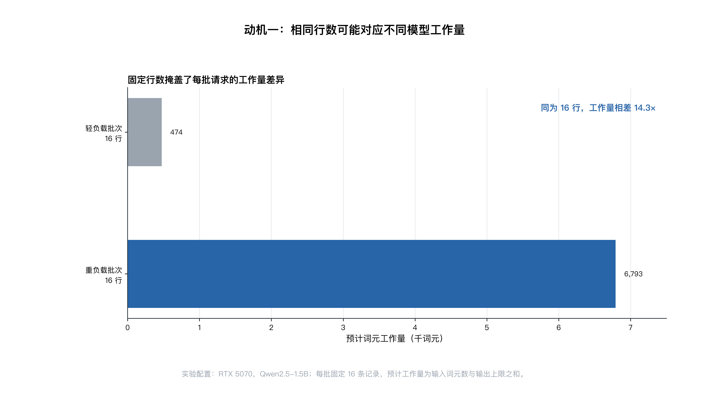
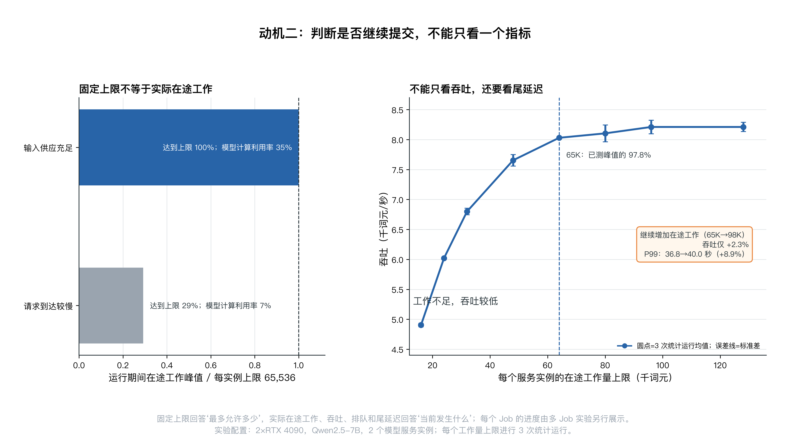
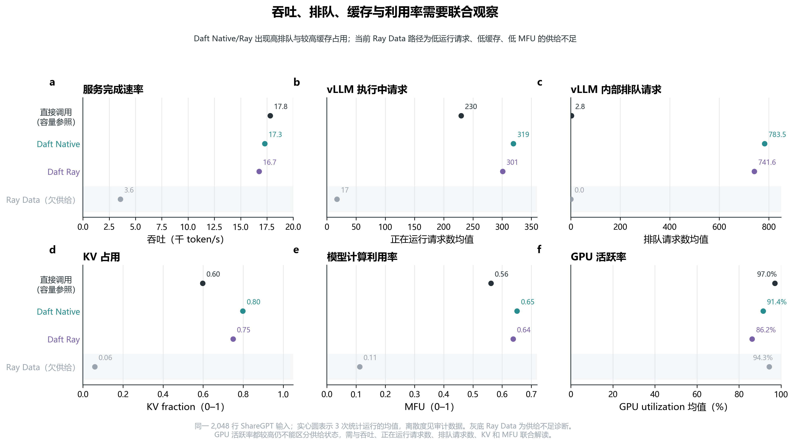
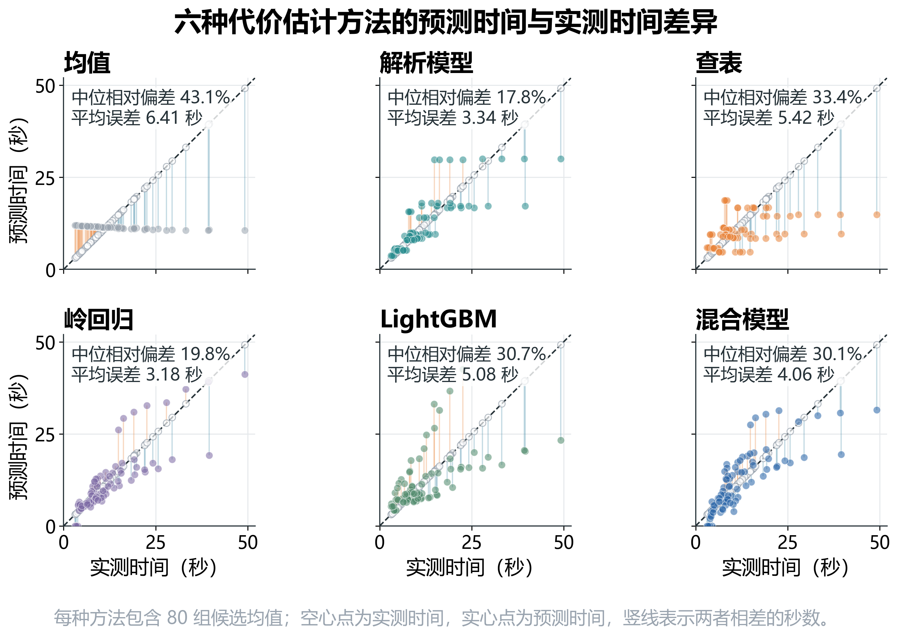
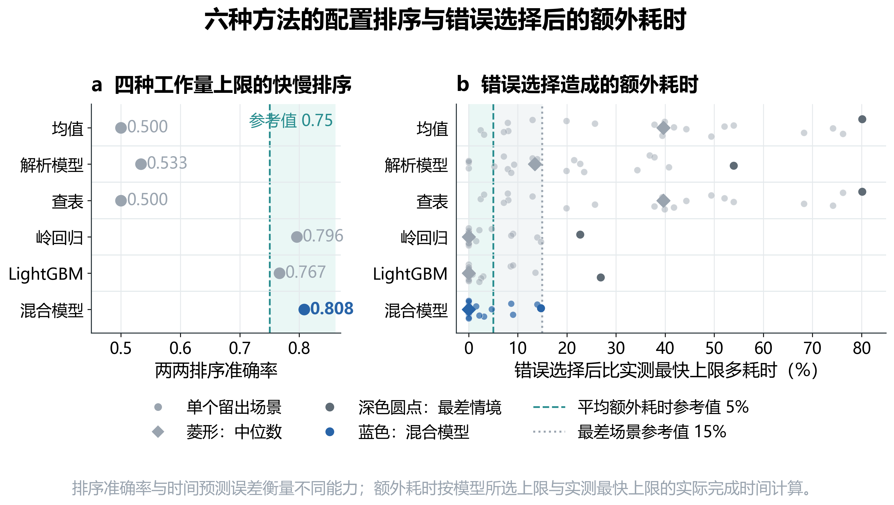
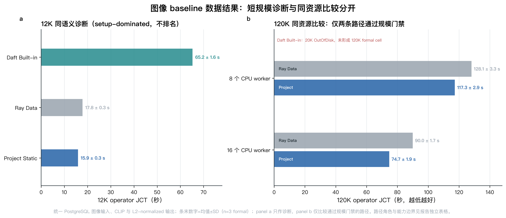

# 数据库 AI 负载的执行优化与调度研究

## 1. 课题背景、目的和意义

近年来，人工智能（Artificial Intelligence，AI）模型逐步进入数据分析与数据管理流程，数据库所承担的任务也从结构化数据存储、检索和统计分析，扩展到文本生成、语义理解、智能分类、向量化和多模态分析。向量化是把文本或图像转换成数值向量，以便进行相似度检索；多模态分析则同时涉及文本、图像、音频或视频等不同形式的数据。Snowflake Cortex AISQL、Google BigQuery ML/AI、Oracle AI Vector Search，以及开源关系数据库 PostgreSQL 生态中的 pgvector 和 pgai，已经允许用户通过结构化查询语言（Structured Query Language，SQL）或数据库工作流触发模型调用[1-5]。其中，pgvector 用于在 PostgreSQL 中保存和检索向量，pgai 用于连接数据库数据与外部 AI 模型。在这类工作流中，数据库不仅保存业务数据，还要筛选待处理数据、触发 AI 操作并管理处理结果。

这里所说的数据库 AI 工作流，是由数据库查询产生、并且需要调用模型处理的一组任务。数据库中保存评论、客服工单、新闻、企业文档和图片等业务数据；查询执行时，系统再根据具体 AI 操作把业务记录组织成发送给模型的提示词和输入内容。例如，在电商评论分析中，数据库表的一行可能包含商品编号、评论编号和评论正文。用户先用普通 SQL 筛选某个商品近期的评论，再通过 AI 语义算子判断每条评论主要涉及续航、物流还是屏幕质量问题。本文所说的 AI 语义算子，是查询中调用模型完成分类、摘要、抽取、向量化或语义判断的操作[20,22,29]。数据库查询的对象仍然是业务记录，AI 语义算子规定模型要对这些记录完成什么处理。

假设数据库中有如下评论表。`review_id` 是评论编号，`product_id` 是商品编号，`review_text` 是评论正文，`created_at` 是记录创建时间：

| `review_id` | `product_id` | `review_text` | `created_at` |
|---:|---|---|---|
| 101 | phone_01 | 手机很好用，但是电池续航有点差 | 2026-08-18 |
| 102 | phone_01 | 发货太慢了，等了一个星期 | 2026-08-19 |
| 103 | phone_02 | 拍照效果很好，夜景也很清楚 | 2026-08-19 |
| 104 | phone_01 | 屏幕用了两天就出现坏点 | 2026-08-20 |

普通关系查询可以筛选出某个商品最近需要分析的评论：

```sql
SELECT review_id, review_text
FROM reviews
WHERE product_id = 'phone_01'
  AND created_at >= CURRENT_DATE - INTERVAL '30 days';
```

如果业务人员还希望判断每条评论主要反映什么问题，则可以用概念性的 AI SQL 表示。这里的 AI SQL 是在普通 SQL 中加入模型调用函数；示例中的 `AI_COMPLETE` 表示调用文本生成模型处理一条评论：

```sql
SELECT
    review_id,
    review_text,
    AI_COMPLETE(
        review_text,
        instruction => '判断这条评论主要讨论的问题，只返回问题类别'
    ) AS issue
FROM reviews
WHERE product_id = 'phone_01'
  AND created_at >= CURRENT_DATE - INTERVAL '30 days';
```

不同数据库产品的 AI 函数名称和参数形式可能不同，上述 SQL 只用于说明查询语义。数据库先通过普通条件筛选业务记录，再由 AI 算子处理所选记录，结果仍与原记录一一对应：

| `review_id` | `review_text` | `issue` |
|---:|---|---|
| 101 | 手机很好用，但是电池续航有点差 | 电池续航 |
| 102 | 发货太慢了，等了一个星期 | 物流 |
| 104 | 屏幕用了两天就出现坏点 | 屏幕质量 |

本文把一条业务记录与一次 AI 操作结合后形成的待处理对象称为语义工作项。在这个例子中，`review_id=101` 的记录与“判断主要问题”这一操作结合后，形成一条分类工作项；如果同一条评论用于生成客服回复，则会形成另一条工作项。因此，工作项的身份不能只用数据库行号表示，还需要知道它来自哪个查询、哪个 AI 算子以及哪条业务记录。数据库中的行回答“处理的是哪份数据”，AI 算子回答“要对这份数据做什么”，二者结合后才构成执行层需要组织和调度的对象。

传统数据库查询主要围绕扫描、连接、排序和聚合等关系算子展开。本文所说的执行代价，是完成一个算子预计需要的时间和计算、内存及输入输出资源。虽然这些算子的执行代价并不都与数据量成线性关系，但行数、数据字节数、中央处理器（Central Processing Unit，CPU）、内存和输入输出（Input/Output，I/O）等信息通常能够描述其主要成本，执行引擎也能够依据分区和批大小组织计算。当 AI 算子进入数据库工作流后，一条查询需要处理的范围延伸到了外部模型服务。模型服务是持续接收请求、在图形处理器（Graphics Processing Unit，GPU）上运行模型并返回结果的程序。数据库筛出的记录还需要经历请求构造和文本词元化，也就是把文本转换成模型能够处理的词元（token）；图像则需要读取、解码和缩放。随后，输入通过服务接口提交并等待 GPU 推理，结果完成后再返回数据库执行链。本文把外部服务实际接收的一次调用称为模型服务请求，并把从数据库数据形成模型服务请求，到模型完成计算并返回结果的过程称为外部 AI 数据执行链路。

第一个问题是，AI 操作的处理需求不再只由数据库记录数量决定。本文把一个语义工作项或一组工作项预计需要完成的处理称为工作量（work）。文本工作量可以用输入和预计输出词元数描述，图像工作量则可能包括图像读取、解码、缩放和模型计算。同样是一条数据库记录，短评论与长文档的工作量可能相差很大。因此，数据库记录仍然负责标识输入数据和对应结果，但仅凭记录数量难以完整描述 AI 操作带来的处理需求。具体采用哪些工作量特征、怎样形成执行批次以及如何通过实验验证，在后续研究内容和研究方案中展开。

当评论分类、新闻摘要和工单分类等查询并发执行时，数据库输出的记录还可能分别属于不同的 AI 操作。此时，一条记录只有与所属查询和具体 AI 操作结合，才能确定它进入模型服务后要完成什么任务。数据在数据库中的输出顺序或物理相邻关系，并不天然表示这些任务具有相同语义或相近处理代价。这使数据库到模型服务之间不能再被理解为单一、均匀的记录流，而是由多种 AI 处理任务共同形成的执行负载。

第二个问题是，模型服务的容量配置不等于它当前的运行状态。本文把已经提交、但尚未完成的请求，以及按输入词元数、输出上限或图像规模等已知信息计算出的工作量，统称为在途工作（active work）。这里的工作量记录已提交工作的规模；代价估计器则使用运行前能够获得的信息预测执行时间和资源需求。GPU 推理服务通常会配置最大并发请求数、显存限制或最大在途工作量，这些参数规定系统最多允许多少工作进入服务。但是，在相同容量配置下，上游若持续快速提交请求，服务端可能同时存在大量正在执行和排队的请求；上游若受数据库读取、数据准备或提交速度限制，GPU 又可能得不到足够工作。因此，“最多允许多少工作进入”说的是容量上限，“此刻有多少工作正在准备、排队和执行”说的是实际运行状态。只设置一个较大的固定并发值，既不能保证模型服务持续得到有效供给，也可能使大量请求过早进入服务端并形成不必要的等待。

第三个问题是，数据库用户等待的是完整作业，而模型服务直接处理的是单个请求。本文把具有明确到达时间和完成条件、由同一查询或同一工作负载类别产生的一组有限工作项称为一个作业（Job）；工作负载（workload）用于描述实验采用的一批作业及其输入分布。在计划中的数据库执行链中，一次查询执行对应一个作业；当前外部路径实验则用预先给定的一组有限工作项表示一个作业。一个作业可能包含数百乃至数万条工作项。多个作业共享同一组 GPU 服务时，持续产生大量请求的长作业可能使后到的短作业等待明显增加；如果永久为短作业保留固定资源，短作业暂时没有待处理数据时又可能造成资源闲置。因此，数据库 AI 执行既要考虑整体资源利用，也要考虑不同作业的完成时间、相互干扰和服务均衡。

上述问题说明，传统数据库执行层和模型服务层之间存在一个需要单独研究的执行区域。数据库知道每项查询和算子要处理哪些业务记录、这些记录属于哪个作业、还有多少数据尚未处理，以及结果应当怎样写回；模型服务知道哪些请求已经到达、多少请求正在运行或排队、缓存是否紧张以及请求完成得多快。数据库通常看不到模型服务的实时压力，模型服务也不知道数据库端还有多少数据尚未转化为请求、这些请求分别属于哪个完整作业，以及各作业已经完成到什么程度。两端信息没有形成衔接时，单纯沿用传统数据分批方式和静态并发配置，容易出现模型服务供给不足、请求过早堆积和作业间干扰。

基于这一问题，本课题将数据库关系算子把记录交给 AI 语义算子之后，到模型结果返回数据库查询执行过程之间的物理执行过程抽象为 AI 数据执行层（AI Data Execution Layer）。这一抽象用于明确本课题的研究对象：查询计划中的 AI 语义算子如何把数据库筛选出的业务数据转化为模型服务请求，这些请求如何有序进入外部模型服务，以及多个数据库作业如何共享有限的模型服务能力。数据库仍然管理 SQL 查询、输入记录和结果对应关系，外部执行部分负责数据准备、请求提交和模型计算。例如，分类结果仍对应原始评论，文本生成结果仍对应原始输入，向量仍写回对应记录。

图 1 只比较传统关系算子与 AI 语义算子外部物理执行过程的基本差异。传统数据库算子通常围绕记录规模以及 CPU、I/O 等资源组织执行；AI 语义算子的模型计算还要把数据库记录转换为模型输入，经过预处理、传输、服务排队和模型计算，再收集结果并返回数据库。图中各环节用于说明这段物理执行过程为什么不能只沿用行数和传统资源字段描述，其对应的研究问题在第三章展开。


图 1 传统关系算子与 AI 语义算子外部物理执行的成本组成差异。左侧概括关系算子的常见描述信息，右侧说明 AI 语义算子的模型调用增加了数据准备、请求传输、服务排队、模型计算和结果返回等阶段。

读图说明：左侧的 rows 是记录数，selectivity 是通过过滤条件的记录比例，cardinality 是算子预计输出的记录数。右侧按执行顺序给出输入记录、文本词元化或图像解码缩放、请求构造与传输、服务队列与动态批处理、模型推理以及结果整理与写回。下方五项分别概括输入规模、预处理与传输、服务队列、模型计算和输出规模对执行成本的影响。该图说明 AI 语义算子的外部物理执行跨越多个处理阶段，因此相同行数并不必然对应相同的执行代价。

本课题以逐记录的文本生成、向量化和分类任务为主要场景，研究两个相互关联的问题：一是数据库产生的 AI 执行负载应当怎样描述和组织，才能反映文本、图像等任务在不同处理阶段的实际需求；二是模型服务能力有限且多个数据库作业并发时，怎样依据实际运行状态安排请求提交、服务实例选择和作业之间的资源使用。研究对象是数据库查询计划中的 AI 语义算子通往外部模型服务的物理执行过程，数据库负责管理查询和结果，外部执行部分负责工作项组织、模型服务请求提交和模型计算。算子代价信息返回数据库侧，为关系算子与 AI 算子的执行顺序、物理执行方案和多条 SQL 的运行安排提供参考。

本课题的研究目的，是在保证输入记录、AI 操作和输出结果正确对应的前提下，减少工作量差异造成的执行失衡，在模型服务供给不足与请求过早堆积之间取得平衡，并减轻多个作业共享 GPU 服务时的相互干扰。方案成效将通过正确结果吞吐、排队和尾延迟、资源使用以及完整作业的完成情况共同评价。正确结果吞吐表示单位时间内完成且结果有效的记录数或词元数，尾延迟表示完成最慢的一部分请求所经历的时间。

从理论研究意义看，现有数据库 AI 研究更多关注 AI 算子语义、查询计划、模型选择和调用次数，模型服务研究则主要关注已经到达服务端请求的批处理、显存管理和 GPU 调度。本课题关注两者之间的数据执行层，把“业务记录怎样在特定 AI 操作下形成执行负载”“数据库端任务信息怎样与模型服务运行状态衔接”以及“请求级执行怎样服务于作业级目标”放在同一条链路中考察，从而补充数据库查询与外部模型执行之间的系统研究。

从应用意义看，数据库查询中的 AI 语义算子具有较高的计算成本，而且不同记录对应的处理需求可能相差很大。GPU 通常也是整条执行链中成本较高的资源。如果上游长期供给不足，会造成模型服务资源闲置；如果大量请求无控制地提前提交，则会增加排队、显存压力和尾延迟；如果多个作业缺少合理的共享机制，还可能出现某一类任务长期受到干扰。因此，建立可描述、可观测和可控制的 AI 数据执行层，有助于提高数据库驱动模型服务的资源使用效率，并改善复杂工作负载下的作业完成体验。

## 2. 国内外研究现状

与本课题关系最直接的研究可以分为三组。数据库 AI 查询方面重点分析 Cortex AISQL、LOTUS、Palimpzest、Abacus、Sema、Galois、IMBridge 和关系数据分析中的 LLM 查询优化；分布式执行方面重点分析 Ray、Ray Data 的 Streaming Batch Model 和 AYO；模型服务与调度方面重点分析 Parrot、虚拟词元计数方法（Virtual Token Counter，VTC）、DLPM 和 BlendServe。下文沿这三条主线综合讨论各项工作的研究问题、核心方法、实验依据和适用条件，其他论文和工业系统用于补充不同实现路线、评价指标和相邻问题。

### 2.1 数据库 AI 算子与语义查询优化现状

随着生成式人工智能和向量检索逐步融入数据分析过程，数据库系统开始直接支持 AI 算子和 AI SQL。Snowflake Cortex AISQL 是其中与本课题关系较直接的生产系统。它把 AI 调用的成本和选择率纳入查询优化，研究 AI 谓词重排、大小模型级联和语义连接重写[1]。谓词是查询中判断一条记录是否满足条件的表达式，谓词重排就是改变多个判断条件的执行先后；语义连接则借助模型判断两侧记录在语义上是否匹配。Cortex AISQL 的优化重点位于模型调用次数、模型选择和语义算子重写，数据库到外部模型服务之间的组批与提交由另一层执行机制承担。Google BigQuery ML/AI 提供生成文本与向量相关的数据仓库函数[2]，Oracle AI Vector Search 将向量生成与向量检索纳入 SQL 数据处理过程[3]。PostgreSQL 生态中的 pgvector 提供向量类型与向量索引，pgai 等组件则进一步连接数据库数据和外部模型服务[4-5]。

LOTUS 从声明式数据处理出发，将过滤、连接、排序和聚合等能力抽象为语义算子，并为这些算子给出参考算法与质量约束下的优化方法[20]。它把时间、费用和结果质量共同纳入语义查询处理，使后续系统能够在保持算子语义的前提下比较不同执行方式。*Optimizing LLM Queries in Relational Data Analytics Workloads* 把数据库统计信息进一步用于模型请求形成之前的记录组织：方法依据函数依赖、列基数和字段长度重新排列输入表中的行以及每行字段的顺序，使相邻提示词具有更长的共享前缀，从而提高键值缓存复用[50]。这项工作说明数据库掌握的行、列和统计信息能够直接改变模型服务效率；其方法适用于完整输入可以提前观察、共享前缀具有较高复用价值的关系数据分析任务。本课题据此进一步考察分阶段工作量、数据局部性和模型服务状态共同变化时的数据组织方式。

*Palimpzest: Optimizing AI-Powered Analytics with Declarative Query Processing* 将包含传统数据处理与 AI 语义处理的应用表示为声明式关系计划[22]。用户描述输入输出模式、关系操作、自然语言条件和运行时间—费用—质量偏好，系统再枚举过滤与转换的逻辑顺序、模型与提示方式等物理实现，并通过样本执行估计选择率、运行时间、费用和结果质量。其 CIDR 2025 版本在多模态房产检索任务中给出了多组质量—时间—费用折中，代表计划相对于基线达到约 3.3 倍加速和 2.9 倍费用降低，同时取得更高的 F1 分数；F1 同时反映结果的查准率和查全率。该工作建立了“声明式语义计划—物理实现—多目标选择”的基本框架，也说明逻辑重排会改变下游请求数量和输入规模。

*Abacus: A Cost-Based Optimizer for Semantic Operator Systems* 在 Palimpzest 的语义算子框架上进一步建立可扩展的代价优化器[21]。Abacus 使用规则枚举物理实现，通过逐算子采样估计质量、费用和延迟，用面向 Pareto 前沿的多臂老虎机方法把采样集中到更有希望的候选，再由 Pareto-Cascades 在限定目标下组合全局计划。Pareto 前沿由一组无法在不牺牲其他目标的情况下继续改善某一目标的候选方案构成。论文在 BioDEX、CUAD 和 MMQA 三类任务上报告了质量、费用和延迟收益，也观察到 MMQA 中高方差语义连接使最低费用目标的选择稳定性下降。该结果提示 AI 算子代价信息的价值最终体现在候选计划排序和实际决策损失上，单点预测误差只是其中一层评价。

VLDB 2026 录用论文 *Sema: A High-performance System for LLM-based Semantic Query Processing* 选择了更紧密的数据库执行路径：它在 DuckDB 中把语义过滤、投影、连接、排序和聚合作为可见的计划算子，并通过 SemaSQL 把自然语言表达式嵌入标准 SQL 子句[52]。优化器压缩自然语言表达式并从语义条件中推导可下推的关系条件；执行阶段采用算子融合、提示词组批和自适应查询执行，通过少量真实执行比较延迟、词元费用和与参考路径的结果一致性。VLDB 2026 官方程序将录用版本的实验概括为 26 个语义查询，覆盖分类、摘要、文本抽取和排序，并报告相对于三类基线约 2～10 倍加速和具有竞争力的结果质量。当前可获取的 arXiv v1 仍是本报告分析具体方法和分项实验的全文依据，其中组批与融合在本地模型服务和远程接口下呈现了不同的延迟方向。Sema 因而把数据库计划、执行基础设施和模型服务环境联系起来；本课题在这一联系上继续研究跨服务实例提交、逐作业进度和共享模型服务时的运行决策。

*IMBridge: Impedance Mismatch Mitigation between Database Engine and Prediction Query Execution* 进一步指出，数据库算子交付数据的批次与模型一次适合处理的推理批次属于两个不同的执行粒度[53]。当机器学习预测函数只是扫描或过滤算子中的普通 Python 用户自定义函数时，数据库可能在每次调用中重复建立推理上下文，也就是重新加载模型或分配计算资源等可在一次查询中复用的状态。函数实际收到的数据量还会受关系算子输出以及数据库算子之间统一设置的传输批大小影响。IMBridge 通过函数改写把不随批次变化的初始化提到查询规划时完成，并把预测函数变成独立的物理算子，由该算子缓存、拆分或合并输入，以接近特定模型和框架下合适的调用批大小。论文中两个演示截图分别给出了只启用函数改写时由 244.15 秒降至 116.26 秒、只启用独立预测算子时由 244.15 秒降至 24.16 秒的示例。但该文是 4 页的系统演示论文，没有完整报告硬件、模型、数据规模、重复次数和方差，因此这些数字只说明相应演示中的执行现象。其方法面向数据库中的本地预测函数和单个预测算子，尚未处理远程模型服务的排队、多个服务实例的选择和多作业共享问题。

Galois 面向 SQL 调用大语言模型的场景研究逻辑与物理查询优化[29]。它把大语言模型调用表示为关系查询中的可优化操作，通过逻辑重写减少重复或昂贵调用，并比较不同物理执行方式，使模型调用能够与传统 SQL 算子共同进入计划选择。SemBench 则从基准测试角度统一评价语义查询处理系统的功能、效率、费用和结果质量[23]。GaussML、NeurDB 和 LEADS 等工作代表将机器学习能力进一步纳入数据库内部执行和自动优化的研究路线[6-9]。InferDB 通过数据库索引近似替代部分在线模型推理[38]，SmartLite 则面向资源受限环境将压缩后的神经网络执行转换为数据库内部操作[39]。这些方法表明，数据库 AI 执行可以沿原生语义算子、声明式数据处理、索引近似和外部模型调用等不同路线展开，各路线面对的优化对象和结果质量要求也有所不同。

这类研究主要解决 AI 能力如何以数据库算子的形式被表达、组合和优化。例如，数据库优化器需要判断关系过滤与昂贵 AI 谓词的执行顺序，选择满足质量要求的模型和物理实现，并比较不同语义算子组合形成的执行计划。执行计划是数据库为一条 SQL 选择的算子顺序和具体实现方式。传统数据库可以根据基数、CPU 和 I/O 等信息估计扫描、过滤、连接和聚合的成本，其中基数表示某个算子预计输出多少条记录。AI 语义算子还会产生数据准备、外部模型调用、模型服务排队和 GPU 执行等成本。如果数据库无法估计这部分工作，就很难把 AI 算子与传统关系算子放在同一执行计划中进行比较，也缺少安排多条 AI SQL 执行顺序和并发方式的依据。

数据库 AI 算子研究为本课题提供了应用场景和查询语义基础，也提出了两个相互衔接的问题。一方面，数据库需要获得 AI 语义算子的预计执行时间和资源需求，才能与传统关系算子共同进行计划优化和查询编排。另一方面，逻辑上逐条记录定义的 AI 算子在物理执行时不必为每条记录单独建立 GPU 任务；只要保持输入记录与输出结果的对应关系，外部执行层仍可根据工作量、批处理和模型服务状态组织多个请求共同执行。本课题由此连接数据库侧的算子代价信息与模型服务上游的物理执行过程。

### 2.2 分布式数据执行与异构流水线现状

数据库触发的大规模 AI 操作往往需要在多个 CPU 工作线程、GPU 和模型服务实例之间执行，因此分布式数据执行框架为此类系统提供了重要基础。Ray 通过任务（task）和有状态执行单元（actor）两类抽象支持分布式 AI 应用[10]。任务执行一次计算后结束；有状态执行单元则可以在多次调用之间持续保存队列、计数器或模型实例。Ray 的作用是提供可以承载动态任务图和有状态服务的运行基础，本身不规定数据库 AI 作业应该采用哪一种数据组织或作业选择方法。

Ray Data 的 Streaming Batch Model 进一步面向 CPU、GPU 和输入输出混合的异构数据流水线，允许分区在运行中产生和切分，并结合中间数据内存占用与资源情况安排任务[18]。Ray Data 的 `map_batches` 接口可以指定每批期望包含的行数，也可以使用固定规模或自动伸缩的有状态执行单元池完成模型推理[47]。背压是指下游来不及处理时，上游主动降低数据产生或提交速度，防止待处理数据无限积累。这些机制能够控制分区流动、内存占用和异构阶段并行，但批大小首先表示数据行数，仍不直接等于模型处理这些行所需的计算量。

Daft 是面向复杂数据和 AI 工作负载的分布式数据帧（DataFrame）引擎。数据帧以带有列名的表格形式组织数据，并支持对分区数据进行并行转换。Daft 能够使用 Apache Arrow 的列式内存格式组织数据，也可以借助 Ray 执行分布式任务[19]。Arrow 让不同语言和系统按统一的列式布局共享数据，减少阶段之间的格式转换。DuckDB 是可以直接嵌入应用进程的分析型数据库[24]；DataFusion 等使用 Arrow 的数据处理引擎，则采用列式数据和模块化执行方式[25]。NeuStream 等研究进一步关注流式数据处理与深度学习服务之间的流水化协同[30]。

AYO 从完整大模型应用的角度说明，若运行时只看到彼此独立的模型请求，就会丢失请求所属任务、处理阶段和前后依赖。它把应用拆成细粒度任务单元，建立数据流图，并利用图中的依赖和层次进行跨模块并行、流水执行和批处理[49]。这项工作为本课题保留查询、作业和处理阶段信息提供了直接依据。不过，AYO 面向由应用框架给出的工作流，并会与模型服务后端配合修改；本课题关注数据库拥有的 AI 算子执行过程，还需要结合数据库记录、模型服务实际状态和多个服务实例进行上游提交控制。

现有数据执行框架已经能够把大数据集拆开处理，在不同 CPU/GPU 资源上放置任务，限制局部缓冲区，并通过背压协调上下游速度。但是，这些框架通常围绕数据块（block）、分区（partition）或批次（batch）进行调度。数据块是连续存放的一组记录，分区是可以独立处理的一部分数据，批次是一次交给某个算子处理的一组记录。框架知道它们包含多少行、多少字节以及需要哪些系统资源，却不会天然知道这些记录经过 AI 算子后将产生多少输入和输出词元，也不知道当前模型服务处于供给不足还是大量排队状态，更不会天然掌握多个数据库作业还剩多少 AI 工作。

Daft 和 Ray 等框架为本课题提供数据划分、资源放置、异构执行和背压基础。本课题在这些机制之上，依据输入词元数、输出上限、图像或帧规模等已知特征计算 AI 工作量，限制已经进入模型服务的工作，并安排不同作业的提交顺序。这里的服务目标是对作业完成时间、请求延迟或按时完成比例等指标提出的要求。Ray 的有状态执行单元可以持续保存数据库作业的剩余工作、服务目标和模型端状态，本课题据此设计作业选择与服务顺序。

### 2.3 GPU 模型服务与请求调度现状

GPU 模型服务是当前大模型系统研究的重要方向。已有综述从请求处理、执行优化和内存管理角度整理了大模型推理中的批处理、调度、负载均衡与代价估计问题[40]。Orca 提出的迭代级调度（iteration-level scheduling）能够在模型每生成一轮词元时重新组织请求[11]。vLLM 是面向大语言模型的推理服务引擎，它使用 PagedAttention 按页管理键值缓存（Key-Value Cache，KV Cache）[12]。键值缓存保存模型处理已有上下文时产生的中间结果，避免生成后续词元时重复计算。vLLM 还采用连续批处理（continuous batching）：请求可以在其他请求尚未结束时加入执行，完成后也可以及时移出，而不是等待整个固定批次一起结束。vLLM 的调度配置提供每轮最多处理的序列数和词元数，并支持先来先服务或优先级策略[48]。这些参数限制的是模型服务一次调度迭代中的工作，不表示数据库上游已经提交但尚未完成的全部工作。Sarathi-Serve 进一步缓解提示词预填充（prefill）和逐词生成（decode）之间的相互干扰[13]。预填充一次处理完整输入并建立缓存，逐词生成则在后续步骤中每次产生新的词元。DistServe 和 Splitwise 分别从服务质量和硬件资源匹配角度研究这两个阶段的分离执行[14,41]。Clockwork、Llumnix 和 SGLang 等系统则分别研究可预测执行、动态服务调度和结构化模型程序运行时[17,31,42]。

*Parrot: Efficient Serving of LLM-based Applications with Semantic Variable* 研究的问题是，同一应用中多次模型调用原本具有前后依赖、共享提示词和最终性能目标，但普通文本生成接口会把它们变成彼此无关的请求[15]。Parrot 引入语义变量（Semantic Variable），用它表示提示词中的输入和输出位置，并保留哪个请求产生该变量、哪些后续请求使用它以及最终结果更重视延迟还是吞吐。服务端据此建立请求与变量之间的依赖图，把同一并行阶段的中间请求组成任务组，并通过提示词结构发现可共享前缀，再将相关请求放到已保存对应缓存的模型服务实例。在单张 A100、LLaMA 13B 的长文档 Map-Reduce 摘要实验中，系统先并行摘要多个文档片段，再汇总中间结果。Parrot 把这些并行的片段摘要请求视为一个任务组，优先缩短整组完成时间。作者报告，该方法相对于把所有请求都当作延迟敏感请求的 vLLM 路径获得约 1.70～2.37 倍加速。该方法需要应用在提交时保留模板和变量信息，并修改模型服务的管理器与执行引擎；论文未评价动态分支、公平性和大规模异构集群。该工作说明保留作业、阶段和共享提示词信息能够改变下游执行方式；本课题还需要把这些信息与数据库中尚未形成请求的记录、数据准备进度和多作业共享联系起来。

BlendServe 重点研究离线推理中的请求组织。它根据输入和输出规模描述请求的计算与内存需求，并用共享前缀树同时保存缓存复用关系和资源特征，再从可重排的请求集合中组成资源需求互补的批次[51]。这项工作说明工作量均衡与前缀局部性不能分开考虑，也说明执行时间预测不一定只用于给出一个精确秒数，还可以帮助区分请求类别和形成批次。但 BlendServe 的方法运行在离线模型服务内部，假定系统能够提前看到足够大的请求集合，没有处理数据库数据准备、多个数据库作业的到达过程和服务实例之间的上游路由。

随着模型服务从单用户环境进入共享平台，公平性和服务隔离也成为重要研究问题。VTC 根据输入和输出词元记录各客户端已经获得的服务量，并优先处理累计服务较少的客户端[16]。当某个客户端暂时没有请求时，计数调整机制避免它在重新到达后长期追补过去未使用的份额；基础机制依靠已经发生的服务量更新。这为本课题建立基于实际服务量的作业记账方法提供了直接参考。VTC 的调度对象位于模型服务内部，本课题进一步把数据库数据组织、服务实例路由和完整作业进度纳入上游决策。

*Locality-aware Fair Scheduling in LLM Serving* 进一步研究公平服务与前缀缓存复用之间的冲突[44]。只按已获得的词元服务量严格交替客户端，可能打散共享前缀；只按最长前缀匹配选择请求，又可能让持续提交长共享前缀的客户端长时间占用 GPU。论文提出基于服务余额的最长前缀匹配（Deficit Longest Prefix Match，DLPM）：每个客户端维护尚可获得的服务余额，只有余额为正的客户端才参与最长前缀匹配；所有有待处理请求的客户端都用完当前余额后，再获得相同的每轮补充量。实际执行后，系统按未被前缀缓存覆盖的输入词元和输出词元扣减余额，因此已经复用的前缀不会被重复计为 GPU 工作。分布式扩展 D²LPM 还为每个“客户端与 GPU 工作节点”组合维护余额，先尝试选择保存最长共享前缀的节点，再在可选节点中比较等待队列长度。论文在 Llama 3B/8B、A10G/A100 与最多 8 个模型服务副本上进行评价，每个副本运行相同模型并独立处理请求。作者报告，D²LPM 的最高吞吐达到 VTC 的 2.87 倍；与主要考虑前缀复用和负载均衡的 Preble 相比，在客户端没有异常提高请求率或延长共享前缀的实验中，最低延迟约为 Preble 的 1/7.18。但在超长前缀、较短输出的长文档问答情形中，8 个模型服务副本上 Preble 的吞吐更高；论文也没有研究处理完整应用依赖、异构 GPU 和自动选择每轮补充量。此外，D²LPM 的公平性分析依赖每个模型服务副本内部也运行公平调度，对于无法修改内部调度的模型服务，其上游不能直接沿用该理论保证。

其他调度研究用于补充不同服务目标。作业应当获得的服务量与实际已经获得的服务量之间的差额，本文称为服务差额。FairServe 进一步考虑不同应用和多次模型调用的加权服务与限流[43]。NSDI 2026 论文 *Agentix: An Efficient Serving Engine for LLM Agents as General Programs* 则把累计服务量用于多次模型调用组成的程序级调度[45]；该系统在早期预印本中使用 Autellix 名称。FairServe 与 DLPM 目前仍按预印本引用，Agentix 已引用正式会议版本；三者主要位于模型服务或应用运行时层。在更广泛的资源管理领域，主导资源公平（Dominant Resource Fairness）按照每项作业在 CPU、GPU 或内存等资源中占用比例最高的一项衡量其资源份额，用于处理多种资源的公平分配[32]。Pisces 研究多租户存储中的性能隔离与资源共享[33]，数据库领域也研究了多租户事务处理中的公平调度[34]。Themis、Tiresias 和 Pollux 则分别从作业完成体验、已获得服务量和满足资源效率目标的有效处理进度等角度研究 GPU 集群中的多作业调度[35-37]。

然而，模型服务中的调度器通常只能够处理已经进入模型服务的请求。对于一个来自数据库的大规模 AI 作业，模型服务并不知道还有多少数据库记录尚未完成数据读取和请求构造，也无法直接判断不同请求属于哪些完整的数据库查询任务。模型服务内部调度解决的是“已经收到的请求怎样执行”，而数据库 AI 数据执行层还需要回答“哪些请求现在应该进入模型服务”。二者具有明显的上下游关系。

此外，将所有数据库请求提前推入模型服务并依靠模型服务内部调度，也会使上游失去一部分控制能力。已经进入服务端排队的请求占用了队列和缓存资源，并且对不能中途暂停的模型请求而言，上游很难再改变其执行顺序。因此，即使服务端具有成熟的连续批处理，上游仍然需要决定应当保持多少工作处于在途状态，并在多个数据库作业之间控制新请求的释放顺序。本文所说的状态感知提交，是根据当前数据准备进度、模型服务排队和运行情况以及作业完成进度安排新请求，而不是只依赖运行前设定的固定并发数。

### 2.4 当前研究存在的问题

综合上述研究，数据库 AI 算子、分布式数据执行和 GPU 模型服务已经分别形成了较丰富的方法，但它们之间仍有两类衔接问题没有得到充分处理。

一类问题发生在数据组织阶段。Ray Data 研究异构流水线中的分区流动与内存控制[18]，IMBridge 证明数据库算子的数据交付批次需要与模型的调用批次分开控制[53]，关系型 LLM 查询重排证明行和字段顺序能够改善前缀缓存复用[50]，BlendServe 则在离线模型服务内部共同考虑请求资源需求与前缀局部性[51]。这些工作已经说明数据组织会影响模型执行，不能再把研究问题笼统写成“现有系统只按固定行数处理”。尚需继续研究的是：数据库记录在到达模型服务前，怎样用适合文本、图像及后续音频、视频任务的分阶段工作特征形成批次；在数据准备、模型执行和缓存压力不断变化时，怎样比较工作量均衡与数据局部性的实际作用。张量是模型用于表示输入和中间结果的多维数值数组。数据局部性表示相关记录在处理顺序或服务实例上保持接近，从而有机会复用缓存或减少数据搬移。

另一类问题发生在请求进入模型服务之前。AYO 和 Parrot 分别保留应用任务、处理阶段和多次模型调用之间的关系[15,49]，VTC 与 DLPM 处理模型服务内部多个客户端的服务量记账以及公平性与前缀复用之间的取舍[16,44]，其他模型服务和 GPU 集群研究分别处理已经到达的请求或集群资源分配[35-37,43,45,48]。数据库上游还要面对尚未形成请求的记录、数据准备进度、完整查询的剩余工作，以及多个模型服务实例此刻的排队和运行情况。固定并发上限不能反映这些变化；在多个作业共享模型服务时，预先分开可提交空间容易留下空闲，完全共享又可能使长作业持续影响短作业。现有研究尚未充分把这些数据库侧信息与上游请求释放联系起来，以同时考察总体效率、作业完成时间和服务均衡。

数据库优化器还需要获得 AI 语义算子的成本信息。已有学习型代价模型研究表明，平均预测误差与候选计划选择质量需要分别评价[26-28]；CONCERTO 也说明，并行执行中的阶段结构和资源竞争会影响代价估计[46]。因此，代价估计既要检查执行时间和资源需求的预测误差，也要检查它能否正确排列结果含义相同的候选计划，并最终改善数据库选择的执行方案。两项研究内容先依据可观测工作特征、容量和实际运行状态建立基础方法；经过独立验证的预计执行时间和预计剩余执行时间再作为补充信息，用于检验预测是否能够带来额外收益。

据此，本课题研究分阶段工作量组织和模型服务能力相同条件下的上游调度，并以 AI 算子代价信息为数据库计划比较和两项研究内容提供共同支撑。

图 2 进一步概括本课题与相邻系统层次的关系。数据库侧掌握记录、查询、作业以及输入输出要求，模型服务侧负责已经到达的请求怎样在 GPU 上执行，并能够观测排队、运行、缓存和完成情况。两侧信息目前没有自然对应起来：数据库记录尚需转换为能够反映 AI 处理需求的工作描述，模型服务的实际状态尚需与数据库作业进度联系起来，多个作业同时提交时也需要共同安排提交顺序和服务实例。本课题的两项研究内容正是围绕这三方面联系展开。


图 2 本课题研究数据库与模型服务之间需要补充的三方面联系。

读图说明：左侧列出数据库已有的任务与数据语义、输入输出要求和写回要求；右侧列出模型服务已有的文本或图像计算能力，以及它能够直接看到的运行信息。KV 缓存是文本模型为已经处理的上下文保存的键和值表示，缓存使用情况会影响后续请求可用的显存空间。中间三项能力分别对应后文的数据组织、状态感知提交与多作业调度：先按 AI 处理需求描述工作量，再根据排队、缓存和完成速度判断后续工作何时提交，最后在多个作业之间安排提交和服务实例选择。

## 3. 研究目标与研究内容

### 3.1 研究动机与问题分析

前期实验形成三个同级问题。问题一位于数据库记录与执行批次之间：记录数不能表示不同记录实际需要完成的 AI 工作，对应研究内容一。问题二位于模型服务层：容量、排队、吞吐或利用率中的任何单一维度，都不能完整表示当前运行状态。问题三位于作业层：多个作业共享模型服务时会相互影响，只看整体结果不能说明每个作业的完成情况。问题二和问题三共同导向研究内容二。本节以直接建立研究问题的证据为主，候选方法的初步结果和其他可行性依据在第四章展开。

#### 3.1.1 问题一：记录数不能代表 AI 处理工作量

数据库记录数只说明需要处理多少条数据，不能说明这些数据在输入准备、模型执行和结果处理等阶段分别需要多少工作。这个问题在文本和图像任务中表现不同，但都说明按固定行数形成批次会把处理需求差异很大的记录当成同样大小。

第一，文本证据来自一组固定行数组批预研。实验使用单张 RTX 5070、Qwen2.5-1.5B（约含 15 亿参数的文本生成模型）和 512 条混合文本记录，其中 ShareGPT 提供多轮对话，BurstGPT 提供根据在线模型服务请求轨迹构造的突发输入。单条输出最多为 16 个词元，固定每 16 行形成一个组织批次。3 次统计运行中，每个批次都恰好包含 16 行，但输入词元与允许输出量之和最小为 474、最大为 6,793，相差约 14.3 倍。该结果只用于说明“行数相同而文本工作量不同”，不作为双卡系统的性能结论。



图 3 固定 16 行形成的批次仍存在约 14.3 倍的词元工作量差异。

读图说明：横轴表示各个固定 16 行的请求批次，纵轴表示该批次输入词元数与允许输出词元数之和。图中最轻和最重批次都包含相同行数，但预计词元工作分别为 474 和 6,793；它说明固定行数可能把轻任务和重任务当成同样大小。该数值与本组机器、模型和工作负载绑定，只用于证明记录数不是可靠的工作量表示。

第二，图像证据进一步表明，同一批图像还包含性质不同的阶段工作。图像准备阶段测量使用单张 RTX 4090、PostgreSQL 18.4 中的 5,000 张 COCO 图像和 CLIP ViT-B/32。COCO 是常用的图像数据集，CLIP ViT-B/32 是把图像转换为语义向量的视觉—文本模型。对于批大小 16、64 和 256，每张图像的解码、缩放和张量构造中位时间为 4.44～4.78 毫秒（ms），GPU 有状态执行单元完成数据搬移、模型前向计算和结果归一化的中位时间为 0.143～0.346 ms。按同一次重复计算 CPU 准备时间与 GPU 执行时间之比，再取 30 次重复的中位数，三个批大小分别为 13.9、31.0 和 29.5 倍。该测量不包含 Daft/Ray 调度和 pgvector 写回，不能据此确定整条图像执行链的唯一瓶颈；它说明图像任务需要把准备、传递和模型执行等阶段分别描述。


图 4 图像任务中的准备、传递和模型执行阶段不能由图像记录数统一表示。

读图说明：图 4a 的纵轴是同一次重复中 CPU 准备时间与 GPU 执行时间的比值，圆点是 30 次比值的中位数，误差线表示中间 50% 的结果。图 4b 比较张量位于 GPU、不可换页的半精度主机内存和普通单精度主机内存三种输入表示，说明数据表示会改变传递与执行开销。图 4c 的最大在途批次数表示已经提交但尚未完成的批次上限，窗口过小时模型进程得不到足够工作，继续放大后吞吐不再上升而等待增加。图 4c 考察的是提交上限与实际运行状态，承接下一节的问题分析，不作为“记录数不能表示工作量”的证据。

文本中的词元差异和图像中的阶段差异共同导向研究内容一，即建立分阶段工作量表征，并依据这些信息组织批次。

#### 3.1.2 问题二：单一维度不能代表当前运行状态

模型服务的当前状态同时包含配置允许的容量、已经进入执行链的工作、排队与缓存压力以及工作完成速度。任何一个维度都只能描述其中一部分。本组证据按三个层次说明这个问题，分别排除“固定上限就是实际状态”“吞吐接近就是状态接近”和“排队少就是运行健康”三种简单判断。

第一，固定上限不等于实际在途工作。实验保持双 RTX 4090、两个 Qwen2.5-7B vLLM 服务实例、每个服务实例的请求数和 65,536 个预计词元工作量上限不变，只改变请求到达节奏。输入供应充足时，在途工作能够接近上限，模型计算利用率（Model FLOPs Utilization，MFU）约为 35%；请求到达较慢时，在途工作峰值约为 18,700～19,400，只达到上限的约 29%，MFU 约为 7.07%。MFU 估计模型实际计算相对于 GPU 理论峰值计算能力的比例，用于辅助判断模型计算是否得到充分供给。29% 指整次运行中的峰值，不是平均值。因此，配置允许接收多少工作与当前实际拥有多少工作需要分别记录。

第二，吞吐接近不等于排队、缓存和资源使用状态接近。在同一 ShareGPT 任务的有界提交扫描中，每个服务实例允许 128 和 256 个未完成请求时，服务吞吐分别为 17,834 和 18,158 词元/秒，前者已达到后者的 98.22%；继续增大请求数后，平均排队请求数达到 116.8，键值缓存峰值达到 99.96%，平均首词元等待时间由 0.829 秒增至 6.181 秒。吞吐已经进入平台时，排队、缓存和尾部等待仍会继续变化，因此需要联合观察这些信号，而不能只按吞吐判断状态。



图 5 固定配置下的实际在途工作，以及接近吞吐平台后继续增加请求所带来的状态变化。

读图说明：图 5a 比较相同工作量上限在不同到达节奏下的实际在途工作，说明配置上限与实际运行状态是两个不同问题；图 5b 比较在途工作量上限增加时的吞吐和 P99 尾延迟，其中 P99 表示 99% 请求的延迟不超过的数值。该图说明吞吐接近平台后，继续增加在途工作主要表现为更长的尾部等待。两个子图的机器、模型和工作负载条件不同，只分别支持各自的观察结论；排队、键值缓存和模型计算利用率的联合对照见图 6。

第三，排队少也不一定表示运行健康。同环境原生执行路径观察使用双 RTX 4090、两个开启共享前缀缓存的 Qwen2.5-7B 服务实例、2,048 条受控 ShareGPT 记录和 256 词元输出上限。直接有界客户端、Daft 原生提示词函数、Daft 的 Ray 执行方式和 Ray Data 官方超文本传输协议（Hypertext Transfer Protocol，HTTP）处理图均进行 1 次预热和 3 次统计运行。四条路径的作业完成时间分别为 95.49 s、98.36 s、101.53 s 和 478.66 s；Daft 两条路径的平均排队请求数约为 783 和 742，而当前 Ray Data 配置的平均运行请求数只有 17.3、排队请求数为 0、MFU 为 11.2%。Daft 路径表现为请求提前堆积，Ray Data 当前配置则表现为供给不足；排队请求数为 0 不能单独作为健康信号。这里比较的是这些公开执行图和选定参数下的外部状态，不归因于框架内部算法。



图 6 原生执行路径的吞吐、运行请求、排队请求、键值缓存、MFU 和 GPU 利用率对照。

读图说明：各项指标来自同一 2,048 条 ShareGPT 任务在四条执行路径中的多次运行。Daft 两条路径形成较多排队请求和接近占满的键值缓存，Ray Data 当前路径则同时表现为正在运行的请求较少、缓存使用较低和 MFU 较低；GPU 利用率或排队请求数中的任何一项都不能单独区分这些供给状态。图中只比较选定执行图的外部状态，不据此评价框架的一般性能。

这些证据导向研究内容二中的提交控制和服务实例路由：后续方法需要组合实际在途工作、排队、缓存和完成速度，决定何时继续提交以及发往哪个服务实例。

#### 3.1.3 问题三：多作业共享模型服务时会相互影响

单作业状态还不能代表多个数据库作业共享模型服务时的运行情况。总吞吐或整组完成时间只能描述整体效率，不能说明每个作业的完成时间如何变化，也不能反映长短作业之间的相互影响。因此，本组证据把观察层次从服务实例扩展到逐作业完成结果。

四作业实验使用双 RTX 4090、两个开启共享前缀缓存的 Qwen2.5-7B 服务实例。一个短作业在 0 s 启动，三个长作业在 5 s 启动；Daft 原生提示词函数、Daft 的 Ray 执行方式和 Ray Data 官方 HTTP 处理图均分别运行四个作业的独立执行与四作业并发执行。将每个作业的并发完成时间除以它在同一原生路径中独立运行的完成时间后，Daft Native 的短作业为 1.67，三个长作业分别为 2.94、3.00 和 2.78；Daft Ray 分别为 1.25、2.40、2.32 和 2.58；Ray Data 分别为 1.68、2.19、2.23 和 2.18。比值大于 1 表示该作业并发运行时完成得更慢，三条路径中的短作业和长作业都受到不同程度的影响。


图 7 四作业并发完成时间相对于同一路径独立运行的变化。

读图说明：每个单元格表示某个作业“并发完成时间/独立完成时间”的比值，数值越大，表示该作业受并发影响越明显。每一行只与该原生执行路径自身的独立结果比较，用于判断同一路径内的作业退化；不同路径拥有各自的数据执行和请求提交方式，不能用图中的绝对完成时间或归一化比值进行跨框架性能排名。

该问题导向研究内容二中的多作业调度。问题二提供模型服务侧的运行状态，用于回答何时继续提交以及发往哪个服务实例；问题三提供作业侧状态，用于回答有可提交空间时，下一份工作应当来自哪个作业。两者属于同一次上游调度决策，合起来决定下一份工作何时发送、来自哪个作业以及发往哪个服务实例。由此，问题一对应研究内容一，问题二和问题三共同对应研究内容二；AI 算子代价估计为两项内容提供共同支撑。

### 3.2 研究目标

本课题拟面向数据库触发的 AI 工作负载，构建并评价数据库与模型服务之间的 AI 数据执行层。研究目标是使数据库记录能够按照 AI 处理需求形成工作单元，在当前机器、模型和服务配置能够稳定承载的范围内安排请求提交、服务实例选择和多个作业的运行，并向数据库优化器和工作负载调度模块提供 AI 算子的成本信息。系统实现方面，计划在 PostgreSQL 18.3 扩展中注册能够被查询计划识别的 AI 语义算子，文本场景复用 LOTUS v1.2.4 的逐行语义映射算子 `sem_map` 所采用的提示构造和输出解析语义，再把关系算子筛选后的记录交给外部物理执行部分。

研究在结果正确完整的前提下，综合考察吞吐、资源使用、排队和尾延迟、作业完成时间以及多个作业之间的相互影响。各方法将在相同数据、模型、硬件和计时范围下比较，并进一步说明它们适合哪些工作负载和运行状态。

文本生成是主要验证场景，图像向量化和分类用于检验工作描述、状态观测和作业调度方法能否复用于另一种数据模态。不同模态保留各自的数据准备和模型执行特征，共用数据组织、调度和评价接口。模型执行后端是实际加载模型、接收准备后输入并完成推理的程序，文本和图像可以使用不同后端。

### 3.3 研究内容

本课题包含两项研究内容。研究内容一解决“数据库记录怎样转换为可比较、可组织的 AI 工作”这一问题，包括分阶段工作量表征和据此形成执行批次两个环节。研究内容二解决“单一维度无法完整表示模型服务与多个作业的运行状态”这一问题，包括提交控制、服务实例路由和多作业调度三个部分。算子代价信息连接数据库侧的计划优化与外部 AI 执行过程，文本和图像任务用于检验方法能否适用于不同类型的数据。

#### 3.3.1 分阶段工作量表征与数据组织

研究内容一由分阶段工作量表征和数据组织两个相互关联的部分组成。前者描述每条数据库记录在数据读取、输入准备和模型执行等阶段的工作特征，回答“用什么表示 AI 工作”；后者依据这些描述形成适合进入后续调度的批次请求，回答“怎样组织这些工作”。

如第 2.2 节所述，现有数据框架可以按数据块、分区或目标行数形成批次，但这些单位没有直接表达每条记录对应的 AI 处理需求。在第一章定义的语义请求基础上，本项研究进一步描述请求的物理执行特征。本文把保存这些信息的结构化记录称为工作描述（WorkDescriptor）。每份工作描述保留查询、AI 算子、作业和原始记录的身份，并记录词元规模、数据字节、图像准备量等与处理需求有关的信息。多个查询的请求交错到达时，系统根据模型后端、提示模板、生成参数和结果要求判断哪些请求可以共同执行，再在不拆分完整请求的前提下形成批次。本课题组织的是请求到达模型服务之前的工作，已经进入服务的请求仍由模型服务完成内部批处理和 GPU 执行。

对于文本任务，工作量需要反映输入文本规模、可能的输出规模以及模型执行阶段的主要计算需求；对于图像任务，工作量还需要区分数据读取、图像准备、张量构造和模型执行等阶段。不同阶段使用的具体物理单位可以不同，但均需要被映射为结构化、可比较的工作描述。研究将保留不同阶段的工作特征，使后续系统能够选择当前主要受限阶段作为组织和调度依据，而不强行把所有模态压缩成一个工作量数值。

在获得工作量描述之后，需要研究数据库记录怎样形成执行批次。本课题把直接使用运行前已知特征、无需先预测执行时间的方法称为基础数据组织方法。它可以使用输入词元数、输出上限、图像或帧规模、共享前缀和批次工作量上限等信息。数据组织主要涉及三个相互关联的因素。其一是工作量预算，即一个待执行批次应该包含多少 AI 计算工作；其二是工作量均衡，即多个批次或多个模型服务实例之间是否存在明显的计算量偏差；其三是数据局部性，即为了改善工作量均衡而改变记录顺序时，是否破坏共享提示词前缀、缓存复用或其他有利的数据关系。

因此，本项研究把工作量均衡与数据局部性的共同作用作为核心问题。关系型 LLM 查询重排表明，改变行和字段顺序能够显著增加共享前缀[50]；BlendServe 和 DLPM 则分别从离线批处理和公平调度角度说明，资源需求的均衡可能与前缀缓存复用发生冲突[44,51]。本课题进一步考察这一冲突在数据库记录形成模型请求之前怎样表现。当模型服务缓存压力较低时，改善批间工作量均衡可能更重要；当大量请求共享提示词前缀且模型服务缓存接近占满时，保留原有局部性可能获得更高收益。最终需要通过不同工作负载和服务压力下的实验，说明每种组织方法的有效条件和性能变化。

第一项研究内容的对象与输出如图 8 所示。原始记录首先被转换为包含阶段工作特征、作业身份和局部性信息的工作描述，再由不同候选组织方法形成批次请求。基础数据组织方法可以独立完成这一过程。只有当代价估计在独立数据上达到可用水平后，才进一步把预计批次执行时间或资源需求作为可选输入，并与不使用预测的基础方法在相同工作量上限和后续调度条件下比较。研究不预先假定重排序、装箱或加入代价信息一定优于保序组织。


图 8 分阶段工作量描述与数据组织。文本和图像使用不同的阶段特征，但共享工作描述、批次请求和评价接口。

读图说明：Source/Input、Prepare 和 Model/Result 分别表示数据读取与输入规模、文本或图像准备、模型执行与结果处理。结构化工作描述（WorkDescriptor）只保存运行前已知的信息，包括记录和作业身份、各阶段工作特征、数据局部性以及优先级或服务目标。灰色虚线框表示可选的代价估计结果；预计时间和误差范围由估计器另行产生，不属于工作描述的基础字段。下方四种方法分别是保序组织、长度对齐、按批次工作量上限装箱和局部性优先，它们是需要通过实验分别比较的候选方法。批次请求（BatchRequest）是交给后续调度模块的一组完整工作项，图中 `batch_id`、`work_items[]`、`staged_work`、`work_budget K` 和 `job/priority` 分别表示批次编号、工作项列表、分阶段工作量、该批次允许的工作量上限以及作业和优先级信息。它描述的是数据组织结果，不等同于模型服务实际接收的一次调用；后端可以按批次发送，也可以把其中的工作项逐条发送，具体方式由实验中的模型接口决定。作业完成时间用于评价整项作业从到达到全部结果返回所需的时间，P99 表示 99% 的模型服务请求延迟不超过该数值。所有方法只在模型、服务实例数量、缓存空间和运行压力相同的条件下比较。

#### 3.3.2 固定容量下的提交、路由与多作业调度

研究内容二需要完成三个相互衔接的部分：提交控制根据实际在途工作、排队和完成速度决定何时继续提交以及提交多少；服务实例路由根据各实例的队列、缓存和处理情况决定请求发往哪里；多作业调度根据各作业的待处理工作、完成进度和已经获得的服务量决定先从哪个作业释放工作。其中，提交控制和服务实例路由主要使用问题二中的服务侧状态，多作业调度则使用问题三中的作业侧状态；三部分共同解决下一份工作“何时提交、从哪个作业选择、发往哪个服务实例”的上游调度问题。

如第 2.3 节所述，模型服务可以限制每轮处理的序列数和词元数，并在服务内部安排已经到达的请求；集群调度系统则关注 GPU 等资源怎样分配给作业。本项研究关注两者之间的数据库上游：工作单元形成之后，下一份工作什么时候进入模型服务、由哪个服务实例执行，以及多个数据库作业同时运行时怎样安排尚未提交的工作。这里的模型服务容量，是指在当前机器、模型和服务配置下，模型服务可以同时接收而尚未完成的请求规模。这个范围可以用尚未完成的模型服务请求数和按工作描述累计的总工作量共同表示，并在运行前通过实验测量，不需要先预测请求执行时间。运行期间还需要继续观察实际执行、排队和完成情况，因为相同的配置上限并不意味着模型服务始终处于相同状态。

这里的“固定容量”是指在同一组对照实验中，每个模型服务实例允许所有作业合计使用的模型服务请求位置和工作量空间保持相同，并不是每个作业始终获得同样多的 GPU。所谓把容量分给作业，实际是决定空出的提交机会由哪个作业使用：提交一条模型服务请求时，占用一个请求位置和与该请求预计工作量相应的空间；请求完成后，这两部分空间重新可用。静态分配为每个作业预先保留一部分空间，其他作业不能使用；共享方式则保留各自的等待队列，但允许仍有待处理工作的作业使用当前空出的公共空间。因此，比较不同作业分配方法时，改变的是提交机会怎样在作业之间使用，模型服务实例的总接收范围和 GPU 数量保持不变。

本课题把只使用运行前容量测量、请求完成通知和实际运行状态的方法称为基础调度方法。工作释放关注多个作业之间的提交先后，服务实例路由则关注新请求应发往哪个模型服务实例。两类决策都只安排尚未提交的请求，不暂停已经开始执行的模型请求，也不改变模型服务内部的组批和 GPU 执行方式。预计服务时间或预计剩余执行时间只有在独立验证后才作为可选信息加入，并与基础调度方法分别比较。

多作业调度需要同时考察多项指标。完全均匀的资源分配不一定具有最短作业完成时间，总吞吐最大也不代表每个作业都具有良好体验。已有模型服务和集群调度研究分别采用累计服务量、程序级完成时间和减速比等视角描述这种差异[16,35-36,43-45]。减速比是作业并发运行时间与该作业独立运行时间之比，数值越大表示共享资源带来的影响越明显。因此，本课题同时评价总体效率、最差作业完成体验、服务目标违约、作业实际获得的服务量落后于目标份额的程度，以及最长连续未获得服务的时间。当前研究对象是单一资源管理主体内部的多个作业或工作负载类别，相关结论表述为作业级共享与服务均衡。

如图 9 所示，第二项研究内容把各作业尚未提交的请求、模型服务已经接收的工作以及多个服务实例的运行情况联系起来。研究将在预先测得的工作范围内，考察下一条请求什么时候提交、从哪个作业中选择以及发往哪个服务实例，并比较固定分配、共享空闲容量和使用运行状态等不同思路。具体采用哪种作业选择和路由方法，由后续对照实验决定。


图 9 固定容量下准备研究的提交、路由与多作业调度关系。图中列出的是候选能力和信息流，不表示各模块都已经完成或已经取得性能收益。

读图说明：提交前容量检查用于判断目标模型服务实例当前是否还有空间接收新请求。系统为每个服务实例分别记录两个剩余量：还可以接收多少个模型服务请求，以及还可以接收多少按工作描述计算的工作量。只有两个剩余量都足够时，请求才能提交到该实例。它们描述的是同一服务实例还能接收多少工作，不是两套 GPU 资源，也不要求代价估计器先预测执行时间。多作业队列选择用于从各作业的等待队列中选出下一份工作，其中包括单个作业的最低保留量或最高使用量、作业应获得的服务量与实际已经获得量之间的差额，以及其他作业暂时使用空闲份额的情况。请求完成后，它占用的请求位置和工作量空间重新可用。运行状态记录保存某一时刻已经准备但尚未提交、已经提交但尚未完成、已经到达模型服务并排队的工作，以及完成速度和等待时长。服务实例是能够独立接收请求并维护自身队列和缓存的模型服务进程。AI_EMBED 表示把输入转换为向量，AI_CLASSIFY 表示输出类别标签。图中要求机器、模型、服务配置和工作负载等测量条件保持一致；请求数和工作量上限是在这些条件下预先测得的可提交范围；参照方法的参数在实验开始前选定，运行期间保持不变。第四章将分别说明哪些基础机制已经实现，哪些状态驱动方法仍需实验验证。

AI 算子代价估计承担两项研究内容的共同支撑角色。它首先服务于数据库侧的计划比较：根据执行前可知的工作特征和历史运行数据，估计 AI 算子的执行时间、资源需求及不确定范围，用于比较关系算子与 AI 算子的候选执行计划，以及安排多条 AI SQL 的执行顺序和并发方式。在此基础上，经过独立数据验证的估计还可以增强两项研究内容：研究内容一可加入预计批次执行时间或资源需求，研究内容二可加入预计服务时间、剩余工作量和服务目标余量。实验先建立依据可观测工作特征、容量和实际运行状态运行的基础方法，再以实际吞吐、作业完成时间和尾延迟检验接入代价信息后的额外收益。

在跨模态验证方面，文本生成承担主要研究方法的完整验证，图像向量化和分类用于验证分阶段工作量、作业级状态和共享容量机制能否复用。对于文本特有的共享前缀和生成长度，以及图像特有的解码、缩放和张量准备，分别由模态相关部分处理；共同的数据组织、状态观测、作业记账和实验评价框架保持一致。

## 4. 研究方案与可行性分析

### 4.1 研究方案

#### 4.1.1 总体执行方案

本课题计划在现有数据库和分布式 AI 执行框架基础上构建实验系统。PostgreSQL 18.3 提供 SQL 入口和关系子计划；这里的关系子计划是 AI 算子之前完成过滤、投影等关系处理的查询计划部分。关系子计划输出需要进行 AI 处理的记录后，数据库按有限批量把这些记录交给 AI 语义算子。文本算子复用 LOTUS v1.2.4 `sem_map` 的提示构造和输出解析语义，Apache Arrow 负责列式数据块表示[25]，Daft 用于候选数据组织和数据帧执行[19]，Ray 提供分布式任务和有状态执行单元[10]。文本任务由 vLLM 模型服务完成生成[12]，图像任务由基于 Ray 的 GPU 有状态执行单元完成模型推理。结果由数据库执行过程统一接收，并在需要时写入 PostgreSQL 或 pgvector。本文所说的端到端，是从数据库开始读取输入，一直统计到模型结果完成收集或写回的过程；具体实验采用哪一个终点，会在实验设置中说明。

在计划中的数据库入口中，PostgreSQL 18.3 将通过扩展注册能够被查询计划识别的 AI 语义算子。数据库继续负责 SQL 查询、关系算子执行、查询所见数据版本、权限检查、任务取消、错误处理和结果管理；经过关系过滤与投影后的必要记录，再由数据库按有限批量交给外部物理执行部分。文本场景计划直接复用 LOTUS v1.2.4 `sem_map` 的语义实现，其中 `SemMapNode` 是 LOTUS 表示逐行语义映射操作的执行节点；提示构造和输出解析也沿用同一版本，使 SQL 算子语义与外部物理后端分开。该数据库入口及其与查询生命周期的衔接仍属于研究方案。当前实验使用被测产品或框架提供的 AI 接口，以及项目为实验实现的文本生成和图像向量化入口；其中 `AI_COMPLETE` 和 `AI_EMBED` 表示任务及其输入输出要求，尚未完成 LOTUS 语义入口迁移和 PostgreSQL 查询计划接入。各组实验采用的 AI 操作来源在 4.2 节逐项说明。

这种分层验证不会改变两项研究内容所考察的问题。AI 语义算子进入外部物理执行部分时，需要交付的是关系算子筛选后的记录、要执行的 AI 操作、输入输出要求以及查询和作业身份；数据怎样组成批次、请求何时提交、发往哪个模型服务实例，以及多个作业怎样共同使用模型服务，都发生在这一交接之后。当前实验固定这些输入输出含义和记录对应关系，能够先观察数据组织与上游调度的物理执行行为，但不能代替数据库侧记录流交接、查询取消和错误传播等验证。因此，现有实验结果用于说明外部物理方法的可行性。后续将把同一执行接口接入 PostgreSQL 查询计划，并补充查询取消、错误返回、结果管理和优化器调用代价信息等数据库侧实验，使这些物理方法进入实际的数据库查询执行过程。

AI 算子代价估计提供运行前的代价信息。它读取工作描述和历史测量，估计 AI 语义算子可能需要的执行时间和资源，并把结果主要提供给数据库优化器或多条 SQL 的调度，用于比较传统 SQL 算子与 AI 语义算子的组合代价以及候选执行安排。经过独立验证后，部分估计结果还可以作为数据组织和调度方法的可选输入。运行状态快照（RuntimeStateSnapshot）和执行记录（Trace）则保存实际发生的排队、运行、KV 缓存、请求完成速度和作业进度，并返回提交与路由模块。代价估计对应运行前或计划阶段的预测，状态快照与执行记录对应执行过程中采集的事实，两类信息分别进入相应决策位置。当前完成情况在 4.2 节按四方面说明。

#### 4.1.2 两项研究内容的实现方案

PostgreSQL 计划用作实验的数据入口和结果存储，记录输入数据、所属作业与最终结果的对应关系。数据库写回主要用于检查结果数量、输入输出对应、重复和遗漏，并在必要时评价向量写回后的检索质量。

Daft 和 Apache Arrow 用于承担数据执行层中的数据读取、列式表示和分区处理。研究计划在 Daft 输出的基础上增加分阶段工作描述（WorkDescriptor），用于连接数据处理结果与后续的工作组织和提交决策。工作描述将保留记录和作业身份，并表示数据读取、输入准备、模型执行和结果处理等阶段的工作特征。文本可采用输入词元、输出规模和共享提示词前缀等信息，图像则考察编码数据、解码缩放、张量和模型执行等信息。最终保留哪些特征，将由各阶段耗时测量和每次只改变一类特征的对照实验决定，不预设一套特征在所有模态中都同样有效。

工作描述进入数据组织器后形成第 3.3.1 节所定义的批次请求（BatchRequest），其中包含若干完整且能够共同执行的工作项。候选方法将覆盖固定行数、按工作量预算组批、尽量组织相似工作，以及保留数据原有局部性等思路。研究不预先确定最终算法，而是在模型、GPU 数量、模型服务配置、最大在途工作量和后续调度方式一致的情况下，比较工作量分布、共享前缀保持程度、缓存命中率、吞吐和尾延迟。缓存命中率表示请求成功复用已有缓存结果的比例。当前已完成的五种方法及其参数在 4.2.2 节中交代。

调度部分计划使用 Ray 的有状态执行单元保存各作业尚未提交的工作，并长期维护每个模型服务实例的未完成请求数和按工作描述累计的工作量。每个服务实例能够接收多少工作，将在固定机器、模型、服务配置和代表性工作负载上预先测量；运行环境或负载分布明显变化时重新测量。

各候选方法使用相同的作业队列、容量参数和完成通知，只替换“下一次从哪个作业取出哪份工作”的选择方法。请求提交后相应计数增加，完成通知到达后计数减少。这样可以在其余执行条件不变的情况下比较不同提交方法，也能准确记录请求实际占用模型服务的时间。

数据准备进度、模型服务的排队与运行请求数、请求完成速率和各作业进度将保存在统一的运行状态记录中。服务实例路由模块使用同一份状态决定新请求发往哪里；请求进入服务实例后的内部组批和 GPU 执行仍由模型服务负责。

#### 4.1.3 共同支撑与实验设计

轻量 AI 算子代价估计以关系算子处理后的预计记录数、文本或图像输入规模、模型配置、外部执行方式和历史测量为输入，输出预计执行时间、资源需求和估计区间。估计区间表示真实结果预计落入的数值范围，用来反映单个预测值的不确定程度。候选方法从解析模型和简单统计模型开始，再根据独立数据上的结果决定是否需要更复杂的模型。PostgreSQL 执行计划中的传统代价值（cost）使用相对单位，AI 算子执行时间则以秒表示。研究将通过历史运行数据把两类代价校准到可比较的时间与资源指标，或者保留多维代价供优化器按目标进行比较。

代价估计实验将构造两类输入。一类是查询结果含义一致、但关系过滤与 AI 算子顺序或 AI 算子物理执行方式不同的候选 SQL 计划；另一类是包含多条并发 AI SQL 的固定查询清单。系统先逐一实测各候选计划或查询组合的时间和资源使用，再让优化器或工作负载调度模块只依据运行前能够获得的信息作出选择，以比较估计结果与实际执行结果。

实验评价首先检查输入数据、模型参数和输出含义是否一致，结果数量是否完整，以及每条输入能否与唯一结果对应。在此基础上报告正确结果吞吐、作业完成时间（Job Completion Time，JCT）、P95/P99 尾延迟和首词元延迟（Time To First Token，TTFT）。JCT 是作业到达后直到其全部请求完成的时间；P95/P99 分别表示 95% 和 99% 的请求延迟不超过该数值；TTFT 是文本请求提交后等待第一个输出词元的时间。模型服务状态结合正在运行的请求数、排队请求数、排队时间、键值缓存、完成速率和 MFU 共同解释。多作业场景还报告减速比、最差作业尾延迟、服务级目标（Service Level Objective，SLO）违约、服务差额和最长连续未获得服务的时间。SLO 是实验为完成时间或延迟预先设定的目标，超过目标即记为违约。Jain 公平指数取值在 0 到 1 之间，越接近 1 表示各作业按所选口径得到的服务越均匀；它只作辅助指标，不代表已经提供资源份额保证。

代价估计分三个层次评价。首先比较 AI 算子预计执行时间、资源需求和估计区间与实测结果的差异；其次在语义等价的 SQL 执行计划之间比较计划排序是否正确；最后评价数据库优化器采用这些代价信息后选出的计划与实测较优计划相比需要多长时间。多 SQL 编排直接报告各查询的完成时间、尾延迟、服务目标和总体资源使用情况，使配置排序与系统实际效果相互验证。不同采集时间、工作负载、模型服务配置和硬件上的独立数据用于检验估计方法是否能够继续使用。对于前两项研究内容，实验先运行依据可观测工作特征和实际状态的基础方法，再在相同条件下分别加入预计批次执行时间、预计服务时间或预计剩余执行时间，最终以实际吞吐、作业完成时间和尾延迟判断这些信息是否带来额外收益。

实验开始前先确定主要评价指标和比较条件。拟提出的方法只有在相同数据、模型、资源和输出要求下，相对于同一提交上限下表现最好的静态参照在主要指标上改善至少 5%，且 3 次统计运行的变化方向一致，才写成有效改善。代价估计的阶段性参考值为两两排序准确率不低于 0.8、情境等权平均选择损失不超过 5%，同时报告最差情境，并以 15% 作为需要继续改进的参考值。这些数值用于区分小幅波动和具有实际影响的差异，不表示统计显著性。正式实验还将在运行前写明追加重复的触发条件；已有实验如果采用了不完全相同的追加规则，则在 4.2 节如实说明，只作为前期结果使用。

实验设计包括单项方法对照和完整执行路径对照。单项方法对照在项目自身执行栈内部进行，例如比较数据组织方法时保持调度方式不变，比较工作释放方法时保持数据组织方式和模型服务可接收的工作范围不变，使一次实验只改变一个主要因素。

完整执行路径对照包括两类。一类比较直接静态分片、DuckDB AI 原生执行和项目静态方案从 PostgreSQL 读取到结果收集或写回的完整过程。直接静态分片是提前把记录分给各模型服务实例，再用固定并发提交；原生执行则保留被测系统自己的数据划分、背压和调度方式，只增加统一的数据源、结果收集和指标记录。另一类比较直接提交、Daft 原生执行、Daft 基于 Ray 的原生执行和 Ray Data 原生执行。只有输入数据、模型、输出要求、硬件资源和计时范围一致时才进行性能比较，具体配置、结果和不能直接比较的情况在 4.2.1 节和 4.2.3 节说明。

所有正式实验在开始前确定输入记录、到达时间和输出要求，运行期间不更换；随机种子也保持一致，使随机划分或顺序能够复现。每类配置先进行预热，让模型加载、缓存和运行环境进入稳定状态，预热结果不计入统计。随后交替运行不同候选方法，避免机器温度或后台负载随时间变化时总是影响同一种方法，并保存请求级提交和完成记录、运行状态时序、GPU 指标、作业级记录以及代码和配置版本。小规模实验如果一次性系统初始化开销占主导，只用于能力与正确性检查，不进入持续运行性能排名。只有比较双方使用相同的数据源、完整结果要求、资源配置和计时起止点时，才形成相对性能结论。

### 4.2 可行性分析

本课题已经具备可运行的文本和图像实验链。第三章已经用前期证据明确三个问题，并说明问题一导向研究内容一、问题二和问题三共同导向研究内容二。在此基础上，本节从四方面说明研究方案能够继续实施：数据库读写端到端路径和框架原生执行路径用于建立执行参照，数据组织对照用于说明研究内容一的实验基础，提交与多作业工作释放对照用于说明研究内容二的实验基础，AI 算子代价估计和图像实验分别承担共同支撑与跨模态验证。下面分别交代各组实验的机器、模型、工作负载、比较对象和可以得到的结论。

#### 4.2.1 数据库读写端到端路径与框架原生执行路径对照

文本数据库读写端到端实验比较三种执行方式。直接静态分片把数据库记录平均分给两个模型服务实例，并由固定并发的 HTTP 客户端通过网络接口提交；DuckDB AI 路径使用 DuckDB 1.5.4 和社区版 `ai` 扩展 0.4.14 执行 SQL 中的 AI 调用；项目静态路径使用 Daft 组织数据，并由 Ray 有状态执行单元按照预先选定且运行期间保持不变的参数提交请求。三条路径都从 PostgreSQL 18.4 读取数据，使用双 RTX 4090 和两个 Qwen2.5-7B vLLM 服务实例。Qwen2.5-7B 是约含 70 亿参数的文本生成模型。实验开启共享前缀缓存，使开头文本相同的请求可以复用已经计算的中间结果，最终结果进入同一 PostgreSQL 结果表。三条路径都覆盖数据库读取、模型调用、结果写入和读回，但当前计时实现并不完全相同：直接静态分片和 DuckDB AI 由外层运行程序计时，项目路径的记录时间还包括 vLLM 指标采集、运行记录写入和作业结束处理。因此，三条路径的完成性和结果质量可以核对，当前绝对运行时间只用于记录执行现象，不用于判断细微的性能差异。

三条路径中的 AI 调用来源并不相同。直接静态分片由项目实现的异步 HTTP 客户端逐条调用 vLLM 的对话生成接口，固定并发和数据分片由该客户端负责；DuckDB AI 在 SQL 中调用社区版 `ai` 扩展提供的 `ai_try_complete` 函数，请求提交由扩展负责；项目静态路径中的 `AI_COMPLETE` 是实验程序用于表示“逐条文本生成”的任务名称，数据由 Daft 组织后交给项目实现的 Ray 有状态执行单元，再调用 vLLM。这里的项目静态路径不是已经注册到 PostgreSQL 查询计划中的 AI 算子。另一组框架原生实验中，Daft 本地执行（Daft Native）和 Daft 基于 Ray 的执行（Daft Ray）都使用 Daft 内置的 `functions.prompt` 接口；Ray Data 路径使用其负责构造和提交 HTTP 请求的 Processor 执行图。项目只统一数据、结果格式和指标采集，不把项目的提交或路由方法加入这些原生路径。

均匀控制组包含 10,570 条 SQuAD 记录。SQuAD 是根据给定文章段落回答问题的数据集，本实验把输出限制为最多 64 个词元，使三条路径使用相同的答案长度要求。直接静态分片和 DuckDB AI 路径在每个服务实例上使用 32 个并发请求；项目静态路径在每个服务实例上最多保留 128 个未完成请求和 65,536 个预计词元工作量，并使用 8 个工作进程，每个进程的并发数为 32。三条路径采用的是各自实验开始前选定的静态配置，因此并发参数不要求相同；数据、模型、GPU 数量和输出要求保持一致，计时差异按上一段说明处理。每条路径运行 1 次预热和 3 次交错统计重复。

三次统计运行中，直接静态分片、DuckDB AI 和项目静态路径记录的端到端时间均值分别为 62.126 s（秒）、62.074 s 和 61.601 s，按各自记录时间计算的正确结果吞吐分别为 136.632、136.675 和 137.770 行/秒。答案完全匹配率表示模型答案与标准答案文字完全一致的比例；F1 分数同时考虑答案词项的查准率和查全率，用于允许部分词项匹配的问答质量评价。三条路径的完全匹配率分别为 80.306%、80.265% 和 80.274%，F1 分数分别为 89.381%、89.359% 和 89.368%。DuckDB AI 路径在三次运行的 31,710 行结果中有 3 行因生成达到 64 词元上限而返回空值，其余两条路径没有出现这类情况。三条路径的答案质量接近，记录的运行时间也处于相近范围；由于计时实现不同，当前不能根据不到 1% 的吞吐差异判断其中一条路径更快。该组数据来自 AutoDL 云端 GPU 实验环境中的 PostgreSQL 18.4，仍需在统一计时实现和目标 PostgreSQL 18.3 平台上复测。

实验还使用 2,048 条受控 ShareGPT 记录和 256 词元输出上限运行了同样三条路径。ShareGPT 是由真实多轮对话整理得到的数据集，不同记录的输入长度差异较大，适合观察非均匀文本负载。每条路径进行 1 次预热和 3 次统计重复，三次统计共处理 6,144 行。直接静态分片、DuckDB AI 和项目静态路径的端到端时间均值分别为 180.332 s、180.416 s 和 116.703 s，原始行吞吐分别为 11.357、11.352 和 17.550 行/秒。这些结果可以说明三条路径在当前配置下的运行现象，但不能作为方法性能排名，原因有两个。首先，直接静态分片和 DuckDB AI 每个服务实例使用 32 个并发请求，而项目静态路径最多允许 128 个未完成请求和 65,536 个预计词元工作量。随后使用同一 ShareGPT 负载进行的容量扫描表明，32 个并发请求只能达到已测最高服务吞吐的 52.07%。因此，项目路径与直接静态分片之间的时间差异同时包含提交容量和执行结构差异，不能归因于项目的数据组织或调度方法。其次，当生成达到 256 词元上限时，DuckDB `ai` 扩展的 `ai_try_complete` 会将这类结果作为错误并返回空值，而直接静态分片和项目路径会保留已经生成的截断文本，导致 DuckDB AI 的 6,144 行结果中有 4,921 行与另外两条路径的输出含义不一致。因此，当前项目路径的运行结果可以保留；在直接静态路径按该负载重新测定适合的并发容量、DuckDB 路径统一输出含义之前，不将项目路径较短的运行时间表述为方法收益。

图 10 左侧对应数据库读写端到端路径实验，右侧汇总另一组 ShareGPT 原生执行路径观察。两组图的指标和实验条件不同，读图时需要分别理解。


图 10 两组文本执行路径对照。左图比较数据库读写端到端路径，右图比较保留各框架原生调度的数据执行路径，两组采用的输入、输出要求和指标不同，只能分别解释。

读图说明：参照方法（baseline）是用于判断候选方法是否带来改善的比较对象。左图比较直接静态分片、DuckDB AI 和项目固定参数方案，三条路径都覆盖 PostgreSQL 读取、模型调用和结果表读回；“正确结果行数”表示按各路径记录时间计算的每秒有效结果数。由于项目路径比另外两条路径多计入部分指标采集和记录处理，三条横条只能说明当前记录值接近，不能用于细微的性能排名。答案质量和结果完整性需要结合上文数据单独判断。

右图使用同一份 ShareGPT 对话记录清单，比较直接调用模型服务、Daft 原生执行、Daft 基于 Ray 的执行和 Ray Data 原生执行。这里的“原生执行”表示数据划分、请求提交和调度仍由被测框架负责。柱子只表示模型服务每秒处理的词元数，不能单独说明差异由排队、缓存还是请求提交速度造成。柱末的“均值 ± 标准差”表示多次运行的平均值和波动程度。右图的千词元/秒不能与左图的行/秒直接换算。项目方法目前没有采用相同输入和计时范围的对应结果，因此没有加入右图排名；另一次 ShareGPT 数据库读写端到端实验的请求提交速度和输出要求也与左图不一致，同样不能直接排名。

#### 4.2.2 研究内容一的数据组织实验

数据组织实验使用项目为文本生成任务实现的物理执行链：Daft 和 Arrow 形成输入，项目数据组织器生成批次，Ray 有状态执行单元调用 vLLM；五种组批方式均由项目实现，实验只替换数据组织方法。硬件为双 RTX 4090，模型为 Qwen2.5-1.5B。工作负载为 2,048 条多轮 ShareGPT 记录，输入长度为 3～1,486 个词元，目标输出为 1～256 个词元。模型服务开启共享前缀缓存，提交侧固定每个服务实例最多 256 个未完成请求和 65,536 个预计词元工作量，采用 50 ms（毫秒）固定提交等待和最少排队请求路由。比较对象为固定 16 行、保序词元预算、长度对齐、最佳适配装箱和同时限制最大行数的词元预算五种组批方式；每种方式在两种服务部署条件下各运行 1 次预热和 3 次统计重复。

第一种部署条件在每张 GPU 上放置一个模型服务实例，每个实例最多使用约 90% GPU 显存，键值缓存峰值只有 7%～10%。五种组批方式的吞吐为 50.3K～56.3K token/s，其中 K 表示千，token/s 表示每秒处理的词元数。第二种条件在每张 GPU 上放置两个服务实例，每个实例最多使用约 43% GPU 显存，键值缓存峰值达到 98%～100%。此时五种方式的吞吐扩大为 39.4K～50.0K token/s：保留原始记录顺序的词元预算方法约为 50.0K token/s，固定 16 行约为 47.4K token/s，三种需要重新排列记录的方法约为 39.4K～40.4K token/s。重排序方法把原本相邻的相同提示词前缀打散后，共享前缀缓存命中率由低压力条件下的 60%～76% 降至约 6%～7%；保序方法在高压力条件下仍保持约 47%～48%。

这组实验还需要说明两个限制。首先，两种条件同时改变了服务实例数量和每个实例可用的显存比例，所以它比较的是两种完整运行条件，而不是只改变一个缓存数值的单因素实验。其次，在双服务实例条件下，五种策略只达到同协议直接客户端吞吐参照的约 63%～71%。这里的同协议直接客户端使用相同的 HTTP 接口、输入和输出要求，但不经过 Daft 和 Ray 数据执行图，并以固定并发持续发送请求，用于估计模型服务在该请求方式下能够达到的处理速度。当前项目路径中的 65,536 工作量上限把实际未完成请求数限制在 4～22 个，因此 50K～56K token/s 是相同上限下的策略比较结果，不是该硬件的最高吞吐。四服务实例下不设置这一工作量上限的直接客户端又因缓存频繁淘汰而异常降速，也不能拿来当作可靠的服务上限。

图 11 展示了五种组批方式在上述两种运行条件下的吞吐和共享前缀缓存命中率。在这两套完整配置中，组批方法的吞吐排序和共享前缀缓存命中率同时发生变化，说明记录组织可能同时影响批间工作量和数据局部性。由于服务实例数量、每个实例的显存比例和供给程度没有分别控制，这组结果属于机制观察，尚不能确定变化由哪一个因素单独造成，也不能说明某种方法在其他模型、显存配置或工作负载中仍会保持相同排名。


图 11 两种服务部署条件下，不同组批方式的吞吐和前缀缓存命中变化。

读图说明：fixed 表示固定 16 行；sequential 按数据库原始顺序累加根据输入词元数和输出上限计算的词元工作量；length_align 把计算出的工作量相近的记录放在一起；best_fit 尽量把记录放入剩余预算最合适的批次；row_cap 在词元预算外再限制每批最大行数。左图纵轴为模型服务每秒处理的词元数，右图为共享前缀缓存命中率，两者都是数值越高越好。每条线连接同一种方法在两种部署条件下的结果。一种与图中现象一致的解释是：双服务实例条件下缓存空间较充足，记录顺序改变后仍可能及时复用缓存；四服务实例条件下每个实例的缓存空间变小，重排更容易使相同前缀分散到不同实例或错过复用时机。不过，两种配置还同时改变了实例数量和供给程度，后续需要在其余条件一致时分别改变这些因素，才能判断各自的影响。

#### 4.2.3 研究内容二的提交与多作业调度实验

第三章已经说明容量、排队、吞吐和总体效率不能分别代替完整运行状态。本节进一步检查现有提交方法和多作业工作释放方法能否作为研究内容二的实验基础，并保留没有取得稳定改善的结果。这些实验沿用上一节的项目文本物理执行链，AI 操作仍由项目 Ray 有状态执行单元调用 vLLM 完成；各组对照只更换请求等待、作业选择或容量使用方式。

项目还比较了固定 50 ms 提交等待、队列反馈和基于到达速率与服务速率估计的自适应等待。在高供应和低供应两种输入节奏下，动态方法相对于固定 50 ms 的吞吐和 P99 变化均不到 1%，没有达到预先设定的 5% 改善幅度。因此当前方案保留固定等待作为简单参照，把研究重点放在固定总容量怎样用于多作业工作释放和共享，而不把尚未取得稳定收益的动态窗口方法写成已有成果。

在多作业调度方面，项目先比较了静态分区与共同使用空闲提交容量两种方法，用于检查完成通知释放请求位置和工作量空间后，后续作业能否及时使用这些空间。这组对照作为研究内容二的初步方法结果，用于评价共享空闲容量带来的整体效率与逐作业收益取舍。

四作业实验使用双 RTX 4090、两个开启共享前缀缓存的 Qwen2.5-7B 服务实例。一个包含 512 条记录的短作业在 0 s 启动，三个各含 512 条记录的长作业在 5 s 启动。每个服务实例最多允许 128 个模型服务请求处于已经提交但尚未完成的状态，这些请求的预计词元工作量合计不超过 65,536。提交一条请求会占用该服务实例的一个请求位置和与其预计词元数相应的工作量空间；请求完成后，两部分空间都重新用于后续请求。

静态分区在每个服务实例上为每个作业分别保留 32 个请求位置和 16,384 个预计词元工作量，四个作业的保留量相加正好等于该实例的两个总上限。即使某个作业暂时没有请求，它所保留的空间也不能由其他作业使用。共享方式不再把这两个总上限长期切成四份，四个作业分别保留自己的等待队列，共同使用每个服务实例的 128 个请求位置和 65,536 个预计词元空间。每当某个服务实例有空间空出，调度器从各作业的等待队列中选择下一条能够同时放入该实例两项剩余量的请求。该实验使用等权差额轮转选择作业：它按照预计词元数记录各作业已经获得的提交机会，而不是简单地让每个作业每次提交一条请求。这样可以避免只比较请求数量而忽略长短请求的工作量差异。两个方案都进行 1 次预热和 3 次交错重复，总任务、总容量和模型配置相同。

共享方式相对于静态分区使整组服务吞吐由 11,863 提高到 12,892 token/s，增加 8.68%；整组作业完成时间由 143.33 s 降至 131.91 s，缩短 7.97%；MFU 由 38.20% 提高至 46.76%。按三次重复均值，短作业和三个长作业的完成时间相对于静态分区分别缩短 72.23%、8.28%、20.24% 和 52.66%，但收益差别很大。两个长作业在共享方式下仍比它们单独使用四分之一保留份额时慢 29% 和 14%，所以共享方式没有保证每个作业都达到其保留份额下的独立运行效果。

公平性指标也必须使用相同参照。把每个作业在并发运行中的完成速率都除以它独占完整资源时的完成速率后，Jain 指数由静态分区的 0.988 降至共享方式的 0.876；直接按实际完成工作量计算的 Jain 指数则由 0.960 降至 0.923。另一个 0.998 是将静态分区与“作业单独使用四分之一份额”比较得到的数值，分母不同，不能与共享方式的 0.876 写成同一指标的前后变化。上述结果说明共享未使用份额改善了总体效率和四个作业的完成时间，但作业之间的收益分配更不均匀。


图 12 共享空闲容量可以提高整体效率，但各作业的收益并不均匀。

读图说明：图 12a 依次给出同一作业独占完整资源、独占四分之一份额、参与四作业静态分区和参与四作业共享时的完成时间，纵轴都除以该作业独占完整资源时的完成时间。第二个点用于测量资源份额减少本身的影响，第三个点再加入其他作业的真实竞争，第四个点只把静态分区换成共享未使用份额。图 12b 比较相同总容量下的总体吞吐、整组作业完成时间和 MFU。MFU 从 38.20% 增至 46.76%，相差 8.56 个百分点；图中标出的 22.41% 是相对于 38.20% 的增长比例，两种写法含义不同。图 12c 将静态和共享两种并发方案都统一除以各作业独占完整资源时的完成时间，因此 0.988 与 0.876 可以直接比较；数值越接近 1，只表示四个作业的相对完成进度越接近，不表示系统吞吐更高，也不构成资源份额保证。

项目还完成了一组两作业工作释放实验。后台长作业在 0 s 启动，前台短作业在 5 s 到达，两者各含 512 条多轮 ShareGPT 记录；硬件仍为双 RTX 4090 和两个 Qwen2.5-7B 服务实例，每个服务实例保持 128 个请求、65,536 个预计词元工作量的上限。实验比较静态分区和四种共同使用模型服务总提交容量的工作释放方法，每种方法运行 1 次预热和 3 次统计重复。共享先来先服务按照请求进入等待队列的先后提交；差额轮转根据预计词元数记录各作业已经获得的提交机会；外部虚拟词元计数（Virtual Token Counter，VTC）风格调度用累计词元服务量近似作业已经获得的资源，优先选择累计值较小的作业；项目工作释放方法则根据作业当前是否仍有可执行工作、已经使用的工作量和累计服务差额选择下一份工作。实验记录了前台作业的服务目标，但当前项目方法没有用这一信息参与打分；各模型服务实例的排队和完成速率也只被采集，没有参与这组决策。因此，这组实验比较的是几种作业进度和服务量记账方法，还不能代表后续计划研究的完整状态感知方法。

四种共同使用模型服务总提交容量的方法，其吞吐为 12,103～12,441 token/s，差异不到 3%；项目工作释放方法在这四种方法中的前台作业完成时间和 P99 最低，分别为 57.0 s 和 50.3 s，但静态分区仍达到更低的 36.2 s 和 29.2 s，并且前台服务目标违约率为 0。静态分区的总体吞吐为 9,508 token/s，项目方法为 12,393 token/s。四种共享方法的吞吐都处于相近范围，因此当前证据支持的是“共同使用空闲提交容量”相对于静态保留所表现出的整体效率与短作业保护取舍，尚不能分离项目作业选择规则本身带来的额外吞吐收益。

#### 4.2.4 共同支撑与跨模态验证的前期基础

现有代价估计实验先从 AI 算子的一个物理执行参数入手，考察估计方法能否区分不同在途工作量上限对应的执行时间。实验固定使用双 RTX 4090、两个开启共享前缀缓存的 Qwen2.5-7B vLLM 服务实例、每个服务实例 256 个请求并发上限、8,192 词元组批预算和 50 ms 固定提交等待，不包含数据库写回。唯一变化的是每个服务实例允许的预计在途词元工作量，四个候选值为 32,768、49,152、65,536 和 98,304。20 个执行情境由 5 类输入分布、2 种记录数和 2 种输出上限组合而成：短提示词、长提示词、共享前缀较集中的 ShareGPT、多轮 ShareGPT 和代理程序轨迹型提示词，分别取 128 或 256 条记录，输出上限取 64 或 256 个词元。

这里测量的是项目为实验实现的 `AI_COMPLETE` 文本物理执行链：从 PostgreSQL 读取数据，经 Daft 和 Arrow 形成输入，按照词元预算组织工作，再由项目的 Ray 有状态执行单元提交给两个 vLLM 服务实例，直至收集完整结果；`AI_COMPLETE` 在这里表示文本生成任务及其输入输出要求，不是 PostgreSQL 查询计划中已经注册的算子，实验也没有计入数据库写回。每个“执行情境×候选值”先运行 3 次；对波动较大的 63 个组合补充到 6 次，另外 17 个组合保持 3 次，共得到 429 条用于统计的运行记录。留一执行情境验证每次留下一个输入分布、记录数和输出上限组合及其四个候选值，使用其余十九个情境拟合估计器。当前混合模型先根据固定开销、提示词元总量以及“记录数×单条输出词元上限”得到一个基础时间，再用一种更稳定的线性回归方法，即岭回归（Ridge regression），结合在途工作量上限、组批和服务配置等运行前信息修正这个时间。岭回归会限制某一项输入特征对预测结果的影响被放得过大，可以减轻样本数量较少、多个配置特征相互关联时估计容易波动的问题。

混合模型在四个候选值之间的两两排序准确率为 0.808。该指标把同一执行情境中的四个候选上限逐对比较，统计预测的快慢关系与实测一致的比例。在 20 个留出情境上，模型所选上限相对于实测最佳上限的中位性能损失为 0，情境等权平均损失为 2.90%，最坏情境为 14.72%。这里的性能损失，是所选上限的实测执行时间比该情境中最快上限多出的百分比。14.72% 只略低于实验前采用的 15% 最坏情境参考值，而且补充重复是针对高波动组合选择性进行的。因此，这组结果只能说明估计方法在当前文本环境下能够初步区分四种在途工作量上限的执行代价，不能说明换到新硬件、新模型或新工作负载后仍然可靠。

图 13 分别展示六种估计方法的时间预测偏差，以及它们对四种在途工作量上限的排序和选择结果。六种方法包括训练数据整体均值、按固定开销和词元规模计算的解析模型、按相似运行配置查找历史中位时间、岭回归、LightGBM，以及解析估计与岭回归残差修正组成的混合模型。残差是解析模型预测时间与实测时间之间还没有解释的差值，岭回归用于继续估计并修正这部分差值。LightGBM 是把多棵决策树组合起来进行预测的机器学习方法。对每种方法，20 个留出情境和每个情境中的 4 个候选值共同形成 80 组“实测时间均值与预测时间”对。中位绝对相对偏差先计算每组预测与实测相差的比例，再取 80 组结果的中位数；平均绝对误差则直接计算预测时间与实测时间相差多少秒，再取平均值。解析模型的中位绝对相对偏差为 17.8%，岭回归的平均绝对误差为 3.18 s，分别是六种方法中的最低值。混合模型的相应结果为 30.1% 和 4.06 s，因此它不是这组实验中单点时间预测误差最小的方法，但它对四种候选上限的排序和最终选择结果较好。该实验只验证一个 AI 算子在四种外部执行参数下的代价差异，没有加入传统关系算子、完整 SQL 执行计划或多 SQL 编排，也没有把预测结果接入数据组织和多作业调度。因此，当前结果不能说明数据库优化器已经利用这些估计改进执行计划，也不能说明前两项研究内容已经因代价信息而获得额外收益。



图 13a 六种估计方法的预测时间与实测时间差异。

读图说明：六个小图分别对应六种估计方法，使用相同的 0～52 s 坐标范围。横轴是候选配置的实测端到端时间均值，纵轴是没有使用该执行情境拟合时得到的预测时间；空心点表示实测时间，实心点表示预测时间，连接两点的竖线表示二者相差的秒数。实心点在空心点上方表示预测偏长，在下方表示预测偏短。每种方法包含 80 组候选均值；429 条运行记录是拟合和统计所用的原始重复运行，不能读成 429 个相互独立的预测结果。



图 13b 六种估计方法的配置排序与错误选择造成的额外耗时。

读图说明：左图把同一执行情境中的四个工作量上限两两比较，估计的快慢关系与实测一致时记为一次正确排序，点越靠右越好。右图中每个浅色点代表一个被留出的执行情境，横坐标表示估计器选出的上限比该情境实测最快上限多耗时多少，越靠左越好；菱形表示 20 个情境的中位数，深色点表示最差情境。5% 和 15% 参考线分别表示实验前设定的平均额外耗时和最差情境额外耗时参考值，用于判断模型是否还需要改进，不表示统计显著性。混合模型的 0.808、2.90% 和 14.72% 分别对应两两排序准确率、情境等权平均额外耗时和最差情境额外耗时。这里留出的是一个没有参与拟合的“输入分布、记录数、输出上限”组合，并不是新模型、新硬件或新的工作负载类型。

第三章已经用图像阶段测量说明工作量需要分阶段描述；这里进一步检查图像执行链和多作业实验能否承载两项研究内容的跨模态验证。

图 14a 先用约 1.2 万张图像检查 Daft 内置路径、Ray Data 和项目静态路径能否运行完整算子过程。三条路径的初始化方式和执行结构不同，Daft 内置路径的初始化开销在该规模下占比较高，因此左图只用于确认路径能够运行并观察开销组成，不作性能排名。

在双 RTX 4090 上，项目进一步使用 CLIP ViT-B/32 和约 12 万张图像比较项目静态执行路径与 Ray Data 原生执行图。这里的 `AI_EMBED` 表示把图像转换为向量的任务及其输入输出要求，不是数据库 SQL 函数；实际向量由 Hugging Face Transformers 提供的 CLIP 模型计算。项目路径采用项目实现的分阶段 Ray CPU/GPU 有状态执行单元，Ray Data 路径采用官方 `map_batches` 执行图，并在两条路径中复用相同的图像预处理和 CLIP 计算代码，使比较重点落在执行图而不是模型差异上。两条路径使用相同的 64 图批大小、两个 GPU 模型进程和相同的 L2 归一化输出。L2 归一化是把每个向量缩放到长度为 1，使后续相似度比较采用一致尺度。两条路径均分别在 8 个和 16 个 CPU 工作进程下运行 1 次预热和 3 次统计重复。第一轮同 CPU 比较中，项目路径的算子完成时间在 8 个 CPU 进程下低 12.8%，在 16 个 CPU 进程下低 15.1%；另一轮同规模重复得到 10.0% 和 18.5% 的同向结果。因此，第一轮同资源比较支持的差值约为 13%～15%，后一轮重复保持相同方向，也显示不同批次的幅度会波动；曾由 CPU 配置不一致得到的 45.7% 差值不纳入结论。两条路径的平均 GPU 忙碌比例都只有约 6%～10%，说明该实验仍受图像准备和数据供给影响；它没有加入根据实时状态改变提交方式的策略，所以不能写成动态调度收益。该实验也没有执行 pgvector 写回和检索质量评价。Daft 内置路径在 12 万规模运行时因磁盘空间不足，没有完成 3 次统计运行，因此没有进入右图比较。



图 14 图像静态执行路径的小规模检查与同资源比较。

读图说明：左图比较约 1.2 万张图像下的 Daft 内置路径、Ray Data 和项目静态路径，主要用于检查三条路径能否完成算子过程；由于初始化方式和执行结构不同，不根据左图进行性能排名。右图只比较在约 12 万张图像、相同批大小、相同 CPU 工作进程数、两个 GPU 模型进程和相同结果处理方式下完成统计运行的 Ray Data 与项目静态路径。当前结果说明从图像读取、准备、GPU 模型计算到结果收集的算子级执行链已经建立，并能够形成静态参照，不表示状态感知提交方法已经取得收益，也不包括 pgvector 写回和检索质量验证。

图像四作业实验使用同一双 RTX 4090、CLIP 模型和四段互不重叠的 COCO 数据：2,000 张图像的短作业在 0 s 到达，三个各 3,000 张图像的长作业在 0.5 s 到达。Daft 路径调用其内置的图像解码和 `embed_image` 接口，Ray Data 路径采用官方 `map_batches` 执行图并加载同一类 CLIP 模型；两者都进行了四个独立作业与四作业并发的 1 次预热和 3 次统计运行。Daft 的短作业并发完成时间相对于独立运行增加 1.76%，三个长作业增加 112.73%～218.77%；Ray Data 的短作业增加 9.56%，三个长作业增加 6.05%～64.10%。这些数值只在同一执行图内部比较，说明图像作业的相互影响会随作业和执行方式变化，不能拿两条路径的绝对完成时间作框架排名。


图 15 图像作业并发完成时间相对于同一路径独立运行的变化。

读图说明：每个比值都以同一作业在同一图像执行路径中的独立完成时间为分母，大于 1 表示并发运行使该作业完成得更慢。图中只比较各路径内部的并发影响，用于验证逐作业状态和多作业调度问题同样存在于图像任务，不对 Daft 与 Ray Data 的绝对性能作排名。

项目图像路径还完成了分阶段工作描述和只记录、不驱动动作的状态快照接入。24 次运行全部完成预期结果，3,114 个提交或完成事件的状态快照均在 50 ms 有效期内，构建平均耗时 0.141 ms。四作业下，带状态记录的现有共享协调方式与静态分区的整组完成时间分别为 5.691 s 和 5.635 s，相差 0.98%，没有达到 5% 的改善幅度。该实验支持的是状态可以低成本采集，并不支持“状态感知图像调度已经提高性能”。

从整体系统条件看，当前已经建立 PostgreSQL、Daft/Arrow、Ray、文本或图像模型执行器和结果收集之间的可运行链路，并能够记录工作量、作业身份、提交与完成事件、模型服务状态和 GPU 指标。现有实验已经把主要研究现象和静态比较对象测量出来；LOTUS 语义入口和 PostgreSQL 查询计划接入、AI 算子代价与关系算子代价共同支持 SQL 计划优化和多 SQL 编排、运行状态稳定改善工作释放与服务实例选择，以及图像动态提交和 pgvector 写回后的检索质量，仍需后续实验回答。

## 5. 进度安排

2026 年 8 月—2026 年 11 月，继续开展国内外文献的系统检索与深入阅读，重点梳理数据库 AI 算子、模型服务执行、数据组织和多作业调度的研究进展；同时完成 LOTUS 文本语义入口迁移，推进 PostgreSQL 扩展中的 AI 算子入口、关系子计划记录交接，以及查询取消、错误返回和结果管理等基础执行功能，并统一文本与图像实验的数据、资源和计时条件。

2026 年 12 月—2027 年 3 月，完成研究内容一的方法构建与实验验证，分析分阶段工作量、数据局部性和模型服务运行情况对数据组织方法的影响，并整理阶段性实验数据。

2027 年 4 月—2027 年 7 月，完成研究内容二的方法构建与实验验证，比较模型服务能力相同条件下不同提交、路由和多作业工作释放方法的效率及作业完成情况。

2027 年 8 月—2027 年 10 月，完成两项研究内容的组合实验，检验 AI 算子代价信息能否改进候选执行安排，完成图像等多模态验证，并对实验数据、异常结果和方法适用条件进行集中分析。

2027 年 11 月—2027 年 12 月，完成论文初稿，汇总研究方法、实验结果和可复现实验材料，检查正文结论与原始数据是否一致。

2028 年 1 月，完成论文初审，根据审阅意见补充必要的分析或验证，修改并形成后续送审稿。

## 6. 预期成果

本课题预期形成一套基于可观测工作特征运行的分阶段工作量描述和数据组织方法，给出文本与图像任务的工作特征、批次组织接口和实现，并通过对照实验说明工作量均衡与数据局部性分别在什么运行条件下影响执行效果。经过验证的代价信息可进一步用于比较批次执行时间和资源需求。

预期形成一套基于 Ray 的上游提交、服务实例路由和多作业协调组件。组件首先使用容量测量、完成通知和实际运行状态安排尚未提交的工作，并支持在相同模型服务能力范围内替换不同的工作选择和路由方法；经过验证的预计服务时间、剩余工作量和服务目标余量可作为进一步的调度输入。配套实验将给出总体效率、作业完成时间、尾延迟和服务均衡之间的实际取舍。

作为数据库优化和上述两项研究的共同支撑，预期形成轻量 AI 算子代价估计组件，以及结果含义相同的候选 SQL 计划和多 SQL 运行案例。相关成果包括估计接口、模型实现、预测误差、计划排序结果，以及数据库采用代价信息后实际得到的查询完成时间和资源使用情况。经过验证的代价信息还将分别接入数据组织与多作业调度实验，用于判断它们能否在两项基础方法上带来额外收益。

预期完成一套基于 PostgreSQL、LOTUS、Daft、Apache Arrow、Ray 和 GPU 模型服务的可复现实验系统。系统在 PostgreSQL 扩展中提供能够被查询计划识别的 AI 语义算子，支持关系子计划记录交接、查询取消、错误返回和结果管理，并将文本生成、图像向量化和分类交给相应的外部物理后端执行。系统还将为音频、视频等任务保留阶段工作描述和执行后端接口。项目将整理实验代码、配置、固定输入清单、请求级运行记录、原始统计结果、数据图和复现说明，使各项结论能够追溯到具体实验条件和数据。

关键技术指标从正确性、执行效率、作业体验、代价估计和可复现性五方面评价。纳入性能比较的实验应保证成功输入与结果逐条对应，结果完整率达到 100%，不出现重复或遗漏；执行效率报告正确结果吞吐、端到端完成时间、P95/P99 尾延迟、模型计算利用率和 GPU 使用情况；多作业实验同时报告各作业完成时间、相对于独立运行的减速比、服务目标违约情况和 Jain 公平指数。方法改善按照第 4.1.3 节事先确定的主要指标、5% 幅度和重复一致性进行判断。代价估计报告时间预测误差、语义等价执行计划的排序准确率，以及依据估计结果选出计划后实际多耗费的时间，阶段性目标为独立数据上的两两排序准确率达到 0.8 以上、平均选择损失不超过 5%，同时如实报告最差情境。关键对照实验在相同数据、模型、资源和输出要求下至少进行 1 次预热和 3 次统计运行，并保留配置、逐次结果和汇总过程；文本与图像实验使用相同的工作描述、提交和状态记录接口，以检验核心方法能否跨数据模态复用，音频和视频作为后续可扩展的执行后端进行接口验证。

## 7. 主要参考文献

[1] P. Liskowski, B. Han, P. Aggarwal, B. Chen, B. Jiang, N. Jindal, et al. Cortex AISQL: A Production SQL Engine for Unstructured Data. In: Companion of the 2026 International Conference on Management of Data. Bengaluru, India, May 31-June 5, 2026, Association for Computing Machinery, 2026: 400-412. DOI: 10.1145/3788853.3803093

[2] Google Cloud. The ML.GENERATE_EMBEDDING Function; The AI.GENERATE_TABLE Function[EB/OL]. [2026-08-20]. https://docs.cloud.google.com/bigquery/docs/reference/standard-sql/bigqueryml-syntax-generate-embedding; https://docs.cloud.google.com/bigquery/docs/reference/standard-sql/bigqueryml-syntax-generate-table

[3] Oracle. SQL Quick Start Using a Vector Embedding Model Uploaded into the Database[EB/OL]. [2026-08-20]. https://docs.oracle.com/en/database/oracle/oracle-database/26/vecse/sql-quick-start-using-vector-embedding-model-uploaded-database.html

[4] pgvector. Open-source Vector Similarity Search for Postgres[EB/OL]. [2026-08-20]. https://github.com/pgvector/pgvector

[5] Timescale. pgai: AI Workflows for PostgreSQL[EB/OL]. [2026-08-20]. https://github.com/timescale/pgai

[6] G. Li, J. Sun, L. Xu, S. Li, J. Wang, W. Nie. GaussML: An End-to-End In-Database Machine Learning System. In: 2024 IEEE 40th International Conference on Data Engineering (ICDE). Utrecht, The Netherlands, May 13-16, 2024, IEEE, 2024: 5198-5210. DOI: 10.1109/ICDE60146.2024.00391

[7] Y. Guo, G. Li, R. Hu, Y. Wang. In-database query optimization on SQL with ML predicates. The VLDB Journal, 2025, 34(1): Article 12. DOI: 10.1007/s00778-024-00888-3

[8] Z. Zhao, S. Cai, H. Gao, H. Pan, S. Xiang, N. Xing, et al. NeurDB: On the Design and Implementation of an AI-powered Autonomous Database. In: 15th Annual Conference on Innovative Data Systems Research (CIDR 2025). Amsterdam, The Netherlands, January 19-22, 2025

[9] L. Zeng, N. Xing, S. Cai, G. Chen, B. C. Ooi, J. Pei, et al. Powering In-Database Dynamic Model Slicing for Structured Data Analytics. Proceedings of the VLDB Endowment, 2024, 17(13): 4813-4826. DOI: 10.14778/3704965.3704985

[10] P. Moritz, R. Nishihara, S. Wang, A. Tumanov, R. Liaw, E. Liang, et al. Ray: A Distributed Framework for Emerging AI Applications. In: 13th USENIX Symposium on Operating Systems Design and Implementation (OSDI 18). Carlsbad, CA, USA, October 8-10, 2018, USENIX Association, 2018: 561-577

[11] G. I. Yu, J. S. Jeong, G. W. Kim, S. Kim, B. G. Chun. Orca: A Distributed Serving System for Transformer-Based Generative Models. In: 16th USENIX Symposium on Operating Systems Design and Implementation (OSDI 22). Carlsbad, CA, USA, July 11-13, 2022, USENIX Association, 2022: 521-538

[12] W. Kwon, Z. Li, S. Zhuang, Y. Sheng, L. Zheng, C. H. Yu, et al. Efficient Memory Management for Large Language Model Serving with PagedAttention. In: Proceedings of the 29th ACM Symposium on Operating Systems Principles (SOSP 2023). Koblenz, Germany, October 23-26, 2023, Association for Computing Machinery, 2023: 611-626. DOI: 10.1145/3600006.3613165

[13] A. Agrawal, N. Kedia, A. Panwar, J. Mohan, N. Kwatra, B. Gulavani, et al. Taming Throughput-Latency Tradeoff in LLM Inference with Sarathi-Serve. In: 18th USENIX Symposium on Operating Systems Design and Implementation (OSDI 24). Santa Clara, CA, USA, July 10-12, 2024, USENIX Association, 2024: 117-134

[14] Y. Zhong, S. Liu, J. Chen, J. Hu, Y. Zhu, X. Liu, et al. DistServe: Disaggregating Prefill and Decoding for Goodput-optimized Large Language Model Serving. In: 18th USENIX Symposium on Operating Systems Design and Implementation (OSDI 24). Santa Clara, CA, USA, July 10-12, 2024, USENIX Association, 2024: 193-210

[15] C. Lin, Z. Han, C. Zhang, Y. Yang, F. Yang, C. Chen, et al. Parrot: Efficient Serving of LLM-based Applications with Semantic Variable. In: 18th USENIX Symposium on Operating Systems Design and Implementation (OSDI 24). Santa Clara, CA, USA, July 10-12, 2024, USENIX Association, 2024: 929-945

[16] Y. Sheng, S. Cao, D. Li, B. Zhu, Z. Li, D. Zhuo, et al. Fairness in Serving Large Language Models. In: 18th USENIX Symposium on Operating Systems Design and Implementation (OSDI 24). Santa Clara, CA, USA, July 10-12, 2024, USENIX Association, 2024: 965-988

[17] B. Sun, Z. Huang, H. Zhao, W. Xiao, X. Zhang, Y. Li, et al. Llumnix: Dynamic Scheduling for Large Language Model Serving. In: 18th USENIX Symposium on Operating Systems Design and Implementation (OSDI 24). Santa Clara, CA, USA, July 10-12, 2024, USENIX Association, 2024: 173-191

[18] F. S. Luan, R. Y. Wang, Y. Gu, Z. Mao, C. Lin, A. Kamsetty, et al. The Streaming Batch Model for Efficient and Fault-Tolerant Heterogeneous Execution. arXiv:2501.12407v5, 2025. DOI: 10.48550/arXiv.2501.12407

[19] Daft. Architecture, Partitioning and Distributed Execution Documentation[EB/OL]. [2026-08-20]. https://docs.daft.ai/en/stable/architecture/; https://docs.daft.ai/en/stable/optimization/partitioning/; https://docs.daft.ai/en/stable/distributed/

[20] L. Patel, S. Jha, M. Pan, H. Gupta, P. Asawa, C. Guestrin, et al. Semantic Operators and Their Optimization: Enabling LLM-Based Data Processing with Accuracy Guarantees in LOTUS. Proceedings of the VLDB Endowment, 2025, 18(11): 4171-4184. DOI: 10.14778/3749646.3749685

[21] M. Russo, C. Liu, S. Sudhir, G. Vitagliano, M. Cafarella, T. Kraska, et al. Abacus: A Cost-Based Optimizer for Semantic Operator Systems. Proceedings of the VLDB Endowment, 2026, 19(5): 1060-1073. DOI: 10.14778/3796195.3796215

[22] C. Liu, M. Russo, M. Cafarella, L. Cao, P. B. Chen, Z. Chen, et al. Palimpzest: Optimizing AI-Powered Analytics with Declarative Query Processing. In: 15th Annual Conference on Innovative Data Systems Research (CIDR 2025). Amsterdam, The Netherlands, January 19-22, 2025

[23] J. Lao, A. Zimmerer, O. Ovcharenko, T. Cong, M. Russo, G. Vitagliano, et al. SemBench: A Benchmark for Semantic Query Processing Engines. Proceedings of the VLDB Endowment, 2026, 19(8): 1754-1767. DOI: 10.14778/3811243.3811249

[24] M. Raasveldt, H. Mühleisen. DuckDB: An Embeddable Analytical Database. In: Proceedings of the 2019 International Conference on Management of Data (SIGMOD 2019). Amsterdam, The Netherlands, June 30-July 5, 2019, Association for Computing Machinery, 2019: 1981-1984. DOI: 10.1145/3299869.3320212

[25] A. Lamb, Y. Shen, D. Heres, J. Chakraborty, M. O. Kabak, L. C. Hsieh, et al. Apache Arrow DataFusion: A Fast, Embeddable, Modular Analytic Query Engine. In: Companion of the 2024 International Conference on Management of Data. Santiago, Chile, June 9-15, 2024, Association for Computing Machinery, 2024: 5-17. DOI: 10.1145/3626246.3653368

[26] R. Heinrich, M. Luthra, J. Wehrstein, H. Kornmayer, C. Binnig. How Good are Learned Cost Models, Really? Insights from Query Optimization Tasks. Proceedings of the ACM on Management of Data, 2025, 3(3): Article 172, 1-27. DOI: 10.1145/3725309

[27] J. Wehrstein, T. Bang, R. Heinrich, C. Binnig. GRACEFUL: A Learned Cost Estimator for UDFs. In: 2025 IEEE 41st International Conference on Data Engineering (ICDE). Hong Kong, China, May 19-23, 2025, IEEE, 2025: 2450-2463. DOI: 10.1109/ICDE65448.2025.00185

[28] R. Heinrich, C. Binnig, H. Kornmayer, M. Luthra. COSTREAM: Learned Cost Models for Operator Placement in Edge-Cloud Environments. In: 2024 IEEE 40th International Conference on Data Engineering (ICDE). Utrecht, The Netherlands, May 13-16, 2024, IEEE, 2024: 96-109. DOI: 10.1109/ICDE60146.2024.00015

[29] D. Satriani, E. Veltri, D. Santoro, S. Rosato, S. Varriale, P. Papotti. Logical and Physical Optimizations for SQL Query Execution over Large Language Models. Proceedings of the ACM on Management of Data, 2025, 3(3): Article 181, 1-28. DOI: 10.1145/3725411

[30] H. Yuan, Y. Wang, W. Xie, Y. Cheng, Z. Miao, L. Ma, et al. NeuStream: Bridging Deep Learning Serving and Stream Processing. In: Proceedings of the Twentieth European Conference on Computer Systems (EuroSys 2025). Rotterdam, The Netherlands, March 30-April 3, 2025, Association for Computing Machinery, 2025: 671-685. DOI: 10.1145/3689031.3717489

[31] L. Zheng, L. Yin, Z. Xie, C. Sun, J. Huang, C. Yu, et al. SGLang: Efficient Execution of Structured Language Model Programs. In: Advances in Neural Information Processing Systems 37: 38th Conference on Neural Information Processing Systems (NeurIPS 2024). Vancouver, BC, Canada, December 10-15, 2024, Curran Associates, Inc., 2024: 62557-62583. DOI: 10.52202/079017-2000

[32] A. Ghodsi, M. Zaharia, B. Hindman, A. Konwinski, S. Shenker, I. Stoica. Dominant Resource Fairness: Fair Allocation of Multiple Resource Types. In: 8th USENIX Symposium on Networked Systems Design and Implementation (NSDI 11). Boston, MA, USA, March 30-April 1, 2011, USENIX Association, 2011: 323-336

[33] D. Shue, M. J. Freedman, A. Shaikh. Performance Isolation and Fairness for Multi-Tenant Cloud Storage. In: 10th USENIX Symposium on Operating Systems Design and Implementation (OSDI 12). Hollywood, CA, USA, October 8-10, 2012, USENIX Association, 2012: 349-362

[34] A. Cheng, A. Kabcenell, X. Shi, J. Huey, P. Bailis, N. Crooks, et al. Fair Transaction Processing for Multi-Tenant Databases. Proceedings of the VLDB Endowment, 2025, 18(8): 2602-2615. DOI: 10.14778/3742728.3742751

[35] K. Mahajan, A. Balasubramanian, A. Singhvi, S. Venkataraman, A. Akella, A. Phanishayee, et al. Themis: Fair and Efficient GPU Cluster Scheduling. In: 17th USENIX Symposium on Networked Systems Design and Implementation (NSDI 20). Santa Clara, CA, USA, February 25-27, 2020, USENIX Association, 2020: 289-304

[36] J. Gu, M. Chowdhury, K. G. Shin, Y. Zhu, M. Jeon, J. Qian, et al. Tiresias: A GPU Cluster Manager for Distributed Deep Learning. In: 16th USENIX Symposium on Networked Systems Design and Implementation (NSDI 19). Boston, MA, USA, February 26-28, 2019, USENIX Association, 2019: 485-500

[37] A. Qiao, S. K. Choe, S. J. Subramanya, W. Neiswanger, Q. Ho, H. Zhang, et al. Pollux: Co-adaptive Cluster Scheduling for Goodput-Optimized Deep Learning. In: 15th USENIX Symposium on Operating Systems Design and Implementation (OSDI 21). Virtual Event, July 14-16, 2021, USENIX Association, 2021: 1-18

[38] R. Salazar-Díaz, B. Glavic, T. Rabl. InferDB: In-Database Machine Learning Inference Using Indexes. Proceedings of the VLDB Endowment, 2024, 17(8): 1830-1842. DOI: 10.14778/3659437.3659441

[39] Q. Lin, S. Wu, J. Zhao, J. Dai, M. Shi, G. Chen, et al. SmartLite: A DBMS-Based Serving System for DNN Inference in Resource-Constrained Environments. Proceedings of the VLDB Endowment, 2023, 17(3): 278-291. DOI: 10.14778/3632093.3632095

[40] J. Pan, G. Li. Database Perspective on LLM Inference Systems. Proceedings of the VLDB Endowment, 2025, 18(12): 5504-5507. DOI: 10.14778/3750601.3750703

[41] P. Patel, E. Choukse, C. Zhang, A. Shah, Í. Goiri, S. Maleki, et al. Splitwise: Efficient Generative LLM Inference Using Phase Splitting. In: 2024 ACM/IEEE 51st Annual International Symposium on Computer Architecture (ISCA). Buenos Aires, Argentina, June 29-July 3, 2024, IEEE, 2024: 118-132. DOI: 10.1109/ISCA59077.2024.00019

[42] A. Gujarati, R. Karimi, S. Alzayat, W. Hao, A. Kaufmann, Y. Vigfusson, et al. Serving DNNs like Clockwork: Performance Predictability from the Bottom Up. In: 14th USENIX Symposium on Operating Systems Design and Implementation (OSDI 20). Virtual Event, November 4-6, 2020, USENIX Association, 2020: 443-462

[43] R. I. S. Khan, K. Jain, H. Shen, A. Mallick, A. Parayil, A. Kulkarni, et al. Ensuring Fair LLM Serving Amid Diverse Applications. arXiv:2411.15997v1, 2024. DOI: 10.48550/arXiv.2411.15997

[44] S. Cao, Y. Wang, Z. Mao, P. L. Hsu, L. Yin, T. Xia, et al. Locality-aware Fair Scheduling in LLM Serving. arXiv:2501.14312v1, 2025. DOI: 10.48550/arXiv.2501.14312

[45] M. Luo, X. Shi, C. Cai, T. Zhang, J. Wong, Y. Wang, et al. Agentix: An Efficient Serving Engine for LLM Agents as General Programs. In: 23rd USENIX Symposium on Networked Systems Design and Implementation (NSDI 26). Renton, WA, USA, May 4-6, 2026, USENIX Association, 2026: 2443-2459

[46] K. Zhang, H. Wang, K. Gu, Z. Li, C. Zhao, Y. Li, et al. CONCERTO: Complex Query Execution Mechanism-Aware Learned Cost Estimation. arXiv:2412.00749v2, 2025. DOI: 10.48550/arXiv.2412.00749

[47] Ray. ray.data.Dataset.map_batches Documentation[EB/OL]. [2026-08-23]. https://docs.ray.io/en/latest/data/api/doc/ray.data.Dataset.map_batches.html

[48] vLLM. scheduler[EB/OL]. [2026-08-23]. https://docs.vllm.ai/en/stable/api/vllm/config/scheduler/

[49] X. Tan, Y. Jiang, Y. Yang, H. Xu. Towards End-to-End Optimization of LLM-based Applications with Ayo. In: Proceedings of the 30th ACM International Conference on Architectural Support for Programming Languages and Operating Systems, Volume 2 (ASPLOS 2025). Rotterdam, The Netherlands, March 30-April 3, 2025, Association for Computing Machinery, 2025: 1302-1316. DOI: 10.1145/3676641.3716278

[50] S. Liu, A. Biswal, A. Kamsetty, A. Cheng, L. G. Schroeder, L. Patel, et al. Optimizing LLM Queries in Relational Data Analytics Workloads. In: Proceedings of Machine Learning and Systems, Volume 7 (MLSys 2025). Santa Clara, CA, USA, May 12-15, 2025

[51] Y. Zhao, S. Yang, K. Zhu, L. Zheng, B. Kasikci, Y. Qiao, et al. BlendServe: Optimizing Offline Inference with Resource-Aware Batching. In: Proceedings of the 31st ACM International Conference on Architectural Support for Programming Languages and Operating Systems, Volume 2 (ASPLOS 2026). Pittsburgh, PA, USA, March 22-26, 2026, Association for Computing Machinery, 2026: 255-273. DOI: 10.1145/3779212.3790133

[52] K. Qi, D. Xie, W. Li, H. Zhang, Y. Zhu, J. X. Yu, et al. Sema: A High-performance System for LLM-based Semantic Query Processing. In: 52nd International Conference on Very Large Data Bases (VLDB 2026), Research Track, accepted. Boston, MA, USA, August 31-September 4, 2026. Proceedings metadata forthcoming; official program: https://vldb.org/2026/program.html; public version: arXiv:2603.11622v1, https://arxiv.org/abs/2603.11622

[53] C. Zhang, J. Peng, C. Xu, Q. Xu, C. Yang. IMBridge: Impedance Mismatch Mitigation between Database Engine and Prediction Query Execution. In: Companion of the 2024 International Conference on Management of Data. Santiago, Chile, June 9-15, 2024, Association for Computing Machinery, 2024. DOI: 10.1145/3626246.3654754
