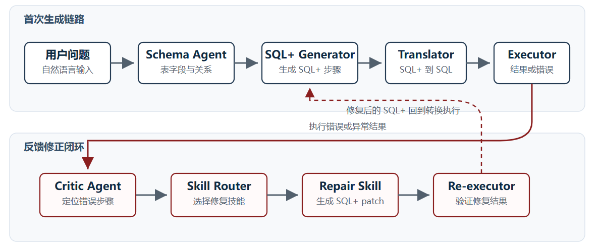
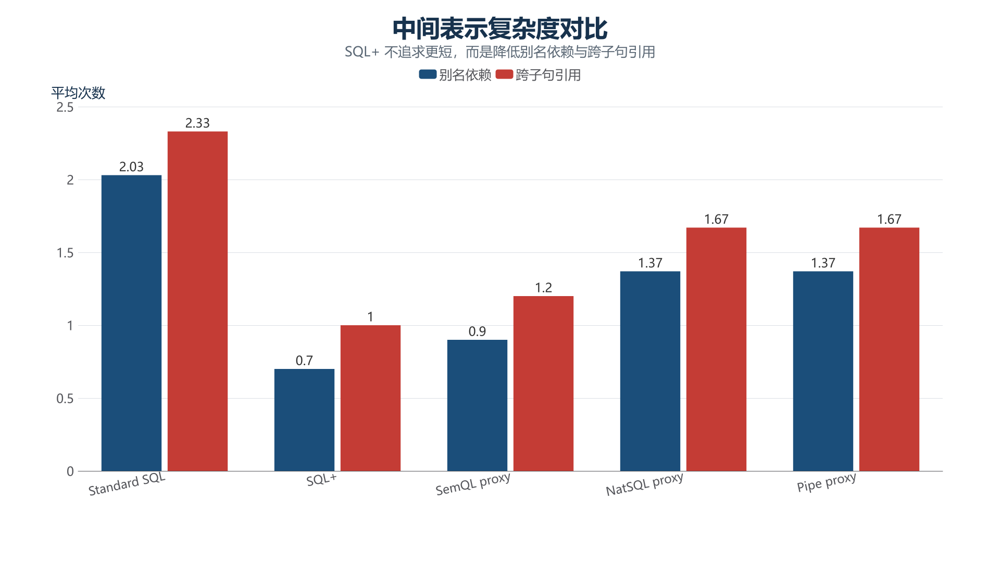

# opening_defense_20260712_fixed

- Source: `opening_defense_20260712_fixed.pptx`
- Total slides: 16

## Slide 1

面向数据库 AI 算子的模型服务感知批处理执行与写回协同优化研究

硕士论文开题汇报
汇报人：艾筠舜 导师：待补充 时间：2026.7

开题汇报 | Database AI Operators / GPU-backed Model Service / Ray / Writeback | 1

### Speaker Notes

- 汇报讲稿：本次开题关注数据库 AI 算子触发后的批处理执行过程，重点不是单个模型 kernel，也不是改造完整 Ray，而是数据库数据进入外部 worker、模型服务和写回阶段后的端到端系统问题。
- 答辩备注：如果被问题目是否过大，强调固定在 PostgreSQL、Arrow batch、Python/Ray task/actor、GPU-backed endpoint 和 writeback 这条可控链路上。

## Slide 2

汇报结构

1

2

3

研究背景

问题定义

研究内容

数据库 AI 算子为什么带来新的执行链路

研究对象、边界与关键难点

调度、写回、策略边界三个闭环

计划

技术路线

4

5

6

实验依据

GPU-backed AI_EMBED 画像与动机测试

后续实验、评价指标和消融设计

进度安排、边界控制和预期成果

开题汇报 | 数据库 AI 算子执行链路优化 | 2

### Speaker Notes

- 汇报讲稿：汇报按问题驱动展开：先说明数据库 AI 算子为什么带来新的执行问题，再说明研究边界、研究内容、已有实验依据和后续计划。
- 答辩备注：目录页不要讲过细，重点让老师看到不是工程任务清单，而是问题、方法、评价和边界的闭环。

## Slide 3

问题定义：AI 算子把 SQL 执行扩展到模型服务与写回

PostgreSQL
表数据读取

Arrow / batch
外部 worker

GPU-backed
model service

>

>

| 阶段 | 变量 | 关注点 |
| --- | --- | --- |
| DB / Arrow | rows, batch | 数据进入外部执行前的成本 |
| Task / Actor | tasks, objects | 并行调度何时有效 |
| Model service | endpoint, queue | 请求粒度与队列压力 |
| Writeback | fan-in, sink | 写回是否限制收益 |

关键：batch、endpoint queue、fan-in 与 writeback 共同决定 E2E

开题汇报 | 数据库 AI 算子执行链路优化 | 3

### Speaker Notes

- 汇报讲稿：这一页先把研究对象收紧成一条可测链路：PostgreSQL 读数据，构造 Arrow 和 batch，交给 Python 或 Ray 执行，调用 GPU-backed 模型服务，最后汇聚并写回。
- 答辩备注：不要说成研究外部链路这个口语词，正式说法是数据库 AI 算子的批处理执行、模型服务调用和写回协同。

## Slide 4

相关系统提供场景，但缺少可拆分的端到端阶段画像

| 类别 | 代表系统 | 已提供能力 | 本课题关注 |
| --- | --- | --- | --- |
| AI SQL | Snowflake / BigQuery / Oracle | SQL 内调用 AI 函数 | 内部阶段成本通常不可见 |
| PostgreSQL AI | pgvector / pgai / PostgresML | 向量存储、worker、近数据库模型 | 需要端到端阶段画像 |
| 执行框架 | Ray / Daft | task、actor、partition、batch | 验证调度适用条件 |
| AI 数据存储 | Arrow / Lance | 列式与向量数据表示 | 分析写回与持久化代价 |
| 研究空缺 | 可控实验链路 | DB + worker + model + sink | 统一评价调度与写回 |

研究空缺在于：托管 AI SQL 系统证明场景真实，但阶段成本通常不可见。

开题汇报 | 数据库 AI 算子执行链路优化 | 4

### Speaker Notes

- 汇报讲稿：现有系统提供了场景依据和机制依据，但很多托管 AI SQL 系统内部不可见，不能直接拿来做阶段画像。PostgreSQL 生态和 Ray/Daft/Lance 说明这条路线有落地对象，但本课题不等于做某个产品集成。
- 答辩备注：如果老师问相关工作是否充分，后续还会补 CCF-A 系统论文和官方文档引用；当前 PPT 先讲研究空缺。

## Slide 5

总体框架：三类 AI 算子共享一套可观测执行过程

三类 AI 算子 -> PostgreSQL fetch -> Arrow/batch -> task/actor -> GPU-backed model service -> fan-in -> writeback

开题汇报 | 数据库 AI 算子执行链路优化 | 5

### Speaker Notes

- 汇报讲稿：总体框架是三类数据库 AI 算子共享同一条可观测执行过程，再围绕模型服务感知调度、写回协同和多类算子策略边界展开。这样研究内容不是任务清单，而是围绕可检验问题组织。
- 答辩备注：图中如果现场需要解释，强调 AI_EMBED 只是第一条真实闭环，后续会扩展到 AI predicate 和 AI_COMPLETE。

## Slide 6

研究内容：围绕难点、方法和评价形成三个闭环

| 研究内容 | 为什么难 | 方法 | 评价 |
| --- | --- | --- | --- |
| 批处理执行调度 | batch、endpoint、in-flight 相互影响 | 联合选择 batch / routing / backpressure | Python/Ray 与 endpoint 消融 |
| 写回协同 | writeback 可能限制端到端收益 | 比较 driver / worker / queue worker | writeback_s、e2e_s、一致性 |
| 策略边界 | embedding 经验不能直接外推 | 覆盖三类 AI 算子 | rows/s、tokens/s、queue wait |
| 共同基础 | 阶段成本需要可测 | 统一阶段画像 | 消融与对照实验 |
| 边界控制 | 避免题目发散 | 不做 GPU kernel / 完整 Ray 改造 | 明确不能声称的结论 |
| 输出 | 形成可复现实验链路 | 脚本、CSV、图表、论文方法 | 结果可追溯 |

开题汇报 | 数据库 AI 算子执行链路优化 | 6

### Speaker Notes

- 汇报讲稿：研究内容分成三个可合并的大方向：模型服务感知调度、写回协同、多类算子策略边界。每个方向都回答为什么难、怎么做、怎么评价。
- 答辩备注：如果被问为什么没有把阶段画像作为研究内容，回答阶段画像是动机测试和评价基础，不是最终研究贡献本身。

## Slide 7

实验依据：batch、routing 与 writeback

开题汇报 | 数据库 AI 算子执行链路优化 | 7

### Speaker Notes

- 汇报讲稿：下面进入实验依据。这里要主动说明实验不是证明课题已经完成，而是证明问题真实、链路可测、后续优化点可展开。
- 答辩备注：强调真实 GPU-backed 证据优先于 fake/CPU 预研，fake/CPU 只解释变量来源。

## Slide 8

实验设置：真实 GPU-backed AI_EMBED 端到端画像

| 环节 | 当前设置 | 记录指标 |
| --- | --- | --- |
| 数据库 | PostgreSQL 18.4 local rehearsal | db_fetch_s / writeback_s |
| 中间表示 | Arrow / batch | arrow_build_s / calls |
| 执行器 | Python / Ray task / actor | operator_wall_s / fanin_s |
| 模型服务 | CUDA embedding endpoint | model_request_wall_s / bounded_wait_s |

实验链路覆盖数据库读取、batch 构造、外部执行、CUDA 模型服务、fan-in 和 PostgreSQL 写回。

开题汇报 | 数据库 AI 算子执行链路优化 | 8

### Speaker Notes

- 汇报讲稿：当前最重要的是已经有一条真实 GPU-backed AI_EMBED 闭环：本地 PostgreSQL 18.4、Arrow/batch、Python/Ray、CUDA endpoint、fan-in、writeback。它用于开题阶段动机和方法验证，不代表 PostgreSQL 18.3 内部平台最终性能。
- 答辩备注：答辩时要主动说明当前写回是 JSON text，后续会补 384 维 pgvector 写回。

## Slide 9

结果 1：逐行 endpoint 调用比 batch 调用慢约 13.4x

| Rows | Strategy | Calls | e2e_s |
| --- | --- | --- | --- |
| 1024 | coalesced | 4 | 0.888 |
| 1024 | fine | 1024 | 11.925 |
| ratio | fine / coalesced | - | 13.4x |
| 边界 | 当前 AI_EMBED endpoint | - | 非 kernel 结论 |

1024 行真实 GPU-backed AI_EMBED 中，调用粒度是必须控制的一阶成本。

开题汇报 | 数据库 AI 算子执行链路优化 | 9

### Speaker Notes

- 汇报讲稿：1024 行时，fine 逐行调用发起 1024 次 endpoint 请求，coalesced 只有 4 次请求，端到端耗时从 0.888 秒变成 11.925 秒。这个结果说明调用粒度本身就是系统成本。
- 答辩备注：不能解释成 GPU 更快或 kernel 优化；收益来自调用粒度和外部 operator 阶段，而不是模型内部优化。

## Slide 10

结果 2：Ray 的价值边界来自多 endpoint routing

| 场景 | e2e_s | 含义 |
| --- | --- | --- |
| 4096 单 endpoint | 3.29-3.36 | Python / Ray 接近 |
| 4096 双 endpoint Python | 3.444 | 顺序 routing |
| 4096 双 endpoint Ray task | 2.761 | operator 降低 |
| 4096 双 endpoint Ray actor | 2.780 | 与 task 接近 |

Ray 是调度 substrate 和对照对象，不能被写成论文主问题本身。

开题汇报 | 数据库 AI 算子执行链路优化 | 10

### Speaker Notes

- 汇报讲稿：单 endpoint 下 Python、Ray task 和 Ray actor 接近，所以不能把 Ray 作为天然加速器。双 endpoint 下 Ray 通过并发 routing 降低 operator wall time，但端到端收益仍受 writeback 限制。
- 答辩备注：如果被问为什么还用 Ray，回答 Ray 是后续多 endpoint、bounded in-flight、actor pool 和 worker writeback 的可控实验 substrate。

## Slide 11

结果 3：writeback 已经足以限制端到端收益

| Rows | Endpoints | operator | writeback |
| --- | --- | --- | --- |
| 16384 | 1 | 6.473 | 6.586 |
| 16384 | 2 | 4.628 | 6.363 |
| 后续 | pgvector(384) | 待补 | 待补 |
| 后续 | worker / queue writeback | 待补 | 待补 |
| 边界 | 当前 JSON text | 非 pgvector 结论 | 需复测 |

只优化模型服务调用不够，写回路径必须和调度一起评价。

开题汇报 | 数据库 AI 算子执行链路优化 | 11

### Speaker Notes

- 汇报讲稿：16K 行时 operator wall time 是 6.473 秒，writeback 是 6.586 秒，两个阶段都接近端到端的一半。双 endpoint 后 operator 降低到 4.628 秒，但 writeback 仍有 6.363 秒。
- 答辩备注：当前写回是 JSON text，不代表 pgvector(384)。因此它是写回问题的动机，不是最终写回性能结论。

## Slide 12

可行性分析：证据分层与边界

真实链路

核心发现

历史预研

GPU-backed AI_EMBED 已跑通

batch / routing / writeback 均影响 E2E

fake/CPU 用于变量设计

环境验证

明确边界

下一步

PG18.4 + pgvector 可连接

非 PG18.3 / 非 pgvector(384)

补写回、反压、多 workload

开题汇报 | 数据库 AI 算子执行链路优化 | 12

### Speaker Notes

- 汇报讲稿：这一页把证据等级讲清楚：真实 GPU-backed 画像是当前主证据；PG18.4 连接验证只说明环境可用；fake/CPU 预研只说明变量设计依据。
- 答辩备注：这是回应前面担心 opening 与项目割裂的问题：开题材料必须回到 motivation/results 和项目总纲，而不是让 feasibility 目录承担大纲职责。

## Slide 13

评价设计：用阶段指标和消融证明优化是否有效

| 研究问题 | 主要指标 | 证明目标 |
| --- | --- | --- |
| 批处理调度 | e2e_s / operator / queue | 调度何时有效 |
| 写回协同 | writeback_s / 一致性 | 写回是否限制收益 |
| 策略边界 | rows/s / tokens/s / GPU | 策略是否可迁移 |
| 消融 | 阶段占比变化 | 定位收益来源 |
| 边界 | 结论适用范围 | 避免过度声称 |

端到端指标：e2e_s / rows/s / tokens/s

阶段指标：operator / queue / fan-in / writeback

消融对象：batch / routing / in-flight / writeback

开题汇报 | 数据库 AI 算子执行链路优化 | 13

### Speaker Notes

- 汇报讲稿：评价不只看端到端耗时，还要看阶段耗时、queue wait、bounded wait、writeback、tokens/s、GPU utilization 和消融。这样后续可以判断收益来自哪里，而不是只给一个总时间。
- 答辩备注：如果被问实验是否够学术，强调有对照组、消融、指标和适用边界。

## Slide 14

进度安排：先闭环消融，再扩展 workload

| 时间 | 重点工作 | 输出 |
| --- | --- | --- |
| 2026.07-08 | AI_EMBED 闭环与消融 | pgvector / writeback / in-flight 结果 |
| 2026.09-10 | 扩展 predicate 与 LLM workload | selectivity / token / queue 结果 |
| 2026.11-12+ | 统一方法与论文整理 | baseline、消融、图表、正文 |

2026.07

2026.08

2026.09

10月

开题材料、GPU-backed 动机结果、pgvector(384) 设计

AI_EMBED 大块消融、worker writeback、bounded in-flight

AI_FILTER / AI_CLASSIFY selectivity-aware 实验

AI_COMPLETE token / prefix / queue-aware 实验

2026.11

开题汇报 | 数据库 AI 算子执行链路优化 | 14

### Speaker Notes

- 汇报讲稿：后续计划按先闭环、再消融、再扩展 workload 的顺序推进。每个阶段都有可以被证伪的实验目标，避免只朝一个预设结论跑。
- 答辩备注：如果学校或导师节点不同，时间可以调整；当前重点是顺序和依赖关系。

## Slide 15

预期创新点：调度、写回与策略边界

批处理执行调度

写回协同优化

比较 driver、worker、queue worker 与不同 sink。

结合算子特征、endpoint 状态和 in-flight 控制选择执行策略。

多类算子策略边界

可观测实验链路

保留脚本、CSV、阶段指标和消融结果，保证结论可追溯。

比较三类 AI 算子的适用条件与失效边界。

开题汇报 | 数据库 AI 算子执行链路优化 | 15

### Speaker Notes

- 汇报讲稿：预期创新点和三个研究内容一一对应：调度方法、写回协同、策略边界。强调都是预期创新点，还需要后续实验验证。
- 答辩备注：不要说已经证明了系统最终性能，只说已经有初步阶段画像支撑后续研究。

## Slide 16

主要参考资料与本地实验报告

- Ray: A Distributed Framework for Emerging AI Applications, OSDI 2018
- Spark: Cluster Computing with Working Sets, HotCloud 2010
- Snowflake Cortex AISQL / Ray Core Objects / Ray Serve Dynamic Request Batching / Daft Distributed Execution / pgvector / pgai documentation
- 本项目实验报告：GPU-Backed AI_EMBED Chain Breakdown, 2026-07-12
- 本项目实验报告：Multi-Endpoint Ray Motivation Test, 2026-07-12

开题汇报 | 数据库 AI 算子执行链路优化 | 16

### Speaker Notes

- 汇报讲稿：最后总结三点：场景真实、问题明确、初步证据成立；后续围绕模型服务感知调度和写回协同继续补实验。
- 答辩备注：答辩时优先回到阶段画像和结论边界。参考文献页只列最关键来源，完整列表在开题报告和 reading list 里维护。
