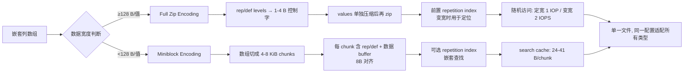

# 精读笔记：Lance — Efficient Random Access in Columnar Storage through Adaptive Structural Encodings (arXiv 2025)

---

## ▎第一层 · 基本信息

| 字段 | 内容 |
|------|------|
| **论文** | Weston Pace, Chang She, Lei Xu, Will Jones, Albert Lockett, Jun Wang, Raunak Shah. *Lance: Efficient Random Access in Columnar Storage through Adaptive Structural Encodings.* arXiv:2504.15247v1 [cs.DB], 21 Apr 2025. (LanceDB 团队；部分作者 affiliated with Clark University, UIUC) |
| **来源级别** | arXiv 预印本（工业轨，LanceDB 自家格式论文）；CC BY-NC-ND 4.0 License。尚未在 CCF-A 会议/期刊发表（截至 2026-07-23）。 |
| **链接** | arXiv: https://arxiv.org/abs/2504.15247 / 本地 PDF：`research/reference/lance_2025.pdf` / Lance v2 博客：https://blog.lancedb.com/lance-v2/ |
| **阅读日期** | 2026-07-23 |
| **状态** | 精读完成 |
| **相关论文组** | AI 数据存储（列式存储、随机访问）/ Arrow / Parquet / ORC / 数据湖与 Lakehouse |

### 一句话核心结论

Lance 把列式存储的"结构编码（structural encoding）"从隐式设计提升为显式、可配置的策略层，并提出**自适应结构编码**：对大尺度类型（≥128 B/值，如向量、图像、长文本）用 *full zip* 把所有 buffer 按值交错成单 buffer（随机访问 ≤2 IOPS、无需 search cache），对小尺度类型用 *miniblock* 分块（4–8 KiB/chunk，search cache 仅 24 B/chunk）；在 NVMe 上既能匹配或超过 Parquet 的全扫描性能，又能避免 Parquet 在大类型上"page offset index RAM 爆炸"（20 GiB / 10 亿行）的硬伤。

`#columnar-storage` `#random-access` `#structural-encoding` `#NVMe` `#AI-workload` `#lance-format`

---

## ▎第二层 · 论文结构分析

### 1. 问题拆解

| 问题 | 论文的回答 |
|------|-----------|
| 要解决什么痛点？ | AI/ML 工作负载（向量搜索、RAG、语义检索、多模态推理数据准备）同时需要**顺序扫描**和**随机访问**。云存储 IOPS 受限（S3 几万）；NVMe 虽可达数十万 IOPS，但现有列式格式（Parquet/ORC/Arrow IPC）未能充分利用——尤其在嵌套/多 buffer 类型上，单次随机访问要发多次 IOP，或要巨大 page offset index。§1 |
| 之前的方法为什么不够？ | (1) **Parquet**：page offset index 在大类型（如 768 维 float 向量）上 RAM 占用过大——parquet-rs 的 in-memory 偏移索引 20 B/page，10 亿行需 20 GiB search cache（§4.2.4）。(2) **Arrow IPC**：对嵌套/变宽类型每个值要多次 IOP——`List<String>` 含 null 时单值 5 IOPS，分 3 阶段（§3.2 Fig 4）。(3) 在内存里保留副本（§1 [27]）昂贵；NVMe 缓存层（WekaFS/JuiceFS）出现后，需要重新评估文件格式。 |
| 论文的**核心论点** | 列式存储的随机访问性能瓶颈不在压缩算法本身，而在**结构编码（structural encoding）**——即"如何把嵌套数组拆成 leaf buffer、把 repetition/validity 信息放在哪里"。把结构编码从格式隐式选择提升为显式、可切换、可配置的策略层，就能在不同数据宽度下都接近 NVMe 极限。§3 引言段 |
| 它的**关键假设** | (1) NVMe（或本地缓存层）是真实部署形态；云端 S3 仍需 NVMe 缓存（§1）。(2) search cache（小到 0.1% 数据量的元数据）在 warm 搜索时已在内存——真实搜索场景成立（§2.3）。(3) AI workload 的随机访问模式独立于聚集索引（secondary index 与行序不相关）——这使 coalesced access 在 10 亿行规模下几乎不发生（§5.4 Fig 9）。 |

### 2. 方法拆解

**核心技术要点**：

1. **两阶段编码模型（§3 引言）**：作者把列式编码显式拆成两阶段——**structural encoding**（嵌套数组 → leaf buffers，即 shredding）+ **compressive encoding**（leaf buffers → 最小字节表示）。论文的贡献在前者；后者用现成方案（FSST、bit packing、dictionary、LZ4、ALP、FastLanes）。**意义**：把过去"格式即结构编码"的隐式决定，变成一个可讨论、可切换的设计维度。

2. **Full Zip Encoding（§4.1，面向大类型）**：把一个 primitive leaf 列的 *所有* buffer（repetition levels、definition levels、数据 buffer）按值顺序交错（"zip"）成单个 buffer。每个值前放 1–4 字节 *control word*（bit-packed rep/def levels，Struct<List<String>> 需 3 bit def + 1 bit rep = 1 B 控制字）。定宽类型 zip 后仍定宽 → **1 IOP 随机访问**。变宽类型用额外的 **repetition index**（buffer 偏移数组，前置）→ **2 IOPS 随机访问**（先查 index 再取值），且与嵌套深度无关。对 4 KiB 的 null 向量必须填 4 KiB filler 以保持定宽映射。**关键**：values 先压缩再 zip，因此 compressive encoding 必须 *transparent*（无值间依赖，如 FSST/bit-packing/per-value LZ4）。

3. **Miniblock Encoding（§4.2，面向小类型）**：把数组切成 ~4–8 KiB/chunk（1–2 个磁盘扇区），每 chunk 内放 rep/def levels + 数据 buffers（不 zip，保持向量化）。chunk 限制 ≤4096 值、8 字节对齐、2 字节元数据（12 bit 记 8 字节字数 + 4 bit 记 log2 值数）。search cache 仅 **24 B/chunk（无 rep index）/ 41 B/chunk（有 rep index）**——10 亿行最多 1.28 GiB，远低于 Parquet 大类型场景的 20 GiB。允许 opaque compression（chunk 内整段解压），代价是单值访问有 read/compute amplification。

4. **自适应切换阈值（§4.1 引言）**：128 B/值是 full zip 与 miniblock 的切换点，由实验测得。论文承认这是 heuristic，未来可针对不同存储介质（内存 / NVMe 阵列 / S3）调整阈值（§8）。这是论文标题 *Adaptive Structural Encodings* 的直接体现——但注意它是**静态宽度阈值触发**的自适应，不是运行时动态策略。

5. **Struct Packing（§4.3）**：可选地把整个 struct 当一列存（而非拆成多个 leaf 列）。收益：取整个 struct 时减少 IOPS（多字段一次拿）；代价：单字段扫描要读全 struct 再丢弃。极端情况下可把整个 record 打包成行存——作者指出 Arrow-native 引擎（如 DataFusion）在 out-of-core sort/hash-join 时缺乏标准行存格式，struct packing 可填补这一空白（§4.3 末段、§8）。

6. **Coalesced Access 的现实校准（§5.4 Fig 9）**：论文明确警示——合并访问（相邻行落在同一 8 KiB 页 / 同一系统调用）的好处**在 benchmark 中被高估，在生产中很罕见**。10 万次随机抽样中，当数据集到 10 亿行时，即使最小标量也很少重叠。论文因此在所有随机访问实验中用 10 亿行（小类型）+ 随机数据，主动抑制 coalescing 收益，以贴近真实搜索负载。

### 3. 实验拆解

| 维度 | 内容 |
|------|------|
| **数据集（§6.2 表）** | 7 个真实场景：US baby names、LLM training prompts、TPC-H ship date、Amazon reviews、source code、compressed images、CLIP image embeddings、HTML websites。随机数据用于随机访问实验（10% null）。 |
| **Baseline** | (1) **Parquet**（parquet-rs v54，论文称其为最可调、最快的主流实现）；(2) **Arrow IPC**（用 Lance v2.0 代理测试其结构编码，因为原生 Arrow IPC API 随机访问性能太差）；(3) NVMe 磁盘基准（非格式对比）。ORC/Nimble/Vortex 仅在 §1/§2 提及未实测。 |
| **评价指标** | **随机访问**：rows/s（每次 take 256 随机索引，10 秒平均）；**全扫描**：compressed disk throughput（MiB/s）+ iterations/s（避免偏向轻压缩）；**压缩**：compression ratio；**search cache**：每 chunk 字节 + 10 亿行总 RAM。**missing 指标**：无 tail latency（p99）、无 token throughput（这是存储论文，非推理论文）、无 S3 实测（仅推论）、无端到端 query latency。 |
| **消融实验** | ✅ page size × row group size（Parquet，§6.1.1/§6.3.1，扫描 8/32/64/256 KiB × 1K/10K/100K/1M）；✅ 嵌套深度（§6.1.2 第二图，Arrow 风格 vs Lance）；✅ 数据宽度对 full zip vs miniblock 的影响（§6.1.3 Fig 12）；✅ struct packing 字段数（§6.4 Fig 18，2/3/4/5 字段）；✅ full zip vs miniblock 的全扫描 CPU 开销（§6.3.2 Fig 17）。 |
| **统计显著性** | 🟡 **仅均值**，未报告方差/置信区间。多配置测试中只报"最佳组合"。 |
| **复现条件** | 🟡 部分。硬件明确（Samsung 970 EVO Plus 2TB + i7-10700K，峰值 850K IOPS @ 4KiB，3.4 GiB/s）。脚本称"provided to reproduce"，但论文未给 GitHub 链接。Lance v2.1 当时标注为 *experimental*。 |

### 4. 关键数字

| Claim | 数字 | 条件（什么设置下） |
|-------|------|-------------------|
| Parquet 配置调优后的随机访问提升 | **>60×**（5,500 rows/s → 350,000 rows/s） | parquet-rs 默认 vs 调优后，小标量随机访问（§5 引言） |
| Parquet 大类型 search cache 占用 | **20 GiB / 10 亿行** | parquet-rs page offset index 20 B/page，每值一页（§4.2.4） |
| Lance miniblock search cache | **24 B/chunk（无 rep index）/ 41 B/chunk（有）**；10 亿行最多 **1.28 GiB** | Lance v2.1（§4.2.4） |
| Lance 自适应切换阈值 | **128 B/值** | full zip（大类型）vs miniblock（小类型）（§4.1） |
| NVMe 峰值性能 | **850K random reads/s @ 4 KiB**；**3,400 MiB/s** 顺序 | Samsung 970 EVO Plus 2TB（§5 引言） |
| 最优 page size | **8 KiB**（一类例外：embeddings 0.997） | NVMe 上对随机访问和全扫描同时最优（§6.3.1） |
| Arrow 结构编码 List<String> 单值开销 | **5 IOPS，分 3 阶段** | List<String> 含 null（§3.2 Fig 4） |
| Compression 对 Parquet 随机访问的影响 | 88% ideal（compression on）；**2% ideal（dictionary on）** | 随机数据本不应被字典编码（§6.1.1） |

---

## ▎第三层 · 批判性评估

### 1. 假设检验

- **假设 1**：AI/search 工作负载的随机访问"独立于聚集索引"（即 secondary index 与行序不相关）。
  - 反例 / 边界：若数据按检索 key 聚簇存储（如时间序、hash 分桶），或使用了predicate caching（论文 §1 [27]），coalesced access 会显著回潮。论文的"coalescing 在 10 亿行下消失"结论只对**无聚簇 + 均匀随机**的取数成立。生产中范围扫描、近邻块取数仍可能受益于聚簇。
- **假设 2**：search cache 在 warm 状态（已驻内存），加载成本被大量搜索摊薄（§2.3）。
  - 反例 / 边界：冷启动、缓存淘汰、多租户环境下缓存争用时，20 GiB（Parquet）或 1.28 GiB（Lance）的 search cache 首次加载时延会被放大——论文未测冷启动场景。
- **假设 3**：128 B/值是普适切换阈值。
  - 反例 / 边界：论文自己承认这是 heuristic、基于某次实验测量（§4.1），且未来工作要针对"内存 / NVMe 阵列 / S3"分别调（§8）。对 768 维 float32 向量（3 KiB）和 image bytes（20 KiB）显然在 full zip 一侧；对 64-bit scalar（8 B）在 miniblock 一侧——但中间地带（如短字符串、128–512 B 的中等变宽）未做敏感性分析。
- **假设 4**：parquet-rs 能代表 Parquet 格式本身的能力（§5.2）。
  - 反例 / 边界：论文坦承主流 Parquet 库"random access API 不足"，格式潜能与用户实际体验存在差距（§5 引言）。但 parquet-rs 仍是 Rust 生态最优实现；C++/Java Parquet 的随机访问性能未测，跨语言不可直接外推。

### 2. 边界探查

- **方法适用边界**：Lance 的优势集中在"**既要全扫描又要随机访问的混合 workload + 嵌套/多模态数据**"。纯 OLAP 全扫描 workload（如 TPC-H）上，Parquet 的成熟实现 + 生态仍是默认选择——论文 §6.3.1 承认 Parquet 在多数类别全扫描仍可用（只是未充分利用磁盘）。纯内存随机访问 workload 上，Arrow IPC 已足够，Lance 优势缩小。
- **扩展性限制**：(1) miniblock chunk 的"幂二约束 + 8 字节对齐 + ≤4096 值"在高度可压缩数据上会强制多余 chunk，增加 metadata（论文 §4.2.1 自承）。(2) 多列场景下"为每列选 chunk size"被论文明确称为"quite difficult"（§4.2.1），留作未来工作——这对 schema 列数极多的 ML 表（论文引言提到"tens of thousands of columns"）是潜在瓶颈。(3) Lance v2.1 当前只支持"单层 list lookup"（§4.2.3 末段），多层嵌套查找尚未实现。
- **复现难度**：🟡 中。Lance Rust crate 公开（lance crate on crates.io），数据集多为公开（LAION-5B CLIP embedding、Amazon reviews、TPC-H、Common Crawl、baby names）。但 v2.1 在论文撰写时为 *experimental*；随机访问 benchmark 脚本论文未直接给链接；自测硬件（NVMe + i7-10700K）与生产 SSD/云环境差异较大。

### 3. 可信度评估

| 维度 | 评价 | 依据 |
|------|------|------|
| 实验公平性 | 🟡 有疑点 | 作者即 Lance 格式的设计者，baseline 选 parquet-rs（最强 Parquet 实现）是诚实的；Arrow IPC 随机访问性能"太差以致无法直接测"用 Lance v2.0 代测是合理 workaround，但本质上仍是自比。所有数字均出自作者自己环境，无第三方复现。 |
| 结果显著性 | 🟢 显著（定性）/ 🟡 一般（定量） | 定性结论（"结构编码是关键"、"Parquet 大类型 search cache 爆炸"）有清晰机制支撑；定量结果未报方差、未做显著性检验，部分图（Fig 10/11/14/16）归一化后展示。 |
| 开源/可复现 | 🟡 部分 | 格式 spec 和 lance crate 开源；但 v2.1 当时 experimental，benchmark 脚本未明确链接。 |
| 论文自身局限 | 🟢 较诚实 | 明确承认 miniblock 在 scalar 上略低于 Lance v2.0（§6.1.3）、LZ4 解压在部分场景 CPU-bound（§6.3.2）、chunk size 多列选择是 open problem（§4.2.1）、Lance 2.1 仅支持单层 list lookup（§4.2.3）。 |

### 4. 与同行工作的对比

- 比 **Apache Parquet**（[12]）：Lance 的 full zip 解决 Parquet 在大类型上 page offset index 过大的硬伤；miniblock 用更紧凑的 chunk metadata（2 B vs 20 B）降低 search cache。代价：Lance 是新格式、生态薄，且 v2.1 仍 experimental；Parquet 仍是事实标准。
- 比 **Apache Arrow IPC**（[13]）：Arrow 强在 in-memory 零拷贝，但结构编码对 disk/cloud 不友好（每嵌套层多一次 IOP）。Lance v2.0 实际上接近 Arrow 风格编码；Lance v2.1 的 full zip 是对 Arrow 弱点的直接修复。
- 比 **BtrBlocks**（[17], VLDB 2023）：BtrBlocks 做的是 *compressive encoding* 的级联，Lance 明确说自己不发明新压缩，只做 *structural encoding* 层——两者正交，理论上可叠加。
- 比 **Bullion**（[21], CIDR 2025）：Bullion 是面向 ML 的列存，动机相近（ML workload、嵌套、多模态）；Lance 是格式论文，Bullion 是系统论文。两者是同类问题的不同切入点。
- 比 **Rottnest**（[31], 2025）：Rottnest 做数据湖的索引层（来自同一作者圈），论文中与 Lance 互补——Rottnest 负责索引、Lance 负责底层数据格式。
- 在 **[本课题]** 的坐标系中：Lance 属于**数据引擎层**的存储格式基座。课题栈是 PostgreSQL → Daft → Ray → vLLM，其中 **Daft 原生使用 Lance 作为底层列式格式**——所以 Lance 的随机访问 / 全扫描成本曲线，直接决定 Daft pipeline 读取数据阶段的下界成本。Lance 不做调度、不做 batching、不做推理，只决定"数据出库到 Daft 的成本长什么样"。

---

## ▎第四层 · 与你课题的连接

### 1. 可引用的观点（配精确位置）

> §1 Introduction: AI 工作负载"require both sequential and random access"，且"search workflows typically need to fetch small subsets of results that are not aligned along a primary (i.e. clustered) index and, as a result, they require large amounts of random access I/O operations (IOPS)"。
> → **本课题动机的直接证据**。当数据库 AI 算子（AI_COMPLETE/AI_EMBED/AI_CLASSIFY）的输入不是全表扫描而是基于二级索引/向量检索的子集时，数据出库阶段就是随机访问密集型——这决定了"上游数据组织"策略（课题研究内容一）不能假设数据是顺序流。

> §3 引言段："There has been less discussion on structural encoding techniques. These are often implicitly defined by the file format and not explored thoroughly or well understood. We have found structural encoding to be crucial to achieving effective random access."
> → **为本课题的"分层显式化"设计哲学提供同学术支撑**。Lance 把格式中隐式的结构编码显式化为可配置层；课题把 pipeline 中隐式的 batching/concurrency 决策显式化为可调度的策略层（token-budget / K_max / queue-adaptive flush）。两者方法论同源：把过去"工程默认值"提升为"可研究、可对比、可消融"的设计维度。

> §4 开篇：Lance 的设计目标——"At most 1 IOP for random access to a fixed-width column / At most 2 IOPS for random access to a variable-width column / Performance should be consistent regardless of how many levels of nesting... / Full scan performance should be comparable with Parquet"。
> → **可借鉴的"性能契约"写法**。课题在描述 token-budget / K_max 策略时，可类比给出"性能契约"：如"at most N tokens per batch"、"K_max 收敛于服务容量"、"性能不依赖于输入 token 长度分布"——这种 measurable contract 比模糊的"自适应优化"更适合论文表述。

> §4.2.4：Parquet 大类型 search cache 需 20 GiB/10 亿行；Lance miniblock 把 search cache 压到 1.28 GiB/10 亿行。
> → **本课题 BatchRequest 抽象的对照**。课题在 `code/` 里通过 `BatchRequest` 元数据（`prompt_tokens_sum`、`row_count`、`prefix_key`）实现策略层与引擎层解耦——这正是 Lance 思想的镜像：Lance 用小 search cache 解耦"数据在哪"与"数据本身"；课题用小 BatchRequest 元数据解耦"调度决策"与"数据载荷"。两者都是"小元数据驱动大流量"的设计模式。

> §5.4 Fig 9：coalesced access 在 10 亿行规模下"unlikely to see benefits even for very small scalars"。
> → **课题的重要校准**。当数据规模大、访问模式随机时，不能依赖"行邻近"做隐式 batching——必须显式按计算量组织（token-budget / frame-budget）。这印证了研究内容一"数据组织策略"的必要性：在大规模 AI workload 下，显式 batching 不是"锦上添花"，而是"必需"。

> §6.3.1："8KB pages are ideally suited for both random access and full scan performance against NVMe."
> → **存储层存在"双优最优点"**。Lance 在 8 KiB page 上找到随机访问与全扫描的同时最优点。课题的联合调优实验（独立拼接 vs 联合 grid search）正是检验"研究内容一 + 研究内容二"是否存在类似的双优区间——若存在则分层独立调优即可，若不存在则需联合调优。Lance 的经验倾向于"存在双优区间"。

### 2. 不能过度引用的地方

- ❌ **不声称** "Lance 解决了 batching / 调度 / 推理优化问题"——它纯粹是存储格式论文，不涉及请求组织、actor 调度、vLLM 提交节奏。课题的核心贡献（上游调度）与 Lance 正交。
- ❌ **不声称** "Lance 的 adaptive encoding 是运行时自适应策略"——它是**编译期/写入期**基于宽度阈值的静态切换，与课题研究的 *动态、queue-aware、online* 调度策略不是同一意义上的"adaptive"。引用时必须区分 "format-level adaptive" vs "runtime adaptive"。
- ❌ **不声称** "Daft 必须用 Lance 格式"——Daft 支持读 Parquet/Arrow/CSV/Lance 多种格式。Lance 是可选项之一，不是课题技术栈的强制组件。课题的优化策略在 Parquet 数据上同样适用（只是底层 IOP 成本曲线不同）。
- ❌ **不声称** "Lance 的随机访问数字可直接搬到本课题的端到端延迟"——论文实验是纯存储 I/O，没有 Daft 解析、Ray 调度、vLLM 推理；课题的端到端成本由多个阶段构成，存储只是其中一环。
- ❌ **不声称** "Lance 论文的数字代表 Parquet 的真实上限"——论文自己说"there is a wide gap between what the format can achieve and what users typically use"（§5），这些数字是"配置最优后的潜力"，与生产默认配置差距巨大。
- ❌ **不声称** "Lance 已被同行评议"——截至 2026-07-23 这是 arXiv 预印本，工业轨，作者即格式设计者，需配合 LanceDB 官方文档（也是自家的）做交叉印证。

### 3. 对本课题的实际用途

| 用途类型 | 具体方式 | 优先级 |
|----------|----------|--------|
| ✅ 设计参考 | **两阶段解耦模式**：Lance 把 structural / compressive 显式分层；课题把 engine-level（Daft `into_batches`、`max_concurrency`）与 strategy-level（token-budget、K_max）分层。可在开题报告中引用作为"分层显式化"方法论的同类实践 | ⭐⭐ |
| ✅ 设计参考 | **性能契约写法**：借鉴 Lance §4 开篇的"at most N IOPS / performance consistent regardless of ..."格式，为课题策略写出可验证契约（如"token-budget 策略保证 batch token 总量 ≤ T，不依赖输入分布"） | ⭐⭐ |
| ✅ 对照区分 | 在开题 §3 技术路线图中明确："Lance 是 Daft 的底层存储格式，决定数据出库的 IOP 成本曲线；本课题的策略层运行在 Daft 之上，两者正交互补" | ⭐⭐⭐ |
| ⚠️ 动机证据 | §1 关于"AI workload 同时需要 sequential 和 random access"的论述可作课题动机的间接支撑（证明数据出库阶段成本不可忽视） | ⭐⭐ |
| ⚠️ Baseline | 不作为直接 baseline——它是存储格式，不是调度方案。但若做端到端实验，可对比"Daft+Lance vs Daft+Parquet"在数据读取阶段的成本，作为底层选择的依据 | ⭐ |
| ❌ 空白论证 | 不适用——Lance 没有覆盖调度空间，不能用于论证"调度问题未被解决" | – |

### 4. 不足 → 你的机会

| 论文的不足 / 未回答的问题 | 你的课题可能如何填补 |
|---------------------------|---------------------|
| Lance 只解决存储层数据组织，不感知推理服务状态——它的"自适应"是按数据宽度切换编码，**与模型服务队列、vLLM 容量、并发度无关** | 你的 K_max 自适应 / queue-adaptive flush 正是"感知下游服务状态"的组织策略，是 Lance 未触及的维度 |
| Lance 的随机访问性能是**静态**属性（写文件时编码就定了），运行时无法根据 workload 调整 | 你的 token-budget / length-align / prefix-aware 在运行时根据到达请求动态决定 batching，是 Lance 编码模式无法表达的组织维度 |
| Lance 的实验只测存储 I/O，**未连接到下游推理 pipeline**——不知道存储层的随机访问优化在端到端延迟中占多大比重 | 你的端到端 profile 实验（DB fetch → Arrow build → Ray → GPU → fan-in → sink）能直接量化存储在整体中的占比，给出 Lance 优化的真实端到端价值 |
| Lance 不区分请求模态（文本/图像/视频），只按字节宽度切编码 | 你的模态无关验证（token-budget → frame-budget，仅替换计数函数）是更上层的、与模态语义挂钩的组织策略 |
| Lance 的 struct packing 揭示了"行列权衡"，但仅作为存储内部选择 | 你的 batch organization 也有类似权衡（小 batch 低延迟 vs 大 batch 高吞吐），且权衡最优点随下游 vLLM 状态变化——是 Lance 没有的动态权衡维度 |

### 5. 可论文化的措辞

> 数据引擎层的列式存储格式（如 Lance [Pace et al., 2025]）已经通过自适应结构编码（adaptive structural encodings）把随机访问的 IOPS 成本压到接近 NVMe 上限，证明存储层的"数据如何组织"会显著影响上层 pipeline 的成本结构。然而，格式层的组织是写入时静态决定的，与推理服务的实时状态无关。本课题的研究内容正是在更高的抽象层做类似的"组织优化"：把 batching、提交节奏、并发控制从工程默认值提升为感知模型服务状态的动态策略。

> 与 Lance 在存储格式层把结构编码显式化的思路 [Pace et al., 2025] 类似，本课题在 pipeline 层把数据组织和提交控制从隐式工程默认值提升为显式可对比、可消融的策略层。两者方法论同源——把过去"格式/pipeline 中写死的决策"暴露为可研究的维度——但作用层次不同：Lance 优化数据在磁盘上的布局，本课题优化数据在 actor 间的组织与提交节奏。

> Lance 的经验 [Pace et al., 2025] 表明，在 NVMe 上存在使随机访问与全扫描同时接近峰值的配置区间（如 8 KiB page）。本课题的联合调优实验（研究内容一与二分别独立搜索最优配置后拼接，再与联合 grid search 对比）正是检验类似"双优区间"是否存在于 batching × 提交控制的配置空间——若存在，则分层独立优化即可；若不存在，则需联合调优。

### 6. 后续待读

- [ ] **Bullion: A Column Store for Machine Learning** (Liao et al., CIDR 2025, [21]) — 同方向（ML 列存）的系统论文，可对照 Lance 的格式视角
- [ ] **Rottnest: Indexing Data Lakes for Search** (Wang et al., 2025, [31]) — 同作者圈的数据湖索引层，与 Lance 互补
- [ ] **BtrBlocks** (Kuschewski et al., VLDB 2023, [17]) — compressive encoding 层的级联方法，与 Lance 的 structural encoding 正交
- [ ] **FastLanes** (Afroozeh & Boncz, PVLDB 2023, [2]) — 整数压缩 layout，Lance 引用为 compressive layer 的候选方案
- [ ] **Towards Functional Decomposition of Storage Formats** (Prammer et al., CIDR 2025, [26]) — 论文引用，支持"统计信息不应内嵌 page/row group"
- [ ] **An Empirical Evaluation of Columnar Storage Formats** (Zeng et al., PVLDB 2023, [32]) — 论文多次引用的列存对比基线
- [ ] **LanceDB 官方文档**（https://lancedb.github.io/lancedb/）— 配合预印本做交叉印证，特别是 Daft × Lance 集成 API

---

## 元反思

- **精读收益**：🟡 中。Lance 是存储格式论文，与本课题的核心贡献（上游调度）正交，不能作为主线文献。但它的方法论（两阶段显式分层、性能契约写法、把隐式默认值提升为可研究维度）对课题的设计哲学表述有直接参考价值；且作为 Daft 底层格式，理解它的成本曲线是量化"数据出库阶段占比"的前提。
- **是否纳入核心文献库**：是（边缘核心）——不进入开题主线论证，但需要在技术路线图和"数据引擎层成本"讨论中引用。
- **计划复习周期**：6 周后复习（或在做端到端 profile 实验时回查 §5.4 coalesced access 与 §6.1 随机访问数字）。
- **一句话笔记自评**：理解到位。核心把握住了"Lance 是格式层、本课题是调度层、两者正交但方法论同源"。关键风险已标注——不能借 Lance 的"adaptive"字眼暗示它做了运行时调度；不能把存储 I/O 数字直接搬到端到端延迟论证；引用时务必区分"format-level structural encoding"与"runtime batching strategy"。

---

## 相关笔记

- [[tpl-文献精读-深度版]] — 本模板
- [[文献地图]] — 文献全景
- [[ai_operator_literature_inventory]] — 完整文献清单
- [[daft_ray_multimodal_reference]] — Daft × Lance × Ray 多模态参考（项目内 research 文档）
