# 精读笔记：SABER — Adaptive Request Scheduling for CodeLLM Serving with SLA Guarantees (2025)

---

## ▎第一层 · 基本信息

> **⚠️ 术语澄清（两层抽象，不要混淆，更不要二选一）**
>
> 项目内部曾出现 "SABER 用的是 SLA 预测，不是 USL" 的说法——**这是对论文的误读**。论文原文（§IV.B Step 2）："We evaluate several modeling approaches and select the **Universal Scalability Law (USL)** [50] with the best R²"；§VII Fig 7 显式对比 `SABER-USL` / `SABER-Logistic` / `SABER-Linear` 三个变体。SABER 同时具备两层属性，描述时必须分层：
>
> - **系统层（论文标题/摘要口径）**：SABER 是 **SLA-aware admission control**。"预测" 指预测放行请求后是否会导致 SLA 违背。
> - **机制层（§IV.B Step 2 / Fig 7 / §VII）**：上述预测依赖的估计函数 `f(L) = 每请求 token 生成速度关于并发数的函数`，用 **Universal Scalability Law** 拟合得到（R²=0.99，胜过 Logistic R²=0.97 / Linear R²=0.91）。
>
> "SABER 用 USL" 和 "SABER 做 SLA 预测" 是**机制与目的**的关系，不是对立关系。任何把它们写成二选一的材料都偏离论文原文，必须更正。

| 字段 | 内容 |
|------|------|
| **论文** | Shi Chang, Boyuan Chen, Kishanthan Thangarajah, Hanan Lutfiyya, Ahmed E. Hassan. *Adaptive Request Scheduling for CodeLLM Serving with SLA Guarantees.* arXiv:2506.19677v2 [cs.SE], 25 Jun 2025.（Huawei Canada 软件卓越中心 + Western University + Queen's University） |
| **来源级别** | arXiv 预印本（cs.SE 软件工程方向，非 CCF 分类会议论文；带华为 disclaimer，IEEE/ACM AI-use 合规声明）。系统名 **SABER**，论文标题不含 "SABER" 字样，正文 §I 才引入。 |
| **链接** | arXiv:2506.19677v2 / 本地 PDF：`research/reference/saber_batching_2025.pdf` / ar5iv：https://ar5iv.labs.arxiv.org/html/2506.19677 |
| **阅读日期** | 2026-07-23 |
| **状态** | 精读完成 |
| **相关论文组** | LLM 推理准入控制 / 连续批处理自适应 / USL 性能建模 / SLA-aware serving |

### 一句话核心结论

SABER 把"准入控制"从"被动设一个静态 max_seq"升级为"前瞻性预测"：离线用 **Universal Scalability Law (USL)** 拟合 `每请求 token 生成速度 = f(并发请求数)` 这条退化曲线（R²=0.99），在线用两层队列 + Algorithm 1 判断"如果现在放行这条请求，它和当前在跑的请求是否还能满足 SLA"，不满足就延迟。相比最优静态 batch 配置，goodput 最高提升 26%，延迟变异（CV）最高降低 45%，全程无需重启服务。

`#LLM-serving` `#admission-control` `#USL` `#continuous-batching` `#SLA-aware` `#CodeLLM` `#goodput` `#predictive-admission`

---

## ▎第二层 · 论文结构分析

### 1. 问题拆解

| 问题 | 论文的回答 |
|------|-----------|
| 要解决什么痛点？ | CodeLLM（代码大模型）在资源受限的单 GPU 自托管场景下，vLLM/Ollama/SGLang 都依赖一个静态的 `max_seq`/`batch_size` 配置。但这个配置对 workload 组成（任务类型混合）和请求率（RPS）都极敏感：§III Observation 1 测得 W1 最优 batch=30、W2=70、W3=80，跨 workload 套用直接灾难（W2 的 70 套到 W1 上 goodput 大幅塌陷）；Observation 2 测得同一 W3 在 RPS=5 最优是 100、RPS=10 变 80——**没有一个静态值能跨场景最优** |
| 之前的方法为什么不够？ | §II.B 归纳三类已有工作：(a) 传统 DNN serving 的 dynamic batching（Clockwork [32]、INFaaS [33]）假设延迟可预测，但 LLM 自回归生成的 token 数不确定、延迟是 input/context-dependent，延迟表方法失效；(b) prefill/decode 分离（DistServe/Sarathi/Splitwise [36-39]）要改引擎内部、要多 GPU，不适合 indie/小团队的单 GPU 场景；(c) SLA-aware 重排序（ExeGPT/Niyama [40-41]）也要深度改引擎内部，没进主流 serving 栈。SABER 的定位是**非侵入式**：不改 vLLM 内部，只在请求入口加一层 |
| 论文的**核心论点** | 连续批处理的"最优 batch size"不是一个数，而是一个**随 workload 组成和负载强度漂移的点**。与其去追这个点（需要重启服务），不如让 batch 上限保持宽松，改用**基于 SLA 可行性的逐请求准入控制**——在每次有新请求想进入 batch 时，预测"放进去之后所有人的 token 生成速度会降到多少"，只放行不会导致 SLA 违背的请求 |
| 它的**关键假设** | (1) **per-request token 生成速度是并发数 L 的可拟合函数** f(L)，且这条曲线在 workload 组成变化时形状稳定到可用单一 USL 拟合；(2) 每请求的 max output tokens 可预估（§IV.B 引 [49] ShareGPT 的长度预测思路），从而把"端到端延迟估计"转化为"所需生成速度 = max_tokens / 剩余时间"的判断；(3) 系统是**单 GPU、单模型实例**，不考虑分布式推理和多租户隔离（§VIII.B 明确列为外部效度限制） |

### 2. 方法拆解

```mermaid
flowchart TB
    subgraph Offline["离线阶段 §IV.B"]
        S0[Step 0<br/>采样不同 workload 组成]
        S1[Step 1 速度测量<br/>设大 batch 持续灌混合请求<br/>记录 load-speed 对<br/>每请求 generated_tokens / exec_time]
        S2[Step 2 USL 拟合<br/>~1000 数据点<br/>v̂ = f&#40;L&#41;<br/>USL R²=0.99<br/>vs Logistic 0.97 / Linear 0.91]
        S0 --> S1 --> S2
    end

    subgraph Online["在线阶段 §IV.C"]
        A0[Step 0 请求到达]
        A1[Step 1 两层队列放置<br/>HPQ 高优先级 + LPQ 低优先级<br/>属性: deadline + max_tokens<br/>required_speed = max_tokens / 剩余时间<br/>超引擎最快速度 → 降级 LPQ]
        A2[Step 2 Algorithm 1 准入控制<br/>RandomSample 避免 head-of-line blocking<br/>predSpd = f&#40;curLoad + 1&#41;<br/>双重检查: 新请求自己达标? 会拖垮在跑请求?]
        A3[放行进入 vLLM 连续批处理]
        A4[HPQ 空时 best-effort 服务 LPQ]
        A0 --> A1 --> A2 --> A3
        A2 -.拒绝.-> A1
        A1 -.超引擎极限.-> A4
    end

    S2 -.f&#40;L&#41; 供在线调用.-> A2

    style Offline fill:#2F6FEB,color:#fff
    style Online fill:#F97316,color:#fff
```

**核心技术要点**：

1. **USL 拟合 per-request 生成速度**（§IV.B Step 2 + Fig 2 离线框）：不是直接估计端到端延迟（decoder-only 模型生成的 token 数不确定，端到端延迟无法闭式预测），而是估计 **token 生成速度（tokens/s）**——这个量随并发数 L 单调下降，符合 Universal Scalability Law 的"响应时间"分支。具体做法：Step 1 设一个远超实际并发的 batch 上限，持续注入混合 workload，记录每个请求执行期间的系统负载 L 及其 `generated_tokens / execution_time`，得到 ~1000 个 (L, speed) 对；Step 2 用 `scipy.optimize` [52] 对比三种模型，选 R² 最高的 USL（R²=0.99，胜过 logistic 0.97 和 linear 0.91）。**为什么有效**：把"延迟估计"拆成"速度估计 × 长度估计"，速度部分只依赖并发数，是稳定可拟合的；长度部分可独立预测。这个解耦是整篇论文最可迁移的方法论贡献。

2. **两层队列 + required_speed 投影**（§IV.C Step 1）：每个进入 HPQ 的请求带两个属性——deadline（尾延迟 SLA）和 max_tokens。由此派生 **required_speed = max_tokens / 剩余时间**。请求在队列里等越久，剩余时间越少，required_speed 越高；一旦 required_speed 超过"引擎只服务单请求时的最快速度"，该请求就**永远不可能满足 SLA**，自动降级到 LPQ。**为什么有效**：把 SLA 约束投影成一个一维速度阈值，使得后续判断只需比较两个数（预测速度 vs 所需速度），避免了在多维 SLA 空间里做复杂调度。

3. **双重检查的前瞻性准入**（§IV.C Step 2 + Algorithm 1 第 8-10 行）：核心创新——不是"队列里有空位就放"，而是 **predSpd = f(curLoad + 1)** 预测"如果放进去，每个请求的速度会变成多少"。然后两个条件**都必须满足**才放行：(a) `predSpd ≥ 新请求的 reqSpd`（新请求自己能达标）；(b) `predSpd ≥ 任何在跑请求的 reqSpd`（放进去不会拖垮已经在跑的请求）。用 `RandomSample(HPQ, windowSize)` 从队头窗口随机取请求而非严格 FIFO，避免长请求卡死队头（head-of-line blocking）。**为什么有效**：这是"前馈"而非"反馈"控制——在请求进入 batch **之前**就预测后果，而不是等 batch 塌了再降速。

### 3. 实验拆解

| 维度 | 内容 |
|------|------|
| **数据集** | 4 个 HuggingFace 上的代码任务数据集（§III.B Table I）：Code QnA [42]、Code Generation [43]、Code Summary [44]、Code Translation [45]。4 种任务代表 4 种 token 分布（短问答 vs 长生成 vs 长翻译）。请求到达用 Poisson 分布合成（论文用 [46][47] 支撑 Poisson 近似真实使用模式）。**不是真实生产 trace**——§VIII.A 明确承认"simulate realistic but synthetic workloads" |
| **Baseline** | **只对比静态 batch 配置**（10 个值：10-100 步长 10），取每个 (workload, RPS) 组合下的最优静态作为 "best static"。**没有对比其他自适应/SLA-aware 调度器**（DistServe/Sarathi/ExeGPT/Niyama 都没进 baseline，理由是它们要改引擎内部）。这是 strawman-vs-SOTA 的折中——论文承认这是 "first empirical evaluation"，但 baseline 单一性削弱了横向定位 |
| **评价指标** | 主指标 **Goodput** = SLA 内完成的请求比例（§III.B 给出公式）。辅助指标：(a) 完成时间/SLA 比值的均值±标准差（Fig 6）；(b) 该比值的 **Coefficient of Variation (CV)** 量化可预测性。**missing 指标**：没有 tokens/s 聚合吞吐、没有 GPU 利用率、没有 KV cache 占用时间序列、没有 p99 尾延迟绝对值（只有 SLA 比值的分布） |
| **消融实验** | ✅ **估计函数质量消融**（§VII + Fig 7，对本课题最关键）：固定 SABER 全部逻辑，只替换 f(L)——USL(R²=0.99) vs Logistic(R²=0.97) vs Linear(R²=0.91)。结果：USL 在 W1/W2/W3 平均提升 +10.2%/+1.2%/+4.3%；Linear 在 W2 轻任务场景**反而比静态差 -6.7%**（过度保守的准入丢弃了可行工作）。**没有 ablate 两层队列、windowSize、RandomSample 的贡献** |
| **统计显著性** | 🟡 部分——motivation 实验（§III.B）每个配置重复 3 次取平均；但 RQ1/RQ2（§V/§VI）没说重复次数，Fig 5/6 的曲线看起来是单次。Fig 6 用 shaded envelope 表示一个标准差，但没有置信区间、没有显著性检验 |
| **复现条件** | 🔴 **未提代码开源**。硬件只说"single accelerator unit"（§III.B），没给具体型号、显存、算力。模型固定 Qwen-Coder-2.5B（§III.B）。vLLM 版本未给。USL 拟合用 scipy.optimize [52] 但没给初值/边界/拟合优度的数值细节。windowSize、Sleep 间隔等 Algorithm 1 超参没给取值。**复现难度高** |

### 4. 关键数字

| Claim | 数字 | 条件（什么设置下） |
|-------|------|-------------------|
| Goodput 最高提升 | 26%（abstract/conclusion 上界）| W3 Balanced，RPS=10，vs 最优静态 80（§V.C：74% vs 56%，+18% 是单点；26% 是跨 RPS 扫描中的峰值） |
| 延迟变异（CV）最高降低 | 45%（abstract 上界）| W1：SABER CV 33.7% vs baseline 52.4%（Fig 6a，(52.4−33.7)/52.4 ≈ 35.7%）；W3：25.1% vs 36.4%（降 31%）。45% 是 abstract 的上界口径，正文 Fig 6 的三个 workload 降幅在 16%-36% 之间 |
| USL 拟合 R² | 0.99 | §IV.B Step 2 + §VII，~1000 个 (L, speed) 数据点 |
| 估计函数质量对 end-to-end 的影响 | Linear 在 W2 比静态差 6.7% | §VII Fig 7b，轻任务场景下过度保守准入丢工作 |
| Motivation：最优 batch 跨 workload 漂移 | W1=30, W2=70, W3=80 | §III Observation 1，单 GPU + Qwen-Coder-2.5B |
| Motivation：配置扫描规模 | 360 配置（3 workload × 12 RPS × 10 batch）| §III.B，每配置重复 3 次 |
| W1 重负载高负载 goodput 绝对值 | SABER 36% vs 最优静态 28% | §V.C，RPS=20（高负载下两者都很低，绝对值不高但相对差 8 个百分点） |
| 在跑请求拖拽保护 | Algorithm 1 第 10 行第二个条件 | predSpd < any(actReq.reqSpd) → 拒绝，保护已在执行的请求不被新请求拖垮 SLA |

---

## ▎第三层 · 批判性评估

### 1. 假设检验

- **假设 1**：USL 能拟合 LLM 推理的 per-request 速度退化曲线，且拟合出的 f(L) 在在线阶段对未见过的请求混合仍然有效。
  - 反例 / 边界：论文**没有做 out-of-sample 验证**。R²=0.99 是在 ~1000 个离线采样点上算的，但在线阶段的 workload 组成是否落在采样分布内、f(L) 外推到采样区间外的 L 值是否可靠——都没给数据。Fig 7 的 USL vs Logistic vs Linear 对比是 end-to-end goodput，不是预测精度对比。一个系统性风险是：如果生产 workload 的 prompt 长度分布和离线采样不一致（比如突然涌入长 prompt），prefill 阶段的计算量变了，f(L) 的形状会变，但论文没讨论这个。
  - **对本课题的直接影响**：我们的 vLLM workload 是数据库 AI_COMPLETE（ShareGPT/BurstGPT 风格），prompt 长度分布和 CodeLLM 差异极大，α/β 必须重拟合；且我们的 workload 会在文本/图像模态间切换，单一 USL 曲线能否覆盖两种模态是开放问题。

- **假设 2**：per-request 生成速度只依赖并发数 L，与具体哪些请求 co-scheduled 无关。
  - 反例 / 边界：论文自己在 §II.B 引 Sun et al. [35]（Llumnix）的结论——"decode speed 有 2.6× 的 variation **depending on batch size and composition**"。也就是说，同样 L=50，50 个短请求 vs 50 个长请求混批，per-request 速度不同（长请求的 KV cache 占用挤压其他人）。USL 的 f(L) 隐含"只看 L 不看组成"的假设，与 Llumnix 的发现冲突。SABER 的 W1/W2/W3 分开测、分开拟合，部分缓解了这一点，但生产中 workload 组成是连续漂移的，不是离散三档。
  - **对本课题的直接影响**：我们的 token-budget 策略正是按"请求组成相似度"分组——同一 K_max 下，length-aligned batch 和 length-skewed batch 的 f(L) 曲线不同。直接套 SABER 的单条 USL 曲线会丢失组成信息。

- **假设 3**：vLLM 的 per-request 速度随并发数单调平滑退化（USL 的数学形式要求）。
  - 反例 / 边界：**这是本课题要重点审视的 fatal-flaw**（见下方边界探查）。vLLM 的退化机制不是 USL 假设的"队列争用 + 一致性开销"平滑二次项，而是 KV cache 耗尽触发的**抢占/重算**——这是不连续的：内存没满时速度平稳，一满就 preempt→recompute，吞吐断崖式下跌而非平滑退化。USL 的 βN(N−1) 二次项是否能拟合这种"阶跃+塌陷"曲线，存疑。

### 2. 边界探查

- **方法适用边界**：
  (1) **单 GPU、单模型实例**（§VIII.B 明确）：多 GPU tensor-parallel 下，通信开销引入新的争用源，USL 的 α/β 含义改变。本课题的 vLLM 部署是单 GPU（RTX 5070），这一条暂满足。
  (2) **per-request SLA 场景**：SABER 的整个准入逻辑依赖每个请求有独立的 deadline。本课题的数据库 AI_COMPLETE 是**批量离线处理**（扫表生成 embedding/补全），没有 per-row SLA——我们的目标是最大化聚合 tokens/s 和最小化 E2E wall time，不是"这条 SQL 的结果在 X 秒内返回"。SABER 的两层队列和 required_speed 投影**不能直接迁移**。
  (3) **f(L) 的时效性**：论文没讨论 f(L) 何时需要重拟合。如果模型权重更新（fine-tune）、GPU 驱动升级、vLLM 版本变化，α/β 都会变。论文的 offline phase 是一次性的，没有在线校准或漂移检测机制。

- **扩展性限制**：
  (1) **SABER 自己不推导 K_max**。论文的 batch_size 配置始终是"设一个远超实际并发的值"（§IV.B Step 1 原文 "configure the system with a large batch size value that exceeds the maximum number of concurrent requests we would send"），用准入控制限流，而不是用 USL 推导出一个最优并发上界。**USL 是被当作预测器用，不是被当作 K_max 推导器用**。要从 SABER 的 USL 拟合推导 K_max，需要我们自己补一步数学推导（见第四层 §3）。
  (2) 数据量再大 100× 会怎样——~1000 个 (L, speed) 采样点是在固定 workload 组成下采的，如果 workload 组成维度爆炸（M 种任务类型 × N 种长度档），采样空间爆炸，USL 的单条曲线无法覆盖，需要 per-composition 分组拟合，样本效率下降。

- **复现难度**：🔴 高。代码未开源、硬件型号未给、vLLM 版本未给、USL 拟合的 α/β 数值未给、Algorithm 1 的 windowSize/Sleep 超参未给。能复现的是方法论（probe → fit → admit），但无法数字级复现结果。

### 3. 可信度评估

| 维度 | 评价 | 依据 |
|------|------|------|
| 实验公平性 | 🟡 有疑点 | baseline 只有静态配置，没有对比任何其他自适应方法（CONCUR 的 AIMD、Scorpio 的 VBS、DistServe 的 prefill/decode 分离都没进对比）。"SABER 优于最优静态"这个结论相对容易达成——因为静态配置是 SABER 自己 §III 证明的"跨场景不可能最优"的靶子。缺少与其他自适应方法的正面比较，无法定位 SABER 在自适应调度谱系中的相对位置 |
| 结果显著性 | 🟡 勉强到显著 | W1/W3 的提升（+10.2%/+4.3% 平均）有实际意义；但 W2（轻任务）只有 +1.2% 平均，且 Linear/Logistic 变体在 W2 **比静态还差**（-5.3%/-6.7%），说明轻负载场景下 SABER 的价值依赖估计函数的高精度，鲁棒性存疑。26%/45% 是 abstract 的上界口径，正文单点最高是 W3 RPS=10 的 18% goodput 提升 |
| 开源/可复现 | 🔴 闭源 | 代码、数据、α/β 参数、硬件细节均未公开。只能复现方法论，不能复现数字 |
| 论文自身局限 | 🟢 诚实 | §VIII Threats to Validity 明确列出：内部效度（估计精度依赖）、外部效度（单 GPU、单模型、合成 workload、未测多租户和 bursty 流量）。§VII 诚实展示了 Linear/Logistic 变体在 W2 失效。承认 ChatGPT-4.0 用于 copy-editing（§X，符合 IEEE/ACM AI 政策） |

### 4. 与同行工作的对比

- 比 **CONCUR (2025)** [[concur_2025]]：两者都做 LLM 服务的动态准入。CONCUR 用 **AIMD（加性增乘性减）** 控制"活跃 agent 数"，是**反馈式**控制（观测到 KV cache 压力信号后调整）；SABER 用 **USL 前向预测**，是**前馈式**控制（预测放进去会怎样再决定放不放）。SABER 的优势是前瞻性，劣势是依赖离线拟合的 f(L) 准确；CONCUR 的优势是无需离线建模、自适应 workload 漂移，劣势是反应滞后。**对本课题**：我们的 RC2 queue-adaptive flush 当前是反馈式（类似 CONCUR），SABER 的前馈思路是改进方向之一。
- 比 **Scorpio (2025)**：Scorpio 的 VBS（Virtual Batch Size）用 token 量投影负载、Credit-based Batching 按 SLO 分配机会，比 SABER 的两层队列更精细。但 Scorpio 也需要改引擎内部，SABER 强调非侵入。
- 比 **vLLM [14] / Orca [17]**：SABER 不改 vLLM 内部（continuous batching + iteration-level scheduling 不动），只在外层加准入控制器。和本课题"vLLM 作为不修改的部署平台"的定位一致。
- 比 **Clockwork [32] / INFaaS [33]**：传统 DNN serving 的延迟表方法假设固定可预测延迟，SABER 明确指出这在 LLM 自回归生成下失效（token 数不确定），改用速度估计。这是对延迟表方法的直接改进。
- 在 **[本课题]** 的坐标系中：SABER 属于"推理服务上游准入控制"——作用在请求进入 vLLM **之前**的通道上，与本课题的"上游调度"同层。但 SABER 解决的是**交互式 per-request SLA**，本课题解决的是**批量离线聚合吞吐**。两者的 K_max 概念相通（都限制并发），但目标函数不同。

### 5. 控制器谱系定位（RC2 候选横向对比）

SABER 是本课题 RC2 控制器候选池中的**前馈式代表**，与 AIMD/EWMA/两档切换并列。横向对比：

| 控制器 | 控制信号 | 决策粒度 | 复杂度 | 前馈/反馈 | 对 workload 漂移的鲁棒性 | 主要代价 |
|---|---|---|---|---|---|---|
| **Clipper AIMD** [[clipper_nsdi2017]] | per-batch 延迟（探测超 SLO 即乘性回退 10%） | 全局 batch_size | 🟢 低（<50 行） | 反馈式 | 中（前提 §4.3.1："optimal batch size 不剧烈波动"） | 反应滞后；要等超 SLO 才回退；针对单次前向 DNN，非 LLM 自回归 |
| **EWMA（项目当前 RC2 v1 候选）** | 队列深度/latency 指数滑动平均 | 全局 K_max | 🟢 低 | 反馈式 | 中（去抖但仍有滞后） | 滞后；当前负结果（E2E 10.2s 慢于静态 K_max=8 的 7.3s）提示精度不足 |
| **SABER（USL 前馈）** | 离线 USL f(L) + 在线 SLA 投影 | **per-request admit/defer**（不是全局 K_max） | 🔴 高（离线采样 + USL 拟合 + 两层队列 + Algorithm 1 双重检查） | **前馈式** | 高（workload 组成在采样分布内时） | 离线采样成本；f(L) 漂移需重拟合；**out-of-sample 未验证**；代码未开源 |
| **CONCUR AIMD (2025)** [[concur_2025]] | KV cache 压力信号 | 活跃 agent 数 | 🟡 中 | 反馈式 | 高（自适应 workload 漂移） | 反应滞后；信号针对 KV cache 而非端到端 SLA |
| **两档切换（项目候选）** | 阈值触发（队列深度 > X 切高并发档） | 全局 K_max（两档） | 🟢 极低（<20 行） | 规则式 | 低（档位固定） | 粗糙；抖动可能在阈值附近震荡；无理论推导支撑 |

**三个关键区别维度（控制粒度 / 信号 / 复杂度）**：

1. **控制粒度**：SABER 是**唯一做 per-request admit/defer 的候选**——每个请求独立判断"放进去会不会违背 SLA"。其他候选都调一个**全局**值（batch_size 或 K_max）。在本课题的批量离线场景下，per-request 粒度收益有限（没有 per-row SLA 要保护），全局 K_max 调节更贴合。
2. **信号**：SABER 的信号是**离线 USL + 在线 SLA 投影**的复合信号，本质是模型服务能力曲线 f(L)。AIMD/EWMA 的信号是**实时观测**（延迟或队列深度）。SABER 的信号更"深"（直接刻画系统能力），但依赖离线采样准确性；AIMD/EWMA 的信号更"浅"但无需离线成本。
3. **复杂度**：SABER >> CONCUR > 两档切换 ≈ EWMA ≈ Clipper AIMD。**项目 code/AGENTS.md §编码规范 1 要求"自适应策略第一版 <100 行"**——SABER 全套（离线采样脚本 + USL 拟合 + 两层队列 + 双重检查）远超这个预算，**不能作为 RC2 v1 实现**，只能作为方法论参考或 v2 升级方向。

---

## ▎第四层 · 与本课题的连接

### 1. 可引用的观点（配精确位置）

> §IV.B Step 2："We utilize approximately 1,000 data points collected across different concurrency levels and workload compositions. We evaluate several modeling approaches and select the Universal Scalability Law [50] with the best R²."
> → **支撑你课题"用 USL 拟合 vLLM 速度曲线推导 K_max"的方法论合法性**：说明 ~1000 个 (L, speed) 采样点足以拟合 USL（R²=0.99），且 USL 在 LLM 推理场景胜过多项式/线性回归。这是把我们的"经验扫参 K_max=1→16"升级为"数学推导 K_max"的文献依据。

> §IV.C Step 2 + Algorithm 1 第 8-10 行：双重检查 `predSpd = f(curLoad + 1)` 必须同时满足"新请求达标"和"不拖垮在跑请求"。
> → **解释你课题 RC2 queue-adaptive flush 负结果的可能根因**：我们当前的 flush 是**反馈式**（观测队列深度后调整 K_max），缺少 SABER 这种"预测放进去会怎样"的**前馈判断**。这提供了一个可检验的改进假设：把 USL 前向预测接到 K_max 决策上，而非纯 EWMA 反应。

> §VII Fig 7 + Discussion："high-fidelity prediction, as provided by USL or any equally precise model, is critical for extracting maximum goodput, especially in light-task or mixed workloads where spare capacity exists. Lightweight regressors may suffice when workloads are uniformly heavy, but they risk saturating compute resources as soon as traffic load increases."
> → **直接支撑"估计函数精度决定调度质量"**：Linear/Logistic 变体在 W2 轻任务下比静态还差 -5.3%/-6.7%。这说明"简单自适应"可能不如"不做自适应"，只有高精度预测才能稳定胜出。对我们 RC2 的启示：如果控制器信号不够准（EWMA 是 Linear 的近亲），不如退回静态 K_max=8——这正是我们当前负结果（E2E 10.2s vs 7.3s）的写照。

> §VIII.B External Validity："the generalizability of our approach to other model architectures or batching schemes remains unexplored... large-scale distributed serving systems may face different constraints."
> → **诚实引用论文自我边界**：SABER 只在单 GPU + Qwen-Coder-2.5B + vLLM 上验证。我们若把 USL 迁移到 RTX 5070 + Qwen2.5-1.5B，必须重新拟合 α/β，不能直接引用其结论。

### 2. ⚠️ 不能过度引用的地方

- ❌ **不声称** "SABER 用 USL 推导了 K_max 上界"——SABER **没有**。它把 batch_size 设成一个大值，用准入控制限流；USL 只用于逐请求的速度预测，不用于推导全局并发最优。把 USL 用于 K_max 推导是**我们自己的延伸**，文献只提供了拟合方法论的合法性。
- ❌ **不声称** "SABER 验证了 USL 在 vLLM continuous batching 下严格成立"——SABER 用 R²=0.99 证明了**经验拟合优度**，但没有验证 USL 的理论假设（α=队列争用、β=一致性开销）在 LLM 推理下的物理对应物。vLLM 的退化由 KV cache 抢占驱动，不是经典队列争用，USL 只是经验上拟合了形状，不能说"vLLM 服从 USL"。
- ❌ **不声称** "SABER 的 26% goodput 提升在本课题场景同样成立"——SABER 优化的是 per-request SLA goodput（交互式 CodeLLM），本课题优化的是聚合吞吐 tokens/s（批量离线）。目标函数不同，提升幅度不可外推。
- ❌ **不声称** "SABER 的两层队列 / required_speed 投影可直接迁移到本课题"——我们没有 per-row SLA，数据库 AI_COMPLETE 是批量处理，两层队列和 required_speed 都建立在 per-request deadline 之上。
- ❌ **不声称** "SABER 的 USL 拟合结果是 out-of-sample 验证的"——R²=0.99 是 in-sample；论文没做 held-out 验证。

### 3. 对本课题的实际用途

| 用途类型 | 具体方式 | 优先级 |
|----------|----------|--------|
| □ 设计参考（核心） | **USL 拟合方法论迁移**：离线 probe 几个并发档（如 L ∈ {1,2,4,8,16,32}），测量 per-request tokens/s，用 `scipy.optimize.curve_fit` 拟合 `v̂(L) = λ/(1+α(L−1)+βL(L−1))`（per-request 形式，单调下降），再用聚合吞吐 `X(L) = L·v̂(L)` 推导峰值点 `L* = √((1−α)/β)` 作为 K_max 的数学上界候选。**这是把当前"经验扫参 K_max=1→16"替换为"少量 probe + 数学推导"的关键路径** | ⭐⭐⭐ |
| □ RC2 控制器候选（前馈代表） | SABER 在 RC2 候选池中扮演"前馈式 + 高精度预测"的极端，与 Clipper AIMD（反馈式 + 简单）、EWMA（反馈式 + 中等）、两档切换（规则式）形成对照谱系（详见 §第三层 §5）。**作为候选的是其 USL 前馈预测思路，不是其两层队列/required_speed 投影**——后者依赖 per-request SLA，本课题批量离线场景不满足 | ⭐⭐ |
| □ 设计参考 | **前馈 vs 反馈的启发**：RC2 当前 queue-adaptive flush 是反馈式（EWMA 追踪队列→调 K_max），SABER 的双重检查（预测放进去会怎样）是前馈式。可作为 RC2 v2 的设计假设：把"队列深度反应"升级为"USL 预测后果"。**但需先验证 USL 在我们 vLLM 场景的拟合优度** | ⭐⭐ |
| □ 对照区分 | 在开题/论文 related work 中明确：SABER 优化 per-request SLA goodput（交互式），本课题优化聚合吞吐（批量）；SABER 作用在请求入口准入，本课题作用在数据组织 + 提交节奏。两者同属"上游准入"但目标函数不同 | ⭐⭐ |
| □ 空白论证 | SABER 自己不推导 K_max（batch 设大值 + 准入限流），本课题可填补"从 USL 拟合推导 K_max 数学上界"这一空白——SABER 提供了拟合合法性的文献依据，但把拟合结果用于推导并发上界是我们的增量 | ⭐⭐ |
| □ Baseline | ❌ 不适合作为 baseline——SABER 代码未开源、目标函数不同、依赖 per-request SLA | — |

**何时选哪个（RC2 候选选择指南）**：

| 场景条件 | 推荐候选 | 理由 |
|---|---|---|
| 批量离线（无 per-row SLA）+ workload 组成稳定 | EWMA 或 Clipper AIMD | SABER 的 per-request 准入粒度无用武之地；AIMD/EWMA 简单可控，符合 `code/AGENTS.md` 的 `<100 行` 预算 |
| 批量离线 + workload 组成漂移（混合任务类型） | AIMD（CONCUR 风格）+ 静态 K_max guardrail | 反馈式对 workload 漂移鲁棒；SABER 的离线 f(L) 漂移风险高（out-of-sample 未验证） |
| 批量离线 + 需要理论推导支撑 K_max 选择 | **USL 拟合推导 K_max**（借 SABER 方法论） | 提供 `L* = √((1−α)/β)` 数学上界，AIMD/EWMA 无法给出理论值 |
| 交互式 per-request SLA 场景（非本课题主场景） | SABER 前馈式 | 唯一能在请求进入前预测后果的候选；其他反馈式都会先违背 SLA 再回退 |
| 资源极紧 / 信号噪声大 | 两档切换 | 信号需求最低，最不易失效；以精度换鲁棒性 |

**本课题当前判断**：主场景是"批量离线 + 无 per-row SLA"，SABER 的**准入控制整套机制不直接迁移**，但其 **USL 拟合 → K_max 推导**的方法论是最高价值借用点。RC2 v1 仍以简单控制器（AIMD/EWMA/两档）为主，SABER 的 USL 思路作为"把 K_max 选择从经验扫参升级为数学推导"的文献依据。

### 4. 不足 → 你的机会

| 论文的不足 / 未回答的问题 | 你的课题可能如何填补 |
|--------------------------|---------------------|
| **SABER 不推导 K_max**——batch_size 设大值，靠准入限流。USL 只当预测器，没当并发上界推导器 | 本课题可补一步：拟合 USL 后，用 `L* = √((1−α)/β)` 推导 K_max 数学上界，与经验扫参（K=8）对比。如果一致，说明经验值有理论支撑；如果不一致，说明 USL 假设在我们的 vLLM 场景下不严格成立——两种结果都有论文价值 |
| **USL 的 out-of-sample 有效性未验证**——R²=0.99 是 in-sample，没做 held-out | 本课题可设计：在 workload A 上拟合 USL，在 workload B（不同 prompt 长度分布）上预测，比较预测 tokens/s 与实测 tokens/s。如果 out-of-sample 误差大，说明 α/β 是 workload-specific，需要在线重拟合 |
| **USL 假设单瓶颈资源 + 平滑二次退化**，但 vLLM 是 GPU 计算与 KV cache 内存双耦合瓶颈，退化由抢占触发（不连续） | 本课题可 fatal-flaws audit USL-for-K_max：拟合后检查残差结构——如果残差在"KV cache 耗尽点"附近系统性偏离，说明 USL 漏掉了内存瓶颈。这是本课题可声称的、SABER 没做的严谨性贡献 |
| **SABER 只在交互式 CodeLLM 验证，无批量离线场景** | 本课题的数据库 AI_COMPLETE 正是批量离线场景——USL 拟合在批量到达（非 Poisson）下的表现是 SABER 未覆盖的 |
| **SABER 不区分数据组织（token-budget 分组）对 f(L) 的影响** | 本课题可对照：length-aligned batch 的 f(L) 曲线 vs length-skewed batch 的 f(L) 曲线，验证"组成不变"假设是否成立。如果不成立，USL 需要 per-composition 拟合——这连接 RC1（数据组织）与 RC2（提交控制） |

### 5. 可论文化的措辞

> SABER [Chang et al., 2025] 在 CodeLLM 交互式服务场景中，利用 Universal Scalability Law 离线拟合 per-request token 生成速度关于并发数的退化函数（R²=0.99），并基于该函数在请求准入时进行前向预测。与 SABER 不同，本课题面向数据库 AI 算子的批量离线处理，没有 per-request SLA，优化目标是聚合吞吐。本课题借鉴 SABER 的 USL 拟合方法论，但将其用途从"逐请求准入判断"扩展为"全局 K_max 并发上界的数学推导"——从拟合出的 v̂(L) = λ/(1+α(L−1)+βL(L−1)) 推导聚合吞吐 X(L) = L·v̂(L) 的峰值点 L*，作为提交控制的理论上界。

> 正如 Chang et al. [2025] 在 §VII 中所示，估计函数的精度对调度质量有决定性影响：当 f(L) 从 USL(R²=0.99) 退化为线性回归(R²=0.91)时，轻负载场景下 goodput 反而低于静态配置 6.7%。这一发现为本课题的 RC2 负结果（queue-adaptive flush 的 E2E 10.2s 慢于静态 K_max=8 的 7.3s）提供了诊断假设：当前基于 EWMA 队列深度反应的控制策略，其精度可能接近"线性近似"而非"USL 精确拟合"，因此稳定劣于静态 guardrail。

> Chang et al. [2025] 的未解决问题之一是：USL 的理论假设（α=队列争用、β=一致性开销）在 vLLM continuous batching 下的物理对应物未被验证。vLLM 的吞吐退化主要由 KV cache 内存耗尽触发的抢占/重算驱动，是不连续机制，而 USL 假设平滑二次退化。本课题在迁移 USL 推导 K_max 时，将显式检验这一假设——若 USL 在 vLLM 场景下出现系统性残差，则需引入内存感知的修正项，这正是本课题在严谨性上的增量贡献。

### 6. 后续待读

- [ ] **Gunther, N. (2007). *Guerrilla Capacity Planning*. Springer.** — Universal Scalability Law 的原始出处。SABER 引用的 [50] 是 Wang et al. 2018 TPDS（把 USL 用于 n-tier 云应用的衍生工作），不是 Gunther 原书。要看 USL 的 α/β 的原始定义和峰值点推导 `N* = √((1−α)/β)` 的完整推导过程。
- [ ] [[concur_2025]] — CONCUR (2025)，AIMD 反馈式 vs SABER 前馈式，两者对比可定位我们 RC2 的设计空间。本地有 PDF，已排在精读队列。
- [ ] [[clipper_nsdi2017]] — Clipper (NSDI 2017)，最早提出 AIMD adaptive batching for serving，是 SABER 和 CONCUR 的共同思想源头。
- [ ] [[colora_2026]] — CoLoRA (2026)，Load-Aware Batch Scheduling 的"GPU 利用率 + 队列深度 + adapter 状态"三维融合，比 SABER 的单维（并发数）信号更丰富，可对照信号设计。
- [ ] **Llumnix (Sun et al., 2024) [35]** — SABER §II.B 引用，量化了"2.6× variation depending on batch size **and composition**"，是 SABER"只看 L 不看组成"假设的反证，需精读。

---

## 元反思

- **精读收益**：🟢 高（核心价值不在 SABER 的工程实现——它偏交互式、代码未开源、baseline 单薄——而在它提供了 **USL 拟合 per-request 速度** 这一可迁移的方法论骨架。对本课题最直接的用途：把 RC2 的 K_max 从"经验扫参"升级为"USL 拟合 + 数学推导"，同时把 RC2 负结果（adaptive < static）归因到"估计函数精度不足"这一可检验假设）
- **是否纳入核心文献库**：是（作为"RC2 K_max 推导的 USL 方法论依据"纳入，而非作为 baseline 或直接迁移对象）
- **计划复习周期**：3 周后复习——届时 RC2 USL 拟合实验应已启动，需回看 §IV.B 的拟合细节和 §VII 的精度敏感性结论
- **一句话自评**：理解到位。关键判断是：**SABER 提供的是 USL 拟合的合法性（~1000 点、R²=0.99、胜过线性/逻辑回归），但它自己没有推导 K_max——把拟合结果用于 K_max 数学上界推导是本课题的增量**。同时必须 flag 的 fatal-flaw：vLLM 的 KV-cache-preemption 驱动的退化机制与 USL 的"平滑二次争用"假设不匹配，迁移前必须做 out-of-sample 残差检验。不能把 SABER 的 in-sample R²=0.99 直接当成"USL 在 vLLM 下成立"的证据。
- **本次精读的勘误记录（2026-07-23）**：本次精读更正了一处项目内部流传的误解——"SABER 用的是 SLA 预测，不是 USL"。实际上 SABER 在两层抽象上同时具备两者：系统层是 SLA-aware admission control，机制层用 USL 拟合 f(L)。§IV.B Step 2 原文、Fig 7 三变体对比、§VII 估计函数精度讨论三处证据互相印证。后续材料描述 SABER 时不得把 USL 与 SLA 预测写成对立关系。

---

## 相关笔记

- [[tpl-文献精读-深度版]] — 本模板
- [[vllm_sosp2023]] — vLLM 部署平台精读，KV cache 抢占机制是 USL 适用性的关键检验点
- [[clipper_nsdi2017]] — AIMD adaptive batching 的源头，SABER 的预测式 vs Clipper 的反应式
- [[concur_2025]] — AIMD 反馈式准入控制，与 SABER 前馈式形成对照谱系
- [[colora_2026]] — Load-Aware Batch Scheduling 三维信号融合，比 SABER 单维（并发数）信号更丰富
- [[文献地图]] — 文献全景
- [[ai_operator_literature_inventory]] — 完整文献清单
