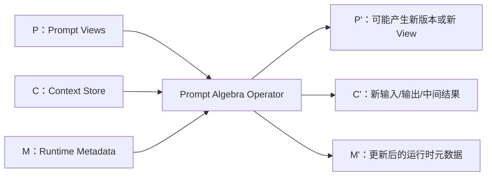
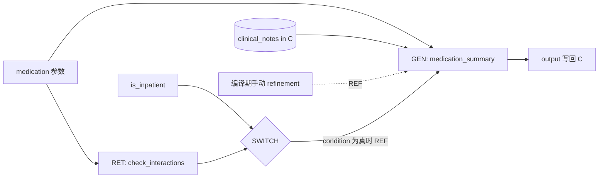
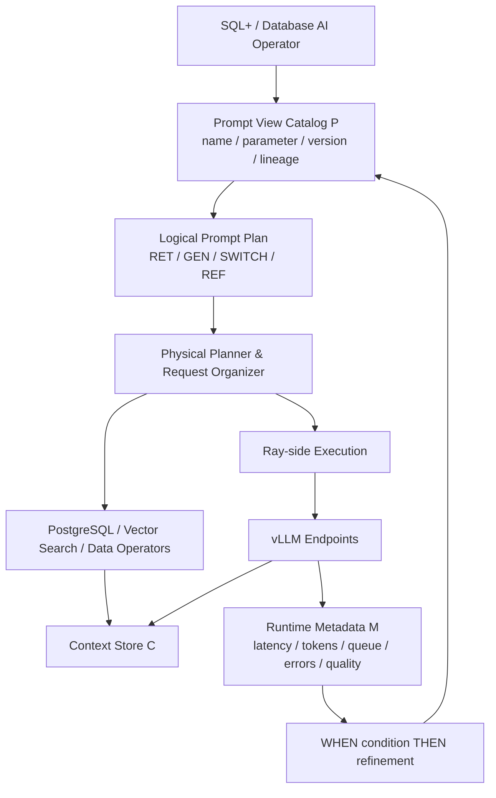

# SPEAR 论文精读笔记

> **论文**：*Making Prompts First-Class Citizens for Adaptive LLM Pipelines*
>
> **原文**：[CIDR 2026 官方论文](https://www.vldb.org/cidrdb/papers/2026/p26-cetintemel.pdf)
>
> **系统/方法名**：SPEAR（Structured Prompt Execution and Adaptive Refinement）
>
> **说明**：本笔记以论文正文为唯一事实依据。凡超出论文原文的判断，均明确标记为“**笔记分析**”或“**个人分析**”。
>
> **文件名提示**：上传文件名中含有 `vldb2026`，但论文首页正式标注的发表 venue 是 **CIDR 2026**，不是 VLDB。
>
> **项目用途**：项目关联与架构示意是阅读分析，不代表已实现能力或新的实施安排。当前任务由[工程计划](../../../experiments/plans/postgresql_ai_semantic_operator_architecture_20260827.md)维护，候选机制与新颖性判断另见[研究审查](../../semantic_prefix_reuse_design_audit_20260903.md)。

---

## 0. 阅读定位：这是一篇什么性质的论文？

SPEAR 不是一篇已经完整实现并大规模评测的系统论文，而是一篇提出**研究愿景（vision）与初步设计（initial/early design）**的短论文。论文试图改变 LLM pipeline 中 prompt 的系统抽象：

> 不再把 prompt 当作嵌在代码里的静态字符串，而是把它提升为执行模型中的 **first-class citizen**，使其能够被命名、组合、版本化、检查、优化，并在运行时根据反馈继续演化。

论文目前给出了三部分内容：

1. 一套以 **Prompt View、Prompt Algebra、Refinement Policy** 为核心的逻辑设计；
2. 由该抽象可能解锁的若干优化机会；
3. 一个基于临床问答任务的初步实验，用 R1–R5 五种 refinement strategy 说明显式、结构化和运行时自适应的 prompt refinement 可能改善 accuracy–cost trade-off。

因此，阅读这篇论文时需要区分：

- **论文已经定义的抽象和语义**：Prompt View、系统状态 `(P, C, M)`、`GEN`、`RET`、`SWITCH`、`REF`、三类 refinement mode、when-then policy；
- **论文提出但尚未完整实现或验证的方向**：结构化 prompt cache、input batching、prompt batching、operator fusion、自适应修改 policy 本身；
- **论文实验真正验证的内容**：不同 prompt structure，以及基于输入条件的 model routing 和基于输出不确定性的 model cascade；
- **论文没有验证的内容**：完整 SPEAR runtime、版本管理开销、并发一致性、上述四类执行优化的实际性能、生产环境稳定性等。

---

# 1. 论文基本信息

| 项目 | 内容 |
|---|---|
| 题目 | *Making Prompts First-Class Citizens for Adaptive LLM Pipelines* |
| 系统名 | SPEAR：Structured Prompt Execution and Adaptive Refinement |
| 作者 | Uğur Çetintemel、Shu Chen、Alexander W. Lee、Deepti Raghavan、Duo Lu、Andrew Crotty |
| 单位 | 前五位作者：Brown University；Andrew Crotty：Northwestern University |
| 会议 | 16th Annual Conference on Innovative Data Systems Research（CIDR 2026） |
| 时间 | 2026 年 1 月 18–21 日 |
| 地点 | Chaminade, USA |
| 论文类型 | Vision / early-design paper，包含 preliminary results |
| 正文结构 | Section 1 Introduction；Section 2 SPEAR；Section 3 Optimization Opportunities；Section 4 Preliminary Results；Section 5 Related Work；Section 6 Conclusion & Future Work |
| 图表 | Figure 1、Figure 2、Table 1 |
| Algorithm | **论文没有给出正式编号的 Algorithm 或伪代码** |
| 开源实现 | 论文没有提供 SPEAR 代码仓库或完整实现说明 |

---

# 2. 一句话概括与核心问题

## 2.1 一句话概括

SPEAR 将 prompt 表示为带有名称、参数、版本和运行时元数据的 **Prompt View**，使用对系统状态 `(P, C, M)` 闭包的 **Prompt Algebra** 执行 pipeline，并通过 `WHEN condition THEN refinement` policy 在执行前或执行后动态修改 prompt logic。

## 2.2 论文真正要解决的问题

论文关注的不是“怎样找到一个更好的静态 prompt”这一单点问题，而是更基础的系统问题：

> 当 prompt 已经成为 LLM application 的核心程序逻辑时，系统如何显式表示、管理、追踪、组合和运行时修改这些 prompt，使 optimizer 和 execution engine 能够理解并优化 prompt 的演化过程？

这个问题可以拆成四个子问题：

1. **表示问题**：prompt 不应只是不可检查的字符串，而应是结构化对象；
2. **复用与演化问题**：prompt 应支持命名、组合、参数化、版本历史和 provenance；
3. **执行问题**：prompt logic 应能够编译为显式 plan，而不是隐藏在业务代码中；
4. **自适应问题**：系统应能够根据输入属性、输出质量、延迟、token budget 等运行时信号修改 prompt 或执行策略。

---

# 3. 研究背景与现有方法不足

## 3.1 LLM pipeline 已经成为复杂的数据中心型应用

Section 1 指出，现代 LLM pipeline 不再只是“一次 prompt → 一次 generation”。它们会：

- 从知识库或外部数据源检索数据；
- 检查或修复运行时错误；
- 调用 API 和外部工具；
- 执行条件 fallback；
- 验证数据和模型输出；
- 在多个 agent 之间协调交互。

从系统角度看，这些 pipeline 已具有典型 data-centric application 的特征。但是，控制整个 pipeline 行为的 prompt 仍常被表示成静态字符串。

## 3.2 静态字符串式 prompt 带来的问题

论文认为，当前做法存在以下核心断裂：

### 3.2.1 Prompt 与程序逻辑割裂

Prompt 通常被内联在应用代码中。optimizer 和 execution engine 只看得到“调用一次 LLM”，看不到 prompt 内部由哪些逻辑片段组成，也不知道 prompt 如何从旧版本变成新版本。

### 3.2.2 缺少系统化版本与 provenance

开发者经常通过反复试错手工修改 prompt，但系统通常不会系统地记录：

- 修改前后的版本；
- 哪一次修改改善或损害了输出；
- 当前输出来自哪个 prompt version；
- 某个 refinement 是人工加入、模型建议，还是运行时自动触发。

### 3.2.3 难以模块化和复用

相同 prompt 片段可能在多个 pipeline 中复制粘贴。由于缺少类似 view/function 的抽象，复杂 prompt 不容易拆成可组合模块。

### 3.2.4 Optimizer 无法利用 prompt 结构

如果系统只看到最终字符串，就难以安全地判断：

- 哪一段 prefix 可以复用 KV cache；
- 哪些调用使用同一个 prompt view，可以做 input batching；
- 哪些不同 prompt 共享结构，可以做 prompt batching；
- 哪些 prompt operators 可以融合；
- 哪个 refinement 只增加了一个 delta，而不是完全改变 prompt。

### 3.2.5 缺少运行时 refinement

很多 prompt optimization framework 主要在部署前离线搜索或优化 prompt。论文认为，运行时才能得到的信号——如本次结果 confidence、retry 次数、延迟阈值和共享 token budget——也应能够驱动 prompt logic 的变化。

## 3.3 论文对现有系统的定位

Section 1 和 Section 5 将相关系统分为三类：

| 类别 | 论文对其能力的概括 | SPEAR 认为仍缺少什么 |
|---|---|---|
| LangChain 等 prompt programming / orchestration framework | 能构建 chain、agent workflow 和 feedback loop | prompt 通常仍是静态字符串，缺少结构化管理、检查和运行时优化 |
| DSPy、DSPy Assertions、GEPA、SPADE 等 prompt optimization 方法 | 能用高层 specification、assertion 或 execution trajectory 优化 prompt | 重点仍主要在离线优化；SPEAR 关注基于实时状态的 runtime refinement |
| Palimpzest、LOTUS、Abacus、DocETL 等 semantic query engine | 提供较强的数据级语义和 declarative processing | prompt logic 仍常被内联或静态定义，运行时不能作为显式系统状态演化 |

论文将 SPEAR 定位为这些系统的**互补层**，而不是宣称完全替代它们。

---

# 4. 核心思想与贡献

## 4.1 最核心的抽象变化

SPEAR 的主要创新不是某一种具体的 prompting trick，而是改变 optimizer 能看到的中间表示：

```text
传统方式：prompt = opaque string
SPEAR：prompt = structured, named, versioned, executable state
```

也就是说，prompt 不再只是 `GEN` 调用的一个普通字符串参数，而是：

- 可命名的逻辑对象；
- 可被其他 prompt 引用和组合；
- 可带参数实例化；
- 有版本历史和运行时统计；
- 可作为 algebra operator 的输入与输出；
- 可在运行时被 policy 修改。

## 4.2 三项正式贡献

### 4.2.1 Structured Prompt Management

将 prompt 表示为结构化对象，并组织为可命名、可组合、可参数化、可版本化的 **Prompt View**。这使开发者可以检查 prompt provenance，并为系统级优化提供显式结构。

### 4.2.2 Adaptive Prompt Refinement

Prompt 不再仅是部署前调好的静态 template，而成为运行状态的一部分。任何能够修改 prompt view 集合 `P` 的操作都属于 refinement，并在 plan 中形成 `REF` edge。

### 4.2.3 Policy-Driven Control

通过 `WHEN condition THEN refinement` 规则，定义自动 refinement 的触发条件。条件既可以在执行前由输入确定，也可以在执行后依据输出质量、延迟、预算或 prompt 自身统计确定。

## 4.3 论文贡献的边界

论文没有声称 R4、R5 所采用的 routing 或 cascade 技术本身完全新颖。Section 4 明确指出，这些技术并非全新；SPEAR 的价值在于把它们表示为简单、模块化、可组合的 refinement primitive，并为更复杂的 runtime optimization 提供统一抽象。

---

# 5. 系统与方法设计：严格按照 Section 2 展开

## 5.0 方法部分的阅读说明

论文没有给出完整的软件模块图、存储 schema、执行器实现或正式 Algorithm。Section 2 给出的是 SPEAR 的逻辑执行模型；Section 3 给出基于该模型可能实现的优化机会；Section 4 是 preliminary experiment，而不是新的方法章节。

---

## 5.1 Section 2.1：Running Example

论文使用一个临床 medication summary pipeline 贯穿 Section 2。

### 5.1.1 初始任务

应用帮助临床医生查看患者病史，重点总结某种药物，例如 enoxaparin 的使用情况。

最初的 prompt 只要求总结用药历史并突出该药物。但开发者发现结果不稳定：

- 有的输出遗漏 dosage；
- 有的遗漏 timing；
- 有的没有说明 administration information。

### 5.1.2 传统开发过程

开发者会继续手工追加要求，例如强调 dosage 和最近 48 小时内是否使用。随着 pipeline 复杂化，还需要：

- 为 inpatient 增加 drug interaction 信息；
- 维护不同场景的 prompt variant；
- 处理 low-confidence response；
- 编写 retry 或 fallback 逻辑。

传统做法往往演化成脆弱的 ad hoc string edit。

### 5.1.3 SPEAR 的重新解释

SPEAR 将上述过程解释为：

1. 定义一个可复用的 `medication_summary` Prompt View；
2. 对该 view 进行显式 manual refinement；
3. 将 medication name 参数化；
4. 根据 `is_inpatient` 条件组合 `check_interactions` view；
5. 在真正调用时，延迟编译为 prompt algebra plan；
6. 在 plan 中显式表示静态和运行时 refinement。

因此，prompt 的演化不再隐藏在字符串修改里，而成为 pipeline 自身可以检查和操作的状态。

---

## 5.2 Section 2.2：Structured Prompt Management

### 5.2.1 Prompt View

论文借用了 SQL view 的类比。Prompt View 是一个有名称的逻辑 view，封装以自然语言表达的可复用程序逻辑。

它具有三项关键能力：

#### A. 命名与复用

例如，`enoxaparin_summary` 可以在应用中任何需要该信息的位置被调用，而不必复制 prompt text。

#### B. 组合

一个 Prompt View 可以基于其他命名 view 定义。例如，`medication_summary` 可以在特定条件下组合 `check_interactions`。

#### C. 参数化

可以把面向单一药物的 view 改成通用 `medication_summary(medication)`，在运行时传入具体 medication name。

此外，论文还强调 Prompt View 是**版本化的**，其 prompt object 除了 prompt text，还可保存 runtime statistics 和 version history。不过，论文没有进一步给出版本 schema、提交/回滚协议或并发更新语义。

### 5.2.2 系统状态 `(P, C, M)`

SPEAR 把系统状态建模为三元组：

| 符号 | 正式含义 | 论文给出的内容 |
|---|---|---|
| `P` | Prompt views | 所有 Prompt View 的集合；以 key-value mapping 将 view name 映射到 prompt object |
| `C` | Context store | prompt 所操作的运行时数据，包括 input、output 和 intermediate result |
| `M` | Runtime metadata | 执行期间生成的控制信号和诊断信息，例如 shared token budget、latency threshold |

简化示意：



这一步非常关键：传统 pipeline 通常只允许 operator 修改 data；SPEAR 还允许 operator 修改 prompt logic `P`。

### 5.2.3 Prompt Algebra

SPEAR 定义一个可执行的 Prompt Algebra。其闭包性质是：

> 每一个 operator 都接收并产生 `(P, C, M)` 形式的三元组。

形式上可以写成：

```text
Operator : (P, C, M) -> (P', C', M')
```

这种统一接口让 operator 可以扩展，并允许 pipeline 同时操作 prompt、数据和控制状态。

### 5.2.4 核心 operator

#### `GENERATE (GEN)`

| 项目 | 内容 |
|---|---|
| 输入 | 指定的 Prompt View、`C` 中被该 view 引用的数据、所选 LLM |
| 步骤 | 渲染/应用 Prompt View，调用指定 LLM |
| 输出 | 将 generation result 写回 `C` |
| 设计理由 | 把 LLM call 从“直接传字符串”提升为对命名 Prompt View 的执行 |

#### `RETRIEVE (RET)`

| 项目 | 内容 |
|---|---|
| 输入 | 外部数据源描述和所需查询/参数 |
| 步骤 | 从数据库、web search 或 API 获取数据 |
| 输出 | 将结果写入 `C` |
| 设计理由 | 把 prompt pipeline 中的数据获取显式纳入同一个 algebra plan |

#### `SWITCH`

| 项目 | 内容 |
|---|---|
| 输入 | 来自 `C`、`M` 或 prompt metadata 的条件 |
| 步骤 | 判断条件并选择控制流分支 |
| 输出 | 激活相应后继路径或 refinement |
| 设计理由 | 显式表达 conditional fallback 和 policy control flow |

#### `REF` 的准确含义

论文并没有把 `REF` 与 `GEN`、`RET`、`SWITCH` 一样列为“built-in core operator”。论文的正式表述是：

- refinement 是任何更新 `P` 的 operator；
- 这种更新在对应 Prompt Algebra plan 中形成一条 `REFINE (REF)` edge。

因此，更准确地说，`REF` 是 plan 中表示“prompt logic 被 refinement”的边，而不是论文已经完整定义接口的单一固定 operator。

Refinement 可能执行：

- append example；
- inject hint；
- rewrite confusing instruction；
- 组合已有 view；
- 构造新 view。

---

## 5.3 Section 2.3：Adaptive Prompt Refinement

### 5.3.1 Formal definition

只要一个操作会更新 Prompt View 集合 `P`——修改已有 prompt 或组合出新 prompt——它就是 refinement。

Refinement 的重要性在于：

- 传统系统主要更新 `C` 和 `M`；
- SPEAR 还允许执行中的 operator 检查、推理并修改 `P`；
- 因而 prompt strategy 可以根据实时反馈发生变化。

### 5.3.2 三种 Refinement Mode

#### A. Manual

| 项目 | 内容 |
|---|---|
| 谁决定修改 | Developer |
| 描述粒度 | 低层、精确修改 prompt text |
| 发生时机 | 显式命令触发，通常在 compile time |
| 适用情况 | 强制固定输出格式、注入专业领域知识、需要严格人工控制 |
| Running example | 增加 dosage、时间范围等具体要求；把 medication 改成参数 |

论文的理由是：高风险或需要确定性格式的任务仍可能要求开发者直接控制 prompt。

#### B. Assisted

| 项目 | 内容 |
|---|---|
| 谁决定目标 | Developer 给高层 intent |
| 谁生成具体修改 | 由 LLM/系统生成新 prompt version |
| 编译方式 | refinement 可编译成一个 `GEN`，输入旧 prompt，输出新版本 |
| 发生时机 | 论文将 manual 和 assisted 都描述为开发者主动触发的 static refinement |
| 示例 | 开发者只说“确保包含近期 enoxaparin administration 细节”，系统生成具体 prompt 修改 |

设计动机是降低开发者手工编辑 prompt text 的负担，同时保留由开发者指定目标的控制权。

#### C. Automatic

| 项目 | 内容 |
|---|---|
| 触发者 | 系统根据用户指定条件监控 runtime state |
| 发生时机 | Runtime |
| 开发者参与 | 不需要在每次触发时人工介入 |
| 执行方式 | 条件命中后，将 refinement 编译为可执行 Prompt Algebra plan |

Automatic mode 的重点不是系统完全自由修改 prompt，而是由开发者预先声明条件与 refinement 逻辑，运行时自动触发。

### 5.3.3 三种模式不是互斥阶段

论文强调，manual、assisted、automatic 可以共存：

- 开发早期先 manual；
- 发现稳定模式后转为 assisted；
- 成熟后将常见情况自动化；
- 部署时也可以默认 automatic，在不确定或高风险情况下升级为 assisted/manual oversight。

SPEAR 不规定固定迁移路线，而是让应用按 risk tolerance 和 system maturity 选择。

---

## 5.4 Policy-Driven Control

### 5.4.1 Policy 形式

SPEAR 将 refinement policy 表示为：

```text
WHEN condition THEN refinement
```

`refinement` 可以包含一个或多个 action。

### 5.4.2 Condition 可以读取哪些状态

条件可引用：

- Context store `C`；
- Runtime metadata `M`；
- Prompt 自身 metadata。

论文给出的信号例子包括：

- repeated failed retries；
- accuracy degradation；
- result confidence；
- latency threshold；
- shared token budget。

### 5.4.3 Input Condition（Before）

如果条件只依赖 operator 的输入，例如参数或已经 materialized 的中间结果，那么 refinement 可以在 operator 执行前完成。

Running example 中：

```text
is_inpatient = True
    -> 组合 check_interactions
    -> 再执行 medication_summary
```

患者是否住院在 generation 前已知，因此属于 input condition。

### 5.4.4 Output Condition（After）

如果条件依赖 operator 输出，就只能先执行 operator，再决定是否 refinement。

论文示例是：

```text
medication_summary output
    -> LLM judge 判断信息是否完整
    -> 若不完整，retry 或切换到其他 LLM/prompt combination
```

### 5.4.5 Data plane 与 control plane

论文给出一个重要区分：

- `(P, C, M)` 构成 SPEAR 的 **data plane**；
- refinement policy 构成决定 pipeline 何时以及怎样演化的 **control plane**。

Policy 不一定是硬编码规则。论文进一步设想：policy 本身也可以写成 prompt，编译进 Prompt Algebra，并继续被 refinement。例如：

- 很少触发或很少提升质量的 policy 可被 deprioritize/prune；
- 持续产生明显收益的 policy 可被 promote。

**证据边界**：这部分是论文提出的未来愿景。Section 4 没有实现或评估“policy 自身自适应 refinement”的控制平面。

---

## 5.5 Section 2.4：Putting It All Together 与 Figure 1

### 5.5.1 Lazy evaluation

开发者在定义 Prompt View、追加 refinement 和声明 condition 时，pipeline 只存在为未渲染 template。只有真正调用 `medication_summary(...)` 时，SPEAR 才把逻辑编译成 executable Prompt Algebra plan。

### 5.5.2 Figure 1 的执行计划

Figure 1 上半部分是 developer code，下半部分是 compiled plan。其逻辑可简化为：



原 Figure 1 中可见两个 named input：`medication` 与 `is_inpatient`，以及一个 output。调用中的 `clinical_notes` 作为 context 参与 `GEN`；上图将其补画出来以便理解，但这不是论文原图中的独立 named node。

### 5.5.3 三个核心 operator 的作用

- `RET`：从药物相互作用数据库取得 `check_interactions` 信息；
- `SWITCH`：依据 `is_inpatient` 决定是否采用该 refinement；
- `GEN`：用 `medication_summary` Prompt View 调用 LLM，生成最终 summary。

### 5.5.4 两条 `REF` edge

Figure 1 中两条 `REF` 分别对应：

1. **Compile-time refinement**：向原始 prompt 追加具体内容要求；
2. **Runtime input-dependent refinement**：根据 `is_inpatient` 条件，决定是否组合 `check_interactions`。

这张图最重要的不是医疗例子，而是展示：同一个 algebra plan 里可以同时存在静态 prompt 修改和运行时条件修改。

### 5.5.5 部署方式

论文称，编译后的 plan 可以：

- 作为 standalone pipeline 执行；
- 或嵌入 LangChain 一类 orchestration framework。

论文没有进一步描述实际 executor、distributed runtime、fault tolerance 或 deployment API。

---

# 6. Section 3：Optimization Opportunities

Section 3 讨论的是 SPEAR 抽象“可能解锁”的优化，不是已经全部实现并在 Section 4 评测的功能。四项优化如下。

## 6.1 Prefix Caching & Reuse

### 输入/可利用信息

- 同一个 Prompt View 的多个 version；
- 新旧版本之间稳定的 prefix 和追加的 delta；
- view 的结构和 rendered form。

### 处理思路

如果一次 refinement 只是追加 example 或 hint，SPEAR 可保留稳定 prefix，仅在末尾增加 delta，而不是从头构造完全不同的字符串。系统可据此：

- 复用已有 attention state / KV cache；
- 建立 structured prompt cache；
- 跨 retry 或不同参数调用复用共同部分。

### 论文给出的理由

Prompt View 和 version history 使“哪些部分没变”变得可见；传统 opaque string 很难系统地判断这一点。

### 潜在收益

降低 prompt evaluation latency 和 compute cost。

### 证据边界

论文没有实现或 benchmark SPEAR 的 prefix caching；只引用已有 KV cache、FlashAttention 和 Prompt Cache 技术说明可行性。

---

## 6.2 Input Batching

### 输入/适用模式

同一个 Prompt View 被重复应用于多个 input item，例如对多种 medication 分别调用 `medication_summary`。

### 处理思路

把多个 input 合并成一个 batched `GEN` operation，让 LLM 在一次调用中处理多项输入。

### 论文给出的理由

相同 query logic 在不同输入上重复执行，与 semantic query processing engine 中的批处理模式类似，可以更充分利用 context window 和模型吞吐。

### 风险

论文明确指出：

- prompt crowding；
- cross-input interference；
- output accuracy degradation；
- error isolation 困难。

因此需要根据 workload、model behavior 和 downstream quality requirement 调 batch size，并提供失败 input 的 fallback/reprocess 路径。

### 证据边界

Section 4 没有评测 input batching。

---

## 6.3 Prompt Batching

### 与 Input Batching 的区别

- **Input Batching**：同一个 prompt logic，多个 input；
- **Prompt Batching**：多个结构相似但不完全相同的 prompt，一起提交。

### 处理思路

把共享结构或 reusable building block 的多个 prompt 组合进一次 LLM call：

- amortize dispatch overhead；
- 利用并行 inference；
- 若有共同 prefix，可进一步结合 prefix caching。

### 论文给出的理由

SPEAR 中 Prompt View 本来就是由模块化 building block 构造，因此系统更容易识别 prompt 结构冗余。

### 证据边界

论文没有给出 prompt similarity 定义、batch formation algorithm、质量约束或实验结果。

---

## 6.4 Operator Fusion

### 输入/适用模式

多个 tightly coupled prompt operator 操作同一输入的不同部分，或其输出/输入关系非常紧密。

### 处理思路

通过 runtime refinement 修改 operators，把它们融合为单一 execution unit。

### 预期收益

- 减少 execution overhead；
- 减少 intermediate result storage。

### 与传统 operator fusion 的重要差异

论文特别指出：在传统数据系统中 fusion 通常有利，但 prompt fusion 可能：

- 降低 accuracy；
- 增加 latency。

原因在于多个自然语言任务组合后，模型行为和 output quality 可能发生非线性变化。因此，选择融合哪些 operator、融合多少个 operator 仍是开放问题。

### 证据边界

Section 4 没有评测 operator fusion。

---

## 6.5 四项优化的统一总结

| 优化 | SPEAR 暴露的结构 | 预期目标 | 论文明确提示的风险 | Section 4 是否验证 |
|---|---|---|---|---|
| Prefix Caching & Reuse | Prompt version、稳定 prefix、delta | 降低 latency/compute | 论文未深入讨论一致性和旧缓存何时不可复用 | 否 |
| Input Batching | 同一 Prompt View 的多输入调用 | 提高 throughput | crowding、cross-input interference、error isolation | 否 |
| Prompt Batching | 不同 Prompt View 的共享结构 | amortize dispatch、并行 inference | similarity 与质量边界未定义 | 否 |
| Operator Fusion | operator 和 Prompt View 组合关系 | 减少执行和中间结果开销 | 可能降低 accuracy 或增加 latency | 否 |

---

# 7. Section 4：实验分析

## 7.1 实验目标

Section 4 不是评估完整 SPEAR runtime，而是用一个临床 multiple-choice QA benchmark 展示：

1. 显式、可解释的 prompt refinement 是否能改善严格输出格式下的 accuracy；
2. input-condition routing 和 output-condition cascade 是否能改善 accuracy–cost trade-off。

## 7.2 实验环境

| 项目 | 设置 |
|---|---|
| GPU | 单张 NVIDIA Quadro RTX 8000，48 GB GDDR6 |
| Model hosting | 本地 Ollama instance |
| Model family | Google Gemma 3 |
| Model size | 1B、4B、12B、27B |
| 数据集 | EHRNoteQA |
| 数据集规模 | 962 个 unique multiple-choice questions，选项 A–E |
| 实验子集 | 固定随机抽取的 200 samples |
| 重复次数 | 每个 experiment 重复 3 次 |
| 汇报方式 | accuracy 与 total cost 的 mean |

论文没有给出 temperature、sampling 参数、context length、router prompt、cascade timeout 或其他 inference configuration。

## 7.3 Accuracy 判定

答案必须满足：

- 去除首尾 whitespace 后；
- 只包含一个 letter；
- 与 ground-truth label 完全匹配；
- capitalization 也必须一致。

因此，Figure 2 中的 accuracy 同时受到两类因素影响：

1. 模型是否知道正确答案；
2. 模型是否严格输出可解析的单个大写字母。

论文后续分析认为，baseline 的主要失败原因之一正是 output format violation，而不一定全是医学推理错误。

## 7.4 Table 1：Estimated Inference Costs

Table 1 给出每百万 token 的估算价格：

| Model | Input cost（$/1M tokens） | Output cost（$/1M tokens） |
|---|---:|---:|
| gemma3:1B | 0.02 | 0.02 |
| gemma3:4B | 0.02 | 0.04 |
| gemma3:12B | 0.06 | 0.12 |
| gemma3:27B | 0.15 | 0.30 |

这些是作者根据公开数据估算的 approximate inference cost，不是该本地 RTX 8000 实验服务器真实发生的计费账单。

## 7.5 Baseline

### Baseline

只包含回答 JSON-formatted multiple-choice question 的基本说明。

### DSPy

使用 DSPy `Predict` module，手工从 JSON object 提取相关 field。

### DSPy-CoT

使用 DSPy 内置 chain-of-thought module。

论文比较的不是 DSPy 所有 optimizer 或复杂 tuning configuration，而是上述两个具体 comparison point。

## 7.6 SPEAR Refinement Strategies：R1–R5

### R1：manual, static

在 baseline 上加入明确 output-format instruction。

- Mode：Manual；
- Condition：无 runtime condition；
- 时机：Static；
- 目标：减少模型输出冗长 explanation、无法解析等 formatting error。

### R2：assisted, static

在 R1 基础上，从原始 JSON 中抽出：

- question；
- answer choices；
- clinical notes；

并放入带有明确 label 的独立 section。该结构由 27B model 离线建议。

### R3：assisted, static

在 R2 基础上重新排列 prompt component：

1. clinical evidence 在前；
2. question 与 answer choices 在后；
3. output constraint 放在末尾。

该重排同样由 27B model 离线建议。

### R4：automatic, input condition

根据 routing model 对问题 difficulty 的判断，选择合适 model，然后使用 R3。

逻辑可表示为：

```text
WHEN estimated_difficulty = d
THEN route_to_model(d) AND use R3
```

这是 input condition，因为 routing 在回答生成之前完成。

### R5：automatic, output condition

在 R3 中增加额外选项 `F`，允许模型在不确定时输出 `F`。如果当前 model 输出 `F`，则升级到下一个更大 model；到达最大 model 后使用普通 R3。

逻辑可表示为：

```text
run smaller model with R3 + uncertainty option F
if output == F:
    cascade to next larger model
repeat until largest model
```

这是 output condition，因为是否升级取决于前一个 model 的输出。

## 7.7 Figure 2：图的组织方式

Figure 2 包含两个散点图：

- **左图 Overall Comparison**：每种 model 的 baseline、DSPy、DSPy-CoT，以及该 model 下最好的 SPEAR strategy；
- **右图 Refinement Strategies**：详细展示 R1–R5 在不同 model 上的 accuracy 与 total cost。

横轴为 total cost，纵轴为 accuracy。理想点位应尽量靠左上角。

论文没有在表格中列出 Figure 2 所有散点的精确数值。因此，除正文明确报告的数字外，不应把图上肉眼位置改写成高精度数值。

## 7.8 主要结果一：SPEAR refinement 与 DSPy 的比较

论文观察到：

- DSPy 和 DSPy-CoT 相比 baseline 有明显提升；
- 许多 SPEAR refinement 又持续优于它们；
- DSPy 即使通过 `Literal[...]` field 约束输出，面对 long-context、chatty model 时仍常产生 parsing error；
- SPEAR 的 refinement 是显式和可解释的，因此可以直接定位“是 formatting、field organization 还是 component order 导致问题”。

### 实验真正支持的结论

在本文特定的 EHRNoteQA 设置和所选 DSPy configuration 中，显式修改 prompt structure 能减少 formatting-related failure，并取得更高 accuracy。

### 实验没有支持的扩大结论

论文没有证明 SPEAR 普遍优于所有 DSPy optimizer、所有 prompt compiler 或所有任务上的自动 prompt optimization。

## 7.9 主要结果二：Prompt Structure 的影响

论文指出，R1 → R2 → R3 呈现明显性能进展，其中 R3 在各 model 上带来最显著跃升。

作者的解释是：

- baseline 没有足够明确地要求只输出一个 letter；
- 大 model 更容易给出 verbose reasoning chain；
- 长输出使 answer extraction 和 exact-match parsing 失败；
- R3 把 evidence、question/choices 和 output constraint 按更有效顺序组织。

### 实验真正说明了什么

Figure 2 支持“prompt component 的结构和顺序对输出可解析性与最终 accuracy 有显著影响”，并显示 SPEAR 的显式 refinement 便于将收益归因到具体改动。

### 论文没有证明什么

论文没有把 R3 的收益进一步拆成：

- evidence-first 带来的语义推理收益；
- output constraint 放末尾带来的格式收益；
- section label 带来的结构收益。

因此，不能从现有实验中精确判断每个微小改动各贡献多少。

## 7.10 主要结果三：R4 Input-Condition Routing

作者报告：

- 使用最小的 1B model 作为 router；
- R4 达到 **83.5% accuracy**；
- 与 standalone 12B model 的表现相当；
- 但只在需要时调用更大 model。

作者据此认为，数据集中相当一部分 question 较容易，并不需要大型、昂贵 model。

### 实验真正说明了什么

在该 200-sample EHRNoteQA subset 上，输入难度驱动的 routing 可以利用 question difficulty heterogeneity，使小 model 参与决策，并在 accuracy 与 cost 间取得较好折中。

### 论文未提供的信息

- router 的具体 prompt 或训练方式；
- difficulty label 如何定义；
- model selection threshold；
- 每个 model 接收多少问题；
- routing mistake 的类型；
- router 本身的 latency 与详细 cost breakdown。

## 7.11 主要结果四：R5 Output-Condition Cascade

作者报告：

- 从 12B model 开始的 cascade 达到 **86.7% accuracy**；
- standalone 27B model 为 **87.3% accuracy**；
- cascade total cost 为 **$0.046**；
- standalone 27B total cost 为 **$0.087**；
- 因而以接近一半的 cost 获得接近 27B 的 accuracy。

作者的解释是：只有当较小 model 明确输出不确定标记 `F` 时，才升级到更昂贵 model。

### 实验真正说明了什么

在该任务中，基于模型自报 uncertainty 的 output-condition policy 能构成有效 cascade，避免所有问题都直接使用最大 model。

### 论文没有证明什么

- `F` 是否是经过良好 calibration 的 uncertainty signal；
- 高风险错误是否会被模型自觉标记为 `F`；
- cascade 是否在其他任务和模型族上稳定；
- 多级 cascade 的 worst-case latency；
- 对医疗实际部署安全性的影响。

## 7.12 实验结论与证据边界总表

| 作者主张 | 对应证据 | 可以支持到什么程度 | 不能扩大成什么结论 |
|---|---|---|---|
| Structured refinement 比 opaque optimization 更易解释和定位问题 | R1–R3 的显式变化及 Figure 2 | 在该 benchmark 中可把提升关联到格式、结构与顺序修改 | 没有 developer study，也未量化调试时间 |
| SPEAR refinement 可优于所选 DSPy baselines | Figure 2 | 对本文 DSPy / DSPy-CoT 设置成立 | 不能说普遍优于 DSPy 或所有 prompt optimizer |
| Input-condition routing 改善 cost–accuracy trade-off | R4，83.5% | 在该数据子集和模型组合中成立 | 没有 generalization 或 router robustness 证据 |
| Output-condition cascade 降低 cost | R5，86.7%、$0.046；27B 为 87.3%、$0.087 | 在本文 cascade 配置下成立 | 没有证明 uncertainty calibration 或 tail latency |
| SPEAR 解锁 prefix cache、batching、fusion | Section 3 的设计分析 | 说明抽象上存在机会 | Section 4 没有实现或验证这些优化 |

---

# 8. Section 5：Related Work 的准确定位

## 8.1 Prompt Programming Frameworks

LangChain 一类 framework 支持 chain、orchestration、agentic workflow 和 feedback loop，但论文认为它们通常把 prompt 当作 static string，缺少结构化管理、introspection 和 runtime optimization。

SPEAR 的差异是：

- prompt 是 first-class entity；
- pipeline 可编译成 Prompt Algebra；
- refinement 可以在 runtime 更新 `P`。

## 8.2 Manual Prompt Refinement

论文承认，增加明确 instruction、加入 domain example、重构 task description 等方法本身已有大量研究。SPEAR 不是发明这些 prompting technique，而是提供一个可控、可组合、可追踪的系统机制来应用它们。

## 8.3 Automated Prompt Optimization

论文提及：

- DSPy：根据高层 specification 自动优化；
- DSPy Assertions：用 output constraint 支持 offline 和部分 runtime self-refinement；
- GEPA：根据 execution trajectory 离线反思并迭代提出 prompt candidate；
- SPADE：根据 user edit history 合成部署前 assertion。

SPEAR 的定位是补充其 runtime dimension，而不是否认这些系统具有任何 runtime 能力。

## 8.4 Semantic Query Engines

论文认为 Palimpzest、LOTUS、Abacus、DocETL 等系统已经提供较强的 data-level semantics，但 prompt logic 仍常是 inline/static 的。SPEAR 可作为这些系统的 prompt refinement 层，与 semantic operator optimizer 配合。

---

# 9. Section 6：Conclusion & Future Work

论文总结，SPEAR 将三部分统一到一个 execution model 中：

1. Structured Prompt Management；
2. Adaptive Refinement；
3. Policy-Driven Control。

作者认为，这一抽象可带来：

- 更丰富的 prompt introspection；
- 更原则化的复用；
- dynamic optimization；
- robustness、efficiency 和 developer productivity 的潜在提升。

但是，Section 6 使用的是“early results suggest”“plan to continue to develop”等措辞，说明论文并未宣称 SPEAR 已经是完整成熟系统。

---

# 10. 优点与局限

## 10.1 论文内容直接支持的优点

### 10.1.1 抓住了系统抽象缺口

很多工作优化 model、request 或 data operator，却仍把 prompt 当作不可见字符串。SPEAR 将 prompt logic 纳入 optimizer 可见状态，问题定位非常清晰。

### 10.1.2 Prompt View 同时服务软件工程与系统优化

同一个 abstraction 同时改善：

- modularity；
- reusability；
- maintainability；
- version/provenance introspection；
- prefix reuse、batching 和 fusion 的优化可见性。

### 10.1.3 统一静态 planning 与 runtime adaptivity

Input Condition 在执行前决定 refinement，Output Condition 在执行后利用反馈修改策略。二者都通过同一 policy 和 algebra 表达，避免把 offline prompt engineering 与 runtime fallback 分成两个完全无关的系统。

### 10.1.4 Refinement 是显式 plan element

Figure 1 用 `REF` edge 标出 prompt 如何改变，使失败诊断和 provenance 比隐式字符串拼接更清楚。

### 10.1.5 正确承认质量–性能权衡

Section 3 没有简单断言 batching/fusion 总是有利，而是明确指出 cross-input interference、prompt crowding 和 fusion accuracy degradation。

## 10.2 论文自己明确或隐含承认的局限

论文没有单独的 Limitations section。以下限制来自正文中作者自己的措辞或明确保留：

1. SPEAR 仍是 vision 和 initial design；
2. prefix caching、input batching、prompt batching、operator fusion 只是 optimization opportunity；
3. input batching 可能产生 crowding、干扰和错误隔离问题；
4. prompt operator fusion 可能降低 accuracy 或增加 latency；
5. R4、R5 技术并非完全新颖；
6. 实验被称为 preliminary results；
7. 作者将继续开发 SPEAR 并探索上述优化，说明当前工作尚未覆盖完整实现。

## 10.3 【笔记分析】论文尚未解决的问题

以下为基于论文内容的额外分析，不属于作者已经证明的结论。

### 10.3.1 缺少完整版本与一致性语义

论文说 Prompt View 是 versioned 的，但没有说明：

- 并发 query 看到哪个 version；
- refinement 是否生成 immutable snapshot；
- 一个 query 执行中途 view 更新后如何保持 reproducibility；
- 多个 refinement 冲突时怎样合并；
- 如何 rollback。

### 10.3.2 Policy 可能冲突、循环或振荡

多个 when-then policy 可能同时触发，也可能形成：

```text
低 confidence -> 加长 prompt
延迟超阈值 -> 缩短 prompt
再次低 confidence -> 又加长 prompt
```

论文没有给出 priority、termination、conflict resolution 或 convergence 机制。

### 10.3.3 自动 refinement 的安全性未讨论

当 policy、prompt 和外部数据都可能由 LLM 生成时，需要考虑：

- prompt injection；
- malicious context；
- unsafe self-modification；
- tool call side effect；
- 高风险场景中的 approval boundary。

医疗 running example 反而使这一问题更重要，但论文没有评估真实医疗安全性。

### 10.3.4 缺少 physical optimizer 和 cost model

Prompt Algebra 提供 logical plan，但论文没有说明：

- logical operator 如何映射到 physical operator；
- model、batch size、cache、retry 和 route 如何联合选择；
- accuracy、latency、token cost 的 objective 怎样形式化；
- runtime statistics 怎样反馈给 optimizer。

### 10.3.5 缺少完整 runtime implementation 与 overhead

论文没有报告：

- plan compile time；
- version catalog overhead；
- metadata collection overhead；
- policy evaluation latency；
- dynamic refinement 导致的额外 token 和 retry；
- executor scalability。

### 10.3.6 实验范围较窄

实验只有：

- 一个 clinical MCQ benchmark；
- 一个固定的 200-sample subset；
- Gemma 3 一个 model family；
- accuracy 和 estimated cost 两个主要维度。

没有 RAG、tool use、multi-agent、long-running pipeline 或多用户 workload。

### 10.3.7 指标受格式错误强烈影响

严格单字符 exact match 是合理任务定义，但也导致 prompt formatting improvement 直接转化为大幅 accuracy 提升。该结果不能自动说明模型医学推理能力同幅度提高。

### 10.3.8 R4/R5 细节不足以复现

论文未给 router prompt、difficulty threshold、model escalation sequence 的完整细节，也没有 uncertainty calibration 分析。

### 10.3.9 没有统计显著性与开发者效率研究

虽然实验重复三次并报告 mean，但未给 standard deviation、confidence interval 或显著性检验。论文还声称可能提升 developer productivity，但没有 user study 或开发时间对比。

---

# 11. 我的理解与启发

> **以下为基于论文内容的个人分析，不属于论文原文贡献。**

## 11.1 这篇论文真正有价值的不是 R1–R5，而是 IR 边界

R1–R5 本身是常见的格式约束、prompt 重排、routing 和 cascade。SPEAR 更值得学习的地方是：

> 把以前隐藏在字符串和业务代码中的语义，提升为 optimizer 可检查、可改写、可记录 provenance 的 intermediate representation。

数据库系统之所以能够优化 SQL，是因为 optimizer 看得到 relational algebra，而不是只得到一段无法解释的最终 machine code。SPEAR 试图为 prompt logic 建立类似的中间层。

## 11.2 Prompt View 是“自然语言程序的 logical view”

Prompt View 不只是 template。其理想形态包括：

- 名称与参数；
- 逻辑组件；
- 依赖的其他 view；
- version lineage；
- 运行统计；
- 可编译 plan。

这使 prompt 从“内容”变成“程序对象”。

## 11.3 `(P, C, M)` 把三类状态放到同一执行语义中

一个普通数据系统主要围绕 data state 运行。SPEAR 的三元组提示我们，LLM application 至少同时有：

- **Program state**：`P`，当前 prompt strategy；
- **Data state**：`C`，输入、输出、中间结果；
- **Runtime state**：`M`，预算、延迟、置信度和诊断信息。

只有三者都可见，系统才能真正做 adaptive execution。

## 11.4 Input Condition 与 Output Condition 是很实用的分界

许多 runtime rule 可以先按这两个阶段分类：

- 执行前已知：输入长度、任务类型、数据域、用户 SLO、预算；
- 执行后才知道：输出 confidence、格式是否正确、judge score、实际 latency、retry 状态。

这比笼统地说“动态优化”更容易落地，也能帮助确定哪些 decision 可以静态计划，哪些必须进入 runtime loop。

## 11.5 显式 delta 对执行优化很重要

如果系统知道新 prompt version 只是“在末尾增加一个 example”，就可能复用 prefix；如果只看到两个最终字符串，就很难安全判断变化性质。因此，版本管理不仅是可观测性功能，也可能直接成为 execution optimization 的输入。

## 11.6 自适应 prompt 系统需要数据库式治理

SPEAR 的设想最终会遇到数据库熟悉的问题：

- catalog；
- version；
- snapshot；
- dependency；
- provenance；
- conflict；
- rollback；
- cost-based planning；
- runtime re-optimization。

这说明 prompt management 很可能不仅是“prompt engineering tool”，而会发展成 LLM application runtime 的系统组件。

---

# 12. 与我的数据库 AI 算子执行与调度课题的关系

> **以下为个人分析，不属于论文原文贡献。**

## 12.1 与课题最直接的连接点

你的课题主要关心数据库 AI 算子、上游数据执行、请求组织、Ray 调度以及外部 vLLM endpoint 的端到端执行。SPEAR 可以补充其中目前容易被隐藏的一层：**AI 算子内部的 prompt logic 与 refinement state**。

传统 AI 算子可能表现为：

```text
AI_SUMMARIZE(input_column, prompt_string)
```

在这种接口下，执行器通常只知道：

- 有多少 row；
- 要调用哪个 model endpoint；
- 输入/输出 token 大致多少；
- 请求是否完成。

但它不知道：

- prompt 属于哪个逻辑任务；
- 两个请求是否共享同一 Prompt View；
- 当前 prompt 是哪个 version；
- 本次只是追加了少量 delta，还是完全换了逻辑；
- 哪个 retry 来自 output-condition refinement。

SPEAR 的 Prompt View 可以把这些信息显式暴露给你的执行层。

## 12.2 可借鉴的统一状态

可将 SPEAR 的三元组映射到你的系统：

| SPEAR 状态 | 在数据库 AI 算子系统中的可能对应 |
|---|---|
| `P` | AI operator 使用的 Prompt View catalog、version、参数、refinement lineage |
| `C` | 数据库 row/batch、检索结果、模型输出、中间表、judge result |
| `M` | token budget、预测 work、endpoint queue、实际 latency、GPU/服务负载、retry 次数、quality signal |

其中 endpoint queue、predicted work 和 GPU load 是针对你的执行系统的扩展，不是 SPEAR 论文已经定义的字段。

## 12.3 `GEN/RET/SWITCH/REF` 与数据库执行计划的映射

| SPEAR logical element | 在你的系统中的物理含义 |
|---|---|
| `RET` | PostgreSQL scan、vector search、外部检索、join 或数据准备算子 |
| `GEN` | 向 vLLM endpoint 提交一批 model request |
| `SWITCH` | 按输入类型、预算、SLO、质量结果选择执行分支 |
| `REF` | 修改 Prompt View、加入示例/约束、切换 prompt/model combination、触发 retry/cascade |

这提供了一个清晰的两层设计：

```text
SPEAR-like logical plan
        ↓ physical lowering
数据库 / Ray / Request Organizer / vLLM execution plan
```

## 12.4 SPEAR 对 Request Organizer 的直接启发

### 12.4.1 将 Prompt View ID 与 version 纳入请求 metadata

请求不应只有 raw prompt text，还可携带：

- `prompt_view_id`；
- `prompt_version`；
- `refinement_parent_version`；
- `stable_prefix_id`；
- `policy_id`；
- `refinement_mode`。

这样 Request Organizer 才能安全判断请求之间的结构关系。

### 12.4.2 以 Prompt View 为 batching key

同一 view、不同 row 的调用适合考虑 input batching；共享 prefix 的不同 view 适合考虑 prefix-aware grouping。相比只对 token length 分桶，这种语义信息更强。

### 12.4.3 把 runtime feedback 返回 `M`

你的 vLLM/Ray 侧可以返回：

- queue delay；
- TTFT / execution latency；
- input/output tokens；
- endpoint load；
- retry/error；
- output quality/judge score。

Policy 再依据这些状态决定下一次 `REF`、route 或 cascade。

### 12.4.4 为重复执行提供 provenance

数据库 query 的一个结果应能追踪到：

```text
query/job
 -> AI operator
 -> Prompt View version
 -> model/endpoint
 -> request batch
 -> runtime statistics
 -> output/refinement chain
```

这对性能调试和质量回归都很重要。

## 12.5 与你的课题的核心区别

| 维度 | SPEAR | 你的数据库 AI 算子执行与调度方向 |
|---|---|---|
| 核心问题 | Prompt logic 如何成为可管理、可演化的 first-class state | AI operator 如何跨数据层、调度层和 model serving 层高效执行 |
| 主要抽象 | Prompt View、Prompt Algebra、Refinement Policy | Job/算子、batch、request、endpoint、credit、runtime telemetry |
| 优化层次 | 逻辑 prompt 管理和 runtime refinement | 物理执行、批处理、路由、admission、资源与并发控制 |
| 主要目标 | modularity、provenance、adaptivity，以及潜在效率 | latency、throughput、fairness、resource utilization、SLO |
| Runtime 实现 | 论文未给出完整 scheduler/executor | 你的课题正关注实际 Ray/vLLM 执行与结果返回 |
| 实验证据 | 单一 QA benchmark 的 accuracy–cost preliminary results | 需要端到端 workload、并发请求和服务状态实验 |

因此，SPEAR 与你的工作不是直接竞争关系。更合适的关系是：

> SPEAR 可以成为上层的 prompt logical/control plane；你的系统负责下层 physical execution/data plane，并把真实运行反馈回传给 policy。

## 12.6 一个可结合的架构草图



该图是面向你的课题的组合设想，不是论文原图。

## 12.7 可以直接借鉴的研究点

### 研究点 1：Prompt-aware batching 与 cache reuse

把 Prompt View/version/delta 作为 batching 和 prefix-cache decision 的语义输入，而不仅看 token length。

### 研究点 2：Input-condition 与 Output-condition 分阶段决策

- Input condition：提交前 route、model choice、batch strategy；
- Output condition：执行后 retry、fallback、cascade、prompt refinement。

这可自然对应你系统的“提交前 admission/routing”和“完成后反馈修正”。

### 研究点 3：将 prompt refinement 纳入代价模型

一个 plan alternative 不再只是选择 model 和 batch size，还包括：

- Prompt View version；
- 是否加入 example；
- 是否调用 judge；
- 是否允许 cascade；
- 预计 token、latency、cost 和 quality。

### 研究点 4：跨层 provenance

把数据库 job、data batch、prompt version、vLLM request 和 output 关联起来，形成完整可观测链路。

### 研究点 5：Logical refinement 与 physical schedule 联合优化

SPEAR 只提出 logical refinement；你的系统可以进一步研究：

> 当 prompt 变长、model 升级、retry 或 cascade 被触发时，如何重新做 endpoint routing、credit acquisition、batch formation 和 work estimation？

这正是 SPEAR 论文没有展开、但与你课题高度相关的空白。

---

# 13. 端到端例子：从数据库输入到自动 refinement

下面用论文 running example 重新组织一次完整执行过程。核心语义来自 Section 2；数据库/Ray/vLLM 映射部分属于面向课题的个人扩展。

## 13.1 初始状态

### `P`：Prompt Views

```text
medication_summary_v1(medication)
check_interactions(medication)
```

### `C`：Context Store

```text
clinical_notes = 某患者病历
medication = enoxaparin
is_inpatient = true
```

### `M`：Runtime Metadata

```text
shared_token_budget
latency_threshold
retry_count
```

## 13.2 Compile-time manual refinement

开发者要求输出必须包含 dosage 和最近 48 小时 administration 信息：

```text
medication_summary_v1
    --REF-->
medication_summary_v2
```

系统保存 v1→v2 lineage。

## 13.3 Invocation 与 lazy compilation

调用：

```text
medication_summary(clinical_notes,
                   medication = enoxaparin,
                   is_inpatient = true)
```

此时才编译 Prompt Algebra plan。

## 13.4 Input-condition policy

```text
WHEN is_inpatient = true
THEN include check_interactions(medication)
```

执行：

1. `RET` 从药物数据库取得 interaction data；
2. `SWITCH` 判断 `is_inpatient`；
3. 条件为真，产生 runtime `REF`；
4. 形成包含 interaction context 的新 view/version。

## 13.5 `GEN`

`GEN` 读取：

- 当前 Prompt View version；
- `clinical_notes`；
- `medication`；
- interaction data；

调用 LLM，并把 summary 写回 `C`。

## 13.6 Output-condition policy

若 judge 认为 dosage/timing 不完整：

```text
WHEN completeness_score < threshold
THEN refine prompt AND retry with another model/prompt combination
```

这会产生新的 `REF` 和一次新的 `GEN`。

## 13.7 最终 provenance

最终结果可记录为：

```text
output
 -> generated by GEN #2
 -> prompt view medication_summary_v4
 -> v4 derived from v3 by output-condition refinement
 -> v3 derived from v2 by inpatient interaction refinement
 -> v2 derived from v1 by manual detail constraint
```

这正是“prompt first-class”相较于普通字符串拼接最直观的价值。

---

# 14. 关键术语表

| 术语 | 含义 |
|---|---|
| First-Class Citizen | prompt 可以像其他系统对象一样被命名、存储、传递、检查、组合和修改 |
| Prompt View | 封装可复用自然语言程序逻辑的命名逻辑 view，可组合、参数化、版本化 |
| Prompt Object | Prompt View 对应的结构化对象，除文本外还可包含 runtime statistics、version history 等 |
| `P` | 所有 Prompt View 的集合/映射 |
| `C` | Context store，保存 input、output 和 intermediate result |
| `M` | Runtime metadata，保存预算、延迟阈值和诊断信号 |
| Prompt Algebra | 对 `(P, C, M)` 闭包的可执行 operator 体系 |
| `GEN` | 用指定 LLM 执行 Prompt View，并将结果写回 `C` |
| `RET` | 从数据库、web 或 API 获取数据并写入 `C` |
| `SWITCH` | 表示条件控制流 |
| Refinement | 任何更新 `P`、修改已有 prompt 或组合新 prompt 的操作 |
| `REF` edge | Prompt Algebra plan 中表示发生 prompt refinement 的边 |
| Manual Refinement | 开发者直接、精确修改 prompt |
| Assisted Refinement | 开发者给高层 intent，由系统/LLM 生成具体 prompt version |
| Automatic Refinement | 系统根据 runtime condition 自动触发 refinement |
| Input Condition | 只依赖 operator 输入，可在执行前判断 |
| Output Condition | 依赖 operator 输出，只能在执行后判断 |
| Refinement Policy | `WHEN condition THEN refinement` 规则 |
| Data Plane | 论文将 `(P, C, M)` 称为 SPEAR 的 data plane |
| Control Plane | 决定何时和如何自动演化 pipeline 的 refinement policy |

---

# 15. 最终总结

## 15.1 论文解决了什么

SPEAR 解决的是 prompt 在现有 LLM pipeline 中“过于隐式”的抽象问题：它提出将 prompt 变成结构化、可版本化、可组合和可执行的系统状态，并把 prompt refinement 与 runtime policy 显式纳入 plan。

## 15.2 论文最重要的贡献

最重要的不是单个 prompt trick，而是以下统一模型：

```text
Prompt View + (P, C, M) + Prompt Algebra + REF edge + When-Then Policy
```

它使 optimizer 第一次有机会在同一执行模型中同时观察 prompt logic、上下文数据和运行时反馈。

## 15.3 实验真正证明了什么

论文的 preliminary experiment 表明，在 EHRNoteQA 的固定 200-sample subset 上：

- 显式的 output constraint 和 prompt component 重排可大幅减少 formatting failure；
- R4 input-condition routing 可达到 83.5% accuracy，并匹配 standalone 12B 的表现；
- R5 从 12B 开始的 output-condition cascade 达到 86.7%，接近 27B 的 87.3%，成本从 $0.087 降至 $0.046。

## 15.4 论文没有证明什么

论文没有证明：

- SPEAR 已经具备完整成熟 runtime；
- versioning、policy 和 dynamic refinement 在并发环境中安全稳定；
- prefix caching、input batching、prompt batching、operator fusion 已实现并带来性能收益；
- 结果可泛化到 RAG、tool use、agent 或真实医疗部署；
- SPEAR 普遍优于所有 prompt optimization framework。

## 15.5 对你的课题的价值

SPEAR 最适合被看作你系统上层的 **prompt logical/control plane**。它可以为数据库 AI 算子提供 Prompt View、version、policy 和 provenance；你的工作则继续负责真正的 data execution、request organization、endpoint routing、credit/admission、batching 以及 Ray/vLLM runtime。二者结合后，才可能把 prompt 语义、数据库 job 与模型服务状态关联到同一执行过程。
